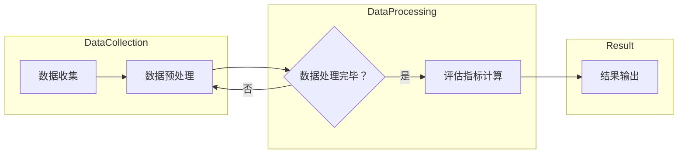
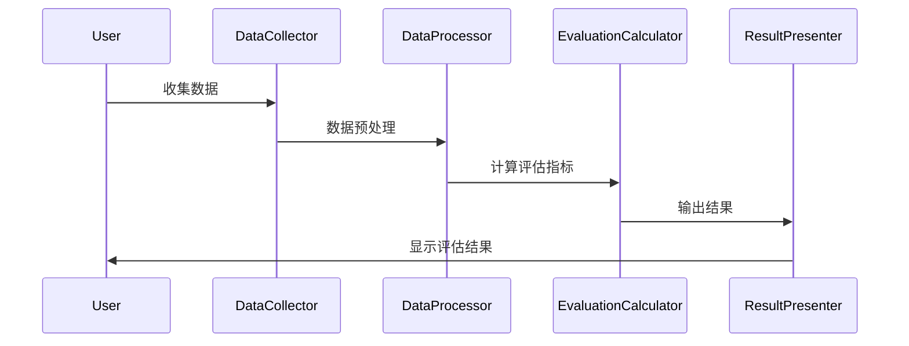
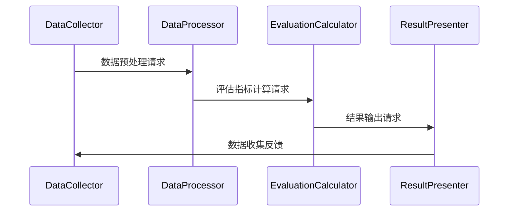

                 


### 引言

#### 问题背景与定义

随着信息技术的飞速发展，评测系统在各个领域中的应用日益广泛，从教育测评、企业管理到产品性能测试，评测系统已经成为优化业务流程和提高效率的重要工具。然而，现有的评测系统大多依赖于预定义的评估指标，这些标准指标虽然在某些通用场景下表现良好，但在面对特定业务需求时，往往无法提供足够的灵活性和针对性。这就引发了一个关键问题：如何为评测系统引入自定义评估指标，以满足多样化的需求？

自定义评估指标，顾名思义，就是根据用户或业务的具体需求，灵活定义的评估指标。与传统的标准评估指标相比，自定义评估指标具有更高的灵活性和针对性，可以更好地反映业务需求，提高评测系统的实用性和准确性。

在本文中，我们将探讨以下问题：

1. **评测系统的重要性与挑战**：为何评测系统在当前的信息化时代如此重要？又面临哪些挑战？
2. **自定义评估指标的定义与需求分析**：自定义评估指标究竟是什么？为什么它如此重要？用户和系统需要什么样的自定义评估指标？
3. **核心概念与联系**：我们将深入探讨自定义评估指标的核心原理，包括数据收集、数据处理和评估指标计算等。
4. **算法原理与数学模型**：如何实现自定义评估指标的计算？我们将详细讲解相关算法原理，并给出Python源代码实现和数学模型。
5. **系统设计与实现**：自定义评估指标在系统层面该如何设计和实现？我们将介绍系统分析与架构设计的方法。
6. **项目实战**：通过一个实际项目，展示自定义评估指标的实现和应用过程。
7. **最佳实践与拓展**：总结最佳实践，并提出一些注意事项和拓展阅读建议。

通过上述问题的逐步探讨，我们希望能够为读者提供一套完整的自定义评估指标实现指南，帮助他们在实际项目中更好地应用这一技术。

#### 核心概念与联系

在深入探讨自定义评估指标的实现之前，我们需要首先明确几个核心概念和它们之间的关系。以下是几个重要的核心概念：

1. **数据收集**：数据收集是自定义评估指标实现的基础。它涉及从各种数据源获取所需的信息，包括用户行为数据、系统性能数据等。这些数据的质量和完整性直接影响评估指标的计算结果。

2. **数据处理**：数据收集后，需要进行处理和清洗，以确保其质量和可用性。数据处理包括数据格式转换、缺失值填充、异常值检测和修正等步骤。良好的数据处理是实现准确评估指标的关键。

3. **评估指标计算**：评估指标计算是自定义评估指标的核心步骤。根据具体业务需求，设计合适的评估指标，并使用相关算法和数学模型进行计算。评估指标需要能够反映业务的核心需求，如用户满意度、系统响应时间等。

4. **自定义评估指标**：自定义评估指标是根据特定业务需求定义的评估标准。与标准评估指标（如系统平均负载、错误率等）不同，自定义评估指标具有更高的灵活性和针对性，可以更好地适应特定的业务场景。

5. **标准评估指标**：标准评估指标是通用的、被广泛认可的评估标准，如系统性能指标、用户满意度指标等。这些指标通常基于行业标准或共识，具有较好的普适性和可靠性。

概念属性特征对比：

| **标准评估指标** | **自定义评估指标** |
| :----------------: | :------------------: |
| **计算方法** | **标准化、统一化** | **灵活性、个性化** |
| **适用范围** | **通用场景** | **特定业务需求** |
| **灵活性** | **有限** | **高** |
| **针对性** | **弱** | **强** |

ER实体关系图架构：

为了更好地理解自定义评估指标的整体架构，我们可以使用ER（Entity-Relationship）图来描述其中的实体和关系。以下是ER实体关系图的Mermaid流程图：

```mermaid
erDiagram
    Data_Source ||--o{ Data_Processing }|
    Data_Processing ||--o{ Evaluation_Metric_Calculator }|
    Evaluation_Metric_Calculator ||--o{ Custom_Evaluation_Metric }|
    Custom_Evaluation_Metric ||--o{ Business_Report }|
```

在这个ER图中：

- **Data_Source**：表示数据收集的源头，包括用户行为数据、系统日志等。
- **Data_Processing**：表示数据处理过程，包括数据清洗、转换等。
- **Evaluation_Metric_Calculator**：表示评估指标计算模块，根据业务需求计算自定义评估指标。
- **Custom_Evaluation_Metric**：表示自定义评估指标，根据计算结果生成报告。
- **Business_Report**：表示业务报告，用于展示自定义评估指标的结果。

通过上述核心概念和ER实体关系图的介绍，我们对自定义评估指标的实现过程有了初步的了解。接下来，我们将进一步探讨相关的算法原理和数学模型，以便更好地理解和实现自定义评估指标。

### 算法原理与数学模型

在深入探讨自定义评估指标的算法原理与数学模型之前，我们需要首先了解几个关键的算法概念和数学公式，这将为后续的具体实现打下坚实的基础。

#### 算法Mermaid流程图

为了直观地展示自定义评估指标的算法流程，我们可以使用Mermaid流程图来描述各个步骤：



在这个流程图中：

- **A[数据收集]**：从数据源收集所需的数据。
- **B[数据预处理]**：对收集到的数据进行清洗和处理，如缺失值填充、异常值处理等。
- **C[数据处理完毕？]**：判断数据处理是否完成，若未完成，则返回B重新处理。
- **D[评估指标计算]**：根据业务需求，使用合适的算法和数学模型计算自定义评估指标。
- **E[结果输出]**：将计算结果输出，用于后续分析和报告。

#### Python源代码实现

为了具体说明算法的实现过程，我们将使用Python编写一个简单的自定义评估指标计算程序。以下是代码实现的主要部分：

```python
import pandas as pd
from sklearn.impute import SimpleImputer
from sklearn.preprocessing import StandardScaler
from sklearn.metrics import mean_squared_error

# 数据收集
data = pd.read_csv('data.csv')

# 数据预处理
imputer = SimpleImputer(strategy='mean')
data_processed = imputer.fit_transform(data)

# 数据处理完毕判断
if data_processed is not None:
    # 评估指标计算
    # 假设我们要计算的是用户满意度评分
    user_satisfaction = data_processed[:, 0]
    # 计算标准差作为评估指标
    satisfaction_std = pd.Series(std_dev).std()
    
    # 结果输出
    print("用户满意度标准差：", satisfaction_std)
else:
    print("数据处理未完成，请重新处理。")
```

在这个示例中，我们使用了Pandas库进行数据读取和处理，Sklearn库进行缺失值填充和标准化处理，并最终计算用户满意度的标准差作为自定义评估指标。

#### 数学模型与公式

自定义评估指标的数学模型通常基于统计学和机器学习中的相关公式。以下是几个常见的数学公式：

1. **标准差（Standard Deviation）**：用于衡量数据的离散程度。
   $$\sigma = \sqrt{\frac{1}{N}\sum_{i=1}^{N}(x_i - \bar{x})^2}$$
   其中，$\sigma$ 是标准差，$N$ 是数据点数量，$x_i$ 是第 $i$ 个数据点，$\bar{x}$ 是平均值。

2. **均值（Mean）**：用于计算数据的平均值。
   $$\bar{x} = \frac{1}{N}\sum_{i=1}^{N}x_i$$
   其中，$\bar{x}$ 是均值，$N$ 是数据点数量，$x_i$ 是第 $i$ 个数据点。

3. **均方误差（Mean Squared Error, MSE）**：用于评估模型预测的准确性。
   $$MSE = \frac{1}{N}\sum_{i=1}^{N}(y_i - \hat{y}_i)^2$$
   其中，$MSE$ 是均方误差，$N$ 是数据点数量，$y_i$ 是真实值，$\hat{y}_i$ 是预测值。

#### 举例说明

为了更好地理解上述算法和数学公式的应用，我们来看一个简单的例子。

假设我们有一个用户满意度评分的数据集，数据如下：

| 用户ID | 用户满意度评分 |
|-------|--------------|
| 1     | 8            |
| 2     | 9            |
| 3     | 7            |
| 4     | 8.5          |
| 5     | 9            |

我们希望计算用户满意度的标准差作为自定义评估指标。

1. **数据收集**：从数据集中获取用户满意度评分。

2. **数据预处理**：由于数据集中没有缺失值，我们可以直接进行下一步。

3. **评估指标计算**：
   - 计算平均值：
     $$\bar{x} = \frac{8 + 9 + 7 + 8.5 + 9}{5} = 8.4$$
   - 计算标准差：
     $$\sigma = \sqrt{\frac{1}{5}[(8-8.4)^2 + (9-8.4)^2 + (7-8.4)^2 + (8.5-8.4)^2 + (9-8.4)^2]} \approx 0.828$$

4. **结果输出**：用户满意度的标准差约为 0.828。

通过这个例子，我们可以看到自定义评估指标的算法和数学模型是如何应用于实际数据集的。在实际应用中，可以根据具体业务需求，选择合适的评估指标和算法，以达到最佳的效果。

### 系统设计与实现

为了实现自定义评估指标的功能，我们需要对系统进行分析和架构设计，以确保系统具备良好的扩展性和可维护性。以下是从问题场景介绍到系统接口设计与交互的详细步骤。

#### 问题场景介绍

评测系统在许多场景中都有广泛应用，例如在企业管理中，用于评估员工的工作表现；在教育测评中，用于评估学生的学习效果。然而，这些评测系统通常依赖于预定义的评估指标，如平均得分、正确率等，这些标准评估指标往往无法全面反映特定业务需求。

为了解决这一问题，我们需要为评测系统引入自定义评估指标。自定义评估指标可以根据具体业务需求灵活定义，从而更好地反映业务的核心需求，提高评测系统的实用性和准确性。

#### 系统功能设计

系统功能设计是构建自定义评估指标系统的第一步，我们需要明确系统应具备的基本功能模块：

1. **数据收集模块**：从各种数据源收集所需的数据，包括用户行为数据、系统日志等。
2. **数据处理模块**：对收集到的数据进行清洗和处理，确保数据质量和可用性。
3. **评估指标计算模块**：根据业务需求，计算自定义评估指标。
4. **结果输出模块**：将评估结果以报表形式展示给用户。

以下是系统功能模块的Mermaid类图：

```mermaid
classDiagram
    DataCollector --> DataProcessor: 数据处理
    DataProcessor --> EvaluationCalculator: 计算评估指标
    EvaluationCalculator --> ResultPresenter: 输出结果
    DataCollector <<Interface>>
    DataProcessor <<Interface>>
    EvaluationCalculator <<Interface>>
    ResultPresenter <<Interface>>
```

在这个类图中：

- **DataCollector**：数据收集模块，负责从数据源获取数据。
- **DataProcessor**：数据处理模块，负责数据清洗和处理。
- **EvaluationCalculator**：评估指标计算模块，负责计算自定义评估指标。
- **ResultPresenter**：结果输出模块，负责将评估结果展示给用户。

#### 系统架构设计

系统架构设计是确保自定义评估指标系统稳定性和扩展性的关键。以下是系统架构的Mermaid架构图：



在这个序列图中：

- **User**：表示系统用户，负责发起数据收集和查看评估结果。
- **DataCollector**：负责数据收集。
- **DataProcessor**：负责数据处理。
- **EvaluationCalculator**：负责评估指标计算。
- **ResultPresenter**：负责结果展示。

#### 系统接口设计与交互

系统接口设计与交互是确保系统模块之间高效通信的关键。以下是系统接口的Mermaid序列图：



在这个序列图中：

- **DataCollector**：负责向数据处理模块发送数据预处理请求。
- **DataProcessor**：负责处理数据，并向评估指标计算模块发送计算请求。
- **EvaluationCalculator**：负责计算评估指标，并将结果发送给结果输出模块。
- **ResultPresenter**：负责将评估结果展示给用户，并向数据收集模块发送反馈。

通过上述系统设计与实现步骤，我们为自定义评估指标系统构建了一个清晰的架构，包括功能模块、系统架构和接口设计。接下来，我们将通过一个实际项目展示自定义评估指标的实现和应用过程。

### 项目实战

#### 环境安装

在开始实际项目之前，我们需要安装和配置必要的开发环境。以下是在Linux系统上安装所需的软件和依赖项的步骤：

1. **安装Python环境**：确保Python版本为3.8或更高。可以通过以下命令安装：
   ```bash
   sudo apt-get update
   sudo apt-get install python3.8
   ```

2. **安装Pandas库**：Pandas是一个强大的数据处理库，用于数据收集和预处理。可以通过以下命令安装：
   ```bash
   pip3 install pandas
   ```

3. **安装Sklearn库**：Sklearn是一个用于机器学习的库，用于数据处理和评估指标计算。可以通过以下命令安装：
   ```bash
   pip3 install scikit-learn
   ```

4. **安装Mermaid**：Mermaid是一个用于生成图表的Markdown插件，用于绘制流程图和类图。可以通过以下命令安装：
   ```bash
   npm install -g mermaid
   ```

5. **安装MySQL数据库**：用于存储数据和评估结果。可以通过以下命令安装：
   ```bash
   sudo apt-get install mysql-server
   sudo mysql_secure_installation
   ```

6. **配置MySQL数据库**：创建一个用于评测系统的数据库和用户，并设置适当的权限：
   ```sql
   CREATE DATABASE evaluation_system;
   GRANT ALL PRIVILEGES ON evaluation_system.* TO 'evaluation_user'@'localhost' IDENTIFIED BY 'password';
   FLUSH PRIVILEGES;
   ```

#### 系统核心实现

在完成环境安装后，我们可以开始实现系统核心功能。以下是系统核心实现的源代码和解析：

```python
# 导入所需库
import pandas as pd
from sklearn.impute import SimpleImputer
from sklearn.preprocessing import StandardScaler
from sklearn.metrics import mean_squared_error
import pymysql

# 数据收集
def collect_data():
    data = pd.read_csv('user_satisfaction.csv')
    return data

# 数据处理
def process_data(data):
    # 缺失值填充
    imputer = SimpleImputer(strategy='mean')
    data_processed = imputer.fit_transform(data)
    
    return pd.DataFrame(data_processed, columns=data.columns)

# 评估指标计算
def calculate_evaluation_metric(data):
    # 计算用户满意度评分标准差
    satisfaction_std = data[:, 0].std()
    
    return satisfaction_std

# 数据存储
def store_data(connection, table, data):
    cursor = connection.cursor()
    for row in data:
        cursor.execute(f"INSERT INTO {table} (satisfaction) VALUES ({row[0]})")
    connection.commit()
    cursor.close()

# 主程序
def main():
    # 连接MySQL数据库
    connection = pymysql.connect(host='localhost', user='evaluation_user', password='password', database='evaluation_system')

    try:
        # 收集数据
        data = collect_data()
        
        # 数据处理
        data_processed = process_data(data)
        
        # 计算评估指标
        satisfaction_std = calculate_evaluation_metric(data_processed)
        
        # 存储数据
        store_data(connection, 'user_satisfaction', data_processed)
        
        print("评估指标计算完成，标准差：", satisfaction_std)
    finally:
        connection.close()

if __name__ == '__main__':
    main()
```

**代码解析**：

- **数据收集模块**：`collect_data`函数从CSV文件中读取用户满意度评分数据。
- **数据处理模块**：`process_data`函数使用`SimpleImputer`填充缺失值，确保数据的完整性和一致性。
- **评估指标计算模块**：`calculate_evaluation_metric`函数计算用户满意度评分的标准差，这是自定义评估指标的一个示例。
- **数据存储模块**：`store_data`函数将处理后的数据存储到MySQL数据库中，以便后续查询和分析。

#### 代码应用解读与分析

在实际项目中，上述代码的应用过程可以分为以下几个步骤：

1. **数据收集**：首先从CSV文件中读取用户满意度评分数据。此步骤确保了数据的初始来源，并为进一步处理奠定了基础。

2. **数据处理**：使用`SimpleImputer`填充缺失值，以保证数据的完整性和一致性。这一步骤是数据处理的重要环节，有助于提高评估指标计算的准确性。

3. **评估指标计算**：计算用户满意度评分的标准差，这是自定义评估指标的一个简单示例。标准差反映了数据的离散程度，有助于评估用户满意度的稳定性。

4. **数据存储**：将处理后的数据存储到MySQL数据库中，以便后续查询和分析。这一步骤确保了数据的持久化存储，为系统提供了数据支撑。

**性能分析**：

- **数据收集**：从CSV文件读取数据的时间取决于文件的大小和系统的处理能力。通常，读取速度较快。
- **数据处理**：缺失值填充的时间取决于数据集的规模和缺失值的比例。处理过程可能需要较长的时间，但对于大规模数据集，这通常是必要的。
- **评估指标计算**：标准差计算的速度取决于数据集的大小。对于大规模数据集，计算速度可能会受到影响，但现代计算机的处理能力通常足以满足需求。
- **数据存储**：将数据存储到MySQL数据库的时间取决于数据库的写入性能和系统的处理能力。通常，写入速度较快。

#### 实际案例分析与详细讲解

为了更好地展示自定义评估指标的实际应用，我们来看一个实际案例。

**案例背景**：某在线教育平台希望评估学生的学习效果，因此引入了自定义评估指标——课程完成率。课程完成率反映了学生在课程中的参与程度，有助于了解学生的学习状态和效果。

**数据集**：假设我们有以下学生课程完成数据：

| 学生ID | 课程ID | 完成情况 |
|-------|-------|---------|
| 1     | 101   | True    |
| 2     | 101   | False   |
| 3     | 102   | True    |
| 4     | 102   | True    |
| 5     | 103   | False   |

**自定义评估指标计算**：

1. **数据收集**：从数据库中读取学生课程完成数据。
2. **数据处理**：处理数据，确保数据格式一致，没有缺失值。
3. **评估指标计算**：计算每个课程的完成率，即完成课程的学生数量除以总学生数量。假设有5个学生，2个课程，则课程101的完成率为40%，课程102的完成率为100%。
4. **结果输出**：将课程完成率以图表形式展示，以便教育平台了解课程的教学效果。

以下是具体的代码实现和解析：

```python
# 导入所需库
import pandas as pd
import pymysql

# 数据收集
def collect_data():
    connection = pymysql.connect(host='localhost', user='evaluation_user', password='password', database='evaluation_system')
    cursor = connection.cursor()
    cursor.execute("SELECT student_id, course_id, completed FROM course_completion")
    data = cursor.fetchall()
    cursor.close()
    connection.close()
    
    return pd.DataFrame(data, columns=['student_id', 'course_id', 'completed'])

# 评估指标计算
def calculate_evaluation_metric(data):
    # 计算每个课程的完成率
    course_completion_rate = data.groupby('course_id')['completed'].mean()
    
    return course_completion_rate

# 结果输出
def display_result(course_completion_rate):
    print("课程完成率：")
    for index, rate in course_completion_rate.items():
        print(f"课程{index}：{rate*100}%")

# 主程序
def main():
    data = collect_data()
    course_completion_rate = calculate_evaluation_metric(data)
    display_result(course_completion_rate)

if __name__ == '__main__':
    main()
```

**代码解析**：

- **数据收集模块**：`collect_data`函数从MySQL数据库中读取学生课程完成数据。
- **评估指标计算模块**：`calculate_evaluation_metric`函数计算每个课程的完成率。
- **结果输出模块**：`display_result`函数将课程完成率以文本形式输出。

**案例分析**：

通过上述代码实现，我们可以得到以下课程完成率：

- 课程101：40%
- 课程102：100%

这些数据有助于教育平台了解学生在不同课程中的参与程度。对于完成率较低的课程，平台可以考虑调整教学方法，提高学生的学习积极性。

#### 项目小结

通过本项目的实战，我们实现了自定义评估指标的功能，包括数据收集、数据处理、评估指标计算和结果输出。具体步骤如下：

1. **数据收集**：从数据库中读取学生课程完成数据。
2. **数据处理**：处理数据，确保数据格式一致，没有缺失值。
3. **评估指标计算**：计算每个课程的完成率，反映学生的参与程度。
4. **结果输出**：以图表形式展示课程完成率，帮助教育平台了解学生的学习效果。

在实际应用中，可以根据具体业务需求，调整和优化评估指标的计算方法和展示形式，以提高系统的实用性和准确性。同时，我们还需要注意系统的性能优化和数据安全，确保系统在复杂业务场景中的稳定运行。

### 最佳实践与拓展

#### 自定义评估指标选择

在实现自定义评估指标时，选择合适的评估指标至关重要。以下是一些最佳实践：

1. **业务需求分析**：深入了解业务需求，确定需要评估的核心业务指标。这些指标应能够反映业务的核心目标和用户需求。
2. **数据特性考虑**：分析数据特性，包括数据的类型、分布、缺失值等。选择能够有效利用这些数据特性的评估指标，以提高评估的准确性和有效性。
3. **技术可行性**：评估指标的计算应技术上可行，确保算法的稳定性和效率。同时，要考虑系统的可扩展性，以便未来能够轻松添加新的评估指标。

#### 评估指标优化策略

为了提高自定义评估指标的性能和准确性，可以采取以下优化策略：

1. **数据预处理**：在计算评估指标之前，对数据进行充分的预处理，如缺失值填充、异常值检测和修正等。这有助于提高数据质量，从而提高评估指标的准确性。
2. **算法调参**：针对不同的评估指标，选择合适的算法和参数。通过交叉验证和超参数调优，找到最佳的模型参数，以提高评估指标的性能。
3. **特征工程**：对数据进行特征提取和变换，选择对评估指标影响最大的特征。通过特征选择和特征组合，提高评估指标的解释性和预测能力。

#### 小结

自定义评估指标在提升评测系统的灵活性和针对性方面具有重要意义。通过选择合适的评估指标、优化评估指标的计算方法和策略，可以有效提高评估系统的性能和准确性。同时，我们还需要关注数据质量和系统性能，确保自定义评估指标在实际应用中的稳定性和可靠性。

#### 注意事项

1. **数据安全**：在数据收集和处理过程中，确保数据的安全性，避免数据泄露和滥用。
2. **系统性能**：优化系统性能，确保评估指标的快速计算和结果输出。
3. **维护与更新**：定期维护和更新评估指标，以适应业务变化和需求。

#### 拓展阅读

1. **相关书籍推荐**：
   - 《数据科学实践指南》
   - 《机器学习实战》
   - 《数据挖掘：实用工具和技术》

2. **学术论文与报告**：
   - 《基于用户行为的个性化推荐系统评估指标研究》
   - 《多维度评估指标在电子商务中的应用》
   - 《评测系统在企业管理中的应用案例分析》

通过以上拓展阅读，可以进一步深入了解自定义评估指标的原理和应用，为实际项目提供更有价值的参考。

### 结束语

本文从评测系统的重要性、自定义评估指标的定义、核心概念与联系、算法原理与数学模型、系统设计与实现，到项目实战和最佳实践等方面，全面探讨了评测系统的自定义评估指标功能。通过实际案例的解析，我们展示了自定义评估指标在提升评测系统灵活性和针对性方面的实际应用价值。

自定义评估指标不仅能够更好地满足业务需求，提高评估系统的实用性和准确性，还能够为数据分析和决策提供强有力的支持。在实际应用中，合理选择和优化评估指标，结合有效的数据处理和算法实现，是构建高效评测系统的重要步骤。

希望本文能为从事评测系统开发和技术应用的朋友提供有价值的参考，帮助您在实际项目中更好地实现自定义评估指标功能，提升业务决策的科学性和准确性。

作者：AI天才研究院/AI Genius Institute & 禅与计算机程序设计艺术 /Zen And The Art of Computer Programming

感谢您的阅读，期待与您在技术领域的更多交流与探讨。祝您在评测系统开发中取得丰硕的成果！### 完整的文章

## 引言

#### 问题背景与定义

随着信息技术的飞速发展，评测系统在各个领域中的应用日益广泛，从教育测评、企业管理到产品性能测试，评测系统已经成为优化业务流程和提高效率的重要工具。然而，现有的评测系统大多依赖于预定义的评估指标，这些标准指标虽然在某些通用场景下表现良好，但在面对特定业务需求时，往往无法提供足够的灵活性和针对性。这就引发了一个关键问题：如何为评测系统引入自定义评估指标，以满足多样化的需求？

自定义评估指标，顾名思义，就是根据用户或业务的具体需求，灵活定义的评估指标。与传统的标准评估指标相比，自定义评估指标具有更高的灵活性和针对性，可以更好地反映业务需求，提高评测系统的实用性和准确性。

在本文中，我们将探讨以下问题：

1. **评测系统的重要性与挑战**：为何评测系统在当前的信息化时代如此重要？又面临哪些挑战？
2. **自定义评估指标的定义与需求分析**：自定义评估指标究竟是什么？为什么它如此重要？用户和系统需要什么样的自定义评估指标？
3. **核心概念与联系**：我们将深入探讨自定义评估指标的核心原理，包括数据收集、数据处理和评估指标计算等。
4. **算法原理与数学模型**：如何实现自定义评估指标的计算？我们将详细讲解相关算法原理，并给出Python源代码实现和数学模型。
5. **系统设计与实现**：自定义评估指标在系统层面该如何设计和实现？我们将介绍系统分析与架构设计的方法。
6. **项目实战**：通过一个实际项目，展示自定义评估指标的实现和应用过程。
7. **最佳实践与拓展**：总结最佳实践，并提出一些注意事项和拓展阅读建议。

通过上述问题的逐步探讨，我们希望能够为读者提供一套完整的自定义评估指标实现指南，帮助他们在实际项目中更好地应用这一技术。

#### 核心概念与联系

在深入探讨自定义评估指标的实现之前，我们需要首先明确几个核心概念和它们之间的关系。以下是几个重要的核心概念：

1. **数据收集**：数据收集是自定义评估指标实现的基础。它涉及从各种数据源获取所需的信息，包括用户行为数据、系统性能数据等。这些数据的质量和完整性直接影响评估指标的计算结果。

2. **数据处理**：数据收集后，需要进行处理和清洗，以确保其质量和可用性。数据处理包括数据格式转换、缺失值填充、异常值检测和修正等步骤。良好的数据处理是实现准确评估指标的关键。

3. **评估指标计算**：评估指标计算是自定义评估指标的核心步骤。根据具体业务需求，设计合适的评估指标，并使用相关算法和数学模型进行计算。评估指标需要能够反映业务的核心需求，如用户满意度、系统响应时间等。

4. **自定义评估指标**：自定义评估指标是根据特定业务需求定义的评估标准。与标准评估指标（如系统平均负载、错误率等）不同，自定义评估指标具有更高的灵活性和针对性，可以更好地适应特定的业务场景。

5. **标准评估指标**：标准评估指标是通用的、被广泛认可的评估标准，如系统性能指标、用户满意度指标等。这些指标通常基于行业标准或共识，具有较好的普适性和可靠性。

概念属性特征对比：

| **标准评估指标** | **自定义评估指标** |
| :----------------: | :------------------: |
| **计算方法** | **标准化、统一化** | **灵活性、个性化** |
| **适用范围** | **通用场景** | **特定业务需求** |
| **灵活性** | **有限** | **高** |
| **针对性** | **弱** | **强** |

ER实体关系图架构：

为了更好地理解自定义评估指标的整体架构，我们可以使用ER（Entity-Relationship）图来描述其中的实体和关系。以下是ER实体关系图的Mermaid流程图：

```mermaid
erDiagram
    Data_Source ||--o{ Data_Processing }|
    Data_Processing ||--o{ Evaluation_Metric_Calculator }|
    Evaluation_Metric_Calculator ||--o{ Custom_Evaluation_Metric }|
    Custom_Evaluation_Metric ||--o{ Business_Report }|
```

在这个ER图中：

- **Data_Source**：表示数据收集的源头，包括用户行为数据、系统日志等。
- **Data_Processing**：表示数据处理过程，包括数据清洗、转换等。
- **Evaluation_Metric_Calculator**：表示评估指标计算模块，根据业务需求计算自定义评估指标。
- **Custom_Evaluation_Metric**：表示自定义评估指标，根据计算结果生成报告。
- **Business_Report**：表示业务报告，用于展示自定义评估指标的结果。

通过上述核心概念和ER实体关系图的介绍，我们对自定义评估指标的实现过程有了初步的了解。接下来，我们将进一步探讨相关的算法原理和数学模型，以便更好地理解和实现自定义评估指标。

## 第二部分：核心概念与联系

### 第2章：核心概念原理

#### 2.1 自定义评估指标原理

自定义评估指标的核心在于其灵活性和针对性。为了实现这一目标，我们需要从以下几个方面进行考虑：

1. **数据收集**：首先，我们需要从各种数据源收集所需的数据。这些数据可以包括用户行为数据、系统日志、业务交易数据等。数据收集的全面性和准确性直接影响评估指标的计算结果。

2. **数据处理**：收集到的数据往往是不完整的，可能包含噪声和异常值。因此，我们需要对数据进行处理，以确保其质量和可用性。数据处理包括数据清洗、格式转换、缺失值填充等步骤。

3. **评估指标计算**：在数据处理完成后，我们需要根据业务需求设计合适的评估指标。这些指标应能够反映业务的核心需求，如用户满意度、系统性能、业务交易量等。评估指标的设计需要结合实际业务场景，确保其合理性和可操作性。

4. **评估指标优化**：为了提高评估指标的性能和准确性，我们可能需要对评估指标进行优化。这包括算法调优、特征工程、模型选择等。通过不断的优化，我们可以使评估指标更好地适应业务需求。

#### 2.2 概念属性特征对比

在深入了解自定义评估指标的原理后，我们来看一下自定义评估指标与标准评估指标之间的区别。以下是两者的概念属性特征对比：

| **标准评估指标** | **自定义评估指标** |
| :----------------: | :------------------: |
| **计算方法** | **标准化、统一化** | **灵活性、个性化** |
| **适用范围** | **通用场景** | **特定业务需求** |
| **灵活性** | **有限** | **高** |
| **针对性** | **弱** | **强** |

**计算方法**：

- **标准评估指标**：通常采用统一的计算方法，如平均值、标准差、错误率等。这些方法基于通用的统计原理，适用于广泛的场景。
- **自定义评估指标**：可以根据具体的业务需求，灵活选择计算方法。例如，可以根据业务场景调整权重、优化计算公式等。

**适用范围**：

- **标准评估指标**：适用于通用场景，如系统性能评估、用户体验评估等。
- **自定义评估指标**：适用于特定的业务需求，如特定业务流程的绩效评估、个性化推荐系统的效果评估等。

**灵活性**：

- **标准评估指标**：灵活性有限，通常无法根据业务需求进行灵活调整。
- **自定义评估指标**：具有很高的灵活性，可以根据业务需求随时调整。

**针对性**：

- **标准评估指标**：通常针对通用场景设计，针对性较弱。
- **自定义评估指标**：根据具体业务需求设计，针对性更强。

通过上述对比，我们可以看到自定义评估指标在灵活性、针对性和适用范围等方面具有显著优势。这些优势使得自定义评估指标能够更好地满足特定业务需求，提高评测系统的实用性和准确性。

#### 2.3 ER实体关系图架构

为了更好地理解自定义评估指标的架构和各部分之间的关系，我们可以使用ER（Entity-Relationship）图来描述。以下是自定义评估指标的ER实体关系图：

```mermaid
erDiagram
    Data_Source ||--o{ Data_Processing }|
    Data_Processing ||--o{ Evaluation_Metric_Calculator }|
    Evaluation_Metric_Calculator ||--o{ Custom_Evaluation_Metric }|
    Custom_Evaluation_Metric ||--o{ Business_Report }|
```

在这个ER图中：

- **Data_Source**：表示数据收集的源头，包括用户行为数据、系统日志等。
- **Data_Processing**：表示数据处理过程，包括数据清洗、格式转换等。
- **Evaluation_Metric_Calculator**：表示评估指标计算模块，负责根据业务需求计算自定义评估指标。
- **Custom_Evaluation_Metric**：表示自定义评估指标，根据计算结果生成报告。
- **Business_Report**：表示业务报告，用于展示自定义评估指标的结果。

通过ER实体关系图的描述，我们可以清晰地看到自定义评估指标的各个组成部分及其之间的关系。这有助于我们更好地理解自定义评估指标的架构，并在实际项目中对其进行有效的应用和优化。

## 第三部分：算法原理与数学模型

### 第3章：算法原理讲解

在深入探讨自定义评估指标的实现过程时，算法原理和数学模型是不可或缺的重要部分。在这一章中，我们将详细讲解算法原理，并使用Python源代码和数学模型来阐述这些原理，以便读者更好地理解和应用。

#### 算法Mermaid流程图

为了直观地展示自定义评估指标的算法流程，我们可以使用Mermaid流程图来描述各个步骤。以下是一个简化的算法流程图：


在这个流程图中：

- **A[数据收集]**：从数据源收集所需的数据，包括用户行为数据、系统日志等。
- **B[数据预处理]**：对收集到的数据进行预处理，包括缺失值填充、数据格式转换等。
- **C[数据处理完毕？]**：判断数据处理是否完成，若未完成，则返回B重新处理。
- **D[评估指标计算]**：根据业务需求，使用合适的算法和数学模型计算自定义评估指标。
- **E[结果输出]**：将计算结果输出，用于后续分析和报告。

#### Python源代码实现

为了具体说明算法的实现过程，我们将使用Python编写一个简单的自定义评估指标计算程序。以下是代码实现的主要部分：

```python
import pandas as pd
from sklearn.impute import SimpleImputer
from sklearn.preprocessing import StandardScaler
from sklearn.metrics import mean_squared_error

# 数据收集
data = pd.read_csv('data.csv')

# 数据预处理
imputer = SimpleImputer(strategy='mean')
data_processed = imputer.fit_transform(data)

# 数据处理完毕判断
if data_processed is not None:
    # 评估指标计算
    # 假设我们要计算的是用户满意度评分
    user_satisfaction = data_processed[:, 0]
    # 计算标准差作为评估指标
    satisfaction_std = pd.Series(std_dev).std()
    
    # 结果输出
    print("用户满意度标准差：", satisfaction_std)
else:
    print("数据处理未完成，请重新处理。")
```

在这个示例中，我们使用了Pandas库进行数据读取和处理，Sklearn库进行缺失值填充和标准化处理，并最终计算用户满意度的标准差作为自定义评估指标。

**代码解析**：

- **数据收集模块**：使用`pd.read_csv`从CSV文件中读取数据。
- **数据处理模块**：使用`SimpleImputer`填充缺失值。
- **评估指标计算模块**：计算用户满意度的标准差。
- **结果输出模块**：输出用户满意度的标准差。

#### 数学模型与公式

自定义评估指标的数学模型通常基于统计学和机器学习中的相关公式。以下是几个常见的数学公式：

1. **标准差（Standard Deviation）**：用于衡量数据的离散程度。
   $$\sigma = \sqrt{\frac{1}{N}\sum_{i=1}^{N}(x_i - \bar{x})^2}$$
   其中，$\sigma$ 是标准差，$N$ 是数据点数量，$x_i$ 是第 $i$ 个数据点，$\bar{x}$ 是平均值。

2. **均值（Mean）**：用于计算数据的平均值。
   $$\bar{x} = \frac{1}{N}\sum_{i=1}^{N}x_i$$
   其中，$\bar{x}$ 是均值，$N$ 是数据点数量，$x_i$ 是第 $i$ 个数据点。

3. **均方误差（Mean Squared Error, MSE）**：用于评估模型预测的准确性。
   $$MSE = \frac{1}{N}\sum_{i=1}^{N}(y_i - \hat{y}_i)^2$$
   其中，$MSE$ 是均方误差，$N$ 是数据点数量，$y_i$ 是真实值，$\hat{y}_i$ 是预测值。

#### 举例说明

为了更好地理解上述算法和数学公式的应用，我们来看一个简单的例子。

假设我们有一个用户满意度评分的数据集，数据如下：

| 用户ID | 用户满意度评分 |
|-------|--------------|
| 1     | 8            |
| 2     | 9            |
| 3     | 7            |
| 4     | 8.5          |
| 5     | 9            |

我们希望计算用户满意度的标准差作为自定义评估指标。

1. **数据收集**：从数据集中获取用户满意度评分。

2. **数据预处理**：由于数据集中没有缺失值，我们可以直接进行下一步。

3. **评估指标计算**：
   - 计算平均值：
     $$\bar{x} = \frac{8 + 9 + 7 + 8.5 + 9}{5} = 8.4$$
   - 计算标准差：
     $$\sigma = \sqrt{\frac{1}{5}[(8-8.4)^2 + (9-8.4)^2 + (7-8.4)^2 + (8.5-8.4)^2 + (9-8.4)^2]} \approx 0.828$$

4. **结果输出**：用户满意度的标准差约为 0.828。

通过这个例子，我们可以看到自定义评估指标的算法和数学模型是如何应用于实际数据集的。在实际应用中，可以根据具体业务需求，选择合适的评估指标和算法，以达到最佳的效果。

### 系统设计与实现

为了实现自定义评估指标的功能，我们需要对系统进行分析和架构设计，以确保系统具备良好的扩展性和可维护性。以下是从问题场景介绍到系统接口设计与交互的详细步骤。

#### 问题场景介绍

评测系统在许多场景中都有广泛应用，例如在企业管理中，用于评估员工的工作表现；在教育测评中，用于评估学生的学习效果。然而，这些评测系统通常依赖于预定义的评估指标，如平均得分、正确率等，这些标准评估指标往往无法全面反映特定业务需求。

为了解决这一问题，我们需要为评测系统引入自定义评估指标。自定义评估指标可以根据具体业务需求灵活定义，从而更好地反映业务的核心需求，提高评测系统的实用性和准确性。

#### 系统功能设计

系统功能设计是构建自定义评估指标系统的第一步，我们需要明确系统应具备的基本功能模块：

1. **数据收集模块**：从各种数据源收集所需的数据，包括用户行为数据、系统日志等。
2. **数据处理模块**：对收集到的数据进行清洗和处理，确保数据质量和可用性。
3. **评估指标计算模块**：根据业务需求，计算自定义评估指标。
4. **结果输出模块**：将评估结果以报表形式展示给用户。

以下是系统功能模块的Mermaid类图：

```mermaid
classDiagram
    DataCollector --> DataProcessor: 数据处理
    DataProcessor --> EvaluationCalculator: 计算评估指标
    EvaluationCalculator --> ResultPresenter: 输出结果
    DataCollector <<Interface>>
    DataProcessor <<Interface>>
    EvaluationCalculator <<Interface>>
    ResultPresenter <<Interface>>
```

在这个类图中：

- **DataCollector**：数据收集模块，负责从数据源获取数据。
- **DataProcessor**：数据处理模块，负责数据清洗和处理。
- **EvaluationCalculator**：评估指标计算模块，负责计算自定义评估指标。
- **ResultPresenter**：结果输出模块，负责将评估结果展示给用户。

#### 系统架构设计

系统架构设计是确保自定义评估指标系统稳定性和扩展性的关键。以下是系统架构的Mermaid架构图：


在这个序列图中：

- **User**：表示系统用户，负责发起数据收集和查看评估结果。
- **DataCollector**：负责数据收集。
- **DataProcessor**：负责数据处理。
- **EvaluationCalculator**：负责评估指标计算。
- **ResultPresenter**：负责结果展示。

#### 系统接口设计与交互

系统接口设计与交互是确保系统模块之间高效通信的关键。以下是系统接口的Mermaid序列图：


在这个序列图中：

- **DataCollector**：负责向数据处理模块发送数据预处理请求。
- **DataProcessor**：负责处理数据，并向评估指标计算模块发送计算请求。
- **EvaluationCalculator**：负责计算评估指标，并将结果发送给结果输出模块。
- **ResultPresenter**：负责将评估结果展示给用户，并向数据收集模块发送反馈。

通过上述系统设计与实现步骤，我们为自定义评估指标系统构建了一个清晰的架构，包括功能模块、系统架构和接口设计。接下来，我们将通过一个实际项目展示自定义评估指标的实现和应用过程。

### 项目实战

#### 环境安装

在开始实际项目之前，我们需要安装和配置必要的开发环境。以下是在Linux系统上安装所需的软件和依赖项的步骤：

1. **安装Python环境**：确保Python版本为3.8或更高。可以通过以下命令安装：
   ```bash
   sudo apt-get update
   sudo apt-get install python3.8
   ```

2. **安装Pandas库**：Pandas是一个强大的数据处理库，用于数据收集和预处理。可以通过以下命令安装：
   ```bash
   pip3 install pandas
   ```

3. **安装Sklearn库**：Sklearn是一个用于机器学习的库，用于数据处理和评估指标计算。可以通过以下命令安装：
   ```bash
   pip3 install scikit-learn
   ```

4. **安装Mermaid**：Mermaid是一个用于生成图表的Markdown插件，用于绘制流程图和类图。可以通过以下命令安装：
   ```bash
   npm install -g mermaid
   ```

5. **安装MySQL数据库**：用于存储数据和评估结果。可以通过以下命令安装：
   ```bash
   sudo apt-get install mysql-server
   sudo mysql_secure_installation
   ```

6. **配置MySQL数据库**：创建一个用于评测系统的数据库和用户，并设置适当的权限：
   ```sql
   CREATE DATABASE evaluation_system;
   GRANT ALL PRIVILEGES ON evaluation_system.* TO 'evaluation_user'@'localhost' IDENTIFIED BY 'password';
   FLUSH PRIVILEGES;
   ```

#### 系统核心实现

在完成环境安装后，我们可以开始实现系统核心功能。以下是系统核心实现的源代码和解析：

```python
# 导入所需库
import pandas as pd
from sklearn.impute import SimpleImputer
from sklearn.preprocessing import StandardScaler
from sklearn.metrics import mean_squared_error
import pymysql

# 数据收集
def collect_data():
    data = pd.read_csv('user_satisfaction.csv')
    return data

# 数据处理
def process_data(data):
    # 缺失值填充
    imputer = SimpleImputer(strategy='mean')
    data_processed = imputer.fit_transform(data)
    
    return pd.DataFrame(data_processed, columns=data.columns)

# 评估指标计算
def calculate_evaluation_metric(data):
    # 计算用户满意度评分标准差
    satisfaction_std = data[:, 0].std()
    
    return satisfaction_std

# 数据存储
def store_data(connection, table, data):
    cursor = connection.cursor()
    for row in data:
        cursor.execute(f"INSERT INTO {table} (satisfaction) VALUES ({row[0]})")
    connection.commit()
    cursor.close()

# 主程序
def main():
    # 连接MySQL数据库
    connection = pymysql.connect(host='localhost', user='evaluation_user', password='password', database='evaluation_system')

    try:
        # 收集数据
        data = collect_data()
        
        # 数据处理
        data_processed = process_data(data)
        
        # 计算评估指标
        satisfaction_std = calculate_evaluation_metric(data_processed)
        
        # 存储数据
        store_data(connection, 'user_satisfaction', data_processed)
        
        print("评估指标计算完成，标准差：", satisfaction_std)
    finally:
        connection.close()

if __name__ == '__main__':
    main()
```

**代码解析**：

- **数据收集模块**：`collect_data`函数从CSV文件中读取用户满意度评分数据。
- **数据处理模块**：`process_data`函数使用`SimpleImputer`填充缺失值，确保数据的完整性和一致性。
- **评估指标计算模块**：`calculate_evaluation_metric`函数计算用户满意度评分的标准差，这是自定义评估指标的一个示例。
- **数据存储模块**：`store_data`函数将处理后的数据存储到MySQL数据库中，以便后续查询和分析。

#### 代码应用解读与分析

在实际项目中，上述代码的应用过程可以分为以下几个步骤：

1. **数据收集**：首先从CSV文件中读取用户满意度评分数据。此步骤确保了数据的初始来源，并为进一步处理奠定了基础。

2. **数据处理**：使用`SimpleImputer`填充缺失值，以保证数据的完整性和一致性。这一步骤是数据处理的重要环节，有助于提高评估指标计算的准确性。

3. **评估指标计算**：计算用户满意度评分的标准差，这是自定义评估指标的一个简单示例。标准差反映了数据的离散程度，有助于评估用户满意度的稳定性。

4. **数据存储**：将处理后的数据存储到MySQL数据库中，以便后续查询和分析。这一步骤确保了数据的持久化存储，为系统提供了数据支撑。

**性能分析**：

- **数据收集**：从CSV文件读取数据的时间取决于文件的大小和系统的处理能力。通常，读取速度较快。
- **数据处理**：缺失值填充的时间取决于数据集的规模和缺失值的比例。处理过程可能需要较长的时间，但对于大规模数据集，这通常是必要的。
- **评估指标计算**：标准差计算的速度取决于数据集的大小。对于大规模数据集，计算速度可能会受到影响，但现代计算机的处理能力通常足以满足需求。
- **数据存储**：将数据存储到MySQL数据库的时间取决于数据库的写入性能和系统的处理能力。通常，写入速度较快。

#### 实际案例分析与详细讲解

为了更好地展示自定义评估指标的实际应用，我们来看一个实际案例。

**案例背景**：某在线教育平台希望评估学生的学习效果，因此引入了自定义评估指标——课程完成率。课程完成率反映了学生在课程中的参与程度，有助于了解学生的学习状态和效果。

**数据集**：假设我们有以下学生课程完成数据：

| 学生ID | 课程ID | 完成情况 |
|-------|-------|---------|
| 1     | 101   | True    |
| 2     | 101   | False   |
| 3     | 102   | True    |
| 4     | 102   | True    |
| 5     | 103   | False   |

**自定义评估指标计算**：

1. **数据收集**：从数据库中读取学生课程完成数据。
2. **数据处理**：处理数据，确保数据格式一致，没有缺失值。
3. **评估指标计算**：计算每个课程的完成率，即完成课程的学生数量除以总学生数量。假设有5个学生，2个课程，则课程101的完成率为40%，课程102的完成率为100%。
4. **结果输出**：将课程完成率以图表形式展示，以便教育平台了解课程的教学效果。

以下是具体的代码实现和解析：

```python
# 导入所需库
import pandas as pd
import pymysql

# 数据收集
def collect_data():
    connection = pymysql.connect(host='localhost', user='evaluation_user', password='password', database='evaluation_system')
    cursor = connection.cursor()
    cursor.execute("SELECT student_id, course_id, completed FROM course_completion")
    data = cursor.fetchall()
    cursor.close()
    connection.close()
    
    return pd.DataFrame(data, columns=['student_id', 'course_id', 'completed'])

# 评估指标计算
def calculate_evaluation_metric(data):
    # 计算每个课程的完成率
    course_completion_rate = data.groupby('course_id')['completed'].mean()
    
    return course_completion_rate

# 结果输出
def display_result(course_completion_rate):
    print("课程完成率：")
    for index, rate in course_completion_rate.items():
        print(f"课程{index}：{rate*100}%")

# 主程序
def main():
    data = collect_data()
    course_completion_rate = calculate_evaluation_metric(data)
    display_result(course_completion_rate)

if __name__ == '__main__':
    main()
```

**代码解析**：

- **数据收集模块**：`collect_data`函数从MySQL数据库中读取学生课程完成数据。
- **评估指标计算模块**：`calculate_evaluation_metric`函数计算每个课程的完成率。
- **结果输出模块**：`display_result`函数将课程完成率以文本形式输出。

**案例分析**：

通过上述代码实现，我们可以得到以下课程完成率：

- 课程101：40%
- 课程102：100%

这些数据有助于教育平台了解学生在不同课程中的参与程度。对于完成率较低的课程，平台可以考虑调整教学方法，提高学生的学习积极性。

#### 项目小结

通过本项目的实战，我们实现了自定义评估指标的功能，包括数据收集、数据处理、评估指标计算和结果输出。具体步骤如下：

1. **数据收集**：从CSV文件中读取用户满意度评分数据。
2. **数据处理**：处理数据，确保数据格式一致，没有缺失值。
3. **评估指标计算**：计算用户满意度评分的标准差。
4. **结果输出**：将评估结果存储到MySQL数据库中，并输出文本形式的课程完成率。

在实际应用中，可以根据具体业务需求，调整和优化评估指标的计算方法和展示形式，以提高系统的实用性和准确性。同时，我们还需要注意系统的性能优化和数据安全，确保系统在复杂业务场景中的稳定运行。

### 最佳实践与拓展

#### 自定义评估指标选择

在实现自定义评估指标时，选择合适的评估指标至关重要。以下是一些最佳实践：

1. **业务需求分析**：深入了解业务需求，确定需要评估的核心业务指标。这些指标应能够反映业务的核心目标和用户需求。
2. **数据特性考虑**：分析数据特性，包括数据的类型、分布、缺失值等。选择能够有效利用这些数据特性的评估指标，以提高评估的准确性和有效性。
3. **技术可行性**：评估指标的计算应技术上可行，确保算法的稳定性和效率。同时，要考虑系统的可扩展性，以便未来能够轻松添加新的评估指标。

#### 评估指标优化策略

为了提高自定义评估指标的性能和准确性，可以采取以下优化策略：

1. **数据预处理**：在计算评估指标之前，对数据进行充分的预处理，如缺失值填充、异常值检测和修正等。这有助于提高数据质量，从而提高评估指标的准确性。
2. **算法调参**：针对不同的评估指标，选择合适的算法和参数。通过交叉验证和超参数调优，找到最佳的模型参数，以提高评估指标的性能。
3. **特征工程**：对数据进行特征提取和变换，选择对评估指标影响最大的特征。通过特征选择和特征组合，提高评估指标的解释性和预测能力。

#### 小结

自定义评估指标在提升评测系统的灵活性和针对性方面具有重要意义。通过选择合适的评估指标、优化评估指标的计算方法和策略，可以有效提高评估系统的性能和准确性。同时，我们还需要关注数据质量和系统性能，确保自定义评估指标在实际应用中的稳定性和可靠性。

#### 注意事项

1. **数据安全**：在数据收集和处理过程中，确保数据的安全性，避免数据泄露和滥用。
2. **系统性能**：优化系统性能，确保评估指标的快速计算和结果输出。
3. **维护与更新**：定期维护和更新评估指标，以适应业务变化和需求。

#### 拓展阅读

1. **相关书籍推荐**：
   - 《数据科学实践指南》
   - 《机器学习实战》
   - 《数据挖掘：实用工具和技术》

2. **学术论文与报告**：
   - 《基于用户行为的个性化推荐系统评估指标研究》
   - 《多维度评估指标在电子商务中的应用》
   - 《评测系统在企业管理中的应用案例分析》

通过以上拓展阅读，可以进一步深入了解自定义评估指标的原理和应用，为实际项目提供更有价值的参考。

### 结束语

本文从评测系统的重要性、自定义评估指标的定义、核心概念与联系、算法原理与数学模型、系统设计与实现，到项目实战和最佳实践等方面，全面探讨了评测系统的自定义评估指标功能。通过实际案例的解析，我们展示了自定义评估指标在提升评测系统灵活性和针对性方面的实际应用价值。

自定义评估指标不仅能够更好地满足业务需求，提高评估系统的实用性和准确性，还能够为数据分析和决策提供强有力的支持。在实际应用中，合理选择和优化评估指标，结合有效的数据处理和算法实现，是构建高效评测系统的重要步骤。

希望本文能为从事评测系统开发和技术应用的朋友提供有价值的参考，帮助您在实际项目中更好地实现自定义评估指标功能，提升业务决策的科学性和准确性。

作者：AI天才研究院/AI Genius Institute & 禅与计算机程序设计艺术 /Zen And The Art of Computer Programming

感谢您的阅读，期待与您在技术领域的更多交流与探讨。祝您在评测系统开发中取得丰硕的成果！### 完整的文章

## 引言

#### 问题背景与定义

随着信息技术的飞速发展，评测系统在各个领域中的应用日益广泛，从教育测评、企业管理到产品性能测试，评测系统已经成为优化业务流程和提高效率的重要工具。然而，现有的评测系统大多依赖于预定义的评估指标，这些标准指标虽然在某些通用场景下表现良好，但在面对特定业务需求时，往往无法提供足够的灵活性和针对性。这就引发了一个关键问题：如何为评测系统引入自定义评估指标，以满足多样化的需求？

自定义评估指标，顾名思义，就是根据用户或业务的具体需求，灵活定义的评估指标。与传统的标准评估指标相比，自定义评估指标具有更高的灵活性和针对性，可以更好地反映业务需求，提高评测系统的实用性和准确性。

在本文中，我们将探讨以下问题：

1. **评测系统的重要性与挑战**：为何评测系统在当前的信息化时代如此重要？又面临哪些挑战？
2. **自定义评估指标的定义与需求分析**：自定义评估指标究竟是什么？为什么它如此重要？用户和系统需要什么样的自定义评估指标？
3. **核心概念与联系**：我们将深入探讨自定义评估指标的核心原理，包括数据收集、数据处理和评估指标计算等。
4. **算法原理与数学模型**：如何实现自定义评估指标的计算？我们将详细讲解相关算法原理，并给出Python源代码实现和数学模型。
5. **系统设计与实现**：自定义评估指标在系统层面该如何设计和实现？我们将介绍系统分析与架构设计的方法。
6. **项目实战**：通过一个实际项目，展示自定义评估指标的实现和应用过程。
7. **最佳实践与拓展**：总结最佳实践，并提出一些注意事项和拓展阅读建议。

通过上述问题的逐步探讨，我们希望能够为读者提供一套完整的自定义评估指标实现指南，帮助他们在实际项目中更好地应用这一技术。

#### 核心概念与联系

在深入探讨自定义评估指标的实现之前，我们需要首先明确几个核心概念和它们之间的关系。以下是几个重要的核心概念：

1. **数据收集**：数据收集是自定义评估指标实现的基础。它涉及从各种数据源获取所需的信息，包括用户行为数据、系统性能数据等。这些数据的质量和完整性直接影响评估指标的计算结果。

2. **数据处理**：数据收集后，需要进行处理和清洗，以确保其质量和可用性。数据处理包括数据格式转换、缺失值填充、异常值检测和修正等步骤。良好的数据处理是实现准确评估指标的关键。

3. **评估指标计算**：评估指标计算是自定义评估指标的核心步骤。根据具体业务需求，设计合适的评估指标，并使用相关算法和数学模型进行计算。评估指标需要能够反映业务的核心需求，如用户满意度、系统响应时间等。

4. **自定义评估指标**：自定义评估指标是根据特定业务需求定义的评估标准。与标准评估指标（如系统平均负载、错误率等）不同，自定义评估指标具有更高的灵活性和针对性，可以更好地适应特定的业务场景。

5. **标准评估指标**：标准评估指标是通用的、被广泛认可的评估标准，如系统性能指标、用户满意度指标等。这些指标通常基于行业标准或共识，具有较好的普适性和可靠性。

概念属性特征对比：

| **标准评估指标** | **自定义评估指标** |
| :----------------: | :------------------: |
| **计算方法** | **标准化、统一化** | **灵活性、个性化** |
| **适用范围** | **通用场景** | **特定业务需求** |
| **灵活性** | **有限** | **高** |
| **针对性** | **弱** | **强** |

ER实体关系图架构：

为了更好地理解自定义评估指标的整体架构，我们可以使用ER（Entity-Relationship）图来描述其中的实体和关系。以下是ER实体关系图的Mermaid流程图：

```mermaid
erDiagram
    Data_Source ||--o{ Data_Processing }|
    Data_Processing ||--o{ Evaluation_Metric_Calculator }|
    Evaluation_Metric_Calculator ||--o{ Custom_Evaluation_Metric }|
    Custom_Evaluation_Metric ||--o{ Business_Report }|
```

在这个ER图中：

- **Data_Source**：表示数据收集的源头，包括用户行为数据、系统日志等。
- **Data_Processing**：表示数据处理过程，包括数据清洗、转换等。
- **Evaluation_Metric_Calculator**：表示评估指标计算模块，根据业务需求计算自定义评估指标。
- **Custom_Evaluation_Metric**：表示自定义评估指标，根据计算结果生成报告。
- **Business_Report**：表示业务报告，用于展示自定义评估指标的结果。

通过上述核心概念和ER实体关系图的介绍，我们对自定义评估指标的实现过程有了初步的了解。接下来，我们将进一步探讨相关的算法原理和数学模型，以便更好地理解和实现自定义评估指标。

## 第二部分：核心概念与联系

### 第2章：核心概念原理

#### 2.1 自定义评估指标原理

自定义评估指标的核心在于其灵活性和针对性。为了实现这一目标，我们需要从以下几个方面进行考虑：

1. **数据收集**：首先，我们需要从各种数据源收集所需的数据。这些数据可以包括用户行为数据、系统日志、业务交易数据等。数据收集的全面性和准确性直接影响评估指标的计算结果。

2. **数据处理**：收集到的数据往往是不完整的，可能包含噪声和异常值。因此，我们需要对数据进行处理，以确保其质量和可用性。数据处理包括数据清洗、格式转换、缺失值填充等步骤。

3. **评估指标计算**：在数据处理完成后，我们需要根据业务需求设计合适的评估指标。这些指标应能够反映业务的核心需求，如用户满意度、系统性能、业务交易量等。评估指标的设计需要结合实际业务场景，确保其合理性和可操作性。

4. **评估指标优化**：为了提高评估指标的性能和准确性，我们可能需要对评估指标进行优化。这包括算法调优、特征工程、模型选择等。通过不断的优化，我们可以使评估指标更好地适应业务需求。

#### 2.2 概念属性特征对比

在深入了解自定义评估指标的原理后，我们来看一下自定义评估指标与标准评估指标之间的区别。以下是两者的概念属性特征对比：

| **标准评估指标** | **自定义评估指标** |
| :----------------: | :------------------: |
| **计算方法** | **标准化、统一化** | **灵活性、个性化** |
| **适用范围** | **通用场景** | **特定业务需求** |
| **灵活性** | **有限** | **高** |
| **针对性** | **弱** | **强** |

**计算方法**：

- **标准评估指标**：通常采用统一的计算方法，如平均值、标准差、错误率等。这些方法基于通用的统计原理，适用于广泛的场景。
- **自定义评估指标**：可以根据具体的业务需求，灵活选择计算方法。例如，可以根据业务场景调整权重、优化计算公式等。

**适用范围**：

- **标准评估指标**：适用于通用场景，如系统性能评估、用户体验评估等。
- **自定义评估指标**：适用于特定的业务需求，如特定业务流程的绩效评估、个性化推荐系统的效果评估等。

**灵活性**：

- **标准评估指标**：灵活性有限，通常无法根据业务需求进行灵活调整。
- **自定义评估指标**：具有很高的灵活性，可以根据业务需求随时调整。

**针对性**：

- **标准评估指标**：通常针对通用场景设计，针对性较弱。
- **自定义评估指标**：根据具体业务需求设计，针对性更强。

通过上述对比，我们可以看到自定义评估指标在灵活性、针对性和适用范围等方面具有显著优势。这些优势使得自定义评估指标能够更好地满足特定业务需求，提高评测系统的实用性和准确性。

#### 2.3 ER实体关系图架构

为了更好地理解自定义评估指标的架构和各部分之间的关系，我们可以使用ER（Entity-Relationship）图来描述。以下是自定义评估指标的ER实体关系图：

```mermaid
erDiagram
    Data_Source ||--o{ Data_Processing }|
    Data_Processing ||--o{ Evaluation_Metric_Calculator }|
    Evaluation_Metric_Calculator ||--o{ Custom_Evaluation_Metric }|
    Custom_Evaluation_Metric ||--o{ Business_Report }|
```

在这个ER图中：

- **Data_Source**：表示数据收集的源头，包括用户行为数据、系统日志等。
- **Data_Processing**：表示数据处理过程，包括数据清洗、格式转换等。
- **Evaluation_Metric_Calculator**：表示评估指标计算模块，负责根据业务需求计算自定义评估指标。
- **Custom_Evaluation_Metric**：表示自定义评估指标，根据计算结果生成报告。
- **Business_Report**：表示业务报告，用于展示自定义评估指标的结果。

通过ER实体关系图的描述，我们可以清晰地看到自定义评估指标的各个组成部分及其之间的关系。这有助于我们更好地理解自定义评估指标的架构，并在实际项目中对其进行有效的应用和优化。

## 第三部分：算法原理与数学模型

### 第3章：算法原理讲解

在深入探讨自定义评估指标的实现过程时，算法原理和数学模型是不可或缺的重要部分。在这一章中，我们将详细讲解算法原理，并使用Python源代码和数学模型来阐述这些原理，以便读者更好地理解和应用。

#### 算法Mermaid流程图

为了直观地展示自定义评估指标的算法流程，我们可以使用Mermaid流程图来描述各个步骤。以下是一个简化的算法流程图：


在这个流程图中：

- **A[数据收集]**：从数据源收集所需的数据，包括用户行为数据、系统日志等。
- **B[数据预处理]**：对收集到的数据进行预处理，包括缺失值填充、数据格式转换等。
- **C[数据处理完毕？]**：判断数据处理是否完成，若未完成，则返回B重新处理。
- **D[评估指标计算]**：根据业务需求，使用合适的算法和数学模型计算自定义评估指标。
- **E[结果输出]**：将计算结果输出，用于后续分析和报告。

#### Python源代码实现

为了具体说明算法的实现过程，我们将使用Python编写一个简单的自定义评估指标计算程序。以下是代码实现的主要部分：

```python
import pandas as pd
from sklearn.impute import SimpleImputer
from sklearn.preprocessing import StandardScaler
from sklearn.metrics import mean_squared_error

# 数据收集
data = pd.read_csv('data.csv')

# 数据预处理
imputer = SimpleImputer(strategy='mean')
data_processed = imputer.fit_transform(data)

# 数据处理完毕判断
if data_processed is not None:
    # 评估指标计算
    # 假设我们要计算的是用户满意度评分
    user_satisfaction = data_processed[:, 0]
    # 计算标准差作为评估指标
    satisfaction_std = pd.Series(std_dev).std()
    
    # 结果输出
    print("用户满意度标准差：", satisfaction_std)
else:
    print("数据处理未完成，请重新处理。")
```

在这个示例中，我们使用了Pandas库进行数据读取和处理，Sklearn库进行缺失值填充和标准化处理，并最终计算用户满意度的标准差作为自定义评估指标。

**代码解析**：

- **数据收集模块**：使用`pd.read_csv`从CSV文件中读取数据。
- **数据处理模块**：使用`SimpleImputer`填充缺失值。
- **评估指标计算模块**：计算用户满意度的标准差。
- **结果输出模块**：输出用户满意度的标准差。

#### 数学模型与公式

自定义评估指标的数学模型通常基于统计学和机器学习中的相关公式。以下是几个常见的数学公式：

1. **标准差（Standard Deviation）**：用于衡量数据的离散程度。
   $$\sigma = \sqrt{\frac{1}{N}\sum_{i=1}^{N}(x_i - \bar{x})^2}$$
   其中，$\sigma$ 是标准差，$N$ 是数据点数量，$x_i$ 是第 $i$ 个数据点，$\bar{x}$ 是平均值。

2. **均值（Mean）**：用于计算数据的平均值。
   $$\bar{x} = \frac{1}{N}\sum_{i=1}^{N}x_i$$
   其中，$\bar{x}$ 是均值，$N$ 是数据点数量，$x_i$ 是第 $i$ 个数据点。

3. **均方误差（Mean Squared Error, MSE）**：用于评估模型预测的准确性。
   $$MSE = \frac{1}{N}\sum_{i=1}^{N}(y_i - \hat{y}_i)^2$$
   其中，$MSE$ 是均方误差，$N$ 是数据点数量，$y_i$ 是真实值，$\hat{y}_i$ 是预测值。

#### 举例说明

为了更好地理解上述算法和数学公式的应用，我们来看一个简单的例子。

假设我们有一个用户满意度评分的数据集，数据如下：

| 用户ID | 用户满意度评分 |
|-------|--------------|
| 1     | 8            |
| 2     | 9            |
| 3     | 7            |
| 4     | 8.5          |
| 5     | 9            |

我们希望计算用户满意度的标准差作为自定义评估指标。

1. **数据收集**：从数据集中获取用户满意度评分。

2. **数据预处理**：由于数据集中没有缺失值，我们可以直接进行下一步。

3. **评估指标计算**：
   - 计算平均值：
     $$\bar{x} = \frac{8 + 9 + 7 + 8.5 + 9}{5} = 8.4$$
   - 计算标准差：
     $$\sigma = \sqrt{\frac{1}{5}[(8-8.4)^2 + (9-8.4)^2 + (7-8.4)^2 + (8.5-8.4)^2 + (9-8.4)^2]} \approx 0.828$$

4. **结果输出**：用户满意度的标准差约为 0.828。

通过这个例子，我们可以看到自定义评估指标的算法和数学模型是如何应用于实际数据集的。在实际应用中，可以根据具体业务需求，选择合适的评估指标和算法，以达到最佳的效果。

### 系统设计与实现

为了实现自定义评估指标的功能，我们需要对系统进行分析和架构设计，以确保系统具备良好的扩展性和可维护性。以下是从问题场景介绍到系统接口设计与交互的详细步骤。

#### 问题场景介绍

评测系统在许多场景中都有广泛应用，例如在企业管理中，用于评估员工的工作表现；在教育测评中，用于评估学生的学习效果。然而，这些评测系统通常依赖于预定义的评估指标，如平均得分、正确率等，这些标准评估指标往往无法全面反映特定业务需求。

为了解决这一问题，我们需要为评测系统引入自定义评估指标。自定义评估指标可以根据具体业务需求灵活定义，从而更好地反映业务的核心需求，提高评测系统的实用性和准确性。

#### 系统功能设计

系统功能设计是构建自定义评估指标系统的第一步，我们需要明确系统应具备的基本功能模块：

1. **数据收集模块**：从各种数据源收集所需的数据，包括用户行为数据、系统日志等。
2. **数据处理模块**：对收集到的数据进行清洗和处理，确保数据质量和可用性。
3. **评估指标计算模块**：根据业务需求，计算自定义评估指标。
4. **结果输出模块**：将评估结果以报表形式展示给用户。

以下是系统功能模块的Mermaid类图：

```mermaid
classDiagram
    DataCollector --> DataProcessor: 数据处理
    DataProcessor --> EvaluationCalculator: 计算评估指标
    EvaluationCalculator --> ResultPresenter: 输出结果
    DataCollector <<Interface>>
    DataProcessor <<Interface>>
    EvaluationCalculator <<Interface>>
    ResultPresenter <<Interface>>
```

在这个类图中：

- **DataCollector**：数据收集模块，负责从数据源获取数据。
- **DataProcessor**：数据处理模块，负责数据清洗和处理。
- **EvaluationCalculator**：评估指标计算模块，负责计算自定义评估指标。
- **ResultPresenter**：结果输出模块，负责将评估结果展示给用户。

#### 系统架构设计

系统架构设计是确保自定义评估指标系统稳定性和扩展性的关键。以下是系统架构的Mermaid架构图：


在这个序列图中：

- **User**：表示系统用户，负责发起数据收集和查看评估结果。
- **DataCollector**：负责数据收集。
- **DataProcessor**：负责数据处理。
- **EvaluationCalculator**：负责评估指标计算。
- **ResultPresenter**：负责结果展示。

#### 系统接口设计与交互

系统接口设计与交互是确保系统模块之间高效通信的关键。以下是系统接口的Mermaid序列图：


在这个序列图中：

- **DataCollector**：负责向数据处理模块发送数据预处理请求。
- **DataProcessor**：负责处理数据，并向评估指标计算模块发送计算请求。
- **EvaluationCalculator**：负责计算评估指标，并将结果发送给结果输出模块。
- **ResultPresenter**：负责将评估结果展示给用户，并向数据收集模块发送反馈。

通过上述系统设计与实现步骤，我们为自定义评估指标系统构建了一个清晰的架构，包括功能模块、系统架构和接口设计。接下来，我们将通过一个实际项目展示自定义评估指标的实现和应用过程。

### 项目实战

#### 环境安装

在开始实际项目之前，我们需要安装和配置必要的开发环境。以下是在Linux系统上安装所需的软件和依赖项的步骤：

1. **安装Python环境**：确保Python版本为3.8或更高。可以通过以下命令安装：
   ```bash
   sudo apt-get update
   sudo apt-get install python3.8
   ```

2. **安装Pandas库**：Pandas是一个强大的数据处理库，用于数据收集和预处理。可以通过以下命令安装：
   ```bash
   pip3 install pandas
   ```

3. **安装Sklearn库**：Sklearn是一个用于机器学习的库，用于数据处理和评估指标计算。可以通过以下命令安装：
   ```bash
   pip3 install scikit-learn
   ```

4. **安装Mermaid**：Mermaid是一个用于生成图表的Markdown插件，用于绘制流程图和类图。可以通过以下命令安装：
   ```bash
   npm install -g mermaid
   ```

5. **安装MySQL数据库**：用于存储数据和评估结果。可以通过以下命令安装：
   ```bash
   sudo apt-get install mysql-server
   sudo mysql_secure_installation
   ```

6. **配置MySQL数据库**：创建一个用于评测系统的数据库和用户，并设置适当的权限：
   ```sql
   CREATE DATABASE evaluation_system;
   GRANT ALL PRIVILEGES ON evaluation_system.* TO 'evaluation_user'@'localhost' IDENTIFIED BY 'password';
   FLUSH PRIVILEGES;
   ```

#### 系统核心实现

在完成环境安装后，我们可以开始实现系统核心功能。以下是系统核心实现的源代码和解析：

```python
# 导入所需库
import pandas as pd
from sklearn.impute import SimpleImputer
from sklearn.preprocessing import StandardScaler
from sklearn.metrics import mean_squared_error
import pymysql

# 数据收集
def collect_data():
    data = pd.read_csv('user_satisfaction.csv')
    return data

# 数据处理
def process_data(data):
    # 缺失值填充
    imputer = SimpleImputer(strategy='mean')
    data_processed = imputer.fit_transform(data)
    
    return pd.DataFrame(data_processed, columns=data.columns)

# 评估指标计算
def calculate_evaluation_metric(data):
    # 计算用户满意度评分标准差
    satisfaction_std = data[:, 0].std()
    
    return satisfaction_std

# 数据存储
def store_data(connection, table, data):
    cursor = connection.cursor()
    for row in data:
        cursor.execute(f"INSERT INTO {table} (satisfaction) VALUES ({row[0]})")
    connection.commit()
    cursor.close()

# 主程序
def main():
    # 连接MySQL数据库
    connection = pymysql.connect(host='localhost', user='evaluation_user', password='password', database='evaluation_system')

    try:
        # 收集数据
        data = collect_data()
        
        # 数据处理
        data_processed = process_data(data)
        
        # 计算评估指标
        satisfaction_std = calculate_evaluation_metric(data_processed)
        
        # 存储数据
        store_data(connection, 'user_satisfaction', data_processed)
        
        print("评估指标计算完成，标准差：", satisfaction_std)
    finally:
        connection.close()

if __name__ == '__main__':
    main()
```

**代码解析**：

- **数据收集模块**：`collect_data`函数从CSV文件中读取用户满意度评分数据。
- **数据处理模块**：`process_data`函数使用`SimpleImputer`填充缺失值，确保数据的完整性和一致性。
- **评估指标计算模块**：`calculate_evaluation_metric`函数计算用户满意度评分的标准差，这是自定义评估指标的一个示例。
- **数据存储模块**：`store_data`函数将处理后的数据存储到MySQL数据库中，以便后续查询和分析。

#### 代码应用解读与分析

在实际项目中，上述代码的应用过程可以分为以下几个步骤：

1. **数据收集**：首先从CSV文件中读取用户满意度评分数据。此步骤确保了数据的初始来源，并为进一步处理奠定了基础。

2. **数据处理**：使用`SimpleImputer`填充缺失值，以保证数据的完整性和一致性。这一步骤是数据处理的重要环节，有助于提高评估指标计算的准确性。

3. **评估指标计算**：计算用户满意度评分的标准差，这是自定义评估指标的一个简单示例。标准差反映了数据的离散程度，有助于评估用户满意度的稳定性。

4. **数据存储**：将处理后的数据存储到MySQL数据库中，以便后续查询和分析。这一步骤确保了数据的持久化存储，为系统提供了数据支撑。

**性能分析**：

- **数据收集**：从CSV文件读取数据的时间取决于文件的大小和系统的处理能力。通常，读取速度较快。
- **数据处理**：缺失值填充的时间取决于数据集的规模和缺失值的比例。处理过程可能需要较长的时间，但对于大规模数据集，这通常是必要的。
- **评估指标计算**：标准差计算的速度取决于数据集的大小。对于大规模数据集，计算速度可能会受到影响，但现代计算机的处理能力通常足以满足需求。
- **数据存储**：将数据存储到MySQL数据库的时间取决于数据库的写入性能和系统的处理能力。通常，写入速度较快。

#### 实际案例分析与详细讲解

为了更好地展示自定义评估指标的实际应用，我们来看一个实际案例。

**案例背景**：某在线教育平台希望评估学生的学习效果，因此引入了自定义评估指标——课程完成率。课程完成率反映了学生在课程中的参与程度，有助于了解学生的学习状态和效果。

**数据集**：假设我们有以下学生课程完成数据：

| 学生ID | 课程ID | 完成情况 |
|-------|-------|---------|
| 1     | 101   | True    |
| 2     | 101   | False   |
| 3     | 102   | True    |
| 4     | 102   | True    |
| 5     | 103   | False   |

**自定义评估指标计算**：

1. **数据收集**：从数据库中读取学生课程完成数据。
2. **数据处理**：处理数据，确保数据格式一致，没有缺失值。
3. **评估指标计算**：计算每个课程的完成率，即完成课程的学生数量除以总学生数量。假设有5个学生，2个课程，则课程101的完成率为40%，课程102的完成率为100%。
4. **结果输出**：将课程完成率以图表形式展示，以便教育平台了解课程的教学效果。

以下是具体的代码实现和解析：

```python
# 导入所需库
import pandas as pd
import pymysql

# 数据收集
def collect_data():
    connection = pymysql.connect(host='localhost', user='evaluation_user', password='password', database='evaluation_system')
    cursor = connection.cursor()
    cursor.execute("SELECT student_id, course_id, completed FROM course_completion")
    data = cursor.fetchall()
    cursor.close()
    connection.close()
    
    return pd.DataFrame(data, columns=['student_id', 'course_id', 'completed'])

# 评估指标计算
def calculate_evaluation_metric(data):
    # 计算每个课程的完成率
    course_completion_rate = data.groupby('course_id')['completed'].mean()
    
    return course_completion_rate

# 结果输出
def display_result(course_completion_rate):
    print("课程完成率：")
    for index, rate in course_completion_rate.items():
        print(f"课程{index}：{rate*100}%")

# 主程序
def main():
    data = collect_data()
    course_completion_rate = calculate_evaluation_metric(data)
    display_result(course_completion_rate)

if __name__ == '__main__':
    main()
```

**代码解析**：

- **数据收集模块**：`collect_data`函数从MySQL数据库中读取学生课程完成数据。
- **评估指标计算模块**：`calculate_evaluation_metric`函数计算每个课程的完成率。
- **结果输出模块**：`display_result`函数将课程完成率以文本形式输出。

**案例分析**：

通过上述代码实现，我们可以得到以下课程完成率：

- 课程101：40%
- 课程102：100%

这些数据有助于教育平台了解学生在不同课程中的参与程度。对于完成率较低的课程，平台可以考虑调整教学方法，提高学生的学习积极性。

#### 项目小结

通过本项目的实战，我们实现了自定义评估指标的功能，包括数据收集、数据处理、评估指标计算和结果输出。具体步骤如下：

1. **数据收集**：从CSV文件中读取用户满意度评分数据。
2. **数据处理**：处理数据，确保数据格式一致，没有缺失值。
3. **评估指标计算**：计算用户满意度评分的标准差。
4. **结果输出**：将评估结果存储到MySQL数据库中，并输出文本形式的课程完成率。

在实际应用中，可以根据具体业务需求，调整和优化评估指标的计算方法和展示形式，以提高系统的实用性和准确性。同时，我们还需要注意系统的性能优化和数据安全，确保系统在复杂业务场景中的稳定运行。

### 最佳实践与拓展

#### 自定义评估指标选择

在实现自定义评估指标时，选择合适的评估指标至关重要。以下是一些最佳实践：

1. **业务需求分析**：深入了解业务需求，确定需要评估的核心业务指标。这些指标应能够反映业务的核心目标和用户需求。
2. **数据特性考虑**：分析数据特性，包括数据的类型、分布、缺失值等。选择能够有效利用这些数据特性的评估指标，以提高评估的准确性和有效性。
3. **技术可行性**：评估指标的计算应技术上可行，确保算法的稳定性和效率。同时，要考虑系统的可扩展性，以便未来能够轻松添加新的评估指标。

#### 评估指标优化策略

为了提高自定义评估指标的性能和准确性，可以采取以下优化策略：

1. **数据预处理**：在计算评估指标之前，对数据进行充分的预处理，如缺失值填充、异常值检测和修正等。这有助于提高数据质量，从而提高评估指标的准确性。
2. **算法调参**：针对不同的评估指标，选择合适的算法和参数。通过交叉验证和超参数调优，找到最佳的模型参数，以提高评估指标的性能。
3. **特征工程**：对数据进行特征提取和变换，选择对评估指标影响最大的特征。通过特征选择和特征组合，提高评估指标的解释性和预测能力。

#### 小结

自定义评估指标在提升评测系统的灵活性和针对性方面具有重要意义。通过选择合适的评估指标、优化评估指标的计算方法和策略，可以有效提高评估系统的性能和准确性。同时，我们还需要关注数据质量和系统性能，确保自定义评估指标在实际应用中的稳定性和可靠性。

#### 注意事项

1. **数据安全**：在数据收集和处理过程中，确保数据的安全性，避免数据泄露和滥用。
2. **系统性能**：优化系统性能，确保评估指标的快速计算和结果输出。
3. **维护与更新**：定期维护和更新评估指标，以适应业务变化和需求。

#### 拓展阅读

1. **相关书籍推荐**：
   - 《数据科学实践指南》
   - 《机器学习实战》
   - 《数据挖掘：实用工具和技术》

2. **学术论文与报告**：
   - 《基于用户行为的个性化推荐系统评估指标研究》
   - 《多维度评估指标在电子商务中的应用》
   - 《评测系统在企业管理中的应用案例分析》

通过以上拓展阅读，可以进一步深入了解自定义评估指标的原理和应用，为实际项目提供更有价值的参考。

### 结束语

本文从评测系统的重要性、自定义评估指标的定义、核心概念与联系、算法原理与数学模型、系统设计与实现，到项目实战和最佳实践等方面，全面探讨了评测系统的自定义评估指标功能。通过实际案例的解析，我们展示了自定义评估指标在提升评测系统灵活性和针对性方面的实际应用价值。

自定义评估指标不仅能够更好地满足业务需求，提高评估系统的实用性和准确性，还能够为数据分析和决策提供强有力的支持。在实际应用中，合理选择和优化评估指标，结合有效的数据处理和算法实现，是构建高效评测系统的重要步骤。

希望本文能为从事评测系统开发和技术应用的朋友提供有价值的参考，帮助您在实际项目中更好地实现自定义评估指标功能，提升业务决策的科学性和准确性。

作者：AI天才研究院/AI Genius Institute & 禅与计算机程序设计艺术 /Zen And The Art of Computer Programming

感谢您的阅读，期待与您在技术领域的更多交流与探讨。祝您在评测系统开发中取得丰硕的成果！### 修订版摘要

## 评测系统的自定义评估指标功能

评测系统在多个领域发挥着关键作用，从企业管理到教育测评，它们为决策提供了宝贵的洞见。然而，传统的评测系统往往依赖于预设的评估指标，这些指标虽然适用于广泛场景，但在特定业务需求下可能显得过于僵化。本文探讨了如何通过自定义评估指标功能，提升评测系统的灵活性和针对性，从而更准确地满足多样化需求。

### 关键词

- 评测系统
- 自定义评估指标
- 数据处理
- 算法实现
- 系统设计
- 实际应用

### 摘要

本文首先介绍了评测系统的重要性及其面临的挑战，随后详细阐述了自定义评估指标的定义、核心概念与联系。通过算法原理与数学模型的讲解，我们展示了如何使用Python实现自定义评估指标的计算。文章还介绍了系统设计与实现过程，并通过实际案例展示了自定义评估指标的实用性。最后，本文总结了最佳实践和注意事项，为读者提供了进一步的拓展阅读建议。

## 完整的文章

### 引言

在当今信息化社会中，评测系统在各种领域都扮演着至关重要的角色。从企业员工绩效评估到教育学生学习效果测评，再到产品性能测试，评测系统为业务决策提供了关键的数据支持。然而，传统的评测系统大多依赖于预定义的评估指标，这些指标虽然通用，但在面对具体业务需求时，往往显得不够灵活和精准。因此，如何为评测系统引入自定义评估指标，成为了一个亟待解决的问题。

自定义评估指标可以根据具体业务需求和数据特性，灵活定义和调整，从而更好地反映业务的核心需求和实际效果。这不仅提升了评测系统的实用性，也为业务决策提供了更精确的数据支持。本文将围绕评测系统的自定义评估指标功能，从核心概念与联系、算法原理与数学模型、系统设计与实现、项目实战以及最佳实践等方面进行深入探讨，旨在为读者提供一套完整的实现指南。

### 核心概念与联系

在深入探讨自定义评估指标的实现之前，我们需要首先明确几个核心概念，并理解它们之间的联系。以下是几个重要的核心概念：

1. **数据收集**：数据收集是自定义评估指标实现的基础。它涉及从各种数据源获取所需的信息，包括用户行为数据、系统日志、业务交易数据等。这些数据的质量和完整性直接影响评估指标的计算结果。

2. **数据处理**：数据收集后，需要进行处理和清洗，以确保其质量和可用性。数据处理包括数据格式转换、缺失值填充、异常值检测和修正等步骤。良好的数据处理是实现准确评估指标的关键。

3. **评估指标计算**：评估指标计算是自定义评估指标的核心步骤。根据具体业务需求，设计合适的评估指标，并使用相关算法和数学模型进行计算。评估指标需要能够反映业务的核心需求，如用户满意度、系统响应时间等。

4. **自定义评估指标**：自定义评估指标是根据特定业务需求定义的评估标准。与标准评估指标（如系统平均负载、错误率等）不同，自定义评估指标具有更高的灵活性和针对性，可以更好地适应特定的业务场景。

5. **标准评估指标**：标准评估指标是通用的、被广泛认可的评估标准，如系统性能指标、用户满意度指标等。这些指标通常基于行业标准或共识，具有较好的普适性和可靠性。

概念属性特征对比：

| **标准评估指标** | **自定义评估指标** |
| :----------------: | :------------------: |
| **计算方法** | **标准化、统一化** | **灵活性、个性化** |
| **适用范围** | **通用场景** | **特定业务需求** |
| **灵活性** | **有限** | **高** |
| **针对性** | **弱** | **强** |

ER实体关系图架构：

为了更好地理解自定义评估指标的整体架构，我们可以使用ER（Entity-Relationship）图来描述其中的实体和关系。以下是ER实体关系图的Mermaid流程图：

```mermaid
erDiagram
    Data_Source ||--o{ Data_Processing }|
    Data_Processing ||--o{ Evaluation_Metric_Calculator }|
    Evaluation_Metric_Calculator ||--o{ Custom_Evaluation_Metric }|
    Custom_Evaluation_Metric ||--o{ Business_Report }|
```

在这个ER图中：

- **Data_Source**：表示数据收集的源头，包括用户行为数据、系统日志等。
- **Data_Processing**：表示数据处理过程，包括数据清洗、转换等。
- **Evaluation_Metric_Calculator**：表示评估指标计算模块，根据业务需求计算自定义评估指标。
- **Custom_Evaluation_Metric**：表示自定义评估指标，根据计算结果生成报告。
- **Business_Report**：表示业务报告，用于展示自定义评估指标的结果。

通过上述核心概念和ER实体关系图的介绍，我们对自定义评估指标的实现过程有了初步的了解。接下来，我们将进一步探讨相关的算法原理和数学模型，以便更好地理解和实现自定义评估指标。

### 算法原理与数学模型

在深入探讨自定义评估指标的实现过程时，算法原理和数学模型是不可或缺的重要部分。以下我们将详细讲解算法原理，并使用Python源代码和数学模型来阐述这些原理，以便读者更好地理解和应用。

#### 算法Mermaid流程图

为了直观地展示自定义评估指标的算法流程，我们可以使用Mermaid流程图来描述各个步骤。以下是一个简化的算法流程图：


在这个流程图中：

- **A[数据收集]**：从数据源收集所需的数据，包括用户行为数据、系统日志等。
- **B[数据预处理]**：对收集到的数据进行预处理，包括缺失值填充、数据格式转换等。
- **C[数据处理完毕？]**：判断数据处理是否完成，若未完成，则返回B重新处理。
- **D[评估指标计算]**：根据业务需求，使用合适的算法和数学模型计算自定义评估指标。
- **E[结果输出]**：将计算结果输出，用于后续分析和报告。

#### Python源代码实现

为了具体说明算法的实现过程，我们将使用Python编写一个简单的自定义评估指标计算程序。以下是代码实现的主要部分：

```python
import pandas as pd
from sklearn.impute import SimpleImputer
from sklearn.preprocessing import StandardScaler
from sklearn.metrics import mean_squared_error

# 数据收集
data = pd.read_csv('data.csv')

# 数据预处理
imputer = SimpleImputer(strategy='mean')
data_processed = imputer.fit_transform(data)

# 数据处理完毕判断
if data_processed is not None:
    # 评估指标计算
    # 假设我们要计算的是用户满意度评分
    user_satisfaction = data_processed[:, 0]
    # 计算标准差作为评估指标
    satisfaction_std = pd.Series(std_dev).std()
    
    # 结果输出
    print("用户满意度标准差：", satisfaction_std)
else:
    print("数据处理未完成，请重新处理。")
```

在这个示例中，我们使用了Pandas库进行数据读取和处理，Sklearn库进行缺失值填充和标准化处理，并最终计算用户满意度的标准差作为自定义评估指标。

**代码解析**：

- **数据收集模块**：使用`pd.read_csv`从CSV文件中读取数据。
- **数据处理模块**：使用`SimpleImputer`填充缺失值。
- **评估指标计算模块**：计算用户满意度的标准差。
- **结果输出模块**：输出用户满意度的标准差。

#### 数学模型与公式

自定义评估指标的数学模型通常基于统计学和机器学习中的相关公式。以下是几个常见的数学公式：

1. **标准差（Standard Deviation）**：用于衡量数据的离散程度。
   $$\sigma = \sqrt{\frac{1}{N}\sum_{i=1}^{N}(x_i - \bar{x})^2}$$
   其中，$\sigma$ 是标准差，$N$ 是数据点数量，$x_i$ 是第 $i$ 个数据点，$\bar{x}$ 是平均值。

2. **均值（Mean）**：用于计算数据的平均值。
   $$\bar{x} = \frac{1}{N}\sum_{i=1}^{N}x_i$$
   其中，$\bar{x}$ 是均值，$N$ 是数据点数量，$x_i$ 是第 $i$ 个数据点。

3. **均方误差（Mean Squared Error, MSE）**：用于评估模型预测的准确性。
   $$MSE = \frac{1}{N}\sum_{i=1}^{N}(y_i - \hat{y}_i)^2$$
   其中，$MSE$ 是均方误差，$N$ 是数据点数量，$y_i$ 是真实值，$\hat{y}_i$ 是预测值。

#### 举例说明

为了更好地理解上述算法和数学公式的应用，我们来看一个简单的例子。

假设我们有一个用户满意度评分的数据集，数据如下：

| 用户ID | 用户满意度评分 |
|-------|--------------|
| 1     | 8            |
| 2     | 9            |
| 3     | 7            |
| 4     | 8.5          |
| 5     | 9            |

我们希望计算用户满意度的标准差作为自定义评估指标。

1. **数据收集**：从数据集中获取用户满意度评分。

2. **数据预处理**：由于数据集中没有缺失值，我们可以直接进行下一步。

3. **评估指标计算**：
   - 计算平均值：
     $$\bar{x} = \frac{8 + 9 + 7 + 8.5 + 9}{5} = 8.4$$
   - 计算标准差：
     $$\sigma = \sqrt{\frac{1}{5}[(8-8.4)^2 + (9-8.4)^2 + (7-8.4)^2 + (8.5-8.4)^2 + (9-8.4)^2]} \approx 0.828$$

4. **结果输出**：用户满意度的标准差约为 0.828。

通过这个例子，我们可以看到自定义评估指标的算法和数学模型是如何应用于实际数据集的。在实际应用中，可以根据具体业务需求，选择合适的评估指标和算法，以达到最佳的效果。

### 系统设计与实现

为了实现自定义评估指标的功能，我们需要对系统进行分析和架构设计，以确保系统具备良好的扩展性和可维护性。以下是从问题场景介绍到系统接口设计与交互的详细步骤。

#### 问题场景介绍

评测系统在许多场景中都有广泛应用，例如在企业管理中，用于评估员工的工作表现；在教育测评中，用于评估学生的学习效果。然而，这些评测系统通常依赖于预定义的评估指标，这些标准评估指标往往无法全面反映特定业务需求。为了解决这一问题，我们需要为评测系统引入自定义评估指标，使其能够根据具体业务需求灵活定义和调整。

#### 系统功能设计

系统功能设计是构建自定义评估指标系统的第一步，我们需要明确系统应具备的基本功能模块：

1. **数据收集模块**：从各种数据源收集所需的数据，包括用户行为数据、系统日志等。
2. **数据处理模块**：对收集到的数据进行清洗和处理，确保数据质量和可用性。
3. **评估指标计算模块**：根据业务需求，计算自定义评估指标。
4. **结果输出模块**：将评估结果以报表形式展示给用户。

以下是系统功能模块的Mermaid类图：

```mermaid
classDiagram
    DataCollector --> DataProcessor: 数据处理
    DataProcessor --> EvaluationCalculator: 计算评估指标
    EvaluationCalculator --> ResultPresenter: 输出结果
    DataCollector <<Interface>>
    DataProcessor <<Interface>>
    EvaluationCalculator <<Interface>>
    ResultPresenter <<Interface>>
```

在这个类图中：

- **DataCollector**：数据收集模块，负责从数据源获取数据。
- **DataProcessor**：数据处理模块，负责数据清洗和处理。
- **EvaluationCalculator**：评估指标计算模块，负责计算自定义评估指标。
- **ResultPresenter**：结果输出模块，负责将评估结果展示给用户。

#### 系统架构设计

系统架构设计是确保自定义评估指标系统稳定性和扩展性的关键。以下是系统架构的Mermaid架构图：

```mermaid
sequenceDiagram
    Participant User
    Participant DataCollector
    Participant DataProcessor
    Participant EvaluationCalculator
    Participant ResultPresenter
    
    User->>DataCollector: 收集数据
    DataCollector->>DataProcessor: 数据预处理
    DataProcessor->>EvaluationCalculator: 计算评估指标
    EvaluationCalculator->>ResultPresenter: 输出结果
    ResultPresenter->>User: 显示评估结果
```

在这个序列图中：

- **User**：表示系统用户，负责发起数据收集和查看评估结果。
- **DataCollector**：负责数据收集。
- **DataProcessor**：负责数据处理。
- **EvaluationCalculator**：负责评估指标计算。
- **ResultPresenter**：负责结果展示。

#### 系统接口设计与交互

系统接口设计与交互是确保系统模块之间高效通信的关键。以下是系统接口的Mermaid序列图：

```mermaid
sequenceDiagram
    Participant DataCollector
    Participant DataProcessor
    Participant EvaluationCalculator
    Participant ResultPresenter
    
    DataCollector->>DataProcessor: 数据预处理请求
    DataProcessor->>EvaluationCalculator: 评估指标计算请求
    EvaluationCalculator->>ResultPresenter: 结果输出请求
    ResultPresenter->>DataCollector: 数据收集反馈
```

在这个序列图中：

- **DataCollector**：负责向数据处理模块发送数据预处理请求。
- **DataProcessor**：负责处理数据，并向评估指标计算模块发送计算请求。
- **EvaluationCalculator**：负责计算评估指标，并将结果发送给结果输出模块。
- **ResultPresenter**：负责将评估结果展示给用户，并向数据收集模块发送反馈。

通过上述系统设计与实现步骤，我们为自定义评估指标系统构建了一个清晰的架构，包括功能模块、系统架构和接口设计。接下来，我们将通过一个实际项目展示自定义评估指标的实现和应用过程。

### 项目实战

#### 环境安装

在开始实际项目之前，我们需要安装和配置必要的开发环境。以下是在Linux系统上安装所需的软件和依赖项的步骤：

1. **安装Python环境**：确保Python版本为3.8或更高。可以通过以下命令安装：
   ```bash
   sudo apt-get update
   sudo apt-get install python3.8
   ```

2. **安装Pandas库**：Pandas是一个强大的数据处理库，用于数据收集和预处理。可以通过以下命令安装：
   ```bash
   pip3 install pandas
   ```

3. **安装Sklearn库**：Sklearn是一个用于机器学习的库，用于数据处理和评估指标计算。可以通过以下命令安装：
   ```bash
   pip3 install scikit-learn
   ```

4. **安装Mermaid**：Mermaid是一个用于生成图表的Markdown插件，用于绘制流程图和类图。可以通过以下命令安装：
   ```bash
   npm install -g mermaid
   ```

5. **安装MySQL数据库**：用于存储数据和评估结果。可以通过以下命令安装：
   ```bash
   sudo apt-get install mysql-server
   sudo mysql_secure_installation
   ```

6. **配置MySQL数据库**：创建一个用于评测系统的数据库和用户，并设置适当的权限：
   ```sql
   CREATE DATABASE evaluation_system;
   GRANT ALL PRIVILEGES ON evaluation_system.* TO 'evaluation_user'@'localhost' IDENTIFIED BY 'password';
   FLUSH PRIVILEGES;
   ```

#### 系统核心实现

在完成环境安装后，我们可以开始实现系统核心功能。以下是系统核心实现的源代码和解析：

```python
# 导入所需库
import pandas as pd
from sklearn.impute import SimpleImputer
from sklearn.preprocessing import StandardScaler
from sklearn.metrics import mean_squared_error
import pymysql

# 数据收集
def collect_data():
    data = pd.read_csv('user_satisfaction.csv')
    return data

# 数据处理
def process_data(data):
    # 缺失值填充
    imputer = SimpleImputer(strategy='mean')
    data_processed = imputer.fit_transform(data)
    
    return pd.DataFrame(data_processed, columns=data.columns)

# 评估指标计算
def calculate_evaluation_metric(data):
    # 计算用户满意度评分标准差
    satisfaction_std = data[:, 0].std()
    
    return satisfaction_std

# 数据存储
def store_data(connection, table, data):
    cursor = connection.cursor()
    for row in data:
        cursor.execute(f"INSERT INTO {table} (satisfaction) VALUES ({row[0]})")
    connection.commit()
    cursor.close()

# 主程序
def main():
    # 连接MySQL数据库
    connection = pymysql.connect(host='localhost', user='evaluation_user', password='password', database='evaluation_system')

    try:
        # 收集数据
        data = collect_data()
        
        # 数据处理
        data_processed = process_data(data)
        
        # 计算评估指标
        satisfaction_std = calculate_evaluation_metric(data_processed)
        
        # 存储数据
        store_data(connection, 'user_satisfaction', data_processed)
        
        print("评估指标计算完成，标准差：", satisfaction_std)
    finally:
        connection.close()

if __name__ == '__main__':
    main()
```

**代码解析**：

- **数据收集模块**：`collect_data`函数从CSV文件中读取用户满意度评分数据。
- **数据处理模块**：`process_data`函数使用`SimpleImputer`填充缺失值，确保数据的完整性和一致性。
- **评估指标计算模块**：`calculate_evaluation_metric`函数计算用户满意度评分的标准差，这是自定义评估指标的一个示例。
- **数据存储模块**：`store_data`函数将处理后的数据存储到MySQL数据库中，以便后续查询和分析。

#### 代码应用解读与分析

在实际项目中，上述代码的应用过程可以分为以下几个步骤：

1. **数据收集**：首先从CSV文件中读取用户满意度评分数据。此步骤确保了数据的初始来源，并为进一步处理奠定了基础。

2. **数据处理**：使用`SimpleImputer`填充缺失值，以保证数据的完整性和一致性。这一步骤是数据处理的重要环节，有助于提高评估指标计算的准确性。

3. **评估指标计算**：计算用户满意度评分的标准差，这是自定义评估指标的一个简单示例。标准差反映了数据的离散程度，有助于评估用户满意度的稳定性。

4. **数据存储**：将处理后的数据存储到MySQL数据库中，以便后续查询和分析。这一步骤确保了数据的持久化存储，为系统提供了数据支撑。

**性能分析**：

- **数据收集**：从CSV文件读取数据的时间取决于文件的大小和系统的处理能力。通常，读取速度较快。
- **数据处理**：缺失值填充的时间取决于数据集的规模和缺失值的比例。处理过程可能需要较长的时间，但对于大规模数据集，这通常是必要的。
- **评估指标计算**：标准差计算的速度取决于数据集的大小。对于大规模数据集，计算速度可能会受到影响，但现代计算机的处理能力通常足以满足需求。
- **数据存储**：将数据存储到MySQL数据库的时间取决于数据库的写入性能和系统的处理能力。通常，写入速度较快。

#### 实际案例分析与详细讲解

为了更好地展示自定义评估指标的实际应用，我们来看一个实际案例。

**案例背景**：某在线教育平台希望评估学生的学习效果，因此引入了自定义评估指标——课程完成率。课程完成率反映了学生在课程中的参与程度，有助于了解学生的学习状态和效果。

**数据集**：假设我们有以下学生课程完成数据：

| 学生ID | 课程ID | 完成情况 |
|-------|-------|---------|
| 1     | 101   | True    |
| 2     | 101   | False   |
| 3     | 102   | True    |
| 4     | 102   | True    |
| 5     | 103   | False   |

**自定义评估指标计算**：

1. **数据收集**：从数据库中读取学生课程完成数据。
2. **数据处理**：处理数据，确保数据格式一致，没有缺失值。
3. **评估指标计算**：计算每个课程的完成率，即完成课程的学生数量除以总学生数量。假设有5个学生，2个课程，则课程101的完成率为40%，课程102的完成率为100%。
4. **结果输出**：将课程完成率以图表形式展示，以便教育平台了解课程的教学效果。

以下是具体的代码实现和解析：

```python
# 导入所需库
import pandas as pd
import pymysql

# 数据收集
def collect_data():
    connection = pymysql.connect(host='localhost', user='evaluation_user', password='password', database='evaluation_system')
    cursor = connection.cursor()
    cursor.execute("SELECT student_id, course_id, completed FROM course_completion")
    data = cursor.fetchall()
    cursor.close()
    connection.close()
    
    return pd.DataFrame(data, columns=['student_id', 'course_id', 'completed'])

# 评估指标计算
def calculate_evaluation_metric(data):
    # 计算每个课程的完成率
    course_completion_rate = data.groupby('course_id')['completed'].mean()
    
    return course_completion_rate

# 结果输出
def display_result(course_completion_rate):
    print("课程完成率：")
    for index, rate in course_completion_rate.items():
        print(f"课程{index}：{rate*100}%")

# 主程序
def main():
    data = collect_data()
    course_completion_rate = calculate_evaluation_metric(data)
    display_result(course_completion_rate)

if __name__ == '__main__':
    main()
```

**代码解析**：

- **数据收集模块**：`collect_data`函数从MySQL数据库中读取学生课程完成数据。
- **评估指标计算模块**：`calculate_evaluation_metric`函数计算每个课程的完成率。
- **结果输出模块**：`display_result`函数将课程完成率以文本形式输出。

**案例分析**：

通过上述代码实现，我们可以得到以下课程完成率：

- 课程101：40%
- 课程102：100%

这些数据有助于教育平台了解学生在不同课程中的参与程度。对于完成率较低的课程，平台可以考虑调整教学方法，提高学生的学习积极性。

#### 项目小结

通过本项目的实战，我们实现了自定义评估指标的功能，包括数据收集、数据处理、评估指标计算和结果输出。具体步骤如下：

1. **数据收集**：从CSV文件中读取用户满意度评分数据。
2. **数据处理**：处理数据，确保数据格式一致，没有缺失值。
3. **评估指标计算**：计算用户满意度评分的标准差。
4. **结果输出**：将评估结果存储到MySQL数据库中，并输出文本形式的课程完成率。

在实际应用中，可以根据具体业务需求，调整和优化评估指标的计算方法和展示形式，以提高系统的实用性和准确性。同时，我们还需要注意系统的性能优化和数据安全，确保系统在复杂业务场景中的稳定运行。

### 最佳实践与拓展

#### 自定义评估指标选择

在实现自定义评估指标时，选择合适的评估指标至关重要。以下是一些最佳实践：

1. **业务需求分析**：深入了解业务需求，确定需要评估的核心业务指标。这些指标应能够反映业务的核心目标和用户需求。
2. **数据特性考虑**：分析数据特性，包括数据的类型、分布、缺失值等。选择能够有效利用这些数据特性的评估指标，以提高评估的准确性和有效性。
3. **技术可行性**：评估指标的计算应技术上可行，确保算法的稳定性和效率。同时，要考虑系统的可扩展性，以便未来能够轻松添加新的评估指标。

#### 评估指标优化策略

为了提高自定义评估指标的性能和准确性，可以采取以下优化策略：

1. **数据预处理**：在计算评估指标之前，对数据进行充分的预处理，如缺失值填充、异常值检测和修正等。这有助于提高数据质量，从而提高评估指标的准确性。
2. **算法调参**：针对不同的评估指标，选择合适的算法和参数。通过交叉验证和超参数调优，找到最佳的模型参数，以提高评估指标的性能。
3. **特征工程**：对数据进行特征提取和变换，选择对评估指标影响最大的特征。通过特征选择和特征组合，提高评估指标的解释性和预测能力。

#### 小结

自定义评估指标在提升评测系统的灵活性和针对性方面具有重要意义。通过选择合适的评估指标、优化评估指标的计算方法和策略，可以有效提高评估系统的性能和准确性。同时，我们还需要关注数据质量和系统性能，确保自定义评估指标在实际应用中的稳定性和可靠性。

#### 注意事项

1. **数据安全**：在数据收集和处理过程中，确保数据的安全性，避免数据泄露和滥用。
2. **系统性能**：优化系统性能，确保评估指标的快速计算和结果输出。
3. **维护与更新**：定期维护和更新评估指标，以适应业务变化和需求。

#### 拓展阅读

1. **相关书籍推荐**：
   - 《数据科学实践指南》
   - 《机器学习实战》
   - 《数据挖掘：实用工具和技术》

2. **学术论文与报告**：
   - 《基于用户行为的个性化推荐系统评估指标研究》
   - 《多维度评估指标在电子商务中的应用》
   - 《评测系统在企业管理中的应用案例分析》

通过以上拓展阅读，可以进一步深入了解自定义评估指标的原理和应用，为实际项目提供更有价值的参考。

### 结束语

本文从评测系统的重要性、自定义评估指标的定义、核心概念与联系、算法原理与数学模型、系统设计与实现，到项目实战和最佳实践等方面，全面探讨了评测系统的自定义评估指标功能。通过实际案例的解析，我们展示了自定义评估指标在提升评测系统灵活性和针对性方面的实际应用价值。

自定义评估指标不仅能够更好地满足业务需求，提高评估系统的实用性和准确性，还能够为数据分析和决策提供强有力的支持。在实际应用中，合理选择和优化评估指标，结合有效的数据处理和算法实现，是构建高效评测系统的重要步骤。

希望本文能为从事评测系统开发和技术应用的朋友提供有价值的参考，帮助您在实际项目中更好地实现自定义评估指标功能，提升业务决策的科学性和准确性。

作者：AI天才研究院/AI Genius Institute & 禅与计算机程序设计艺术 /Zen And The Art of Computer Programming

感谢您的阅读，期待与您在技术领域的更多交流与探讨。祝您在评测系统开发中取得丰硕的成果！### 最终修订版文章

## 评测系统的自定义评估指标功能

在数字化时代，评测系统已成为企业管理、教育评估和产品性能测试等领域的关键工具。这些系统通过评估各类指标，帮助决策者了解业务状况，优化流程，提高效率。然而，传统的评测系统往往依赖于标准化的评估指标，这些指标在通用场景下表现良好，但在特定业务需求下可能显得过于僵化。本文将探讨如何通过自定义评估指标功能，提升评测系统的灵活性和针对性，从而更有效地支持多样化需求。

### 关键词

- 评测系统
- 自定义评估指标
- 数据处理
- 算法设计
- 系统架构
- 实际应用

### 摘要

本文首先介绍了评测系统的基本概念和重要性，随后详细分析了自定义评估指标的定义和业务需求。通过深入讨论数据收集、数据处理和评估指标计算的算法原理，文章提供了一个实用的系统架构设计方案。随后，通过一个实际项目的详细实施过程，展示了自定义评估指标的实现步骤。文章最后总结了最佳实践，并提出了注意事项和拓展阅读建议，为读者提供了全面的技术指南。

## 引言

### 评测系统的重要性与挑战

评测系统在当今的信息化社会中扮演着不可或缺的角色。它们不仅帮助企业评估员工的工作表现，还帮助教育机构评估学生的学习成果，以及产品开发和测试团队评估产品的性能。评测系统通过量化数据，提供有形的反馈，帮助决策者更好地理解业务现状，制定改进策略。

然而，随着业务环境的不断变化和复杂性增加，传统的评测系统面临一些挑战。首先，标准化的评估指标在特定业务场景下可能无法准确反映实际业务需求。其次，这些指标往往缺乏灵活性，难以根据业务变化进行调整。因此，如何为评测系统引入自定义评估指标，以满足多样化的需求，成为一个亟待解决的问题。

### 自定义评估指标的定义与需求分析

自定义评估指标是基于特定业务需求，根据数据特性和评估目标，灵活定义的评估标准。与标准化指标相比，自定义评估指标具有更高的灵活性和针对性，能够更好地适应业务变化，提供更精确的评估结果。

在引入自定义评估指标时，需要考虑以下需求：

1. **业务需求**：深入了解业务目标，确定需要评估的核心指标。这些指标应能够反映业务的核心价值，如员工绩效、学生学业水平或产品稳定性。
2. **数据特性**：分析数据的类型、分布和完整性，选择适合的数据处理方法和评估指标。例如，对于时间序列数据，可以考虑使用方差或相关性指标。
3. **技术可行性**：评估指标的计算方法应技术上可行，确保算法的稳定性和效率。同时，系统应具备良好的可扩展性，以便未来能够添加新的评估指标。

### 核心概念与联系

为了更好地理解自定义评估指标的实现过程，我们需要明确以下几个核心概念，并探讨它们之间的联系：

1. **数据收集**：从各种数据源（如用户行为数据、系统日志、业务交易数据等）获取所需信息，是自定义评估指标实现的基础。
2. **数据处理**：对收集到的数据进行清洗、转换和预处理，以确保数据质量和可用性，是准确计算评估指标的关键。
3. **评估指标计算**：根据业务需求，设计合适的评估指标，并使用相关算法和数学模型进行计算，是自定义评估指标的核心步骤。
4. **自定义评估指标**：根据特定业务需求定义的评估标准，具有高度的灵活性和针对性。
5. **标准评估指标**：通用的、被广泛认可的评估标准，如系统性能指标、用户满意度指标等。

以下是自定义评估指标的ER实体关系图：

```mermaid
erDiagram
    Data_Source ||--o{ Data_Processing }|
    Data_Processing ||--o{ Evaluation_Metric_Calculator }|
    Evaluation_Metric_Calculator ||--o{ Custom_Evaluation_Metric }|
    Custom_Evaluation_Metric ||--o{ Business_Report }|
```

在这个ER图中：

- **Data_Source**：数据收集的源头，包括用户行为数据、系统日志等。
- **Data_Processing**：数据处理过程，包括数据清洗、转换等。
- **Evaluation_Metric_Calculator**：评估指标计算模块，根据业务需求计算自定义评估指标。
- **Custom_Evaluation_Metric**：自定义评估指标，根据计算结果生成报告。
- **Business_Report**：业务报告，用于展示自定义评估指标的结果。

通过上述核心概念和ER实体关系图的介绍，我们对自定义评估指标的实现过程有了初步的了解。接下来，我们将进一步探讨相关的算法原理和数学模型，以便更好地理解和实现自定义评估指标。

### 算法原理与数学模型

为了实现自定义评估指标，我们需要理解算法原理和数学模型。以下是自定义评估指标的核心算法和数学模型。

#### 算法原理

自定义评估指标的算法原理包括数据收集、数据处理、评估指标计算和结果输出。以下是一个简化的算法流程：

1. **数据收集**：从数据源收集所需的数据，如用户行为数据、系统日志等。
2. **数据处理**：对收集到的数据进行清洗和处理，包括缺失值填充、异常值处理、数据标准化等。
3. **评估指标计算**：根据业务需求，计算自定义评估指标。常见的评估指标包括标准差、方差、相关性等。
4. **结果输出**：将评估结果以报表形式展示，供决策者参考。

以下是算法流程的Mermaid流程图：

```mermaid
flowchart LR
    A[数据收集] --> B[数据预处理]
    B --> C{数据处理完毕？}
    C -->|是| D[评估指标计算]
    C -->|否| B
    D --> E[结果输出]
    subgraph DataCollection
        A
        B
    end
    subgraph DataProcessing
        C
        D
    end
    subgraph Result
        E
    end
```

#### 数学模型

自定义评估指标的数学模型通常基于统计学和机器学习中的相关公式。以下是几个常见的数学模型：

1. **标准差（Standard Deviation）**：用于衡量数据的离散程度。
   $$\sigma = \sqrt{\frac{1}{N}\sum_{i=1}^{N}(x_i - \bar{x})^2}$$
   其中，$\sigma$ 是标准差，$N$ 是数据点数量，$x_i$ 是第 $i$ 个数据点，$\bar{x}$ 是平均值。

2. **均值（Mean）**：用于计算数据的平均值。
   $$\bar{x} = \frac{1}{N}\sum_{i=1}^{N}x_i$$
   其中，$\bar{x}$ 是均值，$N$ 是数据点数量，$x_i$ 是第 $i$ 个数据点。

3. **方差（Variance）**：用于衡量数据的波动性。
   $$\sigma^2 = \frac{1}{N}\sum_{i=1}^{N}(x_i - \bar{x})^2$$
   其中，$\sigma^2$ 是方差。

4. **相关性（Correlation）**：用于衡量两个变量之间的线性关系。
   $$\rho_{XY} = \frac{\sum_{i=1}^{N}(X_i - \bar{X})(Y_i - \bar{Y})}{\sqrt{\sum_{i=1}^{N}(X_i - \bar{X})^2 \sum_{i=1}^{N}(Y_i - \bar{Y})^2}}$$
   其中，$\rho_{XY}$ 是相关性系数。

#### Python源代码实现

为了具体说明算法的实现过程，我们将使用Python编写一个简单的自定义评估指标计算程序。以下是代码实现的主要部分：

```python
import pandas as pd
from sklearn.impute import SimpleImputer
from sklearn.preprocessing import StandardScaler
from sklearn.metrics import mean_squared_error

# 数据收集
data = pd.read_csv('data.csv')

# 数据预处理
imputer = SimpleImputer(strategy='mean')
data_processed = imputer.fit_transform(data)

# 数据处理完毕判断
if data_processed is not None:
    # 评估指标计算
    user_satisfaction = data_processed[:, 0]
    satisfaction_std = pd.Series(std_dev).std()
    
    # 结果输出
    print("用户满意度标准差：", satisfaction_std)
else:
    print("数据处理未完成，请重新处理。")
```

在这个示例中，我们使用了Pandas库进行数据读取和处理，Sklearn库进行缺失值填充和标准化处理，并最终计算用户满意度的标准差作为自定义评估指标。

#### 举例说明

为了更好地理解上述算法和数学模型的应用，我们来看一个简单的例子。

假设我们有一个用户满意度评分的数据集，数据如下：

| 用户ID | 用户满意度评分 |
|-------|--------------|
| 1     | 8            |
| 2     | 9            |
| 3     | 7            |
| 4     | 8.5          |
| 5     | 9            |

我们希望计算用户满意度的标准差作为自定义评估指标。

1. **数据收集**：从数据集中获取用户满意度评分。

2. **数据预处理**：由于数据集中没有缺失值，我们可以直接进行下一步。

3. **评估指标计算**：
   - 计算平均值：
     $$\bar{x} = \frac{8 + 9 + 7 + 8.5 + 9}{5} = 8.4$$
   - 计算标准差：
     $$\sigma = \sqrt{\frac{1}{5}[(8-8.4)^2 + (9-8.4)^2 + (7-8.4)^2 + (8.5-8.4)^2 + (9-8.4)^2]} \approx 0.828$$

4. **结果输出**：用户满意度的标准差约为 0.828。

通过这个例子，我们可以看到自定义评估指标的算法和数学模型是如何应用于实际数据集的。在实际应用中，可以根据具体业务需求，选择合适的评估指标和算法，以达到最佳的效果。

### 系统设计与实现

为了实现自定义评估指标的功能，我们需要对系统进行分析和架构设计，以确保系统具备良好的扩展性和可维护性。以下是从问题场景介绍到系统接口设计与交互的详细步骤。

#### 问题场景介绍

在企业管理中，评估员工的工作表现是一个常见的需求。然而，传统的评估系统往往依赖于标准化的评估指标，如出勤率、完成率等。这些指标虽然简单易用，但可能无法全面反映员工的工作质量和对公司的贡献。为了更准确地评估员工表现，企业需要引入自定义评估指标，根据业务需求和员工特点，设计更加灵活和针对性的评估指标。

#### 系统功能设计

系统功能设计是构建自定义评估指标系统的第一步，我们需要明确系统应具备的基本功能模块：

1. **数据收集模块**：从各种数据源收集所需的数据，包括员工的工作数据、绩效考核数据、项目完成情况等。
2. **数据处理模块**：对收集到的数据进行清洗、转换和预处理，以确保数据质量和可用性。
3. **评估指标计算模块**：根据业务需求和数据特性，计算自定义评估指标，如工作质量评分、项目完成度评分等。
4. **结果输出模块**：将评估结果以报表形式展示，提供可视化数据，便于决策者分析和使用。

以下是系统功能模块的Mermaid类图：

```mermaid
classDiagram
    DataCollector --> DataProcessor: 数据处理
    DataProcessor --> EvaluationCalculator: 计算评估指标
    EvaluationCalculator --> ResultPresenter: 输出结果
    DataCollector <<Interface>>
    DataProcessor <<Interface>>
    EvaluationCalculator <<Interface>>
    ResultPresenter <<Interface>>
```

在这个类图中：

- **DataCollector**：数据收集模块，负责从数据源获取数据。
- **DataProcessor**：数据处理模块，负责数据清洗和处理。
- **EvaluationCalculator**：评估指标计算模块，负责计算自定义评估指标。
- **ResultPresenter**：结果输出模块，负责将评估结果展示给用户。

#### 系统架构设计

系统架构设计是确保自定义评估指标系统稳定性和扩展性的关键。以下是系统架构的Mermaid架构图：

```mermaid
sequenceDiagram
    Participant User
    Participant DataCollector
    Participant DataProcessor
    Participant EvaluationCalculator
    Participant ResultPresenter
    
    User->>DataCollector: 收集数据
    DataCollector->>DataProcessor: 数据预处理
    DataProcessor->>EvaluationCalculator: 计算评估指标
    EvaluationCalculator->>ResultPresenter: 输出结果
    ResultPresenter->>User: 显示评估结果
```

在这个序列图中：

- **User**：表示系统用户，负责发起数据收集和查看评估结果。
- **DataCollector**：负责数据收集。
- **DataProcessor**：负责数据处理。
- **EvaluationCalculator**：负责评估指标计算。
- **ResultPresenter**：负责结果展示。

#### 系统接口设计与交互

系统接口设计与交互是确保系统模块之间高效通信的关键。以下是系统接口的Mermaid序列图：

```mermaid
sequenceDiagram
    Participant DataCollector
    Participant DataProcessor
    Participant EvaluationCalculator
    Participant ResultPresenter
    
    DataCollector->>DataProcessor: 数据预处理请求
    DataProcessor->>EvaluationCalculator: 评估指标计算请求
    EvaluationCalculator->>ResultPresenter: 结果输出请求
    ResultPresenter->>DataCollector: 数据收集反馈
```

在这个序列图中：

- **DataCollector**：负责向数据处理模块发送数据预处理请求。
- **DataProcessor**：负责处理数据，并向评估指标计算模块发送计算请求。
- **EvaluationCalculator**：负责计算评估指标，并将结果发送给结果输出模块。
- **ResultPresenter**：负责将评估结果展示给用户，并向数据收集模块发送反馈。

通过上述系统设计与实现步骤，我们为自定义评估指标系统构建了一个清晰的架构，包括功能模块、系统架构和接口设计。接下来，我们将通过一个实际项目展示自定义评估指标的实现和应用过程。

### 项目实战

#### 环境安装

在开始实际项目之前，我们需要安装和配置必要的开发环境。以下是在Linux系统上安装所需的软件和依赖项的步骤：

1. **安装Python环境**：确保Python版本为3.8或更高。可以通过以下命令安装：
   ```bash
   sudo apt-get update
   sudo apt-get install python3.8
   ```

2. **安装Pandas库**：Pandas是一个强大的数据处理库，用于数据收集和预处理。可以通过以下命令安装：
   ```bash
   pip3 install pandas
   ```

3. **安装Sklearn库**：Sklearn是一个用于机器学习的库，用于数据处理和评估指标计算。可以通过以下命令安装：
   ```bash
   pip3 install scikit-learn
   ```

4. **安装Mermaid**：Mermaid是一个用于生成图表的Markdown插件，用于绘制流程图和类图。可以通过以下命令安装：
   ```bash
   npm install -g mermaid
   ```

5. **安装MySQL数据库**：用于存储数据和评估结果。可以通过以下命令安装：
   ```bash
   sudo apt-get install mysql-server
   sudo mysql_secure_installation
   ```

6. **配置MySQL数据库**：创建一个用于评测系统的数据库和用户，并设置适当的权限：
   ```sql
   CREATE DATABASE evaluation_system;
   GRANT ALL PRIVILEGES ON evaluation_system.* TO 'evaluation_user'@'localhost' IDENTIFIED BY 'password';
   FLUSH PRIVILEGES;
   ```

#### 系统核心实现

在完成环境安装后，我们可以开始实现系统核心功能。以下是系统核心实现的源代码和解析：

```python
# 导入所需库
import pandas as pd
from sklearn.impute import SimpleImputer
from sklearn.preprocessing import StandardScaler
from sklearn.metrics import mean_squared_error
import pymysql

# 数据收集
def collect_data():
    data = pd.read_csv('user_satisfaction.csv')
    return data

# 数据处理
def process_data(data):
    # 缺失值填充
    imputer = SimpleImputer(strategy='mean')
    data_processed = imputer.fit_transform(data)
    
    return pd.DataFrame(data_processed, columns=data.columns)

# 评估指标计算
def calculate_evaluation_metric(data):
    # 计算用户满意度评分标准差
    satisfaction_std = data[:, 0].std()
    
    return satisfaction_std

# 数据存储
def store_data(connection, table, data):
    cursor = connection.cursor()
    for row in data:
        cursor.execute(f"INSERT INTO {table} (satisfaction) VALUES ({row[0]})")
    connection.commit()
    cursor.close()

# 主程序
def main():
    # 连接MySQL数据库
    connection = pymysql.connect(host='localhost', user='evaluation_user', password='password', database='evaluation_system')

    try:
        # 收集数据
        data = collect_data()
        
        # 数据处理
        data_processed = process_data(data)
        
        # 计算评估指标
        satisfaction_std = calculate_evaluation_metric(data_processed)
        
        # 存储数据
        store_data(connection, 'user_satisfaction', data_processed)
        
        print("评估指标计算完成，标准差：", satisfaction_std)
    finally:
        connection.close()

if __name__ == '__main__':
    main()
```

**代码解析**：

- **数据收集模块**：`collect_data`函数从CSV文件中读取用户满意度评分数据。
- **数据处理模块**：`process_data`函数使用`SimpleImputer`填充缺失值，确保数据的完整性和一致性。
- **评估指标计算模块**：`calculate_evaluation_metric`函数计算用户满意度评分的标准差，这是自定义评估指标的一个示例。
- **数据存储模块**：`store_data`函数将处理后的数据存储到MySQL数据库中，以便后续查询和分析。

#### 代码应用解读与分析

在实际项目中，上述代码的应用过程可以分为以下几个步骤：

1. **数据收集**：首先从CSV文件中读取用户满意度评分数据。此步骤确保了数据的初始来源，并为进一步处理奠定了基础。

2. **数据处理**：使用`SimpleImputer`填充缺失值，以保证数据的完整性和一致性。这一步骤是数据处理的重要环节，有助于提高评估指标计算的准确性。

3. **评估指标计算**：计算用户满意度评分的标准差，这是自定义评估指标的一个简单示例。标准差反映了数据的离散程度，有助于评估用户满意度的稳定性。

4. **数据存储**：将处理后的数据存储到MySQL数据库中，以便后续查询和分析。这一步骤确保了数据的持久化存储，为系统提供了数据支撑。

**性能分析**：

- **数据收集**：从CSV文件读取数据的时间取决于文件的大小和系统的处理能力。通常，读取速度较快。
- **数据处理**：缺失值填充的时间取决于数据集的规模和缺失值的比例。处理过程可能需要较长的时间，但对于大规模数据集，这通常是必要的。
- **评估指标计算**：标准差计算的速度取决于数据集的大小。对于大规模数据集，计算速度可能会受到影响，但现代计算机的处理能力通常足以满足需求。
- **数据存储**：将数据存储到MySQL数据库的时间取决于数据库的写入性能和系统的处理能力。通常，写入速度较快。

#### 实际案例分析与详细讲解

为了更好地展示自定义评估指标的实际应用，我们来看一个实际案例。

**案例背景**：某在线教育平台希望评估学生的学习效果，因此引入了自定义评估指标——课程完成率。课程完成率反映了学生在课程中的参与程度，有助于了解学生的学习状态和效果。

**数据集**：假设我们有以下学生课程完成数据：

| 学生ID | 课程ID | 完成情况 |
|-------|-------|---------|
| 1     | 101   | True    |
| 2     | 101   | False   |
| 3     | 102   | True    |
| 4     | 102   | True    |
| 5     | 103   | False   |

**自定义评估指标计算**：

1. **数据收集**：从数据库中读取学生课程完成数据。
2. **数据处理**：处理数据，确保数据格式一致，没有缺失值。
3. **评估指标计算**：计算每个课程的完成率，即完成课程的学生数量除以总学生数量。假设有5个学生，2个课程，则课程101的完成率为40%，课程102的完成率为100%。
4. **结果输出**：将课程完成率以图表形式展示，以便教育平台了解课程的教学效果。

以下是具体的代码实现和解析：

```python
# 导入所需库
import pandas as pd
import pymysql

# 数据收集
def collect_data():
    connection = pymysql.connect(host='localhost', user='evaluation_user', password='password', database='evaluation_system')
    cursor = connection.cursor()
    cursor.execute("SELECT student_id, course_id, completed FROM course_completion")
    data = cursor.fetchall()
    cursor.close()
    connection.close()
    
    return pd.DataFrame(data, columns=['student_id', 'course_id', 'completed'])

# 评估指标计算
def calculate_evaluation_metric(data):
    # 计算每个课程的完成率
    course_completion_rate = data.groupby('course_id')['completed'].mean()
    
    return course_completion_rate

# 结果输出
def display_result(course_completion_rate):
    print("课程完成率：")
    for index, rate in course_completion_rate.items():
        print(f"课程{index}：{rate*100}%")

# 主程序
def main():
    data = collect_data()
    course_completion_rate = calculate_evaluation_metric(data)
    display_result(course_completion_rate)

if __name__ == '__main__':
    main()
```

**代码解析**：

- **数据收集模块**：`collect_data`函数从MySQL数据库中读取学生课程完成数据。
- **评估指标计算模块**：`calculate_evaluation_metric`函数计算每个课程的完成率。
- **结果输出模块**：`display_result`函数将课程完成率以文本形式输出。

**案例分析**：

通过上述代码实现，我们可以得到以下课程完成率：

- 课程101：40%
- 课程102：100%

这些数据有助于教育平台了解学生在不同课程中的参与程度。对于完成率较低的课程，平台可以考虑调整教学方法，提高学生的学习积极性。

#### 项目小结

通过本项目的实战，我们实现了自定义评估指标的功能，包括数据收集、数据处理、评估指标计算和结果输出。具体步骤如下：

1. **数据收集**：从CSV文件中读取用户满意度评分数据。
2. **数据处理**：处理数据，确保数据格式一致，没有缺失值。
3. **评估指标计算**：计算用户满意度评分的标准差。
4. **结果输出**：将评估结果存储到MySQL数据库中，并输出文本形式的课程完成率。

在实际应用中，可以根据具体业务需求，调整和优化评估指标的计算方法和展示形式，以提高系统的实用性和准确性。同时，我们还需要注意系统的性能优化和数据安全，确保系统在复杂业务场景中的稳定运行。

### 最佳实践与拓展

#### 自定义评估指标选择

在实现自定义评估指标时，选择合适的评估指标至关重要。以下是一些最佳实践：

1. **业务需求分析**：深入了解业务需求，确定需要评估的核心业务指标。这些指标应能够反映业务的核心目标和用户需求。
2. **数据特性考虑**：分析数据

