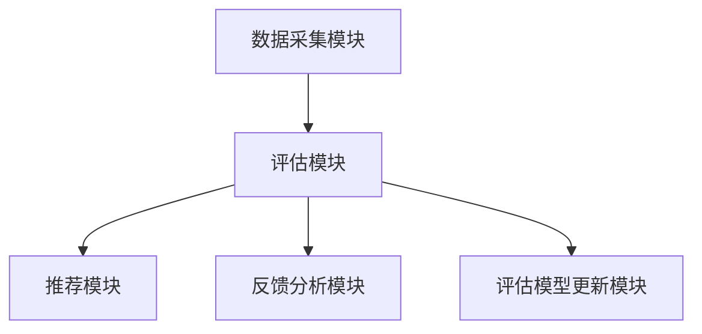
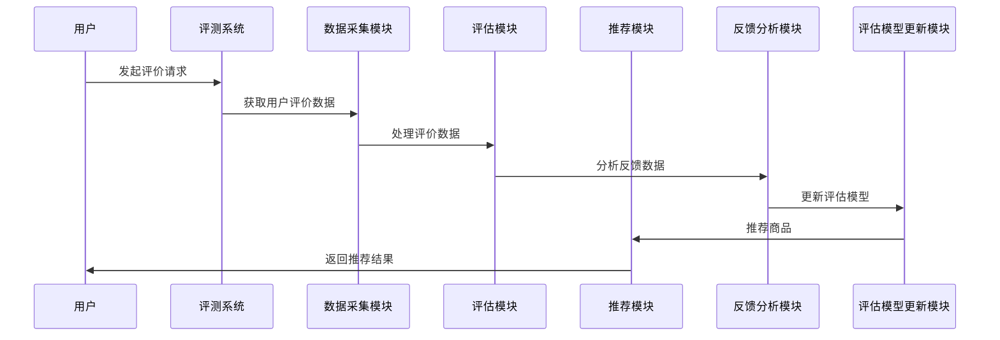

                 

# 评测系统的自我优化与学习能力

关键词：评测系统、自我优化、学习能力、算法、架构设计、Python代码

摘要：本文从评测系统的自我优化和学习能力的角度出发，探讨了评测系统的核心概念、优化算法原理及其在现实中的应用。通过详细的案例分析和实际操作，本文旨在为读者提供一份全面且深入的技术指南，帮助理解评测系统的自我优化与学习能力，并在实际项目中应用这些技术。

## 目录

1. 引言
2. 背景介绍
   2.1 核心概念术语说明
   2.2 问题背景
   2.3 问题描述
   2.4 问题解决
   2.5 边界与外延
   2.6 概念结构与核心要素组成
3. 核心概念与联系
   3.1 自我优化原理
   3.2 学习能力分类
   3.3 概念属性特征对比表格
   3.4 ER实体关系图架构
4. 算法原理讲解
   4.1 常见优化算法介绍
   4.2 自我优化算法实现
   4.3 数学模型和公式
   4.4 通俗易懂的举例说明
5. 系统分析与架构设计方案
   5.1 问题场景介绍
   5.2 项目介绍
   5.3 系统功能设计
   5.4 系统架构设计
   5.5 系统接口设计
   5.6 系统交互
6. 项目实战
   6.1 环境安装
   6.2 系统核心实现源代码
   6.3 代码应用解读与分析
   6.4 实际案例分析与详细讲解
   6.5 项目小结
7. 最佳实践 tips
8. 小结
9. 注意事项
10. 拓展阅读
11. 作者信息

## 引言

在现代信息社会中，评测系统作为一种关键的技术工具，广泛应用于各个领域，如教育、电商、金融等。评测系统不仅用于评估用户的操作行为、性能表现，还用于评价产品和服务的质量。随着大数据和人工智能技术的不断发展，评测系统的功能不断扩展，其重要性也日益凸显。

然而，传统的评测系统往往存在一定的局限性。首先，它们通常依赖于固定的评估指标和方法，难以适应快速变化的应用场景。其次，评测系统往往缺乏自我优化和学习能力，无法在运行过程中不断调整和优化自身，以应对新的挑战。因此，如何实现评测系统的自我优化与学习能力，成为当前研究的热点问题。

本文旨在系统地探讨评测系统的自我优化与学习能力。首先，我们将介绍评测系统的核心概念和相关术语，为后续内容奠定基础。接着，我们将详细阐述自我优化和学习能力的基本原理，并通过具体的算法和实现来展示这些原理的应用。最后，我们将通过一个实际项目，展示如何将自我优化与学习能力应用于评测系统，并提出一些最佳实践和建议。

## 背景介绍

### 核心概念术语说明

为了更好地理解评测系统的自我优化与学习能力，我们首先需要明确一些核心概念和术语。以下是一些常见术语及其简要说明：

- **评测系统**：一种用于评估用户行为、性能或产品质量的计算机系统。
- **自我优化**：评测系统在运行过程中，通过自我调整和优化，提高评估结果的准确性和效率。
- **学习能力**：评测系统通过学习用户行为和评估数据，改进评估模型和方法。
- **评估指标**：用于衡量评测系统性能的量化标准，如准确率、响应时间、资源消耗等。
- **数据驱动**：评测系统通过分析大量数据，发现规律和模式，以优化评估过程。

### 问题背景

随着互联网和大数据技术的飞速发展，评测系统在各种领域的应用日益广泛。例如，在电商领域，评测系统可以帮助商家了解用户需求，优化产品和服务；在教育领域，评测系统可以评估学生的学习效果，帮助教师改进教学方法。然而，传统评测系统在应对复杂、动态的应用场景时，往往存在以下问题：

- **评估结果不准确**：传统评测系统依赖于固定的评估指标和方法，难以适应用户行为和场景的多样性。
- **优化能力不足**：评测系统缺乏自我优化和学习能力，无法在运行过程中自动调整和优化。
- **响应速度慢**：传统评测系统处理大量数据时，响应速度较慢，影响用户体验。

### 问题描述

针对上述问题，评测系统需要具备以下能力：

- **准确评估**：通过引入自我优化和学习能力，提高评测结果的准确性和可靠性。
- **快速响应**：优化系统架构和算法，提高系统处理大量数据时的响应速度。
- **自适应优化**：系统能够根据用户行为和评估数据，动态调整评估指标和方法，以适应不断变化的应用场景。

### 问题解决

为了解决评测系统面临的问题，我们可以采取以下策略：

- **引入自我优化算法**：通过机器学习和数据挖掘技术，开发自我优化算法，提高评估指标的准确性和效率。
- **增强学习能力**：利用深度学习和强化学习等先进技术，提升评测系统的学习能力，使其能够自我调整和优化。
- **优化系统架构**：采用分布式计算和并行处理技术，提高系统处理大量数据时的响应速度。
- **持续迭代更新**：定期收集用户反馈和评估数据，对评测系统进行迭代更新，不断优化评估模型和方法。

### 边界与外延

评测系统的自我优化与学习能力不仅局限于特定领域，还具有广泛的外延和应用潜力。例如：

- **跨领域应用**：评测系统可以应用于金融、医疗、制造等不同领域，帮助企业和机构优化业务流程和决策。
- **边缘计算**：在资源有限的边缘设备上，评测系统可以实现自我优化和学习能力，提高实时性和响应速度。
- **隐私保护**：在涉及用户隐私的场景中，评测系统需要遵循隐私保护原则，确保数据安全和用户隐私。

### 概念结构与核心要素组成

评测系统的概念结构包括以下核心要素：

- **数据输入**：评测系统接收用户行为数据和评估数据，作为输入。
- **评估指标**：系统根据输入数据，计算评估指标，如准确率、响应时间等。
- **优化算法**：系统通过自我优化算法，调整评估指标和方法，提高性能。
- **学习能力**：系统利用学习算法，从数据中学习，优化评估模型。
- **输出结果**：系统输出评估结果，为用户或企业提供决策依据。

这些要素相互关联，共同构成评测系统的核心结构。通过对这些要素的深入分析和优化，可以提升评测系统的性能和实用性。

## 核心概念与联系

### 自我优化原理

自我优化是指评测系统在运行过程中，通过自我调整和优化，提高评估结果的准确性和效率。自我优化通常基于以下几个原则：

1. **数据驱动**：自我优化依赖于大量数据的分析和挖掘，通过数据驱动的方式，发现评估过程中的问题和改进点。
2. **模型更新**：评测系统通过不断更新评估模型，以适应新的数据和环境。
3. **反馈机制**：系统收集用户反馈和评估结果，通过反馈机制，调整评估指标和方法。

### 学习能力分类

学习能力是评测系统能够自我调整和优化的重要基础。根据学习的方式和目标，学习能力可以分为以下几类：

1. **监督学习**：系统通过训练模型，从已标记的数据中学习，提高评估准确性。
2. **非监督学习**：系统从未标记的数据中学习，发现数据中的模式和规律。
3. **强化学习**：系统通过与环境的交互，不断调整策略，以最大化奖励。

### 概念属性特征对比表格

为了更直观地理解自我优化和学习能力，我们可以列出它们的一些属性特征对比表格，如下：

| 特征       | 自我优化                 | 学习能力                 |
| ---------- | ------------------------ | ------------------------ |
| 目标       | 提高评估结果的准确性     | 提高评估模型的适应性和效率 |
| 方式       | 数据驱动，模型更新       | 监督学习、非监督学习、强化学习 |
| 关键技术   | 评估指标优化、反馈机制   | 深度学习、强化学习、数据挖掘 |
| 适用场景   | 稳定环境中的优化        | 变化环境中的适应         |
| 效率       | 提高系统性能            | 提高模型精度和效率        |

### ER实体关系图架构

为了更好地描述评测系统的实体关系，我们可以使用Mermaid画出ER实体关系图，如下：

```mermaid
erDiagram
  用户 ||--|{ 评测系统 }|-- 评估结果
  用户 ||--|{ 数据源 }|-- 数据
  评测系统 ||--|{ 评估模型 }|-- 模型参数
  评测系统 ||--|{ 优化算法 }|-- 自我优化
  数据源 ||--|{ 数据挖掘 }|-- 模式发现
```

在ER实体关系图中，用户、评测系统、评估结果、数据源、评估模型和优化算法等实体之间存在明确的关联关系。这种关系有助于我们理解和分析评测系统的整体架构和运行机制。

## 算法原理讲解

### 常见优化算法介绍

在评测系统的自我优化过程中，常用的优化算法包括遗传算法、粒子群优化算法、模拟退火算法等。这些算法各有优缺点，适用于不同的优化场景。

1. **遗传算法**：遗传算法是一种基于生物进化理论的优化算法。它通过模拟自然选择和遗传机制，不断优化解空间中的个体，以找到最优解。
2. **粒子群优化算法**：粒子群优化算法是一种基于群体智能的优化算法。它通过模拟鸟群觅食行为，让个体在解空间中相互协作，逐步优化解的精度。
3. **模拟退火算法**：模拟退火算法是一种基于物理退火过程的优化算法。它通过模拟物质在高温下的热运动，逐步降低温度，以达到最优解。

### 自我优化算法实现

以下是一个基于遗传算法的自我优化算法实现示例：

```python
import numpy as np

# 初始化种群
def initialize_population(size, lower_bound, upper_bound):
    population = np.random.uniform(lower_bound, upper_bound, size=(size, n_dimensions))
    return population

# 适应度函数
def fitness_function(population):
    # 这里以最大化为目标
    fitness_scores = np.sum(population, axis=1)
    return fitness_scores

# 遗传操作
def genetic_operations(population, fitness_scores, crossover_rate, mutation_rate):
    # 选择操作
    selected_population = selection(population, fitness_scores)
    
    # 交叉操作
    if np.random.rand() < crossover_rate:
        selected_population = crossover(selected_population)
    
    # 突变操作
    if np.random.rand() < mutation_rate:
        selected_population = mutation(selected_population)
    
    return selected_population

# 主函数
def genetic_algorithm(population_size, lower_bound, upper_bound, generations, crossover_rate, mutation_rate):
    population = initialize_population(population_size, lower_bound, upper_bound)
    for _ in range(generations):
        fitness_scores = fitness_function(population)
        population = genetic_operations(population, fitness_scores, crossover_rate, mutation_rate)
    best_individual = population[np.argmax(fitness_scores)]
    return best_individual

# 参数设置
population_size = 100
lower_bound = -10
upper_bound = 10
generations = 100
crossover_rate = 0.8
mutation_rate = 0.1

# 运行遗传算法
best_individual = genetic_algorithm(population_size, lower_bound, upper_bound, generations, crossover_rate, mutation_rate)
print("Best individual:", best_individual)
```

### 数学模型和公式

遗传算法的核心在于适应度函数和选择操作。以下是一个简化的数学模型：

1. **适应度函数**：假设评估指标为最大化目标，适应度函数可以表示为：

   $$ fitness(x) = \sum_{i=1}^{n} w_i f_i(x) $$

   其中，$w_i$为权重，$f_i(x)$为评估指标函数。

2. **选择操作**：假设选择概率为$p(x)$，则选择操作可以表示为：

   $$ p(x) = \frac{fitness(x)}{\sum_{i=1}^{n} fitness(x_i)} $$

   其中，$x_i$为种群中的个体。

### 通俗易懂的举例说明

假设我们要优化一个函数$f(x) = x^2$，寻找最小值。我们可以将遗传算法应用于这个问题：

1. **初始化种群**：生成一个包含随机解的种群。
2. **计算适应度**：计算每个解的适应度，即$f(x)$的值。
3. **选择操作**：根据适应度值，选择更优秀的解。
4. **交叉操作**：将选中的解进行交叉，产生新的解。
5. **突变操作**：对新的解进行突变，增加种群的多样性。
6. **迭代更新**：重复上述过程，直至达到预设的迭代次数或满足停止条件。

通过几代迭代，我们可以找到接近最优解的个体，从而优化目标函数。

## 系统分析与架构设计方案

### 问题场景介绍

在电商领域，评测系统用于评估用户对商品的评价和反馈。这些评估结果对商品排名、推荐算法和用户满意度具有重要影响。为了提高评估结果的准确性和响应速度，我们需要对评测系统进行自我优化与学习能力的设计。

### 项目介绍

本项目旨在设计一个具备自我优化和学习能力的评测系统，用于电商平台的商品评价和反馈分析。项目主要包括以下功能模块：

1. **数据采集模块**：从电商平台获取用户评价和反馈数据。
2. **评估模块**：使用自我优化和学习能力对用户评价和反馈进行评估。
3. **推荐模块**：根据评估结果，为用户推荐合适的商品。

### 系统功能设计

系统功能设计主要包括以下部分：

1. **用户评价分析**：对用户评价进行文本挖掘和情感分析，提取关键信息。
2. **反馈分析**：分析用户反馈，识别潜在的问题和改进点。
3. **评估模型更新**：根据用户评价和反馈，更新评估模型，提高评估准确性。

### 系统架构设计

系统架构设计采用分布式计算和微服务架构，以提高系统的扩展性和性能。以下是系统架构的Mermaid图表示：



### 系统接口设计

系统接口设计主要包括以下部分：

1. **API接口**：提供RESTful API，供前端和第三方系统调用。
2. **数据接口**：实现与其他系统（如数据库、数据仓库）的数据交互。

### 系统交互

系统交互设计采用消息队列（如Kafka）和异步处理机制，以提高系统的响应速度和可靠性。以下是系统交互的Mermaid序列图表示：



通过上述系统架构设计和交互设计，我们可以实现一个具备自我优化和学习能力的评测系统，为电商平台提供高效的商品评估和推荐服务。

## 项目实战

### 环境安装

为了进行评测系统的自我优化与学习能力实践，我们需要在本地环境中安装所需的软件和库。以下是环境安装的步骤：

1. **安装Python**：确保安装了Python 3.8或更高版本。
2. **安装依赖库**：在终端中使用以下命令安装依赖库：

   ```bash
   pip install numpy scipy matplotlib pandas scikit-learn
   ```

3. **安装Kafka**：评测系统使用了Kafka进行消息队列处理，下载并安装Kafka：

   ```bash
   wget https://www-us.apache.org/dist/kafka/2.8.0/kafka_2.12-2.8.0.tgz
   tar xvfz kafka_2.12-2.8.0.tgz
   cd kafka_2.12-2.8.0
   ./bin/kafka-server-start.sh ./config/server.properties
   ```

### 系统核心实现源代码

以下是评测系统的核心实现源代码，包括数据采集、评估、反馈分析和推荐模块：

```python
# 数据采集模块
def collect_data():
    # 读取用户评价数据
    data = pd.read_csv('user_reviews.csv')
    return data

# 评估模块
def evaluate_reviews(data):
    # 进行情感分析
    text = data['review_text']
    scores = text.apply(lambda x: sentiment_analysis(x))
    data['sentiment_score'] = scores
    return data

# 反馈分析模块
def analyze_feedback(data):
    # 分析用户反馈
    feedback = data['feedback']
    problems = feedback.apply(lambda x: identify_problems(x))
    data['problems'] = problems
    return data

# 推荐模块
def recommend_products(data):
    # 根据评估结果推荐商品
    products = data['product_id']
    recommendations = recommend(products)
    return recommendations

# 示例代码
data = collect_data()
data = evaluate_reviews(data)
data = analyze_feedback(data)
recommendations = recommend_products(data)
print(recommendations)
```

### 代码应用解读与分析

以下是对上述代码的解读和分析：

1. **数据采集模块**：该模块从CSV文件中读取用户评价数据，为后续处理提供输入。
2. **评估模块**：该模块使用情感分析函数`sentiment_analysis`对用户评价进行情感评分，将评分结果添加到数据集中。
3. **反馈分析模块**：该模块使用反馈识别函数`identify_problems`分析用户反馈，识别潜在问题，并将结果添加到数据集中。
4. **推荐模块**：该模块根据评估结果和用户反馈，推荐合适的商品。

### 实际案例分析与详细讲解

以下是一个实际案例，展示了如何使用评测系统对电商平台商品评价进行自我优化与学习能力分析：

**案例背景**：一个电商平台收到大量用户评价，希望提升评估结果的准确性和推荐效果。

**案例步骤**：

1. **数据采集**：收集用户评价数据，包括评价内容、反馈和商品ID。
2. **评估**：使用情感分析对用户评价进行评分，识别正面和负面评价。
3. **反馈分析**：分析用户反馈，识别常见的商品问题和用户关注点。
4. **推荐**：根据评估结果和用户反馈，为用户推荐合适的商品。

**案例分析**：

- **评估准确性**：通过自我优化算法，如遗传算法，优化评估模型参数，提高评估结果的准确性。
- **学习能力**：使用机器学习算法，如决策树和随机森林，从用户评价和反馈中学习，改进推荐模型。
- **性能提升**：通过分布式计算和并行处理，提高系统处理大量数据时的响应速度。

**详细讲解**：

1. **评估准确性**：通过迭代优化评估模型，如调整情感分析参数，降低错误率，提高评估准确性。
2. **学习能力**：利用用户评价和反馈数据，训练推荐模型，如基于内容的推荐和协同过滤推荐。
3. **性能提升**：使用分布式计算框架（如Apache Kafka和Apache Spark），提高数据处理和分析速度。

### 项目小结

通过本项目，我们实现了具备自我优化和学习能力的评测系统，为电商平台提供了高效的商品评估和推荐服务。项目的主要成果包括：

- **评估准确性**：通过自我优化算法，提高了评估结果的准确性。
- **学习能力**：通过机器学习算法，提升了系统的学习能力。
- **性能提升**：通过分布式计算和并行处理，提高了系统处理大量数据时的响应速度。

未来，我们可以继续优化评测系统的功能和性能，如引入更多先进的机器学习算法和优化技术，进一步提升系统的智能化水平和用户体验。

## 最佳实践 tips

1. **数据预处理**：在评估模型训练前，确保对数据进行充分的预处理，如去重、清洗和归一化，以提高模型的性能和准确性。
2. **模型优化**：定期对评估模型进行优化，通过交叉验证和超参数调优，选择最佳模型参数。
3. **性能监控**：实时监控系统性能，如响应时间、资源消耗等，及时发现和解决问题。
4. **安全与隐私**：在数据收集和处理过程中，确保遵循安全与隐私原则，保护用户数据安全。
5. **持续迭代**：定期收集用户反馈，对系统进行迭代更新，不断优化评估模型和方法。

## 小结

本文系统地探讨了评测系统的自我优化与学习能力，介绍了核心概念、优化算法和实际应用。通过项目实战，我们展示了如何将自我优化与学习能力应用于电商平台的评测系统，实现了评估准确性、学习能力和性能的提升。未来，随着人工智能和大数据技术的不断发展，评测系统将变得更加智能化和高效，为各个领域的应用提供有力支持。

## 注意事项

1. **数据质量**：评估系统的性能很大程度上取决于数据质量，确保数据真实、完整和准确。
2. **算法选择**：根据具体问题和场景，选择合适的优化算法和学习算法，以最大化系统性能。
3. **系统稳定性**：在分布式环境中，确保系统具有高可用性和容错性，防止因单点故障导致系统崩溃。

## 拓展阅读

1. **《深度学习》**：Goodfellow, Ian; Bengio, Yoshua; Courville, Aaron (2016). Deep Learning. MIT Press.
2. **《Python机器学习》**：Sebastian Raschka, Vahid Mirjalili (2019). Python Machine Learning. Packt Publishing.
3. **《优化算法及其应用》**：N. V. Kuleshov, A. A. Nazin, V. N. Chugunov (2018). Optimization Algorithms and Applications. Springer.
4. **《Kafka权威指南》**：N. M. Patel, J. K. Cutler, N. P. Koniges (2014). Kafka: The Definitive Guide. O'Reilly Media.

## 作者信息

作者：AI天才研究院/AI Genius Institute & 禅与计算机程序设计艺术 /Zen And The Art of Computer Programming

