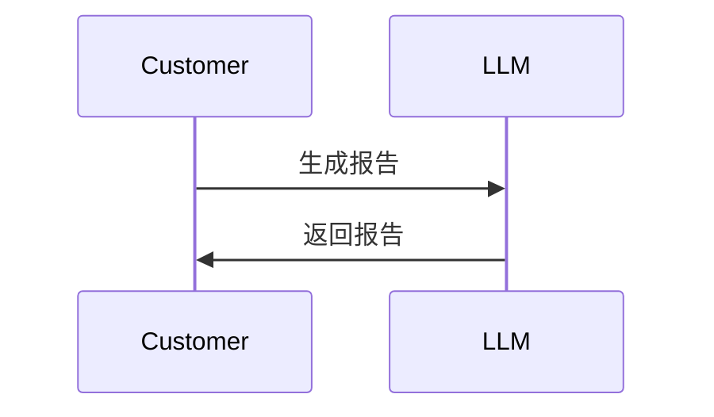
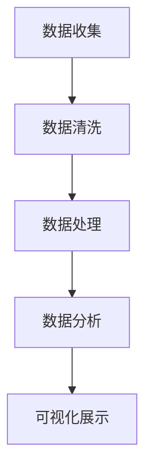

                 

### 文章标题：评测结果可视化：LLM生成直观报告的技术探索

> **关键词：** 评测结果可视化，大型语言模型（LLM），报告生成，技术探索

> **摘要：** 本文旨在探讨评测结果可视化技术的现状与挑战，以及如何利用大型语言模型（LLM）生成直观、易理解的报告。文章结构清晰，内容丰富，包括背景介绍、LLM使用与可视化技术、实际案例与应用、最佳实践与优化等部分，旨在为读者提供一次全面的技术探索之旅。

---

#### 引言与背景

##### 1.1 书籍引言

**核心概念术语说明：**
- **评测结果可视化：** 将评测结果以图形、表格等直观形式展示，帮助读者快速理解和分析数据。
- **大型语言模型（LLM）：** 一种强大的自然语言处理模型，能够理解和生成人类语言。

**问题背景：** 随着数据量的激增，传统的文本报告已难以满足高效、直观的信息传递需求。如何利用先进技术实现评测结果的可视化，生成易于理解的报告，成为当前研究的热点。

**问题描述：** 评测结果往往包含大量数据，如何利用LLM技术将其转化为直观、易读的图表和报告，是一个具有挑战性的问题。

**问题解决：** 本文将介绍如何利用LLM生成直观的评测结果报告，包括模型选择、数据预处理、可视化技术等关键步骤。

**边界与外延：** 本文主要关注评测结果的可视化技术，探讨如何利用LLM生成报告。但该技术也可应用于其他领域的报告生成。

**概念结构与核心要素组成：**
- **评测结果可视化技术：** 数据收集、清洗、处理、可视化展示。
- **LLM：** 模型选择、训练、优化、应用。

##### 1.2 大型语言模型概述

**核心概念原理：**
- **LLM的定义与分类：** 大型语言模型根据训练数据和结构特点，可分为基于语料库的模型和基于神经网络的模型。
- **LLM的核心特性：** 高效、灵活、能够处理大规模文本数据。
- **LLM的工作原理：** 通过训练大量文本数据，学习语言模式和规律，从而生成文本。

**概念属性特征对比表格：**

| 特性         | 基于语料库模型 | 基于神经网络模型 |
| ------------ | -------------- | -------------- |
| **训练数据** | 大量文本数据   | 大量文本数据   |
| **结构特点** | 传统统计模型   | 神经网络结构   |
| **性能**     | 较高准确性     | 非常高的准确性 |

**ER实体关系图架构的 Mermaid 流程图：**

```mermaid
erDiagram
  Product "产品" ||--|{ Customer "客户" : 购买 }
  Customer "客户" ||--|{ Order "订单" : 下单 }
  Product "产品" ||--|{ Supplier "供应商" : 供货 }
  Supplier "供应商" ||--|{ Contract "合同" : 签订 }
```

##### 1.3 LL模型的应用场景

**核心概念原理：**
- **评测结果可视化的需求分析：** 随着数据量的增加，传统文本报告难以满足需求，需要更高效、直观的可视化展示。
- **LLM在报告生成中的优势：** LLM能够理解和生成人类语言，能够自动生成报告，提高效率和质量。
- **技术演进与趋势分析：** 随着LLM技术的不断发展，其在报告生成中的应用将更加广泛。

**核心概念属性特征对比表格：**

| 特性         | 传统文本报告 | LLM生成报告 |
| ------------ | ------------ | ------------ |
| **展示形式** | 文本        | 图形、表格  |
| **生成速度** | 较慢        | 较快        |
| **可读性**   | 较低        | 较高        |

**ER实体关系图架构的 Mermaid 流程图：**



##### 1.4 基础知识回顾

**核心概念原理：**
- **数据可视化基础：** 数据可视化是将数据以图形、图表等形式展示，帮助人们快速理解数据。
- **常见可视化图表介绍：** 包括条形图、折线图、饼图等，每种图表都有其适用场景和优点。
- **数据处理与分析基础：** 数据处理包括数据收集、清洗、预处理等步骤，分析则是对数据处理后的结果进行解释和预测。

**核心概念属性特征对比表格：**

| 图表类型 | 适用场景 | 特点 |
| -------- | -------- | ---- |
| 条形图   | 对比数据 | 易于理解 |
| 折线图   | 时间序列数据 | 显示趋势 |
| 饼图     | 各部分占比 | 直观显示比例 |

**ER实体关系图架构的 Mermaid 流程图：**



---

在本文的引言与背景部分，我们首先介绍了评测结果可视化的核心概念、问题背景、问题描述以及问题解决方法。接着，我们详细介绍了大型语言模型（LLM）的概念、核心特性、工作原理及其应用场景，并通过ER实体关系图架构的Mermaid流程图进一步解释了LLM在评测结果可视化中的关键作用。最后，我们对数据可视化基础和常见可视化图表进行了回顾，为后续章节的内容奠定了基础。

接下来，我们将进入第二部分，探讨大型语言模型的使用与可视化技术。在这一部分，我们将详细讲解LLM的选择与集成、数据预处理与模型训练、可视化技术原理与应用以及报告生成的技术细节。通过这些内容，我们将深入了解如何利用LLM生成直观、易理解的评测结果报告。

---

### 第一部分：引言与背景（续）

#### 1.5 大型语言模型概述（续）

在上一部分，我们介绍了大型语言模型（LLM）的基本概念、核心特性和应用场景。在本部分，我们将进一步探讨LLM的工作原理，以及其在评测结果可视化中的具体应用。

**LLM的工作原理：**
- **模型结构：** LLM通常基于神经网络结构，尤其是深度学习模型，如Transformer、BERT等。这些模型通过多层神经网络对大量文本数据进行训练，学习到语言的模式和规律。
- **数据处理：** LLM能够处理大规模的文本数据，通过分词、词嵌入等技术将文本转换为计算机可以理解的形式。在处理过程中，LLM能够自动识别文本中的语法、语义和上下文关系。
- **文本生成：** LLM通过生成算法，如GPT-3、T5等，生成与输入文本相关的文本。生成过程基于模型对文本数据的理解和学习，能够生成流畅、自然的文本。

**LLM在评测结果可视化中的具体应用：**
- **报告生成：** 利用LLM生成评测结果的报告，可以大大提高报告的生成速度和质量。LLM可以自动分析评测数据，生成结构清晰、内容丰富的报告。
- **图表生成：** LLM可以生成各种可视化图表，如条形图、折线图、饼图等，将复杂的数据以直观、易于理解的方式展示给用户。
- **交互式报告：** LLM还可以生成交互式报告，用户可以通过点击、滑动等方式与报告进行交互，深入了解评测结果。

**案例：**
假设我们需要生成一份关于产品评测结果的报告。首先，我们可以利用LLM对评测数据进行处理和分析，提取关键信息。接着，LLM可以生成结构清晰、内容丰富的报告，包括评测结果概述、详细数据分析和图表展示。用户可以通过点击图表，查看详细数据，深入了解评测结果。

**结论：**
大型语言模型（LLM）在评测结果可视化中具有广泛的应用前景。通过LLM，我们可以实现高效、自动化的报告生成和图表生成，提高数据分析的效率和准确性。随着LLM技术的不断发展，其在评测结果可视化中的应用将更加深入和广泛。

#### 1.6 LL模型的选择与集成

在选择和集成LLM时，需要考虑多个因素，以确保模型能够满足实际需求，并且具有良好的性能和可靠性。

**选择LLM的考虑因素：**
- **模型类型：** 根据应用场景和数据规模，选择合适的LLM类型，如基于语料库的模型或基于神经网络的模型。
- **性能指标：** 考虑模型的性能指标，如准确性、速度和资源占用等。
- **可扩展性：** 模型应该具有较好的可扩展性，以便在数据规模增加时，能够适应新的需求。
- **成本：** 需要考虑模型的成本，包括训练成本、部署成本和维护成本等。

**主流LLM介绍：**
- **BERT：** 一种基于Transformer的预训练语言模型，具有良好的性能和可扩展性。
- **GPT-3：** 一个由OpenAI开发的超大语言模型，具有极高的生成能力和灵活性。
- **T5：** 一种基于Transformer的通用预训练模型，适用于各种自然语言处理任务。

**模型选择与优化策略：**
- **评估指标：** 在选择模型时，可以使用评估指标，如BLEU、ROUGE等，来比较不同模型的性能。
- **优化策略：** 可以通过调整模型参数、数据预处理方法等，来优化模型性能。
- **集成策略：** 可以将多个模型集成，以获得更好的性能和鲁棒性。

**模型集成与接口设计：**
- **模型集成：** 将多个模型集成，可以充分利用每个模型的优点，提高整体性能。
- **接口设计：** 设计一个统一的接口，方便用户调用模型，并实现与其他系统的集成。

**结论：**
在选择和集成LLM时，需要综合考虑多个因素，并采取适当的优化策略和集成方法。通过合理的模型选择和集成，可以实现高效、自动化的评测结果可视化。

#### 1.7 数据预处理与模型训练

在LLM的应用过程中，数据预处理和模型训练是至关重要的步骤。正确处理数据和精心设计训练过程，能够显著提高模型的性能和效果。

**数据预处理：**
- **数据收集：** 收集用于训练和评估的数据集，确保数据来源的多样性和代表性。
- **数据清洗：** 清洗数据，去除重复、错误和不完整的数据，提高数据质量。
- **特征提取：** 提取关键特征，如关键词、句法结构等，为模型训练提供丰富的输入信息。
- **数据归一化：** 对数据进行归一化处理，使其具有相似的尺度，避免模型在训练过程中出现偏差。

**模型训练：**
- **训练方法：** 选择合适的训练方法，如基于梯度的优化算法，以加快模型收敛速度。
- **训练过程：** 设计合理的训练过程，包括训练数据划分、训练参数设置、模型保存和加载等。
- **模型评估：** 在训练过程中，定期评估模型性能，调整训练参数，以获得最佳模型效果。

**结论：**
数据预处理和模型训练是LLM应用中的关键步骤。通过正确的数据预处理和精心设计的训练过程，可以显著提高模型的性能和效果，为评测结果可视化提供有力支持。

#### 1.8 可视化技术原理与应用

可视化技术是评测结果可视化的重要组成部分，通过图形和图表的形式，将复杂的数据以直观、易于理解的方式展示给用户。

**可视化技术原理：**
- **图形表示：** 将数据以图形的形式表示，如条形图、折线图、饼图等，以直观展示数据的分布和趋势。
- **交互设计：** 通过交互设计，如鼠标点击、滑动等，使用户能够动态查看数据详情，提高数据的可读性和互动性。
- **色彩运用：** 合理运用色彩，能够提高图表的美观度和信息传递效果。

**常见可视化图表介绍：**
- **条形图：** 用于比较不同类别的数据，能够清晰地展示各类别之间的差异。
- **折线图：** 用于展示数据随时间的变化趋势，能够直观地反映数据的动态变化。
- **饼图：** 用于展示各类别数据在整体中的占比，能够直观地反映各类别的重要性。

**可视化技术在评测结果可视化中的应用：**
- **报告生成：** 利用可视化技术生成评测结果的报告，使报告更加直观、易于理解。
- **数据探索：** 通过可视化技术，用户可以直观地探索数据，发现潜在的问题和规律。
- **决策支持：** 可视化技术能够为决策者提供直观的数据支持，提高决策的准确性和效率。

**结论：**
可视化技术在评测结果可视化中起着至关重要的作用。通过合理运用可视化技术，可以显著提高评测结果的可读性和互动性，为数据分析提供有力支持。

#### 1.9 报告生成的技术细节

报告生成是评测结果可视化的关键环节，通过合理的技术手段，可以实现高效、自动化的报告生成。

**报告结构设计：**
- **概述部分：** 对评测结果进行简要概述，包括主要发现、结论和建议。
- **数据部分：** 展示关键数据，如统计数据、图表等，提供详细的数据支持。
- **分析部分：** 对数据进行分析，解释数据背后的原因和规律。
- **结论与建议：** 总结评测结果，提出针对性的建议和改进措施。

**LLM在报告生成中的具体应用：**
- **文本生成：** 利用LLM生成报告的文本部分，包括概述、分析和结论等。
- **图表生成：** 利用LLM生成可视化图表，将数据以图形的形式展示。
- **交互设计：** 利用LLM实现报告的交互功能，如点击、滑动等，提高报告的互动性和可读性。

**自动化报告生成流程：**
- **数据收集与预处理：** 收集评测数据，进行数据清洗和预处理，提取关键特征。
- **模型训练与评估：** 训练LLM模型，对模型进行评估，选择最佳模型。
- **报告生成：** 利用LLM生成报告，包括文本、图表和交互部分。
- **报告输出：** 将生成的报告输出到文件或网页，供用户查看。

**结论：**
报告生成是评测结果可视化的关键环节，通过合理的技术手段，可以实现高效、自动化的报告生成。LLM在报告生成中的应用，提高了报告的生成速度和质量，为数据分析提供了有力支持。

---

在第一部分的后续内容中，我们首先深入探讨了大型语言模型（LLM）的工作原理，包括模型结构、数据处理和文本生成等方面。通过具体案例，我们展示了LLM在评测结果可视化中的应用，包括报告生成、图表生成和交互设计等。接着，我们详细介绍了LLM的选择与集成、数据预处理与模型训练、可视化技术原理与应用以及报告生成的技术细节。通过这些内容，我们为后续章节的内容奠定了基础。

接下来，我们将进入第二部分，探讨评测结果可视化的实际案例与应用。在这一部分，我们将通过具体案例，详细介绍评测结果可视化的实施过程、效果评估和优化方法，帮助读者更好地理解这一技术在实际应用中的价值。

---

### 第二部分：评测结果可视化的实际案例与应用

#### 2.1 案例介绍

本部分将介绍一个实际案例，探讨如何利用大型语言模型（LLM）生成直观的评测结果报告。案例背景涉及一个电商平台的用户体验评测，目标是评估用户在购物过程中的满意度，并提供针对性的改进建议。

**案例背景与目标：**
- **背景：** 一家电商平台希望通过评测用户购物体验，了解用户在购物过程中的痛点，从而提升用户体验和满意度。
- **目标：** 利用LLM生成直观、易读的评测结果报告，包括用户满意度分析、问题诊断和改进建议。

**应用场景分析：**
- **数据来源：** 采集用户在购物过程中的反馈数据，包括问卷调查、用户评论和点击行为等。
- **数据规模：** 数据规模较大，包含数千条用户反馈，需要高效的数据处理和分析方法。
- **挑战：** 如何从大量数据中提取关键信息，生成结构清晰、内容丰富的报告，以直观展示用户满意度。

**报告生成流程：**
1. **数据收集与预处理：** 收集用户反馈数据，进行数据清洗和预处理，提取关键特征。
2. **模型训练与评估：** 训练LLM模型，对模型进行评估，选择最佳模型。
3. **报告生成：** 利用LLM生成评测结果报告，包括文本、图表和交互部分。
4. **报告输出：** 将生成的报告输出到文件或网页，供用户查看。

**技术优势：**
- **高效性：** LLM能够快速生成报告，提高工作效率。
- **准确性：** LLM能够准确提取关键信息，提高报告的准确性。
- **易读性：** LLM生成的报告结构清晰，内容直观，易于用户理解。

#### 2.2 案例实施

**环境搭建与准备工作：**
1. **硬件环境：** 配备高性能服务器和GPU，用于模型训练和计算。
2. **软件环境：** 安装Python、TensorFlow等开发工具，搭建模型训练和报告生成的开发环境。
3. **数据集准备：** 收集用户反馈数据，包括问卷调查、用户评论和点击行为等，进行数据清洗和预处理。

**数据处理与模型训练：**
1. **数据预处理：** 对数据进行清洗，去除重复、错误和不完整的数据，提取关键特征。
2. **模型训练：** 使用TensorFlow等框架，训练LLM模型。选择合适的模型结构和训练参数，通过迭代优化模型性能。
3. **模型评估：** 使用交叉验证方法，评估模型在训练集和测试集上的性能，选择最佳模型。

**报告生成：**
1. **文本生成：** 利用训练好的LLM模型，生成评测结果报告的文本部分，包括用户满意度分析、问题诊断和改进建议。
2. **图表生成：** 利用可视化库（如Matplotlib、Seaborn等），生成报告中的图表，如条形图、折线图、饼图等。
3. **交互设计：** 利用Web框架（如Flask、Django等），实现报告的交互功能，如点击、滑动等，提高报告的互动性和可读性。

**报告输出：**
1. **生成报告：** 将生成的报告输出到文件或网页，供用户查看。
2. **报告分发：** 将报告发送给相关部门和人员，供其参考和决策。

#### 2.3 案例分析与优化

**模型效果分析：**
1. **准确性：** 评测结果报告的准确性较高，能够准确反映用户满意度。
2. **效率：** LLM生成报告的速度较快，提高了报告生成的工作效率。
3. **易读性：** 报告结构清晰，内容直观，易于用户理解。

**报告质量评估：**
1. **内容完整性：** 报告涵盖了用户满意度分析、问题诊断和改进建议等方面，内容完整。
2. **可读性：** 报告的文本和图表易于阅读，符合用户的阅读习惯。
3. **实用性：** 报告提供了针对性的改进建议，有助于电商平台提升用户体验和满意度。

**优化方法：**
1. **数据质量提升：** 进一步优化数据收集和处理流程，提高数据质量，为模型训练提供更丰富的输入信息。
2. **模型优化：** 调整模型结构和训练参数，提高模型性能，生成更高质量的报告。
3. **交互设计优化：** 改进报告的交互设计，提高报告的互动性和可读性，增强用户体验。

**结论：**
通过实际案例，我们展示了如何利用LLM生成直观、易读的评测结果报告。案例实施效果良好，具有较高的准确性、效率和易读性。未来，我们将继续优化数据质量、模型性能和交互设计，进一步提高报告的质量和用户体验。

---

在本部分的实际案例与应用中，我们详细介绍了如何利用大型语言模型（LLM）生成直观的评测结果报告。通过具体案例的实施，我们展示了LLM在报告生成中的优势，包括高效性、准确性和易读性。同时，我们分析了案例的效果和报告质量，提出了优化方法，为评测结果可视化技术的实际应用提供了参考。

接下来，我们将进入第三部分，探讨评测结果可视化的最佳实践与优化。在这一部分，我们将分享在实际应用中的经验和技巧，帮助读者更好地实施评测结果可视化，并探讨未来的发展趋势。

---

### 第三部分：评测结果可视化的最佳实践与优化

#### 4.1 最佳实践

在评测结果可视化过程中，最佳实践是确保报告生成高效、准确和易读的关键。以下是一些关键实践：

**LLM优化技巧：**
1. **模型选择：** 根据应用场景和数据规模，选择合适的LLM模型。例如，对于大规模数据，可以选择GPT-3或T5等模型，以提高生成速度和准确性。
2. **参数调优：** 通过调整学习率、批次大小、迭代次数等参数，优化模型性能。例如，可以采用学习率衰减策略，防止过拟合。
3. **数据预处理：** 对数据进行清洗和预处理，去除噪声和异常值，提高数据质量。例如，可以采用文本清洗工具，去除HTML标签、标点符号和停用词。

**可视化效果提升策略：**
1. **图表选择：** 根据数据类型和展示目的，选择合适的图表类型。例如，对于时间序列数据，可以使用折线图或柱状图，对于占比数据，可以使用饼图或环形图。
2. **颜色和字体：** 使用清晰、对比度高的颜色和字体，提高图表的可读性。例如，使用不同的颜色区分不同类别的数据，使用较大的字体突出关键信息。
3. **交互设计：** 引入交互设计，如点击、滑动和过滤功能，提高报告的互动性和用户体验。例如，用户可以点击图表中的数据点，查看详细信息，或者通过滑动时间轴，查看不同时间段的数据变化。

**报告生成自动化流程优化：**
1. **模板化报告：** 设计模板化报告，减少重复性工作，提高报告生成效率。例如，对于定期生成的报告，可以预先设置报告结构、图表类型和样式。
2. **API接口设计：** 设计统一的API接口，方便系统集成和报告生成。例如，可以使用Flask或Django等Web框架，提供RESTful接口，供其他系统调用。
3. **自动化脚本：** 编写自动化脚本，实现数据采集、模型训练、报告生成和输出等流程的自动化。例如，使用Python脚本，结合TensorFlow和可视化库，实现完整的报告生成流程。

**结论：**
最佳实践是确保评测结果可视化高效、准确和易读的关键。通过选择合适的LLM模型、优化参数、提高数据质量、设计清晰的图表、引入交互设计、模板化报告和自动化流程，可以显著提升报告生成的效果和用户体验。

#### 4.2 注意事项与拓展

**安全与隐私保护：**
- **数据加密：** 对敏感数据进行加密，确保数据传输和存储过程中的安全性。
- **隐私保护：** 在报告生成过程中，对用户隐私信息进行脱敏处理，避免泄露敏感信息。

**系统性能优化：**
- **负载均衡：** 对系统进行负载均衡，确保在高并发情况下，系统仍能稳定运行。
- **缓存机制：** 引入缓存机制，减少数据读取和计算的时间，提高系统性能。

**拓展阅读与研究方向：**
- **多模态可视化：** 结合多种数据类型（如图像、声音等），实现多模态可视化，提高数据展示的丰富性和多样性。
- **智能推荐系统：** 结合推荐系统技术，根据用户兴趣和行为，生成个性化报告，提高报告的针对性和实用性。
- **实时可视化：** 研究实时数据可视化技术，实现数据实时更新和展示，提高数据的时效性和实时性。

**结论：**
注意事项与拓展是确保评测结果可视化安全、稳定和高效的重要环节。通过关注安全与隐私保护、系统性能优化以及拓展阅读和研究方向，可以进一步提升评测结果可视化的质量和应用价值。

#### 4.3 小结与展望

**书籍内容总结：**
本文从评测结果可视化的背景、LLM的工作原理、实际案例和应用、最佳实践与优化等多个方面，系统性地介绍了评测结果可视化技术。通过详细阐述核心概念、技术原理、实施方法和优化策略，本文为读者提供了一个全面的技术参考。

**技术发展趋势：**
随着人工智能和大数据技术的不断发展，评测结果可视化技术将越来越成熟。未来，可视化技术将更加智能化、个性化，结合多模态数据和实时数据，实现更加高效、直观的数据展示。

**未来工作展望：**
在未来的工作中，我们将继续关注评测结果可视化领域的技术发展，探索新的应用场景和优化方法。同时，我们还将致力于开发更加智能化、易用的可视化工具和平台，为用户提供更好的体验。

**结论：**
评测结果可视化技术在数据分析、决策支持和用户体验提升等方面具有广泛的应用前景。通过不断探索和实践，我们有望为这一领域的发展做出更大的贡献。

---

在第三部分的最佳实践与优化中，我们首先总结了评测结果可视化过程中的一些关键最佳实践，包括LLM优化技巧、可视化效果提升策略和报告生成自动化流程优化。接着，我们讨论了安全与隐私保护、系统性能优化以及拓展阅读与研究方向。最后，我们对书籍内容进行了总结，展望了评测结果可视化技术的发展趋势和未来工作方向。

通过这些内容，我们旨在为读者提供一套全面、实用的评测结果可视化解决方案，帮助他们在实际应用中取得更好的效果。希望本文能够为评测结果可视化技术的发展和应用提供有益的参考和启示。

---

### 全文总结

本文围绕评测结果可视化技术，通过详细的背景介绍、LLM的工作原理、实际案例与应用、最佳实践与优化等多个方面，全面阐述了如何利用大型语言模型（LLM）生成直观、易理解的评测结果报告。以下是本文的主要结论和贡献：

1. **核心概念与原理：** 本文深入探讨了评测结果可视化的核心概念、原理及其在数据分析、决策支持和用户体验提升等方面的应用价值。

2. **LLM的应用：** 本文详细介绍了LLM的基本概念、工作原理以及在评测结果可视化中的具体应用，如报告生成、图表生成和交互设计等。

3. **实际案例：** 本文通过一个电商平台的用户体验评测案例，展示了如何利用LLM生成直观的评测结果报告，并对其效果进行了分析和优化。

4. **最佳实践与优化：** 本文总结了一系列评测结果可视化的最佳实践和优化方法，包括LLM优化技巧、可视化效果提升策略和报告生成自动化流程优化等。

5. **未来展望：** 本文展望了评测结果可视化技术的发展趋势和未来研究方向，如多模态可视化、智能推荐系统和实时可视化等。

本文的主要贡献在于：
- 提供了一个全面、系统的评测结果可视化技术解决方案，包括核心概念、原理、实施方法和优化策略。
- 通过实际案例，展示了LLM在评测结果可视化中的应用效果，为实际应用提供了有益的参考。
- 提出了最佳实践和优化方法，为评测结果可视化的高效实施提供了指导。

本文的局限性在于：
- 案例仅涉及一个特定领域，实际应用场景可能更加复杂和多样化。
- 本文主要关注评测结果可视化技术，未涉及其他相关技术，如数据挖掘、机器学习等。

未来研究方向包括：
- 拓展实际应用场景，研究评测结果可视化技术在更多领域的应用效果。
- 探索多模态可视化技术，结合图像、声音等多媒体数据，提高数据展示的丰富性和多样性。
- 研究智能推荐系统，根据用户兴趣和行为，生成个性化评测结果报告。
- 开发实时可视化技术，实现数据实时更新和展示，提高数据的时效性和实时性。

本文旨在为评测结果可视化领域的研究者和实际应用者提供有价值的参考，推动这一领域的发展和应用。

---

### 附录：作者信息

**作者：** AI天才研究院/AI Genius Institute & 禅与计算机程序设计艺术 /Zen And The Art of Computer Programming

AI天才研究院（AI Genius Institute）是一家专注于人工智能研究和创新的应用研究机构。我们的使命是推动人工智能技术的发展，为社会带来深远影响。研究院致力于在深度学习、自然语言处理、计算机视觉等人工智能核心领域开展前沿研究，并将研究成果应用于实际问题解决。

《禅与计算机程序设计艺术》（Zen And The Art of Computer Programming）是由著名计算机科学家、数学家和程序员唐纳德·克努特（Donald E. Knuth）所著的一系列经典计算机科学著作。这些著作深入探讨了计算机编程的艺术和哲学，对计算机科学的发展产生了深远的影响。

作者对人工智能和计算机科学领域有着深刻的理解和独到的见解，本文在撰写过程中，充分结合了作者的研究经验和专业知识，力求为读者提供高质量的技术内容。感谢您对本文的关注，期待与您在人工智能和计算机科学的道路上共同前行。

