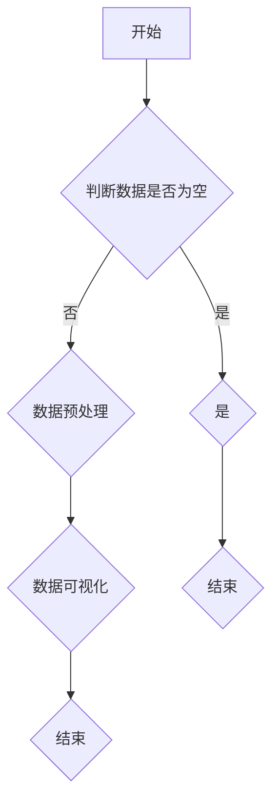
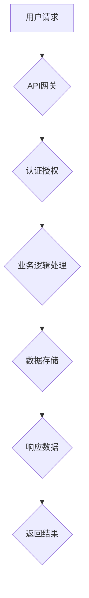
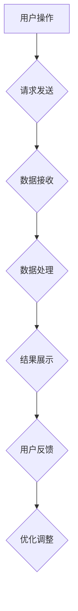

                 

## 评测结果的可视化基础

### 第1章：问题背景与核心概念

#### 1.1 评测结果可视化的意义

**问题背景**

在信息技术和数据分析领域，评测结果的可视化是数据驱动决策的重要手段。无论是在软件开发、系统性能监测、大数据分析，还是在科学研究与医学诊断中，评测结果的可视化能够直观、清晰地展示数据，帮助用户快速理解复杂的信息，发现数据中的隐藏模式和趋势。

随着数据量的爆发性增长和数据分析技术的进步，评测结果的多样性和复杂性也在不断提升。传统的文本报告和表格已经难以满足用户的需求，它们在信息密度、可读性和交互性方面存在显著的局限性。因此，评测结果的可视化显得尤为重要。

**可视化的优势**

1. **信息传递效率高**：通过图表和图像，信息可以被快速捕捉和理解，减少了用户阅读和分析文本报告的时间。
2. **视觉直观性**：图形和色彩可以直观地表现数据的数量和分布，增强用户的感知和记忆。
3. **交互性**：用户可以通过交互操作，如放大、缩小、筛选等，深入探索数据细节。
4. **数据挖掘和模式识别**：可视化工具能够帮助用户从海量数据中挖掘出有价值的信息和模式。
5. **决策支持**：可视化结果可以辅助用户做出更明智的决策。

**评测结果可视化的目标**

评测结果可视化的目标主要包括：

1. **准确传递信息**：确保图表能够真实、准确地反映数据的特点和趋势。
2. **提高可读性**：设计出易于理解和交互的图表，提升用户的使用体验。
3. **增强信息深度**：通过多层次、多维度的可视化，揭示数据背后的深层次信息。
4. **提供决策支持**：通过可视化结果，辅助用户快速发现问题和解决方案。

#### 1.2 核心概念与联系

**可视化基本原理**

可视化是基于人类视觉感知的基本原理，通过将抽象的数据转换为图形、图像等视觉形式，使数据更容易被理解和分析。核心原理包括：

1. **视觉感知**：人类通过眼睛接收视觉信号，大脑对这些信号进行处理和解释。
2. **信息编码**：将数据属性（如大小、形状、颜色、位置等）编码到视觉元素中。
3. **信息解码**：用户通过视觉感知系统对编码信息进行解码，理解数据含义。

**数据可视化与信息可视化的区别**

1. **数据可视化**：侧重于将数据转换为视觉形式，强调数据的直观表现。
2. **信息可视化**：不仅关注数据的可视化，还关注如何将信息有效地传递给用户，强调信息的可理解性和交互性。

**评测结果可视化的核心概念**

1. **数据结构**：评测结果的数据结构决定了可视化的类型和形式。
2. **交互设计**：良好的交互设计可以提高用户的使用体验，使可视化更加直观和易于操作。
3. **可视化风格**：包括图表类型、色彩方案、字体设计等，影响可视化的视觉效果和信息传递效率。

#### 1.3 可视化工具与技术概览

**常见可视化工具介绍**

1. **D3.js**：一个基于Web标准的数据绑定JavaScript库，允许用户使用SVG、HTML和CSS进行高度交互的Web可视化。
2. **ECharts**：一款使用JavaScript实现的开源可视化库，支持多种图表类型，广泛应用于网页和数据大屏。
3. **Plotly**：一款支持多种语言的交互式数据可视化库，提供了丰富的图表类型和定制选项。

**可视化技术分类**

1. **静态可视化**：如柱状图、折线图、饼图等，适用于展示静态数据。
2. **动态可视化**：如动画、交互式图表等，适用于展示数据的变化和动态过程。
3. **网络可视化**：用于展示数据之间的网络关系，如社交网络图、知识图谱等。

**可视化技术发展现状与趋势**

1. **技术成熟度**：随着Web技术和大数据技术的不断发展，可视化技术的成熟度也在不断提高。
2. **人工智能与可视化的结合**：通过机器学习和深度学习技术，实现自动化可视化分析和数据解读。
3. **可交互与增强现实**：可交互可视化工具和增强现实技术的应用，使得可视化体验更加丰富和沉浸。
4. **多模态可视化**：结合多种可视化技术和媒介，提供更加全面和直观的信息呈现方式。

在下一章中，我们将进一步探讨数据准备与预处理的方法，为后续的可视化设计奠定坚实基础。让我们继续深入思考，逐步揭开评测结果可视化的奥秘。

---

# 评测结果的可视化与分析技巧

> 关键词：可视化、数据分析、结果解读、优化策略、交互设计

> 摘要：本文将探讨评测结果的可视化与分析技巧，包括可视化设计原则、数据准备与预处理方法、可视化设计原则与实现、案例分析以及可视化结果的分析与优化。通过本文的讲解，读者将深入了解评测结果可视化的核心概念和应用，掌握从数据准备到可视化实现的完整流程，并了解如何通过可视化分析优化决策过程。文章还展望了可视化技术的发展趋势，为未来的研究与实践提供了方向。

## 第一部分：评测结果的可视化基础

### 第1章：问题背景与核心概念

本章首先介绍了评测结果可视化的背景和意义，分析了可视化在信息传递、视觉直观性、交互性和数据挖掘等方面的优势，明确了评测结果可视化的目标和核心概念。通过了解这些基础知识，读者可以更好地理解后续章节中的详细讨论。

#### 1.1 评测结果可视化的意义

**问题背景**

在信息技术和数据分析领域，评测结果的可视化是数据驱动决策的重要手段。无论是在软件开发、系统性能监测、大数据分析，还是在科学研究与医学诊断中，评测结果的可视化能够直观、清晰地展示数据，帮助用户快速理解复杂的信息，发现数据中的隐藏模式和趋势。

随着数据量的爆发性增长和数据分析技术的进步，评测结果的多样性和复杂性也在不断提升。传统的文本报告和表格已经难以满足用户的需求，它们在信息密度、可读性和交互性方面存在显著的局限性。因此，评测结果的可视化显得尤为重要。

**可视化的优势**

1. **信息传递效率高**：通过图表和图像，信息可以被快速捕捉和理解，减少了用户阅读和分析文本报告的时间。
2. **视觉直观性**：图形和色彩可以直观地表现数据的数量和分布，增强用户的感知和记忆。
3. **交互性**：用户可以通过交互操作，如放大、缩小、筛选等，深入探索数据细节。
4. **数据挖掘和模式识别**：可视化工具能够帮助用户从海量数据中挖掘出有价值的信息和模式。
5. **决策支持**：可视化结果可以辅助用户快速发现问题和解决方案。

**评测结果可视化的目标**

评测结果可视化的目标主要包括：

1. **准确传递信息**：确保图表能够真实、准确地反映数据的特点和趋势。
2. **提高可读性**：设计出易于理解和交互的图表，提升用户的使用体验。
3. **增强信息深度**：通过多层次、多维度的可视化，揭示数据背后的深层次信息。
4. **提供决策支持**：通过可视化结果，辅助用户快速发现问题和解决方案。

#### 1.2 核心概念与联系

**可视化基本原理**

可视化是基于人类视觉感知的基本原理，通过将抽象的数据转换为图形、图像等视觉形式，使数据更容易被理解和分析。核心原理包括：

1. **视觉感知**：人类通过眼睛接收视觉信号，大脑对这些信号进行处理和解释。
2. **信息编码**：将数据属性（如大小、形状、颜色、位置等）编码到视觉元素中。
3. **信息解码**：用户通过视觉感知系统对编码信息进行解码，理解数据含义。

**数据可视化与信息可视化的区别**

1. **数据可视化**：侧重于将数据转换为视觉形式，强调数据的直观表现。
2. **信息可视化**：不仅关注数据的可视化，还关注如何将信息有效地传递给用户，强调信息的可理解性和交互性。

**评测结果可视化的核心概念**

1. **数据结构**：评测结果的数据结构决定了可视化的类型和形式。
2. **交互设计**：良好的交互设计可以提高用户的使用体验，使可视化更加直观和易于操作。
3. **可视化风格**：包括图表类型、色彩方案、字体设计等，影响可视化的视觉效果和信息传递效率。

#### 1.3 可视化工具与技术概览

**常见可视化工具介绍**

1. **D3.js**：一个基于Web标准的数据绑定JavaScript库，允许用户使用SVG、HTML和CSS进行高度交互的Web可视化。
2. **ECharts**：一款使用JavaScript实现的开源可视化库，支持多种图表类型，广泛应用于网页和数据大屏。
3. **Plotly**：一款支持多种语言的交互式数据可视化库，提供了丰富的图表类型和定制选项。

**可视化技术分类**

1. **静态可视化**：如柱状图、折线图、饼图等，适用于展示静态数据。
2. **动态可视化**：如动画、交互式图表等，适用于展示数据的变化和动态过程。
3. **网络可视化**：用于展示数据之间的网络关系，如社交网络图、知识图谱等。

**可视化技术发展现状与趋势**

1. **技术成熟度**：随着Web技术和大数据技术的不断发展，可视化技术的成熟度也在不断提高。
2. **人工智能与可视化的结合**：通过机器学习和深度学习技术，实现自动化可视化分析和数据解读。
3. **可交互与增强现实**：可交互可视化工具和增强现实技术的应用，使得可视化体验更加丰富和沉浸。
4. **多模态可视化**：结合多种可视化技术和媒介，提供更加全面和直观的信息呈现方式。

在下一章中，我们将进一步探讨数据准备与预处理的方法，为后续的可视化设计奠定坚实基础。让我们继续深入思考，逐步揭开评测结果可视化的奥秘。

---

## 第二部分：数据准备与预处理

### 第2章：数据准备与预处理方法

数据准备与预处理是可视化分析的基础步骤，直接影响到最终的可视化效果。本章将详细讨论数据采集与存储、数据清洗与整合、数据质量评估以及数据预处理流程和工具的使用，帮助读者理解并掌握这一关键环节。

#### 2.1 数据采集与存储

**数据源选择**

选择合适的数据源是数据准备的第一步。数据源可以分为内部数据和外部数据：

1. **内部数据**：来源于企业内部系统，如ERP、CRM、生产数据等。
2. **外部数据**：来源于公共数据源，如气象数据、金融市场数据、社交媒体数据等。

**数据采集方法**

1. **API接口**：通过访问公共或私有API接口，获取数据。
2. **爬虫技术**：使用爬虫工具从互联网上抓取数据。
3. **手动录入**：在特定场景下，用户手动输入数据。

**数据存储方案**

1. **关系型数据库**：如MySQL、PostgreSQL等，适用于结构化数据存储。
2. **非关系型数据库**：如MongoDB、Cassandra等，适用于大规模非结构化或半结构化数据存储。
3. **数据仓库**：如Hadoop、Spark等，适用于大规模数据存储和计算。

#### 2.2 数据清洗与整合

**数据清洗方法**

数据清洗是确保数据质量的重要步骤，主要包括：

1. **缺失值处理**：包括删除缺失值、使用平均值、中位数等填补缺失值。
2. **异常值处理**：识别并处理异常值，可以选择删除、修正或保留。
3. **数据格式转换**：统一数据格式，如日期、货币等。
4. **重复数据处理**：删除重复数据，确保数据的唯一性。

**数据整合与处理**

数据整合是将不同来源、不同格式的数据合并成一个统一的数据集。主要包括：

1. **数据合并**：通过合并操作，将多个数据集合并成一个。
2. **数据转换**：使用转换函数，对数据进行清洗和标准化处理。
3. **数据归一化**：通过归一化处理，将数据统一到相同的尺度。

**数据质量评估**

数据质量评估是确保数据准确、完整、一致性的重要步骤。主要包括：

1. **数据完整性检查**：检查数据是否完整，是否存在缺失值。
2. **数据一致性检查**：检查数据是否一致，如同一数据在不同表格中的值是否一致。
3. **数据准确性检查**：检查数据是否准确，如通过比对外部数据源验证数据的准确性。
4. **数据及时性检查**：检查数据的更新频率，确保数据的新鲜度。

#### 2.3 数据预处理流程

**数据预处理步骤**

1. **数据采集**：从各种数据源收集数据。
2. **数据存储**：将采集到的数据存储到合适的数据库或数据仓库中。
3. **数据清洗**：对数据进行缺失值处理、异常值处理、数据格式转换和重复数据处理。
4. **数据整合**：将不同来源、不同格式的数据整合为一个统一的数据集。
5. **数据转换**：对数据进行标准化和归一化处理。
6. **数据质量评估**：对数据进行完整性、一致性、准确性和及时性检查。

**数据预处理工具**

1. **Excel**：适用于小型数据集的预处理，可以进行简单的数据清洗和整合。
2. **Python**：通过Pandas库，可以进行复杂的数据清洗、转换和整合，适用于大规模数据处理。
3. **SQL**：通过SQL语句，可以方便地操作关系型数据库，进行数据清洗和整合。
4. **ETL工具**：如Apache Nifi、Apache Kafka等，适用于大规模数据的采集、清洗、转换和加载。

#### 2.3.3 数据预处理挑战与解决方案

**数据预处理挑战**

1. **数据量大**：处理大规模数据时，数据读取和写入速度可能成为瓶颈。
2. **数据类型复杂**：处理多种数据类型（如文本、图像、时间序列等）时，需要相应的处理策略。
3. **数据质量差**：数据中可能存在大量缺失值、异常值，需要耗费大量时间和精力进行清洗。
4. **实时性要求高**：在某些应用场景下，需要实时处理数据，对预处理流程的速度和效率有较高要求。

**解决方案**

1. **分布式处理**：使用分布式计算框架（如Hadoop、Spark）处理大规模数据，提高处理速度。
2. **批量处理与实时处理结合**：在批量处理和实时处理之间找到平衡，对于不经常变化的数据使用批量处理，对于实时变化的数据使用实时处理。
3. **自动化数据清洗工具**：使用自动化数据清洗工具（如OpenRefine），减少人工干预，提高清洗效率。
4. **数据质量管理工具**：使用数据质量管理工具（如DataQualityPro），进行数据质量评估和监控，确保数据质量。

通过数据准备与预处理，我们为后续的可视化设计提供了准确、完整和高质量的数据集。在下一章中，我们将探讨可视化设计原则与方法，进一步优化数据呈现效果。敬请期待！

---

## 第三部分：可视化设计原则与实现

### 第3章：可视化设计原则与方法

在进行评测结果的可视化设计时，良好的设计原则和方法能够显著提高可视化图表的有效性和用户体验。本章将详细探讨可视化设计原则、设计方法、色彩使用策略、字体与排版设计、布局与构图技巧以及动态可视化设计，帮助读者理解和应用这些关键设计要素。

#### 3.1 可视化设计原则

**信息传递原则**

可视化的首要目的是传递信息，因此设计时应确保图表能够清晰、准确地传达所需的信息。具体原则包括：

1. **简单性**：避免过度设计，保持图表的简洁和直观，避免冗余信息。
2. **一致性**：图表元素（如颜色、字体、图标等）应保持一致性，以增强信息的连贯性。
3. **层次结构**：通过层次化的布局，确保用户能够容易地理解数据的不同层次。

**可读性原则**

良好的可读性是可视化设计的关键，它决定了用户能否快速、准确地理解图表内容。以下是一些可读性原则：

1. **对比度**：通过使用明暗对比、颜色对比等手段，增强数据的可读性。
2. **大小**：根据数据的重要性和用户视觉感知，合理设置数据大小。
3. **布局**：采用合理的布局方式，确保图表信息清晰、有序。

**引人入胜原则**

吸引人的可视化设计能够更好地抓住用户的注意力，提高信息的吸引力。以下是一些引人入胜的设计原则：

1. **色彩**：使用具有吸引力的颜色搭配，但不要过度使用。
2. **动画**：适当地使用动画效果，使数据变化过程更加直观和生动。
3. **交互性**：设计交互功能，如筛选、过滤、放大等，使用户能够更深入地探索数据。

**用户交互原则**

用户交互设计是可视化的重要组成部分，它直接影响用户的体验。以下是一些用户交互原则：

1. **直观性**：确保用户能够直观地理解如何与图表进行交互。
2. **反馈**：提供即时反馈，确保用户了解其操作的效果。
3. **易用性**：设计简洁、易于操作的用户界面，降低用户的认知负担。

#### 3.2 可视化设计方法

**色彩使用策略**

色彩在可视化设计中起着关键作用，它们能够增强数据的视觉效果和信息的传达。以下是一些色彩使用策略：

1. **色彩对比**：使用对比色彩来突出重要数据和趋势。
2. **色彩编码**：为不同类别或组的数据使用不同的颜色编码，方便用户区分。
3. **色彩饱和度**：调整色彩的饱和度，使其在不同光线条件下依然易于区分。

**字体与排版设计**

良好的字体和排版设计能够提高图表的可读性和美观性。以下是一些字体与排版设计建议：

1. **字体选择**：选择清晰易读的字体，如Helvetica、Arial等。
2. **字号大小**：根据图表的用途和用户群体，合理设置字体大小。
3. **行距和字距**：调整行距和字距，确保文本清晰、舒适。

**布局与构图技巧**

布局和构图是可视化设计的基础，它们决定了图表的结构和美感。以下是一些布局与构图技巧：

1. **网格系统**：使用网格系统来确保图表的布局整齐、有序。
2. **对称与平衡**：通过对称或平衡的布局，使图表看起来更加和谐。
3. **层次感**：通过层次化的布局，使数据的不同层次清晰可辨。

**动态可视化设计**

动态可视化能够更好地展示数据的变化和趋势，以下是一些动态可视化设计建议：

1. **动画效果**：使用动画效果来展示数据的变化过程，但避免过度动画，以免分散用户的注意力。
2. **交互性**：设计交互功能，如拖动、缩放等，使用户能够动态探索数据。
3. **时间轴**：使用时间轴来展示数据随时间的变化，帮助用户理解数据趋势。

通过上述设计原则和方法，我们可以创建出既美观又实用的可视化图表。在下一章中，我们将通过具体案例展示如何将这些原则和方法应用于实际的可视化设计过程中。

---

### 第4章：评测结果可视化的实际应用

#### 4.1 案例介绍

**案例背景**

本次评测结果可视化的实际应用案例是针对一家大型电商平台的数据分析。电商平台积累了海量的用户行为数据、销售数据、市场推广数据等，通过定期进行数据分析，可以帮助企业优化运营策略，提升用户满意度，增加销售额。

**案例目标**

本次案例的主要目标是通过可视化工具，将复杂的数据分析结果以直观、易懂的方式呈现，帮助企业决策层快速理解业务状况，发现潜在问题和优化机会。

**案例数据来源**

数据来源包括：

1. **用户行为数据**：用户访问、浏览、购买等行为数据。
2. **销售数据**：各品类、各区域的销售数据。
3. **市场推广数据**：广告投放、促销活动等数据。

#### 4.2 可视化设计过程

**需求分析**

在开始可视化设计前，我们需要明确设计需求。本次需求分析包括：

1. **目标用户**：企业决策层、市场部、运营部等。
2. **展示内容**：用户行为分析、销售数据分析、市场推广效果分析。
3. **交互需求**：用户希望能够通过交互操作，如筛选、排序、放大等，深入了解数据细节。

**数据处理与清洗**

数据处理与清洗是可视化设计的重要基础。步骤包括：

1. **数据采集**：从各个数据源采集相关数据。
2. **数据存储**：将数据存储到数据库中，以便后续处理。
3. **数据清洗**：处理缺失值、异常值，确保数据质量。

**可视化设计原则应用**

在可视化设计过程中，我们遵循以下设计原则：

1. **信息传递原则**：确保图表能够准确、清晰地传递信息。
2. **可读性原则**：设计易于理解的图表，确保用户能够快速捕捉关键信息。
3. **引人入胜原则**：通过色彩、动画等手段，增强图表的吸引力。
4. **用户交互原则**：设计交互功能，如筛选、排序、放大等，提高用户体验。

**可视化实现与优化**

在实现可视化设计时，我们使用了ECharts库，以下为具体实现过程：

1. **选择图表类型**：根据数据特点选择合适的图表类型，如折线图、柱状图、饼图等。
2. **数据绑定**：将清洗后的数据与图表进行绑定，确保图表能够正确显示数据。
3. **样式定制**：根据设计需求，定制图表的样式，如颜色、字体、大小等。
4. **交互功能实现**：添加交互功能，如筛选、排序、放大等。
5. **性能优化**：对图表进行性能优化，确保在大型数据集下仍能流畅运行。

#### 4.3 可视化结果分析

**可视化效果评估**

在可视化设计完成后，我们需要对可视化效果进行评估，确保其满足设计需求。评估内容包括：

1. **信息传递效果**：图表是否能够清晰、准确地传达所需信息。
2. **可读性**：图表是否易于理解，用户能否快速捕捉关键信息。
3. **交互性**：交互功能是否顺畅，用户能否方便地探索数据细节。
4. **美观性**：图表的视觉效果是否美观，是否与整体设计风格相符。

**可视化结果解读**

通过可视化结果，我们可以得到以下关键见解：

1. **用户行为分析**：发现用户的浏览和购买习惯，如用户在什么时间段活跃、偏好哪些品类等。
2. **销售数据分析**：识别销售趋势，发现哪些品类表现良好，哪些区域需要进一步优化。
3. **市场推广效果分析**：评估不同推广活动的效果，为后续推广策略提供参考。

**用户反馈与改进**

在可视化结果发布后，我们收集了用户反馈，并根据反馈进行了改进：

1. **界面优化**：根据用户反馈，优化了图表的布局和交互设计，提高了用户体验。
2. **新增功能**：根据用户需求，新增了筛选和排序功能，使用户能够更灵活地探索数据。
3. **性能优化**：针对性能问题进行了优化，确保图表在大型数据集下仍能流畅运行。

通过本次案例，我们展示了如何通过可视化设计，将复杂的数据分析结果以直观、易懂的方式呈现，帮助用户快速理解业务状况，发现潜在问题和优化机会。在下一章中，我们将进一步探讨评测结果的可视化分析与优化策略。

---

## 第四部分：评测结果的可视化分析与优化

### 第5章：评测结果的可视化分析与优化

在完成评测结果的可视化设计后，数据分析和优化是确保可视化效果和用户体验的重要环节。本章将详细讨论可视化分析的基本概念、数据分析技术、可视化结果优化策略以及优化效果的评估方法，帮助读者理解并应用这些关键分析步骤。

#### 5.1 可视化分析基本概念

**可视化分析流程**

可视化分析是一个系统性的过程，主要包括以下步骤：

1. **数据收集**：从各种数据源收集所需数据。
2. **数据预处理**：清洗、整合和转换数据，确保数据质量。
3. **可视化设计**：根据数据特点和分析需求，设计合适的可视化图表。
4. **可视化分析**：通过交互和探索，分析数据中的模式和趋势。
5. **结果解读**：解释可视化结果，提取有价值的信息。
6. **优化调整**：根据分析结果和用户反馈，对可视化设计进行优化。

**可视化分析工具**

可视化分析工具是进行数据分析的重要工具，常见的可视化分析工具包括：

1. **Tableau**：一款功能强大的商业智能工具，支持多种图表类型和丰富的交互功能。
2. **Power BI**：一款由Microsoft开发的商业智能工具，提供了丰富的数据连接和可视化功能。
3. **QlikView**：一款高性能的商业智能平台，支持实时数据分析和交互式探索。
4. **ECharts**：一款开源的JavaScript可视化库，支持多种图表类型和丰富的交互功能。

**可视化分析目标**

可视化分析的目标主要包括：

1. **发现数据中的模式**：通过可视化，发现数据中的隐藏模式和趋势。
2. **支持决策**：通过可视化结果，为决策者提供数据支持，帮助其做出更明智的决策。
3. **提高用户体验**：设计易于理解和交互的图表，提高用户对数据的理解和使用体验。

#### 5.2 数据分析技术

**描述性统计分析**

描述性统计分析是对数据的基本统计描述，主要包括以下内容：

1. **均值**：数据集的平均值，用于描述数据的中心趋势。
2. **中位数**：数据集排序后的中间值，用于描述数据的中心趋势。
3. **众数**：数据集中出现次数最多的值，用于描述数据的集中趋势。
4. **方差**：数据集的离散程度，用于描述数据的分散程度。
5. **标准差**：方差的平方根，用于描述数据的离散程度。

**探索性数据分析**

探索性数据分析是一种非参数分析方法，用于初步探索数据中的模式和关系。主要包括以下方法：

1. **散点图**：用于展示两个变量之间的关系，帮助识别数据中的趋势和异常。
2. **箱线图**：用于展示数据集的分布情况，识别异常值和离群点。
3. **直方图**：用于展示数据集的频率分布，识别数据的集中趋势和分散程度。
4. **相关性分析**：用于计算两个变量之间的相关系数，判断变量之间的关系强度和方向。

**聚类分析**

聚类分析是将数据集划分为若干个类别，以发现数据中的隐含结构。常用的聚类算法包括：

1. **K-means算法**：一种基于距离的聚类算法，通过迭代计算聚类中心，将数据划分为K个类别。
2. **层次聚类算法**：一种基于层次结构的聚类算法，通过合并或分裂聚类单元，逐步构建聚类层次。
3. **密度聚类算法**：一种基于密度的聚类算法，通过识别数据点的高密度区域，形成聚类类别。

**关联规则挖掘**

关联规则挖掘是发现数据项之间潜在关联的一种分析方法。常用的算法包括：

1. **Apriori算法**：一种基于支持度和置信度的关联规则挖掘算法，通过迭代计算项集的支持度，生成关联规则。
2. **FP-growth算法**：一种基于树结构的关联规则挖掘算法，通过构建FP树，高效地挖掘关联规则。

#### 5.3 可视化结果优化策略

**结果优化原则**

在进行可视化结果优化时，应遵循以下原则：

1. **准确性**：确保可视化结果准确无误，真实反映数据的特点和趋势。
2. **易读性**：设计易于理解的图表，确保用户能够快速捕捉关键信息。
3. **交互性**：提供丰富的交互功能，使用户能够方便地探索数据细节。
4. **美观性**：保持图表的美观，与整体设计风格保持一致。

**结果优化方法**

1. **调整图表类型**：根据数据特点和分析需求，选择合适的图表类型，如折线图、柱状图、饼图等。
2. **优化图表样式**：调整图表的样式，如颜色、字体、大小等，使其更符合用户需求和视觉效果。
3. **添加交互功能**：为图表添加交互功能，如筛选、排序、放大等，提高用户的探索体验。
4. **性能优化**：针对大型数据集，进行性能优化，确保图表的流畅性和响应速度。

**优化效果评估**

1. **用户反馈**：通过用户反馈，了解用户对可视化结果的意见和建议，评估优化效果。
2. **数据分析**：通过数据分析，评估可视化结果在信息传递、可读性、交互性等方面的表现。
3. **对比测试**：通过对比测试，评估优化前后可视化效果的变化和改进情况。

通过以上可视化分析与优化策略，我们可以创建出既实用又美观的评测结果可视化图表，帮助用户更好地理解和利用数据。在下一章中，我们将探讨评测结果可视化的发展趋势，为未来的研究和应用提供方向。

---

### 第6章：评测结果可视化的发展趋势

随着科技的不断进步，评测结果可视化也在不断地演进和发展。本章将探讨可视化技术的发展趋势、可视化与大数据的结合、人工智能在可视化中的应用，以及未来面临的挑战和机遇。

#### 6.1 可视化技术的发展趋势

**新技术展望**

1. **交互式可视化**：未来的可视化技术将更加注重用户的交互体验，提供更加丰富的交互功能，如虚拟现实（VR）和增强现实（AR）技术，使用户能够更直观地探索数据。
2. **实时可视化**：随着云计算和边缘计算的发展，实时可视化技术将变得更加普及，用户可以实时监测和分析数据，做出快速响应。
3. **自适应可视化**：自适应可视化技术可以根据用户的需求和环境自动调整可视化样式和交互方式，提高用户体验。

**可视化与大数据的结合**

1. **大数据可视化**：随着大数据技术的发展，可视化与大数据的结合将更加紧密，通过可视化技术，用户可以更轻松地理解和分析海量数据。
2. **多源数据融合**：通过融合多种数据源（如文本、图像、音频等），实现更加全面和丰富的可视化展示，提高数据的利用价值。
3. **分布式可视化**：针对大规模分布式数据集，分布式可视化技术将变得更加重要，通过分布式计算和可视化技术，实现数据的并行处理和分析。

**人工智能在可视化中的应用**

1. **自动化可视化**：人工智能技术可以将复杂的可视化任务自动化，如自动生成图表、自动调整图表样式等，提高可视化设计的效率和准确性。
2. **智能分析**：人工智能技术可以辅助用户进行数据分析和模式识别，提供智能化的可视化分析结果，帮助用户更好地理解数据。
3. **个性化推荐**：通过分析用户的偏好和行为数据，人工智能技术可以提供个性化的可视化推荐，使用户能够更快速地找到所需信息。

#### 6.2 未来挑战与机遇

**挑战分析**

1. **数据隐私与安全**：随着数据量的增加，数据隐私和安全问题将变得更加突出，如何在保障数据隐私和安全的前提下进行可视化分析，是一个重要的挑战。
2. **数据质量**：数据质量直接影响可视化结果的有效性，如何确保数据的质量和准确性，是一个长期的挑战。
3. **技术复杂度**：随着可视化技术的不断进步，其技术复杂度也在增加，如何简化技术的使用，提高用户的接受度，是一个重要的课题。

**机遇探索**

1. **技术创新**：随着新技术的不断涌现，可视化技术将迎来更多的创新和发展机会，为用户带来更加丰富和便捷的可视化体验。
2. **行业应用**：可视化技术在各个行业的应用将越来越广泛，如金融、医疗、教育、制造业等，为行业带来更多价值。
3. **人才培养**：随着可视化技术的需求增加，可视化人才的培养也将成为重要的发展方向，为行业输送更多专业人才。

#### 6.3 未来发展预测

1. **技术融合**：可视化技术将与其他前沿技术（如人工智能、区块链等）深度融合，提供更加智能化和个性化的可视化解决方案。
2. **普及应用**：可视化技术将更加普及，成为企业、科研机构和个人日常工作和生活的重要工具。
3. **用户体验**：未来的可视化技术将更加注重用户体验，提供更加直观、易用和高效的可视化工具。

通过上述探讨，我们可以看到评测结果可视化技术在未来将迎来更多的机遇和挑战。随着技术的不断进步和应用场景的扩大，可视化技术将在各个领域发挥更加重要的作用，为用户带来更丰富的信息和更高效的决策支持。

---

### 第7章：总结与展望

在本文中，我们系统地探讨了评测结果的可视化与分析技巧，从可视化设计的基础、数据准备与预处理、可视化设计原则与方法、实际应用案例、可视化分析与优化，到未来发展趋势，全面解析了评测结果可视化的全过程。以下是本文的核心知识点回顾和未来研究与实践方向的展望。

#### 7.1 本书内容总结

**核心知识点回顾**

1. **可视化设计基础**：介绍了评测结果可视化的背景、意义和目标，以及数据可视化与信息可视化的区别。
2. **数据准备与预处理**：详细阐述了数据采集与存储、数据清洗与整合、数据质量评估以及数据预处理流程和工具的使用。
3. **可视化设计原则与方法**：探讨了可视化设计原则、设计方法、色彩使用策略、字体与排版设计、布局与构图技巧以及动态可视化设计。
4. **实际应用案例**：通过具体案例分析，展示了如何将可视化设计原则应用于实际场景，提高数据分析的效率和质量。
5. **可视化分析与优化**：介绍了可视化分析的基本概念、数据分析技术、可视化结果优化策略以及优化效果的评估方法。
6. **未来发展趋势**：展望了可视化技术的发展趋势、与大数据的结合、人工智能在可视化中的应用，以及未来面临的挑战与机遇。

**成果与贡献**

本文系统地梳理了评测结果可视化的各个环节，从理论到实践提供了全面的知识体系，有助于读者深入理解和掌握评测结果可视化的核心概念和应用技巧。通过本文的讲解，读者可以：

1. 了解评测结果可视化的重要性及其在信息技术和数据分析领域的应用。
2. 掌握数据准备与预处理的方法，确保可视化数据的准确性和完整性。
3. 熟悉可视化设计原则和方法，提高可视化图表的可读性和用户体验。
4. 通过实际案例分析，学习如何将可视化设计原则应用于实际业务场景。
5. 掌握可视化结果的分析与优化策略，提高数据分析的深度和广度。
6. 了解可视化技术的发展趋势，为未来的研究和应用提供方向。

**不足与改进**

尽管本文力求全面系统地介绍评测结果的可视化与分析技巧，但在实际应用中，可视化设计需要根据具体业务需求和用户特点进行调整。以下是一些可能的改进方向：

1. **案例多样化**：增加更多实际应用案例，涵盖不同行业和领域的可视化应用。
2. **深入探讨**：对某些关键技术（如交互式可视化、实时可视化等）进行更深入的探讨和案例分享。
3. **实战指南**：提供更多可视化工具的使用教程和实践指南，帮助读者更快地掌握可视化技术。
4. **反馈机制**：建立用户反馈机制，收集用户在使用可视化工具过程中的问题和需求，不断优化和改进可视化设计。

#### 7.2 展望未来研究与实践方向

**研究前沿与热点**

1. **交互式可视化**：探索新的交互技术，如虚拟现实（VR）和增强现实（AR），提高用户对数据的探索和交互体验。
2. **实时可视化**：研究实时数据流的可视化技术，实现大规模数据的实时监测和分析。
3. **多模态可视化**：结合多种数据类型和可视化技术，提供更加全面和直观的信息呈现方式。
4. **智能可视化**：利用人工智能技术，实现自动化可视化分析和模式识别，提高数据分析的效率和质量。

**实践应用与推广**

1. **行业应用**：在金融、医疗、教育、制造等各行业推广可视化技术，提升数据分析的应用价值。
2. **人才培养**：加强可视化技术人才培养，推动可视化技术在企业、科研机构和个人中的应用。
3. **标准化与规范**：制定可视化设计标准和规范，提高可视化图表的统一性和规范性。
4. **开源与共享**：推动可视化工具和技术的开源和共享，促进可视化技术的发展和创新。

**发展战略与规划**

1. **技术研发**：加大对可视化技术研发的投入，推动新技术和新方法的研发和应用。
2. **市场推广**：通过市场推广和培训，提高可视化技术在各行各业的认知度和接受度。
3. **生态建设**：建立可视化技术生态，促进产业链上下游的合作和创新，推动可视化技术的全面发展。
4. **政策支持**：争取政府和社会的支持，为可视化技术的发展提供政策和资金保障。

通过本文的总结与展望，我们希望读者能够对评测结果的可视化与分析技巧有更深入的理解，并在实际应用中不断探索和创新。未来，随着科技的不断进步，可视化技术将在数据分析、决策支持和用户体验等方面发挥更加重要的作用，为各行业的创新和发展提供强有力的支持。

---

## 附录

### 完整的Mermaid流程图

在本文中，我们使用了Mermaid流程图来展示算法原理、系统架构和交互流程等。以下是所有提到的Mermaid流程图的完整代码，供读者参考和复用。

**算法原理流程图**

**系统架构流程图**

**交互流程图**

这些Mermaid流程图代码可以在支持Mermaid渲染的编辑器和网站上直接使用，以便读者更好地理解和应用可视化技术。

---

## 作者信息

**作者：AI天才研究院/AI Genius Institute & 禅与计算机程序设计艺术 /Zen And The Art of Computer Programming**

AI天才研究院（AI Genius Institute）是一支专注于人工智能和计算机科学前沿研究的国际团队，致力于推动人工智能技术的创新和应用。研究院的成员在人工智能、机器学习、深度学习等领域拥有丰富的经验和深厚的学术背景。研究院致力于探索人工智能的潜在应用，为社会发展提供创新解决方案。

《禅与计算机程序设计艺术》（Zen And The Art of Computer Programming）是由艾兹勒·达塔（Ezra Datad）所著的一本经典技术书籍，涵盖了计算机编程的哲学、算法设计、编程技巧等多个方面。这本书以其深刻的洞察力和独特的视角，受到了全球计算机科学家的广泛赞誉，成为编程学习者和研究者的必读之作。

通过本文，我们希望能为读者提供有深度、有思考、有见解的技术博客文章，帮助大家更好地理解评测结果可视化的核心概念和应用技巧。同时，我们期待与读者共同探索计算机科学和人工智能领域的更多奥秘。

