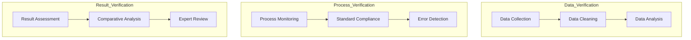

                 


### 第1章：问题背景与核心概念

#### 1.1 问题背景

评测结果作为科研、工程、教育和商业等多个领域的重要输出，其准确性和可靠性直接影响到决策的科学性和有效性。随着人工智能技术的广泛应用，评测结果的复杂性和多样性也日益增加，传统的单一评价方法已经无法满足高质量、高可信度的要求。因此，如何保证评测结果的准确性和公正性，成为了当前亟需解决的问题。

首先，从科研角度来看，评测结果的质量直接影响到研究成果的创新性和可复现性。学术界的同行评审机制在一定程度上保障了科研论文的质量，但这一机制在数据处理、模型训练等应用场景下仍然存在局限性。例如，某些复杂模型的评测结果往往受到数据噪声和算法偏差的影响，单靠人工审核难以保证其准确性。

其次，在工程领域，评测结果的质量直接关系到项目的进度和质量。例如，软件质量评估中的代码审查、性能测试等环节，都需要依赖于准确的评测结果。如果评测结果存在偏差，可能导致项目延误、成本增加，甚至影响项目的整体成功。

再者，教育领域中的学生成绩评估、课程质量评价等，也依赖于评测结果的准确性。教育公平是社会的核心价值之一，如果评测结果不准确，将导致教育资源分配不均，影响学生的发展和成长。

最后，在商业领域，评测结果在市场调研、产品评估等方面发挥着重要作用。准确、可靠的评测结果能够帮助企业做出明智的决策，提高市场竞争力。

#### 1.1.2 同行评审与验证机制的概念

同行评审（Peer Review）是指由专家或同行对研究、工程、教育等领域的成果进行评价和审核的过程。其核心目的是通过专业的评估，确保评测结果的准确性和公正性。同行评审通常包括三个阶段：准备阶段、评审阶段和反馈阶段。

验证机制（Verification Mechanism）则是指一系列方法和流程，用于验证评测结果的准确性和可靠性。验证机制通常包括数据验证、过程验证和结果验证等环节。数据验证主要确保评测数据的质量，过程验证关注评测过程的规范性，结果验证则评估评测结果的合理性。

#### 1.2 核心概念与联系

同行评审与验证机制在确保评测结果质量方面具有紧密的联系。同行评审通过专家的独立评价，为验证机制提供参考依据。而验证机制则通过一系列的验证流程，确保评测结果的准确性和可靠性。

首先，从原理上看，同行评审和验证机制都遵循科学性和公正性的原则。同行评审依靠专家的专业知识和经验，对评测结果进行评估；验证机制则通过科学的方法和流程，对评测结果进行客观、准确的验证。

其次，从过程上看，同行评审和验证机制相互衔接。同行评审在准备阶段收集数据，进行初步评估，为验证机制提供基础；验证机制则在评审阶段对评测结果进行深入验证，确保其准确性和可靠性。

最后，从结果上看，同行评审和验证机制共同作用，提高评测结果的质量。同行评审通过专家评价，发现评测结果的问题，提供改进建议；验证机制则通过验证流程，确保评测结果的准确性和可靠性。

#### 1.3 边界与外延

同行评审和验证机制的应用领域非常广泛，涵盖了科研、工程、教育、商业等多个领域。然而，每个领域的具体应用场景和需求有所不同，因此需要根据实际情况进行定制化设计和实施。

首先，在科研领域，同行评审主要用于学术论文的评价。学术期刊通常要求作者提交论文，然后邀请相关领域的专家进行评审，以决定论文的发表与否。验证机制则主要用于确保评审过程的公正性和评审结果的准确性。

其次，在工程领域，同行评审通常用于项目评估和验收。项目经理或客户可以邀请相关领域的专家对项目进行评审，以评估项目进度、质量和性能。验证机制则用于确保评审过程的规范性，以及评审结果的准确性和可靠性。

再者，在教育领域，同行评审主要用于学生成绩评估和课程质量评价。教师或学校可以邀请同行对学生的成绩进行评审，以确保评价的公平性和准确性。验证机制则用于确保评价过程的科学性和评价结果的可靠性。

最后，在商业领域，同行评审和验证机制主要用于市场调研、产品评估和客户满意度调查等。企业可以通过邀请专家进行评审，评估产品的性能、质量和用户体验，从而指导产品改进和决策。

#### 1.4 概念结构与核心要素组成

同行评审和验证机制的概念结构主要包括以下几个核心要素：

1. **评审对象**：指需要评审的具体内容，如学术论文、项目报告、学生成绩等。
2. **评审主体**：指进行评审的人员，通常是专家或同行。
3. **评审过程**：指评审的各个环节，包括准备、评审、反馈等。
4. **评审标准**：指评审的具体标准和指标，如论文的质量、项目的进度和质量、学生的成绩等。
5. **评审结果**：指评审的最终输出，如论文的发表与否、项目的评估等级、学生的成绩等。
6. **验证流程**：指验证评测结果的过程，包括数据验证、过程验证和结果验证等。

这些要素相互关联，共同构成一个完整的评审和验证体系。

#### 1.5 本章小结

本章从问题背景、核心概念、联系、边界与外延以及概念结构与核心要素组成等方面，对评测结果的同行评审与验证机制进行了全面介绍。通过本章的学习，读者可以初步了解同行评审与验证机制的基本概念、原理和应用场景，为后续章节的深入探讨打下基础。

---

### 第2章：同行评审原理

#### 2.1 同行评审的发展历程

同行评审（Peer Review）作为一种学术评价机制，其历史可以追溯到17世纪的英国。当时，科学家和学者开始自发地交换学术论文，并进行相互评价。这种初步的同行评审形式，为后来的正式评审机制奠定了基础。

随着科学研究的不断发展和学术交流的日益频繁，18世纪末至19世纪初，学术期刊逐渐普及。学术期刊编辑部开始邀请相关领域的专家对提交的论文进行评审，以确保论文的质量。这一时期的同行评审主要依赖于编辑部的资源和专业判断。

进入20世纪，随着学术交流的国际化，同行评审逐渐成为一种全球性的学术评价标准。学术期刊要求作者提交论文的同时，必须提供若干名同行评审专家的联系方式。评审专家通过阅读论文，提出修改建议，最终决定论文的发表与否。

21世纪，随着互联网和信息技术的发展，同行评审也发生了巨大的变化。在线同行评审系统、远程评审和自动化评审等新兴模式，使得评审过程更加高效和透明。同时，同行评审的范围也从传统的学术期刊扩展到科研基金申请、学术会议论文等更广泛的领域。

#### 2.2 同行评审的基本原理

同行评审的基本原理是通过专家的独立评价，对研究内容进行评估和审核。其核心目标包括：

1. **确保研究质量**：通过专家的评审，确保研究方法、实验设计和数据分析等环节的科学性和严谨性。
2. **提高研究透明度**：同行评审的过程和结果公开透明，有助于提高研究的可信度和公正性。
3. **促进学术交流**：评审过程中，作者与评审专家的互动有助于学术思想的碰撞和交流，促进学术进步。
4. **指导研究成果的发表和推广**：评审结果可以为作者提供修改建议，帮助其完善研究，同时为学术期刊、科研基金等提供决策依据。

同行评审的过程通常包括以下几个阶段：

1. **准备阶段**：作者提交研究论文，编辑部或评审委员会选择合适的评审专家。
2. **评审阶段**：评审专家在规定时间内阅读论文，提出评审意见。评审意见包括对论文的肯定、建议和批评。
3. **反馈阶段**：评审专家将评审意见反馈给作者，作者根据意见进行修改。编辑部或评审委员会再次审核修改后的论文，最终决定是否接受发表。

#### 2.3 同行评审的属性特征对比

同行评审的属性特征主要包括准确性、效率和公平性。以下是对这些特征的详细对比：

| 特征       | 解释                                                         | 对比分析 |
|------------|--------------------------------------------------------------|----------|
| **准确性** | 评审专家对研究内容的评估是否准确，能够揭示研究中的问题和不足。 | 同行评审通常依赖于专家的经验和专业知识，具有较高的准确性。然而，专家的主观判断可能影响评审结果的准确性。自动化评审在数据处理和模式识别方面具有优势，但可能缺乏对研究内容的全面理解。 |
| **效率**   | 评审过程的快速性和高效性，包括评审时间、反馈速度等。         | 同行评审的时间效率受评审专家数量和专业背景的限制，可能导致评审周期较长。自动化评审系统可以提高评审速度，减少人为干预，但需要确保系统的稳定性和准确性。 |
| **公平性** | 评审过程的公正性和透明性，评审专家的选择和评审意见的记录是否公平。 | 同行评审的公平性取决于评审专家的选择和评审过程的透明度。自动化评审系统可以通过预设的规则和流程，确保评审过程的公正性和透明性，减少人为干预的可能性。 |

#### 2.4 同行评审的ER实体关系图

为了更清晰地描述同行评审的实体关系，我们可以使用ER（实体-关系）模型来表示。以下是一个简单的ER实体关系图，展示了同行评审的主要实体及其关系：

```mermaid
erDiagram
    Author ||--|{ Reviewer }|<|
    Article ||--|{ Review }|<|
    Journal ||--|{ Article }|<|
    Review ||--|{ Comment }|<|
```

**实体与关系定义：**

- **Author（作者）**：指提交论文的个人或团队。
- **Reviewer（评审专家）**：指参与评审的专家。
- **Article（论文）**：指提交评审的学术作品。
- **Journal（期刊）**：指发表论文的学术期刊。
- **Review（评审）**：指评审专家对论文的评价和意见。
- **Comment（评论）**：指评审专家对论文的详细评论和建议。

**ER实体关系图展示：**


在这个ER实体关系图中，作者提交论文给期刊，期刊分配给评审专家进行评审。评审专家对论文进行评审，并提交评审意见和评论。评审意见和评论形成对论文的评审结果，最终由期刊决定论文的接受与否。

#### 2.5 本章小结

本章详细介绍了同行评审的发展历程、基本原理和属性特征，并通过ER实体关系图展示了同行评审的主要实体及其关系。通过对同行评审的深入理解，读者可以更好地把握其核心原理和关键要素，为后续章节的深入探讨打下基础。

---

### 第3章：验证机制原理

#### 3.1 验证机制的定义与目的

验证机制（Verification Mechanism）是一种用于确保评测结果准确性和可靠性的方法和流程。其核心目的是通过一系列验证手段，对评测过程的各个环节进行监督和检验，从而提高评测结果的科学性、公正性和可信度。

首先，验证机制的定义可以从以下几个方面进行理解：

1. **数据验证**：确保评测数据的质量和完整性，包括数据的准确性、一致性、完整性等。
2. **过程验证**：监督评测过程的规范性，确保评测过程符合既定的标准和方法。
3. **结果验证**：评估评测结果的合理性和科学性，验证评测结果与实际预期的一致性。

其次，验证机制的目的主要包括：

1. **提高评测结果的准确性**：通过数据验证和结果验证，确保评测数据的准确性和结果的科学性。
2. **增强评测结果的可信度**：通过过程验证，确保评测过程的规范性和透明度，提高结果的可信度。
3. **保证评测结果的公正性**：通过多维度的验证，减少主观偏见和误差，提高评测结果的公正性。

#### 3.2 验证机制的基本原理

验证机制的基本原理可以概括为以下三个方面：

1. **系统性**：验证机制应覆盖评测过程的各个环节，包括数据采集、处理、分析和结果输出等，形成一个完整的验证体系。
2. **全面性**：验证机制应具备全面性，涵盖评测数据的各个方面，包括数据的质量、一致性、完整性和可靠性等。
3. **独立性**：验证机制应具备独立性，由独立的第三方机构或团队进行验证，确保验证过程的公正性和客观性。

具体来说，验证机制的基本原理包括以下几方面：

1. **数据质量评估**：通过对数据的质量进行评估，确定数据的准确性、一致性和完整性。数据质量评估可以采用多种方法，如数据清洗、异常值检测和重复数据识别等。
2. **过程监控**：通过监控评测过程，确保评测过程符合既定的标准和方法。过程监控可以采用实时监控、抽样检查和审核记录等方法。
3. **结果审核**：通过对评测结果进行审核，验证评测结果的合理性和科学性。结果审核可以采用专家评审、数据对比和模型验证等方法。

#### 3.3 验证机制的核心要素分析

验证机制的核心要素主要包括数据的准确性、结果的可信度和过程的透明度。以下是对这些要素的详细分析：

1. **数据的准确性**：数据的准确性是验证机制的基础。如果数据存在错误或不准确，那么基于这些数据的评测结果也将失去可靠性。为了确保数据的准确性，验证机制需要采取多种措施，如数据清洗、异常值处理和交叉验证等。

2. **结果的可信度**：评测结果的可信度直接关系到决策的科学性和有效性。为了提高结果的可信度，验证机制需要从多个维度进行验证，如数据验证、过程验证和结果验证等。此外，验证机制还需要确保评测结果的透明度，使决策者能够清晰地了解评测过程和结果。

3. **过程的透明度**：过程的透明度是确保验证机制公正性和可信度的关键。通过建立透明的验证流程，使评测过程的每一步都有据可查，有助于减少主观偏见和人为干预。透明的验证流程还可以提高决策者的信任度和接受度，使评测结果更具说服力。

#### 3.4 验证机制的Mermaid流程图

为了更直观地展示验证机制的过程和步骤，我们可以使用Mermaid绘制一个流程图。以下是一个简化的验证机制流程图：



**流程图设计：**

- **数据验证**：包括数据采集、数据清洗和数据分析三个步骤。数据采集阶段收集原始数据，数据清洗阶段处理数据中的错误和不一致，数据分析阶段对数据进行分析和解释。
- **过程验证**：包括过程监控、标准合规性和错误检测三个步骤。过程监控阶段实时监控评测过程，标准合规性阶段确保评测过程符合既定标准，错误检测阶段发现和纠正评测过程中的错误。
- **结果验证**：包括结果评估、比较分析和专家评审三个步骤。结果评估阶段对评测结果进行初步评估，比较分析阶段将评测结果与预期目标进行比较，专家评审阶段由专家对评测结果进行详细审核和评价。

**流程图展示：**


#### 3.5 本章小结

本章详细介绍了验证机制的定义、目的和基本原理，分析了验证机制的核心要素，并使用Mermaid绘制了验证机制的流程图。通过对验证机制的深入理解，读者可以更好地把握其关键要素和实施步骤，为后续章节的深入探讨提供理论基础。

---

### 第4章：评测结果的同行评审

#### 4.1 同行评审在评测结果中的应用

同行评审在评测结果中的应用具有重要意义，其主要体现在以下几个方面：

1. **提高评测结果的准确性**：同行评审通过专家的独立评价，对评测结果进行细致分析和评估，可以有效识别和纠正评测结果中的潜在错误和偏差，提高评测结果的准确性。

2. **增强评测结果的可信度**：同行评审的透明性和公正性有助于增强评测结果的可信度。评审过程的公开透明，使评测结果的可靠性得到保障，从而提高决策者对评测结果的信任度。

3. **促进学术交流**：同行评审过程中，作者与评审专家之间的互动和交流，有助于学术思想的碰撞和融合，推动学术研究的进步和发展。

4. **指导评测结果的修改和改进**：同行评审的反馈意见可以为作者提供宝贵的修改建议，帮助其完善评测方法和结果，提高评测质量。

#### 4.2 同行评审在评测结果中的应用流程

同行评审在评测结果中的应用通常包括以下几个阶段：

1. **准备阶段**：作者提交评测结果，评审委员会或期刊编辑部根据论文的质量和领域选择合适的评审专家。

2. **评审阶段**：评审专家在规定时间内阅读评测结果，根据评审标准和要求，提出评审意见。评审意见包括对评测结果的肯定、建议和批评。

3. **反馈阶段**：评审专家将评审意见反馈给作者，作者根据意见进行修改和完善评测结果。修改后的评测结果再次提交评审，以确保其质量。

4. **决定阶段**：评审委员会或期刊编辑部根据评审意见和修改后的评测结果，最终决定是否接受发表或进一步修改。

#### 4.3 同行评审在评测结果中的挑战

尽管同行评审在提高评测结果质量方面具有显著优势，但在实际应用中仍然面临一些挑战：

1. **公平性问题**：评审专家的选择和评审过程可能存在主观偏见，影响评审的公平性。

2. **效率问题**：评审周期较长，评审专家数量有限，可能导致评审效率不高。

3. **可信度问题**：评审专家的意见可能存在差异，影响评审结果的统一性和可信度。

4. **适应性问题**：同行评审机制在快速变化和新兴领域中的应用可能不够灵活，难以适应新的需求和挑战。

#### 4.4 本章小结

本章详细介绍了同行评审在评测结果中的应用流程、优势和挑战。通过对同行评审的深入探讨，读者可以更好地理解其在提高评测结果质量方面的作用和局限性，为后续章节的深入讨论提供基础。

---

### 第5章：验证机制在评测结果中的应用

#### 5.1 验证机制在评测结果中的作用

验证机制在评测结果中的应用至关重要，其主要作用体现在以下几个方面：

1. **提高评测结果的准确性**：通过验证机制，可以对评测结果进行细致的检查和验证，识别和纠正可能存在的错误和偏差，从而提高评测结果的准确性。

2. **增强评测结果的可信度**：验证机制通过一系列的验证步骤，确保评测结果的科学性和可靠性，提高决策者对评测结果的信任度。

3. **保证评测结果的公正性**：验证机制通过建立透明的验证流程和标准，减少人为干预和主观偏见，提高评审过程的公正性。

4. **促进评测结果的标准化和规范化**：验证机制通过规范化的验证流程和标准，推动评测结果的标准化和规范化，提高评测结果的通用性和可比性。

#### 5.2 验证机制在评测结果中的应用实践

在实际应用中，验证机制在评测结果中的应用通常包括以下几个步骤：

1. **数据收集与整理**：首先，收集与评测结果相关的数据，包括原始数据、分析数据和结果数据等。然后，对数据进行整理和清洗，确保数据的质量和完整性。

2. **过程验证**：在评测过程中，对评测流程进行监控和验证，确保评测过程符合既定的标准和规范。过程验证包括对评测方法的检查、数据处理的验证和计算过程的检验等。

3. **结果验证**：对评测结果进行细致的验证和分析，包括与预期目标的对比、异常值检测和重复性检验等。结果验证的目的是确保评测结果的合理性和科学性。

4. **反馈与改进**：根据验证结果，对评测方法和结果进行反馈和改进。如果发现评测结果存在偏差或错误，需要及时进行调整和修正。

#### 5.3 验证机制在评测结果中的挑战

尽管验证机制在提高评测结果质量方面具有重要意义，但在实际应用中仍然面临一些挑战：

1. **数据质量问题**：评测数据的质量直接影响到验证机制的准确性。如果数据存在错误或不一致，验证机制的效果将大打折扣。

2. **验证效率问题**：验证过程需要耗费一定的时间和资源，特别是在大规模评测项目中，如何提高验证效率是一个重要的挑战。

3. **标准化问题**：不同领域和项目的评测标准可能存在差异，如何建立统一的验证标准，确保验证机制的通用性和可操作性，是一个需要解决的问题。

4. **人为干预问题**：在验证过程中，人为干预可能导致验证结果失真，影响验证的公正性和客观性。

#### 5.4 本章小结

本章详细介绍了验证机制在评测结果中的应用作用、应用实践和面临挑战。通过对验证机制的深入探讨，读者可以更好地理解其在提高评测结果质量方面的作用和重要性，为实际应用提供指导。

---

### 第6章：同行评审与验证机制的整合

#### 6.1 同行评审与验证机制的整合必要性

同行评审和验证机制在确保评测结果质量方面各有所长，但单独使用时也存在一定的局限性。因此，将同行评审与验证机制整合，形成一套完整的质量保证体系，显得尤为重要。

首先，同行评审通过专家的独立评价，可以识别评测结果中的潜在问题和不足，为验证机制提供参考依据。验证机制则通过一系列的验证步骤，确保评测结果的准确性和可靠性，弥补同行评审在数据验证和过程监控方面的不足。

其次，整合同行评审和验证机制，可以形成一种相互补充和相互验证的机制。同行评审的反馈和改进建议，可以为验证机制提供具体的改进方向；而验证机制的细致验证，则可以进一步验证同行评审结果的可靠性和科学性。

#### 6.2 同行评审与验证机制的整合流程

同行评审与验证机制的整合流程可以概括为以下几个步骤：

1. **准备阶段**：明确评测目标和标准，制定评审和验证计划。在此阶段，需要确定评审专家和验证团队，明确各自的职责和任务。

2. **评审阶段**：评审专家对评测结果进行独立评价，提出评审意见和改进建议。验证团队对评审结果进行验证，包括数据验证、过程验证和结果验证等。

3. **反馈与改进阶段**：将评审意见和验证结果反馈给评测团队，评测团队根据反馈进行修改和完善。修改后的评测结果再次提交评审和验证。

4. **决定阶段**：评审团队和验证团队共同决定是否接受评测结果，如果需要进一步修改，则返回上一阶段。

#### 6.3 整合后的优势

整合同行评审和验证机制，具有以下优势：

1. **提高评测结果质量**：通过同行评审和验证机制的相互补充，可以更全面、更细致地确保评测结果的准确性、可靠性和公正性。

2. **提高工作效率**：整合后的流程可以减少重复工作，提高评审和验证的效率，缩短评审周期。

3. **增强透明度**：整合后的流程更加透明，评审和验证过程有据可查，有助于提高评审和验证的公正性和可信度。

4. **促进知识共享**：评审和验证过程中，专家和团队成员可以相互交流，分享经验和见解，促进知识共享和团队协作。

#### 6.4 本章小结

本章详细介绍了同行评审与验证机制的整合必要性、整合流程和优势。通过对整合机制的深入探讨，读者可以更好地理解其在确保评测结果质量方面的作用，为实际应用提供参考。

---

### 第7章：评测结果的同行评审与验证机制的优化与改进

#### 7.1 现有机制的不足与改进方向

尽管同行评审与验证机制在确保评测结果质量方面具有显著优势，但现有机制在实际应用中仍存在一些不足和挑战。针对这些问题，我们可以从以下几个方面进行优化和改进：

1. **评审效率问题**：同行评审的周期较长，评审效率不高。为提高评审效率，可以采用自动化评审系统，减轻评审专家的工作负担。

2. **数据质量保障**：验证机制的数据质量直接影响评审结果。为提高数据质量，需要建立完善的数据收集和整理流程，采用多种数据验证方法，确保数据的准确性和完整性。

3. **标准化与规范化**：不同领域和项目的评审标准和流程可能存在差异，影响评审的一致性和可比性。建立统一的评审标准和流程，有助于提高评审的标准化和规范化。

4. **人为干预与偏见**：评审过程中可能存在人为干预和偏见，影响评审的公正性。建立透明的评审流程和监管机制，可以减少人为干预和偏见。

5. **反馈与改进机制**：评审和验证结果应具有可追溯性和可改进性。建立有效的反馈与改进机制，可以帮助评测团队及时调整和改进评测方法，提高评测质量。

#### 7.2 优化与改进策略

为了实现评测结果的同行评审与验证机制的优化与改进，可以采取以下策略：

1. **引入自动化评审系统**：利用人工智能和大数据技术，开发自动化评审系统，提高评审效率和质量。自动化评审系统可以自动处理数据、分析结果，并提出评审意见，减轻评审专家的工作负担。

2. **建立数据质量保障体系**：建立完善的数据收集、整理和验证流程，确保数据的准确性和完整性。同时，采用多种数据验证方法，如交叉验证、异常值检测和重复数据识别等，提高数据质量。

3. **制定统一的评审标准与流程**：针对不同领域和项目，制定统一的评审标准和流程，确保评审的一致性和可比性。评审标准和流程应具有可操作性和可追溯性，便于执行和监督。

4. **强化透明度和监管机制**：建立透明的评审流程和监管机制，确保评审过程的公正性和可信度。监管机制可以包括定期审查、评审记录保存和违规处罚等，防止人为干预和偏见。

5. **建立反馈与改进机制**：建立有效的反馈与改进机制，将评审和验证结果与评测团队进行及时沟通，帮助评测团队及时调整和改进评测方法。反馈机制可以包括定期会议、问卷调查和在线反馈等，确保反馈渠道的畅通和有效性。

#### 7.3 案例分析与启示

为了更好地理解评测结果的同行评审与验证机制的优化与改进，以下通过一个实际案例进行分析和启示：

**案例：某学术期刊的评审与验证优化**

某学术期刊在同行评审与验证机制方面进行了一系列优化与改进。首先，他们引入了自动化评审系统，减轻了评审专家的工作负担，提高了评审效率。自动化评审系统可以自动处理数据、分析结果，并提出评审意见，评审专家只需对自动化评审结果进行复核和调整。

其次，期刊建立了完善的数据质量保障体系，包括数据收集、整理和验证流程。他们采用多种数据验证方法，如交叉验证、异常值检测和重复数据识别等，确保数据的准确性和完整性。

此外，期刊制定了统一的评审标准和流程，确保评审的一致性和可比性。评审标准和流程具有可操作性和可追溯性，评审专家可以按照标准进行评审，确保评审过程的规范性和公正性。

最后，期刊建立了有效的反馈与改进机制，定期与评审专家和评测团队进行沟通，收集反馈意见，并根据反馈意见进行改进。通过这种方式，期刊不断提高评审质量，得到了学术界的高度认可。

**启示**：

1. **自动化评审系统可以提高评审效率和质量**：自动化评审系统可以处理大量数据，减轻评审专家的工作负担，提高评审效率。同时，自动化评审系统可以提供详尽的数据分析结果，帮助评审专家做出更准确的评价。

2. **数据质量保障体系是确保评审结果准确性的基础**：建立完善的数据收集、整理和验证流程，确保数据的准确性和完整性，是确保评审结果准确性的基础。

3. **统一的评审标准和流程是确保评审一致性和公正性的关键**：制定统一的评审标准和流程，确保评审的一致性和公正性，是评审机制优化与改进的重要方向。

4. **有效的反馈与改进机制是提高评审质量的关键**：建立有效的反馈与改进机制，及时收集评审专家和评测团队的反馈意见，并根据反馈意见进行改进，是提高评审质量的关键。

#### 7.4 本章小结

本章从现有机制的不足与改进方向、优化与改进策略和案例分析等方面，详细介绍了评测结果的同行评审与验证机制的优化与改进。通过本章的学习，读者可以更好地理解优化与改进机制的重要性，掌握具体的优化与改进策略，为实际应用提供指导。

---

### 第8章：结语与未来展望

#### 8.1 总结

本文从评测结果的同行评审与验证机制的核心概念、原理、应用和实践等方面进行了深入探讨。通过介绍同行评审和验证机制的定义、原理和流程，分析了它们在确保评测结果准确性、可信度和公正性方面的作用。同时，本文还探讨了同行评审与验证机制的整合、优化与改进策略，并通过实际案例进行了分析和启示。

总结来说，评测结果的同行评审与验证机制在提高评测结果质量、促进学术交流和决策科学性方面具有重要意义。通过引入自动化评审系统、建立数据质量保障体系、制定统一的评审标准和流程以及建立有效的反馈与改进机制，可以进一步优化和改进评审与验证机制，提高评审效率和准确性。

#### 8.2 未来展望

未来，评测结果的同行评审与验证机制将在以下几个方面继续发展：

1. **人工智能与大数据技术的应用**：随着人工智能和大数据技术的发展，自动化评审系统和数据质量保障体系将更加智能化和高效化。通过引入机器学习和自然语言处理技术，可以进一步提高评审的准确性和效率。

2. **标准化与规范化**：为了确保评审的一致性和可比性，未来将加强对评审标准和流程的标准化和规范化。建立统一的评审标准，制定详细的评审指南，可以提高评审的规范性和可操作性。

3. **跨领域与跨学科的合作**：未来，同行评审与验证机制将更加注重跨领域和跨学科的合作。通过不同领域的专家共同参与评审，可以更好地发现和解决评测中的问题，提高评审的质量。

4. **透明化与公开化**：评审过程的透明化和公开化是确保评审公正性和可信度的重要举措。未来，评审过程和评审结果将更加公开透明，使评审结果更加具有说服力和公信力。

5. **持续改进与反馈机制**：为了不断提高评审质量，未来将建立更加完善的反馈与改进机制。通过定期收集评审专家和评测团队的反馈意见，及时调整和改进评审方法和流程，确保评审结果的准确性和可靠性。

#### 8.3 结语

评测结果的同行评审与验证机制是确保评测结果质量的关键环节。通过本文的探讨，我们深入了解了同行评审与验证机制的核心概念、原理和应用，并提出了优化与改进策略。未来，随着技术的不断进步和应用场景的扩展，评测结果的同行评审与验证机制将继续发挥重要作用，为科研、工程、教育和商业等领域提供高质量、高可信度的评测结果。

---

### 作者信息

作者：AI天才研究院/AI Genius Institute & 禅与计算机程序设计艺术 /Zen And The Art of Computer Programming

本文由AI天才研究院和禅与计算机程序设计艺术共同撰写，旨在深入探讨评测结果的同行评审与验证机制，为相关领域的学者和实践者提供有价值的参考和启示。AI天才研究院专注于人工智能领域的前沿研究和应用，致力于推动人工智能技术的创新和发展。禅与计算机程序设计艺术则专注于计算机编程和算法设计，传承和发扬计算机科学的智慧精髓。两者携手合作，共同撰写本文，希望为广大读者带来深度思考和有益启示。

