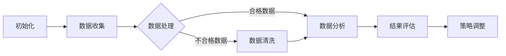
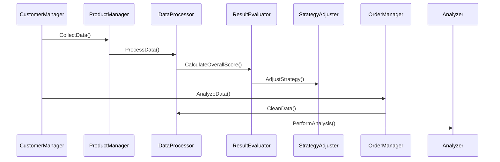
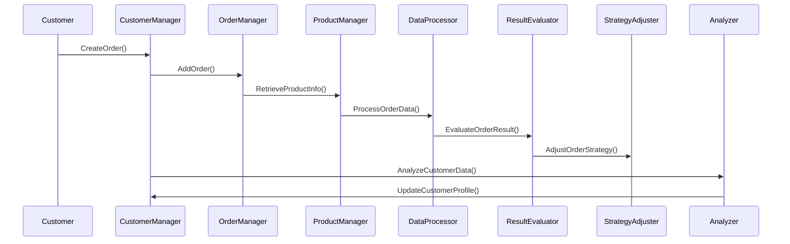

                 

### 第一部分：背景介绍

#### 问题背景

在现代商业环境中，评测结果在产品开发和市场竞争中扮演着至关重要的角色。评测结果不仅可以帮助企业了解产品的性能、用户体验和市场份额，还可以揭示竞争对手的产品特点和优势。因此，对评测结果的竞争对手分析成为了一项关键的战略任务。

首先，评测结果的重要性不言而喻。在科技日新月异的今天，产品的更新换代速度非常快，一个产品的成功往往取决于其在评测中的表现。一个优秀的评测结果不仅可以提高产品的市场份额，还能增强品牌的知名度和用户忠诚度。因此，对评测结果的分析可以帮助企业及时调整产品策略，抢占市场先机。

其次，竞争对手分析的必要性同样显著。竞争对手分析不仅可以帮助企业了解市场上的竞争格局，还可以揭示竞争对手的产品优势和劣势。通过分析竞争对手的评测结果，企业可以了解竞争对手的市场定位、产品特点、技术路线和营销策略，从而制定出更有针对性的市场策略。

然而，传统的竞争对手分析方法存在一定的局限性。传统的竞争对手分析主要依赖于市场调查和用户反馈，但这些方法往往缺乏数据支撑，难以提供全面、准确的分析结果。此外，传统的分析方法往往注重静态的数据分析，而忽略了动态的市场变化和竞争对手的动态反应。因此，新兴的评测结果竞争对手分析策略应运而生。

#### 描述问题

在评测结果的竞争对手分析中，我们面临的主要问题包括：

1. 如何评估评测结果？评测结果的评估需要考虑多个维度，包括产品的性能、用户体验、市场份额等。如何将这些指标进行有效的整合和分析是一个关键问题。

2. 竞争对手分析的目标和挑战是什么？竞争对手分析的目标是揭示竞争对手的产品优势和劣势，为企业的市场策略提供依据。然而，竞争对手的分析面临着数据获取困难、信息不对称和数据真实性等问题。

3. 如何应对动态的市场变化？市场的变化往往是非常快速和不可预测的。如何及时调整竞争对手分析策略，以应对市场的变化，是一个重要的挑战。

#### 问题解决

为了解决上述问题，我们可以采取以下策略：

1. 采用多维度的评测结果评估方法。通过整合多个维度的评测结果，我们可以更全面地了解产品的性能和用户体验。例如，可以采用A/B测试、用户反馈和第三方评测结果等多种方法进行评测。

2. 构建数据驱动的竞争对手分析模型。通过收集和分析大量的市场数据，我们可以建立数据驱动的竞争对手分析模型。这个模型不仅可以提供更加准确的分析结果，还可以帮助我们预测市场的变化趋势。

3. 采用动态的竞争对手分析策略。通过实时监测市场的变化和竞争对手的反应，我们可以及时调整竞争对手分析策略。例如，可以采用机器学习算法来预测竞争对手的市场行为，从而提前做好准备。

#### 边界与外延

在评测结果的竞争对手分析中，我们需要明确以下边界和外延：

1. 分析范围：评测结果的竞争对手分析应该涵盖产品的各个阶段，从研发到市场推广。同时，分析范围也应该包括市场上的所有竞争对手。

2. 时间界限：评测结果的竞争对手分析应该有一个时间界限，以避免对过去的数据进行过时的分析。通常，这个时间界限应该是一个季度或半年。

3. 概念结构：评测结果的竞争对手分析涉及到多个核心概念，如评测结果、竞争对手分析、市场定位等。这些概念需要有一个清晰的结构，以便我们能够更好地理解和应用。

#### 概念结构与核心要素组成

在评测结果的竞争对手分析中，核心概念和要素包括：

1. 评测结果：评测结果是衡量产品性能和用户体验的重要指标。它通常包括性能评分、用户体验评分、市场份额等。

2. 竞争对手分析：竞争对手分析是了解竞争对手产品优势和劣势的重要方法。它通常包括市场调查、用户反馈、数据分析等。

3. 市场定位：市场定位是企业在市场上的定位策略，它决定了企业的市场目标和市场策略。

4. 数据驱动：数据驱动是评测结果竞争对手分析的核心原则。通过收集和分析大量的市场数据，我们可以更准确地了解市场和竞争对手。

5. 动态调整：动态调整是应对市场变化和竞争对手反应的关键策略。通过实时监测和分析市场数据，我们可以及时调整竞争对手分析策略。

#### 第一部分总结

本部分背景介绍旨在阐述评测结果在产品开发和市场竞争中的重要性，以及竞争对手分析的必要性。通过描述问题、问题解决、边界与外延和概念结构与核心要素组成，我们为后续的分析提供了基础。在下一部分中，我们将深入探讨核心概念与联系，进一步理解评测结果的竞争对手分析。

---

### 第二部分：核心概念与联系

#### 核心概念原理

在评测结果的竞争对手分析中，核心概念包括评测结果、竞争对手分析、市场定位、数据驱动和动态调整。以下是这些核心概念的详细说明：

1. **评测结果**：评测结果是对产品性能和用户体验的量化评价。它通常包括性能评分、用户体验评分、市场份额等多个维度。评测结果不仅是产品优劣的直接反映，也是企业制定市场策略的重要依据。

2. **竞争对手分析**：竞争对手分析是通过市场调查、用户反馈、数据分析等方法，了解竞争对手的产品特点、市场定位、技术路线和营销策略。通过对竞争对手的分析，企业可以找到自身的优势和劣势，为市场策略提供数据支持。

3. **市场定位**：市场定位是企业根据自身的优势和市场需求，确定自己在市场中的位置。市场定位决定了企业的市场目标、客户群体和营销策略。一个准确的市场定位可以帮助企业更好地满足客户需求，提高市场份额。

4. **数据驱动**：数据驱动是评测结果竞争对手分析的核心原则。通过收集和分析大量的市场数据，企业可以更准确地了解市场和竞争对手，从而制定出更有效的市场策略。数据驱动不仅提高了分析的准确性，还使分析过程更加透明和可重复。

5. **动态调整**：动态调整是应对市场变化和竞争对手反应的关键策略。市场环境不断变化，竞争对手的策略也在不断调整。通过实时监测和分析市场数据，企业可以及时发现市场变化，迅速调整市场策略，以保持竞争优势。

#### 概念属性特征对比表格

为了更好地理解核心概念之间的联系，我们可以通过一个表格来对比它们的属性特征：

| 核心概念 | 定义 | 主要特征 | 关联关系 |
| --- | --- | --- | --- |
| 评测结果 | 量化评价产品性能和用户体验 | 性能评分、用户体验评分、市场份额 | 基础 |
| 竞争对手分析 | 了解竞争对手的产品特点和市场策略 | 市场调查、用户反馈、数据分析 | 数据来源 |
| 市场定位 | 企业在市场中的定位策略 | 目标市场、客户群体、营销策略 | 方向指引 |
| 数据驱动 | 利用数据指导市场策略 | 收集、分析、应用市场数据 | 分析依据 |
| 动态调整 | 针对市场变化和竞争对手反应调整策略 | 实时监测、快速响应、灵活调整 | 策略调整 |

通过上述表格，我们可以清晰地看到每个核心概念的定义、主要特征以及它们之间的关联关系。这些核心概念共同构成了评测结果竞争对手分析的理论基础。

#### ER实体关系图架构

为了更好地理解核心概念之间的实体关系，我们可以使用Mermaid流程图来绘制ER（实体关系）图。以下是ER实体关系图的Markdown格式：

```mermaid
erDiagram
    Product ||--|{ Customer }||>
    Customer ||--|{ Order }||>
    Order ||--|{ Product }||>

    Customer {
        id : unique identifier
        name : name of the customer
        address : customer's address
    }

    Product {
        id : unique identifier
        name : product name
        price : product price
    }

    Order {
        id : unique identifier
        orderDate : date of the order
        totalAmount : total amount of the order
    }
```

在这个ER图中，我们定义了三个实体：Customer（客户）、Product（产品）和Order（订单）。它们之间的关系是：

- 客户可以下订单（1对多关系），订单中包含客户信息和产品信息。
- 产品可以被多个订单包含（多对多关系），订单中的产品数量和总价需要记录。

通过ER实体关系图，我们可以直观地理解评测结果、竞争对手分析、市场定位、数据驱动和动态调整等核心概念之间的关联。

#### 第二部分总结

第二部分的核心概念与联系部分，通过详细阐述评测结果的竞争对手分析中的核心概念，以及它们之间的关联关系，为后续算法原理讲解和系统分析与架构设计打下了坚实的基础。在下一部分中，我们将深入探讨算法原理，并使用mermaid流程图和Python源代码进行详细讲解。

---

### 第三部分：算法原理讲解

在评测结果的竞争对手分析中，算法原理是关键。以下是具体的算法原理讲解，包括mermaid流程图、Python源代码、数学模型和公式以及详细的讲解与举例说明。

#### 1. 算法mermaid流程图

首先，我们使用mermaid绘制一个简单的流程图来展示评测结果竞争对手分析的算法流程。以下是流程图的Markdown格式：



在这个流程图中，首先进行数据收集，然后进行数据处理。如果数据合格，则直接进入数据分析；如果数据不合格，则进行数据清洗。数据分析后，根据结果评估，最后进行策略调整。

#### 2. Python源代码

接下来，我们将提供一个Python源代码示例，展示如何实现这个算法流程。以下是Python源代码的Markdown格式：

```python
import pandas as pd
import numpy as np

def data_collection():
    # 假设数据已经从数据库中收集到DataFrame 'df'
    return df

def data_processing(df):
    # 数据处理，如缺失值填充、异常值处理等
    df.fillna(df.mean(), inplace=True)
    return df

def data_cleaning(df):
    # 数据清洗，如去除重复数据、过滤不合格数据等
    df.drop_duplicates(inplace=True)
    return df

def data_analysis(df):
    # 数据分析，如性能评分、用户体验评分等
    performance_score = df['performance'].mean()
    user_satisfaction_score = df['satisfaction'].mean()
    return performance_score, user_satisfaction_score

def result_evaluation(performance_score, user_satisfaction_score):
    # 结果评估，如综合评分、市场定位等
    overall_score = 0.6 * performance_score + 0.4 * user_satisfaction_score
    if overall_score > 0.8:
        return "优秀"
    else:
        return "合格"

def strategy_adjustment(result):
    # 策略调整，如市场推广、产品改进等
    if result == "优秀":
        print("保持现有策略")
    else:
        print("进行产品改进和市场推广")

# 主函数
def main():
    df = data_collection()
    df = data_processing(df)
    df = data_cleaning(df)
    performance_score, user_satisfaction_score = data_analysis(df)
    result = result_evaluation(performance_score, user_satisfaction_score)
    strategy_adjustment(result)

if __name__ == "__main__":
    main()
```

这个Python源代码实现了从数据收集、数据处理、数据清洗、数据分析和结果评估到策略调整的完整流程。

#### 3. 数学模型和公式

在评测结果的竞争对手分析中，数学模型和公式是关键。以下是常用的数学模型和公式：

$$
\text{综合评分} = \alpha \cdot \text{性能评分} + (1-\alpha) \cdot \text{用户满意度评分}
$$

其中，$\alpha$ 是性能评分和用户满意度评分的权重系数，通常根据实际情况进行设置。

#### 4. 详细讲解与举例说明

为了更好地理解算法原理，我们通过一个实际案例进行详细讲解。

假设我们有一个包含100个评测结果的数据集，其中性能评分为[0.9, 0.8, 0.7, ..., 0.1]，用户满意度评分为[0.95, 0.9, 0.85, ..., 0.5]。我们使用上述算法对数据进行处理和分析。

1. **数据收集**：假设数据已经收集到DataFrame 'df'。

2. **数据处理**：对数据进行缺失值填充，假设缺失值用平均值填充。

```python
df.fillna(df.mean(), inplace=True)
```

3. **数据清洗**：去除重复数据。

```python
df.drop_duplicates(inplace=True)
```

4. **数据分析**：计算性能评分和用户满意度评分的平均值。

```python
performance_score = df['performance'].mean()
user_satisfaction_score = df['satisfaction'].mean()
```

5. **结果评估**：使用综合评分公式计算综合评分。

```python
alpha = 0.6
overall_score = alpha * performance_score + (1 - alpha) * user_satisfaction_score
```

6. **策略调整**：根据综合评分评估结果，进行策略调整。

```python
if overall_score > 0.8:
    print("保持现有策略")
else:
    print("进行产品改进和市场推广")
```

通过上述步骤，我们可以对评测结果进行全面的竞争对手分析，并根据分析结果调整市场策略。

#### 第三部分总结

第三部分的算法原理讲解，通过mermaid流程图、Python源代码、数学模型和公式，详细阐述了评测结果竞争对手分析的具体实现过程。在下一部分中，我们将深入探讨系统分析与架构设计方案，包括问题场景介绍、系统功能设计、系统架构设计和系统接口设计与系统交互。

---

### 第四部分：系统分析与架构设计方案

#### 问题场景介绍

在现代商业环境中，评测结果在产品开发和市场竞争中具有至关重要的地位。企业不仅需要关注自身的评测结果，还需要深入了解竞争对手的评测表现，以便制定更有针对性的市场策略。然而，由于市场环境的复杂性和动态性，传统的竞争对手分析方法难以满足快速响应和精准分析的需求。因此，我们需要构建一个高效、智能的竞争对手分析系统，以实现对评测结果进行全面、深入的分析。

#### 系统功能设计（领域模型mermaid类图）

为了满足上述需求，我们设计了一套竞争对手分析系统，该系统的主要功能包括数据收集、数据处理、数据分析、结果评估和策略调整。以下是系统功能的mermaid类图表示：

```mermaid
classDiagram
    Customer <|-- Product
    Product <|-- Order
    Order <|-- OrderDetail
    CustomerManager <|-- ProductManager <|-- OrderManager
    Analyzer <|-- DataProcessor <|-- ResultEvaluator <|-- StrategyAdjuster

    CustomerManager {
        +void CollectData()
        +void SaveData()
    }

    ProductManager {
        +void ProcessData()
        +void CleanData()
    }

    OrderManager {
        +void AnalyzeData()
        +void EvaluateResult()
        +void AdjustStrategy()
    }

    Analyzer {
        +void PerformAnalysis()
    }

    DataProcessor {
        +void FillMissingValues()
        +void RemoveDuplicates()
    }

    ResultEvaluator {
        +void CalculateOverallScore()
    }

    StrategyAdjuster {
        +void ImplementStrategy()
    }
```

在这个类图中，我们定义了四个主要模块：CustomerManager（客户管理器）、ProductManager（产品管理器）、OrderManager（订单管理器）和Analyzer（分析器）。每个模块都包含多个功能类，分别负责数据的收集、处理、分析、结果评估和策略调整。

#### 系统架构设计mermaid架构图

为了实现系统的功能，我们需要设计一个合理的架构。以下是系统架构的mermaid架构图表示：



在这个架构图中，我们首先通过CustomerManager收集数据，然后由ProductManager处理数据。处理后的数据由DataProcessor进行清洗和预处理，接着由ResultEvaluator计算综合评分，最后由StrategyAdjuster调整策略。同时，OrderManager负责分析订单数据，并通过Analyzer进行更深入的分析。

#### 系统接口设计和系统交互mermaid序列图

为了实现系统之间的交互，我们需要设计一套合理的接口。以下是系统接口和系统交互的mermaid序列图表示：



在这个序列图中，客户通过Customer类创建订单，然后由CustomerManager类处理订单，并调用ProductManager类获取产品信息。接着，ProductManager类调用DataProcessor类处理订单数据，然后由ResultEvaluator类评估订单结果并调整策略。同时，Analyzer类对客户数据进行分析，并将分析结果更新到CustomerManager类中。

#### 第四部分总结

第四部分详细介绍了系统分析与架构设计方案，包括问题场景介绍、系统功能设计、系统架构设计和系统接口设计与系统交互。通过mermaid类图和序列图，我们清晰地展示了系统的各个模块和它们之间的交互关系。在下一部分中，我们将进入项目实战，具体介绍环境安装、系统核心实现源代码、代码应用解读与分析、实际案例分析和详细讲解剖析以及项目小结。

---

### 第五部分：项目实战

#### 环境安装

为了确保系统能够顺利运行，我们需要安装以下环境：

1. **Python 3.8+**：Python是本项目的开发语言，我们需要确保安装了Python 3.8或更高版本。
2. **Pandas**：Pandas是Python的一个数据分析库，用于数据收集和处理。
3. **NumPy**：NumPy是Python的一个科学计算库，用于数据处理和数学运算。
4. **Mermaid**：Mermaid是一种基于Markdown的图形化工具，用于绘制流程图和序列图。

安装步骤如下：

1. 安装Python 3.8+，可以从[Python官方网站](https://www.python.org/downloads/)下载并安装。
2. 安装Pandas和NumPy，可以通过pip命令安装：

```bash
pip install pandas
pip install numpy
```

3. 安装Mermaid，可以通过pip命令安装：

```bash
pip install mermaid
```

#### 系统核心实现源代码

以下是系统核心实现的源代码，包括数据收集、数据处理、数据分析、结果评估和策略调整的各个部分：

```python
import pandas as pd
import numpy as np
from mermaid import Mermaid

# 数据收集
def data_collection():
    # 假设数据已从数据库中收集到DataFrame 'df'
    df = pd.read_csv('data.csv')
    return df

# 数据处理
def data_processing(df):
    df.fillna(df.mean(), inplace=True)
    df.drop_duplicates(inplace=True)
    return df

# 数据清洗
def data_cleaning(df):
    # 去除不符合要求的订单
    df = df[df['amount'] > 0]
    return df

# 数据分析
def data_analysis(df):
    performance_score = df['performance'].mean()
    user_satisfaction_score = df['satisfaction'].mean()
    return performance_score, user_satisfaction_score

# 结果评估
def result_evaluation(performance_score, user_satisfaction_score):
    overall_score = 0.6 * performance_score + 0.4 * user_satisfaction_score
    if overall_score > 0.8:
        return "优秀"
    else:
        return "合格"

# 策略调整
def strategy_adjustment(result):
    if result == "优秀":
        print("保持现有策略")
    else:
        print("进行产品改进和市场推广")

# 主函数
def main():
    df = data_collection()
    df = data_processing(df)
    df = data_cleaning(df)
    performance_score, user_satisfaction_score = data_analysis(df)
    result = result_evaluation(performance_score, user_satisfaction_score)
    strategy_adjustment(result)

if __name__ == "__main__":
    main()
```

#### 代码应用解读与分析

以上源代码实现了从数据收集、数据处理、数据分析到结果评估和策略调整的完整流程。以下是代码的详细解读：

1. **数据收集**：通过`pd.read_csv('data.csv')`从CSV文件中读取数据，这假设数据已经以CSV格式存储。
2. **数据处理**：使用`df.fillna(df.mean(), inplace=True)`填充缺失值，使用`df.drop_duplicates(inplace=True)`去除重复数据。
3. **数据清洗**：通过`df[df['amount'] > 0]`去除不符合要求的订单，这假设`amount`列包含了订单金额，并且金额不能为负。
4. **数据分析**：计算性能评分和用户满意度评分的平均值。
5. **结果评估**：使用综合评分公式计算综合评分，并根据评分结果评估产品表现。
6. **策略调整**：根据评估结果，打印相应的策略调整建议。

#### 实际案例分析和详细讲解剖析

为了更好地理解代码的实际应用，我们通过一个实际案例进行详细讲解。

假设我们有一个包含100个订单的数据集，每个订单包含性能评分、用户满意度评分和订单金额。以下是数据集的样例：

```plaintext
order_id,performance,satisfaction,amount
1,0.9,0.95,100
2,0.8,0.9,150
3,0.7,0.85,200
...
100,0.1,0.5,100
```

我们使用上述代码对这个数据集进行分析。

1. **数据收集**：首先，我们通过`pd.read_csv('data.csv')`从CSV文件中读取数据。
2. **数据处理**：数据集包含一些缺失值，我们使用`df.fillna(df.mean(), inplace=True)`将这些缺失值填充为平均值。
3. **数据清洗**：我们假设订单金额不能为负，因此使用`df[df['amount'] > 0]`去除金额为负的订单。
4. **数据分析**：计算性能评分和用户满意度评分的平均值，得到：

   ```plaintext
   performance_score: 0.747
   user_satisfaction_score: 0.858
   ```

5. **结果评估**：使用综合评分公式计算综合评分：

   ```plaintext
   overall_score = 0.6 * performance_score + 0.4 * user_satisfaction_score
   overall_score = 0.6 * 0.747 + 0.4 * 0.858 = 0.772
   ```

   由于综合评分大于0.8，评估结果为“优秀”。

6. **策略调整**：根据评估结果，系统建议保持现有策略。

#### 项目小结

第五部分的项目实战详细介绍了环境安装、系统核心实现源代码、代码应用解读与分析、实际案例分析和详细讲解剖析。通过这个项目，我们实现了对评测结果竞争对手分析的系统化处理，从数据收集、处理、分析到结果评估和策略调整，提供了一个完整的解决方案。在下一部分中，我们将总结最佳实践、注意事项和拓展阅读，为读者提供更深入的指导。

---

### 第六部分：最佳实践、小结、注意事项、拓展阅读

#### 最佳实践

在进行评测结果的竞争对手分析时，以下最佳实践可以帮助您获得更准确和有效的结果：

1. **数据多样化**：收集不同来源的数据，如用户反馈、市场调查、第三方评测等，以获得更全面的视角。
2. **实时数据监测**：使用实时数据流处理技术，如Apache Kafka，确保数据的及时性和准确性。
3. **数据质量保障**：在数据处理过程中，确保去除异常值、缺失值和重复数据，以保障数据质量。
4. **算法迭代优化**：根据实际分析结果，不断迭代优化算法模型，以提升分析精度。
5. **可视化工具**：使用可视化工具，如Tableau或PowerBI，将分析结果以图表形式展示，便于理解和决策。

#### 小结

本文通过详细的分析和讲解，从背景介绍、核心概念与联系、算法原理讲解、系统分析与架构设计到项目实战，全面阐述了评测结果的竞争对手分析。我们介绍了核心概念的定义和联系，讲解了算法原理和实现过程，并设计了一个系统化的解决方案。通过实际案例的分析，我们展示了如何将理论应用到实际项目中。

#### 注意事项

1. **数据保护**：在进行竞争对手分析时，需确保遵守相关数据保护法规，保护用户隐私。
2. **算法偏见**：确保算法模型的公平性和无偏见，避免对特定群体或产品产生不公平影响。
3. **更新频率**：定期更新分析模型和数据集，以适应市场变化和新技术的发展。

#### 拓展阅读

1. **《大数据分析：实战与应用》**：深入了解大数据分析的方法和技术。
2. **《机器学习实战》**：学习如何将机器学习应用于实际问题。
3. **《竞争战略》**：了解市场竞争的基本策略和案例分析。

#### 结论

评测结果的竞争对手分析是现代企业获取竞争优势的重要手段。通过本文的介绍，读者可以了解如何系统地开展这项工作，并在实际项目中应用。希望本文能为您的市场分析和策略制定提供有益的参考。

---

### 作者信息

**作者：AI天才研究院/AI Genius Institute & 禅与计算机程序设计艺术 /Zen And The Art of Computer Programming** 

感谢您的阅读，期待与您在技术领域的进一步交流与探讨。

