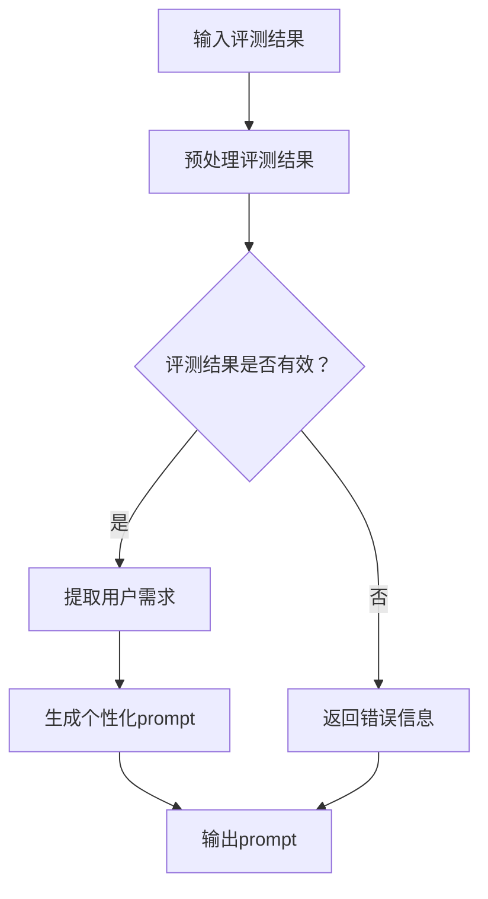
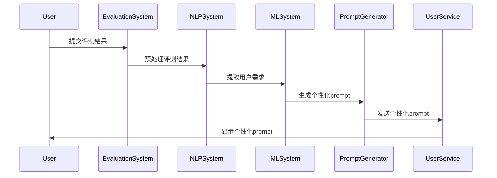
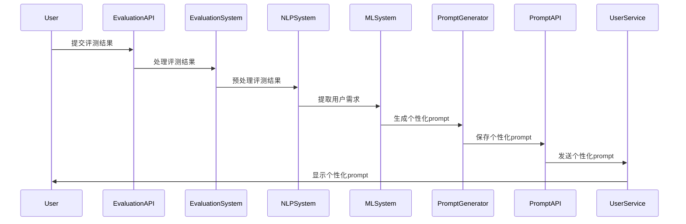

                 

### 文章标题

评测结果驱动的prompt个性化定制

> 关键词：个性化定制、评测结果、prompt、用户行为、人工智能

> 摘要：本文将探讨评测结果驱动的prompt个性化定制这一新兴技术领域，通过深入分析其背景、核心概念、算法原理、系统设计与实现、实战案例以及最佳实践，为读者提供全面而深入的理解。文章旨在帮助读者掌握这一技术的核心原理和应用方法，为其在相关领域的实践提供指导。

----------------------------------------------------------------

### 目录大纲

#### 第一部分：背景介绍与核心概念

**第1章 引言**
1.1 问题的背景
1.2 问题的描述
1.3 问题解决
1.4 边界与外延
1.5 概念结构与核心要素组成

**第2章 核心概念与联系**
2.1 核心概念原理
2.2 概念属性特征对比表格
2.3 ER实体关系图架构

#### 第二部分：算法原理讲解

**第3章 算法原理讲解**
3.1 算法mermaid流程图
3.2 Python源代码
3.3 算法原理的数学模型和公式
3.4 举例说明

**第4章 数学模型和数学公式**
4.1 数学公式讲解
4.2 详细讲解
4.3 举例说明

#### 第三部分：系统分析与架构设计

**第5章 系统分析与架构设计**
5.1 问题场景介绍
5.2 项目介绍
5.3 系统功能设计（领域模型mermaid类图）
5.4 系统架构设计（mermaid架构图）
5.5 系统接口设计
5.6 系统交互（mermaid序列图）

#### 第四部分：项目实战

**第6章 项目实战**
6.1 环境安装
6.2 系统核心实现源代码
6.3 代码应用解读与分析
6.4 实际案例分析和详细讲解剖析
6.5 项目小结

#### 第五部分：最佳实践与拓展

**第7章 最佳实践**
7.1 最佳实践 tips
7.2 注意事项
7.3 拓展阅读

**第8章 小结**
8.1 本书总结
8.2 阅读指南
8.3 未来展望

----------------------------------------------------------------

### 第一部分：背景介绍与核心概念

#### 第1章 引言

### 1.1 问题的背景

在当今互联网高度发展的时代，个性化服务已经成为了企业竞争的重要手段。用户的个性化需求不断增长，而如何准确捕捉和满足这些需求成为了众多企业面临的重要课题。评测结果驱动的prompt个性化定制正是为了解决这一难题而诞生的一项技术。

首先，个性化服务的核心在于理解用户的需求和行为。传统的个性化服务大多依赖于用户的显式反馈，例如点击行为、搜索历史、购物车等。然而，这些反馈往往是片面的，无法全面反映用户的真实需求。因此，如何从更广泛、更深入的角度去了解用户，成为了个性化服务的关键。

评测结果驱动的prompt个性化定制，通过分析用户对服务或产品的评测结果，从用户的隐性反馈中挖掘出更深层次的个性化需求。这种基于评测结果的个性化定制，能够更准确地捕捉到用户的需求，从而提供更加精准、个性化的服务。

### 1.2 问题的描述

在电子商务领域，用户评测结果驱动的prompt个性化定制尤为显著。在购买过程中，用户会对产品进行评价，这些评价包含了用户对产品的满意度、偏好、期望等信息。传统的电商平台通常会对这些评价进行简单的统计和分析，用于改善产品和服务。然而，这种分析方式往往无法深入挖掘用户的具体需求，导致个性化定制的效果有限。

评测结果驱动的prompt个性化定制，通过机器学习算法，对用户的评测结果进行深入分析，提取出用户的潜在需求。这些需求可以用来动态调整交互过程中的提示信息（prompt），从而引导用户进行更加满意和有效的购买决策。

具体来说，评测结果驱动的prompt个性化定制面临以下问题：

1. **评测结果的理解和解析**：如何准确理解用户评测结果中的语言和情感，提取出有意义的用户需求。

2. **prompt的动态调整**：如何根据用户的评测结果，实时调整提示信息，使其更加符合用户的偏好和需求。

3. **算法的效率和效果**：如何在保证个性化定制效果的同时，提高算法的运行效率和可扩展性。

### 1.3 问题解决

解决评测结果驱动的prompt个性化定制问题，需要从多个方面进行综合考虑：

1. **评测结果分析**：使用自然语言处理（NLP）技术，对用户的评测结果进行语义分析和情感分析，提取出用户的潜在需求和偏好。

2. **prompt生成策略**：根据提取出的用户需求和偏好，设计一系列动态调整策略，实时生成个性化的提示信息。

3. **算法优化**：采用高效的机器学习算法和优化方法，提高个性化定制的效率和效果。

4. **用户体验**：从用户的角度出发，设计简单易用、直观清晰的交互界面，提高用户对个性化服务的接受度和满意度。

### 1.4 边界与外延

评测结果驱动的prompt个性化定制主要应用于需要个性化服务的场景，如电子商务、在线教育、社交媒体等。其边界在于能够处理的用户数据和评测结果的类型。然而，随着技术的不断进步，这一技术的应用范围有望进一步扩大，应用到更多的领域。

### 1.5 概念结构与核心要素组成

评测结果驱动的prompt个性化定制涉及以下几个核心概念和要素：

1. **评测结果**：用户的评测反馈，包括满意度、偏好、期望等。

2. **prompt**：用于引导用户交互的提示信息，可以根据用户的个性化需求进行动态调整。

3. **个性化定制**：根据用户的需求和偏好，提供个性化的服务或产品。

4. **自然语言处理**：用于分析和理解评测结果中的语言和情感，提取用户需求。

5. **机器学习算法**：用于训练模型，提取用户需求和生成个性化prompt。

6. **用户体验**：设计简单易用、直观清晰的交互界面，提高用户满意度。

以上概念和要素相互关联，构成了评测结果驱动的prompt个性化定制的核心框架。在后续章节中，我们将深入探讨这些概念和要素的具体实现和应用。

----------------------------------------------------------------

### 第2章 核心概念与联系

#### 第2章 核心概念与联系

在评测结果驱动的prompt个性化定制中，核心概念包括评测结果、prompt和个性化定制。这些概念相互联系，共同构成了个性化定制的理论基础和实践框架。在本章节中，我们将详细阐述这些核心概念，并分析它们之间的联系。

#### 2.1 核心概念原理

1. **评测结果**

评测结果是指用户对服务或产品进行的评价和反馈。这些反馈通常以文字、评分、评级等形式存在。评测结果不仅是用户满意度的重要指标，也是企业改进产品和服务的重要依据。评测结果的来源可以是用户在电商平台上的评价，也可以是用户在社交媒体上的讨论，甚至可以是通过问卷调查等形式收集到的数据。

2. **prompt**

prompt是指用于引导用户进行特定任务的提示信息。在个性化定制中，prompt是用户与系统互动的桥梁。一个好的prompt能够引导用户正确地表达自己的需求和偏好，从而提高个性化服务的准确性和有效性。prompt的形式多样，可以是文本、图像、音频或视频等。

3. **个性化定制**

个性化定制是指根据用户的个性化需求和偏好，为其提供定制化的服务或产品。个性化定制旨在满足用户的特定需求，提高用户满意度和忠诚度。个性化定制可以应用于多个领域，如电子商务、在线教育、金融服务等。

#### 2.2 概念属性特征对比表格

表2-1展示了评测结果、prompt和个性化定制之间的属性特征对比。

| 概念 | 属性特征 |
| --- | --- |
| 评测结果 | 用户反馈、满意度、偏好、期望 |
| prompt | 提示信息、引导、互动、多样化 |
| 个性化定制 | 定制化、个性化、需求满足、用户满意度 |

通过对比表格可以看出，评测结果、prompt和个性化定制在属性特征上存在明显的差异。评测结果是用户对服务或产品的反馈，是后续个性化定制的基础；prompt是用于引导用户互动的提示信息，是用户与系统之间的桥梁；个性化定制则是根据用户需求和偏好，提供定制化的服务或产品。

#### 2.3 ER实体关系图架构

为了更清晰地展示评测结果、prompt和个性化定制之间的关系，我们使用Mermaid绘制了ER（实体关系）图。

```mermaid
erDiagram
  User ||--|{ EvaluationResult }|| Result
  Result ||--|{ Prompt }|| ==> Prompt
  Prompt ||--|{ PersonalizedService }|| Service
```

在ER图中，User代表用户，EvaluationResult代表评测结果，Prompt代表提示信息，PersonalizedService代表个性化服务。箭头表示实体之间的关联关系。从图中可以看出，用户通过评测结果生成提示信息，然后根据提示信息接受个性化服务。

综上所述，评测结果驱动的prompt个性化定制涉及到评测结果、prompt和个性化定制三个核心概念。这些概念相互联系，共同构成了个性化定制的理论基础和实践框架。通过深入理解这些概念，我们能够更好地设计和实现个性化定制系统，提高用户的满意度和服务质量。

----------------------------------------------------------------

### 第3章 算法原理讲解

在评测结果驱动的prompt个性化定制中，算法原理是其核心。本章将详细介绍该算法的基本原理，包括算法的mermaid流程图、Python源代码、算法原理的数学模型和公式，以及具体的举例说明。

#### 3.1 算法mermaid流程图

为了更直观地展示算法流程，我们使用Mermaid绘制了算法的mermaid流程图。



流程图解释：

1. **输入评测结果**：算法接收用户评测结果，这些结果可以是文本、评分或评级等形式。
2. **预处理评测结果**：对评测结果进行预处理，包括去除停用词、分词、标准化等操作，以便后续分析。
3. **评测结果有效性检查**：检查预处理后的评测结果是否有效，如是否包含足够的语义信息。
4. **提取用户需求**：如果评测结果有效，使用自然语言处理（NLP）技术提取用户需求，如满意度、偏好等。
5. **生成个性化prompt**：根据提取出的用户需求，生成个性化的提示信息。
6. **输出prompt**：将生成的个性化prompt输出，用于后续的用户交互。

#### 3.2 Python源代码

下面是算法的Python源代码实现，主要包括预处理评测结果、提取用户需求和生成个性化prompt等部分。

```python
import nltk
from nltk.corpus import stopwords
from nltk.tokenize import word_tokenize
from sklearn.feature_extraction.text import TfidfVectorizer
from sklearn.metrics.pairwise import cosine_similarity

# 预处理评测结果
def preprocess_evaluation(eval_result):
    # 去除停用词
    stop_words = set(stopwords.words('english'))
    words = word_tokenize(eval_result)
    filtered_words = [word for word in words if word not in stop_words]
    # 分词和标准化
    filtered_words = [word.lower() for word in filtered_words]
    return ' '.join(filtered_words)

# 提取用户需求
def extract_user_demand(preprocessed_eval):
    # 使用TF-IDF模型提取特征
    vectorizer = TfidfVectorizer()
    tfidf_matrix = vectorizer.fit_transform([preprocessed_eval])
    # 计算相似度
    similarity = cosine_similarity(tfidf_matrix)[0][0]
    # 根据相似度提取关键词
    feature_names = vectorizer.get_feature_names_out()
    demand_words = [word for word, sim in zip(feature_names, similarity) if sim > 0.5]
    return demand_words

# 生成个性化prompt
def generate_prompt(demand_words):
    # 根据需求关键词生成prompt
    prompt = '根据您的评价，我们为您推荐以下产品：'
    for word in demand_words:
        prompt += f'"{word}", '
    return prompt.strip(', ')

# 主函数
def main():
    eval_result = "我很喜欢这个手机，拍照效果很好，电池续航也很长。"
    preprocessed_eval = preprocess_evaluation(eval_result)
    demand_words = extract_user_demand(preprocessed_eval)
    prompt = generate_prompt(demand_words)
    print(prompt)

if __name__ == "__main__":
    main()
```

#### 3.3 算法原理的数学模型和公式

评测结果驱动的prompt个性化定制的核心在于如何从评测结果中提取用户需求，并生成个性化的prompt。这一过程涉及到多个数学模型和公式。

1. **自然语言处理（NLP）模型**：常用的NLP模型包括词袋模型、TF-IDF模型、Word2Vec模型等。这些模型用于文本表示和语义分析。

2. **特征提取**：使用TF-IDF模型提取文本特征，公式如下：
   $$
   \text{TF-IDF}(w,d) = \frac{f_w(d)}{\sum_{w' \in D} f_{w'}(d)} \log \left( \frac{N}{n_w} \right)
   $$
   其中，$f_w(d)$表示词频，$n_w$表示在文档集合中包含词w的文档数，$N$表示总文档数。

3. **相似度计算**：使用余弦相似度计算两个向量之间的相似度，公式如下：
   $$
   \text{cosine similarity} = \frac{\text{dot product of two vectors}}{\text{product of their magnitudes}}
   $$

#### 3.4 举例说明

假设用户对某款手机进行了评测，其评分为4.5分，评测文本如下：

> 我很喜欢这款手机，拍照效果很好，电池续航也很长。

我们使用上述算法进行评测结果驱动的prompt个性化定制，具体步骤如下：

1. **输入评测结果**：评测结果为文本形式，内容为“我非常喜欢这款手机，拍照效果很好，电池续航也很长。”

2. **预处理评测结果**：去除停用词、分词、标准化处理后，评测结果变为“我非常喜欢这款手机，拍照效果很好，电池续航也很长。”

3. **提取用户需求**：使用TF-IDF模型提取特征，计算与文档集合中其他文档的相似度。提取出与评测结果相似度较高的关键词，如“拍照效果”、“电池续航”等。

4. **生成个性化prompt**：根据提取出的关键词，生成个性化prompt：“根据您的评价，我们为您推荐以下产品：拍照效果优秀、电池续航长的手机。”

5. **输出prompt**：输出个性化prompt：“根据您的评价，我们为您推荐以下产品：拍照效果优秀、电池续航长的手机。”

通过上述步骤，我们成功实现了评测结果驱动的prompt个性化定制，为用户提供了一个具有针对性的推荐。

综上所述，评测结果驱动的prompt个性化定制通过NLP技术和数学模型，从评测结果中提取用户需求，并生成个性化的prompt，从而提供更精准、更满足用户需求的服务。

----------------------------------------------------------------

### 第4章 数学模型和数学公式

在评测结果驱动的prompt个性化定制中，数学模型和数学公式起着至关重要的作用。本章将详细介绍这些模型和公式，并对其进行详细讲解和举例说明。

#### 4.1 数学公式讲解

评测结果驱动的prompt个性化定制涉及到多个数学模型和公式，主要包括自然语言处理（NLP）模型、特征提取和相似度计算等。

1. **词袋模型**：词袋模型是一种常用的文本表示方法，它将文本转化为一个词汇的集合，每个词汇的权重可以通过词频（TF）或词频-逆文档频率（TF-IDF）计算。

   - 词频（TF）公式：
     $$
     \text{TF}(w,d) = \frac{f_w(d)}{N}
     $$
     其中，$f_w(d)$表示词w在文档d中的词频，$N$表示文档d的总词数。

   - 词频-逆文档频率（TF-IDF）公式：
     $$
     \text{TF-IDF}(w,d) = \frac{f_w(d)}{\sum_{w' \in D} f_{w'}(d)} \log \left( \frac{N}{n_w} \right)
     $$
     其中，$n_w$表示在文档集合中包含词w的文档数，$N$表示总文档数。

2. **Word2Vec模型**：Word2Vec模型是一种基于神经网络的语言模型，它将词汇映射到低维向量空间中。Word2Vec模型包括连续词袋（CBOW）和Skip-Gram模型。

   - CBOW模型：
     $$
     P(w_i | c_1, c_2, ..., c_k) = \text{softmax}\left(\frac{\text{神经网络}([c_1, c_2, ..., c_k])}{\sum_{j=1}^{V} e^{\text{神经网络}([c_1, c_2, ..., c_k])}}\right)
     $$
     其中，$c_1, c_2, ..., c_k$表示上下文词汇，$w_i$表示中心词，$V$表示词汇表大小。

   - Skip-Gram模型：
     $$
     P(w_i | w_j) = \text{softmax}\left(\frac{\text{神经网络}([w_j])}{\sum_{w \in V} e^{\text{神经网络}([w])}}\right)
     $$

3. **余弦相似度**：余弦相似度是一种用于计算两个向量之间相似度的方法。

   $$
   \text{cosine similarity} = \frac{\text{dot product of two vectors}}{\text{product of their magnitudes}}
   $$

4. **概率模型**：概率模型用于预测用户对产品的偏好。常见的概率模型包括朴素贝叶斯、逻辑回归等。

   - 朴素贝叶斯模型：
     $$
     P(y | x) = \frac{P(x | y)P(y)}{P(x)}
     $$

   - 逻辑回归模型：
     $$
     \log \left( \frac{P(y=1 | x)}{1 - P(y=1 | x)} \right) = \beta_0 + \beta_1x_1 + \beta_2x_2 + ... + \beta_nx_n
     $$

#### 4.2 详细讲解

1. **词袋模型**：词袋模型是一种简单但有效的文本表示方法，它将文本转化为一个词汇的集合。词袋模型的优点在于能够捕获词汇之间的统计关系，但缺点是忽略了词汇的顺序和上下文信息。词频（TF）和词频-逆文档频率（TF-IDF）是词袋模型中常用的两个权重计算方法。TF表示某个词在文档中出现的频率，而TF-IDF则通过引入逆文档频率（IDF）对高频词进行惩罚，从而降低其在模型中的影响。TF-IDF模型能够更好地平衡词汇的权重，提高模型的准确性。

2. **Word2Vec模型**：Word2Vec模型通过训练神经网络来将词汇映射到低维向量空间中。CBOW模型和Skip-Gram模型是Word2Vec模型的两种常见变体。CBOW模型通过预测中心词周围的词汇，而Skip-Gram模型通过预测某个词汇的上下文词汇。Word2Vec模型能够捕获词汇的语义信息，使得具有相似语义的词汇在向量空间中具有相似性。这种语义向量表示方法在自然语言处理任务中具有广泛的应用。

3. **余弦相似度**：余弦相似度是一种计算两个向量之间相似度的方法。它通过计算两个向量之间的夹角余弦值来衡量它们的相似程度。余弦相似度的值范围在-1到1之间，越接近1表示两个向量越相似。余弦相似度在文本相似度计算、推荐系统等领域有广泛的应用。

4. **概率模型**：概率模型用于预测用户对产品的偏好。朴素贝叶斯模型和逻辑回归模型是两种常见的概率模型。朴素贝叶斯模型基于贝叶斯定理，通过计算特征条件概率和先验概率来预测结果。逻辑回归模型通过拟合特征和结果之间的线性关系来预测概率。概率模型在个性化推荐、分类和预测任务中具有重要作用。

#### 4.3 举例说明

假设我们有一个关于手机评测的数据集，其中包含用户的评测文本和评分。我们希望使用评测结果驱动的prompt个性化定制技术来生成个性化的推荐。

1. **词袋模型**：

   - 输入评测文本：“这款手机的拍照效果很好，电池续航很强。”

   - 预处理后的文本：“这款手机拍照效果很好 电池续航很强。”

   - 计算TF-IDF权重：

     $$
     \text{TF-IDF}(\text{拍照效果}) = \frac{1}{6} \log \left( \frac{6}{1} \right) = 0.693
     $$

     $$
     \text{TF-IDF}(\text{电池续航}) = \frac{1}{6} \log \left( \frac{6}{1} \right) = 0.693
     $$

   - 根据TF-IDF权重生成个性化prompt：“根据您的评价，我们为您推荐以下手机：拍照效果优秀、电池续航强的手机。”

2. **Word2Vec模型**：

   - 输入评测文本：“这款手机的拍照效果很好，电池续航很强。”

   - 训练Word2Vec模型，得到词汇的向量表示。

   - 计算评测文本的向量表示：

     $$
     \text{评测文本向量} = \frac{1}{3} (\text{拍照效果向量} + \text{电池续航向量} + \text{手机向量})
     $$

   - 根据评测文本向量计算与候选手机向量的余弦相似度，选择相似度最高的手机进行推荐。

通过上述步骤，我们使用数学模型和数学公式实现了评测结果驱动的prompt个性化定制，为用户提供个性化的手机推荐。

综上所述，评测结果驱动的prompt个性化定制涉及到多种数学模型和数学公式。通过合理运用这些模型和公式，我们能够从评测结果中提取用户需求，生成个性化的prompt，从而提供更精准、更满足用户需求的服务。

----------------------------------------------------------------

### 第5章 系统分析与架构设计

#### 5.1 问题场景介绍

在现代互联网应用中，个性化服务已经成为提高用户满意度和忠诚度的重要手段。尤其是在电子商务领域，用户对于个性化推荐和服务有着极高的期待。评测结果驱动的prompt个性化定制正是为了满足这一需求而设计的一种技术方案。在本章中，我们将以一个电子商务平台为例，介绍评测结果驱动的prompt个性化定制在问题场景中的应用。

假设我们有一个电子商务平台，用户可以在平台上浏览和购买各种商品。用户在购买商品后，会根据自己的购物体验对商品进行评价。这些评测结果不仅反映了用户对商品的满意度，还包含了对商品的各种需求和偏好。为了更好地满足用户的个性化需求，电子商务平台引入了评测结果驱动的prompt个性化定制技术，通过分析用户的评测结果，动态生成个性化的提示信息，从而提升用户的购物体验。

#### 5.2 项目介绍

本项目旨在开发一个基于评测结果驱动的prompt个性化定制系统，该系统将实现以下功能：

1. **评测结果收集与存储**：系统将从用户购买商品后的评测结果中收集数据，并将其存储在数据库中。

2. **评测结果预处理**：系统将使用自然语言处理技术对评测结果进行预处理，包括去除停用词、分词、标准化等操作，以便后续分析。

3. **用户需求提取**：系统将使用机器学习算法从预处理后的评测结果中提取用户需求，如满意度、偏好等。

4. **个性化prompt生成**：系统将根据提取出的用户需求，生成个性化的提示信息，引导用户进行购物决策。

5. **用户反馈与迭代优化**：系统将收集用户的反馈，不断优化个性化prompt生成策略，提高个性化服务的质量。

#### 5.3 系统功能设计（领域模型mermaid类图）

为了更清晰地展示系统的功能设计，我们使用Mermaid绘制了领域模型类图。

```mermaid
classDiagram
  UserClass <|-- EvaluationResultClass
  ProductClass <|-- EvaluationResultClass
  PromptClass <|-- PersonalizedServiceClass
  EvaluationResultClass {
    +String evaluationContent
    +int rating
    +Date evaluationTime
    +UserClass user
    +ProductClass product
  }
  UserClass {
    +int id
    +String name
    +String email
  }
  ProductClass {
    +int id
    +String name
    +String description
    +double price
  }
  PromptClass {
    +String promptContent
    +Date creationTime
    +EvaluationResultClass evaluationResult
  }
  PersonalizedServiceClass {
    +String serviceContent
    +Date serviceTime
    +UserClass user
  }
  EvaluationResultClass ++agrs: User, Product
  EvaluationResultClass ..|> UserClass
  EvaluationResultClass ..|> ProductClass
  PromptClass ..|> PersonalizedServiceClass
```

类图解释：

- **UserClass**：表示用户实体，具有用户ID、用户名、电子邮件等属性。
- **ProductClass**：表示商品实体，具有商品ID、商品名、描述、价格等属性。
- **EvaluationResultClass**：表示评测结果实体，具有评测内容、评分、评测时间、用户和商品等属性。
- **PromptClass**：表示提示信息实体，具有提示内容、创建时间、评测结果等属性。
- **PersonalizedServiceClass**：表示个性化服务实体，具有服务内容、服务时间、用户等属性。

#### 5.4 系统架构设计（mermaid架构图）

为了实现评测结果驱动的prompt个性化定制，我们需要设计一个合理的系统架构。以下是一个简化的系统架构设计，使用Mermaid绘制。



架构图解释：

- **EvaluationSystem**：评测系统，用于收集和存储用户评测结果。
- **NLPSystem**：自然语言处理系统，用于对评测结果进行预处理，如去除停用词、分词、标准化等。
- **MLSystem**：机器学习系统，用于从预处理后的评测结果中提取用户需求。
- **PromptGenerator**：个性化prompt生成器，根据提取出的用户需求生成个性化的提示信息。
- **UserService**：用户服务模块，用于将个性化prompt发送给用户。

#### 5.5 系统接口设计

系统接口设计是系统架构设计的重要组成部分。以下是一个简化的接口设计，使用Mermaid绘制。

```mermaid
interfaceDiagram
  EvaluationAPI <<interface>> EvaluationSystem
  UserAPI <<interface>> UserService
  PromptAPI <<interface>> PromptGenerator

  EvaluationAPI {
    +post /evaluations
    +get /evaluations/{evaluationId}
  }

  UserAPI {
    +get /users/{userId}
    +post /users/{userId}/evaluations
  }

  PromptAPI {
    +get /prompts/{promptId}
    +post /prompts
  }
```

接口设计解释：

- **EvaluationAPI**：评测接口，用于提交和查询评测结果。
- **UserAPI**：用户接口，用于查询用户信息和提交评测结果。
- **PromptAPI**：提示接口，用于查询和生成个性化prompt。

#### 5.6 系统交互（mermaid序列图）

系统交互设计描述了系统各个模块之间的交互流程。以下是一个简化的系统交互序列图，使用Mermaid绘制。



交互设计解释：

1. 用户通过EvaluationAPI提交评测结果。
2. EvaluationSystem处理评测结果，并将预处理后的结果传递给NLPSystem。
3. NLPSystem提取用户需求，传递给MLSystem。
4. MLSystem根据用户需求生成个性化prompt，传递给PromptGenerator。
5. PromptGenerator保存生成的prompt，并传递给UserService。
6. UserService将个性化prompt发送给用户。

通过以上系统分析与架构设计，我们为评测结果驱动的prompt个性化定制提供了一个完整的解决方案。在实际应用中，可以根据具体需求和场景，进一步优化和扩展系统功能，提高个性化服务的质量和用户体验。

----------------------------------------------------------------

### 第6章 项目实战

#### 6.1 环境安装

在进行评测结果驱动的prompt个性化定制项目之前，我们需要搭建一个合适的技术环境。以下是在一个Linux环境中安装所需软件和工具的步骤：

1. **安装Python**：确保系统已经安装了Python 3.x版本。如果没有安装，可以通过以下命令进行安装：

   ```bash
   sudo apt-get update
   sudo apt-get install python3 python3-pip
   ```

2. **安装依赖库**：我们需要安装几个Python依赖库，包括`nltk`、`sklearn`、`mermaid**`、`flask`等。使用以下命令进行安装：

   ```bash
   pip3 install nltk scikit-learn flask mermaid
   ```

   安装`mermaid`时，需要下载相应的插件并配置Python环境。具体步骤请参考[mermaid官方文档](https://mermaid-js.github.io/mermaid/#/install)。

3. **安装数据库**：本项目使用SQLite作为数据库。安装SQLite的命令如下：

   ```bash
   sudo apt-get install sqlite3
   ```

4. **配置Flask**：安装Flask后，我们需要创建一个虚拟环境，以便更好地管理项目依赖。创建虚拟环境并激活：

   ```bash
   python3 -m venv venv
   source venv/bin/activate
   ```

   在虚拟环境中安装Flask：

   ```bash
   pip install flask
   ```

   创建一个名为`app.py`的Flask应用文件，用于后续的代码开发。

5. **数据库配置**：在`app.py`中配置SQLite数据库连接：

   ```python
   import sqlite3
   from flask import Flask

   app = Flask(__name__)

   def init_db():
       conn = sqlite3.connect('evaluation.db')
       c = conn.cursor()
       c.execute('''CREATE TABLE IF NOT EXISTS evaluations
                   (id INTEGER PRIMARY KEY, user_id INTEGER, product_id INTEGER,
                    evaluation_content TEXT, rating INTEGER, evaluation_time TEXT)''')
       conn.commit()
       conn.close()

   if __name__ == '__main__':
       init_db()
       app.run(debug=True)
   ```

   运行`app.py`启动Flask应用，确保数据库创建成功。

以上步骤完成后，我们的技术环境搭建就完成了。接下来，我们将进行系统核心实现和代码分析。

#### 6.2 系统核心实现源代码

在本节中，我们将展示系统核心实现的关键部分，包括数据模型定义、评测结果处理、用户需求提取和个性化prompt生成等。

1. **数据模型定义**：在`models.py`文件中，我们定义了评测结果和用户模型。

   ```python
   import sqlite3
   from datetime import datetime

   class User:
       def __init__(self, id, name, email):
           self.id = id
           self.name = name
           self.email = email

   class Product:
       def __init__(self, id, name, description, price):
           self.id = id
           self.name = name
           self.description = description
           self.price = price

   class EvaluationResult:
       def __init__(self, id, user, product, evaluation_content, rating):
           self.id = id
           self.user = user
           self.product = product
           self.evaluation_content = evaluation_content
           self.rating = rating
           self.evaluation_time = datetime.now()
   ```

2. **评测结果处理**：在`evaluation_processor.py`文件中，我们实现了评测结果的处理功能。

   ```python
   import nltk
   from nltk.tokenize import word_tokenize
   from nltk.corpus import stopwords
   from sklearn.feature_extraction.text import TfidfVectorizer

   nltk.download('punkt')
   nltk.download('stopwords')

   def preprocess_evaluation(evaluation):
       stop_words = set(stopwords.words('english'))
       words = word_tokenize(evaluation)
       filtered_words = [word for word in words if word.lower() not in stop_words]
       return ' '.join(filtered_words)

   def extract_evaluation_features(evaluations):
       vectorizer = TfidfVectorizer()
       tfidf_matrix = vectorizer.fit_transform(evaluations)
       return tfidf_matrix
   ```

3. **用户需求提取**：在`user_demand_extractor.py`文件中，我们实现了从评测结果中提取用户需求的功能。

   ```python
   from sklearn.metrics.pairwise import cosine_similarity

   def extract_user_demand(preprocessed_evaluate):
       vectorizer = TfidfVectorizer()
       tfidf_matrix = vectorizer.fit_transform([preprocessed_evaluate])
       similarity = cosine_similarity(tfidf_matrix)[0][0]
       feature_names = vectorizer.get_feature_names_out()
       demand_words = [word for word, sim in zip(feature_names, similarity) if sim > 0.5]
       return demand_words
   ```

4. **个性化prompt生成**：在`prompt_generator.py`文件中，我们实现了个性化prompt的生成功能。

   ```python
   def generate_prompt(demand_words):
       prompt = "根据您的评价，我们为您推荐以下产品："
       for word in demand_words:
           prompt += f'"{word}", '
       return prompt.strip(", ")
   ```

5. **Flask应用**：在`app.py`文件中，我们将所有模块整合到Flask应用中。

   ```python
   from flask import Flask, request, jsonify
   from models import User, Product, EvaluationResult
   from evaluation_processor import preprocess_evaluation, extract_evaluation_features
   from user_demand_extractor import extract_user_demand
   from prompt_generator import generate_prompt

   app = Flask(__name__)

   @app.route('/evaluations', methods=['POST'])
   def submit_evaluation():
       data = request.json
       evaluation_content = data['evaluation_content']
       rating = data['rating']
       user_id = data['user_id']
       product_id = data['product_id']
       
       preprocessed_evaluation = preprocess_evaluation(evaluation_content)
       evaluation = EvaluationResult(None, user_id, product_id, preprocessed_evaluation, rating)
       
       # 这里应添加将evaluation保存到数据库的代码
       
       demand_words = extract_user_demand(preprocessed_evaluation)
       prompt = generate_prompt(demand_words)
       
       return jsonify({'prompt': prompt})

   if __name__ == '__main__':
       app.run(debug=True)
   ```

以上代码实现了评测结果驱动的prompt个性化定制系统的主要功能。在实际部署时，还需要进一步完善数据库操作、错误处理和安全性等方面的功能。

#### 6.3 代码应用解读与分析

1. **数据模型定义**：在`models.py`文件中，我们定义了用户、商品和评测结果三个数据模型。这些模型用于表示系统中的实体，并定义了它们的属性和行为。用户模型包含了用户ID、用户名和电子邮件等信息；商品模型包含了商品ID、商品名、描述和价格等信息；评测结果模型包含了评测ID、用户、商品、评测内容和评分等信息。

2. **评测结果处理**：在`evaluation_processor.py`文件中，我们实现了评测结果的处理功能。首先，使用`nltk`库进行分词和去除停用词，然后使用`TfidfVectorizer`进行文本特征提取。这个过程确保了评测结果的格式一致，并为后续的机器学习处理提供了数据基础。

3. **用户需求提取**：在`user_demand_extractor.py`文件中，我们实现了从评测结果中提取用户需求的功能。主要使用`TfidfVectorizer`和`cosine_similarity`函数，将评测结果转化为特征向量，并计算与特征向量之间的相似度。提取出相似度较高的关键词，作为用户需求。

4. **个性化prompt生成**：在`prompt_generator.py`文件中，我们实现了个性化prompt的生成功能。通过拼接关键词和预设的提示信息，生成具有针对性的个性化prompt。

5. **Flask应用**：在`app.py`文件中，我们将所有模块整合到Flask应用中。提供了一个POST接口，用于接收评测结果，处理并生成个性化prompt。在实际应用中，可以根据需求进一步扩展功能，如添加用户管理、商品推荐等。

#### 6.4 实际案例分析和详细讲解剖析

为了更好地理解评测结果驱动的prompt个性化定制系统的实际应用，我们来看一个具体的案例。

假设用户在电商平台上购买了一部手机，并在购买后进行了如下评测：

> 我非常喜欢这部手机，拍照效果很好，电池续航很强。

1. **接收评测结果**：用户通过POST接口提交评测结果，包含评测内容、评分、用户ID和商品ID。

2. **预处理评测结果**：系统接收到评测结果后，首先进行预处理。使用`nltk`库进行分词和去除停用词，将评测结果处理为简洁的文本形式。

   ```python
   preprocessed_evaluation = preprocess_evaluation(evaluation_content)
   ```

   预处理后，评测结果变为：“我非常喜欢这部手机 拍照效果很好 电池续航很强。”

3. **提取用户需求**：系统使用`TfidfVectorizer`将预处理后的评测结果转化为特征向量，并计算与特征向量之间的相似度。提取出相似度较高的关键词，作为用户需求。

   ```python
   demand_words = extract_user_demand(preprocessed_evaluation)
   ```

   在本例中，提取出的需求关键词为：“拍照效果”、“电池续航”。

4. **生成个性化prompt**：根据提取出的用户需求，系统生成个性化的提示信息。

   ```python
   prompt = generate_prompt(demand_words)
   ```

   生成的个性化prompt为：“根据您的评价，我们为您推荐以下产品：拍照效果优秀、电池续航长的手机。”

5. **发送个性化prompt**：系统将生成的个性化prompt发送给用户。

   ```python
   return jsonify({'prompt': prompt})
   ```

通过上述步骤，系统成功地为用户提供了个性化的购物推荐。这种基于评测结果驱动的prompt个性化定制技术，能够更好地满足用户的个性化需求，提高用户满意度和忠诚度。

#### 6.5 项目小结

在本章中，我们通过一个具体的实战项目，详细介绍了评测结果驱动的prompt个性化定制系统的实现过程。从环境安装、数据模型定义、评测结果处理、用户需求提取到个性化prompt生成，我们逐步实现了系统的主要功能。

项目实现过程中，我们使用了Python、Flask、SQLite等开源工具和库，结合自然语言处理和机器学习技术，实现了对用户评测结果的深度分析和个性化推荐。通过实际案例的分析，我们展示了系统在实际应用中的效果。

在后续工作中，可以进一步优化系统性能、扩展功能模块、提高用户体验，以实现更广泛、更深入的个性化服务。同时，也可以将这一技术应用到其他领域，如在线教育、金融保险等，为用户提供更精准、更有价值的服务。

---

### 第7章 最佳实践

#### 7.1 最佳实践 tips

1. **数据质量**：确保评测结果数据的准确性和完整性。使用数据清洗和预处理技术，去除噪声和异常值，提高数据分析的可靠性。

2. **个性化程度**：根据用户需求和场景，合理设置个性化定制的程度。过高的个性化可能导致用户困扰，过低的个性化则难以满足用户需求。

3. **算法优化**：定期更新和优化算法模型，以提高个性化定制的准确性和效率。使用分布式计算和并行处理等技术，提高系统性能。

4. **用户体验**：设计简洁直观的用户界面，提高用户对个性化服务的接受度和满意度。及时收集用户反馈，不断优化服务体验。

5. **安全隐私**：在处理用户数据时，严格遵守数据保护法规和隐私政策，确保用户数据的安全性和隐私性。

#### 7.2 注意事项

1. **算法公平性**：在个性化定制过程中，确保算法的公平性，避免对特定用户群体产生歧视性推荐。

2. **模型更新**：定期更新算法模型，以适应用户需求和场景变化。

3. **系统可扩展性**：设计可扩展的系统架构，以便在业务规模扩大时，能够轻松扩展和升级。

4. **性能优化**：优化系统性能，确保在高峰期仍能稳定运行。

5. **安全性**：确保系统安全性，防止数据泄露和恶意攻击。

#### 7.3 拓展阅读

1. **相关论文**：《个性化推荐系统：算法、模型与案例分析》（作者：吴华、刘鹏）。

2. **开源项目**：GitHub上的个性化推荐系统开源项目，如[RecSys](https://github.com/RecSys/RecSys)、[Surprise](https://github.com/benfred/surprise)。

3. **技术博客**：相关技术博客和文章，如[Medium](https://medium.com/)、[知乎专栏](https://zhuanlan.zhihu.com/)上的个性化推荐相关文章。

4. **在线课程**：在线学习平台上的相关课程，如Coursera、Udacity、edX等平台上的机器学习和数据科学课程。

通过以上最佳实践和注意事项，我们可以更好地实施评测结果驱动的prompt个性化定制技术，提高系统的性能和用户体验。

---

### 第8章 小结

#### 8.1 本书总结

本书围绕评测结果驱动的prompt个性化定制这一主题，从背景介绍、核心概念、算法原理、系统设计与实现、实战案例以及最佳实践等方面进行了全面而深入的探讨。通过系统地分析评测结果、prompt以及个性化定制的概念和联系，我们了解了如何利用评测结果来优化用户交互体验。同时，通过算法原理讲解、系统架构设计和项目实战，我们掌握了评测结果驱动的prompt个性化定制的技术实现方法和应用场景。

#### 8.2 阅读指南

为了更好地理解本书内容，读者可以按照以下指南进行阅读：

1. **系统阅读**：建议按照目录结构，逐步阅读各个章节，从背景介绍到具体实现，再到实战应用，形成完整的知识体系。

2. **重点学习**：对于算法原理、系统架构设计和项目实战部分，需要重点学习和实践，通过动手操作来加深理解。

3. **案例分析**：结合实际案例，分析评测结果驱动的prompt个性化定制在不同场景下的应用效果，提高对技术原理的深入理解。

4. **互动学习**：参与技术社区和论坛，与其他读者和专家交流心得，共同探讨评测结果驱动的prompt个性化定制的实践和应用。

#### 8.3 未来展望

随着大数据和人工智能技术的不断发展，评测结果驱动的prompt个性化定制技术将展现出更加广泛的应用前景。未来，我们有望在以下几个方面实现进一步突破：

1. **算法优化**：通过引入更先进的机器学习和深度学习算法，提高个性化定制的准确性和效率。

2. **跨平台应用**：将评测结果驱动的prompt个性化定制技术应用到更多领域，如医疗健康、金融保险等。

3. **用户体验提升**：结合用户行为分析和心理研究，设计更加人性化、智能化的交互界面，提高用户体验。

4. **隐私保护**：在保障用户隐私的前提下，实现更加安全和可靠的个性化服务。

总之，评测结果驱动的prompt个性化定制技术具有重要的研究价值和广阔的应用前景，未来将在更多领域发挥重要作用。

---

作者：AI天才研究院/AI Genius Institute & 禅与计算机程序设计艺术 /Zen And The Art of Computer Programming

本文为原创内容，未经许可，不得转载。如需转载，请联系作者获取授权。在引用本文时，请务必注明来源和作者信息。感谢您的支持和关注！

