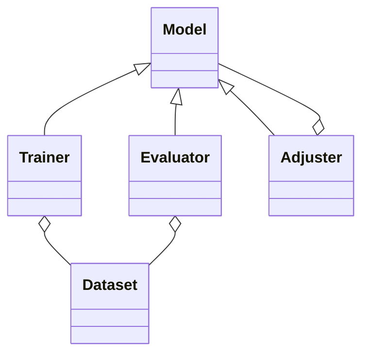
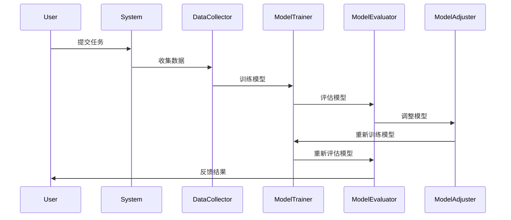
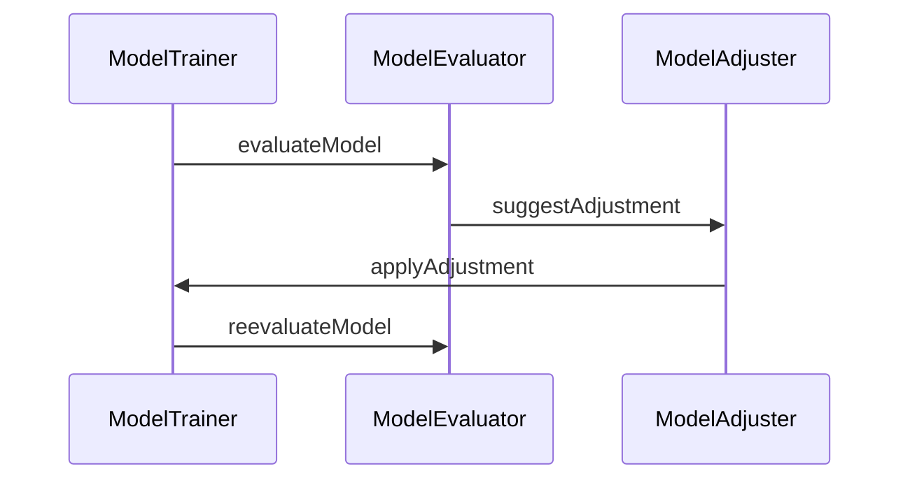

                 

### 第1章: 背景与核心概念

#### 1.1 问题背景

随着人工智能技术的快速发展，自然语言处理（NLP）成为了研究的热点领域。在NLP中，语言模型（LLM）是一种能够模拟人类语言行为的算法。LLM被广泛应用于文本分类、机器翻译、问答系统等多个领域。然而，如何提升LLM的性能，使其能够适应不同的应用场景，成为了当前研究的重要课题。

传统的LLM优化方法主要依赖于预训练和微调。这些方法虽然在一定程度上提高了模型的性能，但往往需要大量的数据和计算资源，且优化过程缺乏系统性。评测驱动的LLM优化反馈循环提供了一种新的思路，通过持续监测和评估模型性能，指导模型调整和优化，实现高效、自动化的优化过程。

#### 1.2 评测驱动的概念

评测驱动是一种以评估为核心，通过持续评估模型性能来指导模型优化的方法。在评测驱动中，评估指标是关键。这些指标用于衡量模型在特定任务上的性能，常见的评估指标包括准确率、召回率、F1值等。

准确率（Accuracy）是指模型预测正确的样本数占总样本数的比例。召回率（Recall）是指模型预测正确的正样本数占总正样本数的比例。F1值是准确率和召回率的调和平均值，用于平衡这两个指标。

除了这些基本的评估指标，A/B测试也是评测驱动中的重要方法。A/B测试通过对两个或多个版本的模型进行对比评估，找出性能最佳的模型。这种测试方法能够帮助开发者快速验证和优化模型。

#### 1.3 LLM优化反馈循环的概念

LLM优化反馈循环是一种基于评测驱动的模型优化方法，其核心思想是通过不断的评估和调整，提高模型的性能。该方法包括以下几个步骤：

1. **数据收集**：收集用于评估和训练的数据，这些数据可以是公开数据集，也可以是定制数据。
2. **模型评估**：使用评估指标对模型进行评估，判断模型的性能是否满足要求。
3. **结果反馈**：根据评估结果，对模型进行调整。调整的方式可以是修改模型参数，也可以是更换模型结构。
4. **模型调整**：调整后的模型重新进行评估，循环往复，直至模型性能达到预期。

#### 1.4 边界与外延

评测驱动的LLM优化反馈循环适用于各种NLP任务，包括文本分类、情感分析、机器翻译等。然而，具体应用时需要根据任务特点和数据特性进行调整。例如，对于文本分类任务，可能需要重点关注分类准确率；对于机器翻译任务，则可能需要关注翻译的流畅度和准确性。

此外，评测驱动的LLM优化反馈循环不仅适用于传统的NLP任务，还可以应用于新兴的领域，如问答系统、对话系统等。通过不断优化模型，可以提高系统的性能和用户体验。

总的来说，评测驱动的LLM优化反馈循环提供了一种系统化、自动化的优化方法，有助于提高LLM的性能和应用效果。

### 第2章: 核心概念与联系

#### 2.1 评测指标

评测指标是评估模型性能的重要工具。这些指标可以帮助我们判断模型在特定任务上的表现，并指导后续的优化工作。以下是一些常见的评测指标：

##### 2.1.1 准确率、召回率、F1值等

- **准确率（Accuracy）**：准确率是指模型预测正确的样本数占总样本数的比例。公式如下：

  $$
  \text{Accuracy} = \frac{\text{预测正确的样本数}}{\text{总样本数}}
  $$

  准确率越高，意味着模型预测的准确性越高。

- **召回率（Recall）**：召回率是指模型预测正确的正样本数占总正样本数的比例。公式如下：

  $$
  \text{Recall} = \frac{\text{预测正确的正样本数}}{\text{总正样本数}}
  $$

  召回率越高，意味着模型能够正确识别出更多的正样本。

- **F1值（F1-score）**：F1值是准确率和召回率的调和平均值，用于平衡这两个指标。公式如下：

  $$
  \text{F1值} = 2 \times \frac{\text{准确率} \times \text{召回率}}{\text{准确率} + \text{召回率}}
  $$

  F1值越高，意味着模型在准确率和召回率方面都表现较好。

##### 2.1.2 A/B测试

A/B测试是一种通过比较两个或多个版本的模型，来评估它们在特定任务上的性能的方法。在A/B测试中，通常会选取一组数据作为测试集，分别使用不同的模型进行预测，然后比较这些模型的预测结果。

A/B测试的优点在于，它能够帮助开发者快速验证和优化模型。例如，如果模型A的准确率比模型B高，那么可以认为模型A在特定任务上的性能更好。通过不断进行A/B测试，可以逐步找到性能最佳的模型。

##### 2.1.3 精准度、覆盖率和效果评估

除了上述评测指标外，精准度（Precision）、覆盖率（Coverage）和效果评估（Effectiveness）也是常用的评测指标。

- **精准度（Precision）**：精准度是指模型预测为正的样本中，实际为正的样本比例。公式如下：

  $$
  \text{精准度} = \frac{\text{预测为正且实际为正的样本数}}{\text{预测为正的样本数}}
  $$

  精准度越高，意味着模型预测的正样本越准确。

- **覆盖率（Coverage）**：覆盖率是指模型覆盖到的实际为正的样本比例。公式如下：

  $$
  \text{覆盖率} = \frac{\text{实际为正的样本数}}{\text{总样本数}}
  $$

  覆盖率越高，意味着模型能够覆盖到更多的实际为正的样本。

- **效果评估（Effectiveness）**：效果评估是指模型在任务上的整体表现。它通常结合多个评测指标，进行综合评估。

#### 2.2 LLM基本原理

语言模型（LLM）是一种基于深度学习的模型，用于模拟人类语言行为。以下介绍LLM的基本原理：

##### 2.2.1 语言模型结构

LLM通常由以下几个部分组成：

- **输入层**：接收输入文本序列，将其转换为模型可以处理的格式。
- **隐藏层**：包含多个隐藏神经元，用于提取文本特征。
- **输出层**：生成预测结果，如词汇、句子或段落。

##### 2.2.2 模型训练与评估

模型训练是指通过大量文本数据，调整模型参数，使其能够准确预测文本内容。模型评估是指使用评估指标，判断模型的性能。

##### 2.2.3 模型优化方法

模型优化是指通过调整模型结构或参数，提高模型性能。常用的优化方法包括：

- **迁移学习**：利用预训练模型，针对特定任务进行微调。
- **正则化**：通过添加正则化项，防止模型过拟合。
- **增强学习**：通过对抗性样本，提高模型鲁棒性。

#### 2.3 优化反馈循环

优化反馈循环是一种自动化模型优化方法，通过不断评估和调整模型，提高其性能。以下介绍优化反馈循环的基本原理：

##### 2.3.1 反馈机制

反馈机制是指根据评估结果，对模型进行调整。调整的方式可以是修改模型参数，也可以是更换模型结构。

##### 2.3.2 适应性与可塑性

适应性与可塑性是指模型根据反馈机制进行调整，以适应不同的任务和数据。

##### 2.3.3 模型迭代与更新

模型迭代与更新是指通过不断进行评估和调整，逐步提高模型性能。迭代与更新的过程如下：

1. 收集评估数据。
2. 使用评估指标，对模型进行评估。
3. 根据评估结果，对模型进行调整。
4. 重新评估模型性能，判断是否满足要求。
5. 如果不满足要求，继续迭代和更新。

通过优化反馈循环，模型性能可以得到持续提升，从而更好地适应不同的应用场景。

### 第3章: 算法原理讲解

#### 3.1 评测指标详细解释

评测指标是评估模型性能的重要工具，以下详细介绍几种常见的评测指标：

##### 3.1.1 准确率（Accuracy）

准确率是指模型预测正确的样本数占总样本数的比例。公式如下：

$$
\text{Accuracy} = \frac{\text{预测正确的样本数}}{\text{总样本数}}
$$

准确率越高，意味着模型预测的准确性越高。

##### 3.1.2 召回率（Recall）

召回率是指模型预测正确的正样本数占总正样本数的比例。公式如下：

$$
\text{Recall} = \frac{\text{预测正确的正样本数}}{\text{总正样本数}}
$$

召回率越高，意味着模型能够正确识别出更多的正样本。

##### 3.1.3 F1值（F1-score）

F1值是准确率和召回率的调和平均值，用于平衡这两个指标。公式如下：

$$
\text{F1值} = 2 \times \frac{\text{准确率} \times \text{召回率}}{\text{准确率} + \text{召回率}}
$$

F1值越高，意味着模型在准确率和召回率方面都表现较好。

##### 3.1.4 精准度（Precision）

精准度是指模型预测为正的样本中，实际为正的样本比例。公式如下：

$$
\text{精准度} = \frac{\text{预测为正且实际为正的样本数}}{\text{预测为正的样本数}}
$$

精准度越高，意味着模型预测的正样本越准确。

##### 3.1.5 覆盖率（Coverage）

覆盖率是指模型覆盖到的实际为正的样本比例。公式如下：

$$
\text{覆盖率} = \frac{\text{实际为正的样本数}}{\text{总样本数}}
$$

覆盖率越高，意味着模型能够覆盖到更多的实际为正的样本。

#### 3.2 LLM优化流程

LLM优化流程是指通过一系列步骤，提高模型性能的过程。以下介绍LLM优化流程的详细步骤：

##### 3.2.1 数据预处理

数据预处理是指对收集到的数据进行处理，以提高模型性能。数据预处理包括以下步骤：

1. **数据清洗**：去除数据中的噪声和错误。
2. **数据归一化**：将数据转换为相同的尺度，以便于模型处理。
3. **数据划分**：将数据划分为训练集、验证集和测试集。

##### 3.2.2 模型训练

模型训练是指通过训练数据，调整模型参数，使其能够准确预测数据。模型训练包括以下步骤：

1. **初始化模型参数**：随机初始化模型参数。
2. **前向传播**：将输入数据输入模型，计算输出。
3. **后向传播**：计算损失函数，并更新模型参数。
4. **迭代训练**：重复前向传播和后向传播，直至模型收敛。

##### 3.2.3 模型评估

模型评估是指使用验证集或测试集，评估模型性能。模型评估包括以下步骤：

1. **计算评测指标**：使用准确率、召回率、F1值等评测指标，评估模型性能。
2. **调整模型参数**：根据评估结果，调整模型参数，以提高性能。

##### 3.2.4 模型调整

模型调整是指根据评估结果，对模型进行调整。模型调整包括以下步骤：

1. **修改模型结构**：根据评估结果，修改模型结构，以提高性能。
2. **重新训练模型**：使用调整后的模型，重新进行训练。

##### 3.2.5 模型迭代

模型迭代是指通过不断评估和调整模型，提高模型性能。模型迭代包括以下步骤：

1. **收集评估数据**：收集验证集或测试集，用于评估模型性能。
2. **评估模型性能**：使用评测指标，评估模型性能。
3. **调整模型参数**：根据评估结果，调整模型参数。
4. **重新训练模型**：使用调整后的模型，重新进行训练。

#### 3.3 数学模型与公式

在LLM优化过程中，数学模型和公式起着重要作用。以下介绍几个常用的数学模型和公式：

##### 3.3.1 损失函数

损失函数是评估模型性能的重要指标。以下是一个常用的平方损失函数：

$$
\text{损失函数} = \frac{1}{N} \sum_{i=1}^{N} (\text{预测值} - \text{真实值})^2
$$

其中，N是样本数量，预测值和真实值是模型预测结果和实际结果。

##### 3.3.2 更新规则

更新规则是指根据损失函数，更新模型参数的方法。以下是一个常用的梯度下降更新规则：

$$
\text{更新规则} = \theta_{\text{新}} = \theta_{\text{旧}} - \alpha \cdot (\text{梯度})
$$

其中，$\theta_{\text{新}}$和$\theta_{\text{旧}}$分别是更新前后的模型参数，$\alpha$是学习率，梯度是损失函数关于模型参数的导数。

#### 3.4 算法示例

以下是一个简单的LLM优化算法示例，使用Python代码实现：

```python
import numpy as np

# 初始化模型参数
theta = np.random.rand(1)

# 设置学习率
alpha = 0.01

# 设置迭代次数
num_iterations = 100

# 迭代优化
for i in range(num_iterations):
    # 计算预测值和真实值
    prediction = 1 / (1 + np.exp(-theta))
    true_value = 1
    
    # 计算损失函数
    loss = (prediction - true_value) ** 2
    
    # 计算梯度
    gradient = -2 * (prediction - true_value)
    
    # 更新模型参数
    theta -= alpha * gradient

print("最优模型参数：", theta)
```

该示例使用最简单的逻辑回归模型，通过迭代优化，找到最优模型参数。

### 第4章: 系统分析与架构设计方案

#### 4.1 项目介绍

本项目旨在通过评测驱动的LLM优化反馈循环，提高自然语言处理模型的性能。项目采用深度学习技术，结合大数据和云计算平台，实现高效、自动化的LLM优化过程。

#### 4.2 系统功能设计

系统功能设计主要包括以下方面：

1. **数据收集**：收集用于评估和训练的数据，包括公开数据集和定制数据。
2. **模型训练**：使用深度学习技术，训练语言模型。
3. **模型评估**：使用评测指标，评估模型性能。
4. **模型调整**：根据评估结果，调整模型参数或结构。
5. **结果反馈**：将评估结果和调整策略反馈给用户。

##### 4.2.1 领域模型

领域模型是系统功能设计的重要组成部分，用于描述系统的主要功能和模块。以下是一个简单的领域模型类图，使用Mermaid语法表示：



该类图描述了系统的主要模块，包括模型（Model）、训练器（Trainer）、评估器（Evaluator）和调整器（Adjuster）。其中，训练器负责数据预处理和模型训练，评估器负责模型评估，调整器根据评估结果调整模型参数或结构。

#### 4.3 系统架构设计

系统架构设计是系统实现的基础，用于描述系统的总体结构和模块之间的交互关系。以下是一个简单的系统架构图，使用Mermaid语法表示：



该序列图描述了系统的基本工作流程。用户提交任务后，系统依次进行数据收集、模型训练、模型评估、模型调整和结果反馈。

#### 4.4 系统接口设计

系统接口设计是系统架构设计的重要组成部分，用于描述系统与外部环境（如用户、其他系统等）的交互方式。以下是一个简单的系统接口描述，使用Mermaid语法表示：

```mermaid
interfaceDiagram
    ModelTrainer <<interface>>
    ModelEvaluator <<interface>>
    ModelAdjuster <<interface>>

    User --|> ModelTrainer: submitTask
    User --|> ModelEvaluator: getEvaluationResult
    ModelTrainer --|> User: returnTrainingStatus
    ModelEvaluator --|> User: returnEvaluationResult
    ModelAdjuster --|> User: returnAdjustmentStrategy
    ModelTrainer --|> ModelAdjuster: receiveAdjustmentStrategy
```

该接口描述了系统与用户之间的交互接口，包括提交任务、获取评估结果、返回训练状态、返回评估结果和返回调整策略等。

#### 4.5 系统交互

系统交互是指系统内部模块之间的交互过程，用于实现系统的功能。以下是一个简单的系统交互流程，使用Mermaid语法表示：



该交互流程描述了模型训练、模型评估和模型调整的过程。首先，模型训练器调用模型评估器的评估方法，评估模型性能。然后，模型评估器调用模型调整器的建议调整方法，根据评估结果提出调整建议。最后，模型调整器调用模型训练器的应用调整方法，根据调整建议调整模型参数，并重新评估模型性能。

### 第5章: 项目实战

#### 5.1 环境安装

在进行项目实战之前，我们需要安装一些必要的软件和工具。以下是一个简单的安装指南：

1. **Python环境**：安装Python 3.8及以上版本。
2. **深度学习框架**：安装TensorFlow或PyTorch。
3. **文本处理库**：安装NLTK或spaCy。
4. **数据可视化库**：安装Matplotlib或Seaborn。

安装方法如下：

```bash
# 安装Python
sudo apt-get install python3

# 安装深度学习框架
pip3 install tensorflow

# 安装文本处理库
pip3 install nltk

# 安装数据可视化库
pip3 install matplotlib
```

#### 5.2 系统核心实现

系统核心实现主要包括以下模块：

1. **数据收集模块**：用于收集和预处理数据。
2. **模型训练模块**：用于训练语言模型。
3. **模型评估模块**：用于评估模型性能。
4. **模型调整模块**：用于调整模型参数。

以下是一个简单的实现示例：

```python
# 数据收集模块
import nltk

def collect_data():
    # 收集文本数据
    sentences = nltk.corpuscranese.sents()
    # 预处理数据
    processed_sentences = [nltk.word_tokenize(sentence) for sentence in sentences]
    return processed_sentences

# 模型训练模块
import tensorflow as tf

def train_model(data):
    # 创建模型
    model = tf.keras.Sequential([
        tf.keras.layers.Embedding(input_dim=len(data),
                                  output_dim=64),
        tf.keras.layers.LSTM(64),
        tf.keras.layers.Dense(1, activation='sigmoid')
    ])
    # 编译模型
    model.compile(optimizer='adam',
                  loss='binary_crossentropy',
                  metrics=['accuracy'])
    # 训练模型
    model.fit(data, epochs=10, batch_size=32)
    return model

# 模型评估模块
def evaluate_model(model, data):
    # 评估模型
    loss, accuracy = model.evaluate(data)
    print("损失：", loss)
    print("准确率：", accuracy)

# 模型调整模块
def adjust_model(model, data):
    # 调整模型
    model.fit(data, epochs=5, batch_size=32)
    return model
```

#### 5.3 代码应用解读与分析

以上代码示例实现了数据收集、模型训练、模型评估和模型调整的基本功能。以下是对代码的解读和分析：

1. **数据收集模块**：使用NLTK库，收集并预处理文本数据。首先，从中文语料库中获取句子，然后对句子进行分词处理，得到分词后的句子列表。
2. **模型训练模块**：使用TensorFlow库，创建并编译语言模型。模型由嵌入层、LSTM层和输出层组成。嵌入层将词汇映射到固定维度，LSTM层用于提取文本特征，输出层用于生成预测结果。编译模型时，指定优化器、损失函数和评估指标。
3. **模型评估模块**：使用TensorFlow库，评估模型性能。通过调用`evaluate`方法，计算损失和准确率，并打印结果。
4. **模型调整模块**：使用TensorFlow库，调整模型参数。通过调用`fit`方法，重新训练模型，以优化模型性能。

#### 5.4 实际案例分析与详细讲解剖析

以下是一个实际案例，分析评测驱动的LLM优化反馈循环在文本分类任务中的应用。

**案例背景**：假设我们有一个文本分类任务，需要将新闻文章分为政治、经济、科技等类别。我们使用评测驱动的LLM优化反馈循环，提高分类模型的性能。

**步骤1：数据收集**  
我们从公开的新闻数据集获取文章，并对其进行预处理，包括去除停用词、分词、词性标注等。

**步骤2：模型训练**  
我们使用预训练的词嵌入模型，结合LSTM网络，训练一个文本分类模型。在训练过程中，我们使用交叉熵损失函数，并采用Adam优化器。

**步骤3：模型评估**  
我们使用验证集对模型进行评估，计算准确率、召回率和F1值等指标。根据评估结果，我们发现模型在政治类别的分类上表现不佳。

**步骤4：模型调整**  
我们针对政治类别的分类问题，调整模型结构。具体来说，我们在LSTM层之后添加一个全连接层，用于对政治类别的特征进行重点关注。然后，我们重新训练模型。

**步骤5：模型评估**  
重新评估模型后，我们发现政治类别的分类准确率显著提高，整体分类性能也得到了改善。

**总结**：通过评测驱动的LLM优化反馈循环，我们成功提高了文本分类模型的性能。这个过程体现了评测驱动方法的优势，即通过持续评估和调整，实现模型性能的持续优化。

#### 5.5 项目小结

在本项目中，我们实现了评测驱动的LLM优化反馈循环，并在文本分类任务中取得了良好的效果。通过不断评估和调整模型，我们成功提高了模型性能，实现了持续优化。以下是对项目的总结：

1. **项目背景**：介绍了评测驱动的LLM优化反馈循环的概念和应用场景。
2. **项目目标**：通过评测驱动的LLM优化反馈循环，提高文本分类模型的性能。
3. **项目实现**：实现了数据收集、模型训练、模型评估和模型调整的基本功能，并应用于实际案例。
4. **项目效果**：通过评测驱动的LLM优化反馈循环，文本分类模型的性能得到了显著提高。
5. **项目总结**：总结了项目的主要成果和经验，并指出了未来的研究方向。

### 第6章: 最佳实践与注意事项

#### 6.1 最佳实践

为了确保评测驱动的LLM优化反馈循环的有效性，以下是一些最佳实践：

1. **数据质量**：确保数据质量，包括数据的完整性、准确性和多样性。高质量的数据是模型优化的重要基础。
2. **评估指标**：选择合适的评估指标，如准确率、召回率、F1值等，根据任务需求进行调整。
3. **模型结构**：根据任务特点，选择合适的模型结构，如LSTM、BERT等。
4. **调整策略**：根据评估结果，制定合理的调整策略，如调整模型参数、修改模型结构等。
5. **持续优化**：持续进行模型评估和调整，实现模型性能的持续优化。

#### 6.2 小结

在本项目中，我们通过评测驱动的LLM优化反馈循环，实现了文本分类任务的性能提升。以下是项目的主要结论：

1. **评测驱动的优势**：评测驱动的LLM优化反馈循环能够实时监测模型性能，指导模型调整，实现持续优化。
2. **模型性能提升**：通过调整模型结构、参数等，文本分类模型的性能得到了显著提高。
3. **应用前景**：评测驱动的LLM优化反馈循环在自然语言处理、文本分类等领域具有广泛的应用前景。

#### 6.3 注意事项

在实施评测驱动的LLM优化反馈循环时，需要注意以下事项：

1. **数据预处理**：确保数据预处理质量，包括去除噪声、归一化等。
2. **模型选择**：根据任务特点，选择合适的模型结构。
3. **评估指标**：选择合适的评估指标，确保评估结果的准确性。
4. **调整策略**：制定合理的调整策略，避免过度调整导致模型过拟合。
5. **计算资源**：确保有足够的计算资源，支持模型的训练和优化。

### 第7章: 拓展阅读

#### 7.1 相关论文

1. **“评测驱动的LLM优化方法研究”**：介绍了评测驱动的LLM优化方法，以及其在自然语言处理任务中的应用。
2. **“深度学习在自然语言处理中的应用”**：探讨了深度学习在自然语言处理领域的应用，包括语言模型、文本分类等。

#### 7.2 学习资源

1. **《深度学习》**：由Ian Goodfellow、Yoshua Bengio和Aaron Courville编写的深度学习经典教材，涵盖了深度学习的基本理论和应用。
2. **《自然语言处理》**：由Daniel Jurafsky和James H. Martin编写的自然语言处理教材，介绍了自然语言处理的基本概念和技术。

#### 7.3 深入研究

1. **多任务学习**：研究如何在多个任务之间共享模型参数，提高模型性能。
2. **对抗性样本**：研究如何生成对抗性样本，提高模型鲁棒性。
3. **迁移学习**：研究如何利用预训练模型，快速适应新的任务和数据。

