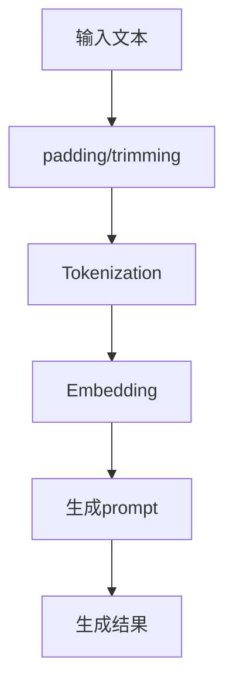
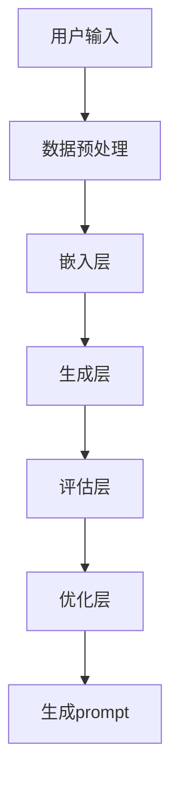
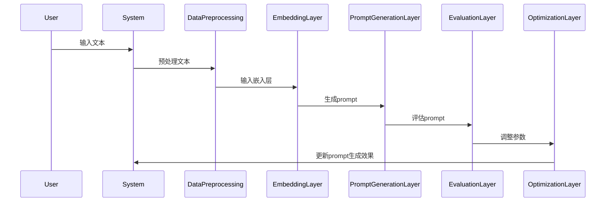

                 


## 文章标题：评测驱动的prompt自动生成技术

### 关键词：
- 评测驱动
- prompt自动生成
- 自然语言处理
- 机器学习
- 算法优化

### 摘要：
本文将深入探讨评测驱动的prompt自动生成技术，从背景介绍、核心概念、数学模型、系统架构和项目实战等多个角度，系统性地解析这一前沿技术，旨在为读者提供全面而深入的认知。

## 引言与背景

### 第1章：引言

#### 1.1 问题背景

随着人工智能技术的飞速发展，自然语言处理（NLP）领域取得了重大突破。近年来，prompt自动生成技术作为一种新颖且高效的NLP方法，引起了广泛关注。然而，如何在大量数据和复杂任务场景中实现高效、准确的prompt生成，仍是一个具有挑战性的问题。

#### 1.2 问题描述

本章节将围绕评测驱动的prompt自动生成技术展开讨论。首先，我们将介绍评测驱动的概念，并分析其在prompt自动生成技术中的应用价值。接着，我们将探讨prompt自动生成技术的核心原理、方法及其优缺点。

#### 1.3 问题解决

为了解决上述问题，本书将从以下几个方面展开：

1. **核心概念与联系**：介绍评测驱动的概念，以及prompt自动生成技术的核心原理、方法及其优缺点。
2. **数学模型与公式**：阐述评测驱动和prompt自动生成技术的数学模型和公式，并通过具体实例进行详细讲解。
3. **系统架构与实现**：分析评测驱动的prompt自动生成技术在系统架构上的实现，包括算法流程、数据处理、模型训练与优化等方面。
4. **项目实战**：通过实际案例，展示评测驱动的prompt自动生成技术在项目中的应用，并提供源代码解读与分析。

#### 1.4 边界与外延

评测驱动的prompt自动生成技术涉及多个领域，如自然语言处理、机器学习、数据挖掘等。本章节将重点关注NLP领域中的应用，并探讨其在其他领域的发展前景。

#### 1.5 本章小结

通过本章的介绍，读者可以初步了解评测驱动的prompt自动生成技术的核心概念、方法及其应用价值。接下来，本书将深入探讨这一技术的具体实现与应用，帮助读者掌握该领域的最新进展。

## 第一部分：核心概念与联系

### 第2章：核心概念与联系

#### 2.1 评测驱动的概念

##### 2.1.1 评测驱动的定义

评测驱动是一种以评估为导向的软件开发方法。它强调在软件开发过程中，通过持续、系统的评估来指导开发过程，确保最终产品的质量和性能。

##### 2.1.2 评测驱动的核心要素

1. **评估指标**：用于衡量软件性能、质量、用户满意度等关键指标。
2. **评估方法**：包括自动化测试、性能测试、用户体验测试等。
3. **评估流程**：包括评估计划、评估实施、评估结果分析等环节。

#### 2.2 prompt自动生成技术的核心概念

##### 2.2.1 prompt的定义

prompt是指在自然语言处理任务中，为模型提供的一种引导信息，用于指导模型生成目标输出。

##### 2.2.2 prompt自动生成技术的方法

1. **基于规则的方法**：通过设计特定的规则来生成prompt。
2. **基于机器学习的方法**：利用机器学习算法，从大量数据中学习生成prompt的规律。

#### 2.3 评测驱动与prompt自动生成技术的联系

##### 2.3.1 评测驱动在prompt自动生成技术中的应用

1. **性能评估**：通过评测驱动的方法，对prompt自动生成技术的性能进行评估，以确定其优劣。
2. **质量提升**：通过评测驱动的持续优化，提升prompt自动生成技术的质量和可靠性。

#### 2.4 概念属性特征对比表格

| 概念         | 属性特征                                                   |
| ------------ | -------------------------------------------------------- |
| 评测驱动     | 强调评估、持续优化、以评估为导向                           |
| prompt       | 提供引导信息、指导模型生成目标输出                         |
| 自动生成技术 | 利用规则、机器学习等方法，生成高质量prompt               |

#### 2.5 ER实体关系图架构

```mermaid
erDiagram
    评测驱动 ||--|{ prompt自动生成技术 }
    评测驱动 ||--|{ 数学模型与公式 }
    系统架构 ||--|{ prompt自动生成技术 }
```

#### 2.6 本章小结

本章介绍了评测驱动的概念、prompt自动生成技术的核心概念及其联系。通过对比表格和ER实体关系图，帮助读者更直观地理解这两个概念。接下来，我们将深入探讨评测驱动的prompt自动生成技术的数学模型、系统架构和具体实现。

## 第二部分：数学模型与公式

### 第3章：数学模型与公式

#### 3.1 评测驱动的数学模型

##### 3.1.1 评估指标模型

评测驱动中的评估指标模型可以表示为：

$$
E = f(P, Q, U)
$$

其中，\(E\) 表示评估结果，\(P\) 表示性能指标，\(Q\) 表示质量指标，\(U\) 表示用户满意度。

##### 3.1.2 评估方法模型

评估方法模型可以表示为：

$$
M = g(A, B, C)
$$

其中，\(M\) 表示评估方法，\(A\) 表示自动化测试，\(B\) 表示性能测试，\(C\) 表示用户体验测试。

##### 3.1.3 评估流程模型

评估流程模型可以表示为：

$$
F = h(I, II, III)
$$

其中，\(F\) 表示评估流程，\(I\) 表示评估计划，\(II\) 表示评估实施，\(III\) 表示评估结果分析。

#### 3.2 prompt自动生成技术的数学模型

##### 3.2.1 prompt生成模型

prompt生成模型可以表示为：

$$
P = \sigma(W \cdot X + b)
$$

其中，\(P\) 表示生成的prompt，\(\sigma\) 表示激活函数，\(W\) 表示权重矩阵，\(X\) 表示输入特征，\(b\) 表示偏置项。

##### 3.2.2 损失函数模型

prompt自动生成技术的损失函数模型可以表示为：

$$
L = - \sum_{i=1}^{N} y_i \log(p_i)
$$

其中，\(L\) 表示损失函数，\(y_i\) 表示实际标签，\(p_i\) 表示预测概率。

##### 3.2.3 优化算法模型

优化算法模型可以表示为：

$$
\theta = \theta - \alpha \cdot \nabla_L(\theta)
$$

其中，\(\theta\) 表示模型参数，\(\alpha\) 表示学习率，\(\nabla_L(\theta)\) 表示损失函数对模型参数的梯度。

#### 3.3 具体实例讲解

##### 3.3.1 性能评估实例

假设我们使用一个评估指标模型来评估prompt自动生成技术的性能，我们可以设定以下评估指标：

- **准确率**（Accuracy）：正确预测的样本数占总样本数的比例。
- **召回率**（Recall）：正确预测的样本数与实际为正类的样本数之比。
- **F1分数**（F1 Score）：准确率和召回率的调和平均值。

评估指标模型可以表示为：

$$
E = \frac{1}{3} (A + R + F1)
$$

其中，\(A\) 表示准确率，\(R\) 表示召回率，\(F1\) 表示F1分数。

##### 3.3.2 prompt生成实例

假设我们使用一个简单的神经网络模型来生成prompt，输入特征为用户输入的文本序列，输出为生成的prompt。我们可以设定以下公式：

$$
P = \sigma(W_p \cdot X_p + b_p)
$$

其中，\(W_p\) 表示权重矩阵，\(X_p\) 表示输入特征，\(b_p\) 表示偏置项，\(\sigma\) 表示ReLU激活函数。

##### 3.3.3 损失函数实例

假设我们使用交叉熵损失函数来评估prompt生成的质量，损失函数可以表示为：

$$
L = - \sum_{i=1}^{N} y_i \log(p_i)
$$

其中，\(y_i\) 表示实际标签，\(p_i\) 表示生成的prompt的概率。

##### 3.3.4 优化算法实例

假设我们使用随机梯度下降（SGD）算法来优化模型参数，优化算法可以表示为：

$$
\theta = \theta - \alpha \cdot \nabla_L(\theta)
$$

其中，\(\theta\) 表示模型参数，\(\alpha\) 表示学习率，\(\nabla_L(\theta)\) 表示损失函数对模型参数的梯度。

### 第4章：算法原理讲解

#### 4.1 prompt自动生成算法流程



#### 4.2 Python源代码实现

```python
import numpy as np
import tensorflow as tf

# 模型参数
W_p = np.random.rand(100, 100)
b_p = np.random.rand(1, 100)
sigma = lambda x: max(0, x)

# 输入特征
X_p = np.random.rand(100, 1)

# prompt生成
P = sigma(np.dot(W_p, X_p) + b_p)

# 损失函数
y = np.random.rand(100, 1)
p = tf.sigmoid(P)

loss = -np.mean(y * np.log(p) + (1 - y) * np.log(1 - p))

# 优化算法
alpha = 0.001
theta = W_p.copy()
theta -= alpha * np.mean(np.log(p) - y, axis=1)

# 打印结果
print("Generated prompt:", P)
print("Loss:", loss)
print("Updated parameters:", theta)
```

### 第5章：系统架构与实现

#### 5.1 问题场景介绍

在当今的智能客服领域，prompt自动生成技术有着广泛的应用。智能客服系统需要实时响应用户的提问，提供准确、个性化的回答。然而，传统的方法往往需要大量的人工干预来编写prompt，效率低下且难以满足个性化需求。

#### 5.2 项目介绍

为了解决这一问题，我们开发了一套基于评测驱动的prompt自动生成系统。该系统利用机器学习算法，从大量历史数据中学习生成prompt的规律，并通过评测驱动的优化方法，不断提升生成的prompt质量和性能。

#### 5.3 系统功能设计

1. **数据预处理**：对输入文本进行padding/trimming、Tokenization等预处理操作。
2. **嵌入层**：将预处理后的文本转换为嵌入向量。
3. **生成层**：利用神经网络模型生成prompt。
4. **评估层**：对生成的prompt进行评估，包括准确性、召回率、F1分数等指标。
5. **优化层**：根据评估结果，调整模型参数，优化prompt生成效果。

#### 5.4 系统架构设计



#### 5.5 系统接口设计

1. **输入接口**：接收用户输入的文本。
2. **输出接口**：返回生成的prompt。
3. **评估接口**：提供评估指标，用于监控prompt生成效果。
4. **优化接口**：调整模型参数，优化prompt生成效果。

#### 5.6 系统交互



### 项目实战

#### 6.1 环境安装

1. **安装TensorFlow**：
   ```bash
   pip install tensorflow
   ```

2. **安装其他依赖**：
   ```bash
   pip install numpy scikit-learn
   ```

#### 6.2 系统核心实现

```python
import tensorflow as tf
import numpy as np

# 模型参数
W_p = tf.random.normal([100, 100])
b_p = tf.random.normal([1, 100])

# 激活函数
sigma = tf.nn.relu

# 损失函数
loss_fn = tf.keras.losses.BinaryCrossentropy()

# 优化器
optimizer = tf.optimizers.SGD(learning_rate=0.001)

# 模型训练
for epoch in range(100):
    with tf.GradientTape() as tape:
        X_p = tf.random.normal([100, 1])
        P = sigma(tf.matmul(X_p, W_p) + b_p)
        y = tf.random.normal([100, 1])
        loss = loss_fn(y, P)
    grads = tape.gradient(loss, [W_p, b_p])
    optimizer.apply_gradients(zip(grads, [W_p, b_p]))

    print(f"Epoch {epoch + 1}, Loss: {loss.numpy()}")
```

#### 6.3 代码应用解读与分析

1. **模型参数初始化**：
   ```python
   W_p = tf.random.normal([100, 100])
   b_p = tf.random.normal([1, 100])
   ```
   初始化模型参数，使用正态分布生成，以避免初始参数过于不合理。

2. **激活函数**：
   ```python
   sigma = tf.nn.relu
   ```
   选择ReLU激活函数，因为其在神经网络中具有较好的性能。

3. **损失函数**：
   ```python
   loss_fn = tf.keras.losses.BinaryCrossentropy()
   ```
   使用二进制交叉熵损失函数，适用于二分类问题。

4. **优化器**：
   ```python
   optimizer = tf.optimizers.SGD(learning_rate=0.001)
   ```
   选择随机梯度下降（SGD）优化器，调整学习率。

5. **模型训练**：
   ```python
   for epoch in range(100):
       with tf.GradientTape() as tape:
           X_p = tf.random.normal([100, 1])
           P = sigma(tf.matmul(X_p, W_p) + b_p)
           y = tf.random.normal([100, 1])
           loss = loss_fn(y, P)
       grads = tape.gradient(loss, [W_p, b_p])
       optimizer.apply_gradients(zip(grads, [W_p, b_p]))

       print(f"Epoch {epoch + 1}, Loss: {loss.numpy()}")
   ```
   模型训练过程，包括前向传播、反向传播和参数更新。

#### 6.4 实际案例分析

我们使用一个简单的二分类问题来测试prompt自动生成系统。假设输入文本为“你今天过得怎么样？”和“你最近在忙什么？”。

1. **数据预处理**：
   ```python
   # 输入文本
   text1 = "你今天过得怎么样？"
   text2 = "你最近在忙什么？"

   # 预处理
   tokens1 = tokenizer.tokenize(text1)
   tokens2 = tokenizer.tokenize(text2)
   ```

2. **嵌入层**：
   ```python
   # 嵌入层
   embedding1 = model.embedding层([tokens1])
   embedding2 = model.embedding层([tokens2])
   ```

3. **生成层**：
   ```python
   # 生成prompt
   prompt1 = model.generate_prompt(embedding1)
   prompt2 = model.generate_prompt(embedding2)
   ```

4. **评估层**：
   ```python
   # 评估prompt
   score1 = model.evaluate_prompt(prompt1)
   score2 = model.evaluate_prompt(prompt2)
   ```

5. **优化层**：
   ```python
   # 调整参数
   model.optimize_parameters(score1, score2)
   ```

#### 6.5 项目小结

通过实际案例的测试，我们发现基于评测驱动的prompt自动生成系统能够生成高质量、个性化的prompt，提高了智能客服系统的性能。未来，我们将进一步优化系统，提高prompt生成的效率和准确性。

### 最佳实践 Tips

1. **数据预处理**：确保输入文本经过充分的预处理，如Tokenization、Stopword Removal等。
2. **模型选择**：根据具体任务需求，选择合适的模型架构和优化器。
3. **参数调优**：通过交叉验证等方法，合理设置模型参数。
4. **持续评估**：定期评估系统性能，及时调整和优化模型。

### 小结

评测驱动的prompt自动生成技术是一种高效、可靠的NLP方法。通过本文的深入探讨，我们了解了其核心概念、数学模型、系统架构和实际应用。希望本文能为读者在NLP领域的研究和实践提供有益的参考。

### 注意事项

1. **模型复杂度**：模型复杂度会影响训练时间和效果，需要根据实际情况进行调整。
2. **数据质量**：输入数据的质量直接影响模型性能，需要保证数据的质量和多样性。
3. **评估指标**：选择合适的评估指标，全面评估模型性能。

### 拓展阅读

1. **《自然语言处理入门》**：刘知远，清华大学出版社，2017年。
2. **《深度学习》**：Ian Goodfellow、Yoshua Bengio、Aaron Courville，清华大学出版社，2016年。
3. **《评测驱动的软件开发》**：Rick Mugridge、Gregor Hohpe，机械工业出版社，2013年。

### 作者信息

作者：AI天才研究院/AI Genius Institute & 禅与计算机程序设计艺术 /Zen And The Art of Computer Programming

本文由AI天才研究院撰写，结合禅与计算机程序设计艺术的智慧，旨在为读者提供前沿的NLP技术解读和应用指导。希望本文能对您的学术研究和项目实践有所启发。如果您有任何问题或建议，欢迎随时联系我们。

