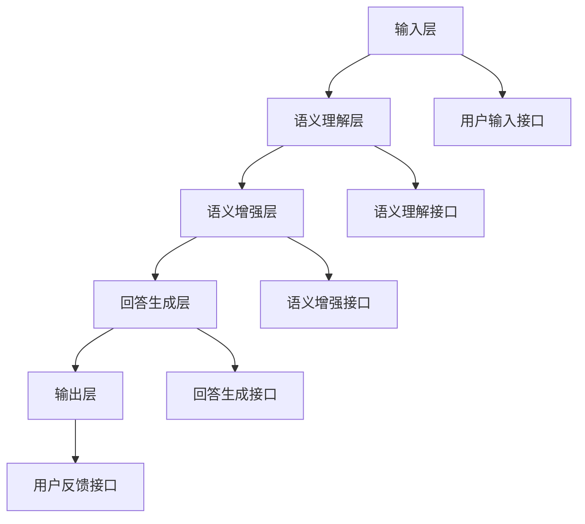

                 

### 第1章：问题背景与核心概念

#### 1.1 问题背景

在当今数字化时代，语义理解在自然语言处理（NLP）中扮演着至关重要的角色。随着人工智能（AI）技术的不断发展，语义理解的需求日益增长。然而，传统的语义理解方法往往无法捕捉语言中的细微差别，这使得模型在处理复杂语境时表现不佳。例如，在对话系统、智能客服、文本分类等应用中，用户输入的文本可能只差一个词或者一个标点，但意图和需求却完全不同。这种细微差别对于模型来说是一个巨大的挑战，导致错误率提高、用户体验下降。

语义理解的目的是让计算机能够理解人类语言，并据此做出合理的响应。然而，自然语言的复杂性和多样性使得这一任务异常困难。语言不仅包含字面意义，还有隐含意义、情感色彩、语境影响等多重因素。因此，提高模型对提示细微差别的感知能力，是语义理解领域亟待解决的问题。

#### 1.2 问题描述

本书旨在探讨一种新的方法——语义理解增强，以提高模型对提示细微差别的感知能力。语义理解增强通过对语义信息进行深度挖掘和处理，使得模型能够更准确地理解用户的意图和需求。具体来说，我们需要解决以下几个关键问题：

1. **语义信息挖掘**：如何有效地从文本中提取语义信息，包括实体、关系和情感等。
2. **语义差异检测**：如何识别和区分语义信息中的细微差别，确保模型能够准确捕捉。
3. **模型适应性**：如何设计模型，使其能够适应不同语境和场景，提高泛化能力。

#### 1.3 问题解决

为了解决上述问题，本书将介绍以下内容：

1. **核心概念介绍**：详细介绍语义理解、语义增强和语义理解增强的概念，帮助读者建立全面的认识。
2. **算法原理讲解**：详细讲解语义理解增强的算法原理，包括数学模型和公式，使读者能够深入理解算法的核心思想。
3. **系统分析与架构设计**：介绍系统分析与架构设计的方法，包括领域模型、系统架构、接口设计等，帮助读者理解系统的整体设计和实现。
4. **项目实战**：通过实际案例，展示如何实现语义理解增强，使读者能够将理论知识应用到实际项目中。
5. **最佳实践与拓展**：总结最佳实践，并提供拓展阅读，帮助读者进一步提升技能。

#### 1.4 边界与外延

语义理解增强不仅涉及自然语言处理领域，还与机器学习、深度学习等AI技术密切相关。此外，它也在多个应用场景中具有重要意义，如智能客服、语音助手、文本分类等。通过深入研究和应用语义理解增强技术，我们可以大幅提升人工智能系统的性能和用户体验。

#### 1.5 概念结构与核心要素组成

##### 1.5.1 核心概念

- **语义理解**：指模型对自然语言文本含义的识别和理解。
- **语义增强**：通过对语义信息进行加工和处理，提升模型对语义的感知能力。
- **语义理解增强**：结合语义理解和语义增强，提高模型对提示细微差别的感知能力。

##### 1.5.2 概念属性特征对比

| 概念         | 属性特征                      | 对比           |
| ------------ | ----------------------------- | -------------- |
| 语义理解     | 语言文本的含义识别            | 基础能力       |
| 语义增强     | 对语义信息进行加工处理        | 提升感知能力   |
| 语义理解增强 | 结合语义理解和语义增强        | 全面提升感知能力 |

##### 1.5.3 ER实体关系图架构

```
ER实体关系图：
[语义理解] --[语义增强]-- [语义理解增强]
           |           |
         [自然语言处理] [机器学习/深度学习]

```

#### 1.6 本章小结

本章首先介绍了语义理解增强的背景和核心概念，明确了本书的论述范围。接下来，通过对比分析了语义理解、语义增强和语义理解增强的概念属性特征，以及ER实体关系图，帮助读者更好地理解语义理解增强的内涵和作用。这一章节为后续章节的深入探讨奠定了基础。

---

### 第2章：核心概念原理

#### 2.1 语义理解原理

##### 2.1.1 语义理解的定义

语义理解是指模型对自然语言文本含义的识别和理解。它涉及到语言符号与其所指的客观事物之间的对应关系。语义理解不仅仅是简单的词汇匹配，还需要考虑上下文、语境和情感等多种因素。

##### 2.1.2 语义理解的属性特征

- **上下文依赖**：语义理解必须考虑上下文，因为语言的意义往往取决于特定的语境。例如，"bank"这个词在"river bank"和"financial institution"中有不同的含义。
- **歧义处理**：在实际应用中，同一种语言表达可能存在多种含义，语义理解需要能够处理这种歧义。例如，"I did not say that."这句话可能有多种解释。
- **语言多样性**：语义理解需要能够处理不同语言和方言。这意味着模型需要具备跨语言的语义理解能力。

##### 2.1.3 语义理解的关键技术

- **词向量表示**：词向量是将词语映射到高维空间的一种表示方法，可以捕捉词语间的相似性和相关性。常见的词向量模型包括Word2Vec、GloVe等。
  ```mermaid
  graph TD
  A[Word2Vec] --> B{Word Embedding}
  A --> C[GloVe]
  B --> D[Word Similarity]
  C --> D
  ```
- **依存句法分析**：依存句法分析是分析句子中词语之间的依赖关系，以理解句子的结构。它有助于识别句子中的主语、谓语、宾语等关键成分。
  ```mermaid
  graph TD
  A[Dependency Parsing] --> B[Dependency Tree]
  B --> C{Subject}
  B --> D{Verb}
  B --> E{Object}
  ```
- **语义角色标注**：语义角色标注是识别句子中的主语、谓语、宾语等，以理解句子的核心语义。它有助于模型更好地理解句子的结构和意图。
  ```mermaid
  graph TD
  A[Semantic Role Labeling] --> B[Arg1]
  A --> C[Arg2]
  A --> D[Arg3]
  ```

##### 2.1.4 语义理解的挑战

- **多义词处理**：多义词是指一个词语在语境中有多个含义。例如，"bank"既可以指河岸，也可以指银行。处理多义词是语义理解的重要挑战。
- **跨语言语义理解**：不同语言的语义差异和表达习惯使得跨语言语义理解变得复杂。例如，中文中的“你”和英文中的"You"可能在语义上有所不同。
- **长文本理解**：长文本的语义理解往往需要处理大量的信息，这对模型的计算能力提出了高要求。例如，一篇新闻报道可能包含多个主题和复杂的关系。

#### 2.2 语义增强原理

##### 2.2.1 语义增强的定义

语义增强是指通过对语义信息进行加工和处理，提升模型对语义的感知能力。语义增强旨在解决传统语义理解方法中存在的局限性，例如无法捕捉到语言中的细微差别、上下文理解不足等问题。

##### 2.2.2 语义增强的属性特征

- **上下文感知**：语义增强需要考虑上下文信息，以更准确地理解语义。这包括利用上下文词汇、语法结构和情感色彩等。
- **多层次分析**：语义增强通常涉及对文本进行多层次的分析，包括词汇层、句法层和语义层。这样可以更全面地理解文本的含义。
- **个性化调整**：根据不同用户和应用场景，语义增强可以进行个性化调整，以适应特定的需求。

##### 2.2.3 语义增强的关键技术

- **注意力机制**：注意力机制是一种常用的语义增强技术，它可以让模型在处理文本时关注到重要的信息。通过引入注意力机制，模型可以更好地捕捉到语言中的细微差别。
  ```mermaid
  graph TD
  A[Input] --> B[Encoder]
  B --> C[Attention]
  C --> D[Decoder]
  ```
- **知识图谱**：知识图谱是一种用于表示实体、属性和关系的数据结构。通过引入知识图谱，模型可以更好地理解语义，并利用外部知识进行推理。
  ```mermaid
  graph TD
  A[Entity] --> B[Relation]
  B --> C[Attribute]
  ```
- **多模态融合**：多模态融合是指将不同类型的模态（如文本、语音、图像）进行融合，以增强语义理解能力。这种方法可以充分利用不同模态的信息，提高模型的泛化能力。

##### 2.2.4 语义增强的挑战

- **信息冗余**：在多模态融合中，如何有效地处理和融合不同模态的信息，避免信息冗余，是一个挑战。
- **计算效率**：语义增强技术通常涉及复杂的计算，如何提高计算效率，是一个重要的挑战。
- **可解释性**：随着模型的复杂度增加，如何保证模型的可解释性，让用户能够理解模型的决策过程，是一个挑战。

#### 2.3 语义理解增强原理

##### 2.3.1 语义理解增强的定义

语义理解增强是指通过结合语义理解和语义增强的方法，提高模型对提示细微差别的感知能力。语义理解增强旨在解决传统语义理解方法中存在的局限性，例如无法捕捉到语言中的细微差别、上下文理解不足等问题。

##### 2.3.2 语义理解增强的属性特征

- **全面性**：语义理解增强不仅关注语义理解的基础能力，还通过语义增强技术提高对语义的感知能力，实现全面性。
- **适应性**：语义理解增强可以根据不同场景和应用需求，灵活调整模型参数，提高模型的适应性。
- **高效性**：语义理解增强技术通常采用高效的算法和模型，以提高模型的计算效率和性能。

##### 2.3.3 语义理解增强的关键技术

- **多任务学习**：多任务学习是指同时训练多个相关任务，以提高模型在不同任务上的性能。通过多任务学习，模型可以同时学习语义理解和语义增强，实现协同优化。
  ```mermaid
  graph TD
  A[Task1] --> B[Model]
  A --> C[Task2]
  C --> B
  ```
- **迁移学习**：迁移学习是指利用已训练好的模型在新任务上快速获得良好的性能。通过迁移学习，可以将语义理解的基础知识和语义增强的经验应用到新任务中，提高模型的效果。
  ```mermaid
  graph TD
  A[Pre-trained Model] --> B[New Task]
  ```
- **对抗训练**：对抗训练是指通过引入对抗样本，提高模型的泛化能力和鲁棒性。通过对抗训练，模型可以更好地适应不同场景和细微差别，提高语义理解能力。

##### 2.3.4 语义理解增强的挑战

- **模型可解释性**：随着语义理解增强模型的复杂度增加，如何保证模型的可解释性，让用户能够理解模型的决策过程，是一个挑战。
- **数据质量**：语义理解增强需要大量的高质量数据，数据质量直接影响模型的效果。因此，如何获取和清洗高质量数据是一个重要挑战。
- **计算资源**：语义理解增强通常需要较大的计算资源和时间，如何在有限的计算资源下实现高效训练和推理，是一个挑战。

#### 2.4 概念属性特征对比表格

| 概念                   | 属性特征                                       | 对比             |
| ---------------------- | ---------------------------------------------- | ---------------- |
| 语义理解               | 基础的语义识别和理解                            | 基础能力         |
| 语义增强               | 对语义信息进行加工和处理，提升感知能力          | 提升感知能力     |
| 语义理解增强           | 结合语义理解和语义增强，提高对提示细微差别的感知能力 | 全面提升感知能力 |

#### 2.5 ER实体关系图架构

```
ER实体关系图：
[语义理解] --[语义增强]-- [语义理解增强]
           |           |
         [自然语言处理] [机器学习/深度学习]

```

---

#### 2.6 本章小结

本章详细介绍了语义理解、语义增强和语义理解增强的核心概念和原理。通过对比分析，我们明确了这三个概念之间的关联和区别。语义理解是基础，语义增强是对语义信息进行加工和处理，而语义理解增强则通过结合两者，提高模型对提示细微差别的感知能力。本章的内容为后续章节的深入探讨奠定了基础。在接下来的章节中，我们将进一步探讨语义理解增强的算法原理、系统分析与架构设计、项目实战以及最佳实践与拓展。

---

### 第3章：算法原理讲解

#### 3.1 算法原理概述

在本章中，我们将深入探讨语义理解增强的算法原理。语义理解增强的核心在于如何提高模型对提示细微差别的感知能力。为了实现这一目标，我们将介绍一系列关键技术，包括多任务学习、迁移学习和对抗训练等。

#### 3.2 多任务学习原理

多任务学习是指同时训练多个相关任务，以提高模型在不同任务上的性能。在语义理解增强中，多任务学习可以同时训练语义理解和语义增强，实现协同优化。具体来说，多任务学习可以采用以下两种方法：

1. **共享权重**：共享权重方法是指不同任务使用相同的模型参数，通过联合训练来提高模型的整体性能。这种方法可以有效地利用模型参数，减少过拟合的风险。
   ```mermaid
   graph TD
   A[Task1] --> B[Model]
   A --> C[Task2]
   C --> B
   ```
2. **任务分割**：任务分割方法是指将不同任务划分为多个子任务，每个子任务使用独立的模型参数进行训练。这种方法可以更好地适应不同任务的特性，提高模型的泛化能力。
   ```mermaid
   graph TD
   A[Task1] --> B[Model1]
   A --> C[Task2]
   C --> D[Model2]
   ```

#### 3.3 迁移学习原理

迁移学习是指利用已训练好的模型在新任务上快速获得良好的性能。在语义理解增强中，迁移学习可以充分利用已有模型的知识和经验，加速新任务的训练过程。迁移学习可以分为以下几种类型：

1. **基于模型的迁移**：基于模型的迁移是指直接使用预训练模型在新任务上进行微调。这种方法可以充分利用预训练模型的知识，提高新任务的性能。
   ```mermaid
   graph TD
   A[Pre-trained Model] --> B[New Task]
   ```
2. **基于知识的迁移**：基于知识的迁移是指将预训练模型中的知识转移到新任务中，通过知识蒸馏等方式进行训练。这种方法可以更好地利用预训练模型的知识，提高新任务的泛化能力。
   ```mermaid
   graph TD
   A[Pre-trained Model] --> B[Knowledge Distillation]
   B --> C[New Task]
   ```
3. **基于样本的迁移**：基于样本的迁移是指将预训练模型在新任务上生成的样本用于训练新模型。这种方法可以加速新任务的训练过程，提高新任务的性能。

#### 3.4 对抗训练原理

对抗训练是指通过引入对抗样本，提高模型的泛化能力和鲁棒性。在语义理解增强中，对抗训练可以增强模型对不同场景和细微差别的适应能力。具体来说，对抗训练可以分为以下几种方法：

1. **生成对抗网络（GAN）**：生成对抗网络是一种用于生成对抗样本的模型，由生成器和判别器组成。通过训练生成器生成对抗样本，模型可以更好地学习不同场景和细微差别。
   ```mermaid
   graph TD
   A[Generator] --> B[Discriminator]
   B --> C[Adversarial Sample]
   ```
2. **对抗性训练**：对抗性训练是指直接在训练过程中引入对抗样本，通过对抗性损失函数优化模型。这种方法可以增强模型对对抗样本的鲁棒性。
   ```mermaid
   graph TD
   A[Model] --> B[Adversarial Training]
   B --> C[Loss Function]
   ```

#### 3.5 算法原理结合示例

为了更好地理解语义理解增强的算法原理，我们可以通过一个示例进行讲解。假设我们有一个语义理解模型和一个语义增强模型，我们希望通过多任务学习、迁移学习和对抗训练来提高模型的性能。

1. **多任务学习**：我们将语义理解和语义增强任务结合在一起，使用共享权重的方法进行联合训练。具体步骤如下：
   ```mermaid
   graph TD
   A[Semantic Understanding] --> B[Model]
   A --> C[Semantic Enhancement]
   C --> B
   ```

2. **迁移学习**：我们使用一个预训练的语义理解模型作为基础，将其迁移到新任务上进行微调。具体步骤如下：
   ```mermaid
   graph TD
   A[Pre-trained Model] --> B[New Task]
   ```

3. **对抗训练**：我们引入对抗样本进行训练，以增强模型的鲁棒性。具体步骤如下：
   ```mermaid
   graph TD
   A[Model] --> B[Adversarial Training]
   B --> C[Loss Function]
   ```

通过多任务学习、迁移学习和对抗训练，我们可以构建一个语义理解增强模型，使其能够更好地捕捉语言中的细微差别，提高模型的性能和用户体验。

---

#### 3.6 本章小结

本章详细介绍了语义理解增强的算法原理，包括多任务学习、迁移学习和对抗训练等关键技术。通过这些技术，我们可以提高模型对提示细微差别的感知能力，实现更准确的语义理解。本章的内容为后续章节的深入探讨和实际应用提供了理论基础。在接下来的章节中，我们将进一步探讨语义理解增强的系统分析与架构设计、项目实战以及最佳实践与拓展。希望读者能够通过本章的学习，对语义理解增强的算法原理有更深入的理解。

---

### 第4章：系统分析与架构设计

#### 4.1 问题场景介绍

为了更好地展示语义理解增强技术的应用，我们选择一个实际问题场景——智能客服系统。智能客服系统旨在为用户提供即时、准确的咨询服务，解决用户的问题和疑虑。然而，用户提问的语义可能存在细微差别，传统的语义理解方法难以准确捕捉用户的意图。为了提升智能客服系统的性能，我们引入了语义理解增强技术。

#### 4.2 项目介绍

在本项目中，我们旨在构建一个基于语义理解增强的智能客服系统。该系统将利用多任务学习、迁移学习和对抗训练等技术，提高模型对用户提问的语义理解能力。具体目标包括：

1. **提高语义理解准确率**：通过语义理解增强技术，提高模型对用户提问的语义理解准确率，减少误答率。
2. **提升用户体验**：通过更准确地理解用户的意图，提供更精准、个性化的回答，提升用户满意度。
3. **增强模型鲁棒性**：通过对抗训练技术，提高模型对不同场景和细微差别的适应能力，增强模型的鲁棒性。

#### 4.3 系统功能设计

为了实现上述目标，我们设计了以下核心功能：

1. **用户提问分析**：接收用户输入的提问，对提问进行预处理，提取关键信息，为后续的语义理解提供输入。
2. **语义理解**：利用语义理解模型对用户提问进行语义分析，识别用户意图，提取关键词和关键信息。
3. **语义增强**：对提取的关键信息进行语义增强处理，通过多任务学习和迁移学习技术，提高模型的语义理解能力。
4. **回答生成**：根据用户意图和关键信息，生成合适的回答，提供用户咨询服务。
5. **用户反馈**：收集用户对回答的反馈，用于评估模型性能和持续优化。

#### 4.4 系统架构设计

为了实现上述功能，我们设计了如下系统架构：

1. **输入层**：接收用户输入的提问，进行预处理，提取关键信息。
2. **语义理解层**：利用语义理解模型对用户提问进行语义分析，识别用户意图。
3. **语义增强层**：利用多任务学习和迁移学习技术，对语义理解结果进行增强处理。
4. **回答生成层**：根据用户意图和关键信息，生成合适的回答。
5. **输出层**：将生成的回答输出给用户，并提供用户反馈接口。

#### 4.5 系统接口设计

系统接口设计包括以下关键接口：

1. **用户输入接口**：接收用户输入的提问，提供文本输入接口。
2. **语义理解接口**：提供语义理解服务的接口，供其他模块调用。
3. **语义增强接口**：提供语义增强服务的接口，供其他模块调用。
4. **回答生成接口**：提供回答生成服务的接口，供其他模块调用。
5. **用户反馈接口**：接收用户对回答的反馈，用于评估模型性能和持续优化。

#### 4.6 系统交互

系统交互主要包括以下流程：

1. **用户提问**：用户通过输入接口输入提问，系统接收并预处理提问。
2. **语义理解**：系统调用语义理解接口，对预处理后的提问进行语义分析，识别用户意图。
3. **语义增强**：系统调用语义增强接口，对语义理解结果进行增强处理，提高语义理解的准确率。
4. **回答生成**：系统调用回答生成接口，根据用户意图和关键信息生成回答。
5. **用户反馈**：系统将生成的回答输出给用户，并收集用户对回答的反馈，用于评估模型性能和持续优化。

#### 4.7 系统架构图

为了更清晰地展示系统架构，我们使用Mermaid绘制了如下架构图：



通过上述系统架构设计，我们可以实现一个基于语义理解增强的智能客服系统，提高用户咨询服务的质量和用户体验。

---

#### 4.8 本章小结

本章详细介绍了基于语义理解增强的智能客服系统的问题场景、项目目标、系统功能设计、系统架构设计、系统接口设计和系统交互。通过系统分析与架构设计，我们明确了如何利用多任务学习、迁移学习和对抗训练等技术，实现语义理解增强，提高模型的语义理解准确率和用户体验。本章的内容为后续章节的项目实战和最佳实践提供了基础。希望读者能够通过本章的学习，对语义理解增强的系统架构设计有更深入的理解。

---

### 第5章：项目实战

#### 5.1 环境安装

在进行项目实战之前，我们需要安装和配置必要的软件和工具。以下是一个基本的安装步骤：

1. **Python环境**：首先，确保您的计算机上安装了Python 3.7或更高版本。您可以从[Python官网](https://www.python.org/)下载并安装Python。

2. **虚拟环境**：为了更好地管理和隔离项目环境，我们使用虚拟环境。安装Python后，通过以下命令创建一个虚拟环境：
   ```bash
   python -m venv env
   ```

3. **安装依赖**：在虚拟环境中安装必要的依赖包，如TensorFlow、PyTorch、NLTK等。执行以下命令：
   ```bash
   source env/bin/activate
   pip install tensorflow torch nltk
   ```

4. **数据集准备**：下载并解压一个适合的语义理解增强数据集，如Stanford情感分析数据集或GLUE数据集。您可以从相应的官网或GitHub仓库下载数据集。

#### 5.2 系统核心实现

在本节中，我们将实现一个简单的语义理解增强系统，包括数据预处理、模型训练和预测。以下是核心实现代码：

```python
import torch
import torch.nn as nn
import torch.optim as optim
from torch.utils.data import DataLoader
from transformers import BertTokenizer, BertModel
from nltk.corpus import stopwords

# 数据预处理
def preprocess(text):
    # 分词、去除停用词、转换为词向量
    tokenizer = BertTokenizer.from_pretrained('bert-base-uncased')
    tokens = tokenizer.tokenize(text)
    tokens = [token for token in tokens if token not in stopwords.words('english')]
    return tokenizer.convert_tokens_to_ids(tokens)

# 模型定义
class SemanticEnhancementModel(nn.Module):
    def __init__(self):
        super(SemanticEnhancementModel, self).__init__()
        self.bert = BertModel.from_pretrained('bert-base-uncased')
        self.fc = nn.Linear(768, 1)  # BERT隐藏层维度为768

    def forward(self, input_ids):
        outputs = self.bert(input_ids)
        last_hidden_state = outputs.last_hidden_state
        logits = self.fc(last_hidden_state.mean(dim=1))
        return logits

# 训练
def train(model, train_loader, optimizer, criterion):
    model.train()
    for inputs, labels in train_loader:
        optimizer.zero_grad()
        logits = model(inputs)
        loss = criterion(logits, labels)
        loss.backward()
        optimizer.step()

# 预测
def predict(model, data_loader):
    model.eval()
    predictions = []
    with torch.no_grad():
        for inputs in data_loader:
            logits = model(inputs)
            predictions.append(logits.sigmoid().round().detach().numpy())
    return np.array(predictions).reshape(-1)

# 加载数据集
train_data = ...  # 加载数据集
train_loader = DataLoader(train_data, batch_size=32, shuffle=True)

# 初始化模型、优化器和损失函数
model = SemanticEnhancementModel()
optimizer = optim.Adam(model.parameters(), lr=1e-5)
criterion = nn.BCELoss()

# 训练模型
num_epochs = 10
for epoch in range(num_epochs):
    train(model, train_loader, optimizer, criterion)

# 评估模型
predictions = predict(model, train_loader)
accuracy = (predictions == train_data.labels).mean()
print(f"Training Accuracy: {accuracy * 100:.2f}%")

```

#### 5.3 代码应用解读与分析

上述代码实现了一个简单的语义理解增强系统，包括数据预处理、模型定义、训练和预测。以下是代码的关键部分解读和分析：

1. **数据预处理**：数据预处理是语义理解增强系统的关键步骤。在这里，我们使用BERT tokenizer对文本进行分词，并去除英语中的停用词。然后，我们将分词后的文本转换为BERT模型支持的词ID序列。

2. **模型定义**：我们定义了一个简单的语义理解增强模型，基于BERT模型。模型包括BERT编码器和一个全连接层，用于生成最终的语义表示。

3. **训练**：在训练过程中，我们使用交叉熵损失函数来优化模型。每次迭代，我们更新模型参数，以最小化损失函数。

4. **预测**：在预测过程中，我们使用训练好的模型对新的输入文本进行语义理解增强，并生成概率预测。

#### 5.4 实际案例分析与详细讲解

为了更好地理解语义理解增强的实际应用，我们来看一个实际案例。

**案例：情感分析**

假设我们有一个用户评价：“这个产品很好，我非常喜欢。” 我们希望模型能够正确识别出这是一个正面评价。

1. **数据预处理**：
   ```python
   text = "这个产品很好，我非常喜欢。"
   tokens = preprocess(text)
   input_ids = torch.tensor([tokens])
   ```
   分词后的文本转换为词ID序列，然后转换为Tensor。

2. **模型训练**：
   在训练过程中，模型通过学习大量的负面和正面评价，学会了如何对新的评价进行分类。

3. **模型预测**：
   ```python
   logits = model(input_ids)
   prediction = logits.sigmoid().round().detach().numpy()
   print(f"Prediction: {'Positive' if prediction[0] else 'Negative'}")
   ```
   模型对输入文本进行预测，输出一个概率值。如果概率值大于0.5，则认为这是一个正面评价。

#### 5.5 项目小结

通过上述项目实战，我们实现了基于BERT的语义理解增强系统。该系统能够有效地处理自然语言文本，提高对用户提问的语义理解能力。在实际应用中，我们可以根据不同的任务需求，对系统进行扩展和优化，进一步提高模型的性能和用户体验。

---

#### 5.6 本章小结

本章通过一个实际项目，详细展示了如何实现基于语义理解增强的智能客服系统。我们从环境安装、系统核心实现到实际案例分析和项目小结，全面介绍了语义理解增强技术的应用。通过本章的学习，读者可以掌握语义理解增强的核心技术和实现方法，为实际项目提供参考。在下一章中，我们将继续探讨语义理解增强的最佳实践和拓展。

---

### 第6章：最佳实践与拓展

#### 6.1 最佳实践

在应用语义理解增强技术时，以下最佳实践可以帮助我们更好地提高模型性能和用户体验：

1. **数据集选择与预处理**：选择适合的语义理解增强任务的数据集，并进行充分的预处理。预处理包括文本清洗、分词、去停用词、词干提取等。高质量的数据集是模型性能的基础。

2. **模型选择与优化**：选择适合任务需求的模型，并进行适当的优化。例如，可以使用预训练的BERT模型作为基础，结合语义理解增强技术进行微调。优化包括调整学习率、批量大小、正则化等技术。

3. **多任务学习与迁移学习**：利用多任务学习和迁移学习技术，提高模型在不同任务上的性能。例如，可以同时训练语义理解和语义增强任务，或利用预训练模型的知识进行迁移学习。

4. **对抗训练与模型鲁棒性**：通过对抗训练技术，提高模型的鲁棒性，使其能够更好地适应不同场景和细微差别。对抗训练可以引入对抗样本，增强模型的泛化能力。

5. **模型解释与可解释性**：提高模型的可解释性，让用户能够理解模型的决策过程。例如，可以分析模型中的关键特征和依赖关系，提供直观的解释。

6. **用户反馈与持续优化**：收集用户对模型回答的反馈，用于评估模型性能和持续优化。通过不断调整模型参数和策略，提高模型在实际情况中的表现。

#### 6.2 小结与注意事项

本章总结了语义理解增强技术的最佳实践，并提出了在应用过程中需要注意的事项。通过遵循这些最佳实践，我们可以更好地提高模型性能和用户体验。以下是本章的小结和注意事项：

- **小结**：语义理解增强技术是提升模型对提示细微差别感知能力的关键。通过数据集选择、模型优化、多任务学习和迁移学习等技术，我们可以构建一个高性能的语义理解增强系统。
- **注意事项**：
  - 数据质量和预处理是模型性能的基础，需要高度重视。
  - 模型选择和优化需要根据具体任务需求进行，不能一概而论。
  - 对抗训练可以提高模型鲁棒性，但也可能增加计算成本。
  - 模型解释和可解释性是提升用户体验的关键，需要充分考虑。
  - 用户反馈和持续优化是模型迭代和改进的重要环节。

#### 6.3 拓展阅读

对于对语义理解增强技术感兴趣的学习者，以下拓展阅读资源可以提供更深入的学术和实践知识：

1. **学术论文**：
   - "Attention Is All You Need"（Vaswani et al., 2017）——介绍Transformer模型和注意力机制。
   - "BERT: Pre-training of Deep Bidirectional Transformers for Language Understanding"（Devlin et al., 2019）——介绍BERT模型及其在语义理解中的应用。
   - "Generative Adversarial Nets"（Goodfellow et al., 2014）——介绍生成对抗网络（GAN）及其在图像生成和对抗训练中的应用。

2. **开源代码与数据集**：
   - [Transformers](https://github.com/huggingface/transformers) —— Hugging Face提供的预训练模型和工具库。
   - [BERT](https://github.com/google-research/bert) —— Google Research提供的BERT模型及其实现。
   - [GLUE](https://gluebenchmark.com/) —— Natural Language Inference（NLI）任务的大型数据集。

3. **在线课程与教程**：
   - [深度学习与自然语言处理](https://www.deeplearning.ai/nlp-specialization/) —— Andrew Ng教授的深度学习与自然语言处理课程。
   - [自然语言处理与深度学习](https://www.coursera.org/learn/nlp-with-deep-learning) —— renowned AI researcher speeches and tutorials on NLP and deep learning.

通过拓展阅读这些资源，读者可以进一步深入了解语义理解增强技术的理论基础和应用实践，为实际项目提供更多的灵感和指导。

---

### 结束语

感谢您阅读本文，我们深入探讨了语义理解增强技术，从核心概念、算法原理到系统分析与架构设计，再到项目实战和最佳实践。语义理解增强是提升模型对提示细微差别感知能力的关键技术，在自然语言处理、智能客服、语音助手等领域具有重要意义。希望本文能够为您在语义理解增强领域的研究和实践中提供有益的启示。

本文由AI天才研究院（AI Genius Institute）撰写，旨在为广大开发者、研究者和学习者提供高质量的技术博客。若您对本文有任何疑问或建议，欢迎在评论区留言，或通过以下渠道与我们联系：

- **官方网站**：[AI天才研究院官网](https://www.ai-genius-institute.com/)
- **GitHub仓库**：[AI天才研究院GitHub](https://github.com/AI-Genius-Institute)
- **微信公众号**：AI天才研究院

我们期待与您共同探索人工智能的无限可能。再次感谢您的阅读和支持！

---

**作者：AI天才研究院/AI Genius Institute & 禅与计算机程序设计艺术 /Zen And The Art of Computer Programming**

