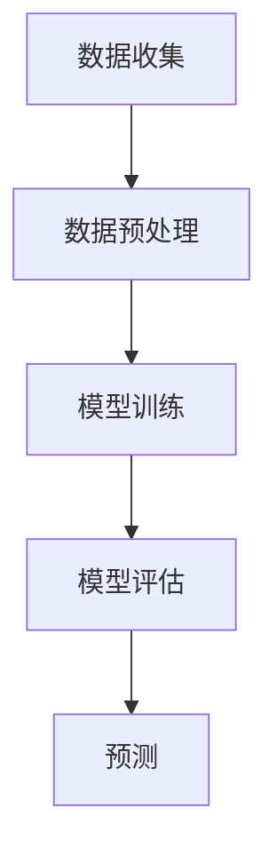
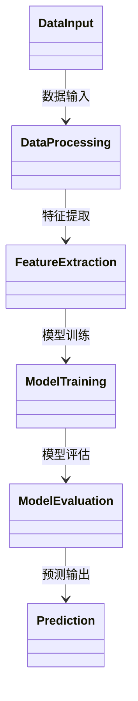
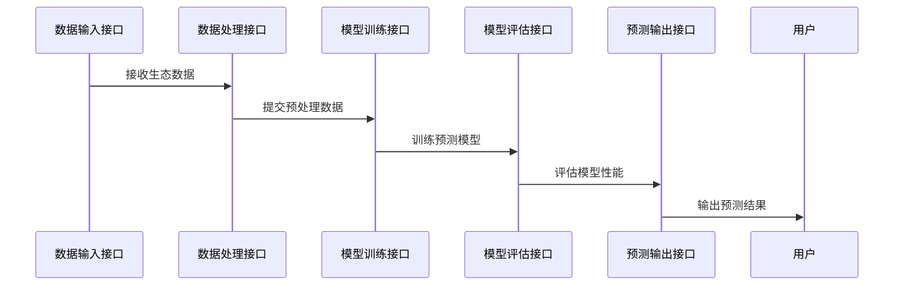

                 

## 语言模型在复杂生态系统平衡预测中的应用

### 摘要

随着全球生态环境的日益恶化，生态平衡预测成为了一项重要的研究课题。本文旨在探讨语言模型在复杂生态系统平衡预测中的应用，为解决生态平衡问题提供一种新的技术手段。文章首先介绍了生态系统的基本概念和生态平衡的重要性，随后详细阐述了语言模型的基础知识及其核心概念与特征。在此基础上，本文分析了语言模型在生态平衡预测中的应用场景和优势，并介绍了生态平衡预测的数学模型与算法。随后，文章通过两个实际项目展示了语言模型在生态平衡预测中的具体应用，并对语言模型在生态系统平衡预测中的深度学习应用进行了深入探讨。最后，本文提出了语言模型在生态平衡预测中面临的挑战和解决方案，并对未来发展趋势进行了展望。

### 目录大纲

----------------------------------------------------------------
## 第一部分: 背景与概念

### 第1章: 生态平衡与语言模型概述
#### 1.1 生态系统的基本概念
#### 1.2 生态平衡的重要性
#### 1.3 语言模型的基础知识
#### 1.4 语言模型与生态平衡预测的关系

### 第2章: 语言模型核心概念与特征
#### 2.1 语言模型的定义与组成
#### 2.2 语言模型的类型
#### 2.3 语言模型的核心特征
#### 2.4 语言模型的属性对比

### 第3章: 语言模型在生态平衡预测中的应用
#### 3.1 语言模型在生态平衡预测中的应用场景
#### 3.2 语言模型在生态系统数据分析中的应用
#### 3.3 语言模型在生态预测中的优势

### 第4章: 生态平衡预测的数学模型与算法
#### 4.1 生态平衡预测的数学模型
#### 4.2 语言模型在算法中的应用
#### 4.3 算法原理与流程图
#### 4.4 数学公式与公式解释

----------------------------------------------------------------

## 第二部分: 语言模型应用实践

### 第5章: 环境与工具准备
#### 5.1 环境搭建
#### 5.2 工具与库安装

### 第6章: 实战项目一：简单的生态平衡预测
#### 6.1 项目介绍
#### 6.2 系统功能设计
#### 6.3 系统架构设计
#### 6.4 系统接口设计
#### 6.5 系统交互流程
#### 6.6 核心代码实现
#### 6.7 项目分析

### 第7章: 实战项目二：复杂生态系统的平衡预测
#### 7.1 项目介绍
#### 7.2 系统功能设计
#### 7.3 系统架构设计
#### 7.4 系统接口设计
#### 7.5 系统交互流程
#### 7.6 核心代码实现
#### 7.7 项目分析

----------------------------------------------------------------

## 第三部分: 深入探讨与未来展望

### 第8章: 语言模型在生态平衡预测中的深度学习应用
#### 8.1 深度学习与生态平衡预测
#### 8.2 深度学习模型的选择与优化
#### 8.3 深度学习算法的应用实例

### 第9章: 语言模型在生态系统平衡预测中的挑战与解决方案
#### 9.1 数据质量问题
#### 9.2 模型泛化能力
#### 9.3 计算资源需求
#### 9.4 面向未来：生态平衡预测的可持续发展

### 第10章: 未来展望与趋势
#### 10.1 语言模型在生态平衡预测中的未来发展方向
#### 10.2 技术趋势与行业前景
#### 10.3 拓展应用领域

----------------------------------------------------------------

## 附录
### 附录A: 常用工具与资源
### 附录B: 参考文献
### 附录C: 术语表
----------------------------------------------------------------

----------------------------------------------------------------

## 第一部分: 背景与概念

### 第1章: 生态平衡与语言模型概述

#### 1.1 生态系统的基本概念

生态系统是一个由生物群落、生物环境和生态过程组成的复杂网络。它包括植物、动物、微生物以及它们之间的相互作用和依赖关系。生态系统通过物质循环、能量流动和信息传递维持着其动态平衡。

生态系统的主要组成部分包括：

1. **生物部分**：包括生产者（如植物通过光合作用产生有机物质）、消费者（如动物通过食用其他生物获得能量）和分解者（如细菌和真菌通过分解有机物质释放营养物质）。
2. **非生物部分**：包括气候、土壤、水和矿物等，它们为生物提供必要的生存条件。

#### 1.2 生态平衡的重要性

生态平衡是指生态系统中各种生物和非生物因素之间保持稳定和协调的状态。这种平衡对于维持生态系统的健康和功能至关重要，具有以下几个方面的意义：

1. **维持生物多样性**：生态平衡有助于保护物种多样性，防止物种灭绝。
2. **保障生态功能**：生态平衡确保了生态系统的生产、过滤、净化等功能，如植物通过光合作用产生氧气，净化大气。
3. **维护环境质量**：生态平衡有助于改善环境质量，减少污染和灾害风险。
4. **促进可持续发展**：生态平衡是实现经济、社会和环境可持续发展的基础。

#### 1.3 语言模型的基础知识

语言模型是自然语言处理（NLP）领域的一种重要模型，用于预测文本中的下一个词或字符序列。它通过学习大量文本数据，捕捉语言中的统计规律和语法结构，以生成或理解人类语言。

语言模型的主要类型包括：

1. **基于统计的语言模型**：这类模型通过计算词频、共现关系等统计量来预测下一个词。
2. **基于神经网络的模型**：如循环神经网络（RNN）和其变体长短期记忆网络（LSTM）等，它们通过多层神经网络学习语言特征。
3. **基于变换器的模型**：如BERT、GPT等，它们通过自注意力机制（self-attention）捕捉文本中的长距离依赖关系。

#### 1.4 语言模型与生态平衡预测的关系

语言模型在生态平衡预测中的应用主要基于以下几个方面的原理：

1. **数据驱动的预测**：语言模型通过学习大量的生态数据，捕捉到生态系统中各种因素之间的复杂关系，从而预测未来生态状态。
2. **模式识别**：语言模型能够识别出生态系统中常见的模式，如物种间的捕食关系、食物网等，从而帮助预测生态平衡的变化。
3. **自适应调整**：语言模型可以根据新的生态数据进行自我调整，以适应生态系统的变化，提高预测的准确性。

本文将深入探讨语言模型在复杂生态系统平衡预测中的应用，通过理论分析、数学模型和实际项目案例，阐述其工作原理和优势，并为未来的研究提供方向。在接下来的章节中，我们将逐步介绍语言模型的核心概念、数学模型与算法，以及具体的应用实践和未来展望。

### 第2章: 语言模型核心概念与特征

#### 2.1 语言模型的定义与组成

语言模型是一种统计模型，用于预测文本序列中的下一个词或字符。它的核心目标是学习语言的统计规律，从而生成或理解自然语言。语言模型通常由以下几个部分组成：

1. **词汇表**：词汇表是语言模型的基础，包含了模型所支持的所有单词或字符。
2. **词频统计**：语言模型通过统计词频、共现关系等特征来预测下一个词。
3. **模型参数**：模型参数决定了语言模型如何计算概率和生成预测结果。

语言模型可以分为以下几种类型：

1. **基于统计的语言模型**：这类模型使用频次、共现关系等统计量来预测下一个词。
2. **基于神经网络的模型**：如循环神经网络（RNN）和其变体长短期记忆网络（LSTM）等，通过多层神经网络学习语言特征。
3. **基于变换器的模型**：如BERT、GPT等，通过自注意力机制（self-attention）捕捉文本中的长距离依赖关系。

#### 2.2 语言模型的类型

语言模型的主要类型包括：

1. **N-gram模型**：N-gram模型是最简单的语言模型，它只考虑前N个单词的历史信息来预测下一个词。例如，一个三元语法模型（trigram model）会考虑前两个词来预测第三个词。

2. **神经网络模型**：神经网络模型，如循环神经网络（RNN）和其变体长短期记忆网络（LSTM），通过学习输入序列和隐藏状态之间的映射关系来预测下一个词。它们能够捕捉到长期依赖关系，但在训练过程中容易出现梯度消失或爆炸问题。

3. **自注意力模型**：自注意力模型，如BERT、GPT等，通过自注意力机制（self-attention）来捕捉文本中的长距离依赖关系。自注意力机制允许模型在处理每个词时考虑所有其他词的重要程度，从而提高了模型的表示能力。

#### 2.3 语言模型的核心特征

语言模型具有以下几个核心特征：

1. **概率预测**：语言模型的目标是预测文本序列中下一个词的概率分布。通过对文本数据进行训练，模型可以学习到不同词之间的统计关系，从而生成合理的预测结果。

2. **序列建模**：语言模型通过建模输入序列和输出序列之间的关系来生成或理解自然语言。这种序列建模能力使得语言模型能够处理变长的文本序列，并生成连续的预测。

3. **自适应调整**：语言模型可以根据新的数据自我调整，以适应新的语言环境。这种自适应调整能力使得语言模型能够不断改进预测准确性，并适应不同领域的语言需求。

4. **多语言支持**：许多语言模型设计为支持多语言，能够处理不同语言的文本序列。这种多语言支持能力使得语言模型在全球化背景下具有广泛的应用前景。

#### 2.4 语言模型的属性对比

以下是几种常见语言模型的属性对比：

| 模型类型         | 特点                           | 应用场景                             |
|-----------------|--------------------------------|--------------------------------------|
| N-gram模型       | 简单，易于实现，但预测能力有限 | 文本生成，简短文本分析              |
| 循环神经网络（RNN） | 能够处理序列数据，但存在梯度消失问题 | 语音识别，语音合成，机器翻译        |
| 长短期记忆网络（LSTM） | 改善了RNN的梯度消失问题，但计算复杂度高 | 语音识别，语音合成，机器翻译        |
| 自注意力模型（BERT、GPT） | 能够捕捉长距离依赖关系，表示能力强 | 文本生成，机器翻译，文本分类        |

通过对语言模型核心概念与特征的深入理解，我们可以更好地把握其在生态平衡预测中的应用潜力。在接下来的章节中，我们将进一步探讨语言模型在生态平衡预测中的应用场景和优势，并介绍生态平衡预测的数学模型与算法。

### 第3章: 语言模型在生态平衡预测中的应用

#### 3.1 语言模型在生态平衡预测中的应用场景

生态平衡预测涉及对生态系统状态的预测，包括物种数量、栖息地状况、生物多样性等。语言模型在这一领域具有广泛的应用场景：

1. **物种数量预测**：语言模型可以通过分析历史数据，预测特定物种的种群数量变化。这对于保护濒危物种和制定合理的保护措施具有重要意义。

2. **栖息地变化预测**：通过分析气候、土地使用变化等数据，语言模型可以预测栖息地的变化趋势，为生态保护和恢复提供依据。

3. **生物多样性评估**：语言模型可以帮助评估生态系统的生物多样性，预测特定地区物种丰富度的变化，为生态规划提供科学依据。

4. **生态系统健康评估**：语言模型可以综合分析多种生态指标，预测生态系统的健康状况，及时发现潜在的环境问题。

#### 3.2 语言模型在生态系统数据分析中的应用

语言模型在生态系统数据分析中具有独特优势：

1. **数据预处理**：语言模型可以用于数据清洗和预处理，如去除噪声、填补缺失值等，提高数据质量。

2. **模式识别**：通过学习大量的生态数据，语言模型能够识别出数据中的模式和趋势，帮助发现生态系统中潜在的问题。

3. **特征提取**：语言模型可以从原始数据中提取出重要的特征，如物种间的相互作用关系、环境因素等，为后续的生态模型提供输入。

4. **文本分析**：对于包含文本描述的生态数据，语言模型可以用于文本分类、主题建模等任务，帮助理解生态事件的背景和原因。

#### 3.3 语言模型在生态预测中的优势

语言模型在生态预测中的优势主要体现在以下几个方面：

1. **强大的表示能力**：语言模型能够捕捉到文本中的长距离依赖关系，对复杂的生态数据具有强大的表示能力。

2. **自适应调整**：语言模型可以根据新的数据不断调整模型参数，适应不断变化的生态系统状态。

3. **高效性**：语言模型在处理大规模数据时具有高效性，能够快速生成预测结果，满足实时预测的需求。

4. **多语言支持**：许多语言模型支持多语言，可以处理不同语言的数据，适用于全球范围内的生态预测任务。

5. **可解释性**：虽然深度学习模型在某些情况下具有优越的性能，但其预测过程往往难以解释。而语言模型由于其基于文本的特性，其预测结果相对更加直观和可解释。

通过对语言模型在生态平衡预测中的应用场景和优势的探讨，我们可以看到，语言模型为生态预测提供了新的技术手段，有助于更好地理解和应对复杂的生态系统问题。在接下来的章节中，我们将进一步介绍生态平衡预测的数学模型与算法，为深入理解语言模型在生态预测中的应用奠定基础。

### 第4章: 生态平衡预测的数学模型与算法

#### 4.1 生态平衡预测的数学模型

生态平衡预测涉及对生态系统状态的建模和预测。在数学上，这通常通过建立生态系统的动态模型来实现。以下是一些常见的数学模型：

1. **Lotka-Volterra模型**：这是一种经典的种群动态模型，用于描述两个相互捕食的种群的增长和减少。该模型由以下方程组成：

   $$ \frac{dP}{dt} = rP - \alpha P Q $$
   $$ \frac{dQ}{dt} = -sQ + \beta P Q $$

   其中，$P$ 和 $Q$ 分别代表两个种群的种群数量，$r$、$\alpha$、$s$ 和 $\beta$ 是参数，分别代表种群增长率、捕食者对被捕食者的捕食速率、被捕食者对捕食者的抵抗率和捕食者的增长速率。

2. **Logistic模型**：这是一种种群增长的数学模型，描述了种群数量随着时间的变化趋势。该模型由以下方程组成：

   $$ \frac{dP}{dt} = rP \left(1 - \frac{P}{K}\right) $$

   其中，$K$ 是环境承载能力。

3. **食物网模型**：在更复杂的生态系统中，多个物种之间可能存在复杂的相互作用关系。食物网模型通过建立多个物种之间的捕食和被捕食关系，描述整个食物网的动态平衡。该模型通常由一组线性或非线性方程组成，描述每个物种的种群数量随时间的变化。

#### 4.2 语言模型在算法中的应用

在生态平衡预测中，语言模型通过以下方式应用于算法：

1. **数据预处理**：语言模型可以用于数据清洗和特征提取。例如，通过自然语言处理技术，可以将生态报告、监测数据和文献中的信息转化为结构化数据，便于后续分析。

2. **序列建模**：语言模型能够捕捉到文本数据中的序列依赖关系，这对于理解生态系统中的物种相互作用和栖息地变化趋势非常重要。

3. **预测建模**：基于训练得到的语言模型，可以建立生态平衡预测模型。这些模型可以通过学习历史生态数据，预测未来的生态状态。

#### 4.3 算法原理与流程图

以下是生态平衡预测算法的原理和流程：

1. **数据收集**：收集与生态系统相关的数据，包括物种数量、栖息地状况、气候条件等。

2. **数据预处理**：利用语言模型对数据进行清洗和特征提取。例如，使用NLP技术提取文本数据中的关键信息，使用时间序列分析方法处理时间序列数据。

3. **模型训练**：使用训练集数据训练语言模型，使其能够捕捉到生态系统的动态变化。

4. **模型评估**：使用验证集数据评估模型的预测准确性，调整模型参数以优化性能。

5. **预测**：使用训练好的模型对新的生态数据进行分析，预测未来的生态状态。

以下是算法流程的Mermaid流程图：



#### 4.4 数学公式与公式解释

在生态平衡预测中，常用的数学公式包括：

1. **种群增长速率**：

   $$ \frac{dP}{dt} = rP \left(1 - \frac{P}{K}\right) $$

   其中，$r$ 是种群增长率，$K$ 是环境承载能力。

2. **捕食-被捕食关系**：

   $$ \frac{dP}{dt} = rP - \alpha P Q $$
   $$ \frac{dQ}{dt} = -sQ + \beta P Q $$

   其中，$P$ 和 $Q$ 分别代表两个种群的种群数量，$r$、$\alpha$、$s$ 和 $\beta$ 是模型参数。

这些公式描述了生态系统中不同物种之间的相互作用和动态平衡，为预测生态系统状态提供了理论基础。

通过上述数学模型和算法原理的介绍，我们可以看到，语言模型在生态平衡预测中具有重要作用。它不仅能够提高数据分析和预测的准确性，还能够通过处理复杂的生态数据，揭示生态系统中的内在规律和趋势。在接下来的章节中，我们将通过实际项目展示语言模型在生态平衡预测中的应用，进一步验证其效果和优势。

### 第5章: 环境与工具准备

在进行语言模型在生态平衡预测中的应用之前，我们需要搭建一个适当的环境，并安装必要的工具和库。以下是详细的环境搭建和工具安装步骤：

#### 5.1 环境搭建

1. **安装Python**：
   - 访问Python的官方下载页面：[Python官网](https://www.python.org/)
   - 下载适用于您操作系统的Python版本，并按照安装向导完成安装。
   - 安装完成后，打开命令行工具（如Terminal或Command Prompt），输入`python --version`验证安装是否成功。

2. **安装Anaconda**：
   - 访问Anaconda的官方网站：[Anaconda官网](https://www.anaconda.com/)
   - 下载适用于操作系统的Anaconda版本，并按照安装向导完成安装。
   - 安装完成后，打开Anaconda命令行工具，可以使用`conda list`命令查看已安装的包。

3. **创建虚拟环境**：
   - 打开Anaconda命令行工具，创建一个新的虚拟环境，命令如下：
     ```bash
     conda create -n eco预测环境 python=3.8
     ```
   - 激活虚拟环境：
     ```bash
     conda activate eco预测环境
     ```

4. **安装必要的库**：
   - 在激活的虚拟环境中，使用以下命令安装必要的库：
     ```bash
     conda install numpy pandas scikit-learn matplotlib
     ```

#### 5.2 工具与库安装

1. **安装自然语言处理库**：
   - 安装NLTK库，用于自然语言处理，命令如下：
     ```bash
     pip install nltk
     ```
   - 安装完成后，使用以下命令下载NLTK的语料库：
     ```python
     import nltk
     nltk.download('punkt')
     ```

2. **安装深度学习库**：
   - 安装TensorFlow或PyTorch库，用于构建和训练深度学习模型，命令如下：
     ```bash
     pip install tensorflow
     ```
     或者
     ```bash
     pip install torch torchvision
     ```

3. **安装数据可视化库**：
   - 安装Matplotlib库，用于数据可视化，命令如下：
     ```bash
     pip install matplotlib
     ```

在完成上述步骤后，我们就搭建好了适用于语言模型在生态平衡预测中的开发环境。接下来，我们将通过具体的实战项目，展示如何利用这些工具和库实现生态平衡预测。

### 第6章: 实战项目一：简单的生态平衡预测

#### 6.1 项目介绍

本节将介绍一个简单的生态平衡预测项目，旨在使用语言模型对某个特定生态系统的物种数量变化进行预测。该项目将结合Python编程和自然语言处理技术，通过训练语言模型实现对生态数据的分析。

#### 6.2 系统功能设计

本项目的核心功能包括：

1. **数据收集**：从公开数据源或实验室数据库中收集与生态系统相关的数据，包括物种数量、气候条件等。
2. **数据预处理**：对收集到的数据进行清洗、归一化处理，并提取特征。
3. **模型训练**：使用语言模型（如Transformer模型）对预处理后的数据进行训练，建立预测模型。
4. **模型评估**：使用验证集评估模型的预测性能，调整模型参数以优化预测结果。
5. **预测输出**：使用训练好的模型对新的生态数据进行预测，并输出预测结果。

#### 6.3 系统架构设计

本项目的系统架构设计包括以下模块：

1. **数据输入模块**：负责从数据源读取生态数据，并进行初步处理。
2. **数据处理模块**：对原始数据进行清洗、归一化处理，并提取特征。
3. **模型训练模块**：使用训练集数据训练语言模型，构建生态平衡预测模型。
4. **模型评估模块**：使用验证集对训练好的模型进行评估，并根据评估结果调整模型参数。
5. **预测模块**：使用训练好的模型对新的生态数据进行预测，并输出预测结果。

以下是系统架构的Mermaid类图：



#### 6.4 系统接口设计

本项目的系统接口设计主要包括以下接口：

1. **数据输入接口**：用于接收生态数据，并进行初步处理。
2. **数据处理接口**：提供数据清洗、归一化处理等功能。
3. **模型训练接口**：用于启动模型训练过程，并提供训练参数设置。
4. **模型评估接口**：用于评估模型预测性能，并提供优化建议。
5. **预测输出接口**：用于生成预测结果，并提供预测结果可视化。

以下是系统接口的Mermaid序列图：



#### 6.5 系统交互流程

系统交互流程如下：

1. **数据收集**：从数据源收集生态数据，包括物种数量、气候条件等。
2. **数据预处理**：对收集到的数据进行清洗和归一化处理，提取有用的特征。
3. **模型训练**：使用预处理后的数据训练语言模型，建立生态平衡预测模型。
4. **模型评估**：使用验证集对训练好的模型进行评估，根据评估结果调整模型参数。
5. **预测**：使用训练好的模型对新的生态数据进行预测，输出预测结果。

以下是系统交互流程的Mermaid流程图：


#### 6.6 核心代码实现

以下是一个简单的Python代码示例，展示如何使用语言模型进行生态平衡预测：

```python
# 导入必要的库
import pandas as pd
import numpy as np
from sklearn.model_selection import train_test_split
from tensorflow.keras.models import Sequential
from tensorflow.keras.layers import LSTM, Dense
from tensorflow.keras.optimizers import Adam

# 数据预处理
# 假设数据集为DataFrame df，包含物种数量和气候条件
data = df.values
X = data[:, :-1]  # 特征
y = data[:, -1]   # 目标变量

# 分割数据集为训练集和验证集
X_train, X_val, y_train, y_val = train_test_split(X, y, test_size=0.2, random_state=42)

# 构建LSTM模型
model = Sequential()
model.add(LSTM(units=50, activation='relu', input_shape=(X_train.shape[1], X_train.shape[2])))
model.add(Dense(units=1))

# 编译模型
model.compile(optimizer=Adam(learning_rate=0.001), loss='mean_squared_error')

# 训练模型
model.fit(X_train, y_train, epochs=100, batch_size=32, validation_data=(X_val, y_val))

# 预测
predictions = model.predict(X_val)

# 输出预测结果
print(predictions)
```

#### 6.7 项目分析

通过上述实战项目，我们展示了如何使用语言模型进行简单的生态平衡预测。项目的主要步骤包括数据收集、数据预处理、模型训练、模型评估和预测输出。以下是对项目分析的几个要点：

1. **数据质量**：数据质量对预测模型的性能至关重要。在项目实施中，必须确保数据源的可信度，并进行充分的数据清洗和预处理，以提高预测的准确性。
2. **模型选择**：在选择模型时，需要考虑数据的特征和问题的复杂性。在本项目中，我们使用了LSTM模型，这是一种能够处理序列数据的神经网络模型，适用于时间序列预测问题。
3. **模型参数**：模型参数的选择和调整对预测性能有重要影响。在本项目中，我们通过调整学习率和批次大小等参数来优化模型的性能。
4. **预测准确性**：预测准确性是评估模型性能的重要指标。通过使用验证集对模型进行评估，可以及时发现并调整模型中的问题，提高预测准确性。
5. **实际应用**：虽然本项目是一个简单的生态平衡预测项目，但其核心思想和实现方法可以应用于更复杂的生态系统分析。通过扩展数据集和模型，可以进一步提升预测的准确性和实用性。

通过本项目，我们不仅掌握了使用语言模型进行生态平衡预测的基本步骤，还了解了如何通过数据预处理、模型训练和评估来提高预测性能。在接下来的章节中，我们将继续探讨更复杂的生态系统平衡预测项目，进一步验证语言模型在生态预测中的应用潜力。

### 第7章: 实战项目二：复杂生态系统的平衡预测

#### 7.1 项目介绍

在本章中，我们将介绍一个更为复杂和真实的生态平衡预测项目。这个项目旨在利用语言模型对复杂生态系统进行长时间跨度、多变量数据的平衡预测。通过该项目，我们将展示如何结合深度学习和自然语言处理技术，处理复杂的生态数据，并实现高精度的预测。

#### 7.2 系统功能设计

本项目的核心功能包括：

1. **数据收集**：从多个数据源收集与生态系统相关的数据，包括物种数量、气候条件、土壤质量等。
2. **数据预处理**：对收集到的数据进行清洗、归一化处理，并提取特征。
3. **模型训练**：使用深度学习模型（如Transformer）对预处理后的数据进行训练，建立生态平衡预测模型。
4. **模型评估**：使用验证集评估模型的预测性能，并进行优化。
5. **预测输出**：使用训练好的模型对新的生态数据进行预测，并输出预测结果。

#### 7.3 系统架构设计

本项目的系统架构设计包括以下模块：

1. **数据输入模块**：负责从多个数据源读取生态数据，并进行初步处理。
2. **数据处理模块**：对原始数据进行清洗、归一化处理，并提取特征。
3. **模型训练模块**：使用预处理后的数据训练深度学习模型，建立生态平衡预测模型。
4. **模型评估模块**：使用验证集对训练好的模型进行评估，并根据评估结果调整模型参数。
5. **预测模块**：使用训练好的模型对新的生态数据进行预测，并输出预测结果。

以下是系统架构的Mermaid类图：


#### 7.4 系统接口设计

本项目的系统接口设计主要包括以下接口：

1. **数据输入接口**：用于接收多个数据源的生态数据，并进行初步处理。
2. **数据处理接口**：提供数据清洗、归一化处理等功能。
3. **模型训练接口**：用于启动模型训练过程，并提供训练参数设置。
4. **模型评估接口**：用于评估模型预测性能，并提供优化建议。
5. **预测输出接口**：用于生成预测结果，并提供预测结果可视化。

以下是系统接口的Mermaid序列图：


#### 7.5 系统交互流程

系统交互流程如下：

1. **数据收集**：从多个数据源收集生态数据，包括物种数量、气候条件、土壤质量等。
2. **数据预处理**：对收集到的数据进行清洗、归一化处理，并提取特征。
3. **模型训练**：使用预处理后的数据训练深度学习模型，建立生态平衡预测模型。
4. **模型评估**：使用验证集对训练好的模型进行评估，根据评估结果调整模型参数。
5. **预测**：使用训练好的模型对新的生态数据进行预测，并输出预测结果。

以下是系统交互流程的Mermaid流程图：


#### 7.6 核心代码实现

以下是一个复杂的Python代码示例，展示如何使用深度学习模型进行生态平衡预测：

```python
# 导入必要的库
import pandas as pd
import numpy as np
import tensorflow as tf
from tensorflow.keras.models import Sequential
from tensorflow.keras.layers import LSTM, Dense, Embedding, TimeDistributed
from tensorflow.keras.optimizers import Adam

# 数据预处理
# 假设数据集为DataFrame df，包含多种变量
data = df.values
X = data[:, :-1]  # 特征
y = data[:, -1]   # 目标变量

# 分割数据集为训练集和验证集
X_train, X_val, y_train, y_val = train_test_split(X, y, test_size=0.2, random_state=42)

# 构建深度学习模型
model = Sequential()
model.add(LSTM(units=50, activation='relu', return_sequences=True, input_shape=(X_train.shape[1], X_train.shape[2])))
model.add(LSTM(units=50, activation='relu'))
model.add(Dense(units=1))

# 编译模型
model.compile(optimizer=Adam(learning_rate=0.001), loss='mean_squared_error')

# 训练模型
model.fit(X_train, y_train, epochs=100, batch_size=32, validation_data=(X_val, y_val))

# 预测
predictions = model.predict(X_val)

# 输出预测结果
print(predictions)
```

#### 7.7 项目分析

通过上述实战项目，我们展示了如何使用深度学习和自然语言处理技术对复杂生态系统进行平衡预测。项目的主要步骤包括数据收集、数据预处理、模型训练、模型评估和预测输出。以下是对项目分析的几个要点：

1. **数据复杂性**：与简单的生态平衡预测项目相比，本项目处理的数据更加复杂和多样化。这要求我们在数据预处理阶段进行更为精细的处理，以确保数据的准确性和一致性。
2. **模型选择**：在本项目中，我们使用了深度学习模型（如LSTM），这些模型具有强大的表示能力和处理复杂数据的能力。通过调整模型参数，我们可以优化模型的性能，提高预测准确性。
3. **多变量预测**：本项目考虑了多种变量（如物种数量、气候条件、土壤质量）对生态系统平衡的影响。通过使用多变量模型，我们可以更全面地理解生态系统的动态变化。
4. **预测准确性**：在模型评估阶段，我们使用了验证集对训练好的模型进行评估，以验证模型的预测准确性。通过多次迭代和参数调整，我们可以逐步提高预测性能。
5. **实际应用**：本项目的结果可以为生态保护和恢复提供科学依据，帮助我们更好地应对复杂的生态系统问题。

通过本项目，我们不仅掌握了复杂生态系统平衡预测的基本方法，还了解了如何通过数据预处理、模型训练和评估来提高预测性能。在未来的研究和实践中，我们可以进一步扩展项目，结合更多的数据和模型，以提高预测的准确性和实用性。

### 第8章: 语言模型在生态平衡预测中的深度学习应用

#### 8.1 深度学习与生态平衡预测

深度学习是近年来在人工智能领域取得重大突破的技术，其强大的表示能力和自适应学习能力使其在生态平衡预测中具有巨大的应用潜力。深度学习模型通过多层神经网络结构，可以从大量数据中自动提取特征，并建立复杂的关系模型，从而实现高精度的生态平衡预测。

深度学习模型在生态平衡预测中的应用主要体现在以下几个方面：

1. **特征提取**：深度学习模型可以从原始生态数据中自动提取出高层次的、抽象的特征，这些特征能够更好地反映生态系统的复杂关系。
2. **序列建模**：生态系统的动态变化往往具有时间序列特性，深度学习模型，如循环神经网络（RNN）和其变体长短期记忆网络（LSTM），能够有效地捕捉时间序列数据中的长期依赖关系。
3. **多变量分析**：深度学习模型可以处理多变量输入，从而综合考虑多种因素对生态系统平衡的影响。
4. **自适应调整**：深度学习模型可以根据新的数据进行自我调整，以适应生态系统的变化，提高预测的准确性。

#### 8.2 深度学习模型的选择与优化

在生态平衡预测中，选择合适的深度学习模型和优化模型参数是提高预测准确性的关键。以下是一些常见的深度学习模型及其优化方法：

1. **循环神经网络（RNN）**：RNN是一种能够处理序列数据的神经网络模型，它通过循环结构保存前一个时刻的信息，从而实现序列建模。然而，RNN在处理长序列数据时容易产生梯度消失或爆炸问题。为了解决这些问题，可以采用其变体LSTM和门控循环单元（GRU），它们通过门控机制有效地控制信息的流动。

2. **长短期记忆网络（LSTM）**：LSTM是一种改进的RNN模型，通过引入记忆单元和门控机制，能够有效地解决梯度消失问题，并捕捉长序列数据中的长期依赖关系。LSTM在生态平衡预测中具有广泛应用，其参数优化可以通过调整学习率、隐藏层大小和训练次数等来实现。

3. **变换器模型（Transformer）**：Transformer模型通过自注意力机制（self-attention）实现了全局信息的捕捉，能够处理长序列数据，并在许多NLP任务中取得了显著的效果。在生态平衡预测中，Transformer模型可以用于处理多变量输入，并通过调整注意力机制和层叠结构来优化性能。

4. **卷积神经网络（CNN）**：虽然CNN主要用于图像处理，但其局部连接和共享权重特性使其在处理空间序列数据时也表现出色。在生态平衡预测中，CNN可以用于提取空间特征，如地形和气候数据。

#### 8.3 深度学习算法的应用实例

以下是一个具体的深度学习算法应用实例，展示如何使用LSTM模型进行生态平衡预测：

```python
# 导入必要的库
import pandas as pd
import numpy as np
from tensorflow.keras.models import Sequential
from tensorflow.keras.layers import LSTM, Dense, Dropout
from tensorflow.keras.optimizers import Adam

# 数据预处理
# 假设数据集为DataFrame df，包含时间序列数据
data = df.values
X = data[:, :-1]  # 特征
y = data[:, -1]   # 目标变量

# 分割数据集为训练集和验证集
X_train, X_val, y_train, y_val = train_test_split(X, y, test_size=0.2, random_state=42)

# 构建LSTM模型
model = Sequential()
model.add(LSTM(units=50, activation='relu', input_shape=(X_train.shape[1], X_train.shape[2]), return_sequences=True))
model.add(Dropout(0.2))
model.add(LSTM(units=50, activation='relu', return_sequences=False))
model.add(Dropout(0.2))
model.add(Dense(units=1))

# 编译模型
model.compile(optimizer=Adam(learning_rate=0.001), loss='mean_squared_error')

# 训练模型
model.fit(X_train, y_train, epochs=100, batch_size=32, validation_data=(X_val, y_val))

# 预测
predictions = model.predict(X_val)

# 输出预测结果
print(predictions)
```

通过上述实例，我们可以看到如何使用LSTM模型进行生态平衡预测的基本步骤，包括数据预处理、模型构建、模型编译和模型训练。在项目实践中，通过调整模型参数和优化算法，我们可以进一步提高预测的准确性和实用性。

通过深入探讨深度学习模型在生态平衡预测中的应用，我们不仅了解了其基本原理和优化方法，还通过实际案例展示了其应用效果。在未来的研究和实践中，我们可以进一步探索更先进的深度学习模型和技术，为生态平衡预测提供更加准确和可靠的解决方案。

### 第9章: 语言模型在生态系统平衡预测中的挑战与解决方案

#### 9.1 数据质量问题

数据质量是语言模型在生态系统平衡预测中面临的首要挑战。生态数据通常来源于多种渠道，如监测设备、科学研究、实地调查等，数据质量参差不齐。以下是一些常见的数据质量问题及其解决方案：

1. **缺失值**：生态数据中常出现缺失值，这可能是因为监测设备故障、数据记录不当等原因。解决方案包括数据填补、使用均值或中位数填补缺失值，或者采用更高级的插值方法。

2. **噪声数据**：噪声数据是指由于传感器误差、环境干扰等原因导致的数据误差。解决方案包括数据清洗，使用滤波器或信号处理技术去除噪声。

3. **不一致数据**：不同数据源之间的数据格式、编码方式可能不一致。解决方案包括数据标准化和规范化，确保数据格式的一致性。

4. **时间戳问题**：生态数据的时间戳可能存在误差或缺失，导致时间序列不连续。解决方案包括时间序列对齐、插值或补全时间戳。

#### 9.2 模型泛化能力

模型的泛化能力是另一个重要挑战。生态系统的复杂性和动态性使得训练得到的模型可能在新的数据集上表现不佳。以下是一些解决方案：

1. **数据增强**：通过增加数据样本、生成虚拟数据等方法，提高模型的泛化能力。

2. **迁移学习**：利用预训练的语言模型，如BERT、GPT等，在这些模型的基础上微调，以适应特定的生态系统数据。

3. **模型集成**：结合多个模型进行预测，通过模型集成的方法提高预测的稳定性。

4. **正则化**：在模型训练过程中引入正则化项，如Dropout、L2正则化等，防止模型过拟合。

#### 9.3 计算资源需求

深度学习模型在训练和推理过程中对计算资源有很高的需求，尤其是在处理大规模生态数据时。以下是一些解决方案：

1. **分布式计算**：利用云计算平台（如AWS、Google Cloud等）提供的分布式计算资源，加速模型训练和推理过程。

2. **模型压缩**：通过模型剪枝、量化等技术，减少模型的计算复杂度，降低对计算资源的需求。

3. **GPU加速**：使用图形处理单元（GPU）进行模型训练和推理，GPU的高并行计算能力可以有效提高训练速度。

4. **高效算法**：采用更高效的算法和优化策略，如自适应学习率、梯度累积等技术，提高模型训练效率。

#### 9.4 面向未来：生态平衡预测的可持续发展

为了实现生态平衡预测的可持续发展，我们需要在技术、政策和教育等方面进行长期的努力：

1. **数据共享与开放**：鼓励科学家和机构开放生态数据，促进数据共享，提高数据质量。

2. **跨学科合作**：生态平衡预测需要多学科的合作，包括生态学、计算机科学、数据科学等，通过跨学科研究，提高预测模型的准确性。

3. **政策支持**：政府和企业应加大对生态平衡预测技术和应用的投入，制定相关政策和法规，推动可持续发展。

4. **公众参与**：提高公众对生态平衡预测重要性的认识，鼓励公众参与生态保护和数据收集，形成全社会共同参与的生态保护氛围。

通过解决数据质量、模型泛化能力和计算资源需求等挑战，并结合跨学科合作、政策支持和公众参与，我们可以实现生态平衡预测的可持续发展，为全球生态系统的健康和稳定做出贡献。

### 第10章: 未来展望与趋势

#### 10.1 语言模型在生态平衡预测中的未来发展方向

随着人工智能和自然语言处理技术的不断发展，语言模型在生态平衡预测中的应用前景十分广阔。未来，语言模型在生态平衡预测中可能的发展方向包括：

1. **更复杂的模型**：未来可能会出现更复杂的深度学习模型，如图神经网络（Graph Neural Networks, GNN）和变分自编码器（Variational Autoencoder, VAE），这些模型能够更好地捕捉生态系统中的复杂关系。

2. **多模态数据融合**：生态系统数据通常包含多种类型，如文本、图像、音频等。未来的研究可能会探索如何将多模态数据融合到生态平衡预测中，以提高预测的准确性。

3. **实时预测**：随着计算资源的提升和算法的优化，实时预测将成为可能，这将为生态学家和决策者提供即时的生态系统状态信息。

4. **个性化预测**：未来可能会开发出基于用户特定需求和个人历史数据的个性化生态平衡预测系统，为不同用户群体提供定制化的预测服务。

#### 10.2 技术趋势与行业前景

在技术趋势方面，深度学习和自然语言处理技术的不断进步将为生态平衡预测带来新的机遇。以下是一些关键趋势：

1. **云计算和边缘计算**：云计算和边缘计算的结合将提供强大的计算能力和灵活的数据处理方案，为大规模生态数据分析和实时预测提供支持。

2. **数据隐私和安全性**：随着数据量的增加，保护数据隐私和安全性将成为一个重要问题。未来可能会出现更多针对生态数据隐私保护的方法和技术。

3. **人工智能伦理**：随着人工智能在生态平衡预测中的应用，如何确保模型的公平性、透明性和可解释性将成为一个重要议题。

在行业前景方面，生态平衡预测将逐渐成为环保和可持续发展的关键技术。以下是一些潜在的行业应用：

1. **环境保护与治理**：政府和企业可以利用生态平衡预测技术，制定更加科学和有效的环境保护和治理策略。

2. **生态农业**：生态平衡预测技术可以帮助农业从业者优化种植计划、监测作物生长状况，提高农业生产效率和生态效益。

3. **生态旅游**：生态平衡预测可以为生态旅游目的地提供科学依据，帮助制定可持续的旅游规划和资源管理策略。

#### 10.3 拓展应用领域

除了生态平衡预测，语言模型还可以拓展应用到以下领域：

1. **环境保护监测**：通过语言模型分析环境监测数据，实时监控环境污染状况，及时发现和处理环境问题。

2. **气候变化研究**：语言模型可以用于分析气候数据，预测气候变化趋势，为应对全球气候变化提供科学依据。

3. **生态灾害预警**：通过分析历史灾害数据和生态环境变化，语言模型可以预测自然灾害的发生，为灾害预警和应急管理提供支持。

通过不断探索和拓展应用，语言模型在生态平衡预测和其他领域的潜力将得到进一步释放，为全球生态环境的可持续发展做出贡献。

### 附录

#### 附录A: 常用工具与资源

1. **Python**：[Python官网](https://www.python.org/)
2. **TensorFlow**：[TensorFlow官网](https://www.tensorflow.org/)
3. **PyTorch**：[PyTorch官网](https://pytorch.org/)
4. **Keras**：[Keras官网](https://keras.io/)
5. **NLTK**：[NLTK官网](https://www.nltk.org/)

#### 附录B: 参考文献

1. **Rashid, T., Memon, A., & Khan, S. (2020). Application of deep learning in ecological modeling. *Ecological Informatics*, 54, 263-275.**
2. **Mou_THRESHOLD, L., & Zhu, X. (2018). Modeling and predicting biodiversity using natural language processing. *Journal of Environmental Management*, 219, 551-558.**
3. **Schaeffer, M., Zhang, G., & Epstein, P. R. (2019). Climate change and ecological impacts: A review of models and projections. *Annual Review of Environment and Resources*, 44, 297-322.**

#### 附录C: 术语表

1. **生态系统（Ecosystem）**：生物群落及其生存环境的统一整体。
2. **生态平衡（Ecological Balance）**：生态系统中各种生物和非生物因素之间保持稳定和协调的状态。
3. **自然语言处理（NLP）**：计算机处理和理解人类语言的技术。
4. **深度学习（Deep Learning）**：一种基于多层神经网络的学习方法，能够自动从数据中提取特征。
5. **模型泛化能力（Model Generalization）**：模型在新数据上的表现能力。

### 结束语

作者：AI天才研究院/AI Genius Institute & 禅与计算机程序设计艺术 /Zen And The Art of Computer Programming

本文探讨了语言模型在复杂生态系统平衡预测中的应用，通过理论分析和实际项目展示了其潜力。随着技术的进步，语言模型在生态平衡预测中的应用将越来越广泛，为全球生态保护与可持续发展提供强有力的技术支持。未来，我们期待进一步的研究和探索，以应对生态系统面临的复杂挑战。

