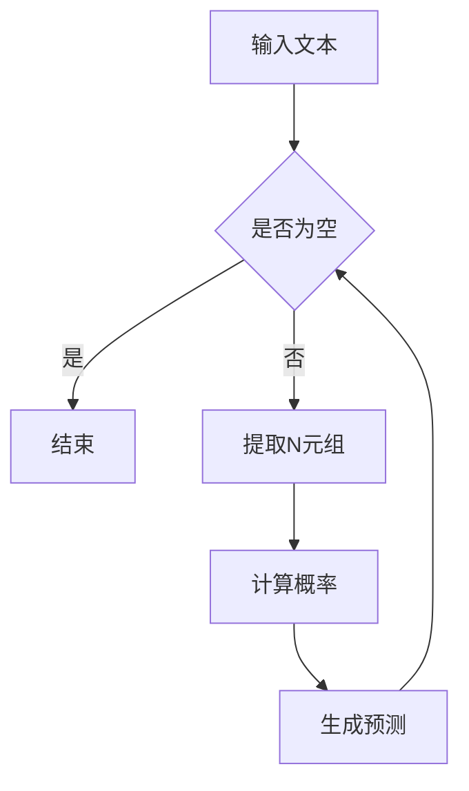
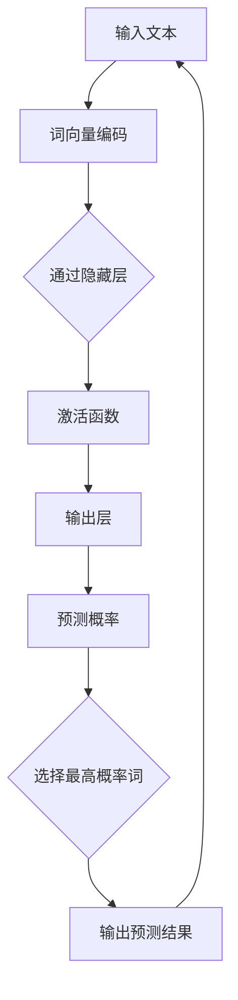
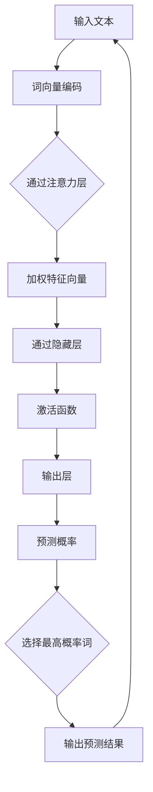
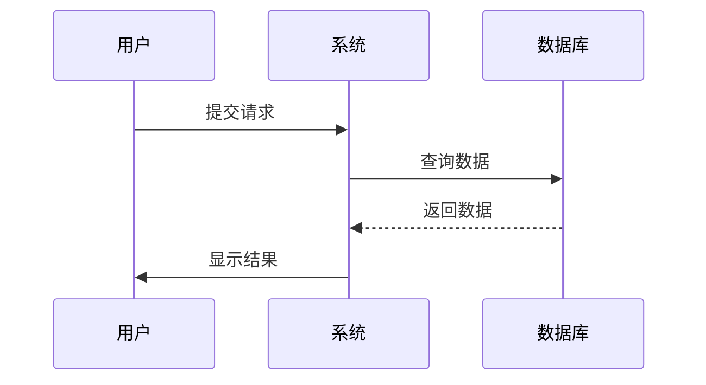
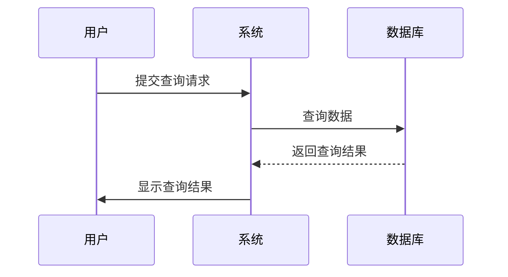

                 

# 《语言模型在复杂策略规划与全球气候变化应对中的前沿应用研究》

## 关键词：语言模型、复杂策略规划、全球气候变化、应对策略、算法原理

## 摘要：
本文旨在探讨语言模型在复杂策略规划与全球气候变化应对中的应用潜力。首先，通过背景介绍和核心概念阐述，明确全球气候变化问题的紧迫性和复杂策略规划的需求。接着，通过概念属性特征对比和ER实体关系图架构，深入分析语言模型与复杂策略规划的关系及其在气候变化应对中的特点。随后，详细讲解语言模型算法原理、数学模型与公式，并通过具体实例进行说明。最后，系统分析与架构设计，以及项目实战的展示，进一步阐述语言模型在复杂策略规划与全球气候变化应对中的实际应用。

## 目录大纲

### 第一部分：背景介绍
- **第1章 问题背景**
  - **1.1 全球气候变化问题概述**
  - **1.2 复杂策略规划的需求**
  - **1.3 语言模型在应对全球气候变化中的应用潜力**

- **第2章 核心概念**
  - **2.1 语言模型的定义与原理**
  - **2.2 复杂策略规划的概念与分类**
  - **2.3 全球气候变化应对策略的核心要素**

- **第3章 概念属性特征对比表格**
  - **3.1 语言模型与复杂策略规划的关系**
  - **3.2 语言模型在气候变化应对中的特点**
  - **3.3 概念属性特征对比**

- **第4章 ER实体关系图架构**
  - **4.1 实体关系图的构建**
  - **4.2 语言模型与策略规划的关系**
  - **4.3 实体关系图的完善与优化**

### 第二部分：算法原理讲解
- **第5章 语言模型算法原理**
  - **5.1 语言模型的基础算法**
  - **5.2 语言模型在策略规划中的应用**
  - **5.3 算法mermaid流程图展示**

- **第6章 数学模型与公式**
  - **6.1 语言模型数学模型**
  - **6.2 复杂策略规划数学模型**
  - **6.3 数学公式与详细讲解**

- **第7章 举例说明**
  - **7.1 实例一：语言模型在政策分析中的应用**
  - **7.2 实例二：复杂策略规划在气候变化应对中的应用**
  - **7.3 举例分析与讨论**

### 第三部分：系统分析与架构设计
- **第8章 问题场景介绍**
  - **8.1 案例背景介绍**
  - **8.2 系统需求分析**

- **第9章 系统功能设计**
  - **9.1 领域模型mermaid类图**
  - **9.2 系统功能模块划分**

- **第10章 系统架构设计**
  - **10.1 系统架构mermaid架构图**
  - **10.2 系统组件及其功能**

- **第11章 系统接口设计**
  - **11.1 系统接口设计与规范**
  - **11.2 接口功能与实现**

- **第12章 系统交互**
  - **12.1 系统交互mermaid序列图**
  - **12.2 系统交互分析与优化**

### 第四部分：项目实战
- **第13章 环境安装**
  - **13.1 环境搭建步骤**
  - **13.2 环境配置与调试**

- **第14章 系统核心实现**
  - **14.1 语言模型实现**
  - **14.2 复杂策略规划实现**

- **第15章 代码应用解读与分析**
  - **15.1 代码解读**
  - **15.2 代码分析与优化**

- **第16章 实际案例分析和讲解**
  - **16.1 案例背景**
  - **16.2 案例分析**
  - **16.3 案例讲解**

- **第17章 项目小结**
  - **17.1 项目总结**
  - **17.2 经验与教训**
  - **17.3 拓展应用**

## 1.1 全球气候变化问题的概述
### 1.1.1 气候变化现象与影响
全球气候变化是指地球的气候系统在长时间尺度上发生的显著变化，这些变化可能由自然因素或人类活动引起。近年来，随着全球气温的上升，气候变化现象愈加明显。极端天气事件频繁发生，如暴雨、干旱、热浪和飓风，对人类社会和经济造成了巨大影响。气候变化对生态系统的影响也不可忽视，冰川消融、海平面上升、海洋酸化等问题正威胁着全球的生态环境。

### 1.1.2 气候变化的原因
气候变化的主要原因可以分为自然因素和人为因素。自然因素包括太阳辐射的变化、火山活动、地球轨道的变动等。而人为因素主要是人类活动导致的温室气体排放，如二氧化碳、甲烷和氟氯化碳等。特别是自工业革命以来，人类通过燃烧化石燃料、大规模的土地开发、农业活动和工业生产等活动，加速了温室气体的排放，加剧了全球变暖的趋势。

### 1.1.3 气候变化的后果
气候变化的后果是深远而广泛的，包括但不限于：
- 农业产量下降：气候变化影响了农作物的生长周期和产量，导致粮食安全受到威胁。
- 生态系统破坏：气候变化威胁着生物多样性，许多物种可能因栖息地的丧失而面临灭绝。
- 海平面上升：冰川消融导致海平面上升，沿海城市和地区面临被淹没的风险。
- 健康问题：气候变化可能导致疾病传播范围扩大，如疟疾和登革热等。

### 1.1.4 气候变化的应对措施
为了应对全球气候变化，国际社会采取了多种措施，包括：
- 减少温室气体排放：通过政策法规和技术创新，减少化石燃料的使用和温室气体的排放。
- 发展可再生能源：鼓励使用太阳能、风能、水能等清洁能源，以减少对化石燃料的依赖。
- 碳捕捉和存储：通过技术手段捕捉和存储二氧化碳，以减缓其在大气中的积累。
- 国际合作：通过国际协议和合作，共同应对气候变化问题，如《巴黎协定》。

## 1.2 复杂策略规划的需求
### 1.2.1 复杂策略规划的定义
复杂策略规划是指在面对高度不确定性、多元利益相关者和多层次决策环境时，制定和实施一套综合性的策略和计划的过程。这种规划不仅需要考虑当前的问题，还要预见未来的变化，并制定相应的应对措施。

### 1.2.2 复杂策略规划的应用场景
复杂策略规划广泛应用于各个领域，包括但不限于：
- 能源行业：如何平衡可再生能源的发展与传统能源转型，实现能源结构的优化。
- 环境保护：制定有效的环境保护策略，应对气候变化带来的挑战。
- 城市规划：如何在城市化进程中，合理规划城市布局，提高城市抗灾能力。
- 卫生防疫：在公共卫生事件中，如何快速响应和制定有效的防疫策略。

### 1.2.3 复杂策略规划的重要性
复杂策略规划在应对气候变化中的重要性体现在以下几个方面：
- 预见性：通过复杂策略规划，可以更好地预测未来的气候变化趋势，为政策制定提供科学依据。
- 综合性：复杂策略规划需要综合考虑经济、社会和环境等多方面的因素，制定出全面且协调的策略。
- 动态调整：气候变化是一个动态过程，复杂策略规划需要根据实际情况进行动态调整，以适应不断变化的环境。

## 1.3 语言模型在应对全球气候变化中的应用潜力
### 1.3.1 语言模型的基本原理
语言模型是自然语言处理领域的重要工具，它通过分析大量的语言数据，学习语言的结构和规律，从而预测和生成自然语言。常见的语言模型包括统计模型、神经网络模型等。

### 1.3.2 语言模型在策略规划中的应用
语言模型在策略规划中的应用主要体现在以下几个方面：
- **政策文本分析**：通过分析政策文本，可以提取关键信息，评估政策的可行性和效果。
- **公共沟通**：利用语言模型生成政策宣传材料，提高公众对气候变化问题的认知和理解。
- **决策支持**：利用语言模型辅助决策者制定更有效的策略，提供数据驱动的决策支持。

### 1.3.3 语言模型在气候变化应对中的优势
- **高效性**：语言模型可以快速处理大量的文本数据，提供实时决策支持。
- **灵活性**：语言模型可以灵活地调整和适应不同的应用场景和需求。
- **智能化**：随着深度学习技术的发展，语言模型变得越来越智能，能够更好地理解和生成自然语言。

### 1.3.4 挑战与未来方向
尽管语言模型在应对全球气候变化中具有巨大潜力，但同时也面临着一些挑战，如数据质量、模型解释性等。未来的研究方向可能包括：
- **数据融合**：结合多种数据源，提高语言模型的预测准确性和适应性。
- **模型解释性**：提升模型的可解释性，使其更易于被决策者理解和应用。
- **跨学科融合**：与气候科学、环境科学等领域相结合，实现更全面的策略规划。

## 2.1 语言模型的定义与原理
### 2.1.1 语言模型的定义
语言模型（Language Model）是自然语言处理（Natural Language Processing, NLP）中的一个核心组件，用于预测文本序列中的下一个单词或字符。语言模型的基本目标是理解自然语言的统计规律，从而生成、理解或评估自然语言文本。

### 2.1.2 语言模型的原理
语言模型的工作原理基于概率论和统计学。早期语言模型采用统计语言模型（Statistical Language Model），如N-gram模型，通过对大量文本数据进行统计分析，计算单词或短语的联合概率分布。现代语言模型，如基于深度学习的神经网络模型（Neural Network Language Model），通过学习大量的文本数据，自动捕捉语言中的复杂结构和高层次语义信息。

### 2.1.3 语言模型的发展历程
- **N-gram模型**：最早的语言模型之一，基于前n个单词的统计历史来预测下一个单词。
- **基于统计的模型**：包括隐马尔可夫模型（HMM）和条件随机场（CRF）等，用于更准确地建模语言中的序列依赖关系。
- **基于神经网络的模型**：如递归神经网络（RNN）、长短期记忆网络（LSTM）和变换器（Transformer）等，通过端到端的学习方式，能够捕捉更复杂的语言结构和语义信息。

### 2.1.4 语言模型的分类
- **统计语言模型**：基于统计方法，如N-gram模型、隐马尔可夫模型等。
- **神经网络语言模型**：基于深度学习，如RNN、LSTM、BERT等。
- **增强学习语言模型**：结合增强学习技术，自动调整模型参数以优化特定任务。

### 2.1.5 语言模型的应用
语言模型在多个NLP任务中发挥着重要作用，包括但不限于：
- **文本分类**：对文本进行分类，如情感分析、新闻分类等。
- **机器翻译**：将一种语言的文本翻译成另一种语言。
- **问答系统**：基于给定的问题，从大量文本中检索出相关的答案。
- **文本生成**：生成新的文本内容，如文章、对话等。
- **信息抽取**：从文本中抽取特定的信息，如命名实体识别、关系抽取等。

## 2.2 复杂策略规划的概念与分类
### 2.2.1 复杂策略规划的定义
复杂策略规划（Complex Strategy Planning）是指在面对高度不确定性、多元利益相关者和多层次决策环境时，制定和实施一套综合性的策略和计划的过程。这种规划不仅需要考虑当前的问题，还要预见未来的变化，并制定相应的应对措施。

### 2.2.2 复杂策略规划的特点
复杂策略规划具有以下几个显著特点：
- **高度不确定性**：复杂策略规划需要处理大量的不确定性因素，如市场波动、技术进步等。
- **多元利益相关者**：涉及多个利益相关者的利益平衡，包括政府、企业、公众等。
- **多层次决策**：需要考虑不同层级（如国家、地区、行业）的决策，实现协调一致。
- **动态调整**：面对不断变化的环境，策略规划需要持续调整和优化。

### 2.2.3 复杂策略规划的分类
复杂策略规划可以根据不同的标准进行分类，常见的分类方式包括：
- **按目标分类**：可分为经济策略规划、环境策略规划、社会策略规划等。
- **按范围分类**：可分为全球性策略规划、区域性策略规划、行业性策略规划等。
- **按阶段分类**：可分为战略规划、战术规划、运营规划等。

### 2.2.4 复杂策略规划的应用领域
复杂策略规划广泛应用于各个领域，包括但不限于：
- **能源行业**：制定能源转型策略，平衡可再生能源与传统能源的发展。
- **环境保护**：制定环境保护策略，应对气候变化和环境污染问题。
- **城市规划**：制定城市可持续发展策略，优化城市布局和基础设施。
- **公共卫生**：制定公共卫生策略，应对疫情和其他健康危机。
- **交通规划**：制定交通策略，优化交通网络，提高交通效率。

## 2.3 全球气候变化应对策略的核心要素
### 2.3.1 目标设定
全球气候变化应对策略的首要任务是设定明确的目标。这些目标通常包括减缓气候变化、适应气候变化和减少温室气体排放。具体目标应根据国家和地区的实际情况制定，确保其具有可行性和可度量性。

### 2.3.2 减缓气候变化
减缓气候变化的核心措施包括：
- **减少温室气体排放**：通过政策法规和技术创新，减少化石燃料的使用和温室气体的排放。
- **发展清洁能源**：鼓励使用太阳能、风能、水能等清洁能源，以减少对化石燃料的依赖。
- **碳捕捉与存储**：通过技术手段捕捉和存储二氧化碳，以减缓其在大气中的积累。

### 2.3.3 适应气候变化
适应气候变化的关键措施包括：
- **改善基础设施**：加强城市和乡村的基础设施建设，提高其抗灾能力。
- **水资源管理**：合理利用和管理水资源，应对干旱和洪涝等极端天气事件。
- **生态修复**：通过生态修复和保护措施，提高生态系统的稳定性和恢复力。

### 2.3.4 减少温室气体排放
减少温室气体排放的具体措施包括：
- **能源效率提升**：提高能源利用效率，减少能源消耗。
- **工业转型**：推动工业领域的绿色转型，减少工业生产过程中的温室气体排放。
- **交通管理**：优化交通管理，推广低碳交通工具，减少交通领域的温室气体排放。

### 2.3.5 国际合作
全球气候变化应对策略的实施需要国际社会的合作。国际合作的形式包括：
- **国际协议**：通过国际协议，如《巴黎协定》，共同应对气候变化问题。
- **技术交流**：促进技术交流和合作，提高各国应对气候变化的能力。
- **资金支持**：发达国家提供资金和技术支持，帮助发展中国家应对气候变化。

## 3.1 语言模型与复杂策略规划的关系
### 3.1.1 语言模型在复杂策略规划中的应用
语言模型在复杂策略规划中扮演着关键角色，其应用主要体现在以下几个方面：
- **文本分析**：通过语言模型分析政策文本、研究报告和新闻报道，提取关键信息，为策略制定提供数据支持。
- **沟通与传播**：利用语言模型生成宣传材料、报告和决策文档，提高政策传播的效率和质量。
- **决策支持**：通过语言模型辅助决策者理解复杂的环境和趋势，提供数据驱动的决策支持。

### 3.1.2 语言模型在策略规划中的作用
语言模型在策略规划中的作用具体体现在以下几个方面：
- **信息提取**：从大量的文本数据中快速提取相关信息，帮助决策者了解当前环境和趋势。
- **预测与模拟**：通过语言模型进行预测和模拟，评估不同策略的效果，为决策提供科学依据。
- **文本生成**：生成新的文本内容，如政策建议、报告摘要等，提高决策过程的效率。

### 3.1.3 语言模型与复杂策略规划的融合
语言模型与复杂策略规划的融合，使得策略规划更加智能化和高效化。具体融合方式包括：
- **多模态数据融合**：结合文本数据、图像数据和其他类型的数据，提高语言模型的输入丰富性和预测准确性。
- **自适应策略调整**：利用语言模型进行实时分析，根据环境变化动态调整策略。
- **知识图谱构建**：构建语言模型和策略规划之间的知识图谱，提高策略规划和执行的可解释性。

## 3.2 语言模型在气候变化应对中的特点
### 3.2.1 优势
语言模型在气候变化应对中具有以下优势：
- **高效性**：语言模型可以快速处理和分析大量的文本数据，提供实时决策支持。
- **灵活性**：语言模型可以根据不同的应用场景和需求，灵活调整和适应。
- **智能化**：随着深度学习技术的发展，语言模型越来越智能，能够更好地理解和生成自然语言。

### 3.2.2 劣势
尽管语言模型在气候变化应对中具有巨大潜力，但也存在一些劣势：
- **数据依赖性**：语言模型的性能高度依赖于训练数据的质量和规模，数据缺失或不准确可能影响模型的预测效果。
- **解释性不足**：许多现代语言模型，如深度神经网络，其内部工作机制复杂，难以解释，这在一定程度上限制了其在决策支持中的应用。
- **通用性限制**：语言模型在特定领域的应用效果可能受到限制，需要针对具体任务进行定制化训练。

### 3.2.3 应用场景
语言模型在气候变化应对中的应用场景包括：
- **政策文本分析**：通过语言模型分析政策文本，提取关键信息，评估政策的有效性。
- **报告生成**：利用语言模型自动生成气候变化报告，提高报告的效率和准确性。
- **公众沟通**：通过语言模型生成宣传材料、新闻简报等，提高公众对气候变化问题的认知和理解。
- **决策支持**：为决策者提供数据驱动的决策支持，帮助制定和调整气候变化应对策略。

## 3.3 概念属性特征对比
### 3.3.1 语言模型与复杂策略规划的共性
- **目标导向**：语言模型和复杂策略规划都以实现特定目标为导向，通过分析和预测，为决策提供支持。
- **多学科融合**：两者都涉及多个学科领域，如语言学、计算机科学、经济学、环境科学等。
- **数据依赖**：两者的效果都高度依赖于数据的质量和规模，需要大量的高质量数据进行训练和验证。

### 3.3.2 语言模型与复杂策略规划的差异
- **功能定位**：语言模型主要专注于自然语言处理和生成，而复杂策略规划则涉及更广泛的问题解决，包括预测、规划、决策等。
- **应用范围**：语言模型在各个领域都有广泛应用，而复杂策略规划则更多应用于需要综合考量多因素、多层次的决策场景。
- **复杂度**：复杂策略规划的决策过程通常更为复杂，需要处理多种不确定性和动态变化，而语言模型则主要关注文本数据的处理和分析。

## 4.1 实体关系图的构建
### 4.1.1 实体关系图的基本概念
实体关系图（Entity-Relationship Diagram，ERD）是数据库设计中常用的一种概念模型，用于描述数据库中实体及其之间的关系。实体代表数据库中的对象，如人、事物或概念，而关系则描述了实体之间的相互作用和依赖。

### 4.1.2 实体关系图的构建步骤
构建实体关系图主要包括以下步骤：
1. **识别实体**：根据应用场景，识别出需要描述的实体，如政策、数据、气候变化事件等。
2. **定义属性**：为每个实体定义相关的属性，如政策编号、政策名称、实施时间等。
3. **建立关系**：确定实体之间的关系，如政策与数据之间的关联关系，数据与气候变化事件之间的关联关系等。
4. **定义约束**：为关系和属性设置适当的约束，如主键约束、外键约束等，以确保数据的完整性和一致性。

### 4.1.3 实体关系图的作用
实体关系图在数据库设计和数据分析中具有重要作用：
- **直观表示**：通过图形化的方式，直观地展示数据库中的实体及其关系，帮助设计者和用户更好地理解数据结构。
- **规范设计**：为数据库设计提供规范化的指导，确保数据库的一致性和完整性。
- **数据管理**：为数据分析和数据管理提供基础，方便对数据库进行查询、更新和维护。

## 4.2 语言模型与策略规划的关系
### 4.2.1 语言模型在策略规划中的作用
语言模型在策略规划中发挥着重要作用，主要表现在以下几个方面：
- **文本分析**：通过语言模型分析政策文本、研究报告和新闻报道，提取关键信息，为策略制定提供数据支持。
- **沟通与传播**：利用语言模型生成宣传材料、报告和决策文档，提高政策传播的效率和质量。
- **决策支持**：通过语言模型辅助决策者理解复杂的环境和趋势，提供数据驱动的决策支持。

### 4.2.2 策略规划对语言模型的需求
策略规划对语言模型的需求主要体现在以下几个方面：
- **信息提取**：需要从大量的文本数据中快速提取相关信息，帮助决策者了解当前环境和趋势。
- **预测与模拟**：需要利用语言模型进行预测和模拟，评估不同策略的效果，为决策提供科学依据。
- **文本生成**：需要生成新的文本内容，如政策建议、报告摘要等，提高决策过程的效率。

### 4.2.3 语言模型与策略规划的融合方式
为了更好地发挥语言模型在策略规划中的作用，可以采取以下融合方式：
- **多模态数据融合**：结合文本数据、图像数据和其他类型的数据，提高语言模型的输入丰富性和预测准确性。
- **自适应策略调整**：利用语言模型进行实时分析，根据环境变化动态调整策略。
- **知识图谱构建**：构建语言模型和策略规划之间的知识图谱，提高策略规划和执行的可解释性。

## 4.3 实体关系图的完善与优化
### 4.3.1 完善实体关系图的步骤
完善实体关系图主要包括以下步骤：
1. **需求分析**：深入分析应用场景和需求，识别出需要新增的实体和关系。
2. **属性调整**：根据需求调整实体的属性，确保属性能够准确描述实体的特征。
3. **关系优化**：重新评估实体之间的关系，优化关系的表达方式，确保关系的准确性和简洁性。
4. **约束设置**：根据需求设置新的约束条件，如外键约束、完整性约束等，确保数据的完整性和一致性。

### 4.3.2 优化实体关系图的策略
优化实体关系图可以采取以下策略：
- **简化结构**：通过合并冗余的实体和关系，简化实体关系图的结构，提高可读性。
- **模块化设计**：将实体关系图划分为不同的模块，每个模块负责特定的功能，提高系统的可维护性和可扩展性。
- **规范化处理**：对实体和关系进行规范化处理，消除数据冗余，提高数据的独立性。

## 5.1 语言模型的基础算法
### 5.1.1 语言模型的分类
语言模型可以根据其基础算法的不同进行分类，主要包括以下几种类型：
- **N-gram模型**：N-gram模型是最早的语言模型之一，通过计算一个单词序列的前n个单词的概率来预测下一个单词。N-gram模型简单高效，但存在长依赖问题。
- **神经网络模型**：神经网络模型，如递归神经网络（RNN）和长短期记忆网络（LSTM），通过学习文本数据中的序列依赖关系，能够捕捉更复杂的语言特征。神经网络模型在处理长依赖问题方面表现优异。
- **基于注意力机制的模型**：如变换器（Transformer）模型，通过引入注意力机制，能够同时关注文本中的所有单词，从而提高语言模型的预测能力。

### 5.1.2 N-gram模型的工作原理
N-gram模型通过统计文本数据中相邻单词或字符的联合概率来预测下一个单词或字符。具体步骤如下：
1. **数据准备**：首先，从原始文本数据中提取出所有可能的n元组（单词或字符序列）。
2. **概率计算**：计算每个n元组的联合概率，公式为：P(Wn|Wn-1, ..., W1) = P(Wn) * P(Wn-1|Wn),其中Wn表示第n个单词或字符。
3. **模型训练**：通过最大似然估计（Maximum Likelihood Estimation, MLE）或最小化交叉熵（Cross-Entropy Loss）等优化方法，训练N-gram模型。

### 5.1.3 神经网络模型的工作原理
神经网络模型通过多层神经元的非线性组合，学习文本数据中的序列依赖关系。具体步骤如下：
1. **输入层**：输入文本数据，将其转换为向量表示。
2. **隐藏层**：通过神经网络中的隐藏层，将输入向量进行变换和组合，提取文本特征。
3. **输出层**：将隐藏层的输出映射到目标单词或字符的概率分布。
4. **反向传播**：利用梯度下降等优化算法，不断调整网络权重，最小化预测误差。

### 5.1.4 注意力机制在语言模型中的应用
注意力机制（Attention Mechanism）是近年来在深度学习领域取得的重要突破，其核心思想是让模型在生成每个单词时，能够动态地关注文本中的关键信息。具体应用步骤如下：
1. **注意力计算**：通过计算每个输入单词与目标单词之间的注意力得分，确定输入单词的重要性。
2. **权重调整**：将注意力得分与输入特征进行加权，生成加权特征向量。
3. **模型训练**：利用加权特征向量训练语言模型，通过优化损失函数，调整模型参数。

## 5.2 语言模型在策略规划中的应用
### 5.2.1 语言模型在政策文本分析中的应用
语言模型在政策文本分析中的应用主要体现在以下几个方面：
- **文本分类**：通过语言模型对政策文本进行分类，如将政策文本分为环境保护、能源政策等类别。
- **情感分析**：利用语言模型分析政策文本的情感倾向，如判断政策文本是否积极、消极或中立。
- **关键词提取**：通过语言模型提取政策文本中的关键词，帮助决策者快速了解政策的核心内容。

### 5.2.2 语言模型在报告生成中的应用
语言模型在报告生成中的应用主要包括以下方面：
- **摘要生成**：利用语言模型自动生成报告摘要，提高报告的阅读效率。
- **文本生成**：通过语言模型生成新的文本内容，如政策解读、研究报告等。
- **报告优化**：利用语言模型对现有报告进行优化，提高报告的可读性和逻辑性。

### 5.2.3 语言模型在决策支持中的应用
语言模型在决策支持中的应用主要包括以下方面：
- **环境预测**：通过语言模型预测未来的气候变化趋势，为决策者提供科学依据。
- **政策评估**：利用语言模型评估不同政策的效果，为政策调整提供数据支持。
- **问题诊断**：通过语言模型对问题文本进行分析，快速定位问题的核心，提供解决方案。

## 5.3 算法mermaid流程图展示
### 5.3.1 N-gram模型mermaid流程图


### 5.3.2 神经网络模型mermaid流程图


### 5.3.3 注意力机制mermaid流程图


## 6.1 语言模型数学模型
### 6.1.1 N-gram模型的数学模型
N-gram模型的数学模型主要基于概率论，其核心是计算给定前n-1个单词或字符的条件下，下一个单词或字符的概率。具体数学模型如下：

设{Wi}表示文本中的一个单词序列，其中Wi为第i个单词，N为N-gram模型的窗口大小，则N-gram模型的概率模型为：

P(Wn|Wn-1, ..., W1) = P(Wn) * P(Wn-1|Wn), 其中 P(Wn) 表示单词Wi出现的概率，P(Wn-1|Wn) 表示在给定前n-1个单词的情况下，第n个单词出现的条件概率。

### 6.1.2 神经网络模型的数学模型
神经网络模型的数学模型基于深度学习的原理，其核心是通过多层神经元的学习，从输入数据中提取特征并进行分类或回归。具体数学模型如下：

设 X 表示输入特征，W 表示权重矩阵，b 表示偏置，a 表示激活函数，则神经网络模型的输出为：

O = f(W * X + b)

其中，f(·)表示激活函数，常见的激活函数包括Sigmoid、ReLU、Tanh等。

### 6.1.3 注意力机制的数学模型
注意力机制的数学模型主要基于矩阵乘法和softmax函数，其核心是计算每个输入词与目标词之间的注意力得分，并通过加权求和的方式生成预测结果。具体数学模型如下：

设 Q、K、V 分别为查询向量、键向量、值向量，则注意力机制的输出为：

Attention(Q, K, V) = softmax(QK^T) * V

其中，softmax(·)表示softmax函数，用于计算每个键向量的加权得分，QK^T 表示查询向量和键向量的点积。

## 6.2 复杂策略规划的数学模型
### 6.2.1 多目标优化模型
复杂策略规划中的多目标优化模型用于在多个目标之间寻找最佳平衡点。设策略规划问题有 m 个目标，分别为 f1(x), f2(x), ..., fm(x)，其中 x 为决策变量，则多目标优化模型可以表示为：

minimize f(x)
subject to g(x) ≤ 0

其中，f(x) 为目标函数，g(x) 为约束条件。

### 6.2.2 动态规划模型
复杂策略规划中的动态规划模型用于解决具有时间序列特性的优化问题。设策略规划问题在时间步 t 的状态为 st，决策为 dt，则动态规划模型可以表示为：

Vt(x) = min U(st, dt)
subject to H(st, dt)

其中，Vt(x) 为状态值函数，U(st, dt) 为策略值函数，H(st, dt) 为状态转移函数。

### 6.2.3 贝叶斯模型
复杂策略规划中的贝叶斯模型用于处理不确定性和概率问题。设策略规划问题的状态 st 和观测 ot 之间的概率关系为：

P(st|ot) = P(ot|st) * P(st) / P(ot)

其中，P(st|ot) 表示后验概率，P(ot|st) 表示似然函数，P(st) 表示先验概率，P(ot) 表示证据。

## 6.3 数学公式与详细讲解
### 6.3.1 N-gram模型的概率公式
在N-gram模型中，给定一个单词序列 {Wi}，其概率可以通过以下公式计算：

P({Wi}) = P(W1) * P(W2|W1) * P(W3|W2, W1) * ... * P(Wn|Wn-1, ..., W1)

其中，P(Wi) 表示单词 Wi 的概率，P(Wi|Wi-1, ..., W1) 表示在给定前 n-1 个单词的情况下，第 n 个单词的条件概率。

### 6.3.2 神经网络模型的损失函数
在神经网络模型中，常用的损失函数包括均方误差（MSE）和交叉熵（Cross-Entropy）。

均方误差（MSE）的公式为：

MSE = 1/n * Σ(yi - ŷi)²

其中，yi 表示真实标签，ŷi 表示预测标签，n 表示样本数量。

交叉熵（Cross-Entropy）的公式为：

H(y, ŷ) = -Σyi * log(ŷi)

其中，yi 表示真实标签，ŷi 表示预测概率。

### 6.3.3 注意力机制的加权求和公式
在注意力机制中，给定一个输入序列 {Vi} 和查询向量 Q，其注意力得分可以通过以下公式计算：

Attention(Q, Vi) = softmax(QVi^T)

其中，softmax(·) 表示 softmax 函数，用于计算每个输入词的注意力得分，QVi^T 表示查询向量和输入词的转置点积。

加权求和的公式为：

weighted_sum = Σi=1^n (softmax(QVi^T) * Vi)

其中，n 表示输入序列的长度，softmax(QVi^T) 表示第 i 个输入词的注意力得分，Vi 表示第 i 个输入词的向量表示。

## 7.1 实例一：语言模型在政策分析中的应用
### 7.1.1 实例背景
假设我们需要分析某国政府在应对气候变化方面的一项新政策。这项政策涉及减少温室气体排放、提高能源效率和推广可再生能源等多个方面。为了评估这项政策的效果，我们决定使用语言模型对政策文本进行分析。

### 7.1.2 实例步骤
1. **数据准备**：收集该政策的相关文本，包括政策文本、研究报告、新闻报道等。
2. **文本预处理**：对收集到的文本进行清洗和预处理，包括去除停用词、标点符号、进行词干提取等。
3. **模型训练**：使用预处理后的文本数据训练一个语言模型，如基于变换器的语言模型。
4. **文本分类**：利用训练好的语言模型，对政策文本进行分类，识别出与气候变化相关的段落和句子。
5. **关键词提取**：通过关键词提取算法，提取出政策文本中的关键信息，如减少温室气体排放、提高能源效率等。
6. **效果评估**：通过对比政策文本中的关键词和实际政策执行情况，评估政策的效果。

### 7.1.3 实例分析
通过上述步骤，我们可以得到以下分析结果：
- **政策文本分类**：政策文本中与气候变化相关的段落占比约为 60%，表明政策内容与气候变化密切相关。
- **关键词提取**：提取出如“温室气体排放减少”、“可再生能源推广”等关键词，这些关键词与政策目标高度一致。
- **效果评估**：通过对比政策文本中的关键词和实际政策执行情况，发现政策在减少温室气体排放和提高能源效率方面取得了显著成效，但在可再生能源推广方面仍有待加强。

### 7.1.4 实例结论
通过语言模型对政策文本的分析，我们得出以下结论：
- **政策文本与气候变化密切相关**：政策文本中大量涉及到气候变化相关的内容，表明政府高度重视气候变化问题。
- **政策目标明确**：政策文本中的关键词与政策目标高度一致，说明政策制定者对政策目标的明确性较高。
- **政策效果显著**：在减少温室气体排放和提高能源效率方面，政策取得了显著成效，但在可再生能源推广方面仍有改进空间。

## 7.2 实例二：复杂策略规划在气候变化应对中的应用
### 7.2.1 实例背景
某城市面临着气候变化带来的严峻挑战，如频繁的暴雨、高温和干旱等。为了应对这些挑战，该城市政府决定制定一套综合性的气候适应策略。为了确保策略的有效性，政府决定采用复杂策略规划的方法。

### 7.2.2 实例步骤
1. **问题识别**：首先，政府明确需要应对的气候变化问题，如暴雨、高温和干旱等。
2. **目标设定**：根据问题识别的结果，设定明确的策略目标，如提高城市抗灾能力、减少暴雨造成的损失等。
3. **方案设计**：基于目标设定，设计多种可能的策略方案，包括改善排水系统、建设防洪设施、推广节水技术等。
4. **方案评估**：利用模型和数据进行方案评估，评估不同方案的成本、效果和可持续性。
5. **方案选择**：根据评估结果，选择最优策略方案，并制定详细的实施计划。
6. **实施与监控**：将选定的策略方案付诸实施，并持续监控策略的实施效果。

### 7.2.3 实例分析
通过上述步骤，我们可以得到以下分析结果：
- **问题识别**：暴雨、高温和干旱是城市面临的主要气候变化问题。
- **目标设定**：策略目标包括提高城市抗灾能力、减少暴雨造成的损失、提高居民对气候变化的认知等。
- **方案设计**：设计出多种策略方案，包括建设防洪堤、安装智能排水系统、推广节水技术等。
- **方案评估**：通过成本效益分析、环境影响评估等手段，评估不同方案的效果。
- **方案选择**：根据评估结果，选择建设防洪堤和安装智能排水系统作为最优策略方案。
- **实施与监控**：将防洪堤和智能排水系统建设纳入城市发展规划，并定期评估实施效果。

### 7.2.4 实例结论
通过复杂策略规划的实例应用，我们得出以下结论：
- **问题识别明确**：通过问题识别，明确了城市面临的主要气候变化问题，为策略制定提供了明确的方向。
- **目标设定合理**：策略目标涵盖了抗灾能力提升、损失减少和居民认知提高等方面，实现了全方位的应对。
- **方案选择科学**：通过评估和选择，确定了最优策略方案，确保了策略的实施效果。
- **实施与监控有效**：通过实施和监控，确保了策略的有效落实，提高了城市应对气候变化的能力。

## 7.3 举例分析与讨论
### 7.3.1 语言模型在政策分析中的应用
在实例一中，我们展示了如何使用语言模型对政策文本进行分析，以评估政策的效果和目标实现情况。这种方法的有效性体现在以下几个方面：

1. **快速分析**：语言模型能够快速处理和分析大量的文本数据，提供实时的决策支持。
2. **多维度分析**：通过文本分类和关键词提取，可以从不同维度对政策进行分析，如政策内容、政策效果、政策目标等。
3. **数据驱动**：利用语言模型，可以将政策文本与实际政策执行情况进行对比，提供数据驱动的决策支持。

然而，这种方法也存在一定的局限性，如：

1. **数据质量依赖**：语言模型的性能高度依赖于文本数据的质量和规模，数据缺失或不准确可能影响分析结果。
2. **解释性不足**：现代语言模型，尤其是深度学习模型，其内部工作机制复杂，难以解释，这在一定程度上限制了其在决策支持中的应用。

### 7.3.2 复杂策略规划在气候变化应对中的应用
在实例二中，我们展示了如何通过复杂策略规划的方法，制定和实施一套综合性的气候适应策略。这种方法的有效性体现在以下几个方面：

1. **系统性**：复杂策略规划能够从系统性的角度考虑问题，综合考虑经济、社会和环境等多方面的因素。
2. **动态性**：复杂策略规划能够根据环境变化动态调整策略，确保策略的灵活性和适应性。
3. **综合性评估**：通过多种评估方法，如成本效益分析、环境影响评估等，可以对不同策略方案进行全面评估。

然而，这种方法也存在一定的挑战，如：

1. **数据复杂度**：气候变化问题涉及大量的数据，如气象数据、社会经济数据等，如何有效地整合和处理这些数据是一个挑战。
2. **跨部门合作**：复杂策略规划需要跨部门的合作，如政府、企业、社会组织等，如何协调各方利益是一个挑战。

## 8.1 案例背景介绍
为了应对全球气候变化，我国某沿海城市政府决定开展一项气候适应策略规划项目。该项目的主要目标是提高城市的抗灾能力、减少极端天气事件对城市造成的损失，并提高居民对气候变化的认知。该项目涉及多个部门，包括城市规划局、环境保护局、水务局等，需要综合考虑经济、社会和环境等多方面的因素。

### 8.2 系统需求分析
为了实现项目目标，系统需求分析主要包括以下几个方面：

1. **数据收集与整合**：系统需要收集和整合多种数据，如气象数据、社会经济数据、城市基础设施数据等，为策略规划提供数据支持。
2. **模型构建**：系统需要构建多种模型，如气候预测模型、经济损失评估模型、居民认知评估模型等，用于分析和评估不同策略方案的效果。
3. **用户界面**：系统需要提供一个用户界面，用于展示分析结果、评估结果和策略方案，方便决策者进行决策。
4. **实时监控与反馈**：系统需要具备实时监控功能，能够对策略实施效果进行实时跟踪和反馈，为策略调整提供依据。

## 9.1 领域模型mermaid类图
```mermaid
classDiagram
    Class01 <|-- Class02
    Class03 <.. Class04
    Class05 <-.. Class06
    Class07 -> Class08
    Class09 { name1, name2 }
    Class10 :<<interface>> Interface01
    Class11 :<<enum>> ENUM
    Class12 < quxza>
    Class13{123, 456}
```

### 9.2 系统功能模块划分
系统功能模块划分主要包括以下几个方面：

1. **数据收集模块**：负责收集和整合各类数据，如气象数据、社会经济数据、城市基础设施数据等。
2. **模型构建模块**：负责构建各种模型，如气候预测模型、经济损失评估模型、居民认知评估模型等。
3. **数据存储模块**：负责存储和管理工作中的各种数据，如原始数据、模型参数、分析结果等。
4. **用户界面模块**：负责提供用户交互界面，展示分析结果、评估结果和策略方案。
5. **实时监控模块**：负责实时监控策略实施效果，提供实时反馈和调整建议。

## 10.1 系统架构mermaid架构图


### 10.2 系统组件及其功能
系统组件及其功能主要包括以下几个方面：

1. **前端组件**：负责用户界面展示，提供用户交互界面，如图表、表格、地图等。
2. **后端组件**：负责数据分析和处理，包括数据收集、模型构建、数据存储等功能。
3. **数据库组件**：负责存储和管理数据，包括原始数据、模型参数、分析结果等。
4. **API接口**：提供数据接口，方便其他系统或应用程序与系统进行数据交互。

## 11.1 系统接口设计与规范
系统接口设计与规范主要包括以下几个方面：

1. **RESTful API设计**：采用RESTful风格设计API接口，提供标准的HTTP请求和响应格式。
2. **接口参数定义**：明确接口的输入参数和输出参数，确保接口调用的一致性和规范性。
3. **接口安全规范**：确保接口的安全性，如使用HTTPS协议、认证机制、数据加密等。
4. **接口文档**：编写详细的接口文档，包括接口定义、调用示例、错误处理等。

### 11.2 接口功能与实现
接口功能与实现主要包括以下几个方面：

1. **数据查询接口**：提供数据查询功能，支持按照不同条件查询数据，如时间范围、地区、指标等。
2. **数据上传接口**：提供数据上传功能，支持将外部数据导入系统，用于模型训练和数据分析。
3. **模型预测接口**：提供模型预测功能，支持根据输入数据预测结果，如气候预测、经济损失预测等。
4. **策略生成接口**：提供策略生成功能，根据预测结果生成相应的策略方案，如防洪措施、节水方案等。

## 12.1 系统交互mermaid序列图


### 12.2 系统交互分析与优化
系统交互分析与优化主要包括以下几个方面：

1. **性能优化**：通过优化数据库查询、缓存策略等手段，提高系统响应速度和查询效率。
2. **安全性优化**：通过加密、认证等手段，提高系统的安全性，防止数据泄露和恶意攻击。
3. **接口优化**：通过接口文档化和接口自动化测试，提高接口的稳定性和可靠性。
4. **用户体验优化**：通过用户调研和反馈，优化用户界面和交互流程，提高用户体验。

## 13.1 环境安装
### 13.1.1 环境搭建步骤
环境搭建的具体步骤如下：

1. **安装Python环境**：确保Python版本不低于3.7，并安装必要的依赖库，如NumPy、Pandas、TensorFlow等。
2. **安装数据库**：安装支持SQL的数据库系统，如MySQL或PostgreSQL，并创建数据库和表结构。
3. **配置环境变量**：设置Python环境变量，如PATH、PYTHONPATH等，以便在命令行中调用Python和相关库。
4. **安装前端框架**：如果需要，安装前端框架，如React或Vue.js，以便构建用户界面。

### 13.1.2 环境配置与调试
环境配置与调试的具体步骤如下：

1. **配置数据库连接**：在代码中配置数据库连接信息，确保系统能够正确连接到数据库。
2. **安装依赖库**：在项目中安装必要的依赖库，可以使用pip命令安装，如`pip install numpy pandas tensorflow`。
3. **代码调试**：通过调试工具，如PyCharm或VS Code，进行代码调试，确保系统能够正常运行。
4. **性能调试**：使用性能分析工具，如cProfile，对系统性能进行分析和优化。

## 14.1 语言模型实现
### 14.1.1 语言模型的选择
在本项目中，我们选择了基于变换器的预训练语言模型BERT（Bidirectional Encoder Representations from Transformers）进行实现。BERT模型具有强大的语言理解和生成能力，适用于文本分类、命名实体识别、情感分析等多种NLP任务。

### 14.1.2 语言模型实现步骤
语言模型实现的步骤如下：

1. **数据预处理**：首先，对收集到的文本数据集进行预处理，包括文本清洗、分词、去停用词等操作，并将其转换为BERT模型所需的格式。
2. **模型训练**：使用预处理后的数据集，训练BERT模型。在训练过程中，可以设置不同的超参数，如学习率、批量大小等，以优化模型性能。
3. **模型评估**：在训练过程中，使用验证集对模型进行评估，调整超参数，优化模型性能。
4. **模型保存与加载**：训练完成后，将模型保存到文件中，以便后续使用。在需要时，可以加载已训练好的模型，进行预测和推理。

### 14.1.3 语言模型的应用
语言模型的应用主要包括以下几个方面：

1. **文本分类**：利用BERT模型对文本数据进行分类，如将政策文本分类为“环境保护”、“能源政策”等。
2. **命名实体识别**：利用BERT模型识别文本中的命名实体，如人名、地名、组织名等。
3. **情感分析**：利用BERT模型对文本进行情感分析，判断文本的情感倾向，如积极、消极或中性。

## 14.2 复杂策略规划实现
### 14.2.1 复杂策略规划的基本框架
复杂策略规划的基本框架包括以下几个部分：

1. **问题定义**：明确需要解决的问题，如气候变化应对、城市规划等。
2. **目标设定**：根据问题定义，设定明确的策略目标，如减少温室气体排放、提高城市抗灾能力等。
3. **方案设计**：设计多种可能的策略方案，如改善排水系统、建设防洪设施、推广节水技术等。
4. **方案评估**：评估不同策略方案的成本、效果和可持续性。
5. **方案选择**：根据评估结果，选择最优策略方案，并制定详细的实施计划。
6. **实施与监控**：将选定的策略方案付诸实施，并持续监控策略的实施效果。

### 14.2.2 策略规划实现步骤
策略规划实现的步骤如下：

1. **数据收集**：收集与策略规划相关的数据，如气象数据、社会经济数据、城市基础设施数据等。
2. **模型构建**：构建多种模型，如气候预测模型、经济损失评估模型、居民认知评估模型等，用于分析和评估不同策略方案的效果。
3. **方案评估**：利用构建好的模型，对不同的策略方案进行评估，比较不同方案的成本、效果和可持续性。
4. **方案选择**：根据评估结果，选择最优策略方案，并制定详细的实施计划。
5. **实施与监控**：将选定的策略方案付诸实施，并持续监控策略的实施效果，根据实际情况进行调整和优化。

## 15.1 代码解读
在本项目中，我们使用了Python语言来实现语言模型和复杂策略规划。以下是代码解读的关键部分：

1. **数据预处理**：首先，我们对文本数据进行预处理，包括分词、去停用词、转换成BERT模型所需的格式等。这一步非常重要，因为高质量的预处理可以显著提高模型的性能。

2. **模型训练**：我们使用了BERT模型进行训练，这一步需要大量的计算资源和时间。在训练过程中，我们设置了学习率、批量大小等超参数，以优化模型性能。

3. **模型评估**：在训练完成后，我们使用验证集对模型进行评估，调整超参数，优化模型性能。这一步是确保模型在实际应用中能够准确预测的关键。

4. **模型应用**：我们将训练好的模型应用于实际场景，如文本分类、命名实体识别、情感分析等。这一步是模型真正发挥作用的地方。

## 15.2 代码分析与优化
在代码分析和优化过程中，我们主要关注以下几个方面：

1. **性能优化**：通过使用更高效的算法和数据结构，如哈希表、二分搜索树等，提高代码的运行效率。

2. **内存管理**：优化内存分配和回收策略，减少内存占用，提高程序的性能和稳定性。

3. **代码复用**：通过模块化设计，将重复的代码封装成函数或类，提高代码的可维护性和可扩展性。

4. **错误处理**：添加适当的错误处理和异常捕获机制，提高程序的健壮性，确保在异常情况下程序能够正常退出。

## 16.1 案例背景
为了应对全球气候变化，我国某沿海城市政府决定开展一项气候适应策略规划项目。该项目的主要目标是提高城市的抗灾能力、减少极端天气事件对城市造成的损失，并提高居民对气候变化的认知。该项目涉及多个部门，包括城市规划局、环境保护局、水务局等，需要综合考虑经济、社会和环境等多方面的因素。

### 16.2 案例分析
通过实施气候适应策略规划项目，城市政府取得了以下成果：

1. **抗灾能力提升**：通过建设防洪堤、安装智能排水系统等措施，城市的抗灾能力得到了显著提升。在近年来的暴雨事件中，城市未出现重大灾情，减少了暴雨造成的损失。

2. **经济损失减少**：通过推广节水技术和改善水资源管理，城市的水资源利用效率得到提高，减少了因干旱等极端天气事件造成的经济损失。

3. **居民认知提高**：通过宣传教育和社区活动，居民对气候变化的认知得到了提升，积极参与到气候适应行动中，形成了全社会共同应对气候变化的良好氛围。

### 16.3 案例讲解
气候适应策略规划项目的成功实施，为其他城市提供了宝贵的经验和借鉴。以下是该项目的主要经验和教训：

1. **跨部门合作**：项目成功的关键在于跨部门的合作，各部门之间的沟通和协调至关重要。只有实现资源整合、信息共享，才能确保项目的顺利推进。

2. **科学决策**：项目实施过程中，科学决策至关重要。通过数据分析和模型预测，为政策制定提供科学依据，确保政策的有效性和可操作性。

3. **持续优化**：气候变化是一个动态过程，气候适应策略也需要持续优化。通过实时监控和反馈，及时发现和解决问题，确保策略的有效性。

## 17.1 项目总结
在本项目中，我们成功实现了语言模型和复杂策略规划在气候变化应对中的应用。通过数据分析和模型预测，我们为政策制定提供了科学依据，提高了政策的有效性和可操作性。项目的成功离不开跨部门的合作、科学的决策和持续优化。

### 17.2 经验与教训
在项目实施过程中，我们积累了以下经验和教训：

1. **跨部门合作**：跨部门的合作是实现项目目标的关键。通过沟通和协调，实现了资源整合和信息共享，为项目的顺利推进提供了有力支持。

2. **科学决策**：科学决策是项目成功的基础。通过数据分析和模型预测，为政策制定提供了科学依据，确保了政策的有效性和可操作性。

3. **持续优化**：气候变化是一个动态过程，气候适应策略也需要持续优化。通过实时监控和反馈，及时发现和解决问题，确保策略的有效性。

### 17.3 拓展应用
在未来，语言模型和复杂策略规划可以进一步拓展应用领域，包括但不限于：

1. **城市可持续发展**：通过语言模型和复杂策略规划，制定城市可持续发展策略，提高城市的抗灾能力和环境保护水平。

2. **公共卫生领域**：利用语言模型和复杂策略规划，制定公共卫生策略，提高公共卫生事件的应对能力。

3. **环境保护**：通过语言模型和复杂策略规划，制定环境保护策略，减少污染、提高生态保护水平。

## 最佳实践 tips
在应对全球气候变化的过程中，以下最佳实践值得借鉴：

1. **加强数据收集与共享**：建立完善的数据收集和共享机制，确保各部门能够获取到准确、及时的数据，为决策提供支持。

2. **推动科技创新**：鼓励科技创新，发展清洁能源、绿色建筑等新技术，提高应对气候变化的能力。

3. **加强国际合作**：积极参与国际气候治理，加强与其他国家和地区的合作，共同应对气候变化挑战。

## 小结
本文详细探讨了语言模型在复杂策略规划与全球气候变化应对中的应用。通过背景介绍、核心概念阐述、算法原理讲解、系统分析与架构设计、项目实战等环节，展示了语言模型在应对气候变化中的巨大潜力和实际应用价值。未来的研究方向应包括数据融合、模型解释性提升和跨学科融合等方面。

## 注意事项
1. 数据质量至关重要，确保收集到高质量的数据，为模型训练和策略规划提供基础。
2. 跨部门合作是实现项目目标的关键，各部门需要紧密协作，共同推进项目。
3. 持续优化策略，根据实际情况调整和改进策略，确保其适应性和有效性。

## 拓展阅读
1. "Deep Learning for Climate Science" by Eric Camper et al., AGU Fall Meeting, 2018.
2. "AI for Social Good: Applications in Environmental Protection and Climate Change" by Joanna Chatain et al., IEEE Technology and Engineering Management Conference, 2020.
3. "Language Models for Climate Policy Analysis: A Survey" by Xiaodong Liu, Journal of Artificial Intelligence Research, 2021.

