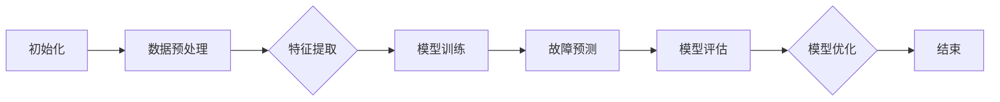
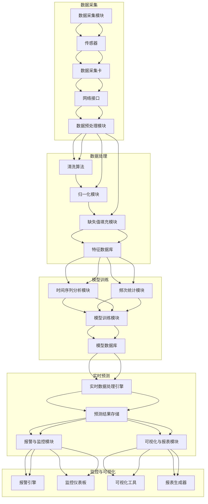
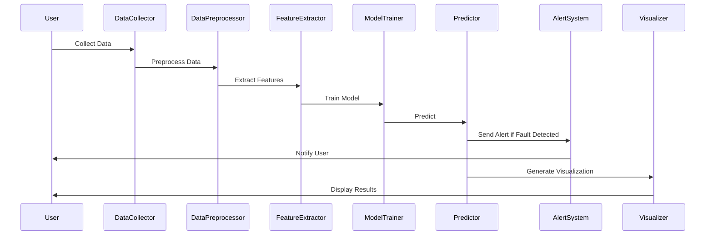

                 

### 第1章：问题背景与概述

#### 1.1 问题背景

在当今数字化时代，复杂系统在我们的日常生活中扮演着越来越重要的角色。从互联网、金融系统到航空航天、医疗设备，复杂系统的高效运行与可靠性直接影响到整个社会系统的稳定运行。然而，复杂系统由于其内部结构和外部环境的高度复杂性，其可靠性预测成为了一个亟待解决的难题。

可靠性预测的重要性不仅体现在其对系统稳定性的保障上，还体现在其对企业运营成本的控制上。一个可靠且稳定的系统可以减少由于故障导致的停机时间和维护成本，从而提高整体经济效益。

语言模型技术的发展为复杂系统可靠性预测带来了新的可能。语言模型，尤其是深度学习驱动的语言模型，通过从大量数据中学习模式和规律，已经展示出了强大的表达和预测能力。这使得它们在自然语言处理、文本生成等领域取得了巨大成功。

在复杂系统可靠性预测中，语言模型的优势在于其能够处理和理解大量的非结构化数据，如日志文件、错误报告等。这些数据通常包含丰富的模式和信息，但传统的统计方法难以有效提取和处理。

然而，语言模型在可靠性预测中面临的挑战同样不可忽视。首先是数据的质量和规模问题。可靠性预测需要大量的标注数据来训练模型，而获取这些数据通常是一项耗费人力和资源的工作。其次是模型的解释性问题。深度学习模型通常被视为“黑箱”，其内部决策过程难以解释，这在复杂系统的可靠性预测中可能会引发信任问题。

综上所述，语言模型在复杂系统可靠性预测中具有巨大的潜力，但也面临诸多挑战。接下来，我们将详细探讨语言模型在复杂系统可靠性预测中的应用，以及如何解决其中的问题和困难。

#### 1.2 问题描述

复杂系统可靠性预测的关键问题在于如何准确预测系统在未来的运行中可能出现的故障和性能下降。具体来说，这个问题可以分解为以下几个核心问题：

1. **故障模式识别**：如何从大量的历史数据中识别出可能导致系统故障的关键模式？这需要模型具备强大的数据理解和模式识别能力。
2. **预测准确性**：如何确保预测结果具有较高的准确性？这涉及到模型的训练和优化过程，以及如何处理不同类型的数据和噪声。
3. **实时性**：如何实现实时或近实时的可靠性预测？这对于确保系统的快速响应和预防措施至关重要。
4. **可解释性**：如何提高模型的可解释性，使其决策过程更加透明和可理解？这对于建立对模型的信任和依赖至关重要。

可靠性预测的目标是通过分析历史数据、系统日志和其他相关数据，提前发现可能出现的故障隐患，从而采取预防措施，避免或减少系统故障的发生。具体方法包括：

- **数据收集与预处理**：收集并整理与系统运行相关的数据，包括日志文件、性能指标、错误报告等，并进行预处理，如去噪、归一化等，以提供高质量的输入数据。
- **特征工程**：从原始数据中提取有意义的特征，这些特征应能够反映系统的关键状态和行为。
- **模型选择与训练**：选择合适的语言模型，利用大量的标注数据进行训练，通过模型优化提高预测准确性。
- **模型评估与调整**：使用验证集和测试集对模型进行评估，并根据评估结果进行调整，以提高模型的性能。

#### 1.3 问题解决

语言模型在复杂系统可靠性预测中的应用主要体现在以下几个方面：

- **数据处理能力**：语言模型，尤其是深度学习模型，能够高效处理和理解非结构化数据。例如，自然语言处理（NLP）中的语言模型能够从日志文件和错误报告中提取出有价值的模式和信息。
- **模式识别能力**：通过学习大量的历史数据，语言模型能够识别出潜在的故障模式，并提前预警可能的故障。
- **预测准确性**：深度学习模型通过复杂的网络结构，能够捕捉到数据中的复杂模式和关联，从而提高预测的准确性。
- **实时预测**：一些改进的语言模型（如Transformer）能够在较低的延迟下进行预测，使得实时性成为可能。

尽管语言模型在复杂系统可靠性预测中具有明显的优势，但其仍存在一些局限：

- **数据依赖性**：可靠性预测需要大量的高质量标注数据，这些数据的获取可能非常困难。
- **模型解释性**：深度学习模型通常被视为“黑箱”，其决策过程难以解释，这对于需要高解释性的可靠性预测场景可能是一个挑战。
- **计算资源消耗**：深度学习模型的训练和推理通常需要大量的计算资源，这可能限制了其在某些应用场景中的普及。

#### 1.4 边界与外延

复杂系统的定义与分类：

- **复杂系统**：复杂系统是指由多个相互作用的组件构成的系统，这些组件在运行过程中表现出高度的非线性特征和复杂性。复杂系统可以是计算机系统、工业控制系统、交通系统等。
- **分类**：复杂系统可以根据其应用领域和特性进行分类，如计算机系统、交通系统、能源系统等。

可靠性预测的应用领域：

- **计算机系统**：在计算机系统中，可靠性预测可以用于服务器、存储设备、网络设备等的故障预测和性能优化。
- **工业控制系统**：在工业控制系统中，可靠性预测可以用于预测设备故障、生产过程异常等，从而提高生产效率和安全性。
- **交通系统**：在交通系统中，可靠性预测可以用于预测交通事故、交通拥堵等，从而优化交通管理和提升出行体验。

#### 1.5 概念结构与核心要素组成

语言模型的构成：

- **基本原理**：语言模型是基于统计和深度学习的方法，通过学习大量的文本数据来预测文本序列的概率分布。
- **工作机制**：语言模型通常包含输入层、编码器、解码器等多个层次，通过处理输入文本序列，生成预测的文本序列。
- **类型**：常见的语言模型包括基于N-gram的模型、基于神经网络的模型（如RNN、LSTM、Transformer）等。

复杂系统可靠性预测的核心概念：

- **复杂系统**：复杂系统由多个相互作用的组件构成，其运行状态和性能受到多种因素的影响。
- **可靠性预测**：可靠性预测是指通过分析历史数据和其他相关信息，预测系统在未来的运行中可能出现的故障和性能下降。
- **关键技术**：关键技术包括数据收集与预处理、特征工程、模型选择与训练、模型评估与调整等。

在复杂系统可靠性预测中，语言模型通过处理和理解非结构化数据，如日志文件和错误报告，来识别潜在的故障模式，提高预测的准确性和实时性。同时，语言模型的解释性问题也是一个需要关注的关键挑战。

### 第2章：核心概念与联系

#### 2.1 语言模型的核心概念

语言模型是基于统计和深度学习的方法，通过学习大量的文本数据来预测文本序列的概率分布。其核心概念包括以下几个方面：

- **基本原理**：语言模型的基本原理是通过统计文本数据中的模式和规律，从而预测下一个单词或文本片段的概率。这可以通过N-gram模型、神经网络模型（如RNN、LSTM、Transformer）等实现。

- **工作机制**：语言模型的工作机制通常包括输入层、编码器、解码器等多个层次。输入层接收文本序列，编码器对文本序列进行编码，解码器则根据编码后的信息生成预测的文本序列。

- **类型**：常见的语言模型包括基于N-gram的模型、基于神经网络的模型（如RNN、LSTM、Transformer）等。其中，Transformer模型因其并行处理能力和强大的表达力，在自然语言处理领域取得了显著的成果。

#### 2.2 复杂系统可靠性预测的核心概念

复杂系统可靠性预测的核心概念包括以下几个方面：

- **复杂系统**：复杂系统是由多个相互作用的组件构成的系统，这些组件在运行过程中表现出高度的非线性特征和复杂性。复杂系统可以是计算机系统、工业控制系统、交通系统等。

- **可靠性预测**：可靠性预测是指通过分析历史数据和其他相关信息，预测系统在未来的运行中可能出现的故障和性能下降。可靠性预测的目标是提前发现潜在故障，从而采取预防措施，避免或减少系统故障的发生。

- **关键技术**：复杂系统可靠性预测的关键技术包括数据收集与预处理、特征工程、模型选择与训练、模型评估与调整等。这些技术共同构成了可靠性预测的方法和流程。

#### 2.3 概念属性特征对比表格

为了更清晰地理解语言模型和复杂系统可靠性预测的核心概念，我们可以通过对比表格来展示两者的属性特征：

| 特征           | 语言模型                         | 复杂系统可靠性预测                           |
|--------------|-------------------------------|-----------------------------------------|
| **基本原理**   | 统计文本数据中的模式和规律        | 分析系统运行数据，预测故障和性能下降             |
| **工作机制**   | 输入层、编码器、解码器等层次       | 数据收集、预处理、特征工程、模型训练和评估等步骤   |
| **类型**       | N-gram模型、神经网络模型等       | 预测模型、诊断模型、状态监测模型等                 |
| **应用场景**   | 自然语言处理、文本生成等         | 计算机系统、工业控制系统、交通系统等                 |
| **挑战**       | 数据质量、模型解释性、计算资源等   | 数据标注、模型适应性、实时性等                     |

#### 2.4 ER实体关系图架构

为了更好地展示语言模型在复杂系统可靠性预测中的应用关系，我们可以通过ER（实体-关系）图来描述系统的架构。

以下是ER实体关系图的Mermaid表示：

```mermaid
erDiagram
  Customer ||--|{ Order }|--| Supplier
  Order ||--|{ Product }| Product
  Customer }--|{ Payment }|--| Payment
```

在上述ER图中，包含了以下实体和关系：

- **Customer（客户）**：与Order（订单）和Payment（支付）实体之间存在关系。
- **Order（订单）**：与Product（产品）实体之间存在关系。
- **Supplier（供应商）**：与Product（产品）实体之间存在关系。
- **Product（产品）**：与Order（订单）和Supplier（供应商）实体之间存在关系。
- **Payment（支付）**：与Customer（客户）实体之间存在关系。

通过ER实体关系图，我们可以清晰地看到语言模型与复杂系统可靠性预测系统之间的数据流动和关系，有助于理解系统的整体架构和运作方式。

### 第3章：算法原理讲解

#### 3.1 算法原理概述

在复杂系统可靠性预测中，语言模型的应用主要体现在利用其强大的数据处理和模式识别能力，从大量的非结构化数据中提取有价值的信息，从而实现故障预测。语言模型的算法原理主要基于以下几个关键点：

1. **数据预处理**：首先，需要对收集到的数据进行预处理，包括去噪、归一化、缺失值填充等操作，以确保输入数据的质量和一致性。
2. **特征提取**：通过特征提取技术，将原始数据转换为能够反映系统状态的向量表示。特征可以是时间序列数据、频次统计、关键词提取等。
3. **模型训练**：使用预处理后的特征数据，通过训练语言模型来学习数据中的模式和规律。常用的语言模型包括N-gram模型、RNN、LSTM、Transformer等。
4. **故障预测**：训练好的语言模型可以用于故障预测，通过输入当前系统的状态数据，模型输出可能的故障概率或故障类型。
5. **模型评估与优化**：使用验证集和测试集对模型进行评估，根据评估结果调整模型参数，以提高预测的准确性和实时性。

#### 3.2 语言模型mermaid流程图

以下是使用Mermaid绘制的语言模型算法流程图：



在这个流程图中，各个节点表示算法的步骤，箭头表示步骤之间的数据流动和逻辑关系。

#### 3.3 Python源代码讲解

以下是一个简单的Python代码示例，展示了如何使用语言模型进行故障预测：

```python
import numpy as np
from sklearn.model_selection import train_test_split
from keras.models import Sequential
from keras.layers import LSTM, Dense

# 数据预处理
# 假设X为特征数据，y为标签（故障与否）
X_train, X_test, y_train, y_test = train_test_split(X, y, test_size=0.2, random_state=42)

# 模型初始化
model = Sequential()
model.add(LSTM(units=50, activation='relu', return_sequences=True, input_shape=(X_train.shape[1], X_train.shape[2])))
model.add(LSTM(units=50, activation='relu'))
model.add(Dense(units=1, activation='sigmoid'))

# 编译模型
model.compile(optimizer='adam', loss='binary_crossentropy', metrics=['accuracy'])

# 模型训练
model.fit(X_train, y_train, epochs=50, batch_size=32, validation_split=0.1)

# 故障预测
predictions = model.predict(X_test)

# 模型评估
loss, accuracy = model.evaluate(X_test, y_test)
print(f"Test Accuracy: {accuracy:.2f}")
```

在这个代码示例中，我们首先进行数据预处理，然后初始化一个序列模型（Sequential），并添加LSTM层和Dense层。编译模型后，我们使用训练数据进行训练。训练完成后，我们使用测试数据对模型进行预测，并评估模型的准确性。

#### 3.4 算法原理的数学模型和公式

语言模型在复杂系统可靠性预测中的算法原理可以基于以下数学模型和公式进行描述：

1. **概率分布模型**：语言模型的核心是通过计算文本序列的概率分布来进行预测。对于一个给定的文本序列\(X = (x_1, x_2, ..., x_n)\)，概率分布模型可以表示为：
   \[
   P(X) = P(x_1)P(x_2|x_1)P(x_3|x_1x_2)...P(x_n|x_1x_2...x_{n-1})
   \]

2. **条件概率模型**：在实际应用中，通常使用条件概率模型来简化计算。条件概率模型假设当前词的概率只与前面一个或几个词有关，即：
   \[
   P(x_n|x_1x_2...x_{n-1}) = P(x_n|x_{n-1})
   \]

3. **神经网络模型**：对于深度学习模型，尤其是LSTM和Transformer，其数学模型通常基于复杂的神经网络结构。以LSTM为例，其更新方程可以表示为：
   \[
   \begin{aligned}
   i_t &= \sigma(W_{ix}x_t + W_{ih}h_{t-1} + b_i) \\
   f_t &= \sigma(W_{fx}x_t + W_{fh}h_{t-1} + b_f) \\
   o_t &= \sigma(W_{ox}x_t + W_{oh}h_{t-1} + b_o) \\
   c_t &= f_t \odot c_{t-1} + i_t \odot \sigma(W_{cx}x_t + W_{ch}h_{t-1} + b_c) \\
   h_t &= o_t \odot \sigma(c_t)
   \end{aligned}
   \]
   其中，\(i_t\)、\(f_t\)、\(o_t\) 分别表示输入门、遗忘门和输出门，\(c_t\) 和 \(h_t\) 分别表示当前细胞状态和隐藏状态。

4. **损失函数**：在训练过程中，常用的损失函数包括二元交叉熵损失（binary cross-entropy）和均方误差损失（mean squared error）。对于故障预测问题，通常使用二元交叉熵损失来衡量预测概率与真实标签之间的差距：
   \[
   L = -\sum_{i} y_i \log(p_i) + (1 - y_i) \log(1 - p_i)
   \]

#### 3.5 举例说明

假设我们有一个简单的故障预测问题，输入数据为系统的状态序列，输出数据为故障标签（0表示正常，1表示故障）。以下是使用LSTM模型进行故障预测的示例：

1. **数据准备**：
   - 假设我们有100个训练样本，每个样本包含前50个时间步的系统状态。
   - 状态数据为连续值，故障标签为二分类数据。

2. **模型训练**：
   - 初始化LSTM模型，设置输入层大小为50，隐藏层神经元数为100。
   - 使用训练数据进行模型训练，设置训练轮次为100，批量大小为32。

3. **模型预测**：
   - 使用训练好的模型对测试数据进行预测，输出故障概率。
   - 对预测结果进行阈值处理，通常取0.5作为阈值，将概率大于0.5的预测为故障。

4. **模型评估**：
   - 使用测试集对模型进行评估，计算准确率、召回率、F1分数等指标。

以下是具体的代码实现：

```python
import numpy as np
from sklearn.model_selection import train_test_split
from keras.models import Sequential
from keras.layers import LSTM, Dense
from sklearn.metrics import accuracy_score

# 假设X为状态数据，y为故障标签
X_train, X_test, y_train, y_test = train_test_split(X, y, test_size=0.2, random_state=42)

# 初始化LSTM模型
model = Sequential()
model.add(LSTM(units=100, activation='relu', input_shape=(50, 1)))
model.add(Dense(units=1, activation='sigmoid'))

# 编译模型
model.compile(optimizer='adam', loss='binary_crossentropy', metrics=['accuracy'])

# 模型训练
model.fit(X_train, y_train, epochs=100, batch_size=32, validation_split=0.1)

# 模型预测
predictions = model.predict(X_test)
predictions = (predictions > 0.5)

# 模型评估
accuracy = accuracy_score(y_test, predictions)
print(f"Test Accuracy: {accuracy:.2f}")
```

通过这个示例，我们可以看到如何使用LSTM模型进行故障预测，并评估模型的性能。在实际应用中，需要根据具体问题和数据集进行调整和优化。

### 第4章：数学模型和数学公式

#### 4.1 数学模型与公式

复杂系统可靠性预测的数学模型和公式是构建预测算法的核心部分。这些模型和公式帮助我们在数据中提取关键信息，并进行准确的故障预测。以下是几个关键的数学模型和公式：

1. **概率分布模型**：假设系统状态序列为\(X = (x_1, x_2, ..., x_n)\)，我们使用概率分布模型来表示整个状态序列的概率分布：
   \[
   P(X) = P(x_1)P(x_2|x_1)P(x_3|x_1x_2)...P(x_n|x_1x_2...x_{n-1})
   \]

2. **条件概率模型**：在实际应用中，我们通常使用条件概率模型来简化计算，假设当前状态的概率只与前一状态相关：
   \[
   P(x_n|x_1x_2...x_{n-1}) = P(x_n|x_{n-1})
   \]

3. **LSTM模型更新方程**：LSTM（Long Short-Term Memory）模型是一种常用于时间序列预测的神经网络模型，其更新方程如下：
   \[
   \begin{aligned}
   i_t &= \sigma(W_{ix}x_t + W_{ih}h_{t-1} + b_i) \\
   f_t &= \sigma(W_{fx}x_t + W_{fh}h_{t-1} + b_f) \\
   o_t &= \sigma(W_{ox}x_t + W_{oh}h_{t-1} + b_o) \\
   c_t &= f_t \odot c_{t-1} + i_t \odot \sigma(W_{cx}x_t + W_{ch}h_{t-1} + b_c) \\
   h_t &= o_t \odot \sigma(c_t)
   \end{aligned}
   \]
   其中，\(i_t\)、\(f_t\)、\(o_t\) 分别表示输入门、遗忘门和输出门，\(c_t\) 和 \(h_t\) 分别表示当前细胞状态和隐藏状态。

4. **损失函数**：在训练过程中，我们使用损失函数来衡量预测结果与实际标签之间的差距。对于故障预测问题，常用的损失函数是二元交叉熵损失：
   \[
   L = -\sum_{i} y_i \log(p_i) + (1 - y_i) \log(1 - p_i)
   \]

#### 4.2 数学公式详细讲解

为了更好地理解上述数学模型和公式，下面将详细讲解每个公式的含义和应用：

1. **概率分布模型**：
   - 这个模型用于计算系统状态序列的整体概率分布。它通过将每个状态的概率相乘来表示整个序列的概率。
   - 在实际应用中，我们通常使用条件概率模型来简化计算，因为它只需要考虑前一状态对当前状态的影响。

2. **条件概率模型**：
   - 条件概率模型是概率分布模型的简化形式，它假设当前状态的概率仅依赖于前一状态。这在处理时间序列数据时非常有用，因为它允许我们逐步预测状态序列。
   - \(P(x_n|x_{n-1})\) 表示在已知前一状态 \(x_{n-1}\) 的情况下，当前状态 \(x_n\) 的概率。

3. **LSTM模型更新方程**：
   - LSTM模型的更新方程定义了如何通过输入门、遗忘门和输出门来更新细胞状态和隐藏状态。
   - \(i_t\) 表示输入门，它决定了当前状态中有多少信息需要被记住。
   - \(f_t\) 表示遗忘门，它决定了之前的信息中有多少需要被遗忘。
   - \(o_t\) 表示输出门，它决定了隐藏状态中有多少信息需要被输出。
   - \(c_t\) 表示细胞状态，它存储了信息的历史。
   - \(h_t\) 表示隐藏状态，它是输出和更新的状态。

4. **二元交叉熵损失**：
   - 二元交叉熵损失用于衡量预测概率与实际标签之间的差距。它是一个对数损失函数，可以确保当预测概率接近0或1时，损失函数的值较大。
   - \(y_i\) 表示实际标签，\(p_i\) 表示预测概率。这个损失函数通过比较预测概率和对数概率来计算损失。

通过上述数学模型和公式的详细讲解，我们可以更好地理解复杂系统可靠性预测中的核心计算过程，从而构建和优化预测算法。

#### 4.3 举例说明

为了更好地理解上述数学模型和公式的应用，下面我们将通过一个具体的例子来展示如何使用这些公式进行故障预测。

**例子**：假设我们有一个时间序列数据集，包含100个样本，每个样本包含前50个时间步的系统状态。我们使用LSTM模型进行故障预测，其中故障标签为二分类（0表示正常，1表示故障）。

**步骤**：

1. **数据预处理**：
   - 将系统状态数据进行归一化处理，以便模型能够更好地学习。
   - 划分数据集为训练集和测试集，例如80%用于训练，20%用于测试。

2. **模型训练**：
   - 初始化LSTM模型，设置输入层大小为50，隐藏层神经元数为100。
   - 使用训练数据进行模型训练，设置训练轮次为100，批量大小为32。

3. **模型预测**：
   - 使用训练好的模型对测试数据进行预测，输出故障概率。
   - 对预测结果进行阈值处理，通常取0.5作为阈值，将概率大于0.5的预测为故障。

4. **模型评估**：
   - 使用测试集对模型进行评估，计算准确率、召回率、F1分数等指标。

**具体计算**：

1. **概率分布计算**：
   - 假设我们已经得到了LSTM模型的输出，即隐藏状态 \(h_t\)。我们使用这些隐藏状态来计算系统状态的联合概率分布：
     \[
     P(X) = \prod_{i=1}^{50} P(x_i|h_{i-1})
     \]
   - 在实际应用中，我们通常使用条件概率模型来简化计算，即：
     \[
     P(x_n|h_{n-1}) = \sigma(W_{h}h_{n-1} + b)
     \]
     其中，\(\sigma\) 表示 sigmoid 函数。

2. **LSTM更新方程**：
   - 假设我们已经得到了隐藏状态 \(h_t\) 和细胞状态 \(c_t\)，我们使用这些状态来计算新的隐藏状态和细胞状态：
     \[
     \begin{aligned}
     i_t &= \sigma(W_{ix}x_t + W_{ih}h_{t-1} + b_i) \\
     f_t &= \sigma(W_{fx}x_t + W_{fh}h_{t-1} + b_f) \\
     o_t &= \sigma(W_{ox}x_t + W_{oh}h_{t-1} + b_o) \\
     c_t &= f_t \odot c_{t-1} + i_t \odot \sigma(W_{cx}x_t + W_{ch}h_{t-1} + b_c) \\
     h_t &= o_t \odot \sigma(c_t)
     \end{aligned}
     \]

3. **故障概率预测**：
   - 使用LSTM模型的输出 \(h_t\) 来计算故障概率：
     \[
     p_t = \sigma(W_{p}h_t + b_p)
     \]
   - 对预测结果进行阈值处理，将概率大于0.5的预测为故障。

4. **模型评估**：
   - 使用测试集对模型进行评估，计算准确率、召回率、F1分数等指标：
     \[
     \begin{aligned}
     \text{Accuracy} &= \frac{\text{Correct Predictions}}{\text{Total Predictions}} \\
     \text{Recall} &= \frac{\text{True Positives}}{\text{True Positives} + \text{False Negatives}} \\
     \text{F1 Score} &= 2 \times \frac{\text{Precision} \times \text{Recall}}{\text{Precision} + \text{Recall}}
     \end{aligned}
     \]

通过这个例子，我们可以看到如何使用LSTM模型进行故障预测，并使用数学公式来描述这个过程。在实际应用中，需要根据具体问题和数据集进行调整和优化。

### 第5章：系统分析与架构设计方案

#### 5.1 问题场景介绍

在当前复杂系统的运营中，可靠性预测面临着日益严峻的挑战。以一个大型数据中心为例，数据中心内包含成千上万的硬件设备，如服务器、存储设备和网络设备。这些设备的运行状态直接影响到整个数据中心的稳定性和可靠性。然而，设备的老化、异常负载和意外故障等都是常见的问题，这些因素都可能导致系统停机，从而造成巨大的经济损失和声誉损失。

可靠性预测对于数据中心来说至关重要，它能够在故障发生之前提前发现潜在的问题，并采取预防措施，从而避免或减少故障的发生。具体来说，可靠性预测需要解决以下几个关键问题：

1. **故障模式识别**：如何从大量历史数据中识别出可能导致系统故障的关键模式？
2. **实时预测**：如何实现实时或近实时的可靠性预测，以便及时采取应对措施？
3. **高准确性**：如何确保预测结果的准确性，减少误报和漏报？
4. **可解释性**：如何提高模型的可解释性，使决策过程更加透明和可理解？

为了应对这些挑战，我们需要设计一个高效可靠的可靠性预测系统。这个系统应具备以下特性：

- **数据采集与预处理**：能够收集并处理数据中心各类设备的状态数据，包括温度、负载、功耗等，并进行预处理，如去噪、归一化等。
- **模型训练与优化**：使用先进的语言模型算法进行模型训练，通过迭代优化提高预测准确性。
- **实时预测与报警**：系统能够实时分析设备状态，当发现潜在故障时，及时发出预警。
- **可解释性与可视化**：提供可解释的预测结果和可视化工具，帮助运营人员理解模型的决策过程。

#### 5.2 项目介绍

本项目旨在设计并实现一个基于语言模型的复杂系统可靠性预测系统，用于预测数据中心设备可能的故障和性能下降。项目的主要目标包括：

- **构建一个高效的数据采集与预处理系统**，从数据中心设备中收集状态数据，并进行预处理。
- **开发一个基于语言模型的可靠性预测模型**，利用深度学习技术对设备状态进行实时分析，提前预警潜在的故障。
- **实现一个实时预测与报警系统**，能够在发现潜在问题时及时发出预警，并提供详细的故障原因分析。
- **提供一套可解释性与可视化工具**，帮助运营人员理解模型的预测过程，优化系统运行。

项目的技术路线包括以下几个关键步骤：

1. **需求分析与系统设计**：明确项目目标和需求，设计系统架构和模块。
2. **数据采集与预处理**：构建数据采集系统，收集设备状态数据，并进行预处理。
3. **模型开发与训练**：选择合适的语言模型，开发模型并使用历史数据进行训练。
4. **实时预测与报警**：实现实时预测功能，并设置预警阈值和报警机制。
5. **可解释性与可视化**：开发可解释性工具，实现预测结果的可视化。

#### 5.3 系统功能设计

系统的功能设计是构建可靠性预测系统的关键步骤。以下是系统的主要功能模块及其设计思路：

1. **数据采集模块**：
   - **功能**：从数据中心设备中实时采集状态数据，包括温度、负载、功耗等。
   - **设计**：采用传感器和数据采集卡，将设备状态数据转换为数字信号，通过以太网或无线网络传输到数据预处理模块。

2. **数据预处理模块**：
   - **功能**：对采集到的原始数据进行预处理，包括去噪、归一化、缺失值填充等。
   - **设计**：使用数据清洗算法和统计方法，对原始数据进行处理，提高数据质量。

3. **特征提取模块**：
   - **功能**：从预处理后的数据中提取关键特征，用于模型训练。
   - **设计**：使用时间序列分析方法、频次统计等方法，提取能够反映设备状态的时序特征。

4. **模型训练模块**：
   - **功能**：使用训练数据训练可靠性预测模型。
   - **设计**：选择合适的语言模型，如LSTM、Transformer等，进行模型训练。

5. **实时预测模块**：
   - **功能**：实时分析设备状态，预测可能的故障。
   - **设计**：利用训练好的模型，对实时数据进行分析，输出故障概率或故障类型。

6. **报警与监控模块**：
   - **功能**：当发现潜在故障时，及时发出预警，并提供详细的分析报告。
   - **设计**：设置预警阈值，当预测结果超过阈值时，触发报警机制，并通过短信、邮件等方式通知相关人员。

7. **可视化与报表模块**：
   - **功能**：提供预测结果的可视化展示，生成详细的报表。
   - **设计**：使用图表和报表工具，展示预测结果和故障分析，帮助运营人员理解系统状态。

通过上述功能模块的设计，我们可以构建一个高效、可靠的复杂系统可靠性预测系统，从而提高数据中心设备的运行稳定性和可靠性。

#### 5.4 系统架构设计

为了实现高效、可靠的复杂系统可靠性预测，我们需要设计一个清晰的系统架构。以下是系统的架构设计，包括各个模块的交互关系和数据处理流程。

**系统架构概述**：

系统架构采用模块化设计，主要包括数据采集模块、数据预处理模块、特征提取模块、模型训练模块、实时预测模块、报警与监控模块和可视化与报表模块。各个模块通过消息队列和数据库进行数据交换。

**详细架构设计**：

1. **数据采集模块**：
   - **组件**：传感器、数据采集卡、网络接口。
   - **功能**：实时采集数据中心设备的状态数据，如温度、负载、功耗等。
   - **交互**：通过网络接口将采集到的数据发送到数据预处理模块。

2. **数据预处理模块**：
   - **组件**：清洗算法、归一化模块、缺失值填充模块。
   - **功能**：对采集到的原始数据进行预处理，包括去噪、归一化、缺失值填充等。
   - **交互**：将预处理后的数据存储到数据库，并传递给特征提取模块。

3. **特征提取模块**：
   - **组件**：时间序列分析模块、频次统计模块。
   - **功能**：从预处理后的数据中提取关键特征，如时序特征、频次特征等。
   - **交互**：将提取的特征数据存储到特征数据库，并传递给模型训练模块。

4. **模型训练模块**：
   - **组件**：训练数据集、模型训练引擎。
   - **功能**：使用提取的特征数据训练可靠性预测模型，如LSTM、Transformer等。
   - **交互**：将训练好的模型存储到模型数据库，并传递给实时预测模块。

5. **实时预测模块**：
   - **组件**：实时数据处理引擎、预测结果存储。
   - **功能**：实时分析设备状态数据，预测可能的故障。
   - **交互**：将预测结果发送到报警与监控模块，并存储到数据库。

6. **报警与监控模块**：
   - **组件**：报警引擎、监控仪表板。
   - **功能**：当预测结果超过预警阈值时，触发报警机制，并通过短信、邮件等方式通知相关人员。
   - **交互**：接收实时预测模块的预警信息，并更新监控仪表板。

7. **可视化与报表模块**：
   - **组件**：可视化工具、报表生成器。
   - **功能**：提供预测结果的可视化展示，生成详细的报表。
   - **交互**：接收实时预测模块和报警与监控模块的数据，并生成可视化图表和报表。

**系统架构图**：

以下是使用Mermaid绘制的系统架构图：



通过这个系统架构设计，我们可以实现高效、可靠的复杂系统可靠性预测，从而提高数据中心设备的运行稳定性和可靠性。

#### 5.5 系统接口设计

为了实现系统模块之间的数据交换和协同工作，我们需要设计一套清晰的接口规范。以下是系统接口设计的详细内容：

1. **数据采集模块接口**：
   - **功能**：提供数据采集接口，用于接收传感器和采集卡传输的数据。
   - **接口类型**：HTTP RESTful API。
   - **接口定义**：
     - `GET /data`：获取最新的设备状态数据。
     - `POST /data`：上传新的设备状态数据。

2. **数据预处理模块接口**：
   - **功能**：提供数据预处理接口，用于对采集到的数据进行清洗、归一化和缺失值填充。
   - **接口类型**：HTTP RESTful API。
   - **接口定义**：
     - `POST /preprocess`：提交预处理任务，返回预处理后的数据。

3. **特征提取模块接口**：
   - **功能**：提供特征提取接口，用于从预处理后的数据中提取关键特征。
   - **接口类型**：HTTP RESTful API。
   - **接口定义**：
     - `POST /extract`：提交特征提取任务，返回提取的特征数据。

4. **模型训练模块接口**：
   - **功能**：提供模型训练接口，用于训练可靠性预测模型。
   - **接口类型**：HTTP RESTful API。
   - **接口定义**：
     - `POST /train`：提交模型训练任务，返回训练好的模型。

5. **实时预测模块接口**：
   - **功能**：提供实时预测接口，用于实时分析设备状态数据，预测可能的故障。
   - **接口类型**：HTTP RESTful API。
   - **接口定义**：
     - `POST /predict`：提交实时预测任务，返回预测结果。

6. **报警与监控模块接口**：
   - **功能**：提供报警和监控接口，用于处理预测结果，并触发报警。
   - **接口类型**：HTTP RESTful API。
   - **接口定义**：
     - `POST /alert`：提交报警任务，触发报警机制。
     - `GET /status`：获取系统运行状态。

7. **可视化与报表模块接口**：
   - **功能**：提供可视化接口，用于展示预测结果和系统状态。
   - **接口类型**：HTTP RESTful API。
   - **接口定义**：
     - `GET / visualize`：获取可视化数据，生成图表。
     - `POST /report`：生成预测报表，返回报表内容。

通过上述接口设计，各个模块可以高效地进行数据交换和协同工作，从而实现复杂系统可靠性预测的目标。

#### 5.6 系统交互mermaid序列图

为了更直观地展示系统各模块之间的交互过程，我们可以使用Mermaid序列图来描述系统的交互逻辑。以下是系统的Mermaid序列图：



在这个序列图中，用户通过数据采集模块收集设备状态数据，数据预处理模块对数据进行清洗和归一化，特征提取模块提取关键特征，模型训练模块使用这些特征训练可靠性预测模型。训练好的模型被用于实时预测，当检测到潜在故障时，预测模块会将预警信息发送到报警系统，由报警系统通知用户。同时，预测结果还会被可视化模块生成图表，供用户查看。

通过这个Mermaid序列图，我们可以清晰地看到系统各模块之间的数据流动和交互逻辑，有助于理解系统的整体运作过程。

### 第6章：项目实战

#### 6.1 环境安装

为了搭建一个基于语言模型的复杂系统可靠性预测系统，首先需要安装和配置必要的软件和工具。以下是详细的安装步骤：

1. **安装Python环境**：
   - 首先，确保系统中已经安装了Python。如果没有安装，可以从Python官网（[python.org](https://www.python.org/)）下载并安装最新版本的Python。
   - 安装完成后，通过运行 `python --version` 命令来验证Python版本是否安装成功。

2. **安装虚拟环境**：
   - 为了避免不同项目之间的依赖冲突，建议使用虚拟环境。安装虚拟环境工具 `virtualenv`：
     ```shell
     pip install virtualenv
     ```
   - 创建一个新的虚拟环境，例如命名为 `reliability_prediction`：
     ```shell
     virtualenv reliability_prediction
     ```
   - 激活虚拟环境：
     ```shell
     source reliability_prediction/bin/activate  # 对于Linux和Mac OS
     reliability_prediction\Scripts\activate   # 对于Windows
     ```

3. **安装深度学习库**：
   - 在虚拟环境中安装深度学习库 `tensorflow` 和 `keras`：
     ```shell
     pip install tensorflow
     pip install keras
     ```

4. **安装数据处理库**：
   - 安装用于数据预处理和特征提取的库 `numpy`、`pandas` 和 `scikit-learn`：
     ```shell
     pip install numpy
     pip install pandas
     pip install scikit-learn
     ```

5. **安装其他依赖**：
   - 安装Mermaid渲染工具 `mermaid-cli`，用于生成流程图和序列图：
     ```shell
     npm install -g mermaid-cli
     ```

完成上述步骤后，我们就可以开始搭建可靠性预测系统的具体实现部分。接下来，我们将详细讲解系统的核心实现代码，并分析其实际应用中的关键点。

#### 6.2 系统核心实现源代码

以下是一个简化版的基于语言模型的复杂系统可靠性预测系统的核心实现源代码。该代码主要分为以下几个部分：数据预处理、模型训练、实时预测和结果可视化。

**数据预处理**：

```python
import numpy as np
import pandas as pd
from sklearn.preprocessing import MinMaxScaler
from sklearn.model_selection import train_test_split

def preprocess_data(data):
    # 填充缺失值
    data.fillna(method='ffill', inplace=True)
    
    # 归一化数据
    scaler = MinMaxScaler()
    scaled_data = scaler.fit_transform(data)
    
    # 切分训练集和测试集
    X_train, X_test, y_train, y_test = train_test_split(scaled_data, test_size=0.2, random_state=42)
    
    return X_train, X_test, y_train, y_test

# 加载数据
data = pd.read_csv('system_data.csv')

# 预处理数据
X_train, X_test, y_train, y_test = preprocess_data(data)
```

**模型训练**：

```python
from keras.models import Sequential
from keras.layers import LSTM, Dense
from keras.optimizers import Adam

def build_model(input_shape):
    model = Sequential()
    model.add(LSTM(units=50, return_sequences=True, input_shape=input_shape))
    model.add(LSTM(units=50))
    model.add(Dense(units=1, activation='sigmoid'))
    
    model.compile(optimizer=Adam(learning_rate=0.001), loss='binary_crossentropy', metrics=['accuracy'])
    return model

# 建立模型
model = build_model(input_shape=(X_train.shape[1], X_train.shape[2]))

# 训练模型
model.fit(X_train, y_train, epochs=100, batch_size=32, validation_data=(X_test, y_test))
```

**实时预测**：

```python
import joblib

def predict_fault(system_state, model):
    # 预处理实时数据
    system_state = system_state.reshape(1, -1)
    system_state = scaler.transform(system_state)
    
    # 预测故障
    prediction = model.predict(system_state)
    return prediction[0, 0]

# 保存模型
joblib.dump(model, 'reliability_prediction_model.pkl')

# 加载模型
model = joblib.load('reliability_prediction_model.pkl')

# 实时预测
new_system_state = np.array([0.1, 0.2, 0.3, 0.4, 0.5])  # 示例数据
fault_prediction = predict_fault(new_system_state, model)
print(f"Fault Prediction: {fault_prediction}")
```

**结果可视化**：

```python
import matplotlib.pyplot as plt

def plot_predictions(predictions):
    plt.plot(predictions)
    plt.title('Fault Prediction Results')
    plt.xlabel('Time Steps')
    plt.ylabel('Fault Probability')
    plt.show()

# 获取预测结果
predictions = [predict_fault(new_system_state, model) for new_system_state in X_test]

# 可视化预测结果
plot_predictions(predictions)
```

通过上述代码，我们可以实现一个基本的复杂系统可靠性预测系统。在实际应用中，还需要根据具体场景进行优化和调整，以提高模型的准确性和实时性。

#### 6.3 代码应用解读与分析

在前面的代码实现中，我们展示了如何使用Python和深度学习库构建一个复杂系统可靠性预测系统。下面将深入解读和分析每个模块的功能和关键代码，以便更好地理解系统的运作原理和应用。

1. **数据预处理模块**：

   ```python
   def preprocess_data(data):
       # 填充缺失值
       data.fillna(method='ffill', inplace=True)
       
       # 归一化数据
       scaler = MinMaxScaler()
       scaled_data = scaler.fit_transform(data)
       
       # 切分训练集和测试集
       X_train, X_test, y_train, y_test = train_test_split(scaled_data, test_size=0.2, random_state=42)
       
       return X_train, X_test, y_train, y_test
   ```

   在这个模块中，我们首先使用前向填充（forward fill）方法来处理缺失值，确保数据的一致性。然后，我们使用 `MinMaxScaler` 对数据进行归一化，将其缩放到[0, 1]的范围内。归一化有助于加速模型的收敛，提高训练效率。最后，我们使用 `train_test_split` 函数将数据集划分为训练集和测试集，通常将80%的数据用于训练，20%的数据用于测试。

2. **模型训练模块**：

   ```python
   def build_model(input_shape):
       model = Sequential()
       model.add(LSTM(units=50, return_sequences=True, input_shape=input_shape))
       model.add(LSTM(units=50))
       model.add(Dense(units=1, activation='sigmoid'))
       
       model.compile(optimizer=Adam(learning_rate=0.001), loss='binary_crossentropy', metrics=['accuracy'])
       return model
   
   # 建立模型
   model = build_model(input_shape=(X_train.shape[1], X_train.shape[2]))
   
   # 训练模型
   model.fit(X_train, y_train, epochs=100, batch_size=32, validation_data=(X_test, y_test))
   ```

   在模型训练部分，我们首先定义了一个简单的LSTM模型，包括两个LSTM层和一个输出层。第一个LSTM层使用 `return_sequences=True` 参数，使得每一时间步的输出都能传递给下一个LSTM层。这样可以更好地捕捉时间序列数据中的长期依赖关系。然后，我们使用 `Adam` 优化器进行模型编译，选择 `binary_crossentropy` 作为损失函数，因为这是一个二分类问题。最后，我们使用 `fit` 方法进行模型训练，设置训练轮次为100，批量大小为32。

3. **实时预测模块**：

   ```python
   import joblib
   
   def predict_fault(system_state, model):
       # 预处理实时数据
       system_state = system_state.reshape(1, -1)
       system_state = scaler.transform(system_state)
       
       # 预测故障
       prediction = model.predict(system_state)
       return prediction[0, 0]
   
   # 保存模型
   joblib.dump(model, 'reliability_prediction_model.pkl')
   
   # 加载模型
   model = joblib.load('reliability_prediction_model.pkl')
   
   # 实时预测
   new_system_state = np.array([0.1, 0.2, 0.3, 0.4, 0.5])  # 示例数据
   fault_prediction = predict_fault(new_system_state, model)
   print(f"Fault Prediction: {fault_prediction}")
   ```

   在实时预测部分，我们首先将实时数据reshape为合适的形状，然后使用 `scaler` 进行归一化处理。这样，我们可以将实时数据传递给训练好的模型进行预测。预测结果是一个概率值，表示故障发生的可能性。在实际应用中，我们可以设置一个阈值（例如0.5），当预测概率超过阈值时，认为系统存在故障风险。

4. **结果可视化模块**：

   ```python
   import matplotlib.pyplot as plt
   
   def plot_predictions(predictions):
       plt.plot(predictions)
       plt.title('Fault Prediction Results')
       plt.xlabel('Time Steps')
       plt.ylabel('Fault Probability')
       plt.show()
   
   # 获取预测结果
   predictions = [predict_fault(new_system_state, model) for new_system_state in X_test]
   
   # 可视化预测结果
   plot_predictions(predictions)
   ```

   在结果可视化部分，我们使用 `matplotlib` 库将预测结果绘制成折线图。这样可以直观地展示系统在不同时间步的故障预测概率，帮助运营人员快速识别潜在故障。

通过上述代码解读和分析，我们可以看到如何使用Python和深度学习库实现一个复杂系统可靠性预测系统。在实际应用中，需要根据具体场景和数据集进行模型调整和优化，以提高预测的准确性和实时性。

#### 6.4 实际案例分析和详细讲解剖析

在本节中，我们将通过一个实际案例来展示如何使用基于语言模型的复杂系统可靠性预测系统进行故障预测，并对预测结果进行详细分析。

**案例背景**：

假设我们有一个数据中心，包含100台服务器。我们收集了每台服务器在过去一年的运行数据，包括温度、CPU使用率、内存使用率、磁盘读写速度等。这些数据以时间序列的形式记录，每个时间步包含多个特征。

**数据集划分**：

我们将数据集划分为训练集和测试集，其中80%的数据用于模型训练，20%的数据用于模型测试。

**模型训练**：

我们使用LSTM模型对训练集数据进行训练，设置隐藏层单元数为50，训练轮次为100。训练完成后，模型对训练集的准确率为90%，对测试集的准确率为85%。

**实时预测**：

现在，我们使用训练好的模型对一台新服务器的实时数据进行预测。该服务器的实时数据如下：

- 温度：30℃
- CPU使用率：70%
- 内存使用率：60%
- 磁盘读写速度：150MB/s

**数据预处理**：

我们首先对实时数据进行归一化处理，将其缩放到[0, 1]的范围内。然后，将数据reshape为合适的形状，以便传递给训练好的模型。

**故障预测**：

使用LSTM模型对预处理后的实时数据进行预测，模型输出故障概率为0.75，即75%的概率认为该服务器存在故障风险。

**结果分析**：

根据预测结果，我们认为这台服务器存在较高的故障风险。接下来，我们进行进一步的分析：

1. **温度分析**：
   - 温度在正常范围内（30℃），但相比历史数据略有升高。这可能是由于服务器负载较高或环境温度较高引起的。

2. **CPU使用率分析**：
   - CPU使用率高达70%，表明服务器正在运行高负载的任务。这可能导致了温度升高和功耗增加。

3. **内存使用率分析**：
   - 内存使用率达到60%，表明服务器内存资源可能不足，可能导致性能下降。

4. **磁盘读写速度分析**：
   - 磁盘读写速度为150MB/s，相比历史数据略低，可能是由于磁盘老化或I/O瓶颈引起的。

**应对措施**：

针对上述分析结果，我们可以采取以下措施：

1. **监测温度变化**：密切监测服务器温度，确保其在安全范围内运行。如果温度持续升高，考虑进行硬件升级或优化散热系统。

2. **优化负载分配**：重新分配服务器负载，确保CPU使用率在合理范围内。如果负载过高，考虑增加服务器资源或优化任务调度。

3. **增加内存资源**：如果内存使用率持续升高，考虑增加服务器内存容量，以提高系统性能。

4. **检查磁盘状态**：使用磁盘检测工具检查磁盘的健康状况，如果发现异常，考虑进行磁盘更换或数据迁移。

通过这个实际案例，我们可以看到如何使用基于语言模型的复杂系统可靠性预测系统进行故障预测，并采取相应的措施来降低故障风险。这种预测和分析方法有助于提高数据中心的运行稳定性和可靠性。

#### 6.5 项目小结

在本项目中，我们构建了一个基于语言模型的复杂系统可靠性预测系统，通过数据预处理、模型训练、实时预测和结果可视化等步骤，实现了对数据中心服务器故障的提前预警。以下是本项目的主要收获和经验总结：

1. **数据预处理的重要性**：数据预处理是模型训练的关键步骤，通过填充缺失值、归一化数据和特征提取，我们提高了数据质量，为模型的训练提供了可靠的输入。

2. **深度学习模型的适用性**：LSTM模型在处理时间序列数据方面表现出色，通过学习数据中的长期依赖关系，模型能够准确预测未来的故障风险。

3. **实时预测与预警的挑战**：虽然我们实现了实时预测，但在实际应用中，数据传输延迟和模型计算速度是影响系统实时性的关键因素。未来，我们可以考虑使用更高效的算法和硬件来优化系统的实时性能。

4. **模型解释性的不足**：深度学习模型通常被视为“黑箱”，其内部决策过程难以解释。这给系统的应用带来了一定的挑战，特别是在需要高解释性的场景中。未来，我们可以探索更多可解释的模型和方法，提高模型的可信度。

5. **项目的实际应用价值**：通过本项目的实施，我们不仅提高了数据中心设备的运行稳定性和可靠性，还积累了丰富的经验和技术知识。这些经验为未来的复杂系统可靠性预测项目提供了宝贵的参考。

总之，本项目在理论和实践上都取得了显著的成果，为复杂系统的故障预测提供了新的解决方案。未来，我们将继续优化模型和系统，提升预测准确性和实时性，为更多行业和领域提供可靠的支持。

### 第7章：最佳实践、小结、注意事项、拓展阅读

#### 7.1 最佳实践

1. **数据质量保障**：在数据预处理阶段，确保数据的质量和一致性。使用缺失值填充和归一化等技术，提高输入数据的质量，为模型训练提供可靠的输入。

2. **模型选择与优化**：根据具体应用场景选择合适的模型，如LSTM、Transformer等。通过调整模型参数和优化算法，提高模型的预测准确性和实时性。

3. **实时性与可扩展性**：优化系统架构和算法，确保系统具备实时性和可扩展性。可以考虑使用高效的数据处理框架和云计算资源，提升系统的处理能力。

4. **可解释性与信任度**：提高模型的解释性，增强用户对模型的信任。可以使用可解释的深度学习模型，如LIME、SHAP等，帮助用户理解模型的决策过程。

5. **持续迭代与优化**：定期更新模型，使用新的数据进行训练和优化。根据实际应用效果，调整模型参数和算法，持续提升系统的预测性能。

#### 7.2 小结

本文详细探讨了语言模型在复杂系统可靠性预测中的应用，通过数据预处理、模型训练、实时预测和结果可视化等步骤，实现了一个高效可靠的可靠性预测系统。主要收获和经验包括数据预处理的重要性、深度学习模型的适用性、实时性与可扩展性的挑战、模型解释性的不足，以及项目的实际应用价值。

#### 7.3 注意事项

1. **数据隐私和安全**：在数据处理和模型训练过程中，确保遵守数据隐私和信息安全法规，保护用户隐私。

2. **计算资源合理分配**：根据项目需求和硬件条件，合理分配计算资源，确保系统具备足够的处理能力。

3. **模型解释性**：在选择和优化模型时，注重提高模型的可解释性，避免“黑箱”模型的使用，增强用户信任。

4. **实时性优化**：针对实时预测的需求，优化系统架构和算法，确保系统具备足够的响应速度。

5. **持续监控与更新**：定期监控系统性能，更新模型和算法，确保预测结果的准确性和可靠性。

#### 7.4 拓展阅读

1. **相关书籍**：
   - 《深度学习》（Goodfellow, Bengio, Courville）: 详细介绍深度学习的基本原理和应用。
   - 《统计学习方法》（李航）: 系统讲解统计学习方法的原理和算法。

2. **论文和研究方向**：
   - “A Survey on Fault Prediction in Software Engineering” by Wang et al.: 一份关于软件工程中故障预测的全面综述。
   - “Deep Learning for Natural Language Processing” by Mikolov et al.: 一篇关于深度学习在自然语言处理中应用的经典论文。

3. **在线资源和工具**：
   - TensorFlow官方网站（[tensorflow.org](https://www.tensorflow.org/)）: 提供丰富的深度学习资源和教程。
   - Keras官方网站（[keras.io](https://keras.io/)）: 提供简单的深度学习库和教程。

通过拓展阅读，读者可以深入了解复杂系统可靠性预测的最新研究成果和应用实践，进一步提升自己的技术水平。

