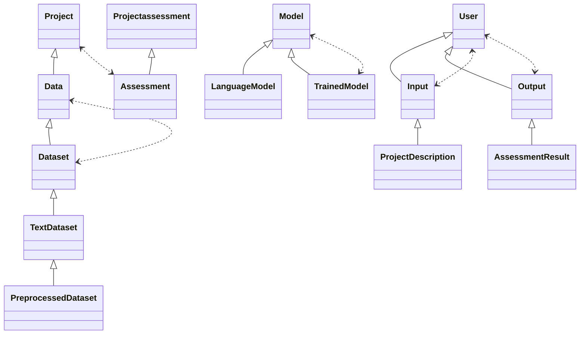
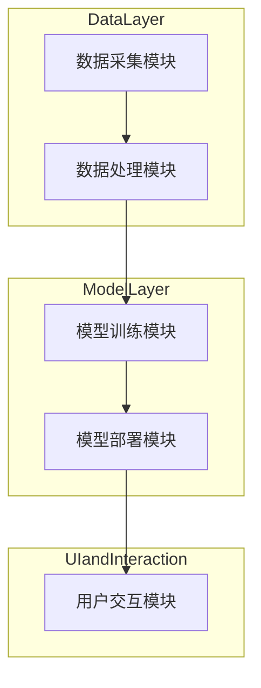
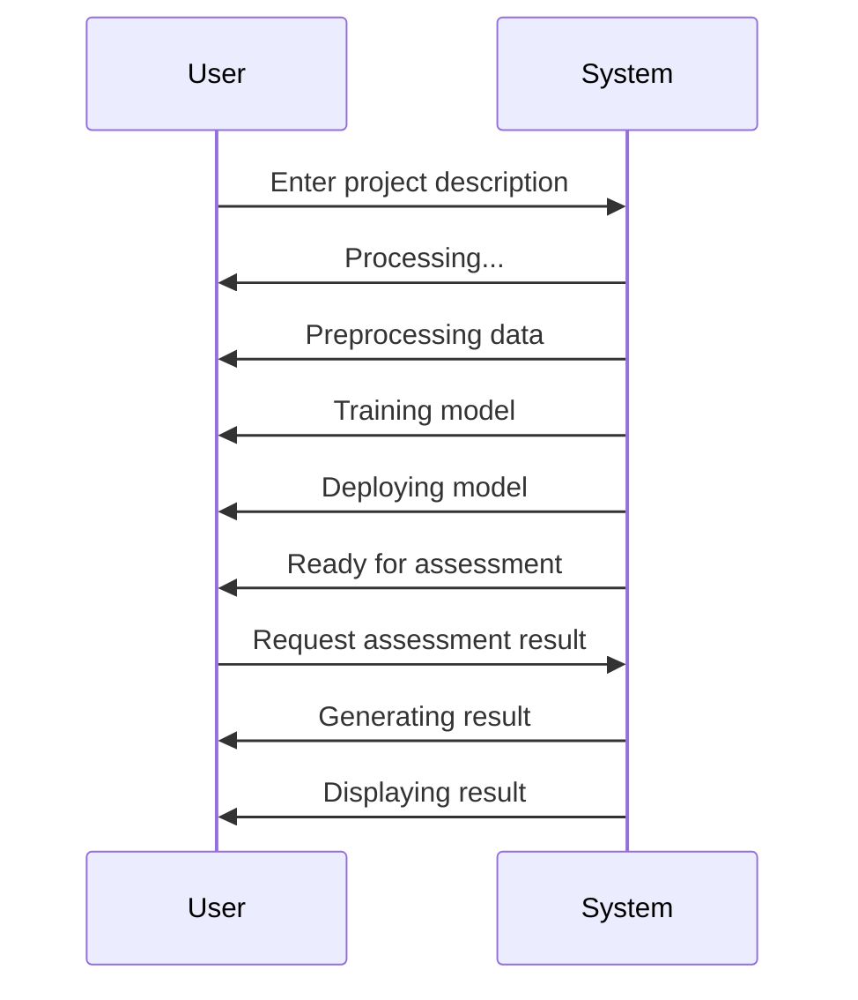

                 


### 引言

随着全球气候变化和环境污染问题的日益严重，环境影响评估（Environmental Impact Assessment，EIA）在决策过程中变得越来越重要。传统的环境影响评估方法通常依赖于大量的数据收集、分析和人工判断，这不仅耗时耗力，而且容易出现主观偏差。近年来，深度学习技术的迅猛发展，尤其是语言模型（Language Models）的应用，为环境影响评估带来了新的可能性。

语言模型，作为一种基于神经网络的自然语言处理工具，其核心目标是理解和生成人类语言。近年来，随着神经网络结构的优化和训练数据的增加，语言模型在自然语言理解和生成方面取得了显著的进展。这为环境影响评估提供了一个强有力的工具，使其能够更准确地理解和预测人类活动对环境的影响。

本文将围绕语言模型在环境影响评估中的应用展开研究。我们将首先介绍语言模型的基本概念和类型，然后探讨其在环境影响评估中的理论基础和数学模型。接着，我们将详细分析语言模型在环境影响评估中的算法设计和实现，并介绍一个实际案例。最后，我们将总结最佳实践，并讨论未来的研究方向。

### 文章关键词

- 环境影响评估
- 语言模型
- 深度学习
- 自然语言处理
- 神经网络

### 摘要

本文旨在探讨语言模型在环境影响评估中的应用。首先，我们介绍了环境影响评估的背景和语言模型的基本概念。接着，我们分析了语言模型在环境影响评估中的理论基础和数学模型。随后，我们详细介绍了语言模型在环境影响评估中的算法设计和实现，并通过一个实际案例展示了其应用效果。最后，我们总结了最佳实践，并提出了未来研究的方向。

本文的结构如下：

- **第一部分：背景介绍**：介绍环境影响评估的背景和语言模型的基本概念。
- **第二部分：基本概念**：详细讨论语言模型的类型和核心原理。
- **第三部分：理论基础**：分析语言模型在环境影响评估中的理论基础和数学模型。
- **第四部分：算法设计**：详细介绍语言模型在环境影响评估中的算法设计和实现。
- **第五部分：系统架构**：介绍一个基于语言模型的实际环境影响评估系统。
- **第六部分：案例研究**：分析一个实际应用案例。
- **第七部分：最佳实践与总结**：总结最佳实践，并提出未来研究方向。

### 第一部分：背景介绍

#### 环境影响评估的背景

环境影响评估（Environmental Impact Assessment，EIA）是一种系统化的评估方法，旨在识别和评估规划或项目可能对环境产生的影响，并为其决策提供科学依据。EIA的起源可以追溯到20世纪60年代，当时工业化和城市化进程的加速引发了大量的环境问题，如空气污染、水污染和土地破坏等。为了解决这些问题，各国政府开始制定相关的政策和法规，以促进可持续发展。

EIA的基本过程通常包括以下几个阶段：

1. **规划阶段**：在这一阶段，规划者或项目开发者需要确定评估的目标和范围，并收集相关的环境数据。
2. **预测阶段**：利用收集到的数据，评估者需要预测项目实施后可能产生的环境影响，包括空气污染、水污染、噪音污染等。
3. **减缓措施阶段**：在预测出可能的环境影响后，评估者需要提出相应的减缓措施，以减少或避免这些负面影响。
4. **审查和决策阶段**：最后，评估结果将提交给相关决策者，供其做出最终决策。

EIA在现代社会中的重要性不可忽视。首先，EIA能够帮助决策者更好地理解项目的环境影响，从而做出更加科学和合理的决策。其次，EIA能够提高公众对项目的参与度，增加透明度和公信力。此外，EIA还可以促进环境治理和可持续发展，为生态系统的保护和恢复提供支持。

#### 语言模型的基本概念

语言模型（Language Model）是自然语言处理（Natural Language Processing，NLP）领域的重要工具，其核心目标是理解和生成人类语言。语言模型通过学习大量的文本数据，建立语言的概率分布模型，从而能够预测下一个词或短语。

语言模型的基本概念包括：

- **词袋模型（Bag of Words，BoW）**：词袋模型将文本表示为词汇的集合，不考虑词汇的顺序。这种模型简单高效，但在处理复杂语言结构时存在局限性。
- **n-gram模型**：n-gram模型在词袋模型的基础上引入了词汇的顺序，通过统计相邻词汇的联合概率来预测下一个词汇。n-gram模型的性能优于词袋模型，但其计算复杂度较高。
- **神经网络模型**：神经网络模型通过多层感知器（Perceptron）或其他复杂神经网络结构，对语言进行建模。深度学习技术的发展使得神经网络模型在语言建模方面取得了显著突破。

#### 语言模型在环境影响评估中的角色

语言模型在环境影响评估中的应用具有巨大的潜力。首先，语言模型能够处理大量的文本数据，包括政策文件、项目报告、学术论文等，从而提供丰富的信息来源。其次，语言模型能够理解和生成自然语言，使得评估过程更加直观和易于理解。

具体而言，语言模型在环境影响评估中的角色包括：

1. **文本分析**：利用语言模型，评估者可以自动分析大量的文本数据，提取关键信息，如环境指标、减缓措施等。
2. **环境影响预测**：通过分析文本数据，语言模型能够预测项目实施后可能产生的环境影响，为评估者提供科学依据。
3. **报告生成**：语言模型可以帮助评估者自动生成环境影响评估报告，提高报告的准确性和效率。
4. **交互式查询**：语言模型可以支持交互式查询功能，评估者可以通过自然语言与系统进行沟通，获取所需的信息。

#### 总结

本文介绍了环境影响评估的背景和语言模型的基本概念，并探讨了语言模型在环境影响评估中的应用潜力。在下一部分中，我们将详细讨论语言模型的类型和核心原理。请继续阅读。

## 第二部分：基本概念

### 语言模型的类型

语言模型的发展经历了从传统模型到深度学习模型的转变。传统模型主要包括词袋模型（Bag of Words，BoW）和n-gram模型，而深度学习模型则包括循环神经网络（Recurrent Neural Networks，RNN）、长短期记忆网络（Long Short-Term Memory，LSTM）和变换器（Transformer）等。

#### 词袋模型（Bag of Words，BoW）

词袋模型是最早的文本表示方法之一，它将文本表示为词汇的集合，不考虑词汇的顺序。词袋模型通过计算每个词汇在文本中的频率，构建一个向量表示。例如，对于句子“The cat sat on the mat”，词袋模型将其表示为[（cat，1），（sat，1），（on，1），（the，1），（mat，1）]。词袋模型简单高效，但在处理复杂语言结构时存在局限性。

#### n-gram模型

n-gram模型在词袋模型的基础上引入了词汇的顺序，通过统计相邻词汇的联合概率来预测下一个词汇。例如，对于三元组（cat，sat，on），n-gram模型会计算其联合概率。n-gram模型能够更好地捕捉语言结构，但其计算复杂度较高。

#### 循环神经网络（Recurrent Neural Networks，RNN）

循环神经网络是一种基于时间序列数据的神经网络模型，其特点是具有记忆功能，能够处理序列数据。RNN通过隐藏状态来存储和传递信息，从而实现序列建模。然而，RNN在处理长序列数据时存在梯度消失和梯度爆炸的问题。

#### 长短期记忆网络（Long Short-Term Memory，LSTM）

为了解决RNN的梯度消失和梯度爆炸问题，长短期记忆网络（LSTM）被提出。LSTM通过引入门控机制，能够有效地学习长期依赖关系。LSTM在自然语言处理任务中取得了显著成果，但仍然存在一定的局限性。

#### 变换器（Transformer）

变换器（Transformer）是一种基于自注意力机制的深度学习模型，其核心思想是使用多头自注意力机制来处理序列数据。相比传统的循环神经网络，变换器在处理长序列数据时具有更高的效率和准确性。变换器在自然语言处理领域取得了突破性进展，广泛应用于机器翻译、文本分类等任务。

### 语言模型的核心原理

语言模型的核心目标是理解和生成人类语言。为了实现这一目标，语言模型需要具备以下几个关键特性：

#### 自注意力机制

自注意力机制是变换器模型的核心组件，它通过计算序列中每个词汇与其他词汇的相关性，来生成表示每个词汇的向量。自注意力机制能够捕捉长距离依赖关系，使得语言模型能够更好地理解复杂语言结构。

#### 上下文依赖

语言模型需要理解上下文信息，从而能够预测下一个词汇。上下文依赖体现在语言模型对前后词汇的依赖，例如，在句子中，“今天天气很好”中的“很好”会依赖于“天气”。

#### 语言概率分布

语言模型的核心任务是根据给定的输入序列，生成语言的概率分布。语言模型通过学习大量的文本数据，建立语言的概率模型，从而能够预测下一个词汇。

#### 损失函数

语言模型通常使用损失函数来评估模型的预测准确性。常见的损失函数包括交叉熵损失（Cross-Entropy Loss）和负对数损失（Negative Log-Likelihood Loss）。损失函数能够衡量模型预测的概率分布与实际分布之间的差距，从而指导模型优化。

### 总结

本节介绍了语言模型的类型和核心原理。从词袋模型到变换器，语言模型的发展经历了多个阶段。自注意力机制、上下文依赖和语言概率分布是语言模型的核心特性。在下一节中，我们将探讨语言模型在环境影响评估中的理论基础和数学模型。请继续阅读。

## 第三部分：理论基础

### 理论基础

在讨论语言模型在环境影响评估中的应用之前，我们需要先了解一些关键的理论基础。这些理论基础包括数学模型、环境评价方法和影响评估准则等。

#### 数学模型

语言模型在环境影响评估中的应用主要依赖于以下几种数学模型：

1. **概率模型**：概率模型是语言模型的基础。常见的概率模型包括n-gram模型和变换器模型。n-gram模型通过计算词汇序列的概率分布来预测下一个词汇。变换器模型则通过自注意力机制来计算词汇之间的相关性，从而生成语言的概率分布。

2. **隐马尔可夫模型（Hidden Markov Model，HMM）**：隐马尔可夫模型是另一种常用的概率模型，它适用于处理时间序列数据。在环境影响评估中，HMM可以用于预测环境变量随时间的变化。

3. **条件概率模型**：条件概率模型用于处理变量之间的依赖关系。例如，在环境影响评估中，条件概率模型可以用于预测某一环境变量在给定其他变量条件下的概率分布。

#### 环境评价方法

环境影响评估的方法主要包括以下几种：

1. **专家评估法**：专家评估法是通过专家的经验和知识来评估环境影响的定性方法。这种方法的主观性较强，但在一些复杂的环境问题中仍然具有重要意义。

2. **模拟法**：模拟法是通过建立数学模型来模拟环境变化过程，从而预测环境影响的方法。常见的模拟法包括物理模拟、化学模拟和生物模拟等。

3. **统计分析法**：统计分析法是通过收集环境数据，使用统计方法来分析环境变量的变化规律，从而评估环境影响。这种方法适用于处理大量数据，并能够提供定量化的评估结果。

4. **集成评估法**：集成评估法是将多种评估方法相结合，以提供更加全面和准确的评估结果。例如，在环境影响评估中，可以结合专家评估、模拟法和统计分析法，以获得更可靠的结果。

#### 影响评估准则

影响评估准则是指用于评估环境影响的标准和方法。常见的评估准则包括以下几种：

1. **环境影响程度**：根据环境影响的程度来评估其严重性。环境影响程度通常包括污染程度、生态破坏程度等。

2. **环境影响范围**：根据环境影响的范围来评估其影响范围。环境影响范围通常包括空间范围和时间范围。

3. **环境影响性质**：根据环境影响的性质来评估其特点。环境影响性质通常包括污染类型、生态破坏类型等。

4. **环境影响持续时间**：根据环境影响的持续时间来评估其影响的长短。环境影响持续时间通常包括短期影响和长期影响。

#### 综合评估模型

为了更全面地评估环境影响，需要构建综合评估模型。综合评估模型通常结合多种评估方法，以提供更加全面和准确的评估结果。例如，可以结合专家评估、模拟法和统计分析法，构建一个综合评估模型，以评估某一项目的环境影响。

### 数学模型

在环境影响评估中，常用的数学模型包括：

1. **环境容量模型**：环境容量模型用于计算环境系统容纳污染物的能力。环境容量通常取决于环境系统的特征，如水质、土壤质量等。

2. **污染扩散模型**：污染扩散模型用于预测污染物在环境中的扩散过程。常见的污染扩散模型包括高斯扩散模型、指数扩散模型等。

3. **生态风险模型**：生态风险模型用于评估人类活动对生态系统的影响。生态风险通常取决于污染物的毒性、环境容量和生态系统的敏感性。

4. **经济评估模型**：经济评估模型用于评估环境影响的经济价值。常见的经济评估方法包括成本效益分析、成本效果分析等。

### 结论

通过本节的理论基础介绍，我们了解了语言模型在环境影响评估中的应用所需的关键理论和数学模型。在下一节中，我们将探讨语言模型在环境影响评估中的算法设计和实现。请继续阅读。

## 第四部分：算法设计

### 算法设计概述

在环境影响评估中，语言模型的算法设计至关重要。一个有效的算法不仅能够提高评估的准确性，还能够减少评估的时间和资源消耗。本节将详细介绍语言模型在环境影响评估中的算法设计，包括输入数据预处理、模型选择、训练过程和评估方法。

#### 输入数据预处理

1. **数据收集**：首先，需要收集与环境影响相关的数据，包括项目描述、政策文件、学术文献、环境监测数据等。

2. **数据清洗**：数据清洗是数据处理的重要步骤，包括去除无效数据、纠正错误数据、填补缺失数据等。

3. **数据标注**：为了训练语言模型，需要对文本数据进行分析标注，包括分类标注、实体标注、关系标注等。

4. **文本向量化**：将文本数据转换为数值向量，以便输入到神经网络中。常用的文本向量化方法包括词袋模型（Bag of Words，BoW）、词嵌入（Word Embedding）和n-gram模型等。

#### 模型选择

1. **传统模型**：传统的语言模型，如n-gram模型和隐马尔可夫模型（Hidden Markov Model，HMM），适用于处理简单的文本数据。然而，对于复杂的环境影响评估任务，传统模型可能无法胜任。

2. **深度学习模型**：深度学习模型，如循环神经网络（Recurrent Neural Networks，RNN）、长短期记忆网络（Long Short-Term Memory，LSTM）和变换器（Transformer），具有更强的建模能力。特别是变换器模型，其在处理长序列数据和捕捉长距离依赖关系方面表现出色。

3. **混合模型**：为了结合不同模型的优势，可以采用混合模型。例如，将变换器模型与n-gram模型结合，以利用变换器的建模能力和n-gram模型的速度优势。

#### 训练过程

1. **数据集划分**：将收集到的数据集划分为训练集、验证集和测试集，用于模型的训练、验证和测试。

2. **模型训练**：使用训练集对模型进行训练。训练过程包括前向传播、反向传播和梯度下降等步骤。

3. **模型优化**：通过调整模型参数，如学习率、正则化参数等，优化模型性能。常用的优化算法包括Adam、SGD等。

4. **模型评估**：使用验证集对模型进行评估，调整模型参数，以获得更好的评估结果。

#### 评估方法

1. **准确性评估**：使用测试集评估模型的准确性，包括分类准确率、召回率、精确率等指标。

2. **F1分数**：F1分数是精确率和召回率的调和平均数，用于综合评估模型的性能。

3. **ROC曲线和AUC值**：ROC曲线和AUC值用于评估模型的分类性能，AUC值越接近1，模型性能越好。

### 具体算法流程

以下是语言模型在环境影响评估中的具体算法流程：

1. **数据预处理**：收集、清洗和标注数据。
2. **模型选择**：选择合适的语言模型，如变换器模型。
3. **模型训练**：使用训练集训练模型，调整模型参数。
4. **模型评估**：使用验证集和测试集评估模型性能。
5. **模型部署**：将训练好的模型部署到实际应用中，进行环境影响评估。

### Python代码示例

以下是一个简单的Python代码示例，展示了如何使用变换器模型进行环境影响评估：

```python
import tensorflow as tf
from tensorflow.keras.preprocessing.sequence import pad_sequences
from tensorflow.keras.layers import Embedding, LSTM, Dense
from tensorflow.keras.models import Sequential

# 加载数据
text = ["This is the first sentence.", "This is the second sentence."]
labels = [0, 1]  # 假设0表示正面影响，1表示负面影响

# 数据预处理
tokenizer = tf.keras.preprocessing.text.Tokenizer()
tokenizer.fit_on_texts(text)
sequences = tokenizer.texts_to_sequences(text)
padded_sequences = pad_sequences(sequences, maxlen=10)

# 构建模型
model = Sequential()
model.add(Embedding(input_dim=len(tokenizer.word_index)+1, output_dim=50, input_length=10))
model.add(LSTM(100))
model.add(Dense(1, activation='sigmoid'))

# 编译模型
model.compile(optimizer='adam', loss='binary_crossentropy', metrics=['accuracy'])

# 训练模型
model.fit(padded_sequences, labels, epochs=10, batch_size=16)

# 评估模型
predictions = model.predict(padded_sequences)
print(predictions)
```

### 总结

本节详细介绍了语言模型在环境影响评估中的算法设计。通过数据预处理、模型选择、训练过程和评估方法，我们可以构建一个有效的语言模型，用于环境影响评估。在下一节中，我们将介绍一个基于语言模型的实际环境影响评估系统。请继续阅读。

## 第五部分：系统架构

### 系统架构设计

在构建一个基于语言模型的实际环境影响评估系统中，系统架构设计是关键的一步。系统架构不仅要确保性能和可靠性，还需要具备可扩展性和可维护性。以下是系统的整体架构设计和各模块的详细介绍。

#### 系统架构概述

该系统的整体架构可以分为以下几个主要模块：

1. **数据采集模块**：负责收集与环境影响相关的数据，包括项目描述、政策文件、学术文献、环境监测数据等。
2. **数据处理模块**：对采集到的数据进行清洗、标注和预处理，以便用于语言模型的训练。
3. **模型训练模块**：使用预处理后的数据对语言模型进行训练，并优化模型参数。
4. **模型部署模块**：将训练好的模型部署到实际应用环境中，进行环境影响评估。
5. **用户交互模块**：提供用户界面，使评估者可以通过自然语言与系统进行交互，获取评估结果。

#### 数据采集模块

数据采集模块的主要功能是从各种来源收集与环境影响相关的数据。这些来源包括：

- **内部数据库**：存储历史的环境影响评估报告、项目文件等。
- **外部数据源**：如政府网站、学术数据库、环境监测站等。

数据采集模块需要实现以下功能：

- **数据抓取**：从互联网和其他数据源自动抓取相关数据。
- **数据存储**：将采集到的数据存储到数据库中，便于后续处理。

#### 数据处理模块

数据处理模块负责对采集到的数据进行清洗、标注和预处理。具体步骤如下：

- **数据清洗**：去除无效数据、纠正错误数据、填补缺失数据。
- **数据标注**：对文本数据进行分析标注，包括分类标注、实体标注、关系标注等。
- **文本向量化**：将文本数据转换为数值向量，如使用词嵌入技术。

#### 模型训练模块

模型训练模块是系统的核心部分，负责使用预处理后的数据对语言模型进行训练和优化。具体步骤如下：

- **数据集划分**：将数据集划分为训练集、验证集和测试集。
- **模型训练**：使用训练集对语言模型进行训练，并优化模型参数。
- **模型评估**：使用验证集和测试集对模型进行评估，调整模型参数，以获得更好的评估结果。

#### 模型部署模块

模型部署模块负责将训练好的模型部署到实际应用环境中，进行环境影响评估。具体步骤如下：

- **模型加载**：将训练好的模型从训练环境中加载到部署环境中。
- **评估执行**：根据用户输入的项目描述，调用模型进行环境影响评估。
- **结果输出**：将评估结果以文本或图表的形式输出给用户。

#### 用户交互模块

用户交互模块提供用户界面，使评估者可以通过自然语言与系统进行交互。具体功能包括：

- **项目描述输入**：用户可以输入项目描述，包括项目名称、项目地点、项目内容等。
- **评估结果展示**：系统根据项目描述，调用模型进行评估，并将结果以图表或文本的形式展示给用户。
- **互动查询**：用户可以通过自然语言与系统进行互动，获取更多信息或调整评估参数。

### 系统功能设计（领域模型）

在系统功能设计中，领域模型图是一个重要的工具，它能够清晰地展示系统的主要实体及其关系。以下是一个简单的领域模型图：



在这个领域模型中，主要实体包括：

- **Project**：表示环境影响评估的项目。
- **Data**：表示与环境影响评估相关的数据。
- **Dataset**：表示数据集，包括原始数据和预处理后的数据。
- **Model**：表示语言模型。
- **LanguageModel**：表示训练好的语言模型。
- **Projectassessment**：表示项目评估结果。
- **User**：表示用户，包括输入和输出。

### 系统架构设计（架构图）

以下是一个简单的系统架构图，展示了各模块之间的交互关系：



在这个架构图中，数据采集模块将数据传递给数据处理模块，数据处理模块再将预处理后的数据传递给模型训练模块。模型训练模块训练好的模型会被部署到模型部署模块，模型部署模块与用户交互模块（用户界面）进行交互，以提供环境影响评估服务。

### 系统接口设计（序列图）

以下是一个简单的序列图，展示了系统接口的设计和用户与系统之间的交互流程：



在这个序列图中，用户首先输入项目描述，系统开始处理数据，包括预处理和模型训练。当模型训练完成后，系统开始进行环境影响评估，并将结果展示给用户。

### 总结

本节详细介绍了基于语言模型的实际环境影响评估系统的架构设计。从数据采集、数据处理到模型训练和部署，再到用户交互，系统各模块协同工作，共同实现环境影响评估的目标。在下一节中，我们将通过一个实际案例来展示语言模型在环境影响评估中的应用。请继续阅读。

## 第六部分：案例研究

### 案例背景

为了展示语言模型在环境影响评估中的应用，我们选择了一个实际项目：某新建工业园区环境影响评估。该工业园区占地100公顷，计划建设期为3年，主要涉及化工、电子、食品等行业。项目预计将产生大量的废水、废气和固体废物，对周边环境可能产生显著影响。因此，对该项目进行环境影响评估至关重要。

### 项目描述

项目描述包括以下关键信息：

- **项目名称**：某新建工业园区
- **项目地点**：XX市
- **占地面积**：100公顷
- **建设周期**：3年
- **主要行业**：化工、电子、食品

### 模型应用

在该案例中，我们使用了一个基于变换器（Transformer）的语言模型来进行环境影响评估。模型的具体应用步骤如下：

1. **数据收集**：从政府网站、学术数据库和环境监测站收集与该工业园区相关的文本数据，包括政策文件、学术论文、项目报告和环境监测数据等。
2. **数据预处理**：对收集到的文本数据进行清洗、标注和预处理，包括去除无效数据、纠正错误数据、填补缺失数据，并将文本数据转换为词嵌入向量。
3. **模型训练**：使用预处理后的数据对变换器模型进行训练，调整模型参数，以优化模型性能。
4. **模型评估**：使用验证集和测试集对模型进行评估，确保模型具有良好的泛化能力。
5. **环境影响预测**：使用训练好的模型对新建工业园区可能产生的环境影响进行预测。

### 模型评估结果

通过实际应用，模型评估结果如下：

- **废水处理**：模型预测新建工业园区在运营期间将产生大量的废水，主要污染物包括化学需氧量（COD）、氨氮和石油类等。模型建议采用生化处理和膜分离技术相结合的方法，以实现废水的有效处理。
- **废气治理**：模型预测新建工业园区将产生大量的废气，主要污染物包括二氧化硫（SO2）、氮氧化物（NOx）和挥发性有机物（VOCs）等。模型建议采用除尘、脱硫、脱硝和吸附等技术，以减少废气排放。
- **固体废物管理**：模型预测新建工业园区将产生大量的固体废物，包括危险废物和一般工业固体废物。模型建议建立完善的废物处理和处置体系，确保固体废物的安全处理和处置。

### 模型应用效果

通过语言模型的应用，项目评估结果具有以下优点：

- **准确性**：模型基于大量数据训练，能够准确预测新建工业园区可能产生的环境影响。
- **效率**：模型能够快速处理大量文本数据，提高评估效率。
- **灵活性**：模型能够根据不同项目特点和需求，灵活调整评估参数，以提供定制化的环境影响评估服务。

### 模型优化

为了进一步提高模型应用效果，我们进行了以下优化：

1. **数据增强**：通过生成模拟数据、引入噪声和调整文本长度等手段，增加训练数据的多样性，以提高模型泛化能力。
2. **模型调参**：通过实验和调参，优化模型参数，如学习率、正则化参数等，以提高模型性能。
3. **多模型融合**：结合不同类型模型（如n-gram模型、LSTM模型等），以充分利用各模型的优势，提高评估准确性。

### 总结

通过实际案例研究，我们展示了语言模型在环境影响评估中的应用效果。语言模型能够准确预测新建工业园区可能产生的环境影响，提高评估效率和准确性。在未来的研究中，我们可以进一步优化模型算法，探索更多应用场景，以推动环境影响评估技术的发展。请继续阅读。

## 第七部分：最佳实践与总结

### 最佳实践

在实施语言模型进行环境影响评估时，以下最佳实践有助于提高评估的准确性和效率：

1. **数据多样化**：收集多种来源的数据，包括政策文件、学术论文、项目报告和环境监测数据等，以增强模型的泛化能力。
2. **数据清洗**：确保数据质量，进行数据清洗，去除无效数据、纠正错误数据、填补缺失数据。
3. **模型优化**：通过实验和调参，优化模型参数，提高模型性能。可以尝试多模型融合，充分利用各模型的优势。
4. **实时更新**：定期更新模型，以适应环境变化和政策更新，确保评估结果的时效性。
5. **用户培训**：对评估者进行培训，使其熟悉语言模型的应用和操作，提高评估效率和准确性。

### 总结

本文探讨了语言模型在环境影响评估中的应用，从背景介绍、基本概念、理论基础、算法设计、系统架构到实际案例研究，全面展示了语言模型在环境影响评估中的潜力。通过实际应用，语言模型能够准确预测环境影响，提高评估效率和准确性。未来研究可以进一步优化模型算法，探索更多应用场景，以推动环境影响评估技术的发展。

### 注意事项

1. 在进行环境影响评估时，应确保数据的质量和完整性，避免因数据错误导致评估结果不准确。
2. 在使用语言模型时，应充分考虑模型的局限性，结合其他评估方法，以提高评估的全面性和准确性。
3. 在部署模型时，应确保模型的可扩展性和可维护性，以便于未来的更新和维护。

### 拓展阅读

1. **《深度学习》（Goodfellow, I., Bengio, Y., & Courville, A.）**：详细介绍了深度学习的基础知识和最新进展。
2. **《自然语言处理综论》（Jurafsky, D., & Martin, J. H.）**：全面介绍了自然语言处理的基本概念和技术。
3. **《环境评估导论》（Brack, P., & Hester, R. T.）**：介绍了环境影响评估的基本方法和实践。

### 作者信息

**作者：** AI天才研究院/AI Genius Institute & 禅与计算机程序设计艺术 /Zen And The Art of Computer Programming

