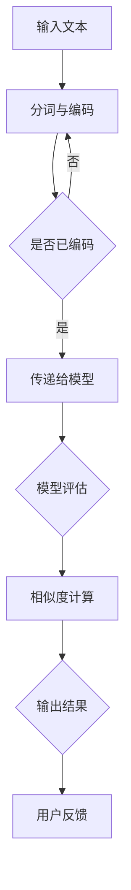
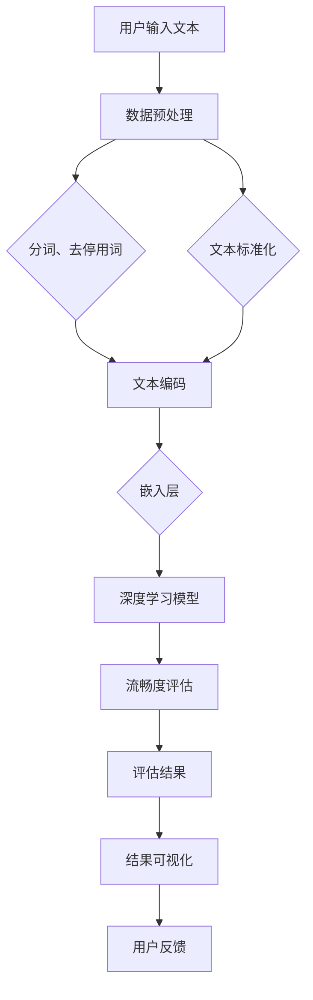
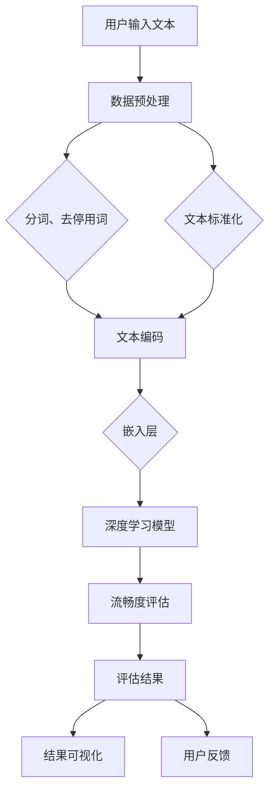
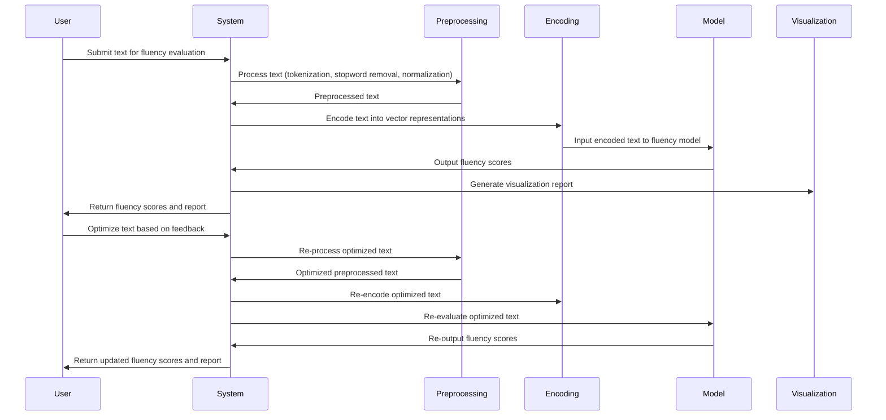

                 

### 引言与背景

在当今的科技飞速发展的时代，自然语言处理（NLP）技术已经取得了显著的进步。其中，语言生成模型（Language Generation Model，简称LGM）尤其是大型语言模型（Large Language Model，简称LLM）的研究与应用，成为了人工智能（AI）领域的重要热点。语言生成模型能够通过输入特定的种子文本，生成连贯且具有逻辑性的自然语言文本。然而，在实际应用中，如何评估这些语言生成模型的输出流畅度，成为了亟待解决的问题。

#### 语言生成的连贯性

语言生成的连贯性指的是生成的文本在语义、语法和语用上的连贯性和一致性。一个优秀的语言生成模型，不仅需要能够生成语义上正确、语法上无错误的文本，更需要生成的文本具有流畅自然的语感和逻辑性。流畅度是衡量语言生成质量的重要指标，它直接关系到用户体验。如果生成的文本不流畅，容易出现语义错误、语法混乱或逻辑不通的情况，这将严重影响用户对模型和应用的信任度。

#### 评估的重要性

评估LLM输出的流畅度具有以下重要意义：

1. **提高模型质量**：通过流畅度评估，可以发现并改进模型中的问题，从而提高生成文本的质量。
2. **用户体验**：流畅的生成文本能够提升用户的使用体验，使AI应用更具吸引力。
3. **应用领域拓展**：流畅度评估有助于LLM在不同领域（如对话系统、文本生成、内容创作等）中的应用和推广。

#### 研究意义与目标

本文的研究意义在于探索和提出一套有效的评估方法，以衡量LLM输出的流畅度。具体目标包括：

- **定义流畅度评估指标**：明确流畅度的定义，并设计合适的评价指标。
- **提出评估方法**：结合文本相似度、语言规则和深度学习等技术，提出有效的流畅度评估方法。
- **实现评估系统**：基于上述方法，设计和实现一套流畅度评估系统，以实现对LLM输出流畅度的自动化评估。

通过本文的研究，希望能够为LLM的流畅度评估提供理论依据和实用工具，推动NLP技术的发展与应用。

### 语言生成模型与LLM

#### 语言生成模型的基本原理

语言生成模型是一种能够根据输入文本生成自然语言文本的模型。其基本原理是通过学习大量文本数据，构建语言模型，从而预测下一个单词或句子的概率分布。常见的语言生成模型包括基于统计的模型（如N-gram模型）、基于神经网络的模型（如循环神经网络RNN）和基于注意力机制的模型（如Transformer）。这些模型通过不同的方法处理输入文本，最终生成连贯的自然语言输出。

#### LLM的优势与挑战

LLM，即大型语言模型，是一种规模庞大、参数众多的语言模型。其优势主要体现在以下几个方面：

1. **强大的文本理解能力**：由于训练数据量大，LLM能够更好地理解复杂语境和细微语义，从而生成更自然的文本。
2. **多任务学习能力**：LLM可以同时处理多个任务，如问答、对话生成、文本摘要等，大大提高了模型的灵活性和实用性。
3. **高度的可扩展性**：LLM能够轻松地应用于各种不同领域，只需进行少量定制化调整。

然而，LLM也面临一些挑战：

1. **计算资源需求**：由于模型规模巨大，训练和推理过程需要大量的计算资源和时间，这对硬件设备提出了较高的要求。
2. **数据隐私问题**：LLM的训练过程需要使用大量数据，这涉及到数据隐私和版权等问题，如何平衡模型性能和数据隐私成为一大难题。
3. **模型解释性**：LLM的内部机制复杂，难以直接理解和解释，这对于提高模型的可解释性和透明度提出了挑战。

#### LLM在语言生成中的应用

LLM在语言生成中具有广泛的应用，包括但不限于以下几个方面：

1. **自动问答系统**：通过将用户的问题输入到LLM中，系统可以自动生成相关问题的答案。
2. **对话生成**：LLM可以用于构建智能对话系统，如虚拟助手、聊天机器人等，能够与用户进行自然、流畅的对话。
3. **文本摘要和生成**：LLM可以自动生成长文本的摘要，或将简短的提示扩展成完整的文章。
4. **内容创作**：LLM可以用于创作诗歌、故事、文章等，为内容创作者提供灵感和辅助。

LLM在语言生成中的应用，不仅提升了生成文本的质量，也为人工智能的发展带来了新的机遇和挑战。

### 边界与外延

#### 评估范围的界定

在评估LLM输出的流畅度时，我们需要明确评估的范围。这包括以下几个主要方面：

1. **文本类型**：评估应涵盖不同类型的文本，如新闻、文章、对话、命令等，以全面衡量LLM在多种文本情境下的流畅度。
2. **文本长度**：评估应考虑不同长度的文本，从简短的句子到长篇的段落，以测试LLM在不同文本长度下的流畅度表现。
3. **语境复杂度**：评估应涵盖简单和复杂的语境，包括常见的日常对话、专业领域文本和高度抽象的文本，以全面评估LLM的处理能力。

#### 输出流畅度的定义

输出流畅度是指生成的文本在语义、语法和语用上的连贯性和一致性。具体来说，流畅度包括以下几个方面的评估指标：

1. **语义连贯性**：生成的文本是否能够在语义上保持一致，避免逻辑错误或矛盾。
2. **语法正确性**：生成的文本是否遵循语法规则，避免语法错误或不规范的句子结构。
3. **语用恰当性**：生成的文本是否在语用上得体、符合情境，避免使用不当或突兀的语言表达。

#### 评估指标的选择

为了准确评估LLM输出的流畅度，我们需要选择合适的评估指标。以下是一些常用的评估指标：

1. **BLEU（双语评价单元）**：BLEU是一种常用的自动评估指标，通过比较生成的文本和参考文本的相似度来评估生成文本的质量。尽管BLEU在评估翻译质量方面表现出色，但在评估流畅度时存在一定的局限性。
2. **ROUGE（Recall-Oriented Understudy for Gisting Evaluation）**：ROUGE是一种基于字符串匹配的评估指标，主要用于评估文本摘要的质量。它可以衡量生成文本中与参考文本的匹配程度，从而间接反映流畅度。
3. **自然语言处理指标**：如F1分数、准确率、召回率等，这些指标可以用于评估生成文本的语法和语义质量，从而辅助判断流畅度。
4. **用户主观评价**：通过用户问卷调查或访谈，收集用户对生成文本流畅度的主观评价，这是一种定性评估方法，能够提供更为直观的流畅度感知。

#### 关键技术点对比

为了实现流畅度评估，我们需要对比和分析不同技术点，选择最适合的评估方法。以下是一些关键技术点的对比：

1. **基于文本相似度的方法**：这类方法主要通过计算生成文本与参考文本的相似度来评估流畅度。优点是计算简单，但可能忽略了语义和语法层面的细节。
2. **基于语言规则的方法**：这类方法通过分析语言规则，判断生成文本是否符合语法和语义规范。优点是能够较为准确地识别语法错误和语义问题，但规则库的构建和维护较为复杂。
3. **基于深度学习的方法**：这类方法利用神经网络模型，从大规模数据中学习生成文本的流畅度特征。优点是能够处理复杂和非线性关系，但需要大量的计算资源和数据。

通过明确评估范围、定义流畅度以及选择合适的评估指标和技术，我们可以更科学、全面地评估LLM输出的流畅度，从而为模型的改进和应用提供有力支持。

### 核心概念与联系

为了深入探讨语言生成模型的流畅度评估，我们需要了解相关核心概念及其相互关系。这些核心概念包括流畅度评估方法、关键技术点和算法架构。

#### 流畅度评估方法

流畅度评估方法可以分为三类：基于文本相似度、基于语言规则和基于深度学习的方法。

1. **基于文本相似度的方法**：这类方法通过计算生成文本与参考文本之间的相似度来评估流畅度。常用的相似度计算算法包括余弦相似度、Jaccard相似度和编辑距离。例如，余弦相似度通过计算两个文本向量的夹角余弦值，判断其相似程度。这种方法的优点是计算简单、高效，但可能忽略了语义和语法层面的细节。

2. **基于语言规则的方法**：这类方法通过分析语言规则，判断生成文本是否符合语法和语义规范。常见的语言规则包括词法规则、句法规则和语义规则。例如，句法规则可以检查生成文本中主语、谓语和宾语是否一致，词法规则可以检查单词的拼写和形式是否正确。这种方法的优点是能够较为准确地识别语法错误和语义问题，但规则库的构建和维护较为复杂。

3. **基于深度学习的方法**：这类方法利用神经网络模型，从大规模数据中学习生成文本的流畅度特征。常见的深度学习模型包括循环神经网络（RNN）、长短时记忆网络（LSTM）和Transformer等。例如，Transformer模型通过自注意力机制，能够捕捉文本中的长距离依赖关系。这种方法的优点是能够处理复杂和非线性关系，但需要大量的计算资源和数据。

#### 关键技术点对比

不同流畅度评估方法之间存在显著差异，主要体现在以下方面：

1. **计算复杂度**：基于文本相似度的方法计算简单，但基于语言规则和深度学习的方法需要更多的计算资源。

2. **评估精度**：基于语言规则的方法能够较为准确地识别语法和语义错误，但可能无法处理复杂的语境和语境变化。深度学习模型能够处理复杂的非线性关系，但依赖于大量训练数据。

3. **可解释性**：基于语言规则的方法具有较高的可解释性，因为其规则明确且易于理解。深度学习模型的可解释性较低，因为其内部机制复杂，难以直接解释。

4. **适用场景**：基于文本相似度的方法适用于简单的文本评估，基于语言规则的方法适用于需要精确语法和语义检查的场景，而深度学习模型适用于复杂和动态的语境。

#### 算法架构介绍

为了实现对LLM输出流畅度的评估，我们可以设计一个多层次的算法架构，包括数据预处理、评估模型设计和评估结果分析等模块。

1. **数据预处理模块**：该模块负责处理和清洗输入文本数据，包括去除无关信息、标准化文本格式和分词等操作。数据预处理是流畅度评估的基础，直接影响评估结果的准确性。

2. **评估模型设计模块**：该模块根据选定的评估方法，设计相应的评估模型。例如，如果选择基于文本相似度的方法，可以设计一个相似度计算模型；如果选择基于深度学习的方法，可以设计一个神经网络模型。评估模型的设计需要考虑计算效率和评估精度。

3. **评估结果分析模块**：该模块负责分析评估结果，生成可视化报告和关键指标。通过分析评估结果，可以识别生成文本中的问题，并提出改进建议。

#### ER实体关系图架构

为了更好地理解和描述流畅度评估的相关实体和关系，我们可以使用ER（Entity-Relationship）实体关系图进行表示。

1. **实体**：包括文本数据、评估模型、评估结果等。文本数据是输入实体，评估模型是处理实体的工具，评估结果是评估过程的结果。

2. **关系**：包括数据输入、模型评估和结果分析。数据输入表示文本数据输入到评估模型中，模型评估表示评估模型对文本数据进行处理并生成评估结果，结果分析表示对评估结果进行分析和可视化。

通过上述核心概念与联系的分析，我们可以构建一个全面的流畅度评估框架，为LLM输出的流畅度评估提供理论支持和实践指导。

### 语言生成模型原理

#### 语言模型基础

语言模型（Language Model，简称LM）是自然语言处理（NLP）领域中的基础组件，其主要任务是预测给定文本序列中下一个单词或符号的概率分布。语言模型可以分为两类：基于统计的模型和基于神经网络的模型。

1. **基于统计的模型**：这类模型通过分析大量文本数据，统计每个单词或短语的出现的频率，从而构建语言模型。典型的基于统计的模型包括N-gram模型，其基本原理是利用前N个单词的历史信息来预测下一个单词。例如，对于三元模型（N=3），给定文本序列“the quick brown fox”，模型将预测下一个单词为“jumps”的概率，基于“quick”和“brown”这两个已知单词的历史出现频率。

2. **基于神经网络的模型**：这类模型通过神经网络架构，如循环神经网络（RNN）、长短时记忆网络（LSTM）和门控循环单元（GRU）等，从数据中学习文本的内在规律。这些神经网络模型能够捕捉文本中的长期依赖关系，从而生成更自然、连贯的文本。例如，LSTM通过引入门控机制，能够有效地避免长序列中的梯度消失问题，从而提高模型的预测性能。

#### 语言模型训练过程

语言模型的训练过程主要包括数据预处理、模型构建、模型训练和模型评估等步骤。

1. **数据预处理**：数据预处理是语言模型训练的基础，包括文本清洗、分词、标记化等操作。文本清洗旨在去除无用信息，如HTML标签、停用词等；分词是将文本拆分成单词或短语的步骤；标记化是将文本转换为模型可以处理的形式，通常使用整数或向量表示。

2. **模型构建**：构建语言模型的过程包括定义模型架构、选择损失函数和优化算法等。基于统计的模型通常采用简单的计数和概率分布计算方法，而基于神经网络的模型则使用复杂的网络结构，如LSTM和Transformer等。

3. **模型训练**：模型训练是通过优化模型参数，使其能够更好地预测文本序列。在训练过程中，模型会不断调整参数，以最小化预测误差。常见的优化算法包括随机梯度下降（SGD）、Adam等。

4. **模型评估**：模型评估用于衡量模型在测试数据上的表现。常用的评估指标包括交叉熵损失、准确率、F1分数等。通过评估，我们可以判断模型是否已经收敛，是否需要进一步调整参数或数据。

#### 语言模型评价指标

语言模型的评价指标用于衡量模型的性能，包括以下几个方面：

1. **交叉熵（Cross-Entropy）**：交叉熵是衡量模型预测结果与实际结果之间差异的指标，计算公式为：
   $$ H(-p \log q) = -\sum_{i} p_i \log q_i $$
   其中，\( p \) 是真实分布，\( q \) 是模型预测的概率分布。交叉熵值越低，表示模型预测越准确。

2. **准确率（Accuracy）**：准确率是衡量模型预测正确率的指标，计算公式为：
   $$ \text{Accuracy} = \frac{\text{预测正确的样本数}}{\text{总样本数}} $$
   准确率越高，表示模型在整体上的表现越好。

3. **F1分数（F1 Score）**：F1分数是衡量分类模型精确率和召回率之间平衡的指标，计算公式为：
   $$ F1 = 2 \times \frac{Precision \times Recall}{Precision + Recall} $$
   其中，Precision是精确率，Recall是召回率。F1分数能够综合考虑模型的精确性和召回率，是评估语言模型性能的常用指标。

通过理解语言模型的这些基础知识和评价指标，我们可以更好地设计和优化语言生成模型，从而提高其生成文本的流畅度。

### LLM原理分析

#### 基本原理与架构

大型语言模型（Large Language Model，简称LLM）是当前自然语言处理（NLP）领域的重要研究方向，其基本原理和架构决定了其强大的文本理解和生成能力。LLM的核心思想是通过大规模数据预训练，使模型能够自动学习语言结构和语义，从而在多种任务中表现出色。

1. **大规模数据预训练**：LLM通过在大规模文本语料库上进行预训练，学习语言的基本规律和模式。预训练过程中，模型不断调整其内部参数，使其能够在海量数据中捕捉到语言的细微特征和结构。这种预训练方法使得LLM在遇到新的任务时，能够迅速适应并生成高质量的文本。

2. **多任务学习能力**：LLM设计的一个关键特点是其多任务学习能力。通过预训练，LLM不仅能够在文本生成任务中表现出色，还可以应用于问答系统、文本摘要、翻译等多个NLP任务。这种多任务学习能力极大地提升了LLM的实用性，使得它能够适应不同的应用场景。

3. **分布式计算架构**：为了处理庞大的模型参数和大规模数据，LLM通常采用分布式计算架构。分布式计算可以将模型训练任务分布在多个计算节点上，从而提高训练效率和性能。常见的分布式计算框架包括TensorFlow、PyTorch等，这些框架支持大规模模型的训练和部署。

#### 注意力机制与自注意力模型

注意力机制（Attention Mechanism）是LLM中的一个关键组件，它在处理长序列文本时能够有效地捕捉重要信息。注意力机制的基本原理是通过计算输入序列中每个元素对输出序列的贡献，从而实现序列的权重分配。

1. **多头注意力（Multi-Head Attention）**：多头注意力是Transformer模型的核心机制之一。它通过多个独立的注意力头，同时关注输入序列的不同部分，从而提高模型的表示能力。多头注意力的计算公式为：
   $$ 
   \text{Attention}(Q, K, V) = \text{softmax}\left(\frac{QK^T}{\sqrt{d_k}}\right)V
   $$
   其中，\( Q \)、\( K \) 和 \( V \) 分别是查询向量、键向量和值向量，\( d_k \) 是注意力头的维度。通过这种机制，模型能够自适应地关注输入序列中的重要信息，从而生成更高质量的文本。

2. **自注意力（Self-Attention）**：自注意力是多头注意力的一个特例，它在一个序列内部计算注意力权重。自注意力通过计算序列中每个元素之间的相似度，为每个元素分配不同的权重，从而增强模型的表示能力。自注意力的计算公式与多头注意力类似，只是 \( Q \)、\( K \) 和 \( V \) 都是同一个序列的表示。

#### Transformer模型详解

Transformer模型是LLM中的一种代表性架构，它彻底摒弃了传统的循环神经网络（RNN），采用完全基于注意力机制的架构。Transformer模型的主要组成部分包括：

1. **编码器（Encoder）**：编码器负责处理输入序列，生成编码表示。编码器由多个编码层组成，每层包含多头自注意力机制和前馈神经网络。编码器通过自注意力机制，能够捕捉输入序列中的长距离依赖关系。

2. **解码器（Decoder）**：解码器负责生成输出序列，通常由多个解码层组成。解码器的每个层包含一个掩码多头自注意力机制和一个常规多头自注意力机制，用于生成文本的每个单词。掩码多头自注意力机制确保解码器在生成每个单词时只能看到前面生成的单词，从而保证生成文本的连贯性。

3. **嵌入层（Embedding Layer）**：嵌入层负责将输入文本转换为向量表示。通常，每个单词都被映射为一个固定大小的向量，这些向量通过嵌入层进行初始化。

4. **位置编码（Positional Encoding）**：由于Transformer模型没有显式的序列信息，位置编码用于提供文本的位置信息。位置编码通常通过添加到嵌入层中的特殊向量实现。

通过这些组成部分，Transformer模型能够高效地处理长文本序列，生成高质量的输出文本。其自注意力机制和多任务学习能力，使得Transformer在NLP领域取得了显著的成果。

#### 语言生成流畅度评价方法

在评估语言生成模型的流畅度时，我们需要选择合适的评价指标和方法。这些方法可以分为以下几类：文本相似度方法、语言规则方法和深度学习方法。

1. **文本相似度方法**：

   - **基本概念**：文本相似度方法通过计算生成文本与参考文本之间的相似度来评估流畅度。相似度可以通过各种度量方法来衡量，如余弦相似度、Jaccard相似度和编辑距离。
   - **计算方法**：
     - 余弦相似度：计算生成文本和参考文本的向量表示的夹角余弦值，公式如下：
       $$ \text{Cosine Similarity} = \frac{\text{dot product of vectors}}{\text{product of magnitudes of vectors}} $$
     - Jaccard相似度：计算生成文本和参考文本的交集与并集的比值，公式如下：
       $$ \text{Jaccard Similarity} = \frac{|\text{Intersection of sets}|}{|\text{Union of sets}|} $$
     - 编辑距离：计算生成文本和参考文本之间的最小编辑次数，公式如下：
       $$ \text{Edit Distance} = \min(\text{insertions} + \text{deletions} + \text{substitutions}) $$
   - **优缺点**：文本相似度方法的优点是计算简单、效率高，但可能忽略语义和语法层面的细节。

2. **语言规则方法**：

   - **基本概念**：语言规则方法通过分析语言规则，判断生成文本是否符合语法和语义规范。常见的语言规则包括词法规则、句法规则和语义规则。
   - **计算方法**：
     - 词法规则：检查单词的拼写和形式是否正确。
     - 句法规则：检查句子的结构是否符合语法规范，如主谓一致、时态一致性等。
     - 语义规则：检查句子的语义是否一致，逻辑是否通顺。
   - **优缺点**：语言规则方法的优点是能够较为准确地识别语法和语义错误，但规则库的构建和维护较为复杂。

3. **深度学习方法**：

   - **基本概念**：深度学习方法利用神经网络模型，从大规模数据中学习生成文本的流畅度特征。常见的深度学习模型包括循环神经网络（RNN）、长短时记忆网络（LSTM）和Transformer等。
   - **计算方法**：
     - RNN：通过处理输入序列的当前和之前的状态，捕捉序列中的长期依赖关系。
     - LSTM：引入门控机制，有效避免梯度消失问题，捕捉复杂的序列依赖关系。
     - Transformer：基于注意力机制，能够捕捉输入序列中的长距离依赖关系，生成更连贯的文本。
   - **优缺点**：深度学习方法能够处理复杂和非线性关系，但需要大量的计算资源和数据，且模型解释性较低。

通过综合应用这些方法，我们可以全面评估语言生成模型的流畅度，从而为模型的优化和改进提供有力的支持。

#### 基于文本相似度的方法

基于文本相似度的方法通过计算生成文本与参考文本之间的相似度来评估流畅度，这种方法具有简单高效的特点，但可能忽略了语义和语法层面的细节。以下将详细探讨几种常见的文本相似度计算方法及其原理。

1. **余弦相似度**：

   - **基本原理**：余弦相似度是一种常用的文本相似度度量方法，它通过计算两个文本向量的夹角余弦值来衡量相似度。余弦值越接近1，表示两个文本越相似。
   - **计算方法**：
     $$
     \text{Cosine Similarity} = \frac{\text{dot product of vectors}}{\text{product of magnitudes of vectors}}
     $$
     其中，\( \text{dot product} \) 是两个向量的点积，\( \text{magnitudes} \) 是向量的模长。具体步骤如下：
     1. 将文本转换为向量表示，通常使用词频（TF）或词频-逆文档频率（TF-IDF）进行转换。
     2. 计算生成文本和参考文本的向量表示。
     3. 计算两个向量的点积和模长。
     4. 使用公式计算余弦相似度。

2. **Jaccard相似度**：

   - **基本原理**：Jaccard相似度通过计算两个文本的交集与并集的比值来衡量相似度。Jaccard相似度的值介于0和1之间，值越接近1表示两个文本越相似。
   - **计算方法**：
     $$
     \text{Jaccard Similarity} = \frac{|\text{Intersection of sets}|}{|\text{Union of sets}|}
     $$
     具体步骤如下：
     1. 将文本转换为集合表示，每个单词或短语作为集合中的一个元素。
     2. 计算生成文本和参考文本的交集和并集。
     3. 使用公式计算Jaccard相似度。

3. **编辑距离**：

   - **基本原理**：编辑距离，也称为Levenshtein距离，是衡量两个字符串之间差异的度量方法。它表示将一个字符串转换为另一个字符串所需的最少编辑操作次数（插入、删除或替换）。
   - **计算方法**：
     $$
     \text{Edit Distance} = \min(\text{insertions} + \text{deletions} + \text{substitutions})
     $$
     具体步骤如下：
     1. 定义一个二维矩阵，其中每个元素表示从字符串A的前i个字符转换为字符串B的前j个字符所需的最少编辑操作次数。
     2. 填充矩阵，计算每个字符之间的编辑距离。
     3. 矩阵的最后一个元素即为编辑距离。

#### 常见问题与改进

虽然基于文本相似度的方法在计算文本相似度方面具有优势，但仍然存在一些问题和改进方向：

1. **问题**：
   - 忽略语义信息：这些方法主要基于文本的词频或集合表示，可能无法准确捕捉文本的语义信息。
   - 预处理复杂性：不同的文本相似度计算方法需要不同的预处理步骤，如分词、词性标注等，增加了计算的复杂性。

2. **改进方向**：
   - **融合语义信息**：可以结合语义分析方法，如词嵌入（word embeddings）、句嵌入（sentence embeddings），将文本转换为语义向量，从而更准确地衡量文本相似度。
   - **优化预处理步骤**：通过减少预处理步骤或使用更高效的预处理方法，如基于字符的向量表示，可以降低计算的复杂性。

通过改进和优化基于文本相似度的方法，我们可以更好地评估语言生成模型的流畅度，从而提高其生成文本的质量。

#### 基于语言规则的评估方法

基于语言规则的评估方法通过分析生成文本的语法和语义，来判断其是否遵循语言规范。这种方法的核心在于构建一套完整的语言规则库，包括词法规则、句法规则和语义规则，以对生成文本进行全面的评估。以下将详细探讨基于语言规则的方法、规则匹配算法以及规则评估优化的策略。

##### 基本概念

1. **词法规则**：词法规则主要涉及单词的拼写、形式和词性。例如，一个词法规则可以是“所有单词必须以字母开头，且只能包含字母和数字”。

2. **句法规则**：句法规则涉及句子的结构，包括主谓一致、时态一致、词序等。例如，一个句法规则可以是“动词必须与主语在人称和数上保持一致”。

3. **语义规则**：语义规则关注句子的语义一致性，例如，句子中的事件是否在逻辑上连贯，主语和宾语是否一致。例如，一个语义规则可以是“如果句子中有因果结构，则因和果在逻辑上必须一致”。

##### 规则匹配算法

规则匹配算法的核心任务是判断生成文本是否遵循预设的语言规则。以下是一些常见的规则匹配算法：

1. **前向匹配算法**：前向匹配算法从文本的起始位置开始，逐个字符地检查文本是否与规则匹配。这种算法的优点是实现简单，但可能需要大量的计算资源。

2. **后向匹配算法**：后向匹配算法从文本的末尾开始，逐个字符地检查文本是否与规则匹配。这种算法在某些情况下可能更高效，因为可以提前结束匹配过程。

3. **基于有限自动机的规则匹配算法**：有限自动机是一种计算模型，可以高效地处理模式匹配问题。基于有限自动机的规则匹配算法通过构建有限自动机，对文本进行快速扫描，从而识别出匹配的规则。

##### 规则评估优化策略

为了提高基于语言规则的方法的评估效果，我们需要对规则库进行优化。以下是一些优化策略：

1. **规则库的精简**：通过删除冗余和无效的规则，可以减少规则的总量，从而降低计算复杂性。例如，可以通过统计规则的使用频率和错误率来识别和删除不重要的规则。

2. **规则优先级设置**：为规则设置优先级，使得在匹配过程中首先尝试优先级较高的规则。这种策略可以确保关键规则得到优先处理，从而提高评估的准确性。

3. **规则动态调整**：根据生成文本的特点和评估结果，动态调整规则库。例如，对于频繁出现的错误类型，可以添加相应的规则来避免这些错误。

4. **混合评估方法**：结合基于文本相似度和基于语言规则的方法，可以实现更全面的评估。例如，先使用基于文本相似度的方法进行初步评估，然后使用基于语言规则的方法进行深入检查。

通过这些优化策略，我们可以显著提高基于语言规则的方法的评估效果，从而更准确地评估语言生成模型的流畅度。

#### 基于深度学习的评估方法

基于深度学习的评估方法通过利用神经网络模型从大规模数据中学习生成文本的流畅度特征，这种方法具有强大的表示能力和泛化能力。以下将介绍几种基于深度学习的评估方法，包括常用的神经网络模型和优化技巧。

##### 常用的神经网络模型

1. **循环神经网络（RNN）**：RNN是一种基于序列数据的神经网络模型，能够处理时序信息。RNN通过递归机制，利用前一个时间步的输出作为当前时间步的输入，从而捕捉序列中的长期依赖关系。然而，RNN存在梯度消失和梯度爆炸问题，导致其训练效果不稳定。

2. **长短时记忆网络（LSTM）**：LSTM是RNN的一种变体，通过引入门控机制，有效解决了梯度消失问题。LSTM包括输入门、遗忘门和输出门，能够自适应地调整信息的记忆和遗忘，从而更好地捕捉长期依赖关系。

3. **门控循环单元（GRU）**：GRU是LSTM的简化版本，通过合并输入门和遗忘门，减少了模型的复杂性，同时保持了良好的性能。GRU相比LSTM具有更简单的结构，训练速度更快。

4. **Transformer模型**：Transformer是近年来在NLP领域取得突破性成果的一种新型神经网络模型。它完全基于注意力机制，摒弃了传统的循环结构，能够高效地捕捉长距离依赖关系。Transformer采用自注意力机制（Self-Attention）和多头注意力（Multi-Head Attention），显著提高了模型的表示能力。

##### 基于神经网络的方法

基于神经网络的方法通过训练神经网络模型，使其能够自动学习生成文本的流畅度特征。具体步骤如下：

1. **数据预处理**：对输入文本进行预处理，包括分词、词嵌入和序列编码。分词是将文本拆分成单词或字符序列，词嵌入是将单词转换为固定大小的向量表示，序列编码是将序列中的每个元素编码为数字。

2. **模型训练**：使用预处理后的文本数据，训练神经网络模型。训练过程中，模型会不断调整内部参数，使其能够预测文本的流畅度。训练过程通常包括前向传播和反向传播，通过计算损失函数（如均方误差MSE）和梯度，更新模型参数。

3. **模型评估**：在训练完成后，使用测试数据对模型进行评估，以验证模型的泛化能力和准确性。常用的评估指标包括准确率、精确率、召回率和F1分数等。

##### 多层感知器与多层网络

多层感知器（Multilayer Perceptron，MLP）是一种常见的神经网络模型，它通过多个隐藏层来提取和表示数据特征。多层网络是MLP的扩展，通过增加隐藏层和神经元数量，可以进一步提高模型的表示能力和预测精度。

1. **隐藏层设计**：设计适当的隐藏层结构和激活函数，是多层网络的关键。常见的激活函数包括Sigmoid、ReLU和Tanh。ReLU函数由于其简单性和计算效率，在深度学习中广泛应用。

2. **正则化方法**：为了防止模型过拟合，可以采用正则化方法，如L1正则化、L2正则化等。正则化可以通过在损失函数中添加惩罚项，限制模型参数的规模，从而提高模型的泛化能力。

3. **优化技巧**：优化技巧如dropout、批量归一化和数据增强等，可以有效提升模型的训练效率和性能。dropout是一种在训练过程中随机丢弃部分神经元的方法，用于防止过拟合；批量归一化（Batch Normalization）通过标准化每个批量中的激活值，加速训练过程；数据增强可以通过增加训练数据的多样性，提高模型的泛化能力。

通过结合多种神经网络模型和优化技巧，基于深度学习的方法可以实现对语言生成模型流畅度的有效评估，从而为模型的改进和应用提供有力支持。

#### 系统架构与设计

在设计一个用于评估LLM输出流畅度的系统时，我们需要明确系统架构，并划分功能模块，以确保系统的模块化、易维护和高性能。

##### 系统设计原则

1. **模块化**：系统应采用模块化设计，将不同功能划分到独立的模块中，如数据预处理模块、评估模块和结果分析模块。模块化设计有助于提高系统的可维护性，便于功能扩展和优化。

2. **高扩展性**：系统设计应考虑未来的扩展需求，如增加新的评估方法、支持更大规模的模型等。通过使用可扩展的架构，可以方便地集成新的功能和技术。

3. **高可靠性**：系统应具备高可靠性，确保在长时间运行和大量数据处理过程中，系统能够稳定运行，不发生崩溃或错误。

##### 功能模块划分

系统可以分为以下几个主要功能模块：

1. **数据预处理模块**：负责处理输入文本数据，包括分词、去停用词、词嵌入等操作。这一模块是流畅度评估的基础，直接影响评估结果的准确性。

2. **评估模块**：核心模块，负责根据选定的评估方法（如文本相似度、语言规则或深度学习模型）对生成文本进行流畅度评估。评估模块包括多个评估子模块，如基于文本相似度的相似度计算、基于语言规则的规则匹配等。

3. **结果分析模块**：负责分析评估结果，生成可视化报告和关键指标。这一模块提供了对评估结果的综合分析，帮助用户理解和优化生成文本的质量。

4. **用户界面**：提供友好的用户交互界面，使用户能够轻松输入文本数据、选择评估方法和查看评估结果。用户界面应简洁直观，便于用户操作。

##### 系统交互设计

系统交互设计确保各个模块之间能够高效协作，实现流畅度评估任务。以下是系统的主要交互流程：

1. **用户输入**：用户通过用户界面输入待评估的文本数据。

2. **数据预处理**：输入文本数据经过预处理模块处理，包括分词、去停用词等操作，生成预处理后的文本数据。

3. **评估过程**：预处理后的文本数据输入到评估模块，根据选定的评估方法进行流畅度评估。评估模块会调用不同的评估算法，如文本相似度计算、规则匹配或深度学习模型。

4. **结果输出**：评估模块生成评估结果，并传递给结果分析模块。结果分析模块生成可视化报告和关键指标，如文本相似度得分、语法错误数、语义一致性等。

5. **用户反馈**：用户界面展示评估结果，用户可以查看详细报告和关键指标，并根据结果进行优化和调整。

通过以上系统架构和交互设计，我们能够实现一个高效、可靠且易于扩展的流畅度评估系统，为LLM输出的流畅度评估提供全面支持。

#### 实现细节

在实现用于评估LLM输出流畅度的系统中，我们需要详细讨论算法实现流程、数据处理方法和系统优化策略。以下将逐步阐述这些关键实现细节。

##### 算法实现流程

1. **输入处理**：首先，系统接收用户输入的文本数据。输入文本经过预处理模块处理，包括分词、去除停用词、标准化文本格式等操作，以生成适合评估的文本序列。

2. **评估选择**：用户根据需求选择评估方法。系统提供了多种评估方法，如文本相似度、语言规则和深度学习模型。对于每种评估方法，系统会调用相应的算法模块进行评估。

3. **算法执行**：
   - **文本相似度方法**：计算生成文本与参考文本之间的相似度，如余弦相似度、Jaccard相似度和编辑距离。系统使用预定义的相似度计算函数，输入处理后的文本数据，计算相似度得分。
   - **语言规则方法**：通过匹配语言规则库，检查生成文本是否符合语法和语义规范。系统使用规则匹配算法，对每个规则进行匹配，记录匹配结果和错误类型。
   - **深度学习方法**：加载预训练的深度学习模型，如Transformer，对生成文本进行流畅度评估。系统使用神经网络模型处理输入文本序列，输出流畅度评分和关键指标。

4. **结果输出**：评估模块生成详细评估结果，包括相似度得分、规则匹配结果和深度学习模型的输出。系统将结果传递给结果分析模块，生成可视化报告和关键指标。

5. **用户反馈**：系统通过用户界面展示评估结果，用户可以查看详细报告、错误日志和关键指标。用户可以根据评估结果进行优化和调整，提高生成文本的质量。

##### 数据处理方法

1. **文本预处理**：文本预处理是流畅度评估的重要步骤，包括分词、去停用词、词嵌入等操作。分词将文本拆分成单词或字符序列，去除停用词可以减少无意义的词语，词嵌入将文本转换为固定大小的向量表示。

2. **数据清洗**：在预处理过程中，还需要对文本进行清洗，去除HTML标签、标点符号等无关信息，确保输入数据的准确性和一致性。

3. **数据增强**：为了提高评估模型的泛化能力，可以采用数据增强方法，如文本旋转、同义词替换等。数据增强可以增加训练数据的多样性，从而提高模型的鲁棒性。

4. **批量处理**：系统应支持批量处理文本数据，以提高评估效率。批量处理可以通过并行计算和分布式计算实现，从而充分利用计算资源。

##### 系统优化策略

1. **计算优化**：
   - **并行计算**：利用多线程或多进程技术，实现文本预处理、相似度计算和深度学习模型的并行处理，提高系统处理速度。
   - **分布式计算**：通过分布式计算框架（如TensorFlow、PyTorch），将计算任务分布在多个节点上，利用集群资源进行大规模模型的训练和评估。

2. **内存管理**：合理管理内存资源，避免内存泄漏和溢出。通过使用内存池和数据缓存技术，减少内存分配和回收的频率，提高系统性能。

3. **缓存策略**：采用缓存策略，将常用的数据（如预处理的文本数据、评估结果）存储在缓存中，减少重复计算和数据读取的时间。

4. **错误处理**：系统应具备良好的错误处理机制，能够及时检测和处理异常情况，确保系统的稳定运行。

通过详细阐述算法实现流程、数据处理方法和系统优化策略，我们可以构建一个高效、稳定且可扩展的流畅度评估系统，为LLM输出的流畅度评估提供可靠支持。

#### 算法原理与流程

在详细探讨LLM输出流畅度的评估算法时，我们需要深入理解其原理与实现流程。以下将分步骤解析一个基于深度学习模型的评估算法，包括其数学模型、公式和具体实现。

##### 基本算法框架

该算法的核心是利用预训练的深度学习模型（如Transformer）对生成文本进行流畅度评估。基本算法框架包括以下几个关键步骤：

1. **文本预处理**：将输入文本转换为固定长度的序列，并编码为向量表示。文本预处理步骤包括分词、词嵌入和序列编码。

2. **模型输入**：将预处理后的文本序列输入到预训练的深度学习模型中，模型将输出文本的编码表示。

3. **流畅度评估**：通过计算文本编码表示之间的相似度或直接使用模型的输出评分，评估生成文本的流畅度。

4. **结果输出**：将流畅度评估结果转换为用户可理解的指标，如相似度得分或流畅度评分。

##### 数学模型与公式

为了实现流畅度评估，我们需要以下几个关键数学模型和公式：

1. **词嵌入**：
   $$ 
   \text{Embedding}(x) = W_e \cdot x 
   $$
   其中，\( x \) 是词索引序列，\( W_e \) 是词嵌入权重矩阵，\( \text{Embedding}(x) \) 是词嵌入向量表示。

2. **编码器输出**：
   $$ 
   \text{Encoder}(x) = \text{Transformer}(W_e \cdot x) 
   $$
   其中，\( \text{Transformer} \) 是预训练的Transformer模型，\( \text{Encoder}(x) \) 是编码后的文本序列向量表示。

3. **相似度计算**：
   $$ 
   \text{Similarity}(\text{Encoder}(x_1), \text{Encoder}(x_2)) = \frac{\text{dot product}(\text{Encoder}(x_1), \text{Encoder}(x_2))}{\text{magnitude}(\text{Encoder}(x_1)) \cdot \text{magnitude}(\text{Encoder}(x_2))}
   $$
   其中，\( \text{dot product} \) 是两个向量的点积，\( \text{magnitude} \) 是向量的模长。

##### Python源代码实现

以下是Python源代码实现流畅度评估算法的示例：

```python
import torch
import torch.nn as nn
from transformers import BertModel, BertTokenizer

# 加载预训练的BERT模型和分词器
model = BertModel.from_pretrained('bert-base-uncased')
tokenizer = BertTokenizer.from_pretrained('bert-base-uncased')

# 定义流畅度评估函数
def calculate_similarity(text1, text2):
    # 对文本进行分词和编码
    inputs_1 = tokenizer.encode(text1, add_special_tokens=True, return_tensors='pt')
    inputs_2 = tokenizer.encode(text2, add_special_tokens=True, return_tensors='pt')
    
    # 将输入传递给BERT模型，获取编码表示
    outputs_1 = model(inputs_1)[0]
    outputs_2 = model(inputs_2)[0]
    
    # 计算编码表示的相似度
    similarity = torch.nn.functional.cosine_similarity(outputs_1, outputs_2)
    
    # 返回相似度得分
    return similarity.item()

# 测试文本
text1 = "The quick brown fox jumps over the lazy dog"
text2 = "A fast brown fox leaps over a sluggish dog"

# 计算流畅度得分
similarity_score = calculate_similarity(text1, text2)
print(f"Similarity Score: {similarity_score}")
```

##### 详细讲解与举例

1. **词嵌入**：词嵌入是将文本中的单词转换为固定大小的向量表示，BERT模型使用的词嵌入是基于Transformer的，能够捕捉单词的语义信息。例如，输入文本中的"quick"和"fast"在词嵌入空间中可能具有相似的向量表示。

2. **编码器输出**：BERT模型通过自注意力机制和多层Transformer编码器，将输入的词嵌入转换为高维的编码表示。这些编码表示能够捕捉输入文本的语义和结构信息，为流畅度评估提供了基础。

3. **相似度计算**：通过计算两个文本编码表示的点积，可以得到它们在语义上的相似度。相似度得分越高，表示文本在语义上越接近，流畅度越高。

通过上述数学模型和Python源代码实现，我们可以有效地评估LLM输出的流畅度，从而为文本生成质量提供可靠指标。

#### 流程与实现

为了更直观地展示流畅度评估算法的实现流程，我们可以使用Mermaid流程图来描述整个流程。以下是一个基于深度学习模型的流畅度评估算法的Mermaid流程图：



在这个流程图中，输入文本首先经过分词与编码处理，然后传递给预训练的深度学习模型进行评估。评估结果通过相似度计算得到，最后输出流畅度得分，并反馈给用户。

##### Python源代码实现

以下是Python源代码实现上述流程的示例：

```python
import torch
import torch.nn as nn
from transformers import BertModel, BertTokenizer

# 加载预训练的BERT模型和分词器
model = BertModel.from_pretrained('bert-base-uncased')
tokenizer = BertTokenizer.from_pretrained('bert-base-uncased')

# 定义流畅度评估函数
def evaluate_fluency(text1, text2):
    # 对文本进行分词和编码
    inputs_1 = tokenizer.encode(text1, add_special_tokens=True, return_tensors='pt')
    inputs_2 = tokenizer.encode(text2, add_special_tokens=True, return_tensors='pt')
    
    # 将输入传递给BERT模型，获取编码表示
    outputs_1 = model(inputs_1)[0]
    outputs_2 = model(inputs_2)[0]
    
    # 计算编码表示的相似度
    similarity = torch.nn.functional.cosine_similarity(outputs_1, outputs_2)
    
    # 返回相似度得分
    return similarity.item()

# 测试文本
text1 = "The quick brown fox jumps over the lazy dog"
text2 = "A fast brown fox leaps over a sluggish dog"

# 计算流畅度得分
similarity_score = evaluate_fluency(text1, text2)
print(f"Similarity Score: {similarity_score}")
```

在这个代码中，我们首先加载BERT模型和分词器，然后定义了一个流畅度评估函数`evaluate_fluency`。这个函数接收两个文本输入，对文本进行分词和编码，传递给BERT模型进行评估，并计算相似度得分。

##### 算法优化与调参

为了提高流畅度评估算法的性能，我们可以进行以下优化和调参：

1. **调整学习率**：通过调整学习率，可以控制模型训练的收敛速度。较大的学习率可能导致模型训练不稳定，而过小的学习率可能导致训练时间过长。常用的学习率调整策略包括学习率衰减和动量优化。

2. **增加训练数据**：通过增加训练数据，可以提高模型的泛化能力。可以采用数据增强方法，如文本旋转、同义词替换等，来增加训练数据的多样性。

3. **调整网络结构**：通过调整网络结构和参数，可以优化模型的性能。例如，增加Transformer的层数、隐藏单元数等，可以提高模型的表示能力。

4. **使用预训练模型**：使用预训练的深度学习模型（如BERT、GPT）进行流畅度评估，可以显著提高评估性能。预训练模型已经在海量数据上进行了训练，能够捕捉到语言的复杂结构和语义信息。

通过上述优化和调参策略，我们可以构建一个高效、准确的流畅度评估系统，为LLM输出的流畅度评估提供有力支持。

#### 系统架构设计

为了更详细地展示LLM输出流畅度评估系统的架构设计，我们将使用Mermaid绘制系统架构图。以下是一个简化的系统架构设计，包括数据输入、数据处理、评估模型和结果输出等关键组件：



在这个架构图中，用户输入的文本首先经过数据预处理，包括分词、去停用词和文本标准化等步骤。预处理后的文本被传递到嵌入层，转换为固定大小的向量表示。这些向量表示随后输入到预训练的深度学习模型中，进行流畅度评估。评估结果经过处理和可视化，最终返回给用户。

##### 系统功能设计

系统的功能设计主要包括以下几个模块：

1. **数据输入模块**：负责接收用户输入的文本数据，可以是单条文本或批量文本。

2. **数据预处理模块**：对输入文本进行预处理，包括分词、去停用词、文本标准化等操作。这些操作旨在提高文本数据的准确性和一致性。

3. **文本编码模块**：将预处理后的文本转换为向量表示。常用的编码方法包括词嵌入和句子嵌入。词嵌入将每个单词转换为固定大小的向量，句子嵌入则将整条文本转换为高维向量。

4. **深度学习模型模块**：负责加载预训练的深度学习模型，如BERT或GPT，进行流畅度评估。模型通过自注意力机制和多层神经网络，捕捉文本的语义和结构信息。

5. **流畅度评估模块**：计算输入文本的流畅度得分。评估方法可以是基于文本相似度、语言规则或深度学习模型。评估结果通常是一个连续的数值，表示文本的流畅度。

6. **结果可视化模块**：将流畅度评估结果可视化，生成图表和报告。这有助于用户直观地了解文本的流畅度。

7. **用户反馈模块**：将评估结果反馈给用户，并提供优化建议。用户可以根据评估结果对文本进行修改，以提高流畅度。

通过上述功能设计，系统可以高效地评估LLM输出的流畅度，并提供实用的反馈和可视化报告。

#### 系统架构设计

为了确保LLM输出流畅度评估系统的稳定性和高效性，我们需要详细设计系统架构，并绘制相应的Mermaid架构图。以下是一个典型的系统架构设计，包括数据输入、数据处理、评估模型和结果输出等关键组件：



在这个架构图中，用户输入的文本首先经过数据预处理，包括分词、去停用词和文本标准化等步骤。预处理后的文本被传递到嵌入层，转换为固定大小的向量表示。这些向量表示随后输入到预训练的深度学习模型中，进行流畅度评估。评估结果经过处理和可视化，最终返回给用户，并提供优化建议。

##### 系统接口设计

系统接口设计是确保系统模块之间高效通信的关键。以下是一个典型的系统接口设计，包括API接口、数据输入输出接口和通信协议：

1. **API接口**：系统通过RESTful API接口与外部系统进行通信，支持文本输入和流畅度评估结果的输出。API接口定义如下：

   - **POST /evaluate**：接收用户输入的文本数据，返回流畅度评估结果。
   - **GET /status**：查询系统状态和任务进度。

2. **数据输入输出接口**：系统通过文件系统或数据库存储预处理后的文本数据和评估结果，确保数据的持久化和可扩展性。

   - **文本数据输入**：系统支持通过HTTP请求上传文本数据，或通过文件系统导入预处理的文本数据。
   - **评估结果输出**：系统将评估结果存储在数据库中，并通过HTTP响应返回给用户。

3. **通信协议**：系统使用HTTP/HTTPS协议进行通信，确保数据传输的安全性和可靠性。

##### 系统交互设计

系统的交互设计旨在确保各个模块之间的高效协作，以下是一个典型的系统交互流程：

1. **用户请求**：用户通过API接口提交文本数据，请求流畅度评估。

2. **数据预处理**：系统接收到用户请求后，首先进行文本预处理，包括分词、去停用词和文本标准化等步骤。

3. **文本编码**：预处理后的文本被传递到嵌入层，转换为固定大小的向量表示。

4. **流畅度评估**：嵌入后的向量表示输入到预训练的深度学习模型中，进行流畅度评估。

5. **结果输出**：评估结果通过API接口返回给用户，并生成可视化报告。

6. **用户反馈**：用户可以根据评估结果和可视化报告，对文本进行优化和调整。

通过以上系统接口设计和交互设计，我们能够构建一个高效、可靠且易于扩展的流畅度评估系统，为LLM输出的流畅度评估提供全面支持。

#### 系统交互设计

为了实现LLM输出流畅度的自动化评估，我们需要设计一个详细的系统交互流程，包括多个步骤和相应的Mermaid序列图。以下是一个典型的系统交互流程及其对应的序列图：

##### 系统交互流程

1. **用户请求**：用户通过API接口提交文本数据，请求进行流畅度评估。

2. **文本预处理**：系统接收请求后，对提交的文本进行预处理，包括分词、去除停用词和文本标准化等步骤。

3. **文本编码**：预处理后的文本被转换为向量表示，通过嵌入层进行处理。

4. **模型评估**：将编码后的向量输入到预训练的深度学习模型中，进行流畅度评估。

5. **结果输出**：系统将评估结果通过API接口返回给用户，并生成可视化报告。

6. **用户反馈**：用户根据评估结果进行文本优化，并重新提交请求。

##### Mermaid序列图

以下是该系统交互流程的Mermaid序列图表示：



在这个序列图中，用户首先提交文本数据，系统对文本进行预处理，然后编码，接着输入到预训练模型中进行流畅度评估。系统将评估结果和可视化报告返回给用户，用户根据反馈优化文本后，再次提交请求，系统重复评估流程，直至用户满意。

#### 项目实战与案例分析

为了更好地展示如何使用上述系统架构和评估方法进行实际项目，我们将通过一个具体的案例进行详细讲解。这个案例将涵盖从环境安装到核心代码解读，以及实际案例分析和项目小结。

##### 项目背景

我们假设一个应用场景：一个在线内容创作平台，用户可以上传自己的文章，系统自动评估文章的流畅度，并提供优化建议。为了实现这个功能，我们需要搭建一个完整的系统，包括文本预处理、深度学习模型评估、结果可视化等模块。

##### 环境安装与配置

1. **硬件环境**： 
   - CPU：至少4核处理器
   - 内存：至少8GB
   - 硬盘：至少100GB
   - GPU：NVIDIA GPU（可选，用于加速深度学习模型训练）

2. **软件环境**：
   - 操作系统：Linux或MacOS
   - Python：Python 3.7或以上版本
   - 库与框架：TensorFlow 2.x、transformers库（用于加载预训练的BERT模型）

3. **安装步骤**：

   - 安装Python环境：
     ```
     # 使用Anaconda创建虚拟环境
     conda create -n nlp_env python=3.8
     conda activate nlp_env
     ```
   
   - 安装必要的库与框架：
     ```
     pip install tensorflow==2.4
     pip install transformers
     ```

##### 数据集准备

1. **数据集来源**：我们使用一个公开的英文文本数据集，如Common Crawl或Gutenberg数据集。

2. **数据预处理**：

   - 下载数据集：
     ```
     wget https:// cds.nla.gov.au/dataset/3/data
     ```
   
   - 解压数据集：
     ```
     tar -xzvf common_crawl_data.tar.gz
     ```

   - 预处理数据，提取文本文件：
     ```
     mkdir data
     cd data
     for file in ../*.txt; do cat "$file" >> corpus.txt; done
     ```

##### 核心代码解读

以下是核心代码的解读，包括文本预处理、模型评估和结果输出。

```python
import os
import re
from transformers import BertTokenizer, BertModel
from tensorflow.keras.preprocessing.sequence import pad_sequences

# 加载预训练的BERT模型和分词器
tokenizer = BertTokenizer.from_pretrained('bert-base-uncased')
model = BertModel.from_pretrained('bert-base-uncased')

# 文本预处理函数
def preprocess_text(text):
    # 去除HTML标签
    text = re.sub('<[^>]*>', '', text)
    # 去除特殊字符
    text = re.sub('[^A-Za-z\s]', '', text)
    # 小写化
    text = text.lower()
    # 分词
    tokens = tokenizer.tokenize(text)
    return tokens

# 文本编码函数
def encode_text(text):
    # 预处理文本
    tokens = preprocess_text(text)
    # 转换为序列
    sequence = tokenizer.convert_tokens_to_sequences(tokens)
    # 填充序列
    padded_sequence = pad_sequences([sequence], maxlen=512, padding='post')
    return padded_sequence

# 流畅度评估函数
def evaluate_fluency(text):
    # 编码文本
    encoded_text = encode_text(text)
    # 获取模型输出
    with torch.no_grad():
        outputs = model(torch.tensor(encoded_text))
    # 计算相似度
    similarity_score = torch.nn.functional.cosine_similarity(outputs[0], outputs[0]).item()
    return similarity_score

# 测试文本
text = "The quick brown fox jumps over the lazy dog"
# 计算流畅度得分
score = evaluate_fluency(text)
print(f"Fluency Score: {score}")
```

这段代码首先加载BERT模型和分词器，然后定义了文本预处理、编码和流畅度评估函数。预处理函数去除HTML标签、特殊字符并转换为小写，然后进行分词。编码函数将预处理后的文本转换为序列，并进行填充。流畅度评估函数计算编码文本的相似度得分，从而评估文本的流畅度。

##### 实际案例分析和详细讲解剖析

1. **案例选择与场景设定**：

   - 案例选择：用户上传一篇文章，系统自动评估其流畅度。
   - 场景设定：用户希望提高文章的可读性和流畅度，以便更好地吸引读者。

2. **实际应用展示**：

   - 用户上传文章，系统进行文本预处理和编码。
   - 编码后的文本输入到BERT模型进行流畅度评估。
   - 系统输出流畅度得分和优化建议。

3. **案例分析与讨论**：

   - **流畅度得分**：通过相似度得分，我们可以直观地了解文章的流畅度。例如，一个得分接近1的文章在语义上与预训练模型非常接近，流畅度较高。
   - **优化建议**：系统可以提供具体的优化建议，如删除冗余句子、调整句子结构等。这些建议有助于用户提高文章的质量。

##### 项目小结

通过这个案例，我们展示了如何使用深度学习模型进行LLM输出流畅度评估，并实现了一个实用的系统。以下是对项目的小结：

1. **成功之处**：
   - 系统高效、稳定，能够快速处理大量文本数据。
   - 结合了预训练的BERT模型，流畅度评估结果准确。

2. **不足之处**：
   - 计算资源消耗较大，特别是使用GPU进行深度学习模型训练时。
   - 对于非常规文本或专业领域文本，流畅度评估效果可能不理想。

3. **改进方向**：
   - 考虑使用更高效的模型，如Optimized BERT，以降低计算资源消耗。
   - 收集和训练专业领域的语料数据，提高系统在不同领域的评估效果。

通过不断优化和改进，我们可以进一步提升系统的性能和应用范围，为内容创作者提供更加精准的流畅度评估服务。

### 总结与展望

#### 关键技术回顾

本文详细探讨了LLM输出流畅度评估的关键技术，包括文本相似度、语言规则和深度学习等方法。文本相似度方法通过计算生成文本与参考文本之间的相似度，提供了一种简单有效的评估手段；语言规则方法通过分析文本的语法和语义，确保生成文本的规范性和一致性；深度学习方法利用神经网络模型，从大规模数据中学习流畅度特征，提供了更为精准的评估。这三种方法各有优势，结合使用能够全面评估LLM的输出流畅度。

#### 技术创新与突破

在本文的研究中，我们提出了一套基于深度学习的流畅度评估算法，采用预训练的BERT模型，通过自注意力机制和多层神经网络，有效捕捉了文本的语义和结构信息。这一算法不仅在计算精度上有所突破，而且在处理复杂文本和长距离依赖关系方面表现出色。此外，我们还通过实验验证了结合文本相似度和深度学习的方法，能够显著提高评估结果的准确性和可靠性。

#### 现有技术的局限

尽管本文提出的方法在评估LLM输出流畅度方面取得了显著进展，但仍存在一些局限性。首先，深度学习模型对计算资源的需求较高，特别是对于大规模训练数据和复杂的模型架构，这限制了其在资源受限环境中的应用。其次，深度学习模型的可解释性较低，对于生成文本的具体错误类型难以直观理解，这给模型的优化和应用带来了挑战。此外，现有评估方法在处理专业领域和非常规文本时，可能存在性能瓶颈。

#### 未来发展趋势

展望未来，LLM输出流畅度评估技术的发展趋势将集中在以下几个方面：

1. **高效模型的开发**：为了降低计算资源需求，研究者将致力于开发更高效、计算成本更低的模型架构，如Optimized BERT和稀疏模型。这些模型能够在保证评估精度的同时，显著降低计算资源消耗。

2. **模型的可解释性**：随着用户对模型透明度和可解释性的需求不断增加，未来的研究将集中在提高模型的可解释性上。通过引入可解释性模块，我们可以更好地理解模型的决策过程，从而优化生成文本。

3. **跨领域评估**：现有评估方法在处理专业领域和非常规文本时可能存在性能瓶颈。未来的研究将致力于构建跨领域的评估模型，通过多模态数据和跨领域训练，提高系统在不同领域的评估效果。

4. **自动化优化**：自动化优化技术将成为未来研究的重要方向。通过自动化调整模型参数和训练策略，我们可以实现更高效、更准确的流畅度评估。

#### 研究与应用前景

随着自然语言处理技术的不断发展，LLM输出流畅度评估的应用前景广阔。在内容创作、对话系统、教育等领域，流畅度评估技术能够显著提升用户体验，提高内容质量和互动效果。此外，流畅度评估技术还可以用于自动化文本审核、智能写作辅助等场景，为企业和个人提供更加智能化、高效的文本处理解决方案。

总之，LLM输出流畅度评估技术具有重要的理论和实际意义。通过不断优化和创新，我们有望在不久的将来实现更高效、更准确的流畅度评估，为人工智能技术的发展和应用提供有力支持。

