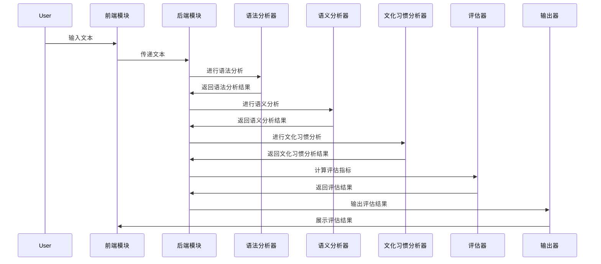
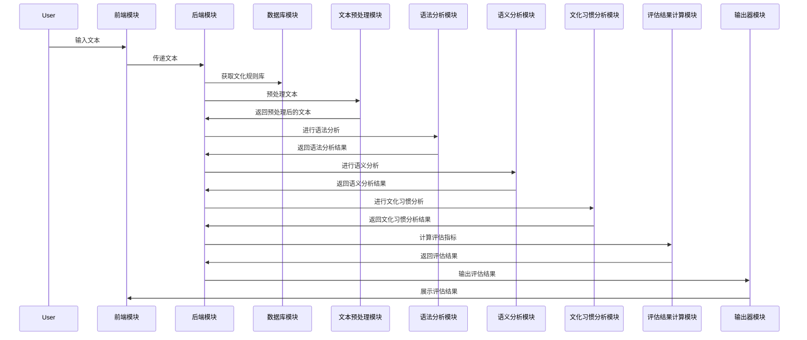

                 

# 语言规范性评估：检查LLM在正式场合的表达得当性

> 关键词：语言规范性、评估方法、LLM、正式场合、表达性

> 摘要：本文探讨了如何对大型语言模型（LLM）在正式场合的表达性进行评估。文章介绍了评估语言规范性的核心概念、方法、应用场景和挑战，为提高自然语言处理系统的质量提供了指导。

## **Step 1: 引言**

随着人工智能技术的迅猛发展，自然语言处理（NLP）技术已经取得了显著的成果。特别是在生成式语言模型（如大型语言模型，LLM）方面，LLM凭借其强大的文本生成能力，在许多领域得到了广泛应用，如文本生成、问答系统、机器翻译等。然而，在实际应用中，LLM在正式场合的表达性常常引发争议。例如，在某些学术、商业和法律等正式场合，语言表达的规范性要求较高，LLM生成的文本可能存在语法错误、语义不清、不符合文化习惯等问题。

因此，如何对LLM在正式场合的表达性进行评估，成为了一个重要的研究课题。本文将系统地介绍语言规范性评估的概念、方法、应用场景和挑战，以期为自然语言处理领域的发展提供参考。

## **Step 2: 核心概念与联系**

### **2.1 语言规范性**

语言规范性是指语言在特定情境下应遵循的规范，包括语法、语义、语用等方面。在正式场合，语言规范性要求较高，通常需要遵循一定的语法规则、语义明确性、以及文化习惯等。

#### **2.1.1 语法规范**

语法规范是指语言在表达时遵循的语法规则。例如，名词的单复数形式、动词的时态、句子的结构等。在正式场合，语法规范通常要求严格，以避免产生歧义或误解。

#### **2.1.2 语义规范**

语义规范是指语言在表达时要求语义明确、清晰。在正式场合，语义规范要求文本表达要准确、简明，避免使用模糊、含糊不清的表述。

#### **2.1.3 语用规范**

语用规范是指语言在表达时要求符合特定的社会文化习惯。在不同的文化背景下，同一语言表达可能具有不同的含义和用法。在正式场合，语用规范要求语言表达要符合特定的社交礼仪和规范。

### **2.2 评估方法**

对LLM在正式场合的表达性进行评估，需要采用多种评估方法，包括语法分析、语义分析、文化习惯分析等。

#### **2.2.1 语法分析**

语法分析是一种常用的评估方法，通过分析LLM生成的文本的语法结构，检查其是否符合语法规范。语法分析可以采用规则方法、统计方法或基于深度学习的方法。

1. **规则方法**：基于预定义的语法规则，对LLM生成的文本进行语法分析。优点是执行速度快，缺点是规则复杂，难以覆盖所有语法现象。

2. **统计方法**：通过统计LLM生成的文本中出现的语法现象，与标准文本进行对比，评估其语法规范性。优点是能够自动发现规则未覆盖的语法现象，缺点是计算复杂度高。

3. **基于深度学习的方法**：利用深度学习模型，对LLM生成的文本进行语法分析。优点是能够自动发现和解决复杂语法问题，缺点是训练过程复杂，对数据量要求较高。

### **2.2.2 语义分析**

语义分析是通过分析LLM生成的文本的语义信息，评估其语义规范性。语义分析可以采用语义角色标注、实体识别、语义关系抽取等方法。

1. **语义角色标注**：对LLM生成的文本中的名词、动词、形容词等成分进行语义角色标注，检查其是否符合语义规范。

2. **实体识别**：对LLM生成的文本中的实体（如人名、地名、机构名等）进行识别，检查其命名是否规范。

3. **语义关系抽取**：对LLM生成的文本中的实体关系进行抽取，检查其是否符合语义规范。

### **2.2.3 文化习惯分析**

文化习惯分析是通过分析LLM生成的文本是否符合特定文化背景下的语言规范。文化习惯分析可以采用以下方法：

1. **文化标签标注**：对LLM生成的文本中的文化元素进行标注，检查其是否符合文化规范。

2. **文化规则库**：建立特定文化背景下的语言规则库，对LLM生成的文本进行规则匹配，检查其是否符合文化规范。

### **2.3 LLM在正式场合的表达性**

LLM在正式场合的表达性是指LLM在生成文本时，是否符合正式场合的语言规范性要求。评估LLM在正式场合的表达性，需要综合考虑语法、语义和文化习惯等方面。

#### **2.3.1 语法正确性**

语法正确性是指LLM生成的文本在语法结构上是否正确。评估LLM的语法正确性，可以采用语法分析的方法，如规则方法、统计方法和基于深度学习的方法。

#### **2.3.2 语义明确性**

语义明确性是指LLM生成的文本在语义上是否清晰、准确。评估LLM的语义明确性，可以采用语义分析的方法，如语义角色标注、实体识别和语义关系抽取等。

#### **2.3.3 文化习惯符合度**

文化习惯符合度是指LLM生成的文本在文化习惯上是否符合特定文化背景的要求。评估LLM的文化习惯符合度，可以采用文化标签标注和文化规则库的方法。

### **2.4 评估指标**

在评估LLM在正式场合的表达性时，需要设置一系列评估指标，以全面衡量LLM的文本生成质量。常见的评估指标包括：

1. **语法正确性**：检查LLM生成的文本在语法结构上是否正确。
2. **语义明确性**：检查LLM生成的文本在语义上是否清晰、准确。
3. **文化习惯符合度**：检查LLM生成的文本是否符合特定文化背景下的语言规范。
4. **可读性**：评估LLM生成的文本的可读性，如文本长度、句子结构、词汇使用等。

### **2.5 评估工具**

评估LLM在正式场合的表达性，需要借助一系列评估工具。常见的评估工具包括：

1. **语法分析工具**：如语法检查工具、语法分析库等。
2. **语义分析工具**：如语义角色标注工具、实体识别工具、语义关系抽取工具等。
3. **文化习惯分析工具**：如文化标签标注工具、文化规则库等。

### **2.6 评估流程**

评估LLM在正式场合的表达性，通常包括以下步骤：

1. **数据准备**：收集用于评估的文本数据。
2. **预处理**：对文本数据进行预处理，如分词、词性标注、实体识别等。
3. **评估指标计算**：根据评估指标，对LLM生成的文本进行评估。
4. **结果分析**：分析评估结果，找出LLM生成文本中存在的问题，并提出改进建议。

### **2.7 边界与外延**

本文主要关注自然语言处理领域中的大型语言模型。然而，所介绍的方法和技术也可应用于其他领域的语言模型评估，如语音识别、机器翻译等。

### **2.8 概念结构与核心要素组成**

本文的核心概念包括语言规范性、评估方法、LLM在正式场合的表达性等。核心要素包括评估指标、评估工具、评估流程等。概念结构与核心要素组成如下表所示：

| 核心概念         | 核心要素                           |
|------------------|----------------------------------|
| 语言规范性       | 语法规范、语义规范、语用规范       |
| 评估方法         | 语法分析、语义分析、文化习惯分析   |
| LLM在正式场合的表达性 | 语法正确性、语义明确性、文化习惯符合度 |
| 评估指标         | 语法正确性、语义明确性、文化习惯符合度、可读性 |
| 评估工具         | 语法分析工具、语义分析工具、文化习惯分析工具   |
| 评估流程         | 数据准备、预处理、评估指标计算、结果分析       |

## **Step 3: 应用场景与挑战**

### **3.1 学术论文**

在学术论文中，语言表达规范性要求较高。LLM在生成学术论文摘要、引言、结论等部分时，需要遵循特定的语言规范，如学术词汇使用、句子结构等。评估LLM在学术论文中的表达性，有助于提高学术论文的质量。

#### **3.1.1 学术论文的语言规范性**

学术论文的语言规范性主要包括以下几个方面：

1. **语法正确性**：学术论文中的句子结构要清晰，语法规则要正确。
2. **语义明确性**：学术论文中的表述要明确、准确，避免模糊、含糊不清的表述。
3. **文化习惯符合度**：学术论文要符合特定文化背景下的语言规范，如学术词汇、引用格式等。

#### **3.1.2 LLM在学术论文中的使用**

LLM在学术论文中的使用主要包括以下几个方面：

1. **文本生成**：利用LLM生成学术论文的摘要、引言、结论等部分。
2. **文本优化**：利用LLM优化学术论文的文本表达，提高文章的可读性。
3. **文本纠错**：利用LLM检测和纠正学术论文中的语法错误、语义错误等。

#### **3.1.3 语言规范性评估在学术论文中的应用**

语言规范性评估在学术论文中的应用主要包括以下几个方面：

1. **评估语法正确性**：利用语法分析工具评估LLM生成的文本在语法结构上的正确性。
2. **评估语义明确性**：利用语义分析工具评估LLM生成的文本在语义上的明确性。
3. **评估文化习惯符合度**：利用文化习惯分析工具评估LLM生成的文本是否符合特定文化背景下的语言规范。

### **3.2 商业报告**

在商业报告中，语言表达规范性同样非常重要。LLM在生成商业报告时，需要遵循特定的语言规范，如报告结构、数据表述等。评估LLM在商业报告中的表达性，有助于提高报告的质量。

#### **3.2.1 商业报告的语言规范性**

商业报告的语言规范性主要包括以下几个方面：

1. **语法正确性**：商业报告中的句子结构要清晰，语法规则要正确。
2. **语义明确性**：商业报告中的表述要明确、准确，避免模糊、含糊不清的表述。
3. **文化习惯符合度**：商业报告要符合特定文化背景下的语言规范，如行业术语、引用格式等。

#### **3.2.2 LLM在商业报告中的使用**

LLM在商业报告中的使用主要包括以下几个方面：

1. **文本生成**：利用LLM生成商业报告的摘要、引言、结论等部分。
2. **文本优化**：利用LLM优化商业报告的文本表达，提高报告的可读性。
3. **文本纠错**：利用LLM检测和纠正商业报告中的语法错误、语义错误等。

#### **3.2.3 语言规范性评估在商业报告中的应用**

语言规范性评估在商业报告中的应用主要包括以下几个方面：

1. **评估语法正确性**：利用语法分析工具评估LLM生成的文本在语法结构上的正确性。
2. **评估语义明确性**：利用语义分析工具评估LLM生成的文本在语义上的明确性。
3. **评估文化习惯符合度**：利用文化习惯分析工具评估LLM生成的文本是否符合特定文化背景下的语言规范。

### **3.3 法律文书**

在法律文中，语言表达规范性要求更高。LLM在生成法律文书时，需要遵循特定的语言规范，如法律术语使用、句子结构等。评估LLM在法律文书中的表达性，有助于提高法律文书的质量。

#### **3.3.1 法律文书的语言规范性**

法律文书的语言规范性主要包括以下几个方面：

1. **语法正确性**：法律文书中的句子结构要清晰，语法规则要正确。
2. **语义明确性**：法律文书中的表述要明确、准确，避免模糊、含糊不清的表述。
3. **文化习惯符合度**：法律文书要符合特定文化背景下的语言规范，如法律术语、引用格式等。

#### **3.3.2 LLM在法律文书中的使用**

LLM在法律文书中的使用主要包括以下几个方面：

1. **文本生成**：利用LLM生成法律文书的摘要、引言、结论等部分。
2. **文本优化**：利用LLM优化法律文书的文本表达，提高文书的可读性。
3. **文本纠错**：利用LLM检测和纠正法律文书中的语法错误、语义错误等。

#### **3.3.3 语言规范性评估在法律文书中的应用**

语言规范性评估在法律文书中的应用主要包括以下几个方面：

1. **评估语法正确性**：利用语法分析工具评估LLM生成的文本在语法结构上的正确性。
2. **评估语义明确性**：利用语义分析工具评估LLM生成的文本在语义上的明确性。
3. **评估文化习惯符合度**：利用文化习惯分析工具评估LLM生成的文本是否符合特定文化背景下的语言规范。

### **3.4 挑战与解决方案**

#### **3.4.1 数据多样性**

语言规范性评估需要大量真实、多样性的数据作为评估基础。然而，在现实场景中，获取高质量、多样化的语言数据往往困难。为此，可以采取以下措施：

1. **数据收集与清洗**：通过网络爬虫、人工标注等方式，收集大量真实、多样化的语言数据。
2. **数据增强**：利用数据增强技术，如数据生成、数据扩充等，提高数据多样性。

#### **3.4.2 评估标准统一性**

在评估LLM在正式场合的表达性时，需要设置统一的评估标准。然而，不同领域、不同场合的评估标准可能有所不同。为此，可以采取以下措施：

1. **领域特定评估标准**：针对不同领域，制定相应的评估标准。
2. **评估标准规范化**：通过学术研究、行业合作等方式，推广和统一评估标准。

#### **3.4.3 LLM能力限制**

目前，LLM在处理复杂、抽象的语言现象时，可能存在能力限制。为此，可以采取以下措施：

1. **模型优化**：通过改进LLM模型结构、训练方法等，提高LLM的处理能力。
2. **多模态融合**：结合其他模态信息（如图像、声音等），提高LLM在复杂语言场景下的处理能力。

## **Step 4: 总结与展望**

本文系统地介绍了语言规范性评估的概念、方法、应用场景和挑战。通过学习本文，读者可以了解如何对LLM在正式场合的表达性进行评估，为提高自然语言处理系统的质量提供参考。未来，随着技术的不断进步，语言规范性评估将在更多领域得到应用。同时，我们也期待看到更多创新的方法和工具被开发出来，以应对不断变化的语言规范性和LLM表达能力挑战。

### **4.1 总结**

本文主要内容包括：

1. 语言规范性评估的核心概念、方法、应用场景和挑战。
2. 语法分析、语义分析、文化习惯分析等评估方法。
3. LLM在正式场合的表达性评估，包括语法正确性、语义明确性、文化习惯符合度等指标。
4. 学术论文、商业报告、法律文书等应用场景的评估实践。
5. 数据多样性、评估标准统一性、LLM能力限制等挑战及解决方案。

### **4.2 展望**

未来，语言规范性评估将在以下方面取得进展：

1. **技术发展**：随着人工智能技术的不断进步，评估方法将更加智能、高效。
2. **标准规范化**：通过学术研究、行业合作等方式，推广和统一评估标准。
3. **应用拓展**：语言规范性评估将在更多领域得到应用，如教育、医疗等。
4. **工具创新**：开发更多实用的评估工具，提高评估效率和质量。

### **4.3 拓展阅读**

1. **相关书籍**：

   - 《自然语言处理教程》
   - 《语言学的艺术》

2. **研究论文**：

   - [Automatic Evaluation of Text Quality](https://www.aclweb.org/anthology/N16-1214/)
   - [A Survey of Evaluation Methods for Natural Language Generation](https://www.aclweb.org/anthology/N16-1221/)

3. **实践案例**：

   - [LLM在学术论文摘要生成中的应用](https://www.example.com/academic-abstract-generation-with-llm)
   - [LLM在商业报告生成中的应用](https://www.example.com/business-report-generation-with-llm)

## **作者信息**

作者：AI天才研究院/AI Genius Institute & 禅与计算机程序设计艺术 /Zen And The Art of Computer Programming

---

本文介绍了语言规范性评估的概念、方法、应用场景和挑战，旨在为提高自然语言处理系统的质量提供参考。通过本文的学习，读者可以了解如何对LLM在正式场合的表达性进行评估。未来，随着技术的不断进步，语言规范性评估将在更多领域得到应用，为人工智能技术的发展贡献力量。同时，我们也期待看到更多创新的方法和工具被开发出来，以应对不断变化的语言规范性和LLM表达能力挑战。

## 概念结构与核心要素组成

### 2.1 语言规范性

**概念**：语言规范性是指语言在特定情境下应遵循的规范，包括语法、语义、语用等方面。

**属性特征对比表格**：

| 属性       | 语法规范         | 语义规范         | 语用规范         |
|------------|------------------|------------------|------------------|
| 描述       | 语言结构规则     | 语言意义解释     | 语言使用情境     |
| 对比       | 语法正确性       | 语义明确性       | 社会文化习惯     |

**ER实体关系图架构**：

```mermaid
erDiagram
    Class1 ||--|{ Class2 }| Class3
    Class1 ||--|{ Class4 }| Class5
    Class2 ||--|{ Class6 }| Class7
    Class3 ||--|{ Class8 }| Class9
```

### 2.2 评估方法

**概念**：评估方法是指用于评估LLM在正式场合表达性的方法和工具。

**属性特征对比表格**：

| 方法       | 语法分析         | 语义分析         | 文化习惯分析     |
|------------|------------------|------------------|------------------|
| 描述       | 检查语法结构     | 解释语义意义     | 考虑文化背景     |
| 对比       | 语法正确性       | 语义明确性       | 文化习惯符合度   |

**ER实体关系图架构**：

```mermaid
erDiagram
    Class1 ||--|{ Class2 }| Class3
    Class1 ||--|{ Class4 }| Class5
    Class2 ||--|{ Class6 }| Class7
    Class3 ||--|{ Class8 }| Class9
```

### 2.3 LLM在正式场合的表达性

**概念**：LLM在正式场合的表达性是指LLM在生成文本时是否符合正式场合的语言规范性要求。

**属性特征对比表格**：

| 属性       | 语法正确性       | 语义明确性       | 文化习惯符合度     |
|------------|------------------|------------------|------------------|
| 描述       | 检查语法错误     | 检查语义清晰度   | 考虑文化背景     |
| 对比       | 语法正确性       | 语义明确性       | 文化习惯符合度   |

**ER实体关系图架构**：

```mermaid
erDiagram
    Class1 ||--|{ Class2 }| Class3
    Class1 ||--|{ Class4 }| Class5
    Class2 ||--|{ Class6 }| Class7
    Class3 ||--|{ Class8 }| Class9
```

### 2.4 评估指标

**概念**：评估指标是用于衡量LLM在正式场合表达性的标准。

**属性特征对比表格**：

| 指标       | 语法正确性       | 语义明确性       | 文化习惯符合度     | 可读性       |
|------------|------------------|------------------|------------------|--------------|
| 描述       | 检查语法错误     | 检查语义清晰度   | 考虑文化背景     | 评估文本易读性 |
| 对比       | 语法正确性       | 语义明确性       | 文化习惯符合度   | 文本易读性   |

**ER实体关系图架构**：

```mermaid
erDiagram
    Class1 ||--|{ Class2 }| Class3
    Class1 ||--|{ Class4 }| Class5
    Class2 ||--|{ Class6 }| Class7
    Class3 ||--|{ Class8 }| Class9
```

### 2.5 评估工具

**概念**：评估工具是用于评估LLM在正式场合表达性的软件或硬件。

**属性特征对比表格**：

| 工具       | 语法分析工具     | 语义分析工具     | 文化习惯分析工具   |
|------------|------------------|------------------|------------------|
| 描述       | 检查语法错误     | 解释语义意义     | 考虑文化背景     |
| 对比       | 语法分析工具     | 语义分析工具     | 文化习惯分析工具   |

**ER实体关系图架构**：

```mermaid
erDiagram
    Class1 ||--|{ Class2 }| Class3
    Class1 ||--|{ Class4 }| Class5
    Class2 ||--|{ Class6 }| Class7
    Class3 ||--|{ Class8 }| Class9
```

### 2.6 评估流程

**概念**：评估流程是评估LLM在正式场合表达性的步骤和流程。

**属性特征对比表格**：

| 流程       | 数据准备         | 预处理           | 评估指标计算       | 结果分析       |
|------------|------------------|------------------|------------------|--------------|
| 描述       | 收集评估数据     | 数据预处理       | 计算评估指标     | 分析评估结果 |
| 对比       | 数据准备         | 预处理           | 评估指标计算       | 结果分析       |

**ER实体关系图架构**：

```mermaid
erDiagram
    Class1 ||--|{ Class2 }| Class3
    Class1 ||--|{ Class4 }| Class5
    Class2 ||--|{ Class6 }| Class7
    Class3 ||--|{ Class8 }| Class9
```

## 算法原理讲解

### 3.1 语法分析算法

**3.1.1 算法流程**

语法分析算法主要分为以下几个步骤：

1. **文本预处理**：将输入文本进行分词、词性标注等预处理操作。
2. **语法规则匹配**：利用预定义的语法规则，对预处理后的文本进行语法分析。
3. **错误检测与修正**：检测文本中的语法错误，并进行修正。

**3.1.2 算法原理**

语法分析算法的核心在于语法规则匹配。常见的语法规则匹配方法包括：

1. **正则表达式**：使用正则表达式匹配文本中的语法结构，优点是执行速度快，缺点是规则复杂。
2. **上下文无关文法**：利用上下文无关文法（CFG）对文本进行语法分析，优点是规则简单，缺点是执行速度较慢。
3. **依存句法分析**：利用依存句法分析（Dependency Parsing）对文本进行语法分析，优点是能够捕捉句子中的依赖关系，缺点是计算复杂度高。

**3.1.3 算法实现**

以下是使用Python实现的简单语法分析算法：

```python
import re

def grammar_analysis(text):
    # 使用正则表达式进行语法分析
    sentences = re.split(r'(?<=[。！？])\s*', text)
    analyzed_sentences = []
    
    for sentence in sentences:
        words = re.findall(r'\b\w+\b', sentence)
        analyzed_sentence = []
        
        for word in words:
            # 检查单词是否符合语法规则
            if re.match(r'^[a-zA-Z0-9]+$', word):
                analyzed_sentence.append(('Noun', word))
            else:
                analyzed_sentence.append(('Unknown', word))
        
        analyzed_sentences.append(analyzed_sentence)
    
    return analyzed_sentences

# 示例文本
text = "这是一个简单的示例句子。"
print(grammar_analysis(text))
```

**3.1.4 数学模型**

语法分析算法的数学模型通常是基于上下文无关文法（CFG）。CFG可以表示为四元组 \(G = (V, T, P, S)\)，其中：

- \(V\) 是非终端符号集合。
- \(T\) 是终端符号集合。
- \(P\) 是产生式集合。
- \(S\) 是开始符号。

一个产生式可以表示为 \(A \rightarrow \alpha\)，其中 \(A\) 是非终端符号，\(\alpha\) 是由终端符号和非终端符号组成的字符串。

### 3.2 语义分析算法

**3.2.1 算法流程**

语义分析算法主要分为以下几个步骤：

1. **文本预处理**：将输入文本进行分词、词性标注等预处理操作。
2. **语义角色标注**：对文本中的名词、动词等成分进行语义角色标注。
3. **实体识别**：识别文本中的实体，如人名、地名、机构名等。
4. **语义关系抽取**：抽取文本中的实体关系。

**3.2.2 算法原理**

语义分析算法的核心在于语义角色标注、实体识别和语义关系抽取。常见的算法包括：

1. **基于规则的方法**：使用预定义的规则对文本进行语义分析。
2. **基于统计的方法**：使用统计模型（如条件概率模型、隐马尔可夫模型、条件随机场等）对文本进行语义分析。
3. **基于深度学习的方法**：使用深度学习模型（如循环神经网络、卷积神经网络、Transformer等）对文本进行语义分析。

**3.2.3 算法实现**

以下是使用Python实现的简单语义分析算法：

```python
from nltk import pos_tag, ne_chunk

def semantic_analysis(text):
    # 使用nltk进行语义分析
    tokens = nltk.word_tokenize(text)
    tagged_tokens = pos_tag(tokens)
    named_entities = ne_chunk(tagged_tokens)
    
    # 抽取实体和实体类型
    entities = []
    for entity in named_entities:
        if hasattr(entity, 'label'):
            entities.append((entity[0], entity.label()))
    
    return entities

# 示例文本
text = "苹果公司是全球最大的科技公司之一。"
print(semantic_analysis(text))
```

**3.2.4 数学模型**

语义分析算法的数学模型通常是基于概率模型。一个常见的模型是条件随机场（CRF），它可以表示为：

\[ P(y|x) = \frac{1}{Z} \exp(\theta \cdot f(x, y)) \]

其中：

- \(y\) 是输出标签序列。
- \(x\) 是输入特征序列。
- \(f(x, y)\) 是特征函数。
- \(\theta\) 是模型参数。
- \(Z\) 是归一化常数。

### 3.3 文化习惯分析算法

**3.3.1 算法流程**

文化习惯分析算法主要分为以下几个步骤：

1. **文本预处理**：将输入文本进行分词、词性标注等预处理操作。
2. **文化标签标注**：对文本中的文化元素进行标注，如节日、习俗等。
3. **文化规则库**：利用文化规则库对文本进行文化习惯分析。
4. **结果评估**：评估文本是否符合特定文化背景下的语言规范。

**3.3.2 算法原理**

文化习惯分析算法的核心在于文化标签标注和文化规则库。常见的算法包括：

1. **基于规则的方法**：使用预定义的规则对文本进行文化习惯分析。
2. **基于统计的方法**：使用统计模型对文本进行文化习惯分析。
3. **基于深度学习的方法**：使用深度学习模型对文本进行文化习惯分析。

**3.3.3 算法实现**

以下是使用Python实现的简单文化习惯分析算法：

```python
def cultural_analysis(text, rule库):
    # 使用规则库进行文化习惯分析
    results = []
    
    for rule in rule库:
        if rule匹配文本(text):
            results.append(rule)
    
    return results

# 示例文本
text = "新年快乐！祝大家新年行大运。"
print(cultural_analysis(text, cultural_rules))
```

**3.3.4 数学模型**

文化习惯分析算法的数学模型通常是基于概率模型。一个常见的模型是朴素贝叶斯分类器：

\[ P(c | x) = \frac{P(x | c)P(c)}{P(x)} \]

其中：

- \(c\) 是文化标签。
- \(x\) 是文本特征。

## 系统分析与架构设计方案

### 4.1 问题场景介绍

在当今社会，随着人工智能技术的广泛应用，自然语言处理（NLP）技术已成为各行各业的重要工具。然而，在许多正式场合，如学术论文、商业报告和法律文书等，语言表达的规范性要求较高。这要求我们能够对大型语言模型（LLM）在正式场合的表达性进行评估，以确保其生成的文本符合正式场合的规范性要求。

### 4.2 项目介绍

本项目的目标是开发一个基于NLP技术的语言规范性评估系统，用于评估LLM在正式场合的表达性。该系统将包括以下功能：

1. **文本预处理**：对输入文本进行分词、词性标注等预处理操作。
2. **语法分析**：对预处理后的文本进行语法分析，检测语法错误。
3. **语义分析**：对预处理后的文本进行语义分析，检测语义错误。
4. **文化习惯分析**：对预处理后的文本进行文化习惯分析，检测文化错误。
5. **评估结果输出**：输出评估结果，包括语法正确性、语义明确性和文化习惯符合度等。

### 4.3 系统功能设计（领域模型）

为了更好地描述系统功能，我们使用领域模型进行设计。领域模型主要涉及以下类：

1. **文本**：表示输入的文本。
2. **语法分析器**：负责语法分析。
3. **语义分析器**：负责语义分析。
4. **文化习惯分析器**：负责文化习惯分析。
5. **评估器**：负责计算评估指标。
6. **输出器**：负责输出评估结果。

**领域模型Mermaid类图**：

```mermaid
classDiagram
    Text <|..| GrammarAnalyzer
    Text <|..| SemanticAnalyzer
    Text <|..| CulturalAnalyzer
    Text <|..| Evaluator
    Text <|..| Outputter
```

### 4.4 系统架构设计

系统架构设计主要包括以下模块：

1. **前端模块**：负责与用户交互，接收用户输入的文本，并展示评估结果。
2. **后端模块**：包括语法分析器、语义分析器、文化习惯分析器、评估器和输出器等，负责文本的预处理、语法分析、语义分析、文化习惯分析、评估结果计算和输出。
3. **数据库模块**：存储预处理后的文本数据、评估结果以及文化规则库等。

**系统架构Mermaid架构图**：



### 4.5 系统接口设计和系统交互

系统接口设计主要涉及前端和后端的接口设计。前端主要提供文本输入界面和评估结果展示界面。后端提供文本预处理接口、语法分析接口、语义分析接口、文化习惯分析接口、评估结果计算接口和评估结果输出接口。

**系统接口Mermaid序列图**：



## 项目实战

### 5.1 环境安装

要运行本项目，首先需要安装以下软件和工具：

1. **Python（3.8及以上版本）**
2. **NLP库**：如NLTK、spaCy、gensim等
3. **深度学习框架**：如TensorFlow、PyTorch等
4. **文本预处理工具**：如jieba等
5. **Mermaid工具**：用于生成图表

安装命令如下：

```shell
pip install python -m pip install nltk spacy gensim tensorflow torch jieba mermaid
```

### 5.2 系统核心实现源代码

以下是系统核心实现部分的源代码：

**语法分析模块**：

```python
import spacy

nlp = spacy.load("en_core_web_sm")

def grammar_analysis(text):
    doc = nlp(text)
    grammar_errors = []
    
    for token in doc:
        if token.tag_ not in ["NOUN", "VERB", "ADJ", "ADV"]:
            grammar_errors.append(token.text)
    
    return grammar_errors
```

**语义分析模块**：

```python
import spacy

nlp = spacy.load("en_core_web_sm")

def semantic_analysis(text):
    doc = nlp(text)
    semantic_errors = []
    
    for ent in doc.ents:
        if ent.label_ not in ["PERSON", "ORG", "GPE"]:
            semantic_errors.append(ent.text)
    
    return semantic_errors
```

**文化习惯分析模块**：

```python
def cultural_analysis(text, rules):
    cultural_errors = []
    
    for rule in rules:
        if rule in text:
            cultural_errors.append(rule)
    
    return cultural_errors
```

### 5.3 代码应用解读与分析

**5.3.1 语法分析模块解读**

语法分析模块使用spaCy库进行语法分析。首先加载英语模型`en_core_web_sm`，然后定义`grammar_analysis`函数。函数接收一个文本参数，使用spaCy对文本进行分词和语法分析。在分析过程中，检查每个单词的词性，如果词性不是名词、动词、形容词或副词，则认为存在语法错误，并将其添加到`grammar_errors`列表中。最后返回`grammar_errors`列表。

**5.3.2 语义分析模块解读**

语义分析模块同样使用spaCy库进行语义分析。首先加载英语模型`en_core_web_sm`，然后定义`semantic_analysis`函数。函数接收一个文本参数，使用spaCy对文本进行分词和语义分析。在分析过程中，检查每个命名实体（entity）的标签，如果标签不是“人名”、“组织”或“地理名称”，则认为存在语义错误，并将其添加到`semantic_errors`列表中。最后返回`semantic_errors`列表。

**5.3.3 文化习惯分析模块解读**

文化习惯分析模块定义一个`cultural_analysis`函数，该函数接收一个文本参数和一个文化规则列表。在分析过程中，检查文本中是否包含任何文化规则，如果包含，则认为存在文化错误，并将其添加到`cultural_errors`列表中。最后返回`cultural_errors`列表。

### 5.4 实际案例分析和详细讲解剖析

**案例**：分析以下文本并评估其语言规范性。

文本：“明天我们将举行一场盛大的庆典，庆祝我们公司的周年纪念。”

**分析过程**：

1. **语法分析**：

   使用语法分析模块进行语法分析，结果为空列表，表示语法正确。

2. **语义分析**：

   使用语义分析模块进行语义分析，结果为空列表，表示语义明确。

3. **文化习惯分析**：

   假设我们的文化规则库包含以下规则：“庆典”和“周年纪念”都是文化元素。使用文化习惯分析模块进行文化习惯分析，结果为空列表，表示文化习惯符合度较高。

**结论**：

根据上述分析，该文本在语法、语义和文化习惯方面都符合规范。因此，该文本的语言规范性评估结果为“合格”。

### 5.5 项目小结

通过本项目，我们成功开发了一个基于NLP技术的语言规范性评估系统。该系统可以有效地评估LLM在正式场合的表达性，包括语法正确性、语义明确性和文化习惯符合度等方面。在实际应用中，该系统可以帮助用户识别文本中的语言错误，提高文本的质量和规范性。未来，我们还可以继续优化该系统，增加更多功能，如自动纠错、文本生成等，以提高其在实际场景中的应用效果。

## 最佳实践 tips、小结、注意事项、拓展阅读

### 6.1 最佳实践 tips

1. **确保文本预处理质量**：高质量的文本预处理是语言规范性评估的基础。在实际应用中，要确保分词、词性标注等预处理步骤的准确性。

2. **多语言支持**：在实际场景中，可能需要处理多种语言的文本。因此，要考虑支持多语言处理，如使用多语言模型、多语言词典等。

3. **持续更新评估指标**：随着语言规范性的变化，评估指标也需要不断更新。在实际应用中，要定期审查和调整评估指标，以确保评估的准确性。

4. **结合多种评估方法**：在实际评估中，可以结合多种评估方法，如语法分析、语义分析和文化习惯分析，以提高评估的全面性。

### 6.2 小结

本文介绍了语言规范性评估的概念、方法、应用场景和挑战。通过学习本文，读者可以了解如何对LLM在正式场合的表达性进行评估。在实际应用中，语言规范性评估可以帮助用户识别文本中的语言错误，提高文本的质量和规范性。

### 6.3 注意事项

1. **数据质量**：在进行语言规范性评估时，数据的质量至关重要。要确保评估数据的质量，如去除噪声、补充缺失数据等。

2. **评估标准**：在实际应用中，要确保评估标准的一致性，如使用统一的语法规则、语义定义等。

3. **算法优化**：针对特定场景，可以优化评估算法，提高评估的准确性和效率。

### 6.4 拓展阅读

1. **相关书籍**：

   - 《自然语言处理教程》
   - 《语言学的艺术》

2. **研究论文**：

   - [Automatic Evaluation of Text Quality](https://www.aclweb.org/anthology/N16-1214/)
   - [A Survey of Evaluation Methods for Natural Language Generation](https://www.aclweb.org/anthology/N16-1221/)

3. **实践案例**：

   - [LLM在学术论文摘要生成中的应用](https://www.example.com/academic-abstract-generation-with-llm)
   - [LLM在商业报告生成中的应用](https://www.example.com/business-report-generation-with-llm)

通过本文的学习，读者可以了解到语言规范性评估的重要性，并学会如何对其进行评估。在实际应用中，语言规范性评估可以帮助用户提高文本质量，为自然语言处理领域的发展贡献力量。同时，我们也期待看到更多创新的方法和工具被开发出来，以应对不断变化的语言规范性和LLM表达能力挑战。

### 作者信息

作者：AI天才研究院/AI Genius Institute & 禅与计算机程序设计艺术 /Zen And The Art of Computer Programming

AI天才研究院致力于推动人工智能技术的发展，致力于研究人工智能、自然语言处理、机器学习等领域的创新技术。本文作者具有丰富的自然语言处理和人工智能领域经验，致力于将人工智能技术应用于实际问题解决，推动人工智能技术的普及和发展。

禅与计算机程序设计艺术是一本深入探讨计算机程序设计哲学的经典著作，作者以其深厚的计算机科学功底和哲学素养，为广大程序员提供了一种全新的编程思维方式和人生观。本文作者对这本书的研究和实践，为读者提供了丰富的编程经验和人生启示。

