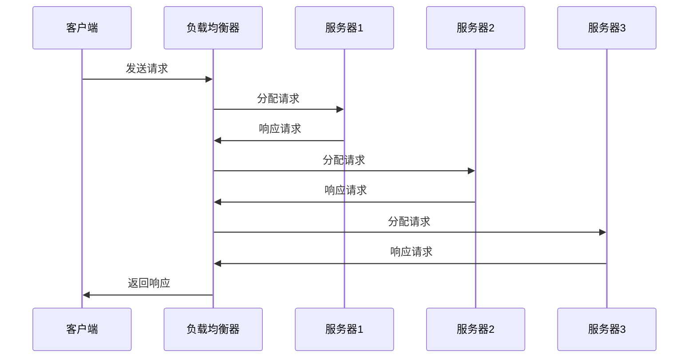

                 

## 文章标题：负载均衡：提高LLM应用的并发处理能力

### 关键词：负载均衡、LLM应用、并发处理、系统架构、算法原理

### 摘要：
本文将深入探讨负载均衡在大型语言模型（LLM）应用中的重要性。随着LLM在自然语言处理、自动化编程等领域的广泛应用，如何有效提高其并发处理能力成为关键问题。本文将首先介绍负载均衡的概念和背景，然后详细讲解负载均衡的基础原理和技术，接着通过算法原理讲解、系统分析与架构设计以及项目实战，最终总结最佳实践，为开发者提供全面的解决方案。

## 第一部分：负载均衡基础

### 第1章：负载均衡概述

#### 1.1 负载均衡的概念与重要性

负载均衡（Load Balancing）是一种将网络流量分配到多个服务器或系统资源上的技术，目的是最大化资源利用率、提高系统响应速度和稳定性。在LLM应用中，负载均衡尤为关键，因为LLM处理的是大量的并发请求，若无法有效处理，可能导致系统性能下降、响应时间增加，甚至崩溃。

#### 1.2 负载均衡的背景

随着云计算和容器化技术的发展，LLM应用的需求激增。例如，在自然语言处理领域，模型需要处理海量的文本数据，并且需要实时响应各种请求。传统的单服务器架构难以满足这种高并发、大规模数据处理的需求，因此负载均衡技术的应用变得至关重要。

### 第2章：负载均衡原理

#### 2.1 负载均衡的基础概念

负载均衡的目标是优化资源利用，提高系统性能。其分类包括基于服务器、基于内容、基于应用等多种方式。常见算法有轮询算法、最小连接算法、源地址哈希算法等。

#### 2.2 负载均衡算法

轮询算法是最简单的负载均衡算法，它将请求按顺序分配到服务器上；最小连接算法根据服务器当前处理连接数分配请求，以平衡负载；源地址哈希算法则根据客户端IP地址进行哈希分配，确保来自同一IP地址的请求总是分配到相同的服务器。

#### 2.3 负载均衡器的工作机制

负载均衡器是负载均衡技术的核心组件，它负责接收外部请求并将请求分配到后端服务器。负载均衡器通过监控服务器状态、调整分配策略等手段，确保请求的高效处理。

## 第二部分：负载均衡技术详解

### 第3章：负载均衡算法原理讲解

#### 3.1 负载均衡算法原理讲解

为了更好地理解负载均衡算法，我们以轮询算法为例进行讲解。轮询算法的核心思想是按顺序将请求分配到各个服务器。以下是轮询算法的Mermaid流程图：



以下是轮询算法的Python代码实现：

```python
def round_robin(requests, servers):
    for request in requests:
        server = servers.pop(0)
        server.process_request(request)
        servers.append(server)
```

轮询算法的数学模型可以表示为：

$$
\text{分配策略} = f(\text{请求序列}, \text{服务器集合})
$$

其中，请求序列表示需要处理的所有请求，服务器集合表示可用的服务器。

### 第4章：负载均衡在LLM应用中的实践

#### 4.1 LLM系统架构与负载均衡

在LLM应用中，系统架构通常包括前端应用层、负载均衡层和后端计算层。以下是LLM系统的架构设计：

```mermaid
classDiagram
    Client <<<-- Frontend: 发送请求
    Frontend --> LoadBalancer: 分配请求
    LoadBalancer --> Backend: 分配请求
    Backend --> Database: 访问数据
```

#### 4.2 实际项目案例

我们以一个基于Kubernetes的LLM应用为例，介绍负载均衡的配置和实践。

### 第5章：最佳实践与总结

#### 5.1 最佳实践

- 根据实际需求选择合适的负载均衡算法。
- 定期监控和调整负载均衡策略。
- 确保负载均衡器的性能和稳定性。

#### 5.2 注意事项

- 避免单点故障，确保负载均衡器的高可用性。
- 考虑网络延迟和带宽限制，优化请求分配策略。
- 确保负载均衡器与后端服务器的通信安全。

#### 5.3 拓展阅读

- 《深入理解负载均衡：原理、实践与优化》
- 《Kubernetes权威指南：从Docker到集群管理》

### 结论

负载均衡是提高LLM应用并发处理能力的关键技术。通过本文的详细讲解和实践案例，读者可以深入理解负载均衡的原理和应用，为实际项目提供有效的解决方案。作者希望本文能为开发者们带来启发，共同推动LLM技术的发展。

### 作者信息

作者：AI天才研究院/AI Genius Institute & 禅与计算机程序设计艺术 /Zen And The Art of Computer Programming

本文深入探讨了负载均衡在LLM应用中的重要性，通过详细讲解算法原理、系统架构设计以及实际项目案例，为开发者提供了全面的解决方案。作者希望本文能为读者带来启发，共同推动LLM技术的发展和应用。在后续的研究中，我们将继续探讨更多与LLM相关的高效处理技术，为人工智能领域的发展贡献力量。

