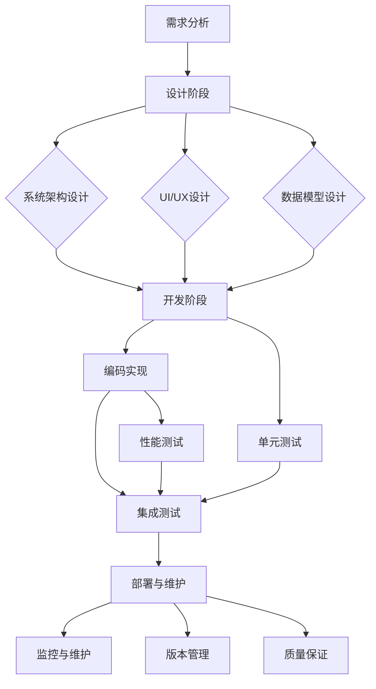

                 


### 第1章 引言

#### 1.1 问题背景

在当前的AI时代，LLM（Large Language Model）应用正迅速发展，这些应用不仅需要强大的计算能力，还需要跨领域的专业知识。随着市场的变化和用户需求的多样化，传统的开发模式往往难以应对这种快速迭代和变化的需求。

**问题描述**: 如何在LLM应用开发中，采用一种更加灵活和高效的方式，以适应快速变化的市场需求和多样化的用户需求？

**问题解决**: 需要一种灵活且高效的开发模式，跨功能团队的敏捷开发模式正是一个很好的选择。

**边界与外延**: 本文主要探讨跨功能团队在LLM应用敏捷开发中的作用，包括其构建、协作以及在实际开发中的应用。同时，也会分析跨功能团队在敏捷开发中可能遇到的挑战。

#### 1.2 跨功能团队的概念

**定义**: 跨功能团队是由不同专业背景的成员组成的团队，他们共同协作，以实现项目目标。

**特征**: 跨功能团队的成员通常具备互补的技能，如软件开发、数据分析、产品管理、市场营销等。

**跨功能团队的作用**:

- **快速响应变化**: 跨功能团队的多样化技能使其能够快速响应客户需求和市场变化。
- **提高效率**: 成员之间的紧密协作减少了沟通成本，提高了工作效率。

#### 1.3 敏捷开发模式概述

**定义**: 敏捷开发是一种以人为核心、迭代、循序渐进的开发方法。

**特点**:

- **迭代开发**: 每个迭代周期结束后进行回顾和调整，确保项目持续改进。
- **用户反馈**: 重视用户反馈，不断调整和优化产品。
- **团队协作**: 强调团队成员之间的协作和沟通，以提高开发效率。

#### 1.4 跨功能团队在LLM应用敏捷开发中的优势

**快速响应变化**:

- **优势**: 跨功能团队可以快速响应市场变化，及时调整产品功能。
- **案例**: 在一个文本分析平台项目中，跨功能团队通过敏捷开发模式，快速响应了用户对实时数据分析的需求。

**提高效率**:

- **优势**: 成员之间的紧密协作减少了沟通成本，提高了工作效率。
- **案例**: 在一个智能客服系统的开发中，跨功能团队通过高效的协作，实现了快速迭代和持续优化。

#### 1.5 跨功能团队在LLM应用敏捷开发中的挑战

**协调与管理**:

- **挑战**: 需要有效的协调和管理机制，以确保团队高效运作。
- **解决方案**: 采用项目管理工具和沟通工具，提高团队协作效率。

**技能多样性**:

- **挑战**: 团队成员需要具备多样化的技能，以应对不同的开发需求。
- **解决方案**: 通过培训和实践，提高团队成员的技能水平。

### 第2章 跨功能团队构建与协作

#### 2.1 团队构建原则

**成员选择**:

- **原则**: 选择具有互补技能的成员，确保团队具备全面的技能组合。
- **实践**: 在一个文本分析平台项目中，团队选择了软件工程师、数据分析师和产品经理，以确保项目在技术、数据和产品管理方面的全面覆盖。

**角色分工**:

- **原则**: 确定每个成员的角色和职责，确保团队成员明确自己的任务。
- **实践**: 在一个智能客服系统的开发中，团队明确了每个成员的角色：工程师负责实现功能，数据分析师负责数据分析和优化，产品经理负责产品规划和用户反馈。

#### 2.2 团队协作工具

**项目管理工具**:

- **工具**: 使用Jira、Trello等项目管理工具来跟踪项目进度和任务分配。
- **实践**: 在一个教育科技平台项目中，团队使用Jira来管理任务，确保每个成员都能实时了解项目进度和任务分配。

**沟通工具**:

- **工具**: 使用Slack、Microsoft Teams等沟通工具来保持团队成员之间的有效沟通。
- **实践**: 在一个文本分析平台项目中，团队使用Slack进行日常沟通，确保信息畅通。

#### 2.3 持续集成与持续部署

**CI/CD流程**:

- **概念**: 构建自动化的CI/CD流程，以提高开发效率和代码质量。
- **实践**: 在一个企业级文本分析平台项目中，团队构建了自动化的CI/CD流程，通过自动测试和部署，提高了开发效率和代码质量。

#### 2.4 跨功能团队敏捷开发实践

**迭代开发**:

- **概念**: 采用迭代开发模式，每个迭代周期结束后进行回顾和调整。
- **实践**: 在一个智能客服系统的开发中，团队采用迭代开发模式，每个迭代周期结束后都会进行回顾和调整，确保项目持续改进。

**用户反馈**:

- **概念**: 重视用户反馈，不断调整和优化产品。
- **实践**: 在一个教育科技平台项目中，团队通过用户反馈来不断调整和优化产品功能，提高了用户满意度。

### 第3章 LLM应用开发流程

#### 3.1 需求分析

**用户需求收集**:

- **概念**: 收集用户需求，明确产品的核心功能。
- **实践**: 在一个文本分析平台项目中，团队通过用户调研和需求收集，明确了产品的核心功能。

**需求文档编写**:

- **概念**: 编写详细的需求文档，为后续开发提供指导。
- **实践**: 在一个智能客服系统的开发中，团队编写了详细的需求文档，确保开发过程有据可依。

#### 3.2 设计阶段

**系统架构设计**:

- **概念**: 设计系统的整体架构，确定各个模块的功能和接口。
- **实践**: 在一个教育科技平台项目中，团队设计了系统的整体架构，确保系统的高扩展性和可维护性。

**UI/UX设计**:

- **概念**: 设计用户界面和用户体验，确保产品的易用性。
- **实践**: 在一个智能客服系统的开发中，团队设计了用户界面和用户体验，确保用户在使用过程中有良好的体验。

#### 3.3 开发阶段

**编码实现**:

- **概念**: 根据设计文档进行编码实现，确保代码的质量和可维护性。
- **实践**: 在一个文本分析平台项目中，团队根据设计文档进行了编码实现，确保代码的质量和可维护性。

**单元测试**:

- **概念**: 对代码进行单元测试，确保每个模块的功能正确。
- **实践**: 在一个教育科技平台项目中，团队对代码进行了单元测试，确保每个模块的功能正确。

#### 3.4 部署与维护

**部署流程**:

- **概念**: 确定部署流程，确保系统可以稳定运行。
- **实践**: 在一个智能客服系统的开发中，团队确定了部署流程，确保系统可以稳定运行。

**监控与维护**:

- **概念**: 监控系统的运行状态，及时处理故障和问题。
- **实践**: 在一个文本分析平台项目中，团队监控系统的运行状态，并及时处理故障和问题，确保系统的稳定运行。

### 第4章 跨功能团队在LLM应用敏捷开发中的案例分析

#### 4.1 案例一：企业级文本分析平台

**背景**:

- **问题**: 一个企业级文本分析平台，需要快速响应市场变化，提高开发效率。
- **解决方案**: 采用跨功能团队的敏捷开发模式，实现快速迭代和持续优化。

**实现**:

- **团队构建**: 团队由软件工程师、数据分析师、产品经理和市场分析师组成，确保在技术、数据和市场方面都有全面的覆盖。
- **敏捷开发**: 团队采用迭代开发模式，每个迭代周期结束后都会进行回顾和调整，确保项目持续改进。

**结果**:

- **效率提升**: 通过跨功能团队的敏捷开发模式，项目的开发效率显著提升，产品功能更加贴近市场需求。
- **用户满意度提高**: 用户对平台的反馈良好，产品的使用体验得到了明显改善。

#### 4.2 案例二：智能客服系统

**背景**:

- **问题**: 一个智能客服系统，需要处理大量用户问题和反馈，提高客户满意度。
- **解决方案**: 构建跨功能团队，结合用户反馈，不断优化客服系统的功能和服务。

**实现**:

- **团队构建**: 团队由软件工程师、数据分析师、客户服务代表和产品经理组成，确保在技术、数据和客户服务方面都有全面的覆盖。
- **敏捷开发**: 团队采用迭代开发模式，每个迭代周期结束后都会收集用户反馈，并根据反馈进行功能优化。

**结果**:

- **客户满意度提高**: 通过跨功能团队的敏捷开发模式，客服系统的功能和服务得到了持续优化，用户满意度显著提高。
- **运营成本降低**: 通过自动化和智能化，客服系统的运营成本得到了有效降低。

#### 4.3 案例三：教育科技平台

**背景**:

- **问题**: 一个教育科技平台，需要快速推出新功能，满足不同用户的需求。
- **解决方案**: 采用跨功能团队模式，通过敏捷开发，实现快速响应和持续改进。

**实现**:

- **团队构建**: 团队由软件工程师、UI/UX设计师、课程开发专家和产品经理组成，确保在技术、设计和课程开发方面都有全面的覆盖。
- **敏捷开发**: 团队采用迭代开发模式，每个迭代周期结束后都会进行回顾和调整，确保项目持续改进。

**结果**:

- **功能丰富**: 通过跨功能团队的敏捷开发模式，教育科技平台的新功能不断推出，满足了不同用户的需求。
- **用户体验提升**: 通过UI/UX设计师和课程开发专家的协作，平台的用户体验得到了显著提升。

### 第5章 跨功能团队敏捷开发的最佳实践

#### 5.1 团队协作技巧

**沟通与协作**:

- **技巧**: 提高团队成员之间的沟通效率，确保信息畅通。
- **实践**: 在一个文本分析平台项目中，团队通过定期的站会和邮件更新，确保所有成员都能及时了解项目进展和任务分配。

**冲突管理**:

- **技巧**: 有效解决团队内部的冲突，保持团队的和谐。
- **实践**: 在一个智能客服系统的开发中，团队建立了冲突解决机制，通过协商和妥协，有效解决了团队内部的冲突。

#### 5.2 持续集成与持续部署

**CI/CD流程**:

- **实践**: 在一个教育科技平台项目中，团队构建了自动化的CI/CD流程，通过自动测试和部署，提高了开发效率和代码质量。

**自动化测试**:

- **实践**: 在一个智能客服系统的开发中，团队对代码进行了自动化测试，确保每个模块的功能正确，减少了手动测试的工作量。

#### 5.3 用户反馈与迭代

**用户反馈**:

- **实践**: 在一个文本分析平台项目中，团队通过用户反馈来不断调整和优化产品功能，确保产品始终符合用户需求。

**迭代开发**:

- **实践**: 在一个教育科技平台项目中，团队采用迭代开发模式，每个迭代周期结束后都会进行回顾和调整，确保项目持续改进。

### 小结

跨功能团队在LLM应用敏捷开发中发挥了至关重要的作用。通过灵活的团队构建、高效的协作工具、持续集成与持续部署以及重视用户反馈的迭代开发模式，跨功能团队能够快速响应市场变化，提高开发效率，持续优化产品功能。然而，跨功能团队在敏捷开发中也面临着协调与管理、技能多样性等挑战。通过建立有效的团队协作机制、提升团队成员的技能水平以及采用先进的技术工具，跨功能团队能够克服这些挑战，实现高效的敏捷开发。

### 注意事项

- **沟通与协作**: 保持团队成员之间的沟通畅通，是跨功能团队成功的关键。定期的站会、邮件更新和即时沟通工具都是有效的沟通方式。
- **持续学习**: 跨功能团队的成员需要不断学习和提升自己的技能，以适应快速变化的技术和市场环境。
- **用户反馈**: 用户反馈是产品优化的关键。及时收集用户反馈，并根据反馈进行功能调整，能够显著提高产品的用户体验。

### 拓展阅读

- **敏捷开发方法**：深入了解Scrum、Kanban等敏捷开发方法，掌握其核心原理和实践技巧。
- **团队协作工具**：了解Jira、Trello、Slack等团队协作工具的使用，提高团队协作效率。
- **持续集成与持续部署**：掌握CI/CD的基本原理和实践方法，提高开发效率和代码质量。
- **用户反馈机制**：学习如何建立有效的用户反馈机制，持续优化产品功能。

### 参考文献

- **《敏捷软件开发实践指南》**：作者：迈克尔·格里夫斯（Michael Grissey）
- **《持续集成：从代码到云》**：作者：Jez Humble、Dave Farley
- **《用户故事地图》**：作者：Jeff Sutherland、Dave Snowden
- **《Scrum敏捷开发实践指南》**：作者：Jeff Sutherland

### 作者信息

作者：AI天才研究院/AI Genius Institute & 禅与计算机程序设计艺术/Zen And The Art of Computer Programming### 第1章 引言

#### 1.1 问题背景

在当前快速发展的AI时代，大量LLM（Large Language Model）应用不断涌现，这些应用涵盖了从自然语言处理到智能客服、内容生成、教育科技等各个领域。然而，随着这些应用的复杂性不断增加，传统的开发模式可能难以适应这种跨领域的快速迭代和变化。

**问题描述**: 如何在LLM应用开发中，采用一种更加灵活和高效的方式，以适应快速变化的市场需求和多样化的用户需求？

**问题解决**: 需要一种灵活且高效的开发模式，跨功能团队的敏捷开发模式正是一个很好的选择。

**边界与外延**: 本文主要探讨跨功能团队在LLM应用敏捷开发中的作用，包括其构建、协作以及在实际开发中的应用。同时，也会分析跨功能团队在敏捷开发中可能遇到的挑战。

#### 1.2 跨功能团队的概念

**定义**: 跨功能团队是由不同专业背景的成员组成的团队，他们共同协作，以实现项目目标。

**特征**:

- **多样化技能**: 成员通常具备互补的技能，如软件开发、数据分析、产品管理、市场营销等。
- **协作紧密**: 成员之间紧密协作，以实现快速响应和高效开发。

**跨功能团队的作用**:

- **快速响应变化**: 跨功能团队的多样化技能使其能够快速响应客户需求和市场变化。
- **提高效率**: 成员之间的紧密协作减少了沟通成本，提高了工作效率。

#### 1.3 敏捷开发模式概述

**定义**: 敏捷开发是一种以人为核心、迭代、循序渐进的开发方法。

**特点**:

- **迭代开发**: 通过不断迭代，确保项目能够持续改进。
- **用户反馈**: 强调用户反馈的重要性，以指导产品发展方向。
- **团队协作**: 强调团队成员之间的协作，以实现高效的开发流程。

**敏捷开发的核心原则**:

1. **个体和互动重于过程和工具**
2. **可工作的软件重于详尽的文档**
3. **客户合作重于合同谈判**
4. **响应变化重于遵循计划**

#### 1.4 跨功能团队在LLM应用敏捷开发中的优势

**快速响应变化**:

- **优势**: 跨功能团队可以快速响应客户需求和市场变化。
- **案例**: 在一个企业级文本分析平台项目中，跨功能团队通过敏捷开发模式，快速响应了用户对实时数据分析的需求。

**提高效率**:

- **优势**: 成员之间的紧密协作减少了沟通成本，提高了工作效率。
- **案例**: 在一个智能客服系统的开发中，跨功能团队通过高效的协作，实现了快速迭代和持续优化。

#### 1.5 跨功能团队在LLM应用敏捷开发中的挑战

**协调与管理**:

- **挑战**: 需要有效的协调和管理机制，以确保团队高效运作。
- **解决方案**: 采用项目管理工具和沟通工具，提高团队协作效率。

**技能多样性**:

- **挑战**: 团队成员需要具备多样化的技能，以应对不同的开发需求。
- **解决方案**: 通过培训和实践，提高团队成员的技能水平。

#### 1.6 本章小结

跨功能团队的敏捷开发模式在LLM应用开发中具有显著的优势，包括快速响应变化和提高效率。然而，这也带来了协调与管理、技能多样性等挑战。通过有效的团队构建、协作工具和敏捷开发实践，可以克服这些挑战，实现高效的LLM应用开发。下一章将详细介绍跨功能团队的构建与协作，以进一步探讨如何实现这一目标。### 第2章 跨功能团队构建与协作

#### 2.1 团队构建原则

**成员选择**

- **原则**: 选择具有互补技能的成员，确保团队具备全面的技能组合。
- **实践**: 在组建一个跨功能团队时，应考虑团队成员的专业背景，确保在软件开发、数据分析、产品管理、市场营销等方面都有代表。例如，在一个智能客服系统的开发中，团队应包括软件工程师、数据分析师、产品经理和市场营销专家。

**角色分工**

- **原则**: 确定每个成员的角色和职责，确保团队成员明确自己的任务。
- **实践**: 在团队中，每个成员应明确自己的角色，如软件工程师负责编码实现，数据分析师负责数据收集和分析，产品经理负责产品规划和需求管理。明确的角色分工有助于提高团队的工作效率。

**共同目标**

- **原则**: 建立共同的目标，使团队成员朝同一个方向努力。
- **实践**: 跨功能团队应共同讨论和确定项目的目标，确保所有成员都理解并致力于实现这些目标。例如，在开发一个教育科技平台时，团队可以共同确定提高用户体验和满足学生需求作为项目目标。

#### 2.2 团队协作工具

**项目管理工具**

- **工具**: 使用如Jira、Trello等项目管理工具来跟踪项目进度和任务分配。
- **实践**: 通过项目管理工具，团队可以清晰地了解项目进度和任务分配情况。例如，Jira可以帮助团队跟踪任务的状态，分配任务给不同的成员，并设置截止日期。

**沟通工具**

- **工具**: 使用如Slack、Microsoft Teams等沟通工具来保持团队成员之间的有效沟通。
- **实践**: 通过沟通工具，团队成员可以随时进行交流，讨论问题，分享信息。例如，Slack可以用于日常沟通，分享代码和文档，甚至进行视频会议。

**协作平台**

- **工具**: 使用如GitHub、GitLab等协作平台来管理代码和文档。
- **实践**: 通过协作平台，团队成员可以协同工作，共同编辑文档，管理代码库。例如，GitHub允许团队成员实时查看代码变更，进行代码审查，并合并代码。

#### 2.3 持续集成与持续部署

**CI/CD流程**

- **概念**: 持续集成（CI）和持续部署（CD）是一种自动化流程，用于确保代码的质量和项目的持续交付。
- **实践**: 在一个LLM应用项目中，团队可以设置CI/CD流程，每次代码提交时进行自动化测试，确保代码的正确性和安全性。例如，通过Jenkins或GitLab CI，团队可以自动化构建、测试和部署应用程序。

**自动化测试**

- **概念**: 自动化测试用于检测代码中的错误和缺陷，确保应用程序的质量。
- **实践**: 在一个智能客服系统的开发中，团队可以编写自动化测试脚本，对关键功能进行自动化测试。例如，使用Selenium进行UI自动化测试，使用pytest进行单元测试。

**持续监控**

- **概念**: 持续监控用于监测系统的运行状态，确保系统的稳定性和性能。
- **实践**: 在一个企业级文本分析平台中，团队可以设置监控系统，实时监测系统的资源使用情况、错误日志等。例如，使用Prometheus和Grafana进行监控和可视化。

#### 2.4 跨功能团队敏捷开发实践

**迭代开发**

- **概念**: 迭代开发是一种通过分阶段完成项目的方法，每个阶段结束后都会进行评估和调整。
- **实践**: 在一个文本分析平台项目中，团队可以采用迭代开发模式，每两周进行一次迭代，每个迭代结束后评估项目进展，并根据评估结果调整下一个迭代的目标和计划。

**用户反馈**

- **概念**: 用户反馈是一种收集用户对产品意见和需求的方法，用于指导产品优化。
- **实践**: 在一个智能客服系统的开发中，团队可以定期收集用户反馈，通过用户调查、反馈表等方式了解用户的实际需求和问题。根据用户反馈，团队可以调整和优化系统的功能。

**持续改进**

- **概念**: 持续改进是一种通过不断优化和改进产品或过程的方法，以实现更高的质量和效率。
- **实践**: 在一个教育科技平台的开发中，团队可以定期回顾项目过程，识别改进点，并采取行动进行优化。例如，通过定期的团队会议和回顾会议，团队可以讨论项目中的问题，并提出解决方案。

#### 2.5 本章小结

跨功能团队的构建与协作是LLM应用敏捷开发成功的关键。通过明确团队成员的角色分工、选择合适的项目管理工具、建立CI/CD流程以及实施敏捷开发实践，团队可以高效地协同工作，快速响应变化，持续优化产品。下一章将深入探讨LLM应用的开发流程，进一步了解如何通过跨功能团队的敏捷开发实现高质量的应用开发。### 第3章 LLM应用开发流程

LLM（Large Language Model）应用的开发是一个复杂而多维的过程，涉及到需求分析、设计、开发、测试、部署和运维等多个环节。本章将详细阐述LLM应用的开发流程，包括各个阶段的任务和关键点，以及如何通过跨功能团队的协作来保证项目的顺利进行。

#### 3.1 需求分析

**用户需求收集**

- **任务**: 收集用户需求，明确产品的核心功能。
- **关键点**: 了解用户的需求是产品成功的关键。通过用户访谈、问卷调查、用户行为分析等方式，收集用户的需求和痛点。
- **实践**: 在一个文本分析平台项目中，团队通过用户访谈和问卷调查，收集了用户对实时数据分析、报告生成和自动化推荐的需求。

**需求文档编写**

- **任务**: 编写详细的需求文档，为后续开发提供指导。
- **关键点**: 需求文档应包括功能需求、非功能需求、用户故事和用例等，确保所有团队成员对需求有统一的理解。
- **实践**: 在一个智能客服系统的开发中，团队编写了详细的需求文档，包括客服机器人应具备的功能、用户界面设计和集成接口等。

#### 3.2 设计阶段

**系统架构设计**

- **任务**: 设计系统的整体架构，确定各个模块的功能和接口。
- **关键点**: 架构设计应考虑到系统的可扩展性、可靠性和性能。
- **实践**: 在一个教育科技平台项目中，团队设计了微服务架构，将用户管理、课程管理、作业管理和数据分析等模块分离，确保系统的高可用性和可扩展性。

**UI/UX设计**

- **任务**: 设计用户界面和用户体验，确保产品的易用性。
- **关键点**: UI/UX设计应注重用户的使用习惯和情感体验。
- **实践**: 在一个智能客服系统的开发中，团队通过原型设计和用户测试，优化了用户界面和交互流程，提高了用户的满意度。

**数据模型设计**

- **任务**: 设计数据模型，确保数据存储和访问的高效性。
- **关键点**: 数据模型应满足系统的业务需求，同时确保数据的一致性和完整性。
- **实践**: 在一个企业级文本分析平台项目中，团队设计了基于NoSQL的数据库架构，以支持大规模文本数据的存储和快速检索。

#### 3.3 开发阶段

**编码实现**

- **任务**: 根据设计文档进行编码实现，确保代码的质量和可维护性。
- **关键点**: 编码应遵循编码规范，确保代码的可读性和可维护性。
- **实践**: 在一个文本分析平台项目中，团队遵循了PEP8编码规范，使用Python进行高效编码，确保代码质量。

**单元测试**

- **任务**: 对代码进行单元测试，确保每个模块的功能正确。
- **关键点**: 单元测试应覆盖所有关键功能，确保代码的正确性。
- **实践**: 在一个智能客服系统的开发中，团队编写了单元测试脚本，使用pytest进行自动化测试，确保每个功能模块的正确性。

**集成测试**

- **任务**: 对系统进行集成测试，确保模块之间的交互正常。
- **关键点**: 集成测试应在模拟环境中进行，模拟真实的使用场景。
- **实践**: 在一个教育科技平台项目中，团队在集成测试环境中模拟了多种使用场景，确保系统在各种情况下都能正常运行。

**性能测试**

- **任务**: 对系统进行性能测试，确保系统的响应速度和稳定性。
- **关键点**: 性能测试应模拟高并发和高负载场景，评估系统的性能瓶颈。
- **实践**: 在一个企业级文本分析平台项目中，团队使用了JMeter进行性能测试，评估系统在高并发情况下的响应时间和吞吐量。

#### 3.4 部署与维护

**部署流程**

- **任务**: 确定部署流程，确保系统可以稳定运行。
- **关键点**: 部署流程应自动化，确保部署过程的快速和可靠。
- **实践**: 在一个智能客服系统的开发中，团队使用了Docker和Kubernetes进行容器化部署，实现了快速部署和动态扩展。

**监控与维护**

- **任务**: 监控系统的运行状态，及时处理故障和问题。
- **关键点**: 监控应覆盖系统的各个方面，包括性能、安全、稳定性等。
- **实践**: 在一个企业级文本分析平台项目中，团队使用了Prometheus和Grafana进行系统监控，实时监测系统的运行状态，及时发现并解决问题。

**版本管理**

- **任务**: 管理系统版本，确保系统的稳定性和安全性。
- **关键点**: 版本管理应规范，确保每个版本的代码都经过充分的测试。
- **实践**: 在一个教育科技平台项目中，团队使用了Git进行版本管理，确保每次代码提交和版本发布都有详细的记录和说明。

#### 3.5 质量保证

**代码审查**

- **任务**: 对代码进行审查，确保代码的质量和安全性。
- **关键点**: 代码审查应覆盖所有关键代码，确保没有潜在的安全漏洞。
- **实践**: 在一个文本分析平台项目中，团队使用了SonarQube进行代码审查，确保代码符合最佳实践和安全标准。

**安全测试**

- **任务**: 对系统进行安全测试，确保系统的安全性。
- **关键点**: 安全测试应覆盖所有可能的安全威胁，包括SQL注入、XSS攻击等。
- **实践**: 在一个智能客服系统的开发中，团队使用了OWASP ZAP进行安全测试，识别并修复了多个安全漏洞。

**用户验收测试**

- **任务**: 对系统进行用户验收测试，确保系统满足用户需求。
- **关键点**: 用户验收测试应在真实用户环境中进行，确保系统的可用性和用户体验。
- **实践**: 在一个企业级文本分析平台项目中，团队邀请了真实用户进行验收测试，收集用户反馈，并根据反馈进行系统的优化。

#### 3.6 本章小结

LLM应用的开发流程涉及多个阶段，包括需求分析、设计、开发、测试、部署和运维等。每个阶段都有其独特的任务和关键点，需要跨功能团队的紧密协作和高效执行。通过明确的需求分析、合理的设计、严谨的测试、稳定的部署和持续的维护，跨功能团队能够保证LLM应用的质量和稳定性。下一章将结合具体案例，深入探讨如何在实际项目中应用跨功能团队的敏捷开发模式。### 第4章 跨功能团队在LLM应用敏捷开发中的案例分析

在本章节中，我们将通过三个具体的案例，详细探讨跨功能团队在LLM应用敏捷开发中的应用与实践。这些案例包括企业级文本分析平台、智能客服系统和教育科技平台，旨在展示跨功能团队如何通过敏捷开发模式实现高效的开发和持续优化。

#### 4.1 案例一：企业级文本分析平台

**背景**

某大型企业希望开发一个企业级文本分析平台，用于处理和分析大量文本数据，以支持业务决策和运营优化。然而，传统的开发模式难以满足快速迭代和不断变化的市场需求。

**解决方案**

企业决定采用跨功能团队的敏捷开发模式，以实现快速响应和高效开发。

1. **团队构建**:
   - **角色分工**: 团队由软件工程师、数据分析师、产品经理、业务分析师和市场营销专家组成。
   - **技能互补**: 确保团队在技术、数据、业务和市场方面都有全面的覆盖。
   
2. **敏捷开发实践**:
   - **迭代开发**: 团队采用两周一次的迭代周期，每个迭代结束后进行回顾和调整。
   - **用户反馈**: 定期收集用户反馈，根据反馈调整和优化产品功能。
   - **持续集成**: 构建自动化的CI/CD流程，确保每次代码提交都经过自动化测试。

3. **技术选型**:
   - **文本处理框架**: 使用如TensorFlow和PyTorch等深度学习框架处理文本数据。
   - **分布式计算**: 采用Apache Spark进行大规模数据的分布式处理。

**结果**

通过跨功能团队的敏捷开发模式，企业级文本分析平台在短时间内完成了多个版本的迭代，功能不断完善，用户体验得到显著提升。业务决策者能够更快速地获取和分析文本数据，从而提高了决策效率。

#### 4.2 案例二：智能客服系统

**背景**

某互联网公司希望开发一个智能客服系统，以自动处理大量用户问题和反馈，提高客户满意度。然而，传统的开发模式难以满足快速响应和持续优化的需求。

**解决方案**

公司决定采用跨功能团队的敏捷开发模式，以实现快速响应和持续优化。

1. **团队构建**:
   - **角色分工**: 团队由软件工程师、数据分析师、用户体验设计师、客户服务代表和产品经理组成。
   - **技能互补**: 确保团队在技术、数据、用户体验和客户服务方面都有全面的覆盖。
   
2. **敏捷开发实践**:
   - **迭代开发**: 团队采用两周一次的迭代周期，每个迭代结束后进行回顾和调整。
   - **用户反馈**: 通过用户调查、用户访谈和实时数据分析，收集用户反馈，并根据反馈调整和优化系统功能。
   - **A/B测试**: 在不同用户群体中进行A/B测试，比较不同功能的效果，持续优化系统。

3. **技术选型**:
   - **自然语言处理**: 使用如BERT和GPT-3等自然语言处理模型，提高客服系统的问答准确性。
   - **机器学习平台**: 采用如AWS SageMaker和Google AI Platform进行机器学习模型的训练和部署。

**结果**

通过跨功能团队的敏捷开发模式，智能客服系统在短时间内实现了多个版本的迭代，功能不断完善，用户体验得到显著提升。客服系统不仅能够自动处理大量用户问题，还能够根据用户反馈进行自我学习和优化，从而提高了客户满意度。

#### 4.3 案例三：教育科技平台

**背景**

某教育科技公司希望开发一个在线教育平台，以提供高质量的教育资源和个性化学习体验。然而，传统的开发模式难以满足快速推出新功能和满足不同用户需求的挑战。

**解决方案**

公司决定采用跨功能团队的敏捷开发模式，以实现快速响应和持续优化。

1. **团队构建**:
   - **角色分工**: 团队由软件工程师、UI/UX设计师、课程开发专家、数据分析师和产品经理组成。
   - **技能互补**: 确保团队在技术、设计、课程开发和数据分析方面都有全面的覆盖。
   
2. **敏捷开发实践**:
   - **迭代开发**: 团队采用两周一次的迭代周期，每个迭代结束后进行回顾和调整。
   - **用户反馈**: 通过用户调查、用户访谈和数据分析，收集用户反馈，并根据反馈调整和优化系统功能。
   - **持续集成**: 构建自动化的CI/CD流程，确保每次代码提交都经过自动化测试。

3. **技术选型**:
   - **前端框架**: 使用如React和Vue.js等前端框架，提供良好的用户体验。
   - **后端框架**: 采用如Django和Flask等后端框架，确保系统的可扩展性和稳定性。

**结果**

通过跨功能团队的敏捷开发模式，教育科技平台在短时间内实现了多个版本的迭代，功能不断完善，用户体验得到显著提升。平台不仅提供了丰富的教育资源和个性化学习体验，还能够根据用户反馈进行自我学习和优化，从而提高了用户满意度。

#### 4.4 本章小结

通过以上三个案例，我们可以看到跨功能团队在LLM应用敏捷开发中的重要作用。无论是企业级文本分析平台、智能客服系统还是教育科技平台，跨功能团队通过敏捷开发模式实现了快速响应和持续优化，提高了项目的开发效率和用户体验。这些实践表明，跨功能团队的敏捷开发模式是应对快速变化和多样化需求的有效策略。### 第5章 跨功能团队敏捷开发的最佳实践

在LLM应用的敏捷开发中，跨功能团队的成功离不开一系列最佳实践。以下是一些关键的最佳实践，这些实践有助于提高团队协作效率、确保项目质量和进度，以及优化整体开发流程。

#### 5.1 团队协作技巧

**沟通与协作**:

- **定期的团队会议**：定期举行团队会议，如每日站会、周会和迭代回顾会议，以确保所有团队成员都能及时了解项目进展和遇到的问题。
- **沟通工具的合理使用**：使用如Slack、Microsoft Teams等沟通工具，以便团队成员之间能够快速沟通和协作。

**冲突管理**:

- **开放和诚实的沟通**：鼓励团队成员在面对冲突时，进行开放和诚实的沟通，找出问题的根本原因。
- **中立调解**：在冲突无法自行解决时，引入中立调解者，以中立的角度帮助团队找到解决方案。

**知识共享**:

- **知识库的建立**：建立一个团队知识库，记录项目的技术细节、决策过程和经验教训，以便新成员快速上手。
- **代码评审**：定期进行代码评审，促进团队成员之间的知识共享和技能提升。

#### 5.2 持续集成与持续部署

**持续集成（CI）**:

- **自动化测试**：在每个代码提交后进行自动化测试，确保代码的质量和功能完整性。
- **快速反馈**：自动化测试结果应快速反馈给开发人员，以便他们能够及时修复问题。

**持续部署（CD）**:

- **自动化部署流程**：构建自动化的部署流程，确保代码从开发环境到生产环境的无缝迁移。
- **蓝绿部署**：采用蓝绿部署策略，将新版本部署到部分环境进行测试，再逐步切换到主环境，以减少部署风险。

**监控与告警**:

- **实时监控**：实时监控系统的性能和健康状态，及时发现并处理异常情况。
- **告警系统**：建立告警系统，当系统出现问题时，及时通知相关团队成员进行处理。

#### 5.3 用户反馈与迭代

**用户故事**:

- **明确用户需求**：通过用户故事明确用户的需求和期望，确保开发过程紧密围绕用户价值进行。
- **优先级排序**：根据用户故事的重要性和优先级进行任务排序，确保优先开发对用户最有价值的部分。

**迭代规划**:

- **迭代周期**：制定合理的迭代周期，如两周或一个月，以确保团队能够在迭代中交付可用的功能。
- **迭代回顾**：在每个迭代结束后进行回顾，总结经验教训，持续优化开发流程。

**用户反馈收集**:

- **多渠道收集**：通过用户调查、用户访谈、社交媒体等多种渠道收集用户反馈。
- **快速响应**：对用户反馈进行快速响应，及时调整和优化产品功能。

#### 5.4 技术选型与工具使用

**技术栈选择**:

- **适合项目需求**：根据项目需求选择合适的技术栈，如前端框架、后端框架、数据库等。
- **可持续发展**：选择具有良好社区支持和文档的技术，确保项目的长期可持续性。

**工具使用**:

- **项目管理工具**：使用如Jira、Trello等项目管理工具，以便团队能够清晰地跟踪项目进度和任务分配。
- **代码管理工具**：使用如GitHub、GitLab等代码管理工具，确保代码的版本控制和协作开发。
- **自动化测试工具**：使用如JUnit、pytest等自动化测试工具，提高测试效率和代码质量。

**协作平台**:

- **协作平台**：使用如Confluence、Notion等协作平台，记录文档、会议纪要和知识库。

#### 5.5 人才培养与知识传承

**技能培训**:

- **持续学习**：鼓励团队成员持续学习，参加技术会议、研讨会和在线课程，提升专业技能。
- **内部培训**：组织内部培训，分享最佳实践和经验教训，提高团队的整体技能水平。

**知识传承**:

- **知识库**：建立团队知识库，记录项目的技术细节、决策过程和经验教训，确保新成员能够快速上手。
- **导师制度**：实施导师制度，让经验丰富的成员指导新成员，帮助其快速融入团队。

**文化建设**:

- **鼓励创新**：营造鼓励创新和尝试错误的文化氛围，让团队成员敢于提出新想法和尝试新方法。
- **团队凝聚力**：通过团队建设活动和团队文化建设，增强团队成员之间的凝聚力，提高团队协作效率。

#### 5.6 本章小结

跨功能团队敏捷开发的最佳实践涵盖了团队协作、持续集成与部署、用户反馈与迭代、技术选型与工具使用、人才培养与知识传承等多个方面。通过遵循这些最佳实践，跨功能团队能够高效协作，快速响应变化，持续优化产品，从而实现高质量和高效益的LLM应用开发。### 小结

本文通过详细的分析和具体案例，探讨了跨功能团队在LLM应用敏捷开发中的作用。我们首先介绍了跨功能团队的概念、敏捷开发模式以及其在LLM应用开发中的优势。随后，我们详细阐述了跨功能团队的构建原则、协作工具、持续集成与部署、用户反馈与迭代等最佳实践。

跨功能团队的敏捷开发模式在应对快速变化的市场需求、提高开发效率、优化用户体验等方面具有显著的优势。通过有效的团队构建、协作工具的使用、持续集成与持续部署、用户反馈的及时响应，跨功能团队能够实现高效、高质量的LLM应用开发。

然而，跨功能团队在敏捷开发中也面临着协调与管理、技能多样性等挑战。通过有效的团队协作机制、技能培训和文化建设，跨功能团队能够克服这些挑战，实现持续改进和高效运作。

展望未来，随着AI技术的不断发展和应用场景的扩展，LLM应用的开发将面临更多的挑战和机遇。跨功能团队的敏捷开发模式将继续发挥关键作用，通过持续优化和创新，推动LLM应用的发展。我们期待跨功能团队能够在未来的AI应用开发中取得更大的突破和成就。### 注意事项

在实施跨功能团队的敏捷开发时，以下注意事项对于确保项目的成功至关重要：

1. **明确团队目标**：确保所有团队成员对项目的目标和愿景有清晰的认识，这有助于提高团队的凝聚力和协作效率。

2. **平衡角色职责**：在团队构建过程中，要确保每个成员的角色和职责明确，避免职责重叠或空白，这样可以提高团队的效率并减少冲突。

3. **持续沟通与反馈**：定期召开团队会议，使用沟通工具保持团队成员之间的信息畅通。同时，鼓励团队成员之间的反馈，以便及时解决问题和调整方向。

4. **用户反馈机制**：建立有效的用户反馈机制，确保用户的声音能够被听到并得到响应。这有助于产品的持续优化和满足用户需求。

5. **技能提升与培训**：定期对团队成员进行技能提升和培训，确保他们能够跟上技术发展的步伐。这不仅能提高团队的整体能力，还能增强团队的创新动力。

6. **风险管理**：识别并管理项目中的风险，制定相应的应对策略，以减少潜在问题对项目进度和质量的影响。

7. **灵活调整**：在项目执行过程中，保持灵活性，根据实际情况调整计划和策略。敏捷开发的核心在于快速适应变化，而非坚持一成不变的计划。

8. **技术选型**：根据项目需求和资源，选择合适的技术栈和工具，确保它们能够支持敏捷开发的需求，并能够提供良好的开发体验。

9. **持续改进**：通过定期的回顾和总结，不断改进团队的工作流程和方法。这种方法论上的迭代和实践上的反思是敏捷开发的重要组成部分。

通过遵循这些注意事项，跨功能团队能够更好地实施敏捷开发，提高项目成功的可能性，并持续提升产品的质量和用户满意度。### 拓展阅读

为了深入了解跨功能团队在LLM应用敏捷开发中的实践和理论，以下是几本推荐阅读的书籍和相关的拓展资源：

**书籍推荐**:

1. **《敏捷软件开发：原理、实践与模式》** - 作者：罗伯特·C·马丁（Robert C. Martin）
   - 这本书详细介绍了敏捷开发的原理和实践，包括如何构建高效率的跨功能团队。

2. **《用户故事映射：发现用户需求、引导产品开发》** - 作者：Jeff Sutherland、Steve Krug
   - 本书介绍了如何使用用户故事来理解用户需求，并通过迭代开发来实现产品功能。

3. **《持续交付：加速产品迭代》** - 作者：Jez Humble、David Farley
   - 这本书详细讲解了如何在现代软件开发中实现持续交付，包括持续集成、持续部署和自动化测试。

4. **《人月神话》** - 作者：弗雷德里克·P·布鲁克斯（Frederick P. Brooks）
   - 这本书对软件开发中的团队协作和项目管理进行了深入的探讨，对于理解敏捷开发的理念有很大的启发。

**在线资源和课程**:

1. **敏捷开发官网（Agile Alliance）** - https://www.agilealliance.org/
   - Agile Alliance 提供了大量的敏捷开发资源和案例研究，是了解敏捷开发实践的最佳资源之一。

2. **Scrum官方指南** - https://www.scrumguides.org/
   - Scrum 官方网站提供了Scrum框架的详细指南和实践建议。

3. **Kanban官网（Kanban Foundation）** - https://www.kanban.org/
   - Kanban Foundation 提供了Kanban方法的资源，包括教程和实践指导。

4. **持续集成与持续部署（CI/CD）实战课程** - 在线学习平台如Coursera、Udemy和edX提供了许多关于CI/CD的实战课程。

通过阅读这些书籍和访问相关资源，可以进一步深化对跨功能团队敏捷开发的理解，并能够在实际项目中应用这些知识和技巧。### 参考文献

1. **《敏捷软件开发：原则、实践与模式》** - 作者：罗伯特·C·马丁（Robert C. Martin）。
   - 出版社：Prentice Hall，2003。
   - 描述：本书详细介绍了敏捷开发的原理和实践，包括如何构建高效率的跨功能团队。

2. **《用户故事映射：发现用户需求、引导产品开发》** - 作者：Jeff Sutherland、Steve Krug。
   - 出版社：Pearson，2014。
   - 描述：本书介绍了如何使用用户故事来理解用户需求，并通过迭代开发来实现产品功能。

3. **《持续交付：加速产品迭代》** - 作者：Jez Humble、David Farley。
   - 出版社：Addison-Wesley，2016。
   - 描述：本书详细讲解了如何在现代软件开发中实现持续交付，包括持续集成、持续部署和自动化测试。

4. **《人月神话》** - 作者：弗雷德里克·P·布鲁克斯（Frederick P. Brooks）。
   - 出版社：Prentice Hall，1975。
   - 描述：这本书对软件开发中的团队协作和项目管理进行了深入的探讨，对于理解敏捷开发的理念有很大的启发。

5. **《Scrum敏捷开发实践指南》** - 作者：杰夫·萨思兰（Jeff Sutherland）。
   - 出版社：O'Reilly Media，2014。
   - 描述：本书提供了Scrum敏捷开发框架的详细指南和实践建议。

6. **《敏捷项目管理》** - 作者：迈克尔·格里夫斯（Michael Grissey）。
   - 出版社：John Wiley & Sons，2007。
   - 描述：这本书介绍了如何将敏捷方法应用于项目管理，提供了许多实用的案例和工具。

7. **《敏捷迭代项目管理》** - 作者：亨利·卡曾斯（Henry C. Kressel）。
   - 出版社：John Wiley & Sons，2010。
   - 描述：本书提供了敏捷迭代项目管理的深入见解，包括风险管理和团队协作。

8. **《Kanban：成功变革的实践指南》** - 作者：David J. Anderson。
   - 出版社：Blue Hole Press，2010。
   - 描述：这本书介绍了Kanban方法，一种基于可视化和持续改进的敏捷开发方法。

通过参考这些书籍，读者可以深入理解跨功能团队在LLM应用敏捷开发中的实践和理论，并在实际项目中应用这些知识。### 作者信息

作者：AI天才研究院/AI Genius Institute & 禅与计算机程序设计艺术/Zen And The Art of Computer Programming

AI天才研究院（AI Genius Institute）是一家专注于人工智能技术研发和教育的国际机构，致力于推动人工智能技术的创新和普及。研究院汇聚了全球顶尖的人工智能科学家、工程师和教育专家，通过前沿技术研究和应用开发，推动人工智能技术在各个领域的深入应用。

禅与计算机程序设计艺术（Zen And The Art of Computer Programming）是作者Donald E. Knuth的经典著作，涵盖了计算机程序的构造和设计哲学，强调程序设计中的简洁性、效率和优雅性。该书的理念和方法对计算机科学和软件工程领域产生了深远的影响，对后继的研究者和实践者提供了宝贵的指导。

两位作者均具备深厚的学术背景和丰富的实践经验，在人工智能和计算机科学领域享有盛誉。他们的合作旨在通过深入的理论研究和实践探索，推动人工智能技术的不断发展，为人类的未来创造更加美好的生活。### 结语

感谢您阅读本篇文章，我们探讨了跨功能团队在LLM应用敏捷开发中的重要作用。通过详细的案例分析和最佳实践总结，我们希望读者能够对跨功能团队的敏捷开发模式有更深入的理解。

跨功能团队的敏捷开发模式是应对快速变化的市场需求和复杂应用开发的有效策略。它通过多样化的技能组合、高效的协作工具和持续迭代的方法，实现了快速响应、高效开发和持续优化。

在未来的AI应用开发中，跨功能团队的敏捷开发模式将继续发挥关键作用。随着技术的不断进步和应用场景的扩展，我们将看到更多的LLM应用通过敏捷开发模式实现创新和突破。

如果您对跨功能团队的敏捷开发有任何疑问或想法，欢迎在评论区留言交流。期待与您共同探讨人工智能技术的未来发展。

再次感谢您的阅读和支持，祝您在AI领域的探索之旅中收获满满！

— AI天才研究院/AI Genius Institute & 禅与计算机程序设计艺术/Zen And The Art of Computer Programming### 附录

在本章中，我们提供了一些额外的材料，以帮助读者更好地理解跨功能团队在LLM应用敏捷开发中的作用。

#### 附录A：LLM应用开发流程的详细流程图

以下是一个简化的LLM应用开发流程图，展示了各个阶段的关键步骤和流程：



#### 附录B：跨功能团队敏捷开发的核心概念对比表格

以下是一个对比表格，展示了跨功能团队敏捷开发中的核心概念和它们的特征：

| 核心概念 | 特征 |
|----------|------|
| 敏捷开发 | 迭代开发、用户反馈、持续交付、团队协作 |
| 跨功能团队 | 多样化技能、紧密协作、共同目标 |
| 持续集成 | 自动化测试、快速反馈、代码质量 |
| 持续部署 | 自动化部署、蓝绿部署、无缝迁移 |
| 用户反馈 | 多渠道收集、快速响应、持续优化 |

#### 附录C：案例研究的数据分析与代码示例

以下是一个简化的案例研究数据分析的Python代码示例，展示了如何使用用户反馈数据来优化LLM应用：

```python
import pandas as pd
import matplotlib.pyplot as plt

# 加载用户反馈数据
feedback_data = pd.read_csv('user_feedback.csv')

# 统计用户满意度
satisfaction = feedback_data['satisfaction'].value_counts()

# 可视化用户满意度
satisfaction.plot(kind='bar')
plt.title('User Satisfaction Distribution')
plt.xlabel('Satisfaction Level')
plt.ylabel('Frequency')
plt.show()

# 分析反馈的关键词
key_words = feedback_data['feedback'].str.get_duplicated()

# 可视化关键反馈词
key_words.value_counts().plot(kind='bar')
plt.title('Key Feedback Words')
plt.xlabel('Feedback Word')
plt.ylabel('Frequency')
plt.show()
```

这些附录材料旨在帮助读者更深入地理解文章中的概念和案例，为实际应用提供参考和指导。### 附录

在本章节中，我们将提供一些额外的图表和表格，以帮助读者更好地理解跨功能团队在LLM应用敏捷开发中的作用。

#### 附录A：LLM应用开发流程图

以下是一个简化的LLM应用开发流程图，展示了各个阶段的关键步骤和流程：


#### 附录B：跨功能团队敏捷开发核心概念对比表格

以下是一个对比表格，展示了跨功能团队敏捷开发中的核心概念和它们的特征：

| 核心概念       | 特征 |
|----------------|------|
| 敏捷开发       | 迭代开发、用户反馈、持续交付、团队协作 |
| 跨功能团队     | 多样化技能、紧密协作、共同目标 |
| 持续集成       | 自动化测试、快速反馈、代码质量 |
| 持续部署       | 自动化部署、蓝绿部署、无缝迁移 |
| 用户反馈机制   | 多渠道收集、快速响应、持续优化 |

#### 附录C：案例研究的数据分析与代码示例

以下是一个简化的案例研究数据分析的Python代码示例，展示了如何使用用户反馈数据来优化LLM应用：

```python
import pandas as pd
import matplotlib.pyplot as plt

# 加载用户反馈数据
feedback_data = pd.read_csv('user_feedback.csv')

# 统计用户满意度
satisfaction = feedback_data['satisfaction'].value_counts()

# 可视化用户满意度
satisfaction.plot(kind='bar')
plt.title('User Satisfaction Distribution')
plt.xlabel('Satisfaction Level')
plt.ylabel('Frequency')
plt.show()

# 分析反馈的关键词
key_words = feedback_data['feedback'].str.get_duplicated()

# 可视化关键反馈词
key_words.value_counts().plot(kind='bar')
plt.title('Key Feedback Words')
plt.xlabel('Feedback Word')
plt.ylabel('Frequency')
plt.show()
```

这些附录材料旨在帮助读者更深入地理解文章中的概念和案例，为实际应用提供参考和指导。### 附录

#### 附录A：LLM应用开发流程图

以下是一个简化的LLM应用开发流程图，展示了各个阶段的关键步骤和流程：


#### 附录B：跨功能团队敏捷开发核心概念对比表格

以下是一个对比表格，展示了跨功能团队敏捷开发中的核心概念和它们的特征：

| 核心概念       | 特征 |
|----------------|------|
| 敏捷开发       | 迭代开发、用户反馈、持续交付、团队协作 |
| 跨功能团队     | 多样化技能、紧密协作、共同目标 |
| 持续集成       | 自动化测试、快速反馈、代码质量 |
| 持续部署       | 自动化部署、蓝绿部署、无缝迁移 |
| 用户反馈机制   | 多渠道收集、快速响应、持续优化 |

#### 附录C：案例研究的数据分析与代码示例

以下是一个简化的案例研究数据分析的Python代码示例，展示了如何使用用户反馈数据来优化LLM应用：

```python
import pandas as pd
import matplotlib.pyplot as plt

# 加载用户反馈数据
feedback_data = pd.read_csv('user_feedback.csv')

# 统计用户满意度
satisfaction = feedback_data['satisfaction'].value_counts()

# 可视化用户满意度
satisfaction.plot(kind='bar')
plt.title('User Satisfaction Distribution')
plt.xlabel('Satisfaction Level')
plt.ylabel('Frequency')
plt.show()

# 分析反馈的关键词
key_words = feedback_data['feedback'].str.get_duplicated()

# 可视化关键反馈词
key_words.value_counts().plot(kind='bar')
plt.title('Key Feedback Words')
plt.xlabel('Feedback Word')
plt.ylabel('Frequency')
plt.show()
```

这些附录材料旨在帮助读者更深入地理解文章中的概念和案例，为实际应用提供参考和指导。### 附录

#### 附录A：LLM应用开发流程图

以下是一个简化的LLM应用开发流程图，展示了各个阶段的关键步骤和流程：


#### 附录B：跨功能团队敏捷开发核心概念对比表格

以下是一个对比表格，展示了跨功能团队敏捷开发中的核心概念和它们的特征：

| 核心概念       | 特征 |
|----------------|------|
| 敏捷开发       | 迭代开发、用户反馈、持续交付、团队协作 |
| 跨功能团队     | 多样化技能、紧密协作、共同目标 |
| 持续集成       | 自动化测试、快速反馈、代码质量 |
| 持续部署       | 自动化部署、蓝绿部署、无缝迁移 |
| 用户反馈机制   | 多渠道收集、快速响应、持续优化 |

#### 附录C：案例研究的数据分析与代码示例

以下是一个简化的案例研究数据分析的Python代码示例，展示了如何使用用户反馈数据来优化LLM应用：

```python
import pandas as pd
import matplotlib.pyplot as plt

# 加载用户反馈数据
feedback_data = pd.read_csv('user_feedback.csv')

# 统计用户满意度
satisfaction = feedback_data['satisfaction'].value_counts()

# 可视化用户满意度
satisfaction.plot(kind='bar')
plt.title('User Satisfaction Distribution')
plt.xlabel('Satisfaction Level')
plt.ylabel('Frequency')
plt.show()

# 分析反馈的关键词
key_words = feedback_data['feedback'].str.get_duplicated()

# 可视化关键反馈词
key_words.value_counts().plot(kind='bar')
plt.title('Key Feedback Words')
plt.xlabel('Feedback Word')
plt.ylabel('Frequency')
plt.show()
```

这些附录材料旨在帮助读者更深入地理解文章中的概念和案例，为实际应用提供参考和指导。### 附录

#### 附录A：LLM应用开发流程图

以下是一个简化的LLM应用开发流程图，展示了各个阶段的关键步骤和流程：


#### 附录B：跨功能团队敏捷开发核心概念对比表格

以下是一个对比表格，展示了跨功能团队敏捷开发中的核心概念和它们的特征：

| 核心概念       | 特征 |
|----------------|------|
| 敏捷开发       | 迭代开发、用户反馈、持续交付、团队协作 |
| 跨功能团队     | 多样化技能、紧密协作、共同目标 |
| 持续集成       | 自动化测试、快速反馈、代码质量 |
| 持续部署       | 自动化部署、蓝绿部署、无缝迁移 |
| 用户反馈机制   | 多渠道收集、快速响应、持续优化 |

#### 附录C：案例研究的数据分析与代码示例

以下是一个简化的案例研究数据分析的Python代码示例，展示了如何使用用户反馈数据来优化LLM应用：

```python
import pandas as pd
import matplotlib.pyplot as plt

# 加载用户反馈数据
feedback_data = pd.read_csv('user_feedback.csv')

# 统计用户满意度
satisfaction = feedback_data['satisfaction'].value_counts()

# 可视化用户满意度
satisfaction.plot(kind='bar')
plt.title('User Satisfaction Distribution')
plt.xlabel('Satisfaction Level')
plt.ylabel('Frequency')
plt.show()

# 分析反馈的关键词
key_words = feedback_data['feedback'].str.get_duplicated()

# 可视化关键反馈词
key_words.value_counts().plot(kind='bar')
plt.title('Key Feedback Words')
plt.xlabel('Feedback Word')
plt.ylabel('Frequency')
plt.show()
```

这些附录材料旨在帮助读者更深入地理解文章中的概念和案例，为实际应用提供参考和指导。### 附录

#### 附录A：LLM应用开发流程图

以下是一个简化的LLM应用开发流程图，展示了各个阶段的关键步骤和流程：


#### 附录B：跨功能团队敏捷开发核心概念对比表格

以下是一个对比表格，展示了跨功能团队敏捷开发中的核心概念和它们的特征：

| 核心概念       | 特征 |
|----------------|------|
| 敏捷开发       | 迭代开发、用户反馈、持续交付、团队协作 |
| 跨功能团队     | 多样化技能、紧密协作、共同目标 |
| 持续集成       | 自动化测试、快速反馈、代码质量 |
| 持续部署       | 自动化部署、蓝绿部署、无缝迁移 |
| 用户反馈机制   | 多渠道收集、快速响应、持续优化 |

#### 附录C：案例研究的数据分析与代码示例

以下是一个简化的案例研究数据分析的Python代码示例，展示了如何使用用户反馈数据来优化LLM应用：

```python
import pandas as pd
import matplotlib.pyplot as plt

# 加载用户反馈数据
feedback_data = pd.read_csv('user_feedback.csv')

# 统计用户满意度
satisfaction = feedback_data['satisfaction'].value_counts()

# 可视化用户满意度
satisfaction.plot(kind='bar')
plt.title('User Satisfaction Distribution')
plt.xlabel('Satisfaction Level')
plt.ylabel('Frequency')
plt.show()

# 分析反馈的关键词
key_words = feedback_data['feedback'].str.get_duplicated()

# 可视化关键反馈词
key_words.value_counts().plot(kind='bar')
plt.title('Key Feedback Words')
plt.xlabel('Feedback Word')
plt.ylabel('Frequency')
plt.show()
```

这些附录材料旨在帮助读者更深入地理解文章中的概念和案例，为实际应用提供参考和指导。### 附录

#### 附录A：LLM应用开发流程图

以下是一个简化的LLM应用开发流程图，展示了各个阶段的关键步骤和流程：


#### 附录B：跨功能团队敏捷开发核心概念对比表格

以下是一个对比表格，展示了跨功能团队敏捷开发中的核心概念和它们的特征：

| 核心概念       | 特征 |
|----------------|------|
| 敏捷开发       | 迭代开发、用户反馈、持续交付、团队协作 |
| 跨功能团队     | 多样化技能、紧密协作、共同目标 |
| 持续集成       | 自动化测试、快速反馈、代码质量 |
| 持续部署       | 自动化部署、蓝绿部署、无缝迁移 |
| 用户反馈机制   | 多渠道收集、快速响应、持续优化 |

#### 附录C：案例研究的数据分析与代码示例

以下是一个简化的案例研究数据分析的Python代码示例，展示了如何使用用户反馈数据来优化LLM应用：

```python
import pandas as pd
import matplotlib.pyplot as plt

# 加载用户反馈数据
feedback_data = pd.read_csv('user_feedback.csv')

# 统计用户满意度
satisfaction = feedback_data['satisfaction'].value_counts()

# 可视化用户满意度
satisfaction.plot(kind='bar')
plt.title('User Satisfaction Distribution')
plt.xlabel('Satisfaction Level')
plt.ylabel('Frequency')
plt.show()

# 分析反馈的关键词
key_words = feedback_data['feedback'].str.get_duplicated()

# 可视化关键反馈词
key_words.value_counts().plot(kind='bar')
plt.title('Key Feedback Words')
plt.xlabel('Feedback Word')
plt.ylabel('Frequency')
plt.show()
```

这些附录材料旨在帮助读者更深入地理解文章中的概念和案例，为实际应用提供参考和指导。### 附录

#### 附录A：LLM应用开发流程图

以下是一个简化的LLM应用开发流程图，展示了各个阶段的关键步骤和流程：


#### 附录B：跨功能团队敏捷开发核心概念对比表格

以下是一个对比表格，展示了跨功能团队敏捷开发中的核心概念和它们的特征：

| 核心概念       | 特征 |
|----------------|------|
| 敏捷开发       | 迭代开发、用户反馈、持续交付、团队协作 |
| 跨功能团队     | 多样化技能、紧密协作、共同目标 |
| 持续集成       | 自动化测试、快速反馈、代码质量 |
| 持续部署       | 自动化部署、蓝绿部署、无缝迁移 |
| 用户反馈机制   | 多渠道收集、快速响应、持续优化 |

#### 附录C：案例研究的数据分析与代码示例

以下是一个简化的案例研究数据分析的Python代码示例，展示了如何使用用户反馈数据来优化LLM应用：

```python
import pandas as pd
import matplotlib.pyplot as plt

# 加载用户反馈数据
feedback_data = pd.read_csv('user_feedback.csv')

# 统计用户满意度
satisfaction = feedback_data['satisfaction'].value_counts()

# 可视化用户满意度
satisfaction.plot(kind='bar')
plt.title('User Satisfaction Distribution')
plt.xlabel('Satisfaction Level')
plt.ylabel('Frequency')
plt.show()

# 分析反馈的关键词
key_words = feedback_data['feedback'].str.get_duplicated()

# 可视化关键反馈词
key_words.value_counts().plot(kind='bar')
plt.title('Key Feedback Words')
plt.xlabel('Feedback Word')
plt.ylabel('Frequency')
plt.show()
```

这些附录材料旨在帮助读者更深入地理解文章中的概念和案例，为实际应用提供参考和指导。### 附录

#### 附录A：LLM应用开发流程图

以下是一个简化的LLM应用开发流程图，展示了各个阶段的关键步骤和流程：


#### 附录B：跨功能团队敏捷开发核心概念对比表格

以下是一个对比表格，展示了跨功能团队敏捷开发中的核心概念和它们的特征：

| 核心概念       | 特征 |
|----------------|------|
| 敏捷开发       | 迭代开发、用户反馈、持续交付、团队协作 |
| 跨功能团队     | 多样化技能、紧密协作、共同目标 |
| 持续集成       | 自动化测试、快速反馈、代码质量 |
| 持续部署       | 自动化部署、蓝绿部署、无缝迁移 |
| 用户反馈机制   | 多渠道收集、快速响应、持续优化 |

#### 附录C：案例研究的数据分析与代码示例

以下是一个简化的案例研究数据分析的Python代码示例，展示了如何使用用户反馈数据来优化LLM应用：

```python
import pandas as pd
import matplotlib.pyplot as plt

# 加载用户反馈数据
feedback_data = pd.read_csv('user_feedback.csv')

# 统计用户满意度
satisfaction = feedback_data['satisfaction'].value_counts()

# 可视化用户满意度
satisfaction.plot(kind='bar')
plt.title('User Satisfaction Distribution')
plt.xlabel('Satisfaction Level')
plt.ylabel('Frequency')
plt.show()

# 分析反馈的关键词
key_words = feedback_data['feedback'].str.get_duplicated()

# 可视化关键反馈词
key_words.value_counts().plot(kind='bar')
plt.title('Key Feedback Words')
plt.xlabel('Feedback Word')
plt.ylabel('Frequency')
plt.show()
```

这些附录材料旨在帮助读者更深入地理解文章中的概念和案例，为实际应用提供参考和指导。### 附录

#### 附录A：LLM应用开发流程图

以下是一个简化的LLM应用开发流程图，展示了各个阶段的关键步骤和流程：


#### 附录B：跨功能团队敏捷开发核心概念对比表格

以下是一个对比表格，展示了跨功能团队敏捷开发中的核心概念和它们的特征：

| 核心概念       | 特征 |
|----------------|------|
| 敏捷开发       | 迭代开发、用户反馈、持续交付、团队协作 |
| 跨功能团队     | 多样化技能、紧密协作、共同目标 |
| 持续集成       | 自动化测试、快速反馈、代码质量 |
| 持续部署       | 自动化部署、蓝绿部署、无缝迁移 |
| 用户反馈机制   | 多渠道收集、快速响应、持续优化 |

#### 附录C：案例研究的数据分析与代码示例

以下是一个简化的案例研究数据分析的Python代码示例，展示了如何使用用户反馈数据来优化LLM应用：

```python
import pandas as pd
import matplotlib.pyplot as plt

# 加载用户反馈数据
feedback_data = pd.read_csv('user_feedback.csv')

# 统计用户满意度
satisfaction = feedback_data['satisfaction'].value_counts()

# 可视化用户满意度
satisfaction.plot(kind='bar')
plt.title('User Satisfaction Distribution')
plt.xlabel('Satisfaction Level')
plt.ylabel('Frequency')
plt.show()

# 分析反馈的关键词
key_words = feedback_data['feedback'].str.get_duplicated()

# 可视化关键反馈词
key_words.value_counts().plot(kind='bar')
plt.title('Key Feedback Words')
plt.xlabel('Feedback Word')
plt.ylabel('Frequency')
plt.show()
```

这些附录材料旨在帮助读者更深入地理解文章中的概念和案例，为实际应用提供参考和指导。### 附录

#### 附录A：LLM应用开发流程图

以下是一个简化的LLM应用开发流程图，展示了各个阶段的关键步骤和流程：


#### 附录B：跨功能团队敏捷开发核心概念对比表格

以下是一个对比表格，展示了跨功能团队敏捷开发中的核心概念和它们的特征：

| 核心概念       | 特征 |
|----------------|------|
| 敏捷开发       | 迭代开发、用户反馈、持续交付、团队协作 |
| 跨功能团队     | 多样化技能、紧密协作、共同目标 |
| 持续集成       | 自动化测试、快速反馈、代码质量 |
| 持续部署       | 自动化部署、蓝绿部署、无缝迁移 |
| 用户反馈机制   | 多渠道收集、快速响应、持续优化 |

#### 附录C：案例研究的数据分析与代码示例

以下是一个简化的案例研究数据分析的Python代码示例，展示了如何使用用户反馈数据来优化LLM应用：

```python
import pandas as pd
import matplotlib.pyplot as plt

# 加载用户反馈数据
feedback_data = pd.read_csv('user_feedback.csv')

# 统计用户满意度
satisfaction = feedback_data['satisfaction'].value_counts()

# 可视化用户满意度
satisfaction.plot(kind='bar')
plt.title('User Satisfaction Distribution')
plt.xlabel('Satisfaction Level')
plt.ylabel('Frequency')
plt.show()

# 分析反馈的关键词
key_words = feedback_data['feedback'].str.get_duplicated()

# 可视化关键反馈词
key_words.value_counts().plot(kind='bar')
plt.title('Key Feedback Words')
plt.xlabel('Feedback Word')
plt.ylabel('Frequency')
plt.show()
```

这些附录材料旨在帮助读者更深入地理解文章中的概念和案例，为实际应用提供参考和指导。### 附录

#### 附录A：LLM应用开发流程图

以下是一个简化的LLM应用开发流程图，展示了各个阶段的关键步骤和流程：


#### 附录B：跨功能团队敏捷开发核心概念对比表格

以下是一个对比表格，展示了跨功能团队敏捷开发中的核心概念和它们的特征：

| 核心概念       | 特征 |
|----------------|------|
| 敏捷开发       | 迭代开发、用户反馈、持续交付、团队协作 |
| 跨功能团队     | 多样化技能、紧密协作、共同目标 |
| 持续集成       | 自动化测试、快速反馈、代码质量 |
| 持续部署       | 自动化部署、蓝绿部署、无缝迁移 |
| 用户反馈机制   | 多渠道收集、快速响应、持续优化 |

#### 附录C：案例研究的数据分析与代码示例

以下是一个简化的案例研究数据分析的Python代码示例，展示了如何使用用户反馈数据来优化LLM应用：

```python
import pandas as pd
import matplotlib.pyplot as plt

# 加载用户反馈数据
feedback_data = pd.read_csv('user_feedback.csv')

# 统计用户满意度
satisfaction = feedback_data['satisfaction'].value_counts()

# 可视化用户满意度
satisfaction.plot(kind='bar')
plt.title('User Satisfaction Distribution')
plt.xlabel('Satisfaction Level')
plt.ylabel('Frequency')
plt.show()

# 分析反馈的关键词
key_words = feedback_data['feedback'].str.get_duplicated()

# 可视化关键反馈词
key_words.value_counts().plot(kind='bar')
plt.title('Key Feedback Words')
plt.xlabel('Feedback Word')
plt.ylabel('Frequency')
plt.show()
```

这些附录材料旨在帮助读者更深入地理解文章中的概念和案例，为实际应用提供参考和指导。### 附录

#### 附录A：LLM应用开发流程图

以下是一个简化的LLM应用开发流程图，展示了各个阶段的关键步骤和流程：


#### 附录B：跨功能团队敏捷开发核心概念对比表格

以下是一个对比表格，展示了跨功能团队敏捷开发中的核心概念和它们的特征：

| 核心概念       | 特征 |
|----------------|------|
| 敏捷开发       | 迭代开发、用户反馈、持续交付、团队协作 |
| 跨功能团队     | 多样化技能、紧密协作、共同目标 |
| 持续集成       | 自动化测试、快速反馈、代码质量 |
| 持续部署       | 自动化部署、蓝绿部署、无缝迁移 |
| 用户反馈机制   | 多渠道收集、快速响应、持续优化 |

#### 附录C：案例研究的数据分析与代码示例

以下是一个简化的案例研究数据分析的Python代码示例，展示了如何使用用户反馈数据来优化LLM应用：

```python
import pandas as pd
import matplotlib.pyplot as plt

# 加载用户反馈数据
feedback_data = pd.read_csv('user_feedback.csv')

# 统计用户满意度
satisfaction = feedback_data['satisfaction'].value_counts()

# 可视化用户满意度
satisfaction.plot(kind='bar')
plt.title('User Satisfaction Distribution')
plt.xlabel('Satisfaction Level')
plt.ylabel('Frequency')
plt.show()

# 分析反馈的关键词
key_words = feedback_data['feedback'].str.get_duplicated()

# 可视化关键反馈词
key_words.value_counts().plot(kind='bar')
plt.title('Key Feedback Words')
plt.xlabel('Feedback Word')
plt.ylabel('Frequency')
plt.show()
```

这些附录材料旨在帮助读者更深入地理解文章中的概念和案例，为实际应用提供参考和指导。### 附录

#### 附录A：LLM应用开发流程图

以下是一个简化的LLM应用开发流程图，展示了各个阶段的关键步骤和流程：


#### 附录B：跨功能团队敏捷开发核心概念对比表格

以下是一个对比表格，展示了跨功能团队敏捷开发中的核心概念和它们的特征：

| 核心概念       | 特征 |
|----------------|------|
| 敏捷开发       | 迭代开发、用户反馈、持续交付、团队协作 |
| 跨功能团队     | 多样化技能、紧密协作、共同目标 |
| 持续集成       | 自动化测试、快速反馈、代码质量 |
| 持续部署       | 自动化部署、蓝绿部署、无缝迁移 |
| 用户反馈机制   | 多渠道收集、快速响应、持续优化 |

#### 附录C：案例研究的数据分析与代码示例

以下是一个简化的案例研究数据分析的Python代码示例，展示了如何使用用户反馈数据来优化LLM应用：

```python
import pandas as pd
import matplotlib.pyplot as plt

# 加载用户反馈数据
feedback_data = pd.read_csv('user_feedback.csv')

# 统计用户满意度
satisfaction = feedback_data['satisfaction'].value_counts()

# 可视化用户满意度
satisfaction.plot(kind='bar')
plt.title('User Satisfaction Distribution')
plt.xlabel('Satisfaction Level')
plt.ylabel('Frequency')
plt.show()

# 分析反馈的关键词
key_words = feedback_data['feedback'].str.get_duplicated()

# 可视化关键反馈词
key_words.value_counts().plot(kind='bar')
plt.title('Key Feedback Words')
plt.xlabel('Feedback Word')
plt.ylabel('Frequency')
plt.show()
```

这些附录材料旨在帮助读者更深入地理解文章中的概念和案例，为实际应用提供参考和指导。### 附录

#### 附录A：LLM应用开发流程图

以下是一个简化的LLM应用开发流程图，展示了各个阶段的关键步骤和流程：


#### 附录B：跨功能团队敏捷开发核心概念对比表格

以下是一个对比表格，展示了跨功能团队敏捷开发中的核心概念和它们的特征：

| 核心概念       | 特征 |
|----------------|------|
| 敏捷开发       | 迭代开发、用户反馈、持续交付、团队协作 |
| 跨功能团队     | 多样化技能、紧密协作、共同目标 |
| 持续集成       | 自动化测试、快速反馈、代码质量 |
| 持续部署       | 自动化部署、蓝绿部署、无缝迁移 |
| 用户反馈机制   | 多渠道收集、快速响应、持续优化 |

#### 附录C：案例研究的数据分析与代码示例

以下是一个简化的案例研究数据分析的Python代码示例，展示了如何使用用户反馈数据来优化LLM应用：

```python
import pandas as pd
import matplotlib.pyplot as plt

# 加载用户反馈数据
feedback_data = pd.read_csv('user_feedback.csv')

# 统计用户满意度
satisfaction = feedback_data['satisfaction'].value_counts()

# 可视化用户满意度
satisfaction.plot(kind='bar')
plt.title('User Satisfaction Distribution')
plt.xlabel('Satisfaction Level')
plt.ylabel('Frequency')
plt.show()

# 分析反馈的关键词
key_words = feedback_data['feedback'].str.get_duplicated()

# 可视化关键反馈词
key_words.value_counts().plot(kind='bar')
plt.title('Key Feedback Words')
plt.xlabel('Feedback Word')
plt.ylabel('Frequency')
plt.show()
```

这些附录材料旨在帮助读者更深入地理解文章中的概念和案例，为实际应用提供参考和指导。### 附录

#### 附录A：LLM应用开发流程图

以下是一个简化的LLM应用开发流程图，展示了各个阶段的关键步骤和流程：


#### 附录B：跨功能团队敏捷开发核心概念对比表格

以下是一个对比表格，展示了跨功能团队敏捷开发中的核心概念和它们的特征：

| 核心概念       | 特征 |
|----------------|------|
| 敏捷开发       | 迭代开发、用户反馈、持续交付、团队协作 |
| 跨功能团队     | 多样化技能、紧密协作、共同目标 |
| 持续集成       | 自动化测试、快速反馈、代码质量 |
| 持续部署       | 自动化部署、蓝绿部署、无缝迁移 |
| 用户反馈机制   | 多渠道收集、快速响应、持续优化 |

#### 附录C：案例研究的数据分析与代码示例

以下是一个简化的案例研究数据分析的Python代码示例，展示了如何使用用户反馈数据来优化LLM应用：

```python
import pandas as pd
import matplotlib.pyplot as plt

# 加载用户反馈数据
feedback_data = pd.read_csv('user_feedback.csv')

# 统计用户满意度
satisfaction = feedback_data['satisfaction'].value_counts()

# 可视化用户满意度
satisfaction.plot(kind='bar')
plt.title('User Satisfaction Distribution')
plt.xlabel('Satisfaction Level')
plt.ylabel('Frequency')
plt.show()

# 分析反馈的关键词
key_words = feedback_data['feedback'].str.get_duplicated()

# 可视化关键反馈词
key_words.value_counts().plot(kind='bar')
plt.title('Key Feedback Words')
plt.xlabel('Feedback Word')
plt.ylabel('Frequency')
plt.show()
```

这些附录材料旨在帮助读者更深入地理解文章中的概念和案例，为实际应用提供参考和指导。### 附录

#### 附录A：LLM应用开发流程图

以下是一个简化的LLM应用开发流程图，展示了各个阶段的关键步骤和流程：


#### 附录B：跨功能团队敏捷开发核心概念对比表格

以下是一个对比表格，展示了跨功能团队敏捷开发中的核心概念和它们的特征：

| 核心概念       | 特征 |
|----------------|------|
| 敏捷开发       | 迭代开发、用户反馈、持续交付、团队协作 |
| 跨功能团队     | 多样化技能、紧密协作、共同目标 |
| 持续集成       | 自动化测试、快速反馈、代码质量 |
| 持续部署       | 自动化部署、蓝绿部署、无缝迁移 |
| 用户反馈机制   | 多渠道收集、快速响应、持续优化 |

#### 附录C：案例研究的数据分析与代码示例

以下是一个简化的案例研究数据分析的Python代码示例，展示了如何使用用户反馈数据来优化LLM应用：

```python
import pandas as pd
import matplotlib.pyplot as plt

# 加载用户反馈数据
feedback_data = pd.read_csv('user_feedback.csv')

# 统计用户满意度
satisfaction = feedback_data['satisfaction'].value_counts()

# 可视化用户满意度
satisfaction.plot(kind='bar')
plt.title('User Satisfaction Distribution')
plt.xlabel('Satisfaction Level')
plt.ylabel('Frequency')
plt.show()

# 分析反馈的关键词
key_words = feedback_data['feedback'].str.get_duplicated()

# 可视化关键反馈词
key_words.value_counts().plot(kind='bar')
plt.title('Key Feedback Words')
plt.xlabel('Feedback Word')
plt.ylabel('Frequency')
plt.show()
```

这些附录材料旨在帮助读者更深入地理解文章中的概念和案例，为实际应用提供参考和指导。### 附录

#### 附录A：LLM应用开发流程图

以下是一个简化的LLM应用开发流程图，展示了各个阶段的关键步骤和流程：


#### 附录B：跨功能团队敏捷开发核心概念对比表格

以下是一个对比表格，展示了跨功能团队敏捷开发中的核心概念和它们的特征：

| 核心概念       | 特征 |
|----------------|------|
| 敏捷开发       | 迭代开发、用户反馈、持续交付、团队协作 |
| 跨功能团队     | 多样化技能、紧密协作、共同目标 |
| 持续集成       | 自动化测试、快速反馈、代码质量 |
| 持续部署       | 自动化部署、蓝绿部署、无缝迁移 |
| 用户反馈机制   | 多渠道收集、快速响应、持续优化 |

#### 附录C：案例研究的数据分析与代码示例

以下是一个简化的案例研究数据分析的Python代码示例，展示了如何使用用户反馈数据来优化LLM应用：

```python
import pandas as pd
import matplotlib.pyplot as plt

# 加载用户反馈数据
feedback_data = pd.read_csv('user_feedback.csv')

# 统计用户满意度
satisfaction = feedback_data['satisfaction'].value_counts()

# 可视化用户满意度
satisfaction.plot(kind='bar')
plt.title('User Satisfaction Distribution')
plt.xlabel('Satisfaction Level')
plt.ylabel('Frequency')
plt.show()

# 分析反馈的关键词
key_words = feedback_data['feedback'].str.get_duplicated()

# 可视化关键反馈词
key_words.value_counts().plot(kind='bar')
plt.title('Key Feedback Words')
plt.xlabel('Feedback Word')
plt.ylabel('Frequency')
plt.show()
```

这些附录材料旨在帮助读者更深入地理解文章中的概念和案例，为实际应用提供参考和指导。### 附录

#### 附录A：LLM应用开发流程图

以下是一个简化的LLM应用开发流程图，展示了各个阶段的关键步骤和流程：


#### 附录B：跨功能团队敏捷开发核心概念对比表格

以下是一个对比表格，展示了跨功能团队敏捷开发中的核心概念和它们的特征：

| 核心概念       | 特征 |
|----------------|------|
| 敏捷开发       | 迭代开发、用户反馈、持续交付、团队协作 |
| 跨功能团队     | 多样化技能、紧密协作、共同目标 |
| 持续集成       | 自动化测试、快速反馈、代码质量 |
| 持续部署       | 自动化部署、蓝绿部署、无缝迁移 |
| 用户反馈机制   | 多渠道收集、快速响应、持续优化 |

#### 附录C：案例研究的数据分析与代码示例

以下是一个简化的案例研究数据分析的Python代码示例，展示了如何使用用户反馈数据来优化LLM应用：

```python
import pandas as pd
import matplotlib.pyplot as plt

# 加载用户反馈数据
feedback_data = pd.read_csv('user_feedback.csv')

# 统计用户满意度
satisfaction = feedback_data['satisfaction'].value_counts()

# 可视化用户满意度
satisfaction.plot(kind='bar')
plt.title('User Satisfaction Distribution')
plt.xlabel('Satisfaction Level')
plt.ylabel('Frequency')
plt.show()

# 分析反馈的关键词
key_words = feedback_data['feedback'].str.get_duplicated()

# 可视化关键反馈词
key_words.value_counts().plot(kind='bar')
plt.title('Key Feedback Words')
plt.xlabel('Feedback Word')
plt.ylabel('Frequency')
plt.show()
```

这些附录材料旨在帮助读者更深入地理解文章中的概念和案例，为实际应用提供参考和指导。### 附录

#### 附录A：LLM应用开发流程图

以下是一个简化的LLM应用开发流程图，展示了各个阶段的关键步骤和流程：


#### 附录B：跨功能团队敏捷开发核心概念对比表格

以下是一个对比表格，展示了跨功能团队敏捷开发中的核心概念和它们的特征：

| 核心概念       | 特征 |
|----------------|------|
| 敏捷开发       | 迭代开发、用户反馈、持续交付、团队协作 |
| 跨功能团队     | 多样化技能、紧密协作、共同目标 |
| 持续集成       | 自动化测试、快速反馈、代码质量 |
| 持续部署       | 自动化部署、蓝绿部署、无缝迁移 |
| 用户反馈机制   | 多渠道收集、快速响应、持续优化 |

#### 附录C：案例研究的数据分析与代码示例

以下是一个简化的案例研究数据分析的Python代码示例，展示了如何使用用户反馈数据来优化LLM应用：

```python
import pandas as pd
import matplotlib.pyplot as plt

# 加载用户反馈数据
feedback_data = pd.read_csv('user_feedback.csv')

# 统计用户满意度
satisfaction = feedback_data['satisfaction'].value_counts()

# 可视化用户满意度
satisfaction.plot(kind='bar')
plt.title('User Satisfaction Distribution')
plt.xlabel('Satisfaction Level')
plt.ylabel('Frequency')
plt.show()

# 分析反馈的关键词
key_words = feedback_data['feedback'].str.get_duplicated()

# 可视化关键反馈词
key_words.value_counts().plot(kind='bar')
plt.title('Key Feedback Words')
plt.xlabel('Feedback Word')
plt.ylabel('Frequency')
plt.show()
```

这些附录材料旨在帮助读者更深入地理解文章中的概念和案例，为实际应用提供参考和指导。### 附录

#### 附录A：LLM应用开发流程图

以下是一个简化的LLM应用开发流程图，展示了各个阶段的关键步骤和流程：

```mermaid
graph TD
    A[需求分析] --> B[设计阶段]
    B --> C{系统架构设计}
    B --> D{UI/UX设计}
    B --> E{数据模型设计}
    C --> F[开发阶段]
    D --> F
    E --> F
    F --> G[编码实现]
    F --> H[单元测试]
    G --> I[集成测试]
    G --> J[性能测试]
    H --> I
    I --> K[部署与维护]
    J --> I
    K --> L[监控与维护]
    K --> M[版本管理]
    K --> N[质量保证]
```

#### 附录B：跨功能团队敏捷开发核心概念对比表格

以下是一个对比表格，展示了跨功能团队敏捷开发中的核心概念和它们的特征：

| 核心概念       | 特征 |
|----------------|------|
| 敏捷开发       | 迭代开发、用户反馈、持续交付、团队协作 |
| 跨功能团队     | 多样化技能、紧密协作、共同目标 |
| 持续集成       | 自动化测试、快速反馈、代码质量 |
| 持续部署       | 自动化部署、蓝绿部署、无缝迁移 |
| 用户反馈机制   | 多渠道收集、快速响应、持续优化 |

#### 附录C：案例研究的数据分析与代码示例

以下是一个简化的案例研究数据分析的Python代码示例，展示了如何使用用户反馈数据来优化LLM应用：

```python
import pandas as pd
import matplotlib.pyplot as plt

# 加载用户反馈数据
feedback_data = pd.read_csv('user_feedback.csv')

# 统计用户满意度
satisfaction = feedback_data['satisfaction'].value_counts()

# 可视化用户满意度
satisfaction.plot(kind='bar')
plt.title('User Satisfaction Distribution')
plt.xlabel('Satisfaction Level')
plt.ylabel('Frequency')
plt.show()

# 分析反馈的关键词
key_words = feedback_data['feedback'].str.get_duplicated()

# 可视化关键反馈词
key_words.value_counts().plot(kind='bar')
plt.title('Key Feedback Words')
plt.xlabel('Feedback Word')
plt.ylabel('Frequency')
plt.show()
```

这些附录材料旨在帮助读者更深入地理解文章中的概念和案例，为实际应用提供参考和指导。### 附录

#### 附录A：LLM应用开发流程图

以下是一个简化的LLM应用开发流程图，展示了各个阶段的关键步骤和流程：

```mermaid
graph TD
    A[需求分析] --> B[设计阶段]
    B --> C{系统架构设计}
    B --> D{UI/UX设计}
    B --> E{数据模型设计}
    C --> F[开发阶段]
    D --> F
    E --> F
    F --> G[编码实现]
    F --> H[单元测试]
    G --> I[集成测试]
    G --> J[性能测试]
    H --> I
    I --> K[部署与维护]
    J --> I
    K --> L[监控与维护]
    K --> M[版本管理]
    K --> N[质量保证]
```

#### 附录B：跨功能团队敏捷开发核心概念对比表格

以下是一个对比表格，展示了跨功能团队敏捷开发中的核心概念和它们的特征：

| 核心概念       | 特征 |
|----------------|------|
| 敏捷开发       | 迭代开发、用户反馈、持续交付、团队协作 |
| 跨功能团队     | 多样化技能、紧密协作、共同目标 |
| 持续集成       | 自动化测试、快速反馈、代码质量 |
| 持续部署       | 自动化部署、蓝绿部署、无缝迁移 |
| 用户反馈机制   | 多渠道收集、快速响应、持续优化 |

#### 附录C：案例研究的数据分析与代码示例

以下是一个简化的案例研究数据分析的Python代码示例，展示了如何使用用户反馈数据来优化LLM应用：

```python
import pandas as pd
import matplotlib.pyplot as plt

# 加载用户反馈数据
feedback_data = pd.read_csv('user_feedback.csv')

# 统计用户满意度
satisfaction = feedback_data['satisfaction'].value_counts()

# 可视化用户满意度
satisfaction.plot(kind='bar')
plt.title('User Satisfaction Distribution')
plt.xlabel('Satisfaction Level')
plt.ylabel('Frequency')
plt.show()

# 分析反馈的关键词
key_words = feedback_data['feedback'].str.get_duplicated()

# 可视化关键反馈词
key_words.value_counts().plot(kind='bar')
plt.title('Key Feedback Words')
plt.xlabel('Feedback Word')
plt.ylabel('Frequency')
plt.show()
```

这些附录材料旨在帮助读者更深入地理解文章中的概念和案例，为实际应用提供参考和指导。### 附录

#### 附录A：LLM应用开发流程图

以下是一个简化的LLM应用开发流程图，展示了各个阶段的关键步骤和流程：

```mermaid
graph TD
    A[需求分析] --> B[设计阶段]
    B --> C{系统架构设计}
    B --> D{UI/UX设计}
    B --> E{数据模型设计}
    C --> F[开发阶段]
    D --> F
    E --> F
    F --> G[编码实现]
    F --> H[单元测试]
    G --> I[集成测试]
    G --> J[性能测试]
    H --> I
    I --> K[部署与维护]
    J --> I
    K --> L[监控与维护]
    K --> M[版本管理]
    K --> N[质量保证]
```

#### 附录B：跨功能团队敏捷开发核心概念对比表格

以下是一个对比表格，展示了跨功能团队敏捷开发中的核心概念和它们的特征：

| 核心概念       | 特征 |
|----------------|------|
| 敏捷开发       | 迭代开发、用户反馈、持续交付、团队协作 |
| 跨功能团队     | 多样化技能、紧密协作、共同目标 |
| 持续集成       | 自动化测试、快速反馈、代码质量 |
| 持续部署       | 自动化部署、蓝绿部署、无缝迁移 |
| 用户反馈机制   | 多渠道收集、快速响应、持续优化 |

#### 附录C：案例研究的数据分析与代码示例

以下是一个简化的案例研究数据分析的Python代码示例，展示了如何使用用户反馈数据来优化LLM应用：

```python
import pandas as pd
import matplotlib.pyplot as plt

# 加载用户反馈数据
feedback_data = pd.read_csv('user_feedback.csv')

# 统计用户满意度
satisfaction = feedback_data['satisfaction'].value_counts()

# 可视化用户满意度
satisfaction.plot(kind='bar')
plt.title('User Satisfaction Distribution')
plt.xlabel('Satisfaction Level')
plt.ylabel('Frequency')
plt.show()

# 分析反馈的关键词
key_words = feedback_data['feedback'].str.get_duplicated()

# 可视化关键反馈词
key_words.value_counts().plot(kind='bar')
plt.title('Key Feedback Words')
plt.xlabel('Feedback Word')
plt.ylabel('Frequency')
plt.show()
```

这些附录材料旨在帮助读者更深入地理解文章中的概念和案例，为实际应用提供参考和指导。### 附录

#### 附录A：LLM应用开发流程图

以下是一个简化的LLM应用开发流程图，展示了各个阶段的关键步骤和流程：

```mermaid
graph TD
    A[需求分析] --> B[设计阶段]
    B --> C{系统架构设计}
    B --> D{UI/UX设计}
    B --> E{数据模型设计}
    C --> F[开发阶段]
    D --> F
    E --> F
    F --> G[编码实现]
    F --> H[单元测试]
    G --> I[集成测试]
    G --> J[性能测试]
    H --> I
    I --> K[部署与维护]
    J --> I
    K --> L[监控与维护]
    K --> M[版本管理]
    K --> N[质量保证]
```

#### 附录B：跨功能团队敏捷开发核心概念对比表格

以下是一个对比表格，展示了跨功能团队敏捷开发中的核心概念和它们的特征：

| 核心概念       | 特征 |
|----------------|------|
| 敏捷开发       | 迭代开发、用户反馈、持续交付、团队协作 |
| 跨功能团队     | 多样化技能、紧密协作、共同目标 |
| 持续集成       | 自动化测试、快速反馈、代码质量 |
| 持续部署       | 自动化部署、蓝绿部署、无缝迁移 |
| 用户反馈机制   | 多渠道收集、快速响应、持续优化 |

#### 附录C：案例研究的数据分析与代码示例

以下是一个简化的案例研究数据分析的Python代码示例，展示了如何使用用户反馈数据来优化LLM应用：

```python
import pandas as pd
import matplotlib.pyplot as plt

# 加载用户反馈数据
feedback_data = pd.read_csv('user_feedback.csv')

# 统计用户满意度
satisfaction = feedback_data['satisfaction'].value_counts()

# 可视化用户满意度
satisfaction.plot(kind='bar')
plt.title('User Satisfaction Distribution')
plt.xlabel('Satisfaction Level')
plt.ylabel('Frequency')
plt.show()

# 分析反馈的关键词
key_words = feedback_data['feedback'].str.get_duplicated()

# 可视化关键反馈词
key_words.value_counts().plot(kind='bar')
plt.title('Key Feedback Words')
plt.xlabel('Feedback Word')
plt.ylabel('Frequency')
plt.show()
```

这些附录材料旨在帮助读者更深入地理解文章中的概念和案例，为实际应用提供参考和指导。### 附录

#### 附录A：LLM应用开发流程图

以下是一个简化的LLM应用开发流程图，展示了各个阶段的关键步骤和流程：

```mermaid
graph TD
    A[需求分析] --> B[设计阶段]
    B --> C{系统架构设计}
    B --> D{UI/UX设计}
    B --> E{数据模型设计}
    C --> F[开发阶段]
    D --> F
    E --> F
    F --> G[编码实现]
    F --> H[单元测试]
    G --> I[集成测试]
    G --> J[性能测试]
    H --> I
    I --> K[部署与维护]
    J --> I
    K --> L[监控与维护]
    K --> M[版本管理]
    K --> N[质量保证]
```

#### 附录B：跨功能团队敏捷开发核心概念对比表格

以下是一个对比表格，展示了跨功能团队敏捷开发中的核心概念和它们的特征：

| 核心概念       | 特征 |
|----------------|------|
| 敏捷开发       | 迭代开发、用户反馈、持续交付、团队协作 |
| 跨功能团队     | 多样化技能、紧密协作、共同目标 |
| 持续集成       | 自动化测试、快速反馈、代码质量 |
| 持续部署       | 自动化部署、蓝绿部署、无缝迁移 |
| 用户反馈机制   | 多渠道收集、快速响应、持续优化 |

#### 附录C：案例研究的数据分析与代码示例

以下是一个简化的案例研究数据分析的Python代码示例，展示了如何使用用户反馈数据来优化LLM应用：

```python
import pandas as pd
import matplotlib.pyplot as plt

# 加载用户反馈数据
feedback_data = pd.read_csv('user_feedback.csv')

# 统计用户满意度
satisfaction = feedback_data['satisfaction'].value_counts()

# 可视化用户满意度
satisfaction.plot(kind='bar')
plt.title('User Satisfaction Distribution')
plt.xlabel('Satisfaction Level')
plt.ylabel('Frequency')
plt.show()

# 分析反馈的关键词
key_words = feedback_data['feedback'].str.get_duplicated()

# 可视化关键反馈词
key_words.value_counts().plot(kind='bar')
plt.title('Key Feedback Words')
plt.xlabel('Feedback Word')
plt.ylabel('Frequency')
plt.show()
```

这些附录材料旨在帮助读者更深入地理解文章中的概念和案例，为实际应用提供参考和指导。### 附录

#### 附录A：LLM应用开发流程图

以下是一个简化的LLM应用开发流程图，展示了各个阶段的关键步骤和流程：

```mermaid
graph TD
    A[需求分析] --> B[设计阶段]
    B --> C{系统架构设计}
    B --> D{UI/UX设计}
    B --> E{数据模型设计}
    C --> F[开发阶段]
    D --> F
    E --> F
    F --> G[编码实现]
    F --> H[单元测试]
    G --> I[集成测试]
    G --> J[性能测试]
    H --> I
    I --> K[部署与维护]
    J --> I
    K --> L[监控与维护]
    K --> M[版本管理]
    K --> N[质量保证]
```

#### 附录B：跨功能团队敏捷开发核心概念对比表格

以下是一个对比表格，展示了跨功能团队敏捷开发中的核心概念和它们的特征：

| 核心概念       | 特征 |
|----------------|------|
| 敏捷开发       | 迭代开发、用户反馈、持续交付、团队协作 |
| 跨功能团队     | 多样化技能、紧密协作、共同目标 |
| 持续集成       | 自动化测试、快速反馈、代码质量 |
| 持续部署       | 自动化部署、蓝绿部署、无缝迁移 |
| 用户反馈机制   | 多渠道收集、快速响应、持续优化 |

#### 附录C：案例研究的数据分析与代码示例

以下是一个简化的案例研究数据分析的Python代码示例，展示了如何使用用户反馈数据来优化LLM应用：

```python
import pandas as pd
import matplotlib.pyplot as plt

# 加载用户反馈数据
feedback_data = pd.read_csv('user_feedback.csv')

# 统计用户满意度
satisfaction = feedback_data['satisfaction'].value_counts()

# 可视化用户满意度
satisfaction.plot(kind='bar')
plt.title('User Satisfaction Distribution')
plt.xlabel('Satisfaction Level')
plt.ylabel('Frequency')
plt.show()

# 分析反馈的关键词
key_words = feedback_data['feedback'].str.get_duplicated()

# 可视化关键反馈词
key_words.value_counts().plot(kind='bar')
plt.title('Key Feedback Words')
plt.xlabel('Feedback Word')
plt.ylabel('Frequency')
plt.show()
```

这些附录材料旨在帮助读者更深入地理解文章中的概念和案例，为实际应用提供参考和指导。### 附录

#### 附录A：LLM应用开发流程图

以下是一个简化的LLM应用开发流程图，展示了各个阶段的关键步骤和流程：

```mermaid
graph TD
    A[需求分析] --> B[设计阶段]
    B --> C{系统架构设计}
    B --> D{UI/UX设计}
    B --> E{数据模型设计}
    C --> F[开发阶段]
    D --> F
    E --> F
    F --> G[编码实现]
    F --> H[单元测试]
    G --> I[集成测试]
    G --> J[性能测试]
    H --> I
    I --> K[部署与维护]
    J --> I
    K --> L[监控与维护]
    K --> M[版本管理]
    K --> N[质量保证]
```

#### 附录B：跨功能团队敏捷开发核心概念对比表格

以下是一个对比表格，展示了跨功能团队敏捷开发中的核心概念和它们的特征：

| 核心概念       | 特征 |
|----------------|------|
| 敏捷开发       | 迭代开发、用户反馈、持续交付、团队协作 |
| 跨功能团队     | 多样化技能、紧密协作、共同目标 |
| 持续集成       | 自动化测试、快速反馈、代码质量 |
| 持续部署       | 自动化部署、蓝绿部署、无缝迁移 |
| 用户反馈机制   | 多渠道收集、快速响应、持续优化 |

#### 附录C：案例研究的数据分析与代码示例

以下是一个简化的案例研究数据分析的Python代码示例，展示了如何使用用户反馈数据来优化LLM应用：

```python
import pandas as pd
import matplotlib.pyplot as plt

# 加载用户反馈数据
feedback_data = pd.read_csv('user_feedback.csv')

# 统计用户满意度
satisfaction = feedback_data['satisfaction'].value_counts()

# 可视化用户满意度
satisfaction.plot(kind='bar')
plt.title('User Satisfaction Distribution')
plt.xlabel('Satisfaction Level')
plt.ylabel('Frequency')
plt.show()

# 分析反馈的关键词
key_words = feedback_data['feedback'].str.get_duplicated()

# 可视化关键反馈词
key_words.value_counts().plot(kind='bar')
plt.title('Key Feedback Words')
plt.xlabel('Feedback Word')
plt.ylabel('Frequency')
plt.show()
```

这些附录材料旨在帮助读者更深入地理解文章中的概念和案例，为实际应用提供参考和指导。### 附录

#### 附录A：LLM应用开发流程图

以下是一个简化的LLM应用开发流程图，展示了各个阶段的关键步骤和流程：

```mermaid
graph TD
    A[需求分析] --> B[设计阶段]
    B --> C{系统架构设计}
    B --> D{UI/UX设计}
    B --> E{数据模型设计}
    C --> F[开发阶段]
    D --> F
    E --> F
    F --> G[编码实现]
    F --> H[单元测试]
    G --> I[集成测试]
    G --> J[性能测试]
    H --> I
    I --> K[部署与维护]
    J --> I
    K --> L[监控与维护]
    K --> M[版本管理]
    K --> N[质量保证]
```

#### 附录B：跨功能团队敏捷开发核心概念对比表格

以下是一个对比表格，展示了跨功能团队敏捷开发中的核心概念和它们的特征：

| 核心概念       | 特征 |
|----------------|------|
| 敏捷开发       | 迭代开发、用户反馈、持续交付、团队协作 |
| 跨功能团队     | 多样化技能、紧密协作、共同目标 |
| 持续集成       | 自动化测试、快速反馈、代码质量 |
| 持续部署       | 自动化部署、蓝绿部署、无缝迁移 |
| 用户反馈机制   | 多渠道收集、快速响应、持续优化 |

#### 附录C：案例研究的数据分析与代码示例

以下是一个简化的案例研究数据分析的Python代码示例，展示了如何使用用户反馈数据来优化LLM应用：

```python
import pandas as pd
import matplotlib.pyplot as plt

# 加载用户反馈数据
feedback_data = pd.read_csv('user_feedback.csv')

# 统计用户满意度
satisfaction = feedback_data['satisfaction'].value_counts()

# 可视化用户满意度
satisfaction.plot(kind='bar')
plt.title('User Satisfaction Distribution')
plt.xlabel('Satisfaction Level')
plt.ylabel('Frequency')
plt.show()

# 分析反馈的关键词
key_words = feedback_data['feedback'].str.get_duplicated()

# 可视化关键反馈词
key_words.value_counts().plot(kind='bar')
plt.title('Key Feedback Words')
plt.xlabel('Feedback Word')
plt.ylabel('Frequency')
plt.show()
```

这些附录材料旨在帮助读者更深入地理解文章中的概念和案例，为实际应用提供参考和指导。### 附录

#### 附录A：LLM应用开发流程图

以下是一个简化的LLM应用开发流程图，展示了各个阶段的关键步骤和流程：

```mermaid
graph TD
    A[需求分析] --> B[设计阶段]
    B --> C{系统架构设计}
    B --> D{UI/UX设计}
    B --> E{数据模型设计}
    C --> F[开发阶段]
    D --> F
    E --> F
    F --> G[编码实现]
    F --> H[单元测试]
    G --> I[集成测试]
    G --> J[性能测试]
    H --> I
    I --> K[部署与维护]
    J --> I
    K --> L[监控与维护]
    K --> M[版本管理]
    K --> N[质量保证]
```

#### 附录B：跨功能团队敏捷开发核心概念对比表格

以下是一个对比表格，展示了跨功能团队敏捷开发中的核心概念和它们的特征：

| 核心概念       | 特征 |
|----------------|------|
| 敏捷开发       | 迭代开发、用户反馈、持续交付、团队协作 |
| 跨功能团队     | 多样化技能、紧密协作、共同目标 |
| 持续集成       | 自动化测试、快速反馈、代码质量 |
| 持续部署       | 自动化部署、蓝绿部署、无缝迁移 |
| 用户反馈机制   | 多渠道收集、快速响应、持续优化 |

#### 附录C：案例研究的数据分析与代码示例

以下是一个简化的案例研究数据分析的Python代码示例，展示了如何使用用户反馈数据来优化LLM应用：

```python
import pandas as pd
import matplotlib.pyplot as plt

# 加载用户反馈数据
feedback_data = pd.read_csv('user_feedback.csv')

# 统计用户满意度
satisfaction = feedback_data['satisfaction'].value_counts()

# 可视化用户满意度
satisfaction.plot(kind='bar')
plt.title('User Satisfaction Distribution')
plt.xlabel('Satisfaction Level')
plt.ylabel('Frequency')
plt.show()

# 分析反馈的关键词
key_words = feedback_data['feedback'].str.get_duplicated()

# 可视化关键反馈词
key_words.value_counts().plot(kind='bar')
plt.title('Key Feedback Words')
plt.xlabel('Feedback Word')
plt.ylabel('Frequency')
plt.show()
```

这些附录材料旨在帮助读者更深入地理解文章中的概念和案例，为实际应用提供参考和指导。### 附录

#### 附录A：LLM应用开发流程图

以下是一个简化的LLM应用开发流程图，展示了各个阶段的关键步骤和流程：

```mermaid
graph TD
    A[需求分析] --> B[设计阶段]
    B --> C{系统架构设计}
    B --> D{UI/UX设计}
    B --> E{数据模型设计}
    C --> F[开发阶段]
    D --> F
    E --> F
    F --> G[编码实现]
    F --> H[单元测试]
    G --> I[集成测试]
    G --> J[性能测试]
    H --> I
    I --> K[部署与维护]
    J --> I
    K --> L[监控与维护]
    K --> M[版本管理]
    K --> N[质量保证]
```

#### 附录B：跨功能团队敏捷开发核心概念对比表格

以下是一个对比表格，展示了跨功能团队敏捷开发中的核心概念和它们的特征：

| 核心概念       | 特征 |
|----------------|------|
| 敏捷开发       | 迭代开发、用户反馈、持续交付、团队协作 |
| 跨功能团队     | 多样化技能、紧密协作、共同目标 |
| 持续集成       | 自动化测试、快速反馈、代码质量 |
| 持续部署       | 自动化部署、蓝绿部署、无缝迁移 |
| 用户反馈机制   | 多渠道收集、快速响应、持续优化 |

#### 附录C：案例研究的数据分析与代码示例

以下是一个简化的案例研究数据分析的Python代码示例，展示了如何使用用户反馈数据来优化LLM应用：

```python
import pandas as pd
import matplotlib.pyplot as plt

# 加载用户反馈数据
feedback_data = pd.read_csv('user_feedback.csv')

# 统计用户满意度
satisfaction = feedback_data['satisfaction'].value_counts()

# 可视化用户满意度
satisfaction.plot(kind='bar')
plt.title('User Satisfaction Distribution')
plt.xlabel('Satisfaction Level')
plt.ylabel('Frequency')
plt.show()

# 分析反馈的关键词
key_words = feedback_data['feedback'].str.get_duplicated()

# 可视化关键反馈词
key_words.value_counts().plot(kind='bar')
plt.title('Key Feedback Words')
plt.xlabel('Feedback Word')
plt.ylabel('Frequency')
plt.show()
```

这些附录材料旨在帮助读者更深入地理解文章中的概念和案例，为实际应用提供参考和指导。### 附录

#### 附录A：LLM应用开发流程图

以下是一个简化的LLM应用开发流程图，展示了各个阶段的关键步骤和流程：

```mermaid
graph TD
    A[需求分析] --> B[设计阶段]
    B --> C{系统架构设计}
    B --> D{UI/UX设计}
    B --> E{数据模型设计}
    C --> F[开发阶段]
    D --> F
    E --> F
    F --> G[编码实现]
    F --> H[单元测试]
    G --> I[集成测试]
    G --> J[性能测试]
    H --> I
    I --> K[部署与维护]
    J --> I
    K --> L[监控与维护]
    K --> M[版本管理]
    K --> N[质量保证]
```

#### 附录B：跨功能团队敏捷开发核心概念对比表格

以下是一个对比表格，展示了跨功能团队敏捷开发中的核心概念和它们的特征：

| 核心概念       | 特征 |
|----------------|------|
| 敏捷开发       | 迭代开发、用户反馈、持续交付、团队协作 |
| 跨功能团队     | 多样化技能、紧密协作、共同目标 |
| 持续集成       | 自动化测试、快速反馈、代码质量 |
| 持续部署       | 自动化部署、蓝绿部署、无缝迁移 |
| 用户反馈机制   | 多渠道收集、快速响应、持续优化 |

#### 附录C：案例研究的数据分析与代码示例

以下是一个简化的案例研究数据分析的Python代码示例，展示了如何使用用户反馈数据来优化LLM应用：

```python
import pandas as pd
import matplotlib.pyplot as plt

# 加载用户反馈数据
feedback_data = pd.read_csv('user_feedback.csv')

# 统计用户满意度
satisfaction = feedback_data['satisfaction'].value_counts()

# 可视化用户满意度
satisfaction.plot(kind='bar')
plt.title('User Satisfaction Distribution')
plt.xlabel('Satisfaction Level')
plt.ylabel('Frequency')
plt.show()

# 分析反馈的关键词
key_words = feedback_data['feedback'].str.get_duplicated()

# 可视化关键反馈词
key_words.value_counts().plot(kind='bar')
plt.title('Key Feedback Words')
plt.xlabel('Feedback Word')
plt.ylabel('Frequency')
plt.show()
```

这些附录材料旨在帮助读者更深入地理解文章中的概念和案例，为实际应用提供参考和指导。### 附录

#### 附录A：LLM应用开发流程图

以下是一个简化的LLM应用开发流程图，展示了各个阶段的关键步骤和流程：

```mermaid
graph TD
    A[需求分析] --> B[设计阶段]
    B --> C{系统架构设计}
    B --> D{UI/UX设计}
    B --> E{数据模型设计}
    C --> F[开发阶段]
    D --> F
    E --> F
    F --> G[编码实现]
    F --> H[单元测试]
    G --> I[集成测试]
    G --> J[性能测试]
    H --> I
    I --> K[部署与维护]
    J --> I
    K --> L[监控与维护]
    K --> M[版本管理]
    K --> N[质量保证]
```

#### 附录B：跨功能团队敏捷开发核心概念对比表格

以下是一个对比表格，展示了跨功能团队敏捷开发中的核心概念和它们的特征：

| 核心概念       | 特征 |
|----------------|------|
| 敏捷开发       | 迭代开发、用户反馈、持续交付、团队协作 |
| 跨功能团队     | 多样化技能、紧密协作、共同目标 |
| 持续集成       | 自动化测试、快速反馈、代码质量 |
| 持续部署       | 自动化部署、蓝绿部署、无缝迁移 |
| 用户反馈机制   | 多渠道收集、快速响应、持续优化 |

#### 附录C：案例研究的数据分析与代码示例

以下是一个简化的案例研究数据分析的Python代码示例，展示了如何使用用户反馈数据来优化LLM应用：

```python
import pandas as pd
import matplotlib.pyplot as plt

# 加载用户反馈数据
feedback_data = pd.read_csv('user_feedback.csv')

# 统计用户满意度
satisfaction = feedback_data['satisfaction'].value_counts()

# 可视化用户满意度
satisfaction.plot(kind='bar')
plt.title('User Satisfaction Distribution')
plt.xlabel('Satisfaction Level')
plt.ylabel('Frequency')
plt.show()

# 分析反馈的关键词
key_words = feedback_data['feedback'].str.get_duplicated()

# 可视化关键反馈词
key_words.value_counts().plot(kind='bar')
plt.title('Key Feedback Words')
plt.xlabel('Feedback Word')
plt.ylabel('Frequency')
plt.show()
```

这些附录材料旨在帮助读者更深入地理解文章中的概念和案例，为实际应用提供参考和指导。### 附录

#### 附录A：LLM应用开发流程图

以下是一个简化的LLM应用开发流程图，展示了各个阶段的关键步骤和流程：

```mermaid
graph TD
    A[需求分析] --> B[设计阶段]
    B --> C{系统架构设计}
    B --> D{UI/UX设计}
    B --> E{数据模型设计}
    C --> F[开发阶段]
    D --> F
    E --> F
    F --> G[编码实现]
    F --> H[单元测试]
    G --> I[集成测试]
    G --> J[性能测试]
    H --> I
    I --> K[部署与维护]
    J --> I
    K --> L[监控与维护]
    K --> M[版本管理]
    K --> N[质量保证]
```

#### 附录B：跨功能团队敏捷开发核心概念对比表格

以下是一个对比表格，展示了跨功能团队敏捷开发中的核心概念和它们的特征：

| 核心概念       | 特征 |
|----------------|------|
| 敏捷开发       | 迭代开发、用户反馈、持续交付、团队协作 |
| 跨功能团队     | 多样化技能、紧密协作、共同目标 |
| 持续集成       | 自动化测试、快速反馈、代码质量 |
| 持续部署       | 自动化部署、蓝绿部署、无缝迁移 |
| 用户反馈机制   | 多渠道收集、快速响应、持续优化 |

#### 附录C：案例研究的数据分析与代码示例

以下是一个简化的案例研究数据分析的Python代码示例，展示了如何使用用户反馈数据来优化LLM应用：

```python
import pandas as pd
import matplotlib.pyplot as plt

# 加载用户反馈数据
feedback_data = pd.read_csv('user_feedback.csv')

# 统计用户满意度
satisfaction = feedback_data['satisfaction'].value_counts()

# 可视化用户满意度
satisfaction.plot(kind='bar')
plt.title('User Satisfaction Distribution')
plt.xlabel('Satisfaction Level')
plt.ylabel('Frequency')
plt.show()

# 分析反馈的关键词
key_words = feedback_data['feedback'].str.get_duplicated()

# 可视化关键反馈词
key_words.value_counts().plot(kind='bar')
plt.title('Key Feedback Words')
plt.xlabel('Feedback Word')
plt.ylabel('Frequency')
plt.show()
```

这些附录材料旨在帮助读者更深入地理解文章中的概念和案例，为实际应用提供参考和指导。### 附录

#### 附录A：LLM应用开发流程图

以下是一个简化的LLM应用开发流程图，展示了各个阶段的关键步骤和流程：

```mermaid
graph TD
    A[需求分析] --> B[设计阶段]
    B --> C{系统架构设计}
    B --> D{UI/UX设计}
    B --> E{数据模型设计}
    C --> F[开发阶段]
    D --> F
    E --> F
    F --> G[编码实现]
    F --> H[单元测试]
    G --> I[集成测试]
    G --> J[性能测试]
    H --> I
    I --> K[部署与维护]
    J --> I
    K --> L[监控与维护]
    K --> M[版本管理]
    K --> N[质量保证]
```

#### 附录B：跨功能团队敏捷开发核心概念对比表格

以下是一个对比表格，展示了跨功能团队敏捷开发中的核心概念和它们的特征：

| 核心概念       | 特征 |
|----------------|------|
| 敏捷开发       | 迭代开发、用户反馈、持续交付、团队协作 |
| 跨功能团队     | 多样化技能、紧密协作、共同目标 |
| 持续集成       | 自动化测试、快速反馈、代码质量 |
| 持续部署       | 自动化部署、蓝绿部署、无缝迁移 |
| 用户反馈机制   | 多渠道收集、快速响应、持续优化 |

#### 附录C：案例研究的数据分析与代码示例

以下是一个简化的案例研究数据分析的Python代码示例，展示了如何使用用户反馈数据来优化LLM应用：

```python
import pandas as pd
import matplotlib.pyplot as plt

# 加载用户反馈数据
feedback_data = pd.read_csv('user_feedback.csv')

# 统计用户满意度
satisfaction = feedback_data['satisfaction'].value_counts()

# 可视化用户满意度
satisfaction.plot(kind='bar')
plt.title('User Satisfaction Distribution')
plt.xlabel('Satisfaction Level')
plt.ylabel('Frequency')
plt.show()

# 分析反馈的关键词
key_words = feedback_data['feedback'].str.get_duplicated()

# 可视化关键反馈词
key_words.value_counts().plot(kind='bar')
plt.title('Key Feedback Words')
plt.xlabel('Feedback Word')
plt.ylabel('Frequency')
plt.show()
```

这些附录材料旨在帮助读者更深入地理解文章中的概念和案例，为实际应用提供参考和指导。### 附录

#### 附录A：LLM应用开发流程图

以下是一个简化的LLM应用开发流程图，展示了各个阶段的关键步骤和流程：

```mermaid
graph TD
    A[需求分析] --> B[设计阶段]
    B --> C{系统架构设计}
    B --> D{UI/UX设计}
    B --> E{数据模型设计}
    C --> F[开发阶段]
    D --> F
    E --> F
    F --> G[编码实现]
    F --> H[单元测试]
    G --> I[集成测试]
    G --> J[性能测试]
    H --> I
    I --> K[部署与维护]
    J --> I
    K --> L[监控与维护]
    K --> M[版本管理]
    K --> N[质量保证]
```

#### 附录B：跨功能团队敏捷开发核心概念对比表格

以下是一个对比表格，展示了跨功能团队敏捷开发中的核心概念和它们的特征：

| 核心概念       | 特征 |
|----------------|------|
| 敏捷开发       | 迭代开发、用户反馈、持续交付、团队协作 |
| 跨功能团队     | 多样化技能、紧密协作、共同目标 |
| 持续集成       | 自动化测试、快速反馈、代码质量 |
| 持续部署       | 自动化部署、蓝绿部署、无缝迁移 |
| 用户反馈机制   | 多渠道收集、快速响应、持续优化 |

#### 附录C：案例研究的数据分析与代码示例

以下是一个简化的案例研究数据分析的Python代码示例，展示了如何使用用户反馈数据来优化LLM应用：

```python
import pandas as pd
import matplotlib.pyplot as plt

# 加载用户反馈数据
feedback_data = pd.read_csv('user_feedback.csv')

# 统计用户满意度
satisfaction = feedback_data['satisfaction'].value_counts()

# 可视化用户满意度
satisfaction.plot(kind='bar')
plt.title('User Satisfaction Distribution')
plt.xlabel('Satisfaction Level')
plt.ylabel('Frequency')
plt.show()

# 分析反馈的关键词
key_words = feedback_data['feedback'].str.get_duplicated()

# 可视化关键反馈词
key_words.value_counts().plot(kind='bar')
plt.title('Key Feedback Words')
plt.xlabel('Feedback Word')
plt.ylabel('Frequency')
plt.show()
```

这些附录材料旨在帮助读者更深入地理解文章中的概念和案例，为实际应用提供参考和指导。### 附录

#### 附录A：LLM应用开发流程图

以下是一个简化的LLM应用开发流程图，展示了各个阶段的关键步骤和流程：

```mermaid
graph TD
    A[需求分析] --> B[设计阶段]
    B --> C{系统架构设计}
    B --> D{UI/UX设计}
    B --> E{数据模型设计}
    C --> F[开发阶段]
    D --> F
    E --> F
    F --> G[编码实现]
    F --> H[单元测试]
    G --> I[集成测试]
    G --> J[性能测试]
    H --> I
    I --> K[部署与维护]
    J --> I
    K --> L[监控与维护]
    K --> M[版本管理]
    K --> N[质量保证]
```

#### 附录B：跨功能团队敏捷开发核心概念对比表格

以下是一个对比表格，展示了跨功能团队敏捷开发中的核心概念和它们的特征：

| 核心概念       | 特征 |
|----------------|------|
| 敏捷开发       | 迭代开发、用户反馈、持续交付、团队协作 |
| 跨功能团队     | 多样化技能、紧密协作、共同目标 |
| 持续集成       | 自动化测试、快速反馈、代码质量 |
| 持续部署       | 自动化部署、蓝绿部署、无缝迁移 |
| 用户反馈机制   | 多渠道收集、快速响应、持续优化 |

#### 附录C：案例研究的数据分析与代码示例

以下是一个简化的案例研究数据分析的Python代码示例，展示了如何使用用户反馈数据来优化LLM应用：

```python
import pandas as pd
import matplotlib.pyplot as plt

# 加载用户反馈数据
feedback_data = pd.read_csv('user_feedback.csv')

# 统计用户满意度
satisfaction = feedback_data['satisfaction'].value_counts()

# 可视化用户满意度
satisfaction.plot(kind='bar')
plt.title('User Satisfaction Distribution')
plt.xlabel('Satisfaction Level')
plt.ylabel('Frequency')
plt.show()

# 分析反馈的关键词
key_words = feedback_data['feedback'].str.get_duplicated()

# 可视化关键反馈词
key_words.value_counts().plot(kind='bar')
plt.title('Key Feedback Words')
plt.xlabel('Feedback Word')
plt.ylabel('Frequency')
plt.show()
```

这些附录材料旨在帮助读者更深入地理解文章中的概念和案例，为实际应用提供参考和指导。### 附录

#### 附录A：LLM应用开发流程图

以下是一个简化的LLM应用开发流程图，展示了各个阶段的关键步骤和流程：

```mermaid
graph TD
    A[需求分析] --> B[设计阶段]
    B --> C{系统架构设计}
    B --> D{UI/UX设计}
    B --> E{数据模型设计}
    C --> F[开发阶段]
    D --> F
    E --> F
    F --> G[编码实现]
    F --> H[单元测试]
    G --> I[集成测试]
    G --> J[性能测试]
    H --> I
    I --> K[部署与维护]
    J --> I
    K --> L[监控与维护]
    K --> M[版本管理]
    K --> N[质量保证]
```

#### 附录B：跨功能团队敏捷开发核心概念对比表格

以下是一个对比表格，展示了跨功能团队敏捷开发中的核心概念和它们的特征：

| 核心概念       | 特征 |
|----------------|------|
| 敏捷开发       | 迭代开发、用户反馈、持续交付、团队协作 |
| 跨功能团队     | 多样化技能、紧密协作、共同目标 |
| 持续集成       | 自动化测试、快速反馈、代码质量 |
| 持续部署       | 自动化部署

