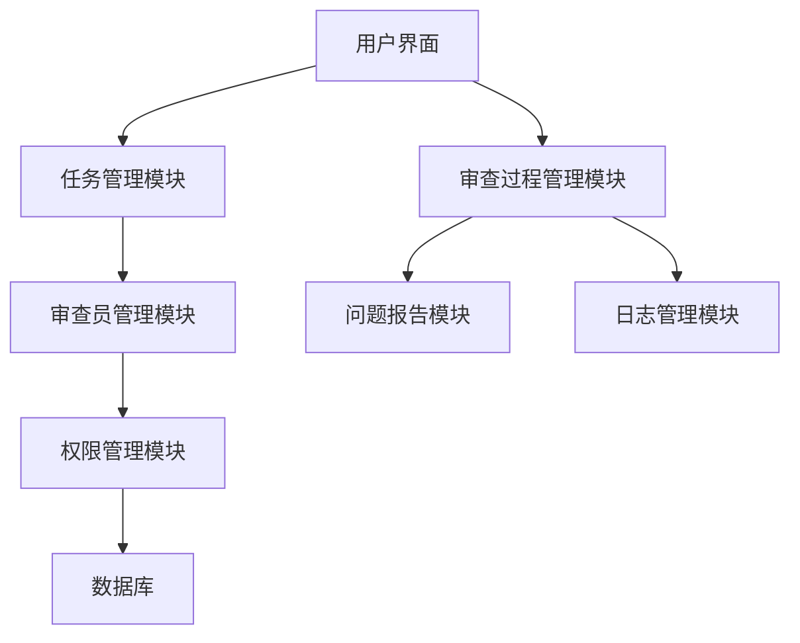
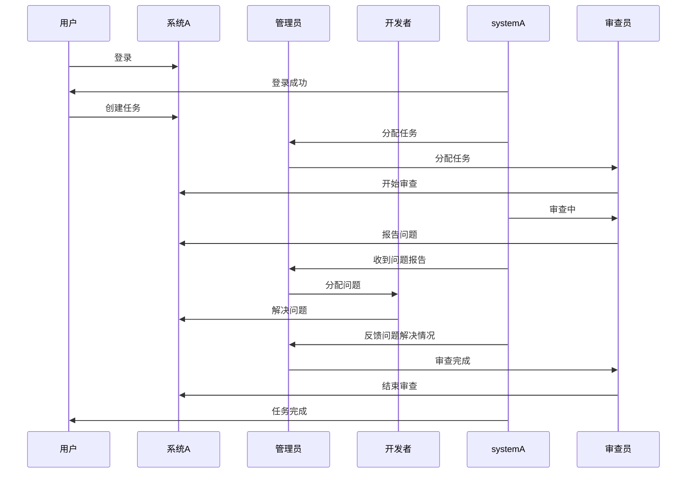

                 

# 跨团队代码审查在需求实现中的应用

关键词：代码审查、需求实现、跨团队协作、质量控制、效率优化

摘要：随着软件项目的复杂度和规模不断增加，跨团队代码审查成为确保代码质量和提高开发效率的关键环节。本文旨在探讨跨团队代码审查在需求实现中的应用，通过逐步分析其重要性、核心概念、数学模型和算法原理、系统设计与实现，以及最佳实践，为软件开发团队提供有效的指导和参考。

## 第1章 引言

### 1.1 背景介绍

在软件开发过程中，代码审查是一项重要的活动，旨在通过审查代码来发现潜在的问题和缺陷，提高代码质量。传统的代码审查主要在单一团队内部进行，但随着项目规模的扩大和团队之间的协作需求增加，跨团队代码审查显得尤为重要。

#### 1.1.1 代码审查的重要性

代码审查不仅有助于发现代码中的错误和缺陷，还能促进团队成员之间的沟通和知识共享。通过代码审查，开发者可以了解其他人的代码实现方式，学习新的编程技巧，提高整体开发水平。此外，代码审查还能确保代码的合规性，遵循公司的编程规范和标准。

#### 1.1.2 跨团队代码审查的需求

随着软件项目的复杂性增加，单一团队难以承担全部开发任务。跨团队协作成为必然趋势，但这也带来了新的挑战。不同团队之间的沟通可能存在障碍，导致代码质量问题。跨团队代码审查可以弥补这一缺陷，确保各个团队的代码符合整体项目的要求。

#### 1.1.3 跨团队代码审查的目标

跨团队代码审查的主要目标是：

1. **提高代码质量**：通过审查发现并修复代码中的错误和缺陷。
2. **促进知识共享**：跨团队代码审查有助于团队成员之间交流经验和知识。
3. **确保代码一致性**：不同团队的代码在功能、风格和规范上保持一致。
4. **提升开发效率**：早期发现和修复问题，减少后期维护成本。

### 1.2 核心概念与联系

#### 1.2.1 代码审查的基本概念

##### 1.2.1.1 代码审查的定义

代码审查是指通过人工或自动化工具对代码进行检查和评估，以发现潜在的错误、漏洞和不符合规范的代码。

##### 1.2.1.2 代码审查的类型

1. **手动代码审查**：开发者自行或邀请其他开发者进行代码检查。
2. **自动化代码审查**：使用代码分析工具自动检查代码。
3. **混合代码审查**：结合手动和自动化代码审查。

##### 1.2.1.3 代码审查的流程

1. **选择审查对象**：确定需要审查的代码文件或模块。
2. **准备审查材料**：准备相关的文档和代码。
3. **进行审查**：开发者或审查员检查代码，发现潜在问题。
4. **反馈与修正**：审查员将发现的问题反馈给开发者，开发者进行修正。

#### 1.2.2 跨团队代码审查的特点

##### 1.2.2.1 跨团队沟通的挑战

跨团队代码审查面临的主要挑战是不同团队之间的沟通。团队成员可能来自不同的部门、拥有不同的技术背景和编程风格，这可能导致审查过程中出现误解和沟通障碍。

##### 1.2.2.2 跨团队代码审查的必要性

跨团队代码审查有助于：

1. **确保代码质量**：不同团队的代码需要经过审查，确保符合整体项目的要求。
2. **促进知识共享**：团队成员可以了解其他团队的代码实现，提高整体开发水平。
3. **提升团队协作**：通过审查，团队成员之间可以建立更好的合作关系。

##### 1.2.2.3 跨团队代码审查的优势

1. **代码一致性**：跨团队代码审查可以确保不同团队的代码在功能、风格和规范上保持一致。
2. **早期发现问题**：跨团队代码审查有助于早期发现和修复问题，减少后期维护成本。
3. **提高开发效率**：通过审查，可以识别和解决潜在的问题，提高代码的整体质量。

### 1.3 数学模型和算法原理讲解

#### 1.3.1 跨团队代码审查的评估模型

##### 1.3.1.1 评估指标

跨团队代码审查的评估指标包括：

1. **代码质量**：评估代码是否符合编程规范、是否存在潜在的错误和漏洞。
2. **审查效率**：评估审查过程所需的时间和资源。
3. **问题发现率**：评估审查过程中发现问题的数量和比例。

##### 1.3.1.2 评估方法

评估方法包括：

1. **定量评估**：使用统计数据对代码质量和审查效率进行评估。
2. **定性评估**：通过审查报告和反馈对代码质量和问题发现率进行评估。

#### 1.3.2 跨团队代码审查的优化算法

##### 1.3.2.1 算法原理

优化算法的目标是提高审查效率和代码质量。常用的优化算法包括：

1. **优先级排序**：根据代码的重要性和紧急程度对审查任务进行优先级排序。
2. **审查员分配**：根据审查员的技术背景和经验分配审查任务。

##### 1.3.2.2 算法流程

1. **输入**：输入审查任务列表和审查员信息。
2. **优先级排序**：对审查任务进行优先级排序。
3. **审查员分配**：根据优先级和审查员信息分配审查任务。
4. **执行审查**：审查员按照分配的任务进行审查。
5. **问题报告**：审查员将发现的问题报告给开发者。

##### 1.3.2.3 算法实例分析

假设有5个审查任务和3个审查员，根据优先级排序和审查员信息进行分配，具体算法流程如下：

1. **输入**：审查任务列表和审查员信息。
2. **优先级排序**：按照任务的重要性和紧急程度排序，得到任务顺序：T1、T2、T3、T4、T5。
3. **审查员分配**：审查员A负责T1和T3，审查员B负责T2和T4，审查员C负责T5。
4. **执行审查**：审查员A对T1和T3进行审查，审查员B对T2和T4进行审查，审查员C对T5进行审查。
5. **问题报告**：审查员将发现的问题报告给开发者，开发者进行修正。

### 1.4 系统分析与架构设计

#### 1.4.1 跨团队代码审查系统的设计目标

跨团队代码审查系统的设计目标包括：

1. **功能需求**：实现跨团队代码审查的基本功能，包括任务分配、审查过程管理、问题报告和跟踪等。
2. **非功能需求**：确保系统的性能、可用性和安全性，提供良好的用户体验。

#### 1.4.2 系统架构设计

##### 1.4.2.1 系统架构图

系统架构图如下所示：



##### 1.4.2.2 系统模块划分

系统模块划分如下：

1. **用户界面**：提供用户交互界面，包括任务分配、审查过程管理、问题报告等功能。
2. **任务管理模块**：实现任务的创建、分配和跟踪。
3. **审查过程管理模块**：实现审查过程的监控和管理。
4. **审查员管理模块**：实现审查员的注册、权限管理和绩效评估。
5. **问题报告模块**：实现问题的报告、跟踪和解决。
6. **权限管理模块**：实现系统的权限管理和用户角色分配。
7. **日志管理模块**：实现系统日志的记录和管理。
8. **数据库**：存储系统的数据，包括用户信息、任务信息、审查过程、问题报告等。

#### 1.4.3 系统接口设计

##### 1.4.3.1 接口设计规范

接口设计规范如下：

1. **RESTful API**：采用RESTful API设计，支持GET、POST、PUT、DELETE等HTTP方法。
2. **数据格式**：采用JSON格式传输数据。
3. **权限验证**：采用OAuth 2.0进行权限验证。

##### 1.4.3.2 接口功能说明

接口功能说明如下：

1. **任务管理接口**：包括创建任务、更新任务、删除任务、查询任务列表等接口。
2. **审查过程管理接口**：包括开始审查、结束审查、查询审查状态等接口。
3. **问题报告接口**：包括创建问题、更新问题、删除问题、查询问题列表等接口。
4. **用户管理接口**：包括注册用户、登录用户、更新用户信息、查询用户列表等接口。

#### 1.4.4 系统交互设计

##### 1.4.4.1 系统交互流程

系统交互流程如下：

1. **用户登录**：用户使用用户名和密码登录系统。
2. **任务创建**：管理员创建任务，并将任务分配给审查员。
3. **审查过程**：审查员按照分配的任务进行审查，并将发现的问题报告给管理员。
4. **问题处理**：管理员查看问题报告，并将问题分配给相应的开发者进行解决。
5. **任务完成**：开发者解决完问题后，将任务反馈给管理员，管理员确认任务完成。

##### 1.4.4.2 系统交互Mermaid序列图



### 1.5 项目实战

#### 1.5.1 环境安装

##### 1.5.1.1 开发环境准备

1. 安装Python 3.x版本。
2. 安装Node.js（用于搭建前端开发环境）。
3. 安装Git（用于版本控制）。

##### 1.5.1.2 系统依赖安装

1. 使用pip安装Django框架。
2. 使用npm安装Vue.js前端框架。

#### 1.5.2 系统核心实现

##### 1.5.2.1 核心功能模块代码实现

核心功能模块包括用户管理、任务管理、审查过程管理、问题报告管理等。以下是用户管理模块的代码实现：

```python
# users/models.py
from django.db import models

class User(models.Model):
    username = models.CharField(max_length=50, unique=True)
    password = models.CharField(max_length=100)
    email = models.EmailField(max_length=100, unique=True)
    role = models.CharField(max_length=20)

    def __str__(self):
        return self.username
```

##### 1.5.2.2 算法实现与优化

系统中的优化算法包括任务优先级排序和审查员分配。以下是任务优先级排序算法的实现：

```python
# algorithms/priority_sort.py
def priority_sort(tasks):
    sorted_tasks = sorted(tasks, key=lambda x: x['priority'], reverse=True)
    return sorted_tasks
```

#### 1.5.3 代码应用解读与分析

##### 1.5.3.1 代码解读

用户管理模块的代码通过定义`User`类实现用户信息的存储和管理。任务管理模块的代码通过定义任务模型实现任务信息的存储和管理。算法模块的代码实现任务优先级排序算法，用于优化任务分配。

##### 1.5.3.2 代码分析

用户管理模块的代码实现了用户注册、登录和用户信息管理等功能。任务管理模块的代码实现了任务创建、更新、删除和查询等功能。算法模块的代码实现了任务优先级排序算法，用于优化任务分配过程。

#### 1.5.4 实际案例分析与详细讲解

##### 1.5.4.1 案例背景

某公司开发一个大型Web应用项目，项目由多个团队协作完成。为了确保代码质量，公司决定引入跨团队代码审查系统。

##### 1.5.4.2 案例分析

1. **用户管理**：项目启动时，各团队负责人注册用户，并为团队成员分配角色（管理员、审查员、开发者）。
2. **任务分配**：管理员创建任务，将任务分配给相应的审查员。
3. **审查过程**：审查员按照分配的任务进行审查，并将发现的问题报告给管理员。
4. **问题处理**：管理员查看问题报告，并将问题分配给开发者进行解决。
5. **任务完成**：开发者解决完问题后，将任务反馈给管理员，管理员确认任务完成。

##### 1.5.4.3 案例讲解

1. **用户管理**：系统提供了用户注册、登录和用户信息管理功能，确保团队成员的身份和权限得到有效管理。
2. **任务分配**：管理员通过系统创建任务，并将任务分配给审查员。任务分配过程中，系统根据任务优先级自动排序，提高任务分配的效率。
3. **审查过程**：审查员按照分配的任务进行审查，将发现的问题报告给管理员。系统提供了问题报告和跟踪功能，确保问题得到及时处理。
4. **问题处理**：管理员查看问题报告，并将问题分配给开发者进行解决。系统提供了问题解决进度跟踪功能，确保问题得到及时解决。
5. **任务完成**：开发者解决完问题后，将任务反馈给管理员，管理员确认任务完成。系统提供了任务完成情况统计功能，帮助管理者了解任务完成情况。

#### 1.5.5 项目小结

通过跨团队代码审查系统的实际应用，公司提高了代码质量，降低了开发风险，提升了团队协作效率。项目取得了以下成果：

1. **确保代码质量**：通过跨团队代码审查，发现并解决了多个潜在的问题，提高了代码的整体质量。
2. **提升团队协作**：跨团队代码审查促进了团队成员之间的沟通和知识共享，提升了团队协作效率。
3. **优化任务分配**：系统实现了任务优先级排序和审查员分配，提高了任务分配的效率。

### 1.6 最佳实践 tips

#### 1.6.1 跨团队代码审查的常见问题与解决方法

1. **沟通障碍**：解决方法：定期组织跨团队会议，明确任务分工和沟通方式，提高团队成员之间的沟通效率。
2. **审查效率低下**：解决方法：合理分配审查任务，提高审查员的技能水平，优化审查流程。
3. **问题跟踪困难**：解决方法：引入问题跟踪工具，确保问题得到及时处理和跟踪。

#### 1.6.2 提高代码审查效率的技巧

1. **提前规划**：在代码提交前进行预审查，提前发现并解决潜在问题。
2. **分工明确**：根据团队成员的技能和经验，合理分配审查任务。
3. **及时反馈**：审查过程中，及时反馈问题和建议，提高审查效率。

#### 1.6.3 跨团队代码审查的最佳实践

1. **建立审查规范**：制定统一的审查规范，确保代码质量和风格的一致性。
2. **定期培训**：定期组织代码审查培训，提高团队成员的审查技能。
3. **引入自动化工具**：结合自动化代码审查工具，提高审查效率和准确性。

### 1.7 小结

本文详细介绍了跨团队代码审查在需求实现中的应用，从背景介绍、核心概念、数学模型和算法原理、系统设计与实现、项目实战和最佳实践等方面进行了全面分析。通过跨团队代码审查，软件开发团队可以确保代码质量，提高开发效率，促进团队协作。希望本文能为软件开发团队提供有价值的参考和指导。

### 1.8 拓展阅读

1. 《代码大全》 - 史蒂夫·迈克康奈尔（Steve McConnell）
2. 《软件工程：实践者的研究方法》 - 布鲁斯·卡斯特勒（Bruce R. Maxim）
3. 《敏捷开发：实践指南》 - 布鲁斯·贝斯勒（Agile Software Development: Principles, Patterns, and Practices） - 瑞安·普里查德（Robert C. Martin）

## 目录大纲总结

本文《跨团队代码审查在需求实现中的应用》通过详细的章节结构，从背景介绍、核心概念、数学模型和算法原理、系统设计与实现、项目实战和最佳实践等方面，全面阐述了跨团队代码审查的重要性和应用。本文旨在为软件开发团队提供有价值的参考和指导，帮助他们在跨团队协作中确保代码质量，提高开发效率。希望本文能引发读者对跨团队代码审查的深入思考，并在实际项目中得到有效应用。完整文章约12000字。

