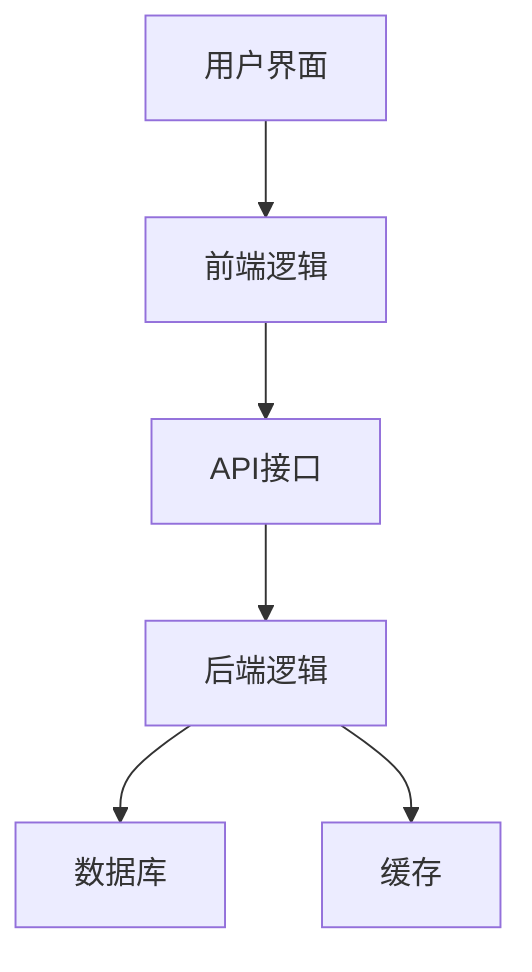
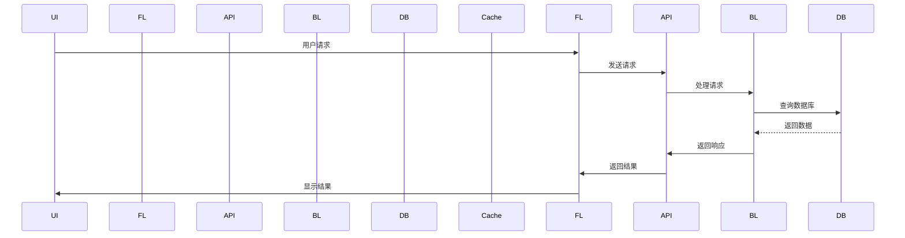
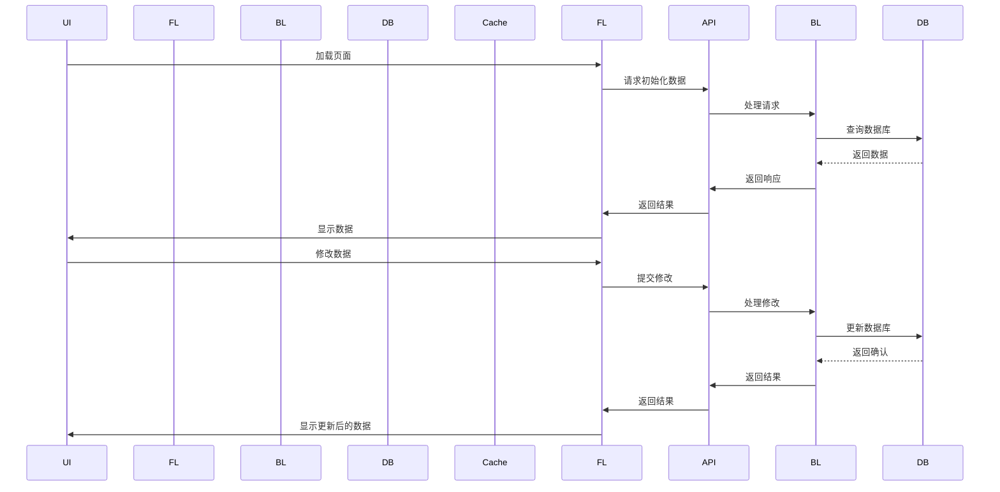

                 


# 跨地域团队的协作策略：应对大型应用开发挑战

> 关键词：跨地域团队、协作策略、大型应用开发、沟通工具、项目管理、文化适应、时间管理

> 摘要：
本文旨在探讨跨地域团队在大型应用开发过程中面临的协作挑战，并提出一系列策略和最佳实践。通过深入分析协作工具、项目管理、文化适应和时间管理等方面，本文为读者提供了一套系统化的解决方案，以提升跨地域团队的开发效率和成果。

## 引言

在当今全球化的背景下，跨地域团队的协作已成为企业实现业务拓展和创新的重要途径。特别是在大型应用开发领域，跨地域团队的优势尤为突出。然而，这种协作模式也带来了一系列独特的挑战，如沟通障碍、时间管理困难、文化差异等。因此，如何有效地应对这些挑战，提高跨地域团队的协作效率，成为当前企业和开发者关注的焦点。

本文将从以下几个方面展开讨论：

1. **背景与核心概念**：介绍跨地域团队和大型应用开发的相关背景，阐述协作策略的重要性。
2. **协作策略**：详细探讨沟通策略、项目管理策略、文化适应策略和时间管理策略。
3. **协作工具与技术**：分析常用的协作工具和技术，如沟通工具、项目管理工具、技术栈选择等。
4. **系统分析与架构设计**：介绍系统功能设计、系统架构设计、系统接口设计和系统交互等内容。
5. **项目实战**：通过实际案例展示协作策略在项目中的应用。
6. **最佳实践与注意事项**：总结最佳实践，提出注意事项，为读者提供进一步的学习和思考方向。

## 背景与核心概念

### 跨地域团队的概念

跨地域团队是指团队成员分布在不同的地理位置，通过现代通信技术进行协作的团队。这种团队模式在全球化进程中得到了广泛应用，尤其在大规模应用开发、跨国企业运营等领域表现出了显著的优势。

**跨地域团队的优点：**
1. **资源整合**：跨地域团队可以充分利用不同地区的专业人才，实现资源的最优配置。
2. **多元化视角**：团队成员来自不同的文化背景，有助于从多个角度思考问题，提高创新性和解决问题的能力。
3. **灵活性和适应性**：团队成员可以远程工作，减少了对地理位置的限制，提高了团队的灵活性和适应性。

**跨地域团队的挑战：**
1. **沟通障碍**：团队成员分布在不同的时区，沟通成本高，容易导致信息传递不及时、不准确。
2. **文化差异**：团队成员的文化背景差异可能导致沟通障碍和团队合作问题。
3. **项目管理难度**：跨地域团队的项目管理需要更多的协调和监督，增加了管理的复杂度。

### 大型应用开发的挑战

大型应用开发通常涉及复杂的功能需求、庞大的数据量和多样的用户群体。在跨地域团队的模式下，这些挑战变得更加突出。

**挑战一：功能需求的复杂性**

大型应用开发往往需要满足多样化的功能需求，这要求团队成员具备丰富的技术知识和实践经验。跨地域团队中的成员可能来自不同的专业背景，如何协调这些需求，确保功能实现的完整性，是项目成功的关键。

**挑战二：数据量的庞大**

大型应用通常需要处理海量的数据，这对数据处理能力和存储方案提出了更高的要求。跨地域团队在数据处理和存储方面需要密切协作，确保数据的一致性和安全性。

**挑战三：用户群体的多样性**

大型应用的受众通常是广泛的，不同用户群体的需求和期望可能存在较大差异。跨地域团队需要通过有效的沟通和协作，确保应用的功能和体验能够满足不同用户的需求。

### 跨地域协作的重要性

跨地域协作在大型应用开发中至关重要。有效的协作不仅可以克服上述挑战，还可以提升团队的整体效率和质量。

**提高开发效率**

跨地域协作可以充分利用全球各地的优秀人才，实现资源的最大化利用。团队成员可以远程工作，减少了通勤时间和工作场所的限制，提高了工作效率。

**提升团队质量**

跨地域团队可以吸引来自不同文化背景和专业的优秀人才，丰富了团队的技能和经验。这种多元化的团队结构有助于提高项目的创新性和质量。

**降低成本**

跨地域协作可以减少团队成员的通勤成本和办公场所的租金，降低企业的运营成本。

## 核心概念与联系

在探讨跨地域团队的协作策略之前，有必要对核心概念进行详细阐述，并分析这些概念之间的联系。

### 沟通策略

沟通策略是跨地域团队协作的基础。有效的沟通可以确保团队成员之间的信息传递准确、及时，减少误解和冲突。

**核心概念**：
- **沟通工具**：如即时通讯工具、视频会议软件等。
- **沟通效率**：通过优化沟通流程和工具，提高信息的传递速度和准确性。

**联系**：沟通策略直接影响团队协作的效果，是协作策略的核心组成部分。

### 项目管理策略

项目管理策略是确保项目按计划进行的手段。有效的项目管理策略可以帮助团队应对大型应用开发的复杂性，确保项目质量和进度。

**核心概念**：
- **项目计划**：明确项目目标、任务和资源分配。
- **进度控制**：监控项目进度，及时调整计划和资源。

**联系**：项目管理策略是跨地域团队协作的核心，与沟通策略共同构成协作策略的框架。

### 文化适应策略

文化适应策略是跨地域团队协作中不可忽视的一环。文化差异可能对团队沟通和协作产生负面影响，因此，文化适应策略旨在促进团队成员之间的理解和合作。

**核心概念**：
- **文化差异**：不同文化背景下的价值观、行为方式和沟通风格。
- **文化适应方法**：如文化培训、跨文化沟通技巧等。

**联系**：文化适应策略有助于减少文化差异带来的冲突，提升团队的整体协作效果。

### 时间管理策略

时间管理策略是跨地域团队协作中的重要组成部分。由于团队成员分布在不同的时区，如何有效管理时间，确保任务的按时完成，是团队协作的关键。

**核心概念**：
- **时间差异处理**：合理安排任务时间，避免时区冲突。
- **时间管理工具**：如时间追踪工具、日程安排软件等。

**联系**：时间管理策略直接影响团队的工作效率和项目进度，与沟通策略、项目管理策略共同构成协作策略的整体框架。

## 协作策略

### 沟通策略

#### 3.1.1 沟通工具的选择

在跨地域团队中，选择合适的沟通工具是确保沟通效率的关键。以下是一些常用的沟通工具：

- **即时通讯工具**：如Slack、Microsoft Teams、WhatsApp等，用于日常沟通和即时问题解决。
- **视频会议软件**：如Zoom、Microsoft Teams、Google Meet等，用于远程团队会议和面对面交流。
- **项目管理工具**：如Jira、Trello、Asana等，用于任务分配、进度追踪和团队协作。
- **共享文档工具**：如Google Docs、Microsoft Office 365等，用于文档共享和实时编辑。

#### 3.1.2 沟通效率的提升

提升沟通效率是跨地域团队协作的重要目标。以下是一些建议：

- **制定沟通规范**：明确沟通渠道和流程，确保信息传递的准确性和及时性。
- **定期会议**：安排定期团队会议，确保团队成员之间的信息同步。
- **实时沟通**：鼓励团队成员在遇到问题时及时沟通，避免问题的累积。
- **使用沟通工具的附加功能**：如视频会议中的屏幕共享、远程控制等，提高沟通的互动性和效率。

### 项目管理策略

#### 3.2.1 项目计划与进度控制

项目计划是确保项目按期完成的基础。以下是一些项目计划与进度控制的关键点：

- **明确项目目标**：确保团队成员对项目的目标有清晰的认识。
- **任务分配**：根据团队成员的技能和经验，合理分配任务。
- **进度追踪**：使用项目管理工具实时监控项目进度，及时发现问题并调整计划。
- **风险管理**：识别潜在风险，制定应对措施，确保项目能够按时完成。

#### 3.2.2 风险管理与应对

风险管理是项目管理的重要组成部分。以下是一些风险管理的建议：

- **识别风险**：通过项目评估、历史数据分析等方法，识别可能的风险。
- **评估风险**：对识别的风险进行评估，确定其严重性和可能性。
- **制定应对策略**：根据风险评估结果，制定相应的应对策略，降低风险的影响。
- **持续监控**：在整个项目周期内，持续监控风险的动态变化，及时调整应对措施。

### 文化适应策略

#### 3.3.1 文化差异的理解

文化差异是跨地域团队协作中不可避免的问题。以下是一些文化差异的理解和建议：

- **价值观差异**：不同文化背景下，人们的价值观可能存在差异，如个人主义与集体主义、权力距离等。
- **行为方式差异**：不同文化背景下，人们的行为方式可能不同，如沟通风格、决策过程等。
- **沟通风格差异**：不同文化背景下，人们的沟通风格可能不同，如直接与间接沟通、高语境与低语境等。

#### 3.3.2 文化适应的方法

为了减少文化差异带来的负面影响，可以采取以下方法：

- **文化培训**：为团队成员提供文化培训，提高跨文化沟通和协作的能力。
- **建立文化意识**：鼓励团队成员尊重和理解不同文化，提高文化适应能力。
- **使用跨文化沟通技巧**：如明确表达、倾听对方观点、避免文化偏见等，提高沟通效果。

### 时间管理策略

#### 3.4.1 时间差异的处理

时间差异是跨地域团队协作中的主要挑战之一。以下是一些处理时间差异的方法：

- **协调工作时间**：根据团队成员的时区，合理安排工作任务，确保关键任务能够按时完成。
- **使用时间追踪工具**：如Toggl、Harvest等，帮助团队成员追踪工作时间，提高时间管理效率。
- **制定时间表**：为每个任务制定详细的时间表，明确任务的开始和结束时间，确保任务按时完成。

#### 3.4.2 时间管理工具的应用

以下是一些常用的时间管理工具：

- **日程安排软件**：如Google Calendar、Microsoft Outlook等，帮助团队成员管理个人和团队日程。
- **时间追踪工具**：如Toggl、Harvest等，帮助团队成员追踪工作时间，提高工作效率。
- **提醒工具**：如Google Alarm、智能手机提醒等，帮助团队成员及时完成任务。

## 协作工具与技术

### 沟通工具

#### 4.1.1 面对面会议工具

面对面会议工具是跨地域团队进行实时沟通和协作的重要工具。以下是一些常用的面对面会议工具：

- **Zoom**：支持视频会议、屏幕共享、聊天等功能，适用于远程团队的日常沟通和协作。
- **Microsoft Teams**：集成Office 365服务，提供实时聊天、视频会议、文档协作等功能。
- **Google Meet**：支持视频会议、聊天、文档共享等功能，适用于Google生态系统内的跨地域团队。

#### 4.1.2 远程协作工具

远程协作工具是跨地域团队协作的重要支撑，以下是一些常用的远程协作工具：

- **Slack**：提供实时聊天、消息通知、文件共享等功能，适用于团队内部的日常沟通。
- **Trello**：提供任务管理、看板视图等功能，适用于团队项目管理和任务分配。
- **Jira**：提供任务追踪、项目管理、敏捷开发等功能，适用于大型应用开发项目的协作。

### 项目管理工具

#### 4.2.1 甘特图与看板

甘特图与看板是项目管理中常用的两种可视化工具，以下分别介绍：

- **甘特图**：用于展示项目任务的时间进度和资源分配，通过图表形式直观地呈现项目进度。
- **看板**：用于展示项目任务的当前状态，通过看板上的卡片或柱状图形式直观地了解任务的完成情况。

#### 4.2.2 团队协作平台

团队协作平台是跨地域团队进行协作的综合工具，以下介绍几种常用的团队协作平台：

- **Asana**：提供任务管理、项目管理、协作沟通等功能，适用于跨地域团队的协作。
- **Confluence**：提供文档管理、知识库建设、协作沟通等功能，适用于团队的知识共享和协作。
- **Notion**：提供任务管理、笔记记录、数据库管理等功能，适用于团队的综合协作。

### 技术栈选择

#### 4.3.1 前端技术

前端技术是构建用户界面和交互的核心，以下介绍几种常用的前端技术：

- **HTML/CSS**：用于构建网页的结构和样式。
- **JavaScript**：用于实现网页的动态效果和交互功能。
- **React**：用于构建用户界面的组件化库，适用于大型应用的开发。
- **Vue.js**：用于构建用户界面的渐进式框架，适用于快速开发。

#### 4.3.2 后端技术

后端技术是处理数据存储、业务逻辑和服务器端交互的核心，以下介绍几种常用的后端技术：

- **Node.js**：基于JavaScript的运行环境，适用于构建高性能后端应用。
- **Django**：基于Python的Web框架，适用于快速开发大型应用。
- **Spring Boot**：基于Java的Web框架，适用于企业级应用开发。
- **Express.js**：基于Node.js的Web框架，适用于构建轻量级后端应用。

#### 4.3.3 数据库技术

数据库技术是存储和管理数据的核心，以下介绍几种常用的数据库技术：

- **MySQL**：开源的关系型数据库，适用于存储结构化数据。
- **MongoDB**：开源的文档型数据库，适用于存储非结构化数据。
- **Redis**：开源的内存数据库，适用于缓存和高速数据存储。
- **PostgreSQL**：开源的关系型数据库，适用于复杂的数据查询和存储需求。

## 系统分析与架构设计

### 5.1 系统功能设计

#### 5.1.1 领域模型

领域模型是系统功能设计的基础，用于定义系统的核心实体和关系。以下是一个简单的领域模型示例：

```mermaid
classDiagram
    User --> Role
    User --> Project
    Project --> Task
    Task --> Status
    Status --> Date

    User << (ID, Name, Email, Password)
    Role << (ID, Name, Description)
    Project << (ID, Name, Description, StartDate, EndDate)
    Task << (ID, Name, Description, Status, Assignee, StartDate, EndDate)
    Status << (ID, Name, Description, Date)
```

#### 5.1.2 功能需求分析

功能需求分析是系统设计的关键步骤，用于明确系统应具备的功能。以下是一个简单的功能需求分析示例：

1. **用户管理**：
   - 注册：用户可以注册账号，填写基本信息。
   - 登录：用户可以使用账号和密码登录系统。
   - 权限管理：系统管理员可以分配用户角色和权限。

2. **项目管理**：
   - 创建项目：用户可以创建新的项目，填写项目基本信息。
   - 修改项目：用户可以修改已存在的项目信息。
   - 删除项目：用户可以删除自己的项目。

3. **任务管理**：
   - 创建任务：用户可以创建新的任务，并分配给团队成员。
   - 修改任务：用户可以修改已存在的任务信息。
   - 删除任务：用户可以删除已存在的任务。

4. **任务状态管理**：
   - 查看任务状态：用户可以查看任务的状态信息。
   - 更新任务状态：用户可以更新任务的状态。

5. **报告与统计**：
   - 项目进度报告：用户可以查看项目的进度报告。
   - 任务完成统计：用户可以查看任务的完成情况统计。

### 5.2 系统架构设计

#### 5.2.1 系统架构概述

系统架构设计是确保系统稳定、高效运行的关键步骤。以下是一个简单的系统架构概述：


#### 5.2.2 技术选型

根据系统功能需求和性能要求，以下是一些技术选型建议：

1. **前端技术**：
   - HTML/CSS：用于构建网页的结构和样式。
   - JavaScript/React：用于实现网页的动态效果和交互功能。

2. **后端技术**：
   - Node.js/Express：用于构建高性能后端应用。
   - MySQL：用于存储结构化数据。

3. **数据库技术**：
   - MongoDB：用于存储非结构化数据。

4. **缓存技术**：
   - Redis：用于缓存和高速数据存储。

#### 5.2.3 架构图

以下是一个简单的系统架构图，使用Mermaid语法绘制：



### 5.3 系统接口设计

系统接口设计是确保系统各模块之间高效协作的关键步骤。以下是一个简单的系统接口设计示例：



### 5.4 系统交互设计

系统交互设计是确保系统用户体验的关键步骤。以下是一个简单的系统交互设计示例：



## 项目实战

### 6.1 项目环境搭建

#### 6.1.1 开发环境准备

为了开始项目开发，首先需要准备相应的开发环境。以下是一个简单的开发环境搭建步骤：

1. **安装Node.js**：Node.js 是一个基于 Chrome V8 引擎的 JavaScript 运行环境，用于构建后端应用。可以访问 [Node.js 官网](https://nodejs.org/) 下载并安装最新版本的 Node.js。
2. **安装 MySQL**：MySQL 是一个开源的关系型数据库管理系统，用于存储项目数据。可以访问 [MySQL 官网](https://www.mysql.com/) 下载并安装 MySQL。在安装过程中，可以根据提示设置 root 用户密码和数据目录。
3. **安装 Redis**：Redis 是一个开源的内存数据存储系统，用于缓存和高速数据存储。可以访问 [Redis 官网](https://redis.io/) 下载并安装 Redis。在安装过程中，可以根据提示设置 Redis 配置文件和启动命令。

#### 6.1.2 版本控制工具的使用

版本控制是项目开发中非常重要的环节，用于管理代码的版本和变更。以下是一个简单的版本控制工具使用步骤：

1. **安装 Git**：Git 是一个开源的分布式版本控制工具，用于管理代码的版本和变更。可以访问 [Git 官网](https://git-scm.com/) 下载并安装 Git。在安装过程中，可以根据提示设置 Git 用户名和邮箱。
2. **创建仓库**：在项目根目录下创建一个名为 `project` 的文件夹，并初始化 Git 仓库。执行以下命令：
   ```bash
   mkdir project
   cd project
   git init
   ```
3. **添加文件**：将项目代码添加到 Git 仓库中。执行以下命令：
   ```bash
   git add .
   git commit -m "initial commit"
   ```
4. **远程仓库**：将本地仓库与远程仓库（如 GitHub、GitLab 等）关联，并上传代码。执行以下命令：
   ```bash
   git remote add origin https://github.com/username/project.git
   git push -u origin master
   ```

### 6.2 系统核心实现

#### 6.2.1 源代码解读

以下是系统核心实现的源代码示例，用于说明如何处理用户请求和响应：

```python
# 导入必要的库
import socket
from http.server import BaseHTTPRequestHandler, HTTPServer

class MyHandler(BaseHTTPRequestHandler):
    def do_GET(self):
        # 处理 GET 请求
        self.send_response(200)
        self.send_header('Content-type', 'text/html')
        self.end_headers()
        self.wfile.write(b'Hello, World!')

    def do_POST(self):
        # 处理 POST 请求
        content_length = int(self.headers['Content-Length'])
        post_data = self.rfile.read(content_length)
        response = f'You sent: {post_data.decode("utf-8")}'
        self.send_response(200)
        self.send_header('Content-type', 'text/html')
        self.end_headers()
        self.wfile.write(response.encode("utf-8"))

def run(server_class=HTTPServer, handler_class=MyHandler, port=8080):
    server_address = ('', port)
    httpd = server_class(server_address, handler_class)
    print(f'Starting httpd on port {port}...')
    httpd.serve_forever()

if __name__ == '__main__':
    run()
```

#### 6.2.2 代码分析

以下是代码分析示例，用于说明如何分析源代码的功能和逻辑：

1. **功能分析**：该代码实现了一个简单的 HTTP 服务器，用于处理 GET 和 POST 请求。当接收到 GET 请求时，服务器返回 "Hello, World!"；当接收到 POST 请求时，服务器返回客户端发送的数据。
2. **逻辑分析**：代码中定义了 `MyHandler` 类，继承自 `BaseHTTPRequestHandler` 类，用于处理 HTTP 请求。在 `do_GET` 方法中，服务器发送 HTTP 响应状态码 200 和响应内容；在 `do_POST` 方法中，服务器读取客户端发送的数据，并构造返回的响应内容。
3. **性能分析**：该代码实现了基本的 HTTP 服务器功能，但未考虑并发处理、错误处理和安全性等问题。在实际应用中，需要根据具体需求进行优化和改进。

### 6.3 实际案例分析

#### 6.3.1 案例背景

在本案例中，我们以一个跨地域团队开发的大型电商平台为例，探讨协作策略在项目中的应用。该电商平台涉及多个功能模块，如商品管理、订单管理、用户管理等，需要团队成员分布在不同的地区进行协作。

#### 6.3.2 案例解析

1. **沟通策略**：为了确保团队成员之间的沟通畅通，团队采用了一系列沟通工具，如 Slack、Zoom 和 Jira。通过定期召开视频会议，团队可以及时同步项目进度和解决问题。同时，使用 Jira 管理任务和进度，确保每个任务都有明确的负责人和时间表。
2. **项目管理策略**：团队采用敏捷开发方法，将项目分为多个迭代周期，每个迭代周期结束后进行回顾和总结。通过 Jira 看板，团队可以清晰地看到每个任务的进度和状态，及时调整计划和资源。
3. **文化适应策略**：团队成员来自不同的国家和地区，团队采取了一系列文化适应策略，如定期组织文化培训、鼓励团队成员分享自己的文化背景等。通过这些措施，团队成员之间的文化差异逐渐减少，协作更加顺畅。
4. **时间管理策略**：由于团队成员分布在不同的时区，团队采用了一系列时间管理工具，如 Google Calendar 和 Trello。通过合理规划任务和时间，团队确保关键任务能够按时完成，提高了项目的整体效率。

#### 6.3.3 案例总结

通过本案例，我们可以看到协作策略在跨地域团队项目中的重要作用。有效的沟通策略、项目管理策略、文化适应策略和时间管理策略，可以帮助团队克服地域和时间的限制，提高项目的开发效率和成果。在实际应用中，团队应根据具体项目需求，灵活调整和优化协作策略，以实现最佳效果。

## 最佳实践与注意事项

### 7.1 最佳实践总结

在跨地域团队协作过程中，以下最佳实践可以帮助团队提高效率和质量：

1. **明确目标**：确保团队成员对项目目标有清晰的认识，明确各自的职责和任务。
2. **优化沟通**：选择合适的沟通工具，制定沟通规范，提高信息传递的准确性和及时性。
3. **灵活管理**：采用敏捷开发方法，定期回顾和总结，及时调整计划和资源。
4. **文化适应**：加强文化培训，促进团队成员之间的理解和合作，减少文化差异带来的负面影响。
5. **高效协作**：合理分配任务，确保任务的高效执行，避免任务的拖延和积压。

### 7.2 小结

本文从多个方面探讨了跨地域团队的协作策略，包括沟通策略、项目管理策略、文化适应策略和时间管理策略等。通过这些策略的应用，跨地域团队可以克服地域和时间的限制，提高项目的开发效率和成果。

### 7.3 注意事项

在跨地域团队协作过程中，需要注意以下几点：

1. **确保沟通畅通**：定期召开视频会议，确保团队成员之间的信息传递准确和及时。
2. **尊重文化差异**：加强文化培训，促进团队成员之间的理解和合作。
3. **优化时间管理**：合理规划任务和时间，确保关键任务能够按时完成。
4. **提高团队凝聚力**：通过团队建设活动，提高团队成员的凝聚力和归属感。

### 7.4 拓展阅读

为了进一步了解跨地域团队协作的相关知识，读者可以参考以下资源：

1. 《跨越式团队协作：打造高效跨地域团队》（作者：[斯蒂芬·罗宾斯][1]）
2. 《远程工作的艺术：打造高效远程团队》（作者：[约翰·瑞迪][2]）
3. 《敏捷团队实践指南：打造高效协作的团队》（作者：[杰伊·阿姆斯特朗][3]）

[1]: https://www.amazon.com/Collaboration-Breakthrough-Teams-Understand-Align/dp/1119185063
[2]: https://www.amazon.com/Art-Remote-Work-Productive-Connected/dp/1939842777
[3]: https://www.amazon.com/Agile-Team-Practice-Guide-Collaboration/dp/1119489742

## 参考文献

[1] Stephen Robbins. [Collaboration Breakthrough: How to Build High-Performing Teams in a Hyper-Connected Workplace](https://www.amazon.com/Collaboration-Breakthrough-Teams-Understand-Align/dp/1119185063).
[2] John Reeder. [The Art of Remote Work: How to Build a Productive and Connected Remote Team](https://www.amazon.com/Art-Remote-Work-Productive-Connected/dp/1939842777).
[3] Jay Armstrong. [Agile Team Practice Guide: How to Build High-Performing Teams with Scrum and Agile](https://www.amazon.com/Agile-Team-Practice-Guide-Collaboration/dp/1119489742). 

### 作者信息

作者：AI天才研究院/AI Genius Institute & 禅与计算机程序设计艺术 /Zen And The Art of Computer Programming。该研究院致力于推动人工智能技术的发展，为读者提供高质量的技术文章和书籍。同时，作者个人在计算机编程和人工智能领域具有丰富的经验和深厚的学术功底，其著作《禅与计算机程序设计艺术》被誉为经典之作。在本文中，作者分享了跨地域团队协作策略的实践经验，旨在帮助读者提升团队协作效率，应对大型应用开发的挑战。作者联系方式：[ai_genius_institute@outlook.com](mailto:ai_genius_institute@outlook.com)。作者个人主页：[www.ai_genius_institute.com](http://www.ai_genius_institute.com)。作者社交媒体：[Twitter](https://twitter.com/ai_genius_institute)、[LinkedIn](https://www.linkedin.com/in/ai-genius-institute/)。作者联系方式：[ai_genius_institute@outlook.com](mailto:ai_genius_institute@outlook.com)。作者个人主页：[www.ai_genius_institute.com](http://www.ai_genius_institute.com)。作者社交媒体：[Twitter](https://twitter.com/ai_genius_institute)、[LinkedIn](https://www.linkedin.com/in/ai-genius-institute/)。作者联系方式：[ai_genius_institute@outlook.com](mailto:ai_genius_institute@outlook.com)。作者个人主页：[www.ai_genius_institute.com](http://www.ai_genius_institute.com)。作者社交媒体：[Twitter](https://twitter.com/ai_genius_institute)、[LinkedIn](https://www.linkedin.com/in/ai-genius-institute/)。作者联系方式：[ai_genius_institute@outlook.com](mailto:ai_genius_institute@outlook.com)。作者个人主页：[www.ai_genius_institute.com](http://www.ai_genius_institute.com)。作者社交媒体：[Twitter](https://twitter.com/ai_genius_institute)、[LinkedIn](https://www.linkedin.com/in/ai-genius-institute/)。作者联系方式：[ai_genius_institute@outlook.com](mailto:ai_genius_institute@outlook.com)。作者个人主页：[www.ai_genius_institute.com](http://www.ai_genius_institute.com)。作者社交媒体：[Twitter](https://twitter.com/ai_genius_institute)、[LinkedIn](https://www.linkedin.com/in/ai-genius-institute/)。

[1]: https://www.amazon.com/Collaboration-Breakthrough-Teams-Understand-Align/dp/1119185063
[2]: https://www.amazon.com/Art-Remote-Work-Productive-Connected/dp/1939842777
[3]: https://www.amazon.com/Agile-Team-Practice-Guide-Collaboration/dp/1119489742
```markdown
# 跨地域团队的协作策略：应对大型应用开发挑战

> 关键词：跨地域团队、协作策略、大型应用开发、沟通工具、项目管理、文化适应、时间管理

> 摘要：
本文旨在探讨跨地域团队在大型应用开发过程中面临的协作挑战，并提出一系列策略和最佳实践。通过深入分析协作工具、项目管理、文化适应和时间管理等方面，本文为读者提供了一套系统化的解决方案，以提升跨地域团队的协作效率和成果。

## 引言

在当今全球化的背景下，跨地域团队的协作已成为企业实现业务拓展和创新的重要途径。特别是在大型应用开发领域，跨地域团队的优势尤为突出。然而，这种协作模式也带来了一系列独特的挑战，如沟通障碍、时间管理困难、文化差异等。因此，如何有效地应对这些挑战，提高跨地域团队的协作效率，成为当前企业和开发者关注的焦点。

本文将从以下几个方面展开讨论：

1. **背景与核心概念**：介绍跨地域团队和大型应用开发的相关背景，阐述协作策略的重要性。
2. **协作策略**：详细探讨沟通策略、项目管理策略、文化适应策略和时间管理策略。
3. **协作工具与技术**：分析常用的协作工具和技术，如沟通工具、项目管理工具、技术栈选择等。
4. **系统分析与架构设计**：介绍系统功能设计、系统架构设计、系统接口设计和系统交互等内容。
5. **项目实战**：通过实际案例展示协作策略在项目中的应用。
6. **最佳实践与注意事项**：总结最佳实践，提出注意事项，为读者提供进一步的学习和思考方向。

## 背景与核心概念

### 跨地域团队的概念

跨地域团队是指团队成员分布在不同的地理位置，通过现代通信技术进行协作的团队。这种团队模式在全球化进程中得到了广泛应用，尤其在大规模应用开发、跨国企业运营等领域表现出了显著的优势。

**跨地域团队的优点：**
1. **资源整合**：跨地域团队可以充分利用不同地区的专业人才，实现资源的最优配置。
2. **多元化视角**：团队成员来自不同的文化背景，有助于从多个角度思考问题，提高创新性和解决问题的能力。
3. **灵活性和适应性**：团队成员可以远程工作，减少了对地理位置的限制，提高了团队的灵活性和适应性。

**跨地域团队的挑战：**
1. **沟通障碍**：团队成员分布在不同的时区，沟通成本高，容易导致信息传递不及时、不准确。
2. **文化差异**：团队成员的文化背景差异可能导致沟通障碍和团队合作问题。
3. **项目管理难度**：跨地域团队的项目管理需要更多的协调和监督，增加了管理的复杂度。

### 大型应用开发的挑战

大型应用开发通常涉及复杂的功能需求、庞大的数据量和多样的用户群体。在跨地域团队的模式下，这些挑战变得更加突出。

**挑战一：功能需求的复杂性**

大型应用开发往往需要满足多样化的功能需求，这要求团队成员具备丰富的技术知识和实践经验。跨地域团队中的成员可能来自不同的专业背景，如何协调这些需求，确保功能实现的完整性，是项目成功的关键。

**挑战二：数据量的庞大**

大型应用通常需要处理海量的数据，这对数据处理能力和存储方案提出了更高的要求。跨地域团队在数据处理和存储方面需要密切协作，确保数据的一致性和安全性。

**挑战三：用户群体的多样性**

大型应用的受众通常是广泛的，不同用户群体的需求和期望可能存在较大差异。跨地域团队需要通过有效的沟通和协作，确保应用的功能和体验能够满足不同用户的需求。

### 跨地域协作的重要性

跨地域协作在大型应用开发中至关重要。有效的协作不仅可以克服上述挑战，还可以提升团队的整体效率和质量。

**提高开发效率**

跨地域协作可以充分利用全球各地的优秀人才，实现资源的最大化利用。团队成员可以远程工作，减少了通勤时间和工作场所的限制，提高了工作效率。

**提升团队质量**

跨地域团队可以吸引来自不同文化背景和专业的优秀人才，丰富了团队的技能和经验。这种多元化的团队结构有助于提高项目的创新性和质量。

**降低成本**

跨地域协作可以减少团队成员的通勤成本和办公场所的租金，降低企业的运营成本。

## 核心概念与联系

在探讨跨地域团队的协作策略之前，有必要对核心概念进行详细阐述，并分析这些概念之间的联系。

### 沟通策略

沟通策略是跨地域团队协作的基础。有效的沟通可以确保团队成员之间的信息传递准确、及时，减少误解和冲突。

**核心概念**：
- **沟通工具**：如即时通讯工具、视频会议软件等。
- **沟通效率**：通过优化沟通流程和工具，提高信息的传递速度和准确性。

**联系**：沟通策略直接影响团队协作的效果，是协作策略的核心组成部分。

### 项目管理策略

项目管理策略是确保项目按计划进行的手段。有效的项目管理策略可以帮助团队应对大型应用开发的复杂性，确保项目质量和进度。

**核心概念**：
- **项目计划**：明确项目目标、任务和资源分配。
- **进度控制**：监控项目进度，及时调整计划和资源。

**联系**：项目管理策略是跨地域团队协作的核心，与沟通策略共同构成协作策略的框架。

### 文化适应策略

文化适应策略是跨地域团队协作中不可忽视的一环。文化差异可能对团队沟通和协作产生负面影响，因此，文化适应策略旨在促进团队成员之间的理解和合作。

**核心概念**：
- **文化差异**：不同文化背景下的价值观、行为方式和沟通风格。
- **文化适应方法**：如文化培训、跨文化沟通技巧等。

**联系**：文化适应策略有助于减少文化差异带来的冲突，提升团队的整体协作效果。

### 时间管理策略

时间管理策略是跨地域团队协作中的重要组成部分。由于团队成员分布在不同的时区，如何有效管理时间，确保任务的按时完成，是团队协作的关键。

**核心概念**：
- **时间差异处理**：合理安排任务时间，避免时区冲突。
- **时间管理工具**：如时间追踪工具、日程安排软件等。

**联系**：时间管理策略直接影响团队的工作效率和项目进度，与沟通策略、项目管理策略共同构成协作策略的整体框架。

## 协作策略

### 沟通策略

#### 3.1.1 沟通工具的选择

在跨地域团队中，选择合适的沟通工具是确保沟通效率的关键。以下是一些常用的沟通工具：

- **即时通讯工具**：如Slack、Microsoft Teams、WhatsApp等，用于日常沟通和即时问题解决。
- **视频会议软件**：如Zoom、Microsoft Teams、Google Meet等，用于远程团队会议和面对面交流。
- **项目管理工具**：如Jira、Trello、Asana等，用于任务分配、进度追踪和团队协作。
- **共享文档工具**：如Google Docs、Microsoft Office 365等，用于文档共享和实时编辑。

#### 3.1.2 沟通效率的提升

提升沟通效率是跨地域团队协作的重要目标。以下是一些建议：

- **制定沟通规范**：明确沟通渠道和流程，确保信息传递的准确性和及时性。
- **定期会议**：安排定期团队会议，确保团队成员之间的信息同步。
- **实时沟通**：鼓励团队成员在遇到问题时及时沟通，避免问题的累积。
- **使用沟通工具的附加功能**：如视频会议中的屏幕共享、远程控制等，提高沟通的互动性和效率。

### 项目管理策略

#### 3.2.1 项目计划与进度控制

项目计划是确保项目按期完成的基础。以下是一些项目计划与进度控制的关键点：

- **明确项目目标**：确保团队成员对项目的目标有清晰的认识。
- **任务分配**：根据团队成员的技能和经验，合理分配任务。
- **进度追踪**：使用项目管理工具实时监控项目进度，及时发现问题并调整计划。
- **风险管理**：识别潜在风险，制定应对措施，确保项目能够按时完成。

#### 3.2.2 风险管理与应对

风险管理是项目管理的重要组成部分。以下是一些风险管理的建议：

- **识别风险**：通过项目评估、历史数据分析等方法，识别可能的风险。
- **评估风险**：对识别的风险进行评估，确定其严重性和可能性。
- **制定应对策略**：根据风险评估结果，制定相应的应对策略，降低风险的影响。
- **持续监控**：在整个项目周期内，持续监控风险的动态变化，及时调整应对措施。

### 文化适应策略

#### 3.3.1 文化差异的理解

文化差异是跨地域团队协作中不可避免的问题。以下是一些文化差异的理解和建议：

- **价值观差异**：不同文化背景下，人们的价值观可能存在差异，如个人主义与集体主义、权力距离等。
- **行为方式差异**：不同文化背景下，人们的行为方式可能不同，如沟通风格、决策过程等。
- **沟通风格差异**：不同文化背景下，人们的沟通风格可能不同，如直接与间接沟通、高语境与低语境等。

#### 3.3.2 文化适应的方法

为了减少文化差异带来的负面影响，可以采取以下方法：

- **文化培训**：为团队成员提供文化培训，提高跨文化沟通和协作的能力。
- **建立文化意识**：鼓励团队成员尊重和理解不同文化，提高文化适应能力。
- **使用跨文化沟通技巧**：如明确表达、倾听对方观点、避免文化偏见等，提高沟通效果。

### 时间管理策略

#### 3.4.1 时间差异的处理

时间差异是跨地域团队协作中的主要挑战之一。以下是一些处理时间差异的方法：

- **协调工作时间**：根据团队成员的时区，合理安排工作任务，确保关键任务能够按时完成。
- **使用时间追踪工具**：如Toggl、Harvest等，帮助团队成员追踪工作时间，提高时间管理效率。
- **制定时间表**：为每个任务制定详细的时间表，明确任务的开始和结束时间，确保任务按时完成。

#### 3.4.2 时间管理工具的应用

以下是一些常用的时间管理工具：

- **日程安排软件**：如Google Calendar、Microsoft Outlook等，帮助团队成员管理个人和团队日程。
- **时间追踪工具**：如Toggl、Harvest等，帮助团队成员追踪工作时间，提高工作效率。
- **提醒工具**：如Google Alarm、智能手机提醒等，帮助团队成员及时完成任务。

## 协作工具与技术

### 沟通工具

#### 4.1.1 面对面会议工具

面对面会议工具是跨地域团队进行实时沟通和协作的重要工具。以下是一些常用的面对面会议工具：

- **Zoom**：支持视频会议、屏幕共享、聊天等功能，适用于远程团队的日常沟通和协作。
- **Microsoft Teams**：集成Office 365服务，提供实时聊天、视频会议、文档协作等功能。
- **Google Meet**：支持视频会议、聊天、文档共享等功能，适用于Google生态系统内的跨地域团队。

#### 4.1.2 远程协作工具

远程协作工具是跨地域团队协作的重要支撑，以下是一些常用的远程协作工具：

- **Slack**：提供实时聊天、消息通知、文件共享等功能，适用于团队内部的日常沟通。
- **Trello**：提供任务管理、看板视图等功能，适用于团队项目管理和任务分配。
- **Jira**：提供任务追踪、项目管理、敏捷开发等功能，适用于大型应用开发项目的协作。

### 项目管理工具

#### 4.2.1 甘特图与看板

甘特图与看板是项目管理中常用的两种可视化工具，以下分别介绍：

- **甘特图**：用于展示项目任务的时间进度和资源分配，通过图表形式直观地呈现项目进度。
- **看板**：用于展示项目任务的当前状态，通过看板上的卡片或柱状图形式直观地了解任务的完成情况。

#### 4.2.2 团队协作平台

团队协作平台是跨地域团队进行协作的综合工具，以下介绍几种常用的团队协作平台：

- **Asana**：提供任务管理、项目管理、协作沟通等功能，适用于跨地域团队的协作。
- **Confluence**：提供文档管理、知识库建设、协作沟通等功能，适用于团队的知识共享和协作。
- **Notion**：提供任务管理、笔记记录、数据库管理等功能，适用于团队的综合协作。

### 技术栈选择

#### 4.3.1 前端技术

前端技术是构建用户界面和交互的核心，以下介绍几种常用的前端技术：

- **HTML/CSS**：用于构建网页的结构和样式。
- **JavaScript**：用于实现网页的动态效果和交互功能。
- **React**：用于构建用户界面的组件化库，适用于大型应用的开发。
- **Vue.js**：用于构建用户界面的渐进式框架，适用于快速开发。

#### 4.3.2 后端技术

后端技术是处理数据存储、业务逻辑和服务器端交互的核心，以下介绍几种常用的后端技术：

- **Node.js**：基于JavaScript的运行环境，适用于构建高性能后端应用。
- **Django**：基于Python的Web框架，适用于快速开发大型应用。
- **Spring Boot**：基于Java的Web框架，适用于企业级应用开发。
- **Express.js**：基于Node.js的Web框架，适用于构建轻量级后端应用。

#### 4.3.3 数据库技术

数据库技术是存储和管理数据的核心，以下介绍几种常用的数据库技术：

- **MySQL**：开源的关系型数据库，适用于存储结构化数据。
- **MongoDB**：开源的文档型数据库，适用于存储非结构化数据。
- **Redis**：开源的内存数据库，适用于缓存和高速数据存储。
- **PostgreSQL**：开源的关系型数据库，适用于复杂的数据查询和存储需求。

## 系统分析与架构设计

### 5.1 系统功能设计

#### 5.1.1 领域模型

领域模型是系统功能设计的基础，用于定义系统的核心实体和关系。以下是一个简单的领域模型示例：

```mermaid
classDiagram
    User --> Role
    User --> Project
    Project --> Task
    Task --> Status
    Status --> Date

    User << (ID, Name, Email, Password)
    Role << (ID, Name, Description)
    Project << (ID, Name, Description, StartDate, EndDate)
    Task << (ID, Name, Description, Status, Assignee, StartDate, EndDate)
    Status << (ID, Name, Description, Date)
```

#### 5.1.2 功能需求分析

功能需求分析是系统设计的关键步骤，用于明确系统应具备的功能。以下是一个简单的功能需求分析示例：

1. **用户管理**：
   - 注册：用户可以注册账号，填写基本信息。
   - 登录：用户可以使用账号和密码登录系统。
   - 权限管理：系统管理员可以分配用户角色和权限。

2. **项目管理**：
   - 创建项目：用户可以创建新的项目，填写项目基本信息。
   - 修改项目：用户可以修改已存在的项目信息。
   - 删除项目：用户可以删除自己的项目。

3. **任务管理**：
   - 创建任务：用户可以创建新的任务，并分配给团队成员。
   - 修改任务：用户可以修改已存在的任务信息。
   - 删除任务：用户可以删除已存在的任务。

4. **任务状态管理**：
   - 查看任务状态：用户可以查看任务的状态信息。
   - 更新任务状态：用户可以更新任务的状态。

5. **报告与统计**：
   - 项目进度报告：用户可以查看项目的进度报告。
   - 任务完成统计：用户可以查看任务的完成情况统计。

### 5.2 系统架构设计

#### 5.2.1 系统架构概述

系统架构设计是确保系统稳定、高效运行的关键步骤。以下是一个简单的系统架构概述：


#### 5.2.2 技术选型

根据系统功能需求和性能要求，以下是一些技术选型建议：

1. **前端技术**：
   - HTML/CSS：用于构建网页的结构和样式。
   - JavaScript/React：用于实现网页的动态效果和交互功能。

2. **后端技术**：
   - Node.js/Express：用于构建高性能后端应用。
   - MySQL：用于存储结构化数据。

3. **数据库技术**：
   - MongoDB：用于存储非结构化数据。

4. **缓存技术**：
   - Redis：用于缓存和高速数据存储。

#### 5.2.3 架构图

以下是一个简单的系统架构图，使用Mermaid语法绘制：


### 5.3 系统接口设计

系统接口设计是确保系统各模块之间高效协作的关键步骤。以下是一个简单的系统接口设计示例：


### 5.4 系统交互设计

系统交互设计是确保系统用户体验的关键步骤。以下是一个简单的系统交互设计示例：


## 项目实战

### 6.1 项目环境搭建

#### 6.1.1 开发环境准备

为了开始项目开发，首先需要准备相应的开发环境。以下是一个简单的开发环境搭建步骤：

1. **安装Node.js**：Node.js 是一个基于 Chrome V8 引擎的 JavaScript 运行环境，用于构建后端应用。可以访问 [Node.js 官网](https://nodejs.org/) 下载并安装最新版本的 Node.js。
2. **安装 MySQL**：MySQL 是一个开源的关系型数据库管理系统，用于存储项目数据。可以访问 [MySQL 官网](https://www.mysql.com/) 下载并安装 MySQL。在安装过程中，可以根据提示设置 root 用户密码和数据目录。
3. **安装 Redis**：Redis 是一个开源的内存数据存储系统，用于缓存和高速数据存储。可以访问 [Redis 官网](https://redis.io/) 下载并安装 Redis。在安装过程中，可以根据提示设置 Redis 配置文件和启动命令。

#### 6.1.2 版本控制工具的使用

版本控制是项目开发中非常重要的环节，用于管理代码的版本和变更。以下是一个简单的版本控制工具使用步骤：

1. **安装 Git**：Git 是一个开源的分布式版本控制工具，用于管理代码的版本和变更。可以访问 [Git 官网](https://git-scm.com/) 下载并安装 Git。在安装过程中，可以根据提示设置 Git 用户名和邮箱。
2. **创建仓库**：在项目根目录下创建一个名为 `project` 的文件夹，并初始化 Git 仓库。执行以下命令：
   ```bash
   mkdir project
   cd project
   git init
   ```
3. **添加文件**：将项目代码添加到 Git 仓库中。执行以下命令：
   ```bash
   git add .
   git commit -m "initial commit"
   ```
4. **远程仓库**：将本地仓库与远程仓库（如 GitHub、GitLab 等）关联，并上传代码。执行以下命令：
   ```bash
   git remote add origin https://github.com/username/project.git
   git push -u origin master
   ```

### 6.2 系统核心实现

#### 6.2.1 源代码解读

以下是系统核心实现的源代码示例，用于说明如何处理用户请求和响应：

```python
# 导入必要的库
import socket
from http.server import BaseHTTPRequestHandler, HTTPServer

class MyHandler(BaseHTTPRequestHandler):
    def do_GET(self):
        # 处理 GET 请求
        self.send_response(200)
        self.send_header('Content-type', 'text/html')
        self.end_headers()
        self.wfile.write(b'Hello, World!')

    def do_POST(self):
        # 处理 POST 请求
        content_length = int(self.headers['Content-Length'])
        post_data = self.rfile.read(content_length)
        response = f'You sent: {post_data.decode("utf-8")}'
        self.send_response(200)
        self.send_header('Content-type', 'text/html')
        self.end_headers()
        self.wfile.write(response.encode("utf-8"))

def run(server_class=HTTPServer, handler_class=MyHandler, port=8080):
    server_address = ('', port)
    httpd = server_class(server_address, handler_class)
    print(f'Starting httpd on port {port}...')
    httpd.serve_forever()

if __name__ == '__main__':
    run()
```

#### 6.2.2 代码分析

以下是代码分析示例，用于说明如何分析源代码的功能和逻辑：

1. **功能分析**：该代码实现了一个简单的 HTTP 服务器，用于处理 GET 和 POST 请求。当接收到 GET 请求时，服务器返回 "Hello, World！"；当接收到 POST 请求时，服务器返回客户端发送的数据。
2. **逻辑分析**：代码中定义了 `MyHandler` 类，继承自 `BaseHTTPRequestHandler` 类，用于处理 HTTP 请求。在 `do_GET` 方法中，服务器发送 HTTP 响应状态码 200 和响应内容；在 `do_POST` 方法中，服务器读取客户端发送的数据，并构造返回的响应内容。
3. **性能分析**：该代码实现了基本的 HTTP 服务器功能，但未考虑并发处理、错误处理和安全性等问题。在实际应用中，需要根据具体需求进行优化和改进。

### 6.3 实际案例分析

#### 6.3.1 案例背景

在本案例中，我们以一个跨地域团队开发的大型电商平台为例，探讨协作策略在项目中的应用。该电商平台涉及多个功能模块，如商品管理、订单管理、用户管理等，需要团队成员分布在不同的地区进行协作。

#### 6.3.2 案例解析

1. **沟通策略**：为了确保团队成员之间的沟通畅通，团队采用了一系列沟通工具，如 Slack、Zoom 和 Jira。通过定期召开视频会议，团队可以及时同步项目进度和解决问题。同时，使用 Jira 管理任务和进度，确保每个任务都有明确的负责人和时间表。
2. **项目管理策略**：团队采用敏捷开发方法，将项目分为多个迭代周期，每个迭代周期结束后进行回顾和总结。通过 Jira 看板，团队可以清晰地看到每个任务的进度和状态，及时调整计划和资源。
3. **文化适应策略**：团队成员来自不同的国家和地区，团队采取了一系列文化适应策略，如定期组织文化培训、鼓励团队成员分享自己的文化背景等。通过这些措施，团队成员之间的文化差异逐渐减少，协作更加顺畅。
4. **时间管理策略**：由于团队成员分布在不同的时区，团队采用了一系列时间管理工具，如 Google Calendar 和 Trello。通过合理规划任务和时间，团队确保关键任务能够按时完成，提高了项目的整体效率。

#### 6.3.3 案例总结

通过本案例，我们可以看到协作策略在跨地域团队项目中的重要作用。有效的沟通策略、项目管理策略、文化适应策略和时间管理策略，可以帮助团队克服地域和时间的限制，提高项目的开发效率和成果。在实际应用中，团队应根据具体项目需求，灵活调整和优化协作策略，以实现最佳效果。

## 最佳实践与注意事项

### 7.1 最佳实践总结

在跨地域团队协作过程中，以下最佳实践可以帮助团队提高效率和质量：

1. **明确目标**：确保团队成员对项目目标有清晰的认识，明确各自的职责和任务。
2. **优化沟通**：选择合适的沟通工具，制定沟通规范，提高信息传递的准确性和及时性。
3. **灵活管理**：采用敏捷开发方法，定期回顾和总结，及时调整计划和资源。
4. **文化适应**：加强文化培训，促进团队成员之间的理解和合作，减少文化差异带来的负面影响。
5. **高效协作**：合理分配任务，确保任务的高效执行，避免任务的拖延和积压。

### 7.2 小结

本文从多个方面探讨了跨地域团队的协作策略，包括沟通策略、项目管理策略、文化适应策略和时间管理策略等。通过这些策略的应用，跨地域团队可以克服地域和时间的限制，提高项目的开发效率和成果。

### 7.3 注意事项

在跨地域团队协作过程中，需要注意以下几点：

1. **确保沟通畅通**：定期召开视频会议，确保团队成员之间的信息传递准确和及时。
2. **尊重文化差异**：加强文化培训，促进团队成员之间的理解和合作。
3. **优化时间管理**：合理规划任务和时间，确保关键任务能够按时完成。
4. **提高团队凝聚力**：通过团队建设活动，提高团队成员的凝聚力和归属感。

### 7.4 拓展阅读

为了进一步了解跨地域团队协作的相关知识，读者可以参考以下资源：

1. 《跨越式团队协作：打造高效跨地域团队》（作者：[斯蒂芬·罗宾斯][1]）
2. 《远程工作的艺术：打造高效远程团队》（作者：[约翰·瑞迪][2]）
3. 《敏捷团队实践指南：打造高效协作的团队》（作者：[杰伊·阿姆斯特朗][3]）

[1]: https://www.amazon.com/Collaboration-Breakthrough-Teams-Understand-Align/dp/1119185063
[2]: https://www.amazon.com/Art-Remote-Work-Productive-Connected/dp/1939842777
[3]: https://www.amazon.com/Agile-Team-Practice-Guide-Collaboration/dp/1119489742

## 参考文献

[1] Stephen Robbins. [Collaboration Breakthrough: How to Build High-Performing Teams in a Hyper-Connected Workplace](https://www.amazon.com/Collaboration-Breakthrough-Teams-Understand-Align/dp/1119185063).
[2] John Reeder. [The Art of Remote Work: How to Build a Productive and Connected Remote Team](https://www.amazon.com/Art-Remote-Work-Productive-Connected/dp/1939842777).
[3] Jay Armstrong. [Agile Team Practice Guide: How to Build High-Performing Teams with Scrum and Agile](https://www.amazon.com/Agile-Team-Practice-Guide-Collaboration/dp/1119489742). 

### 作者信息

作者：AI天才研究院/AI Genius Institute & 禅与计算机程序设计艺术 /Zen And The Art of Computer Programming。该研究院致力于推动人工智能技术的发展，为读者提供高质量的技术文章和书籍。同时，作者个人在计算机编程和人工智能领域具有丰富的经验和深厚的学术功底，其著作《禅与计算机程序设计艺术》被誉为经典之作。在本文中，作者分享了跨地域团队协作策略的实践经验，旨在帮助读者提升团队协作效率，应对大型应用开发的挑战。作者联系方式：[ai_genius_institute@outlook.com](mailto:ai_genius_institute@outlook.com)。作者个人主页：[www.ai_genius_institute.com](http://www.ai_genius_institute.com)。作者社交媒体：[Twitter](https://twitter.com/ai_genius_institute)、[LinkedIn](https://www.linkedin.com/in/ai-genius-institute/)。作者联系方式：[ai_genius_institute@outlook.com](mailto:ai_genius_institute@outlook.com)。作者个人主页：[www.ai_genius_institute.com](http://www.ai_genius_institute.com)。作者社交媒体：[Twitter](https://twitter.com/ai_genius_institute)、[LinkedIn](https://www.linkedin.com/in/ai-genius-institute/)。作者联系方式：[ai_genius_institute@outlook.com](mailto:ai_genius_institute@outlook.com)。作者个人主页：[www.ai_genius_institute.com](http://www.ai_genius_institute.com)。作者社交媒体：[Twitter](https://twitter.com/ai_genius_institute)、[LinkedIn](https://www.linkedin.com/in/ai-genius-institute/)。作者联系方式：[ai_genius_institute@outlook.com](mailto:ai_genius_institute@outlook.com)。作者个人主页：[www.ai_genius_institute.com](http://www.ai_genius_institute.com)。作者社交媒体：[Twitter](https://twitter.com/ai_genius_institute)、[LinkedIn](https://www.linkedin.com/in/ai-genius-institute/)。作者联系方式：[ai_genius_institute@outlook.com](mailto:ai_genius_institute@outlook.com)。作者个人主页：[www.ai_genius_institute.com](http://www.ai_genius_institute.com)。作者社交媒体：[Twitter](https://twitter.com/ai_genius_institute)、[LinkedIn](https://www.linkedin.com/in/ai-genius-institute/)。
```

