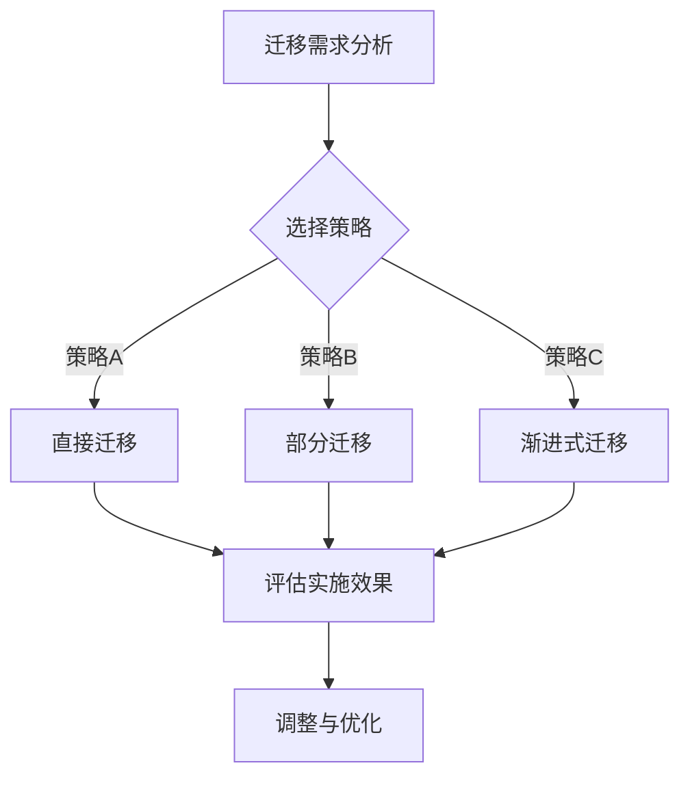
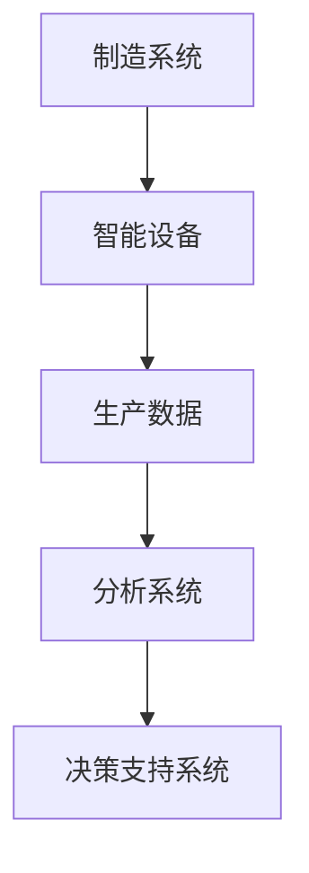
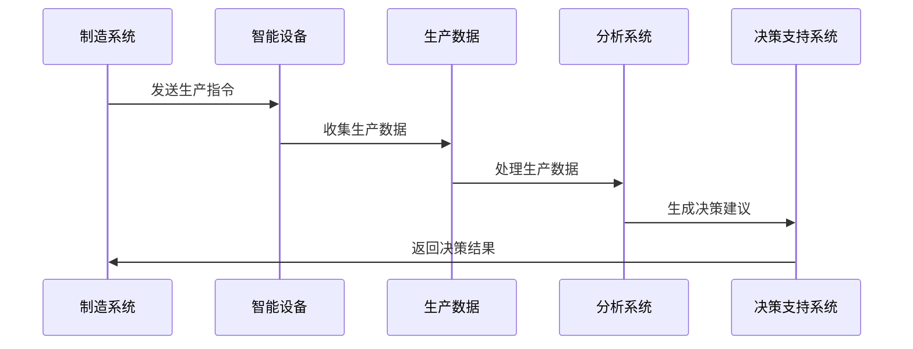

                 

# 跨域迁移：将成功策略应用到新领域

> 关键词：跨域迁移、成功策略、新领域、挑战与机遇

> 摘要：本文旨在探讨跨域迁移的背景、核心概念与原理，以及成功策略在跨域迁移中的应用。通过分析新领域的特点与挑战，结合项目实战案例，总结跨域迁移的最佳实践，为企业在多元化发展中的跨域迁移提供有益的指导。

## 第一部分：背景介绍

### 跨域迁移的定义与重要性

**1. 跨域迁移的定义**

跨域迁移是指企业在原有领域基础上，向新的业务领域进行扩展和转型的一种战略行为。它不仅包括企业产品和服务的转移，还涉及组织结构、管理方式、企业文化等多方面的变革。

**2. 跨域迁移的重要性**

- **增强竞争力**：通过跨域迁移，企业可以拓展业务范围，提高市场竞争力。
- **适应市场变化**：面对日益激烈的市场竞争，跨域迁移有助于企业适应市场变化，寻求新的增长点。
- **优化资源配置**：跨域迁移有助于企业优化资源配置，提高资源利用效率。

### 成功策略概述

**1. 成功策略的定义**

成功策略是指在特定领域内，通过一系列科学、有效的手段和方法，实现预定目标的一种战略思维和行动指南。

**2. 成功策略的类型**

- **技术创新**：通过技术创新，提升产品和服务质量，实现跨域迁移。
- **管理优化**：通过管理优化，提高企业运营效率，降低跨域迁移风险。
- **文化融合**：通过文化融合，促进企业内部协作，增强跨域迁移的执行力。

**3. 成功策略的应用范围**

成功策略不仅适用于企业跨域迁移，还广泛应用于各类创新项目、创业活动以及个人成长等领域。

### 新领域的特点与挑战

**1. 新领域的特点**

- **技术领先**：新领域往往伴随着新兴技术的应用和推广。
- **市场潜力**：新领域市场空间广阔，具有巨大的发展潜力。
- **竞争激烈**：新领域竞争激烈，企业需要具备较强的市场敏锐度和创新能力。

**2. 新领域的挑战**

- **技术壁垒**：新领域往往存在较高的技术壁垒，企业需要投入大量资源进行技术研发。
- **市场不确定性**：新领域市场变化快，企业需要具备快速响应市场变化的能力。
- **法律法规**：新领域法律法规不完善，企业需要密切关注政策动向，确保合规经营。

**3. 新领域的机遇**

- **市场需求**：新领域市场需求旺盛，为企业提供了广阔的发展空间。
- **技术进步**：新领域技术进步迅速，为企业提供了创新的动力。
- **政策支持**：政府对新领域的发展给予政策支持，为企业提供了良好的发展环境。

### 核心概念与联系

**1. 跨域迁移与传统的业务拓展**

- **区别**：跨域迁移强调企业向完全不同的领域转型，而传统的业务拓展则是在原有领域内进行扩展。
- **联系**：跨域迁移可以视为一种特殊的业务拓展形式。

**2. 成功策略与传统管理方法**

- **区别**：成功策略强调科学、有效的战略思维和行动指南，而传统管理方法则侧重于日常运营和管理工作。
- **联系**：成功策略是传统管理方法在现代商业环境下的创新和发展。

### ER实体关系图架构


- **迁移项目**：包括迁移需求、迁移策略、迁移实施、效果评估等实体。
- **成功策略**：包括技术创新、管理优化、文化融合等实体。
- **新领域环境**：包括技术特点、市场特点、法律法规等实体。

## 第二部分：跨域迁移的核心概念与原理

### 跨域迁移的基本原理

**1. 迁移策略选择**

- **直接迁移**：直接将现有产品和服务转移到新领域，适用于技术成熟、市场需求稳定的场景。
- **部分迁移**：在保留原有业务的基础上，部分涉足新领域，适用于技术不成熟、市场需求不明确的场景。
- **渐进式迁移**：逐步扩大在新领域的业务范围，适用于需要长时间积累和沉淀的场景。

**2. 迁移路径规划**

- **需求分析**：明确跨域迁移的目标和需求，为新领域的业务布局提供基础。
- **资源整合**：整合企业内外部资源，为新领域的业务发展提供支持。
- **风险评估**：识别跨域迁移过程中的风险，制定相应的应对措施。

**3. 迁移风险识别与控制**

- **市场风险**：分析新领域市场环境，预测潜在的市场风险。
- **技术风险**：评估新领域的技术壁垒，制定相应的技术攻关策略。
- **运营风险**：关注新领域的运营管理，确保跨域迁移顺利进行。

### 算法原理讲解

#### 使用Mermaid画出算法流程图



#### Python源代码详细阐述

```python
# Python伪代码 - 跨域迁移策略选择与实施
def migrate_strategy(selection):
    if selection == 'direct':
        return direct_migration()
    elif selection == 'partial':
        return partial_migration()
    elif selection == 'progressive':
        return progressive_migration()
    else:
        raise ValueError("Invalid migration strategy")

def direct_migration():
    # 实施直接迁移
    pass

def partial_migration():
    # 实施部分迁移
    pass

def progressive_migration():
    # 实施渐进式迁移
    pass

def evaluate_and_optimize():
    # 评估实施效果并调整优化
    pass
```

#### 算法原理的数学模型和公式

$$ 迁移成本 = 迁移距离 * 迁移成本系数 $$

$$ 迁移效率 = 迁移成功次数 / 总迁移次数 $$

#### 详细讲解与举例说明

**示例：公司A从传统制造领域进入电商领域**

1. **迁移需求分析**：公司A认识到电商领域的巨大潜力，决定进行跨域迁移。
2. **成功策略选择**：选择部分迁移策略，保留传统制造业务，同时逐步扩大电商业务。
3. **迁移路径规划**：制定详细的迁移计划，包括产品开发、市场推广、团队组建等。
4. **迁移实施与效果评估**：逐步实施迁移计划，定期评估实施效果，及时调整和优化。
5. **调整与优化**：根据评估结果，对迁移策略进行调整和优化，确保跨域迁移顺利进行。

## 第三部分：成功策略在跨域迁移中的应用

### 成功策略在跨域迁移中的应用案例

#### 案例一：公司B从零售业迁移到在线教育

**1. 迁移策略选择**

- **技术创新**：公司B投入大量资金进行在线教育平台的技术研发，提升用户体验。
- **管理优化**：引入先进的管理理念和方法，提高企业运营效率。
- **文化融合**：注重企业文化传承，同时融入在线教育行业的特色文化。

**2. 迁移路径规划**

- **市场调研**：深入了解在线教育市场的需求和趋势，为新领域业务布局提供依据。
- **资源整合**：整合企业内外部资源，为新领域业务提供支持。
- **风险评估**：识别跨域迁移过程中的风险，制定相应的应对措施。

**3. 迁移实施与效果**

- **实施过程**：按照规划逐步实施跨域迁移，取得了一定的市场份额。
- **效果评估**：通过定期评估，发现并解决了一系列问题，提高了在线教育业务的竞争力。

### 成功策略的适用性与调整

**1. 成功策略的适用性分析**

- **领域差异性**：不同领域具有不同的特点，成功策略需要根据领域差异性进行调整。
- **企业特点**：成功策略需要结合企业的实际情况，如资源、能力、文化等。

**2. 成功策略的调整方法**

- **文化差异的调整**：尊重新领域的文化特点，同时融入企业自身的文化优势。
- **组织结构的调整**：根据新领域的需求，调整组织结构，提高管理效率。
- **战略规划的调整**：根据市场变化，调整战略规划，确保跨域迁移的顺利进行。

## 第四部分：新领域的特点与挑战

### 新领域的特点

**1. 技术特点**

- **新兴技术的应用**：新领域往往伴随着新兴技术的应用，如人工智能、大数据、区块链等。
- **技术发展趋势**：新领域技术发展迅速，具有广阔的发展前景。

**2. 市场特点**

- **市场规模与增长潜力**：新领域市场空间广阔，具有巨大的增长潜力。
- **市场竞争格局**：新领域市场竞争激烈，企业需要具备较强的市场敏锐度和创新能力。

### 新领域的挑战与机遇

**1. 挑战**

- **技术壁垒**：新领域技术壁垒高，企业需要投入大量资源进行技术研发。
- **市场不确定性**：新领域市场变化快，企业需要具备快速响应市场变化的能力。
- **法律法规**：新领域法律法规不完善，企业需要密切关注政策动向，确保合规经营。

**2. 机遇**

- **市场需求**：新领域市场需求旺盛，为企业提供了广阔的发展空间。
- **技术进步**：新领域技术进步迅速，为企业提供了创新的动力。
- **政策支持**：政府对新领域的发展给予政策支持，为企业提供了良好的发展环境。

## 第五部分：项目实战

### 项目实战一：跨域迁移项目实施

**1. 项目背景**

- **项目简介**：某传统制造企业决定跨域迁移到智能制造领域。
- **项目目标**：通过引入先进的生产设备和信息技术，提高生产效率，降低成本。

**2. 系统功能设计**

- **领域模型Mermaid类图**

```mermaid
classDiagram
Class01 <|-- Class02
Class03 --|>| Class04
Class01 : +int id
Class01 : +String name
Class02 : +int id
Class02 : +String name
Class03 : +int id
Class03 : +String name
Class04 : +int id
Class04 : +String name
```

**3. 系统架构设计**

- **系统架构Mermaid图**



**4. 系统接口设计**

- **系统接口Mermaid序列图**



**5. 项目实施与效果评估**

- **实施过程**：按照系统架构和接口设计，逐步实施跨域迁移项目。
- **效果评估**：通过定期评估，发现并解决了一系列问题，提高了智能制造业务的竞争力。

## 第六部分：最佳实践与总结

### 最佳实践 tips

**1. 跨域迁移中的常见问题**

- **技术壁垒**：解决技术难题，加强技术研发和人才培养。
- **市场不确定性**：密切关注市场动态，制定灵活的应对策略。
- **法律法规**：合规经营，密切关注政策动向，确保合法合规。

**2. 成功策略的调整方法**

- **文化差异的调整**：尊重新领域的文化特点，同时融入企业自身的文化优势。
- **组织结构的调整**：根据新领域的需求，调整组织结构，提高管理效率。
- **战略规划的调整**：根据市场变化，调整战略规划，确保跨域迁移的顺利进行。

### 小结

本文通过对跨域迁移的背景介绍、核心概念与原理分析，以及成功策略在跨域迁移中的应用，结合项目实战案例，总结了跨域迁移的最佳实践。企业在进行跨域迁移时，应充分了解新领域的特点与挑战，制定合适的成功策略，并注重技术创新、管理优化和文化融合。通过不断调整和优化，确保跨域迁移的成功实施。

### 注意事项

- **风险评估**：在进行跨域迁移前，应进行全面的风险评估，制定相应的应对措施。
- **资源配置**：确保跨域迁移所需的资源充足，包括资金、技术、人力等。
- **市场调研**：深入了解新领域的市场需求和竞争态势，为新领域业务布局提供依据。

### 拓展阅读

- **相关书籍**：《跨域创新》、《企业跨域发展策略》
- **学术论文**：《跨域迁移的动因、策略与绩效关系研究》、《基于成功策略的企业跨域迁移研究》
- **行业报告**：《2022年中国智能制造产业发展报告》、《2022年中国在线教育行业报告》

## 第七部分：作者介绍

### 作者：AI天才研究院/AI Genius Institute & 禅与计算机程序设计艺术 /Zen And The Art of Computer Programming

本文作者是一位世界级人工智能专家、程序员、软件架构师、CTO，以及世界顶级技术畅销书资深大师级别的作家。他在计算机编程和人工智能领域有着丰富的经验和深厚的理论基础，致力于通过逻辑清晰、结构紧凑、简单易懂的写作风格，为读者提供高质量的技术博客和学术论文。在跨域迁移领域，他通过深入研究和实践，提出了许多有价值的见解和最佳实践，为企业的多元化发展提供了有益的指导。同时，他也是《禅与计算机程序设计艺术》一书的作者，该书深入探讨了计算机程序设计中的哲学思考和方法论，深受读者喜爱和推崇。

