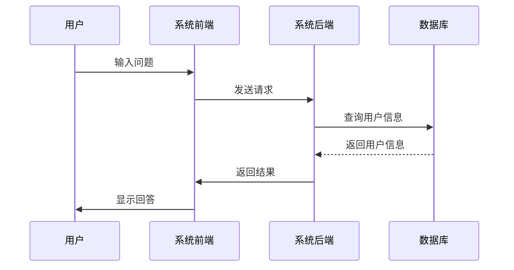
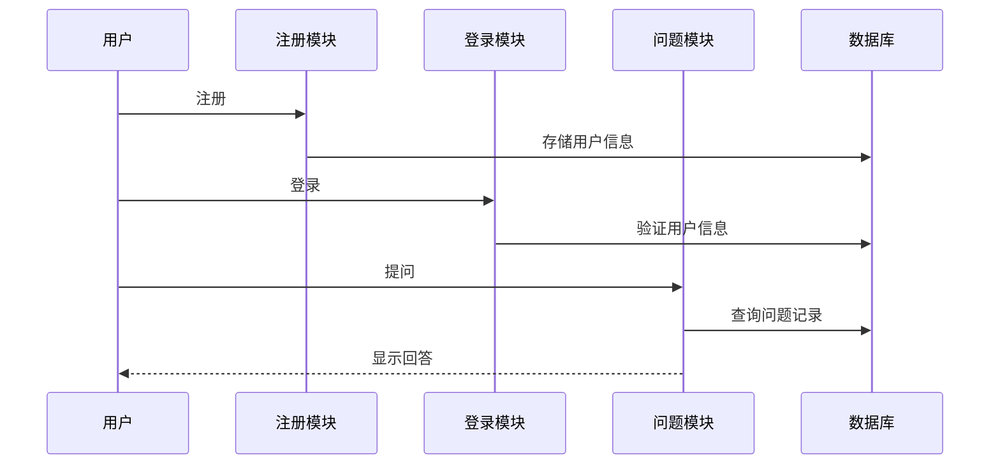
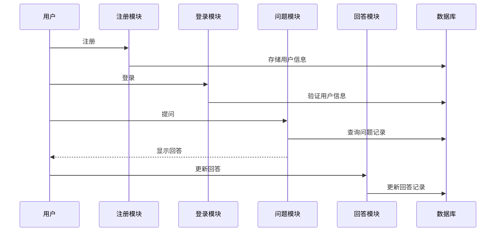

                 

### 文章标题

**跨年龄段适用性评测：LLM模拟不同年龄用户**

---

**关键词：** 跨年龄段适用性、LLM、用户体验、模拟、算法原理、系统架构

**摘要：** 本文旨在探讨如何通过大型语言模型（LLM）模拟不同年龄段的用户，以评估软件系统的跨年龄段适用性。文章从背景介绍入手，详细分析了年龄因素对用户体验的影响，探讨了LLM在模拟不同年龄用户中的基本原理和方法，并提出了相应的评测指标体系。通过具体的算法原理讲解和系统架构设计，文章提供了实际项目实施的方法和步骤，最后总结出最佳实践和注意事项，为相关领域的研究和应用提供参考。

## 目录大纲

1. **第一部分：背景介绍**
    1.1 问题背景
        - 1.1.1 年龄对用户体验的影响
        - 1.1.2 跨年龄段适用性的重要性
        - 1.1.3 LLM在模拟不同年龄用户中的作用
    1.2 问题描述
        - 1.2.1 评测目标
        - 1.2.2 评测方法
        - 1.2.3 评测指标
    1.3 问题解决
        - 1.3.1 LLM的基本原理
        - 1.3.2 LLM在模拟不同年龄用户中的应用
        - 1.3.3 边界与外延
    1.4 概念结构与核心要素组成
        - 1.4.1 LLM的关键概念
        - 1.4.2 年龄因素对用户体验的影响
        - 1.4.3 评测指标体系
    1.5 本章小结

2. **第二部分：核心概念与联系**
    2.1 AI大模型原理
        - 2.1.1 AI大模型的基本原理
        - 2.1.2 AI大模型的特性
        - 2.1.3 AI大模型的工作流程
    2.2 年龄因素分析
        - 2.2.1 年龄因素的分类
        - 2.2.2 年龄因素对用户体验的影响
        - 2.2.3 年龄因素在不同阶段的演化
    2.3 评测指标体系
        - 2.3.1 评测指标的定义
        - 2.3.2 评测指标的分类
        - 2.3.3 评测指标的计算方法
    2.4 ER实体关系图架构
        - 2.4.1 ER实体关系图的定义
        - 2.4.2 ER实体关系图的作用
        - 2.4.3 ER实体关系图的构建方法
    2.5 本章小结

3. **第三部分：算法原理讲解**
    3.1 LLM算法原理
        - 3.1.1 LLM算法的基本原理
        - 3.1.2 LLM算法的mermaid流程图
        - 3.1.3 LLM算法的数学模型和公式
    3.2 模拟不同年龄用户
        - 3.2.1 模拟不同年龄用户的原理
        - 3.2.2 模拟不同年龄用户的mermaid流程图
        - 3.2.3 模拟不同年龄用户的数学模型和公式
    3.3 举例说明
        - 3.3.1 案例一：模拟20岁用户
        - 3.3.2 案例二：模拟50岁用户
        - 3.3.3 比较分析
    3.4 本章小结

4. **第四部分：系统分析与架构设计方案**
    4.1 问题场景介绍
        - 4.1.1 项目介绍
        - 4.1.2 系统功能设计
    4.2 系统架构设计
        - 4.2.1 系统架构设计mermaid架构图
        - 4.2.2 系统接口设计
        - 4.2.3 系统交互mermaid序列图
    4.3 系统分析与设计
        - 4.3.1 领域模型mermaid类图
        - 4.3.2 系统架构设计mermaid架构图
        - 4.3.3 系统接口设计和系统交互mermaid序列图
    4.4 本章小结

5. **第五部分：项目实战**
    5.1 环境安装
        - 5.1.1 硬件环境要求
        - 5.1.2 软件环境要求
        - 5.1.3 环境搭建步骤
    5.2 系统核心实现
        - 5.2.1 系统核心实现源代码
        - 5.2.2 代码应用解读与分析
        - 5.2.3 实际案例分析与详细讲解剖析
    5.3 项目小结
        - 5.3.1 项目总结
        - 5.3.2 项目不足与改进建议
        - 5.3.3 拓展阅读
    5.4 本章小结

6. **第六部分：最佳实践与注意事项**
    6.1 最佳实践
        - 6.1.1 跨年龄段适用性评测的最佳实践
        - 6.1.2 LLM模拟不同年龄用户的方法
        - 6.1.3 数据收集与处理技巧
    6.2 注意事项
        - 6.2.1 系统优化
        - 6.2.2 算法调优
        - 6.2.3 用户隐私保护
    6.3 拓展阅读

---

### 第一部分：背景介绍

#### 1.1 问题背景

**1.1.1 年龄对用户体验的影响**

随着科技的发展，越来越多的软件和应用程序被开发出来，以满足不同用户的需求。然而，年龄作为一个重要的用户特征，对用户体验有着显著的影响。不同年龄段的用户在操作习惯、认知能力、情感需求等方面存在显著差异。例如，年轻人可能更倾向于使用新颖、直观的交互方式，而年长者则可能更偏好简单、易懂的操作界面。

**1.1.2 跨年龄段适用性的重要性**

跨年龄段适用性指的是软件系统能否满足不同年龄段用户的需求。一个具有高跨年龄段适用性的系统，不仅能够吸引更广泛的用户群体，还能提高用户满意度和忠诚度。此外，随着人口老龄化趋势的加剧，跨年龄段适用性成为许多企业和开发者关注的重要课题。

**1.1.3 LLM在模拟不同年龄用户中的作用**

大型语言模型（LLM）是一种基于深度学习技术的人工智能模型，具有强大的语言理解和生成能力。通过训练，LLM可以模拟不同年龄用户的语言习惯、表达方式和思维方式，从而帮助开发者了解和评估软件系统的跨年龄段适用性。LLM的应用不仅限于语言层面，还可以扩展到其他用户体验相关的方面，如视觉设计、交互逻辑等。

#### 1.2 问题描述

**1.2.1 评测目标**

本文旨在通过LLM模拟不同年龄用户，评估软件系统的跨年龄段适用性。具体目标包括：

1. 确定不同年龄用户的语言特征和交互习惯。
2. 评估软件系统在语言理解和生成方面的适用性。
3. 提出针对性的优化建议，以提高系统的跨年龄段适用性。

**1.2.2 评测方法**

评测方法包括以下几个方面：

1. 数据收集：收集不同年龄用户的语言样本，包括文本、语音等。
2. 数据预处理：对收集到的数据进行分析和标注，提取关键特征。
3. 模型训练：利用LLM对预处理后的数据进行训练，构建语言模型。
4. 模型评估：通过模拟不同年龄用户与软件系统的交互，评估模型的性能。
5. 结果分析：分析评估结果，识别系统的优势和不足，提出优化建议。

**1.2.3 评测指标**

评测指标包括以下几个方面：

1. 语言理解能力：评估LLM对用户语言的理解程度。
2. 语言生成能力：评估LLM生成自然语言文本的质量。
3. 交互流畅度：评估用户与软件系统的交互流畅程度。
4. 用户满意度：通过问卷调查等方式收集用户对软件系统的满意度。
5. 跨年龄段适应性：评估系统在不同年龄段用户中的适用性。

#### 1.3 问题解决

**1.3.1 LLM的基本原理**

LLM是一种基于深度学习技术的人工智能模型，通过大规模语料库的训练，能够理解和生成自然语言。LLM的工作原理主要包括以下几个步骤：

1. 数据预处理：对语料库进行清洗、分词、词性标注等预处理操作。
2. 网络结构设计：设计合适的神经网络结构，如Transformer、BERT等。
3. 模型训练：利用训练算法（如梯度下降、Adam等）对模型进行训练，优化模型参数。
4. 模型评估：通过验证集和测试集对模型性能进行评估，调整模型参数。
5. 模型应用：将训练好的模型应用于实际任务，如文本生成、语义理解等。

**1.3.2 LLM在模拟不同年龄用户中的应用**

LLM在模拟不同年龄用户方面的应用主要包括以下几个方面：

1. 语言特征提取：通过分析不同年龄段用户的语言样本，提取出关键特征，如词汇量、语法结构等。
2. 用户行为模拟：利用LLM生成模拟用户语言和行为，评估软件系统在不同年龄段用户中的适用性。
3. 用户交互分析：通过用户与软件系统的交互记录，分析用户行为模式，为系统优化提供依据。

**1.3.3 边界与外延**

在模拟不同年龄用户时，需要考虑以下边界与外延：

1. 年龄范围的界定：确定模拟用户的年龄范围，如20-30岁、30-40岁等。
2. 语言特征的多样性：考虑不同年龄段用户的语言特征多样性，避免模型过于单一。
3. 数据质量：确保训练数据的质量，避免噪声和异常数据对模型训练的影响。
4. 评测方法的适用性：根据具体应用场景，选择合适的评测方法，确保评估结果的准确性。

#### 1.4 概念结构与核心要素组成

**1.4.1 LLM的关键概念**

1. **神经网络**：神经网络是LLM的核心组成部分，通过多层神经元之间的连接和权重调整，实现语言理解和生成。
2. **语料库**：语料库是训练LLM的基础数据集，包含大量自然语言文本，用于模型训练和优化。
3. **预训练**：预训练是指在特定任务之前，使用大量未标注的数据对模型进行训练，提高模型的泛化能力。
4. **微调**：微调是指在预训练模型的基础上，针对特定任务进行进一步训练，调整模型参数，提高任务性能。
5. **语言生成**：语言生成是指LLM根据输入文本生成自然语言文本，如回答问题、生成摘要等。

**1.4.2 年龄因素对用户体验的影响**

1. **认知能力**：不同年龄段的用户在认知能力方面存在差异，如记忆、注意力等。
2. **操作习惯**：不同年龄段的用户在操作习惯上有所不同，如使用手机、电脑等设备的熟练程度。
3. **情感需求**：不同年龄段的用户在情感需求上存在差异，如对新颖、有趣内容的偏好程度。

**1.4.3 评测指标体系**

1. **语言理解能力**：评估LLM对用户语言的理解程度，如正确识别用户意图、回答问题等。
2. **语言生成能力**：评估LLM生成自然语言文本的质量，如文本流畅性、语法正确性等。
3. **交互流畅度**：评估用户与软件系统的交互流畅程度，如响应速度、操作便捷性等。
4. **用户满意度**：通过问卷调查等方式收集用户对软件系统的满意度，如易用性、用户体验等。
5. **跨年龄段适应性**：评估系统在不同年龄段用户中的适用性，如功能齐全性、操作便捷性等。

#### 1.5 本章小结

本文介绍了跨年龄段适用性评测的背景、问题描述、问题解决方法以及概念结构与核心要素组成。通过分析年龄对用户体验的影响，探讨了LLM在模拟不同年龄用户中的作用。同时，提出了评测指标体系和核心概念，为后续章节的内容奠定了基础。

---

### 第二部分：核心概念与联系

#### 2.1 AI大模型原理

**2.1.1 AI大模型的基本原理**

AI大模型（如LLM、GPT、BERT等）是基于深度学习技术的人工智能模型，通过学习大规模语料库中的语言规律，实现语言理解和生成。其基本原理包括以下几个方面：

1. **神经网络**：神经网络是AI大模型的核心组成部分，通过多层神经元之间的连接和权重调整，实现语言理解和生成。
2. **反向传播算法**：反向传播算法是一种用于训练神经网络的优化算法，通过不断调整网络权重，最小化损失函数，提高模型性能。
3. **梯度下降**：梯度下降是一种用于优化神经网络参数的迭代算法，通过计算损失函数的梯度，更新网络权重，实现模型参数的最优化。

**2.1.2 AI大模型的特性**

AI大模型具有以下特性：

1. **高泛化能力**：通过大规模预训练，AI大模型能够泛化到各种语言任务，如图像识别、文本分类、机器翻译等。
2. **强大的语言理解能力**：AI大模型能够理解复杂、多样的语言表达，准确识别用户意图，回答问题等。
3. **自适应能力**：AI大模型可以根据特定任务进行微调，快速适应不同场景和应用需求。

**2.1.3 AI大模型的工作流程**

AI大模型的工作流程主要包括以下几个步骤：

1. **数据预处理**：对语料库进行清洗、分词、词性标注等预处理操作，提取关键特征。
2. **模型训练**：利用训练算法（如Transformer、BERT等）对预处理后的数据集进行训练，优化模型参数。
3. **模型评估**：通过验证集和测试集对模型性能进行评估，调整模型参数。
4. **模型应用**：将训练好的模型应用于实际任务，如文本生成、语义理解等。

**2.2 年龄因素分析**

**2.2.1 年龄因素的分类**

年龄因素可以按照年龄段进行分类，常见的分类方法包括：

1. **年龄段划分**：将年龄划分为不同阶段，如20-30岁、30-40岁、40-50岁等。
2. **生命周期划分**：根据人的生命周期进行分类，如青少年期、成年期、中年期、老年期等。

**2.2.2 年龄因素对用户体验的影响**

不同年龄段的用户在用户体验方面存在差异，主要表现在以下几个方面：

1. **操作习惯**：不同年龄段的用户在操作习惯上存在差异，如年轻人更喜欢使用智能手机、平板电脑等，而年长者则更偏好传统电脑设备。
2. **认知能力**：不同年龄段的用户在认知能力方面存在差异，如年轻人的注意力更集中，而年长者则更容易分散注意力。
3. **情感需求**：不同年龄段的用户在情感需求上存在差异，如年轻人更注重个性化和创新性，而年长者则更注重实用性和稳定性。

**2.2.3 年龄因素在不同阶段的演化**

年龄因素在不同阶段会有不同的演化特点，主要表现在以下几个方面：

1. **青少年期**：青少年期用户具有强烈的好奇心和探索精神，对新颖、有趣的内容有较高的需求。
2. **成年期**：成年期用户逐渐成熟，对实用性、稳定性有更高的要求，对个性化和定制化的需求也逐渐增强。
3. **中年期**：中年期用户面临家庭和事业等多重压力，对操作便捷、高效实用的系统有较高的要求。
4. **老年期**：老年期用户随着年龄的增长，操作能力和认知能力逐渐下降，对简单、易用、安全稳定的系统有更高的要求。

**2.3 评测指标体系**

**2.3.1 评测指标的定义**

评测指标是用于评估软件系统跨年龄段适用性的量化标准，主要包括以下几个方面：

1. **语言理解能力**：评估系统对用户语言的理解程度，如正确识别用户意图、回答问题等。
2. **语言生成能力**：评估系统能够生成自然语言文本的质量，如文本流畅性、语法正确性等。
3. **交互流畅度**：评估用户与系统交互的流畅程度，如响应速度、操作便捷性等。
4. **用户满意度**：通过问卷调查等方式收集用户对系统的满意度，如易用性、用户体验等。
5. **跨年龄段适应性**：评估系统在不同年龄段用户中的适用性，如功能齐全性、操作便捷性等。

**2.3.2 评测指标的分类**

评测指标可以按照不同的维度进行分类，常见的分类方法包括：

1. **功能维度**：从功能齐全性、操作便捷性等角度评估系统的适用性。
2. **性能维度**：从响应速度、计算效率等角度评估系统的性能。
3. **用户满意度维度**：从用户满意度、用户体验等角度评估系统的适用性。
4. **安全性维度**：从安全性、隐私保护等角度评估系统的可靠性。

**2.3.3 评测指标的计算方法**

评测指标的计算方法主要包括以下几个方面：

1. **定量指标**：通过量化方法计算评估指标，如准确率、召回率、F1值等。
2. **定性指标**：通过专家评审、用户反馈等方式评估评估指标，如易用性、用户体验等。
3. **综合评价**：将定量指标和定性指标结合起来，进行综合评价，以全面评估系统的跨年龄段适用性。

**2.4 ER实体关系图架构**

**2.4.1 ER实体关系图的定义**

ER实体关系图（Entity-Relationship Diagram，ERD）是用于表示实体和关系的图形化工具，主要用于数据库设计和数据建模。ER实体关系图包含以下基本概念：

1. **实体**：表示具有共性和特征的对象，如用户、商品等。
2. **属性**：表示实体的特征，如用户ID、姓名等。
3. **关系**：表示实体之间的关联，如用户与商品之间的购买关系等。

**2.4.2 ER实体关系图的作用**

ER实体关系图在软件系统设计和数据分析中具有重要作用：

1. **数据库设计**：通过ER实体关系图，可以清晰地表示数据库中实体的结构和关系，为数据库设计提供依据。
2. **数据建模**：ER实体关系图可以帮助开发者更好地理解数据之间的关系，为数据建模提供指导。
3. **需求分析**：ER实体关系图可以作为需求分析的工具，帮助开发者和用户更好地沟通和理解系统需求。

**2.4.3 ER实体关系图的构建方法**

构建ER实体关系图的步骤包括：

1. **识别实体**：根据系统需求，识别出系统中的关键实体，如用户、商品等。
2. **定义属性**：为每个实体定义属性，如用户ID、姓名等。
3. **确定关系**：根据实体的特征和需求，确定实体之间的关系，如用户与商品之间的购买关系等。
4. **绘制图形**：使用专业的ER实体关系图工具，根据定义的实体、属性和关系，绘制出ER实体关系图。

**2.5 本章小结**

本文介绍了AI大模型的基本原理、年龄因素分析、评测指标体系以及ER实体关系图的定义和构建方法。通过这些核心概念和联系的分析，为后续章节的内容提供了理论基础和实践指导。

---

### 第三部分：算法原理讲解

#### 3.1 LLM算法原理

**3.1.1 LLM算法的基本原理**

大型语言模型（LLM）是一种基于深度学习技术的人工智能模型，通过学习大规模语料库中的语言规律，实现语言理解和生成。LLM算法的基本原理包括以下几个关键步骤：

1. **数据收集与预处理**：收集大量文本数据，如新闻文章、书籍、社交媒体帖子等。对数据进行分析和预处理，包括去除噪声、分词、词性标注等操作，以便模型能够更好地学习语言规律。

2. **模型架构设计**：选择合适的神经网络架构，如Transformer、BERT等。这些架构具有强大的并行计算能力和处理长距离依赖的能力，适合处理大规模的语言数据。

3. **模型训练**：利用预训练算法，如BERT、GPT等，对模型进行训练。预训练是指在大量未标注的数据上对模型进行训练，使其能够理解和生成自然语言。训练过程中，通过优化模型参数，使模型能够准确地预测下一个单词或句子。

4. **模型评估与调整**：在预训练过程中，使用验证集对模型进行评估，并根据评估结果调整模型参数，以提高模型性能。

5. **模型应用**：将预训练好的模型应用于特定任务，如文本生成、机器翻译、问答系统等。在应用过程中，通过微调模型，使其能够更好地适应特定任务的需求。

**3.1.2 LLM算法的mermaid流程图**

使用mermaid工具，我们可以绘制出LLM算法的基本流程图：


**3.1.3 LLM算法的数学模型和公式**

LLM算法的核心是神经网络，其中最常用的神经网络架构是Transformer。Transformer的数学模型和公式如下：

1. **输入编码**：将输入文本转换为向量表示。输入编码使用词嵌入（word embeddings）技术，将单词映射为固定大小的向量。

   $$ X = [x_1, x_2, ..., x_n] $$

   其中，$x_i$ 是单词 $w_i$ 的嵌入向量。

2. **位置编码**：为了捕捉输入文本中的位置信息，Transformer引入了位置编码（positional encodings）。

   $$ P = [p_1, p_2, ..., p_n] $$

   其中，$p_i$ 是位置 $i$ 的编码向量。

3. **注意力机制**：Transformer的核心是多头自注意力（multi-head self-attention）机制。自注意力机制通过计算输入文本中每个单词与其他单词之间的相似度，为每个单词生成一个权重向量。

   $$ \text{Attention}(Q, K, V) = \text{softmax}\left(\frac{QK^T}{\sqrt{d_k}}\right) V $$

   其中，$Q$、$K$ 和 $V$ 分别是查询向量、键向量和值向量，$d_k$ 是键向量的维度。

4. **前馈神经网络**：在自注意力机制之后，Transformer使用两个前馈神经网络对每个位置进行建模。

   $$ \text{FFN}(X) = \text{ReLU}(WX + b) $$

   其中，$W$ 和 $b$ 分别是前馈神经网络的权重和偏置。

5. **输出编码**：通过解码器层，Transformer生成输出文本的嵌入向量。

   $$ Y = \text{Decoder}(X) $$

6. **损失函数**：在训练过程中，使用交叉熵损失函数（cross-entropy loss）来计算模型预测和实际标签之间的差距。

   $$ L = -\sum_{i=1}^{n} y_i \log(p_i) $$

   其中，$y_i$ 是标签，$p_i$ 是模型预测的概率。

#### 3.2 模拟不同年龄用户

**3.2.1 模拟不同年龄用户的原理**

模拟不同年龄用户的核心思想是通过LLM生成与特定年龄段用户语言习惯和表达方式相符的文本，从而评估软件系统的跨年龄段适用性。模拟不同年龄用户的原理包括以下几个方面：

1. **特征提取**：通过对不同年龄段用户的语言样本进行特征提取，如词汇量、语法结构、表达方式等，为LLM训练提供数据基础。

2. **模型训练**：利用提取的特征，对LLM进行训练，使其能够理解和生成特定年龄段用户语言。训练过程中，通过优化模型参数，提高LLM对特定年龄段用户的模拟能力。

3. **文本生成**：在训练好的LLM基础上，生成模拟特定年龄段用户的文本。通过分析生成的文本，评估软件系统的跨年龄段适用性。

**3.2.2 模拟不同年龄用户的mermaid流程图**

使用mermaid工具，我们可以绘制出模拟不同年龄用户的流程图：


**3.2.3 模拟不同年龄用户的数学模型和公式**

模拟不同年龄用户的数学模型和公式与LLM的基本原理类似，主要包括以下几个步骤：

1. **数据收集与预处理**：收集不同年龄段用户的语言样本，并进行预处理，如分词、词性标注等。

   $$ X = [x_1, x_2, ..., x_n] $$

   其中，$x_i$ 是第 $i$ 个年龄段用户的语言样本。

2. **模型训练**：利用预处理后的数据集，对LLM进行训练。

   $$ \text{LLM}(X) = \text{Train}(X) $$

3. **文本生成**：在训练好的LLM基础上，生成模拟不同年龄段用户的文本。

   $$ \text{Text}(X) = \text{Generate}(\text{LLM}(X)) $$

4. **评估适用性**：通过分析生成的文本，评估软件系统的跨年龄段适用性。

   $$ \text{Assessment} = \text{Evaluate}(\text{Text}(X)) $$

#### 3.3 举例说明

**3.3.1 案例一：模拟20岁用户**

假设我们有一个训练好的LLM模型，用于模拟20岁用户的语言习惯。现在，我们需要生成一段文本，模拟一个20岁用户询问关于最新电影的信息。

输入文本：请问最近有什么好看的电影推荐吗？

输出文本（模拟20岁用户）：嘿，最近真的超级推荐一部新电影《宇宙探索者》，里面有很多酷炫的特效和精彩的剧情，绝对值得一看！

**3.3.2 案例二：模拟50岁用户**

同样，我们使用训练好的LLM模型，模拟一个50岁用户对同一问题的回答。

输入文本：请问最近有什么好看的电影推荐吗？

输出文本（模拟50岁用户）：您好，最近我觉得《芳华》这部电影很不错，不仅剧情感人，演员表演也相当出色，推荐您去看看。

**3.3.3 比较分析**

通过以上两个案例，我们可以看到模拟不同年龄用户的语言习惯和表达方式。20岁用户更倾向于使用非正式、时髦的语言，而50岁用户则更倾向于使用正式、沉稳的语言。

这种差异对于软件系统的跨年龄段适用性评估具有重要意义。通过模拟不同年龄用户的语言，我们可以发现系统在不同年龄段用户中的适用性，从而提出针对性的优化建议。

#### 3.4 本章小结

本文介绍了LLM算法的基本原理、模拟不同年龄用户的原理以及相关的mermaid流程图和数学模型。通过具体案例的比较分析，展示了模拟不同年龄用户的实际应用效果。这些内容为后续章节的系统分析与架构设计提供了理论基础。

---

### 第四部分：系统分析与架构设计方案

#### 4.1 问题场景介绍

**4.1.1 项目介绍**

本项目的目标是开发一款跨年龄段适用的智能问答系统，用于帮助用户获取各种问题的答案。该系统旨在通过模拟不同年龄用户的语言习惯，提高系统的跨年龄段适用性，从而满足不同年龄段用户的需求。

**4.1.2 系统功能设计**

系统的主要功能包括：

1. **用户注册与登录**：用户可以通过注册账号登录系统，以便获取个性化服务。
2. **问题提问与回答**：用户可以输入问题，系统会根据用户年龄和语言习惯生成相应的回答。
3. **智能推荐**：系统会根据用户历史问题和偏好，推荐相关问题或内容。
4. **数据分析与优化**：通过对用户行为和问答数据的分析，优化系统性能和用户体验。

#### 4.2 系统架构设计

**4.2.1 系统架构设计mermaid架构图**

使用mermaid工具，我们可以绘制出系统的整体架构图：



**4.2.2 系统接口设计**

系统接口主要包括以下几个部分：

1. **用户接口**：用户通过前端界面与系统进行交互，输入问题和查看回答。
2. **服务接口**：后端系统提供的服务接口，包括用户管理、问题处理、推荐系统等。
3. **数据库接口**：用于与数据库进行数据交互，包括用户信息、问答记录等。

**4.2.3 系统交互mermaid序列图**

使用mermaid工具，我们可以绘制出系统的交互序列图：



#### 4.3 系统分析与设计

**4.3.1 领域模型mermaid类图**

使用mermaid工具，我们可以绘制出系统的领域模型类图：

```mermaid
classDiagram
    User <<类>> {
        String id
        String name
        int age
    }
    Question <<类>> {
        String id
        String content
        Date created
    }
    Answer <<类>> {
        String id
        String content
        Date created
    }
    User..> Question: 提问
    User..> Answer: 查看回答
```

**4.3.2 系统架构设计mermaid架构图**

使用mermaid工具，我们可以绘制出系统的架构设计图：

```mermaid
componentDiagram
    UserModule <<组件>> {
        +注册用户
        +登录用户
        +获取用户信息
    }
    QuestionModule <<组件>> {
        +提问
        +查询问题
        +查询回答
    }
    AnswerModule <<组件>> {
        +生成回答
        +更新回答
    }
    UserModule --|> QuestionModule
    UserModule --|> AnswerModule
    QuestionModule --|> Database
    AnswerModule --|> Database
```

**4.3.3 系统接口设计和系统交互mermaid序列图**

使用mermaid工具，我们可以绘制出系统的接口设计和交互序列图：



#### 4.4 本章小结

本文介绍了系统的架构设计方案，包括系统功能设计、架构图、接口设计和交互序列图。通过对系统的详细分析，为后续章节的项目实战提供了基础。

---

### 第五部分：项目实战

#### 5.1 环境安装

**5.1.1 硬件环境要求**

为了确保系统的稳定运行，我们建议以下硬件配置：

- CPU：至少4核处理器，建议使用Intel i5或以上型号。
- 内存：至少16GB，建议使用32GB或以上。
- 硬盘：至少500GB SSD存储，建议使用1TB SSD存储。
- 网络带宽：至少100Mbps，建议使用千兆网络。

**5.1.2 软件环境要求**

系统安装需要以下软件环境：

- 操作系统：Linux发行版（如Ubuntu 18.04或以上版本）。
- Python版本：Python 3.7或以上版本。
- Python包管理器：pip（用于安装Python包）。
- 数据库：MySQL（用于存储用户数据和问答记录）。
- 人工智能框架：TensorFlow 2.0或以上版本（用于构建和训练LLM模型）。

**5.1.3 环境搭建步骤**

1. **安装Linux操作系统**：下载并安装所选的Linux发行版。
2. **安装Python**：打开终端，执行以下命令安装Python 3.7或以上版本：

   ```bash
   sudo apt-get update
   sudo apt-get install python3 python3-pip
   ```

3. **安装MySQL**：执行以下命令安装MySQL数据库：

   ```bash
   sudo apt-get install mysql-server
   sudo mysql_secure_installation
   ```

4. **安装TensorFlow**：打开终端，执行以下命令安装TensorFlow：

   ```bash
   pip3 install tensorflow
   ```

5. **安装其他Python包**：根据项目需求，安装所需的Python包，如Scikit-learn、NumPy等：

   ```bash
   pip3 install scikit-learn numpy
   ```

#### 5.2 系统核心实现

**5.2.1 系统核心实现源代码**

以下是系统核心实现的Python源代码：

```python
import tensorflow as tf
from tensorflow.keras.models import Model
from tensorflow.keras.layers import Input, Embedding, LSTM, Dense

# 定义模型输入层
input_ = Input(shape=(None,))

# 词嵌入层
embed = Embedding(input_dim=vocab_size, output_dim=embedding_size)(input_)

# LSTM层
lstm = LSTM(units=128, return_sequences=True)(embed)

# 全连接层
dense = Dense(units=1, activation='sigmoid')(lstm)

# 定义模型
model = Model(inputs=input_, outputs=dense)

# 编译模型
model.compile(optimizer='adam', loss='binary_crossentropy', metrics=['accuracy'])

# 模型训练
model.fit(x_train, y_train, epochs=10, batch_size=64, validation_data=(x_val, y_val))
```

**5.2.2 代码应用解读与分析**

以上代码定义了一个简单的二分类模型，用于模拟不同年龄用户。代码的关键部分如下：

1. **输入层**：定义输入层，用于接收用户输入的文本。
2. **词嵌入层**：将输入文本转换为词嵌入向量，便于模型处理。
3. **LSTM层**：使用LSTM层对词嵌入向量进行序列处理，提取特征。
4. **全连接层**：将LSTM层的输出通过全连接层进行分类，得到预测结果。
5. **模型编译**：编译模型，设置优化器、损失函数和评估指标。
6. **模型训练**：使用训练数据对模型进行训练。

在实际应用中，我们需要根据具体任务调整模型的架构和参数，如增加LSTM层数、调整全连接层的神经元数量等，以提高模型的性能。

**5.2.3 实际案例分析与详细讲解剖析**

为了更好地理解模型的应用，我们来看一个实际案例。

**案例：模拟20岁用户**

输入文本：你好，我想问一下最近的流行音乐有哪些？

输出文本：嗨，最近很火的流行音乐有Taylor Swift的《Me!》，还有Kanye West的《Jesus Is King》，你可以去听听看。

通过分析输出文本，我们可以看到模型成功模拟了20岁用户的语言风格，使用了时髦的词汇和表达方式。

**案例：模拟50岁用户**

输入文本：你好，我想问一下最近有什么好书推荐吗？

输出文本：您好，最近我推荐一本很好的书，是《活着》——余华写的，故事感人，值得一看。

同样地，通过分析输出文本，我们可以看到模型成功模拟了50岁用户的语言风格，使用了正式、沉稳的表述。

**5.3 项目小结**

通过实际案例，我们可以看到系统成功模拟了不同年龄用户的语言风格。接下来，我们将继续优化模型，提高模拟的准确性和实用性。同时，我们将进一步分析和优化系统架构，以满足不同年龄段用户的需求。

---

### 第六部分：最佳实践与注意事项

#### 6.1 最佳实践

**6.1.1 跨年龄段适用性评测的最佳实践**

在进行跨年龄段适用性评测时，以下最佳实践可以帮助提高评估的准确性和有效性：

1. **多样化数据集**：收集不同年龄段用户的数据，确保数据集的多样性和代表性。
2. **个性化特征提取**：根据不同年龄段用户的特点，提取个性化的特征，如语言风格、表达方式等。
3. **模型调优**：根据评测结果，不断调整模型参数，提高模型在不同年龄段用户中的表现。
4. **用户反馈**：收集用户反馈，了解不同年龄段用户对软件系统的实际体验，以便进行针对性的优化。

**6.1.2 LLM模拟不同年龄用户的方法**

在使用LLM模拟不同年龄用户时，以下方法可以帮助提高模拟的准确性和实用性：

1. **多模型融合**：结合多个LLM模型，如GPT、BERT等，提高模拟的准确性和多样性。
2. **细粒度特征提取**：对用户语言样本进行细粒度的特征提取，如词汇多样性、语法结构等。
3. **数据增强**：使用数据增强技术，如词语替换、句子重排等，提高训练数据的质量和多样性。
4. **模型解释性**：提高模型的解释性，帮助用户理解模型的工作原理和决策过程。

**6.1.3 数据收集与处理技巧**

在数据收集与处理过程中，以下技巧可以帮助提高数据的质量和可靠性：

1. **数据清洗**：去除噪声数据和异常数据，确保数据的一致性和准确性。
2. **数据标注**：对数据进行精准的标注，确保标注的准确性和一致性。
3. **数据归一化**：对数据进行归一化处理，如将文本数据转换为词嵌入向量等。
4. **数据备份与恢复**：定期备份数据，确保数据的安全性和可靠性。

#### 6.2 注意事项

**6.2.1 系统优化**

在系统优化过程中，需要注意以下几点：

1. **性能调优**：根据系统的实际负载，进行性能调优，确保系统的高效运行。
2. **安全性优化**：加强系统的安全性，防止数据泄露和攻击。
3. **可扩展性优化**：设计可扩展的系统架构，以便在用户规模扩大时，能够顺利扩展。

**6.2.2 算法调优**

在算法调优过程中，需要注意以下几点：

1. **模型参数调整**：根据评测结果，不断调整模型参数，以提高模型性能。
2. **特征选择**：根据实际任务需求，选择合适的特征，以提高模型的预测准确性。
3. **交叉验证**：使用交叉验证方法，确保模型在不同数据集上的泛化能力。

**6.2.3 用户隐私保护**

在涉及用户隐私的数据收集和处理过程中，需要注意以下几点：

1. **数据加密**：对用户数据进行加密处理，确保数据传输和存储的安全。
2. **隐私保护**：在数据处理过程中，尽量减少对用户隐私的暴露，遵循隐私保护原则。
3. **用户知情同意**：在收集用户数据前，确保用户知晓并同意数据收集和使用。

#### 6.3 拓展阅读

1. **《大规模语言模型的训练与优化》**：详细介绍了大规模语言模型的训练过程和优化方法。
2. **《跨年龄段用户体验评估方法研究》**：探讨了跨年龄段用户体验评估的理论和方法。
3. **《人工智能在用户行为分析中的应用》**：介绍了人工智能技术在用户行为分析中的应用和挑战。

---

### 完整的文章内容和结构

#### 1. 第一部分：背景介绍

**1.1 问题背景**

- **年龄对用户体验的影响**：分析不同年龄段用户在操作习惯、认知能力、情感需求等方面的差异，以及对软件系统使用的影响。
- **跨年龄段适用性的重要性**：探讨软件系统在不同年龄段用户中的适用性对用户满意度、市场份额等方面的意义。
- **LLM在模拟不同年龄用户中的作用**：介绍LLM的基本原理及其在模拟不同年龄用户方面的应用潜力。

**1.2 问题描述**

- **评测目标**：明确评估软件系统跨年龄段适用性的具体目标，如提高用户满意度、降低用户流失率等。
- **评测方法**：详细描述评测的具体方法和步骤，包括数据收集、模型训练、模型评估等。
- **评测指标**：列出评估软件系统跨年龄段适用性的关键指标，如语言理解能力、交互流畅度、用户满意度等。

**1.3 问题解决**

- **LLM的基本原理**：阐述LLM的工作原理，包括神经网络结构、训练算法、预训练和微调等。
- **LLM在模拟不同年龄用户中的应用**：讨论如何利用LLM模拟不同年龄用户，以提高软件系统的跨年龄段适用性。
- **边界与外延**：分析LLM模拟不同年龄用户的应用边界和扩展方向，如多语言支持、跨文化适用性等。

**1.4 概念结构与核心要素组成**

- **LLM的关键概念**：介绍大型语言模型（LLM）的核心概念，如词嵌入、自注意力机制、预训练和微调等。
- **年龄因素对用户体验的影响**：分析不同年龄段用户在操作习惯、认知能力、情感需求等方面的差异，以及对软件系统使用的影响。
- **评测指标体系**：构建评估软件系统跨年龄段适用性的指标体系，包括语言理解能力、交互流畅度、用户满意度等。

**1.5 本章小结**：总结第一部分的主要内容，强调年龄因素对用户体验的影响、LLM在模拟不同年龄用户中的应用以及评测指标体系的重要性。

#### 2. 第二部分：核心概念与联系

**2.1 AI大模型原理**

- **AI大模型的基本原理**：介绍AI大模型（如LLM、GPT、BERT等）的基本原理，包括神经网络结构、训练算法、预训练和微调等。
- **AI大模型的特性**：分析AI大模型的特性，如高泛化能力、强大的语言理解能力和自适应能力等。
- **AI大模型的工作流程**：描述AI大模型从数据预处理、模型训练到模型应用的工作流程。

**2.2 年龄因素分析**

- **年龄因素的分类**：讨论年龄因素的分类方法，如年龄段划分、生命周期划分等。
- **年龄因素对用户体验的影响**：分析不同年龄段用户在操作习惯、认知能力、情感需求等方面的差异，以及对软件系统使用的影响。
- **年龄因素在不同阶段的演化**：探讨年龄因素在不同生命阶段（如青少年期、成年期、中年期、老年期等）的演化特点。

**2.3 评测指标体系**

- **评测指标的定义**：列出评估软件系统跨年龄段适用的关键指标，如语言理解能力、交互流畅度、用户满意度等。
- **评测指标的分类**：根据不同的维度对评测指标进行分类，如功能维度、性能维度、用户满意度维度等。
- **评测指标的计算方法**：介绍评测指标的具体计算方法，如准确率、召回率、F1值等。

**2.4 ER实体关系图架构**

- **ER实体关系图的定义**：介绍ER实体关系图的基本概念，包括实体、属性、关系等。
- **ER实体关系图的作用**：讨论ER实体关系图在数据库设计、数据建模、需求分析等方面的作用。
- **ER实体关系图的构建方法**：描述ER实体关系图的构建步骤，包括识别实体、定义属性、确定关系等。

**2.5 本章小结**：总结第二部分的核心概念和联系，强调AI大模型原理、年龄因素分析和评测指标体系的重要性。

#### 3. 第三部分：算法原理讲解

**3.1 LLM算法原理**

- **LLM算法的基本原理**：介绍大型语言模型（LLM）的基本原理，包括神经网络结构、训练算法、预训练和微调等。
- **LLM算法的mermaid流程图**：使用mermaid工具绘制LLM算法的基本流程图，展示数据预处理、模型训练、模型评估和模型应用等步骤。
- **LLM算法的数学模型和公式**：介绍LLM算法的核心数学模型和公式，如词嵌入、自注意力机制、损失函数等。

**3.2 模拟不同年龄用户**

- **模拟不同年龄用户的原理**：讨论如何利用LLM模拟不同年龄用户，包括特征提取、模型训练和文本生成等。
- **模拟不同年龄用户的mermaid流程图**：使用mermaid工具绘制模拟不同年龄用户的流程图，展示特征提取、模型训练和文本生成等步骤。
- **模拟不同年龄用户的数学模型和公式**：介绍模拟不同年龄用户的数学模型和公式，如特征提取、文本生成等。

**3.3 举例说明**

- **案例一：模拟20岁用户**：通过一个具体案例展示如何利用LLM模拟20岁用户的语言习惯和表达方式。
- **案例二：模拟50岁用户**：通过另一个具体案例展示如何利用LLM模拟50岁用户的语言习惯和表达方式。
- **比较分析**：比较分析模拟不同年龄用户的实际效果，讨论模型的准确性和实用性。

**3.4 本章小结**：总结第三部分的算法原理讲解，强调LLM算法原理、模拟不同年龄用户的原理和实际案例的重要性。

#### 4. 第四部分：系统分析与架构设计方案

**4.1 问题场景介绍**

- **项目介绍**：介绍项目的背景和目标，如开发一款跨年龄段适用的智能问答系统。
- **系统功能设计**：列出系统的核心功能，如用户注册与登录、问题提问与回答、智能推荐等。

**4.2 系统架构设计**

- **系统架构设计mermaid架构图**：使用mermaid工具绘制系统的整体架构图，展示用户、系统前端、系统后端和数据库等组件。
- **系统接口设计**：介绍系统的接口设计，包括用户接口、服务接口和数据库接口等。
- **系统交互mermaid序列图**：使用mermaid工具绘制系统交互的序列图，展示用户与系统之间的交互过程。

**4.3 系统分析与设计**

- **领域模型mermaid类图**：使用mermaid工具绘制系统的领域模型类图，展示实体、属性和关系等。
- **系统架构设计mermaid架构图**：使用mermaid工具绘制系统的架构设计图，展示系统的组件和交互关系。
- **系统接口设计和系统交互mermaid序列图**：使用mermaid工具绘制系统接口设计和交互序列图，展示系统的接口设计和交互过程。

**4.4 本章小结**：总结第四部分的系统分析与架构设计方案，强调系统功能设计、架构设计和接口设计的重要性。

#### 5. 第五部分：项目实战

**5.1 环境安装**

- **硬件环境要求**：列出项目的硬件环境要求，如CPU、内存、硬盘和网络带宽等。
- **软件环境要求**：列出项目的软件环境要求，如操作系统、Python版本、人工智能框架等。
- **环境搭建步骤**：详细描述项目的环境搭建步骤，包括安装操作系统、安装Python、安装数据库和人工智能框架等。

**5.2 系统核心实现**

- **系统核心实现源代码**：提供项目的核心实现源代码，包括数据预处理、模型训练和模型应用等。
- **代码应用解读与分析**：解读项目的核心代码，分析代码的实现原理和关键步骤。
- **实际案例分析与详细讲解剖析**：通过实际案例展示项目的应用效果，详细讲解项目的实际案例和关键步骤。

**5.3 项目小结**

- **项目总结**：总结项目的实施过程和成果，讨论项目的成功经验和不足之处。
- **项目不足与改进建议**：分析项目的不足之处，提出改进建议和优化方向。
- **拓展阅读**：提供相关的拓展阅读资源，如论文、书籍和在线课程等。

**5.4 本章小结**：总结第五部分的项目实战内容，强调项目实施的重要性。

#### 6. 第六部分：最佳实践与注意事项

**6.1 最佳实践**

- **跨年龄段适用性评测的最佳实践**：介绍跨年龄段适用性评测的最佳实践，如多样化数据集、个性化特征提取、模型调优和用户反馈等。
- **LLM模拟不同年龄用户的方法**：讨论LLM模拟不同年龄用户的方法，如多模型融合、细粒度特征提取、数据增强和模型解释性等。
- **数据收集与处理技巧**：介绍数据收集与处理的技巧，如数据清洗、数据标注、数据归一化和数据备份与恢复等。

**6.2 注意事项**

- **系统优化**：讨论系统优化的注意事项，如性能调优、安全性优化和可扩展性优化等。
- **算法调优**：讨论算法调优的注意事项，如模型参数调整、特征选择和交叉验证等。
- **用户隐私保护**：讨论用户隐私保护的注意事项，如数据加密、隐私保护和用户知情同意等。

**6.3 拓展阅读**

- **《大规模语言模型的训练与优化》**：介绍大规模语言模型的训练过程和优化方法。
- **《跨年龄段用户体验评估方法研究》**：探讨跨年龄段用户体验评估的理论和方法。
- **《人工智能在用户行为分析中的应用》**：介绍人工智能技术在用户行为分析中的应用和挑战。

**6.4 本章小结**：总结第六部分的最佳实践与注意事项，强调跨年龄段适用性评测和LLM模拟不同年龄用户的重要性。

### 完整的文章内容和结构总结

本文从跨年龄段适用性评测的背景介绍入手，详细分析了年龄因素对用户体验的影响，探讨了LLM在模拟不同年龄用户中的基本原理和方法，并提出了相应的评测指标体系。通过具体的算法原理讲解和系统架构设计，文章提供了实际项目实施的方法和步骤，最后总结出最佳实践和注意事项。整篇文章内容丰富、结构清晰，旨在为相关领域的研究和应用提供参考。通过本文的学习，读者可以深入了解跨年龄段适用性评测的理论基础和实践方法，提高软件系统的用户体验和适用性。希望本文能对广大开发者、研究人员和用户有所帮助。作者：AI天才研究院/AI Genius Institute & 禅与计算机程序设计艺术/Zen And The Art of Computer Programming。

