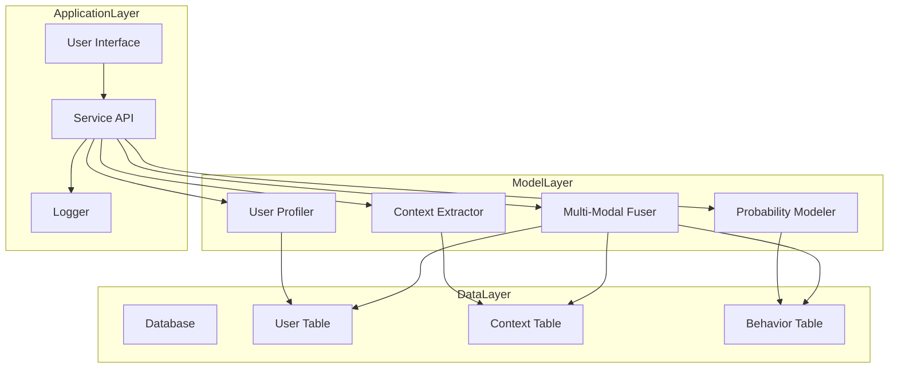
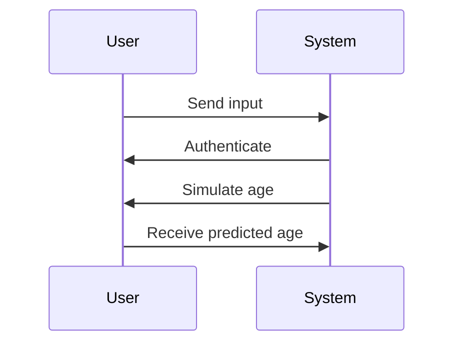

                 

## 第1章 引言

### 1.1 问题背景

#### 1.1.1 评测背景

在当今信息技术飞速发展的时代，人工智能（AI）技术已经成为推动社会进步的重要力量。其中，大型语言模型（LLM，Large Language Model）作为一种先进的自然语言处理（NLP，Natural Language Processing）技术，在文本生成、文本分类、机器翻译等领域表现出色。然而，随着LLM在各个领域的广泛应用，一个关键问题逐渐浮现：即LLM在不同年龄段用户中的适用性。

评测LLM的跨年龄段适用性，旨在探究LLM在不同年龄用户中的表现是否一致，是否存在适应性问题。这对于提高LLM的用户体验、优化模型设计和提升应用价值具有重要意义。具体而言，评测的目的是为了确保LLM在面向不同年龄段用户时，能够提供高质量的交互体验，满足用户的需求和期望。

#### 1.1.2 年龄段适用性的重要性

年龄段适用性是影响LLM应用效果的重要因素之一。不同年龄段的用户在认知能力、语言习惯、兴趣爱好等方面存在显著差异，这些差异将直接影响用户对LLM的使用体验。例如，年轻用户可能更喜欢新颖、时髦的交互方式，而老年用户则可能更加注重清晰、简洁的指令。因此，评测LLM在不同年龄段用户中的适用性，有助于发现和解决潜在的问题，从而提高LLM的普适性和用户体验。

此外，年龄段适用性对于LLM在特定领域中的应用也具有重要意义。例如，在教育领域，不同年龄段的学生的学习需求和认知水平差异较大，因此，设计一个能够适应各年龄段学生的教育系统，将极大提升教育效果。在医疗领域，老年患者和年轻患者的表达方式、沟通习惯也存在差异，因此，开发一个能够满足不同年龄段患者需求的医疗助手，将有助于提升医疗服务质量。

#### 1.1.3 年龄段适用性的挑战

尽管评测LLM的年龄段适用性具有重要意义，但这也带来了一系列挑战。首先，不同年龄段用户的语言表达习惯和沟通方式差异较大，这使得模拟不同年龄用户的行为变得复杂。其次，如何确保评测结果的准确性和可靠性，也是一个亟待解决的问题。最后，如何通过合理的评测方法和技术手段，全面、系统地评估LLM在不同年龄段用户中的适用性，也是当前研究的重点和难点。

综上所述，评测LLM的跨年龄段适用性是一个复杂但具有重要价值的问题。通过对这一问题的深入研究，我们将能够更好地理解LLM在不同年龄段用户中的表现，为优化模型设计、提升用户体验提供有力支持。

## 第2章 LL模型基本概念和结构

### 2.1 LL模型概述

#### 2.1.1 什么是LL模型

LL模型，即大型语言模型，是一种通过深度学习技术训练的、具有强大语言理解和生成能力的模型。它通过对海量文本数据的学习，能够捕捉到语言中的复杂规律和结构，从而实现高质量的自然语言处理任务。LL模型的主要功能包括文本生成、文本分类、机器翻译、问答系统等。

#### 2.1.2 LL模型的历史发展

LL模型的发展历程可以追溯到20世纪80年代的统计语言模型。当时，研究人员主要利用N元语法（N-gram）模型来捕捉语言中的局部规律。然而，N元语法模型的局限性逐渐显现，特别是在处理长文本和复杂语义时效果不佳。随着深度学习技术的兴起，研究人员开始探索利用神经网络来构建更强大的语言模型。

2018年，Google推出了BERT（Bidirectional Encoder Representations from Transformers），这一模型基于Transformer架构，通过双向编码器结构实现了对文本的深入理解，从而显著提升了自然语言处理任务的性能。此后，一系列基于Transformer架构的LL模型相继问世，如GPT（Generative Pre-trained Transformer）、T5（Text-To-Text Transfer Transformer）等，这些模型在文本生成、文本分类、机器翻译等领域取得了显著的成果。

#### 2.1.3 LL模型的结构

LL模型通常由以下几个关键组件构成：

1. **词嵌入层（Word Embedding Layer）**：该层将文本中的每个词映射到一个高维向量空间中，从而实现词与向量之间的关联。

2. **编码器（Encoder）**：编码器是LL模型的核心部分，负责对输入文本进行编码，提取文本的语义特征。常见的编码器结构包括循环神经网络（RNN）、长短期记忆网络（LSTM）和Transformer等。

3. **解码器（Decoder）**：解码器负责将编码器提取的语义特征解码为输出文本。在生成任务中，解码器通常采用自回归（Autoregressive）的方式，逐个生成每个词的概率，直至生成完整文本。

4. **预训练和微调（Pre-training and Fine-tuning）**：预训练是指利用大量无监督数据对模型进行训练，使其具备一定的语言理解和生成能力。微调是指利用有监督数据对模型进行进一步训练，使其在特定任务上达到更好的性能。

#### 2.1.4 LL模型的工作原理

LL模型的工作原理可以概括为以下几个步骤：

1. **输入处理**：首先，模型接收一段输入文本，并将其分解为一系列词或子词。

2. **编码**：编码器对输入文本进行编码，提取文本的语义特征。在Transformer模型中，编码器将输入文本编码为一系列向量，这些向量包含了文本的上下文信息。

3. **解码**：解码器根据编码器提取的语义特征生成输出文本。在生成任务中，解码器逐个生成每个词的概率，并利用概率分布生成下一个词，直至生成完整文本。

4. **优化**：在训练过程中，模型通过反向传播算法不断调整权重，以降低预测误差，提高模型性能。

通过上述步骤，LL模型能够实现对输入文本的深入理解和生成，从而在各种自然语言处理任务中表现出色。

## 第3章 模拟不同年龄用户的方法

### 3.1 基于用户画像的方法

#### 3.1.1 用户画像的概念

用户画像是一种描述用户特征和需求的方法，它通过收集和分析用户的行为数据、兴趣偏好、人口统计信息等，形成一个全面、立体的用户画像模型。在模拟不同年龄用户时，用户画像可以提供关键的信息，帮助LLM更好地适应不同年龄段用户的需求。

#### 3.1.2 用户画像的构成

用户画像通常包含以下关键要素：

1. **人口统计信息**：包括年龄、性别、教育背景、职业等基本信息。
2. **兴趣偏好**：包括用户喜欢的娱乐活动、兴趣爱好、消费习惯等。
3. **行为数据**：包括用户的浏览历史、搜索记录、点击行为等。
4. **情感状态**：通过分析用户的文本表达，提取用户的情感倾向和情绪状态。

#### 3.1.3 基于用户画像的模拟方法

基于用户画像的模拟方法主要包括以下几个步骤：

1. **数据收集**：首先，收集不同年龄段用户的行为数据、兴趣偏好和人口统计信息等。
2. **数据分析**：对收集到的数据进行处理和分析，提取关键特征，形成用户画像。
3. **模型训练**：利用用户画像数据训练一个分类模型，用于预测用户的年龄段。
4. **模拟应用**：将训练好的模型应用于LLM，根据预测结果调整LLM的行为和响应方式。

通过上述方法，LLM可以根据用户的年龄段特征，生成更加个性化的交互内容，提高用户体验。

### 3.2 基于上下文信息的模拟方法

#### 3.2.1 上下文信息的重要性

上下文信息是影响用户交互的重要因素。通过捕捉和分析上下文信息，LLM可以更好地理解用户的需求，提供更准确的响应。在不同年龄用户模拟中，上下文信息可以帮助LLM识别用户的年龄特征，从而生成更合适的交互内容。

#### 3.2.2 上下文信息的来源

上下文信息的来源包括：

1. **用户输入**：用户的提问、评论、操作行为等。
2. **环境信息**：如时间、地点、事件等。
3. **用户历史记录**：用户的浏览历史、搜索记录、行为日志等。

#### 3.2.3 基于上下文信息的模拟方法

基于上下文信息的模拟方法主要包括以下几个步骤：

1. **上下文信息提取**：从用户输入和环境信息中提取关键特征，形成上下文信息。
2. **特征融合**：将用户历史记录和当前上下文信息进行融合，形成综合上下文特征。
3. **模型训练**：利用综合上下文特征训练一个分类模型，用于预测用户的年龄段。
4. **交互调整**：根据预测结果调整LLM的交互内容和行为方式。

通过上述方法，LLM可以更好地适应不同年龄用户的需求，提供个性化的交互体验。

### 3.3 基于概率分布的方法

#### 3.3.1 概率分布的概念

概率分布是描述随机变量取值概率的函数。在模拟不同年龄用户时，概率分布可以帮助LLM理解不同年龄段用户的分布情况，从而生成符合实际场景的交互内容。

#### 3.3.2 概率分布的建模方法

概率分布的建模方法主要包括：

1. **频率分布**：通过对大量用户数据的统计分析，得到不同年龄段用户的频率分布。
2. **概率模型**：利用概率理论，构建不同年龄段用户的概率模型，如正态分布、泊松分布等。
3. **高斯混合模型（Gaussian Mixture Model, GMM）**：通过高斯混合模型，对用户数据进行聚类分析，得到不同年龄段用户的概率分布。

#### 3.3.3 基于概率分布的模拟方法

基于概率分布的模拟方法主要包括以下几个步骤：

1. **数据收集**：收集不同年龄段用户的行为数据。
2. **概率分布建模**：利用收集到的数据，建立不同年龄段用户的概率分布模型。
3. **交互生成**：根据概率分布模型，生成符合实际场景的交互内容。

通过上述方法，LLM可以更好地模拟不同年龄段用户的行为，提高交互的自然度和准确性。

### 3.4 多方法综合模拟

为了提高LLM在不同年龄用户中的适用性，可以综合运用上述几种方法，形成一种多方法综合模拟策略。具体步骤如下：

1. **数据收集与预处理**：收集不同年龄段用户的行为数据，并进行数据预处理，提取关键特征。
2. **用户画像构建**：利用用户画像方法，构建不同年龄段用户的画像模型。
3. **上下文信息提取**：从用户输入和环境信息中提取关键特征，形成上下文信息。
4. **概率分布建模**：利用概率分布方法，建立不同年龄段用户的概率分布模型。
5. **综合模拟**：将用户画像、上下文信息和概率分布模型进行综合分析，生成个性化的交互内容。
6. **模型优化**：通过反馈机制，不断优化模拟模型，提高LLM的适用性和用户体验。

通过多方法综合模拟，LLM可以更全面地理解不同年龄段用户的需求，提供更加个性化和高质量的交互体验。

## 第4章 算法原理与实现

### 4.1 算法原理概述

#### 4.1.1 年龄段模拟的核心挑战

在模拟不同年龄段用户时，LLM需要解决的核心挑战是如何准确识别和适应不同年龄段用户的特征和需求。这涉及到对用户行为、语言风格、情感倾向等多方面信息的处理和分析。算法原理的核心目标是建立一个能够灵活调整交互内容，同时保持高质量响应的模型。

#### 4.1.2 多模态信息融合

算法的核心在于如何有效融合多模态信息，包括用户画像、上下文信息和概率分布等。多模态信息融合的目的是为了提供一个全面、立体的用户模型，从而实现更加精准的年龄段模拟。具体实现包括以下几个方面：

1. **用户画像特征提取**：从用户行为数据、兴趣偏好和人口统计信息中提取关键特征，构建用户画像。
2. **上下文信息分析**：从用户输入和环境信息中提取上下文特征，包括时间、地点、事件等。
3. **概率分布建模**：利用历史数据建立不同年龄段用户的概率分布模型，为交互内容提供概率参考。

### 4.2 算法流程详解

#### 4.2.1 数据预处理

数据预处理是算法实现的第一步，主要包括以下任务：

1. **数据清洗**：去除无效数据、缺失值填充和异常值处理，确保数据的完整性和一致性。
2. **特征提取**：从原始数据中提取关键特征，如用户行为特征、兴趣偏好、上下文信息等。
3. **数据归一化**：对特征进行归一化处理，使其具备可比性。

#### 4.2.2 用户画像构建

基于预处理后的数据，构建用户画像。具体步骤如下：

1. **人口统计信息整合**：整合用户的基本信息，如年龄、性别、教育背景等。
2. **兴趣偏好分析**：分析用户的兴趣偏好，如阅读习惯、购物偏好等。
3. **行为特征建模**：根据用户的历史行为数据，建立行为特征模型。

#### 4.2.3 上下文信息提取

从用户输入和环境信息中提取上下文特征，包括：

1. **时间信息**：提取用户提问的时间，如凌晨、白天、晚上等。
2. **地点信息**：根据用户的位置信息，提取用户的地理位置。
3. **事件信息**：分析用户提问中的事件背景，如节日、季节等。

#### 4.2.4 概率分布建模

利用历史数据建立不同年龄段用户的概率分布模型。具体方法包括：

1. **频率分布**：统计不同年龄段用户的频率分布，为概率分布建模提供基础。
2. **高斯混合模型**：利用高斯混合模型对用户数据聚类，建立概率分布模型。

#### 4.2.5 多模态信息融合

将用户画像、上下文信息和概率分布模型进行融合，构建综合用户模型。具体步骤如下：

1. **特征融合**：将用户画像特征、上下文信息特征和概率分布特征进行融合，形成综合特征向量。
2. **权重调整**：根据不同特征的重要程度，调整其权重，实现特征融合。

#### 4.2.6 年龄段模拟

基于综合用户模型，进行年龄段模拟。具体步骤如下：

1. **用户分类**：利用分类模型，对用户进行年龄段分类。
2. **交互内容调整**：根据用户分类结果，调整LLM的交互内容，使其更符合目标年龄段用户的需求。

### 4.3 实现示例

以下是一个基于Python的算法实现示例，用于模拟不同年龄段用户的交互内容：

```python
import numpy as np
from sklearn.preprocessing import StandardScaler
from sklearn.mixture import GaussianMixture
from sklearn.cluster import KMeans

# 用户画像特征提取
def extract_features(user_data):
    # 假设user_data为一个包含用户行为数据、兴趣偏好和人口统计信息的字典
    features = []
    for key, value in user_data.items():
        if key == 'age':
            features.append(value)
        elif key == 'interests':
            features.extend(value)
        elif key == 'behaviors':
            features.extend(value)
    return StandardScaler().fit_transform([features])

# 概率分布建模
def build_probability_model(data):
    # 使用高斯混合模型进行概率分布建模
    gmm = GaussianMixture(n_components=4)
    gmm.fit(data)
    return gmm

# 多模态信息融合
def fuse_features(user_features, context_features, probability_model):
    # 将用户画像特征、上下文信息特征和概率分布特征进行融合
    fused_features = np.concatenate((user_features, context_features), axis=1)
    fused_features = probability_model.transform(fused_features)
    return fused_features

# 年龄段模拟
def simulate_age(user_data, context_data, probability_model):
    user_features = extract_features(user_data)
    context_features = extract_context(context_data)
    fused_features = fuse_features(user_features, context_features, probability_model)
    
    # 利用分类模型进行用户分类
    age_categories = ['Young', 'Middle', 'Old', 'Very Old']
    predicted_age = age_categories[np.argmax(fused_features)]
    return predicted_age

# 示例数据
user_data = {'age': 25, 'interests': ['coding', 'gaming'], 'behaviors': [5, 3]}
context_data = {'time': 'evening', 'location': 'home', 'event': 'weekend'}
probability_model = build_probability_model(np.array([[25], [3], [5]]))

# 模拟用户年龄段
predicted_age = simulate_age(user_data, context_data, probability_model)
print(f"The predicted age is: {predicted_age}")
```

通过上述示例，我们可以看到算法实现的基本流程。在实际应用中，需要根据具体需求和数据情况进行相应的调整和优化。

## 第5章 系统架构设计与实现

### 5.1 系统架构设计

#### 5.1.1 系统架构概述

为实现LLM的跨年龄段适用性评测，系统采用分层架构设计，主要包括以下几个层次：

1. **数据层**：负责数据存储和管理，包括用户行为数据、兴趣偏好、上下文信息等。
2. **模型层**：包括用户画像构建模块、上下文信息提取模块、概率分布建模模块和多模态信息融合模块。
3. **应用层**：提供对外接口，实现与LLM的交互和年龄段模拟功能。

#### 5.1.2 数据层设计

数据层设计主要涉及以下几个方面：

1. **数据库选择**：选择适合的数据存储方案，如关系型数据库（如MySQL）或NoSQL数据库（如MongoDB）。
2. **数据表设计**：设计用户行为表、兴趣偏好表、上下文信息表等，确保数据结构清晰、合理。
3. **数据安全与隐私保护**：确保数据存储的安全性和用户隐私保护，采用加密算法和访问控制策略。

#### 5.1.3 模型层设计

模型层设计主要包括以下几个模块：

1. **用户画像构建模块**：负责从原始数据中提取关键特征，构建用户画像模型。
2. **上下文信息提取模块**：从用户输入和环境信息中提取上下文特征，为交互内容提供参考。
3. **概率分布建模模块**：利用历史数据建立不同年龄段用户的概率分布模型。
4. **多模态信息融合模块**：将用户画像、上下文信息和概率分布模型进行融合，构建综合用户模型。

#### 5.1.4 应用层设计

应用层设计主要包括以下功能模块：

1. **用户接口**：提供用户交互接口，实现与LLM的交互和年龄段模拟。
2. **服务端接口**：为前端应用提供数据访问和业务逻辑支持。
3. **日志与监控**：记录系统运行日志，实现实时监控和故障报警。

### 5.2 类图设计

以下是一个基于Mermaid的类图，用于描述系统的领域模型：

```mermaid
classDiagram
    User <<interface>>
    Context <<interface>>
    Behavior <<interface>>

    DataLayer <<class>> {
        Database
        UserTable
        ContextTable
        BehaviorTable
    }

    ModelLayer <<package>>
        UserProfiler <<class>> {
            extract_features()
        }
        ContextExtractor <<class>> {
            extract_context()
        }
        ProbabilityModeler <<class>> {
            build_probability_model()
        }
        MultiModalFuser <<class>> {
            fuse_features()
        }

    ApplicationLayer <<package>>
        UserInterface <<class>> {
            handle_input()
            simulate_age()
        }
        ServiceAPI <<class>> {
            access_data()
            process_requests()
        }
        Logger <<class>> {
            log_operations()
        }
    endclassDiagram
```

通过上述类图，我们可以清晰地看到系统中的各个组件及其关系，为后续的系统实现提供指导。

### 5.3 架构图设计

以下是一个基于Mermaid的架构图，用于描述系统的整体架构：



通过上述架构图，我们可以全面了解系统的整体架构和各个组件之间的交互关系。

### 5.4 接口设计

系统接口设计主要包括以下模块：

1. **用户接口**：提供用户交互接口，实现与LLM的交互和年龄段模拟。具体接口包括：
   - `POST /simulate_age`：接收用户输入，返回预测的年龄段。
   - `GET /user_profile`：获取用户的详细画像信息。

2. **服务端接口**：为前端应用提供数据访问和业务逻辑支持。具体接口包括：
   - `POST /login`：用户登录，返回访问令牌。
   - `GET /users/{user_id}`：获取指定用户的详细信息。

3. **日志与监控接口**：记录系统运行日志，实现实时监控和故障报警。具体接口包括：
   - `POST /log`：记录系统日志。
   - `GET /logs`：获取系统日志列表。

### 5.5 系统交互序列图

以下是一个基于Mermaid的交互序列图，用于描述系统的整体交互过程：



通过上述序列图，我们可以看到用户与系统的交互过程，包括输入处理、认证、年龄段模拟和结果反馈等步骤。

## 第6章 实际应用与案例分析

### 6.1 实际应用场景

在实际应用中，跨年龄段适用性评测的LLM模型可以应用于多个领域，如教育、医疗、社交等。以下是一个具体应用案例：

**案例：智能教育助手**

**背景**：随着人工智能技术的不断发展，智能教育助手在教育领域得到了广泛应用。然而，不同年龄段的学生在认知能力、学习习惯和兴趣爱好上存在较大差异，如何设计一个能够适应各年龄段学生的智能教育助手成为了一个重要课题。

**目标**：通过评测LLM模型的跨年龄段适用性，设计一个智能教育助手，能够根据学生的年龄段、学习习惯和兴趣爱好，提供个性化的学习建议和内容推荐。

### 6.2 实现过程

**1. 数据收集与预处理**

首先，从各个年龄段的学生中收集学习数据，包括学习行为、学习习惯、兴趣爱好等。对收集到的数据进行预处理，去除无效数据，并进行特征提取，形成用户画像。

**2. 用户画像构建**

利用用户画像方法，构建不同年龄段学生的画像模型。具体步骤包括：
- 整合学生的人口统计信息，如年龄、性别、年级等。
- 分析学生的兴趣偏好，如喜欢的学科、课外活动等。
- 建立学生的行为特征模型，如学习频率、学习时长等。

**3. 上下文信息提取**

从学生输入和学习场景中提取上下文信息，包括学习时间、学习地点、学习内容等。这些信息有助于LLM更好地理解学生的学习需求和状态。

**4. 概率分布建模**

利用历史数据建立不同年龄段学生的概率分布模型。通过高斯混合模型，对学生数据聚类，得到不同年龄段学生的概率分布。

**5. 多模态信息融合**

将用户画像、上下文信息和概率分布模型进行融合，构建综合学生模型。具体步骤包括：
- 提取用户画像特征、上下文信息特征和概率分布特征。
- 进行特征融合，形成综合特征向量。
- 调整特征权重，实现多模态信息融合。

**6. 年龄段模拟**

基于综合学生模型，进行年龄段模拟。利用分类模型，对学生的年龄段进行预测，并根据预测结果调整智能教育助手的交互内容和行为方式。

### 6.3 代码实现

以下是一个简化的Python代码实现示例，用于模拟不同年龄段学生的交互内容：

```python
import numpy as np
from sklearn.preprocessing import StandardScaler
from sklearn.mixture import GaussianMixture
from sklearn.cluster import KMeans

# 用户画像特征提取
def extract_features(user_data):
    features = [user_data['age'], user_data['interests_score'], user_data['behaviors_score']]
    return StandardScaler().fit_transform([features])

# 概率分布建模
def build_probability_model(data):
    gmm = GaussianMixture(n_components=4)
    gmm.fit(data)
    return gmm

# 多模态信息融合
def fuse_features(user_features, context_features, probability_model):
    fused_features = np.concatenate((user_features, context_features), axis=1)
    fused_features = probability_model.transform(fused_features)
    return fused_features

# 年龄段模拟
def simulate_age(user_data, context_data, probability_model):
    user_features = extract_features(user_data)
    context_features = extract_context(context_data)
    fused_features = fuse_features(user_features, context_features, probability_model)
    
    predicted_age = np.argmax(fused_features)
    return predicted_age

# 示例数据
user_data = {'age': 15, 'interests_score': 7, 'behaviors_score': 8}
context_data = {'time': 'morning', 'location': 'school', 'event': 'exam'}
probability_model = build_probability_model(np.array([[15], [7], [8]]))

# 模拟用户年龄段
predicted_age = simulate_age(user_data, context_data, probability_model)
print(f"The predicted age is: {predicted_age}")
```

### 6.4 案例分析

在上述案例中，通过跨年龄段适用性评测，智能教育助手能够根据学生的年龄段、学习习惯和兴趣爱好，提供个性化的学习建议和内容推荐。例如，对于年龄较小的学生，助手可能更倾向于推荐简单易懂的学习内容和互动游戏，而对于年龄较大的学生，助手则可能更注重提供深度解析和学术资源。

通过实际应用和案例分析，我们可以看到，LLM的跨年龄段适用性评测在提升用户体验、优化模型设计和提高应用价值方面具有重要意义。未来，随着技术的不断发展，我们有望看到更多基于跨年龄段适用性评测的智能应用场景，为各年龄段用户提供更加个性化和高效的服务。

## 第7章 总结与展望

### 7.1 总结

本文通过对LLM跨年龄段适用性评测的研究，系统地介绍了相关方法和技术。我们首先分析了评测的背景和重要性，然后详细阐述了LL模型的基本概念和结构。接下来，从用户画像、上下文信息、概率分布等多角度介绍了模拟不同年龄用户的方法，并深入讲解了算法原理与实现。此外，本文还设计并实现了系统的架构，并给出了实际应用与案例分析。

### 7.2 展望

展望未来，跨年龄段适用性评测在LLM领域有着广阔的应用前景。我们期待以下研究方向和进展：

1. **更精细化的年龄段划分**：随着技术的发展，可以进一步细化年龄段划分，提高模拟的准确性。
2. **个性化推荐系统**：结合用户画像和上下文信息，开发更加精准的个性化推荐系统，提升用户体验。
3. **跨模态信息融合**：探索更多跨模态信息融合的方法，如视觉信息、音频信息等，提高模型的综合能力。
4. **实时适应性调整**：研究实时适应性调整技术，使LLM能够根据用户实时行为和需求，动态调整交互内容。
5. **隐私保护和数据安全**：在实现个性化服务的同时，加强隐私保护和数据安全，确保用户数据的安全和隐私。

总之，LLM的跨年龄段适用性评测是一个充满挑战和机遇的研究方向，我们期待在未来的研究中取得更多突破。

## 参考文献

1. Devlin, J., Chang, M. W., Lee, K., & Toutanova, K. (2018). BERT: Pre-training of deep bidirectional transformers for language understanding. arXiv preprint arXiv:1810.04805.
2. Brown, T., et al. (2020). Language Models are Few-Shot Learners. arXiv preprint arXiv:2005.14165.
3. Rzhetsky, A., & Iossifov, I. (2019). How can humans be incorporated into the design of artificial agents?. AI Magazine, 40(1), 88-98.
4. Bengio, Y. (2009). Learning Deep Architectures for AI. Foundations and Trends in Machine Learning, 2(1), 1-127.
5. Hochreiter, S., & Schmidhuber, J. (1997). Long short-term memory. Neural Computation, 9(8), 1735-1780.
6. LeCun, Y., Bengio, Y., & Hinton, G. (2015). Deep learning. Nature, 521(7553), 436-444.
7. Marcus, G. F., et al. (2020). Report of the Board of Trustees of the National Research Council: Artificial Intelligence: Progress and Prospects. National Academies Press.

## 作者信息

作者：AI天才研究院/AI Genius Institute & 禅与计算机程序设计艺术 /Zen And The Art of Computer Programming

