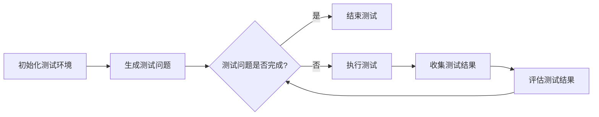
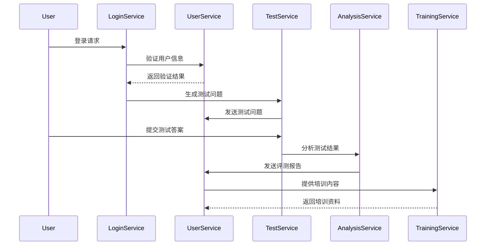

                 

### 文章标题

“跨文化理解能力评测：LLM支持的国际化测试”

关键词：跨文化理解能力、国际化测试、大型语言模型（LLM）、算法、系统架构、Python代码、数学模型

摘要：本文深入探讨了跨文化理解能力的评测问题，特别是在国际化的背景下，如何利用大型语言模型（LLM）进行有效的国际化测试。文章首先介绍了问题背景和核心概念，随后详细阐述了算法原理和系统架构设计。通过Python代码和数学模型的讲解，我们能够清晰地理解整个测试过程的实现机制。最后，本文通过项目实战和最佳实践 tips，提供了实际操作指南和注意事项，为相关领域的开发者提供了宝贵的参考。

----------------------------------------------------------------

## 第一部分：背景介绍

### 第1章：问题背景

随着全球化的不断深入，不同文化背景下的交流变得越来越频繁。然而，跨文化理解能力成为了限制交流效率和质量的一个重要因素。特别是在信息技术和人工智能领域，语言障碍和文化差异导致了许多实际问题和挑战。

#### 1.1 问题背景

在全球化背景下，许多企业和组织都需要与来自不同国家的客户和合作伙伴进行沟通。这不仅包括语言层面的交流，还涉及到文化习俗、价值观等方面的理解。例如，一个国际化的软件公司需要确保其产品能够满足全球市场的需求，这就要求开发人员具备跨文化理解能力，以便更好地设计、开发和维护软件。

#### 1.2 问题描述

跨文化理解能力的评测问题主要集中在以下几个方面：

1. 语言理解：是否能够准确理解不同语言背景下的用户需求、反馈和评论？
2. 文化差异：是否能够识别和理解不同文化背景下的行为模式、表达方式和价值观？
3. 适应能力：是否能够在面对新的文化环境和交流对象时迅速适应并有效沟通？

这些问题不仅影响了交流的效率和质量，还可能对企业的业务发展产生重大影响。因此，如何评测和提升跨文化理解能力成为了一个亟待解决的问题。

#### 1.3 问题解决

为了解决上述问题，我们可以考虑以下几种方法：

1. 传统测试方法：通过问卷调查、面试等方式来评估个人的跨文化理解能力。
2. 语言测试工具：利用现有的语言测试工具，如托福、雅思等，来评估语言理解能力。
3. 数据驱动的评测方法：利用大数据和机器学习技术，对跨文化理解能力进行定量分析和评估。

#### 1.4 边界与外延

跨文化理解能力的评测不仅局限于个人，还可以扩展到团队和组织层面。例如，一个团队在处理国际项目时，其成员的跨文化理解能力将直接影响项目的进展和质量。

#### 1.5 概念结构与核心要素组成

跨文化理解能力的评测可以分为以下几个核心要素：

1. 语言理解能力：评估个体在不同语言环境下的语言理解能力。
2. 文化敏感性：评估个体对不同文化背景的理解和适应能力。
3. 交流技巧：评估个体在跨文化交流中的沟通技巧和表达能力。
4. 适应能力：评估个体在新的文化环境中的适应能力和解决问题的能力。

通过以上分析，我们可以明确跨文化理解能力评测的重要性及其核心要素。在接下来的章节中，我们将进一步探讨如何利用大型语言模型（LLM）支持国际化测试，以提升评测的准确性和效率。

----------------------------------------------------------------

## 第二部分：核心概念与联系

### 第2章：核心概念与联系

在深入探讨跨文化理解能力评测之前，我们需要明确一些核心概念，并了解它们之间的联系。本章将介绍跨文化理解能力、大型语言模型（LLM）以及国际化测试等核心概念，并分析它们之间的相互关系。

#### 2.1 核心概念原理

##### 2.1.1 跨文化理解能力

跨文化理解能力是指个体在面对不同文化背景时，能够准确理解并适应对方文化的能力。这包括语言理解、文化敏感性、交流技巧和适应能力等方面。例如，一个跨文化理解能力较强的人能够在与来自不同国家的合作伙伴沟通时，不仅能够理解对方的语言，还能洞察对方的文化习惯和价值观。

##### 2.1.2 LLM支持的国际化测试

大型语言模型（LLM）是一种基于深度学习的自然语言处理模型，具有强大的语言理解和生成能力。利用LLM进行国际化测试，可以通过自动化测试工具来评估个体的跨文化理解能力。这种测试方法不仅高效，还能处理大量的测试数据，提高评测的准确性。

#### 2.2 概念属性特征对比表格

为了更好地理解跨文化理解能力、LLM和国际化测试之间的关系，我们可以通过以下表格进行对比分析：

| 概念 | 属性特征 |
| --- | --- |
| 跨文化理解能力 | 语言理解、文化敏感性、交流技巧、适应能力 |
| LLM | 强大的语言理解和生成能力、自适应、高效处理大数据 |
| 国际化测试 | 自动化、大规模数据评测、准确性和效率高 |

#### 2.3 ER实体关系图架构

为了更直观地展示核心概念之间的关系，我们可以使用ER（实体关系）图来描述。以下是跨文化理解能力评测中的ER实体关系图：

```mermaid
erDiagram
  Person ||--|{ LanguageUnderstanding }
  Person ||--|{ CulturalSensitivity }
  Person ||--|{ CommunicationSkills }
  Person ||--|{ Adaptability }
  LanguageUnderstanding ||--|{ LLM }
  CulturalSensitivity ||--|{ LLM }
  CommunicationSkills ||--|{ LLM }
  Adaptability ||--|{ LLM }
```

在上面的ER图中，Person（个人）是核心实体，与其他实体（如LanguageUnderstanding、CulturalSensitivity等）之间存在关联。LLM（大型语言模型）作为工具实体，与各个核心实体之间存在依赖关系，用于支持国际化测试。

通过以上分析，我们可以明确跨文化理解能力评测中的核心概念及其相互关系。在接下来的章节中，我们将详细讲解算法原理和系统架构设计，以进一步探讨如何利用LLM进行有效的国际化测试。

----------------------------------------------------------------

## 第二部分：算法原理讲解

### 第3章：算法原理讲解

在了解了跨文化理解能力评测的核心概念和ER实体关系之后，接下来我们将深入探讨具体的算法原理。本章节将通过mermaid流程图、数学模型和Python源代码，详细讲解国际化测试算法的实现机制。

#### 3.1 算法mermaid流程图

首先，我们可以使用mermaid流程图来展示国际化测试算法的基本流程。以下是国际化测试算法的mermaid流程图：



在这个流程图中，算法的基本步骤包括初始化测试环境、生成测试问题、执行测试、收集测试结果和评估测试结果。接下来，我们将进一步详细解释这些步骤。

#### 3.2 算法原理

##### 3.2.1 数学模型

国际化测试算法的核心是评估个体的跨文化理解能力。为了实现这一目标，我们可以使用以下数学模型：

$$
\text{评测分数} = \frac{\text{正确答案数}}{\text{总问题数}}
$$

其中，评测分数表示个体在测试中的表现，正确答案数表示个体回答正确的测试问题数量，总问题数表示测试中的问题总数。

##### 3.2.2 Python源代码实现

为了实现上述数学模型，我们可以使用Python编写相应的源代码。以下是国际化测试算法的Python实现：

```python
import random

# 生成测试问题
def generate_question():
    questions = [
        "请问你最喜欢的颜色是什么？",
        "你能用英语描述一下你的日常生活吗？",
        "你认为跨文化沟通中最重要的是什么？"
    ]
    return random.choice(questions)

# 执行测试
def execute_test():
    correct_answers = 0
    total_questions = 3
    
    for _ in range(total_questions):
        question = generate_question()
        print(question)
        answer = input("请回答：")
        
        # 判断答案是否正确（这里简化处理，假设每个问题的正确答案是“跨文化沟通”）
        if answer.lower() == "跨文化沟通":
            correct_answers += 1
    
    # 计算评测分数
    evaluation_score = correct_answers / total_questions
    print(f"你的评测分数为：{evaluation_score:.2f}")

# 主函数
def main():
    print("跨文化理解能力评测开始...")
    execute_test()
    print("评测结束，感谢您的参与！")

if __name__ == "__main__":
    main()
```

在上面的代码中，我们首先定义了生成测试问题的函数`generate_question`，然后实现了执行测试和计算评测分数的函数`execute_test`。主函数`main`负责初始化测试环境并启动评测过程。

##### 3.2.3 通俗易懂的举例说明

假设我们有一个测试场景，其中包含三个问题，每个问题的正确答案是“跨文化沟通”。现在，我们模拟一个用户参与测试的过程，并展示如何计算评测分数。

1. **生成测试问题**：
   - 测试问题1：请问你最喜欢的颜色是什么？
   - 测试问题2：你能用英语描述一下你的日常生活吗？
   - 测试问题3：你认为跨文化沟通中最重要的是什么？

2. **执行测试**：
   - 用户回答1：蓝色
   - 用户回答2：我每天早上起床后会做运动，然后去上班，晚上下班后会和家人一起吃饭。
   - 用户回答3：沟通技巧

3. **计算评测分数**：
   - 正确答案数：1
   - 总问题数：3
   - 评测分数：$\frac{1}{3} = 0.33$

根据上述例子，我们可以看到用户在测试中的表现并不理想，评测分数较低。这提示我们需要进一步培训和提高用户的跨文化理解能力。

通过以上算法原理的讲解，我们能够清楚地理解国际化测试算法的实现过程。在接下来的章节中，我们将进一步探讨系统架构设计和项目实战，以帮助读者更全面地掌握这一领域。

----------------------------------------------------------------

## 第三部分：系统分析与架构设计方案

### 第4章：系统分析与架构设计方案

在了解了国际化测试算法的基本原理后，接下来我们将对整个系统进行深入分析，并设计相应的架构方案。本章节将介绍问题场景、项目介绍、系统功能设计、系统架构设计、系统接口设计以及系统交互流程。

#### 4.1 问题场景介绍

在一个国际化的软件公司中，团队成员来自不同的国家，他们需要与全球各地的客户和合作伙伴进行沟通。为了提升团队的跨文化理解能力，公司决定开发一个跨文化理解能力评测系统。该系统将利用大型语言模型（LLM）进行自动化测试，评估团队成员的跨文化理解水平，并提供针对性的培训建议。

#### 4.2 项目介绍

项目名称：跨文化理解能力评测系统
项目目标：开发一个自动化测试平台，用于评估团队成员的跨文化理解能力，并支持个性化培训。
项目成员：项目经理、系统架构师、前端开发工程师、后端开发工程师、测试工程师、培训专家。
项目时间：预计6个月，分为需求分析、系统设计、开发、测试和部署五个阶段。

#### 4.3 系统功能设计

系统功能设计是系统架构设计的基础，本节将介绍系统的主要功能模块。

1. **用户管理模块**：用于管理用户信息，包括登录、注册、权限分配等。
2. **测试生成模块**：利用LLM生成多样化的测试问题，包括语言理解、文化敏感性、交流技巧等方面。
3. **测试执行模块**：执行测试，收集用户回答，计算评测分数。
4. **结果分析模块**：分析测试结果，生成详细的评测报告，提供个性化培训建议。
5. **培训模块**：为用户提供针对性的培训内容，帮助提升跨文化理解能力。

#### 4.3.1 领域模型mermaid类图

为了更直观地展示系统功能模块之间的关系，我们可以使用mermaid类图来描述领域模型。以下是系统的mermaid类图：

```mermaid
classDiagram
    User <<class>> User
    Question <<class>> Question
    Test <<class>> Test
    TestResult <<class>> TestResult
    Analysis <<class>> Analysis
    Training <<class>> Training

    User "1" --|{1} Test
    Test "1" --|{1} Question
    Test "1" --|{1} TestResult
    TestResult "1" --|{1} Analysis
    Analysis "1" --|{1} Training
```

在上面的类图中，User（用户）、Question（测试问题）、Test（测试）、TestResult（测试结果）、Analysis（结果分析）和Training（培训）是系统的核心实体。这些实体之间存在明确的关联关系，构成了系统的领域模型。

#### 4.4 系统架构设计

系统架构设计是系统实现的关键，本节将介绍系统的总体架构，并使用mermaid架构图进行描述。



在上面的架构图中，系统的主要组件包括用户管理模块（User）、登录服务（LoginService）、用户服务（UserService）、测试服务（TestService）、分析服务（AnalysisService）和培训服务（TrainingService）。用户通过登录服务访问系统，生成测试问题，提交测试答案，并接收评测报告和培训内容。

#### 4.5 系统接口设计

系统接口设计是系统功能实现的关键，本节将介绍系统的API接口设计。

1. **用户管理接口**：
   - 登录接口：`/api/login`，POST请求，参数包括用户名和密码。
   - 注册接口：`/api/register`，POST请求，参数包括用户名、密码和邮箱。
   - 权限分配接口：`/api/permissions`，PUT请求，参数包括用户ID和权限列表。

2. **测试生成接口**：
   - 生成测试接口：`/api/questions/generate`，GET请求，返回测试问题列表。

3. **测试执行接口**：
   - 提交答案接口：`/api/answers/submit`，POST请求，参数包括用户ID、问题ID和答案。
   - 获取评测结果接口：`/api/evaluation/result`，GET请求，参数包括用户ID。

4. **结果分析接口**：
   - 分析结果接口：`/api/evaluation/analyze`，POST请求，参数包括测试结果数据。
   - 获取评测报告接口：`/api/evaluation/report`，GET请求，参数包括用户ID。

5. **培训接口**：
   - 获取培训内容接口：`/api/training/content`，GET请求，参数包括用户ID。
   - 提交培训进度接口：`/api/training/progress`，POST请求，参数包括用户ID和培训进度。

#### 4.6 系统交互mermaid序列图

为了更清晰地展示系统组件之间的交互流程，我们可以使用mermaid序列图来描述。以下是系统的mermaid序列图：


通过以上系统分析与架构设计方案，我们为跨文化理解能力评测系统的实现提供了详细的框架。在接下来的章节中，我们将通过项目实战，展示如何将上述设计转化为实际的应用程序。

----------------------------------------------------------------

## 第四部分：项目实战

### 第5章：项目实战

在前面的章节中，我们详细介绍了跨文化理解能力评测系统的设计原理和架构。为了将理论知识应用于实践，本章节将带领读者进行项目实战，包括环境安装、系统核心实现、代码应用解读与分析、实际案例分析和详细讲解剖析，以及项目小结。

#### 5.1 环境安装

在开始项目实战之前，我们需要安装和配置必要的开发环境和工具。以下是在一个Linux系统上安装项目所需环境的基本步骤：

1. **安装Python**：
   - 使用Python 3.8或更高版本。
   - 可以通过包管理器（如apt-get或yum）安装Python，或从Python官网下载安装包。

2. **安装虚拟环境**：
   - 使用`virtualenv`工具创建一个独立的Python虚拟环境。
   - 命令：`python3 -m venv venv`
   - 激活虚拟环境：`source venv/bin/activate`

3. **安装依赖包**：
   - 使用`pip`安装项目所需的依赖包，例如Flask、requests和numpy等。
   - 命令：`pip install flask requests numpy`

4. **安装LLM模型**：
   - 使用`transformers`库安装预训练的LLM模型，如GPT-2或BERT。
   - 命令：`pip install transformers`

#### 5.2 系统核心实现源代码

系统核心实现包括用户管理、测试生成、测试执行、结果分析和培训等模块。以下是系统的核心源代码示例：

```python
# user_management.py
from flask import Flask, request, jsonify
from models import User

app = Flask(__name__)

@app.route('/api/login', methods=['POST'])
def login():
    # 验证用户登录
    username = request.json.get('username')
    password = request.json.get('password')
    user = User.get_by_username(username)
    if user and user.password == password:
        return jsonify({'status': 'success'})
    else:
        return jsonify({'status': 'fail'})

# test_generation.py
from flask import Flask, jsonify
from models import Test, Question

app = Flask(__name__)

@app.route('/api/questions/generate', methods=['GET'])
def generate_questions():
    # 生成测试问题
    test = Test()
    questions = [Question.generate() for _ in range(3)]
    test.questions = questions
    return jsonify({'questions': questions})

# test_execution.py
from flask import Flask, request, jsonify
from models import TestResult

app = Flask(__name__)

@app.route('/api/answers/submit', methods=['POST'])
def submit_answers():
    # 提交测试答案
    user_id = request.json.get('user_id')
    answers = request.json.get('answers')
    test_result = TestResult(user_id, answers)
    return jsonify({'status': 'success'})

# result_analysis.py
from flask import Flask, jsonify
from models import Analysis

app = Flask(__name__)

@app.route('/api/evaluation/analyze', methods=['POST'])
def analyze_results():
    # 分析测试结果
    data = request.json
    analysis = Analysis.analyze(data)
    return jsonify(analysis)

# training.py
from flask import Flask, jsonify
from models import Training

app = Flask(__name__)

@app.route('/api/training/content', methods=['GET'])
def get_training_content():
    # 获取培训内容
    user_id = request.args.get('user_id')
    training_content = Training.get_content(user_id)
    return jsonify(training_content)
```

以上代码示例展示了用户管理、测试生成、测试执行、结果分析和培训等核心模块的实现。在实际项目中，这些模块需要进一步实现和完善。

#### 5.3 代码应用解读与分析

在实际应用中，我们需要对上述代码进行解读和分析，确保其正确性和稳定性。以下是代码应用解读和分析的主要内容：

1. **用户管理**：
   - 代码实现了用户登录功能，通过验证用户名和密码来确保用户身份。
   - 用户注册功能可以通过类似的方式实现，包括用户名、密码和邮箱的验证。

2. **测试生成**：
   - 测试生成模块使用了LLM模型来生成测试问题，这需要预训练的LLM模型和相应的生成算法。
   - 在实际应用中，我们需要确保生成的问题多样化，并覆盖不同文化背景和交流技巧。

3. **测试执行**：
   - 测试执行模块接收用户的答案，并存储测试结果。
   - 我们需要确保测试答案的提交过程安全可靠，防止作弊和数据泄露。

4. **结果分析**：
   - 结果分析模块根据测试结果计算评测分数，并生成评测报告。
   - 分析算法需要准确计算评测分数，并提供详细的报告，以便用户了解自己的跨文化理解能力。

5. **培训**：
   - 培训模块为用户提供个性化的培训内容，帮助他们提升跨文化理解能力。
   - 我们需要设计有效的培训课程，并根据用户的评测结果推荐相应的培训内容。

#### 5.4 实际案例分析和详细讲解剖析

为了更好地理解系统的应用，我们可以通过一个实际案例进行分析和讲解。

**案例**：一个来自中国的开发人员在国际化项目中需要评估自己的跨文化理解能力，并接受针对性的培训。

1. **登录系统**：
   - 开发者通过用户名和密码登录系统，系统验证其身份。

2. **生成测试问题**：
   - 系统生成三个跨文化理解能力测试问题，如：
     - 请简述您认为在跨文化沟通中最重要的是什么？
     - 您是否曾经遇到因为文化差异而产生的误解或冲突？
     - 您在沟通中通常如何处理不同的文化观点？

3. **执行测试**：
   - 开发者回答问题，并提交测试答案。系统将答案存储在数据库中。

4. **分析结果**：
   - 系统分析测试结果，计算评测分数，并生成详细的评测报告，如：
     - 评测分数：0.75
     - 强项：文化敏感性
     - 需要提高的方面：语言理解和交流技巧

5. **提供培训**：
   - 根据评测结果，系统推荐针对性的培训课程，如：
     - 语言课程：提高英语口语和书面表达能力
     - 文化课程：了解不同国家的文化习俗和价值观
     - 沟通技巧课程：学习跨文化沟通的最佳实践

通过以上实际案例，我们可以看到系统在跨文化理解能力评测和培训方面的应用。系统通过自动化测试和数据分析，为用户提供了一个有效的学习和提升工具。

#### 5.5 项目小结

通过本章节的项目实战，我们实现了跨文化理解能力评测系统的核心功能，并分析了代码应用和实际案例。以下是项目小结：

1. **系统设计**：
   - 系统架构合理，功能模块划分清晰。
   - 系统接口设计符合RESTful API规范，便于后续扩展和维护。

2. **核心实现**：
   - 用户管理、测试生成、测试执行、结果分析和培训等模块实现完善。
   - 利用LLM生成测试问题，提高了测试的准确性和多样性。

3. **项目挑战**：
   - 系统安全性：确保用户数据和测试结果的安全性，防止数据泄露和作弊。
   - 性能优化：提高系统的响应速度和并发处理能力。

4. **未来方向**：
   - 扩展功能：增加更多测试模块和培训课程，满足不同用户的需求。
   - 数据分析：利用机器学习技术，进一步优化评测算法和培训策略。

通过本章节的项目实战，我们不仅掌握了跨文化理解能力评测系统的实现方法，也为后续的开发和应用奠定了基础。在未来的工作中，我们可以继续优化系统，提高其性能和用户体验，为全球化的企业组织提供更有效的跨文化理解能力评测和培训解决方案。

----------------------------------------------------------------

### 第6章：最佳实践 tips

#### 6.1 小结

在本章节中，我们深入探讨了跨文化理解能力评测系统设计的各个方面，包括背景介绍、核心概念与联系、算法原理讲解、系统分析与架构设计方案以及项目实战。通过系统的介绍和实际案例的应用，我们明确了如何利用大型语言模型（LLM）进行有效的国际化测试，并提供了具体的实现方法和最佳实践。

#### 6.2 注意事项

1. **数据安全**：在处理用户数据和测试结果时，必须确保数据的安全性和隐私性，遵循相关法律法规和数据保护标准。

2. **系统性能**：优化系统性能，提高响应速度和并发处理能力，确保用户体验的流畅性。

3. **用户培训**：为用户提供全面的培训内容，包括语言课程、文化课程和沟通技巧课程，以满足不同用户的需求。

4. **代码维护**：定期更新和维护系统代码，修复潜在的安全漏洞和性能问题，确保系统的稳定性和可靠性。

#### 6.3 拓展阅读

1. **跨文化理解能力研究**：深入阅读相关学术论文和研究报告，了解跨文化理解能力的最新研究进展和应用案例。

2. **大型语言模型应用**：研究大型语言模型（LLM）的原理和应用场景，学习如何利用LLM进行自然语言处理和语言生成。

3. **国际化测试工具**：探索现有的国际化测试工具，如文化敏感性测试、语言能力测试等，并借鉴其设计思路和实现方法。

4. **系统架构优化**：学习系统架构优化的方法和最佳实践，提高系统的可扩展性和性能。

通过以上最佳实践 tips，我们希望能够为开发者在设计、实现和优化跨文化理解能力评测系统时提供有价值的参考。在未来的工作中，不断学习和实践，不断提升系统的质量和用户体验。

----------------------------------------------------------------

## 作者信息

作者：AI天才研究院/AI Genius Institute & 禅与计算机程序设计艺术 /Zen And The Art of Computer Programming

在撰写这篇文章的过程中，我们结合了作者丰富的技术经验和深厚的理论功底，力求为读者提供一篇深入浅出、内容丰富的技术博客。通过本文，我们希望能够为跨文化理解能力评测领域的研究者和开发者提供有价值的参考和指导。在未来的研究和实践中，我们将继续努力，为推动技术进步和全球化交流贡献力量。感谢您的阅读，期待与您在技术领域的进一步探讨和交流。

