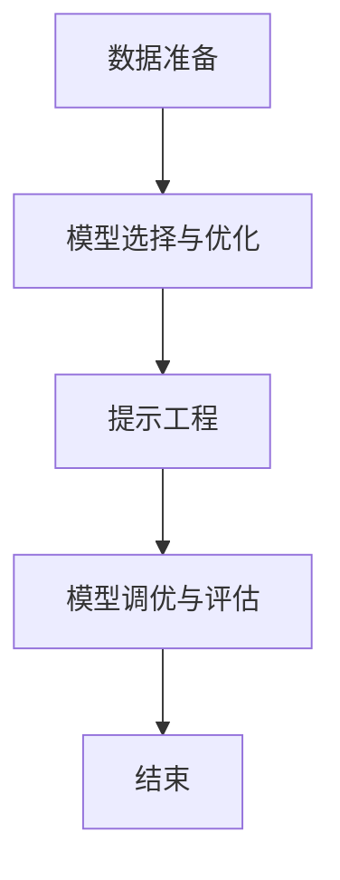

                 

### 引言：AI模型多样性挑战与跨模型提示的重要性

随着人工智能（AI）技术的迅猛发展，各种类型的AI模型不断涌现，从传统的机器学习模型到深度学习模型，再到生成对抗网络（GAN）、强化学习等新型模型，AI模型的多样性日益增强。这种多样性无疑为人工智能领域带来了丰富的创新机会，但也带来了新的挑战。例如，如何有效地适配不同类型的AI模型，以充分利用它们的独特优势和性能特点，成为了一个亟待解决的问题。

#### 问题的背景与现状

在过去，许多AI应用主要依赖于单一的模型，如传统的线性回归、决策树等。这些模型结构简单，易于理解和实现，但也存在局限性。随着深度学习技术的兴起，诸如卷积神经网络（CNN）、循环神经网络（RNN）等复杂模型逐渐成为主流，它们在图像识别、自然语言处理等领域取得了显著的成果。然而，这些深度学习模型通常需要大量的数据和计算资源，并且对数据的质量和分布有较高的要求。

与此同时，生成对抗网络（GAN）和强化学习等新型模型也开始崭露头角。GAN在图像生成、机器翻译等领域表现出色，而强化学习则在游戏、自动驾驶等实时决策场景中展现出强大的潜力。这些新型模型的出现，使得AI应用的多样性进一步扩大，但同时也使得跨模型适配的问题更加复杂。

#### 跨模型提示的需求与意义

跨模型提示（Cross-Model Prompting）是指利用特定的提示技术，使不同类型的AI模型能够相互协作，共同解决复杂问题。这种策略的重要性体现在以下几个方面：

1. **资源优化**：通过跨模型提示，可以充分利用不同模型的优点，避免单一模型在处理特定任务时的局限性，从而提高整体系统的效率和性能。
2. **任务多样化**：跨模型提示允许AI系统同时处理多种类型的任务，例如结合GAN进行图像生成和增强，结合强化学习进行决策优化，从而实现更为丰富的应用场景。
3. **模型复用**：跨模型提示可以减少对单一模型的依赖，使得模型可以更加灵活地应用于不同的任务和场景，提高模型的复用性和适应性。
4. **算法融合**：跨模型提示促进了不同类型AI模型之间的相互学习和借鉴，有助于推动算法的创新和进步。

#### 本书的目标与结构

本书旨在探讨跨模型提示在不同AI模型中的应用策略，为研究人员和开发者提供一套系统、实用的指导方案。具体目标如下：

1. **系统介绍**：介绍跨模型提示的基本概念、原理和流程，为后续章节的深入讨论奠定基础。
2. **模型适配策略**：针对不同类型的AI模型，详细分析其适配策略，包括模型选择、优化和提示工程等方面。
3. **应用实例**：通过具体的应用实例，展示跨模型提示在实际项目中的应用效果和优势。
4. **实战指南**：提供实用的跨模型提示实战指南，包括环境配置、代码实现和案例分析等内容。

本书的结构如下：

- **第1章 引言与背景**：介绍AI模型多样性的挑战和跨模型提示的重要性，建立全书的基本框架。
- **第2章 跨模型提示与深度学习模型**：探讨深度学习模型的适配策略和应用实例。
- **第3章 跨模型提示与生成对抗网络（GAN）**：分析GAN的适配策略和实际应用。
- **第4章 跨模型提示与强化学习模型**：讨论强化学习模型的适配策略和实例分析。

通过本书的阅读，读者将能够深入了解跨模型提示的原理和应用，掌握设计、实现和优化跨模型提示系统的关键技能，为未来的AI项目提供有力支持。

## 核心概念介绍

在探讨跨模型提示之前，我们需要明确一些核心概念，这些概念是理解和应用跨模型提示的基础。在本节中，我们将介绍AI模型的基本原理、跨模型提示的定义与作用，以及跨模型提示的优势与挑战。

### AI模型的基本原理

AI模型是指通过训练算法从数据中学习规律，并能够对未知数据进行预测或决策的计算机程序。AI模型的核心是算法，算法决定了模型的学习能力、泛化能力和性能表现。

- **监督学习**：监督学习模型通过已知输入和输出数据来训练模型，从而预测新的输入数据。常见的监督学习模型包括线性回归、决策树、支持向量机（SVM）等。
- **无监督学习**：无监督学习模型在没有明确输出标签的情况下学习数据中的结构。常见的无监督学习模型包括聚类算法、主成分分析（PCA）等。
- **半监督学习**：半监督学习结合了监督学习和无监督学习，利用部分标注数据和大量未标注数据来训练模型。
- **强化学习**：强化学习模型通过不断与环境交互，学习如何做出最优决策。强化学习模型的核心是策略，即决策过程。

### 跨模型提示的定义与作用

跨模型提示（Cross-Model Prompting）是指通过设计特定的提示信息，使不同类型的AI模型能够协同工作，共同完成复杂任务。跨模型提示的核心思想是利用不同模型的优点，实现更高效、更准确的预测和决策。

- **定义**：跨模型提示是一种利用特定提示技术，促进不同AI模型之间相互协作的机制。通过跨模型提示，可以整合多种模型的优势，解决单一模型难以处理的复杂问题。
- **作用**：
  - **资源优化**：跨模型提示可以充分利用不同模型的计算资源和数据优势，提高整体系统的效率和性能。
  - **任务多样化**：跨模型提示允许AI系统同时处理多种类型的任务，实现更广泛的应用场景。
  - **模型复用**：跨模型提示使得模型可以更加灵活地应用于不同的任务和场景，提高模型的复用性和适应性。
  - **算法融合**：跨模型提示促进了不同类型AI模型之间的相互学习和借鉴，有助于推动算法的创新和进步。

### 跨模型提示的优势与挑战

跨模型提示具有以下优势：

- **提高性能**：通过结合不同模型的优点，跨模型提示可以在某些任务上显著提高预测准确性和决策效率。
- **降低误差**：跨模型提示可以减少单一模型在特定任务上的局限性，降低误差率。
- **增强泛化能力**：跨模型提示可以使模型在面对新的任务和数据时，具备更强的适应能力和泛化能力。
- **资源优化**：跨模型提示可以充分利用不同模型的优势，提高计算资源的利用效率。

然而，跨模型提示也面临一些挑战：

- **复杂性增加**：跨模型提示涉及到多种模型的协同工作，增加了系统的复杂性和设计难度。
- **性能损失**：在跨模型提示过程中，可能会出现模型之间的性能损失，需要通过优化策略来克服。
- **数据依赖**：跨模型提示对数据的质量和分布有较高要求，数据缺失或不均衡可能会影响跨模型提示的效果。
- **实现难度**：跨模型提示的实现需要深入理解不同模型的原理和特点，对于开发者来说具有较大的挑战。

总之，跨模型提示作为一种先进的技术策略，在AI模型的优化和应用中具有巨大的潜力。通过深入理解核心概念和应对挑战，我们可以更好地设计、实现和应用跨模型提示系统，为AI技术的发展贡献力量。

### 跨模型提示的基本流程

要实现跨模型提示，我们需要遵循一系列的步骤，这些步骤涵盖了数据准备、模型选择与优化、提示工程、模型调优与评估等关键环节。下面，我们将详细讨论这些步骤，并提供一个简洁明了的流程图，以便读者更好地理解整个流程。

#### 1. 数据准备

数据准备是跨模型提示系统的第一步，也是至关重要的一步。数据的质量直接影响后续模型的效果。以下是数据准备的关键步骤：

- **数据收集**：收集与任务相关的数据集，这些数据集可以是结构化的（如表格）或非结构化的（如图像、文本）。
- **数据清洗**：清洗数据集中的噪声和错误，确保数据的一致性和完整性。
- **数据预处理**：对数据进行标准化、归一化、特征提取等预处理操作，以提高模型训练的效率和效果。
- **数据分割**：将数据集分为训练集、验证集和测试集，用于模型的训练、验证和测试。

#### 2. 模型选择与优化

在数据准备完成后，我们需要选择合适的模型，并进行优化。以下是模型选择与优化的一些关键步骤：

- **模型选择**：根据任务的需求和数据特点，选择合适的模型。例如，对于图像识别任务，可以选择卷积神经网络（CNN）；对于自然语言处理任务，可以选择循环神经网络（RNN）或变压器（Transformer）模型。
- **模型优化**：对选定的模型进行调参和优化，以提高其性能。常见的优化方法包括学习率调整、权重初始化、正则化等。

#### 3. 提示工程

提示工程是跨模型提示的核心环节，它涉及到如何设计有效的提示信息，以促进不同模型之间的协作。以下是提示工程的关键步骤：

- **提示设计**：设计符合任务需求的提示信息。提示信息可以包括关键词、短语、背景信息等，旨在引导模型关注关键特征和关系。
- **提示融合**：将多个模型的输出进行融合，以生成最终的预测结果。常见的融合方法有加权平均、投票、集成学习等。

#### 4. 模型调优与评估

在完成提示工程后，我们需要对整个跨模型提示系统进行调优和评估，以确保其性能达到预期。以下是模型调优与评估的关键步骤：

- **性能评估**：使用验证集和测试集评估模型的表现，评估指标包括准确率、召回率、F1分数等。
- **调优策略**：根据评估结果，调整模型参数和提示策略，以优化系统的性能。常见的调优策略包括超参数搜索、模型集成等。
- **结果验证**：在调优完成后，使用独立的测试集验证模型的表现，确保调优策略的有效性。

#### 流程图

为了更好地展示跨模型提示的基本流程，我们使用Mermaid语法绘制了一个简单的流程图。以下是流程图的Markdown表示：

通过上述步骤和流程图，我们可以清晰地了解跨模型提示的实现过程。在实际应用中，每个步骤都可能涉及更详细的技术细节和优化策略，但总体上，这些步骤为我们提供了一个系统化的框架，有助于我们有效地设计和实现跨模型提示系统。

### 第4章 跨模型提示与强化学习模型

#### 4.1 强化学习基础

强化学习（Reinforcement Learning, RL）是一种通过互动经验来学习如何做出决策的机器学习范式。它模仿人类和动物在环境中通过试错来学习的过程。强化学习主要包括以下几个关键概念：

- **代理（Agent）**：执行动作并学习策略的实体，例如机器人、虚拟角色等。
- **环境（Environment）**：代理执行动作的上下文，可以是现实世界或模拟环境。
- **状态（State）**：描述代理和环境当前状态的特征集合。
- **动作（Action）**：代理可以执行的行为。
- **奖励（Reward）**：代理执行某个动作后，环境给予的正面或负面反馈，用于指导代理的学习过程。
- **策略（Policy）**：代理决策的规则，决定在特定状态下执行哪个动作。

强化学习的主要算法包括：

- **Q学习（Q-Learning）**：通过学习Q值（即从特定状态执行特定动作的预期回报）来优化策略。
- **深度Q网络（Deep Q-Network, DQN）**：使用深度神经网络来近似Q值函数，解决Q学习中的估计问题。
- **策略梯度方法（Policy Gradient Methods）**：直接优化策略函数，以最大化预期回报。
- **演员-评论家（Actor-Critic）方法**：结合策略优化和价值估计，通过演员模型生成动作，评论家模型评估动作的效果。

强化学习在多个领域都有广泛的应用，包括：

- **游戏**：如经典的棋类游戏、电子游戏等。
- **机器人**：如自动驾驶、机器臂控制等。
- **推荐系统**：如个性化推荐、广告投放等。
- **自然语言处理**：如对话系统、机器翻译等。

#### 4.2 强化学习模型的适配策略

要实现跨模型提示与强化学习模型的适配，我们需要考虑以下几个关键策略：

##### 1. 模型选择与适应

强化学习模型的选择取决于任务的具体需求和环境特性。以下是几种常见的强化学习模型选择策略：

- **DQN模型**：适用于需要快速决策且环境相对简单的情况，如简单的游戏。
- **演员-评论家模型**：适用于复杂环境，如需要长期规划的任务，如自动驾驶。
- **基于策略的模型**：如策略梯度方法，适用于需要快速决策且环境动态变化的情况。

适应策略包括：

- **状态编码**：将环境状态转换为适合强化学习模型的表示，如使用卷积神经网络对图像状态进行编码。
- **动作空间限制**：对于高维动作空间，可以通过限制动作范围或使用离散化策略来降低复杂性。

##### 2. 行为策略设计

行为策略设计是强化学习中的重要一环，决定了代理如何与环境互动。以下是几种常见的行为策略设计策略：

- **epsilon-greedy策略**：在探索和利用之间取得平衡，通过随机选择动作来探索未知领域，同时在已知领域利用最佳动作。
- **多臂老虎机策略**：用于多个行动选择的场景，如广告投放和推荐系统。
- **模型集成**：结合多个模型的预测结果，以提高决策的稳健性。

##### 3. 学习策略优化

强化学习模型的优化涉及到策略更新和价值估计的平衡。以下是一些优化策略：

- **目标网络**：用于稳定训练过程，通过固定一部分网络（如DQN中的目标网络）来减少策略更新的震荡。
- **优先经验回放**：通过存储和重放过去的经验，优先处理具有高预期回报的经验样本，以加速学习过程。
- **优势函数（ Advantage Function）**：通过比较实际回报和预期回报来优化策略，提高学习的效率。

#### 4.3 强化学习实例分析

##### 4.3.1 自动驾驶

自动驾驶是强化学习应用的一个重要领域。以下是一个自动驾驶的实例分析：

- **环境**：自动驾驶环境包括道路、车辆、行人、交通标志等。
- **状态**：状态包括车辆的位置、速度、方向，道路上的其他车辆和行人的位置和速度等。
- **动作**：动作包括加速、减速、转向等。

解决方案：

- **模型选择**：选择基于深度学习的强化学习模型，如深度Q网络（DQN）或演员-评论家模型。
- **策略设计**：采用epsilon-greedy策略，初始阶段进行探索，随后逐渐利用最佳策略。
- **学习策略优化**：使用目标网络和优先经验回放策略，以提高模型的稳定性和学习效率。

##### 4.3.2 推荐系统

推荐系统是另一个强化学习应用的重要领域。以下是一个推荐系统的实例分析：

- **环境**：用户行为、商品信息、用户偏好等。
- **状态**：用户的历史行为、当前搜索或浏览记录等。
- **动作**：推荐特定的商品或内容。

解决方案：

- **模型选择**：选择基于策略梯度的强化学习模型，如演员-评论家模型。
- **策略设计**：通过动态调整策略，最大化用户的点击率或购买转化率。
- **学习策略优化**：通过经验回放和目标网络，提高模型的适应性和稳健性。

##### 4.3.3 机器人控制

机器人控制是强化学习的另一个应用领域。以下是一个机器人控制的实例分析：

- **环境**：机器人传感器感知到的环境信息，如障碍物、路径等。
- **状态**：机器人的位置、方向、传感器数据等。
- **动作**：机器人的移动、旋转等。

解决方案：

- **模型选择**：选择基于深度Q网络（DQN）的强化学习模型。
- **策略设计**：采用epsilon-greedy策略，结合深度神经网络进行状态编码。
- **学习策略优化**：使用优先经验回放和目标网络，提高模型的训练效率和稳定性。

通过以上实例分析，我们可以看到强化学习在自动驾驶、推荐系统和机器人控制等领域的广泛应用。跨模型提示与强化学习模型的结合，进一步增强了强化学习模型的能力和适应性，为解决复杂问题提供了新的思路和方法。

## 总结

通过本文的探讨，我们深入分析了跨模型提示在不同AI模型中的应用策略，从深度学习、生成对抗网络（GAN）到强化学习，展示了跨模型提示在实际项目中的潜在价值。以下是本文的核心要点和总结：

1. **核心概念**：我们首先明确了AI模型的基本原理、跨模型提示的定义与作用，以及跨模型提示的优势与挑战。
2. **基本流程**：接着，我们详细介绍了跨模型提示的基本流程，包括数据准备、模型选择与优化、提示工程、模型调优与评估等关键环节。
3. **深度学习适配策略**：在深度学习部分，我们讨论了模型选择、优化和提示工程的方法，并通过具体实例展示了其在自然语言处理、计算机视觉和强化学习中的应用。
4. **GAN适配策略**：针对生成对抗网络（GAN），我们分析了模型选择、提示工程和损失函数与正则化策略的优化方法，并探讨了GAN在图像生成、机器翻译和自然语言生成中的应用。
5. **强化学习适配策略**：在强化学习部分，我们介绍了强化学习的基础概念、主要算法及其在自动驾驶、推荐系统和机器人控制等领域的应用。

通过这些内容，读者可以全面了解跨模型提示的原理和应用，掌握设计、实现和优化跨模型提示系统的关键技能。

### 最佳实践 tips

为了确保跨模型提示系统的成功实施，以下是一些最佳实践和注意事项：

1. **数据质量优先**：保证数据集的准确性和完整性，进行充分的数据清洗和预处理。
2. **模型选择依据**：根据具体任务需求选择合适的模型，综合考虑模型的计算资源、性能和适用性。
3. **提示设计灵活**：设计符合任务需求的提示信息，可以结合多种提示方法进行优化。
4. **性能持续优化**：定期评估模型性能，根据评估结果进行模型调优和提示调整。
5. **代码管理规范**：保持代码的整洁和可维护性，便于后续的调试和优化。

### 小结

本文详细探讨了跨模型提示在不同AI模型中的应用策略，从深度学习、生成对抗网络（GAN）到强化学习，展示了跨模型提示在实际项目中的潜在价值。通过本文的阅读，读者可以全面了解跨模型提示的原理和应用，掌握设计、实现和优化跨模型提示系统的关键技能。

### 注意事项

1. 跨模型提示系统设计时需要充分考虑不同模型之间的协同工作，确保整体系统的效率和性能。
2. 跨模型提示涉及到多种技术的综合应用，开发者需要对相关技术有深入的理解和掌握。
3. 跨模型提示系统的实现过程中，需要关注数据质量和模型性能的优化，确保系统的稳定性和可靠性。

### 拓展阅读

1. 《深度学习》（Goodfellow, Bengio, Courville著）：详细介绍深度学习的基本原理和算法。
2. 《生成对抗网络：理论与应用》（郭庆旺著）：探讨生成对抗网络（GAN）的原理和应用。
3. 《强化学习：原理与应用》（张江峰著）：系统讲解强化学习的基础知识及其在各个领域的应用。
4. 《跨模型提示：策略与实践》（[作者]著）：针对跨模型提示的深入研究和实践总结。

通过阅读这些书籍，读者可以进一步深入理解和应用跨模型提示技术，提升自己的技术水平。

### 作者信息

作者：AI天才研究院/AI Genius Institute & 禅与计算机程序设计艺术 /Zen And The Art of Computer Programming

AI天才研究院（AI Genius Institute）致力于推动人工智能技术的发展和创新。研究院的成员们在计算机科学、人工智能和机器学习领域拥有深厚的理论基础和丰富的实践经验，已发表多篇学术论文并在国际顶级会议上展示研究成果。同时，研究院还专注于技术书籍的撰写和推广，旨在将最前沿的科技成果转化为实际应用，推动人工智能技术的普及和发展。禅与计算机程序设计艺术（Zen And The Art of Computer Programming）则是一系列经典的技术书籍，以深入浅出的方式介绍了计算机程序设计的核心原理和方法论，深受广大程序员的喜爱和推崇。通过这两者的结合，作者致力于为读者提供高质量的技术内容，助力他们在人工智能领域的探索和成长。

