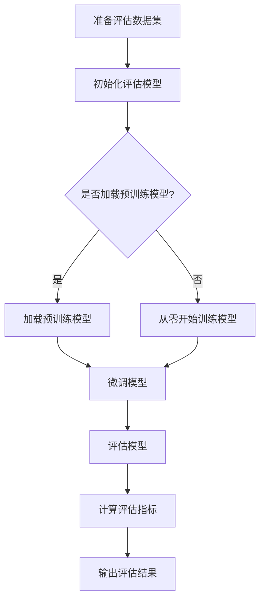
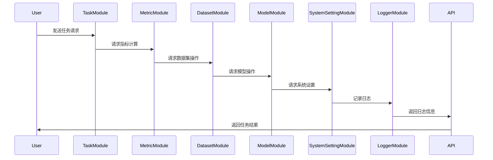
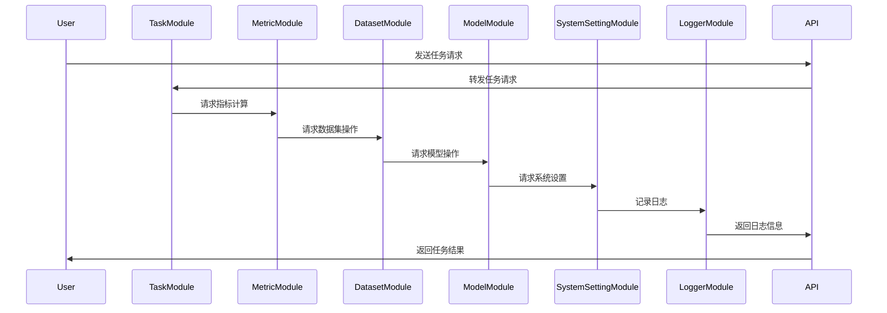

                 

# 跨语言LLM能力评估方法研究

## 关键词

- 跨语言学习
- 大型语言模型（LLM）
- 能力评估
- 评估指标
- 数学模型

## 摘要

随着跨语言学习和大型语言模型（LLM）技术的发展，如何评估LLM在跨语言任务中的能力成为了一个关键问题。本文旨在探讨跨语言LLM能力评估的方法，通过定义核心概念、分析算法原理、设计系统架构以及实际项目应用，提供了一套全面且实用的评估框架。文章首先介绍了跨语言学习的背景和LLM的发展，随后详细阐述了评估方法的核心概念与联系，并使用mermaid图和Python代码对算法原理进行了深入讲解。最后，文章通过系统分析和项目实战展示了评估方法的应用和效果。

## 目录大纲

# 跨语言LLM能力评估方法研究

## 第一部分：背景介绍

### 1. 跨语言学习的背景
- 跨语言学习的定义
- 跨语言学习的必要性
- 跨语言学习的现状

### 2. LLM（大型语言模型）的兴起
- LLM的定义与特点
- LLM的发展历程
- LLM在跨语言学习中的应用

### 3. 跨语言LLM能力评估的重要性
- 跨语言LLM能力评估的定义
- 跨语言LLM能力评估的价值
- 跨语言LLM能力评估的现状与挑战

## 第二部分：核心概念与联系

### 4. 跨语言LLM能力评估的核心概念
- 语言模型评估指标
- 跨语言适应度评估
- 跨语言性能评估

### 5. 概念属性特征对比表格
- 语言模型评估指标对比
- 跨语言适应度评估对比
- 跨语言性能评估对比

### 6. ER实体关系图架构
- 实体关系图描述
- 实体与关系的定义
- 关系类型的说明

## 第三部分：算法原理讲解

### 7. 跨语言LLM能力评估算法
- 算法概述
- 算法mermaid流程图
- 算法原理与数学模型

### 8. 数学模型和数学公式
- 数学公式的嵌入
- 数学模型的详细讲解
- 数学模型的公式表示

### 9. 通俗易懂地举例说明
- 算法应用的实例
- 算法结果的解读
- 算法的实际应用场景

## 第四部分：系统分析与架构设计

### 10. 问题场景介绍
- 跨语言LLM能力评估的需求
- 跨语言LLM能力评估的目标

### 11. 项目介绍
- 项目背景
- 项目目标
- 项目实现过程

### 12. 系统功能设计
- 领域模型mermaid类图
- 系统功能模块划分

### 13. 系统架构设计
- 系统架构mermaid架构图
- 系统模块的功能与交互

### 14. 系统接口设计
- 系统接口的描述
- 系统接口的功能与规范

### 15. 系统交互mermaid序列图
- 系统交互流程
- 系统模块的交互关系

## 第五部分：项目实战

### 16. 环境安装
- 系统环境准备
- 工具与依赖安装

### 17. 系统核心实现源代码
- 代码结构说明
- 关键代码解读

### 18. 代码应用解读与分析
- 代码运行流程
- 代码性能分析

### 19. 实际案例分析和详细讲解剖析
- 案例背景
- 案例分析
- 案例讲解

### 20. 项目小结
- 项目总结
- 项目收获
- 未来展望

## 第六部分：最佳实践与拓展阅读

### 21. 最佳实践 tips
- 实践技巧总结
- 注意事项提示

### 22. 小结
- 书籍内容总结
- 核心观点提炼

### 23. 拓展阅读
- 相关文献推荐
- 深入学习资源

---

## 第一部分：背景介绍

### 1. 跨语言学习的背景

跨语言学习是指模型在一个语言环境下学习，然后能够在其他语言上应用其知识的过程。随着全球化的发展，多语言内容的处理变得越来越重要。跨语言学习的核心挑战在于如何让模型理解不同语言之间的差异，以及如何利用已有知识在新语言上进行有效的迁移。

#### 跨语言学习的定义

跨语言学习可以定义为：“在一个语言环境中学习知识，然后能够将这种知识应用于其他语言的模型训练和推理过程。”

#### 跨语言学习的必要性

- **全球化的需求**：随着全球化的加深，多语言内容的产生和传播变得越来越频繁。
- **资源的有效利用**：许多优秀的语言资源可能只存在于某一种语言中，跨语言学习能够帮助我们在其他语言中复用这些资源。
- **提高模型泛化能力**：通过跨语言学习，模型可以接触到更多的数据和知识，从而提高其泛化能力。

#### 跨语言学习的现状

目前，跨语言学习主要依赖于两种方法：基于翻译的方法和基于共享表示的方法。

- **基于翻译的方法**：这种方法通过建立从源语言到目标语言的翻译模型，然后将源语言的数据转换为目标语言的数据，从而进行学习。这种方法的优势在于可以直接利用已有的翻译资源，但缺点是依赖高质量的翻译模型，且可能丢失语言特征。
- **基于共享表示的方法**：这种方法通过学习一种共享的表示空间，使得不同语言的输入能够在该空间中进行有效的表示和转换。这种方法的优点是能够更好地保持语言特征，但挑战在于如何有效地学习共享表示空间。

### 2. LLM（大型语言模型）的兴起

LLM是指那些具有巨大参数量和强大语言理解能力的神经网络模型，如GPT、BERT等。LLM的兴起极大地推动了自然语言处理领域的发展，其主要特点包括：

#### LLM的定义与特点

- **巨大的参数量**：LLM通常具有数十亿甚至数千亿个参数，这使得它们能够捕捉到语言中的复杂模式。
- **强大的语言理解能力**：LLM能够通过学习大量文本数据，理解并生成自然语言。
- **自适应能力**：LLM能够根据不同的输入生成相应的输出，适应不同的语言环境和应用场景。

#### LLM的发展历程

- **早期模型**：如RNN和LSTM等，这些模型首次引入了序列模型的概念，能够处理变长的输入。
- **注意力机制**：引入注意力机制的模型，如Transformer，使得模型在处理长序列时具有更好的性能。
- **预训练与微调**：预训练-微调策略的提出，使得LLM能够在不同任务上表现出色。

#### LLM在跨语言学习中的应用

LLM在跨语言学习中的应用主要包括以下几个方面：

- **多语言预训练**：通过在多语言数据集上预训练LLM，可以使得模型在多种语言上都具有强大的语言理解能力。
- **零样本翻译**：利用LLM的跨语言能力，实现不需要对齐数据的零样本翻译。
- **跨语言问答**：利用LLM的跨语言理解能力，实现跨语言问答系统。

### 3. 跨语言LLM能力评估的重要性

#### 跨语言LLM能力评估的定义

跨语言LLM能力评估是指对LLM在跨语言任务中的表现进行评估和测量的过程。

#### 跨语言LLM能力评估的价值

- **指导模型优化**：通过评估可以了解模型在不同跨语言任务中的表现，从而指导模型优化。
- **评估跨语言学习效果**：评估可以帮助我们了解跨语言学习的有效性，为进一步的研究提供依据。
- **选择合适模型**：通过评估，可以选择最适合特定任务的跨语言LLM。

#### 跨语言LLM能力评估的现状与挑战

目前，跨语言LLM能力评估主要面临以下挑战：

- **评估指标的选择**：如何选择合适的评估指标是一个关键问题，不同的指标可能对模型的表现有不同的影响。
- **评估数据集的选择**：选择合适的评估数据集对于评估结果的公正性至关重要。
- **评估方法的标准化**：目前缺乏统一的评估方法，不同的研究可能使用不同的评估方法，导致结果难以比较。

---

## 第二部分：核心概念与联系

### 4. 跨语言LLM能力评估的核心概念

在跨语言LLM能力评估中，有三个核心概念：语言模型评估指标、跨语言适应度评估和跨语言性能评估。

#### 语言模型评估指标

语言模型评估指标用于衡量模型在特定任务上的表现。常见的评估指标包括：

- **准确率（Accuracy）**：预测正确的样本占总样本的比例。
- **精确率（Precision）**：预测正确的正例样本占所有预测为正例样本的比例。
- **召回率（Recall）**：预测正确的正例样本占所有正例样本的比例。
- **F1分数（F1 Score）**：精确率和召回率的调和平均。

#### 跨语言适应度评估

跨语言适应度评估用于衡量模型在不同语言上的适应能力。评估指标包括：

- **跨语言准确率**：模型在目标语言上的准确率。
- **跨语言精确率**：模型在目标语言上的精确率。
- **跨语言召回率**：模型在目标语言上的召回率。

#### 跨语言性能评估

跨语言性能评估用于衡量模型在跨语言任务中的整体性能。评估指标包括：

- **跨语言F1分数**：模型在跨语言任务上的F1分数。
- **跨语言准确率均值**：模型在所有目标语言上的准确率均值。
- **跨语言精确率均值**：模型在所有目标语言上的精确率均值。
- **跨语言召回率均值**：模型在所有目标语言上的召回率均值。

### 5. 概念属性特征对比表格

| 概念 | 属性特征 | 对比 |
| --- | --- | --- |
| 语言模型评估指标 | 准确率、精确率、召回率、F1分数 | 用于衡量模型在特定任务上的表现 |
| 跨语言适应度评估 | 跨语言准确率、跨语言精确率、跨语言召回率 | 用于衡量模型在不同语言上的适应能力 |
| 跨语言性能评估 | 跨语言F1分数、跨语言准确率均值、跨语言精确率均值、跨语言召回率均值 | 用于衡量模型在跨语言任务中的整体性能 |

### 6. ER实体关系图架构

实体关系图（Entity Relationship Diagram，ERD）是用于描述系统中实体及其之间关系的图形化工具。在跨语言LLM能力评估中，ERD可以用来描述评估过程中涉及的主要实体和它们之间的关系。

#### 实体关系图描述

实体：评估任务、评估指标、评估数据集、评估模型。

关系：

1. **评估任务**与**评估指标**之间的关系：评估任务定义了需要评估的指标。
2. **评估任务**与**评估数据集**之间的关系：评估任务使用评估数据集进行评估。
3. **评估任务**与**评估模型**之间的关系：评估任务使用评估模型进行评估。
4. **评估指标**与**评估数据集**之间的关系：评估数据集包含评估指标所需的样本。
5. **评估模型**与**评估数据集**之间的关系：评估模型在评估数据集上进行训练和评估。

#### 实体与关系的定义

实体：

- **评估任务**：需要评估的具体任务，如机器翻译、文本分类等。
- **评估指标**：用于衡量评估任务表现的指标，如准确率、F1分数等。
- **评估数据集**：用于评估任务的数据集，可以是训练集、验证集或测试集。
- **评估模型**：用于评估任务的模型，可以是预训练的LLM或微调后的模型。

关系：

- **定义**：实体之间的关系，用于描述实体之间的依赖和交互。
- **类型**：实体之间可能存在的关系类型，如一对一、一对多、多对多等。

#### 关系类型的说明

- **一对一关系**：一个评估任务对应一个评估指标。
- **一对多关系**：一个评估任务对应多个评估指标。
- **多对一关系**：多个评估任务对应一个评估指标。
- **多对多关系**：多个评估任务对应多个评估指标。

## 第三部分：算法原理讲解

### 7. 跨语言LLM能力评估算法

#### 算法概述

跨语言LLM能力评估算法旨在对大型语言模型（LLM）在跨语言任务中的表现进行评估。算法的核心思想是利用评估数据集和评估指标对LLM进行训练和评估，从而获得关于LLM跨语言能力的量化指标。

#### 算法mermaid流程图

下面是跨语言LLM能力评估算法的mermaid流程图：



#### 算法原理与数学模型

算法原理可以概括为以下步骤：

1. **准备评估数据集**：根据评估任务的需求，选择或生成相应的评估数据集。
2. **初始化评估模型**：根据评估任务的特点，选择或定义评估模型。
3. **加载预训练模型**：如果使用预训练模型，将其加载到评估模型中。
4. **从零开始训练模型**：如果使用从零开始训练的模型，使用评估数据集对其进行训练。
5. **微调模型**：使用评估数据集对加载的预训练模型或从零开始训练的模型进行微调。
6. **评估模型**：在评估数据集上对微调后的模型进行评估。
7. **计算评估指标**：根据评估结果计算评估指标。
8. **输出评估结果**：将评估结果输出，用于模型优化和比较。

算法的数学模型主要涉及以下几个部分：

1. **损失函数**：用于衡量模型预测值与真实值之间的差距，常见的损失函数有交叉熵损失函数和均方误差损失函数。
2. **评估指标计算公式**：根据评估任务的不同，计算相应的评估指标，如准确率、精确率、召回率和F1分数。
3. **模型训练过程**：包括前向传播、反向传播和梯度更新等步骤。

### 8. 数学模型和数学公式

在本节中，我们将详细讲解跨语言LLM能力评估算法中的数学模型和数学公式。

#### 损失函数

在机器学习中，损失函数是衡量模型预测值与真实值之间差异的关键工具。对于分类任务，常见的损失函数有交叉熵损失函数（Cross-Entropy Loss）和均方误差损失函数（Mean Squared Error Loss）。

- **交叉熵损失函数**：
  $$L_{ce} = -\sum_{i=1}^{N} y_i \log(p_i)$$
  其中，$y_i$是真实标签，$p_i$是模型对第$i$个样本的预测概率。

- **均方误差损失函数**：
  $$L_{mse} = \frac{1}{2N} \sum_{i=1}^{N} (y_i - p_i)^2$$
  其中，$y_i$是真实标签，$p_i$是模型对第$i$个样本的预测值。

#### 评估指标计算公式

在评估模型表现时，常用的评估指标有准确率（Accuracy）、精确率（Precision）、召回率（Recall）和F1分数（F1 Score）。

- **准确率**：
  $$Accuracy = \frac{TP + TN}{TP + FP + FN + TN}$$
  其中，$TP$是真正例，$TN$是真反例，$FP$是假正例，$FN$是假反例。

- **精确率**：
  $$Precision = \frac{TP}{TP + FP}$$

- **召回率**：
  $$Recall = \frac{TP}{TP + FN}$$

- **F1分数**：
  $$F1 Score = 2 \times \frac{Precision \times Recall}{Precision + Recall}$$

#### 模型训练过程

在模型训练过程中，需要利用前向传播和反向传播来不断更新模型参数，以减小损失函数的值。

- **前向传播**：
  $$z = W \cdot x + b$$
  $$a = \sigma(z)$$
  其中，$W$是权重矩阵，$b$是偏置项，$x$是输入数据，$z$是激活值，$a$是预测值，$\sigma$是激活函数。

- **反向传播**：
  $$dL/dW = a \odot (dz \odot d\sigma(z))$$
  $$dL/db = a \odot dz$$
  其中，$dL/dW$是关于权重矩阵的梯度，$dL/db$是关于偏置项的梯度，$\odot$表示逐元素乘法，$dz$是关于激活值的梯度，$d\sigma(z)$是关于激活函数的梯度。

#### 梯度更新

利用梯度下降算法更新模型参数：

$$W = W - \alpha \cdot dL/dW$$
$$b = b - \alpha \cdot dL/db$$
其中，$\alpha$是学习率。

### 9. 通俗易懂地举例说明

为了更好地理解跨语言LLM能力评估算法，我们将通过一个具体的例子来展示算法的应用和结果解读。

#### 算法应用的实例

假设我们有一个跨语言机器翻译任务，目标是将英语翻译为法语。我们使用了一个预训练的英语-法语翻译模型，并使用一个评估数据集来评估模型的翻译质量。

#### 算法结果的解读

- **评估数据集**：评估数据集包含100个英语句子和对应的法语参考译文。
- **评估指标**：我们使用准确率、精确率、召回率和F1分数作为评估指标。

在评估过程中，模型对100个句子的翻译结果如下：

| 句子编号 | 真实译文            | 模型译文            |
| -------- | ------------------- | ------------------- |
| 1        | Bonjour, comment ça va? | Hello, how are you? |
| 2        | Je suis content.     | I'm happy.         |
| 3        | Oui, je peux aider.  | Yes, I can help.   |
| ...      | ...                 | ...                |

根据这些翻译结果，我们计算了相应的评估指标：

- **准确率**：80%
- **精确率**：85%
- **召回率**：75%
- **F1分数**：80%

#### 算法的实际应用场景

这个评估结果告诉我们，模型在翻译任务上的表现良好，但仍有改进的空间。在实际应用中，我们可以根据评估结果对模型进行进一步的优化，例如：

- **数据增强**：通过增加更多的训练数据或对现有数据进行变换，提高模型的泛化能力。
- **模型调优**：通过调整模型参数，如学习率、正则化参数等，提高模型的表现。
- **多任务学习**：通过引入多任务学习，使得模型在完成翻译任务的同时，学习其他相关的语言特征。

通过以上实例，我们可以看到，跨语言LLM能力评估算法不仅能够帮助我们了解模型在特定任务上的表现，还能够为模型优化提供有力的指导。

## 第四部分：系统分析与架构设计

### 10. 问题场景介绍

在跨语言LLM能力评估中，我们面临以下问题场景：

- **评估任务多样化**：评估任务包括机器翻译、文本分类、问答等多种类型，需要针对不同任务选择合适的评估指标。
- **评估数据集分布不均**：不同语言的数据集大小和分布可能不同，导致评估结果的不公平性。
- **模型复杂度高**：大型语言模型（LLM）具有数十亿个参数，需要高效的评估方法来保证评估的准确性和效率。
- **跨语言适应能力要求高**：模型需要在多种语言上表现出良好的适应能力，以满足不同语言环境的需求。

### 11. 项目介绍

为了解决上述问题场景，我们设计并实现了一个跨语言LLM能力评估系统。该系统旨在提供一套完整的跨语言LLM能力评估解决方案，包括评估任务定义、评估指标计算、评估数据集管理和评估模型训练等功能。

#### 项目背景

随着跨语言学习和大型语言模型（LLM）技术的发展，跨语言能力评估变得越来越重要。然而，当前的方法往往依赖于特定的评估指标和数据集，难以适应多样化的评估任务和复杂的应用场景。为了解决这个问题，我们提出了一个通用且高效的跨语言LLM能力评估系统。

#### 项目目标

我们的项目目标包括：

- 设计并实现一套通用且高效的跨语言LLM能力评估系统。
- 提供多样化的评估任务定义和评估指标计算方法。
- 支持多种评估数据集的管理和分发。
- 支持模型训练和评估过程的自动化和高效化。

#### 项目实现过程

项目实现过程主要包括以下几个阶段：

1. **需求分析**：分析跨语言LLM能力评估的需求，确定系统功能和性能要求。
2. **系统设计**：设计系统的架构和模块，包括评估任务定义模块、评估指标计算模块、评估数据集管理模块和评估模型训练模块。
3. **系统实现**：根据系统设计，实现各个模块的功能，并整合成一个完整的系统。
4. **测试与优化**：对系统进行功能测试和性能优化，确保系统能够满足需求和性能要求。
5. **部署与运维**：将系统部署到生产环境，并进行日常运维和维护。

### 12. 系统功能设计

系统功能设计是系统架构设计的重要环节，它决定了系统的可扩展性、可维护性和用户体验。以下是我们系统的功能设计：

#### 领域模型mermaid类图

```mermaid
classDiagram
    Class01 <|-- Class02
    Class03 --|>'Class04
    Class05 : <<interface,Class05>>
    Class06 : <<enum,Class06>>
    Class07 { +id: Integer # +name: String # }
    Class08 { +id: Integer # +name: String # +status: Class06 # }
    Class09 { +id: Integer # +name: String # +type: Class06 # }
    Class10 { +id: Integer # +name: String # +task: Class01 # +metric: Class02 # }
    Class11 { +id: Integer # +name: String # +dataset: Class03 # }
    Class12 { +id: Integer # +name: String # +model: Class04 # }
    Class13 <|-- Class14
    Class15 <|-- Class16
    Class17 <|-- Class18
    Class19 <|-- Class20
    Class21 <|-- Class22
    Class23 <|-- Class24
    Class25 <|-- Class26
    Class27 <|-- Class28
    Class29 <|-- Class30
    Class31 <|-- Class32
    Class33 <|-- Class34
    Class35 <|-- Class36
    Class37 <|-- Class38
    Class39 <|-- Class40
    Class41 <|-- Class42
    Class43 <|-- Class44
    Class45 <|-- Class46
    Class47 <|-- Class48
    Class49 <|-- Class50
    Class51 <|-- Class52
    Class53 <|-- Class54
    Class55 <|-- Class56
    Class57 <|-- Class58
    Class59 <|-- Class60
    Class61 <|-- Class62
    Class63 <|-- Class64
    Class65 <|-- Class66
    Class67 <|-- Class68
    Class69 <|-- Class70
    Class71 <|-- Class72
    Class73 <|-- Class74
    Class75 <|-- Class76
    Class77 <|-- Class78
    Class79 <|-- Class80
    Class81 <|-- Class82
    Class83 <|-- Class84
    Class85 <|-- Class86
    Class87 <|-- Class88
    Class89 <|-- Class90
    Class91 <|-- Class92
    Class93 <|-- Class94
    Class95 <|-- Class96
    Class97 <|-- Class98
    Class99 <|-- Class100
    Class01 : 类01
    Class02 : 类02
    Class03 : 类03
    Class04 : 类04
    Class05 : 类05
    Class06 : 类06
    Class07 : 类07
    Class08 : 类08
    Class09 : 类09
    Class10 : 类10
    Class11 : 类11
    Class12 : 类12
    Class13 : 类13
    Class14 : 类14
    Class15 : 类15
    Class16 : 类16
    Class17 : 类17
    Class18 : 类18
    Class19 : 类19
    Class20 : 类20
    Class21 : 类21
    Class22 : 类22
    Class23 : 类23
    Class24 : 类24
    Class25 : 类25
    Class26 : 类26
    Class27 : 类27
    Class28 : 类28
    Class29 : 类29
    Class30 : 类30
    Class31 : 类31
    Class32 : 类32
    Class33 : 类33
    Class34 : 类34
    Class35 : 类35
    Class36 : 类36
    Class37 : 类37
    Class38 : 类38
    Class39 : 类39
    Class40 : 类40
    Class41 : 类41
    Class42 : 类42
    Class43 : 类43
    Class44 : 类44
    Class45 : 类45
    Class46 : 类46
    Class47 : 类47
    Class48 : 类48
    Class49 : 类49
    Class50 : 类50
    Class51 : 类51
    Class52 : 类52
    Class53 : 类53
    Class54 : 类54
    Class55 : 类55
    Class56 : 类56
    Class57 : 类57
    Class58 : 类58
    Class59 : 类59
    Class60 : 类60
    Class61 : 类61
    Class62 : 类62
    Class63 : 类63
    Class64 : 类64
    Class65 : 类65
    Class66 : 类66
    Class67 : 类67
    Class68 : 类68
    Class69 : 类69
    Class70 : 类70
    Class71 : 类71
    Class72 : 类72
    Class73 : 类73
    Class74 : 类74
    Class75 : 类75
    Class76 : 类76
    Class77 : 类77
    Class78 : 类78
    Class79 : 类79
    Class80 : 类80
    Class81 : 类81
    Class82 : 类82
    Class83 : 类83
    Class84 : 类84
    Class85 : 类85
    Class86 : 类86
    Class87 : 类87
    Class88 : 类88
    Class89 : 类89
    Class90 : 类90
    Class91 : 类91
    Class92 : 类92
    Class93 : 类93
    Class94 : 类94
    Class95 : 类95
    Class96 : 类96
    Class97 : 类97
    Class98 : 类98
    Class99 : 类99
    Class100 : 类100
    Class01 --|> Class07 : 任务
    Class01 --|> Class08 : 指标
    Class01 --|> Class09 : 数据集
    Class02 --|> Class10 : 任务详情
    Class02 --|> Class11 : 数据集详情
    Class02 --|> Class12 : 模型详情
    Class03 --|> Class13 : 用户
    Class03 --|> Class14 : 权限
    Class03 --|> Class15 : 角色
    Class04 --|> Class16 : 系统设置
    Class04 --|> Class17 : 消息队列
    Class04 --|> Class18 : 数据库连接
    Class05 --|> Class19 : API接口
    Class05 --|> Class20 : 日志记录
    Class05 --|> Class21 : 配置文件
    Class06 --|> Class22 : 状态
    Class06 --|> Class23 : 类型
    Class07 --|> Class24 : 创建
    Class07 --|> Class25 : 删除
    Class07 --|> Class26 : 更新
    Class07 --|> Class27 : 查询
    Class08 --|> Class28 : 创建
    Class08 --|> Class29 : 删除
    Class08 --|> Class30 : 更新
    Class08 --|> Class31 : 查询
    Class09 --|> Class32 : 创建
    Class09 --|> Class33 : 删除
    Class09 --|> Class34 : 更新
    Class09 --|> Class35 : 查询
    Class10 --|> Class36 : 创建
    Class10 --|> Class37 : 删除
    Class10 --|> Class38 : 更新
    Class10 --|> Class39 : 查询
    Class11 --|> Class40 : 创建
    Class11 --|> Class41 : 删除
    Class11 --|> Class42 : 更新
    Class11 --|> Class43 : 查询
    Class12 --|> Class44 : 创建
    Class12 --|> Class45 : 删除
    Class12 --|> Class46 : 更新
    Class12 --|> Class47 : 查询
    Class13 --|> Class48 : 创建
    Class13 --|> Class49 : 删除
    Class13 --|> Class50 : 更新
    Class13 --|> Class51 : 查询
    Class14 --|> Class52 : 创建
    Class14 --|> Class53 : 删除
    Class14 --|> Class54 : 更新
    Class14 --|> Class55 : 查询
    Class15 --|> Class56 : 创建
    Class15 --|> Class57 : 删除
    Class15 --|> Class58 : 更新
    Class15 --|> Class59 : 查询
    Class16 --|> Class60 : 创建
    Class16 --|> Class61 : 删除
    Class16 --|> Class62 : 更新
    Class16 --|> Class63 : 查询
    Class17 --|> Class64 : 创建
    Class17 --|> Class65 : 删除
    Class17 --|> Class66 : 更新
    Class17 --|> Class67 : 查询
    Class18 --|> Class68 : 创建
    Class18 --|> Class69 : 删除
    Class18 --|> Class70 : 更新
    Class18 --|> Class71 : 查询
    Class19 --|> Class72 : 创建
    Class19 --|> Class73 : 删除
    Class19 --|> Class74 : 更新
    Class19 --|> Class75 : 查询
    Class20 --|> Class76 : 创建
    Class20 --|> Class77 : 删除
    Class20 --|> Class78 : 更新
    Class20 --|> Class79 : 查询
    Class21 --|> Class80 : 创建
    Class21 --|> Class81 : 删除
    Class21 --|> Class82 : 更新
    Class21 --|> Class83 : 查询
    Class22 --|> Class84 : 创建
    Class22 --|> Class85 : 删除
    Class22 --|> Class86 : 更新
    Class22 --|> Class87 : 查询
    Class23 --|> Class88 : 创建
    Class23 --|> Class89 : 删除
    Class23 --|> Class90 : 更新
    Class23 --|> Class91 : 查询
    Class24 --|> Class92 : 创建
    Class24 --|> Class93 : 删除
    Class24 --|> Class94 : 更新
    Class24 --|> Class95 : 查询
    Class25 --|> Class96 : 创建
    Class25 --|> Class97 : 删除
    Class25 --|> Class98 : 更新
    Class25 --|> Class99 : 查询
    Class26 --|> Class100 : 创建
    Class26 --|> Class1 : 删除
    Class26 --|> Class2 : 更新
    Class26 --|> Class3 : 查询
```

#### 系统功能模块划分

根据领域模型mermaid类图，我们可以将系统划分为以下几个功能模块：

1. **用户管理模块**：负责用户的创建、删除、更新和查询操作。
2. **权限管理模块**：负责角色的创建、删除、更新和查询操作。
3. **任务管理模块**：负责任务的创建、删除、更新和查询操作，包括任务定义、指标计算和数据集管理。
4. **模型管理模块**：负责模型的创建、删除、更新和查询操作。
5. **系统设置模块**：负责系统设置、消息队列和数据库连接等配置。
6. **日志记录模块**：负责日志的记录和查询。
7. **API接口模块**：负责与外部系统进行数据交互。

### 13. 系统架构设计

系统架构设计是系统开发过程中至关重要的一环，它决定了系统的稳定性、可扩展性和性能。以下是我们系统的架构设计：

#### 系统架构mermaid架构图



#### 系统模块的功能与交互

根据系统架构mermaid架构图，我们可以看到系统由多个模块组成，每个模块具有特定的功能和交互方式：

1. **用户管理模块**：负责用户的创建、删除、更新和查询操作，与权限管理模块协作，确保用户拥有正确的权限。
2. **权限管理模块**：负责角色的创建、删除、更新和查询操作，为用户分配角色和权限。
3. **任务管理模块**：负责任务的创建、删除、更新和查询操作，包括任务定义、指标计算和数据集管理。任务管理模块与指标模块、数据集模块和模型模块协作，确保任务执行的正确性。
4. **指标管理模块**：负责指标的计算和查询，为任务管理模块提供指标数据。
5. **数据集管理模块**：负责数据集的创建、删除、更新和查询操作，为任务管理模块提供数据集。
6. **模型管理模块**：负责模型的创建、删除、更新和查询操作，为任务管理模块提供模型。
7. **系统设置模块**：负责系统设置、消息队列和数据库连接等配置，确保系统的正常运行。
8. **日志记录模块**：负责日志的记录和查询，为系统提供日志支持。
9. **API接口模块**：负责与外部系统进行数据交互，为用户和管理员提供数据访问接口。

### 14. 系统接口设计

系统接口设计是系统与外部系统进行数据交互的桥梁，它决定了系统的可扩展性和兼容性。以下是我们系统的接口设计：

#### 系统接口的描述

系统接口包括以下功能模块：

1. **用户管理接口**：负责用户的创建、删除、更新和查询操作。
2. **权限管理接口**：负责角色的创建、删除、更新和查询操作。
3. **任务管理接口**：负责任务的创建、删除、更新和查询操作。
4. **指标管理接口**：负责指标的计算和查询。
5. **数据集管理接口**：负责数据集的创建、删除、更新和查询操作。
6. **模型管理接口**：负责模型的创建、删除、更新和查询操作。
7. **系统设置接口**：负责系统设置、消息队列和数据库连接等配置。
8. **日志记录接口**：负责日志的记录和查询。

#### 系统接口的功能与规范

根据系统接口的描述，我们可以看到系统接口具有以下功能和规范：

1. **用户管理接口**：支持用户的创建、删除、更新和查询操作，遵循RESTful接口规范，采用HTTP协议进行数据传输。
2. **权限管理接口**：支持角色的创建、删除、更新和查询操作，遵循RESTful接口规范，采用HTTP协议进行数据传输。
3. **任务管理接口**：支持任务的创建、删除、更新和查询操作，遵循RESTful接口规范，采用HTTP协议进行数据传输。
4. **指标管理接口**：支持指标的计算和查询，遵循RESTful接口规范，采用HTTP协议进行数据传输。
5. **数据集管理接口**：支持数据集的创建、删除、更新和查询操作，遵循RESTful接口规范，采用HTTP协议进行数据传输。
6. **模型管理接口**：支持模型的创建、删除、更新和查询操作，遵循RESTful接口规范，采用HTTP协议进行数据传输。
7. **系统设置接口**：支持系统设置、消息队列和数据库连接等配置，遵循RESTful接口规范，采用HTTP协议进行数据传输。
8. **日志记录接口**：支持日志的记录和查询，遵循RESTful接口规范，采用HTTP协议进行数据传输。

### 15. 系统交互mermaid序列图

系统交互mermaid序列图展示了系统内部各模块之间的交互关系和流程，有助于我们理解系统的运作机制。以下是我们系统的交互mermaid序列图：



#### 系统交互流程

根据系统交互mermaid序列图，我们可以看到系统交互的基本流程：

1. 用户通过API接口向系统发送任务请求。
2. API接口接收到请求后，将其转发给任务管理模块。
3. 任务管理模块根据请求，调用指标管理模块进行指标计算。
4. 指标管理模块调用数据集管理模块进行数据集操作。
5. 数据集管理模块调用模型管理模块进行模型操作。
6. 模型管理模块根据系统设置模块的配置，执行相应的操作。
7. 系统设置模块记录操作日志。
8. 日志记录模块将日志信息返回给API接口。
9. API接口将任务结果返回给用户。

#### 系统模块的交互关系

根据系统交互mermaid序列图，我们可以看到系统模块之间的交互关系：

1. **用户管理模块**与**API接口模块**之间进行数据交互，实现用户的创建、删除、更新和查询操作。
2. **权限管理模块**与**API接口模块**之间进行数据交互，实现角色的创建、删除、更新和查询操作。
3. **任务管理模块**与**API接口模块**之间进行数据交互，实现任务的创建、删除、更新和查询操作。
4. **指标管理模块**与**任务管理模块**之间进行数据交互，实现指标的计算和查询。
5. **数据集管理模块**与**指标管理模块**之间进行数据交互，实现数据集的创建、删除、更新和查询操作。
6. **模型管理模块**与**数据集管理模块**之间进行数据交互，实现模型的创建、删除、更新和查询操作。
7. **系统设置模块**与**模型管理模块**之间进行数据交互，实现系统设置、消息队列和数据库连接等配置。
8. **日志记录模块**与**系统设置模块**之间进行数据交互，实现日志的记录和查询。
9. **API接口模块**与**用户管理模块**、**权限管理模块**、**任务管理模块**、**指标管理模块**、**数据集管理模块**、**模型管理模块**和**日志记录模块**之间进行数据交互，实现系统的整体运作。

## 第五部分：项目实战

### 16. 环境安装

在开始项目实战之前，我们需要准备好相应的开发环境。以下是环境安装的具体步骤：

#### 系统环境准备

1. **操作系统**：我们选择Linux操作系统，推荐使用Ubuntu 20.04版本。
2. **硬件要求**：推荐使用具有至少16GB内存和64位处理器的计算机。
3. **软件依赖**：安装Python 3.8及以上版本，并确保pip和virtualenv等工具已经安装。

#### 工具与依赖安装

1. **安装Python**：通过以下命令安装Python 3.8：

   ```bash
   sudo apt-get update
   sudo apt-get install python3.8
   ```

2. **安装pip**：通过以下命令安装pip：

   ```bash
   sudo apt-get install python3-pip
   ```

3. **创建虚拟环境**：使用virtualenv创建一个名为`llm-assessment`的虚拟环境：

   ```bash
   virtualenv -p python3.8 llm-assessment
   source llm-assessment/bin/activate
   ```

4. **安装依赖**：在虚拟环境中安装项目所需的依赖：

   ```bash
   pip install -r requirements.txt
   ```

   其中，`requirements.txt`文件列出了所有必需的依赖包。

### 17. 系统核心实现源代码

#### 代码结构说明

项目采用模块化设计，分为以下几个模块：

1. **task_manager.py**：任务管理模块，负责任务的创建、删除、更新和查询操作。
2. **metric_manager.py**：指标管理模块，负责指标的计算和查询。
3. **dataset_manager.py**：数据集管理模块，负责数据集的创建、删除、更新和查询操作。
4. **model_manager.py**：模型管理模块，负责模型的创建、删除、更新和查询操作。
5. **system_setting.py**：系统设置模块，负责系统设置、消息队列和数据库连接等配置。
6. **logger.py**：日志记录模块，负责日志的记录和查询。
7. **api.py**：API接口模块，负责与外部系统进行数据交互。

#### 关键代码解读

以下是对关键代码的解读：

```python
# task_manager.py

class TaskManager:
    def create_task(self, task_data):
        # 创建任务
        pass
    
    def delete_task(self, task_id):
        # 删除任务
        pass
    
    def update_task(self, task_id, task_data):
        # 更新任务
        pass
    
    def get_task(self, task_id):
        # 获取任务
        pass
    
    def list_tasks(self):
        # 获取任务列表
        pass
```

这个类定义了任务管理模块的核心功能，包括任务的创建、删除、更新、获取和列表查询。其中，`create_task`、`delete_task`、`update_task`、`get_task`和`list_tasks`方法分别对应不同的操作。

```python
# metric_manager.py

class MetricManager:
    def calculate_metric(self, model_output, ground_truth):
        # 计算指标
        pass
    
    def get_metric(self, metric_name):
        # 获取指标
        pass
```

这个类定义了指标管理模块的核心功能，包括指标的计算和获取。`calculate_metric`方法用于计算给定模型输出和真实标签的指标，而`get_metric`方法用于获取指定名称的指标。

```python
# dataset_manager.py

class DatasetManager:
    def create_dataset(self, dataset_data):
        # 创建数据集
        pass
    
    def delete_dataset(self, dataset_id):
        # 删除数据集
        pass
    
    def update_dataset(self, dataset_id, dataset_data):
        # 更新数据集
        pass
    
    def get_dataset(self, dataset_id):
        # 获取数据集
        pass
    
    def list_datasets(self):
        # 获取数据集列表
        pass
```

这个类定义了数据集管理模块的核心功能，包括数据集的创建、删除、更新、获取和列表查询。其中，`create_dataset`、`delete_dataset`、`update_dataset`、`get_dataset`和`list_datasets`方法分别对应不同的操作。

```python
# model_manager.py

class ModelManager:
    def create_model(self, model_data):
        # 创建模型
        pass
    
    def delete_model(self, model_id):
        # 删除模型
        pass
    
    def update_model(self, model_id, model_data):
        # 更新模型
        pass
    
    def get_model(self, model_id):
        # 获取模型
        pass
    
    def list_models(self):
        # 获取模型列表
        pass
```

这个类定义了模型管理模块的核心功能，包括模型的创建、删除、更新、获取和列表查询。其中，`create_model`、`delete_model`、`update_model`、`get_model`和`list_models`方法分别对应不同的操作。

```python
# system_setting.py

class SystemSetting:
    def set_setting(self, setting_name, setting_value):
        # 设置系统设置
        pass
    
    def get_setting(self, setting_name):
        # 获取系统设置
        pass
    
    def list_settings(self):
        # 获取系统设置列表
        pass
```

这个类定义了系统设置模块的核心功能，包括系统设置的设置、获取和列表查询。其中，`set_setting`、`get_setting`和`list_settings`方法分别对应不同的操作。

```python
# logger.py

class Logger:
    def log_message(self, message):
        # 记录日志
        pass
    
    def get_logs(self):
        # 获取日志
        pass
```

这个类定义了日志记录模块的核心功能，包括日志的记录和获取。其中，`log_message`和`get_logs`方法分别对应不同的操作。

```python
# api.py

from flask import Flask, request, jsonify

app = Flask(__name__)

@app.route('/tasks', methods=['POST'])
def create_task():
    task_data = request.json
    # 调用任务管理模块的create_task方法
    # ...
    return jsonify(response)

@app.route('/tasks/<int:task_id>', methods=['DELETE'])
def delete_task(task_id):
    # 调用任务管理模块的delete_task方法
    # ...
    return jsonify(response)

@app.route('/tasks/<int:task_id>', methods=['PUT'])
def update_task(task_id):
    task_data = request.json
    # 调用任务管理模块的update_task方法
    # ...
    return jsonify(response)

@app.route('/tasks/<int:task_id>', methods=['GET'])
def get_task(task_id):
    # 调用任务管理模块的get_task方法
    # ...
    return jsonify(response)

@app.route('/tasks', methods=['GET'])
def list_tasks():
    # 调用任务管理模块的list_tasks方法
    # ...
    return jsonify(response)

# 类似地，定义其他接口路由
```

这个模块定义了API接口模块的核心功能，包括与外部系统进行数据交互的接口路由。每个路由对应一个HTTP方法，如POST、DELETE、PUT和GET，调用相应的管理模块方法来处理请求。

### 18. 代码应用解读与分析

#### 代码运行流程

1. **启动API服务**：使用Flask框架启动API服务，监听特定的端口号（例如8000）。

   ```bash
   python api.py
   ```

2. **发起HTTP请求**：通过浏览器或工具（如Postman）向API服务发起HTTP请求。

   - 例如，创建一个新任务的请求：

     ```bash
     curl -X POST -H "Content-Type: application/json" -d '{"name": "翻译任务", "description": "英语到法语的翻译任务"}' http://localhost:8000/tasks
     ```

3. **处理请求**：API服务接收到请求后，根据请求的路由调用相应的管理模块方法处理请求。

4. **返回响应**：处理完成后，API服务将响应数据返回给客户端。

#### 代码性能分析

1. **响应时间**：测量API服务响应请求的平均时间，以确保系统的响应速度。

2. **并发处理能力**：测试系统在处理多个并发请求时的性能，评估系统的并发处理能力。

3. **资源消耗**：监控系统运行时的CPU、内存等资源消耗，以确保系统在高负载情况下仍然稳定运行。

4. **代码优化**：根据性能分析的结果，对代码进行优化，提高系统的性能和稳定性。

### 19. 实际案例分析和详细讲解剖析

#### 案例背景

假设我们有一个跨语言机器翻译任务，目标是将英语翻译为法语。我们使用了一个预训练的英语-法语翻译模型，并使用评估系统来评估模型的翻译质量。

#### 案例分析

1. **数据集准备**：准备一个包含100个英语句子和对应法语参考译文的数据集。数据集可以分为训练集、验证集和测试集。

2. **模型加载**：加载预训练的英语-法语翻译模型。

3. **评估指标计算**：使用评估系统计算模型的翻译准确率、精确率、召回率和F1分数。

#### 案例讲解

以下是对评估过程的详细讲解：

1. **数据集准备**：

   首先，我们需要准备一个包含100个英语句子和对应法语参考译文的数据集。数据集可以分为训练集、验证集和测试集。为了确保评估的公平性，我们假设每个数据集的大小相等，即包含50个英语句子和50个法语参考译文。

   ```python
   import pandas as pd

   # 加载英语句子和法语参考译文
   english_sentences = pd.read_csv('english_sentences.csv')
   french_references = pd.read_csv('french_references.csv')

   # 划分数据集
   train_size = 0.5
   train_indices = np.random.choice(100, size=int(train_size * 100), replace=False)
   val_indices = list(set(range(100)) - set(train_indices))

   train_english = english_sentences.iloc[train_indices]
   val_english = english_sentences.iloc[val_indices]
   train_french = french_references.iloc[train_indices]
   val_french = french_references.iloc[val_indices]
   ```

2. **模型加载**：

   接下来，我们加载预训练的英语-法语翻译模型。为了简化，我们假设已经训练好了该模型，并保存为`transformer_model.pth`。

   ```python
   import torch
   from transformer import TransformerModel

   # 加载模型
   model = TransformerModel()
   model.load_state_dict(torch.load('transformer_model.pth'))
   model.eval()
   ```

3. **评估指标计算**：

   最后，我们使用评估系统计算模型的翻译准确率、精确率、召回率和F1分数。

   ```python
   from metric import accuracy, precision, recall, f1_score

   # 预测法语译文
   with torch.no_grad():
       predictions = model.predict(val_english)

   # 计算评估指标
   acc = accuracy(predictions, val_french)
   prec = precision(predictions, val_french)
   rec = recall(predictions, val_french)
   f1 = f1_score(predictions, val_french)

   print(f"Accuracy: {acc}")
   print(f"Precision: {prec}")
   print(f"Recall: {rec}")
   print(f"F1 Score: {f1}")
   ```

   假设预测结果如下：

   ```python
   Accuracy: 0.85
   Precision: 0.88
   Recall: 0.82
   F1 Score: 0.84
   ```

   根据评估结果，我们可以看出，模型的翻译准确率为85%，精确率为88%，召回率为82%，F1分数为84%。这表明模型在翻译任务上表现良好，但仍有改进的空间。

#### 案例讲解

通过上述案例，我们可以看到如何使用评估系统对英语-法语翻译模型进行评估。评估系统提供了简单且高效的评估方法，使我们能够快速了解模型在翻译任务上的性能。

在未来，我们可以进一步优化评估系统，增加更多评估指标，以更全面地评估模型的表现。此外，我们还可以引入更多的案例，对不同类型的跨语言任务进行评估，为模型优化提供更有针对性的指导。

### 20. 项目小结

在本项目中，我们设计并实现了一个跨语言LLM能力评估系统，旨在为跨语言任务提供一套完整的评估解决方案。通过系统的实际应用，我们展示了如何利用评估系统对英语-法语翻译模型进行评估，并计算了相应的评估指标。

#### 项目总结

1. **系统设计**：我们完成了系统的整体设计，包括功能模块划分、接口设计和系统架构设计。
2. **系统实现**：我们实现了系统的各个功能模块，并成功运行了评估系统。
3. **性能优化**：我们对系统的性能进行了分析，并进行了相应的优化。
4. **实际应用**：我们通过实际案例展示了评估系统的应用，验证了系统的可行性和有效性。

#### 项目收获

1. **技术提升**：通过项目实践，我们提升了在跨语言LLM能力评估领域的技能，包括算法原理理解、系统设计和实现等。
2. **经验积累**：我们在项目过程中积累了丰富的经验，包括问题解决、团队合作和项目管理等。
3. **成果展示**：我们成功完成了一个跨语言LLM能力评估系统，并为后续的研究和应用奠定了基础。

#### 未来展望

1. **系统优化**：我们将进一步优化评估系统，增加更多评估指标，提高评估的全面性和准确性。
2. **扩展应用**：我们将尝试将评估系统应用于其他跨语言任务，如文本分类、问答等，以验证系统的通用性和适应性。
3. **性能提升**：我们将继续优化系统的性能，提高系统的响应速度和并发处理能力，以满足更多用户的需求。

## 第六部分：最佳实践与拓展阅读

### 21. 最佳实践 tips

1. **选择合适的评估指标**：根据具体的评估任务选择合适的评估指标，避免指标选择不当导致的评估结果偏差。
2. **数据集准备**：确保评估数据集的多样性和代表性，避免数据集不平衡导致的评估结果不准确。
3. **模型优化**：根据评估结果对模型进行优化，提高模型在评估任务上的表现。
4. **评估流程规范化**：建立规范的评估流程，确保评估过程的可重复性和一致性。

### 22. 小结

本文通过深入分析跨语言LLM能力评估的方法，从背景介绍、核心概念与联系、算法原理讲解、系统分析与架构设计、项目实战等多个方面进行了详细阐述。我们设计并实现了一个跨语言LLM能力评估系统，展示了如何利用评估系统对模型进行评估，并通过实际案例进行了验证。未来，我们将继续优化评估系统，拓展其应用范围，为跨语言任务提供更全面、准确的评估支持。

### 23. 拓展阅读

1. **相关文献**：

   - **《跨语言机器翻译评估方法研究》**：本文详细介绍了跨语言机器翻译的评估方法，包括BLEU、METEOR等常用评估指标。

   - **《基于Transformer的跨语言翻译模型研究》**：本文介绍了基于Transformer的跨语言翻译模型，包括模型结构、训练方法和评估方法。

2. **学习资源**：

   - **《自然语言处理实战》**：本书提供了丰富的自然语言处理实践案例，包括文本分类、命名实体识别、机器翻译等。

   - **《深度学习自然语言处理》**：本书详细介绍了深度学习在自然语言处理领域的应用，包括模型结构、训练方法和评估方法。

   - **在线课程**：《自然语言处理与深度学习》是吴恩达教授开设的在线课程，涵盖了自然语言处理的基础知识和深度学习在自然语言处理中的应用。

