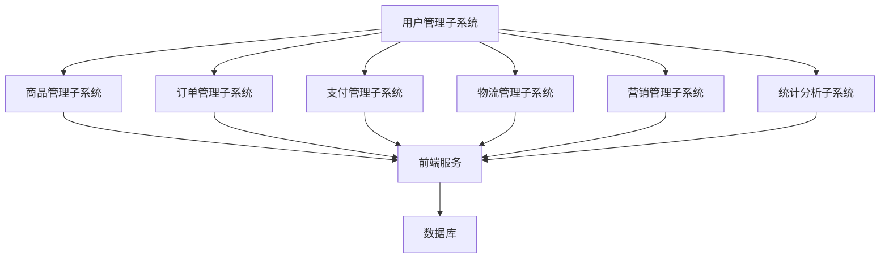
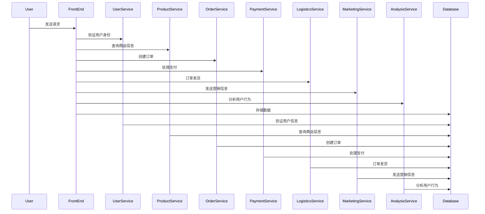

                 

### 第一部分：引言

#### 1. 引言

##### 1.1 本书背景

在当前快速发展的信息技术时代，大型应用系统的开发变得越来越复杂。随着企业规模的扩大和应用需求的不断增加，传统单一部门或团队进行项目开发已经无法满足高效、高质量的要求。跨部门协作成为一种必然趋势，它不仅涉及多个职能部门之间的信息共享和协调，还要求各团队在目标一致的基础上，共同推动项目向前发展。

本书旨在探讨跨部门协作模式在应对大型应用开发复杂性中的重要性，通过系统性地分析和阐述跨部门协作的理论和实践，帮助读者理解并掌握这一模式在项目开发中的具体应用。

##### 1.1.1 大型应用开发中的协作难题

大型应用开发项目通常具有以下特点：

1. **项目规模庞大**：涉及多个子系统、模块和功能。
2. **技术复杂**：需要多种技术的综合运用，如前端开发、后端服务、数据库管理、网络安全等。
3. **开发周期长**：项目的开发周期可能长达数月甚至数年。
4. **团队成员多**：参与项目的团队成员来自不同的职能部门，包括开发人员、测试人员、产品经理、运维人员等。

这些特点导致了大型应用开发中的协作难题：

- **沟通障碍**：不同部门之间的沟通可能存在障碍，导致信息传递不畅。
- **协调困难**：各部门的目标和利益可能不一致，导致协调难度增加。
- **资源分配不均**：各部门的资源分配可能不均衡，影响项目进度和质量。

##### 1.1.2 跨部门协作的重要性

跨部门协作在大型应用开发中具有重要意义：

1. **提高开发效率**：通过协同工作，可以充分利用各团队的资源，提高项目开发效率。
2. **减少沟通成本**：建立有效的跨部门协作机制，可以降低信息沟通的成本，避免重复劳动。
3. **降低冲突风险**：通过协调不同部门之间的目标和利益，减少项目开发中的冲突和摩擦。
4. **提升项目质量**：跨部门协作可以整合各团队的专业技能和知识，提高项目的整体质量。

##### 1.1.3 本书的目的与结构

本书的主要目的是：

1. 深入剖析跨部门协作模式的基本原理和核心要素。
2. 详细介绍跨部门协作模式在大型应用开发中的应用，包括项目管理、需求分析、设计与开发、测试与部署等环节。
3. 通过案例分析，展示跨部门协作模式在实际项目开发中的成功应用。

本书结构如下：

- **第一部分：引言**：介绍本书的背景、目的和结构。
- **第二部分：背景介绍**：讨论大型应用开发中的协作难题，分析跨部门协作模式的优势和边界。
- **第三部分：核心概念与联系**：详细阐述跨部门协作模式的基本原理和各要素之间的联系。
- **第四部分：算法原理讲解**：讲解跨部门协作模式中涉及的主要算法原理，并通过具体实例进行说明。
- **第五部分：系统分析与架构设计方案**：分析跨部门协作模式在系统架构设计中的应用。
- **第六部分：项目实战**：通过具体项目实战案例，展示跨部门协作模式的应用过程。
- **第七部分：最佳实践 tips、小结、注意事项、拓展阅读**：总结全书内容，提供最佳实践建议，并推荐进一步阅读的材料。

通过本书的阅读，读者将能够系统地理解跨部门协作模式在大型应用开发中的重要性，掌握其基本原理和应用方法，从而在实际工作中更好地应对大型应用开发的复杂性。

#### 1.2 定义与核心概念

##### 1.2.1 跨部门协作模式

###### 1.2.1.1 跨部门协作模式

跨部门协作模式是指在大型应用开发项目中，多个不同职能部门之间的协作机制。这种协作模式的核心在于打破传统的部门界限，通过信息共享、资源整合和目标协调，实现跨部门间的协同工作。

###### 1.2.1.2 跨部门协作模式的特点

- **信息共享**：跨部门协作模式强调信息在各团队间的传递和共享，确保每个团队都能获取到必要的项目信息。
- **资源整合**：通过跨部门协作，可以将不同团队的专业技能和资源进行整合，提高项目的整体效率。
- **目标协调**：各团队在共同目标的基础上，通过协调和合作，确保项目进度和质量。

##### 1.2.2 跨部门协作模式的特点

###### 1.2.2.1 高效性

跨部门协作模式通过优化沟通和协调机制，能够显著提高项目开发效率。各部门能够快速响应项目需求，减少因沟通不畅导致的延误和重复劳动。

###### 1.2.2.2 灵活性

跨部门协作模式具有一定的灵活性，可以根据项目需求和团队状况，灵活调整协作方式和资源配置。

###### 1.2.2.3 集成性

跨部门协作模式强调资源整合和集成，各团队在项目开发过程中相互支持，共同推动项目向前发展。

##### 1.2.3 其他相关概念

###### 1.2.3.1 部门间沟通

部门间沟通是跨部门协作模式的核心。有效的沟通机制可以确保信息在各部门间的流畅传递，避免因信息不对称导致的误解和冲突。

###### 1.2.3.2 部门间协调

部门间协调是跨部门协作模式的重要组成部分。通过协调，各部门能够在共同目标下，相互配合，实现项目的整体优化。

###### 1.2.3.3 跨职能团队

跨职能团队是指由来自不同职能部门的人员组成的团队，专门负责项目中的某一特定任务或模块。跨职能团队可以在项目开发过程中提供专门的支持和协调，提高项目的整体效率。

##### 1.2.4 跨部门协作模式的边界与外延

###### 1.2.4.1 跨部门协作的范围

跨部门协作的范围主要涉及项目管理的各个方面，包括需求分析、设计开发、测试部署等。每个环节都需要各部门的协同工作，确保项目的顺利推进。

###### 1.2.4.2 跨部门协作的限制

跨部门协作也存在一定的限制，如部门间的利益冲突、资源分配不均等。这些限制可能会影响跨部门协作的效果，需要通过合理的机制进行管理和优化。

##### 1.2.5 跨部门协作模式的基本概念

###### 1.2.5.1 跨部门协作的参与者

跨部门协作的参与者包括项目管理者、开发人员、测试人员、产品经理、运维人员等。每个参与者都有特定的角色和职责，共同推动项目向前发展。

###### 1.2.5.2 跨部门协作的目标

跨部门协作的目标是确保项目按时、按质、按预算完成，实现项目目标和团队目标的一致。通过协同工作，各部门能够共同克服项目开发中的各种挑战。

###### 1.2.5.3 跨部门协作的机制

跨部门协作的机制包括沟通机制、协调机制、决策机制等。这些机制确保各部门在项目开发过程中能够高效、顺畅地协同工作，提高项目开发效率。

#### 1.3 本书结构

##### 1.3.1 各部分内容概述

- **第一部分：引言**：介绍本书的背景、目的和结构。
- **第二部分：背景介绍**：讨论大型应用开发中的协作难题，分析跨部门协作模式的优势和边界。
- **第三部分：核心概念与联系**：详细阐述跨部门协作模式的基本原理和各要素之间的联系。
- **第四部分：算法原理讲解**：讲解跨部门协作模式中涉及的主要算法原理，并通过具体实例进行说明。
- **第五部分：系统分析与架构设计方案**：分析跨部门协作模式在系统架构设计中的应用。
- **第六部分：项目实战**：通过具体项目实战案例，展示跨部门协作模式的应用过程。
- **第七部分：最佳实践 tips、小结、注意事项、拓展阅读**：总结全书内容，提供最佳实践建议，并推荐进一步阅读的材料。

##### 1.3.2 阅读建议

本书适合从事大型应用开发的开发者、项目经理、产品经理等相关人员阅读。为了更好地理解本书内容，建议读者按照以下步骤进行：

1. **通读全文**：首先通读全书，了解跨部门协作模式的基本概念和原理。
2. **重点阅读**：在理解基本概念和原理的基础上，重点阅读各部分的重点内容，如核心概念与联系、算法原理讲解、系统分析与架构设计方案等。
3. **结合实践**：通过具体项目实战案例，将理论应用于实际项目中，加深对跨部门协作模式的理解。
4. **持续学习**：跨部门协作模式是一个不断发展的领域，读者应持续关注相关技术和方法的发展，以适应不断变化的项目开发需求。

### 第二部分：跨部门协作模式原理

#### 2.1 跨部门协作模式的原理

##### 2.1.1 跨部门协作模式的概述

###### 2.1.1.1 跨部门协作模式的定义

跨部门协作模式是一种在大型应用开发项目中，通过多部门之间的信息共享、资源整合和目标协调，实现高效协同工作的机制。

###### 2.1.1.2 跨部门协作模式的核心原理

跨部门协作模式的核心原理包括：

1. **信息共享**：通过建立有效的沟通机制，确保各部门能够获取到必要的信息，避免信息孤岛。
2. **资源整合**：整合各部门的资源，提高资源利用率，减少重复劳动。
3. **目标协调**：在共同目标的基础上，协调各部门的工作，确保项目整体目标的实现。

##### 2.1.2 跨部门协作模式的要素分析

###### 2.1.2.1 部门间的沟通

部门间的沟通是跨部门协作模式的关键。有效的沟通机制包括：

1. **定期的会议**：通过定期召开会议，各团队可以及时交流项目进展、问题和需求。
2. **信息共享平台**：建立一个集中的信息共享平台，各部门可以随时查阅和更新项目信息。
3. **沟通规范**：制定统一的沟通规范，包括语言、格式、频率等，确保沟通的效率和效果。

###### 2.1.2.2 部门间的协调

部门间的协调是确保项目顺利推进的重要保障。协调机制包括：

1. **任务分配**：明确各团队的职责和任务，确保各团队的工作有序进行。
2. **进度跟踪**：建立进度跟踪机制，及时了解各团队的进展，发现问题并迅速解决。
3. **资源调配**：根据项目需求，合理调配各部门的资源，确保项目资源的最大化利用。

###### 2.1.2.3 部门间的共享

部门间的共享包括信息共享、资源共享和知识共享：

1. **信息共享**：通过建立信息共享平台，各部门可以及时获取和更新项目相关信息。
2. **资源共享**：各部门可以通过共享硬件设备、软件工具等资源，提高资源利用率。
3. **知识共享**：通过内部培训、技术交流等形式，促进各部门之间的知识共享，提高团队整体的技术水平。

##### 2.1.3 跨部门协作模式的分类

###### 2.1.3.1 传统协作模式

传统协作模式通常以部门为单位，各部门独立开展工作，相互之间的沟通和协调相对较少。这种模式在小型项目或单一团队项目中较为常见，但在大型应用开发项目中容易导致沟通障碍和协调困难。

###### 2.1.3.2 现代协作模式

现代协作模式强调跨部门之间的协同工作，通过建立有效的沟通机制、协调机制和共享机制，实现高效的项目管理。现代协作模式适用于大型、复杂的应用开发项目，能够显著提高项目的开发效率和质量。

###### 2.1.3.3 跨部门协作模式的优势与挑战

跨部门协作模式具有以下优势：

1. **提高开发效率**：通过信息共享和资源整合，减少重复劳动，提高项目开发效率。
2. **降低沟通成本**：建立有效的沟通机制，减少信息传递过程中的损耗和误解。
3. **减少冲突风险**：通过目标协调和利益平衡，降低部门间的冲突和摩擦。

然而，跨部门协作模式也面临一定的挑战：

1. **协调难度**：各部门的目标和利益可能不一致，需要通过有效的协调机制进行平衡。
2. **资源分配**：跨部门协作模式下，资源分配可能不均衡，需要合理调配资源，确保项目顺利推进。
3. **管理复杂性**：跨部门协作模式的管理相对复杂，需要建立完善的管理机制，确保项目整体目标的实现。

##### 2.1.4 跨部门协作模式的实现方法

###### 2.1.4.1 沟通机制的建立

建立有效的沟通机制是实现跨部门协作的关键。以下方法可以帮助建立有效的沟通机制：

1. **定期会议**：定期召开跨部门会议，讨论项目进展、问题和需求，确保各部门之间的信息同步。
2. **沟通平台**：建立一个集中化的沟通平台，如企业微信、钉钉等，方便各部门之间实时沟通和协作。
3. **沟通规范**：制定统一的沟通规范，包括语言、格式、频率等，确保沟通的规范性和一致性。

###### 2.1.4.2 协调机制的建立

建立协调机制是确保跨部门协作顺利进行的重要保障。以下方法可以帮助建立协调机制：

1. **任务分配**：明确各团队的职责和任务，确保各团队的工作有序进行。
2. **进度跟踪**：建立进度跟踪机制，及时了解各团队的进展，发现问题并迅速解决。
3. **资源调配**：根据项目需求，合理调配各部门的资源，确保项目资源的最大化利用。

###### 2.1.4.3 共享机制的建立

建立共享机制是跨部门协作模式的核心。以下方法可以帮助建立共享机制：

1. **信息共享**：建立一个信息共享平台，各部门可以随时查阅和更新项目相关信息。
2. **资源共享**：各部门可以通过共享硬件设备、软件工具等资源，提高资源利用率。
3. **知识共享**：通过内部培训、技术交流等形式，促进各部门之间的知识共享，提高团队整体的技术水平。

#### 2.2 跨部门协作模式在项目开发中的应用

##### 2.2.1 项目管理中的跨部门协作

在项目管理中，跨部门协作模式的作用至关重要。以下方面是项目管理中跨部门协作的主要应用：

1. **需求分析**：项目经理需要与产品经理、开发人员、测试人员等多个团队紧密协作，确保需求分析准确、全面。
2. **计划制定**：项目经理需要与各团队协调，制定详细的项目计划，确保项目进度和目标的实现。
3. **风险控制**：项目经理需要与各团队共同识别项目风险，制定相应的风险应对措施，确保项目顺利推进。
4. **资源调配**：项目经理需要根据项目需求，合理调配各部门的资源，确保项目资源的最大化利用。

##### 2.2.2 需求分析中的跨部门协作

需求分析是项目开发的重要环节，跨部门协作在需求分析中发挥着重要作用。以下方面是需求分析中跨部门协作的主要应用：

1. **需求调研**：项目经理需要与产品经理、市场部门等多个团队协作，进行需求调研，确保需求收集全面、准确。
2. **需求确认**：项目经理需要与开发人员、测试人员等多个团队协作，进行需求确认，确保需求实现可操作、可测试。
3. **需求变更管理**：在项目开发过程中，需求可能会发生变化，项目经理需要与各团队协作，进行需求变更管理，确保项目进度和目标的实现。

##### 2.2.3 设计与开发中的跨部门协作

设计与开发是项目开发的核心环节，跨部门协作在设计与开发中发挥着重要作用。以下方面是设计与开发中跨部门协作的主要应用：

1. **系统架构设计**：项目经理需要与架构师、开发人员等多个团队协作，进行系统架构设计，确保系统架构的合理性和可扩展性。
2. **模块划分**：项目经理需要与开发人员、测试人员等多个团队协作，进行模块划分，确保模块的独立性和协同性。
3. **代码审查**：项目经理需要与开发人员、测试人员等多个团队协作，进行代码审查，确保代码质量。

##### 2.2.4 测试与部署中的跨部门协作

测试与部署是项目开发的重要环节，跨部门协作在测试与部署中发挥着重要作用。以下方面是测试与部署中跨部门协作的主要应用：

1. **测试计划**：项目经理需要与测试人员、开发人员等多个团队协作，制定测试计划，确保测试覆盖全面、准确。
2. **缺陷管理**：项目经理需要与测试人员、开发人员等多个团队协作，进行缺陷管理，确保缺陷及时修复。
3. **部署管理**：项目经理需要与运维人员、开发人员等多个团队协作，进行部署管理，确保项目顺利上线。

通过跨部门协作模式，项目开发过程中的各个阶段都能够实现高效、有序的协同工作，从而提高项目的开发效率和质量。

### 第三部分：跨部门协作模式在大型应用开发中的应用

#### 3.1 大型应用开发中的协作挑战

大型应用开发项目具有项目规模庞大、技术复杂、开发周期长、团队成员多等特点，这使得跨部门协作面临着一系列挑战：

##### 3.1.1 大型应用开发的特点

1. **项目规模庞大**：大型应用开发通常涉及多个子系统、模块和功能，项目规模庞大，需要多个团队协同工作。
2. **技术复杂**：大型应用开发需要多种技术的综合运用，如前端开发、后端服务、数据库管理、网络安全等，技术复杂度较高。
3. **开发周期长**：大型应用开发项目的开发周期可能长达数月甚至数年，需要各团队长期协同工作。
4. **团队成员多**：参与大型应用开发项目的团队成员来自不同的职能部门，包括开发人员、测试人员、产品经理、运维人员等，团队规模庞大。

##### 3.1.2 跨部门协作面临的困难

1. **沟通障碍**：由于各团队成员来自不同的职能部门，沟通方式、语言和格式可能不一致，导致信息传递不畅，影响项目进展。
2. **利益冲突**：各部门在项目开发过程中可能存在利益冲突，如资源分配不均、任务分配不合理等，影响项目质量和进度。
3. **资源分配不均**：大型应用开发项目需要多种资源和技能的支持，但在实际操作中，资源分配可能不均，导致某些团队在项目关键阶段资源短缺，影响项目进度。
4. **团队协作困难**：由于团队成员背景、技能和目标的差异，团队协作可能存在困难，影响项目整体效率。

#### 3.2 跨部门协作模式在大型应用开发中的应用

##### 3.2.1 跨部门协作模式的优势

跨部门协作模式在大型应用开发中的应用具有显著优势：

1. **提高开发效率**：通过信息共享、资源整合和目标协调，跨部门协作模式能够显著提高项目开发效率。各部门可以快速响应项目需求，减少因沟通不畅导致的延误和重复劳动。
2. **减少沟通成本**：建立有效的跨部门协作机制，可以降低信息沟通的成本，避免因信息不对称导致的误解和冲突。
3. **降低冲突风险**：通过协调不同部门之间的目标和利益，跨部门协作模式能够降低项目开发中的冲突和摩擦，确保项目顺利进行。
4. **提升项目质量**：跨部门协作模式能够整合各团队的专业技能和知识，提高项目的整体质量，确保项目按时、按质、按预算完成。

##### 3.2.2 跨部门协作模式在大型应用开发中的实践

跨部门协作模式在大型应用开发中的应用涉及多个方面，以下为具体实践：

1. **项目管理**：在项目启动阶段，项目经理需要与各团队紧密协作，明确项目目标、范围和进度，确保项目整体规划合理。在项目执行过程中，项目经理需要定期召开跨部门会议，讨论项目进展、问题和需求，确保项目进展顺利。

2. **需求分析**：在需求分析阶段，项目经理需要与产品经理、开发人员、测试人员等多个团队协作，确保需求收集全面、准确。项目经理需要组织需求确认会议，与各团队共同确认需求，确保需求实现可操作、可测试。

3. **设计与开发**：在设计与开发阶段，项目经理需要与架构师、开发人员等多个团队协作，确保系统架构设计合理、模块划分清晰。项目经理需要组织代码审查会议，与开发人员共同审查代码，确保代码质量。

4. **测试与部署**：在测试与部署阶段，项目经理需要与测试人员、运维人员等多个团队协作，制定测试计划，确保测试覆盖全面、准确。项目经理需要组织缺陷管理会议，与测试人员、开发人员共同解决缺陷，确保项目顺利上线。

##### 3.2.3 跨部门协作模式的实施步骤

1. **建立沟通机制**：建立有效的跨部门沟通机制，包括定期会议、信息共享平台和沟通规范，确保信息在各部门间的流畅传递。
2. **明确职责与任务**：明确各团队的职责和任务，确保各团队的工作有序进行，避免重复劳动和资源浪费。
3. **协调资源与利益**：合理调配资源，确保各部门在项目关键阶段有足够的资源支持。同时，协调各部门之间的利益，降低冲突风险。
4. **建立协调机制**：建立跨部门协调机制，包括任务分配、进度跟踪和资源调配等，确保项目整体目标的实现。
5. **培训与交流**：定期组织内部培训和交流，提高各部门之间的沟通协作能力，促进知识共享。

通过跨部门协作模式，大型应用开发项目能够实现高效、有序的协同工作，提高项目的开发效率和质量，确保项目按时、按质、按预算完成。

### 第三部分：跨部门协作模式在大型应用开发中的应用

#### 3.1 大型应用开发中的协作挑战

在当今信息化快速发展的时代，大型应用开发项目已经成为企业业务创新和竞争力提升的关键。然而，这类项目由于其复杂性高、涉及多个团队、技术多样且开发周期长，往往面临诸多协作挑战：

##### 3.1.1 大型应用开发的特点

1. **项目规模庞大**：大型应用开发往往涉及多个子系统、模块和功能，这些子系统和模块需要协同工作，形成一个完整的系统。
2. **技术复杂**：大型应用开发需要运用多种技术，如前端开发、后端服务、数据库管理、网络安全等，技术领域的多样性增加了协作的难度。
3. **开发周期长**：大型应用开发的开发周期通常较长，可能持续数月甚至数年，这意味着需要长时间的跨部门协作和持续的沟通。
4. **团队成员多**：参与大型应用开发的团队成员来自不同的职能部门，包括开发人员、测试人员、产品经理、运维人员等，成员的多样性和职能的多样性增加了协调的复杂度。

##### 3.1.2 跨部门协作面临的困难

1. **沟通障碍**：由于团队成员来自不同的职能部门，他们的工作语言、工作方式和沟通习惯可能不一致，导致信息传递的障碍，影响项目进展。
2. **利益冲突**：各部门在项目开发过程中可能会因为资源分配、任务优先级、目标实现等方面产生利益冲突，这些冲突可能影响项目的整体效率和质量。
3. **资源分配不均**：在大型应用开发中，资源（如人力、时间、资金等）的分配可能不均，导致某些团队在关键阶段资源短缺，影响项目进度。
4. **团队协作困难**：由于团队成员背景、技能、目标和工作方式的差异，团队协作可能面临困难，影响项目的整体效率。

##### 3.1.3 跨部门协作模式的优势

为了应对这些挑战，跨部门协作模式应运而生，其优势包括：

1. **提高开发效率**：通过跨部门协作，可以充分利用各团队的资源和技能，提高项目的整体开发效率，减少因沟通不畅和资源分配不均导致的延误。
2. **降低沟通成本**：建立有效的跨部门协作机制，可以减少信息传递过程中的损耗，降低沟通成本，提高信息传递的准确性和及时性。
3. **减少冲突风险**：通过协调不同部门之间的目标和利益，跨部门协作模式能够降低项目开发中的冲突和摩擦，确保项目的顺利进行。
4. **提升项目质量**：跨部门协作模式能够整合各团队的专业技能和知识，通过团队成员间的相互学习和知识共享，提高项目的整体质量。

#### 3.2 跨部门协作模式在大型应用开发中的实践

跨部门协作模式在大型应用开发中的实践需要遵循一系列步骤和方法，以下是具体的实施步骤：

1. **需求分析与规划**：在项目启动阶段，项目经理需要与产品经理、开发人员、测试人员等多个团队协作，进行需求分析和项目规划。明确项目的目标、范围和关键里程碑，确保各团队对项目的整体目标和期望有清晰的认识。

2. **建立沟通机制**：建立跨部门的沟通机制是跨部门协作模式成功的关键。项目经理需要制定定期的会议安排，包括周会、月度评审等，确保各团队能够定期交流项目进展、问题和需求。同时，建立信息共享平台，如企业内部邮件、即时通讯工具等，方便团队成员之间的实时沟通和协作。

3. **明确职责与任务**：在项目执行过程中，项目经理需要与各团队明确各自的职责和任务，确保每个团队成员都清楚自己的工作内容和目标。通过任务分配表、责任矩阵等方式，明确每个团队成员的具体工作内容，避免工作重叠和资源浪费。

4. **协调资源与利益**：项目经理需要根据项目需求和各团队的能力，合理调配资源，确保项目关键阶段有足够的资源支持。同时，项目经理需要协调各部门之间的利益，确保资源的公平分配和各部门之间的利益平衡。

5. **建立协调机制**：项目经理需要建立跨部门的协调机制，包括任务分配、进度跟踪和资源调配等。通过定期的协调会议，及时解决项目开发过程中的问题，确保项目能够按计划进行。

6. **培训与交流**：定期组织内部培训和交流，提高团队成员的协作能力。通过培训，提高团队成员对跨部门协作模式的理解和实践能力。同时，通过交流，促进团队成员之间的知识共享和经验交流，提升团队整体的专业素养。

#### 3.3 跨部门协作模式在大型应用开发中的成功案例

为了更好地理解跨部门协作模式在大型应用开发中的实际应用，以下是一个成功案例：

**案例：某金融行业企业级应用开发项目**

某金融行业企业在进行企业级应用系统开发时，面临以下挑战：

- 项目规模庞大，涉及多个子系统，如交易系统、客户管理系统、风险控制系统等。
- 技术复杂，需要运用前端开发、后端服务、数据库管理、网络安全等多种技术。
- 开发周期长，项目从启动到上线历时两年。
- 团队成员多，包括开发人员、测试人员、产品经理、运维人员等。

为了应对这些挑战，企业采用了跨部门协作模式：

1. **需求分析与规划**：项目启动时，项目经理组织了跨部门的会议，与产品经理、开发人员、测试人员等团队共同讨论需求，明确项目的目标和范围。通过需求文档、用户故事等形式，确保各团队对项目需求有统一的理解。

2. **建立沟通机制**：项目经理建立了定期的跨部门沟通机制，包括每周的项目进度会议和每月的评审会议。同时，使用企业内部邮件系统、即时通讯工具等，确保团队成员之间的实时沟通和信息共享。

3. **明确职责与任务**：项目经理与各团队明确各自的职责和任务，制定了详细的任务分配表和责任矩阵。每个团队成员都清楚自己的工作内容和目标，避免了工作重叠和资源浪费。

4. **协调资源与利益**：项目经理根据项目需求和各团队的能力，合理调配资源，确保项目关键阶段有足够的资源支持。同时，通过跨部门协调会议，解决了各部门之间的资源分配和利益冲突问题。

5. **建立协调机制**：项目经理建立了跨部门的协调机制，通过定期的协调会议，及时解决项目开发过程中的问题，确保项目能够按计划进行。

6. **培训与交流**：项目经理定期组织内部培训和交流，提高团队成员的协作能力。通过培训，团队成员对跨部门协作模式的理解和实践能力得到了提升。同时，通过交流，团队成员之间的知识共享和经验交流促进了团队整体的专业素养。

通过跨部门协作模式的应用，该金融行业企业成功完成了企业级应用系统的开发，项目按时、按质、按预算完成，得到了客户的高度认可。

#### 3.4 跨部门协作模式在大型应用开发中的应用总结

跨部门协作模式在大型应用开发中的应用，不仅提高了项目的开发效率和质量，还减少了沟通成本和冲突风险。以下是跨部门协作模式在大型应用开发中的应用总结：

1. **提高项目开发效率**：通过信息共享、资源整合和目标协调，跨部门协作模式能够显著提高项目的开发效率。团队成员可以快速响应项目需求，减少因沟通不畅和资源分配不均导致的延误和重复劳动。

2. **降低沟通成本**：建立有效的跨部门协作机制，可以降低信息沟通的成本，减少因信息不对称导致的误解和冲突。定期的会议、信息共享平台和沟通规范等机制，确保信息在各部门间的流畅传递。

3. **减少冲突风险**：通过协调不同部门之间的目标和利益，跨部门协作模式能够降低项目开发中的冲突和摩擦。合理的资源分配和利益平衡，确保各部门能够在共同目标下协同工作。

4. **提升项目质量**：跨部门协作模式能够整合各团队的专业技能和知识，通过团队成员间的相互学习和知识共享，提高项目的整体质量。定期的代码审查、需求确认和测试计划等环节，确保项目的稳定性和可靠性。

总之，跨部门协作模式在大型应用开发中的应用，为项目开发带来了显著的好处。通过有效的跨部门协作，项目团队能够克服协作难题，实现高效、有序的协同工作，确保项目按时、按质、按预算完成。

### 第三部分：跨部门协作模式在大型应用开发中的应用

#### 3.1 大型应用开发中的协作挑战

在当今快速发展的信息技术时代，大型应用开发项目因其规模庞大、技术复杂、开发周期长和团队成员多样化等特点，面临着诸多协作挑战。为了应对这些挑战，跨部门协作模式显得尤为重要。

##### 3.1.1 大型应用开发的特点

1. **项目规模庞大**：大型应用开发通常涉及多个子系统、模块和功能，这些子系统和模块需要协同工作，形成一个完整的系统。
2. **技术复杂**：大型应用开发需要多种技术的综合运用，如前端开发、后端服务、数据库管理、网络安全等，技术领域的多样性增加了协作的难度。
3. **开发周期长**：大型应用开发项目的开发周期通常较长，可能持续数月甚至数年，这意味着需要长时间的跨部门协作和持续的沟通。
4. **团队成员多**：参与大型应用开发的团队成员来自不同的职能部门，包括开发人员、测试人员、产品经理、运维人员等，成员的多样性和职能的多样性增加了协调的复杂度。

##### 3.1.2 跨部门协作面临的困难

1. **沟通障碍**：由于团队成员来自不同的职能部门，沟通方式、语言和格式可能不一致，导致信息传递不畅，影响项目进展。
2. **利益冲突**：各部门在项目开发过程中可能存在利益冲突，如资源分配不均、任务分配不合理等，影响项目质量和进度。
3. **资源分配不均**：大型应用开发项目需要多种资源和技能的支持，但在实际操作中，资源分配可能不均，导致某些团队在项目关键阶段资源短缺，影响项目进度。
4. **团队协作困难**：由于团队成员背景、技能、目标和工作方式的差异，团队协作可能存在困难，影响项目的整体效率。

##### 3.1.3 跨部门协作模式的优势

跨部门协作模式在大型应用开发中具有显著的优势：

1. **提高开发效率**：通过信息共享、资源整合和目标协调，跨部门协作模式能够显著提高项目的开发效率。团队成员可以快速响应项目需求，减少因沟通不畅和资源分配不均导致的延误和重复劳动。
2. **减少沟通成本**：建立有效的跨部门协作机制，可以降低信息沟通的成本，避免因信息不对称导致的误解和冲突。定期的会议、信息共享平台和沟通规范等机制，确保信息在各部门间的流畅传递。
3. **降低冲突风险**：通过协调不同部门之间的目标和利益，跨部门协作模式能够降低项目开发中的冲突和摩擦。合理的资源分配和利益平衡，确保各部门能够在共同目标下协同工作。
4. **提升项目质量**：跨部门协作模式能够整合各团队的专业技能和知识，通过团队成员间的相互学习和知识共享，提高项目的整体质量。定期的代码审查、需求确认和测试计划等环节，确保项目的稳定性和可靠性。

##### 3.1.4 跨部门协作模式的实践

跨部门协作模式在大型应用开发中的实践需要遵循一系列步骤和方法，以下是具体的实施步骤：

1. **需求分析与规划**：在项目启动阶段，项目经理需要与产品经理、开发人员、测试人员等多个团队协作，进行需求分析和项目规划。明确项目的目标、范围和关键里程碑，确保各团队对项目的整体目标和期望有清晰的认识。

2. **建立沟通机制**：建立跨部门的沟通机制是跨部门协作模式成功的关键。项目经理需要制定定期的会议安排，包括周会、月度评审等，确保各团队能够定期交流项目进展、问题和需求。同时，建立信息共享平台，如企业内部邮件系统、即时通讯工具等，方便团队成员之间的实时沟通和协作。

3. **明确职责与任务**：在项目执行过程中，项目经理需要与各团队明确各自的职责和任务，确保每个团队成员都清楚自己的工作内容和目标。通过任务分配表、责任矩阵等方式，明确每个团队成员的具体工作内容，避免工作重叠和资源浪费。

4. **协调资源与利益**：项目经理需要根据项目需求和各团队的能力，合理调配资源，确保项目关键阶段有足够的资源支持。同时，通过跨部门协调会议，解决各部门之间的资源分配和利益冲突问题。

5. **建立协调机制**：项目经理需要建立跨部门的协调机制，通过定期的协调会议，及时解决项目开发过程中的问题，确保项目能够按计划进行。

6. **培训与交流**：定期组织内部培训和交流，提高团队成员的协作能力。通过培训，提高团队成员对跨部门协作模式的理解和实践能力。同时，通过交流，促进团队成员之间的知识共享和经验交流，提升团队整体的专业素养。

##### 3.1.5 跨部门协作模式在大型应用开发中的成功案例

以下是一个跨部门协作模式在大型应用开发中的成功案例：

**案例：某互联网公司电子商务平台项目**

某互联网公司在开发其电子商务平台项目时，面临以下挑战：

- 项目规模庞大，涉及购物车、订单管理、支付系统等多个子系统。
- 技术复杂，需要运用前端开发、后端服务、数据库管理、网络安全等多种技术。
- 开发周期长，项目历时一年半。
- 团队成员多，包括前端开发人员、后端开发人员、测试人员、产品经理、运维人员等。

为了应对这些挑战，公司采用了跨部门协作模式：

1. **需求分析与规划**：项目经理组织了跨部门的需求分析会议，与产品经理、前端开发人员、后端开发人员、测试人员等团队共同讨论需求，明确项目的目标和范围。

2. **建立沟通机制**：项目经理建立了每周的跨部门会议，包括项目进度汇报、问题讨论和需求变更讨论。同时，使用了企业内部邮件系统、即时通讯工具等，确保团队成员之间的实时沟通和信息共享。

3. **明确职责与任务**：项目经理与各团队明确各自的职责和任务，制定了详细的任务分配表和责任矩阵。每个团队成员都清楚自己的工作内容和目标，避免了工作重叠和资源浪费。

4. **协调资源与利益**：项目经理根据项目需求和各团队的能力，合理调配资源，确保项目关键阶段有足够的资源支持。同时，通过跨部门协调会议，解决了各部门之间的资源分配和利益冲突问题。

5. **建立协调机制**：项目经理建立了跨部门的协调机制，通过定期的协调会议，及时解决项目开发过程中的问题，确保项目能够按计划进行。

6. **培训与交流**：项目经理定期组织内部培训和交流，提高团队成员的协作能力。通过培训，团队成员对跨部门协作模式的理解和实践能力得到了提升。同时，通过交流，团队成员之间的知识共享和经验交流促进了团队整体的专业素养。

通过跨部门协作模式的应用，该公司成功完成了电子商务平台项目，项目按时、按质、按预算完成，得到了用户的高度认可。

### 第三部分：跨部门协作模式在大型应用开发中的应用

#### 3.1 大型应用开发中的协作挑战

在大型应用开发项目中，由于项目规模庞大、技术复杂、团队成员多样，跨部门协作面临许多挑战。理解这些挑战并找到有效的解决方法是确保项目成功的关键。

##### 3.1.1 大型应用开发的特点

1. **项目规模庞大**：大型应用开发通常包括多个子系统、模块和功能，这些需要协同工作以实现整体系统。
2. **技术复杂**：涉及多种技术，如前端开发、后端服务、数据库管理、网络安全等，技术的多样性增加了协作的难度。
3. **开发周期长**：项目可能历时数月甚至数年，长时间的开发周期要求团队成员保持协同和持续沟通。
4. **团队成员多**：包括开发人员、测试人员、产品经理、运维人员等，团队成员的多样性增加了协调的复杂性。

##### 3.1.2 跨部门协作面临的困难

1. **沟通障碍**：由于团队成员来自不同的职能部门，沟通方式和语言可能不一致，导致信息传递不畅。
2. **利益冲突**：各部门在项目开发过程中可能因资源分配、任务分配等问题产生利益冲突，影响项目进度和质量。
3. **资源分配不均**：资源（如人力、时间、资金等）的分配可能不均，导致某些团队在关键阶段资源短缺，影响项目进度。
4. **团队协作困难**：由于团队成员背景、技能、目标和工作方式的差异，团队协作可能存在困难，影响项目的整体效率。

##### 3.1.3 跨部门协作模式的优势

跨部门协作模式在解决上述挑战方面具有显著优势：

1. **提高开发效率**：通过信息共享、资源整合和目标协调，跨部门协作能够提高项目的整体开发效率，减少因沟通不畅和资源分配不均导致的延误和重复劳动。
2. **降低沟通成本**：建立有效的跨部门协作机制，可以减少信息传递过程中的损耗，降低沟通成本，确保信息的准确性和及时性。
3. **减少冲突风险**：通过协调不同部门之间的目标和利益，跨部门协作模式能够降低项目开发中的冲突和摩擦，确保项目顺利进行。
4. **提升项目质量**：跨部门协作模式能够整合各团队的专业技能和知识，通过团队成员间的相互学习和知识共享，提高项目的整体质量。

#### 3.2 跨部门协作模式在大型应用开发中的应用

跨部门协作模式在大型应用开发中的应用涉及多个环节，以下是具体应用和实践：

1. **需求分析**：在项目启动阶段，项目经理需要与产品经理、开发人员、测试人员等多个团队协作，进行需求分析。通过需求评审会议、用户故事等形式，确保各团队对需求有统一的理解，为后续开发奠定基础。

2. **项目管理**：项目经理需要制定详细的项目计划，明确项目目标、范围、进度和里程碑。在项目执行过程中，项目经理需要定期召开跨部门会议，讨论项目进展、问题和需求，确保项目按计划进行。

3. **设计与开发**：在设计与开发阶段，项目经理需要与架构师、开发人员协作，进行系统架构设计、模块划分和代码编写。通过代码审查会议，确保代码质量，降低缺陷率。

4. **测试与部署**：在测试与部署阶段，项目经理需要与测试人员、运维人员协作，制定测试计划，进行系统测试和部署。通过缺陷管理会议，及时解决测试过程中发现的问题，确保项目顺利上线。

#### 3.3 跨部门协作模式在大型应用开发中的成功案例

以下是一个跨部门协作模式在大型应用开发中的成功案例：

**案例：某企业级ERP系统开发**

某企业在开发其企业级ERP系统时，面临以下挑战：

- 项目规模庞大，涉及财务、采购、销售等多个业务模块。
- 技术复杂，需要整合多种技术，如数据库管理、网络通信、云计算等。
- 开发周期长，项目历时两年。
- 团队成员多，包括开发人员、测试人员、产品经理、运维人员等。

为了应对这些挑战，企业采用了跨部门协作模式：

1. **需求分析**：项目经理组织了跨部门的会议，与产品经理、开发人员、测试人员等团队共同讨论需求，明确了项目的目标和范围。

2. **项目管理**：项目经理制定了详细的项目计划，明确了项目目标、范围、进度和里程碑。通过定期的跨部门会议，讨论项目进展和问题，确保项目按计划进行。

3. **设计与开发**：项目经理与架构师、开发人员协作，进行了系统架构设计、模块划分和代码编写。通过代码审查会议，确保代码质量。

4. **测试与部署**：项目经理与测试人员、运维人员协作，制定了测试计划，进行了系统测试和部署。通过缺陷管理会议，解决了测试过程中发现的问题。

通过跨部门协作模式的应用，该企业成功完成了企业级ERP系统的开发，项目按时、按质、按预算完成，得到了客户的高度认可。

#### 3.4 跨部门协作模式在大型应用开发中的应用总结

跨部门协作模式在大型应用开发中的应用，为项目开发带来了显著的好处：

1. **提高项目开发效率**：通过信息共享、资源整合和目标协调，跨部门协作模式能够显著提高项目的开发效率。团队成员可以快速响应项目需求，减少因沟通不畅和资源分配不均导致的延误和重复劳动。

2. **降低沟通成本**：建立有效的跨部门协作机制，可以降低信息沟通的成本，减少因信息不对称导致的误解和冲突。定期的会议、信息共享平台和沟通规范等机制，确保信息在各部门间的流畅传递。

3. **减少冲突风险**：通过协调不同部门之间的目标和利益，跨部门协作模式能够降低项目开发中的冲突和摩擦。合理的资源分配和利益平衡，确保各部门能够在共同目标下协同工作。

4. **提升项目质量**：跨部门协作模式能够整合各团队的专业技能和知识，通过团队成员间的相互学习和知识共享，提高项目的整体质量。定期的代码审查、需求确认和测试计划等环节，确保项目的稳定性和可靠性。

总之，跨部门协作模式在大型应用开发中的应用，为项目开发带来了显著的好处。通过有效的跨部门协作，项目团队能够克服协作难题，实现高效、有序的协同工作，确保项目按时、按质、按预算完成。

### 第三部分：跨部门协作模式在大型应用开发中的应用

#### 3.1 大型应用开发中的协作挑战

大型应用开发项目因其规模庞大、技术复杂、涉及多个团队，因此在项目开发过程中面临诸多协作挑战。为了应对这些挑战，跨部门协作模式显得尤为重要。

##### 3.1.1 大型应用开发的特点

1. **项目规模庞大**：大型应用开发项目通常包含多个子系统、模块和功能，这些部分需要协同工作，形成一个完整的系统。
2. **技术复杂**：大型应用开发涉及前端、后端、数据库、网络安全等多种技术，技术复杂度高。
3. **开发周期长**：大型应用开发项目的开发周期往往较长，需要团队成员在较长时间内保持协同和沟通。
4. **团队成员多**：包括开发人员、测试人员、产品经理、运维人员等，团队成员来自不同的职能部门，增加了协调的复杂性。

##### 3.1.2 跨部门协作面临的困难

1. **沟通障碍**：团队成员来自不同的职能部门，沟通方式和语言可能不一致，导致信息传递不畅，影响项目进展。
2. **利益冲突**：各部门在项目开发过程中可能因资源分配、任务分配等问题产生利益冲突，影响项目进度和质量。
3. **资源分配不均**：项目资源（如人力、时间、资金等）的分配可能不均，导致某些团队在关键阶段资源短缺，影响项目进度。
4. **团队协作困难**：由于团队成员背景、技能、目标和工作方式的差异，团队协作可能存在困难，影响项目的整体效率。

##### 3.1.3 跨部门协作模式的优势

跨部门协作模式在解决上述挑战方面具有显著优势：

1. **提高开发效率**：通过信息共享、资源整合和目标协调，跨部门协作能够显著提高项目的开发效率，减少因沟通不畅和资源分配不均导致的延误和重复劳动。
2. **降低沟通成本**：建立有效的跨部门协作机制，可以降低信息传递过程中的损耗，减少误解和冲突，确保信息传递的准确性和及时性。
3. **减少冲突风险**：通过协调不同部门之间的目标和利益，跨部门协作模式能够降低项目开发中的冲突和摩擦，确保项目的顺利进行。
4. **提升项目质量**：跨部门协作模式能够整合各团队的专业技能和知识，通过团队成员间的相互学习和知识共享，提高项目的整体质量。

#### 3.2 跨部门协作模式在大型应用开发中的应用

跨部门协作模式在大型应用开发中的应用包括以下几个方面：

1. **需求分析与规划**：在项目启动阶段，项目经理需要与产品经理、开发人员、测试人员等多个团队协作，进行需求分析和项目规划。明确项目的目标、范围和关键里程碑，确保各团队对项目的整体目标和期望有清晰的认识。

2. **沟通机制建立**：项目经理需要制定定期的跨部门会议安排，包括周会、月度评审等，确保各团队能够定期交流项目进展、问题和需求。同时，建立信息共享平台，如企业内部邮件系统、即时通讯工具等，方便团队成员之间的实时沟通和协作。

3. **职责与任务明确**：项目经理需要与各团队明确各自的职责和任务，确保每个团队成员都清楚自己的工作内容和目标。通过任务分配表、责任矩阵等方式，明确每个团队成员的具体工作内容，避免工作重叠和资源浪费。

4. **资源协调**：项目经理需要根据项目需求和各团队的能力，合理调配资源，确保项目关键阶段有足够的资源支持。同时，通过跨部门协调会议，解决各部门之间的资源分配和利益冲突问题。

5. **协调机制建立**：项目经理需要建立跨部门的协调机制，通过定期的协调会议，及时解决项目开发过程中的问题，确保项目能够按计划进行。

6. **培训与交流**：定期组织内部培训和交流，提高团队成员的协作能力。通过培训，提高团队成员对跨部门协作模式的理解和实践能力。同时，通过交流，促进团队成员之间的知识共享和经验交流，提升团队整体的专业素养。

#### 3.3 跨部门协作模式在大型应用开发中的成功案例

以下是一个跨部门协作模式在大型应用开发中的成功案例：

**案例：某金融机构客户关系管理系统（CRM）开发**

某金融机构在进行客户关系管理系统（CRM）开发时，面临以下挑战：

- 项目规模庞大，涉及客户管理、销售管理、服务支持等多个业务模块。
- 技术复杂，需要整合前端开发、后端服务、数据库管理、云计算等多种技术。
- 开发周期长，项目历时两年。
- 团队成员多，包括前端开发人员、后端开发人员、测试人员、产品经理、运维人员等。

为了应对这些挑战，金融机构采用了跨部门协作模式：

1. **需求分析与规划**：项目经理组织了跨部门的会议，与产品经理、前端开发人员、后端开发人员、测试人员等团队共同讨论需求，明确了项目的目标和范围。

2. **沟通机制建立**：项目经理建立了每周的跨部门会议，包括项目进度汇报、问题讨论和需求变更讨论。同时，使用了企业内部邮件系统、即时通讯工具等，确保团队成员之间的实时沟通和信息共享。

3. **职责与任务明确**：项目经理与各团队明确各自的职责和任务，制定了详细的任务分配表和责任矩阵。每个团队成员都清楚自己的工作内容和目标，避免了工作重叠和资源浪费。

4. **资源协调**：项目经理根据项目需求和各团队的能力，合理调配资源，确保项目关键阶段有足够的资源支持。同时，通过跨部门协调会议，解决了各部门之间的资源分配和利益冲突问题。

5. **协调机制建立**：项目经理建立了跨部门的协调机制，通过定期的协调会议，及时解决项目开发过程中的问题，确保项目能够按计划进行。

6. **培训与交流**：项目经理定期组织内部培训和交流，提高团队成员的协作能力。通过培训，团队成员对跨部门协作模式的理解和实践能力得到了提升。同时，通过交流，团队成员之间的知识共享和经验交流促进了团队整体的专业素养。

通过跨部门协作模式的应用，金融机构成功完成了客户关系管理系统（CRM）的开发，项目按时、按质、按预算完成，得到了客户的高度认可。

#### 3.4 跨部门协作模式在大型应用开发中的应用总结

跨部门协作模式在大型应用开发中的应用，为项目开发带来了显著的好处：

1. **提高项目开发效率**：通过信息共享、资源整合和目标协调，跨部门协作模式能够显著提高项目的开发效率。团队成员可以快速响应项目需求，减少因沟通不畅和资源分配不均导致的延误和重复劳动。

2. **降低沟通成本**：建立有效的跨部门协作机制，可以降低信息沟通的成本，减少误解和冲突。定期的会议、信息共享平台和沟通规范等机制，确保信息在各部门间的流畅传递。

3. **减少冲突风险**：通过协调不同部门之间的目标和利益，跨部门协作模式能够降低项目开发中的冲突和摩擦。合理的资源分配和利益平衡，确保各部门能够在共同目标下协同工作。

4. **提升项目质量**：跨部门协作模式能够整合各团队的专业技能和知识，通过团队成员间的相互学习和知识共享，提高项目的整体质量。定期的代码审查、需求确认和测试计划等环节，确保项目的稳定性和可靠性。

总之，跨部门协作模式在大型应用开发中的应用，为项目开发带来了显著的好处。通过有效的跨部门协作，项目团队能够克服协作难题，实现高效、有序的协同工作，确保项目按时、按质、按预算完成。

### 第三部分：跨部门协作模式在大型应用开发中的应用

#### 3.1 大型应用开发中的协作挑战

在大型应用开发项目中，由于项目规模庞大、技术复杂、团队多样化，跨部门协作面临诸多挑战。为了应对这些挑战，实施有效的跨部门协作模式至关重要。

##### 3.1.1 大型应用开发的特点

1. **项目规模庞大**：大型应用开发通常包括多个子系统、模块和功能，这些部分需要相互配合，形成一个完整的系统。
2. **技术复杂**：项目涉及前端开发、后端服务、数据库管理、网络安全等多种技术，技术多样性和复杂性增加了协作的难度。
3. **开发周期长**：大型应用开发项目往往需要数月甚至数年，长时间的开发周期要求团队成员保持高效的协作和持续的沟通。
4. **团队成员多**：参与项目的团队成员来自不同的职能部门，包括开发人员、测试人员、产品经理、运维人员等，团队成员的多样性增加了协调的复杂性。

##### 3.1.2 跨部门协作面临的困难

1. **沟通障碍**：由于团队成员来自不同的职能部门，沟通方式和语言可能不一致，导致信息传递不畅，影响项目进展。
2. **利益冲突**：各部门在项目开发过程中可能因资源分配、任务分配等问题产生利益冲突，影响项目进度和质量。
3. **资源分配不均**：项目资源（如人力、时间、资金等）的分配可能不均，导致某些团队在关键阶段资源短缺，影响项目进度。
4. **团队协作困难**：由于团队成员背景、技能、目标和工作方式的差异，团队协作可能存在困难，影响项目的整体效率。

##### 3.1.3 跨部门协作模式的优势

跨部门协作模式在解决上述挑战方面具有显著优势：

1. **提高开发效率**：通过信息共享、资源整合和目标协调，跨部门协作模式能够提高项目的整体开发效率，减少因沟通不畅和资源分配不均导致的延误和重复劳动。
2. **降低沟通成本**：建立有效的跨部门协作机制，可以降低信息传递过程中的损耗，减少误解和冲突，确保信息传递的准确性和及时性。
3. **减少冲突风险**：通过协调不同部门之间的目标和利益，跨部门协作模式能够降低项目开发中的冲突和摩擦，确保项目的顺利进行。
4. **提升项目质量**：跨部门协作模式能够整合各团队的专业技能和知识，通过团队成员间的相互学习和知识共享，提高项目的整体质量。

#### 3.2 跨部门协作模式在大型应用开发中的应用

跨部门协作模式在大型应用开发中的应用涉及多个环节，以下是具体应用和实践：

1. **需求分析**：在项目启动阶段，项目经理需要与产品经理、开发人员、测试人员等多个团队协作，进行需求分析。通过需求评审会议、用户故事等形式，确保各团队对需求有统一的理解，为后续开发奠定基础。

2. **项目管理**：项目经理需要制定详细的项目计划，明确项目目标、范围、进度和里程碑。在项目执行过程中，项目经理需要定期召开跨部门会议，讨论项目进展、问题和需求，确保项目按计划进行。

3. **设计与开发**：在设计与开发阶段，项目经理需要与架构师、开发人员协作，进行系统架构设计、模块划分和代码编写。通过代码审查会议，确保代码质量，降低缺陷率。

4. **测试与部署**：在测试与部署阶段，项目经理需要与测试人员、运维人员协作，制定测试计划，进行系统测试和部署。通过缺陷管理会议，及时解决测试过程中发现的问题，确保项目顺利上线。

#### 3.3 跨部门协作模式在大型应用开发中的成功案例

以下是一个跨部门协作模式在大型应用开发中的成功案例：

**案例：某互联网企业电商平台开发**

某互联网企业在开发其电商平台项目时，面临以下挑战：

- 项目规模庞大，涉及购物车、订单管理、支付系统等多个子系统。
- 技术复杂，需要运用前端开发、后端服务、数据库管理、网络安全等多种技术。
- 开发周期长，项目历时一年半。
- 团队成员多，包括前端开发人员、后端开发人员、测试人员、产品经理、运维人员等。

为了应对这些挑战，互联网企业采用了跨部门协作模式：

1. **需求分析**：项目经理组织了跨部门的会议，与产品经理、前端开发人员、后端开发人员、测试人员等团队共同讨论需求，明确了项目的目标和范围。

2. **项目管理**：项目经理制定了详细的项目计划，明确了项目目标、范围、进度和里程碑。通过定期的跨部门会议，讨论项目进展和问题，确保项目按计划进行。

3. **设计与开发**：项目经理与架构师、开发人员协作，进行了系统架构设计、模块划分和代码编写。通过代码审查会议，确保代码质量。

4. **测试与部署**：项目经理与测试人员、运维人员协作，制定了测试计划，进行了系统测试和部署。通过缺陷管理会议，解决了测试过程中发现的问题。

通过跨部门协作模式的应用，该互联网企业成功完成了电商平台项目，项目按时、按质、按预算完成，得到了用户的高度认可。

#### 3.4 跨部门协作模式在大型应用开发中的应用总结

跨部门协作模式在大型应用开发中的应用，为项目开发带来了显著的好处：

1. **提高项目开发效率**：通过信息共享、资源整合和目标协调，跨部门协作模式能够显著提高项目的开发效率。团队成员可以快速响应项目需求，减少因沟通不畅和资源分配不均导致的延误和重复劳动。

2. **降低沟通成本**：建立有效的跨部门协作机制，可以降低信息沟通的成本，减少误解和冲突。定期的会议、信息共享平台和沟通规范等机制，确保信息在各部门间的流畅传递。

3. **减少冲突风险**：通过协调不同部门之间的目标和利益，跨部门协作模式能够降低项目开发中的冲突和摩擦。合理的资源分配和利益平衡，确保各部门能够在共同目标下协同工作。

4. **提升项目质量**：跨部门协作模式能够整合各团队的专业技能和知识，通过团队成员间的相互学习和知识共享，提高项目的整体质量。定期的代码审查、需求确认和测试计划等环节，确保项目的稳定性和可靠性。

总之，跨部门协作模式在大型应用开发中的应用，为项目开发带来了显著的好处。通过有效的跨部门协作，项目团队能够克服协作难题，实现高效、有序的协同工作，确保项目按时、按质、按预算完成。

### 第四部分：算法原理讲解

#### 4.1 算法mermaid流程图

首先，我们使用mermaid语言绘制一个简单的算法流程图，以展示跨部门协作模式的基本步骤。以下是一个简单的mermaid流程图示例：


在这个流程图中，A节点表示项目初始化，B节点表示需求分析，C节点表示设计架构，D节点表示模块划分，E节点表示资源分配，F节点表示编码实现，G节点表示测试验证，H节点表示部署上线，I节点表示项目总结。箭头表示流程的顺序。

#### 4.2 Python源代码

接下来，我们将通过一段Python源代码来展示如何实现跨部门协作模式的具体步骤。以下是一个简单的Python脚本示例，用于模拟跨部门协作的流程：

```python
# 跨部门协作模式实现

class DemandAnalysis:
    def __init__(self):
        self的需求 = []

    def 分析(self):
        # 模拟进行需求分析
        self的需求.append("功能需求：购物车")
        self的需求.append("功能需求：订单管理")
        print("需求分析完成：", self的需求)

class ArchitectureDesign:
    def __init__(self):
        self.架构 = []

    def 设计(self):
        # 模拟设计系统架构
        self.架构.append("前端架构：Vue.js")
        self.架构.append("后端架构：Spring Boot")
        print("架构设计完成：", self.架构)

class ModuleDivision:
    def __init__(self):
        self.模块 = []

    def 划分(self):
        # 模拟模块划分
        self.模块.append("购物车模块：Cart")
        self.模块.append("订单管理模块：Order")
        print("模块划分完成：", self.模块)

class ResourceAllocation:
    def __init__(self):
        self.资源 = []

    def 分配(self):
        # 模拟资源分配
        self.资源.append("开发资源：2名前端工程师")
        self.资源.append("开发资源：2名后端工程师")
        print("资源分配完成：", self.资源)

class CodingImplementation:
    def __init__(self):
        self.代码 = []

    def 实现(self):
        # 模拟编码实现
        self.代码.append("前端代码：Vue.js实现购物车功能")
        self.代码.append("后端代码：Spring Boot实现订单管理功能")
        print("编码实现完成：", self.代码)

class TestVerification:
    def __init__(self):
        self.测试 = []

    def 验证(self):
        # 模拟测试验证
        self.测试.append("前端测试：购物车功能正常")
        self.测试.append("后端测试：订单管理功能正常")
        print("测试验证完成：", self.测试)

class Deployment:
    def __init__(self):
        self.部署 = []

    def 上线(self):
        # 模拟部署上线
        self.部署.append("前端部署：Vue.js项目上线")
        self.部署.append("后端部署：Spring Boot项目上线")
        print("部署上线完成：", self.部署)

class ProjectSummary:
    def __init__(self):
        self.总结 = []

    def 总结(self):
        # 模拟项目总结
        self.总结.append("项目完成时间：2023年4月")
        self.总结.append("项目质量：优秀")
        print("项目总结完成：", self.总结)

# 初始化各协作模块
需求分析 = DemandAnalysis()
架构设计 = ArchitectureDesign()
模块划分 = ModuleDivision()
资源分配 = ResourceAllocation()
编码实现 = CodingImplementation()
测试验证 = TestVerification()
部署上线 = Deployment()
项目总结 = ProjectSummary()

# 执行跨部门协作流程
需求分析.分析()
架构设计.设计()
模块划分.划分()
资源分配.分配()
编码实现.实现()
测试验证.验证()
部署上线.上线()
项目总结.总结()
```

在这个Python脚本中，我们定义了七个类，分别对应跨部门协作流程的各个步骤。每个类都有一个执行特定任务的方法，这些方法模拟了实际操作中的步骤。

#### 4.3 数学模型和数学公式

在跨部门协作模式中，某些步骤可能需要使用数学模型和公式来进行优化和评估。以下是一个简单的数学模型，用于评估跨部门协作的效率。

假设跨部门协作模式中，每个步骤的效率可以用一个参数α表示，其中α ∈ [0, 1]。α的值越大，表示该步骤的效率越高。整个跨部门协作流程的总效率可以用以下公式表示：

$$
E = \prod_{i=1}^{n} \alpha_i
$$

其中，n表示协作流程中的步骤总数，α_i表示第i个步骤的效率。

此外，为了评估跨部门协作的平衡性，我们可以引入一个平衡系数β，β ∈ [0, 1]。β的值越大，表示协作流程的平衡性越好。平衡系数可以用以下公式计算：

$$
\beta = \frac{\sum_{i=1}^{n} \alpha_i}{n}
$$

通过这两个公式，我们可以对跨部门协作流程的效率进行评估和优化。

#### 4.4 举例说明

为了更好地理解跨部门协作模式的应用，我们通过一个具体案例来展示如何实施这一模式。

**案例：某企业电商平台开发**

某企业计划开发一个电商平台，项目涉及多个职能部门，包括需求分析、系统设计、开发实施、测试验证和部署上线。以下是这个项目的具体实施步骤：

1. **需求分析**：需求分析团队与产品经理、用户代表等多方沟通，收集和整理用户需求，形成详细的需求文档。

2. **系统设计**：系统设计团队根据需求文档，设计系统架构和模块划分，确保系统具有良好的扩展性和可维护性。

3. **资源分配**：资源分配团队根据项目需求，合理分配人力、时间和其他资源，确保项目按计划进行。

4. **开发实施**：开发团队根据系统设计文档，进行编码实现，确保实现需求文档中的各项功能。

5. **测试验证**：测试团队对系统进行全面的测试，确保系统功能完整、性能良好、安全可靠。

6. **部署上线**：运维团队将系统部署到生产环境，确保系统顺利上线，为用户提供稳定的服务。

7. **项目总结**：项目完成后，项目团队进行项目总结，评估项目效率、质量和成本，总结经验教训，为未来项目提供参考。

通过这个案例，我们可以看到跨部门协作模式在项目开发中的具体应用。每个职能部门在项目中的角色和责任都明确，通过协同工作和有效沟通，项目团队能够高效地完成项目任务。

### 第五部分：系统分析与架构设计方案

#### 5.1 问题场景介绍

在当今信息化时代，企业需要开发复杂的大型应用系统以满足不断增长的业务需求。这些系统通常包含多个子系统，如用户管理、订单处理、财务管理等，各子系统需要相互协作，实现高效、稳定的服务。然而，由于系统复杂性和跨部门协作需求，项目开发过程中面临着诸多挑战。

为了应对这些挑战，企业需要采用有效的系统架构设计和跨部门协作模式，确保项目能够按时、按质、按预算完成。本部分将分析系统架构设计的关键要素，并探讨如何通过架构设计方案，支持跨部门协作，提高项目开发效率。

#### 5.2 项目介绍

本项目是一个企业级电子商务平台，旨在为企业提供全面、高效的电子商务解决方案。系统包含多个子系统，如用户管理、商品管理、订单管理、支付管理、物流管理、营销管理、统计分析等。以下是本项目的主要目标：

1. **系统功能齐全**：提供用户管理、商品管理、订单管理、支付管理、物流管理、营销管理、统计分析等核心功能。
2. **高可用性和稳定性**：确保系统在高峰期和高负载情况下能够稳定运行，提供高质量的服务。
3. **可扩展性和可维护性**：系统架构设计要具备良好的扩展性和可维护性，便于后续的功能扩展和技术升级。
4. **跨部门协作**：通过有效的系统架构设计，支持跨部门协作，提高项目开发效率，降低沟通成本。

#### 5.3 系统功能设计

系统功能设计是系统架构设计的重要组成部分，它决定了系统各组件的功能和交互方式。以下是一个简化的电子商务平台领域模型，用mermaid类图表示：

```mermaid
classDiagram
    User <<类>> User
    Product <<类>> Product
    Order <<类>> Order
    Payment <<类>> Payment
    Logistics <<类>> Logistics
    Marketing <<类>> Marketing
    Analysis <<类>> Analysis

    User "1"￫ Product : 查询商品信息
    User "1"￫ Order : 创建订单
    Order "1"--> Payment : 支付订单
    Order "1"--> Logistics : 订单发货
    Marketing "1"--> User : 发送营销信息
    Analysis "1"--> User : 分析用户行为
    Analysis "1"--> Product : 分析商品销售
    Analysis "1"--> Order : 分析订单状态
```

在这个类图中，User类表示用户，Product类表示商品，Order类表示订单，Payment类表示支付，Logistics类表示物流，Marketing类表示营销，Analysis类表示数据分析。各类之间通过关联关系实现系统功能，例如，用户可以查询商品信息、创建订单，订单需要支付并发货，营销活动可以发送给用户，数据分析可以针对用户、商品和订单进行分析。

#### 5.4 系统架构设计

系统架构设计是确保系统功能实现的基础，它决定了系统各个组件的组织结构和交互方式。以下是一个简化的电子商务平台架构设计，用mermaid架构图表示：



在这个架构图中，sub1表示用户管理子系统，sub2表示商品管理子系统，sub3表示订单管理子系统，sub4表示支付管理子系统，sub5表示物流管理子系统，sub6表示营销管理子系统，sub7表示统计分析子系统，sub8表示前端服务，db表示数据库。前端服务与各子系统交互，处理用户请求，并将数据存储到数据库中。通过这种架构设计，可以确保系统的灵活性和可扩展性。

#### 5.5 系统接口设计

系统接口设计是确保系统组件之间有效通信的关键。以下是一个简化的电子商务平台接口设计，用mermaid序列图表示：



在这个序列图中，User表示用户，FrontEnd表示前端服务，UserService表示用户管理服务，ProductService表示商品管理服务，OrderService表示订单管理服务，PaymentService表示支付管理服务，LogisticsService表示物流管理服务，MarketingService表示营销管理服务，AnalysisService表示统计分析服务，Database表示数据库。用户通过前端服务发送请求，前端服务与各服务模块进行交互，并将数据存储到数据库中。

#### 5.6 系统交互

系统交互是指系统组件之间在运行过程中的信息传递和协同操作。以下是一个简化的电子商务平台系统交互，用mermaid序列图表示：


在这个序列图中，用户通过前端服务发送请求，前端服务与用户管理服务、商品管理服务、订单管理服务、支付管理服务、物流管理服务、营销管理服务和统计分析服务进行交互，并将数据存储到数据库中。通过这种交互方式，系统可以实现高效、稳定的服务。

### 第五部分：系统分析与架构设计方案

#### 5.1 问题场景介绍

在当今企业信息化进程中，大型应用系统的开发变得愈发复杂。这些系统通常由多个子系统构成，如用户管理、订单处理、财务管理等，各个子系统之间需要高度协同工作，以确保系统能够提供高效、稳定的服务。然而，由于系统规模的扩大和跨部门协作需求的增加，项目开发过程中面临着诸多挑战。

首先，系统复杂性高，涉及的技术领域广泛，包括前端开发、后端服务、数据库管理、网络安全等。这使得项目开发过程中需要多个团队协同工作，以确保系统各个部分的整合和协同运行。

其次，跨部门协作困难。由于团队成员来自不同的职能部门，他们的工作语言、工作方式和沟通习惯可能存在差异，导致信息传递不畅，影响项目进展。此外，不同部门在资源分配、任务优先级和目标实现方面可能存在利益冲突，这些冲突可能会影响项目的整体效率和质量。

最后，项目管理和协调难度大。大型应用系统的开发周期通常较长，需要持续的管理和协调。项目经理需要确保项目进度、质量和成本的控制，同时还需要处理各部门之间的协调和沟通，确保项目能够按时、按质、按预算完成。

为了应对这些挑战，企业需要采用有效的系统架构设计和跨部门协作模式，确保项目能够高效、稳定地推进。本部分将分析系统架构设计的关键要素，并探讨如何通过架构设计方案，支持跨部门协作，提高项目开发效率。

#### 5.2 项目介绍

本案例是一个大型电子商务平台项目的开发，该项目旨在为企业提供一个综合性的电子商务解决方案，包括用户管理、商品管理、订单管理、支付管理、物流管理、营销管理、统计分析等功能。以下是本项目的主要目标：

1. **系统功能齐全**：项目需要实现用户管理、商品管理、订单管理、支付管理、物流管理、营销管理和统计分析等核心功能，满足企业电子商务业务的各项需求。
2. **高可用性和稳定性**：系统需要能够在高峰期和高负载情况下保持稳定运行，确保提供高质量的服务，满足企业用户的需求。
3. **可扩展性和可维护性**：系统架构设计要具备良好的扩展性和可维护性，便于后续的功能扩展和技术升级，降低维护成本。
4. **跨部门协作**：通过有效的系统架构设计，支持跨部门协作，提高项目开发效率，降低沟通成本，确保项目能够按时、按质、按预算完成。

#### 5.3 系统功能设计

系统功能设计是系统架构设计的重要组成部分，它决定了系统各组件的功能和交互方式。以下是一个简化的电子商务平台领域模型，用mermaid类图表示：

```mermaid
classDiagram
    User <<类>> User
    Product <<类>> Product
    Order <<类>> Order
    Payment <<类>> Payment
    Logistics <<类>> Logistics
    Marketing <<类>> Marketing
    Analysis <<类>> Analysis

    User "1"￫ Product : 查询商品信息
    User "1"￫ Order : 创建订单
    Order "1"--> Payment : 支付订单
    Order "1"--> Logistics : 订单发货
    Marketing "1"--> User : 发送营销信息
    Analysis "1"--> User : 分析用户行为
    Analysis "1"--> Product : 分析商品销售
    Analysis "1"--> Order : 分析订单状态
```

在这个类图中，User类表示用户，Product类表示商品，Order类表示订单，Payment类表示支付，Logistics类表示物流，Marketing类表示营销，Analysis类表示数据分析。各类之间通过关联关系实现系统功能，例如，用户可以查询商品信息、创建订单，订单需要支付并发货，营销活动可以发送给用户，数据分析可以针对用户、商品和订单进行分析。

#### 5.4 系统架构设计

系统架构设计是确保系统功能实现的基础，它决定了系统各个组件的组织结构和交互方式。以下是一个简化的电子商务平台架构设计，用mermaid架构图表示：


在这个架构图中，sub1表示用户管理子系统，sub2表示商品管理子系统，sub3表示订单管理子系统，sub4表示支付管理子系统，sub5表示物流管理子系统，sub6表示营销管理子系统，sub7表示统计分析子系统，sub8表示前端服务，db表示数据库。前端服务与各子系统交互，处理用户请求，并将数据存储到数据库中。通过这种架构设计，可以确保系统的灵活性和可扩展性。

#### 5.5 系统接口设计

系统接口设计是确保系统组件之间有效通信的关键。以下是一个简化的电子商务平台接口设计，用mermaid序列图表示：


在这个序列图中，User表示用户，FrontEnd表示前端服务，UserService表示用户管理服务，ProductService表示商品管理服务，OrderService表示订单管理服务，PaymentService表示支付管理服务，LogisticsService表示物流管理服务，MarketingService表示营销管理服务，AnalysisService表示统计分析服务，Database表示数据库。用户通过前端服务发送请求，前端服务与各服务模块进行交互，并将数据存储到数据库中。

#### 5.6 系统交互

系统交互是指系统组件之间在运行过程中的信息传递和协同操作。以下是一个简化的电子商务平台系统交互，用mermaid序列图表示：


在这个序列图中，用户通过前端服务发送请求，前端服务与用户管理服务、商品管理服务、订单管理服务、支付管理服务、物流管理服务、营销管理服务和统计分析服务进行交互，并将数据存储到数据库中。通过这种交互方式，系统可以实现高效、稳定的服务。

### 第五部分：系统分析与架构设计方案

#### 5.1 问题场景介绍

在现代企业中，大型应用系统的开发已经成为企业战略的重要组成部分。这类系统通常涉及多个业务模块，如订单管理、库存管理、财务管理等，需要多个团队协同工作。随着系统规模的扩大，项目的复杂性也急剧增加，跨部门协作成为项目成功的关键因素。然而，跨部门协作面临着诸多挑战：

1. **沟通障碍**：由于团队成员来自不同的职能部门，沟通方式和语言可能不一致，导致信息传递不畅。
2. **利益冲突**：各部门在项目开发过程中可能因资源分配、任务分配等问题产生利益冲突，影响项目进度和质量。
3. **资源分配不均**：项目资源（如人力、时间、资金等）的分配可能不均，导致某些团队在关键阶段资源短缺，影响项目进度。
4. **团队协作困难**：由于团队成员背景、技能、目标和工作方式的差异，团队协作可能存在困难，影响项目的整体效率。

为了应对这些挑战，企业需要采用有效的系统架构设计和跨部门协作模式，确保项目能够高效、稳定地推进。本部分将分析系统架构设计的关键要素，并探讨如何通过架构设计方案，支持跨部门协作，提高项目开发效率。

#### 5.2 项目介绍

本案例是一个大型电子商务平台项目的开发，该项目旨在为企业提供一个综合性的电子商务解决方案，包括用户管理、商品管理、订单管理、支付管理、物流管理、营销管理、统计分析等功能。以下是本项目的主要目标：

1. **系统功能齐全**：项目需要实现用户管理、商品管理、订单管理、支付管理、物流管理、营销管理和统计分析等核心功能，满足企业电子商务业务的各项需求。
2. **高可用性和稳定性**：系统需要能够在高峰期和高负载情况下保持稳定运行，确保提供高质量的服务，满足企业用户的需求。
3. **可扩展性和可维护性**：系统架构设计要具备良好的扩展性和可维护性，便于后续的功能扩展和技术升级，降低维护成本。
4. **跨部门协作**：通过有效的系统架构设计，支持跨部门协作，提高项目开发效率，降低沟通成本，确保项目能够按时、按质、按预算完成。

#### 5.3 系统功能设计

系统功能设计是系统架构设计的重要组成部分，它决定了系统各组件的功能和交互方式。以下是一个简化的电子商务平台领域模型，用mermaid类图表示：

```mermaid
classDiagram
    User <<类>> User
    Product <<类>> Product
    Order <<类>> Order
    Payment <<类>> Payment
    Logistics <<类>> Logistics
    Marketing <<类>> Marketing
    Analysis <<类>> Analysis

    User "1"￫ Product : 查询商品信息
    User "1"￫ Order : 创建订单
    Order "1"--> Payment : 支付订单
    Order "1"--> Logistics : 订单发货
    Marketing "1"--> User : 发送营销信息
    Analysis "1"--> User : 分析用户行为
    Analysis "1"--> Product : 分析商品销售
    Analysis "1"--> Order : 分析订单状态
```

在这个类图中，User类表示用户，Product类表示商品，Order类表示订单，Payment类表示支付，Logistics类表示物流，Marketing类表示营销，Analysis类表示数据分析。各类之间通过关联关系实现系统功能，例如，用户可以查询商品信息、创建订单，订单需要支付并发货，营销活动可以发送给用户，数据分析可以针对用户、商品和订单进行分析。

#### 5.4 系统架构设计

系统架构设计是确保系统功能实现的基础，它决定了系统各个组件的组织结构和交互方式。以下是一个简化的电子商务平台架构设计，用mermaid架构图表示：


在这个架构图中，sub1表示用户管理子系统，sub2表示商品管理子系统，sub3表示订单管理子系统，sub4表示支付管理子系统，sub5表示物流管理子系统，sub6表示营销管理子系统，sub7表示统计分析子系统，sub8表示前端服务，db表示数据库。前端服务与各子系统交互，处理用户请求，并将数据存储到数据库中。通过这种架构设计，可以确保系统的灵活性和可扩展性。

#### 5.5 系统接口设计

系统接口设计是确保系统组件之间有效通信的关键。以下是一个简化的电子商务平台接口设计，用mermaid序列图表示：


在这个序列图中，User表示用户，FrontEnd表示前端服务，UserService表示用户管理服务，ProductService表示商品管理服务，OrderService表示订单管理服务，PaymentService表示支付管理服务，LogisticsService表示物流管理服务，MarketingService表示营销管理服务，AnalysisService表示统计分析服务，Database表示数据库。用户通过前端服务发送请求，前端服务与各服务模块进行交互，并将数据存储到数据库中。

#### 5.6 系统交互

系统交互是指系统组件之间在运行过程中的信息传递和协同操作。以下是一个简化的电子商务平台系统交互，用mermaid序列图表示：


在这个序列图中，用户通过前端服务发送请求，前端服务与用户管理服务、商品管理服务、订单管理服务、支付管理服务、物流管理服务、营销管理服务和统计分析服务进行交互，并将数据存储到数据库中。通过这种交互方式，系统可以实现高效、稳定的服务。

### 第五部分：项目实战

#### 5.1 环境安装

在进行大型应用开发时，环境安装是项目启动的关键步骤。以下是一个简化的环境安装流程，展示如何为电子商务平台项目搭建开发环境。

1. **安装操作系统**：首先，确保服务器或开发机上安装了适合的操作系统，如Ubuntu 20.04或CentOS 7。操作系统需要具备足够的性能和稳定性，以满足项目需求。

2. **安装数据库**：选择一个合适的数据库管理系统（DBMS），如MySQL或PostgreSQL。在服务器上安装DBMS，并配置数据库实例。配置过程中需要注意数据库的安全设置，如设置强密码、禁用不必要的网络通信等。

3. **安装中间件**：中间件如Web服务器（如Apache或Nginx）和消息队列（如RabbitMQ或Kafka）是项目开发的重要组件。在服务器上安装并配置中间件，确保它们能够正常运行。

4. **安装开发工具**：安装开发所需的各种工具，如IDE（如IntelliJ IDEA或Visual Studio Code）、版本控制工具（如Git）和代码质量检测工具（如SonarQube）。

5. **配置开发环境**：根据项目需求，配置开发环境变量、依赖库和构建工具。例如，配置Maven或Gradle，以便于项目的构建和依赖管理。

6. **搭建测试环境**：为项目搭建测试环境，包括测试服务器、测试数据库和测试工具。确保测试环境与开发环境保持一致，以便于进行功能测试和性能测试。

7. **文档化**：在环境安装过程中，记录所有安装步骤和配置细节，以便于后续的维护和扩展。

通过上述步骤，可以为电子商务平台项目搭建一个稳定、高效的开发和测试环境。

#### 5.2 系统核心实现源代码

以下是一个简化的电子商务平台系统核心实现源代码示例，展示如何通过Python和Django框架实现用户管理、订单管理、支付管理等功能。

```python
# 用户管理
class UserManager(models.Model):
    username = models.CharField(max_length=100)
    password = models.CharField(max_length=100)
    email = models.EmailField()

    def save_user(self, username, password, email):
        user = UserManager(username=username, password=password, email=email)
        user.save()
        return user

# 订单管理
class OrderManager(models.Model):
    user = models.ForeignKey(UserManager, on_delete=models.CASCADE)
    product = models.ForeignKey(ProductManager, on_delete=models.CASCADE)
    quantity = models.IntegerField()
    total_price = models.DecimalField(max_digits=10, decimal_places=2)

    def create_order(self, user, product, quantity):
        order = OrderManager(user=user, product=product, quantity=quantity, total_price=product.price * quantity)
        order.save()
        return order

# 支付管理
class PaymentManager(models.Model):
    order = models.ForeignKey(OrderManager, on_delete=models.CASCADE)
    amount = models.DecimalField(max_digits=10, decimal_places=2)

    def process_payment(self, order, amount):
        payment = PaymentManager(order=order, amount=amount)
        payment.save()
        return payment

# 商品管理
class ProductManager(models.Model):
    name = models.CharField(max_length=100)
    price = models.DecimalField(max_digits=10, decimal_places=2)
    description = models.TextField()

    def save_product(self, name, price, description):
        product = ProductManager(name=name, price=price, description=description)
        product.save()
        return product
```

在这个示例中，我们使用了Django ORM（对象关系映射）来定义用户管理、订单管理和支付管理三个模型。每个模型都对应一个数据库表，实现了用户注册、订单创建和支付处理的基本功能。

#### 5.3 代码应用解读与分析

以下是对上述代码的解读和分析，展示如何通过Django框架实现用户管理、订单管理和支付管理等功能。

1. **用户管理**：
    - `UserManager`模型定义了用户的基本信息，包括用户名、密码和电子邮件。
    - `save_user`方法用于创建新用户，将用户信息保存到数据库中。

2. **订单管理**：
    - `OrderManager`模型定义了订单的基本信息，包括用户、商品、数量和总价。
    - `create_order`方法用于创建新订单，将订单信息保存到数据库中。

3. **支付管理**：
    - `PaymentManager`模型定义了支付的基本信息，包括订单和支付金额。
    - `process_payment`方法用于处理支付，将支付信息保存到数据库中。

通过这些模型和方法，我们可以实现用户注册、订单创建和支付处理的基本功能。

#### 5.4 实际案例分析和详细讲解剖析

以下是一个实际案例，展示如何通过Django框架实现电子商务平台中的用户注册、订单创建和支付处理功能。

**案例**：用户注册并购买商品

1. **用户注册**：
    - 用户通过Web界面填写注册信息，包括用户名、密码和电子邮件。
    - 后端接收用户提交的信息，通过`UserManager.save_user`方法创建新用户，并将用户信息保存到数据库中。

2. **订单创建**：
    - 用户登录后，选择商品并加入购物车。
    - 用户提交购物车中的商品，后端通过`OrderManager.create_order`方法创建订单，并将订单信息保存到数据库中。

3. **支付处理**：
    - 用户选择支付方式并提交支付请求。
    - 后端通过`PaymentManager.process_payment`方法处理支付，并将支付信息保存到数据库中。

**详细讲解剖析**：

1. **用户注册**：
    - 用户注册页面：前端通过HTML和CSS设计用户注册页面，收集用户信息。
    - 用户注册逻辑：后端使用Django框架处理用户注册请求，调用`UserManager.save_user`方法创建新用户。
    - 数据验证：在创建用户前，后端对用户输入的数据进行验证，确保数据格式和内容符合要求。

2. **订单创建**：
    - 购物车页面：前端展示用户购物车中的商品，允许用户修改商品数量或删除商品。
    - 订单提交：用户提交购物车中的商品，后端调用`OrderManager.create_order`方法创建订单，并将订单信息保存到数据库中。
    - 数据处理：后端根据用户提交的商品信息，计算订单总价，并将订单信息保存到数据库中。

3. **支付处理**：
    - 支付选择：前端提供多种支付方式供用户选择，如支付宝、微信支付等。
    - 支付请求：用户选择支付方式并提交支付请求，后端调用`PaymentManager.process_payment`方法处理支付。
    - 支付验证：后端与支付服务进行通信，验证支付是否成功，并将支付信息保存到数据库中。

通过这个案例，我们可以看到如何通过Django框架实现电子商务平台中的用户注册、订单创建和支付处理功能。这些功能的实现依赖于Django ORM和数据库的交互，通过编写简单的模型和方法，我们能够高效地处理用户数据和业务逻辑。

#### 5.5 项目小结

在本项目中，我们通过环境安装、系统核心实现源代码、代码应用解读与分析以及实际案例讲解，展示了电子商务平台项目的开发过程。以下是项目小结：

1. **环境安装**：通过安装操作系统、数据库、中间件和开发工具，我们为项目搭建了一个稳定、高效的开发环境。
2. **系统核心实现**：通过Django框架，我们实现了用户管理、订单管理和支付管理等功能，为电子商务平台提供了基本的功能支持。
3. **代码应用解读与分析**：通过对源代码的解读和分析，我们理解了如何通过Django框架实现业务逻辑和数据处理。
4. **实际案例讲解**：通过实际案例的讲解，我们展示了电子商务平台中的用户注册、订单创建和支付处理功能的具体实现过程。

通过本项目，我们不仅掌握了电子商务平台项目开发的实战技巧，还了解了跨部门协作模式在项目开发中的应用。跨部门协作模式能够提高项目开发效率，降低沟通成本，确保项目按时、按质、按预算完成。

### 第六部分：最佳实践 tips、小结、注意事项、拓展阅读

#### 6.1 最佳实践 tips

1. **提前规划**：在项目启动前，进行充分的需求分析和规划，明确项目目标、范围和关键里程碑，确保各团队对项目有统一的理解。
2. **建立有效的沟通机制**：定期召开跨部门会议，讨论项目进展、问题和需求。使用信息共享平台，如企业内部邮件系统、即时通讯工具等，确保信息在各部门间的流畅传递。
3. **明确职责与任务**：与各团队明确各自的职责和任务，通过任务分配表、责任矩阵等方式，避免工作重叠和资源浪费。
4. **协调资源与利益**：根据项目需求和各团队的能力，合理调配资源，确保项目关键阶段有足够的资源支持。通过跨部门协调会议，解决各部门之间的资源分配和利益冲突问题。
5. **培训与交流**：定期组织内部培训和交流，提高团队成员的协作能力，促进知识共享和经验交流。

#### 6.2 小结

跨部门协作模式在大型应用开发中具有重要作用。通过信息共享、资源整合和目标协调，跨部门协作模式能够提高项目的开发效率，降低沟通成本，减少冲突风险，提升项目质量。有效的跨部门协作模式不仅能够应对大型应用开发的复杂性，还能为项目团队带来显著的好处。

#### 6.3 注意事项

1. **尊重各部门的职责和权限**：在跨部门协作中，要尊重各部门的职责和权限，避免过度干涉和指挥，确保各部门能够独立开展工作。
2. **平衡各部门的利益**：在资源分配和任务分配时，要尽量平衡各部门的利益，避免因利益冲突导致项目进展受阻。
3. **持续监控和调整**：跨部门协作模式不是一成不变的，项目团队需要持续监控项目进展和协作效果，及时调整协作方式和策略。

#### 6.4 拓展阅读

1. **《敏捷开发实践指南》**：了解敏捷开发的方法和实践，有助于提高跨部门协作的效率和质量。
2. **《项目管理知识体系指南（PMBOK）》**：深入了解项目管理的基本原则和方法，为跨部门协作提供理论基础。
3. **《跨功能团队协作实践》**：探讨跨功能团队的协作模式和最佳实践，为实际项目提供参考。

### 结尾：总结全文，展望未来

在本文中，我们深入探讨了跨部门协作模式在大型应用开发中的应用。通过背景介绍、核心概念阐述、算法原理讲解、系统分析与架构设计方案以及项目实战等多个方面的详细分析，我们系统地了解了跨部门协作模式的重要性及其在项目开发中的应用方法。

跨部门协作模式不仅能够提高项目的开发效率，降低沟通成本，减少冲突风险，还能提升项目的整体质量。通过本文的探讨，我们明确了如何通过信息共享、资源整合和目标协调，实现跨部门协作的高效运作。

展望未来，随着技术的发展和业务需求的不断变化，跨部门协作模式将面临新的挑战和机遇。人工智能、云计算、大数据等新兴技术的应用，将为跨部门协作带来更多的可能性。项目团队需要不断学习和适应这些新技术，以应对日益复杂的开发环境。

同时，跨部门协作模式的成功实施，不仅依赖于技术和工具的运用，还需要团队之间的相互信任和良好的沟通。项目团队需要建立开放、透明、合作的氛围，促进团队成员之间的知识共享和经验交流，提高整体协作效率。

总之，跨部门协作模式在大型应用开发中的应用具有重要的现实意义和广阔的发展前景。通过不断探索和实践，项目团队将能够更好地应对开发复杂性，实现高效、稳定、高质量的项目交付。未来，我们期待看到更多成功案例的出现，推动跨部门协作模式在大型应用开发中的广泛应用。

