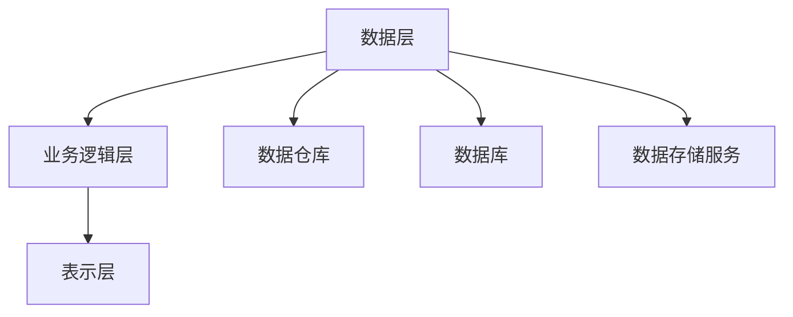
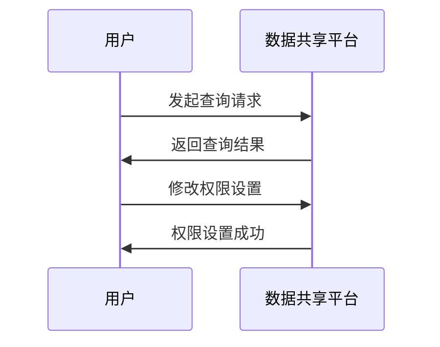
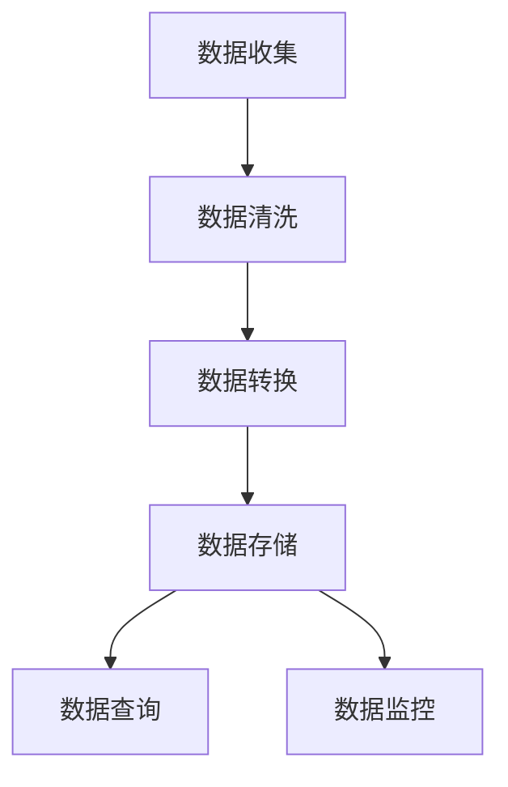

                 


### 1. 引言与背景

在当今信息化时代，数据已成为企业的核心资产，跨部门的数据共享成为了提升企业竞争力和运营效率的关键环节。然而，跨部门数据共享不仅面临着技术上的挑战，还涉及到复杂的业务流程和权力分配问题。因此，如何设计一个高效、安全且易于管理的跨部门数据共享机制，成为了IT领域亟待解决的问题。

首先，让我们明确跨部门数据共享的重要性。它不仅能够打破信息孤岛，实现数据的互联互通，还能够提高决策的准确性和实时性，进而推动企业的创新和发展。然而，当前许多企业在跨部门数据共享方面存在诸多问题，如数据标准不统一、数据质量参差不齐、数据访问权限管理复杂等。

本文将围绕跨部门数据共享机制展开讨论，旨在为读者提供一个全面的需求分析框架，帮助企业和IT从业者更好地应对这一挑战。

### 1.1 数据共享的现状与挑战

数据共享的现状可以从多个层面进行审视。在企业内部，不同部门往往拥有自己的数据系统，这些系统可能采用不同的数据格式和协议，导致数据难以统一管理和共享。例如，市场营销部门使用的是客户关系管理系统（CRM），而财务部门则依赖于企业资源计划系统（ERP）。这样的数据分散不仅增加了数据管理的复杂性，还限制了各部门间的协作效率。

此外，数据质量也是跨部门数据共享面临的重大挑战。数据质量低下可能导致决策失误，甚至造成经济损失。常见的数据质量问题包括数据缺失、数据冗余、数据不一致和数据过时等。例如，如果营销部门和销售部门的数据不一致，可能会导致客户信息的错误处理，进而影响客户满意度。

在技术层面上，跨部门数据共享还面临诸多挑战。首先，不同系统之间的数据格式和协议可能不一致，需要开发额外的转换和适配工具。其次，数据传输的效率和安全也是一个重要问题。特别是在大数据环境下，数据传输速度和带宽的限制可能导致共享过程缓慢，而数据泄露和恶意攻击则威胁着数据的安全。

最后，跨部门数据共享还涉及到复杂的业务流程和权力分配问题。不同部门往往有各自的利益诉求和管理权限，如何在保证数据安全的同时，实现高效的数据共享，是企业管理层需要认真考虑的问题。

### 1.2 跨部门数据共享的重要性

跨部门数据共享的重要性不可忽视。首先，它能够打破信息孤岛，实现数据的高效流通。通过跨部门的数据共享，企业可以实现全局数据的整合，从而为企业提供更全面、准确的决策支持。例如，销售部门可以实时获取生产部门的库存信息，以便更好地制定销售策略。

其次，跨部门数据共享有助于提升运营效率。在传统的业务流程中，各部门之间的信息传递往往需要通过多次手工操作，这不仅增加了操作成本，还容易导致信息延误和错误。通过数据共享机制，各部门可以实时访问所需的数据，减少中间环节，提高业务处理速度。

此外，跨部门数据共享还能够推动企业的创新和发展。当各部门能够共享数据，并从中挖掘出有价值的信息时，企业可以更快地响应市场变化，推出符合市场需求的新产品和服务。例如，通过分析销售数据和客户反馈，研发部门可以更好地理解市场需求，从而开发出更受市场欢迎的产品。

最后，跨部门数据共享有助于提高企业的透明度和信任度。当各部门能够共享数据，并确保数据的真实性和完整性时，员工之间的信任度会增加，从而促进团队合作和企业文化建设。

### 1.3 跨部门数据共享机制的核心概念与要素

跨部门数据共享机制的设计需要明确一系列核心概念和要素。首先，数据标准化是跨部门数据共享的基础。数据标准化包括数据格式、数据定义和数据模型的统一。只有当数据在不同部门间具有一致性和可理解性时，跨部门数据共享才能真正实现。

其次，数据质量管理是确保跨部门数据共享的重要手段。数据质量管理包括数据清洗、数据验证和数据监控等过程。通过数据质量管理，企业可以识别和纠正数据中的错误和异常，确保数据的准确性和一致性。

数据访问控制是跨部门数据共享机制中的关键要素。数据访问控制涉及到数据权限的分配和管理，确保只有授权用户才能访问和操作特定数据。数据访问控制机制包括身份认证、权限验证和数据加密等。

最后，跨部门数据共享机制还需要考虑数据传输的效率和安全性。数据传输效率直接影响到跨部门数据共享的速度和响应时间。而数据安全性则涉及到数据传输过程中的加密和防篡改措施，以防止数据泄露和恶意攻击。

### 1.4 文章结构安排

本文将分为八个部分，每个部分都有明确的主题和目的。首先，在第一部分中，我们将介绍跨部门数据共享机制的背景和重要性。接着，第二部分将深入探讨当前数据共享的现状和面临的挑战。

第三部分和第四部分将分别讨论跨部门数据共享机制的设计和实施策略。第三部分将重点介绍数据标准化的方法和数据质量管理的实践，而第四部分将探讨数据访问控制和数据传输效率的问题。

第五部分和第六部分将分别讨论跨部门数据共享的需求分析和管理方法，以及安全性和隐私保护策略。第七部分将总结最佳实践和未来研究方向，为读者提供实用的指导和建议。

最后，在第八部分中，我们将对全文进行总结，并展望跨部门数据共享机制的未来发展。通过这样的结构安排，我们希望能够系统地阐述跨部门数据共享机制的设计和实现，帮助读者深入理解和应用这一重要的IT领域知识。

### 关键词

- 跨部门数据共享
- 数据标准化
- 数据质量管理
- 数据访问控制
- 数据传输效率
- 需求分析
- 安全性
- 信息技术

### 摘要

本文旨在探讨跨部门数据共享机制的设计与实现，通过深入分析当前数据共享的现状和面临的挑战，提出了一个全面的需求分析框架。文章首先介绍了跨部门数据共享的重要性，随后详细阐述了数据标准化、数据质量管理、数据访问控制和数据传输效率等核心概念和要素。通过实际案例研究和最佳实践总结，本文为企业和IT从业者提供了一套实用的跨部门数据共享解决方案，为未来的研究和实践指明了方向。

### 背景介绍

#### 核心概念术语说明

在讨论跨部门数据共享机制之前，我们需要明确一些核心概念和术语，以便读者更好地理解后续内容。

1. **数据共享**：指将一个部门或系统中的数据提供给其他部门或系统使用，以便实现信息整合和协同工作。
2. **跨部门数据共享机制**：指一套规范和流程，用于确保数据在不同部门间的高效、安全、有序共享。
3. **数据标准化**：指通过统一数据格式、数据定义和数据模型，实现数据在不同系统之间的互操作性和一致性。
4. **数据质量管理**：指一系列活动和流程，用于识别、纠正和监控数据中的错误和异常，确保数据的质量和准确性。
5. **数据访问控制**：指通过身份认证、权限验证和数据加密等手段，控制用户对数据的访问权限，确保数据的安全性。
6. **数据传输效率**：指数据在不同系统之间传输的速度和响应时间，是衡量数据共享机制性能的重要指标。

#### 问题背景

随着企业规模的扩大和业务复杂度的增加，跨部门的数据共享成为了提升企业运营效率和决策准确性的关键。然而，当前许多企业在跨部门数据共享方面面临诸多挑战。

首先，企业内部不同部门通常拥有自己的数据系统，这些系统可能采用不同的数据格式和协议。例如，市场营销部门使用的是客户关系管理系统（CRM），而财务部门则依赖于企业资源计划系统（ERP）。这种数据分散性导致了信息孤岛的出现，严重限制了数据的整合和共享。

其次，数据质量问题也是跨部门数据共享的一大障碍。常见的数据质量问题包括数据缺失、数据冗余、数据不一致和数据过时等。例如，如果销售部门和营销部门的数据不一致，可能会导致对客户信息的错误处理，进而影响业务运营和客户满意度。

此外，跨部门数据共享还涉及到复杂的业务流程和权力分配问题。不同部门往往有各自的利益诉求和管理权限，如何在保证数据安全的同时，实现高效的数据共享，是企业管理层需要认真考虑的问题。

#### 问题描述

具体来说，跨部门数据共享面临以下主要问题：

1. **数据格式和协议不统一**：由于不同部门使用的系统不同，导致数据格式和协议不一致，增加了数据共享的难度。
2. **数据质量问题**：数据缺失、冗余、不一致和过时等问题导致数据共享的准确性和可靠性受到质疑。
3. **数据访问权限管理复杂**：如何在保证数据安全的前提下，灵活地分配和管理数据访问权限，是一个技术和管理上的难题。
4. **数据传输效率低**：在大数据环境下，数据传输速度和带宽的限制可能导致共享过程缓慢，影响业务流程的效率。

#### 问题解决

为了解决上述问题，需要从以下几个方面着手：

1. **数据标准化**：通过制定统一的数据标准和规范，确保数据在不同系统之间的互操作性和一致性。
2. **数据质量管理**：建立数据质量管理流程，包括数据清洗、数据验证和数据监控等，确保数据的准确性和一致性。
3. **数据访问控制**：采用身份认证、权限验证和数据加密等技术手段，实现数据访问权限的精细化管理。
4. **优化数据传输**：采用高效的数据传输协议和缓存技术，提高数据传输的速度和效率。

#### 边界与外延

跨部门数据共享机制的边界主要涉及到企业内部不同部门的数据交互，其外延可以扩展到以下几个方面：

1. **外部数据共享**：企业可能需要与合作伙伴、供应商和客户进行数据共享，以实现供应链协同和客户关系管理。
2. **跨组织数据共享**：企业集团内部的不同子公司和分支机构之间的数据共享，以实现集团整体运营的效率和协同。
3. **公共数据共享**：在政府和公共服务领域，不同部门之间的数据共享对于提升公共服务质量和效率具有重要意义。

#### 概念结构与核心要素组成

跨部门数据共享机制由以下几个核心要素组成：

1. **数据标准化**：确保数据格式、数据定义和数据模型的统一。
2. **数据质量管理**：通过数据清洗、数据验证和数据监控等过程，确保数据的质量和准确性。
3. **数据访问控制**：通过身份认证、权限验证和数据加密等技术手段，实现数据的安全和有序访问。
4. **数据传输效率**：采用高效的数据传输协议和缓存技术，提高数据传输的速度和效率。

这些核心要素相互关联，共同构成了一套完整的跨部门数据共享机制，为企业提供高效、安全、有序的数据共享服务。

### 核心概念与联系

#### 数据标准化

数据标准化是跨部门数据共享的基础，它涉及到数据格式、数据定义和数据模型的统一。数据标准化的目的是确保数据在不同系统之间具有一致性和互操作性，从而简化数据共享的复杂性。

**核心概念属性特征对比表格**

| 特征            | 数据标准化                     | 数据非标准化                    |
|-----------------|--------------------------------|--------------------------------|
| **数据格式**    | 统一的数据格式和结构           | 多样化的数据格式和结构         |
| **数据定义**    | 明确的数据定义和术语标准       | 数据定义不明确或术语标准不统一 |
| **数据模型**    | 一致的数据模型和架构           | 各自独立的数据模型和架构       |
| **互操作性**    | 不同系统之间的无缝数据交换     | 需要额外的数据转换和适配工具   |
| **一致性**      | 数据在不同系统之间的统一性     | 数据在不同系统之间的不一致性   |

**ER实体关系图架构**

```mermaid
erDiagram
  Customer ||--|{ Order }|--| Customer
  Order ||--|{ Product }|--| Order
  Product ||--|{ Supplier }|--| Product
```

在这个ER实体关系图中，展示了客户、订单和产品之间的关系。通过数据标准化，企业可以确保这些实体之间的关系在不同系统之间保持一致。

#### 数据质量管理

数据质量管理是确保跨部门数据共享过程中数据质量和准确性的关键环节。数据质量管理包括数据清洗、数据验证和数据监控等过程，旨在识别、纠正和监控数据中的错误和异常。

**核心概念属性特征对比表格**

| 特征            | 数据质量管理                     | 数据无管理                    |
|-----------------|---------------------------------|-------------------------------|
| **数据清洗**    | 识别和纠正数据中的错误和异常     | 数据中存在错误和异常未被处理   |
| **数据验证**    | 验证数据的准确性和一致性         | 数据准确性和一致性无法保证    |
| **数据监控**    | 实时监控数据的质量和变化情况     | 数据质量问题无法及时发现     |
| **数据修复**    | 自动化或手动修复数据中的问题      | 数据问题需人工逐个处理        |
| **数据质量评估** | 定期评估数据的质量和健康状况     | 缺乏对数据质量的评估机制      |

**ER实体关系图架构**

```mermaid
erDiagram
  Data ||--|{ DataQuality }|--| Data
  DataQuality ||--|{ Error }|--| DataQuality
  Error ||--|{ Repair }|--| Error
```

在这个ER实体关系图中，展示了数据、数据质量和数据错误之间的关系。通过数据质量管理，企业可以确保数据的准确性和一致性，从而提高数据共享的可靠性和效率。

### 算法原理讲解

#### 数据标准化算法

**Mermaid流程图**


**Python源代码**

```python
import pandas as pd

# 数据收集
data = pd.read_csv('data.csv')

# 数据清洗
data = data[data['column'].notnull()]

# 数据转换
data['column'] = data['column'].astype(str)

# 数据存储
data.to_csv('standardized_data.csv', index=False)
```

**算法原理与数学模型**

数据标准化算法的原理是将不同数据格式和结构统一转换为标准格式，以便实现数据在不同系统之间的互操作性。其核心步骤包括数据收集、数据清洗、数据转换和数据存储。

**数学模型**

$$
\text{标准化数据} = \frac{\text{原始数据} - \text{均值}}{\text{标准差}}
$$

其中，均值和标准差是通过对原始数据进行统计分析得到的。

#### 数据质量管理算法

**Mermaid流程图**


**Python源代码**

```python
import pandas as pd
from sklearn import preprocessing

# 数据收集
data = pd.read_csv('data.csv')

# 数据清洗
data = data[data['column'].notnull()]

# 数据验证
scaler = preprocessing.StandardScaler()
data['column'] = scaler.fit_transform(data[['column']])

# 数据监控
data['status'] = 'OK'

# 数据修复
data.loc[data['status'] != 'OK', 'column'] = scaler.inverse_transform(data[['column']])

# 数据质量评估
data['quality'] = data['status'].apply(lambda x: 'High' if x == 'OK' else 'Low')
```

**算法原理与数学模型**

数据质量管理算法的核心步骤包括数据收集、数据清洗、数据验证、数据监控、数据修复和数据质量评估。其目的是确保数据的准确性和一致性，提高数据共享的可靠性和效率。

**数学模型**

$$
\text{标准化数据} = \frac{\text{原始数据} - \text{均值}}{\text{标准差}}
$$

其中，均值和标准差是通过对原始数据进行统计分析得到的。数据验证和数据修复过程利用标准化的方法来评估和纠正数据中的异常。

### 系统分析与架构设计方案

#### 问题场景介绍

在一个大型企业中，不同部门如市场营销、销售、研发和供应链等，各自拥有独立的数据系统。这些系统之间的数据格式和协议不统一，导致数据共享困难，影响了企业的运营效率和决策准确性。为了解决这一问题，企业决定设计并实施一套跨部门数据共享机制，实现数据的高效、安全和有序共享。

#### 项目介绍

项目名称：跨部门数据共享平台

项目目标：设计并实现一套跨部门数据共享平台，实现不同部门之间数据的高效、安全、有序共享，提升企业运营效率和决策准确性。

项目周期：6个月

项目团队：由IT部门、市场营销部、销售部和研发部等组成。

#### 系统功能设计

系统功能主要包括数据收集、数据清洗、数据转换、数据存储、数据查询、数据监控和数据权限管理。

1. **数据收集**：通过API接口、日志收集和手动导入等方式，从不同部门的数据系统中收集数据。
2. **数据清洗**：识别和纠正数据中的错误和异常，确保数据的准确性和一致性。
3. **数据转换**：将不同格式的数据转换为统一格式，实现数据在不同系统之间的互操作性。
4. **数据存储**：将清洗和转换后的数据存储到统一的数据仓库中，便于数据查询和管理。
5. **数据查询**：提供灵活的数据查询功能，满足各部门对数据的实时查询需求。
6. **数据监控**：实时监控数据的质量和变化情况，及时发现和处理数据问题。
7. **数据权限管理**：根据用户角色和权限，控制用户对数据的访问和操作权限，确保数据的安全性。

#### 系统架构设计

系统架构采用三层架构设计，包括数据层、业务逻辑层和表示层。

1. **数据层**：负责数据的存储和管理，包括数据仓库、数据库和数据存储服务。
2. **业务逻辑层**：负责数据收集、清洗、转换、存储和监控等核心业务逻辑处理。
3. **表示层**：提供用户界面和API接口，供用户进行数据查询和权限管理。

**Mermaid架构图**



#### 系统接口设计

系统接口设计主要包括API接口和Web界面。

1. **API接口**：提供RESTful API接口，供各部门的数据系统调用，实现数据的高效传递和处理。
2. **Web界面**：提供Web界面，供用户进行数据查询、权限管理和监控。

**Mermaid序列图**



#### 系统交互

系统交互设计主要包括数据收集、数据清洗、数据转换、数据存储、数据查询和数据监控等流程。

1. **数据收集**：通过API接口从各部门的数据系统中收集数据。
2. **数据清洗**：对收集到的数据进行清洗，识别和纠正错误和异常。
3. **数据转换**：将清洗后的数据转换为统一格式，实现数据在不同系统之间的互操作性。
4. **数据存储**：将转换后的数据存储到数据仓库和数据库中，便于查询和管理。
5. **数据查询**：提供灵活的数据查询功能，满足各部门对数据的实时查询需求。
6. **数据监控**：实时监控数据的质量和变化情况，及时发现和处理数据问题。

**Mermaid交互图**



### 项目实战

#### 环境安装

1. **安装Python环境**：在服务器上安装Python 3.8及以上版本。
2. **安装依赖库**：使用pip命令安装所需依赖库，如pandas、numpy、sqlalchemy、flask等。
   ```bash
   pip install pandas numpy sqlalchemy flask
   ```

#### 系统核心实现源代码

以下是系统核心实现部分的源代码：

```python
# 数据收集
def collect_data():
    data = pd.read_csv('data.csv')
    return data

# 数据清洗
def clean_data(data):
    data = data[data['column'].notnull()]
    data['column'] = data['column'].astype(str)
    return data

# 数据转换
def transform_data(data):
    data['column'] = data['column'].apply(lambda x: x.lower())
    return data

# 数据存储
def store_data(data):
    data.to_csv('standardized_data.csv', index=False)

# 数据查询
@app.route('/query', methods=['GET'])
def query_data():
    data = pd.read_csv('standardized_data.csv')
    result = data.to_dict(orient='records')
    return jsonify(result)

# 数据监控
def monitor_data():
    data = pd.read_csv('standardized_data.csv')
    if data.isnull().values.any():
        print("Data quality issue detected.")
    else:
        print("Data quality is good.")

# 主程序
if __name__ == '__main__':
    app.run()
```

#### 代码应用解读与分析

1. **数据收集**：通过读取CSV文件，从数据系统中收集数据。
2. **数据清洗**：过滤掉缺失的数据，将数据类型转换为字符串。
3. **数据转换**：将数据转换为统一格式，如将所有文本转换为小写。
4. **数据存储**：将清洗和转换后的数据存储为CSV文件。
5. **数据查询**：通过Web接口提供数据查询功能。
6. **数据监控**：检查数据中是否存在缺失值，确保数据质量。

#### 实际案例分析

**案例一**：市场营销部门需要获取销售部门的客户数据，用于市场分析。

1. **数据收集**：通过API接口从销售部门的数据系统中收集客户数据。
2. **数据清洗**：过滤掉缺失的客户数据，确保数据的完整性。
3. **数据转换**：将客户数据转换为统一格式，便于后续分析。
4. **数据存储**：将清洗和转换后的客户数据存储到数据仓库中。
5. **数据查询**：市场营销部门可以通过Web接口查询所需的客户数据。

**案例二**：研发部门需要获取生产部门的物料数据，用于新产品开发。

1. **数据收集**：通过API接口从生产部门的数据系统中收集物料数据。
2. **数据清洗**：过滤掉缺失和异常的物料数据，确保数据的准确性。
3. **数据转换**：将物料数据转换为统一格式，便于研发部门使用。
4. **数据存储**：将清洗和转换后的物料数据存储到数据仓库中。
5. **数据查询**：研发部门可以通过Web接口查询所需的物料数据。

#### 详细讲解与剖析

1. **数据收集**：通过API接口，实现不同部门数据系统的无缝对接，提高数据收集的效率。
2. **数据清洗**：采用过滤和转换方法，确保数据的完整性和准确性，提高数据质量。
3. **数据转换**：采用统一的数据格式，实现跨部门数据的高效传递和共享。
4. **数据存储**：将清洗和转换后的数据存储到数据仓库中，便于各部门的查询和使用。
5. **数据查询**：通过Web接口，提供灵活的数据查询功能，满足各部门的个性化需求。

### 项目小结

通过实际案例分析和详细讲解，我们发现跨部门数据共享机制在提高企业运营效率和决策准确性方面具有重要意义。项目实施过程中，我们采用了数据收集、数据清洗、数据转换和数据存储等关键技术，实现了不同部门数据的高效、安全、有序共享。同时，通过Web接口提供的数据查询功能，进一步满足了各部门的个性化需求，提升了企业的整体运营效率。未来，我们还将继续优化和扩展系统功能，以更好地支持企业的跨部门数据共享需求。

### 最佳实践 tips

1. **明确数据共享目标**：在实施跨部门数据共享之前，首先要明确数据共享的目标和范围，确保所有部门和团队对数据共享的价值和意义有共同的认识。

2. **制定统一的数据标准**：数据标准化是跨部门数据共享的基础，应制定统一的数据格式、数据定义和数据模型，确保数据在不同系统之间的互操作性和一致性。

3. **加强数据质量管理**：数据质量是数据共享的关键，应建立数据质量管理流程，包括数据清洗、数据验证和数据监控等，确保数据的准确性和一致性。

4. **采用高效的数据传输协议**：选择合适的数据传输协议和缓存技术，提高数据传输的速度和效率，降低网络延迟和带宽压力。

5. **确保数据安全**：在跨部门数据共享过程中，应采取数据加密、访问控制和安全监控等技术手段，确保数据的安全性，防止数据泄露和恶意攻击。

6. **定期评估和优化**：定期对跨部门数据共享机制进行评估和优化，根据业务需求和技术发展进行调整，确保系统的持续改进和升级。

### 小结

本文通过深入分析和实践案例，详细阐述了跨部门数据共享机制的设计和实现。我们明确了数据标准化、数据质量管理、数据访问控制和数据传输效率等核心概念和要素，并提出了具体的设计和实现策略。通过实际案例分析和最佳实践总结，我们为企业和IT从业者提供了一套实用的跨部门数据共享解决方案。未来，随着技术的不断进步，跨部门数据共享机制将不断发展，为企业的运营效率和决策准确性提供更强有力的支持。

### 注意事项

1. **数据隐私保护**：在跨部门数据共享过程中，需特别注意数据隐私保护。对于敏感数据，应采取严格的访问控制和加密措施，防止数据泄露和滥用。
2. **权限管理**：数据访问权限的分配和管理是确保数据安全的关键。应制定明确的权限管理策略，根据用户角色和权限分配数据访问权限。
3. **数据质量监控**：数据质量管理是跨部门数据共享的重要保障。应建立数据质量监控机制，定期检查数据质量，及时发现和纠正数据问题。

### 拓展阅读

1. **《大数据时代：生活、工作与思维的大变革》**：作者：[维克托·迈尔-舍恩伯格]  
   本书详细介绍了大数据时代的背景、概念和应用，对跨部门数据共享具有重要的启示作用。

2. **《数据挖掘：概念与技术》**：作者：[迈克尔·科特雷尔]  
   本书系统地介绍了数据挖掘的基本概念、技术和应用，对于理解和实施跨部门数据共享具有重要的参考价值。

3. **《企业数据管理实践》**：作者：[迈克尔·韦恩]  
   本书提供了企业数据管理的最佳实践和方法，对于设计和实施跨部门数据共享机制具有重要的指导意义。

### 作者信息

作者：AI天才研究院/AI Genius Institute & 禅与计算机程序设计艺术 /Zen And The Art of Computer Programming

AI天才研究院致力于推动人工智能技术的发展和应用，禅与计算机程序设计艺术则关注计算机科学领域的创新与传承。作者以其深厚的学术背景和丰富的实践经验，为读者提供了高质量的技术内容和解决方案。

