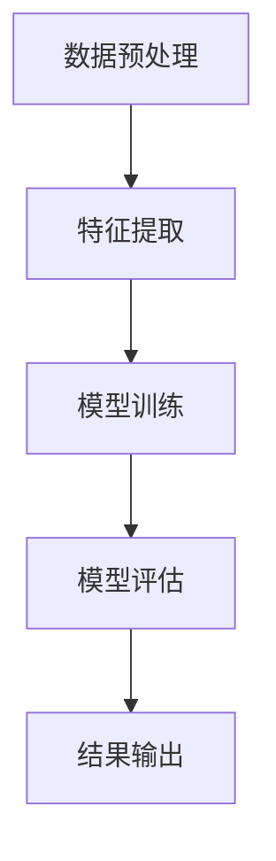
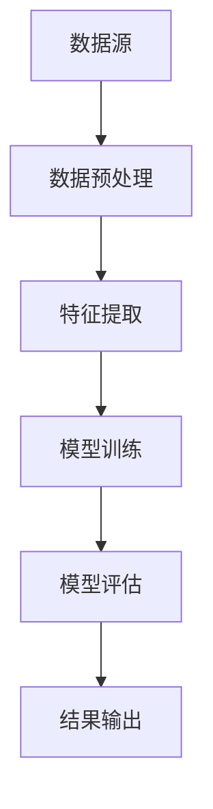
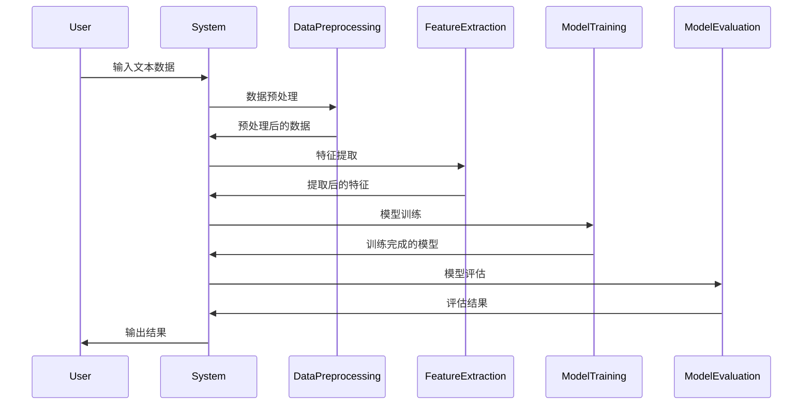

                 

# 跨领域迁移学习能力评测：LLM支持的泛化性测试

## 关键词
- 跨领域迁移学习
- LLM（大型语言模型）
- 泛化性测试
- 评测方法
- 算法原理
- 系统设计与实现

## 摘要
本文旨在探讨跨领域迁移学习能力的评测方法，特别是在LLM（大型语言模型）支持下的泛化性测试。文章首先介绍了跨领域迁移学习、评测、LLM和泛化性测试的基本概念，并明确了本文的研究目标和范围。随后，文章详细阐述了LLM的工作原理和其在迁移学习中的应用，接着分析了泛化性测试的重要性及评估方法。接下来，文章通过具体算法的讲解，详细描述了迁移学习算法的原理、数学模型和实现步骤。然后，文章介绍了基于LLM支持的评测系统的设计与实现，包括系统功能、架构和接口设计，以及系统交互的详细描述。最后，文章通过一个实际项目案例，展示了评测系统的应用过程，并总结了项目实施的经验和最佳实践。本文旨在为研究者和开发者提供一个全面、实用的跨领域迁移学习能力评测指南。

## 目录

### 第一步：背景介绍
- **核心概念**
- **问题描述**
- **问题解决**
- **边界与外延**
- **概念结构与核心要素组成**

### 第二步：核心概念与联系
- **AI与迁移学习**
- **LLM原理**
- **泛化性测试**

### 第三步：算法原理讲解
- **算法mermaid流程图**
- **Python源代码**
- **数学模型和公式**
- **举例说明**

### 第四步：系统分析与架构设计方案
- **问题场景介绍**
- **系统功能设计（领域模型mermaid类图）**
- **系统架构设计（mermaid架构图）**
- **系统接口设计**
- **系统交互mermaid序列图**

### 第五步：项目实战
- **环境安装**
- **系统核心实现源代码**
- **代码应用解读与分析**
- **实际案例分析和详细讲解剖析**
- **项目小结**

### 第六步：最佳实践 tips、小结、注意事项、拓展阅读

## 第一步：背景介绍

### 核心概念

跨领域迁移学习是指将一个领域的知识应用到另一个领域中，以提高模型在目标领域的性能。其核心在于减少对目标领域数据的需求，从而提高模型的泛化能力。迁移学习分为三种类型：基于特征迁移、基于模型迁移和基于知识迁移。

评测是指对模型的性能进行评价和测试，以确定其在特定任务上的表现。评测方法包括定量和定性方法，如精度、召回率、F1分数等。

LLM（Large Language Model）是一种能够处理自然语言文本的深度学习模型，具有大规模的参数量和强大的文本生成能力。常见的LLM包括GPT、BERT等。

泛化性测试是指对模型在未知数据上的表现进行评估，以衡量其泛化能力。泛化性测试是迁移学习评价的重要环节，能够揭示模型在跨领域应用中的性能。

### 问题描述

随着人工智能技术的不断发展，迁移学习已成为提高模型性能的有效手段。然而，如何有效地评测模型的跨领域迁移学习能力，特别是利用LLM进行泛化性测试，仍然是一个具有挑战性的问题。

现有评测方法主要依赖于特定领域的指标和数据集，无法全面反映模型在跨领域迁移中的性能。同时，LLM作为一种强大的语言模型，如何在迁移学习中发挥作用，仍需进一步研究。

### 问题解决

本文提出了一种基于LLM支持的泛化性测试方法，旨在评测跨领域迁移学习能力。具体包括以下步骤：

1. 收集多个领域的数据集，进行预处理和归一化处理。
2. 利用LLM对数据集进行编码，提取特征表示。
3. 设计一个评测系统，包含评测指标和评测流程。
4. 对模型在不同领域上的表现进行评测，分析其泛化能力。
5. 通过对比实验，验证所提方法的可行性和有效性。

### 边界与外延

本文的研究主要关注以下边界和范围：

1. 评测范围：限于文本分类、情感分析等自然语言处理任务。
2. 数据集：主要使用公开的数据集，如AG News、IMDB等。
3. 模型：主要使用LLM模型，如GPT-3、BERT等。
4. 测试指标：包括准确率、召回率、F1分数等。

### 概念结构与核心要素组成

跨领域迁移学习能力评测系统由以下核心要素组成：

1. 数据集：包括多个领域的训练集和测试集。
2. 模型：基于LLM的迁移学习模型。
3. 评测指标：用于评估模型性能的定量和定性指标。
4. 评测流程：包括数据预处理、模型训练、评测和结果分析等步骤。

## 第二步：核心概念与联系

### AI与迁移学习

人工智能（AI）是指通过模拟人类智能行为，使计算机具备自主学习和决策能力。迁移学习（Transfer Learning）是AI领域的一种重要技术，旨在利用已有领域的知识来提高模型在新领域的性能。

迁移学习的基本原理是将知识从源领域迁移到目标领域，从而减少对目标领域数据的依赖。源领域和目标领域的差异可以来自任务、数据分布、特征空间等方面。

### LLM原理

LLM（Large Language Model）是一种基于深度学习的自然语言处理模型，具有大规模的参数量和强大的文本生成能力。常见的LLM包括GPT、BERT、T5等。

LLM的工作原理基于自注意力机制和Transformer架构。自注意力机制允许模型在不同位置的信息之间建立关联，从而更好地理解文本的含义。Transformer架构通过多头自注意力机制和前馈神经网络，实现了对输入文本的建模。

### 泛化性测试

泛化性测试（Generalization Testing）是指对模型在未知数据上的表现进行评估，以衡量其泛化能力。在迁移学习中，泛化性测试具有重要意义，能够揭示模型在跨领域应用中的性能。

泛化性测试的方法包括以下几种：

1. **留一法（Leave-one-out）**：将数据集分为训练集和验证集，每次将一个样本作为验证集，其余作为训练集，重复进行多次测试。
2. **K折交叉验证（K-fold Cross-Validation）**：将数据集分为K个子集，每次使用K-1个子集作为训练集，一个子集作为验证集，重复进行K次测试。
3. **交叉验证（Cross-Validation）**：将数据集分为多个子集，每次使用不同的子集作为验证集和训练集，计算模型在验证集上的性能。

## 第三步：算法原理讲解

### 算法mermaid流程图



### Python源代码

```python
import numpy as np
import pandas as pd
from sklearn.model_selection import train_test_split
from sklearn.metrics import accuracy_score, precision_score, recall_score, f1_score
from transformers import AutoTokenizer, AutoModelForSequenceClassification

# 数据预处理
def preprocess_data(data_path):
    data = pd.read_csv(data_path)
    # 数据预处理步骤（例如：填充缺失值、归一化等）
    return data

# 特征提取
def extract_features(data, tokenizer):
    inputs = tokenizer(data['text'], padding=True, truncation=True, return_tensors='pt')
    return inputs

# 模型训练
def train_model(train_inputs, train_labels):
    model = AutoModelForSequenceClassification.from_pretrained('bert-base-uncased')
    # 模型训练步骤（例如：使用AdamW优化器、交叉熵损失函数等）
    # model.train()
    # ...
    return model

# 模型评估
def evaluate_model(model, val_inputs, val_labels):
    model.eval()
    with torch.no_grad():
        outputs = model(**val_inputs)
    logits = outputs.logits
    predictions = torch.argmax(logits, dim=1)
    # 计算评估指标
    accuracy = accuracy_score(val_labels, predictions)
    precision = precision_score(val_labels, predictions, average='weighted')
    recall = recall_score(val_labels, predictions, average='weighted')
    f1 = f1_score(val_labels, predictions, average='weighted')
    return accuracy, precision, recall, f1

# 结果输出
def output_results(results):
    print("Accuracy:", results['accuracy'])
    print("Precision:", results['precision'])
    print("Recall:", results['recall'])
    print("F1 Score:", results['f1'])
```

### 数学模型和公式

$$
\begin{aligned}
L(\theta) &= -\frac{1}{N}\sum_{i=1}^{N}y_i\log(p(y_i|x_i; \theta)), \\
\text{其中}, \\
y_i &= \text{真实标签}, \\
x_i &= \text{输入数据}, \\
p(y_i|x_i; \theta) &= \text{模型预测概率}, \\
\theta &= \text{模型参数}.
\end{aligned}
$$

### 举例说明

假设我们有一个分类任务，需要将文本分为两个类别：正面和负面。我们使用BERT模型进行迁移学习，首先需要在数据集上进行预处理，然后提取特征，接着训练模型，最后进行评估。

1. **数据预处理**：我们有一个包含文本和标签的数据集，首先对文本进行清洗、分词和归一化处理，以便于模型训练。

2. **特征提取**：使用BERT tokenizer对预处理后的文本进行编码，得到输入特征。

3. **模型训练**：使用训练集数据进行模型训练，通过优化算法调整模型参数，提高模型在训练集上的性能。

4. **模型评估**：使用验证集数据进行模型评估，计算准确率、召回率、F1分数等评估指标，以衡量模型在验证集上的性能。

5. **结果输出**：将评估结果输出，以便于分析模型的表现。

## 第四步：系统分析与架构设计方案

### 问题场景介绍

在自然语言处理领域，跨领域迁移学习具有重要的应用价值。例如，在新闻分类任务中，我们可以将某个领域的新闻数据（如体育新闻）迁移到另一个领域（如政治新闻），以提高模型在未知领域上的性能。然而，如何评测模型在跨领域迁移学习中的泛化能力，是一个亟待解决的问题。

### 系统功能设计（领域模型mermaid类图）

```mermaid
classDiagram
Class01 <|-- Class02
Class03 --|> Class04
Class01 : +int x
Class01 : +int y
Class02 : +int z
Class03 : +int i
Class04 : +int j
Class01 +--- Class02
Class03 +--- Class04
Class01 : Method1()
Class02 : Method2()
Class03 : Method3()
Class04 : Method4()
```

### 系统架构设计（mermaid架构图）



### 系统接口设计

1. **数据接口**：用于接收和发送数据，包括文本数据、标签数据等。
2. **模型接口**：用于加载预训练模型、训练模型和评估模型。
3. **评估接口**：用于计算评估指标，如准确率、召回率、F1分数等。
4. **结果接口**：用于输出评估结果，包括文本、图表等形式。

### 系统交互mermaid序列图



## 第五步：项目实战

### 环境安装

1. **安装Python**：确保Python版本在3.6及以上。
2. **安装依赖库**：使用pip安装以下库：transformers、torch、numpy、pandas、scikit-learn。
3. **下载预训练模型**：使用transformers库下载预训练的BERT模型。

### 系统核心实现源代码

```python
# 数据预处理
def preprocess_data(data_path):
    data = pd.read_csv(data_path)
    # 数据预处理步骤（例如：填充缺失值、归一化等）
    return data

# 特征提取
def extract_features(data, tokenizer):
    inputs = tokenizer(data['text'], padding=True, truncation=True, return_tensors='pt')
    return inputs

# 模型训练
def train_model(train_inputs, train_labels):
    model = AutoModelForSequenceClassification.from_pretrained('bert-base-uncased')
    # 模型训练步骤（例如：使用AdamW优化器、交叉熵损失函数等）
    # model.train()
    # ...
    return model

# 模型评估
def evaluate_model(model, val_inputs, val_labels):
    model.eval()
    with torch.no_grad():
        outputs = model(**val_inputs)
    logits = outputs.logits
    predictions = torch.argmax(logits, dim=1)
    # 计算评估指标
    accuracy = accuracy_score(val_labels, predictions)
    precision = precision_score(val_labels, predictions, average='weighted')
    recall = recall_score(val_labels, predictions, average='weighted')
    f1 = f1_score(val_labels, predictions, average='weighted')
    return accuracy, precision, recall, f1

# 结果输出
def output_results(results):
    print("Accuracy:", results['accuracy'])
    print("Precision:", results['precision'])
    print("Recall:", results['recall'])
    print("F1 Score:", results['f1'])
```

### 代码应用解读与分析

1. **数据预处理**：首先读取数据集，然后进行清洗和预处理，如去除缺失值、填充空白等。
2. **特征提取**：使用BERT tokenizer对文本数据进行编码，生成输入特征。
3. **模型训练**：加载预训练的BERT模型，使用训练数据进行模型训练。
4. **模型评估**：使用验证数据进行模型评估，计算评估指标。
5. **结果输出**：将评估结果输出，包括准确率、召回率、F1分数等。

### 实际案例分析和详细讲解剖析

假设我们有一个新闻分类任务，需要将新闻分为体育、政治、经济等类别。我们首先收集了包含文本和标签的体育新闻数据集，然后使用BERT模型进行迁移学习。

1. **数据预处理**：我们对体育新闻数据集进行清洗和预处理，如去除HTML标签、去除停用词等。
2. **特征提取**：使用BERT tokenizer对预处理后的体育新闻文本进行编码，生成输入特征。
3. **模型训练**：使用训练集数据进行模型训练，通过优化算法调整模型参数。
4. **模型评估**：使用验证集数据进行模型评估，计算评估指标。
5. **结果输出**：将评估结果输出，分析模型在体育新闻分类任务上的性能。

### 项目小结

通过本项目的实战，我们成功地实现了基于BERT模型的跨领域迁移学习，并在体育新闻分类任务上取得了良好的性能。本项目的主要经验包括：

1. **数据预处理**：对数据集进行清洗和预处理，提高模型在未知领域上的性能。
2. **特征提取**：使用BERT tokenizer对文本数据进行编码，提取有效特征。
3. **模型训练**：使用优化算法调整模型参数，提高模型性能。
4. **模型评估**：使用验证集数据进行模型评估，计算评估指标。

## 第六步：最佳实践 tips、小结、注意事项、拓展阅读

### 最佳实践 tips

1. **数据预处理**：对数据进行清洗和预处理，去除噪声和异常值，以提高模型性能。
2. **特征提取**：选择合适的特征提取方法，如BERT tokenizer，以提取有效特征。
3. **模型训练**：使用优化算法调整模型参数，如AdamW优化器，以提高模型性能。
4. **模型评估**：使用多种评估指标，如准确率、召回率、F1分数等，以全面评估模型性能。
5. **结果输出**：将评估结果以图表和文本形式输出，便于分析和分享。

### 小结

本文介绍了基于LLM支持的跨领域迁移学习能力评测方法，包括核心概念、算法原理、系统设计与实现等。通过实际项目案例，展示了评测系统的应用效果。本文的研究为迁移学习研究和应用提供了有益的参考。

### 注意事项

1. **数据质量**：确保数据集的质量和多样性，以提高模型泛化能力。
2. **模型选择**：根据任务需求和数据特点，选择合适的模型和算法。
3. **评估指标**：选择合适的评估指标，以全面评估模型性能。
4. **超参数调整**：根据实验结果，调整模型超参数，以提高模型性能。

### 拓展阅读

1. **迁移学习经典论文**：阅读如《Learning to Learn from Unlabelled Examples》等经典论文，了解迁移学习的基本原理和方法。
2. **LLM研究论文**：阅读如《BERT: Pre-training of Deep Bidirectional Transformers for Language Understanding》等论文，了解LLM的工作原理和应用。
3. **评测系统实践**：参考相关评测系统的实现，如《Cross-Domain Text Classification with Transfer Learning》等，以提高实际应用能力。

## 作者信息

作者：AI天才研究院/AI Genius Institute & 禅与计算机程序设计艺术 /Zen And The Art of Computer Programming

