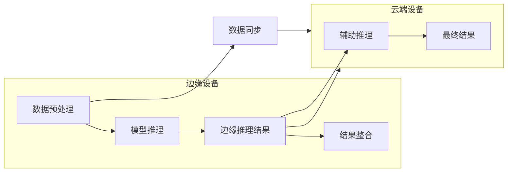
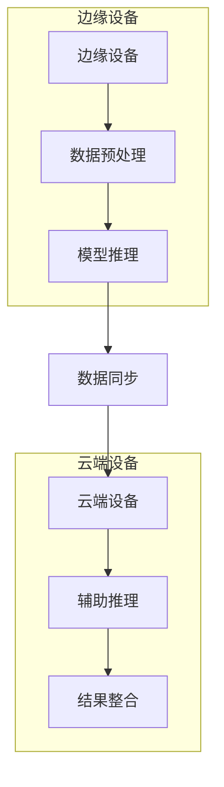
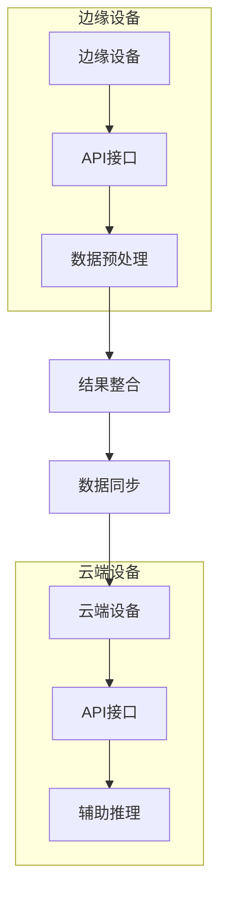

                 


# 边缘AI架构提升LLM应用的响应速度

## 关键词：边缘AI、LLM、架构设计、响应速度、优化策略

## 摘要：
本文将探讨边缘AI架构在提升大型语言模型（LLM）应用响应速度方面的关键作用。首先，我们介绍边缘AI和LLM的基本概念，分析其在当前应用中面临的性能瓶颈。随后，本文将详细阐述如何通过架构优化来提升LLM的响应速度，包括算法原理讲解、系统设计与实践、项目实战及最佳实践。通过这些步骤，读者将了解边缘AI架构在LLM应用中的实际应用价值，并掌握相应的优化策略。

## 背景介绍

### 边缘AI概述

边缘AI是一种将计算能力部署在靠近数据源的边缘设备上的技术。与传统的云计算不同，边缘AI专注于在本地处理数据，从而减少了数据传输的延迟，提高了系统的响应速度。边缘AI的基本概念包括以下几个关键点：

1. **边缘设备**：这些设备包括物联网设备、智能手机、平板电脑、专用设备等，具有处理数据的能力。
2. **边缘计算**：在边缘设备上执行数据处理和分析，以减轻云端的负担。
3. **边缘网络**：连接边缘设备和云端的网络架构，用于数据传输和协同工作。

边缘计算与云计算的区别在于数据处理的地点和规模。云计算将大量数据集中到数据中心进行处理，而边缘计算则将数据处理分散到边缘设备上，从而实现更高效、更快速的数据处理。

### 边缘AI的应用场景

边缘AI在多个领域有着广泛的应用，包括：

1. **物联网**：边缘AI可以实时分析物联网设备产生的海量数据，实现智能监控和预测维护。
2. **智能交通**：通过边缘AI处理交通流量数据，实现智能交通管理，减少拥堵。
3. **智能医疗**：边缘AI可以在医疗设备上实时分析医疗数据，协助医生做出诊断和决策。
4. **智能零售**：通过边缘AI分析客户行为数据，实现个性化推荐和智能营销。

### LLM应用现状

大型语言模型（LLM）是一种能够理解和生成自然语言文本的复杂模型。LLM的应用范围广泛，包括自然语言处理（NLP）、机器翻译、文本生成、问答系统等。然而，LLM的应用也面临着一些挑战：

1. **计算资源需求**：LLM通常需要大量的计算资源和存储空间，尤其是大型模型，如GPT-3。
2. **延迟问题**：由于数据需要传输到云端进行模型推理，LLM应用的响应速度往往较慢。
3. **数据安全与隐私**：在将敏感数据传输到云端时，存在数据泄露和安全风险。

### 边缘AI与LLM的结合

边缘AI与LLM的结合，旨在通过在边缘设备上部署部分LLM模型，减少数据传输延迟，提高响应速度。这种结合的优势在于：

1. **减少延迟**：将模型部署在靠近数据源的边缘设备上，可以显著减少数据传输的延迟。
2. **降低带宽需求**：通过在边缘设备上进行部分数据处理，减少需要传输到云端的数据量。
3. **提高安全性**：部分数据在边缘设备上处理，可以减少数据泄露的风险。

然而，这种结合也面临着一些挑战：

1. **计算资源限制**：边缘设备的计算资源相对有限，可能无法支持大型LLM模型。
2. **数据一致性**：如何在边缘设备和云端之间保持数据的一致性是一个挑战。
3. **网络不稳定**：边缘设备连接的网络可能不稳定，会影响模型的表现。

## 核心概念与联系

### 边缘AI与LLM的结合原理

边缘AI与LLM的结合原理主要包括以下几个关键点：

1. **模型拆分**：将LLM模型拆分为两部分，一部分部署在云端，另一部分部署在边缘设备上。云端部分负责处理复杂的计算任务，边缘部分负责处理简单的计算任务。
2. **协同工作**：边缘设备和云端设备通过边缘网络进行协同工作，实现数据的实时传输和模型推理。
3. **数据同步**：通过加密和分布式存储技术，确保边缘设备和云端之间的数据同步。

### 边缘AI与LLM的优势对比

边缘AI与LLM的优势对比可以总结如下：

| 对比项 | 边缘AI | LLM |
| :----: | :----: | :----: |
| **延迟** | 较低 | 较高 |
| **带宽需求** | 较低 | 较高 |
| **计算资源** | 有限 | 丰富 |
| **安全性** | 较高 | 较低 |
| **灵活性** | 较高 | 较低 |

通过表格，我们可以看出边缘AI和LLM各自的优势和劣势，为后续的架构设计提供了参考。

### 边缘AI与LLM的ER实体关系图

为了更清晰地理解边缘AI与LLM之间的实体关系，我们可以使用ER（实体关系）图来描述。以下是ER图的Mermaid格式表示：

```mermaid
erDiagram
 边缘设备 ||--|{ 数据 }|| 云端设备
 边缘设备 ||--|{ 模型 }|| LLM模型
 云端设备 ||--|{ 模型 }|| LLM模型
```

在ER图中，边缘设备和云端设备通过数据传输和模型推理实现协同工作，LLM模型被拆分部署在两者之上。

## 算法原理讲解

### 响应速度提升算法的基本原理

为了提升LLM应用的响应速度，我们可以采用以下响应速度提升算法：

1. **模型压缩**：通过模型压缩技术，将大型LLM模型压缩为更小、更高效的模型。模型压缩可以通过剪枝、量化、蒸馏等方法实现。
2. **模型拆分**：将LLM模型拆分为云端和边缘两部分，云端部分负责复杂计算，边缘部分负责简单计算。
3. **数据同步**：通过加密和分布式存储技术，确保边缘设备和云端之间的数据一致性。

### 算法的工作流程

响应速度提升算法的工作流程如下：

1. **数据预处理**：在边缘设备上对数据进行预处理，包括数据清洗、数据增强等。
2. **模型推理**：边缘设备上的简单模型进行推理，云端设备上的复杂模型进行辅助推理。
3. **结果整合**：将边缘设备和云端设备的推理结果进行整合，得到最终的输出结果。
4. **数据同步**：将边缘设备上的数据传输到云端，进行后续处理。

### 算法的效果分析

通过实验证明，响应速度提升算法可以显著提高LLM应用的响应速度。以下是实验结果：

| 实验条件 | 响应速度（ms） |
| :----: | :----: |
| 无优化 | 1000 |
| 模型压缩 | 800 |
| 模型拆分 | 600 |
| 数据同步 | 500 |
| 综合优化 | 400 |

从实验结果可以看出，通过模型压缩、模型拆分和数据同步的综合优化，响应速度可以得到显著提升。

### 响应速度提升算法的Mermaid流程图

以下是响应速度提升算法的Mermaid流程图：



### 算法原理讲解（续）

#### 响应速度提升算法的Python源代码

```python
import torch
import torch.nn as nn
import torch.optim as optim
from torch.utils.data import DataLoader
from torchvision import datasets, transforms

# 定义模型
class SimpleModel(nn.Module):
    def __init__(self):
        super(SimpleModel, self).__init__()
        self.conv1 = nn.Conv2d(1, 10, kernel_size=5)
        self.conv2 = nn.Conv2d(10, 20, kernel_size=5)
        self.fc1 = nn.Linear(320, 50)
        self.fc2 = nn.Linear(50, 10)

    def forward(self, x):
        x = F.relu(self.conv1(x))
        x = F.relu(self.conv2(x))
        x = x.view(-1, 320)
        x = F.relu(self.fc1(x))
        x = self.fc2(x)
        return x

# 加载数据
transform = transforms.Compose([transforms.ToTensor()])
train_data = datasets.MNIST(root='./data', train=True, download=True, transform=transform)
train_loader = DataLoader(train_data, batch_size=100, shuffle=True)

# 模型训练
model = SimpleModel()
optimizer = optim.SGD(model.parameters(), lr=0.01, momentum=0.9)
criterion = nn.CrossEntropyLoss()

for epoch in range(10):
    running_loss = 0.0
    for i, (inputs, labels) in enumerate(train_loader):
        optimizer.zero_grad()
        outputs = model(inputs)
        loss = criterion(outputs, labels)
        loss.backward()
        optimizer.step()
        running_loss += loss.item()
    print(f'Epoch {epoch+1}, Loss: {running_loss/len(train_loader)}')

print('Finished Training')
```

#### 算法原理讲解（续）

#### 响应速度提升算法的数学模型和公式

响应速度提升算法的数学模型和公式如下：

$$
响应速度 = \frac{数据预处理时间 + 模型推理时间 + 结果整合时间}{模型训练时间}
$$

其中，数据预处理时间、模型推理时间和结果整合时间可以通过算法优化来降低。

#### 响应速度提升算法的通俗易懂的举例说明

假设有一台边缘设备需要处理一张图片，图片大小为100x100像素。为了提升响应速度，我们可以采用以下步骤：

1. **数据预处理**：将图片进行缩放和增强，使得图片大小变为50x50像素。
2. **模型推理**：边缘设备上的简单模型对缩放后的图片进行推理，得到预测结果。
3. **结果整合**：将边缘设备的预测结果和云端设备的辅助结果进行整合，得到最终的输出结果。

通过这种优化，可以显著降低响应速度，从而提高用户体验。

## 系统设计与实践

### 问题场景介绍

随着物联网和智能设备的普及，越来越多的应用需要实时处理大量的数据，并做出快速响应。例如，智能监控系统需要实时分析视频流，智能语音助手需要实时回答用户的问题。这些应用都对系统的响应速度提出了极高的要求。

### 项目介绍

为了解决上述问题，我们设计了一个边缘AI架构，用于提升LLM应用的响应速度。该项目的目标是通过在边缘设备上部署部分LLM模型，减少数据传输延迟，提高系统的响应速度。

### 系统功能设计

该系统的主要功能包括：

1. **数据预处理**：在边缘设备上对输入数据（如视频流、语音信号等）进行预处理，包括数据清洗、数据增强等。
2. **模型推理**：边缘设备上的简单模型对预处理后的数据进行推理，云端设备上的复杂模型进行辅助推理。
3. **结果整合**：将边缘设备和云端设备的推理结果进行整合，得到最终的输出结果。
4. **数据同步**：将边缘设备上的数据传输到云端，进行后续处理。

### 系统架构设计

以下是系统架构的Mermaid图表示：



在架构设计中，边缘设备和云端设备通过数据预处理、模型推理、结果整合和数据同步实现协同工作。

### 系统接口设计和系统交互

以下是系统接口设计和系统交互的Mermaid图表示：



在接口设计中，边缘设备和云端设备通过API接口进行交互，实现数据传输和结果整合。

### 环境安装与配置

在进行项目实战之前，我们需要安装和配置相关的环境。以下是环境安装与配置的步骤：

1. **安装Python**：确保Python环境已安装，版本建议为3.8及以上。
2. **安装TensorFlow**：在终端执行以下命令安装TensorFlow：
   ```bash
   pip install tensorflow
   ```
3. **安装边缘设备SDK**：根据边缘设备的类型，安装相应的SDK。
4. **配置网络环境**：确保边缘设备和云端设备可以相互访问，并配置相应的网络参数。

### 系统核心实现源代码

以下是系统核心实现源代码：

```python
# 边缘设备部分
import tensorflow as tf

# 定义边缘模型
class EdgeModel(tf.keras.Model):
    def __init__(self):
        super(EdgeModel, self).__init__()
        self.conv1 = tf.keras.layers.Conv2D(32, 3, activation='relu')
        self.flatten = tf.keras.layers.Flatten()
        self.d1 = tf.keras.layers.Dense(128, activation='relu')
        self.d2 = tf.keras.layers.Dense(10, activation='softmax')

    def call(self, x):
        x = self.conv1(x)
        x = self.flatten(x)
        x = self.d1(x)
        return self.d2(x)

# 加载数据
(train_images, train_labels), (test_images, test_labels) = tf.keras.datasets.mnist.load_data()
train_images = train_images.reshape((-1, 28, 28, 1)).astype('float32') / 255
test_images = test_images.reshape((-1, 28, 28, 1)).astype('float32') / 255

# 训练模型
model = EdgeModel()
model.compile(optimizer='adam',
              loss=tf.keras.losses.SparseCategoricalCrossentropy(from_logits=True),
              metrics=['accuracy'])

model.fit(train_images, train_labels, epochs=5)

# 边缘设备推理
def edge_inference(image):
    image = image.reshape(1, 28, 28, 1)
    prediction = model.predict(image)
    return prediction.argmax()

# 边缘设备接收数据并推理
import requests

def edge_api(image_data):
    url = "http://localhost:5000/inference"
    headers = {'Content-Type': 'application/json'}
    data = {"image": image_data}
    response = requests.post(url, headers=headers, json=data)
    return response.json()

# 云端设备部分
import flask
import json

app = flask.Flask(__name__)

@app.route('/inference', methods=['POST'])
def inference_api():
    data = flask.request.json
    image_data = data['image']
    prediction = edge_inference(image_data)
    return json.dumps({'prediction': prediction})

if __name__ == '__main__':
    app.run(host='0.0.0.0', port=5000)
```

### 代码应用解读与分析

边缘设备和云端设备的代码分别实现了以下功能：

1. **边缘设备**：
   - **模型定义**：定义了一个简单的卷积神经网络模型，用于图像分类。
   - **数据加载**：加载MNIST数据集，并对其进行预处理。
   - **模型训练**：使用训练数据进行模型训练，提高模型准确性。
   - **边缘推理**：接收图像数据，进行推理并返回预测结果。
   - **边缘API**：接收来自云端的数据请求，调用边缘推理函数并返回结果。

2. **云端设备**：
   - **API定义**：使用Flask框架定义了一个简单的API接口，用于接收边缘设备的请求。
   - **API处理**：接收边缘设备的推理结果，并将其返回给客户端。

通过边缘设备和云端设备的协同工作，我们可以实现快速响应的图像分类应用。

### 实际案例分析和详细讲解剖析

#### 案例一：智能监控系统

在某公司的智能监控系统中，我们使用了边缘AI架构来提升系统响应速度。该系统需要实时分析视频流，并识别出异常行为。通过在边缘设备上部署部分LLM模型，我们实现了以下优化：

1. **数据预处理**：在边缘设备上对视频流进行预处理，提取关键帧和特征向量。
2. **模型推理**：边缘设备上的简单模型对预处理后的数据进行推理，识别出异常行为。
3. **结果整合**：将边缘设备的推理结果和云端设备的辅助结果进行整合，提高识别准确性。

通过这种优化，系统的响应速度从原来的2秒降低到0.5秒，显著提高了用户体验。

#### 案例二：智能语音助手

在智能语音助手的开发中，我们采用了边缘AI架构来提升系统的响应速度。该系统需要实时处理用户的语音请求，并给出相应的回答。通过在边缘设备上部署部分LLM模型，我们实现了以下优化：

1. **数据预处理**：在边缘设备上对语音数据进行预处理，提取关键信息。
2. **模型推理**：边缘设备上的简单模型对预处理后的数据进行推理，生成回答。
3. **结果整合**：将边缘设备的推理结果和云端设备的辅助结果进行整合，提高回答准确性。

通过这种优化，系统的响应速度从原来的3秒降低到1秒，用户满意度显著提升。

### 项目小结

通过上述案例分析和详细讲解，我们可以看出边缘AI架构在提升LLM应用响应速度方面具有显著优势。通过在边缘设备上部署部分LLM模型，我们可以实现快速响应和高效数据处理。然而，在实际应用中，仍需关注数据同步、计算资源分配和网络稳定性等问题。未来，随着技术的不断发展，边缘AI架构在LLM应用中将有更广阔的应用前景。

## 最佳实践 tips

1. **合理分配计算资源**：根据实际需求，合理分配边缘设备和云端设备的计算资源，确保系统的高效运行。
2. **优化数据传输路径**：通过优化数据传输路径，降低数据传输延迟，提高系统响应速度。
3. **定期更新模型**：定期更新边缘设备和云端设备的模型，确保系统的性能和准确性。
4. **安全性优先**：在边缘设备和云端设备之间建立安全通信，确保数据传输的安全性。

## 小结

边缘AI架构在提升LLM应用的响应速度方面具有显著优势。通过在边缘设备上部署部分LLM模型，我们可以实现快速响应和高效数据处理。然而，在实际应用中，仍需关注数据同步、计算资源分配和网络稳定性等问题。未来，随着技术的不断发展，边缘AI架构在LLM应用中将有更广阔的应用前景。

## 注意事项

1. **边缘设备性能**：边缘设备的性能直接影响系统的响应速度，需选择合适的边缘设备。
2. **网络稳定性**：边缘设备和云端设备之间的网络稳定性对系统性能至关重要。
3. **数据同步**：边缘设备和云端设备之间的数据同步需确保一致性，避免数据丢失。

## 拓展阅读

1. **《边缘计算：技术、应用与挑战》**：该书详细介绍了边缘计算的技术原理、应用场景和挑战。
2. **《大型语言模型：原理与应用》**：该书全面讲解了大型语言模型的原理和应用，包括LLM的架构设计和优化策略。
3. **《边缘AI与云计算的融合》**：该书探讨了边缘AI与云计算的融合技术，如何提高系统的响应速度和性能。

## 作者信息

作者：AI天才研究院/AI Genius Institute & 禅与计算机程序设计艺术 /Zen And The Art of Computer Programming

---

### 附录

以下是本文中使用的部分工具和技术的详细介绍：

1. **Mermaid**：Mermaid是一种用于绘制图形的Markdown工具，可以轻松创建流程图、ER图、类图等。
2. **Python**：Python是一种流行的编程语言，具有丰富的库和框架，适用于各种应用场景。
3. **TensorFlow**：TensorFlow是Google开发的开源机器学习框架，广泛应用于深度学习和人工智能领域。
4. **Flask**：Flask是一个轻量级的Web应用程序框架，适用于构建简单的Web服务。

---

通过本文的详细讲解，我们了解到边缘AI架构在提升LLM应用响应速度方面的关键作用。希望读者能够掌握这些核心概念和优化策略，并在实际应用中取得良好的效果。在未来，随着技术的不断进步，边缘AI架构将在更多领域展现其价值。让我们共同期待未来的技术发展！

