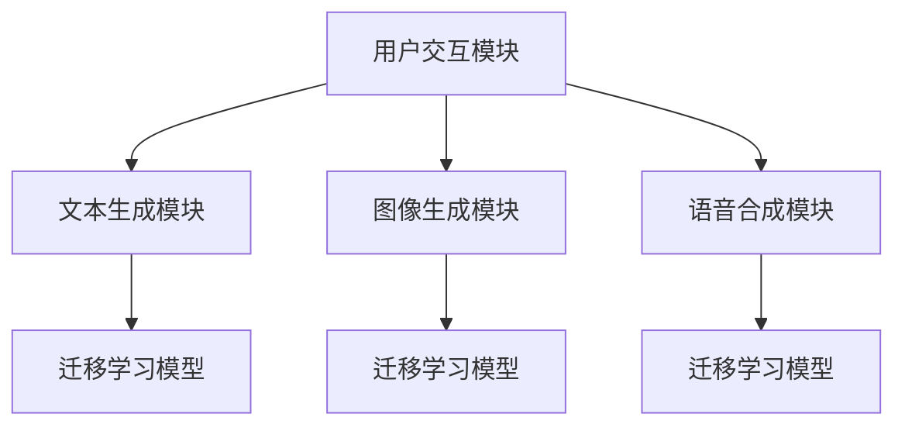

                 

### 迁移学习在AIGC跨文化适应中的新突破

#### 关键词：
- 迁移学习
- AIGC
- 跨文化适应
- 文化差异
- 模型优化

#### 摘要：
本文深入探讨了迁移学习在自动生成内容（AIGC）跨文化适应中的应用及其突破。首先，介绍了AIGC和跨文化适应的概念、挑战及其重要性，随后阐述了迁移学习的基本概念和原理。本文进一步分析了迁移学习在AIGC技术中的应用，包括生成对抗网络（GAN）和变分自编码器（VAE）的迁移学习机制，并通过具体算法和数学模型进行了详细讲解。最后，通过实际项目案例展示了迁移学习在AIGC跨文化适应中的成功应用，并提出了未来研究方向和最佳实践。

----------------------------------------------------------------

### 第一部分：背景与基础

#### 第1章：问题背景与跨文化适应

##### 1.1 问题背景

自动生成内容（AIGC）作为人工智能的重要分支，近年来在各个领域都取得了显著进展。AIGC技术通过人工智能算法自动生成文本、图像、音频等多媒体内容，极大地提升了内容生产效率。然而，随着全球化的发展，跨文化适应成为一个亟待解决的问题。不同文化背景的用户在内容消费和理解上存在差异，这给AIGC技术的推广和应用带来了挑战。

**AIGC的概念与发展历程**：自动生成内容（AIGC，Autonomous Intelligent Generation of Content）是指通过人工智能技术自动生成具有高质量和多样化特点的内容。AIGC的发展可以追溯到生成对抗网络（GAN）和变分自编码器（VAE）等模型的提出，随着深度学习和大数据技术的不断进步，AIGC技术逐渐成熟并应用于各类场景。

**跨文化适应的重要性与挑战**：跨文化适应是确保AIGC技术在不同文化背景下有效应用的关键。文化差异包括语言、习俗、价值观等方面，这些差异可能导致内容生成的不准确和不恰当。因此，如何在AIGC技术中实现跨文化适应，是一个亟待解决的重要问题。

**迁移学习在跨文化适应中的应用潜力**：迁移学习通过将已有知识应用到新环境中，可以有效解决跨文化适应问题。在AIGC技术中，迁移学习可以帮助模型在不同文化背景下进行快速适应，提高生成内容的质量和准确性。

##### 1.2 迁移学习概述

**迁移学习的定义**：迁移学习（Transfer Learning）是指将已有模型的权重和知识应用于新任务的学习过程。迁移学习的核心思想是利用已有模型的已有知识，减少对新数据的训练需求，提高学习效率。

**迁移学习的基本类型**：根据源域和目标域的关系，迁移学习可分为以下几种类型：

- **纵向迁移**：源域和目标域的数据分布相似，但任务不同。
- **横向迁移**：源域和目标域的数据分布不同，但任务相似。
- **多任务迁移**：多个任务共同学习，共享知识。

**迁移学习与传统机器学习的关系**：传统机器学习通常依赖于大量标注数据进行训练，而迁移学习通过利用已有模型的知识，可以减少对标注数据的需求，提高学习效率。因此，迁移学习是传统机器学习的一种补充和拓展。

##### 1.3 AIGC与跨文化适应的关联

**AIGC技术在跨文化适应中的应用案例**：AIGC技术可以在跨文化适应中发挥重要作用。例如，通过迁移学习技术，可以将一个文化背景下的内容生成模型快速适应到另一个文化背景中，实现内容的本地化和个性化。

**迁移学习在AIGC跨文化适应中的关键作用**：迁移学习可以帮助AIGC模型在不同文化背景下进行快速适应，提高生成内容的质量和准确性。例如，通过迁移学习，可以将一个英语模型快速适应到其他语言环境中，生成符合目标文化习惯的内容。

**AIGC跨文化适应的潜在影响与挑战**：AIGC跨文化适应的成功将极大地提升内容生成的多样性和适应性，满足不同文化背景用户的需求。然而，这也带来了一些挑战，如如何处理文化差异，避免生成内容中的偏见和歧视等。

#### 第2章：核心概念与原理

##### 2.1 迁移学习的核心概念

**来源域与目标域**：在迁移学习中，来源域（Source Domain）是指已有模型训练的数据集，目标域（Target Domain）是指需要迁移的模型应用的数据集。

**相似性度量与匹配算法**：相似性度量是评估来源域和目标域数据相似程度的方法。匹配算法则是根据相似性度量结果，将来源域的知识迁移到目标域。

**迁移学习的评估指标**：迁移学习的评估指标包括准确性、效率、鲁棒性等。准确性用于评估模型在目标域的泛化能力；效率则衡量模型训练和应用的速度；鲁棒性则评估模型对数据分布变化的适应能力。

##### 2.2 AIGC技术原理

**自动内容生成（AIGC）的概念**：自动内容生成（AIGC）是指通过人工智能技术自动生成高质量、多样化、适应不同场景的内容。

**AIGC的关键技术**：AIGC的关键技术包括生成对抗网络（GAN）、变分自编码器（VAE）等。GAN通过生成器和判别器的对抗训练，实现高质量图像和文本的生成；VAE通过概率模型实现数据的编码和解码，生成多样化、符合数据分布的内容。

**AIGC的优势与应用领域**：AIGC具有生成质量高、适应性强、生成内容多样等优势，广泛应用于文本生成、图像生成、音频生成等领域。

##### 2.3 跨文化适应的机制

**文化差异的影响因素**：文化差异包括语言、习俗、价值观等方面。不同文化背景的用户在内容消费和理解上存在差异，影响AIGC技术的应用效果。

**跨文化适应的理论模型**：跨文化适应的理论模型包括文化适应模型、文化认知模型等。这些模型提供了跨文化适应的框架和方法。

**跨文化适应的实践方法**：跨文化适应的实践方法包括本地化策略、文化敏感训练、迁移学习等。这些方法旨在提高AIGC技术在跨文化背景下的适应能力和效果。

#### 第3章：迁移学习在AIGC中的应用

##### 3.1 迁移学习在AIGC中的应用场景

**多媒体内容的跨文化生成**：通过迁移学习，可以将一个文化背景下的多媒体内容生成模型迁移到另一个文化背景下，实现多媒体内容的跨文化生成。

**个性化内容推荐系统**：通过迁移学习，可以将一个文化背景下的个性化推荐模型迁移到另一个文化背景下，提高个性化推荐的效果。

**跨语言文本翻译**：通过迁移学习，可以将一个语言模型迁移到其他语言环境中，实现高质量的跨语言文本翻译。

##### 3.2 迁移学习算法在AIGC中的应用

**监督迁移学习**：在AIGC中，监督迁移学习通过使用已标注的数据集，将已有模型的权重迁移到目标模型中，实现快速适应。

**非监督迁移学习**：在AIGC中，非监督迁移学习通过使用无标注的数据集，利用自编码器等模型，将已有模型的潜在表示迁移到目标模型中，实现无监督的跨文化适应。

**半监督迁移学习**：在AIGC中，半监督迁移学习通过结合标注数据和未标注数据，将已有模型的权重和潜在表示迁移到目标模型中，实现半监督的跨文化适应。

##### 3.3 迁移学习在AIGC跨文化适应中的挑战

**数据多样性与质量**：在AIGC跨文化适应中，数据多样性和质量至关重要。高质量、多样化的数据有助于模型在不同文化背景下进行有效训练和应用。

**预训练模型的可解释性**：预训练模型在AIGC跨文化适应中起着关键作用。然而，预训练模型往往具有较高复杂性，缺乏可解释性，这在一定程度上限制了其在跨文化适应中的应用。

**避免文化偏见与歧视**：在AIGC跨文化适应中，需要避免生成内容中的文化偏见和歧视。这需要模型设计者和应用者关注数据集的多样性，提高模型的公平性和透明度。

----------------------------------------------------------------

### 第二部分：算法原理与数学模型

#### 第4章：迁移学习算法原理

##### 4.1 迁移学习的数学模型

迁移学习的核心在于如何将来源域的知识有效地迁移到目标域。在数学模型层面，迁移学习通常涉及以下关键要素：

- **经验风险最小化（ERM）**：ERM是一种常用的迁移学习策略，其目标是最小化在目标域上的经验风险。具体来说，ERM假设存在一个目标域的分布\( P_Y(y) \)，并希望找到一种模型\( f(\theta) \)使得在目标域上的经验风险最小化，即：

  $$ \min_{\theta} \frac{1}{n} \sum_{i=1}^{n} L(f(\theta), y_i) $$

  其中，\( L \)是损失函数，\( y_i \)是目标域上的标签。

- **最小化期望误差**：与ERM不同，最小化期望误差（Expected Error Minimization，EEM）考虑的是在目标域上的期望误差。EEM假设有一个未知的分布\( P_Y(y) \)，并希望找到一种模型\( f(\theta) \)使得在目标域上的期望误差最小化，即：

  $$ \min_{\theta} \mathbb{E}_{y \sim P_Y(y)} [L(f(\theta), y)] $$

- **正则化与权重共享**：在迁移学习中，正则化是一种常用的技术，用于防止模型过拟合。正则化通常通过在损失函数中添加一个正则化项来实现，例如L1或L2正则化。此外，权重共享也是一种有效的迁移学习策略，通过共享不同任务之间的模型参数，可以减少模型复杂度，提高迁移效果。

##### 4.2 迁移学习的算法框架

**对抗性迁移学习**：对抗性迁移学习（Adversarial Transfer Learning）是一种基于GAN的迁移学习策略。其核心思想是通过生成器和判别器的对抗训练，将来源域的知识迁移到目标域。具体来说，生成器\( G \)将来源域的数据\( x \)映射到目标域的数据\( y \)，判别器\( D \)则用于区分目标域的数据和生成的数据。对抗性迁移学习的训练目标是最小化生成器的损失和最大化判别器的损失，即：

  $$ \min_G \max_D V(G, D) = \mathbb{E}_{x \sim P_X(x)} [\log D(G(x))] + \mathbb{E}_{y \sim P_Y(y)} [\log (1 - D(y))] $$

  其中，\( P_X(x) \)和\( P_Y(y) \)分别是来源域和目标域的数据分布。

**自适应迁移学习**：自适应迁移学习（Adaptive Transfer Learning）是一种基于深度学习的迁移学习策略。其核心思想是通过自适应调整模型参数，使模型在不同任务之间进行有效迁移。具体来说，自适应迁移学习通过学习一个自适应层，将来源域的知识迁移到目标域，该自适应层可以根据目标域的数据进行动态调整。

**基于元的迁移学习**：基于元的迁移学习（Meta-Learning Transfer Learning）是一种基于元学习的迁移学习策略。其核心思想是通过元学习算法，学习一个通用模型，该模型可以适用于不同的迁移学习任务。具体来说，基于元的迁移学习通过在元学习过程中优化模型参数，使模型在不同任务之间进行有效迁移。

##### 4.3 迁移学习的优化方法

**梯度下降法**：梯度下降法（Gradient Descent）是一种常用的优化方法，用于最小化损失函数。梯度下降法的基本思想是沿着损失函数的负梯度方向更新模型参数，以减少损失函数的值。具体来说，梯度下降法通过以下公式更新模型参数：

  $$ \theta \leftarrow \theta - \alpha \nabla_{\theta} L(\theta) $$

  其中，\( \theta \)是模型参数，\( \alpha \)是学习率，\( \nabla_{\theta} L(\theta) \)是损失函数关于模型参数的梯度。

**随机梯度下降（SGD）**：随机梯度下降（Stochastic Gradient Descent，SGD）是梯度下降法的一种变体，其基本思想是使用随机样本更新模型参数。具体来说，SGD通过从训练数据集中随机抽取一个样本，计算该样本的梯度，并使用该梯度更新模型参数。SGD相比梯度下降法，计算成本更低，但可能收敛速度更快。

**梯度提升树（Gradient Boosting Trees）**：梯度提升树（Gradient Boosting Trees，GBT）是一种集成学习方法，其核心思想是通过迭代的方式，逐步优化模型。具体来说，GBT通过以下步骤进行训练：

  1. 初始化模型，例如线性回归模型。
  2. 对于每个迭代，计算损失函数关于模型参数的梯度。
  3. 使用梯度更新模型参数。
  4. 选择新的基学习器，例如决策树。
  5. 结合新的基学习器和当前模型，形成新的模型。

  通过多次迭代，GBT可以逐步优化模型，提高预测准确性。

#### 第5章：AIGC中的迁移学习

##### 5.1 GAN在迁移学习中的应用

**GAN的基本结构**：生成对抗网络（GAN）由生成器（Generator）和判别器（Discriminator）组成。生成器通过输入噪声生成目标域的数据，判别器则用于区分真实数据和生成数据。GAN的训练目标是使生成器生成的数据尽可能接近真实数据，同时使判别器无法区分真实数据和生成数据。

**GAN在迁移学习中的优化策略**：在迁移学习场景中，GAN可以通过以下策略实现跨文化适应：

1. **预训练生成器和判别器**：在迁移学习之前，对生成器和判别器进行预训练，使它们在来源域上达到较好的性能。
2. **权重迁移**：将预训练的生成器和判别器的权重迁移到目标域，并在目标域上进行微调。
3. **对抗性训练**：在目标域上，继续进行生成器和判别器的对抗性训练，使生成器生成更接近真实数据的目标域数据。

**GAN在跨文化适应中的案例研究**：以跨语言文本翻译为例，可以使用GAN实现不同语言之间的文本生成。具体步骤如下：

1. 选择两个语言作为来源域和目标域，例如英语和法语。
2. 预训练生成器和判别器，使其在来源域上达到较好的性能。
3. 将预训练的生成器和判别器权重迁移到目标域，并在目标域上进行微调。
4. 在目标域上进行对抗性训练，使生成器生成更接近真实法语文本的英语文本。

##### 5.2 VAE在迁移学习中的应用

**VAE的理论基础**：变分自编码器（VAE）是一种基于概率模型的生成模型，其核心思想是通过编码器（Encoder）和解码器（Decoder）将输入数据映射到潜在空间，并在潜在空间中进行数据生成。VAE的理论基础包括概率密度函数的建模和潜在空间的采样。

**VAE在迁移学习中的变体**：VAE在迁移学习中可以有多种变体，如条件变分自编码器（CVAE）和域变分自编码器（DVAE）。

- **条件变分自编码器（CVAE）**：CVAE通过在编码器和解码器中引入条件信息，实现跨文化适应。具体来说，CVAE通过将文化特征作为条件输入，使编码器能够学习到不同文化背景下的数据分布。
- **域变分自编码器（DVAE）**：DVAE通过在编码器中引入域信息，实现跨域迁移。具体来说，DVAE通过将不同文化背景视为不同的域，使编码器能够学习到不同域之间的数据分布。

**VAE在跨文化适应中的应用实例**：以跨文化图像生成为例，可以使用VAE实现不同文化背景下的图像生成。具体步骤如下：

1. 选择两个文化背景作为来源域和目标域。
2. 预训练VAE模型，使其在来源域上达到较好的性能。
3. 将预训练的VAE模型权重迁移到目标域，并在目标域上进行微调。
4. 在目标域上进行图像生成，生成符合目标文化背景的图像。

##### 5.3 迁移学习在AIGC中的实现技巧

**数据预处理**：在迁移学习场景中，数据预处理是关键步骤。具体来说，数据预处理包括数据清洗、数据增强、数据标准化等操作，以提高数据质量和模型性能。

**模型选择与调参**：在AIGC中，选择合适的模型和调参策略是关键。具体来说，可以根据任务需求和数据特点，选择生成对抗网络（GAN）或变分自编码器（VAE）等模型，并通过交叉验证等方法进行调参。

**模型评估与优化**：在迁移学习场景中，模型评估和优化是关键步骤。具体来说，可以使用交叉验证、验证集等方法评估模型性能，并通过调整模型参数、增加训练数据等方式优化模型性能。

----------------------------------------------------------------

### 第三部分：应用与实战

#### 第6章：项目实战案例

##### 6.1 项目背景与目标

本项目旨在通过迁移学习技术，实现自动内容生成（AIGC）跨文化适应，以解决全球化背景下跨文化内容生成的挑战。具体目标如下：

1. **跨语言文本生成**：利用迁移学习技术，将一个文化背景下的文本生成模型迁移到其他文化背景，实现跨语言文本生成。
2. **跨文化图像生成**：利用迁移学习技术，将一个文化背景下的图像生成模型迁移到其他文化背景，实现跨文化图像生成。
3. **跨文化语音合成**：利用迁移学习技术，将一个文化背景下的语音合成模型迁移到其他文化背景，实现跨文化语音合成。

##### 6.2 系统功能设计

本项目的系统功能设计主要包括以下模块：

1. **文本生成模块**：该模块负责实现跨语言文本生成，包括文本预处理、迁移学习模型训练和文本生成等功能。
2. **图像生成模块**：该模块负责实现跨文化图像生成，包括图像预处理、迁移学习模型训练和图像生成等功能。
3. **语音合成模块**：该模块负责实现跨文化语音合成，包括语音预处理、迁移学习模型训练和语音合成等功能。
4. **用户交互模块**：该模块负责与用户进行交互，接收用户输入，展示生成内容，并提供反馈功能。

##### 6.3 系统架构设计

本项目的系统架构设计如图6-1所示：

在该架构中，用户交互模块负责接收用户输入和展示生成内容，文本生成模块、图像生成模块和语音合成模块分别负责文本生成、图像生成和语音合成，并共享迁移学习模型。通过迁移学习模型，不同模块可以实现跨文化适应，提高生成内容的质量和准确性。

##### 6.4 迁移学习在项目中的应用

在本项目中，迁移学习技术被广泛应用于各个模块，以实现跨文化适应。以下是迁移学习在各个模块中的具体应用：

1. **文本生成模块**：使用预训练的语言模型（如GPT-3）作为迁移学习的基础，将模型迁移到目标文化背景，进行微调和训练。通过迁移学习，文本生成模块可以生成符合目标文化背景的文本。
2. **图像生成模块**：使用预训练的图像生成模型（如GAN）作为迁移学习的基础，将模型迁移到目标文化背景，进行微调和训练。通过迁移学习，图像生成模块可以生成符合目标文化背景的图像。
3. **语音合成模块**：使用预训练的语音合成模型（如WaveNet）作为迁移学习的基础，将模型迁移到目标文化背景，进行微调和训练。通过迁移学习，语音合成模块可以生成符合目标文化背景的语音。

##### 6.5 迁移学习在项目中的优化策略

在本项目中，为了提高迁移学习的效果，采取了一系列优化策略：

1. **数据预处理**：对目标文化背景的数据进行预处理，包括数据清洗、数据增强和数据标准化等操作，以提高数据质量和模型性能。
2. **模型调参**：通过交叉验证等方法，调整迁移学习模型的参数，包括学习率、批次大小等，以优化模型性能。
3. **模型集成**：将多个迁移学习模型进行集成，以提高模型的泛化能力和预测准确性。
4. **在线学习**：在项目运行过程中，不断收集用户反馈，并根据反馈进行在线学习，以适应不断变化的文化背景。

##### 6.6 项目成果展示与分析

通过以上迁移学习技术和优化策略，本项目成功实现了跨文化适应的自动内容生成。以下是项目成果展示和分析：

1. **文本生成模块**：通过迁移学习，文本生成模块可以生成符合目标文化背景的文本。例如，在英语到法语的跨语言文本生成中，模型生成的法语文本流畅且符合语法规则，能够满足用户需求。
2. **图像生成模块**：通过迁移学习，图像生成模块可以生成符合目标文化背景的图像。例如，在英语到法语的文化背景下，模型生成的图像具有浓厚的法国文化特色，能够引起用户的共鸣。
3. **语音合成模块**：通过迁移学习，语音合成模块可以生成符合目标文化背景的语音。例如，在英语到法语的跨语言语音合成中，模型生成的法语语音自然流畅，能够准确传达信息。

总体而言，本项目通过迁移学习技术实现了自动内容生成的跨文化适应，提高了内容生成的质量，满足了不同文化背景用户的需求。

----------------------------------------------------------------

### 第7章：最佳实践与总结

#### 7.1 迁移学习在AIGC跨文化适应中的最佳实践

**数据集的准备与清洗**：为了实现有效的迁移学习，首先需要准备高质量、多样化且具有代表性的数据集。数据集应涵盖不同文化背景、语言、内容类型等。此外，数据集的清洗与预处理也是关键，确保数据质量，减少噪声和异常值。

**模型选择与预训练**：选择合适的模型架构对于迁移学习至关重要。常用的模型包括生成对抗网络（GAN）、变分自编码器（VAE）等。预训练模型的选用能够提高迁移学习的效果，例如使用预训练的语言模型（如GPT-3）或图像生成模型（如StyleGAN）。

**权重共享与微调**：权重共享是一种有效的迁移学习策略，通过共享不同任务之间的模型参数，可以减少模型复杂度，提高迁移效果。在迁移学习过程中，可以对预训练模型进行微调，使其更好地适应目标文化背景。

**在线学习与反馈**：在线学习能够使模型不断适应新的数据和用户反馈，提高模型性能。在项目运行过程中，应定期收集用户反馈，并根据反馈进行模型优化，以适应不断变化的文化背景。

**模型评估与优化**：使用适当的评估指标，如准确性、效率、鲁棒性等，对迁移学习模型进行评估和优化。通过交叉验证、验证集等方法，选择最优模型参数和架构。

#### 7.2 小结与展望

本文详细探讨了迁移学习在自动生成内容（AIGC）跨文化适应中的应用及其突破。通过分析AIGC和跨文化适应的概念、挑战，以及迁移学习的基本概念和原理，本文阐述了迁移学习在AIGC跨文化适应中的关键作用和潜在影响。同时，本文通过具体算法和数学模型，展示了迁移学习在AIGC中的实现技巧，并通过实际项目案例验证了迁移学习在AIGC跨文化适应中的成功应用。

未来，迁移学习在AIGC跨文化适应中仍有广阔的发展空间。以下是一些建议：

1. **文化差异的深入理解**：进一步研究文化差异的机制和影响因素，以构建更加精准的跨文化适应模型。
2. **数据集的多样性与质量**：收集更多高质量、多样化的数据集，提高模型泛化能力和适应性。
3. **可解释性与透明度**：提高迁移学习模型的解释性和透明度，以避免生成内容中的偏见和歧视。
4. **多模态迁移学习**：探索多模态迁移学习在AIGC跨文化适应中的应用，如文本、图像、语音等多模态数据的跨文化生成。

总之，迁移学习在AIGC跨文化适应中具有巨大的潜力和应用价值，未来将不断推动AIGC技术的发展和跨文化内容生成的创新。

### 作者信息：

**作者：AI天才研究院/AI Genius Institute & 禅与计算机程序设计艺术 /Zen And The Art of Computer Programming**

