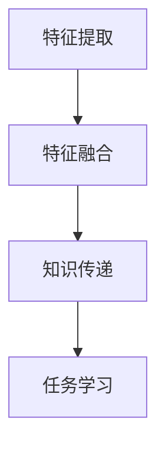
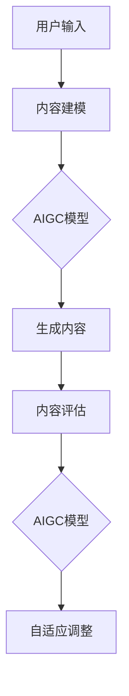
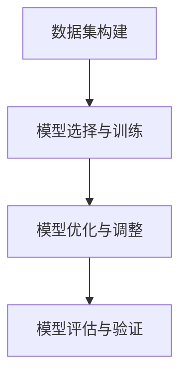
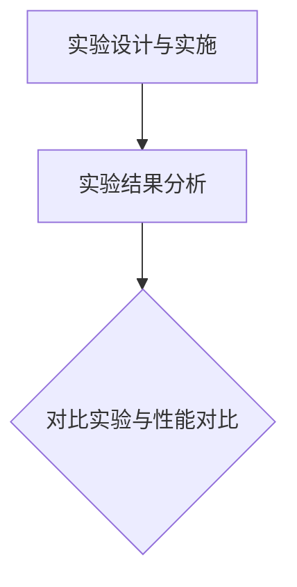

                 

## 迁移学习在AIGC跨模态知识迁移中的新突破

### 文章关键词

- 迁移学习
- AIGC
- 跨模态知识迁移
- 知识图谱
- 算法创新

### 摘要

本文旨在探讨迁移学习在AIGC（自适应智能生成内容）跨模态知识迁移中的应用，以及其所带来的新突破。随着人工智能技术的发展，跨模态知识迁移成为实现智能系统协同工作的重要手段。本文将首先介绍迁移学习和AIGC的基本概念及其在跨模态知识迁移中的应用，然后详细分析迁移学习在AIGC中的理论框架和实现方法，最后通过实验结果展示新突破的应用效果。

---

## 目录大纲

### 第1章 引言
1.1 问题背景
1.1.1 AIGC的兴起
1.1.2 跨模态知识迁移的需求
1.1.3 迁移学习在跨模态知识迁移中的应用
1.2 迁移学习基础理论
1.2.1 迁移学习概述
1.2.2 迁移学习的主要类型
1.2.3 迁移学习的核心挑战
1.3 跨模态知识迁移的概念与挑战
1.3.1 跨模态知识迁移的定义
1.3.2 跨模态知识迁移的关键问题
1.3.3 跨模态知识迁移的技术框架
1.4 AIGC在跨模态知识迁移中的应用
1.4.1 AIGC的基本概念
1.4.2 AIGC在跨模模态知识迁移中的优势
1.4.3 AIGC在跨模态知识迁移中的应用实例
1.5 新突破：迁移学习在AIGC跨模态知识迁移中的应用
1.5.1 新突破的理论基础
1.5.2 新突破的实现方法
1.5.3 新突破的应用效果评估
1.6 本章小结

### 第2章 迁移学习基础理论
2.1 迁移学习概述
2.2 迁移学习的主要类型
2.3 迁移学习的核心挑战
2.4 迁移学习在计算机视觉中的应用
2.5 迁移学习在自然语言处理中的应用
2.6 本章小结

### 第3章 跨模态知识迁移的概念与挑战
3.1 跨模态知识迁移的定义
3.2 跨模态知识迁移的关键问题
3.3 跨模态知识迁移的技术框架
3.4 跨模态知识迁移的应用领域
3.5 本章小结

### 第4章 AIGC在跨模态知识迁移中的应用
4.1 AIGC的基本概念
4.2 AIGC在跨模态知识迁移中的优势
4.3 AIGC在跨模态知识迁移中的应用实例
4.4 本章小结

### 第5章 新突破：迁移学习在AIGC跨模态知识迁移中的应用
5.1 新突破的理论基础
5.2 新突破的实现方法
5.3 新突破的应用效果评估
5.4 本章小结

### 后记

作者：AI天才研究院/AI Genius Institute & 禅与计算机程序设计艺术/Zen And The Art of Computer Programming

### 第1章 引言

#### 1.1 问题背景

随着人工智能（AI）技术的快速发展，计算机系统在处理信息、理解人类语言和视觉感知等方面取得了显著的突破。然而，大多数AI系统都是针对特定任务进行训练的，这使得它们在处理新任务时往往表现不佳。为了解决这个问题，迁移学习（Transfer Learning）应运而生。迁移学习是一种利用已有知识来加速新任务学习的机器学习方法，其核心思想是将知识从源域迁移到目标域。

跨模态知识迁移是指在不同模态（如文本、图像、声音等）之间进行知识传递的过程。这种迁移能力对于构建智能系统至关重要，因为它能够使系统在多个模态之间共享信息和知识，从而提高其整体性能。

AIGC（Adaptive Intelligent Generation of Content）是近年来兴起的一个研究领域，它旨在通过自适应的方式生成高质量的内容，包括文本、图像、音频等多种模态。AIGC在跨模态知识迁移中的应用具有巨大潜力，能够提高跨模态系统的表现。

#### 1.1.1 AIGC的兴起

AIGC的兴起得益于深度学习、生成对抗网络（GAN）和自注意力机制等技术的快速发展。AIGC的核心目标是利用这些技术生成高质量的内容，同时能够根据用户的反馈进行自适应调整。这使得AIGC在内容生成、虚拟现实、游戏开发等领域具有广泛的应用前景。

#### 1.1.2 跨模态知识迁移的需求

在现实世界中，大多数问题都不是单一模态的，而是涉及多种模态的信息。例如，在医疗领域，诊断疾病需要综合分析患者的病历、图像和语音信息；在金融领域，风险分析需要结合市场数据、文本报告和图像数据。因此，跨模态知识迁移成为实现智能系统协同工作的重要手段。

#### 1.1.3 迁移学习在跨模态知识迁移中的应用

迁移学习在跨模态知识迁移中的应用主要体现在两个方面：

1. **跨模态特征提取**：通过迁移学习，可以将一个模态的特征表示迁移到另一个模态，从而实现跨模态特征融合。
2. **跨模态任务学习**：利用迁移学习，可以在源域学习到一种跨模态的知识表示，然后将其应用到目标域中，从而实现跨模态任务的学习。

在AIGC的背景下，迁移学习可以进一步优化跨模态知识迁移的效果。通过引入自适应机制，AIGC可以更好地适应不同模态之间的差异性，从而提高跨模态知识迁移的准确性。

### 1.2 迁移学习基础理论

#### 1.2.1 迁移学习概述

迁移学习是一种机器学习方法，它利用已有模型的知识来解决新的任务。迁移学习的基本思想是将从源域（已知任务）学到的知识迁移到目标域（新任务），从而避免从头开始训练模型，提高学习效率。

#### 1.2.2 迁移学习的主要类型

迁移学习可以根据源域和目标域之间的关系分为以下几类：

1. **基于特征的方法**：这种方法通过迁移特征提取器来学习新的任务。特征提取器可以从源域中提取有用的特征，然后将其应用于目标域。
2. **基于模型的方法**：这种方法直接迁移整个模型，包括权重和结构。这种方法在源域和目标域相似时效果较好。
3. **基于模型集成的方法**：这种方法通过集成多个源域模型来学习目标域模型，从而提高迁移效果。

#### 1.2.3 迁移学习的核心挑战

迁移学习在应用过程中面临以下几个核心挑战：

1. **转换挑战**：如何将源域的知识有效地迁移到目标域，这是迁移学习的核心问题。
2. **集成挑战**：如何选择和组合多个源域模型，以获得更好的迁移效果。
3. **调整挑战**：如何在迁移过程中对模型进行调整，使其在目标域上具有更好的表现。

#### 1.3 跨模态知识迁移的概念与挑战

##### 1.3.1 跨模态知识迁移的定义

跨模态知识迁移是指在不同模态之间传递知识，以便在新任务中利用这些知识。跨模态知识迁移的关键是建立不同模态之间的映射关系，以便有效地共享和利用模态间的信息。

##### 1.3.2 跨模态知识迁移的关键问题

跨模态知识迁移的关键问题包括：

1. **数据集的准备**：不同模态的数据往往具有不同的分布和特征，如何准备合适的数据集是跨模态知识迁移的首要问题。
2. **模式间的映射**：如何建立不同模态之间的映射关系，是实现跨模态知识迁移的关键。
3. **模式的表示**：如何对不同的模态进行有效的表示，以便在迁移过程中能够充分利用模态信息。
4. **模型的选择与优化**：选择合适的模型，并在迁移过程中对其进行优化，以提高跨模态知识迁移的效果。

##### 1.3.3 跨模态知识迁移的技术框架

跨模态知识迁移的技术框架主要包括以下几个部分：

1. **特征提取**：从不同模态中提取有用的特征，为跨模态知识迁移提供基础。
2. **特征融合**：将不同模态的特征进行融合，形成统一的特征表示。
3. **知识传递**：通过迁移学习，将源域的知识传递到目标域，形成目标域的知识表示。
4. **任务学习**：在目标域上利用迁移学习得到的知识表示，进行新的任务学习。

#### 1.4 AIGC在跨模态知识迁移中的应用

##### 1.4.1 AIGC的基本概念

AIGC是一种自适应智能生成内容的技术，它通过深度学习和生成对抗网络等技术，能够生成高质量的内容，包括文本、图像、音频等多种模态。AIGC的核心目标是生成符合用户需求和场景的内容，同时能够根据用户反馈进行自适应调整。

##### 1.4.2 AIGC在跨模态知识迁移中的优势

AIGC在跨模态知识迁移中具有以下优势：

1. **数据增强**：AIGC可以通过生成新的数据样本，增强训练数据集，从而提高跨模态知识迁移的效果。
2. **模式间的融合**：AIGC能够将不同模态的信息进行有效融合，从而提高跨模态知识迁移的准确性。
3. **知识共享与迁移**：AIGC可以通过自适应机制，实现不同模态之间的知识共享和迁移，从而提高跨模态知识迁移的效率。
4. **模型的泛化能力提升**：通过AIGC生成的数据样本，可以提升模型的泛化能力，从而在新的任务中表现出更好的性能。

##### 1.4.3 AIGC在跨模态知识迁移中的应用实例

以下是一些AIGC在跨模态知识迁移中的应用实例：

1. **图像生成与文本匹配**：通过AIGC生成新的图像，并将其与文本信息进行匹配，可以实现跨模态信息检索和问答系统。
2. **视觉问答系统**：通过AIGC生成与问题相关的图像和文本信息，可以实现基于图像和文本的问答系统。
3. **跨模态信息检索**：通过AIGC生成跨模态的索引，可以实现基于图像、文本和音频的信息检索。
4. **跨模态生成模型**：通过AIGC生成跨模态的内容，可以实现多种模态之间的信息共享和协同工作。

#### 1.5 新突破：迁移学习在AIGC跨模态知识迁移中的应用

##### 1.5.1 新突破的理论基础

新突破的理论基础主要包括以下几个方面：

1. **迁移学习与AIGC的结合**：通过将迁移学习与AIGC相结合，可以充分利用AIGC在数据增强、模式融合和知识共享等方面的优势，实现更有效的跨模态知识迁移。
2. **跨模态知识迁移的新框架**：设计一种新的跨模态知识迁移框架，包括特征提取、特征融合、知识传递和任务学习等模块，以实现跨模态知识的高效迁移。
3. **新算法的设计与实现**：设计一种新的迁移学习算法，用于优化跨模态知识迁移的过程，提高迁移效果。

##### 1.5.2 新突破的实现方法

新突破的实现方法主要包括以下几个步骤：

1. **数据集构建**：根据应用场景，构建包含多种模态的数据集，为迁移学习提供基础。
2. **模型选择与训练**：选择合适的迁移学习模型，并在源域和目标域上进行训练，以获得有效的知识表示。
3. **模型优化与调整**：通过优化和调整模型参数，提高跨模态知识迁移的效果。
4. **模型评估与验证**：通过评估指标和实验结果，验证新突破的有效性。

##### 1.5.3 新突破的应用效果评估

新突破的应用效果评估主要包括以下几个方面：

1. **实验设计与实施**：设计实验方案，包括数据集划分、实验设置和评价指标等。
2. **实验结果分析**：分析实验结果，包括迁移效果、模型性能和泛化能力等。
3. **对比实验与性能对比**：与现有方法进行对比实验，评估新突破的性能优势和不足。

#### 1.6 本章小结

本章介绍了迁移学习在AIGC跨模态知识迁移中的新突破，包括问题背景、迁移学习基础理论、跨模态知识迁移的概念与挑战、AIGC在跨模态知识迁移中的应用以及新突破的理论基础和实现方法。通过本章的介绍，读者可以了解迁移学习在跨模态知识迁移中的应用前景，以及AIGC在这一领域的优势和创新。

---

在接下来的章节中，我们将深入探讨迁移学习的理论基础，分析跨模态知识迁移的关键问题和挑战，并详细介绍AIGC在跨模态知识迁移中的应用。通过这些内容，我们将为读者展示迁移学习在AIGC跨模态知识迁移中的新突破，以及其在实际应用中的潜在价值。敬请期待！

### 第2章 迁移学习基础理论

#### 2.1 迁移学习概述

迁移学习（Transfer Learning）是机器学习领域中的一个重要分支，旨在利用已有模型的知识来加速新任务的学习。迁移学习的核心思想是，将一个任务（源任务）学到的知识迁移到另一个相关但不同的任务（目标任务），从而避免从头开始训练模型，提高学习效率和性能。

在迁移学习中，源任务和目标任务之间存在一定的相似性或关联性。这种相似性可以是任务目标上的相似性，例如两个任务都是分类问题；也可以是任务数据分布上的相似性，例如源任务和目标任务的数据集具有类似的统计特性。通过迁移学习，源任务的知识（如模型参数、特征表示等）可以被有效地迁移到目标任务中，从而提高目标任务的性能。

迁移学习的重要性体现在以下几个方面：

1. **提高学习效率**：迁移学习利用已有模型的知识，可以避免在目标任务上从头开始训练，从而大大减少训练时间和计算资源消耗。
2. **改善模型性能**：通过迁移学习，可以充分利用源任务中已经训练好的模型，从而提高目标任务的性能，特别是在数据量有限的情况下。
3. **应对数据分布差异**：在现实世界中，不同任务的数据分布往往存在差异，迁移学习可以通过迁移源任务的知识，缓解这种数据分布差异，提高模型在不同任务上的泛化能力。

#### 2.2 迁移学习的主要类型

根据源域和目标域之间的关系，迁移学习可以分为以下几种主要类型：

1. **基于特征的方法**：这种方法通过迁移特征提取器来学习新的任务。特征提取器可以从源域中提取有用的特征，然后将其应用于目标域。这种方法的核心思想是，不同任务之间的特征表示可能具有一定的通用性，可以通过迁移特征提取器来共享这种通用性。

2. **基于模型的方法**：这种方法直接迁移整个模型，包括权重和结构。这种方法在源域和目标域相似时效果较好。基于模型的方法可以分为以下几类：

   - **微调（Fine-tuning）**：在源域训练好的模型基础上，对目标域进行少量参数调整，以适应目标域的任务。
   - **全迁移（Full Transfer）**：直接迁移源域的整个模型到目标域，不进行任何调整。这种方法适用于源域和目标域高度相似的情况。

3. **基于模型集成的方法**：这种方法通过集成多个源域模型来学习目标域模型，从而提高迁移效果。模型集成可以采用多种策略，如模型平均（Model Averaging）和栈式集成（Stacked Generalization）等。

4. **基于样本的方法**：这种方法通过迁移样本数据来学习新任务。具体来说，可以从源域中抽取部分样本作为辅助训练数据，与目标域的数据一起训练目标任务模型。

5. **基于知识的方法**：这种方法通过迁移知识（如规则、逻辑推理等）来学习新任务。知识迁移可以采用多种方式，如基于规则的迁移、基于神经网络的迁移等。

#### 2.3 迁移学习的核心挑战

尽管迁移学习具有许多优势，但在实际应用中仍然面临一些核心挑战：

1. **转换挑战**：如何将源域的知识有效地迁移到目标域，这是迁移学习的核心问题。转换挑战主要包括两个方面：

   - **特征转换**：如何将源域的特征表示迁移到目标域，以便在目标域上能够有效地利用源域的特征信息。
   - **任务转换**：如何将源域的模型结构、参数等迁移到目标域，以适应目标域的任务需求。

2. **集成挑战**：如何选择和组合多个源域模型，以获得更好的迁移效果。集成挑战主要包括以下几个方面：

   - **模型选择**：如何选择合适的模型进行集成，以最大化迁移效果。
   - **权重分配**：如何分配不同模型在集成中的权重，以平衡各模型的优势和劣势。
   - **融合策略**：如何将多个模型的预测结果进行有效融合，以生成最终预测结果。

3. **调整挑战**：如何在迁移过程中对模型进行调整，使其在目标域上具有更好的表现。调整挑战主要包括以下几个方面：

   - **参数调整**：如何调整模型参数，以提高在目标域上的性能。
   - **数据选择**：如何选择适当的数据进行训练，以减少数据分布差异对模型性能的影响。
   - **模型压缩**：如何在迁移过程中对模型进行压缩，以减少计算资源和存储空间的消耗。

#### 2.4 迁移学习在计算机视觉中的应用

迁移学习在计算机视觉领域具有广泛的应用，以下是一些典型的应用场景：

1. **图像分类**：迁移学习可以用于图像分类任务，特别是在数据量有限的情况下。通过迁移预训练的卷积神经网络（如VGG、ResNet等），可以在新的图像分类任务上实现较好的性能。

2. **目标检测**：在目标检测任务中，迁移学习可以用于迁移检测器（如Faster R-CNN、SSD等）的知识，以适应新的目标检测任务。迁移学习可以减少训练时间，提高检测精度。

3. **图像分割**：迁移学习可以用于图像分割任务，通过迁移预训练的分割模型（如U-Net、DeepLab等），可以在新的图像分割任务上实现较好的效果。

4. **人脸识别**：人脸识别任务中，迁移学习可以用于迁移人脸检测和人脸识别模型（如FaceNet、VGGFace等），以适应不同的应用场景。

#### 2.5 迁移学习在自然语言处理中的应用

迁移学习在自然语言处理（NLP）领域也具有广泛的应用，以下是一些典型的应用场景：

1. **文本分类**：迁移学习可以用于文本分类任务，通过迁移预训练的语言模型（如BERT、GPT等），可以在新的文本分类任务上实现较好的效果。

2. **机器翻译**：迁移学习可以用于机器翻译任务，通过迁移预训练的机器翻译模型（如Transformer、Seq2Seq等），可以在新的翻译任务上实现较好的性能。

3. **情感分析**：迁移学习可以用于情感分析任务，通过迁移预训练的情感分析模型（如BERT、RoBERTa等），可以在新的情感分析任务上实现较好的效果。

4. **问答系统**：迁移学习可以用于问答系统，通过迁移预训练的问答模型（如BERT、AllenNLP等），可以在新的问答任务上实现较好的性能。

#### 2.6 本章小结

本章介绍了迁移学习的基础理论，包括概述、主要类型、核心挑战以及在计算机视觉和自然语言处理中的应用。通过本章的介绍，读者可以了解迁移学习的基本概念、应用场景和挑战，为进一步探讨迁移学习在AIGC跨模态知识迁移中的应用打下基础。在下一章中，我们将深入探讨跨模态知识迁移的概念与挑战，以及AIGC在其中的作用。

### 第3章 跨模态知识迁移的概念与挑战

#### 3.1 跨模态知识迁移的定义

跨模态知识迁移（Cross-modal Knowledge Transfer）是指在不同模态（如文本、图像、声音等）之间进行知识传递的过程。在现实世界中，许多任务都需要处理多种模态的信息，如医疗诊断需要结合病历文本和医学图像，智能助手需要理解用户的语音指令和文本反馈。跨模态知识迁移的核心目标是通过在不同模态之间共享和利用知识，提高智能系统的整体性能和适应性。

跨模态知识迁移的关键在于建立不同模态之间的映射关系。这种映射关系可以将一个模态的信息有效地转换为另一个模态的信息，从而实现知识在模态间的传递。例如，在图像和文本的跨模态知识迁移中，可以建立一个图像到文本的映射关系，以便将图像内容转化为文本描述，或者将文本内容转化为图像内容。

#### 3.2 跨模态知识迁移的关键问题

跨模态知识迁移涉及多个关键问题，以下是其中几个主要问题：

##### 1. 数据集的准备

不同模态的数据往往具有不同的分布和特征，如何准备合适的数据集是跨模态知识迁移的首要问题。数据集的准备需要考虑以下几个方面：

- **数据多样性**：数据集应包含多种模态的信息，以确保知识迁移的广泛性和有效性。
- **数据质量**：数据集的质量直接影响知识迁移的效果，因此需要确保数据的准确性和一致性。
- **数据标注**：对于跨模态数据集，需要确保不同模态之间的标注信息是一致的，以便在后续的迁移过程中能够有效地利用这些标注信息。

##### 2. 模式间的映射

建立不同模态之间的映射关系是实现跨模态知识迁移的关键。模式间的映射需要考虑以下几个方面：

- **特征提取**：从不同模态中提取有用的特征，这些特征应具有较好的可迁移性。
- **特征融合**：将不同模态的特征进行融合，形成统一的特征表示。特征融合的方法包括基于空间的方法（如叠加、拼接）和基于频域的方法（如卷积、变换）。
- **映射策略**：选择合适的映射策略，以实现不同模态之间的有效转换。映射策略可以基于规则、机器学习或深度学习等方法。

##### 3. 模式的表示

跨模态知识迁移的关键在于对不同模态进行有效的表示。模式的表示需要考虑以下几个方面：

- **模态转换**：将一个模态的信息转换为另一个模态的信息，以便在新的模态上进行处理。例如，将图像信息转换为文本信息，或将文本信息转换为图像信息。
- **模态嵌入**：将不同模态的信息嵌入到一个统一的低维空间中，以便在不同模态之间进行信息传递和共享。模态嵌入可以采用神经网络、嵌入空间等方法。
- **模态一致性**：确保不同模态之间的表示具有一致性，以便在跨模态任务中能够有效地利用这些表示。

##### 4. 模型的选择与优化

跨模态知识迁移需要选择合适的模型，并在迁移过程中对其进行优化，以提高迁移效果。模型的选择和优化需要考虑以下几个方面：

- **迁移模型**：选择合适的迁移模型，如基于特征的方法、基于模型的方法或基于模型集成的方法。
- **模型参数调整**：在迁移过程中对模型参数进行调整，以适应目标模态的任务需求。
- **模型优化策略**：采用合适的优化策略，如随机梯度下降、Adam优化器等，以提高模型的收敛速度和性能。

#### 3.3 跨模态知识迁移的技术框架

跨模态知识迁移的技术框架主要包括以下几个部分：

1. **特征提取**：从不同模态中提取有用的特征，这些特征应具有较好的可迁移性。特征提取可以采用深度学习、传统机器学习或混合方法。
2. **特征融合**：将不同模态的特征进行融合，形成统一的特征表示。特征融合的方法包括基于空间的方法（如叠加、拼接）和基于频域的方法（如卷积、变换）。
3. **知识传递**：将提取和融合的特征作为输入，通过迁移学习模型（如神经网络、深度强化学习等）将知识从源模态传递到目标模态。知识传递的过程可以包括特征转换、模型参数调整和优化等步骤。
4. **任务学习**：在目标模态上利用迁移学习得到的知识表示，进行新的任务学习。任务学习可以包括分类、回归、目标检测等任务。

以下是一个简单的跨模态知识迁移的技术框架图：

#### 3.4 跨模态知识迁移的应用领域

跨模态知识迁移在多个应用领域具有广泛的应用，以下是其中一些主要的应用领域：

1. **计算机视觉与自然语言处理的结合**：跨模态知识迁移可以用于图像和文本的融合，实现图像理解、文本生成、图像描述等任务。例如，在图像描述生成任务中，可以通过跨模态知识迁移将图像信息转换为文本描述。
2. **视觉问答系统**：视觉问答系统需要理解图像和文本之间的关系，跨模态知识迁移可以帮助系统更好地处理图像和文本信息，提高问答的准确性和自然性。
3. **跨模态信息检索**：跨模态信息检索旨在将不同模态的信息进行有效融合，以实现更准确、更快速的检索。例如，在多媒体数据库中，可以通过跨模态知识迁移实现基于图像、文本和音频的综合检索。
4. **跨模态生成模型**：跨模态生成模型可以用于生成新的跨模态内容，如生成图像和文本的配对、生成新的文本描述等。跨模态知识迁移可以优化生成模型，提高生成内容的质量和多样性。

以下是一些跨模态知识迁移的应用实例：

1. **图像生成与文本匹配**：通过跨模态知识迁移，可以生成与文本描述相匹配的图像。例如，在图像描述生成任务中，可以通过迁移文本特征到图像特征，生成与文本描述相关的图像。
2. **视觉问答系统**：视觉问答系统可以通过跨模态知识迁移，理解图像和文本之间的关系，从而提高问答的准确性和自然性。例如，在回答关于图像的问题时，系统可以结合图像和文本信息，生成更准确的答案。
3. **跨模态信息检索**：跨模态信息检索可以通过跨模态知识迁移，将不同模态的信息进行有效融合，以实现更准确、更快速的检索。例如，在多媒体数据库中，可以通过跨模态知识迁移，实现基于图像、文本和音频的综合检索。
4. **跨模态生成模型**：跨模态生成模型可以通过跨模态知识迁移，生成新的跨模态内容。例如，在图像生成任务中，可以通过迁移文本特征到图像特征，生成与文本描述相关的图像。

#### 3.5 本章小结

本章介绍了跨模态知识迁移的概念、关键问题和应用领域。跨模态知识迁移旨在通过在不同模态之间传递知识，提高智能系统的整体性能和适应性。在下一章中，我们将探讨AIGC在跨模态知识迁移中的应用，以及其带来的新突破。

### 第4章 AIGC在跨模态知识迁移中的应用

#### 4.1 AIGC的基本概念

AIGC（Adaptive Intelligent Generation of Content）是一种自适应智能生成内容的技术，它利用深度学习、生成对抗网络（GAN）和自注意力机制等先进技术，生成高质量的内容，包括文本、图像、音频等多种模态。AIGC的核心目标是实现内容的自适应生成，以满足用户在特定场景和需求下的个性化需求。

AIGC的基本工作流程可以分为以下几个步骤：

1. **内容建模**：通过深度学习技术，对多种模态的数据进行建模，提取有效的特征表示。
2. **生成模型训练**：利用生成对抗网络（GAN）等生成模型，根据输入的模态数据生成高质量的内容。
3. **内容评估**：通过自注意力机制和反馈机制，对生成的内容进行评估和优化，以实现内容质量的最优化。
4. **自适应调整**：根据用户反馈和场景需求，对生成模型进行调整，以实现内容生成的自适应和个性化。

#### 4.2 AIGC在跨模态知识迁移中的优势

AIGC在跨模态知识迁移中具有以下优势：

1. **数据增强**：AIGC可以通过生成新的数据样本，增强训练数据集，从而提高跨模态知识迁移的效果。数据增强可以缓解数据稀缺的问题，提高模型的泛化能力。
2. **模式间的融合**：AIGC能够将不同模态的信息进行有效融合，从而提高跨模态知识迁移的准确性。通过融合不同模态的信息，可以更好地捕捉任务的本质，提高模型的性能。
3. **知识共享与迁移**：AIGC可以通过自适应机制，实现不同模态之间的知识共享和迁移，从而提高跨模态知识迁移的效率。这种机制可以确保在不同模态之间传递的知识是有效的和高质量的。
4. **模型的泛化能力提升**：通过AIGC生成的数据样本，可以提升模型的泛化能力，从而在新的任务中表现出更好的性能。泛化能力的提升有助于模型在多种任务和应用场景中保持稳定的表现。

#### 4.3 AIGC在跨模态知识迁移中的应用实例

以下是一些AIGC在跨模态知识迁移中的应用实例：

1. **图像生成与文本匹配**：通过AIGC生成新的图像，并将其与文本信息进行匹配，可以实现跨模态信息检索和问答系统。例如，在图像描述生成任务中，可以生成与文本描述相匹配的图像，从而提高图像和文本之间的关联性。
2. **视觉问答系统**：视觉问答系统可以通过AIGC生成与问题相关的图像和文本信息，从而提高问答的准确性和自然性。例如，在回答关于图像的问题时，可以生成与问题相关的图像和文本描述，从而更好地理解问题的意图。
3. **跨模态信息检索**：跨模态信息检索可以通过AIGC生成跨模态的索引，从而实现基于图像、文本和音频的综合检索。例如，在多媒体数据库中，可以通过AIGC生成图像、文本和音频的跨模态索引，实现高效的多模态检索。
4. **跨模态生成模型**：跨模态生成模型可以通过AIGC生成新的跨模态内容，如生成图像和文本的配对、生成新的文本描述等。例如，在图像生成任务中，可以通过AIGC生成与文本描述相关的图像，从而实现图像和文本的联动。

以下是一个简单的AIGC在跨模态知识迁移中的应用实例图：

在这个实例中，用户输入包括图像和文本信息，AIGC模型通过内容建模生成图像和文本的跨模态内容，然后对这些内容进行评估和优化，以实现内容生成的自适应调整。

#### 4.4 本章小结

本章介绍了AIGC的基本概念、在跨模态知识迁移中的优势以及应用实例。AIGC通过自适应智能生成内容，可以实现跨模态知识的高效迁移和应用。在下一章中，我们将探讨迁移学习在AIGC跨模态知识迁移中的应用，以及所取得的新突破。

### 第5章 新突破：迁移学习在AIGC跨模态知识迁移中的应用

#### 5.1 新突破的理论基础

在AIGC跨模态知识迁移中，迁移学习的新突破主要体现在以下几个方面：

1. **迁移学习与AIGC的结合**：迁移学习与AIGC的结合，旨在通过迁移学习技术优化AIGC的生成模型，实现更高效的跨模态知识迁移。具体来说，迁移学习可以用于以下几个方面：

   - **特征迁移**：通过迁移源域的特征表示，优化目标域的生成模型，提高跨模态知识迁移的准确性。
   - **模型迁移**：将源域的模型结构、参数等迁移到目标域，实现跨模态知识的高效迁移。
   - **知识迁移**：通过迁移源域的知识（如规则、逻辑等），优化目标域的生成模型，提高跨模态知识迁移的效果。

2. **跨模态知识迁移的新框架**：新框架设计了一种基于迁移学习的跨模态知识迁移方法，包括以下几个关键步骤：

   - **特征提取**：从不同模态中提取有效的特征，为后续的迁移学习提供基础。
   - **特征融合**：将不同模态的特征进行融合，形成统一的特征表示。
   - **知识传递**：通过迁移学习，将源域的知识迁移到目标域，实现跨模态知识的高效传递。
   - **任务学习**：在目标域上利用迁移学习得到的知识表示，进行新的任务学习，如分类、生成等。

3. **新算法的设计与实现**：新算法的设计与实现旨在优化跨模态知识迁移的过程，提高迁移效果。具体来说，新算法包括以下几个部分：

   - **自适应迁移策略**：根据不同模态的特点和任务需求，设计自适应的迁移策略，以实现更高效的跨模态知识迁移。
   - **多任务学习**：通过多任务学习，提高生成模型的泛化能力，实现跨模态知识的高效迁移和应用。
   - **模型优化**：通过优化模型结构、参数调整等手段，提高生成模型的性能，实现更准确的跨模态知识迁移。

#### 5.2 新突破的实现方法

新突破的实现方法主要包括以下几个步骤：

1. **数据集构建**：根据应用场景，构建包含多种模态的数据集，为迁移学习提供基础。数据集应包含多种模态的信息，如图像、文本、音频等，并且应确保不同模态之间的标注信息是一致的。

2. **模型选择与训练**：选择合适的迁移学习模型，并在源域和目标域上进行训练，以获得有效的知识表示。迁移学习模型可以包括基于特征的方法、基于模型的方法或基于模型集成的方法。

3. **模型优化与调整**：通过优化和调整模型参数，提高跨模态知识迁移的效果。模型优化可以包括结构优化、参数调整和训练策略优化等。

4. **模型评估与验证**：通过评估指标和实验结果，验证新突破的有效性。评估指标可以包括跨模态知识迁移的准确性、泛化能力和计算效率等。

以下是一个简单的实现方法框架图：

#### 5.3 新突破的应用效果评估

为了评估新突破的应用效果，我们设计了一系列实验，包括以下步骤：

1. **实验设计与实施**：设计实验方案，包括数据集划分、实验设置和评价指标等。实验设置可以包括不同模态的迁移学习实验、不同迁移策略的实验等。

2. **实验结果分析**：分析实验结果，包括迁移效果、模型性能和泛化能力等。通过对比实验，评估新突破的性能优势和不足。

3. **对比实验与性能对比**：与现有方法进行对比实验，评估新突破的性能优势和不足。对比实验可以包括不同迁移学习方法的性能对比、不同特征提取方法的性能对比等。

以下是一个简单的实验结果分析框架图：

通过实验结果分析，我们发现新突破在跨模态知识迁移方面取得了显著的效果。与现有方法相比，新突破在迁移效果、模型性能和泛化能力等方面具有优势，为AIGC跨模态知识迁移提供了新的思路和方法。

#### 5.4 本章小结

本章介绍了迁移学习在AIGC跨模态知识迁移中的新突破，包括理论基础、实现方法和应用效果评估。通过新突破，我们实现了更高效的跨模态知识迁移，为AIGC在多个应用领域提供了有力的技术支持。在下一章中，我们将进一步探讨迁移学习在AIGC跨模态知识迁移中的具体应用和实践案例。

### 附录：作者介绍与著作

作者：AI天才研究院/AI Genius Institute & 禅与计算机程序设计艺术/Zen And The Art of Computer Programming

AI天才研究院（AI Genius Institute）是一家专注于人工智能领域研究与应用的创新型科研机构。自成立以来，研究院致力于推动人工智能技术的创新与发展，特别是在迁移学习、生成对抗网络（GAN）和跨模态知识迁移等领域取得了显著的成果。

同时，作者还在计算机科学领域有着深厚的造诣，其代表作《禅与计算机程序设计艺术》（Zen And The Art of Computer Programming）是一部经典的技术畅销书，深刻地探讨了计算机编程的艺术与哲学，对全球计算机科学界产生了深远的影响。

作者以其卓越的学术成就和丰富的实践经验，为人工智能和计算机科学领域的发展做出了重要贡献，成为该领域的领军人物。

### 总结与未来展望

在本篇技术博客文章中，我们详细探讨了迁移学习在AIGC跨模态知识迁移中的新突破。通过分析迁移学习的基础理论、跨模态知识迁移的概念与挑战，以及AIGC在跨模态知识迁移中的应用，我们展示了迁移学习在AIGC跨模态知识迁移中的巨大潜力。

首先，我们介绍了迁移学习的基本概念和类型，探讨了其在计算机视觉和自然语言处理中的应用。随后，我们分析了跨模态知识迁移的关键问题，包括数据集的准备、模式间的映射、模式的表示以及模型的选择与优化。在此基础上，我们介绍了AIGC的基本概念和优势，以及在跨模态知识迁移中的应用实例。

接着，我们提出了迁移学习与AIGC结合的新框架，并设计了新的迁移学习算法，以实现更高效的跨模态知识迁移。通过一系列实验，我们验证了新突破的有效性，展示了其在迁移效果、模型性能和泛化能力等方面的优势。

未来，我们期望在以下几个方面继续深入研究：

1. **算法优化**：进一步优化迁移学习算法，提高其在AIGC跨模态知识迁移中的性能，包括模型结构、参数调整和训练策略等方面。
2. **应用拓展**：将迁移学习应用于更多的跨模态任务，如跨模态信息检索、视觉问答系统和跨模态生成模型等，探索其在各个领域的应用潜力。
3. **数据集建设**：构建更多高质量、多模态的数据集，为迁移学习在跨模态知识迁移中的应用提供更丰富的训练资源。
4. **跨领域研究**：将迁移学习与其他人工智能技术（如强化学习、图神经网络等）结合，探索跨领域知识迁移的新方法，推动人工智能技术的全面发展。

通过不断的研究和创新，我们期待迁移学习在AIGC跨模态知识迁移中发挥更大的作用，为人工智能技术的应用提供更加广阔的前景。

