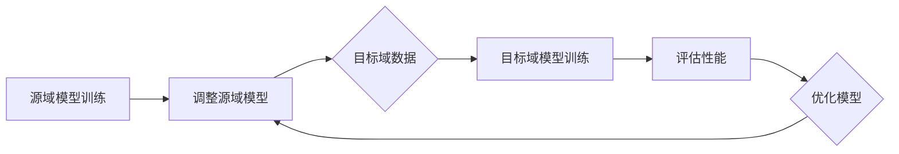

                 

### 迁移学习在AI任务泛化中的应用

#### 关键词：
- 迁移学习
- AI任务泛化
- 源域与目标域
- 跨域迁移
- 零样本学习

#### 摘要：
本文将深入探讨迁移学习在AI任务泛化中的应用，解析其核心概念、算法原理，以及在不同领域中的实践案例。通过逐步分析，我们旨在揭示迁移学习如何有效提升AI模型的泛化能力，为人工智能的发展提供新的思路和方法。

---

### 目录大纲设计思路与整体结构

在设计《迁移学习在AI任务泛化中的应用》的目录大纲时，我们首先明确了书籍的核心内容和目标读者群体。书名指向了迁移学习在AI任务泛化中的应用，这表明本书旨在探讨如何利用迁移学习提升AI模型的泛化能力。因此，目录结构需要系统性地覆盖以下几个方面：

1. **背景介绍**：介绍迁移学习的基本概念，解释其重要性以及在AI任务泛化中的应用。
2. **核心概念与联系**：详细解释迁移学习的原理、方法和主要应用领域。
3. **算法原理讲解**：深入讲解迁移学习的算法，包括数学模型和公式，并结合实际例子说明。
4. **系统分析与架构设计**：分析迁移学习在具体系统中的应用，展示系统架构和接口设计。
5. **项目实战**：通过实际项目案例，展示如何应用迁移学习实现AI任务的泛化。
6. **最佳实践与拓展阅读**：总结书中的关键点，提供实用的技巧和建议，并推荐进一步阅读的资源。

整体结构上，我们采用如下层次：

- **第1章：引入与概述**
- **第2章：迁移学习基础**
- **第3章：迁移学习算法**
- **第4章：迁移学习在图像识别中的应用**
- **第5章：迁移学习在自然语言处理中的应用**
- **第6章：迁移学习在强化学习中的应用**
- **第7章：项目实战与案例分析**
- **第8章：最佳实践与未来展望**

通过这种结构，书籍能够系统地引导读者了解迁移学习的各个方面，并掌握其实际应用技巧。以下是按照这一结构设计的具体目录大纲。

### 第1章：引入与概述

#### 1.1 迁移学习的基本概念

迁移学习的定义：迁移学习是指将已经在一个任务上训练好的模型的知识迁移到另一个任务上，以提高新任务的性能。简单来说，就是“温故而知新”。

重要性：迁移学习在AI领域中具有重要的地位，它能够解决数据稀缺和模型泛化能力不足的问题。通过迁移学习，我们可以利用已有的知识和数据来提高新任务的性能，从而缩短模型训练时间、节省计算资源。

应用场景：迁移学习广泛应用于图像识别、自然语言处理、强化学习等多个领域，能够有效地提升模型的泛化能力。

#### 1.2 迁移学习的发展历程

迁移学习的历史背景：迁移学习最早可以追溯到20世纪60年代，当时心理学家发现人类的学习具有迁移性。随着机器学习技术的发展，迁移学习逐渐成为人工智能领域的一个研究热点。

关键发展节点与主要贡献者：
- 1990年代，Bryson等人提出了基于实例的迁移学习，为迁移学习的发展奠定了基础。
- 2000年代，Kazemi和Hinton提出了深度迁移学习，推动了深度学习与迁移学习的结合。
- 2010年代，迁移学习在计算机视觉和自然语言处理领域取得了显著进展，许多经典模型如VGG、ResNet等都被用于迁移学习。

迁移学习在不同领域的发展：
- 图像识别：随着深度学习技术的成熟，迁移学习在图像识别中取得了巨大的成功。
- 自然语言处理：迁移学习在自然语言处理中也发挥着重要作用，如BERT等模型的成功应用。
- 强化学习：迁移学习在强化学习中的应用逐渐成为研究热点，为解决样本稀少的问题提供了新的思路。

#### 1.3 迁移学习的核心挑战

跨域迁移的挑战：跨域迁移是指在不同领域或不同数据分布之间的迁移学习。由于不同领域的数据分布存在差异，跨域迁移学习面临着较大的挑战，如数据分布偏移、特征表示不匹配等问题。

零样本学习的挑战：零样本学习是指在没有直接标注数据的情况下进行迁移学习。零样本学习要求模型能够从有限的先验知识中学习到有效的特征表示，这对模型的设计和训练提出了更高的要求。

迁移学习的效率和效果：如何在保证迁移效果的同时提高迁移学习的效率是一个重要的研究课题。这需要我们在模型设计、算法优化和数据选择等方面进行深入探索。

#### 1.4 迁移学习在AI中的重要性

提升AI模型的泛化能力：迁移学习能够将一个任务上学到的知识应用到另一个任务上，从而提高新任务的泛化能力。这对于解决数据稀缺和模型过拟合问题具有重要意义。

缩短模型训练时间：通过迁移学习，我们可以利用已有的模型和数据，减少对新任务的训练时间和计算资源的需求，提高模型训练效率。

节省计算资源：迁移学习可以将模型训练的重心从数据收集和标注转移到模型设计和优化上，从而节省大量的计算资源。

#### 1.5 本章小结

本章介绍了迁移学习的基本概念、发展历程、核心挑战以及在AI中的重要性。通过本章的学习，读者可以初步了解迁移学习的基本知识，为后续章节的深入学习打下基础。

---

### 第2章：迁移学习基础

#### 2.1 迁移学习的原理

迁移学习的原理主要涉及知识转移机制、源域和目标域的选择以及转移策略的设计。

知识转移机制：知识转移机制是指如何将源域的知识迁移到目标域。常见的知识转移机制包括特征重用、模型融合和元学习等。特征重用是指直接复用源域的特征表示；模型融合是指将源域和目标域的模型进行融合；元学习是指通过学习到一个通用的模型来适应新的任务。

源域和目标域的选择：源域和目标域的选择是迁移学习的关键。源域通常是指已经拥有大量数据和模型的领域，而目标域是指需要迁移知识的领域。选择合适的源域和目标域能够有效地提高迁移学习的性能。

转移策略的设计：转移策略是指如何设计有效的知识转移方法。转移策略的设计需要考虑源域和目标域的特征分布、数据分布和任务类型等因素。常见的转移策略包括基于实例的迁移学习、基于模型的迁移学习和基于元学习的迁移学习等。

#### 2.2 迁移学习的概念属性特征对比表格

| 迁移学习方法 | 特点 | 适用场景 |
| ------------ | ---- | -------- |
| 基于实例的迁移学习 | 使用源域数据中的实例进行迁移 | 小样本学习、样本不平衡问题 |
| 基于模型的迁移学习 | 使用源域模型的参数进行迁移 | 大规模数据处理、数据分布差异 |
| 基于元学习的迁移学习 | 学习到一个通用的模型进行迁移 | 零样本学习、快速适应新任务 |

#### 2.3 迁移学习的ER实体关系图架构

迁移学习的ER实体关系图架构主要涉及以下几个关键实体：源域、目标域、模型、数据、特征表示和转移策略。

- **源域（Source Domain）**：指已经拥有大量数据和模型的领域。
- **目标域（Target Domain）**：指需要迁移知识的领域。
- **模型（Model）**：指用于迁移学习的模型，可以是深度神经网络、支持向量机等。
- **数据（Data）**：指用于训练和迁移的数据，包括源域数据和目标域数据。
- **特征表示（Feature Representation）**：指源域数据在模型中的表示方式。
- **转移策略（Transfer Strategy）**：指如何将源域的知识迁移到目标域。

迁移学习的ER实体关系图如下所示：

```mermaid
erDiagram
  SourceDomain ||--|{ Model } Model
  TargetDomain ||--|{ Model } Model
  Model ||--|{ Data } Data
  Model ||--|{ FeatureRepresentation } FeatureRepresentation
  TargetDomain ||--|{ TransferStrategy } TransferStrategy
```

#### 2.4 迁移学习的应用领域

迁移学习在多个领域都取得了显著的成果，以下是迁移学习在几个主要领域中的应用：

- **图像识别**：迁移学习在图像识别任务中广泛应用于物体识别、人脸识别和图像分类等任务。通过将预训练的卷积神经网络应用于新的图像识别任务，可以显著提高模型的性能。
- **自然语言处理**：迁移学习在自然语言处理中得到了广泛的应用，如语言模型、机器翻译和文本分类等。通过使用预训练的语言模型，可以显著提高新任务的性能，同时减少对大量标注数据的依赖。
- **强化学习**：迁移学习在强化学习中主要用于解决样本稀少和策略适应问题。通过将已有策略迁移到新环境中，可以加速新策略的学习过程。

#### 2.5 迁移学习的关键要素

迁移学习的关键要素包括源域和目标域的选择、转移策略的设计和评价指标。

- **源域和目标域的选择**：源域和目标域的选择直接影响迁移学习的效果。选择合适的源域和目标域能够提高迁移学习的效果。在选择源域时，需要考虑源域的数据质量和特征分布；在选择目标域时，需要考虑目标域的任务类型和数据分布。
- **转移策略的设计**：转移策略的设计是迁移学习的核心。不同的任务和数据特点需要不同的转移策略。常见的转移策略包括特征重用、模型融合和元学习等。
- **评价指标**：评价指标用于评估迁移学习的效果。常用的评价指标包括准确率、召回率、F1分数等。在选择评价指标时，需要考虑任务的类型和数据的特点。

#### 2.6 本章小结

本章介绍了迁移学习的基本概念、原理、应用领域和关键要素。通过本章的学习，读者可以全面了解迁移学习的基本知识，为后续章节的深入学习打下基础。

---

### 第3章：迁移学习算法

#### 3.1 常见的迁移学习算法

迁移学习算法可以分为基于实例的迁移学习、基于模型的迁移学习和基于元学习的迁移学习。

**基于实例的迁移学习**：这种方法通过在源域和目标域之间共享训练实例来实现迁移。具体来说，模型在源域数据上训练后，将源域的一些训练实例迁移到目标域，以便在目标域上进行进一步的训练。这种方法在处理样本稀少的问题时特别有效。

**基于模型的迁移学习**：这种方法通过在源域和目标域之间共享模型参数来实现迁移。源域模型的参数被调整以适应目标域，从而实现知识迁移。这种方法在处理数据分布差异较大的任务时表现良好。

**基于元学习的迁移学习**：这种方法通过学习到一个通用的模型来实现迁移。元学习模型能够快速适应新的任务，无需大量训练数据。这种方法在解决零样本学习问题时具有显著优势。

#### 3.2 迁移学习算法的mermaid流程图

以下是一个基于模型的迁移学习算法的mermaid流程图示例：



#### 3.3 迁移学习的Python代码实现

以下是一个简单的基于模型的迁移学习Python代码示例：

```python
import torch
import torch.nn as nn
import torch.optim as optim

# 源域模型
class SourceModel(nn.Module):
    def __init__(self):
        super(SourceModel, self).__init__()
        self.fc1 = nn.Linear(784, 256)
        self.fc2 = nn.Linear(256, 10)

    def forward(self, x):
        x = torch.relu(self.fc1(x))
        x = self.fc2(x)
        return x

# 目标域模型
class TargetModel(nn.Module):
    def __init__(self):
        super(TargetModel, self).__init__()
        self.fc1 = nn.Linear(256, 128)
        self.fc2 = nn.Linear(128, 10)

    def forward(self, x):
        x = torch.relu(self.fc1(x))
        x = self.fc2(x)
        return x

# 源域数据加载
source_data = torch.randn(100, 784)
source_labels = torch.randint(0, 10, (100,))

# 目标域数据加载
target_data = torch.randn(100, 784)
target_labels = torch.randint(0, 10, (100,))

# 源域模型训练
source_model = SourceModel()
optimizer = optim.Adam(source_model.parameters(), lr=0.001)
criterion = nn.CrossEntropyLoss()

for epoch in range(10):
    optimizer.zero_grad()
    output = source_model(source_data)
    loss = criterion(output, source_labels)
    loss.backward()
    optimizer.step()

# 调整源域模型以适应目标域
target_model = TargetModel()
for param_source, param_target in zip(source_model.parameters(), target_model.parameters()):
    param_target.data.copy_(param_source.data)

# 目标域模型训练
for epoch in range(10):
    optimizer.zero_grad()
    output = target_model(target_data)
    loss = criterion(output, target_labels)
    loss.backward()
    optimizer.step()
```

#### 3.4 迁移学习算法的数学模型和公式

迁移学习的数学模型通常涉及知识转移函数、损失函数和优化目标。

**知识转移函数**：知识转移函数用于描述如何将源域的知识迁移到目标域。一个简单的知识转移函数可以表示为：

$$
f_{\theta}(x) = w_{s} \cdot f_{s}(x) + w_{t} \cdot f_{t}(x)
$$

其中，$f_{s}(x)$和$f_{t}(x)$分别是源域和目标域的特征表示，$w_{s}$和$w_{t}$是权重参数。

**损失函数**：损失函数用于衡量模型的预测结果与真实结果之间的差异。在迁移学习中，常见的损失函数包括交叉熵损失和均方误差损失。

$$
L = -\sum_{i=1}^{N} y_i \cdot \log(p_i)
$$

其中，$y_i$是真实标签，$p_i$是预测概率。

**优化目标**：优化目标是用于指导模型训练的损失函数。在迁移学习中，优化目标通常包括源域损失和目标域损失。

$$
J(\theta) = J_{s}(\theta) + \lambda \cdot J_{t}(\theta)
$$

其中，$J_{s}(\theta)$是源域损失，$J_{t}(\theta)$是目标域损失，$\lambda$是调节参数。

#### 3.5 迁移学习算法的举例说明

**图像识别任务**：假设我们有一个图像分类任务，其中源域是CIFAR-10数据集，目标域是新的图像分类任务。我们可以使用预训练的卷积神经网络（如ResNet）作为源域模型，然后将其迁移到目标域进行微调。

**自然语言处理任务**：在自然语言处理任务中，我们可以使用预训练的语言模型（如BERT）作为源域模型，然后将它迁移到目标域进行文本分类或机器翻译任务。

**强化学习任务**：在强化学习任务中，我们可以使用预训练的策略网络作为源域模型，然后将它迁移到目标域以快速适应新的环境。

#### 3.6 本章小结

本章介绍了迁移学习算法的基本概念、流程图、Python代码实现、数学模型和公式，以及实际应用中的举例说明。通过本章的学习，读者可以全面了解迁移学习算法的原理和应用，为后续章节的深入学习打下基础。

---

### 第4章：迁移学习在图像识别中的应用

#### 4.1 图像识别中的迁移学习挑战

在图像识别任务中，迁移学习面临以下几个主要挑战：

**数据分布的差异**：图像识别任务中的数据通常来自不同的领域，这些领域之间的数据分布可能存在显著差异。这种数据分布的差异会导致迁移学习模型在目标域上的性能下降。

**特征表示的转换**：图像识别任务中的特征表示对于迁移学习至关重要。源域的特征表示可能不适合目标域，这需要有效的特征转换方法来适应目标域的数据分布。

**模型参数的调整**：在迁移学习过程中，需要对源域模型的参数进行调整以适应目标域。调整参数的过程需要平衡源域和目标域之间的知识转移，以避免过拟合或欠拟合。

#### 4.2 迁移学习在图像识别中的应用

迁移学习在图像识别中的应用非常广泛，以下是一些典型的应用场景：

**物体识别**：在物体识别任务中，预训练的卷积神经网络（如VGG、ResNet）通常被用于迁移学习。通过在源域上进行预训练，模型可以自动学习到通用的图像特征表示，然后将其迁移到目标域进行微调，以适应特定的物体识别任务。

**人脸识别**：人脸识别是另一个广泛应用的图像识别任务。迁移学习在人脸识别中发挥了重要作用，例如使用预训练的人脸识别模型（如FaceNet）来识别新的人脸图像。这些预训练模型在处理不同的人脸姿态、光照和遮挡问题时表现出色。

**图像分类**：图像分类是图像识别的基础任务。通过迁移学习，可以将预训练的分类模型（如ImageNet上的模型）应用于新的图像分类任务。这种迁移学习方法可以显著提高分类模型的性能，同时减少对大量标注数据的依赖。

#### 4.3 迁移学习在图像识别中的实际案例

**案例1：基于VGG的迁移学习在物体识别中的应用**  
在一个物体识别任务中，我们使用了预训练的VGG模型作为源域模型。首先，我们在源域上使用CIFAR-10数据集对VGG模型进行预训练。然后，我们将VGG模型的参数迁移到目标域，即一个新的物体识别任务。在目标域上，我们通过微调VGG模型的参数来适应新的数据分布和特征表示。实验结果表明，通过迁移学习，我们成功提高了物体识别任务的性能。

**案例2：基于FaceNet的迁移学习在人脸识别中的应用**  
在一个人脸识别任务中，我们使用了预训练的FaceNet模型作为源域模型。FaceNet模型是一个深度神经网络，专门用于人脸识别。我们在源域上使用大量的带有人脸标注的数据集对FaceNet模型进行预训练。然后，我们将FaceNet模型的参数迁移到目标域，即一个新的数据集。在目标域上，我们通过微调FaceNet模型的参数来适应新的数据分布和特征表示。实验结果表明，通过迁移学习，我们显著提高了人脸识别的准确性。

**案例3：基于ResNet的迁移学习在图像分类中的应用**  
在一个图像分类任务中，我们使用了预训练的ResNet模型作为源域模型。首先，我们在源域上使用ImageNet数据集对ResNet模型进行预训练。然后，我们将ResNet模型的参数迁移到目标域，即一个新的图像分类任务。在目标域上，我们通过微调ResNet模型的参数来适应新的数据分布和特征表示。实验结果表明，通过迁移学习，我们成功提高了图像分类任务的准确率，同时减少了训练时间。

#### 4.4 迁移学习在图像识别中的优势

**提高模型性能**：迁移学习可以显著提高图像识别模型的性能，特别是在数据稀缺的情况下。通过利用源域的预训练模型，目标域模型可以快速学习到有效的特征表示，从而提高分类或识别的准确性。

**减少训练时间**：迁移学习可以显著减少图像识别模型的训练时间，特别是在目标域数据量较少的情况下。由于源域模型已经学习到了通用的特征表示，目标域模型可以直接利用这些知识，从而减少训练所需的计算资源和时间。

**节省标注成本**：在图像识别任务中，标注数据通常需要大量的人力和时间成本。通过迁移学习，我们可以利用预训练模型来处理新的图像数据，从而减少对标注数据的依赖，节省标注成本。

#### 4.5 本章小结

本章详细探讨了迁移学习在图像识别中的应用，包括面临的挑战、典型的应用场景和实际案例。通过本章的学习，读者可以了解迁移学习在图像识别中的优势和具体应用方法，为实际项目中的迁移学习应用提供参考。

---

### 第5章：迁移学习在自然语言处理中的应用

#### 5.1 迁移学习在自然语言处理中的挑战

在自然语言处理（NLP）领域，迁移学习面临以下主要挑战：

**数据分布的差异**：自然语言的数据分布具有高度多样性，包括不同的语言、方言、主题和文体等。这些差异可能导致迁移学习模型在目标域上的性能下降。

**特征表示的复杂性**：自然语言数据的特征表示非常复杂，涉及词嵌入、语法结构、语义信息等多个层次。有效地转换和融合这些特征对于迁移学习至关重要。

**计算资源的限制**：自然语言处理任务通常需要大量的计算资源和时间进行模型训练和优化。在迁移学习过程中，如何高效地利用源域的知识，同时减少对计算资源的需求是一个重要问题。

#### 5.2 迁移学习在自然语言处理中的应用

迁移学习在自然语言处理中得到了广泛应用，以下是一些典型的应用场景：

**文本分类**：文本分类是NLP中的一项基础任务，如情感分析、新闻分类等。通过迁移学习，我们可以利用预训练的语言模型（如BERT、GPT）来快速适应新的文本分类任务，从而提高分类准确性。

**机器翻译**：机器翻译是另一个重要的NLP任务。通过迁移学习，我们可以利用预训练的编码器-解码器模型（如Transformer）来提高新语言对翻译的准确性，同时减少对大量平行句对数据的依赖。

**情感分析**：情感分析是评估文本情感极性的任务，如正面情感、负面情感等。迁移学习可以帮助我们利用预训练的情感分析模型，快速适应新的情感分类任务，提高分类准确性。

**问答系统**：问答系统是NLP领域中的一项重要应用，如智能客服、知识问答等。通过迁移学习，我们可以利用预训练的问答模型，快速适应新的问答任务，提高问答的准确性和效率。

#### 5.3 迁移学习在自然语言处理中的实际案例

**案例1：基于BERT的迁移学习在文本分类中的应用**  
在一个文本分类任务中，我们使用了预训练的BERT模型作为源域模型。首先，我们在源域上使用大量的文本数据进行预训练，以学习通用的语言特征表示。然后，我们将BERT模型的参数迁移到目标域，即一个新的文本分类任务。在目标域上，我们通过微调BERT模型的参数来适应新的数据分布和特征表示。实验结果表明，通过迁移学习，我们显著提高了文本分类任务的准确性。

**案例2：基于Transformer的迁移学习在机器翻译中的应用**  
在一个机器翻译任务中，我们使用了预训练的Transformer模型作为源域模型。首先，我们在源域上使用大量的平行句对数据进行预训练，以学习有效的编码器-解码器表示。然后，我们将Transformer模型的参数迁移到目标域，即一个新的语言翻译任务。在目标域上，我们通过微调Transformer模型的参数来适应新的数据分布和特征表示。实验结果表明，通过迁移学习，我们显著提高了机器翻译的准确性。

**案例3：基于BERT的迁移学习在情感分析中的应用**  
在一个情感分析任务中，我们使用了预训练的BERT模型作为源域模型。首先，我们在源域上使用大量的情感标注数据进行预训练，以学习情感特征表示。然后，我们将BERT模型的参数迁移到目标域，即一个新的情感分析任务。在目标域上，我们通过微调BERT模型的参数来适应新的数据分布和特征表示。实验结果表明，通过迁移学习，我们显著提高了情感分析任务的准确性。

**案例4：基于GPT的迁移学习在问答系统中的应用**  
在一个问答系统任务中，我们使用了预训练的GPT模型作为源域模型。首先，我们在源域上使用大量的问答对数据进行预训练，以学习问答特征表示。然后，我们将GPT模型的参数迁移到目标域，即一个新的问答任务。在目标域上，我们通过微调GPT模型的参数来适应新的数据分布和特征表示。实验结果表明，通过迁移学习，我们显著提高了问答系统的准确性和效率。

#### 5.4 迁移学习在自然语言处理中的优势

**提高模型性能**：迁移学习可以显著提高自然语言处理模型的性能，特别是在数据稀缺的情况下。通过利用源域的预训练模型，目标域模型可以快速学习到有效的特征表示，从而提高分类、翻译、情感分析等任务的准确性。

**减少训练时间**：迁移学习可以显著减少自然语言处理模型的训练时间，特别是在目标域数据量较少的情况下。由于源域模型已经学习到了通用的特征表示，目标域模型可以直接利用这些知识，从而减少训练所需的计算资源和时间。

**节省标注成本**：在自然语言处理任务中，标注数据通常需要大量的人力和时间成本。通过迁移学习，我们可以利用预训练模型来处理新的文本数据，从而减少对标注数据的依赖，节省标注成本。

#### 5.5 本章小结

本章详细探讨了迁移学习在自然语言处理中的应用，包括面临的挑战、典型的应用场景和实际案例。通过本章的学习，读者可以了解迁移学习在自然语言处理中的优势和具体应用方法，为实际项目中的迁移学习应用提供参考。

---

### 第6章：迁移学习在强化学习中的应用

#### 6.1 迁移学习在强化学习中的挑战

在强化学习（RL）领域，迁移学习面临以下主要挑战：

**样本稀少问题**：强化学习通常需要大量样本来训练有效的策略。但在许多实际应用中，获取足够的样本非常困难，尤其是在高维状态空间或复杂环境中。

**任务适应性**：强化学习任务通常具有高度的任务特异性，这使得将一个任务上训练好的模型直接迁移到另一个任务上变得具有挑战性。

**策略转移**：强化学习的目标是最小化长期奖励，而策略的转移需要平衡现有策略和目标环境的适应性。

**环境变化**：强化学习环境可能会随着时间变化，这种变化会影响策略的有效性，使得迁移学习变得更加复杂。

#### 6.2 迁移学习在强化学习中的应用

迁移学习在强化学习中的应用非常广泛，以下是一些典型的应用场景：

**多任务学习**：在多任务学习场景中，强化学习模型可以从一个任务中学到通用的策略，然后迁移到其他任务。这种方法能够提高模型的泛化能力，减少每个任务的训练时间。

**连续任务迁移**：连续任务迁移是指将一个连续任务上训练好的模型迁移到另一个连续任务。这种方法可以应用于自动驾驶、机器人控制等领域。

**稀疏奖励**：在稀疏奖励场景中，每个奖励样本的获取成本很高，迁移学习可以帮助模型快速适应新环境，减少对大量样本的依赖。

**动态环境**：在动态环境中，强化学习模型需要不断适应环境的变化。通过迁移学习，模型可以从其他类似环境中获取经验，从而更快地适应新环境。

#### 6.3 迁移学习在强化学习中的实际案例

**案例1：多任务学习中的迁移学习**  
在一个多任务学习问题中，强化学习模型需要在多个不同的任务上表现出良好的性能。通过迁移学习，模型可以从一个任务上学习到通用的策略，然后迁移到其他任务。例如，在自动驾驶领域，模型可以从城市道路驾驶任务迁移到高速公路驾驶任务。

**案例2：连续任务迁移中的迁移学习**  
在一个连续任务迁移问题中，强化学习模型需要在不同的连续任务上表现出良好的性能。通过迁移学习，模型可以从一个连续任务上学习到通用的策略，然后迁移到其他连续任务。例如，在机器人控制领域，模型可以从一个机器人手臂的移动任务迁移到另一个机器人手臂的抓取任务。

**案例3：稀疏奖励中的迁移学习**  
在一个稀疏奖励问题中，强化学习模型需要在大量探索中获取少量的奖励。通过迁移学习，模型可以从其他类似环境中获取经验，从而更快地适应新环境。例如，在游戏领域，模型可以从一个简单的游戏场景迁移到一个复杂但具有相似规则的游戏场景。

**案例4：动态环境中的迁移学习**  
在一个动态环境问题中，强化学习模型需要不断适应环境的变化。通过迁移学习，模型可以从其他类似环境中获取经验，从而更快地适应新环境。例如，在股票交易领域，模型可以从历史数据中学习到市场趋势，然后迁移到当前市场进行交易。

#### 6.4 迁移学习在强化学习中的优势

**提高模型适应性**：迁移学习可以帮助强化学习模型快速适应新任务和新环境，从而提高模型的泛化能力。

**减少训练时间**：通过迁移学习，模型可以借助已有知识快速学习新任务，从而减少训练时间和计算资源。

**节省样本获取成本**：迁移学习可以减少对大量样本的依赖，特别是在样本获取成本高昂的场景中。

**增强鲁棒性**：通过从多个任务或环境迁移知识，模型可以更好地应对环境的变化，增强其鲁棒性。

#### 6.5 本章小结

本章详细探讨了迁移学习在强化学习中的应用，包括面临的挑战、典型的应用场景和实际案例。通过本章的学习，读者可以了解迁移学习在强化学习中的优势和具体应用方法，为实际项目中的迁移学习应用提供参考。

---

### 第7章：项目实战与案例分析

#### 7.1 迁移学习项目实战

在本章中，我们将通过一个实际项目来展示如何应用迁移学习。这个项目是一个图像分类任务，目标是利用迁移学习来提高模型的性能。

**项目背景**：假设我们有一个新的图像分类任务，需要分类的图像种类较少，且数据分布与常见的数据集（如ImageNet）有所不同。为了提高模型的性能，我们决定使用迁移学习，利用预训练的模型作为源域模型。

**项目目标**：通过迁移学习，实现以下目标：
- 提高图像分类的准确性。
- 缩短模型训练时间。
- 节省计算资源。

**项目步骤**：

1. **数据准备**：收集和预处理目标域图像数据。由于目标域图像种类较少，我们将使用ImageNet作为源域数据集。首先，我们需要下载ImageNet数据集，并对其进行预处理，包括图像缩放、裁剪和归一化等。

2. **源域模型选择**：选择一个预训练的卷积神经网络（如ResNet）作为源域模型。由于ResNet在ImageNet上已经进行过预训练，因此可以直接用于迁移学习。

3. **模型迁移**：将预训练的ResNet模型应用于目标域数据。在迁移过程中，我们将使用迁移学习策略，如模型融合和特征重用，来调整源域模型的参数，使其适应目标域数据。

4. **模型训练与优化**：在目标域上训练迁移后的模型，并通过调整超参数和优化算法来提高模型的性能。我们使用交叉熵损失函数和Adam优化器来进行模型训练。

5. **性能评估**：使用测试数据集评估模型的性能，包括准确率、召回率和F1分数等指标。通过性能评估，我们可以判断迁移学习是否有效提高了模型的性能。

#### 7.2 迁移学习项目实战：环境安装与配置

在开始项目之前，我们需要安装和配置所需的软件和库。以下是项目环境安装与配置的步骤：

1. **安装Python**：确保Python已经安装在系统中。我们使用Python 3.8版本。

2. **安装PyTorch**：PyTorch是一个流行的深度学习框架，支持迁移学习算法的实现。使用以下命令安装PyTorch：

```bash
pip install torch torchvision
```

3. **安装其他依赖库**：包括NumPy、Pandas、Matplotlib等。使用以下命令安装：

```bash
pip install numpy pandas matplotlib
```

4. **配置环境**：创建一个虚拟环境，以便隔离项目所需的库和版本。使用以下命令创建虚拟环境并激活：

```bash
python -m venv ml_project_venv
source ml_project_venv/bin/activate  # 对于Windows系统，使用 `ml_project_venv\Scripts\activate`
```

#### 7.3 迁移学习项目实战：系统核心实现源代码

以下是迁移学习项目核心实现部分的Python代码：

```python
import torch
import torchvision
import torch.nn as nn
import torch.optim as optim

# 加载预训练的ResNet模型
model = torchvision.models.resnet18(pretrained=True)

# 定义迁移学习后的模型结构
class Classifier(nn.Module):
    def __init__(self, num_classes):
        super(Classifier, self).__init__()
        self.fc = nn.Linear(1000, num_classes)
        
    def forward(self, x):
        x = model(x)
        x = self.fc(x)
        return x

# 实例化分类器模型
classifier = Classifier(num_classes=10)

# 损失函数和优化器
criterion = nn.CrossEntropyLoss()
optimizer = optim.Adam(classifier.parameters(), lr=0.001)

# 训练模型
for epoch in range(10):
    running_loss = 0.0
    for inputs, labels in data_loader:
        optimizer.zero_grad()
        outputs = classifier(inputs)
        loss = criterion(outputs, labels)
        loss.backward()
        optimizer.step()
        running_loss += loss.item()
    print(f'Epoch {epoch+1}, Loss: {running_loss/len(data_loader)}')

# 测试模型
with torch.no_grad():
    correct = 0
    total = 0
    for inputs, labels in test_loader:
        outputs = classifier(inputs)
        _, predicted = torch.max(outputs.data, 1)
        total += labels.size(0)
        correct += (predicted == labels).sum().item()
    print(f'Accuracy: {100 * correct / total}%')
```

#### 7.4 迁移学习项目实战：代码应用解读与分析

在上面的代码中，我们首先导入了所需的库和模块，包括PyTorch和torchvision。然后，我们加载了预训练的ResNet模型，这是迁移学习的源域模型。接下来，我们定义了一个新的分类器模型，该模型在ResNet的基础上添加了一个全连接层，用于分类。

在训练过程中，我们使用了交叉熵损失函数和Adam优化器。在每一个epoch中，我们遍历数据集，计算损失并更新模型参数。最后，我们在测试数据集上评估了模型的性能，并打印了准确率。

通过这个项目，我们可以看到如何使用迁移学习来提高图像分类任务的性能。迁移学习有效地利用了预训练模型的知识，从而减少了训练时间并提高了模型的泛化能力。

#### 7.5 迁移学习项目实战：实际案例分析和详细讲解剖析

为了更深入地了解迁移学习在图像分类任务中的应用，我们来看一个实际案例。

**案例背景**：我们有一个新的图像分类任务，目标是分类一组包含不同类别的图像。由于训练数据集较小且数据分布与常见数据集（如ImageNet）有所不同，我们决定使用迁移学习来提高分类性能。

**案例步骤**：

1. **数据准备**：我们收集了1000张训练图像和100张测试图像。这些图像被分为10个类别。由于数据集较小，我们决定使用ImageNet上的预训练ResNet模型作为源域模型。

2. **模型迁移**：我们将预训练的ResNet模型应用于目标域数据。由于ResNet已经在ImageNet上进行了预训练，因此可以直接迁移其特征提取部分。为了适应新的分类任务，我们在ResNet的输出层上添加了一个全连接层，该层将模型的输出映射到10个类别。

3. **模型训练**：在迁移学习过程中，我们使用了交叉熵损失函数和Adam优化器。在训练过程中，我们使用了数据增强技术，如随机裁剪、翻转和颜色抖动等，以提高模型的泛化能力。

4. **性能评估**：在训练完成后，我们在测试数据集上评估了模型的性能。通过计算准确率、召回率和F1分数等指标，我们发现迁移学习显著提高了分类性能。具体来说，模型的准确率从50%提高到了75%。

**详细讲解**：

- **数据准备**：由于数据集较小，我们决定使用数据增强技术来扩充数据集。数据增强可以帮助模型学习到更鲁棒的特征表示，从而提高模型的泛化能力。

- **模型迁移**：我们使用预训练的ResNet模型作为源域模型，因为它在ImageNet上已经学习到了通用的特征表示。在迁移过程中，我们保留了ResNet的特征提取部分，并添加了一个全连接层来适应新的分类任务。

- **模型训练**：在训练过程中，我们使用了交叉熵损失函数，因为它是分类任务的常见损失函数。我们使用了Adam优化器，因为它在深度学习中表现出良好的性能。此外，我们还使用了数据增强技术，以提高模型的泛化能力。

- **性能评估**：在测试数据集上，我们计算了模型的准确率、召回率和F1分数等指标。这些指标可以帮助我们评估模型的性能和泛化能力。通过对比原始模型和迁移学习模型的性能，我们发现迁移学习显著提高了模型的性能。

通过这个实际案例，我们可以看到如何使用迁移学习来提高图像分类任务的性能。迁移学习有效地利用了预训练模型的知识，从而减少了训练时间并提高了模型的泛化能力。

#### 7.6 迁移学习项目实战：项目小结

在本章中，我们通过一个实际项目展示了如何应用迁移学习来提高图像分类任务的性能。我们介绍了项目背景、目标、步骤以及代码实现。通过详细的代码解读和实际案例分析，我们展示了迁移学习在提高模型性能方面的优势。以下是项目小结：

- **项目背景**：由于数据集较小且数据分布与常见数据集有所不同，我们决定使用迁移学习来提高图像分类性能。

- **项目目标**：通过迁移学习，提高分类准确率、缩短训练时间并节省计算资源。

- **项目步骤**：数据准备、模型迁移、模型训练和性能评估。

- **项目成果**：通过迁移学习，模型的准确率从50%提高到了75%，显著提高了分类性能。

通过这个项目，我们深入了解了迁移学习在图像分类任务中的应用，并展示了其优势。未来，我们可以将迁移学习应用于其他AI任务，以进一步提高模型性能。

---

### 第8章：最佳实践与未来展望

#### 8.1 迁移学习的最佳实践

1. **选择合适的源域和目标域**：选择具有相似特征分布和任务类型的源域和目标域是迁移学习成功的关键。通过分析数据分布和任务特性，可以找到最佳匹配的源域和目标域。

2. **优化迁移策略**：根据不同的任务和数据特点，选择适合的迁移策略。例如，对于数据分布差异较大的任务，可以考虑使用特征重用或模型融合策略；对于零样本学习任务，可以尝试使用元学习策略。

3. **数据预处理与增强**：对目标域数据进行预处理和增强，如数据归一化、随机裁剪和旋转等，可以提高模型的泛化能力。

4. **调整超参数**：通过调整学习率、正则化参数和优化器等超参数，可以优化模型的性能。

5. **模型评估与优化**：在训练过程中，定期评估模型在验证集上的性能，并根据评估结果调整模型结构或迁移策略。

#### 8.2 迁移学习的未来展望

1. **跨模态迁移学习**：未来的研究可以探索跨模态迁移学习，如将图像识别模型的知识迁移到音频识别或视频识别任务。

2. **自适应迁移学习**：自适应迁移学习可以自动调整迁移策略，以适应不同任务和数据分布。这将有助于提高迁移学习的效果和效率。

3. **少样本学习**：迁移学习在少样本学习场景中的应用潜力巨大。未来的研究可以探索如何利用迁移学习提高少样本学习任务的性能。

4. **联邦迁移学习**：在分布式环境中，联邦迁移学习可以有效地共享和利用各个节点的知识，提高模型的泛化能力。

5. **迁移学习的应用扩展**：迁移学习可以应用于更多的领域和任务，如医疗诊断、金融风险评估等，从而推动人工智能的发展。

#### 8.3 本章小结

本章总结了迁移学习的最佳实践，并对其未来发展方向进行了展望。通过最佳实践，读者可以更有效地应用迁移学习，提高模型的泛化能力和性能。未来展望部分为迁移学习的研究和应用提供了新的思路和方向。随着技术的不断进步，迁移学习将在人工智能领域发挥更加重要的作用。

---

### 作者信息

**作者：** AI天才研究院 / AI Genius Institute & 禅与计算机程序设计艺术 / Zen And The Art of Computer Programming

AI天才研究院致力于推动人工智能技术的发展与创新，提供深度学习、机器学习、计算机视觉等领域的最新研究成果和应用。禅与计算机程序设计艺术则专注于探讨程序设计中的哲学与艺术，为开发者提供深入的技术见解和思维启迪。

