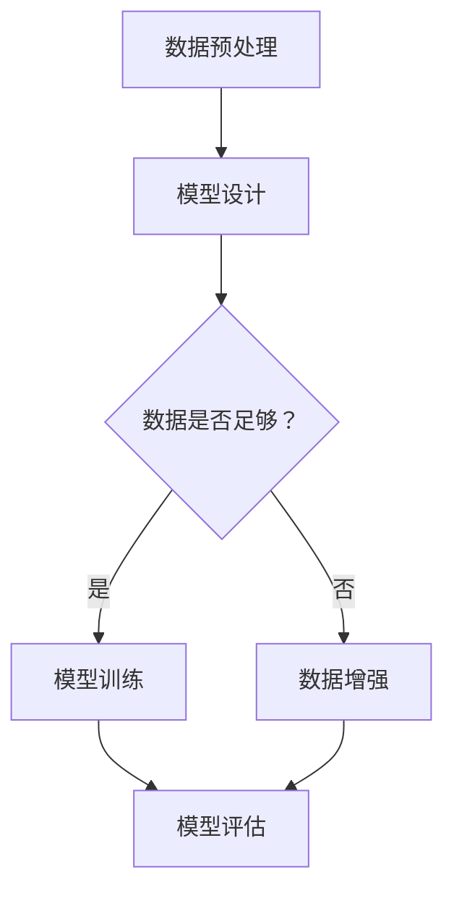

                 

# 适配大模型应用的敏捷研发模式

## 关键词
- 敏捷研发模式
- 大模型应用
- 计算机编程
- AI
- 软件开发
- 团队协作

## 摘要
本文将探讨适配大模型应用的敏捷研发模式。我们将逐步分析敏捷研发模式的基本理念、大模型的概述及其特点，并深入讨论如何将敏捷研发模式与大规模模型应用相结合，从而实现高效的软件研发。本文还将针对大模型研发中的挑战提出解决方案，并分享实际项目中的最佳实践和经验。通过本文的阅读，您将了解到如何在一个敏捷的框架内，更好地开发和部署大模型，提高研发效率和质量。

## 第一部分: 引言与背景

### 1.1 问题背景与核心概念

#### 1.1.1 软件研发模式的演变

传统的软件开发模式往往依赖于瀑布模型，即按照顺序逐步完成需求分析、设计、开发、测试等各个阶段。然而，随着软件系统的复杂性不断增加，传统的开发模式逐渐暴露出其局限性。现代软件开发需要更灵活、快速响应变化的方法，这就催生了敏捷研发模式的诞生。

#### 1.1.2 大模型的崛起与挑战

近年来，人工智能领域的飞速发展带来了大模型的崛起。这些模型，如GPT-3、BERT等，拥有强大的数据处理和模型学习能力，使得在各个领域都有了新的突破。然而，大模型的开发和部署也面临着一系列挑战，包括计算资源的高消耗、数据隐私和安全等问题。

#### 1.1.3 敏捷研发模式的必要性

敏捷研发模式强调快速响应变化、持续交付价值、高效团队协作等理念，非常适合大规模模型应用的开发。通过敏捷研发模式，我们可以更好地应对大模型开发中的挑战，提高研发效率，确保项目按时交付。

### 1.2 核心概念与联系

#### 1.2.1 大模型的基本概念

大模型，通常指的是参数数量庞大、结构复杂的神经网络模型。这些模型具有强大的数据处理和模型学习能力，能够处理海量数据并生成高质量的预测和决策。

#### 1.2.2 敏捷研发模式的特征

敏捷研发模式的核心特征包括用户故事驱动、迭代开发、持续集成、持续交付等。这些特征使得研发团队能够快速响应需求变化，持续交付高质量的产品。

#### 1.2.3 大模型与敏捷研发的融合

大模型与敏捷研发的融合，意味着在大模型开发过程中，采用敏捷研发模式的原则和方法。这种融合可以有效地提高大模型研发的效率和质量。

### 1.3 边界与外延

#### 1.3.1 大模型的适用范围

大模型广泛应用于自然语言处理、计算机视觉、语音识别等领域。然而，并非所有问题都适合使用大模型，选择合适的问题领域是关键。

#### 1.3.2 敏捷研发的适用场景

敏捷研发模式适合于需求频繁变化、产品迭代速度快的场景。在大模型应用中，敏捷研发模式可以帮助团队更好地应对需求变化和研发挑战。

#### 1.3.3 大模型与敏捷研发的边界

大模型开发与敏捷研发的融合需要平衡计算资源、数据隐私和研发效率等因素。我们需要在适应敏捷原则的同时，考虑到大模型的特点和挑战。

### 1.4 本章小结

本文介绍了软件研发模式的演变、大模型的崛起与挑战，以及敏捷研发模式的必要性和核心概念。下一部分，我们将深入探讨大模型的基本原理和特点。

----------------------------------------------------------------

## 第二部分: 大模型概述

### 2.1 大模型的基本原理

#### 2.1.1 大模型的发展历程

大模型的发展可以追溯到深度学习技术的兴起。早期，神经网络模型由于参数数量和结构限制，只能解决相对简单的问题。随着计算能力和算法的进步，深度学习模型逐渐变得更加复杂和强大。如今，大模型已经成为人工智能领域的重要研究热点。

#### 2.1.2 大模型的基本组成

大模型通常由输入层、隐藏层和输出层组成。输入层接收外部数据，隐藏层通过非线性变换处理数据，输出层产生预测或决策。大模型的核心在于其复杂的网络结构和大量的参数，这使得它们能够处理海量数据和生成高质量的预测。

#### 2.1.3 大模型的工作原理

大模型的工作原理基于神经网络的学习机制。通过大量的训练数据，大模型能够自动调整其内部参数，使其在特定任务上达到较高的准确性和泛化能力。这一过程通常涉及到前向传播、反向传播和优化算法等步骤。

### 2.2 主流大模型简介

#### 2.2.1 GPT系列模型

GPT（Generative Pre-trained Transformer）系列模型是自然语言处理领域的代表性大模型。GPT-3更是以1750亿个参数的规模创下了新的记录。GPT系列模型基于Transformer架构，通过预训练和微调，在多个自然语言处理任务上取得了卓越的性能。

#### 2.2.2 BERT及其变体

BERT（Bidirectional Encoder Representations from Transformers）是另一个重要的自然语言处理大模型。BERT通过双向Transformer架构，对文本进行全局理解，其在多种NLP任务上取得了显著的效果。BERT的变体，如RoBERTa、ALBERT等，进一步优化了模型结构和训练过程，提升了性能。

#### 2.2.3 其他典型大模型

除了GPT和BERT，还有许多其他典型的大模型，如计算机视觉领域的Vision Transformer（ViT）、语音识别领域的WaveNet等。这些模型在不同领域都有重要的应用和研究成果。

### 2.3 大模型的特点与优势

#### 2.3.1 计算能力与数据处理能力

大模型具有强大的计算能力和数据处理能力，能够处理海量数据和复杂特征。这使得大模型在许多应用场景中具有显著的优势。

#### 2.3.2 模型泛化能力与学习能力

大模型通过预训练和微调，能够从海量数据中学习到通用特征，从而实现良好的泛化能力。此外，大模型的学习能力也非常强大，能够快速适应新的任务和数据。

#### 2.3.3 大模型在商业应用中的优势

大模型在商业应用中具有广泛的前景，如智能客服、自然语言生成、图像识别等。它们能够为企业提供高效的解决方案，提高生产力和竞争力。

### 2.4 本章小结

本文介绍了大模型的基本原理、主流大模型及其特点与优势。下一部分，我们将探讨敏捷研发模式的基本理念和实践。

----------------------------------------------------------------

## 第三部分: 敏捷研发模式

### 3.1 敏捷研发的基本理念

#### 3.1.1 敏捷开发的核心价值观

敏捷开发强调一系列核心价值观，包括客户满意度、响应变化、团队合作、持续交付和持续学习。这些价值观指导着敏捷开发的方法和实践。

#### 3.1.2 敏捷开发与传统开发模式的对比

与传统的瀑布模型相比，敏捷开发更加强调迭代和增量开发，快速响应变化，持续交付价值。传统开发模式往往在需求确定后才开始设计、开发，而敏捷开发则更注重不断调整和优化。

#### 3.1.3 敏捷研发在团队协作中的优势

敏捷研发模式鼓励团队协作和沟通，通过每日站会、迭代回顾等机制，确保团队成员了解项目进展和目标。这种协作方式能够提高团队效率和项目质量。

### 3.2 敏捷研发的关键实践

#### 3.2.1 用户故事与迭代开发

用户故事是敏捷开发的核心概念之一，它以用户的视角描述功能需求。通过迭代开发，团队能够逐步实现这些需求，并不断调整和优化。

#### 3.2.2 真实案例：敏捷研发在企业的实践

在实际项目中，许多企业采用了敏捷研发模式，取得了显著的成效。这些案例展示了敏捷研发模式的适应性和灵活性。

#### 3.2.3 敏捷研发中的持续集成与持续交付

持续集成和持续交付是敏捷研发的重要实践。通过自动化测试和部署流程，团队能够确保代码的质量和交付的稳定性。

### 3.3 敏捷研发工具与技术

#### 3.3.1 敏捷项目管理工具

敏捷项目管理工具如Jira、Trello等，帮助团队跟踪任务、管理进度和评估绩效。这些工具支持敏捷开发的各项实践，如迭代规划、看板管理等。

#### 3.3.2 敏捷开发中的测试方法与工具

敏捷开发强调测试的持续性和自动化。各种测试工具如Selenium、JUnit等，帮助团队确保代码的质量和功能的稳定性。

#### 3.3.3 数据分析与可视化工具在敏捷研发中的应用

数据分析与可视化工具在敏捷研发中发挥着重要作用。通过实时数据分析，团队能够快速识别问题、调整策略和优化流程。

### 3.4 本章小结

本文介绍了敏捷研发模式的基本理念、关键实践和常用工具。下一部分，我们将探讨如何将敏捷研发模式应用于大模型开发。

----------------------------------------------------------------

## 第四部分: 适配大模型的敏捷研发流程

### 4.1 适配大模型的敏捷研发方法论

#### 4.1.1 从需求分析到模型交付的敏捷流程

在敏捷研发模式下，大模型的开发流程可以划分为需求分析、模型设计、模型训练、模型评估和模型交付等阶段。每个阶段都强调迭代和增量开发，确保项目能够快速响应变化和持续交付价值。

#### 4.1.2 大模型研发中的迭代与增量开发

迭代与增量开发是敏捷研发的核心实践。在大模型研发中，通过不断迭代和增量开发，团队能够逐步优化模型性能，提高研发效率。

#### 4.1.3 敏捷研发中的风险管理

风险管理是敏捷研发的重要环节。在大模型研发中，需要识别潜在的风险，并制定相应的应对策略，确保项目能够按时交付和达到预期效果。

### 4.2 实施步骤与关键点

#### 4.2.1 需求分析与模型设计

需求分析是整个大模型研发流程的起点。通过明确用户需求、分析问题场景，团队可以设计出适合的模型架构和参数设置。

#### 4.2.2 模型开发与训练

在模型开发与训练阶段，团队需要选择合适的算法和框架，进行模型构建和训练。这一阶段的关键点包括数据预处理、超参数调优和训练过程的监控。

#### 4.2.3 模型评估与优化

模型评估与优化是确保模型性能的关键步骤。通过在测试集上进行评估，团队可以识别模型的优点和不足，并采取相应的优化措施。

#### 4.2.4 模型部署与维护

模型部署与维护是最终将大模型应用于实际场景的重要环节。团队需要确保模型能够稳定运行，并根据用户反馈进行持续优化。

### 4.3 敏捷研发中的团队协作与沟通

#### 4.3.1 团队协作的最佳实践

敏捷研发强调团队协作，通过明确职责、共享信息和协作工具，团队可以高效地完成大模型研发任务。

#### 4.3.2 沟通与反馈机制

有效的沟通与反馈机制是敏捷研发的关键。通过定期的会议、回顾和反馈，团队可以及时发现和解决问题，提高研发效率。

#### 4.3.3 敏捷研发中的跨职能团队

跨职能团队是敏捷研发的重要组织形式。通过跨部门的协作，团队能够更好地整合资源、提高效率，实现大模型研发的成功。

### 4.4 本章小结

本文介绍了适配大模型的敏捷研发方法论、实施步骤和团队协作与沟通的最佳实践。下一部分，我们将探讨大模型研发中的挑战与解决方案。

----------------------------------------------------------------

## 第五部分: 大模型研发中的挑战与解决方案

### 5.1 大模型研发的挑战

#### 5.1.1 数据隐私与安全

大模型研发过程中，数据隐私和安全是一个重要挑战。模型训练需要大量数据，但这些数据往往涉及敏感信息。如何确保数据的安全和隐私，成为大模型研发的关键问题。

#### 5.1.2 大模型的可解释性

大模型通常被认为是“黑盒”模型，其决策过程难以解释。在大模型应用中，可解释性成为了一个重要的挑战。如何提高大模型的可解释性，使其决策过程更加透明和可信，是当前研究的热点。

#### 5.1.3 大模型训练成本与资源消耗

大模型训练通常需要大量的计算资源和时间。随着模型规模的增加，训练成本和资源消耗也在不断增加。如何优化训练过程，降低成本和资源消耗，是提高大模型研发效率的关键。

### 5.2 解决方案与最佳实践

#### 5.2.1 数据隐私保护技术

为了保护数据隐私，可以采用差分隐私、同态加密等技术，确保在数据训练和模型部署过程中，敏感信息不会被泄露。

#### 5.2.2 大模型的可解释性研究

提高大模型的可解释性，可以通过模型结构设计、可视化技术等方法实现。例如，通过添加解释性层、使用可视化工具等方式，使模型的决策过程更加透明。

#### 5.2.3 资源优化与成本控制策略

为了降低大模型训练成本和资源消耗，可以采用分布式训练、模型压缩等技术。此外，通过合理规划训练资源和优化训练策略，也可以有效降低成本。

### 5.3 实战案例解析

#### 5.3.1 某企业大模型研发项目的挑战与解决方案

以某企业的自然语言处理项目为例，该项目在数据隐私保护、模型可解释性和资源优化方面面临了一系列挑战。通过采用差分隐私技术、模型解释性可视化工具和分布式训练策略，该项目成功地解决了这些问题。

#### 5.3.2 大模型在特定领域应用的挑战与应对策略

在大模型应用中，不同领域可能面临不同的挑战。例如，在医疗领域，数据隐私保护和模型可解释性尤为重要。通过采用隐私保护算法和可视化技术，可以有效应对这些挑战。

### 5.4 本章小结

本文探讨了大模型研发中的挑战，并提出了相应的解决方案和最佳实践。通过实战案例的解析，读者可以了解到如何在实际项目中应对这些挑战。

----------------------------------------------------------------

## 第六部分: 实际项目中的敏捷研发案例分析

### 6.1 项目背景与目标

在本案例中，我们选择了一家知名互联网公司的自然语言处理（NLP）项目作为研究对象。该项目旨在开发一款智能客服系统，通过大模型处理用户查询，提供快速、准确的答案。项目目标包括：提高客服效率、降低人工成本、提升用户体验。

### 6.2 环境安装与配置

为了进行项目的敏捷研发，团队首先进行了环境安装和配置。具体步骤如下：

1. **环境搭建**：安装Python、TensorFlow等必备软件，配置虚拟环境。
2. **依赖管理**：使用pip或conda管理项目依赖，确保所有依赖项的版本兼容。
3. **开发工具**：选择Jira、Git等工具，以支持敏捷开发流程。

### 6.3 系统核心实现

在系统核心实现阶段，团队分为以下几个部分：

1. **数据预处理**：使用Pandas和Numpy等库进行数据清洗、预处理和特征提取。
2. **模型设计**：采用BERT模型，结合Transformer架构，实现文本嵌入和序列建模。
3. **模型训练**：利用GPU加速训练过程，使用PyTorch或TensorFlow等框架进行模型训练。
4. **模型评估**：在测试集上进行模型评估，使用准确率、召回率等指标评估模型性能。

### 6.4 代码应用解读与分析

以下是一个简化的代码示例，用于实现BERT模型的训练过程：

```python
import torch
import transformers

# 加载预训练的BERT模型
model = transformers.BertModel.from_pretrained('bert-base-uncased')

# 定义损失函数和优化器
optimizer = torch.optim.Adam(model.parameters(), lr=1e-5)
loss_function = torch.nn.CrossEntropyLoss()

# 模型训练过程
for epoch in range(3):
    for inputs, labels in data_loader:
        optimizer.zero_grad()
        outputs = model(inputs)
        loss = loss_function(outputs.logits, labels)
        loss.backward()
        optimizer.step()

    print(f"Epoch {epoch+1}, Loss: {loss.item()}")
```

代码解读：

- **模型加载**：使用`from_pretrained`方法加载预训练的BERT模型。
- **定义优化器和损失函数**：配置Adam优化器和交叉熵损失函数。
- **模型训练**：通过前向传播和反向传播，进行模型训练。

### 6.5 实际案例分析与详细讲解

在实际项目中，团队遇到了以下问题：

1. **训练效率低**：由于数据量大，训练时间过长。
2. **模型性能不稳定**：在多次训练中，模型性能波动较大。

为了解决这些问题，团队采取了以下措施：

1. **分布式训练**：通过多GPU分布式训练，提高训练效率。
2. **数据增强**：对训练数据进行增强，提高模型稳定性。

详细讲解：

- **分布式训练**：使用PyTorch的DistributedDataParallel（DDP）模块，实现多GPU训练。代码如下：

```python
import torch.distributed as dist

# 初始化分布式环境
dist.init_process_group(backend='nccl', init_method='env://')

# 加载预训练的BERT模型
model = transformers.BertModel.from_pretrained('bert-base-uncased')
model = model.cuda()

# 定义分布式模型
model = torch.nn.parallel.DistributedDataParallel(model)

# 模型训练过程与之前类似，此处省略
```

- **数据增强**：通过随机替换词语、插入噪声等方式，增加训练数据的多样性。代码示例：

```python
import random

def random_word_substitution(text):
    words = text.split()
    for i in range(len(words)):
        if random.random() < 0.1:
            words[i] = random.choice(["<unk>", "<mask>"])
    return " ".join(words)
```

### 6.6 项目小结

通过实际项目中的敏捷研发，团队成功开发了智能客服系统，提高了客服效率和用户体验。项目过程中，团队采用了分布式训练和数据增强等策略，有效解决了训练效率和模型性能不稳定的问题。该案例展示了敏捷研发模式在大模型应用中的实践效果。

## 第七部分: 最佳实践与总结

### 7.1 最佳实践

1. **敏捷研发与模型训练结合**：在大模型开发过程中，充分利用敏捷研发的迭代和增量开发原则，快速迭代和优化模型。
2. **分布式训练与资源优化**：采用分布式训练和模型压缩等技术，提高训练效率，降低成本。
3. **数据隐私保护与模型可解释性**：在模型训练和部署过程中，采用数据隐私保护技术和模型解释性工具，确保数据安全和模型透明性。

### 7.2 小结

本文探讨了适配大模型应用的敏捷研发模式，从背景介绍、核心概念、研发流程、挑战与解决方案等方面进行了详细分析。通过实际项目案例分析，展示了敏捷研发模式在大模型开发中的实践效果。总结起来，敏捷研发模式在大模型应用中具有重要意义，能够提高研发效率、确保项目成功。

### 7.3 注意事项

1. **需求明确**：在大模型开发过程中，确保需求明确，避免需求变更导致的研发延期。
2. **团队协作**：加强团队协作，提高沟通效率，确保项目顺利进行。
3. **持续学习**：紧跟技术发展趋势，持续学习和掌握新工具、新方法，提高研发能力。

### 7.4 拓展阅读

1. **《大模型：深度学习时代的革新》**：介绍了大模型的基本概念、发展历程和应用场景。
2. **《敏捷研发实践指南》**：详细阐述了敏捷研发的原则、方法和工具。
3. **《人工智能应用实践》**：探讨了人工智能在各个领域的应用案例和最佳实践。

## 作者信息

- 作者：AI天才研究院/AI Genius Institute & 禅与计算机程序设计艺术 /Zen And The Art of Computer Programming

本文由AI天才研究院和禅与计算机程序设计艺术共同撰写，旨在为广大读者提供有价值的技术分享和指导。如果您有任何问题或建议，欢迎联系我们，我们将竭诚为您服务。期待与您共同探讨大模型与敏捷研发的更多精彩话题。## 附件

### 附件1: Mermaid流程图

以下是一个简单的Mermaid流程图示例，用于描述大模型训练的基本流程：



### 附件2: LaTex数学公式

以下是一个LaTex数学公式示例，用于描述线性回归模型中的损失函数：

```latex
\[
J(\theta) = \frac{1}{2m} \sum_{i=1}^{m} \left( h_\theta(x^{(i)}) - y^{(i)} \right)^2
\]
```

该公式表示模型参数为$\theta$的线性回归模型的损失函数，其中$h_\theta(x^{(i)})$是模型对输入$x^{(i)}$的预测值，$y^{(i)}$是实际标签值，$m$是样本数量。损失函数用于衡量模型预测值与实际值之间的差距，越小表示模型性能越好。

