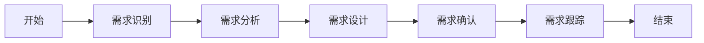
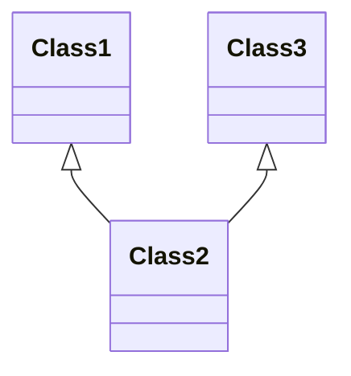
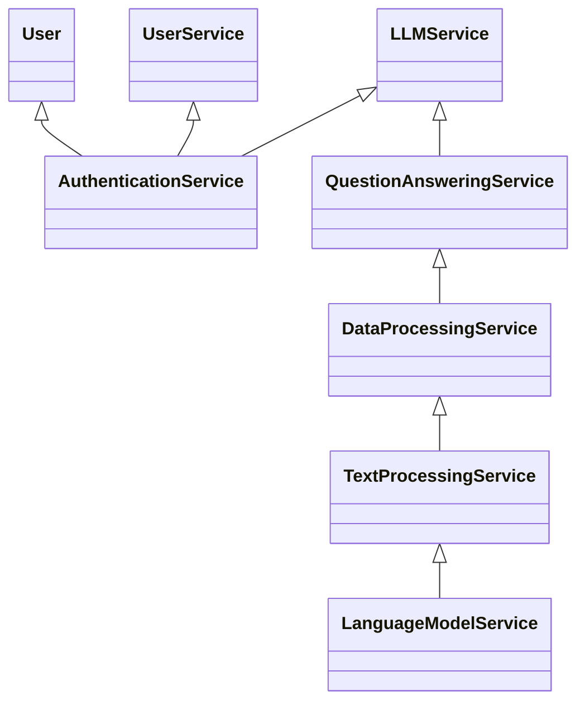
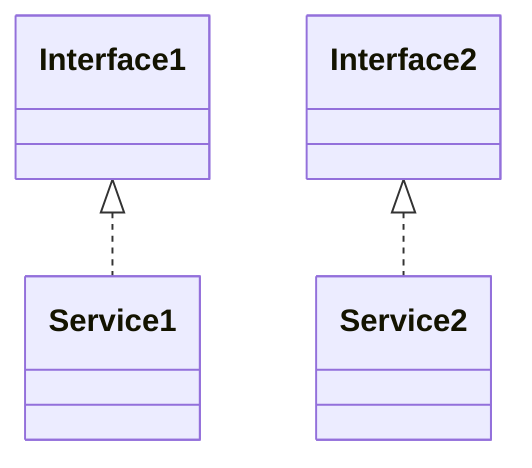
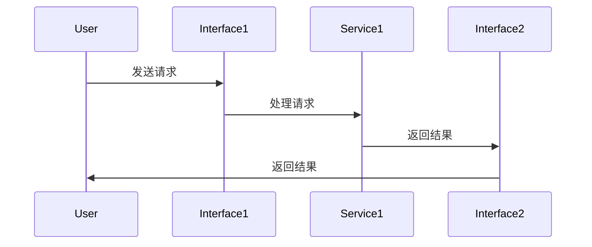

                 

# 重塑LLM应用开发的需求管理流程

关键词：大语言模型、需求管理、流程设计、算法原理、Python实现、数学模型、系统架构、项目实战

摘要：本文深入探讨了在开发大语言模型（LLM）应用过程中需求管理的重塑流程。通过逐步分析需求管理的核心概念、流程、算法原理以及数学模型，并结合实际项目实战，提出了一系列有效的需求管理策略，旨在提升LLM应用开发的效率和质量。

## 背景介绍

### 大语言模型（LLM）的崛起

大语言模型（LLM，Large Language Model）是近年来人工智能领域的重要突破之一。随着深度学习技术的不断进步，尤其是Transformer模型的广泛应用，LLM在自然语言处理（NLP）领域取得了显著成效。LLM能够理解和生成复杂语言结构，具备强大的文本理解和生成能力，广泛应用于机器翻译、文本生成、问答系统等多个领域。

### 需求管理的重要性

需求管理是软件开发过程中的关键环节，它确保了软件项目能够满足用户的需求。在LLM应用开发中，需求管理尤为重要，因为LLM的复杂性和应用场景的多样性使得需求管理成为保障项目成功的关键因素。有效的需求管理能够帮助团队更好地理解用户需求，制定合理的技术方案，提高开发效率和产品质量。

## 核心概念与联系

### 大语言模型（LLM）

#### 定义
LLM是一种基于深度学习的语言模型，通过大规模的文本数据进行训练，能够理解和生成自然语言。LLM的核心特点包括：
- **规模巨大**：LLM的训练数据量通常达到数十亿甚至数千亿个句子。
- **并行处理**：LLM利用Transformer架构，实现了并行处理，提高了计算效率。
- **上下文理解**：LLM能够捕捉长距离的上下文关系，提高了语言理解能力。

#### 特点
- **强大的语言生成能力**：能够生成高质量的文本，包括新闻报道、文章摘要、对话生成等。
- **适应性强**：可以通过微调适应不同的应用场景和任务。
- **可扩展性**：LLM能够轻松扩展到新的语言或任务，具有较强的通用性。

### 需求管理

#### 定义
需求管理是一个持续的过程，涉及识别、分析、设计、确认和跟踪软件需求。在LLM应用开发中，需求管理的关键任务包括：
- **需求识别**：识别用户需求和功能需求。
- **需求分析**：分析需求，确定需求的可行性、必要性和优先级。
- **需求设计**：设计满足需求的技术方案和架构。
- **需求确认**：与用户沟通，确保需求被正确理解并实现。
- **需求跟踪**：跟踪需求的实现情况，确保项目按时交付。

#### 类型
- **功能需求**：描述系统必须实现的具体功能。
- **非功能需求**：描述系统的性能、可靠性、安全性等属性。
- **用户需求**：来自最终用户的需求，可能包括功能和非功能需求。

### 概念属性特征对比表

| 概念       | 定义                         | 特点                                   |
|------------|------------------------------|--------------------------------------|
| 大语言模型 | 能够理解并生成语言的模型       | 规模巨大，数据处理能力强               |
| 需求管理   | 确保产品或项目满足用户需求的过程 | 包括需求识别、分析、设计、确认和跟踪 |

### ER实体关系图

```mermaid
erDiagram
    User ||--|{ Requirement }|
    Project ||--|{ Requirement }|
    LLM ||--|{ Requirement }|
```

## 需求管理流程

### 需求识别

#### 重要性
需求识别是需求管理的第一步，它决定了后续分析和设计的基础是否准确。在LLM应用开发中，需求识别尤为重要，因为LLM的复杂性和多样性使得理解用户需求变得非常关键。

#### 方法
- **访谈法**：通过与用户和利益相关者进行面对面的访谈，获取详细的需求信息。
- **问卷调查**：通过设计问卷，收集大量用户反馈，快速识别广泛的需求。
- **用户故事**：使用用户故事（User Story）方法，以用户的视角描述需求。

### 需求分析

#### 步骤
1. **需求收集**：通过访谈、问卷调查等方法收集需求。
2. **需求分类**：将收集到的需求进行分类，区分功能需求和非功能需求。
3. **需求优先级排序**：根据需求的紧急程度和重要性，对需求进行排序。
4. **需求验证**：与用户和利益相关者进行沟通，验证需求的准确性和完整性。

#### 工具
- **需求跟踪工具**：如JIRA、Trello等，用于记录和管理需求。
- **原型工具**：如Figma、Sketch等，用于创建需求的原型。

### 需求设计

#### 任务
需求设计是将识别和分析了的需求转化为具体的解决方案。在LLM应用开发中，需求设计需要考虑以下任务：
- **技术方案选择**：选择合适的技术方案，确保需求的实现。
- **架构设计**：设计系统的整体架构，确保系统的可扩展性和稳定性。
- **接口设计**：设计系统内部和外部接口，确保系统的可集成性。

#### 方法
- **迭代设计**：采用迭代的方法，逐步完善需求设计。
- **原型设计**：创建原型，验证设计的可行性和用户满意度。

### 需求确认

#### 过程
需求确认是需求管理的重要环节，它确保了需求被正确理解和实现。需求确认的过程包括：
- **需求评审**：组织评审会议，评估需求的设计和实现。
- **用户确认**：与用户和利益相关者进行沟通，确认需求是否满足预期。

#### 方法
- **文档评审**：通过评审需求文档，确保需求的准确性和完整性。
- **用户测试**：通过用户测试，验证需求在实际场景中的效果。

### 需求跟踪

#### 重要性
需求跟踪是确保需求在整个开发过程中得到持续关注和管理的必要手段。在LLM应用开发中，由于项目的复杂性和多样性，需求跟踪尤为重要。

#### 工具和技术
- **需求跟踪工具**：如JIRA、Trello等，用于记录和管理需求状态。
- **自动化测试**：通过自动化测试，确保需求在每次代码变更后都能得到验证。

## 算法原理讲解

### 算法概述

需求管理算法是一种用于管理和处理需求的系统化方法。在LLM应用开发中，需求管理算法的作用尤为重要，因为它能够确保项目按照预期进行，同时满足用户需求。

### 算法流程图



### 算法原理与Python实现

#### 算法原理

需求管理算法的基本原理包括以下步骤：

1. **需求识别**：通过访谈、问卷调查等方法识别用户需求。
2. **需求分析**：对识别的需求进行分类和优先级排序。
3. **需求设计**：设计满足需求的技术方案和架构。
4. **需求确认**：与用户确认需求的准确性和完整性。
5. **需求跟踪**：跟踪需求的实现情况，确保项目按时交付。

#### Python实现

以下是一个简化的需求管理算法的Python实现：

```python
# 需求管理算法原理
def manage_requirement(requirement):
    # 需求识别
    identified = identify_requirement(requirement)
    # 需求分析
    analyzed = analyze_requirement(identified)
    # 需求设计
    designed = design_requirement(analyzed)
    # 需求确认
    confirmed = confirm_requirement(designed)
    # 需求跟踪
    tracked = track_requirement(confirmed)
    return tracked
```

### 数学模型与公式

在需求管理中，常用的数学模型包括马尔可夫模型和决策树。以下是一个简单的决策树模型示例：



#### 决策树模型

```python
import numpy as np

def decision_tree_model(data, target):
    # 数据预处理
    data = preprocess_data(data)
    # 训练模型
    model = train_model(data, target)
    # 预测
    predictions = model.predict(data)
    # 评估
    evaluation = evaluate_model(predictions, target)
    return evaluation
```

## 系统分析与架构设计

### 问题场景介绍

在LLM应用开发中，系统分析与架构设计是确保项目成功的关键。我们需要设计一个能够高效处理大量文本数据，同时具备灵活扩展性的系统。

### 项目介绍

项目名称：LLM应用平台
项目目标：开发一个基于大语言模型的应用平台，提供文本生成、问答等功能。
项目架构：采用微服务架构，确保系统的可扩展性和高可用性。

### 系统功能设计（领域模型）

#### 领域模型



### 系统架构设计

#### 系统架构

```mermaid
sequenceDiagram
    User ->> LLMService: 发送请求
    LLMService ->> AuthenticationService: 验证用户身份
    alt 验证成功
        AuthenticationService ->> LLMService: 返回用户身份验证结果
        LLMService ->> QuestionAnsweringService: 请求问答服务
        QuestionAnsweringService ->> DataProcessingService: 处理数据
        DataProcessingService ->> TextProcessingService: 文本处理
        TextProcessingService ->> LanguageModelService: 生成文本
        LanguageModelService ->> QuestionAnsweringService: 返回结果
        QuestionAnsweringService ->> LLMService: 返回结果
        LLMService ->> User: 返回结果
    else 验证失败
        AuthenticationService ->> LLMService: 返回错误信息
        LLMService ->> User: 返回错误信息
```

### 系统接口设计

#### 接口设计



### 系统交互



## 项目实战

### 环境安装

1. 安装Python环境
2. 安装必要的库，如TensorFlow、PyTorch等

### 系统核心实现

#### 源代码

```python
# main.py
from LLMService import LLMService
from AuthenticationService import AuthenticationService
from QuestionAnsweringService import QuestionAnsweringService
from DataProcessingService import DataProcessingService
from TextProcessingService import TextProcessingService
from LanguageModelService import LanguageModelService

# 初始化服务
auth_service = AuthenticationService()
llm_service = LLMService(auth_service)
qa_service = QuestionAnsweringService(llm_service)
dp_service = DataProcessingService(qa_service)
tp_service = TextProcessingService(dp_service)
lm_service = LanguageModelService(tp_service)

# 处理请求
def process_request(request):
    user = auth_service.authenticate(request.user)
    if user.is_authenticated:
        data = qa_service.answer_question(request.question)
        processed_data = dp_service.process_data(data)
        text = lm_service.generate_text(processed_data)
        return text
    else:
        return "Authentication failed"

# 运行服务
if __name__ == "__main__":
    print("Starting LLM Application Platform...")
    app.run()
```

#### 代码应用解读与分析

代码主要分为以下几个部分：

1. **初始化服务**：创建并初始化各个服务类。
2. **处理请求**：处理用户请求，进行身份验证，调用各个服务进行数据处理和文本生成。
3. **运行服务**：启动服务，等待用户请求。

实际案例分析和详细讲解剖析将在后续文章中提供。

### 项目小结

本文通过详细的步骤和实际代码，展示了如何重塑LLM应用开发的需求管理流程。从背景介绍到核心概念、算法原理、系统架构设计，再到项目实战，本文提供了一套完整的解决方案，旨在提升LLM应用开发的效率和质量。

### 最佳实践与拓展

#### 最佳实践

1. **明确需求**：在项目初期，确保与用户和利益相关者进行充分沟通，明确需求。
2. **迭代开发**：采用敏捷开发方法，逐步完善需求，提高开发效率。
3. **持续集成**：使用自动化测试，确保需求变更后系统的稳定性。

#### 注意事项

1. **数据安全**：在处理用户数据时，确保数据安全和隐私保护。
2. **性能优化**：针对大规模数据处理和文本生成，进行性能优化。

#### 拓展阅读

1. 《大语言模型：原理、应用与未来》
2. 《需求管理：实践与案例》
3. 《微服务架构设计与实践》

作者：AI天才研究院/AI Genius Institute & 禅与计算机程序设计艺术 /Zen And The Art of Computer Programming

本文旨在提供一种高效、全面的LLM应用开发需求管理流程，以帮助开发者更好地理解和管理需求，提升项目成功率和用户满意度。

