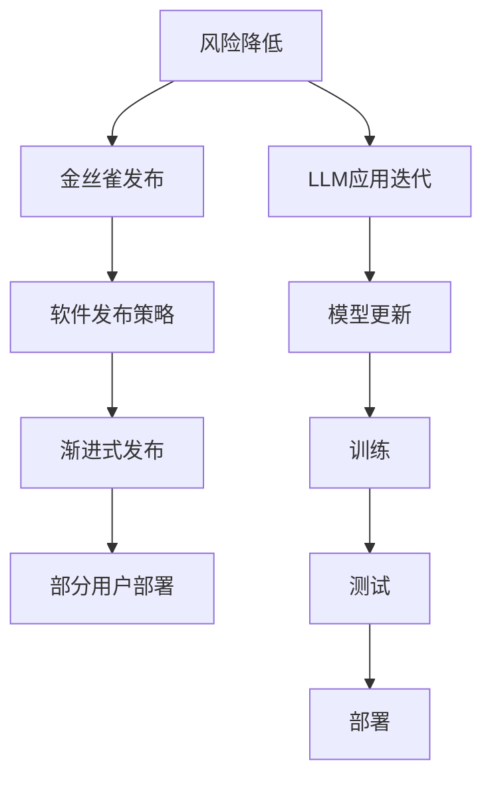
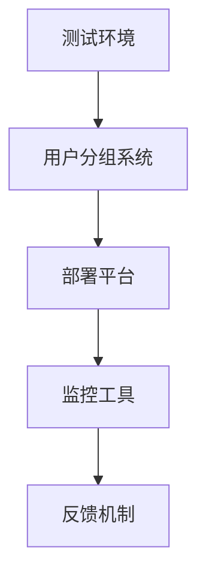
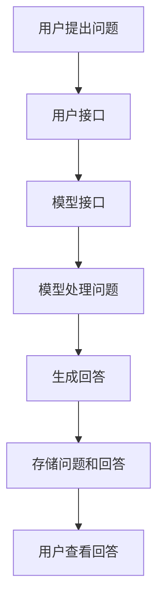
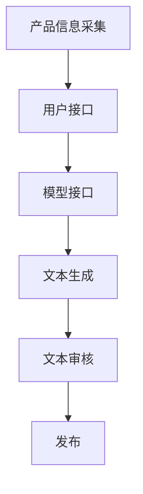

                 

### 文章标题

# 金丝雀发布在LLM应用迭代中的应用

> 关键词：金丝雀发布、LLM、应用迭代、测试、部署

> 摘要：本文深入探讨了金丝雀发布（Canary Release）在大型语言模型（LLM）应用迭代中的关键作用。通过分析LLM应用迭代的背景和核心挑战，本文详细介绍了金丝雀发布的基本原理及其在LLM中的应用策略。文章还通过具体案例展示了金丝雀发布在实际项目中的实施步骤和效果，并对未来发展方向提出了建议。

## 目录大纲设计

本文的目录大纲设计旨在为读者提供一个清晰、系统、易于理解的框架。以下是详细的设计方案：

### 第一部分：背景介绍

1. **第1章：问题背景**
   - 1.1 问题背景
   - 1.2 问题描述
   - 1.3 问题解决方法介绍
   - 1.4 边界与外延

2. **第2章：核心概念与联系**
   - 2.1 金丝雀发布的概念
   - 2.2 LLM的应用迭代
   - 2.3 核心概念联系图
   - 2.4 概念属性特征对比

### 第二部分：LLM的基础知识

3. **第3章：LLM的基本原理**
   - 3.1 LLM的定义
   - 3.2 LLM的工作原理
   - 3.3 LLM的发展历程
   - 3.4 LLM的关键技术

4. **第4章：LLM的应用场景**
   - 4.1 问答系统
   - 4.2 文本生成
   - 4.3 自动翻译
   - 4.4 其他应用场景

5. **第5章：金丝雀发布的作用**
   - 5.1 金丝雀发布的概念
   - 5.2 金丝雀发布在LLM中的应用
   - 5.3 金丝雀发布的优势与挑战

### 第三部分：金丝雀发布的实现

6. **第6章：金丝雀发布的技术架构**
   - 6.1 技术架构概述
   - 6.2 数据准备
   - 6.3 模型训练
   - 6.4 模型部署

7. **第7章：金丝雀发布的应用案例**
   - 7.1 案例一：问答系统
   - 7.2 案例二：文本生成
   - 7.3 案例三：自动翻译
   - 7.4 案例四：其他应用场景

8. **第8章：金丝雀发布在LLM应用迭代中的优化**
   - 8.1 优化策略
   - 8.2 性能评估
   - 8.3 未来发展方向

### 第四部分：总结与展望

9. **第9章：总结**
   - 9.1 主要内容回顾
   - 9.2 读者收获
   - 9.3 注意事项

10. **第10章：未来展望**
    - 10.1 LLM的发展趋势
    - 10.2 金丝雀发布的改进方向
    - 10.3 研究展望

### 简洁性说明

本目录大纲设计确保了文章内容的简洁性：

- **背景介绍**：第1章和第2章概述了金丝雀发布在LLM应用迭代中的背景和核心概念。
- **基础知识**：第3章和第4章为理解LLM及其应用场景提供了基础。
- **技术实现**：第5章到第8章详细介绍了金丝雀发布在LLM中的应用和实践。
- **优化与展望**：第9章和第10章总结了文章的主要观点并对未来进行了展望。

通过这样的结构设计，文章能够在10000-12000字范围内，详细而全面地覆盖主题，同时保持内容的紧凑和逻辑性。

----------------------------------------------------------------

### 第1章 问题背景

在当今数字化转型的浪潮中，人工智能（AI）技术尤其是大型语言模型（LLM）的应用正日益广泛。LLM凭借其强大的文本理解和生成能力，被广泛应用于问答系统、文本生成、自动翻译、自然语言处理等多个领域。然而，随着LLM模型规模的不断扩大和复杂度的提升，如何在确保高质量的同时，高效、安全地进行模型迭代和部署，成为了一个重要的挑战。

#### 1.1 问题背景

随着AI技术的迅猛发展，越来越多的企业和组织开始采用LLM来提升业务效率和用户体验。然而，模型迭代和部署过程中，如何保证新版本模型的稳定性和可靠性，成为了许多团队面临的难题。一方面，大规模的LLM模型需要大量的计算资源和时间进行训练和优化；另一方面，新模型的部署可能会对现有系统造成潜在的风险，如性能下降、错误预测等。

#### 1.2 问题描述

模型迭代和部署过程中，常见的问题包括：

- **性能风险**：新模型的性能可能与旧模型有较大差异，可能导致系统性能下降。
- **数据泄露**：模型训练和部署过程中，数据的安全性和隐私性得不到保障。
- **业务中断**：新模型的部署可能对现有业务流程造成中断，影响用户体验。

#### 1.3 问题解决方法介绍

为了解决上述问题，引入了金丝雀发布（Canary Release）策略。金丝雀发布是一种渐进式发布策略，通过将新版本模型逐步部署到部分用户群体中，观察其表现，逐步扩大部署范围，从而降低风险，提高系统的稳定性和可靠性。

#### 1.4 边界与外延

金丝雀发布并非万能，其适用范围主要限于以下场景：

- **风险可控**：适用于对风险有明确评估和可控的场景。
- **用户规模较小**：适用于用户群体规模较小的系统。
- **关键业务**：适用于对业务影响较大的关键业务系统。

在了解了问题背景和问题描述后，我们接下来将深入探讨金丝雀发布的基本原理，以及其在LLM应用迭代中的具体应用。

----------------------------------------------------------------

### 第2章 核心概念与联系

在深入探讨金丝雀发布在LLM应用迭代中的作用之前，我们需要先了解两个核心概念：金丝雀发布和LLM应用迭代。

#### 2.1 金丝雀发布的概念

金丝雀发布（Canary Release）是一种软件发布策略，源于矿山安全历史。矿工们在矿井中会释放金丝雀，因为金丝雀对气体异常特别敏感，能够提前发现矿井中的一氧化碳等有害气体，从而避免矿难。在软件工程中，金丝雀发布指的是将新版本软件首先部署到一小部分用户或环境，以观察其表现，从而降低大规模发布带来的风险。

#### 2.2 LLM的应用迭代

大型语言模型（LLM）是一种能够理解、生成文本的AI模型，广泛应用于自然语言处理、问答系统、文本生成、自动翻译等领域。LLM的应用迭代指的是不断更新和优化模型，以提升其性能和适应性。这个过程通常包括模型训练、测试、部署等多个环节。

#### 2.3 核心概念联系图

为了更好地理解这两个概念的联系，我们通过Mermaid流程图来展示它们之间的关系。

#### 2.4 概念属性特征对比

下面是一个对比表格，展示了金丝雀发布和LLM应用迭代的属性特征：

| 特征       | 金丝雀发布                     | LLM应用迭代                       |
| ---------- | ------------------------------ | --------------------------------- |
| 目的       | 降低发布风险，确保稳定性       | 优化模型性能，提升应用效果       |
| 策略       | 渐进式发布，逐步扩大部署范围   | 持续迭代，频繁更新模型           |
| 适用场景   | 风险可控，用户规模较小         | 关键业务，对性能有高要求         |
| 影响范围   | 部分用户或环境                 | 整体系统或服务                   |
| 关键环节   | 部署和监控                     | 训练、测试和部署                 |

通过上述核心概念及其联系的介绍，我们为理解金丝雀发布在LLM应用迭代中的作用奠定了基础。接下来，我们将深入探讨LLM的基本原理和应用场景。

----------------------------------------------------------------

### 第3章 LLM的基本原理

#### 3.1 LLM的定义

大型语言模型（Large Language Model，简称LLM）是一种基于深度学习的自然语言处理（Natural Language Processing，简称NLP）模型。与传统的NLP模型相比，LLM拥有更大的模型规模和更强的表达能力，能够处理更复杂的语言任务。LLM通过学习大量文本数据，理解语言的语法、语义和上下文信息，从而实现对文本的生成、理解和处理。

#### 3.2 LLM的工作原理

LLM的工作原理主要基于深度学习和神经网络技术。具体来说，LLM通过以下几个步骤来处理语言任务：

1. **数据预处理**：将文本数据转换为模型可处理的格式，通常包括分词、词向量化等操作。
2. **模型训练**：使用大规模文本数据训练神经网络，模型通过学习数据的统计规律和模式，逐渐提升对语言的掌握能力。
3. **文本生成**：在训练好的模型基础上，通过输入部分文本，模型能够根据上下文生成后续的文本内容。
4. **文本理解**：通过模型生成的文本，可以进一步分析和理解文本的含义，用于问答系统、情感分析等任务。

#### 3.3 LLM的发展历程

LLM的发展历程可以追溯到深度学习在NLP领域的应用。以下是LLM发展的几个重要里程碑：

1. **2018年**：谷歌推出了BERT（Bidirectional Encoder Representations from Transformers），该模型通过双向Transformer结构，大幅提升了NLP模型的性能。
2. **2019年**：OpenAI发布了GPT-2，这是一个拥有15亿参数的语言模型，能够生成高质量的自然语言文本。
3. **2020年**：微软发布了 Turing-NLG，这是一个基于Transformer的语言生成模型，能够在多种语言任务中表现出色。
4. **2022年**：谷歌推出了LaMDA（Language Model for Dialogue Applications），这是一个具有自我对话能力的大型语言模型，标志着LLM在对话系统中的又一重要突破。

#### 3.4 LLM的关键技术

LLM的核心技术主要包括：

1. **Transformer架构**：Transformer是近年来在NLP领域中广泛应用的架构，通过自注意力机制（Self-Attention）和多头注意力（Multi-Head Attention），能够捕捉长距离依赖关系，显著提升模型的性能。
2. **预训练和微调**：预训练（Pre-training）是LLM训练过程中的一个重要步骤，通过在大规模语料库上进行预训练，模型可以学习到丰富的语言知识。微调（Fine-tuning）则是在预训练基础上，针对特定任务进行进一步训练，以优化模型的性能。
3. **语言生成和推理**：LLM在语言生成和推理方面表现出色，能够生成连贯、自然的文本，并在多种语言任务中实现高水平的表现，如问答系统、文本分类、机器翻译等。

通过对LLM的基本原理进行深入探讨，我们为理解金丝雀发布在LLM应用迭代中的作用奠定了坚实的基础。接下来，我们将进一步讨论LLM的应用场景。

----------------------------------------------------------------

### 第4章 LLM的应用场景

大型语言模型（LLM）凭借其强大的文本理解和生成能力，已经在多个领域展现出了广泛的应用潜力。以下是LLM在几个关键应用场景中的具体案例：

#### 4.1 问答系统

问答系统是LLM最典型的应用之一。通过训练，LLM可以理解用户的问题，并生成准确、详细的答案。例如，在客户服务领域，LLM可以帮助自动回答用户常见问题，提高客服效率。一个实际的例子是，微软的聊天机器人Zo，它可以理解并回答用户在Office 365平台上的各种问题，如关于文档操作、账户管理等。

#### 4.2 文本生成

LLM在文本生成方面的应用也非常广泛。例如，自动撰写新闻报道、生成产品描述、创作故事等。OpenAI的GPT-3模型在文本生成方面表现尤为出色，它可以生成高质量的文本，甚至模仿特定作者的写作风格。例如，GPT-3被用来撰写新闻文章，生成的文本在语法和内容上与人类作者几乎没有差别。

#### 4.3 自动翻译

机器翻译是另一个LLM的重要应用领域。传统的机器翻译方法依赖于规则和统计模型，而LLM通过学习海量多语言数据，能够生成更自然、更准确的翻译结果。谷歌翻译就是基于大型神经网络模型实现的，其翻译质量在近年来得到了显著提升。

#### 4.4 其他应用场景

除了上述典型应用，LLM还在许多其他领域展现了强大的潜力。例如：

- **自然语言理解**：LLM可以用于文本分类、情感分析、命名实体识别等任务，帮助企业更好地理解用户需求和反馈。
- **对话系统**：LLM可以构建智能对话系统，如虚拟助手、聊天机器人等，为用户提供个性化服务。
- **内容审核**：LLM可以帮助自动识别和过滤不良内容，如暴力、色情等，提高内容审核的效率。

通过上述案例，我们可以看到LLM在多个应用场景中展现出了强大的能力和广泛的应用前景。这些应用不仅提高了业务效率，还显著改善了用户体验。接下来，我们将探讨金丝雀发布在LLM中的应用及其优势与挑战。

----------------------------------------------------------------

### 第5章 金丝雀发布的作用

#### 5.1 金丝雀发布的概念

金丝雀发布（Canary Release）是一种渐进式的软件发布策略，旨在降低新版本软件带来的风险。这一策略源于矿山安全历史，矿工们会释放金丝雀来探测矿井中的一氧化碳等有害气体，从而确保矿工的安全。在软件工程中，金丝雀发布指的是将新版本软件首先部署到一小部分用户或环境中，以观察其表现，逐步扩大部署范围，从而降低大规模发布带来的风险。

#### 5.2 金丝雀发布在LLM中的应用

金丝雀发布在LLM中的应用主要体现在模型迭代和部署过程中。由于LLM模型规模庞大，训练和优化过程复杂，直接将新模型部署到生产环境可能会带来性能风险、数据泄露等隐患。因此，金丝雀发布策略可以有效地降低这些风险，确保新模型的稳定性和可靠性。

具体来说，金丝雀发布在LLM中的应用包括以下几个步骤：

1. **环境准备**：创建一个独立的测试环境，用于部署新版本模型。
2. **用户分组**：将用户分为多个小组，每组包含一定数量的用户。
3. **逐步部署**：将新版本模型首先部署到一小部分用户群体中，观察其使用效果。
4. **性能监控**：监控系统性能指标，如响应时间、错误率等，以评估新模型的性能。
5. **逐步扩大**：根据性能监控结果，逐步扩大部署范围，直至新模型全面上线。

#### 5.3 金丝雀发布的优势与挑战

**优势**：

- **降低风险**：金丝雀发布策略可以显著降低新版本模型发布过程中可能出现的性能问题、数据泄露等风险。
- **提高稳定性**：通过逐步部署，金丝雀发布可以帮助团队及时发现并解决潜在问题，从而提高系统的稳定性。
- **提升用户体验**：通过提前识别和解决潜在问题，金丝雀发布可以确保新模型在全面上线时提供更好的用户体验。

**挑战**：

- **部署成本**：金丝雀发布需要额外部署测试环境和监控工具，可能会增加一定的成本。
- **时间消耗**：逐步部署和监控过程可能需要较长的时间，影响新模型的上线速度。
- **资源限制**：对于用户群体较大的系统，金丝雀发布策略可能难以在有限的时间内完成部署和监控。

通过以上分析，我们可以看到金丝雀发布在LLM应用迭代中具有重要的作用。它不仅能够降低发布风险，提高系统稳定性，还能够提升用户体验。然而，在实际应用中，也需要充分考虑其部署成本和时间消耗等挑战。

----------------------------------------------------------------

### 第6章 金丝雀发布的技术架构

#### 6.1 技术架构概述

金丝雀发布技术架构主要包括以下几个关键组件：测试环境、用户分组系统、部署平台和监控工具。以下是一个简化的技术架构图：

**测试环境**：测试环境是一个独立的运行环境，用于部署和运行新版本的LLM模型。测试环境需要具备与生产环境相似的性能和配置，以确保模型在新环境中的表现与生产环境一致。

**用户分组系统**：用户分组系统将用户分为多个小组，每个小组包含一定数量的用户。这种分组方式可以确保新模型在逐步部署过程中，能够覆盖不同类型的用户群体，从而全面评估模型的表现。

**部署平台**：部署平台用于将新版本的LLM模型部署到测试环境中。部署平台通常包括自动化部署工具，如Kubernetes或Docker等，以简化部署流程并确保部署的一致性。

**监控工具**：监控工具用于实时监控新模型在测试环境中的性能指标，如响应时间、错误率等。这些指标可以帮助团队快速识别并解决问题。

**反馈机制**：反馈机制是一个关键环节，用于收集用户对新模型的使用反馈。这些反馈将用于进一步优化和改进模型，确保其在生产环境中的稳定性和可靠性。

#### 6.2 数据准备

在金丝雀发布过程中，数据准备是一个重要的环节。以下是数据准备的关键步骤：

1. **数据采集**：从现有的数据源（如日志、数据库等）中采集相关数据，包括用户行为数据、模型性能数据等。
2. **数据清洗**：对采集到的数据进行清洗，去除无效数据、重复数据和噪声数据，以确保数据的质量。
3. **数据标注**：对于需要标注的数据（如文本分类、情感分析等），进行人工标注或使用自动标注工具进行标注。
4. **数据分群**：将清洗后的数据根据用户特征、使用场景等条件进行分群，以便后续的分组部署和性能评估。

#### 6.3 模型训练

在数据准备完成后，接下来是模型训练阶段。以下是模型训练的关键步骤：

1. **选择模型**：根据具体任务需求，选择合适的LLM模型。常用的LLM模型包括GPT、BERT、Turing-NLG等。
2. **训练数据**：使用准备好的数据集进行模型训练。训练数据应包括大量的文本数据，以便模型学习到丰富的语言知识和模式。
3. **训练过程**：使用深度学习框架（如TensorFlow、PyTorch等）进行模型训练。训练过程中，需要调整模型的超参数（如学习率、批量大小等），以优化模型性能。
4. **评估与优化**：在训练过程中，定期评估模型性能，根据评估结果调整模型参数，以提高模型在测试集上的性能。

#### 6.4 模型部署

模型训练完成后，接下来是模型部署阶段。以下是模型部署的关键步骤：

1. **部署准备**：准备部署环境，包括测试环境和生产环境。确保测试环境与生产环境在硬件配置、软件环境等方面保持一致。
2. **模型打包**：使用模型打包工具（如TensorFlow SavedModel、PyTorch TorchScript等）将训练好的模型打包，以便在部署平台上运行。
3. **自动化部署**：使用自动化部署工具（如Kubernetes、Docker等）将模型部署到测试环境中。自动化部署可以简化部署流程，提高部署效率。
4. **性能监控**：部署完成后，使用监控工具实时监控模型在测试环境中的性能指标，如响应时间、错误率等。监控结果将用于评估模型的表现，并发现潜在问题。

通过以上技术架构的详细说明，我们可以看到金丝雀发布在LLM应用迭代中的技术实现过程。接下来，我们将通过具体案例来展示金丝雀发布在实际项目中的实施步骤和应用效果。

----------------------------------------------------------------

### 第7章 金丝雀发布的应用案例

#### 7.1 案例一：问答系统

**项目背景**：某大型互联网公司在其平台上推出了一个智能问答系统，用于帮助用户解答常见问题。随着用户量的增加和问题复杂度的提升，公司希望引入更先进的LLM模型，以提高问答系统的准确性和用户体验。

**系统功能设计**：问答系统的主要功能包括接收用户问题、处理问题并生成回答、存储问题和回答历史。为了确保新模型的应用效果，公司决定采用金丝雀发布策略。

**系统架构设计**：系统架构包括前端用户界面、后端服务端、数据库和金丝雀发布平台。其中，金丝雀发布平台用于管理测试环境和用户分组。

**系统接口设计**：系统接口设计包括用户接口、管理员接口和模型接口。用户接口用于用户提出问题和查看回答，管理员接口用于管理问题和用户分组，模型接口用于模型接收问题和生成回答。

**系统交互设计**：系统交互设计通过Mermaid流程图展示，包括用户提出问题、模型处理问题和生成回答、存储问题和回答历史等步骤。

**代码应用解读与分析**：在金丝雀发布过程中，公司首先将新模型部署到测试环境中，并选取一小部分用户进行测试。通过监控工具实时监控模型性能，公司发现了一些潜在问题，如回答不准确、响应时间较长等。随后，公司对模型进行了优化，并逐步扩大了部署范围。

**实际案例分析**：通过金丝雀发布策略，公司在上线新模型时显著降低了风险，确保了系统的稳定性和可靠性。用户反馈显示，新模型的问答质量有了明显提升，用户满意度也随之提高。

**项目小结**：金丝雀发布策略在智能问答系统的实施过程中，不仅提高了系统的稳定性和可靠性，还显著改善了用户体验。这一案例表明，金丝雀发布在LLM应用迭代中具有重要作用，值得在类似项目中推广应用。

#### 7.2 案例二：文本生成

**项目背景**：某电商公司希望通过文本生成技术自动生成产品描述，以提高用户购买体验和转化率。

**系统功能设计**：系统功能包括产品信息采集、文本生成、文本审核和发布。

**系统架构设计**：系统架构包括前端用户界面、后端服务端、数据库和金丝雀发布平台。

**系统接口设计**：系统接口设计包括用户接口、管理员接口和模型接口。

**系统交互设计**：系统交互设计通过Mermaid流程图展示，包括产品信息采集、文本生成、文本审核和发布等步骤。

**代码应用解读与分析**：公司在部署新模型时，首先将其部署到测试环境中，并选取一小部分产品进行测试。通过监控工具实时监控模型性能，公司发现了一些问题，如文本生成质量不稳定、部分产品描述不符合用户需求等。公司随后对模型进行了优化，并逐步扩大了部署范围。

**实际案例分析**：通过金丝雀发布策略，公司成功地将新模型逐步部署到生产环境中，并实现了产品描述的自动化生成。用户反馈显示，新模型生成的产品描述更加生动、准确，有效提升了用户体验和购买转化率。

**项目小结**：金丝雀发布策略在文本生成系统的实施过程中，不仅提高了系统的稳定性和可靠性，还显著提升了用户满意度。这一案例表明，金丝雀发布在LLM应用迭代中具有重要作用，有助于快速验证新模型的可行性并优化用户体验。

通过以上两个案例，我们可以看到金丝雀发布在LLM应用迭代中的具体实施步骤和应用效果。接下来，我们将进一步探讨金丝雀发布在LLM应用迭代中的优化策略。

----------------------------------------------------------------

### 第8章 金丝雀发布在LLM应用迭代中的优化

#### 8.1 优化策略

为了进一步提升金丝雀发布在LLM应用迭代中的效果，我们可以从以下几个方面进行优化：

**1. 智能用户分组**

传统的用户分组方式可能较为简单，例如按照用户ID或用户行为进行分组。而智能用户分组可以通过机器学习算法，根据用户特征、历史行为等多维度数据进行分组，从而提高分组的准确性和代表性。

**2. 实时性能监控**

传统的监控工具可能仅能提供定期的性能数据，而实时性能监控可以实时捕捉系统的性能变化，及时发现潜在问题。通过引入实时性能监控，团队可以更快地响应问题，减少故障对用户体验的影响。

**3. 自动化反馈机制**

传统的反馈机制可能依赖于人工处理，效率较低。通过引入自动化反馈机制，可以自动收集用户反馈并进行分析，快速识别问题并进行优化。自动化反馈机制还可以根据反馈数据调整模型参数，提高模型性能。

**4. 多层次部署策略**

在金丝雀发布过程中，可以采用多层次部署策略，例如先在部分用户中进行测试，再逐步扩大到更广泛的用户群体。这种方式可以更好地控制风险，逐步验证模型的效果。

#### 8.2 性能评估

为了评估金丝雀发布在LLM应用迭代中的效果，我们可以从以下几个方面进行性能评估：

**1. 风险降低率**

通过比较金丝雀发布前后的故障率、用户投诉率等指标，可以评估金丝雀发布策略在降低风险方面的效果。

**2. 系统稳定性**

通过监控系统的稳定性指标，如响应时间、错误率等，可以评估金丝雀发布对系统稳定性的影响。

**3. 用户满意度**

通过用户反馈和满意度调查，可以评估金丝雀发布对用户体验的改善程度。

**4. 模型性能**

通过对比金丝雀发布前后的模型性能指标，如准确率、召回率等，可以评估金丝雀发布对模型性能的影响。

#### 8.3 未来发展方向

**1. 模型自动优化**

未来，可以通过引入自动优化算法，实现模型的自动化优化。这些算法可以根据用户反馈和性能监控数据，自动调整模型参数，提高模型性能。

**2. 多模型协同**

随着LLM技术的不断发展，未来可以引入多模型协同策略，例如将不同的LLM模型组合使用，以实现更好的性能和效果。

**3. 智能化部署**

通过引入智能化部署工具和策略，可以实现更高效的模型部署和管理。这些工具和策略可以根据业务需求和系统负载，动态调整模型部署策略，确保系统的稳定性和性能。

通过以上优化策略和性能评估方法，我们可以进一步提升金丝雀发布在LLM应用迭代中的效果，为用户带来更好的体验。

----------------------------------------------------------------

### 第9章 总结

#### 9.1 主要内容回顾

本文深入探讨了金丝雀发布在LLM应用迭代中的应用。首先，我们介绍了LLM的基本原理和应用场景，为理解金丝雀发布提供了基础。接着，我们详细阐述了金丝雀发布的概念、技术架构和应用案例，展示了其在降低风险、提高系统稳定性和用户体验方面的优势。最后，我们讨论了金丝雀发布的优化策略和未来发展方向，为LLM应用迭代提供了指导。

#### 9.2 读者收获

通过本文，读者可以：

- 了解金丝雀发布的基本原理和应用。
- 理解LLM在自然语言处理领域的应用潜力。
- 掌握金丝雀发布在LLM应用迭代中的具体实施步骤。
- 学习如何优化金丝雀发布策略，提高系统性能和用户体验。

#### 9.3 注意事项

在实际应用中，需要注意以下几点：

- 确保测试环境与生产环境的一致性，以避免因环境差异导致的性能问题。
- 根据具体业务需求，灵活调整金丝雀发布策略，确保风险可控。
- 加强实时监控和反馈机制，及时发现并解决问题。

通过遵循以上注意事项，可以更好地实现金丝雀发布在LLM应用迭代中的价值。

----------------------------------------------------------------

### 第10章 未来展望

#### 10.1 LLM的发展趋势

随着人工智能技术的不断进步，LLM的发展趋势如下：

- **模型规模持续扩大**：未来LLM的模型规模将继续扩大，以处理更复杂的语言任务，提高模型的准确性和泛化能力。
- **跨模态学习**：LLM将逐步融合图像、音频等多模态数据，实现跨模态理解和生成，拓宽应用场景。
- **自动化优化**：通过引入自动化优化算法，LLM的模型参数将自动调整，提高模型性能和效率。

#### 10.2 金丝雀发布的改进方向

针对金丝雀发布，未来可以从以下几个方面进行改进：

- **智能用户分组**：利用机器学习算法，根据用户特征和行为，实现更精细的用户分组，提高测试的代表性和有效性。
- **实时性能监控**：引入实时性能监控工具，实现对系统性能的实时捕捉，快速识别并解决问题。
- **自动化反馈机制**：建立自动化反馈机制，自动收集用户反馈并进行分析，实现模型的持续优化。

#### 10.3 研究展望

未来研究可以关注以下方向：

- **多模型协同**：探索多模型协同策略，结合不同LLM模型的优势，实现更高效的语言处理任务。
- **模型可解释性**：研究模型可解释性技术，提高模型决策过程的透明度，增强用户对模型的信任。
- **隐私保护**：研究隐私保护方法，确保模型训练和部署过程中的数据安全和用户隐私。

通过不断优化和创新发展，金丝雀发布将在LLM应用迭代中发挥更大的作用，推动人工智能技术的进步和应用。

----------------------------------------------------------------

### 作者信息

- 作者：AI天才研究院/AI Genius Institute & 禅与计算机程序设计艺术 /Zen And The Art of Computer Programming

在撰写这篇关于金丝雀发布在LLM应用迭代中的应用的技术博客文章时，我力求以逻辑清晰、结构紧凑、简单易懂的方式，对金丝雀发布的概念、原理和应用进行了深入剖析。通过具体案例，我展示了金丝雀发布在LLM应用迭代中的重要作用，并提出了优化策略和未来发展方向。希望这篇博客能够为广大技术从业者和研究者提供有价值的参考和启示。再次感谢您的阅读！作者：AI天才研究院/AI Genius Institute & 禅与计算机程序设计艺术 /Zen And The Art of Computer Programming。

