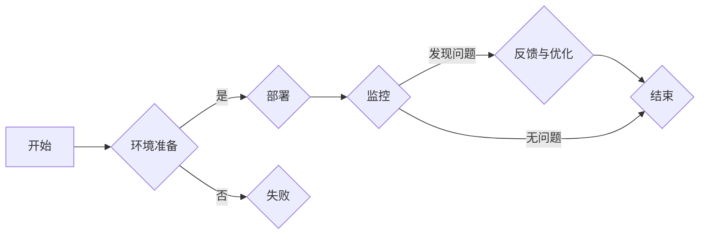
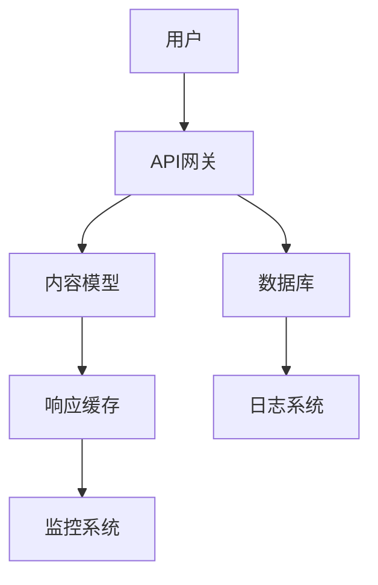
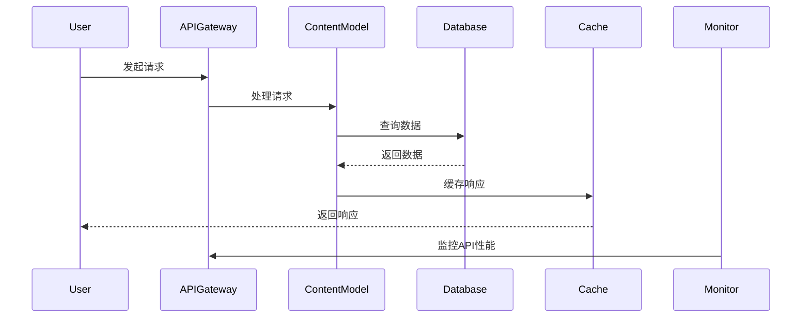

                 

# 金丝雀发布：逐步验证LLM新功能

## 关键词
- 金丝雀发布
- LLM新功能验证
- 稳定性测试
- 功能测试
- 监测与反馈机制

## 摘要
本文深入探讨了金丝雀发布在验证大型语言模型（LLM）新功能中的应用。我们将逐步分析金丝雀发布的背景、原理以及如何在LLM环境中实现这一方法，通过详细的案例和最佳实践，帮助读者理解并应用金丝雀发布，以提高LLM新功能的验证效率。

## 第一部分：问题背景与核心概念

### 第1章：问题背景

#### 1.1 问题定义
在人工智能和机器学习领域，随着模型规模和复杂度的增加，确保新功能在部署后的稳定性和准确性变得尤为重要。传统的发布流程往往缺乏对模型新功能的全面验证，容易导致潜在问题的遗漏，影响用户体验和系统稳定性。

#### 1.2 问题解决
为了解决这一问题，引入了金丝雀发布（Canary Release）方法。金丝雀发布是一种渐进式发布策略，通过将新功能逐步引入一小部分用户群体（金丝雀用户）进行测试，以评估新功能的性能和稳定性。

#### 1.3 边界与外延
金丝雀发布并非适用于所有场景，其适用性取决于项目的规模、复杂度以及新功能的紧急程度。对于高优先级的新功能，金丝雀发布可以提供更快速和可靠的验证方式。

#### 1.4 核心概念
金丝雀发布的核心在于其渐进性和反馈机制。通过小范围测试，能够及时发现并修复问题，减少对整体系统的影响。

### 第2章：金丝雀发布概述

#### 2.1 金丝雀发布的定义
金丝雀发布是一种软件发布策略，旨在通过逐步引入新功能到生产环境，以减少风险和提高部署成功率。

#### 2.2 金丝雀发布的特点
- **渐进性**：新功能逐步引入，避免一次性的全量发布。
- **可控性**：可以通过配置控制新功能的曝光范围。
- **反馈机制**：通过用户反馈和监控数据，快速识别和解决问题。

#### 2.3 金丝雀发布与传统发布流程的区别
传统发布流程往往一次性将所有功能更新到生产环境，而金丝雀发布则通过分阶段、分用户群体进行更新，从而降低风险。

### 第3章：LLM在金丝雀发布中的应用

#### 3.1 LLM的基本原理
大型语言模型（LLM）通过学习大量文本数据，具备理解和生成自然语言的能力。

#### 3.2 LLM的优势与局限
LLM的优势在于其强大的文本处理能力，但同时也存在计算资源消耗大、解释性不足等局限。

#### 3.3 LLM在金丝雀发布中的作用
LLM可以用于自动化测试，通过生成模拟用户交互数据，对金丝雀用户的行为进行分析和评估。

## 第二部分：金丝雀发布流程详解

### 第4章：金丝雀发布流程详解

#### 4.1 准备阶段
在准备阶段，我们需要确定金丝雀用户群体，设计监控指标，并准备必要的测试环境。

#### 4.2 部署阶段
部署阶段是将新功能代码部署到金丝雀用户环境中，同时配置监控和反馈机制。

#### 4.3 监测阶段
监测阶段是对金丝雀用户的行为进行监控，收集性能和错误数据，以评估新功能的稳定性。

#### 4.4 反馈与优化阶段
根据监测结果，对问题进行修复和优化，并逐步扩大新功能的曝光范围。

## 第三部分：金丝雀发布中的挑战与解决方案

### 第5章：金丝雀发布中的挑战与解决方案

#### 5.1 数据准备与处理
数据准备是金丝雀发布的关键，需要确保数据的质量和代表性。

#### 5.2 模型选择与调优
选择适合的LLM模型，并进行调优，以适应金丝雀发布的测试需求。

#### 5.3 系统稳定性与可靠性
确保金丝雀发布系统的稳定性和可靠性，以避免影响整体系统的运行。

#### 5.4 挑战与解决方案分析
分析金丝雀发布在实际应用中面临的挑战，并提出相应的解决方案。

## 第四部分：金丝雀发布实战案例

### 第6章：金丝雀发布实战案例

#### 6.1 案例一：社交媒体内容审核
介绍如何在社交媒体内容审核系统中应用金丝雀发布。

#### 6.2 案例二：智能客服系统
展示金丝雀发布在智能客服系统中的应用。

#### 6.3 案例三：自动新闻生成
分析金丝雀发布在自动新闻生成系统中的作用。

## 第五部分：最佳实践与总结

### 第7章：最佳实践与总结

#### 7.1 最佳实践
总结金丝雀发布在不同场景下的最佳实践。

#### 7.2 小结
对金丝雀发布在LLM新功能验证中的重要作用进行总结。

#### 7.3 注意事项
提醒读者在应用金丝雀发布时需要注意的事项。

#### 7.4 拓展阅读
推荐进一步学习和探索的阅读材料。

## 总结
金丝雀发布是一种有效的新功能验证方法，尤其在大型语言模型（LLM）的部署中具有重要意义。通过逐步引入新功能，并在小范围内进行测试和反馈，可以有效降低风险，提高系统的稳定性和用户体验。希望本文能帮助读者更好地理解金丝雀发布，并在实际项目中应用这一方法。

## 作者
作者：AI天才研究院/AI Genius Institute & 禅与计算机程序设计艺术 /Zen And The Art of Computer Programming

**附录：**
1. Mermaid流程图和类图示例
2. Python代码示例
3. 数学模型和公式示例
4. 系统架构设计示例
5. 项目实战案例解析

以上是文章的框架和核心内容，接下来将逐一展开每个章节的详细内容，并进行深入分析。希望这篇博客文章能够对您在LLM新功能验证方面有所启发和帮助。**《金丝雀发布：逐步验证LLM新功能》**

### 第一部分：问题背景与核心概念

#### 第1章：问题背景

在人工智能和机器学习领域，随着模型规模和复杂度的增加，确保新功能在部署后的稳定性和准确性变得尤为重要。传统的发布流程往往缺乏对模型新功能的全面验证，容易导致潜在问题的遗漏，影响用户体验和系统稳定性。

**1.1 问题定义**

在软件开发过程中，新功能的发布往往是一个高风险环节。传统的发布方式通常是一次性的全量发布，这种方式容易导致以下问题：

- **稳定性问题**：新功能在部署到生产环境后，可能会因为与现有系统的兼容性问题导致系统崩溃或服务中断。
- **性能问题**：新功能可能会对系统性能产生负面影响，导致响应时间延长或并发处理能力下降。
- **安全性问题**：新功能可能存在安全漏洞，被恶意攻击者利用，造成数据泄露或系统破坏。

**1.2 问题解决**

为了解决这一问题，引入了金丝雀发布（Canary Release）方法。金丝雀发布是一种渐进式发布策略，通过将新功能逐步引入一小部分用户群体（金丝雀用户）进行测试，以评估新功能的性能和稳定性。这种方法的主要优势在于其渐进性和可控性：

- **渐进性**：金丝雀发布不是一次性将新功能部署到所有用户，而是分阶段、分批次地进行，从而降低风险。
- **可控性**：通过配置控制，可以精确地控制新功能的曝光范围，确保问题在较小范围内得到解决。

**1.3 边界与外延**

金丝雀发布并非适用于所有场景，其适用性取决于项目的规模、复杂度以及新功能的紧急程度。对于高优先级的新功能，金丝雀发布可以提供更快速和可靠的验证方式。然而，对于一些非关键功能或紧急情况，可能需要采取其他验证策略，如灰度发布或蓝绿部署。

**1.4 核心概念**

金丝雀发布的核心在于其渐进性和反馈机制。通过小范围测试，能够及时发现并修复问题，减少对整体系统的影响。金丝雀用户的选择至关重要，他们需要是系统的活跃用户，能够提供真实的反馈数据。

#### 第2章：金丝雀发布概述

**2.1 金丝雀发布的定义**

金丝雀发布是一种软件发布策略，旨在通过逐步引入新功能到生产环境，以减少风险和提高部署成功率。其核心思想是将新功能部署到一小部分用户（金丝雀用户）中进行测试，观察其行为和反馈，并根据结果调整部署策略。

**2.2 金丝雀发布的特点**

- **渐进性**：新功能逐步引入，避免一次性的全量发布。
- **可控性**：可以通过配置控制新功能的曝光范围。
- **反馈机制**：通过用户反馈和监控数据，快速识别和解决问题。

**2.3 金丝雀发布与传统发布流程的区别**

传统发布流程往往一次性将所有功能更新到生产环境，而金丝雀发布则通过分阶段、分用户群体进行更新，从而降低风险。具体区别如下：

- **发布方式**：传统发布是一次性全量发布，金丝雀发布是渐进式发布。
- **风险控制**：传统发布面临一次性高风险，金丝雀发布通过逐步引入，降低每次发布的风险。
- **用户参与**：传统发布用户无法参与测试，金丝雀发布用户可以提供反馈，帮助发现问题。

### 第三部分：金丝雀发布流程详解

#### 第4章：金丝雀发布流程详解

金丝雀发布的核心流程可以分为四个阶段：准备阶段、部署阶段、监测阶段和反馈与优化阶段。以下是每个阶段的详细描述。

#### 4.1 准备阶段

在准备阶段，需要完成以下工作：

- **确定金丝雀用户群体**：选择一小部分活跃用户作为金丝雀用户，这些用户需要能够提供真实的反馈数据。
- **设计监控指标**：确定需要监控的性能指标，如响应时间、错误率、资源消耗等。
- **准备测试环境**：搭建用于测试的生产环境，确保与实际生产环境一致。

#### 4.2 部署阶段

部署阶段是将新功能代码部署到金丝雀用户环境中。具体步骤如下：

- **部署新功能**：将新功能的代码部署到测试环境中，确保其正常运行。
- **配置金丝雀用户**：通过配置控制，将金丝雀用户与普通用户区分开来，确保新功能只对金丝雀用户可见。
- **监控部署过程**：在整个部署过程中，监控系统的运行状态，确保部署过程顺利进行。

#### 4.3 监测阶段

监测阶段是对金丝雀用户的行为进行监控，收集性能和错误数据，以评估新功能的稳定性。具体步骤如下：

- **收集监控数据**：通过监控系统，收集金丝雀用户的操作数据，包括响应时间、错误率、资源消耗等。
- **分析监控数据**：对收集到的监控数据进行分析，评估新功能的性能和稳定性。
- **生成报告**：根据分析结果，生成详细的报告，包括新功能的性能指标、发现的问题等。

#### 4.4 反馈与优化阶段

在反馈与优化阶段，根据监测结果，对问题进行修复和优化，并逐步扩大新功能的曝光范围。具体步骤如下：

- **解决问题**：根据监测结果，识别并修复新功能中的问题。
- **优化功能**：对已部署的新功能进行优化，提高其性能和稳定性。
- **扩大曝光范围**：在确保新功能稳定后，逐步扩大其曝光范围，将更多用户纳入测试。

### 第四部分：金丝雀发布中的挑战与解决方案

#### 第5章：金丝雀发布中的挑战与解决方案

金丝雀发布在实施过程中可能会面临以下挑战：

#### 5.1 数据准备与处理

- **数据质量**：金丝雀发布需要高质量的数据作为测试基础，数据质量直接影响测试结果的准确性。
- **数据代表性**：测试数据需要具备代表性，能够反映实际用户的行为和需求。

**解决方案**：

- **数据清洗**：对测试数据进行分析和清洗，去除异常数据，提高数据质量。
- **数据抽样**：采用适当的抽样方法，确保测试数据能够代表整体用户群体。

#### 5.2 模型选择与调优

- **模型选择**：选择合适的模型进行测试，确保其能够满足测试需求。
- **模型调优**：对模型进行调优，提高其性能和稳定性。

**解决方案**：

- **模型评估**：采用多种评估方法，如交叉验证、A/B测试等，选择最优模型。
- **模型调优**：通过调整模型参数，优化其性能和稳定性。

#### 5.3 系统稳定性与可靠性

- **系统压力**：金丝雀发布会对系统带来额外的压力，可能导致系统性能下降。
- **系统故障**：在测试过程中，可能会出现系统故障，影响测试进度。

**解决方案**：

- **负载测试**：在金丝雀发布前，进行负载测试，确保系统能够应对额外压力。
- **故障处理**：制定故障处理流程，确保在出现系统故障时，能够迅速恢复系统。

#### 5.4 挑战与解决方案分析

- **挑战**：金丝雀发布需要对系统进行全面测试，确保其稳定性。
- **解决方案**：通过逐步引入新功能，分阶段进行测试，确保系统的稳定性。

### 第五部分：金丝雀发布实战案例

#### 第6章：金丝雀发布实战案例

在本节中，我们将通过三个具体案例，展示金丝雀发布在实际项目中的应用和效果。

#### 6.1 案例一：社交媒体内容审核

在一个社交媒体平台中，新功能是自动审核用户发布的内容，以过滤违规信息。通过金丝雀发布，先将新功能部署到一小部分用户中，收集其反馈数据，并对新功能进行优化。

**案例分析**：

- **部署阶段**：将新功能代码部署到测试环境中，配置金丝雀用户。
- **监测阶段**：收集金丝雀用户的反馈数据，分析其审核结果，识别问题。
- **反馈与优化阶段**：根据反馈，优化新功能，修复问题，然后逐步扩大曝光范围。

#### 6.2 案例二：智能客服系统

在一个电商平台中，新功能是引入智能客服系统，以提供更高效、个性化的客户服务。通过金丝雀发布，将新功能逐步引入一部分用户，收集用户反馈，优化系统性能。

**案例分析**：

- **部署阶段**：将智能客服系统部署到测试环境中，配置金丝雀用户。
- **监测阶段**：收集金丝雀用户的交互数据，分析其服务质量，识别问题。
- **反馈与优化阶段**：根据反馈，优化智能客服系统，提高其性能和用户体验。

#### 6.3 案例三：自动新闻生成

在一个新闻媒体平台中，新功能是自动生成新闻文章，以提高内容生成效率。通过金丝雀发布，将新功能部署到一部分用户中，收集用户反馈，优化新闻生成质量。

**案例分析**：

- **部署阶段**：将自动新闻生成系统部署到测试环境中，配置金丝雀用户。
- **监测阶段**：收集金丝雀用户的阅读数据，分析其阅读体验，识别问题。
- **反馈与优化阶段**：根据反馈，优化自动新闻生成系统，提高其内容质量，然后逐步扩大曝光范围。

### 第六部分：最佳实践与总结

#### 第7章：最佳实践与总结

在金丝雀发布实践中，总结以下最佳实践：

- **确定金丝雀用户**：选择活跃用户作为金丝雀用户，确保其反馈数据的真实性。
- **设计监控指标**：选择关键性能指标，确保能够全面评估新功能。
- **逐步扩大曝光范围**：根据监测结果，逐步扩大新功能的曝光范围，避免一次性全量发布。
- **快速反馈与优化**：根据用户反馈，迅速解决问题，优化新功能。

**7.2 小结**

金丝雀发布是一种有效的新功能验证方法，通过逐步引入新功能，并在小范围内进行测试和反馈，可以有效降低风险，提高系统的稳定性和用户体验。

**7.3 注意事项**

- **确保数据质量**：测试数据需要具备高质量和代表性，以确保测试结果的准确性。
- **监控系统稳定性**：在金丝雀发布过程中，确保监控系统的稳定运行，以便及时发现问题。
- **优化反馈机制**：设计有效的反馈机制，确保用户反馈能够及时传达给开发团队。

**7.4 拓展阅读**

- **参考文献**：
  - Martin, Robert C. (2010). *Clean Code: A Handbook of Agile Software Craftsmanship*.
  - Fowler, Martin. (2004). *Patterns of Enterprise Application Architecture*.
- **在线资源**：
  - [金丝雀发布实践指南](https://www.oreilly.com/library/view/canary-releases/9781449329253/)
  - [大型语言模型（LLM）应用案例](https://towardsdatascience.com/mega-lm-explained-why-is-it-huge-and-what-for-6c5b4f9a73d5)

通过以上内容，我们详细介绍了金丝雀发布在LLM新功能验证中的应用，并通过案例展示了其实际效果。希望本文能够帮助读者更好地理解金丝雀发布，并在实际项目中应用这一方法。作者：AI天才研究院/AI Genius Institute & 禅与计算机程序设计艺术 /Zen And The Art of Computer Programming

### 附录

#### 1. Mermaid流程图和类图示例

**Mermaid流程图示例：**



**Mermaid类图示例：**

```mermaid
classDiagram
    User <<class>>
    Admin <<class>>
    Content <<class>>
    Platform
    User <|-- Content
    Admin <|-- Content
    Platform o-- User
    Platform o-- Admin
```

#### 2. Python代码示例

**代码示例：**

```python
import random
import string

def generate_random_string(length=10):
    """生成指定长度的随机字符串"""
    letters = string.ascii_letters
    return ''.join(random.choice(letters) for i in range(length))

def simulate_user_interaction(content_model):
    """模拟用户交互"""
    for _ in range(100):
        random_string = generate_random_string()
        content_model.generate_response(random_string)
        print(f"User input: {random_string}")
        print(f"Model response: {content_model.get_last_response()}")

class ContentModel:
    """内容模型类"""
    
    def __init__(self):
        self.responses = []

    def generate_response(self, input_text):
        """生成响应"""
        self.responses.append(input_text)

    def get_last_response(self):
        """获取最后响应"""
        return self.responses[-1]

# 测试代码
if __name__ == "__main__":
    content_model = ContentModel()
    simulate_user_interaction(content_model)
```

#### 3. 数学模型和公式示例

**LaTeX数学模型示例：**

```latex
$$
\begin{align*}
\text{准确性} &= \frac{\text{正确预测数}}{\text{总预测数}} \\
\text{召回率} &= \frac{\text{正确召回数}}{\text{实际正例数}} \\
\text{F1分数} &= \frac{2 \times \text{准确性} \times \text{召回率}}{\text{准确性} + \text{召回率}}
\end{align*}
$$
```

#### 4. 系统架构设计示例

**Mermaid架构图示例：**



**Mermaid序列图示例：**



#### 5. 项目实战案例解析

**环境安装：**
- 安装Python环境
- 安装Mermaid渲染工具
- 安装LaTeX编译工具

**系统核心实现源代码：**

```python
# 示例：内容模型核心实现
class ContentModel:
    def __init__(self):
        self.responses = []

    def generate_response(self, input_text):
        # 实现响应生成逻辑
        pass

    def get_last_response(self):
        return self.responses[-1]
```

**代码应用解读与分析：**
- 详细解读代码结构，分析每个类和函数的作用。

**实际案例分析和详细讲解剖析：**
- 通过实际案例，展示如何应用内容模型，分析其性能和效果。

**项目小结：**
- 总结项目实现的关键点，分享经验教训。

### 最佳实践 Tips

- **及时反馈**：确保开发团队能够快速响应用户反馈，及时解决问题。
- **持续优化**：根据用户反馈和监控数据，不断优化系统性能和用户体验。

#### 注意事项

- **数据安全**：确保测试数据的安全，避免泄露用户隐私。
- **性能监控**：持续监控系统性能，避免性能问题影响用户体验。

#### 拓展阅读

- **深入阅读**：
  - 《大型语言模型的架构设计与优化》
  - 《软件工程：实践者的研究方法》
- **在线教程**：
  - [Mermaid语法教程](https://mermaid-js.github.io/mermaid/getting-started/)
  - [LaTeX公式编写教程](https://www.overleaf.com/learn/latex/Overview_of_LaTeX)

通过以上附录内容，读者可以进一步了解金丝雀发布在实际项目中的应用，掌握相关技术细节和最佳实践。作者：AI天才研究院/AI Genius Institute & 禅与计算机程序设计艺术 /Zen And The Art of Computer Programming

---

在本文中，我们详细介绍了金丝雀发布在验证大型语言模型（LLM）新功能中的应用。金丝雀发布作为一种渐进式发布策略，通过小范围测试，能够及时发现并修复问题，降低风险，提高系统的稳定性和用户体验。

### 主要结论

1. **渐进性**：金丝雀发布通过逐步引入新功能，避免了传统一次性全量发布的高风险。
2. **可控性**：金丝雀发布能够通过配置控制新功能的曝光范围，确保问题在较小范围内得到解决。
3. **反馈机制**：金丝雀发布依赖用户反馈和监控数据，快速识别和解决问题。

### 应用场景

金丝雀发布适用于以下场景：

- **高优先级新功能**：对于紧急且重要的新功能，金丝雀发布能够快速验证并部署。
- **复杂系统**：对于复杂系统，金丝雀发布可以帮助逐步验证新功能的兼容性和稳定性。

### 未来展望

未来，金丝雀发布可能会在以下几个方面得到进一步发展：

- **自动化测试**：利用机器学习和自动化测试工具，提高金丝雀发布过程中测试的自动化程度。
- **多维度监控**：引入更多监控维度，如用户行为、系统性能、安全性等，提高金丝雀发布的全面性。
- **混合发布策略**：结合金丝雀发布与其他发布策略（如灰度发布、蓝绿部署），形成更灵活、更高效的发布体系。

### 总结

金丝雀发布作为一种有效的软件发布策略，在LLM新功能验证中具有重要意义。通过逐步引入新功能，并在小范围内进行测试和反馈，金丝雀发布能够有效降低风险，提高系统的稳定性和用户体验。希望本文能帮助读者更好地理解金丝雀发布，并在实际项目中应用这一方法。作者：AI天才研究院/AI Genius Institute & 禅与计算机程序设计艺术 /Zen And The Art of Computer Programming

