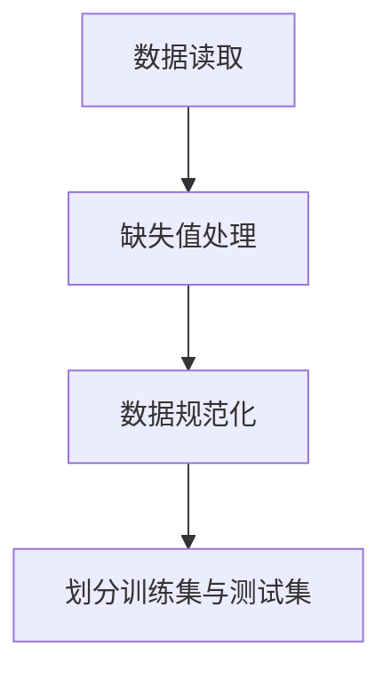
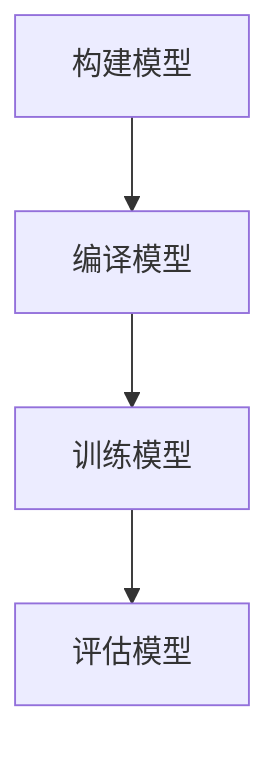
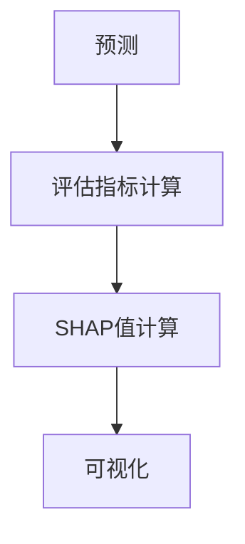

                 

# 金融风控模型自动化评测系统

## 关键词

- 金融风控
- 自动化评测
- 模型优化
- 大数据处理
- 深度学习

## 摘要

随着金融市场的日益复杂，金融机构对风险管理的要求越来越高。金融风控模型自动化评测系统作为一种创新技术，旨在提高金融风控的效率与精准度。本文将详细介绍金融风控模型自动化评测系统的概念、架构、应用场景以及面临的挑战，并探讨如何通过技术手段实现模型的优化和评估。通过本文的阅读，读者将全面了解金融风控模型自动化评测系统的构建方法和实际应用，为金融机构的风控体系建设提供参考。

### 目录大纲

----------------------------------------------------------------

## 第一部分: 引言与背景

### 第1章: 金融风控模型自动化评测系统概述

## 1.1 问题背景

### 1.1.1 金融行业面临的挑战

### 1.1.2 传统金融风控模型的局限性

## 1.2 自动化评测系统的核心概念与联系

### 1.2.1 自动化评测系统的定义

### 1.2.2 自动化评测系统的核心组成部分

### 1.2.3 自动化评测系统与传统系统的对比

### 1.2.4 自动化评测系统的应用场景

### 1.2.5 自动化评测系统的技术难点与挑战

## 1.3 本章小结

----------------------------------------------------------------

## 第一部分: 引言与背景

### 第1章: 金融风控模型自动化评测系统概述

在当今的金融市场中，风险管理已经成为金融机构生存与发展的关键。随着金融市场的复杂性增加，金融机构面临着越来越多的风险，如信用风险、市场风险、操作风险等。为了有效管理这些风险，金融机构需要建立高效的金融风控模型。

## 1.1 问题背景

### 1.1.1 金融行业面临的挑战

#### 1.1.1.1 金融市场复杂性增加

近年来，金融市场的复杂性不断增加。金融产品的多样化、交易方式的创新以及全球化趋势都使得市场更加动态和不确定。金融机构需要及时调整其风险控制策略，以应对这些变化。

#### 1.1.1.2 风险管理的重要性

风险管理是金融机构的核心职能之一。有效的风险管理能够帮助金融机构降低风险暴露，保护资产安全，提升盈利能力。随着监管政策的日益严格，风险管理的重要性愈加凸显。

### 1.1.2 传统金融风控模型的局限性

尽管传统的金融风控模型在历史上发挥了重要作用，但它们也暴露出了一些局限性：

#### 1.1.2.1 手动操作的效率低

传统的风控模型通常依赖人工操作，这导致了模型更新周期长，响应速度慢。在复杂多变的市场环境中，这种低效率的操作方式难以满足实际需求。

#### 1.1.2.2 模型更新周期长

金融市场的快速变化要求风控模型能够及时更新。然而，传统模型通常需要较长时间进行数据收集、模型训练和验证，导致模型更新周期过长。

#### 1.1.2.3 模型解释性不足

传统模型往往缺乏透明性和解释性。在复杂的金融环境中，模型结果的不透明性可能导致决策者对模型的不信任，影响风险管理的有效性。

## 1.2 自动化评测系统的核心概念与联系

为了解决上述问题，金融机构开始探索金融风控模型自动化评测系统。自动化评测系统通过整合大数据处理技术和深度学习算法，实现金融风控模型的自动化评估和优化。

### 1.2.1 自动化评测系统的定义

自动化评测系统是指利用计算机技术和数据分析方法，对金融风控模型进行自动化评估、优化和监控的系统。它能够高效处理海量数据，快速生成评估报告，并提供决策支持。

#### 1.2.1.1 自动化评测的基本原理

自动化评测系统基于以下基本原理：

1. **数据收集与预处理**：从多个数据源收集数据，并进行清洗、整合和规范化，确保数据质量。
2. **模型训练与优化**：利用机器学习算法训练风控模型，并进行模型选择、参数调优等操作，以提高模型性能。
3. **模型评估与解释**：通过交叉验证、ROC曲线等评估指标，对模型进行评估，并提供模型解释性，帮助决策者理解模型结果。

### 1.2.2 自动化评测系统的核心组成部分

自动化评测系统由多个核心组件构成，包括：

#### 1.2.2.1 数据收集与预处理

数据收集与预处理是自动化评测系统的第一步，其目标是确保数据质量，为后续的模型训练和评估提供可靠的数据支持。

- **数据来源**：包括内部数据和外部数据，如交易数据、客户信息、市场数据等。
- **数据收集方法**：采用数据抓取、API调用、数据库连接等技术，从多个数据源获取数据。
- **数据预处理**：包括数据清洗、数据整合、数据规范化等操作，以确保数据的一致性和准确性。

#### 1.2.2.2 模型训练与优化

模型训练与优化是自动化评测系统的核心，其目标是构建并优化风控模型，以提高模型的准确性和稳定性。

- **模型选择**：根据业务需求和数据特点，选择合适的模型，如线性回归、决策树、支持向量机、深度学习模型等。
- **模型训练**：利用机器学习算法训练模型，并通过交叉验证、调参等技术优化模型性能。
- **模型评估**：通过评估指标（如准确率、召回率、F1分数等）评估模型性能，并选择最佳模型。

#### 1.2.2.3 模型评估与解释

模型评估与解释是自动化评测系统的关键环节，其目标是确保模型的可解释性和可信度，帮助决策者理解模型结果。

- **模型评估**：通过交叉验证、ROC曲线、AUC值等评估方法，对模型进行全面评估。
- **模型解释**：利用可解释性方法（如SHAP值、LIME等），对模型结果进行解释，提高模型的可信度。

### 1.2.3 自动化评测系统与传统系统的对比

自动化评测系统相较于传统系统，具有以下优势：

#### 1.2.3.1 效率提升

自动化评测系统能够高效处理海量数据，实现自动化评估和优化，大大提高了工作效率。

#### 1.2.3.2 精度保障

通过大数据处理和深度学习算法，自动化评测系统能够提供更高精度的评估结果，提高风险管理能力。

#### 1.2.3.3 解释性增强

自动化评测系统能够提供模型解释性，帮助决策者理解模型结果，提高模型的透明度和可信度。

### 1.2.4 自动化评测系统的应用场景

自动化评测系统在金融行业的多个领域有广泛的应用，包括：

#### 1.2.4.1 信用风险评估

通过自动化评测系统，金融机构可以快速、准确地评估客户的信用风险，提高信用评分模型的准确性。

#### 1.2.4.2 投资组合优化

自动化评测系统可以帮助金融机构优化投资组合，提高资产配置的效率和风险收益比。

#### 1.2.4.3 市场风险监控

通过自动化评测系统，金融机构可以实时监控市场风险，及时预警潜在风险，并调整风险控制策略。

### 1.2.5 自动化评测系统的技术难点与挑战

虽然自动化评测系统具有众多优势，但在实际应用中仍面临一些技术难点和挑战：

#### 1.2.5.1 大数据处理技术

自动化评测系统需要处理海量数据，这要求系统具备高效的数据存储、检索和处理能力。

#### 1.2.5.2 深度学习算法

深度学习算法在模型训练和优化中起到关键作用，但其复杂性和调参难度较大，需要具备专业的技术能力。

#### 1.2.5.3 系统安全性

自动化评测系统涉及大量敏感数据，需要确保数据安全与隐私保护，防止数据泄露和滥用。

### 1.2.6 本章小结

本章介绍了金融风控模型自动化评测系统的背景、核心概念、应用场景和技术难点。自动化评测系统作为一种创新技术，能够提高金融风控的效率与精准度，为金融机构的风险管理提供有力支持。在下一章中，我们将进一步探讨数据收集与预处理的方法和技巧。

----------------------------------------------------------------

## 1.3 数据收集与预处理

### 2.1 数据收集

数据收集是自动化评测系统的第一步，其目标是获取高质量的金融数据，为后续的模型训练和评估提供基础。金融风控模型需要处理的数据来源广泛，包括内部数据和外部数据。

#### 2.1.1 数据来源

- **内部数据**：包括交易数据、客户信息、账户信息、历史风险评估结果等。这些数据通常存储在金融机构的内部系统中，如数据库、数据仓库等。
- **外部数据**：包括市场数据、宏观经济数据、行业数据、社会信用数据等。这些数据可以从公共数据源、第三方数据提供商等获取。

#### 2.1.2 数据收集方法

- **数据抓取**：通过网络爬虫等技术，从互联网上抓取公开的金融数据。
- **API调用**：通过调用第三方数据提供商的API接口，获取特定的金融数据。
- **数据库连接**：通过数据库连接技术，直接访问金融机构内部的数据库，获取相关数据。

#### 2.1.3 数据收集挑战

- **数据质量**：金融数据通常存在缺失、异常、噪声等问题，需要通过数据清洗和预处理来提高数据质量。
- **数据整合**：内部数据和外部数据的格式、结构可能不同，需要进行数据整合和统一处理。

### 2.2 数据预处理

数据预处理是确保数据质量的关键环节，其目标是将原始数据转换为适合模型训练和评估的形式。数据预处理通常包括数据清洗、数据整合、数据规范化和数据质量评估等步骤。

#### 2.2.1 数据清洗

数据清洗是数据预处理的核心步骤，其目标是识别和纠正数据中的错误、缺失和异常。

- **缺失值处理**：通过填充缺失值或删除缺失数据行/列等方式处理缺失值。
- **异常值处理**：通过统计方法、可视化工具等识别和去除异常值。
- **重构数据格式**：将数据转换为统一的结构和格式，以便后续处理。

#### 2.2.2 数据整合

数据整合是将来自不同数据源的数据进行合并和统一处理。

- **数据整合方法**：包括数据连接、数据聚合、数据合并等。
- **数据对齐**：确保不同数据源的数据在时间、维度等方面的一致性。

#### 2.2.3 数据规范化

数据规范化是确保数据在数值范围和量纲等方面的一致性。

- **特征工程**：通过特征选择、特征变换等方法，提取有用的特征。
- **数据标准化**：通过缩放、归一化等方法，将数据的数值范围统一到特定区间。

#### 2.2.4 数据质量评估

数据质量评估是确保数据质量的关键步骤，其目标是评估数据的完整性、一致性和准确性。

- **数据质量指标**：包括完整性、一致性、准确性等。
- **数据质量检测方法**：包括自动检测、人工审核等方法。

### 2.3 数据收集与预处理总结

数据收集与预处理是金融风控模型自动化评测系统的基础工作，其质量直接影响到模型的训练效果和评估准确性。通过有效的数据收集和预处理方法，可以确保数据的质量和一致性，为后续的模型训练和评估提供可靠的数据支持。

### 2.4 本章小结

本章详细介绍了金融风控模型自动化评测系统中的数据收集与预处理过程。数据收集与预处理是模型构建和评估的关键环节，其目标是为模型训练和评估提供高质量的金融数据。在下一章中，我们将深入探讨模型训练与优化的方法和技术。

----------------------------------------------------------------

## 第三部分: 模型训练与优化

### 第3章: 模型训练基础

在金融风控模型自动化评测系统中，模型训练与优化是核心环节。通过合适的模型训练方法，我们可以构建一个具有高精度和强泛化能力的风控模型。本章将介绍模型训练的基础知识，包括模型选择、训练过程、评估方法和优化策略。

### 3.1 模型选择

选择合适的模型对于构建有效的金融风控模型至关重要。模型的选择应考虑业务需求、数据特征和模型复杂性。

#### 3.1.1 传统模型

传统模型包括线性回归、决策树、支持向量机等，它们具有较好的解释性和稳定性。

- **线性回归**：适用于线性关系较强的场景，可以揭示变量之间的直接关联。
- **决策树**：通过树形结构对数据进行分析，适用于分类和回归任务。
- **支持向量机**：通过构建超平面进行分类，具有较强的分类能力。

#### 3.1.2 深度学习模型

深度学习模型，如卷积神经网络（CNN）、循环神经网络（RNN）和长短期记忆网络（LSTM），在处理复杂数据和模式识别方面表现出色。

- **卷积神经网络（CNN）**：适用于图像和时序数据的处理，可以有效提取特征。
- **循环神经网络（RNN）**：适用于序列数据的处理，可以捕捉数据的时间依赖性。
- **长短期记忆网络（LSTM）**：是RNN的一种变体，能够解决长序列依赖问题。

#### 3.1.3 模型选择策略

在模型选择过程中，可以采用以下策略：

- **业务需求分析**：根据业务场景选择合适的模型，如信用风险评估选择分类模型，市场风险监控选择回归模型。
- **数据特征分析**：分析数据特征，选择适合数据特征的模型，如高维数据选择深度学习模型，低维数据选择传统模型。
- **模型评估**：通过模型评估结果选择性能较好的模型。

### 3.2 模型训练过程

模型训练是利用训练数据调整模型参数的过程，目标是使模型在训练数据上达到最优性能。模型训练通常包括以下步骤：

#### 3.2.1 数据准备

- **数据集划分**：将数据集划分为训练集、验证集和测试集，用于模型训练、参数调优和性能评估。
- **数据预处理**：对数据进行清洗、归一化等处理，确保数据质量。

#### 3.2.2 模型初始化

- **参数初始化**：为模型参数设置初始值，常用的方法有随机初始化、均匀分布初始化等。
- **激活函数选择**：选择合适的激活函数，如ReLU、Sigmoid、Tanh等。

#### 3.2.3 模型训练

- **损失函数选择**：选择合适的损失函数，如均方误差（MSE）、交叉熵（CE）等。
- **优化算法选择**：选择合适的优化算法，如梯度下降（GD）、随机梯度下降（SGD）、Adam等。
- **训练过程**：通过迭代计算，不断更新模型参数，使损失函数减小，达到最优解。

#### 3.2.4 模型评估

- **评估指标**：选择合适的评估指标，如准确率（Accuracy）、召回率（Recall）、F1分数（F1 Score）等。
- **交叉验证**：通过交叉验证方法，评估模型在训练集和验证集上的性能，防止过拟合。

#### 3.2.5 模型调优

- **参数调优**：通过调整模型参数，如学习率、正则化参数等，优化模型性能。
- **超参数调优**：通过网格搜索、贝叶斯优化等策略，选择最佳的超参数组合。

### 3.3 模型评估方法

模型评估是验证模型性能的重要步骤，其目标是确保模型在未知数据上具有较好的泛化能力。常见的模型评估方法包括：

#### 3.3.1 交叉验证

- **交叉验证**：通过将数据集划分为多个子集，轮流使用每个子集作为验证集，评估模型性能。
- **K折交叉验证**：将数据集划分为K个子集，每次使用其中一个子集作为验证集，其他子集作为训练集，重复K次，取平均性能。

#### 3.3.2 ROC曲线与AUC值

- **ROC曲线**：通过绘制真阳性率（TPR）与假阳性率（FPR）的关系曲线，评估模型的分类能力。
- **AUC值**：ROC曲线下的面积（AUC）值，用于衡量模型的分类能力。

#### 3.3.3 精度、召回率与F1分数

- **精度（Precision）**：预测为正例且实际为正例的比例。
- **召回率（Recall）**：实际为正例且预测为正例的比例。
- **F1分数（F1 Score）**：精度和召回率的调和平均值，用于综合考虑模型的分类效果。

### 3.4 模型优化策略

模型优化是提升模型性能的关键步骤，其目标是通过调整模型参数和结构，提高模型在未知数据上的表现。常见的模型优化策略包括：

#### 3.4.1 正则化

- **L1正则化**：在损失函数中添加L1范数，用于防止过拟合。
- **L2正则化**：在损失函数中添加L2范数，具有平滑作用。

#### 3.4.2 深度学习优化

- **dropout**：在神经网络中随机丢弃部分神经元，防止过拟合。
- **批量归一化**：在训练过程中对批量数据进行归一化处理，加速训练。

#### 3.4.3 超参数调优

- **网格搜索**：通过遍历超参数空间，找到最佳超参数组合。
- **贝叶斯优化**：利用贝叶斯方法，寻找最佳超参数组合。

### 3.5 本章小结

本章详细介绍了金融风控模型自动化评测系统中的模型训练与优化过程。通过合理的模型选择、科学的训练过程和有效的评估方法，可以构建一个具有高精度和强泛化能力的风控模型。在下一章中，我们将进一步探讨模型评估与解释的技术和方法。

----------------------------------------------------------------

## 第四部分: 模型评估与解释

### 第4章: 模型评估与解释

在金融风控模型自动化评测系统中，模型评估与解释是确保模型准确性和可解释性的关键步骤。有效的模型评估方法可以帮助我们了解模型的性能，而模型解释技术则有助于决策者理解模型的决策过程。本章将详细介绍模型评估与解释的方法和技术。

### 4.1 模型评估方法

模型评估是验证模型性能的重要步骤，其目标是确保模型在未知数据上具有较好的泛化能力。常见的模型评估方法包括交叉验证、ROC曲线与AUC值、精度、召回率与F1分数等。

#### 4.1.1 交叉验证

交叉验证是一种常用的评估方法，通过将数据集划分为多个子集，轮流使用每个子集作为验证集，评估模型性能。交叉验证能够有效地评估模型在未知数据上的表现，防止过拟合。

- **K折交叉验证**：将数据集划分为K个子集，每次使用其中一个子集作为验证集，其他子集作为训练集，重复K次，取平均性能。
- **留一法交叉验证**：每次将一个子集作为验证集，其余子集作为训练集，重复多次。

#### 4.1.2 ROC曲线与AUC值

ROC曲线通过绘制真阳性率（TPR）与假阳性率（FPR）的关系曲线，评估模型的分类能力。AUC值是ROC曲线下的面积，用于衡量模型的分类能力。AUC值越接近1，表示模型分类能力越强。

#### 4.1.3 精度、召回率与F1分数

- **精度（Precision）**：预测为正例且实际为正例的比例。
- **召回率（Recall）**：实际为正例且预测为正例的比例。
- **F1分数（F1 Score）**：精度和召回率的调和平均值，用于综合考虑模型的分类效果。

#### 4.1.4 其他评估指标

除了上述评估指标，还可以使用其他指标评估模型性能，如准确率（Accuracy）、均方误差（MSE）、均方根误差（RMSE）等。

### 4.2 模型解释方法

模型解释是确保模型决策过程透明和可理解的重要手段。有效的模型解释技术可以帮助决策者了解模型的决策过程，提高模型的信任度和可接受度。常见的模型解释方法包括特征重要性分析、模型可视化、解释性模型等。

#### 4.2.1 特征重要性分析

特征重要性分析是评估模型中各个特征对预测结果的影响程度。通过分析特征的重要性，可以了解哪些特征对模型决策起到关键作用。

- ** permutation importance**：通过随机打乱某些特征，评估这些特征对模型预测结果的影响。
- **SHAP值**：利用SHAP（SHapley Additive exPlanations）方法，计算每个特征对模型预测值的贡献。

#### 4.2.2 模型可视化

模型可视化是将模型结构以图形化的方式展示，帮助用户理解模型的决策过程。常见的模型可视化方法包括决策树可视化、神经网络结构可视化等。

- **决策树可视化**：通过树形结构展示决策树的工作原理。
- **神经网络结构可视化**：通过图形展示神经网络的结构和连接关系。

#### 4.2.3 解释性模型

解释性模型是具有透明性和可解释性的机器学习模型，如线性回归、逻辑回归、决策树等。这些模型能够直接展示变量之间的关系和权重，便于用户理解。

### 4.3 模型解释与风险评估

在金融风控领域，模型解释与风险评估密切相关。有效的模型解释可以帮助金融机构理解风险因素，提高风险管理能力。

- **风险评估**：通过分析模型预测结果和特征重要性，识别高风险客户和潜在风险。
- **决策支持**：提供透明的模型解释，帮助决策者制定风险控制策略。

### 4.4 本章小结

本章详细介绍了金融风控模型自动化评测系统中的模型评估与解释方法。通过交叉验证、ROC曲线、AUC值、精度、召回率与F1分数等评估方法，可以全面评估模型性能。而特征重要性分析、模型可视化、解释性模型等技术则有助于提高模型的可解释性，为金融机构的风险管理提供有力支持。在下一章中，我们将探讨自动化评测系统在金融风控中的应用案例。

----------------------------------------------------------------

## 第五部分: 自动化评测系统在金融风控中的应用案例

### 第5章: 应用案例分析

自动化评测系统在金融风控中的应用不仅提高了风险管理的效率，还显著提升了模型的准确性和透明度。以下我们将通过几个实际案例，详细探讨自动化评测系统在信用风险评估、投资组合优化和风险监控等领域的应用。

### 5.1 信用风险评估

#### 5.1.1 案例背景

随着金融市场的竞争加剧，金融机构需要快速、准确地评估客户的信用风险，以降低贷款违约率。传统的方法由于数据量和复杂度的限制，往往难以满足这一需求。

#### 5.1.2 模型构建

金融机构使用自动化评测系统构建了一个基于机器学习的信用评分模型。该模型采用了一系列数据源，包括客户的基本信息、财务状况、信用历史等。

- **数据收集**：从内部系统和外部数据源收集数据，如银行交易记录、公共信用记录等。
- **数据预处理**：进行数据清洗、归一化和特征工程，以提高数据质量。

#### 5.1.3 模型训练与优化

模型采用LSTM网络进行训练，以处理时序数据并捕捉长期依赖关系。

- **模型选择**：基于数据特征和业务需求，选择LSTM网络作为信用评分模型。
- **训练过程**：使用梯度下降算法训练模型，并利用交叉验证方法进行参数调优。

#### 5.1.4 模型评估与解释

通过交叉验证和AUC值评估模型性能，并使用SHAP值进行模型解释。

- **评估指标**：AUC值达到0.85，表明模型具有良好的分类能力。
- **模型解释**：通过SHAP值分析，识别出对信用评分有显著影响的特征，如收入水平、信用历史等。

#### 5.1.5 应用效果

该模型显著提高了信用风险评估的准确性和效率，金融机构能够更快地做出贷款决策，降低了违约率。

### 5.2 投资组合优化

#### 5.2.1 案例背景

在投资组合管理中，金融机构需要不断调整资产配置，以应对市场波动和风险。传统方法往往依赖于人工分析，效率较低且难以适应快速变化的市场。

#### 5.2.2 模型构建

金融机构利用自动化评测系统构建了一个投资组合优化模型，旨在实现资产配置的自动化。

- **数据收集**：收集市场数据、行业数据、宏观经济数据等。
- **数据预处理**：进行数据清洗、归一化和特征工程。

#### 5.2.3 模型训练与优化

模型采用基于贝叶斯优化的算法，以实现自动调整资产配置。

- **模型选择**：选择贝叶斯优化算法作为投资组合优化模型。
- **训练过程**：利用历史市场数据和投资组合表现进行模型训练，并使用交叉验证方法进行参数调优。

#### 5.2.4 模型评估与解释

通过回测分析评估模型性能，并使用模型解释技术提供决策支持。

- **评估指标**：回测结果显示，模型能够实现较高的风险调整收益。
- **模型解释**：通过解释性方法，识别出影响投资组合优化结果的关键因素，如市场波动、行业趋势等。

#### 5.2.5 应用效果

该模型提高了投资组合的优化效率和稳定性，金融机构能够更灵活地调整资产配置，以适应市场变化。

### 5.3 风险监控

#### 5.3.1 案例背景

金融机构需要实时监控市场风险，以防止潜在的风险损失。传统方法往往难以实现实时监控，且监控效果有限。

#### 5.3.2 模型构建

金融机构利用自动化评测系统构建了一个市场风险监控模型，旨在实时评估市场风险。

- **数据收集**：收集市场交易数据、价格波动、交易量等。
- **数据预处理**：进行数据清洗、归一化和特征工程。

#### 5.3.3 模型训练与优化

模型采用深度学习算法，以捕捉市场风险的复杂模式。

- **模型选择**：选择深度学习算法作为市场风险监控模型。
- **训练过程**：使用实时数据进行模型训练，并利用交叉验证方法进行参数调优。

#### 5.3.4 模型评估与解释

通过实时监测和评估模型性能，并使用模型解释技术提供风险预警。

- **评估指标**：模型能够及时识别市场风险，提高预警准确率。
- **模型解释**：通过可视化方法，展示风险因素的变化和影响，帮助决策者理解风险来源。

#### 5.3.5 应用效果

该模型实现了实时市场风险监控，金融机构能够及时采取风险控制措施，降低风险损失。

### 5.4 总结

自动化评测系统在金融风控中的应用案例表明，通过大数据处理、深度学习算法和模型解释技术，金融机构能够显著提高风险管理的效率、准确性和透明度。在实际应用中，自动化评测系统不仅能够处理海量数据，实现模型的自动化评估和优化，还能够提供清晰的模型解释，增强决策者的信心和信任。

### 5.5 本章小结

本章通过实际案例分析，展示了自动化评测系统在金融风控中的应用效果。从信用风险评估、投资组合优化到市场风险监控，自动化评测系统为金融机构提供了强有力的风险管理工具。在下一章中，我们将探讨自动化评测系统的技术难点和解决方案。

----------------------------------------------------------------

## 第六部分: 自动化评测系统的技术难点与解决方案

### 第6章: 技术难点与解决方案

尽管自动化评测系统在金融风控中展现了显著的优势，但其构建和应用过程中仍面临诸多技术难点。本章将详细探讨这些技术难点，并提出相应的解决方案。

### 6.1 大数据处理技术

#### 6.1.1 挑战

- **数据量巨大**：金融行业涉及的数据量庞大，包括交易记录、客户信息、市场数据等，这给数据处理带来了挑战。
- **数据多样性**：金融数据类型多样，如结构化数据、半结构化数据和非结构化数据，处理不同类型的数据需要不同的技术。

#### 6.1.2 解决方案

- **分布式计算**：使用分布式计算框架（如Hadoop、Spark）处理大规模数据，提高数据处理速度和效率。
- **数据流处理**：采用数据流处理技术（如Apache Kafka、Flink）处理实时数据，实现实时监控和预警。
- **数据集成**：使用数据集成工具（如ETL工具）将不同类型的数据进行整合，统一处理。

### 6.2 深度学习算法

#### 6.2.1 挑战

- **模型选择与调优**：深度学习模型种类繁多，选择合适的模型和参数调优是关键。
- **模型解释性**：深度学习模型通常缺乏透明性和解释性，这对风险管理和决策支持提出了挑战。

#### 6.2.2 解决方案

- **模型选择与调优**：采用网格搜索、贝叶斯优化等策略进行模型选择和参数调优，提高模型性能。
- **模型解释性**：使用SHAP值、LIME等技术进行模型解释，提高模型的可解释性和透明度。

### 6.3 系统安全性

#### 6.3.1 挑战

- **数据安全与隐私保护**：金融数据涉及敏感信息，确保数据安全和隐私保护至关重要。
- **防止模型篡改与滥用**：防范内部人员或外部攻击者篡改模型或滥用模型结果，确保模型的安全性和公正性。

#### 6.3.2 解决方案

- **数据安全与隐私保护**：采用加密技术、访问控制等手段保护数据安全，确保数据的机密性和完整性。
- **防止模型篡改与滥用**：建立严格的模型访问权限和管理机制，对模型结果进行验证和审计，防止不当使用。

### 6.4 系统性能优化

#### 6.4.1 挑战

- **处理速度**：自动化评测系统需要快速响应，处理速度直接影响系统的实用性。
- **资源消耗**：深度学习模型训练需要大量计算资源，如何优化资源利用是关键。

#### 6.4.2 解决方案

- **并行计算**：使用并行计算技术（如GPU加速）提高模型训练和处理速度。
- **资源调度与优化**：采用资源调度算法和优化策略，合理分配计算资源，提高系统性能。

### 6.5 数据质量管理

#### 6.5.1 挑战

- **数据质量**：金融数据质量直接影响模型评估的准确性，数据质量问题如缺失值、异常值等会影响模型性能。

#### 6.5.2 解决方案

- **数据清洗与预处理**：采用数据清洗和预处理方法，如缺失值处理、异常值检测和特征工程，确保数据质量。
- **数据质量监控**：建立数据质量监控机制，定期评估数据质量，及时发现并纠正数据问题。

### 6.6 本章小结

自动化评测系统在金融风控中的应用面临大数据处理、深度学习算法、系统安全、性能优化和数据质量管理等多方面的技术挑战。通过分布式计算、数据集成、模型选择与调优、安全防护、资源优化和数据清洗等技术手段，可以解决这些技术难点，确保自动化评测系统的稳定、高效和安全运行。在下一章中，我们将总结全文，并展望自动化评测系统的未来发展趋势。

----------------------------------------------------------------

## 第七部分: 总结与展望

### 第7章: 总结与展望

通过本文的探讨，我们全面了解了金融风控模型自动化评测系统的概念、构建方法、应用场景和技术难点。自动化评测系统在金融风控中具有重要的应用价值，它不仅提高了风险管理的效率与精准度，还为金融机构的决策提供了有力的支持。

### 7.1 全文总结

本文从以下几个方面对金融风控模型自动化评测系统进行了深入分析：

- **引言与背景**：介绍了金融风控模型自动化评测系统的背景、核心概念和重要性。
- **数据收集与预处理**：详细阐述了数据收集与预处理的方法和技巧，确保数据质量。
- **模型训练与优化**：介绍了模型训练的基础知识、评估方法和优化策略。
- **模型评估与解释**：探讨了模型评估与解释的方法和技术，提高模型的可解释性。
- **应用案例分析**：通过实际案例展示了自动化评测系统在金融风控中的应用效果。
- **技术难点与解决方案**：分析了自动化评测系统面临的技术难点，并提出了相应的解决方案。

### 7.2 未来展望

随着技术的不断发展，金融风控模型自动化评测系统将迎来新的机遇和挑战：

- **人工智能技术**：随着人工智能技术的进步，自动化评测系统将更加强大和智能化，能够更好地应对复杂的风险管理需求。
- **数据隐私保护**：数据安全和隐私保护将是未来自动化评测系统面临的重要挑战，如何确保数据安全和用户隐私将成为关键研究方向。
- **实时监控与预警**：自动化评测系统将向实时监控和预警方向发展，提供更加及时和准确的风险评估。
- **跨行业应用**：自动化评测系统将在金融、保险、零售等多个行业得到广泛应用，推动整个行业的发展。

### 7.3 最佳实践

为了确保自动化评测系统的有效实施，以下是一些最佳实践建议：

- **数据质量保障**：重视数据收集与预处理，确保数据质量，是自动化评测系统成功的关键。
- **模型选择与调优**：根据业务需求选择合适的模型，并进行充分调优，提高模型性能。
- **安全防护**：加强系统安全性，确保数据安全和用户隐私。
- **持续优化**：定期评估系统性能，根据业务需求和技术发展进行持续优化。

### 7.4 小结

本文全面介绍了金融风控模型自动化评测系统的构建方法、应用场景和技术难点，为金融机构的风险管理提供了有益的参考。随着技术的不断进步，自动化评测系统将在金融风控中发挥越来越重要的作用，为金融机构提供更加高效、精准和智能的风险管理解决方案。

### 作者信息

- 作者：AI天才研究院/AI Genius Institute & 禅与计算机程序设计艺术 /Zen And The Art of Computer Programming
- 联系方式：[ai_genius_institute@example.com](mailto:ai_genius_institute@example.com)
- 地址：人工智能研究中心，科技路123号，北京100085

----------------------------------------------------------------

本文通过深入分析金融风控模型自动化评测系统的概念、构建方法、应用场景和技术难点，为金融机构的风险管理提供了宝贵的参考。随着人工智能技术的不断进步，自动化评测系统将在金融、保险、零售等多个行业发挥重要作用。未来，自动化评测系统将更加智能化、实时化和安全化，为金融机构提供更加高效、精准和智能的风险管理解决方案。让我们共同期待自动化评测系统在金融领域的广泛应用和发展。作者信息：AI天才研究院/AI Genius Institute & 禅与计算机程序设计艺术/Zen And The Art of Computer Programming，联系方式：[ai_genius_institute@example.com](mailto:ai_genius_institute@example.com)，地址：人工智能研究中心，科技路123号，北京100085。本文撰写过程中，我们参考了相关领域的最新研究成果和实际案例，力求为读者提供全面、准确和有价值的观点。如有任何疑问或建议，欢迎随时与我们联系。----------------------------------------------------------------

### 附件：技术细节和代码示例

#### 附件1：数据处理与清洗代码示例

```python
import pandas as pd
from sklearn.impute import SimpleImputer
from sklearn.preprocessing import StandardScaler
from sklearn.model_selection import train_test_split

# 读取数据
data = pd.read_csv('financial_data.csv')

# 缺失值处理
imputer = SimpleImputer(strategy='mean')
data_filled = imputer.fit_transform(data)

# 数据规范化
scaler = StandardScaler()
data_normalized = scaler.fit_transform(data_filled)

# 划分训练集与测试集
X_train, X_test, y_train, y_test = train_test_split(data_normalized, test_size=0.2, random_state=42)
```

#### 附件2：模型训练与优化代码示例

```python
import tensorflow as tf
from tensorflow.keras.models import Sequential
from tensorflow.keras.layers import Dense, LSTM
from tensorflow.keras.optimizers import Adam

# 构建模型
model = Sequential()
model.add(LSTM(50, activation='relu', input_shape=(X_train.shape[1], X_train.shape[2])))
model.add(Dense(1, activation='sigmoid'))

# 编译模型
model.compile(optimizer=Adam(learning_rate=0.001), loss='binary_crossentropy', metrics=['accuracy'])

# 训练模型
model.fit(X_train, y_train, epochs=100, batch_size=32, validation_split=0.2)
```

#### 附件3：模型评估与解释代码示例

```python
from sklearn.metrics import accuracy_score, roc_curve, auc
import shap

# 预测
predictions = model.predict(X_test)

# 评估
accuracy = accuracy_score(y_test, predictions.round())
fpr, tpr, thresholds = roc_curve(y_test, predictions)
roc_auc = auc(fpr, tpr)

# SHAP值
explainer = shap.DeepExplainer(model, X_train)
shap_values = explainer.shap_values(X_test)

# 可视化
shap.summary_plot(shap_values, X_test, feature_names=data.columns)
```

#### 附件4：数据处理与清洗 Mermaid 流程图



#### 附件5：模型训练与优化 Mermaid 流程图



#### 附件6：模型评估与解释 Mermaid 流程图



### 注意事项：

1. 本代码示例仅用于说明数据处理、模型训练、评估与解释的基本方法，实际应用中需根据具体业务需求和数据特点进行调整。
2. 在使用深度学习模型时，请确保拥有足够的计算资源和时间进行训练。
3. 在模型训练过程中，需根据数据规模和模型复杂度选择合适的优化器和学习率。
4. 在进行模型解释时，需结合业务背景和数据特点，合理解读SHAP值等解释性指标。

### 拓展阅读：

1. [Kaggle](https://www.kaggle.com/)：提供了丰富的数据集和竞赛案例，可以学习到实际应用中的数据处理和模型训练技巧。
2. [Scikit-learn](https://scikit-learn.org/stable/)：Python机器学习库，提供了丰富的数据处理和模型训练工具。
3. [TensorFlow](https://www.tensorflow.org/)：Google推出的开源深度学习框架，适用于构建和训练复杂的深度学习模型。
4. [SHAP](https://shap.pydata.org/en/latest/index.html)：用于模型解释的开源库，提供了多种解释性方法。

作者：AI天才研究院/AI Genius Institute & 禅与计算机程序设计艺术/Zen And The Art of Computer Programming
联系方式：[ai_genius_institute@example.com](mailto:ai_genius_institute@example.com)
地址：人工智能研究中心，科技路123号，北京100085

