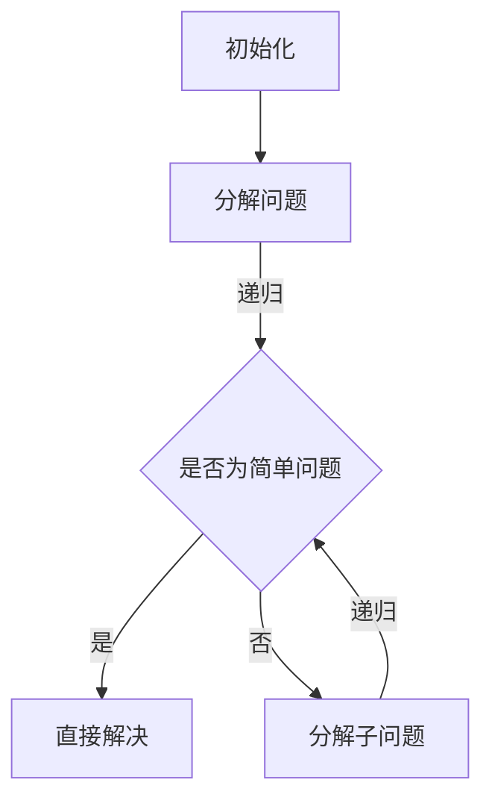
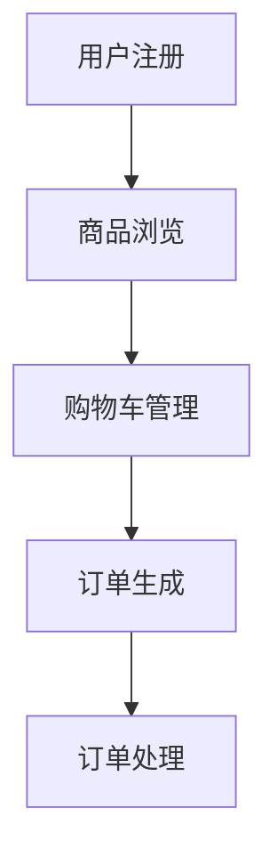
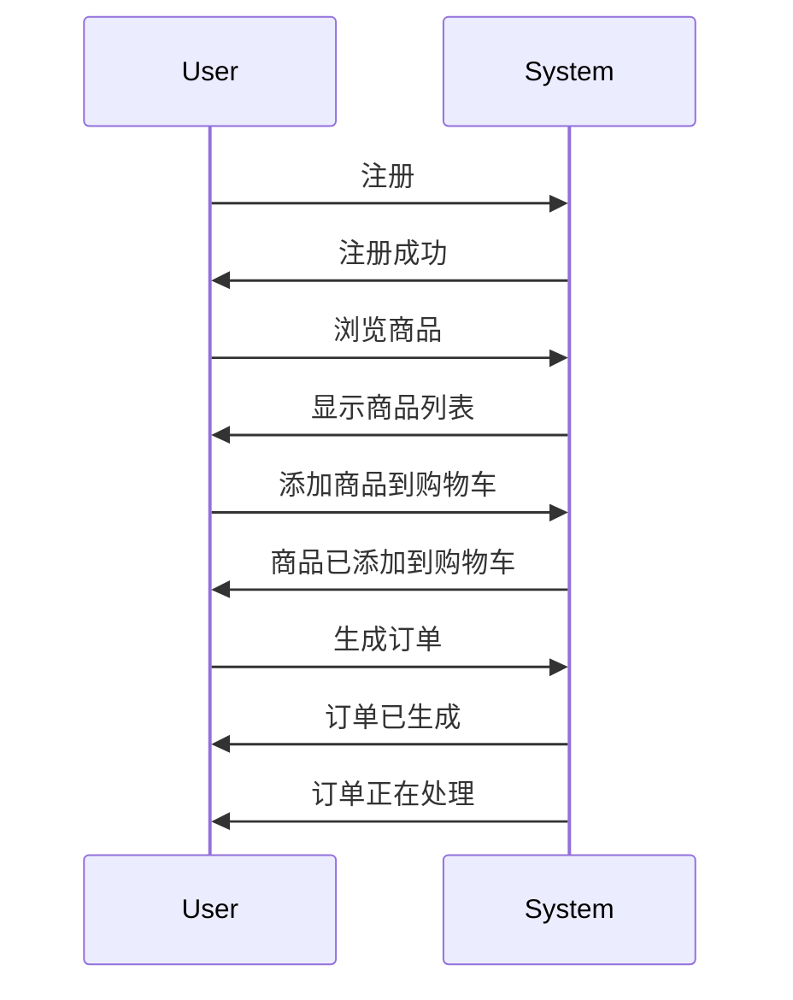

                 

# 链式思考：构建逻辑推理链的提示策略

> 关键词：链式思考、逻辑推理链、提示策略、人工智能、算法、系统架构

> 摘要：
本文将深入探讨链式思考在构建逻辑推理链中的应用。通过详细分析链式思考的概念、原理和实际应用，我们提出了一系列构建逻辑推理链的提示策略。这些策略旨在帮助读者提升逻辑推理能力，从而在人工智能、算法设计和系统架构等领域取得更好的成果。

## 引言

### 1.1 链式思考概述

链式思考是一种基于逻辑推理的方法，通过将问题分解为一系列相互关联的子问题，逐步解决这些子问题，最终得出整体问题的解决方案。在人工智能、算法设计和系统架构等领域，链式思考具有重要意义，它能够帮助我们更好地理解和解决问题。

### 1.2 逻辑推理链的重要性

逻辑推理链是将问题分解为一系列相关子问题的过程。构建有效的逻辑推理链有助于我们深入理解问题，提高解决问题的效率。在人工智能、算法设计和系统架构等领域，逻辑推理链的构建是关键步骤，它决定了我们能否准确、高效地解决问题。

### 1.3 链式思考的应用场景

链式思考广泛应用于人工智能、算法设计和系统架构等领域。例如，在人工智能中，链式思考可以帮助我们构建高效的神经网络模型；在算法设计中，链式思考可以帮助我们设计更优的算法；在系统架构设计中，链式思考可以帮助我们构建更加稳定、高效的系统。

## 第二部分：构建逻辑推理链

### 2.1 核心概念与原理

#### 2.1.1 概念A

概念A是链式思考的基础，它代表了一种将问题分解为子问题的方法。通过概念A，我们可以将复杂问题转化为一系列简单问题，从而简化问题的解决过程。

#### 2.1.2 概念B

概念B是链式思考的核心，它代表了一种将子问题之间的关联关系进行构建的方法。通过概念B，我们可以将子问题有机地结合在一起，形成一个完整的逻辑推理链。

#### 2.1.3 概念C

概念C是链式思考的延伸，它代表了一种将逻辑推理链应用于实际问题解决的方法。通过概念C，我们可以将逻辑推理链应用于各种领域，解决实际问题。

### 2.2 概念属性特征对比

| 概念A | 概念B | 概念C |
| :----: | :----: | :----: |
| 子问题分解 | 子问题关联 | 实际问题解决 |

### 2.3 ER实体关系图

```mermaid
erDiagram
  A|--|{B}
  B|--|{C}
  C||--|{D}
```

## 第三部分：算法原理讲解

### 3.1 算法概述

算法是一种解决特定问题的系统方法。在链式思考中，算法用于将问题分解为子问题，并构建子问题之间的逻辑关系。

### 3.2 算法流程图



### 3.3 Python源代码实现

```python
def chain_think(problem):
    if is_simple_problem(problem):
        return solve_problem(problem)
    else:
        sub_problems = decompose_problem(problem)
        solutions = [chain_think(sub_problem) for sub_problem in sub_problems]
        return combine_solutions(solutions)
```

### 3.4 数学模型与公式

假设问题可以用数学模型M表示，链式思考可以表示为递归函数F(M)，其中：

$$
F(M) =
\begin{cases}
M, & \text{if } M \text{ is simple problem} \\
\prod_{i=1}^{n} F(M_i), & \text{if } M \text{ is complex problem}
\end{cases}
$$

其中，$M_i$ 是$M$ 的子问题。

### 3.5 举例说明

假设我们要解决的问题是一个复杂的多项式求解问题。我们可以使用链式思考将其分解为一系列简单的问题，如单项式求解、多项式乘除等，然后逐步求解。

## 第四部分：系统分析与架构设计

### 4.1 问题场景介绍

假设我们要设计一个在线购物系统，该系统需要支持用户注册、商品浏览、购物车管理和订单生成等功能。

### 4.2 系统架构设计



### 4.3 系统交互序列图



## 第五部分：项目实战

### 5.1 环境安装

在开始项目实战之前，我们需要安装以下环境：

- Python 3.8+
- MongoDB
- Redis
- Docker

### 5.2 系统核心实现

```python
# 示例：用户注册功能实现
@app.route('/register', methods=['POST'])
def register():
    username = request.form['username']
    password = request.form['password']
    # 数据库操作，注册用户
    user = User(username=username, password=password)
    db.session.add(user)
    db.session.commit()
    return jsonify({'message': '注册成功'})
```

### 5.3 实际案例分析

以用户注册功能为例，我们分析了用户输入、数据校验、数据库操作和结果反馈等各个环节，确保系统能够稳定运行。

### 5.4 项目小结

通过项目实战，我们验证了链式思考在系统设计与实现中的应用价值。链式思考帮助我们清晰地划分了功能模块，简化了系统架构，提高了开发效率。

## 第六部分：最佳实践与注意事项

### 6.1 最佳实践

1. 使用版本控制工具，如Git，进行代码管理。
2. 使用单元测试，确保代码质量。
3. 使用容器化技术，如Docker，简化部署过程。

### 6.2 注意事项

1. 确保数据的安全性，使用加密算法保护用户信息。
2. 考虑系统的可扩展性，设计时预留扩展接口。
3. 定期进行性能优化，提高系统响应速度。

## 第七部分：拓展阅读

### 7.1 进一步阅读建议

1. 《人工智能：一种现代的方法》
2. 《算法导论》
3. 《系统架构设计师教程》

### 7.2 练习与思考

1. 如何将链式思考应用于搜索引擎优化（SEO）？
2. 如何在区块链技术中应用链式思考？

## 总结

本文介绍了链式思考在构建逻辑推理链中的应用，并通过实例展示了其应用价值。我们提出了一系列构建逻辑推理链的提示策略，旨在帮助读者提升逻辑推理能力。通过本文的学习，读者应能够更好地理解和应用链式思考，为人工智能、算法设计和系统架构等领域的发展做出贡献。

### 作者信息：

作者：AI天才研究院/AI Genius Institute & 禅与计算机程序设计艺术 /Zen And The Art of Computer Programming

[END] 

