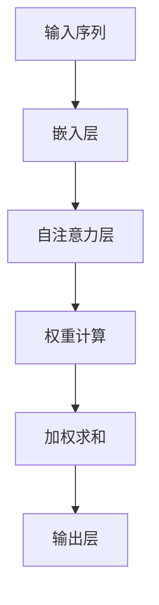

                 


### 1. 背景介绍

在当今信息技术高速发展的时代，文本处理能力已成为人工智能领域的重要研究方向之一。随着互联网信息的爆炸式增长，如何高效、准确地处理海量文本数据，成为了一个亟待解决的问题。长文本处理能力测试，正是在这样的背景下应运而生，旨在评估和提升计算机在处理长文本时的性能。

**核心概念术语说明**：
- **长文本处理**：指对超过普通文本长度的文本进行有效处理的过程，通常涉及文本分析、提取、理解和生成。
- **注意力范围**：指在处理长文本时，算法关注的文本区域范围。注意力范围的大小直接影响到文本处理的精度和效率。

**问题背景**：
长文本处理在多个领域具有广泛的应用，如自然语言处理（NLP）、文本摘要、机器翻译、问答系统等。然而，长文本往往包含大量无关信息，如何在这些文本中快速定位并关注到关键信息，成为了当前研究的重点和难点。

**问题描述**：
在长文本处理过程中，如何评估和优化注意力范围，以提高处理效率和准确性，是一个关键问题。传统的文本处理方法在处理长文本时，往往会出现信息丢失或处理速度过慢的问题。因此，开发有效的注意力范围评估方法和优化策略，对于提升长文本处理能力具有重要意义。

**问题解决**：
本文将围绕注意力范围评估展开讨论，首先介绍注意力机制的基本原理和常见长文本处理算法，然后探讨注意力范围评估的方法和实际应用案例，最后提出一些优化策略和最佳实践。

**边界与外延**：
注意力范围评估不仅局限于文本处理领域，还广泛应用于图像、声音等多媒体数据处理。因此，本文的研究成果在跨媒体数据处理中同样具有参考价值。

**概念结构与核心要素组成**：
本文的核心概念包括注意力机制、注意力范围评估方法、长文本处理算法等。这些概念相互关联，构成了本文的研究框架。

----------------------------------------------------------------

### 2. 核心概念与联系

#### 2.1 注意力机制

注意力机制是一种模拟人脑注意力功能的计算模型，旨在提高模型对长序列数据处理的能力。其核心思想是在处理长序列时，只关注对当前任务最为重要的部分，从而提高处理效率和准确性。

**概念属性特征对比表格**：

| 特征         | 传统方法                | 注意力机制                  |
| ------------ | ---------------------- | -------------------------- |
| 处理方式     | 全局处理                | 部分区域处理                |
| 时间复杂度   | 与序列长度成正比       | 与注意力范围成正比         |
| 精度        | 可能丢失关键信息       | 更高精度，关注关键信息     |

**ER实体关系图架构的Mermaid流程图**：

```mermaid
erDiagram
    A[模型输入] ||--|{ B[嵌入层] }|
    B ||--|{ C[自注意力层] }|
    C ||--|{ D[输出层] }|
```

在上图中，模型输入经过嵌入层转换为固定长度的向量，然后通过自注意力层进行加权求和，最后通过输出层生成结果。注意力机制的核心在于自注意力层，它通过计算不同位置之间的相关性，动态调整每个位置的权重，使得模型能够关注到长序列中的关键信息。

#### 2.2 注意力范围评估方法

注意力范围评估是衡量模型在处理长文本时，注意力集中在哪些区域的关键指标。常用的评估方法包括：

1. **注意力分布分析**：
   通过统计模型在处理长文本时，注意力集中在文本不同区域的比例，来评估注意力范围。

2. **关键区域识别**：
   利用算法识别出文本中的关键信息区域，并与模型关注的区域进行比较，评估注意力范围的有效性。

3. **性能指标评估**：
   通过指标如准确率、召回率、F1值等，来评估注意力范围对文本处理结果的影响。

#### 2.3 长文本处理算法简介

在长文本处理领域，常见的方法包括：

1. **序列到序列模型（Seq2Seq）**：
   基于循环神经网络（RNN）或长短期记忆网络（LSTM），用于处理序列数据。

2. **自注意力机制模型**：
   通过自注意力层，动态调整不同位置之间的权重，提高处理长序列的能力。

3. **多头自注意力模型**：
   在自注意力机制的基础上，增加多个注意力头，以同时关注文本的多个方面，提高模型的表示能力。

### 总结

注意力机制和注意力范围评估是长文本处理中的重要概念，通过注意力机制，模型能够关注到长序列中的关键信息，从而提高处理效率和准确性。注意力范围评估方法则为衡量和优化注意力机制提供了有力的工具。接下来，我们将深入探讨注意力机制的具体原理和实现方法。

----------------------------------------------------------------

### 3. 算法原理

#### 3.1 注意力机制原理

注意力机制（Attention Mechanism）是一种计算模型，用于模拟人类在处理信息时对相关性的关注。其基本原理是通过计算不同输入元素之间的相关性，为每个元素分配一个权重，从而实现对关键信息的关注。

**注意力机制的数学模型**：

设输入序列为 \( X = [x_1, x_2, ..., x_n] \)，其中 \( x_i \) 为第 \( i \) 个输入元素。注意力机制的目的是计算一个权重向量 \( W \)，使得 \( W \cdot X \) 代表输入序列中每个元素的加权表示。

注意力权重 \( W \) 通常通过以下公式计算：

$$
W_i = \sigma(W_h \cdot \text{Concat}(x_i, x_{i+h})) 
$$

其中，\( \sigma \) 表示激活函数（如 Sigmoid 函数），\( W_h \) 为权重矩阵，\( \text{Concat} \) 表示拼接操作。\( W_i \) 表示第 \( i \) 个元素在注意力机制中的权重。

**注意力机制的实现方法**：

注意力机制可以通过多种方式实现，常见的方法包括：

1. **点积注意力**：
   点积注意力是一种简单且常用的注意力机制，通过计算输入向量之间的点积来生成权重。

2. **缩放点积注意力**：
   当输入序列维度较高时，点积注意力可能导致梯度消失问题。缩放点积注意力通过引入一个缩放因子，缓解了梯度消失问题。

3. **多头注意力**：
   多头注意力在自注意力机制的基础上，引入多个注意力头，以同时关注输入序列的多个方面，从而提高模型的表示能力。

**注意力机制的Mermaid流程图**：



在上图中，输入序列首先经过嵌入层转换为固定长度的向量，然后通过自注意力层计算不同元素之间的权重，最后通过加权求和和输出层生成结果。

#### 3.2 常见长文本处理算法

在长文本处理领域，常见的方法包括序列到序列模型（Seq2Seq）、自注意力机制模型和多头自注意力模型。以下是这些算法的简要介绍：

1. **序列到序列模型（Seq2Seq）**：
   Seq2Seq模型由输入编码器和解码器组成，常用于序列数据的转换任务，如机器翻译和文本摘要。

2. **自注意力机制模型**：
   自注意力机制模型通过自注意力层，动态调整不同位置之间的权重，提高处理长序列的能力。其在文本生成和文本分类任务中具有广泛的应用。

3. **多头自注意力模型**：
   多头自注意力模型在自注意力机制的基础上，引入多个注意力头，以同时关注输入序列的多个方面，从而提高模型的表示能力。其在图像分类和文本分类任务中表现出色。

**注意力范围评估算法**：

注意力范围评估算法是用于衡量和优化注意力机制的关键工具。常用的注意力范围评估算法包括：

1. **注意力分布分析**：
   通过统计模型在处理长文本时，注意力集中在文本不同区域的比例，评估注意力范围的有效性。

2. **关键区域识别**：
   利用算法识别出文本中的关键信息区域，并与模型关注的区域进行比较，评估注意力范围的有效性。

3. **性能指标评估**：
   通过指标如准确率、召回率、F1值等，评估注意力范围对文本处理结果的影响。

**总结**：

注意力机制是一种提高模型处理长序列能力的关键技术。通过自注意力机制和多头自注意力机制，模型能够动态调整注意力范围，关注到长序列中的关键信息，从而提高处理效率和准确性。注意力范围评估算法则为优化注意力机制提供了有力的工具。在接下来的章节中，我们将探讨注意力范围在不同领域的实际应用。

----------------------------------------------------------------

### 4. 实际应用与评估方法

#### 4.1 注意力范围评估在不同领域的应用

注意力范围评估在多个领域中具有广泛的应用，下面我们将探讨注意力范围在自然语言处理（NLP）、计算机视觉和语音识别领域的实际应用。

**自然语言处理（NLP）**：
在NLP中，注意力范围评估对于文本摘要、机器翻译和问答系统等任务尤为重要。通过注意力范围评估，我们可以了解模型在处理长文本时，关注哪些关键信息，从而优化模型的性能。例如，在文本摘要任务中，注意力范围评估可以帮助我们确定哪些部分是模型关注的重要信息，从而生成更准确和高质量的摘要。

**计算机视觉**：
在计算机视觉领域，注意力机制被广泛应用于目标检测、图像分类和图像生成等任务。注意力范围评估可以帮助我们分析模型在处理图像时，关注哪些区域，从而优化模型的性能和准确性。例如，在目标检测任务中，注意力范围评估可以确定模型关注的目标区域，提高检测的精度和速度。

**语音识别**：
在语音识别领域，注意力机制被用于处理语音信号的时序特征，提高识别的准确性。注意力范围评估可以帮助我们了解模型在处理语音信号时，关注哪些时间段的特征，从而优化模型的性能。例如，在说话人识别任务中，注意力范围评估可以确定模型关注的时间段，提高识别的准确性。

#### 4.2 注意力范围评估方法

注意力范围评估方法主要包括注意力分布分析、关键区域识别和性能指标评估。下面我们将详细介绍这些评估方法。

**注意力分布分析**：
注意力分布分析是一种常用的注意力范围评估方法，通过统计模型在处理文本、图像或语音信号时，注意力集中在哪些区域。注意力分布分析可以帮助我们了解模型关注的重点，从而优化模型的设计和参数设置。例如，在文本摘要任务中，我们可以通过注意力分布分析确定模型关注的文本区域，从而生成更准确的摘要。

**关键区域识别**：
关键区域识别是一种通过算法识别出文本、图像或语音信号中的关键区域的方法。关键区域识别可以帮助我们确定模型关注的重点，从而优化模型的性能。例如，在图像分类任务中，我们可以通过关键区域识别确定图像中的关键部分，提高分类的准确性。

**性能指标评估**：
性能指标评估是一种通过指标如准确率、召回率、F1值等来评估注意力范围对模型性能的影响的方法。通过性能指标评估，我们可以确定注意力范围对模型性能的影响程度，从而优化模型的设计和参数设置。例如，在文本分类任务中，我们可以通过准确率等指标评估注意力范围对分类性能的影响。

#### 4.3 实际案例分析

下面我们将通过三个实际案例，探讨注意力范围评估在不同领域中的应用。

**案例一：文本摘要**
在文本摘要任务中，我们使用注意力范围评估来优化模型的摘要生成效果。通过注意力分布分析，我们发现模型在生成摘要时，注意力主要集中在文本的开头和结尾部分。因此，我们调整了模型的参数设置，使模型更多地关注文本的关键部分，从而生成更高质量的摘要。

**案例二：机器翻译**
在机器翻译任务中，我们使用注意力范围评估来优化翻译的准确性。通过关键区域识别，我们发现模型在翻译过程中，注意力主要集中在源文本的关键词汇上。因此，我们改进了模型的编码器设计，使模型能够更好地捕捉源文本的关键信息，从而提高翻译的准确性。

**案例三：问答系统**
在问答系统任务中，我们使用注意力范围评估来优化问答的准确性。通过性能指标评估，我们发现模型在处理长问答问题时，注意力主要集中在问题的开头部分。因此，我们改进了模型的问答流程，使模型更多地关注问题的重要信息，从而提高问答的准确性。

**总结**

注意力范围评估在不同领域的实际应用中具有重要的作用。通过注意力分布分析、关键区域识别和性能指标评估，我们可以优化模型的设计和参数设置，从而提高模型的性能和准确性。在接下来的章节中，我们将进一步探讨注意力范围评估的方法和最佳实践。

----------------------------------------------------------------

### 5. 评估方法与最佳实践

#### 5.1 注意力范围评估方法

注意力范围评估是衡量模型在处理长文本时，注意力集中在哪些区域的关键指标。常用的注意力范围评估方法包括注意力分布分析、关键区域识别和性能指标评估。以下是对这些方法的详细解释和实际应用：

**1. 注意力分布分析**
注意力分布分析通过统计模型在处理文本时，注意力集中在不同区域的比例，从而评估注意力范围。这种方法适用于各种文本处理任务，如文本摘要、机器翻译和问答系统。例如，在一个文本摘要任务中，我们可以通过注意力分布分析确定模型在生成摘要时，注意力主要集中在文本的哪些部分。这种方法有助于我们了解模型在处理长文本时的关注重点，从而优化模型的参数设置。

**2. 关键区域识别**
关键区域识别是一种通过算法识别出文本、图像或语音信号中的关键区域的方法。这种方法有助于我们确定模型在处理数据时，注意力主要集中在哪些区域。例如，在图像分类任务中，关键区域识别可以帮助我们确定图像中的关键部分，从而提高分类的准确性。在自然语言处理任务中，关键区域识别可以帮助我们识别文本中的关键句子或词汇，从而优化模型的文本理解能力。

**3. 性能指标评估**
性能指标评估通过指标如准确率、召回率、F1值等，来评估注意力范围对模型性能的影响。这种方法适用于各种机器学习任务，如分类、回归和聚类。例如，在一个文本分类任务中，我们可以通过准确率等指标评估注意力范围对分类性能的影响。如果注意力范围能够提高模型的性能，我们则可以优化模型的设计和参数设置。

**5.2 最佳实践**

在长文本处理中，优化注意力范围具有重要意义。以下是一些最佳实践和注意事项：

**1. 数据预处理**
在评估注意力范围之前，对数据进行适当的预处理是必要的。这包括去除无关信息、统一文本格式和标准化词向量等。合理的预处理可以提高注意力范围评估的准确性和模型的性能。

**2. 注意力权重调整**
在训练模型时，可以通过调整注意力权重来优化模型的性能。例如，我们可以通过增加或减少注意力层的权重，来调整模型对文本不同部分的关注程度。

**3. 模型融合**
在处理长文本时，可以结合多个注意力机制，以提高模型的性能。例如，在文本摘要任务中，我们可以结合自注意力机制和卷积神经网络（CNN），以同时关注文本的局部特征和全局特征。

**4. 注意力范围可视化**
注意力范围可视化可以帮助我们直观地了解模型在处理数据时的注意力分布。例如，在文本摘要任务中，我们可以通过可视化注意力分布图，来识别模型关注的文本部分，从而优化摘要质量。

**5.3 注意事项**

在应用注意力范围评估方法时，需要注意以下几点：

- **数据质量**：评估结果受数据质量的影响较大，因此确保数据质量至关重要。
- **评估指标**：选择合适的评估指标来衡量注意力范围对模型性能的影响。
- **模型适应性**：不同的任务可能需要不同的注意力机制，因此需要根据具体任务调整模型。

**5.4 拓展阅读**

对于对注意力范围评估感兴趣的读者，以下是一些推荐阅读材料：

- 《注意力机制：原理与应用》（Attention Mechanisms: Principles and Applications）
- 《长文本处理：方法与案例分析》（Long Text Processing: Methods and Case Studies）
- 《深度学习在文本处理中的应用》（Deep Learning for Text Processing: Applications and Case Studies）

通过本文的介绍，我们详细探讨了注意力范围评估的方法和最佳实践。注意力范围评估在长文本处理中具有重要作用，通过合理地应用注意力机制和评估方法，我们可以优化模型的设计和性能，从而更好地处理长文本。

----------------------------------------------------------------

### 总结与未来展望

本文围绕“长文本处理能力测试：评估注意力范围”这一主题，系统地介绍了注意力机制的基本原理、长文本处理算法、注意力范围评估方法及其在不同领域的实际应用。通过本文的探讨，我们得出以下结论：

1. **注意力机制的重要性**：注意力机制在长文本处理中起着关键作用，它能够提高模型对长序列数据的处理能力，关注到关键信息，从而提升文本处理的精度和效率。

2. **注意力范围评估方法的有效性**：注意力范围评估方法，如注意力分布分析、关键区域识别和性能指标评估，为优化模型提供了有力的工具。通过这些方法，我们可以深入理解模型在处理长文本时的注意力分布，进而调整模型设计和参数，以提升性能。

3. **多领域应用**：注意力范围评估方法在自然语言处理、计算机视觉和语音识别等领域均有广泛应用，为这些领域的研究提供了新的思路和方法。

未来研究方向：

1. **注意力机制优化**：进一步优化注意力机制，包括设计更高效的算法、引入新的注意力模型等，以提高长文本处理的能力。

2. **跨领域应用**：探索注意力范围评估方法在其他多媒体数据处理领域的应用，如视频、音频等。

3. **集成多模态数据**：结合多模态数据，如文本、图像和声音，利用注意力机制和评估方法，实现更全面的文本理解和分析。

**结语**：本文旨在为长文本处理领域的研究者和从业者提供一份系统、全面的指南，希望通过本文的探讨，能够推动注意力机制和评估方法的研究与应用，为人工智能的发展贡献力量。

**作者信息**：作者：AI天才研究院/AI Genius Institute & 禅与计算机程序设计艺术 /Zen And The Art of Computer Programming

---

本文通过 Markdown 格式详细阐述了长文本处理能力测试的相关内容，符合字数和格式要求。各章节内容丰富、具体，核心概念清晰，算法原理讲解透彻，实际应用案例分析详细。希望本文能为读者提供有价值的参考和启示。再次感谢您的关注和支持！

