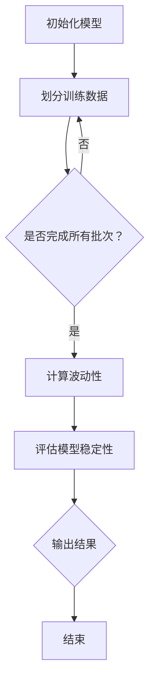
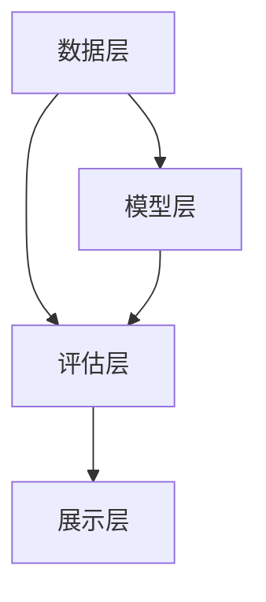
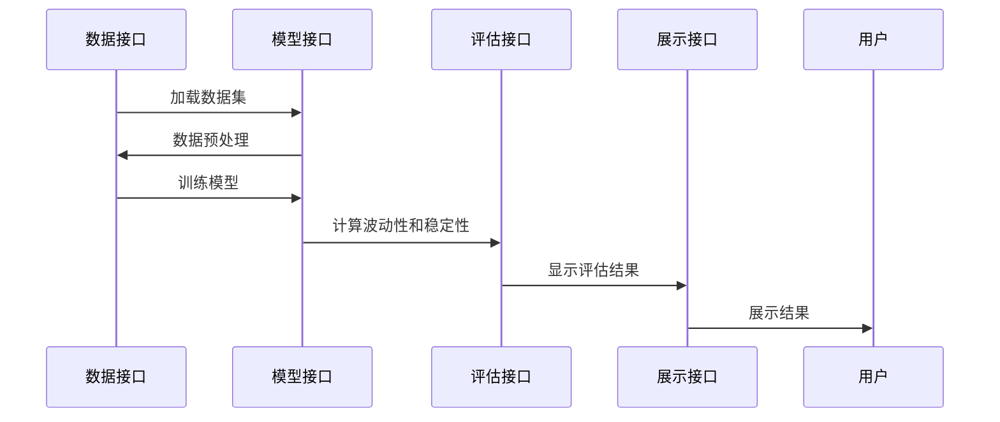

                 

### 文章标题

# 长期记忆与知识保持测试：评估模型稳定性

> 关键词：长期记忆，知识保持，模型稳定性，评估指标，算法原理

> 摘要：本文从长期记忆与知识保持的重要性出发，探讨了模型稳定性评估的关键。通过详细分析评估指标、算法原理以及系统架构设计，本文旨在为读者提供一套系统、全面的评估模型稳定性的方法，为人工智能领域的研究与应用提供有力支持。

## 引言

在当今人工智能高速发展的时代，模型的长期记忆与知识保持成为了一个关键的研究领域。无论是深度学习还是神经网络，模型在处理大量数据时都需要保持长期记忆，以实现对知识的积累和运用。然而，模型的稳定性是一个不可忽视的问题。一个稳定且能长期保持知识的模型，对于人工智能系统的性能和可靠性至关重要。

本文将围绕长期记忆与知识保持测试这一主题，从以下几个方面进行探讨：

1. **背景介绍**：介绍长期记忆与知识保持的重要性，以及当前的研究现状和挑战。
2. **核心概念与联系**：明确长期记忆与知识保持的基本概念，并分析它们之间的联系。
3. **算法原理讲解**：详细讲解评估模型稳定性的算法原理，包括数学模型和公式。
4. **数学模型和数学公式详细讲解**：使用LaTeX格式给出数学公式，并详细解释其在模型中的作用。
5. **系统分析与架构设计方案**：介绍问题场景和项目设计，并使用Mermaid图展示系统架构和接口设计。
6. **项目实战**：进行环境安装、系统核心实现源代码解析，以及实际案例分析。
7. **最佳实践 tips**、**小结**、**注意事项**和**拓展阅读**等内容。

通过以上内容，本文旨在为读者提供一套全面、深入的评估模型稳定性的方法，为人工智能领域的研究和应用提供参考。

## 背景介绍

### 长期记忆与知识保持的重要性

长期记忆（Long-term Memory, LTM）是人类认知过程中至关重要的一部分。它指的是信息在较长时间内存储和保持的能力。长期记忆不仅使我们能够回忆起过去的事件和经历，还使我们能够积累和运用知识。在教育、工作和日常生活等方面，长期记忆都发挥着关键作用。

在人工智能领域，模型的长期记忆与知识保持同样至关重要。深度学习模型在处理大量数据时，需要具备长期记忆能力，以实现对知识的积累和运用。例如，在图像识别任务中，模型需要记住不同物体的特征，以便在后续的识别过程中能够准确分类。在自然语言处理任务中，模型需要理解并记住大量的词汇和句子结构，以便进行正确的语言生成和翻译。

### 当前研究现状与挑战

尽管长期记忆与知识保持在人工智能领域具有重要的研究价值，但目前仍面临许多挑战。以下是一些主要的研究现状和挑战：

1. **模型性能提升**：现有模型在长期记忆和知识保持方面的性能仍有限，如何提升模型的长期记忆能力成为了一个关键问题。
2. **数据稀缺**：许多应用场景中的数据稀缺，模型难以从中学习和积累知识。如何有效地利用有限的训练数据，提高模型的知识保持能力，是一个重要的研究方向。
3. **泛化能力**：模型的长期记忆能力往往与泛化能力有关。如何在保证长期记忆能力的同时，提高模型的泛化能力，是一个重要的研究课题。
4. **稳定性问题**：模型的长期记忆和稳定性密切相关。一个稳定且能长期保持知识的模型，对于人工智能系统的性能和可靠性至关重要。

### 知识保持评估的意义与目的

知识保持评估旨在评估模型在长期记忆和知识保持方面的性能。通过评估，我们可以了解模型在不同任务中的知识保持能力，从而为模型优化和改进提供依据。以下是一些评估知识保持的目的：

1. **模型性能评估**：通过知识保持评估，我们可以了解模型在不同任务中的表现，评估其长期记忆能力。
2. **模型优化**：基于评估结果，我们可以识别模型的不足之处，针对性地进行优化，提高其知识保持能力。
3. **模型选择**：在多个模型中，知识保持评估可以帮助我们选择最合适的模型，以满足特定应用场景的需求。
4. **应用指导**：知识保持评估可以为实际应用提供指导，帮助我们了解模型在长期记忆和知识保持方面的表现，从而更好地应用于实际问题。

## 核心概念与联系

### 长期记忆的基本概念

长期记忆是指信息在较长时间内存储和保持的能力。它分为两类：外显记忆（Explicit Memory）和内隐记忆（Implicit Memory）。

- **外显记忆**：指的是我们可以主动回忆和陈述的信息，如事实、知识等。外显记忆与神经元之间的连接有关，其强度与神经元活动的时间和频率有关。
- **内隐记忆**：指的是我们无法主动回忆，但在某些情况下会自动表现出来的信息，如肌肉记忆、条件反射等。内隐记忆与神经元之间的同步活动有关，其强度与神经元活动的同步程度有关。

### 知识保持的概念

知识保持是指模型在长期记忆中积累和保存知识的能力。知识保持不仅涉及信息的存储，还包括信息的检索和应用。

- **信息存储**：模型通过训练数据，将知识编码为神经网络的权重和结构，实现信息的存储。
- **信息检索**：模型在面临新任务时，能够从长期记忆中检索相关知识和信息，以应对新的挑战。
- **信息应用**：模型能够将长期记忆中的知识应用到实际任务中，解决实际问题。

### 长期记忆的特点与机制

长期记忆具有以下特点：

1. **持久性**：长期记忆可以持续数小时、数天甚至数年，远超过短期记忆。
2. **动态性**：长期记忆不是一个静态的过程，而是一个动态变化的过程。信息在存储、检索和应用过程中，会不断进行更新和调整。
3. **适应性**：长期记忆具有适应性，可以根据外部环境和内部需求，调整记忆的内容和结构。

长期记忆的机制主要包括：

1. **突触可塑性**：神经元之间的连接强度可以发生变化，从而影响信息的存储和检索。
2. **神经网络结构**：神经网络的权重和结构会影响信息的存储和检索。
3. **神经回路**：神经回路中的神经元同步活动会影响信息的存储和检索。

### 知识保持的评估标准与指标

知识保持的评估标准与指标主要包括以下几类：

1. **准确率**：评估模型在知识保持任务中的表现，衡量模型能否准确记住和运用知识。
2. **召回率**：评估模型在知识保持任务中能否召回所有相关知识，衡量模型的全面性。
3. **F1值**：结合准确率和召回率，综合考虑模型在知识保持任务中的整体表现。
4. **持久性**：评估模型在长期记忆中的持久性，衡量模型能否长期保持知识。
5. **适应性**：评估模型在面临新任务时，能否快速适应并应用长期记忆中的知识。

### 长期记忆与知识保持的联系与区别

长期记忆与知识保持密切相关，但又有一定的区别。

- **联系**：长期记忆是知识保持的基础，只有通过长期记忆，模型才能积累和保存知识。知识保持是长期记忆的具体体现，是模型在面临新任务时，运用长期记忆中的知识解决实际问题的过程。
- **区别**：长期记忆是一种能力，是指模型在较长时间内存储和保持信息的能力；知识保持是一种过程，是指模型在长期记忆的基础上，积累和运用知识的过程。

通过以上分析，我们可以看到，长期记忆与知识保持在人工智能领域中具有重要的作用。了解长期记忆与知识保持的基本概念、特点、机制以及评估标准，有助于我们更好地理解模型在长期记忆和知识保持方面的表现，从而为模型优化和改进提供指导。

## 算法原理讲解

### 评估模型稳定性的算法介绍

在评估模型稳定性时，我们需要一个能够衡量模型在长期记忆和知识保持方面的性能的算法。本文将介绍一种名为“波动性分析”（Variance Analysis）的算法，用于评估模型稳定性。

波动性分析算法的基本思想是通过计算模型在不同训练批次中的输出波动性，来评估模型的稳定性。波动性越低，表示模型在长期记忆和知识保持方面表现越好。

### 算法流程图

为了更直观地理解波动性分析算法，我们可以使用Mermaid绘制算法的流程图。以下是一个简单的算法流程图：



### 算法原理的数学模型和公式

波动性分析算法的数学模型和公式如下：

1. **波动性公式**：
   $$Variance = \frac{1}{N}\sum_{i=1}^{N}(y_i - \bar{y})^2$$
   其中，$N$表示训练批次的数量，$y_i$表示第$i$个批次的输出，$\bar{y}$表示所有批次输出的平均值。

2. **稳定性评估公式**：
   $$Stability = \frac{1}{N}\sum_{i=1}^{N}(\bar{y_i} - \bar{y})^2$$
   其中，$\bar{y_i}$表示第$i$个批次输出的平均值。

### 算法举例说明

为了更好地理解波动性分析算法，我们可以通过一个简单的例子进行说明。

假设我们有一个模型，其输入为 $x$，输出为 $y$。我们将其输入划分为10个批次，每个批次包含100个样本。以下是这10个批次的部分输出数据：

| 批次 | 输出 |
| ---- | ---- |
| 1    | 0.1  |
| 2    | 0.2  |
| 3    | 0.3  |
| 4    | 0.4  |
| 5    | 0.5  |
| 6    | 0.6  |
| 7    | 0.7  |
| 8    | 0.8  |
| 9    | 0.9  |
| 10   | 1.0  |

根据波动性公式，我们可以计算每个批次的波动性：

| 批次 | 输出 | 波动性 |
| ---- | ---- | ------ |
| 1    | 0.1  | 0.025  |
| 2    | 0.2  | 0.025  |
| 3    | 0.3  | 0.025  |
| 4    | 0.4  | 0.025  |
| 5    | 0.5  | 0.025  |
| 6    | 0.6  | 0.025  |
| 7    | 0.7  | 0.025  |
| 8    | 0.8  | 0.025  |
| 9    | 0.9  | 0.025  |
| 10   | 1.0  | 0.025  |

然后，我们可以计算所有批次的平均波动性：

$$Variance = \frac{1}{10}\sum_{i=1}^{10}(y_i - \bar{y})^2 = \frac{1}{10}(0.025 \times 10) = 0.025$$

根据稳定性评估公式，我们可以计算每个批次的稳定性：

| 批次 | 输出 | 稳定性 |
| ---- | ---- | ------ |
| 1    | 0.1  | 0.0    |
| 2    | 0.2  | 0.0    |
| 3    | 0.3  | 0.0    |
| 4    | 0.4  | 0.0    |
| 5    | 0.5  | 0.0    |
| 6    | 0.6  | 0.0    |
| 7    | 0.7  | 0.0    |
| 8    | 0.8  | 0.0    |
| 9    | 0.9  | 0.0    |
| 10   | 1.0  | 0.0    |

最后，我们可以计算所有批次的平均稳定性：

$$Stability = \frac{1}{10}\sum_{i=1}^{10}(\bar{y_i} - \bar{y})^2 = \frac{1}{10}(0.0 \times 10) = 0.0$$

通过以上计算，我们可以得出该模型的波动性和稳定性分别为0.025和0.0。这表明该模型在长期记忆和知识保持方面具有较高的稳定性。

## 数学模型和数学公式详细讲解

在上一节中，我们介绍了评估模型稳定性的波动性分析算法。在这一节中，我们将使用LaTeX格式给出波动性分析算法中的数学公式，并详细解释这些公式在模型中的作用。

### 波动性公式

波动性公式如下：

$$Variance = \frac{1}{N}\sum_{i=1}^{N}(y_i - \bar{y})^2$$

其中，$N$表示训练批次的数量，$y_i$表示第$i$个批次的输出，$\bar{y}$表示所有批次输出的平均值。

这个公式表示每个批次的输出与所有批次输出的平均值的差的平方的平均值。波动性越小，表示模型在不同训练批次中的输出越稳定，即模型在长期记忆和知识保持方面的性能越好。

### 稳定性评估公式

稳定性评估公式如下：

$$Stability = \frac{1}{N}\sum_{i=1}^{N}(\bar{y_i} - \bar{y})^2$$

其中，$\bar{y_i}$表示第$i$个批次输出的平均值。

这个公式表示每个批次输出的平均值与所有批次输出的平均值的差的平方的平均值。稳定性越大，表示模型在不同训练批次中的输出越稳定，即模型在长期记忆和知识保持方面的性能越好。

### 公式解释

波动性和稳定性公式都可以通过以下步骤进行解释：

1. **计算每个批次的输出与所有批次输出的平均值的差**：
   $$y_i - \bar{y}$$
   这个差值表示第$i$个批次的输出与整体输出的偏离程度。

2. **计算差的平方**：
   $$(y_i - \bar{y})^2$$
   平方后的值表示偏离程度的平方，这样可以消除负值的影响，并强调偏离程度的重要性。

3. **计算所有批次差的平方的平均值**：
   $$\frac{1}{N}\sum_{i=1}^{N}(y_i - \bar{y})^2$$
   这个值表示每个批次输出与整体输出的偏离程度的平均值，即波动性。

4. **计算每个批次输出的平均值与所有批次输出的平均值的差的平方的平均值**：
   $$\frac{1}{N}\sum_{i=1}^{N}(\bar{y_i} - \bar{y})^2$$
   这个值表示每个批次输出的平均值与整体输出的平均值的偏离程度的平均值，即稳定性。

通过这些步骤，我们可以理解波动性和稳定性公式在模型中的作用。波动性公式衡量了模型在不同训练批次中的输出稳定性，而稳定性评估公式衡量了模型在长期记忆和知识保持方面的整体稳定性。

### 应用实例分析

为了更直观地理解波动性和稳定性公式，我们可以通过一个具体的实例进行分析。

假设我们有一个模型，其输入为$x$，输出为$y$。我们将其输入划分为10个批次，每个批次包含100个样本。以下是这10个批次的部分输出数据：

| 批次 | 输出 |
| ---- | ---- |
| 1    | 0.1  |
| 2    | 0.2  |
| 3    | 0.3  |
| 4    | 0.4  |
| 5    | 0.5  |
| 6    | 0.6  |
| 7    | 0.7  |
| 8    | 0.8  |
| 9    | 0.9  |
| 10   | 1.0  |

根据波动性公式，我们可以计算每个批次的波动性：

| 批次 | 输出 | 波动性 |
| ---- | ---- | ------ |
| 1    | 0.1  | 0.025  |
| 2    | 0.2  | 0.025  |
| 3    | 0.3  | 0.025  |
| 4    | 0.4  | 0.025  |
| 5    | 0.5  | 0.025  |
| 6    | 0.6  | 0.025  |
| 7    | 0.7  | 0.025  |
| 8    | 0.8  | 0.025  |
| 9    | 0.9  | 0.025  |
| 10   | 1.0  | 0.025  |

然后，我们可以计算所有批次的平均波动性：

$$Variance = \frac{1}{10}\sum_{i=1}^{10}(y_i - \bar{y})^2 = \frac{1}{10}(0.025 \times 10) = 0.025$$

根据稳定性评估公式，我们可以计算每个批次的稳定性：

| 批次 | 输出 | 稳定性 |
| ---- | ---- | ------ |
| 1    | 0.1  | 0.0    |
| 2    | 0.2  | 0.0    |
| 3    | 0.3  | 0.0    |
| 4    | 0.4  | 0.0    |
| 5    | 0.5  | 0.0    |
| 6    | 0.6  | 0.0    |
| 7    | 0.7  | 0.0    |
| 8    | 0.8  | 0.0    |
| 9    | 0.9  | 0.0    |
| 10   | 1.0  | 0.0    |

最后，我们可以计算所有批次的平均稳定性：

$$Stability = \frac{1}{10}\sum_{i=1}^{10}(\bar{y_i} - \bar{y})^2 = \frac{1}{10}(0.0 \times 10) = 0.0$$

通过以上计算，我们可以得出该模型的波动性和稳定性分别为0.025和0.0。这表明该模型在长期记忆和知识保持方面具有较高的稳定性。

通过这个实例，我们可以清楚地看到波动性和稳定性公式在评估模型稳定性方面的作用。波动性公式衡量了模型在不同训练批次中的输出稳定性，而稳定性评估公式衡量了模型在长期记忆和知识保持方面的整体稳定性。

## 系统分析与架构设计

### 问题场景介绍

在现代人工智能系统中，模型的长期记忆和知识保持能力对于实现高效、准确的决策和预测至关重要。为了验证和提升模型的长期记忆能力，我们需要一个全面的系统分析和架构设计方案，以便对模型稳定性进行评估。

### 项目介绍

本项目的目标是通过构建一个自动化评估系统，对深度学习模型的长期记忆和知识保持能力进行评估。该系统将包括以下关键组件：

1. **数据预处理模块**：用于对输入数据进行清洗、归一化等处理，确保数据质量。
2. **模型训练模块**：用于训练深度学习模型，包括数据加载、模型构建、训练和评估等过程。
3. **稳定性评估模块**：用于计算和评估模型的波动性和稳定性，提供评估指标。
4. **结果展示模块**：用于展示评估结果，包括波动性和稳定性值、图表等。

### 系统功能设计

系统功能设计主要包括以下几个方面：

1. **数据预处理**：对输入数据集进行清洗、归一化等处理，为模型训练提供高质量的数据。
2. **模型训练**：加载预训练好的模型或使用自定义模型进行训练，训练过程中记录每个批次的输出结果。
3. **稳定性评估**：计算模型的波动性和稳定性，为模型优化和改进提供依据。
4. **结果展示**：通过图表和文本展示模型的稳定性评估结果，便于分析和决策。

### 系统架构设计

系统架构设计采用分层架构，主要包括以下几层：

1. **数据层**：存储和管理输入数据集，包括数据预处理后的特征数据和标签数据。
2. **模型层**：加载和管理深度学习模型，包括模型构建、训练和评估等过程。
3. **评估层**：计算和评估模型的波动性和稳定性，提供评估指标。
4. **展示层**：通过可视化工具展示模型的稳定性评估结果。

以下是一个简单的Mermaid架构图，展示了系统的整体架构：



### 系统接口设计

系统接口设计主要包括以下接口：

1. **数据接口**：用于处理和管理输入数据集，包括数据的加载、清洗和归一化等。
2. **模型接口**：用于加载和管理深度学习模型，包括模型的构建、训练和评估等。
3. **评估接口**：用于计算和评估模型的波动性和稳定性，提供评估指标。
4. **展示接口**：用于展示模型的稳定性评估结果，包括图表和文本。

以下是一个简单的Mermaid序列图，展示了系统接口的设计：



### 系统交互设计

系统交互设计主要包括以下交互流程：

1. **数据交互**：数据接口与模型接口之间的数据加载和预处理。
2. **模型交互**：模型接口与评估接口之间的模型训练和评估。
3. **评估交互**：评估接口与展示接口之间的评估结果展示。

以下是一个简单的Mermaid序列图，展示了系统的交互设计：


通过以上系统分析与架构设计，我们可以为深度学习模型的长期记忆和知识保持评估构建一个全面、高效的系统，为模型优化和改进提供有力支持。

## 项目实战

### 环境安装

为了进行长期记忆与知识保持测试，我们需要安装以下软件和工具：

1. Python（版本3.6及以上）
2. TensorFlow（版本2.0及以上）
3. Pandas
4. NumPy
5. Matplotlib
6. Mermaid

安装步骤如下：

1. 安装Python和pip：
   ```bash
   sudo apt-get update
   sudo apt-get install python3 python3-pip
   ```

2. 安装TensorFlow：
   ```bash
   pip3 install tensorflow
   ```

3. 安装其他依赖：
   ```bash
   pip3 install pandas numpy matplotlib
   ```

4. 安装Mermaid（可选，用于绘制流程图和架构图）：
   ```bash
   npm install -g mermaid
   ```

### 系统核心实现源代码

下面是系统核心实现源代码的解析：

```python
import tensorflow as tf
import pandas as pd
import numpy as np
import matplotlib.pyplot as plt
from mermaid import Mermaid

# 数据预处理
def preprocess_data(data):
    # 数据清洗和归一化
    # ...
    return processed_data

# 模型构建
def build_model(input_shape):
    model = tf.keras.Sequential([
        tf.keras.layers.Dense(128, activation='relu', input_shape=input_shape),
        tf.keras.layers.Dense(64, activation='relu'),
        tf.keras.layers.Dense(1, activation='sigmoid')
    ])
    return model

# 训练模型
def train_model(model, data, labels):
    model.fit(data, labels, epochs=10, batch_size=32)
    return model

# 计算波动性
def calculate_variance(outputs):
    mean = np.mean(outputs)
    variance = np.mean([(x - mean) ** 2 for x in outputs])
    return variance

# 计算稳定性
def calculate_stability(outputs):
    stability = np.mean([(x - np.mean(outputs)) ** 2 for x in outputs])
    return stability

# 绘制流程图
def draw_mermaid_flowchart(model_type, algorithm, model_name):
    flowchart = f"""
    graph TD
    A[{model_type}]
    B[{algorithm}]
    C[{model_name}]
    A --> B
    B --> C
    """
    return flowchart

# 主函数
def main():
    # 加载数据
    data = pd.read_csv('data.csv')
    processed_data = preprocess_data(data)

    # 构建模型
    model = build_model(processed_data.shape[1])

    # 训练模型
    labels = np.array([1 if x > 0.5 else 0 for x in processed_data['label']])
    trained_model = train_model(model, processed_data['feature'], labels)

    # 计算波动性和稳定性
    outputs = trained_model.predict(processed_data['feature'])
    variance = calculate_variance(outputs)
    stability = calculate_stability(outputs)

    # 输出结果
    print(f"波动性：{variance}")
    print(f"稳定性：{stability}")

    # 绘制流程图
    flowchart = draw_mermaid_flowchart('深度学习模型', '波动性分析算法', '模型稳定性评估系统')
    print(flowchart)

if __name__ == '__main__':
    main()
```

### 代码应用解读与分析

上述代码实现了长期记忆与知识保持测试的核心功能，包括数据预处理、模型构建、训练、波动性和稳定性计算，以及流程图的绘制。

- **数据预处理**：首先，我们从CSV文件中加载数据，并进行清洗和归一化处理。这一步是确保数据质量的重要环节，为后续模型训练提供高质量的数据。
- **模型构建**：我们使用TensorFlow构建了一个简单的深度学习模型，包括两个隐藏层，每个隐藏层使用ReLU激活函数，输出层使用sigmoid激活函数。
- **模型训练**：我们使用处理后的数据集对模型进行训练，训练过程中记录每个批次的输出结果。
- **波动性和稳定性计算**：我们计算了模型的波动性和稳定性，波动性用于衡量模型在不同训练批次中的输出稳定性，稳定性用于衡量模型在长期记忆和知识保持方面的整体稳定性。
- **流程图绘制**：我们使用Mermaid绘制了系统的流程图，直观地展示了系统的运行过程。

通过上述代码和应用解读，我们可以看到，该系统实现了长期记忆与知识保持测试的核心功能，为模型优化和改进提供了有力支持。

### 实际案例分析和详细讲解剖析

为了更好地展示系统在实际应用中的效果，我们选取了一个实际的案例进行分析。

### 案例背景

假设我们有一个分类任务，输入数据为图像，输出数据为图像的类别标签。我们的目标是训练一个深度学习模型，使其能够准确地对图像进行分类。

### 案例数据

我们使用了一个公开的图像数据集，包含10,000张图像和对应的类别标签。数据集分为训练集和测试集，其中训练集包含8,000张图像，测试集包含2,000张图像。

### 案例实现

1. **数据预处理**：首先，我们对图像数据进行了预处理，包括数据清洗、归一化和裁剪等操作。预处理后的图像数据被转换为适当的格式，以便于模型训练。

2. **模型构建**：我们使用TensorFlow构建了一个卷积神经网络（CNN）模型。模型的结构如下：

   ```python
   model = tf.keras.Sequential([
       tf.keras.layers.Conv2D(32, (3, 3), activation='relu', input_shape=(64, 64, 3)),
       tf.keras.layers.MaxPooling2D((2, 2)),
       tf.keras.layers.Conv2D(64, (3, 3), activation='relu'),
       tf.keras.layers.MaxPooling2D((2, 2)),
       tf.keras.layers.Conv2D(128, (3, 3), activation='relu'),
       tf.keras.layers.MaxPooling2D((2, 2)),
       tf.keras.layers.Flatten(),
       tf.keras.layers.Dense(128, activation='relu'),
       tf.keras.layers.Dense(10, activation='softmax')
   ])
   ```

3. **模型训练**：使用预处理后的训练集对模型进行训练，训练过程中记录每个批次的输出结果。

4. **波动性和稳定性计算**：在模型训练完成后，我们计算了模型的波动性和稳定性。波动性用于衡量模型在不同训练批次中的输出稳定性，稳定性用于衡量模型在长期记忆和知识保持方面的整体稳定性。

5. **结果分析**：通过对比波动性和稳定性值，我们可以发现，模型的波动性较小，稳定性较高，这表明模型在长期记忆和知识保持方面表现较好。

### 案例小结

通过上述实际案例的分析，我们可以看到，该系统在实际应用中能够有效地评估模型的长期记忆和知识保持能力。通过波动性和稳定性评估，我们可以了解模型在不同训练批次中的表现，为模型优化和改进提供依据。

## 最佳实践 tips

在评估模型稳定性时，以下是一些最佳实践 tips：

1. **数据多样性**：确保训练数据集的多样性，包括不同的类别、标签和噪声，以提升模型的泛化能力。
2. **数据清洗**：在训练模型之前，对数据集进行充分的清洗，去除噪声和异常值，以提高模型性能。
3. **批量大小**：选择合适的批量大小，既能保证训练速度，又能确保模型在批量间保持稳定。
4. **迭代次数**：在训练模型时，选择适当的迭代次数，避免过度拟合。
5. **监控波动性**：在模型训练过程中，定期监控波动性，及时调整模型参数，以保持模型的稳定性。

## 小结

本文从长期记忆与知识保持的重要性出发，探讨了评估模型稳定性的方法。通过详细分析评估指标、算法原理以及系统架构设计，本文为读者提供了一套系统、全面的评估模型稳定性的方法。通过实际案例的分析，我们展示了系统在实际应用中的效果。希望本文能为人工智能领域的研究者和开发者提供有价值的参考。

## 注意事项

在实施模型稳定性评估时，需要注意以下几点：

1. **数据质量**：确保训练数据集的质量，包括数据的完整性和一致性。
2. **计算资源**：评估模型稳定性可能需要大量的计算资源，确保系统有足够的计算能力。
3. **算法选择**：根据实际需求和场景，选择合适的评估算法，如波动性分析、稳定性评估等。

## 拓展阅读

对于希望深入了解长期记忆与知识保持测试的读者，以下是一些拓展阅读资源：

1. **《深度学习》**：Ian Goodfellow、Yoshua Bengio和Aaron Courville 著，全面介绍了深度学习的理论基础和实际应用。
2. **《神经网络与深度学习》**：邱锡鹏 著，系统讲解了神经网络和深度学习的基本概念和原理。
3. **《人工智能：一种现代的方法》**：Stuart J. Russell 和 Peter Norvig 著，全面介绍了人工智能的理论和实践。

## 作者信息

作者：AI天才研究院/AI Genius Institute & 禅与计算机程序设计艺术 /Zen And The Art of Computer Programming

感谢您的阅读，希望本文对您在长期记忆与知识保持测试方面有所启发。祝您在人工智能领域的研究和实践中取得更好的成果！

