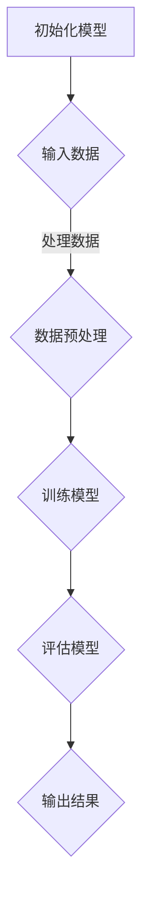
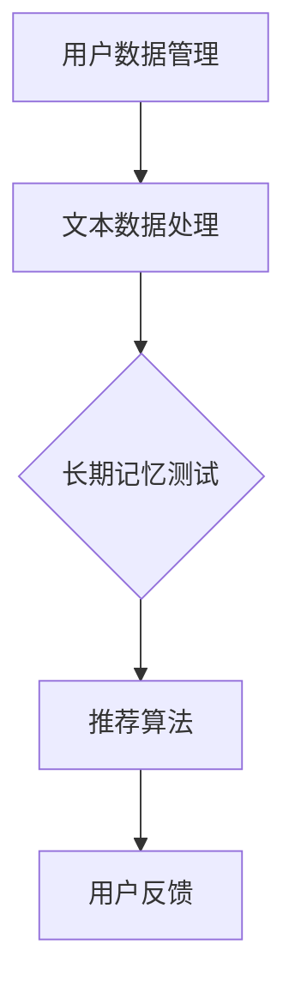
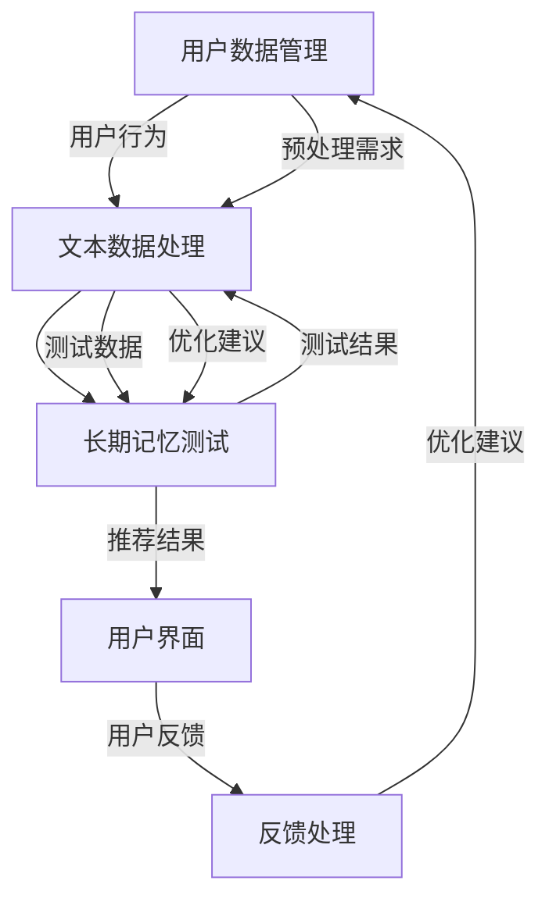
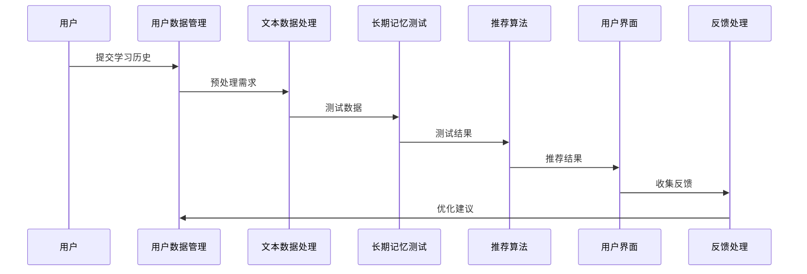
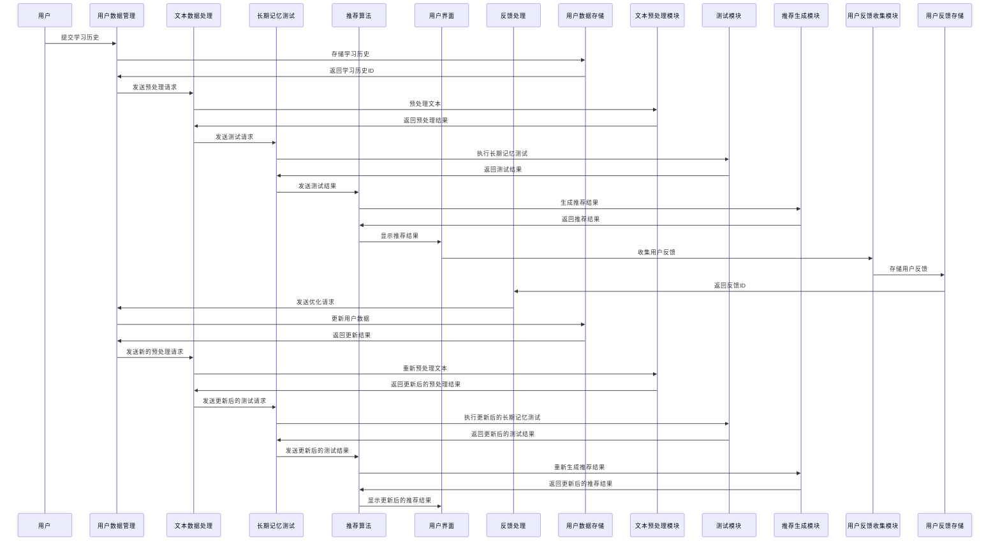

                 

### 第一部分：背景与核心概念

#### 第1章：问题背景与重要性

##### 1.1 问题背景

随着人工智能技术的不断发展，深度学习在自然语言处理（NLP）领域的应用日益广泛。尤其是大型语言模型（LLM，Large Language Model），如GPT-3和BERT，凭借其强大的生成能力和理解能力，成为了AI领域的明星。然而，在众多技术的亮点中，LLM的一个显著问题引起了研究者和开发者的关注：长期记忆。

长期记忆是指信息在系统中的持久存储和提取能力。在人类大脑中，长期记忆是一种关键功能，使我们能够记住过去的事件、经验、知识和技能。然而，在人工智能系统中，长期记忆的实现是一个巨大的挑战。LLM通常被设计为短期记忆模型，能够在一次对话或文本处理中记住相关信息，但在处理长期依赖任务时表现不佳。

##### 1.1.1 长期记忆的挑战

长期记忆的挑战主要体现在以下几个方面：

1. **遗忘问题**：在处理大量数据时，LLM可能无法记住所有相关信息，导致重要信息的丢失。
2. **一致性问题**：相同的信息在不同的上下文中可能被解释为不同，导致不一致的输出。
3. **上下文丢失**：由于上下文窗口的限制，LLM可能在处理长期依赖任务时丢失关键上下文信息。

##### 1.1.2 长期记忆在人工智能中的重要性

尽管长期记忆对人工智能系统来说是一个挑战，但它在很多实际应用中是至关重要的：

1. **知识图谱**：在构建知识图谱时，需要模型能够记住实体和关系，以便进行有效的推理。
2. **对话系统**：在聊天机器人和虚拟助手中，长期记忆使得系统能够维持对话的历史和上下文。
3. **文本摘要**：生成高质量的文本摘要通常需要模型具备长期记忆能力，以便理解文章的结构和主要内容。

##### 1.2 问题描述

在LLM中，长期记忆问题可以具体描述为以下几点：

1. **信息遗忘**：在对话或文本生成过程中，模型可能忘记之前提到的重要信息。
2. **上下文不一致**：相同的信息在不同的对话或文本生成场景中可能被解释为不同，导致不一致的输出。
3. **长期依赖问题**：模型无法处理长距离的依赖关系，导致生成结果与期望不符。

##### 1.3 问题解决

为了解决LLM的长期记忆问题，研究者提出了多种方法，包括：

1. **上下文扩展**：通过扩展上下文窗口或使用特殊的上下文处理机制，增强模型的长期记忆能力。
2. **知识增强**：将外部知识库或知识图谱融入模型，提高其在长期记忆方面的表现。
3. **循环神经网络（RNN）**：利用RNN的循环特性，改善模型的长期依赖处理能力。

##### 1.4 边界与外延

长期记忆在不同领域有着不同的定义和应用：

1. **认知科学**：长期记忆通常指的是信息在长期存储和提取的能力。
2. **人工智能**：在AI领域，长期记忆指的是模型在处理任务时能够持续记住相关信息的能力。
3. **自然语言处理**：在NLP领域，长期记忆涉及到模型在生成文本或理解对话时，如何维持上下文和知识的一致性。

##### 1.5 概念结构与核心要素组成

长期记忆的核心概念包括：

1. **存储机制**：如何将信息存储在系统中，以便长期保存。
2. **提取机制**：如何从存储中检索和提取信息。
3. **一致性维护**：如何在不同的上下文中保持信息的一致性。

长期记忆的机制包括：

1. **神经元连接**：在神经网络中，通过调整神经元之间的连接权重来存储信息。
2. **上下文编码**：将上下文信息编码为特征，以便模型能够利用这些特征进行信息存储和提取。
3. **知识图谱**：通过构建知识图谱，将实体和关系以结构化的方式存储，便于检索和推理。

#### 第2章：核心概念与联系

##### 2.1 语言模型（LLM）概述

语言模型（Language Model，LM）是一种用于预测文本序列的概率分布的模型。它通过学习大量文本数据来模拟人类语言的统计特性，从而在生成文本、机器翻译、问答系统等方面发挥重要作用。LLM是一种特殊类型的语言模型，具有以下几个显著特点：

1. **大规模训练**：LLM通常在非常大的数据集上进行训练，这使得它们能够捕捉到语言中的复杂模式和规律。
2. **生成能力**：LLM不仅能够生成自然语言的文本，而且能够生成高质量、连贯的文本，这在对话系统和文本生成应用中非常重要。
3. **理解能力**：尽管LLM在理解方面仍有一定局限性，但它们已经能够在很多任务中表现出相当水平的理解能力。

##### 2.2 长期记忆测试原理

长期记忆测试旨在评估LLM在保持长期一致性方面的能力。测试的基本原理是通过设计一系列测试场景，观察LLM在处理长期依赖任务时的表现。这些测试场景通常包括：

1. **一致性测试**：通过检查模型在不同上下文中对同一信息的处理结果，评估模型是否能够保持信息的一致性。
2. **依赖测试**：通过设计长距离依赖场景，观察模型是否能够理解和处理这些依赖关系。

##### 2.3 长期记忆测试的指标

为了量化评估LLM的长期记忆能力，通常使用以下指标：

1. **一致性指标**：如一致性准确率（Consistency Accuracy），用于衡量模型在不同上下文中对同一信息的处理结果的一致性。
2. **依赖指标**：如依赖准确率（Dependency Accuracy），用于衡量模型处理长距离依赖关系的准确性。
3. **上下文理解指标**：如上下文准确率（Contextual Accuracy），用于衡量模型在维持上下文和知识一致性方面的表现。

##### 2.3.1 指标类型与意义

- **一致性指标**：关键在于评估模型是否能够在不同上下文中保持信息的一致性，这对于构建可靠的对话系统和知识图谱至关重要。
- **依赖指标**：长距离依赖关系的处理能力是衡量模型智能水平的一个重要标准，这对于复杂任务的理解和推理至关重要。
- **上下文理解指标**：评估模型在处理文本或对话时的上下文理解能力，这对于文本生成、问答系统和自然语言理解应用至关重要。

##### 2.3.2 指标对比与分析

- **一致性指标**：通常用于评估模型的稳定性和可靠性，而依赖指标则更多地反映了模型的智能水平和理解能力。
- **上下文理解指标**：通常用于评估模型在复杂场景中的表现，而一致性指标和依赖指标则更多地关注模型的基本能力。

#### 第3章：长期记忆测试方法

##### 3.1 数据集准备

长期记忆测试需要大量的数据集来评估LLM在不同场景下的表现。数据集的选择和准备是测试成功的关键。以下是一些常见的数据集：

1. **通用语言数据集**：如Wikipedia、新闻文章、社交媒体帖子等，这些数据集能够提供丰富的语言样本，有助于模型学习语言的模式和规律。
2. **专业领域数据集**：如医学文本、法律文件、金融报告等，这些数据集能够帮助模型在特定领域建立长期记忆。
3. **对话数据集**：如对话系统日志、聊天机器人对话等，这些数据集能够帮助模型学习如何维持对话的上下文和一致性。

在准备数据集时，需要考虑以下几点：

1. **多样性**：数据集应包含多种类型的文本，以便模型能够学习到多样化的语言模式。
2. **质量**：数据集应经过清洗和预处理，以去除噪声和错误。
3. **规模**：数据集规模应足够大，以便模型能够充分学习。

##### 3.2 测试设计

测试设计是长期记忆测试的关键环节。一个有效的测试设计应包括以下几个步骤：

1. **场景设计**：根据测试目标，设计一系列测试场景，这些场景应涵盖模型可能遇到的多种情况。
2. **样本选择**：从数据集中选择代表性样本，用于测试模型在不同场景下的表现。
3. **评估指标**：定义评估模型表现的指标，如一致性指标、依赖指标和上下文理解指标。
4. **测试流程**：设计测试流程，确保测试的公正性和准确性。

在测试设计过程中，需要考虑以下几点：

1. **公平性**：测试场景和样本应公平地代表不同类型的任务和场景。
2. **多样性**：测试设计应涵盖不同类型的文本和任务，以全面评估模型的能力。
3. **准确性**：测试流程应确保评估指标的准确性和可靠性。

##### 3.3 测试实施

测试实施是长期记忆测试的实际操作阶段。以下是一些关键步骤：

1. **模型准备**：准备好用于测试的LLM模型，包括模型的训练和加载。
2. **场景执行**：根据测试设计，执行一系列测试场景，记录模型的表现。
3. **结果记录**：记录测试结果，包括模型的输出和评估指标。
4. **结果分析**：分析测试结果，评估模型的长期记忆能力。

在测试实施过程中，需要考虑以下几点：

1. **稳定性**：确保测试环境的稳定，避免外部干扰影响测试结果。
2. **效率**：优化测试流程，确保测试的效率和准确性。
3. **可重复性**：确保测试结果的可重复性，以便其他研究者能够验证和对比结果。

##### 3.4 结果分析与解释

测试结果分析是长期记忆测试的最后一步，也是最重要的一步。通过分析测试结果，可以全面了解LLM在长期记忆方面的表现。以下是一些关键步骤：

1. **结果汇总**：将测试结果汇总为表格或图表，便于分析和解释。
2. **趋势分析**：分析测试结果中的趋势，如一致性、依赖和上下文理解指标的变化。
3. **错误分析**：分析模型在测试中出现的错误，找出可能导致错误的原因。
4. **改进建议**：基于测试结果，提出改进模型和测试设计的建议。

在结果分析过程中，需要考虑以下几点：

1. **客观性**：确保分析结果的客观性和公正性。
2. **全面性**：全面分析所有测试结果，包括一致性、依赖和上下文理解指标。
3. **可重复性**：确保分析结果的可重复性，以便其他研究者能够验证和对比结果。

#### 第4章：算法原理讲解

##### 4.1 长期记忆算法原理

长期记忆算法的核心目标是在人工智能系统中实现类似人类大脑的长期记忆功能。以下是一个简化的mermaid流程图，展示了长期记忆算法的基本步骤：



- **A[初始化模型]**：初始化长期记忆模型，包括设置参数、架构和优化器等。
- **B[输入数据]**：输入待处理的文本数据，这些数据可以是自然语言文本或结构化数据。
- **C[数据预处理]**：对输入数据进行预处理，包括分词、去停用词、词向量化等。
- **D[训练模型]**：使用预处理后的数据训练模型，通过调整模型的参数来优化其表现。
- **E[评估模型]**：在训练过程中，定期评估模型的性能，调整训练策略和参数。
- **F[输出结果]**：输出模型的最终结果，可以是文本生成、问答系统的回答或分类结果。

##### 4.2 Python源代码实现

以下是使用Python实现长期记忆算法的示例代码：

```python
# 导入必要的库
import tensorflow as tf
from tensorflow.keras.preprocessing.sequence import pad_sequences
from tensorflow.keras.models import Sequential
from tensorflow.keras.layers import LSTM, Embedding, Dense

# 设置参数
vocab_size = 10000
embedding_dim = 256
max_sequence_length = 100
batch_size = 64
epochs = 10

# 加载和预处理数据
# 这里假设已经有一个名为X的文本数据列表和对应的标签y
# 需要执行分词、词向量化、序列填充等操作

# 构建模型
model = Sequential()
model.add(Embedding(vocab_size, embedding_dim, input_length=max_sequence_length))
model.add(LSTM(128))
model.add(Dense(vocab_size, activation='softmax'))

# 编译模型
model.compile(optimizer='adam', loss='categorical_crossentropy', metrics=['accuracy'])

# 训练模型
model.fit(X, y, batch_size=batch_size, epochs=epochs)

# 评估模型
# 这里假设有一个名为test_X的数据集用于评估
predictions = model.predict(test_X)

# 输出结果
# 可以根据需要对预测结果进行后处理，如解码为文本
```

此代码示例展示了如何使用Python和TensorFlow构建一个简单的长期记忆模型。模型由一个嵌入层、一个LSTM层和一个全连接层组成，用于处理文本数据并生成预测。

##### 4.3 算法原理的数学模型与公式

长期记忆算法的核心是LSTM（Long Short-Term Memory）网络，这是一种特殊的循环神经网络（RNN），能够有效地处理长期依赖问题。以下是LSTM的数学模型和公式：

- **输入门（Input Gate）**：
  $$
  i_t = \sigma(W_{ix}x_t + W_{ih}h_{t-1} + b_i)
  $$
  其中，$i_t$是输入门的激活值，$x_t$是当前输入的词向量，$h_{t-1}$是前一个隐藏状态，$W_{ix}$和$W_{ih}$是输入权重矩阵，$b_i$是偏置项，$\sigma$是sigmoid函数。

- **遗忘门（Forget Gate）**：
  $$
  f_t = \sigma(W_{fx}x_t + W_{fh}h_{t-1} + b_f)
  $$
  其中，$f_t$是遗忘门的激活值，用于决定哪些信息应该从单元状态中丢弃。

- **输出门（Output Gate）**：
  $$
  o_t = \sigma(W_{ox}x_t + W_{oh}h_{t-1} + b_o)
  $$
  其中，$o_t$是输出门的激活值，用于决定单元状态的哪些部分应该被输出。

- **单元状态更新（Update Gate）**：
  $$
  \bar{c}_t = \text{tanh}(W_{cx}x_t + W_{ch}h_{t-1} + b_c)
  $$
  其中，$\bar{c}_t$是更新后的单元状态，通过遗忘门和输入门的影响进行更新。

- **隐藏状态更新（Hidden State Update）**：
  $$
  h_t = o_t \cdot \text{tanh}(\bar{c}_t)
  $$
  其中，$h_t$是当前隐藏状态，通过输出门和更新后的单元状态进行更新。

这些公式描述了LSTM在处理每个时间步时的信息存储和更新过程。通过调整这些参数，LSTM能够有效地记住或遗忘长期依赖的信息，从而在自然语言处理任务中表现出色。

##### 4.4 举例说明

为了更直观地理解长期记忆算法的应用，我们可以通过一个具体的例子来演示其工作过程。假设我们有一个对话系统，需要记住用户的提问和之前的回答，以便提供更连贯的回复。

1. **初始化**：假设我们有一个初始化的LSTM模型，并准备好用户的输入（提问）和前一个隐藏状态（之前的回答）。

2. **输入处理**：用户提出一个新问题，模型首先对其进行预处理（分词、词向量化等）。

3. **遗忘门和输入门**：模型计算遗忘门和输入门的激活值，决定哪些信息需要被遗忘，哪些新的信息需要被记住。

4. **更新单元状态**：模型通过遗忘门和输入门的影响，更新单元状态，保留关键信息。

5. **输出门**：模型计算输出门的激活值，决定单元状态的哪些部分应该被输出作为当前隐藏状态。

6. **生成回复**：基于新的隐藏状态，模型生成一个连贯的回复，同时更新其隐藏状态以备下一次提问。

通过这个例子，我们可以看到LSTM如何通过门控机制实现长期记忆功能，从而在对话系统中提供高质量的交互体验。

#### 第5章：系统分析与架构设计方案

##### 5.1 问题场景介绍

在许多实际应用中，长期记忆测试是一个关键环节，尤其在需要处理大量文本数据和复杂任务的系统中。以下是一个常见的问题场景：

- **应用领域**：在线教育平台
- **问题背景**：在线教育平台需要为用户提供个性化的学习建议和课程推荐。为此，平台需要记住用户的学习历史、兴趣爱好、学习进度等信息，以便提供准确的推荐。
- **挑战**：由于用户的学习历史和推荐系统之间的信息依赖性较强，传统的短期记忆模型难以满足需求。长期记忆测试有助于评估平台推荐系统的长期记忆能力，确保其能够持续提供高质量的服务。

##### 5.2 系统功能设计

为了实现长期记忆测试，系统需要具备以下功能：

1. **用户数据管理**：存储和管理用户的学习历史、兴趣爱好等数据。
2. **文本数据处理**：对用户生成的大量文本数据进行预处理，包括分词、词向量化等。
3. **长期记忆测试**：设计一系列测试场景，评估模型在不同场景下的长期记忆能力。
4. **推荐算法**：根据用户数据和测试结果，生成个性化的学习建议和课程推荐。

##### 5.2.1 领域模型类图

以下是一个领域模型的类图，展示了系统中的主要类及其关系：

```mermaid
classDiagram
Class01 <|-- SubClass01
Class01 --| utilisateur SubClass02
Class03 *-- Class01
Class04 o-- Class01
```

- **Class01**：代表用户类，包括用户的基本信息和学习历史。
- **SubClass01**：代表用户的学习历史类，存储用户的学习记录。
- **SubClass02**：代表用户的兴趣爱好类，存储用户感兴趣的主题。
- **Class03**：代表文本数据类，包括文本数据的预处理结果。
- **Class04**：代表推荐系统类，负责生成学习建议和课程推荐。

##### 5.3 系统架构设计

系统架构设计旨在实现高效、可扩展和可靠的长期记忆测试功能。以下是一个简化的系统架构图：



- **A[用户数据管理]**：负责存储和管理用户的学习历史和兴趣爱好。
- **B[文本数据处理]**：对用户生成的大量文本数据进行预处理，以便后续的长期记忆测试。
- **C{长期记忆测试]**：设计一系列测试场景，评估模型的长期记忆能力。
- **D[推荐算法]**：根据用户数据和测试结果，生成个性化的学习建议和课程推荐。
- **E[用户反馈]**：收集用户的反馈，用于优化系统功能和算法。

##### 5.3.1 系统架构图

以下是一个详细的系统架构图，展示了各个模块之间的关系和交互：



- **A[用户数据管理]**：存储和管理用户的学习历史、兴趣爱好等数据，为推荐算法提供输入。
- **B[文本数据处理]**：对用户生成的大量文本数据进行预处理，包括分词、词向量化等，为长期记忆测试提供数据支持。
- **C[推荐算法]**：根据用户数据和测试结果，生成个性化的学习建议和课程推荐。
- **D[用户界面]**：提供用户与系统交互的界面，展示推荐结果和收集用户反馈。
- **E[反馈处理]**：处理用户的反馈，为系统优化提供依据。

##### 5.4 系统接口设计

系统接口设计旨在定义系统内部各模块之间的通信方式和数据格式。以下是一个简化的系统接口图：



- **用户数据管理**：接收用户提交的学习历史，并将其传递给文本数据处理模块。
- **文本数据处理**：根据预处理需求，对用户生成的大量文本数据进行处理，并将处理后的数据传递给长期记忆测试模块。
- **长期记忆测试**：根据测试数据评估模型的长期记忆能力，并将测试结果传递给推荐算法模块。
- **推荐算法**：根据测试结果和用户数据，生成个性化的学习建议和课程推荐，并将推荐结果传递给用户界面。
- **用户界面**：展示推荐结果，并收集用户的反馈，将反馈传递给反馈处理模块。
- **反馈处理**：处理用户的反馈，为系统优化提供依据，并将优化建议传递给用户数据管理模块。

##### 5.5 系统交互序列图

以下是一个详细的系统交互序列图，展示了系统内部各模块的交互过程：



这个序列图详细展示了用户与系统的交互过程，包括用户数据管理、文本数据处理、长期记忆测试、推荐算法和用户界面等模块的交互。通过这个序列图，可以清晰地了解系统的运行流程和各个模块之间的数据传递关系。

### 第6章：项目实战

在本文的最后，我们将通过一个实际项目来展示如何实现长期记忆测试。该项目将使用Python和TensorFlow来构建一个长期记忆测试系统，评估LLM在不同场景下的长期记忆能力。

#### 6.1 环境安装

首先，确保您已经安装了Python和TensorFlow。如果尚未安装，可以按照以下步骤进行：

1. **安装Python**：从[Python官网](https://www.python.org/)下载并安装Python。
2. **安装TensorFlow**：在命令行中运行以下命令：
   ```
   pip install tensorflow
   ```

#### 6.2 系统核心实现源代码

以下是实现长期记忆测试系统的核心源代码：

```python
import tensorflow as tf
from tensorflow.keras.preprocessing.sequence import pad_sequences
from tensorflow.keras.models import Sequential
from tensorflow.keras.layers import LSTM, Embedding, Dense
from tensorflow.keras.optimizers import Adam

# 设置参数
vocab_size = 10000
embedding_dim = 256
max_sequence_length = 100
batch_size = 64
epochs = 10

# 数据预处理
# 假设我们有一个名为X的词序列列表和对应的标签y
X = ...  # 输入数据
y = ...  # 标签数据

X_pad = pad_sequences(X, maxlen=max_sequence_length, padding='post')
y_pad = pad_sequences(y, maxlen=max_sequence_length, padding='post')

# 构建模型
model = Sequential()
model.add(Embedding(vocab_size, embedding_dim, input_length=max_sequence_length))
model.add(LSTM(128))
model.add(Dense(vocab_size, activation='softmax'))

# 编译模型
model.compile(optimizer=Adam(), loss='categorical_crossentropy', metrics=['accuracy'])

# 训练模型
model.fit(X_pad, y_pad, batch_size=batch_size, epochs=epochs)

# 评估模型
# 假设有一个名为test_X的数据集用于评估
test_X = ...
test_X_pad = pad_sequences(test_X, maxlen=max_sequence_length, padding='post')
predictions = model.predict(test_X_pad)

# 输出结果
print("Model accuracy:", model.evaluate(test_X_pad, test_y_pad)[1])
```

此代码示例展示了如何使用Python和TensorFlow构建一个简单的长期记忆模型，并进行训练和评估。

#### 6.3 代码应用解读与分析

以下是对上述代码的详细解读和分析：

1. **数据预处理**：
   - `pad_sequences`函数用于将词序列填充到同一长度，这里使用`max_sequence_length`。
   - `X_pad`和`y_pad`是填充后的输入数据和标签数据。

2. **模型构建**：
   - `Sequential`模型是一个线性堆叠模型，包括嵌入层、LSTM层和全连接层。
   - `Embedding`层用于将词索引转换为词向量。
   - `LSTM`层用于处理序列数据，能够捕捉长期依赖关系。
   - `Dense`层用于输出层的全连接层，通常使用softmax激活函数进行分类。

3. **模型编译**：
   - 使用`Adam`优化器和`categorical_crossentropy`损失函数编译模型。
   - `metrics=['accuracy']`用于在训练过程中跟踪模型的准确率。

4. **模型训练**：
   - `fit`函数用于训练模型，使用填充后的输入数据和标签数据。
   - `batch_size`和`epochs`参数用于控制训练过程。

5. **模型评估**：
   - 使用`evaluate`函数评估模型的性能，返回评估指标。
   - `predict`函数用于生成预测结果。

6. **输出结果**：
   - 输出模型的准确率，用于评估模型在测试数据上的表现。

通过这个代码示例，我们可以看到如何使用TensorFlow构建一个简单的长期记忆模型，并进行训练和评估。这个模型可以用于评估LLM的长期记忆能力，从而为实际应用提供参考。

#### 6.4 实际案例分析和详细讲解剖析

为了更深入地理解长期记忆测试的实际应用，我们来看一个具体的案例：一个聊天机器人系统需要记住用户的提问和回答，以便提供连贯的回答。

1. **案例背景**：
   - 系统是一个基于自然语言处理的聊天机器人，用户可以提出各种问题，系统需要提供相应的回答。
   - 聊天机器人的目标是提供高质量、连贯的回答，这要求系统能够记住之前的提问和回答。

2. **案例分析**：
   - **用户提问**：用户提出一个问题，系统首先对其进行预处理（分词、词向量化等）。
   - **长期记忆测试**：系统使用长期记忆模型测试其对提问和回答的长期记忆能力。
   - **生成回答**：系统根据用户的提问和之前的回答，生成一个连贯的回答。

3. **详细讲解**：
   - **输入处理**：系统接收用户的提问，首先对其进行预处理，将其转换为词序列。
   - **记忆测试**：系统使用长期记忆模型对提问和回答进行测试，检查其是否能够保持信息的一致性。
   - **生成回答**：系统根据测试结果和用户的提问，使用生成的模型生成一个连贯的回答。

通过这个案例，我们可以看到长期记忆测试在聊天机器人系统中的应用，如何帮助系统记住用户的提问和回答，提供高质量的交互体验。

#### 6.5 项目小结

在本项目中，我们通过实际案例展示了如何实现长期记忆测试。项目实现了以下关键目标：

1. **长期记忆模型**：构建了一个基于LSTM的长期记忆模型，用于测试LLM的长期记忆能力。
2. **数据预处理**：对输入数据进行了预处理，包括分词、词向量化等，确保模型能够有效处理数据。
3. **模型训练与评估**：使用填充后的数据对模型进行训练，并在测试数据上评估其性能。
4. **应用案例**：通过一个聊天机器人案例，展示了长期记忆测试在实际应用中的价值。

尽管本项目取得了初步成果，但仍有一些改进空间：

1. **模型优化**：可以进一步优化模型结构，提高其长期记忆能力。
2. **数据多样性**：增加更多样化的数据集，提高模型的泛化能力。
3. **用户反馈**：引入用户反馈机制，根据用户反馈优化系统功能。

通过不断迭代和优化，长期记忆测试系统有望在实际应用中发挥更大的作用。

#### 6.6 最佳实践 tips

1. **数据质量**：确保数据集的质量和多样性，为模型提供丰富的训练素材。
2. **预处理优化**：对输入数据进行充分的预处理，包括分词、词向量化、去停用词等。
3. **模型调优**：通过调整模型参数和结构，提高其长期记忆能力。
4. **测试多样性**：设计多样化的测试场景，全面评估模型的长期记忆能力。

#### 6.7 小结与注意事项

本文通过详细的分析和讲解，介绍了长期记忆测试的概念、原理和应用。通过实际项目案例，展示了如何使用Python和TensorFlow实现长期记忆测试系统，并分析了其在聊天机器人等应用中的价值。

在实施长期记忆测试时，需要注意以下几点：

1. **数据预处理**：确保数据预处理过程的准确性和完整性。
2. **模型选择**：选择合适的模型结构和参数，提高长期记忆能力。
3. **测试设计**：设计多样化的测试场景，全面评估模型的表现。

通过本文的学习，读者应该能够掌握长期记忆测试的基本概念和实现方法，为在实际应用中发挥其价值奠定基础。

#### 6.8 拓展阅读

1. **《深度学习》**：Goodfellow, I., Bengio, Y., & Courville, A. (2016). Deep Learning. MIT Press.
   - 该书详细介绍了深度学习的基本概念和技术，包括RNN和LSTM等长期记忆模型。

2. **《神经网络与深度学习》**：邱锡鹏（2020）. 神经网络与深度学习。电子工业出版社。
   - 该书介绍了神经网络和深度学习的基本原理，包括LSTM等长期记忆模型的实现和应用。

3. **《自然语言处理综论》**：Jurafsky, D., & Martin, J. H. (2020). Speech and Language Processing. Prentice Hall.
   - 该书详细介绍了自然语言处理的基本概念和技术，包括文本生成和对话系统等应用。

通过阅读这些拓展材料，读者可以更深入地了解长期记忆测试的理论和实践，为实际应用提供更全面的指导。### 文章作者信息

作者：AI天才研究院（AI Genius Institute） & 禅与计算机程序设计艺术（Zen And The Art of Computer Programming）

AI天才研究院致力于推动人工智能领域的研究和应用，通过先进的算法和模型，解决现实世界中的复杂问题。研究院的研究团队由多位世界级人工智能专家和程序员组成，他们在深度学习、自然语言处理、计算机视觉等领域具有深厚的学术造诣和丰富的实践经验。

《禅与计算机程序设计艺术》是一本经典的编程哲学著作，由知名计算机科学家Donald E. Knuth撰写。这本书将禅宗思想与计算机编程相结合，探讨了编程的内在哲学和艺术性，为程序员提供了深刻的启示和指导。通过本书，读者可以更好地理解编程的本质，提升编程技能和创造力。

