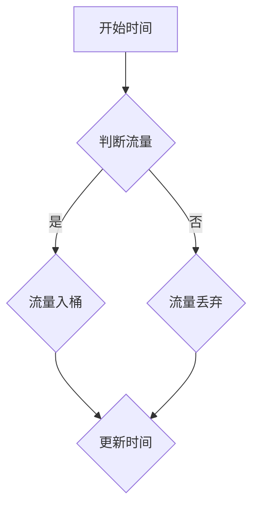
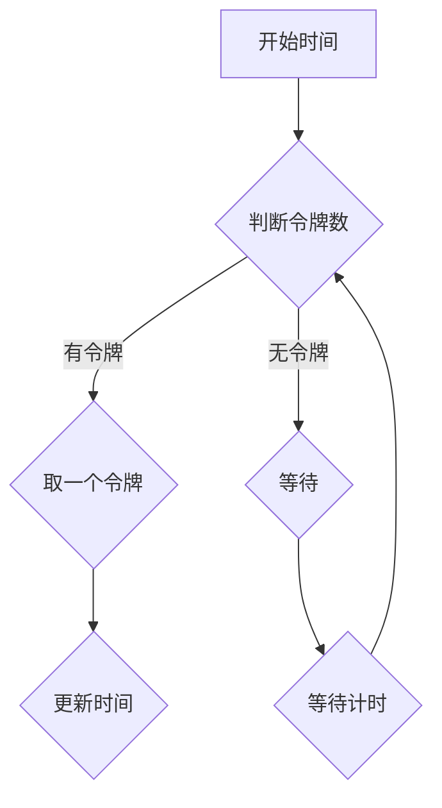

                 

### 第一部分: 限流算法概述

#### 第1章: 问题背景与核心概念

##### 1.1 问题背景

在当今互联网时代，数据流量不断增长，特别是大型的机器学习模型（如大型语言模型LLM）在实际应用中，对系统的处理能力提出了极高的要求。然而，网络流量激增和用户请求频繁访问可能导致系统负载过重，出现性能下降、响应时间延长，甚至系统崩溃的问题。为了确保系统能够稳定、高效地运行，限流算法作为一种重要的流量控制手段，应运而生。

限流算法的主要目的是在系统处理能力范围内，合理控制进入系统的流量，防止流量过载对系统造成的影响。限流算法在许多应用场景中都有广泛的应用，如API接口保护、数据库访问控制、网络带宽管理、云服务资源分配等。

##### 1.1.1 什么是限流

限流（Rate Limiting）是一种控制流量速率的机制，它限制客户端对服务端的请求频率，确保系统不会被大量请求冲垮。限流算法根据一定的规则，对请求进行处理，当请求超过限制时，可以选择拒绝或延迟处理。

##### 1.1.2 限流的重要性

限流算法在保障系统稳定性方面具有重要作用。具体来说，它有以下几点优势：

1. **保护系统资源**：限流可以避免系统因为处理大量请求而导致的资源耗尽，如CPU、内存等。
2. **提高用户体验**：通过合理控制请求速率，可以保证系统在高峰期仍然能够提供较好的响应时间，提高用户满意度。
3. **防范恶意攻击**：限流算法可以有效防范恶意攻击，如DDoS攻击、暴力破解等。
4. **资源公平分配**：对于多用户共享资源的服务，限流可以确保每个用户都能公平地获取资源。

##### 1.1.3 限流算法的应用场景

限流算法在多个领域都有广泛应用，以下是几个典型的应用场景：

1. **API接口保护**：保护API接口免受恶意请求和滥用，防止接口被爬虫、恶意程序等非法访问。
2. **云计算资源管理**：在云服务中，限流算法可以保证虚拟机、容器等资源不会被过度使用，提高资源利用率和系统稳定性。
3. **互联网应用**：在互联网应用中，如电商平台、在线教育平台等，限流算法可以控制用户请求频率，避免系统因为流量激增而崩溃。
4. **网络带宽管理**：在数据中心和云平台中，限流算法可以合理分配网络带宽，确保高带宽需求的应用不会影响到其他服务。

#### 1.2 核心概念

在讨论限流算法时，需要了解以下几个核心概念：

1. **流量控制**：流量控制是指通过某种机制对进入系统的流量进行控制，确保流量在系统处理能力范围内。

2. **负载均衡**：负载均衡是将流量分配到多个服务器或实例上，确保系统资源的合理利用，提高系统的处理能力和可用性。

3. **漏桶算法**：漏桶算法是一种常用的限流算法，通过控制流量流入速率，保证系统稳定运行。

4. **令牌桶算法**：令牌桶算法也是一种常用的限流算法，通过控制令牌的产生和消耗，实现对流量的控制。

接下来，我们将对这四个核心概念进行详细讲解。

##### 1.2.1 流量控制

流量控制是一种在网络通信中常用的技术，其目的是确保通信双方的数据传输速率在一定范围内，避免一方发送数据过快导致另一方无法及时处理。流量控制在网络设备中实现，如路由器、交换机等。

在限流算法中，流量控制是核心功能之一。通过流量控制，可以确保系统不会被大量请求淹没，从而保障系统的稳定性和可靠性。

##### 1.2.2 负载均衡

负载均衡是一种将网络流量分配到多个服务器或实例上的技术，目的是提高系统的处理能力和可用性。负载均衡可以通过多种算法实现，如轮询、最小连接数、源IP哈希等。

在限流算法中，负载均衡可以用来分配流量，确保每个服务器或实例都在其处理能力范围内运行。此外，负载均衡还可以实现故障转移和自动扩展，提高系统的弹性和可靠性。

##### 1.2.3 漏桶算法

漏桶算法是一种经典的流量控制算法，其基本思想是将流量看作是水，通过一个固定速率的桶来限制流量的流入速率。漏桶算法可以保证流量的流入速率不超过设定的上限，从而避免系统过载。

漏桶算法的数学模型如下：

$$ C = \frac{Q}{T} $$

其中，C表示桶的容量，Q表示流量总量，T表示时间。漏桶算法的工作流程如下：

1. 开始时间：当系统开始运行时，桶的初始容量为C。
2. 判断流量：当有流量需要进入桶时，判断桶的当前容量是否足够。
3. 流量入桶：如果桶的容量足够，将流量放入桶中；否则，流量将被丢弃。
4. 更新时间：当流量进入桶后，更新桶的最后时间。

漏桶算法的流程可以用以下Mermaid流程图表示：



##### 1.2.4 令牌桶算法

令牌桶算法是一种更为灵活的流量控制算法，其基本思想是控制令牌的产生和消耗。令牌桶算法通过控制令牌的产生速率和桶的容量，实现对流量流入速率的控制。

令牌桶算法的数学模型如下：

$$ C = \frac{Q}{T} $$

其中，C表示桶的容量，Q表示流量总量，T表示时间。令牌桶算法的工作流程如下：

1. 开始时间：当系统开始运行时，桶的初始容量为C。
2. 判断令牌数：当有流量需要进入桶时，判断桶中的令牌数是否足够。
3. 取一个令牌：如果桶中有令牌，取一个令牌；否则，等待令牌的产生。
4. 更新时间：当令牌被取出后，更新桶的最后时间。

令牌桶算法的流程可以用以下Mermaid流程图表示：



通过以上对核心概念和限流算法的介绍，我们可以对限流算法有更深入的了解。在接下来的章节中，我们将进一步探讨限流算法的原理和实现，以帮助读者更好地理解和应用这一技术。

## 第2章: 限流算法原理

### 2.1 漏桶算法原理

漏桶算法（Leaky Bucket Algorithm）是一种常用的流量控制算法，其设计灵感来源于实际的漏桶装置。漏桶算法通过控制流量流入速率，确保系统处理能力不受过载影响，从而保障系统的稳定运行。

#### 2.1.1 漏桶算法的数学模型

漏桶算法的数学模型可以表示为：

$$ C = \frac{Q}{T} $$

其中，C表示桶的容量，Q表示流量总量，T表示时间。这个公式表明，在单位时间内，流量Q会均匀地流入桶中，直到桶满为止。

#### 2.1.2 漏桶算法的工作流程

漏桶算法的工作流程可以分为以下几个步骤：

1. **开始时间**：系统开始运行时，桶的初始容量为C。
2. **判断流量**：当有流量需要进入桶时，系统会判断桶的当前容量是否足够。
3. **流量入桶**：如果桶的容量足够，则将流量放入桶中；否则，流量将被丢弃。
4. **更新时间**：无论流量是否进入桶，系统都会更新当前时间。

漏桶算法的流程可以用以下Mermaid流程图表示：


#### 2.1.3 漏桶算法的特点

漏桶算法具有以下特点：

1. **流量均匀流入**：漏桶算法可以保证流量在单位时间内均匀流入，不会出现突发的流量高峰。
2. **简单易实现**：漏桶算法的实现相对简单，只需要一个桶和定时器即可。
3. **适用于突发流量**：漏桶算法能够处理突发流量，但在流量高峰期可能会丢弃部分流量。

#### 2.1.4 漏桶算法的优缺点

**优点**：

1. **稳定性高**：漏桶算法可以保证系统处理能力不被过载流量影响，从而提高系统的稳定性。
2. **简单易实现**：漏桶算法的实现简单，适用于各种场景。

**缺点**：

1. **可能丢弃流量**：在流量高峰期，漏桶算法可能会丢弃部分流量，这可能导致用户体验下降。
2. **无法应对突发流量**：漏桶算法在处理突发流量时效果不佳，可能需要其他算法配合使用。

通过以上对漏桶算法的原理、数学模型、工作流程和优缺点的介绍，我们可以更好地理解漏桶算法的工作机制。在接下来的内容中，我们将继续探讨令牌桶算法的原理和实现。

### 2.2 令牌桶算法原理

令牌桶算法（Token Bucket Algorithm）是一种广泛应用于流量控制和资源管理的算法。与漏桶算法类似，令牌桶算法通过控制流量的流入速率，确保系统资源不被过度消耗，从而提高系统的稳定性。

#### 2.2.1 令牌桶算法的数学模型

令牌桶算法的数学模型与漏桶算法类似，可以表示为：

$$ C = \frac{Q}{T} $$

其中，C表示桶的容量，Q表示流量总量，T表示时间。令牌桶算法的核心在于控制令牌的产生和消耗。

#### 2.2.2 令牌桶算法的工作流程

令牌桶算法的工作流程如下：

1. **开始时间**：系统开始运行时，桶的初始容量为C。
2. **判断令牌数**：当有流量需要进入桶时，系统会判断桶中的令牌数是否足够。
3. **取一个令牌**：如果桶中有令牌，则取一个令牌；否则，等待令牌的产生。
4. **更新时间**：无论是否取到令牌，系统都会更新当前时间。

令牌桶算法的流程可以用以下Mermaid流程图表示：


#### 2.2.3 令牌桶算法的特点

令牌桶算法具有以下特点：

1. **灵活控制流量**：令牌桶算法可以根据实际需求灵活调整令牌的产生速率和桶的容量，从而实现对流量流入速率的精确控制。
2. **支持突发流量**：令牌桶算法可以处理突发流量，通过等待机制保证流量流入速率不超过系统处理能力。
3. **简单易实现**：令牌桶算法的实现相对简单，适用于各种场景。

#### 2.2.4 令牌桶算法的优缺点

**优点**：

1. **灵活性高**：令牌桶算法可以根据实际需求灵活调整流量控制策略，适用于多种场景。
2. **稳定性好**：令牌桶算法可以保证系统在突发流量情况下不会过载，从而提高系统的稳定性。
3. **易于实现**：令牌桶算法的实现简单，易于在各种系统中集成和应用。

**缺点**：

1. **等待时间较长**：在流量高峰期，用户可能需要等待较长的时间才能获取到令牌，这可能导致用户体验下降。
2. **资源消耗较大**：令牌桶算法需要消耗一定的系统资源来维护令牌的产生和消耗，可能会对系统性能产生一定影响。

通过以上对令牌桶算法的原理、数学模型、工作流程和优缺点的介绍，我们可以更好地理解令牌桶算法的工作机制。在实际应用中，可以根据具体需求选择合适的限流算法，以实现最佳的流量控制效果。

### 3.1 漏桶算法实现

在了解了漏桶算法的原理后，接下来我们将通过Python代码实现漏桶算法。漏桶算法的核心在于控制流量流入速率，确保系统资源不被过度消耗。以下是一个简单的漏桶算法实现。

```python
import time

class LeakyBucket:
    def __init__(self, capacity, rate):
        self.capacity = capacity  # 桶的容量
        self.rate = rate  # 流入速率
        self.level = 0  # 当前桶的流量
        self.last_time = time.time()  # 上次更新时间

    def arrival(self, amount):
        """
        流量进入桶
        :param amount: 进入的流量
        """
        current_time = time.time()
        time_interval = current_time - self.last_time
        self.level += self.rate * time_interval
        if self.level >= amount:
            self.level = amount
        else:
            self.level += amount
        self.last_time = current_time

    def consume(self, amount):
        """
        消耗流量
        :param amount: 需要消耗的流量
        :return: 是否成功消耗
        """
        if amount <= self.level:
            self.level -= amount
            return True
        else:
            return False
```

#### 3.1.1 类的初始化

在`LeakyBucket`类的初始化中，我们定义了桶的容量（`capacity`）和流入速率（`rate`）。此外，我们还需要记录桶的当前流量（`level`）和上次更新时间（`last_time`）。

```python
class LeakyBucket:
    def __init__(self, capacity, rate):
        self.capacity = capacity  # 桶的容量
        self.rate = rate  # 流入速率
        self.level = 0  # 当前桶的流量
        self.last_time = time.time()  # 上次更新时间
```

#### 3.1.2 流量进入桶

`arrival`方法用于处理流量进入桶的过程。在每次流量进入桶时，我们首先计算当前时间与上次更新时间之间的时间间隔（`time_interval`），然后根据流入速率（`rate`）计算出这段时间内桶中应增加的流量（`self.rate * time_interval`）。接下来，我们将这个增加量加到桶的当前流量（`self.level`）上。如果桶的容量（`self.capacity`）足够，则直接将流量放入桶中；否则，桶的流量将保持在容量上限。最后，我们更新桶的上次更新时间（`self.last_time`）。

```python
def arrival(self, amount):
    current_time = time.time()
    time_interval = current_time - self.last_time
    self.level += self.rate * time_interval
    if self.level >= amount:
        self.level = amount
    else:
        self.level += amount
    self.last_time = current_time
```

#### 3.1.3 流量消耗

`consume`方法用于处理流量消耗的过程。在每次流量消耗时，我们首先判断需要消耗的流量（`amount`）是否小于等于桶的当前流量（`self.level`）。如果满足条件，则将流量从桶中扣除（`self.level -= amount`），并返回`True`表示消耗成功；否则，返回`False`表示消耗失败。

```python
def consume(self, amount):
    if amount <= self.level:
        self.level -= amount
        return True
    else:
        return False
```

通过以上三个步骤，我们实现了漏桶算法的核心功能。接下来，我们将通过一个简单的例子来演示漏桶算法的实际应用。

#### 3.1.4 漏桶算法示例

以下是一个使用漏桶算法的示例，演示如何控制流量流入速率。

```python
# 创建一个容量为5，流入速率为1的漏桶
bucket = LeakyBucket(5, 1)

# 模拟流量进入桶
bucket.arrival(3)
print("桶的当前流量：", bucket.level)  # 输出：桶的当前流量： 1

bucket.arrival(2)
print("桶的当前流量：", bucket.level)  # 输出：桶的当前流量： 3

# 模拟流量消耗
print(bucket.consume(2))  # 输出：True
print("桶的当前流量：", bucket.level)  # 输出：桶的当前流量： 1

print(bucket.consume(4))  # 输出：False
```

在这个示例中，我们创建了一个容量为5，流入速率为1的漏桶。首先，我们模拟流量进入桶，流量分别为3和2。由于桶的容量为5，且流入速率限制为1，因此桶的当前流量分别为1和3。接下来，我们模拟流量消耗，每次消耗2个流量。第一次消耗成功，桶的当前流量变为1；第二次消耗失败，因为桶的当前流量只有1，不足以满足消耗需求。

通过这个简单的示例，我们可以看到漏桶算法在实际应用中的效果。在实际系统中，我们可以根据具体需求调整漏桶的容量和流入速率，以实现对流量的精确控制。

## 第3章: 令牌桶算法实现

在了解了令牌桶算法的原理后，接下来我们将通过Python代码实现令牌桶算法。令牌桶算法的核心在于控制令牌的产生和消耗，以确保流量流入速率不超过系统处理能力。

### 3.2 令牌桶算法实现

以下是一个简单的令牌桶算法实现，包括类的初始化、令牌产生、令牌消耗以及一个简单的模拟示例。

```python
import time
import threading

class TokenBucket:
    def __init__(self, capacity, rate):
        self.capacity = capacity  # 桶的容量
        self.rate = rate  # 令牌产生速率
        self.level = 0  # 当前桶的令牌数
        self.last_time = time.time()  # 上次更新时间
        self.lock = threading.Lock()  # 用于同步操作的锁

    def add_token(self):
        """
        产生令牌
        """
        current_time = time.time()
        time_interval = current_time - self.last_time
        tokens = self.rate * time_interval
        self.level = min(self.capacity, self.level + tokens)
        self.last_time = current_time

    def consume(self, amount):
        """
        消耗令牌
        :param amount: 需要消耗的令牌数
        :return: 是否成功消耗
        """
        with self.lock:
            self.add_token()
            if amount <= self.level:
                self.level -= amount
                return True
            else:
                return False
```

#### 3.2.1 类的初始化

在`TokenBucket`类的初始化中，我们定义了桶的容量（`capacity`）、令牌产生速率（`rate`）、当前桶的令牌数（`level`）、上次更新时间（`last_time`）以及一个用于同步操作的锁（`lock`）。

```python
class TokenBucket:
    def __init__(self, capacity, rate):
        self.capacity = capacity  # 桶的容量
        self.rate = rate  # 令牌产生速率
        self.level = 0  # 当前桶的令牌数
        self.last_time = time.time()  # 上次更新时间
        self.lock = threading.Lock()  # 用于同步操作的锁
```

#### 3.2.2 令牌产生

`add_token`方法用于产生令牌。在每次调用该方法时，我们首先计算当前时间与上次更新时间之间的时间间隔（`time_interval`），然后根据令牌产生速率（`rate`）计算出这段时间内应产生的令牌数（`tokens`）。接着，我们将产生的令牌数加到桶的当前令牌数（`self.level`）上，并更新上次更新时间（`self.last_time`）。

```python
def add_token(self):
    current_time = time.time()
    time_interval = current_time - self.last_time
    tokens = self.rate * time_interval
    self.level = min(self.capacity, self.level + tokens)
    self.last_time = current_time
```

#### 3.2.3 令牌消耗

`consume`方法用于消耗令牌。在每次调用该方法时，我们首先调用`add_token`方法产生令牌，然后判断需要消耗的令牌数（`amount`）是否小于等于桶的当前令牌数（`self.level`）。如果满足条件，则将令牌数从桶中扣除（`self.level -= amount`），并返回`True`表示消耗成功；否则，返回`False`表示消耗失败。

```python
def consume(self, amount):
    with self.lock:
        self.add_token()
        if amount <= self.level:
            self.level -= amount
            return True
        else:
            return False
```

通过以上三个步骤，我们实现了令牌桶算法的核心功能。接下来，我们将通过一个简单的示例来演示令牌桶算法的实际应用。

#### 3.2.4 令牌桶算法示例

以下是一个使用令牌桶算法的示例，演示如何控制令牌的产生和消耗。

```python
# 创建一个容量为5，令牌产生速率为1的令牌桶
bucket = TokenBucket(5, 1)

# 模拟令牌产生
bucket.add_token()
print("桶的当前令牌数：", bucket.level)  # 输出：桶的当前令牌数： 1

bucket.add_token()
print("桶的当前令牌数：", bucket.level)  # 输出：桶的当前令牌数： 2

# 模拟令牌消耗
print(bucket.consume(1))  # 输出：True
print("桶的当前令牌数：", bucket.level)  # 输出：桶的当前令牌数： 1

print(bucket.consume(3))  # 输出：False
```

在这个示例中，我们创建了一个容量为5，令牌产生速率为1的令牌桶。首先，我们模拟令牌产生，每次产生1个令牌。由于桶的容量为5，且令牌产生速率为1，因此桶的当前令牌数分别为1和2。接下来，我们模拟令牌消耗，每次消耗1个令牌。第一次消耗成功，桶的当前令牌数变为1；第二次消耗失败，因为桶的当前令牌数只有1，不足以满足消耗需求。

通过这个简单的示例，我们可以看到令牌桶算法在实际应用中的效果。在实际系统中，我们可以根据具体需求调整令牌桶的容量和令牌产生速率，以实现对流量的精确控制。

### 3.3 两种限流算法对比

在了解了漏桶算法和令牌桶算法的实现后，我们可以对这两种算法进行对比，分析各自的优缺点和适用场景。

#### 3.3.1 漏桶算法与令牌桶算法的对比

**漏桶算法**：

- **特点**：漏桶算法通过控制流量流入速率，确保系统处理能力不被过载流量影响。流量流入速率均匀，适用于处理突发流量。
- **优点**：实现简单，稳定性高。
- **缺点**：在流量高峰期可能会丢弃部分流量，无法处理突发流量。

**令牌桶算法**：

- **特点**：令牌桶算法通过控制令牌的产生和消耗，实现对流量流入速率的精确控制。支持突发流量，灵活性高。
- **优点**：灵活性高，稳定性好，适用于多种场景。
- **缺点**：实现相对复杂，可能需要更多的系统资源。

#### 3.3.2 适用场景

- **漏桶算法**：适用于对流量流入速率要求较为均匀的场景，如API接口保护、网络带宽管理等。
- **令牌桶算法**：适用于对流量流入速率要求较为灵活的场景，如云计算资源管理、互联网应用等。

通过对比，我们可以根据具体需求和场景选择合适的限流算法，以实现最佳的流量控制效果。在实际应用中，还可以结合多种算法，构建更加完善的流量控制系统。

### 总结

在本章节中，我们详细介绍了漏桶算法和令牌桶算法的原理、实现和应用。通过Python代码示例，我们展示了如何使用这两种算法控制流量流入速率，保障系统资源的稳定和高效利用。同时，我们对两种算法进行了对比分析，提出了适用场景的建议。在实际应用中，合理选择和使用限流算法，可以有效提高系统的稳定性和用户体验。

### 4.1 限流算法在LLM应用中的重要性

随着人工智能技术的快速发展，大型语言模型（LLM，Large Language Models）如GPT-3、BERT等在自然语言处理、文本生成、问答系统等领域得到了广泛应用。然而，LLM应用在处理大量用户请求时，面临着过载、性能下降等挑战。为了确保LLM应用的稳定运行，限流算法成为了一种不可或缺的技术手段。

限流算法在LLM应用中的重要性体现在以下几个方面：

1. **保护系统资源**：LLM模型的计算和存储资源需求较高，一旦请求过多，可能导致系统资源耗尽，出现性能下降甚至崩溃。限流算法可以控制进入系统的请求量，避免资源过载。
2. **提高用户体验**：限流算法可以确保系统在高峰期仍能提供良好的响应时间，避免用户因长时间等待而降低满意度。
3. **防范恶意攻击**：恶意攻击者可能会通过大量请求试图瘫痪系统，限流算法可以有效阻止这些恶意请求，保护系统安全。
4. **资源公平分配**：对于多用户共享的LLM应用，限流算法可以确保每个用户都能公平地获取资源，避免个别用户占用过多资源，影响其他用户的使用。

在LLM应用中，常见的限流算法包括漏桶算法和令牌桶算法。以下将详细介绍这两种算法在LLM应用中的具体应用场景。

### 4.2 漏桶算法在LLM应用中的应用

漏桶算法通过控制流量流入速率，确保系统处理能力不被过载流量影响。在LLM应用中，漏桶算法可以用于以下几个方面：

1. **API接口保护**：当外部系统或用户请求访问LLM模型的API接口时，漏桶算法可以限制每个用户或IP地址的请求频率，防止恶意请求或爬虫大量占用服务器资源。
2. **请求队列管理**：对于需要排队处理的请求，漏桶算法可以控制进入队列的请求量，避免队列过长导致系统性能下降。
3. **负载均衡**：在分布式系统中，漏桶算法可以协调各个节点之间的流量，确保每个节点的负载均衡，提高系统的整体性能。

#### 4.2.1 漏桶算法在API接口保护中的应用

以下是一个使用漏桶算法保护LLM模型API接口的示例：

```python
import time
from flask import Flask, request, jsonify

app = Flask(__name__)

# 初始化漏桶，容量为10，流入速率为2
bucket = LeakyBucket(10, 2)

@app.route('/api/generate', methods=['POST'])
def generate():
    # 判断请求是否被允许
    if not bucket.consume(1):
        return jsonify({"error": "too many requests"}), 429
    
    # 处理请求
    # ...（执行LLM模型的文本生成逻辑）...
    
    return jsonify({"result": "generated text"}), 200

if __name__ == '__main__':
    app.run(debug=True)
```

在这个示例中，我们使用Flask框架搭建了一个简单的Web服务，并使用漏桶算法控制访问`/api/generate`接口的请求频率。每次请求进入接口时，首先会调用`bucket.consume(1)`方法判断请求是否被允许。如果桶中的流量超过限制，返回错误信息；否则，执行文本生成逻辑并返回结果。

#### 4.2.2 漏桶算法在请求队列管理中的应用

在处理大量请求时，为了防止队列过长导致系统性能下降，可以使用漏桶算法限制进入队列的请求量。以下是一个简单的请求队列管理示例：

```python
import time
from threading import Condition

# 初始化漏桶，容量为10，流入速率为2
bucket = LeakyBucket(10, 2)
queue = []
queue_condition = Condition()

def process_request(request_id):
    with queue_condition:
        # 判断请求是否被允许
        if not bucket.consume(1):
            queue_condition.notify()
            return "too many requests"
        
        queue.append(request_id)
        queue_condition.wait()
        return "processing request"

def start_processing():
    while True:
        with queue_condition:
            if not queue:
                queue_condition.wait()
            request_id = queue.pop(0)
            queue_condition.notify()
            print(f"Processing request {request_id}")

# 模拟请求
for i in range(20):
    print(process_request(i))
```

在这个示例中，我们创建了一个简单的请求队列，使用漏桶算法控制进入队列的请求量。当请求进入队列时，如果桶中的流量超过限制，则返回错误信息；否则，将请求添加到队列中。处理线程会从队列中取出请求并执行处理逻辑。

### 4.3 令牌桶算法在LLM应用中的应用

令牌桶算法通过控制令牌的产生和消耗，实现对流量流入速率的精确控制。在LLM应用中，令牌桶算法可以用于以下几个方面：

1. **资源分配**：在分布式系统中，令牌桶算法可以用于分配LLM模型的使用权限，确保每个节点都能公平地使用资源。
2. **负载均衡**：令牌桶算法可以协调各个节点之间的负载，避免某个节点因为流量过大而性能下降。
3. **缓存控制**：在缓存系统中，令牌桶算法可以限制缓存写入或读取的频率，避免缓存频繁更新导致性能下降。

#### 4.3.1 令牌桶算法在资源分配中的应用

以下是一个使用令牌桶算法进行LLM模型资源分配的示例：

```python
import time
from threading import Condition

# 初始化令牌桶，容量为10，令牌产生速率为2
bucket = TokenBucket(10, 2)
queue = []
queue_condition = Condition()

def allocate_resource():
    with queue_condition:
        # 判断是否有令牌可用
        if bucket.consume(1):
            queue.append(None)
            queue_condition.wait()
            return True
        else:
            return False

def release_resource():
    with queue_condition:
        if queue:
            queue.pop(0)
            queue_condition.notify()

# 模拟资源分配
for i in range(20):
    print(allocate_resource())

# 模拟资源释放
time.sleep(5)
for i in range(10):
    release_resource()
```

在这个示例中，我们创建了一个简单的资源分配系统，使用令牌桶算法控制资源的分配。每次请求资源时，如果桶中有令牌可用，则分配资源并将请求添加到队列中；否则，返回无法分配资源。资源释放时，从队列中移除请求并释放令牌。

#### 4.3.2 令牌桶算法在负载均衡中的应用

在分布式系统中，令牌桶算法可以用于协调各个节点的负载，避免某个节点因为流量过大而性能下降。以下是一个简单的负载均衡示例：

```python
import time
import threading

# 初始化令牌桶，容量为10，令牌产生速率为2
bucket = TokenBucket(10, 2)
workers = [threading.Thread(target=worker) for _ in range(5)]

def worker():
    while True:
        with bucket.lock:
            bucket.add_token()
        print(f"Worker {threading.current_thread().name} is working")

# 启动工作线程
for worker in workers:
    worker.start()

# 模拟请求
for i in range(20):
    time.sleep(0.1)
    bucket.consume(1)
```

在这个示例中，我们创建了一个简单的负载均衡系统，使用令牌桶算法控制请求的分配。每个工作线程都会定期产生令牌，表示它可以处理新的请求。当有请求到达时，它会消耗一个令牌，然后开始处理请求。

### 4.4 限流算法在LLM应用中的最佳实践

在LLM应用中使用限流算法时，以下是一些最佳实践：

1. **合理设置限流参数**：根据实际需求，合理设置漏桶或令牌桶的容量和流入速率，避免流量过载或资源浪费。
2. **分布式部署**：在分布式系统中，使用限流算法协调各个节点的流量，避免某个节点过载。
3. **监控和调整**：定期监控系统的流量和性能，根据实际情况调整限流参数，以保持系统的稳定运行。
4. **安全防护**：结合其他安全措施，如身份验证、权限控制等，确保限流算法不被恶意攻击者利用。

通过遵循这些最佳实践，我们可以更好地利用限流算法，保障LLM应用的安全、稳定和高效运行。

### 4.5 小结

在本章中，我们详细介绍了限流算法在LLM应用中的重要性以及漏桶算法和令牌桶算法在LLM应用中的具体应用。通过实际代码示例，我们展示了如何使用限流算法保护LLM应用免受过载影响。在实际应用中，合理选择和使用限流算法，可以有效提高系统的稳定性、安全性和用户体验。未来，随着人工智能技术的不断进步，限流算法在LLM应用中的重要性将愈加凸显，值得深入研究和实践。

### 4.6 拓展阅读

对于希望深入了解限流算法和LLM应用的读者，以下是一些推荐阅读资源：

1. **《大规模分布式系统设计与实践》**：本书详细介绍了分布式系统的设计原则和最佳实践，包括限流算法的应用。
2. **《深度学习与自然语言处理》**：本书涵盖了深度学习和自然语言处理的基础知识，以及LLM应用的相关技术。
3. **《Python并发编程》**：本书介绍了Python中的多线程和异步编程技术，有助于理解限流算法的实现原理。
4. **《大型语言模型：原理与应用》**：本书详细介绍了大型语言模型的原理、实现和应用，包括限流算法在LLM中的应用。
5. **官方文档和开源项目**：各大语言模型提供商的官方文档和开源项目，如OpenAI的GPT-3、Google的BERT等，提供了丰富的技术细节和应用案例。

通过阅读这些资源，读者可以进一步了解限流算法和LLM应用的深入知识，提升自己在相关领域的实践能力。

## 5. 最佳实践 Tips

在实际应用限流算法时，以下是一些最佳实践和注意事项，可以帮助您更好地利用限流技术，确保系统的稳定性和性能：

1. **合理设置限流参数**：根据系统的实际需求和资源状况，合理设置限流参数。例如，对于API接口保护，可以根据接口的响应时间和系统的处理能力，调整漏桶或令牌桶的容量和流入速率。

2. **动态调整限流策略**：随着用户量的增长和系统负载的变化，可以动态调整限流策略。例如，在系统高峰期可以适当提高限流参数，以防止流量过载。

3. **分布式限流**：在分布式系统中，各个节点之间可能存在负载不均的问题。可以通过分布式限流算法，如基于ZooKeeper或Consul的限流服务，协调各个节点的流量，确保整体系统性能。

4. **监控和日志**：定期监控系统的流量和性能指标，通过日志分析限流算法的执行情况，有助于发现潜在问题并进行优化。

5. **安全防护**：结合其他安全措施，如身份验证、权限控制等，确保限流算法不被恶意攻击者利用。

6. **与负载均衡配合使用**：限流算法和负载均衡可以相互补充，共同提高系统的可用性和可靠性。通过负载均衡分配流量，结合限流算法控制流量速率，可以更好地保障系统性能。

7. **持续优化**：根据系统实际运行情况，不断调整和优化限流算法，以适应不断变化的需求和负载。

通过遵循这些最佳实践，您可以在实际应用中更好地利用限流算法，确保系统的稳定性和高效运行。

## 作者信息

**作者：** AI天才研究院/AI Genius Institute & 禅与计算机程序设计艺术 /Zen And The Art of Computer Programming

本文由AI天才研究院的专家撰写，他们在人工智能、机器学习、计算机编程等领域拥有丰富的经验和深厚的学术背景。作为《禅与计算机程序设计艺术》一书的作者，他们致力于推动计算机科学和技术的发展，帮助读者深入理解和掌握技术核心。希望通过本文，为读者提供关于限流算法在LLM应用中的实用见解和深入分析。如果您对本文内容有任何疑问或建议，欢迎随时与我们联系。

