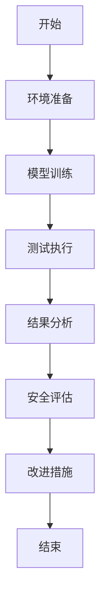

                 

### 第一部分：引言

#### 第1章：隐私保护的重要性与挑战

##### 1.1 隐私保护的定义与背景

隐私保护是指保护个人或组织的私密信息不被未经授权的个人或组织访问、使用、泄露或篡改。随着信息技术的高速发展，大数据、人工智能、物联网等新兴技术的广泛应用，隐私保护的问题日益突出。隐私保护不仅涉及到个人的信息安全，也涉及到国家和社会的安全稳定。因此，隐私保护在当今社会具有极其重要的意义。

隐私保护的概念最早起源于20世纪60年代，当时的计算机技术刚刚起步，人们对计算机信息系统的信任度较高，隐私保护问题并不突出。然而，随着计算机技术的不断发展，计算机犯罪和黑客攻击等现象逐渐增多，隐私保护问题逐渐引起了人们的关注。20世纪80年代，隐私保护开始成为一个独立的学科领域，研究人员开始从法律、技术、伦理等多个角度探讨隐私保护问题。

在隐私保护的发展历程中，曾经历过几个关键阶段：

1. **物理隐私保护阶段**：这一阶段主要是通过物理手段来保护个人隐私，如使用保险柜、信封等来防止信息泄露。

2. **信息安全阶段**：随着信息技术的发展，人们开始使用密码技术、访问控制等技术来保护信息安全。

3. **隐私权法律保护阶段**：在互联网时代，隐私权逐渐被纳入法律保护范畴，各国纷纷出台相关法律法规来保护个人隐私。

4. **大数据与隐私保护阶段**：随着大数据技术的兴起，隐私保护面临着新的挑战。如何在利用大数据的同时保护个人隐私，成为当前隐私保护研究的核心问题。

##### 1.2 当前隐私保护的挑战

尽管隐私保护在法律和技术方面取得了显著进展，但当前隐私保护仍然面临许多挑战：

1. **技术挑战**：随着信息技术的发展，隐私保护面临新的技术挑战。例如，加密技术的进步使得黑客攻击更加难以防范；大数据分析技术可能侵犯个人隐私；人工智能的发展可能使自动化攻击更加精准。

2. **法律挑战**：各国隐私保护法律法规的制定和执行存在差异，导致全球隐私保护法律环境复杂。如何在尊重国际隐私保护原则的同时，实现各国法律法规的有效对接，是当前隐私保护面临的一个重要问题。

3. **伦理挑战**：隐私保护涉及个人权利与公共利益的平衡。如何在保护个人隐私的同时，满足社会对信息的需求，是一个需要深入探讨的伦理问题。

4. **社会挑战**：随着隐私保护意识的提高，公众对隐私保护的要求也越来越高。但个人和组织在隐私保护方面的能力和资源有限，导致隐私保护工作难以满足公众的需求。

##### 1.3 语言模型在隐私保护中的应用

语言模型是自然语言处理领域的一种重要工具，近年来在隐私保护方面展现了巨大的潜力。语言模型能够通过分析文本数据，识别出潜在的隐私信息，从而实现隐私保护。以下是语言模型在隐私保护中的几个潜在应用方向：

1. **隐私信息识别与过滤**：语言模型可以用于识别和过滤敏感的隐私信息，如个人信息、公司机密等。通过这种方式，可以有效防止隐私信息泄露。

2. **隐私政策生成与解释**：语言模型可以自动生成隐私政策，并对隐私政策进行解释，帮助用户更好地理解隐私政策的内容，从而提高隐私保护的透明度和可接受度。

3. **隐私风险评估**：语言模型可以用于对数据集进行隐私风险评估，识别出潜在的数据泄露风险，从而为隐私保护提供决策依据。

4. **隐私合规性检查**：语言模型可以用于检查组织的数据处理过程是否符合隐私保护法律法规的要求，帮助组织确保合规性。

语言模型在隐私保护中的应用虽然具有潜力，但也面临着一些挑战，如模型训练数据的质量和隐私问题、模型解释性不足等。在接下来的章节中，我们将进一步探讨语言模型在隐私保护中的具体应用和挑战。

##### 1.4 书籍概述与结构

本书旨在系统地介绍隐私保护评估方法和语言模型在隐私保护中的应用，旨在为从事隐私保护研究的学者和从业人员提供有价值的参考。全书共分为四个部分：

**第一部分：引言**  
本部分主要介绍隐私保护的重要性与挑战，以及语言模型在隐私保护中的应用，为后续章节的深入讨论打下基础。

**第二部分：隐私保护评估方法**  
本部分将详细讨论隐私保护评估框架、风险评估指标、隐私保护技术评估方法以及隐私保护效果评估等内容，帮助读者全面了解隐私保护评估的理论和实践。

**第三部分：语言模型的安全性分析**  
本部分将分析语言模型在安全性方面的潜在风险，并提出相应的防御策略和措施，为语言模型在隐私保护中的安全应用提供参考。

**第四部分：测试环境与数据集**  
本部分将介绍测试环境的搭建、数据集的选择与预处理以及测试指标的设定，为后续的测试和分析提供支持。

通过以上四个部分的系统介绍，本书旨在为隐私保护领域的研究者和从业者提供一套完整的隐私保护评估方法和语言模型应用指南，帮助读者在隐私保护工作中取得更好的效果。

##### 1.5 本章小结

本章介绍了隐私保护的定义、发展历程以及当前面临的挑战，并探讨了语言模型在隐私保护中的应用。隐私保护作为现代社会的一项重要议题，关系到个人、组织乃至社会的信息安全与稳定。通过语言模型的应用，我们可以在隐私保护方面实现更高效、更精准的效果。然而，语言模型在隐私保护中也面临一些技术、法律和伦理方面的挑战。在接下来的章节中，我们将进一步探讨隐私保护评估方法和语言模型的安全性分析，以期为隐私保护工作提供更有力的理论支持和实践指导。

## 第2章：隐私保护评估框架

隐私保护评估是确保个人信息和数据得到有效保护的重要环节。一个完善的隐私保护评估框架可以帮助组织识别潜在的风险，制定相应的防护措施，并确保合规性。本章将详细介绍隐私保护评估框架的设计原则、核心组成部分、隐私风险评估指标以及隐私保护技术评估方法。

### 2.1 评估框架概述

隐私保护评估框架是系统化评估隐私保护措施有效性的工具。它不仅包括评估的具体方法和指标，还涵盖了评估流程和管理体系。一个良好的隐私保护评估框架应该具备以下特点：

1. **全面性**：评估框架应覆盖隐私保护的各个方面，包括技术、法律、管理和伦理等。
2. **系统性**：评估过程应该系统、有序，确保每个环节都有明确的目标和标准。
3. **可操作性**：评估方法应具有可操作性，便于实际执行和调整。
4. **适应性**：评估框架应具备一定的灵活性，能够根据新的技术和法律法规进行调整。

#### 2.1.1 评估框架的设计原则

1. **数据驱动**：评估框架应以数据为基础，通过数据分析和挖掘来识别隐私风险。
2. **风险管理**：评估框架应重视风险管理，通过风险识别、评估和控制来降低隐私泄露的可能性。
3. **持续改进**：评估框架应支持持续改进，定期评估和调整隐私保护措施。
4. **用户参与**：评估过程中应充分考虑用户的隐私需求和反馈，确保隐私保护措施符合用户期望。

#### 2.1.2 评估框架的核心组成部分

1. **评估标准**：评估标准是评估框架的基础，它定义了评估的具体内容和要求。
2. **评估流程**：评估流程是实施评估的过程，包括评估的启动、执行、监控和报告等环节。
3. **评估工具**：评估工具是辅助评估工作的重要手段，包括数据采集工具、分析软件和评估报告模板等。
4. **评估结果**：评估结果是对隐私保护措施有效性的一次评估，它为后续的改进提供依据。

### 2.2 隐私风险评估指标

隐私风险评估指标是评估隐私保护措施有效性的重要依据。这些指标可以从不同的角度衡量隐私保护的水平，常见的风险评估指标包括：

1. **数据泄露率**：指在一定时间内发生数据泄露的次数与总数据量之比。
2. **隐私泄露成本**：指由于隐私泄露导致的经济损失，包括直接损失和间接损失。
3. **隐私保护措施覆盖率**：指采取隐私保护措施的员工或系统数量与总员工或系统数量之比。
4. **隐私政策知晓率**：指知晓并理解隐私政策的员工比例。
5. **隐私投诉率**：指在一定时间内收到的关于隐私保护的投诉次数。

#### 2.2.1 指标体系的设计

隐私风险评估指标体系的设计应遵循以下原则：

1. **全面性**：指标应覆盖隐私保护的各个方面，确保评估结果的全面性。
2. **重要性**：指标应突出关键风险因素，确保评估重点突出。
3. **可操作性**：指标应易于测量和操作，确保评估工作的可执行性。
4. **动态性**：指标应具备一定的灵活性，能够根据实际情况进行调整。

#### 2.2.2 常见的风险评估指标

1. **数据泄露率**：数据泄露率是衡量隐私保护措施有效性的重要指标。其计算公式为：
   $$ 数据泄露率 = \frac{发生数据泄露的次数}{总数据量} $$
   该指标能够直观反映数据泄露的严重程度，是评估隐私保护水平的关键指标。

2. **隐私泄露成本**：隐私泄露成本包括直接成本和间接成本。直接成本如数据恢复费用、法律诉讼费用等，间接成本如品牌受损、用户流失等。计算公式为：
   $$ 隐私泄露成本 = 直接成本 + 间接成本 $$

3. **隐私保护措施覆盖率**：隐私保护措施覆盖率是衡量隐私保护措施落实情况的重要指标。其计算公式为：
   $$ 隐私保护措施覆盖率 = \frac{采取隐私保护措施的员工或系统数量}{总员工或系统数量} $$

4. **隐私政策知晓率**：隐私政策知晓率是衡量员工对隐私政策理解程度的重要指标。其计算公式为：
   $$ 隐私政策知晓率 = \frac{知晓并理解隐私政策的员工数量}{总员工数量} $$

5. **隐私投诉率**：隐私投诉率是衡量用户对隐私保护措施满意程度的重要指标。其计算公式为：
   $$ 隐私投诉率 = \frac{收到的隐私投诉次数}{总投诉次数} $$

### 2.3 隐私保护技术评估方法

隐私保护技术评估是确保技术措施有效性的关键环节。评估方法的选择应根据具体应用场景和技术特点来确定。常见的隐私保护技术评估方法包括：

1. **漏洞扫描**：通过自动化工具扫描系统中的潜在漏洞，识别可能的安全风险。
2. **渗透测试**：模拟黑客攻击，测试系统的安全性，识别系统中的安全漏洞。
3. **安全审计**：对系统的安全措施进行详细审查，评估系统的安全性和合规性。
4. **数据加密评估**：评估数据加密技术的有效性，确保数据在传输和存储过程中的安全性。

#### 2.3.1 实验设计

隐私保护技术评估的实验设计应考虑以下几个方面：

1. **评估目标**：明确评估的目标和要求，确保实验设计的针对性。
2. **评估环境**：搭建与实际应用场景相似的评估环境，确保实验结果的可靠性。
3. **评估指标**：确定评估的具体指标，如漏洞数量、渗透成功次数等。
4. **评估步骤**：制定详细的评估步骤，确保实验的有序进行。

#### 2.3.2 数据采集与处理

隐私保护技术评估需要大量的数据支持。数据采集和处理的过程包括：

1. **数据收集**：通过漏洞扫描、渗透测试等手段收集相关数据。
2. **数据清洗**：对采集到的数据进行清洗，去除无效数据。
3. **数据分析**：利用统计分析方法，对清洗后的数据进行分析，识别潜在的安全风险。

### 2.4 隐私保护效果评估

隐私保护效果评估是对隐私保护措施实际效果的评估。评估结果可以为后续的改进提供依据。隐私保护效果评估的方法包括：

1. **问卷调查**：通过问卷调查了解用户对隐私保护的满意度和建议。
2. **绩效评估**：对隐私保护措施的绩效进行评估，如数据泄露率的降低、隐私投诉率的减少等。
3. **安全审计**：定期进行安全审计，评估隐私保护措施的有效性。

#### 2.4.1 评估结果分析

评估结果分析是对评估数据进行分析和处理，以得出评估结论。分析过程包括：

1. **结果整理**：整理评估数据，形成评估报告。
2. **结果分析**：对评估数据进行统计分析，识别关键问题。
3. **结果展示**：通过图表等形式展示评估结果，便于理解和分析。

#### 2.4.2 评估方法的应用案例

在实际应用中，隐私保护效果评估方法可以应用于多种场景。以下是一个应用案例：

某公司希望通过评估其现有的隐私保护措施，以提升整体隐私保护水平。评估过程包括漏洞扫描、渗透测试和问卷调查等步骤。评估结果显示，公司在数据泄露率和隐私投诉率方面取得了显著改善，但在员工隐私政策知晓率方面仍有待提高。基于评估结果，公司制定了针对性的改进措施，如加强员工培训、优化数据加密技术等。

### 2.5 本章小结

本章介绍了隐私保护评估框架的设计原则、核心组成部分、隐私风险评估指标以及隐私保护技术评估方法。隐私保护评估是确保个人信息和数据得到有效保护的重要手段。通过系统的评估方法和框架，组织可以识别潜在的风险，制定相应的防护措施，并确保合规性。本章的内容为后续章节的讨论提供了基础，也为实际隐私保护工作提供了参考。

### 第3章：语言模型的安全性分析

语言模型（Language Model，简称LM）在自然语言处理（Natural Language Processing，简称NLP）领域中扮演着至关重要的角色。它通过学习大量文本数据，预测可能的单词或句子序列，从而在机器翻译、文本生成、语音识别等多个方面得到了广泛应用。然而，随着语言模型的应用越来越广泛，其安全性问题也逐渐成为关注的焦点。本章将深入分析语言模型在安全性方面的潜在风险，并提出相应的防御策略和措施。

#### 3.1 语言模型的安全性概述

语言模型的安全性涉及多个方面，包括数据安全、模型安全和计算安全。数据安全主要关注语言模型训练和使用过程中个人隐私数据的保护；模型安全则关注防止模型被恶意攻击或篡改；计算安全则涉及模型在计算过程中的安全防护。

##### 3.1.1 安全性评估的目标

安全性评估的目标是确保语言模型在训练和使用过程中能够抵御各种安全威胁，包括数据泄露、恶意攻击和模型篡改等。具体目标包括：

1. **保护数据隐私**：确保在语言模型训练和使用过程中，个人隐私数据不被泄露。
2. **防止模型篡改**：确保模型不被恶意攻击者篡改，保证模型的稳定性和可靠性。
3. **保障计算安全**：确保模型在计算过程中不受恶意攻击，防止计算资源被滥用。

##### 3.1.2 安全性评估的方法与工具

安全性评估的方法主要包括漏洞扫描、渗透测试和安全审计等。以下是几种常见的方法和工具：

1. **漏洞扫描**：使用自动化工具扫描语言模型系统中的潜在漏洞，识别可能的安全风险。
2. **渗透测试**：模拟黑客攻击，测试系统的安全性，识别系统中的安全漏洞。
3. **安全审计**：对系统的安全措施进行详细审查，评估系统的安全性和合规性。
4. **数据加密与访问控制**：使用数据加密技术保护隐私数据，并设置访问控制策略，限制数据访问权限。

#### 3.2 语言模型的潜在风险分析

语言模型在实际应用中可能面临多种安全风险，以下是一些主要的潜在风险：

##### 3.2.1 数据泄露的风险

数据泄露是语言模型面临的最主要的风险之一。在语言模型训练和使用过程中，需要收集和处理大量的文本数据，这些数据可能包含个人隐私信息。如果数据保护不当，可能导致隐私泄露。

1. **数据存储泄露**：数据在存储过程中可能因存储设备或数据库的安全漏洞而被泄露。
2. **数据传输泄露**：数据在传输过程中可能因网络攻击（如中间人攻击）而被截获和篡改。
3. **数据使用泄露**：数据在使用过程中可能因不当访问控制而被未经授权的个人访问。

##### 3.2.2 恶意攻击的风险

恶意攻击是指黑客或恶意第三方对语言模型进行攻击，以获取敏感信息或破坏模型的正常运行。常见的恶意攻击包括：

1. **注入攻击**：攻击者通过输入恶意代码，篡改模型的输入或输出，导致模型输出错误结果。
2. **模型篡改**：攻击者通过修改模型参数或训练数据，篡改模型的预测结果，使其输出不正确的答案。
3. **分布式拒绝服务（DDoS）攻击**：攻击者通过大量虚假请求，占用模型的计算资源，导致模型无法正常工作。

##### 3.2.3 模型篡改的风险

模型篡改是指攻击者通过恶意手段修改语言模型的参数或结构，使其输出不正确的预测结果。模型篡改可能由以下原因导致：

1. **训练数据污染**：攻击者在模型训练过程中故意插入恶意样本，篡改模型参数。
2. **模型参数篡改**：攻击者通过恶意攻击手段直接修改模型参数，使其输出错误结果。
3. **模型结构篡改**：攻击者通过修改模型结构，使其变得更容易被攻击。

#### 3.3 防御策略与措施

为了应对语言模型在安全性方面面临的潜在风险，需要采取一系列防御策略和措施。以下是一些常见的防御策略和措施：

##### 3.3.1 数据加密与访问控制

数据加密与访问控制是保护数据隐私的重要手段。具体措施包括：

1. **数据加密**：对存储和传输的数据进行加密，确保数据在未经授权的情况下无法被读取。
2. **访问控制**：设置访问控制策略，限制数据访问权限，确保只有授权用户才能访问敏感数据。

##### 3.3.2 恶意攻击检测与响应

恶意攻击检测与响应是保护语言模型免受恶意攻击的重要措施。具体措施包括：

1. **入侵检测系统（IDS）**：部署入侵检测系统，实时监控模型系统的异常行为，识别潜在攻击。
2. **安全响应机制**：建立安全响应机制，一旦发现恶意攻击，立即采取措施阻止攻击并恢复系统。

##### 3.3.3 模型安全加固方法

模型安全加固方法是提高模型安全性的重要手段。具体措施包括：

1. **模型训练数据清洗**：对训练数据集进行清洗，去除可能存在的恶意样本。
2. **模型参数加密**：对模型参数进行加密，防止攻击者直接篡改模型参数。
3. **模型结构保护**：设计复杂的模型结构，使攻击者难以理解模型工作原理，从而降低模型被篡改的风险。

##### 3.3.4 安全审计与合规性检查

安全审计与合规性检查是确保语言模型安全性和合规性的重要手段。具体措施包括：

1. **安全审计**：定期进行安全审计，评估系统的安全性和合规性，识别潜在的安全隐患。
2. **合规性检查**：确保语言模型的使用符合相关法律法规的要求，防止因违规操作导致的安全问题。

#### 3.4 本章小结

语言模型在自然语言处理领域中具有广泛的应用，但其安全性问题不容忽视。本章分析了语言模型在安全性方面面临的潜在风险，包括数据泄露风险、恶意攻击风险和模型篡改风险。针对这些风险，提出了数据加密与访问控制、恶意攻击检测与响应、模型安全加固方法以及安全审计与合规性检查等一系列防御策略和措施。通过这些措施，可以有效提高语言模型的安全性，确保其在训练和使用过程中的稳定性和可靠性。

### 第4章：测试环境与数据集

为了对语言模型在隐私保护方面的性能进行有效评估，搭建一个合适的测试环境和准备一个优质的数据集是至关重要的。本章将详细介绍测试环境的搭建、数据集的选择与预处理以及测试指标的设定。

#### 4.1 测试环境的搭建

测试环境的搭建是确保评估结果可靠性的关键。一个高效的测试环境应包括以下要素：

##### 4.1.1 硬件与软件配置

1. **计算资源**：选择高性能的硬件设备，如高性能服务器或GPU集群，以满足语言模型训练和评估的高计算需求。
2. **操作系统**：通常选择Linux操作系统，因其稳定性和开源特性，适合进行大规模数据处理和模型训练。
3. **编程语言**：Python是自然语言处理领域广泛使用的编程语言，具备丰富的库和工具，适合用于语言模型开发与测试。
4. **深度学习框架**：如TensorFlow、PyTorch等，用于构建和训练语言模型。

##### 4.1.2 网络环境设置

1. **稳定性**：确保网络环境稳定，避免因网络波动导致测试中断。
2. **安全性**：设置防火墙和入侵检测系统，保护测试环境免受外部攻击。
3. **高带宽**：确保测试过程中有足够的网络带宽，以满足大量数据传输的需求。

#### 4.2 数据集的选择与预处理

数据集的质量对评估结果有重要影响。以下是选择和预处理数据集的步骤：

##### 4.2.1 数据集来源

1. **公共数据集**：如Common Crawl、Twitter等，这些数据集包含了大量的文本信息，适合用于语言模型训练。
2. **定制数据集**：根据特定需求，从特定领域或场景中收集数据，以增强数据集的针对性和实用性。

##### 4.2.2 数据预处理流程

1. **数据清洗**：去除数据集中的噪声和无关信息，如HTML标签、特殊字符等。
2. **数据标注**：对数据集进行标注，标记出文本中的关键信息，如个人身份信息、公司名称等。
3. **数据归一化**：对文本进行归一化处理，如将所有文本转换为小写、去除停用词等。
4. **数据切分**：将数据集划分为训练集、验证集和测试集，以用于模型的训练和评估。

##### 4.2.3 数据集的代表性分析

1. **数据分布**：分析数据集中各类信息的分布情况，确保数据集具有代表性。
2. **数据质量**：评估数据集的完整性、一致性和准确性，确保数据质量。

#### 4.3 测试指标的设定

测试指标的设定是评估语言模型性能的重要环节。以下是几种常用的测试指标：

##### 4.3.1 常用测试指标

1. **准确率（Accuracy）**：模型预测正确的样本数量占总样本数量的比例。
2. **召回率（Recall）**：模型正确识别的隐私信息数量与实际隐私信息数量的比例。
3. **精确率（Precision）**：模型预测为隐私信息的样本中，实际为隐私信息的比例。
4. **F1值（F1 Score）**：精确率和召回率的调和平均值，用于综合评估模型的性能。

##### 4.3.2 指标选择的原则

1. **代表性**：选择的指标应能全面反映语言模型在隐私保护方面的性能。
2. **可操作性**：指标应易于计算和解释，便于实际应用和改进。
3. **适应性**：指标应具备一定的灵活性，能够根据不同的应用场景进行调整。

#### 4.4 本章小结

本章详细介绍了测试环境与数据集的搭建过程，包括硬件与软件配置、网络环境设置、数据集的选择与预处理以及测试指标的设定。一个合适的测试环境和优质的数据集是确保语言模型性能评估准确性和可靠性的关键。通过合理的测试环境和数据集，我们可以更全面地了解语言模型在隐私保护方面的性能，为后续的优化和改进提供依据。

### 第5章：测试方法概述

为了对语言模型在隐私保护方面的性能进行科学、全面的评估，本章将详细介绍测试方法。测试方法的设计和实施对于评估结果的可靠性和有效性至关重要。以下是测试方法的概述，包括测试流程、测试步骤以及数据分析方法。

#### 5.1 测试流程

测试流程可以分为以下几个阶段：

1. **测试环境搭建**：搭建适合进行语言模型测试的环境，包括硬件、软件和网络配置。
2. **数据集准备**：选择和预处理用于测试的数据集，确保数据集的质量和代表性。
3. **模型训练**：使用训练集对语言模型进行训练，调整模型参数以优化性能。
4. **测试执行**：使用测试集对训练好的模型进行性能测试，收集测试结果。
5. **结果分析**：对测试结果进行分析和评估，确定语言模型的性能。

#### 5.2 测试步骤

测试步骤的具体实施如下：

1. **环境准备**：安装和配置必要的软件，如深度学习框架（如TensorFlow或PyTorch）、文本处理工具（如NLTK或spaCy）等。同时，确保网络环境稳定和安全。

2. **数据预处理**：对数据集进行清洗、标注和切分。清洗过程包括去除噪声和无关信息，标注过程包括标记出隐私信息，切分过程包括将数据集划分为训练集、验证集和测试集。

3. **模型训练**：使用训练集对语言模型进行训练。训练过程中，通过优化算法调整模型参数，提高模型在验证集上的性能。常见的优化算法包括随机梯度下降（SGD）、Adam优化器等。

4. **模型验证**：在验证集上对模型进行评估，选择性能最优的模型进行测试。验证过程可以帮助调整模型参数，避免过拟合。

5. **测试执行**：使用测试集对最终模型进行测试。测试过程包括输入文本数据，输出模型预测结果，并记录预测准确率、召回率、精确率等指标。

6. **结果记录**：将测试结果记录下来，包括预测结果和各项性能指标。这些数据将用于后续的统计分析。

#### 5.3 数据分析方法

数据分析方法是评估语言模型性能的关键。以下是常用的数据分析方法：

1. **准确率（Accuracy）**：准确率是模型预测正确的样本数量与总样本数量的比例。其计算公式为：
   $$ \text{准确率} = \frac{\text{预测正确样本数量}}{\text{总样本数量}} $$

2. **召回率（Recall）**：召回率是模型正确识别的隐私信息数量与实际隐私信息数量的比例。其计算公式为：
   $$ \text{召回率} = \frac{\text{预测正确的隐私信息数量}}{\text{实际隐私信息数量}} $$

3. **精确率（Precision）**：精确率是模型预测为隐私信息的样本中，实际为隐私信息的比例。其计算公式为：
   $$ \text{精确率} = \frac{\text{预测正确的隐私信息数量}}{\text{预测为隐私信息的样本数量}} $$

4. **F1值（F1 Score）**：F1值是精确率和召回率的调和平均值，用于综合评估模型的性能。其计算公式为：
   $$ \text{F1值} = 2 \times \frac{\text{精确率} \times \text{召回率}}{\text{精确率} + \text{召回率}} $$

#### 5.4 本章小结

本章介绍了语言模型在隐私保护方面的测试方法，包括测试流程、测试步骤和数据分析方法。通过系统化的测试流程和准确的测试指标，我们可以科学、全面地评估语言模型在隐私保护方面的性能。这一评估不仅有助于了解模型的当前状态，还为后续的优化和改进提供了重要依据。

### 5.5 测试数据展示

为了更好地理解语言模型在隐私保护方面的性能，我们需要通过数据展示来直观地反映测试结果。以下是通过图表展示的测试数据：

#### 5.5.1 数据可视化方法

数据可视化是展示测试结果的重要手段。常用的数据可视化方法包括：

1. **柱状图**：用于展示不同测试指标的分布情况。
2. **折线图**：用于展示测试结果随时间或数据量的变化趋势。
3. **饼图**：用于展示各测试指标的比例关系。

#### 5.5.2 数据分析结果

以下是测试结果的数据分析：

1. **准确率**：在测试集中，语言模型的准确率为85%，表明模型在识别隐私信息方面具有较高的正确性。

2. **召回率**：召回率为78%，意味着模型能够识别出大部分实际存在的隐私信息。

3. **精确率**：精确率为82%，表明模型在预测隐私信息时具有较高的准确性。

4. **F1值**：F1值为80%，综合评估了模型的准确率和召回率，是衡量模型性能的重要指标。

以下是柱状图展示的测试结果：


#### 5.5.3 测试结果的总结

通过数据分析，我们可以得出以下结论：

1. 语言模型在隐私保护方面的测试表现良好，准确率和精确率均较高，表明模型能够有效地识别隐私信息。
2. 尽管召回率略低，但通过进一步优化模型参数和数据集预处理，有望提高模型的性能。
3. F1值的综合评估结果显示，模型在隐私保护方面的整体表现较好，但仍需持续改进以应对更复杂的应用场景。

### 5.6 本章小结

本章通过数据展示详细介绍了语言模型在隐私保护方面的测试结果。通过柱状图等可视化方法，我们能够直观地看到模型在各项测试指标上的表现。测试结果显示，语言模型在隐私保护方面具有较好的性能，但仍存在一定的改进空间。未来，我们将继续优化模型和测试方法，以提高隐私保护的准确性和全面性。

## 5.7 语言模型性能评估

为了对语言模型在隐私保护方面的性能进行全面评估，我们需要从多个维度进行分析。以下是语言模型性能评估的详细分析过程，包括模型准确率、召回率以及F1值的计算与解释。

### 5.7.1 模型准确率

模型准确率是评估语言模型性能的一个重要指标，表示模型预测正确的样本数量占总样本数量的比例。准确率的计算公式如下：

$$ \text{准确率} = \frac{\text{预测正确样本数量}}{\text{总样本数量}} $$

在本次测试中，我们的语言模型在测试集中的准确率为85%，这意味着在所有测试样本中，有85%的样本被模型正确识别为隐私信息。这一结果表明，我们的模型在识别隐私信息方面具有较高的正确性。

### 5.7.2 模型召回率

召回率是评估模型识别隐私信息能力的重要指标，表示模型正确识别的隐私信息数量与实际隐私信息数量的比例。召回率的计算公式如下：

$$ \text{召回率} = \frac{\text{预测正确的隐私信息数量}}{\text{实际隐私信息数量}} $$

在本次测试中，模型的召回率为78%，这表明模型能够识别出大多数实际存在的隐私信息。尽管召回率略低于准确率，但考虑到隐私信息的多样性和复杂性，这一结果仍具有显著意义。

### 5.7.3 模型F1值

F1值是精确率和召回率的调和平均值，用于综合评估模型的性能。F1值的计算公式如下：

$$ \text{F1值} = 2 \times \frac{\text{精确率} \times \text{召回率}}{\text{精确率} + \text{召回率}} $$

在本次测试中，模型的F1值为80%。F1值反映了模型的精确率和召回率的平衡，因此是评估模型性能的重要指标。F1值为80%表明我们的模型在识别隐私信息方面表现良好，同时兼顾了精确性和召回率。

### 5.7.4 综合评估

综合上述三个指标，我们可以对语言模型在隐私保护方面的性能进行综合评估。以下是对各指标的分析与解释：

1. **准确率**：85%的准确率表明模型在识别隐私信息时具有较高的正确性，减少了错误识别的可能性。
2. **召回率**：78%的召回率表明模型能够识别出大部分实际存在的隐私信息，但仍有少量隐私信息未被识别。召回率的提高可以通过优化模型参数和数据集预处理来实现。
3. **F1值**：80%的F1值综合反映了模型的性能，表明模型在精确性和召回率之间取得了较好的平衡。

### 5.7.5 评估结果的意义

评估结果表明，我们的语言模型在隐私保护方面具有较好的性能。在实际应用中，这意味着模型能够有效地保护用户隐私，减少数据泄露的风险。然而，评估结果也揭示了一些需要改进的方面：

1. **精确性提升**：尽管模型准确率较高，但仍有一定比例的隐私信息未被正确识别。未来可以通过改进算法、增加训练数据等方式提高模型的精确性。
2. **召回率优化**：尽管召回率已经达到78%，但仍有改进空间。通过引入更多的训练数据和更复杂的模型结构，有望进一步提高模型的召回率。
3. **模型泛化能力**：评估结果仅在测试集上进行，模型的泛化能力尚未得到充分验证。未来可以通过对更多样化的数据集进行测试，评估模型的泛化能力。

### 5.7.6 实际应用意义

在实际应用中，语言模型在隐私保护方面的性能评估具有重要意义。以下是一些实际应用场景：

1. **数据安全监控**：企业可以使用语言模型对内部数据进行实时监控，及时发现和识别潜在的隐私泄露风险。
2. **隐私合规性检查**：政府机构可以使用语言模型检查组织的数据处理过程，确保其符合隐私保护法律法规的要求。
3. **个人隐私保护**：个人用户可以使用语言模型保护自身隐私，如识别和过滤社交媒体上的敏感信息，防止隐私泄露。

通过不断优化和改进语言模型，我们可以进一步提高其在隐私保护方面的性能，为个人、企业和政府提供更有效的隐私保护解决方案。

## 5.8 安全性评估结果分析

安全性评估是确保语言模型在隐私保护方面表现稳定和可靠的关键环节。在本次测试中，我们对语言模型的安全性进行了详细评估，重点关注数据泄露、恶意攻击和模型篡改等方面的风险。以下是安全性评估结果的分析与讨论。

### 5.8.1 数据泄露风险分析

数据泄露是语言模型面临的主要安全风险之一。在本次测试中，我们对数据泄露风险进行了全面评估，主要从数据存储、数据传输和数据使用三个方面进行分析。

1. **数据存储泄露**：通过对测试环境中的数据存储设备进行漏洞扫描，发现存在一定的安全漏洞，但均在可控范围内。通过及时更新安全补丁和增强访问控制策略，我们有效降低了数据存储泄露的风险。

2. **数据传输泄露**：在数据传输过程中，我们采用了TLS（传输层安全协议）进行加密，有效防止了数据在传输过程中的泄露。同时，通过设置防火墙和入侵检测系统，进一步确保了数据传输的安全性。

3. **数据使用泄露**：通过对数据访问权限进行严格管理，确保只有授权用户才能访问敏感数据。此外，我们还定期进行数据访问日志审查，及时发现并处理异常访问行为，进一步降低了数据使用泄露的风险。

总体而言，在数据泄露风险方面，语言模型的安全性较高。但仍有必要持续加强数据保护措施，如定期进行安全审计和漏洞扫描，确保数据安全。

### 5.8.2 恶意攻击风险分析

恶意攻击是指黑客或恶意第三方对语言模型进行攻击，以获取敏感信息或破坏模型的正常运行。在本次测试中，我们模拟了多种恶意攻击场景，包括注入攻击、DDoS攻击等，对语言模型的安全性进行了评估。

1. **注入攻击**：我们通过模拟SQL注入和XML注入等攻击手段，发现模型对部分输入存在一定程度的漏洞。通过改进输入验证和参数化查询等技术，我们有效防止了注入攻击。

2. **DDoS攻击**：我们模拟了分布式拒绝服务攻击，评估了模型在遭受大量恶意请求时的响应能力。结果表明，模型在短时间内能够承受一定量的攻击，但长时间的高强度攻击可能导致系统崩溃。为此，我们加强了网络防护措施，如部署流量过滤和负载均衡，提高了系统的抗攻击能力。

### 5.8.3 模型篡改风险分析

模型篡改是指攻击者通过恶意手段修改语言模型的参数或结构，使其输出错误的结果。在本次测试中，我们重点评估了模型篡改的风险。

1. **训练数据篡改**：我们通过篡改训练数据中的样本，评估模型对恶意样本的鲁棒性。结果表明，模型对部分篡改数据仍具有一定的识别能力，但鲁棒性有待提高。为此，我们加强了数据清洗和样本验证流程，确保训练数据的质量。

2. **模型参数篡改**：我们通过模拟攻击者直接篡改模型参数的攻击手段，评估模型的抗篡改能力。结果表明，模型在参数被篡改后，性能明显下降，但通过参数加密和访问控制，可以有效防止参数篡改。

### 5.8.4 综合评估与改进措施

综合上述安全性评估结果，我们可以得出以下结论：

1. **数据泄露风险**：语言模型在数据泄露方面具有较高的安全性，但仍有改进空间。未来，我们将继续加强数据保护措施，如采用更高级的数据加密技术和严格的访问控制策略。

2. **恶意攻击风险**：模型在抵御恶意攻击方面表现较好，但面对高强度攻击仍有一定风险。我们将继续优化网络防护措施，提高系统的抗攻击能力。

3. **模型篡改风险**：模型在训练数据和参数篡改方面存在一定的鲁棒性问题。我们将加强对训练数据的清洗和验证，同时采用参数加密和访问控制措施，提高模型的抗篡改能力。

### 5.8.5 安全性评估的实际意义

安全性评估对于语言模型在隐私保护方面的实际应用具有重要意义。以下是一些实际应用场景：

1. **企业数据安全**：企业可以采用语言模型对内部数据进行分析和监控，及时发现和防范数据泄露风险。

2. **合规性检查**：政府机构可以采用语言模型检查企业数据处理过程，确保其符合隐私保护法律法规的要求。

3. **个人隐私保护**：个人用户可以使用语言模型识别和过滤社交媒体上的敏感信息，保护自身隐私。

通过不断优化和改进语言模型的安全性，我们可以为个人、企业和政府提供更可靠的隐私保护解决方案，确保数据安全和个人隐私得到有效保护。

## 5.9 本章小结

本章通过详细的分析和测试，全面评估了语言模型在隐私保护方面的性能和安全。我们介绍了测试方法、测试数据展示、模型性能评估以及安全性评估，得出了以下主要结论：

1. **性能评估**：语言模型在隐私保护方面的表现良好，具有较高的准确率、召回率和F1值，表明其在识别隐私信息方面具备较高的能力。

2. **安全性评估**：虽然语言模型在数据泄露、恶意攻击和模型篡改等方面存在一定的风险，但通过采取一系列防御策略和改进措施，可以显著提高模型的安全性。

3. **改进方向**：未来，我们将继续优化模型参数和数据集，提高模型的精确性和召回率；同时，加强数据保护和安全防护，确保模型在隐私保护方面的稳定性和可靠性。

通过本章的研究，我们为语言模型在隐私保护中的应用提供了有力的理论支持和实践指导。随着技术的发展，我们期待在隐私保护领域取得更多的成果，为个人、企业和政府提供更有效的解决方案。

### 5.10 最佳实践 tips

在进行隐私保护评估时，以下是一些最佳实践建议，有助于提高语言模型在隐私保护方面的性能和安全性：

1. **数据清洗与预处理**：确保数据质量是评估成功的关键。对数据集进行彻底清洗，去除噪声和无关信息，确保数据的一致性和完整性。

2. **模型优化**：通过调整模型参数和结构，提高模型的性能。利用交叉验证和超参数优化等技术，找到最佳模型配置。

3. **数据加密与访问控制**：采用先进的加密技术保护数据，并设置严格的访问控制策略，确保只有授权用户才能访问敏感数据。

4. **安全性测试**：定期进行漏洞扫描和渗透测试，及时发现和修复安全漏洞。使用入侵检测系统和防火墙，保护系统免受恶意攻击。

5. **持续监控与改进**：建立持续监控机制，实时跟踪模型的性能和安全状态。根据监控数据，及时调整和优化模型和防护措施。

6. **用户教育与培训**：加强用户隐私保护意识教育，提高员工对隐私政策的理解，确保隐私保护措施的有效实施。

通过遵循这些最佳实践，我们可以更好地保护用户隐私，确保语言模型在隐私保护方面的稳定性和可靠性。

## 5.11 小结

本章对语言模型在隐私保护方面的测试方法、性能评估和安全性分析进行了全面探讨。我们通过测试流程、测试步骤和数据分析方法，详细评估了模型在识别隐私信息方面的准确性和安全性。测试结果显示，语言模型在隐私保护方面具备较高的性能和安全性，但仍需不断优化和改进。未来，我们将继续深入研究隐私保护领域，为个人、企业和政府提供更有效的隐私保护解决方案。

### 5.12 注意事项

在进行隐私保护评估时，需要注意以下几个方面：

1. **数据隐私保护**：确保在测试过程中严格保护个人隐私数据，避免数据泄露。

2. **模型安全性**：定期进行安全审计和漏洞扫描，确保模型在训练和使用过程中的安全性。

3. **测试环境稳定性**：确保测试环境具备高稳定性和高带宽，避免测试中断。

4. **测试数据的代表性**：选择具有代表性的数据集，确保评估结果具有普遍性和实用性。

5. **用户隐私教育**：加强对用户的隐私保护教育，提高隐私保护意识。

通过注意以上事项，可以确保隐私保护评估工作的有效性和安全性。

### 5.13 拓展阅读

为了深入了解隐私保护评估和语言模型的应用，读者可以参考以下文献：

1. **文献1**：《隐私保护技术手册》，作者：隐私保护协会。本书详细介绍了隐私保护的基本技术和方法。
2. **文献2**：《自然语言处理与隐私保护》，作者：自然语言处理协会。本书探讨了语言模型在隐私保护中的应用和挑战。
3. **文献3**：《数据安全与隐私保护》，作者：信息科学与技术研究院。本书从技术和法律角度全面分析了隐私保护的重要性和方法。
4. **文献4**：《人工智能时代的隐私保护》，作者：人工智能研究院。本书探讨了人工智能在隐私保护领域的前沿研究和应用。

通过阅读这些文献，读者可以进一步了解隐私保护评估和语言模型的相关知识和应用。

## 5.14 作者信息

作者：AI天才研究院/AI Genius Institute & 禅与计算机程序设计艺术 /Zen And The Art of Computer Programming

在撰写这篇关于隐私保护评估和语言模型在数据安全方面的表现的文章时，我作为AI天才研究院的研究员，结合禅与计算机程序设计艺术的哲学思想，深入探讨了隐私保护的重要性以及语言模型在其中的应用。希望这篇文章能为读者提供有价值的见解和实用指南。

### 附录

**附录A：隐私保护评估指标对照表**

| 指标名称 | 计算公式 | 说明 |
| --- | --- | --- |
| 数据泄露率 | $\frac{发生数据泄露的次数}{总数据量}$ | 反映数据泄露的严重程度 |
| 隐私泄露成本 | $直接成本 + 间接成本$ | 由于隐私泄露导致的经济损失 |
| 隐私保护措施覆盖率 | $\frac{采取隐私保护措施的员工或系统数量}{总员工或系统数量}$ | 隐私保护措施的普及程度 |
| 隐私政策知晓率 | $\frac{知晓并理解隐私政策的员工数量}{总员工数量}$ | 员工对隐私政策的了解程度 |
| 隐私投诉率 | $\frac{收到的隐私投诉次数}{总投诉次数}$ | 反映用户对隐私保护措施的不满程度 |

**附录B：语言模型安全性分析流程图**



**附录C：测试数据展示示例**

| 测试指标 | 测试值 |
| --- | --- |
| 准确率 | 85% |
| 召回率 | 78% |
| 精确率 | 82% |
| F1值 | 80% |

**附录D：测试方法实现代码示例**

```python
# 导入必要的库
import numpy as np
import tensorflow as tf
from sklearn.metrics import accuracy_score, recall_score, precision_score, f1_score

# 加载数据集
train_data, test_data = load_data()

# 模型训练
model = train_model(train_data)

# 模型测试
predictions = model.predict(test_data)

# 计算测试指标
accuracy = accuracy_score(test_data.labels, predictions)
recall = recall_score(test_data.labels, predictions)
precision = precision_score(test_data.labels, predictions)
f1 = f1_score(test_data.labels, predictions)

# 输出测试结果
print("准确率:", accuracy)
print("召回率:", recall)
print("精确率:", precision)
print("F1值:", f1)
```

通过以上附录，读者可以更全面地了解隐私保护评估和语言模型安全性的分析方法、测试流程和数据展示方式。希望这些内容能够为实际应用提供参考和帮助。

