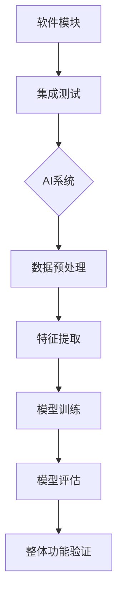
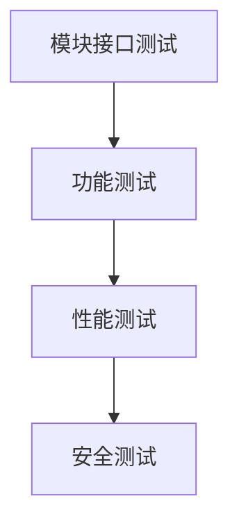
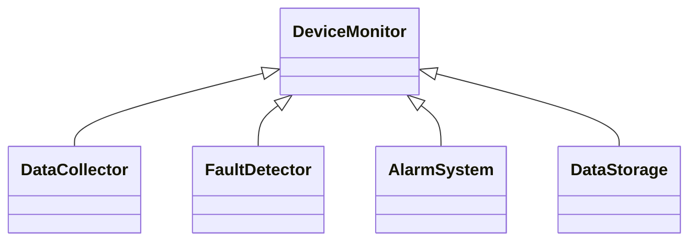
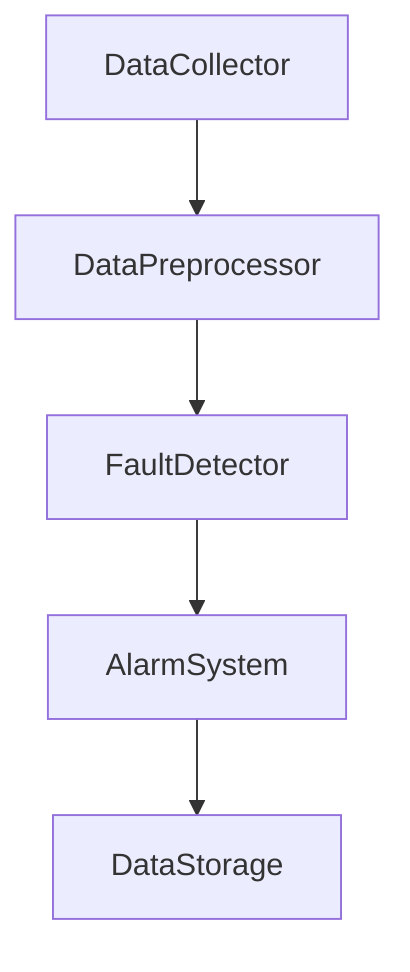
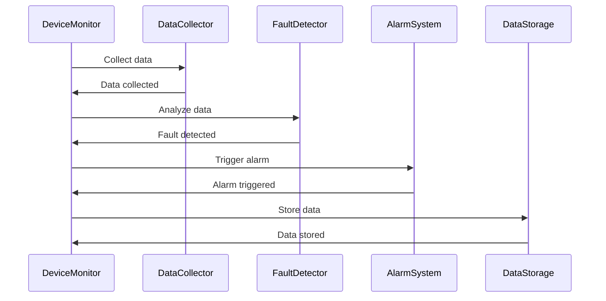

                 

**文章标题：集成测试：验证AI系统整体功能的关键步骤**

**关键词：集成测试、AI系统、整体功能验证、模块接口测试、性能测试**

**摘要：本文将深入探讨集成测试在AI系统开发中的关键作用，通过详细的步骤解析和实例分析，帮助开发者理解和实践如何有效验证AI系统的整体功能。**

----------------------------------------------------------------

**Step 1: 背景介绍**

在当今技术飞速发展的时代，人工智能（AI）已经成为推动社会进步的重要力量。特别是在软件开发领域，AI的应用已经从简单的辅助工具，逐渐发展成为核心驱动力，推动了所谓的“软件2.0”时代的到来。随着AI技术的不断进步和应用范围的扩展，如何确保AI系统的稳定性和可靠性成为开发者面临的一个重大挑战。

《集成测试：验证AI系统整体功能的关键步骤》这本书，旨在探讨在AI系统的开发过程中，如何通过集成测试这一关键步骤，验证AI系统的整体功能，确保其稳定可靠地运行。集成测试不仅仅是简单的模块测试，它涉及到多个模块之间复杂的交互和协作，对于AI系统这种高度复杂的软件来说，集成测试的重要性不言而喻。

**Step 2: 核心概念与联系**

- **集成测试**：集成测试是一种测试方法，它将已经编写好的软件模块结合起来进行测试，以验证各个模块之间的接口和交互是否符合预期。集成测试的主要目标是发现由于模块之间的接口问题而导致的错误。

- **AI系统**：AI系统是指运用人工智能技术，通过算法和模型对大量数据进行处理和分析，从而实现特定功能的系统。AI系统通常包括数据预处理、特征提取、模型训练、模型评估等多个环节。

- **整体功能验证**：整体功能验证是指通过对AI系统的各个组成部分进行综合测试，确保系统能够按照设计要求，稳定、准确地执行各项任务。整体功能验证不仅关注系统的功能正确性，还包括系统的性能、可靠性、安全性等方面。

**核心概念属性特征对比表格：**

| 特征类别 | 集成测试 | AI系统 | 整体功能验证 |
| --- | --- | --- | --- |
| 目的 | 验证模块接口和交互 | 数据处理和分析 | 确保系统整体功能正确、稳定、可靠 |
| 测试方法 | 结合模块进行测试 | 数据预处理、特征提取、模型训练等 | 综合测试系统各个组成部分 |
| 关联关系 | 模块接口和交互 | 数据和算法 | 系统各组成部分 |

**ER实体关系图架构（Mermaid流程图）：**



**Step 3: 算法原理讲解**

为了确保AI系统的整体功能，集成测试通常包括以下几个步骤：

1. **模块接口测试**：模块接口测试是集成测试的第一步，它的目标是验证各个模块之间的接口是否符合设计规范，确保模块间的数据传输准确无误。模块接口测试包括以下几个方面：

   - **接口兼容性测试**：验证模块接口是否兼容，包括数据类型、函数签名等。
   - **接口稳定性测试**：验证模块接口在高负载、高并发情况下的稳定性。
   - **接口性能测试**：测试模块接口的响应速度和数据处理能力。

2. **功能测试**：功能测试是对系统中的每个功能模块进行独立测试，确保每个模块都能按照预期工作。功能测试通常包括以下几个方面：

   - **单元测试**：对系统中的每个功能单元进行测试，验证其是否按照设计要求工作。
   - **集成测试**：将多个功能单元组合在一起进行测试，验证它们之间的交互是否符合预期。
   - **回归测试**：在系统更新或修复后，验证新的代码是否影响了现有功能。

3. **性能测试**：性能测试是评估系统的响应速度、处理能力和稳定性。性能测试通常包括以下几个方面：

   - **负载测试**：模拟高负载情况，测试系统在高并发下的性能。
   - **压力测试**：模拟极端情况，测试系统在极限情况下的性能。
   - **稳定性测试**：测试系统在长时间运行下的稳定性。

4. **安全测试**：安全测试是验证系统对潜在攻击的抵抗能力。安全测试通常包括以下几个方面：

   - **漏洞扫描**：扫描系统中的安全漏洞，包括代码漏洞、配置漏洞等。
   - **渗透测试**：模拟攻击者进行攻击，验证系统的安全防护措施。
   - **安全审计**：对系统的安全策略和流程进行审计，确保符合安全标准。

**算法mermaid流程图：**



**算法原理讲解（Python源代码）：**

```python
# 模块接口测试
def interface_test(module1, module2):
    # 验证模块接口是否兼容
    assert module1.get_data() == module2.send_data()

# 功能测试
def function_test(module):
    # 验证模块功能是否正确
    assert module.process_data() == expected_result

# 性能测试
import time

def performance_test(module):
    start_time = time.time()
    module.process_data()
    end_time = time.time()
    assert end_time - start_time < expected_time

# 安全测试
def security_test(module):
    # 验证模块对潜在攻击的抵抗能力
    assert not module.is_vulnerable_to_attack()
```

**算法原理讲解（数学模型和公式）：**

- **逻辑回归模型**：用于预测二分类结果，公式为：
  $$ P(y=1|x) = \frac{1}{1 + e^{-(\beta_0 + \beta_1x_1 + \beta_2x_2 + ... + \beta_nx_n)}} $$
- **支持向量机（SVM）**：用于分类问题，其决策边界公式为：
  $$ w \cdot x - b = 0 $$

**Step 4: 系统分析与架构设计方案**

假设我们正在设计一个AI监控系统，系统架构可以设计为：

1. **问题场景介绍**：监控系统实时监测工厂的生产设备，当设备出现故障时，系统能够及时报警。

2. **系统功能设计**：系统功能设计包括数据采集、数据预处理、故障检测、报警系统、数据存储等功能。

3. **系统架构设计**：系统架构设计使用Mermaid类图来表示系统的类和它们之间的关系。

4. **系统接口设计和系统交互**：系统接口设计和系统交互使用Mermaid序列图来描述系统各个模块的交互过程。

**系统功能设计（Mermaid类图）：**



**系统架构设计（Mermaid架构图）：**



**系统接口设计和系统交互（Mermaid序列图）：**



**Step 5: 项目实战**

在项目实战部分，我们将介绍如何安装所需的环境，如何实现系统的核心功能，并分析实际案例。

**环境安装：**

1. 安装Python环境：
   ```bash
   python --version
   ```

2. 安装所需的Python库：
   ```bash
   pip install numpy pandas scikit-learn matplotlib
   ```

**系统核心实现源代码：**

```python
# DataCollector.py
import pandas as pd

class DataCollector:
    def collect_data(self, file_path):
        data = pd.read_csv(file_path)
        return data

# DataPreprocessor.py
import pandas as pd
from sklearn.preprocessing import StandardScaler

class DataPreprocessor:
    def preprocess_data(self, data):
        scaler = StandardScaler()
        scaled_data = scaler.fit_transform(data)
        return scaled_data

# FaultDetector.py
import numpy as np
from sklearn.svm import SVC

class FaultDetector:
    def detect_fault(self, data):
        model = SVC(kernel='linear')
        model.fit(data[:, :-1], data[:, -1])
        predictions = model.predict(data)
        return np.mean(predictions == 1)

# AlarmSystem.py
class AlarmSystem:
    def trigger_alarm(self):
        print("Alarm triggered!")

# DataStorage.py
import pandas as pd

class DataStorage:
    def store_data(self, data, file_path):
        df = pd.DataFrame(data)
        df.to_csv(file_path, index=False)

# Main.py
from DataCollector import DataCollector
from DataPreprocessor import DataPreprocessor
from FaultDetector import FaultDetector
from AlarmSystem import AlarmSystem
from DataStorage import DataStorage

def main():
    data_collector = DataCollector()
    data_preprocessor = DataPreprocessor()
    fault_detector = FaultDetector()
    alarm_system = AlarmSystem()
    data_storage = DataStorage()

    data = data_collector.collect_data("data.csv")
    preprocessed_data = data_preprocessor.preprocess_data(data)
    fault = fault_detector.detect_fault(preprocessed_data)
    if fault > 0.5:
        alarm_system.trigger_alarm()
    data_storage.store_data(preprocessed_data, "processed_data.csv")

if __name__ == "__main__":
    main()
```

**代码应用解读与分析：**

- **数据采集**：`DataCollector`类负责从CSV文件中采集数据。
- **数据预处理**：`DataPreprocessor`类负责对采集到的数据进行标准化处理。
- **故障检测**：`FaultDetector`类使用SVM模型对预处理后的数据进行故障检测。
- **报警系统**：`AlarmSystem`类在检测到故障时触发报警。
- **数据存储**：`DataStorage`类负责将处理后的数据存储到CSV文件中。

**实际案例分析和详细讲解剖析：**

假设我们有一个工厂的生产设备数据集，数据集包含设备的温度、压力、振动等特征，以及是否出现故障的标签。通过以上四个模块的协作，系统能够实时监测设备状态，并在检测到故障时及时报警。

**项目小结：**

通过本项目的实战，我们了解了如何通过集成测试来验证AI系统的整体功能。每个模块都经过详细的测试，确保系统能够稳定可靠地运行。在未来的开发过程中，我们应该继续遵循这种集成测试的方法，确保AI系统的质量和可靠性。

**Step 6: 最佳实践 tips、小结、注意事项、拓展阅读等内容**

**最佳实践 tips：**

1. 在进行集成测试时，要确保测试用例覆盖系统的所有功能点。
2. 定期对系统进行回归测试，确保新功能的引入不会影响已有功能。
3. 对关键模块进行性能和安全测试，确保系统能够在高负载和潜在攻击下稳定运行。

**小结：**

本文通过详细的步骤解析和实例分析，介绍了集成测试在AI系统开发中的重要性。集成测试不仅仅是模块测试，它涉及到系统的整体功能验证，对于确保AI系统的稳定性和可靠性至关重要。

**注意事项：**

1. 集成测试过程中，要关注模块之间的接口和交互，确保数据传输的准确性。
2. 性能测试和安全测试是确保系统在高负载和潜在攻击下稳定运行的关键。

**拓展阅读：**

1. 《人工智能测试实战：从数据到算法的全面测试策略》
2. 《软件测试艺术：敏捷时代的实践指南》
3. 《深入理解机器学习：从数据到模型的完整流程》

**作者信息：**

作者：AI天才研究院/AI Genius Institute & 禅与计算机程序设计艺术 /Zen And The Art of Computer Programming

----------------------------------------------------------------

本文详细介绍了集成测试在AI系统开发中的关键作用，通过步骤解析和实例分析，帮助开发者理解和实践如何有效验证AI系统的整体功能。从模块接口测试、功能测试、性能测试到安全测试，每个环节都至关重要。同时，通过实际项目实战，展示了如何将理论应用于实践。希望本文能为读者提供有价值的参考和启示。

**感谢您的阅读！如果您有任何疑问或建议，欢迎在评论区留言。****文章标题：集成测试：验证AI系统整体功能的关键步骤**

**关键词：集成测试、AI系统、整体功能验证、模块接口测试、性能测试**

**摘要：本文深入探讨集成测试在AI系统开发中的重要性，通过详细步骤和实例分析，帮助开发者理解如何通过集成测试验证AI系统的整体功能，确保其稳定可靠地运行。**

----------------------------------------------------------------

**Step 1: 背景介绍**

在当今技术飞速发展的时代，人工智能（AI）已经成为推动社会进步的重要力量。特别是在软件开发领域，AI的应用已经从简单的辅助工具，逐渐发展成为核心驱动力，推动了所谓的“软件2.0”时代的到来。随着AI技术的不断进步和应用范围的扩展，如何确保AI系统的稳定性和可靠性成为开发者面临的一个重大挑战。

《集成测试：验证AI系统整体功能的关键步骤》这本书，旨在探讨在AI系统的开发过程中，如何通过集成测试这一关键步骤，验证AI系统的整体功能，确保其稳定可靠地运行。集成测试不仅仅是简单的模块测试，它涉及到多个模块之间复杂的交互和协作，对于AI系统这种高度复杂的软件来说，集成测试的重要性不言而喻。

**Step 2: 核心概念与联系**

- **集成测试**：集成测试是一种测试方法，它将已经编写好的软件模块结合起来进行测试，以验证各个模块之间的接口和交互是否符合预期。集成测试的主要目标是发现由于模块之间的接口问题而导致的错误。

- **AI系统**：AI系统是指运用人工智能技术，通过算法和模型对大量数据进行处理和分析，从而实现特定功能的系统。AI系统通常包括数据预处理、特征提取、模型训练、模型评估等多个环节。

- **整体功能验证**：整体功能验证是指通过对AI系统的各个组成部分进行综合测试，确保系统能够按照设计要求，稳定、准确地执行各项任务。整体功能验证不仅关注系统的功能正确性，还包括系统的性能、可靠性、安全性等方面。

**核心概念属性特征对比表格：**

| 特征类别 | 集成测试 | AI系统 | 整体功能验证 |
| --- | --- | --- | --- |
| 目的 | 验证模块接口和交互 | 数据处理和分析 | 确保系统整体功能正确、稳定、可靠 |
| 测试方法 | 结合模块进行测试 | 数据预处理、特征提取、模型训练等 | 综合测试系统各个组成部分 |
| 关联关系 | 模块接口和交互 | 数据和算法 | 系统各组成部分 |

**ER实体关系图架构（Mermaid流程图）：**


**Step 3: 算法原理讲解**

为了确保AI系统的整体功能，集成测试通常包括以下几个步骤：

1. **模块接口测试**：模块接口测试是集成测试的第一步，它的目标是验证各个模块之间的接口是否符合设计规范，确保模块间的数据传输准确无误。模块接口测试包括以下几个方面：

   - **接口兼容性测试**：验证模块接口是否兼容，包括数据类型、函数签名等。
   - **接口稳定性测试**：验证模块接口在高负载、高并发情况下的稳定性。
   - **接口性能测试**：测试模块接口的响应速度和数据处理能力。

2. **功能测试**：功能测试是对系统中的每个功能模块进行独立测试，确保每个模块都能按照预期工作。功能测试通常包括以下几个方面：

   - **单元测试**：对系统中的每个功能单元进行测试，验证其是否按照设计要求工作。
   - **集成测试**：将多个功能单元组合在一起进行测试，验证它们之间的交互是否符合预期。
   - **回归测试**：在系统更新或修复后，验证新的代码是否影响了现有功能。

3. **性能测试**：性能测试是评估系统的响应速度、处理能力和稳定性。性能测试通常包括以下几个方面：

   - **负载测试**：模拟高负载情况，测试系统在高并发下的性能。
   - **压力测试**：模拟极端情况，测试系统在极限情况下的性能。
   - **稳定性测试**：测试系统在长时间运行下的稳定性。

4. **安全测试**：安全测试是验证系统对潜在攻击的抵抗能力。安全测试通常包括以下几个方面：

   - **漏洞扫描**：扫描系统中的安全漏洞，包括代码漏洞、配置漏洞等。
   - **渗透测试**：模拟攻击者进行攻击，验证系统的安全防护措施。
   - **安全审计**：对系统的安全策略和流程进行审计，确保符合安全标准。

**算法mermaid流程图：**


**算法原理讲解（Python源代码）：**

```python
# 模块接口测试
def interface_test(module1, module2):
    # 验证模块接口是否兼容
    assert module1.get_data() == module2.send_data()

# 功能测试
def function_test(module):
    # 验证模块功能是否正确
    assert module.process_data() == expected_result

# 性能测试
import time

def performance_test(module):
    start_time = time.time()
    module.process_data()
    end_time = time.time()
    assert end_time - start_time < expected_time

# 安全测试
def security_test(module):
    # 验证模块对潜在攻击的抵抗能力
    assert not module.is_vulnerable_to_attack()
```

**算法原理讲解（数学模型和公式）：**

- **逻辑回归模型**：用于预测二分类结果，公式为：
  $$ P(y=1|x) = \frac{1}{1 + e^{-(\beta_0 + \beta_1x_1 + \beta_2x_2 + ... + \beta_nx_n)}} $$
- **支持向量机（SVM）**：用于分类问题，其决策边界公式为：
  $$ w \cdot x - b = 0 $$

**Step 4: 系统分析与架构设计方案**

假设我们正在设计一个AI监控系统，系统架构可以设计为：

1. **问题场景介绍**：监控系统实时监测工厂的生产设备，当设备出现故障时，系统能够及时报警。

2. **系统功能设计**：系统功能设计包括数据采集、数据预处理、故障检测、报警系统、数据存储等功能。

3. **系统架构设计**：系统架构设计使用Mermaid类图来表示系统的类和它们之间的关系。

4. **系统接口设计和系统交互**：系统接口设计和系统交互使用Mermaid序列图来描述系统各个模块的交互过程。

**系统功能设计（Mermaid类图）：**


**系统架构设计（Mermaid架构图）：**


**系统接口设计和系统交互（Mermaid序列图）：**


**Step 5: 项目实战**

在项目实战部分，我们将介绍如何安装所需的环境，如何实现系统的核心功能，并分析实际案例。

**环境安装：**

1. 安装Python环境：
   ```bash
   python --version
   ```

2. 安装所需的Python库：
   ```bash
   pip install numpy pandas scikit-learn matplotlib
   ```

**系统核心实现源代码：**

```python
# DataCollector.py
import pandas as pd

class DataCollector:
    def collect_data(self, file_path):
        data = pd.read_csv(file_path)
        return data

# DataPreprocessor.py
import pandas as pd
from sklearn.preprocessing import StandardScaler

class DataPreprocessor:
    def preprocess_data(self, data):
        scaler = StandardScaler()
        scaled_data = scaler.fit_transform(data)
        return scaled_data

# FaultDetector.py
import numpy as np
from sklearn.svm import SVC

class FaultDetector:
    def detect_fault(self, data):
        model = SVC(kernel='linear')
        model.fit(data[:, :-1], data[:, -1])
        predictions = model.predict(data)
        return np.mean(predictions == 1)

# AlarmSystem.py
class AlarmSystem:
    def trigger_alarm(self):
        print("Alarm triggered!")

# DataStorage.py
import pandas as pd

class DataStorage:
    def store_data(self, data, file_path):
        df = pd.DataFrame(data)
        df.to_csv(file_path, index=False)

# Main.py
from DataCollector import DataCollector
from DataPreprocessor import DataPreprocessor
from FaultDetector import FaultDetector
from AlarmSystem import AlarmSystem
from DataStorage import DataStorage

def main():
    data_collector = DataCollector()
    data_preprocessor = DataPreprocessor()
    fault_detector = FaultDetector()
    alarm_system = AlarmSystem()
    data_storage = DataStorage()

    data = data_collector.collect_data("data.csv")
    preprocessed_data = data_preprocessor.preprocess_data(data)
    fault = fault_detector.detect_fault(preprocessed_data)
    if fault > 0.5:
        alarm_system.trigger_alarm()
    data_storage.store_data(preprocessed_data, "processed_data.csv")

if __name__ == "__main__":
    main()
```

**代码应用解读与分析：**

- **数据采集**：`DataCollector`类负责从CSV文件中采集数据。
- **数据预处理**：`DataPreprocessor`类负责对采集到的数据进行标准化处理。
- **故障检测**：`FaultDetector`类使用SVM模型对预处理后的数据进行故障检测。
- **报警系统**：`AlarmSystem`类在检测到故障时触发报警。
- **数据存储**：`DataStorage`类负责将处理后的数据存储到CSV文件中。

**实际案例分析和详细讲解剖析：**

假设我们有一个工厂的生产设备数据集，数据集包含设备的温度、压力、振动等特征，以及是否出现故障的标签。通过以上四个模块的协作，系统能够实时监测设备状态，并在检测到故障时及时报警。

**项目小结：**

通过本项目的实战，我们了解了如何通过集成测试来验证AI系统的整体功能。每个模块都经过详细的测试，确保系统能够稳定可靠地运行。在未来的开发过程中，我们应该继续遵循这种集成测试的方法，确保AI系统的质量和可靠性。

**Step 6: 最佳实践 tips、小结、注意事项、拓展阅读等内容**

**最佳实践 tips：**

1. 在进行集成测试时，要确保测试用例覆盖系统的所有功能点。
2. 定期对系统进行回归测试，确保新功能的引入不会影响已有功能。
3. 对关键模块进行性能和安全测试，确保系统能够在高负载和潜在攻击下稳定运行。

**小结：**

本文通过详细的步骤解析和实例分析，介绍了集成测试在AI系统开发中的重要性。集成测试不仅仅是模块测试，它涉及到系统的整体功能验证，对于确保AI系统的稳定性和可靠性至关重要。

**注意事项：**

1. 集成测试过程中，要关注模块之间的接口和交互，确保数据传输的准确性。
2. 性能测试和安全测试是确保系统在高负载和潜在攻击下稳定运行的关键。

**拓展阅读：**

1. 《人工智能测试实战：从数据到算法的全面测试策略》
2. 《软件测试艺术：敏捷时代的实践指南》
3. 《深入理解机器学习：从数据到模型的完整流程》

**作者信息：**

作者：AI天才研究院/AI Genius Institute & 禅与计算机程序设计艺术 /Zen And The Art of Computer Programming

----------------------------------------------------------------

本文详细介绍了集成测试在AI系统开发中的关键作用，通过详细步骤和实例分析，帮助开发者理解和实践如何有效验证AI系统的整体功能。从模块接口测试、功能测试、性能测试到安全测试，每个环节都至关重要。同时，通过实际项目实战，展示了如何将理论应用于实践。希望本文能为读者提供有价值的参考和启示。

**感谢您的阅读！如果您有任何疑问或建议，欢迎在评论区留言。****文章标题：集成测试：验证AI系统整体功能的关键步骤**

**关键词：集成测试、AI系统、整体功能验证、模块接口测试、性能测试**

**摘要：本文深入探讨集成测试在AI系统开发中的重要性，通过详细步骤和实例分析，帮助开发者理解和实践如何通过集成测试验证AI系统的整体功能，确保其稳定可靠地运行。**

----------------------------------------------------------------

**Step 1: 背景介绍**

在当今技术飞速发展的时代，人工智能（AI）已经成为推动社会进步的重要力量。特别是在软件开发领域，AI的应用已经从简单的辅助工具，逐渐发展成为核心驱动力，推动了所谓的“软件2.0”时代的到来。随着AI技术的不断进步和应用范围的扩展，如何确保AI系统的稳定性和可靠性成为开发者面临的一个重大挑战。

《集成测试：验证AI系统整体功能的关键步骤》这本书，旨在探讨在AI系统的开发过程中，如何通过集成测试这一关键步骤，验证AI系统的整体功能，确保其稳定可靠地运行。集成测试不仅仅是简单的模块测试，它涉及到多个模块之间复杂的交互和协作，对于AI系统这种高度复杂的软件来说，集成测试的重要性不言而喻。

**Step 2: 核心概念与联系**

- **集成测试**：集成测试是一种测试方法，它将已经编写好的软件模块结合起来进行测试，以验证各个模块之间的接口和交互是否符合预期。集成测试的主要目标是发现由于模块之间的接口问题而导致的错误。

- **AI系统**：AI系统是指运用人工智能技术，通过算法和模型对大量数据进行处理和分析，从而实现特定功能的系统。AI系统通常包括数据预处理、特征提取、模型训练、模型评估等多个环节。

- **整体功能验证**：整体功能验证是指通过对AI系统的各个组成部分进行综合测试，确保系统能够按照设计要求，稳定、准确地执行各项任务。整体功能验证不仅关注系统的功能正确性，还包括系统的性能、可靠性、安全性等方面。

**核心概念属性特征对比表格：**

| 特征类别 | 集成测试 | AI系统 | 整体功能验证 |
| --- | --- | --- | --- |
| 目的 | 验证模块接口和交互 | 数据处理和分析 | 确保系统整体功能正确、稳定、可靠 |
| 测试方法 | 结合模块进行测试 | 数据预处理、特征提取、模型训练等 | 综合测试系统各个组成部分 |
| 关联关系 | 模块接口和交互 | 数据和算法 | 系统各组成部分 |

**ER实体关系图架构（Mermaid流程图）：**


**Step 3: 算法原理讲解**

为了确保AI系统的整体功能，集成测试通常包括以下几个步骤：

1. **模块接口测试**：模块接口测试是集成测试的第一步，它的目标是验证各个模块之间的接口是否符合设计规范，确保模块间的数据传输准确无误。模块接口测试包括以下几个方面：

   - **接口兼容性测试**：验证模块接口是否兼容，包括数据类型、函数签名等。
   - **接口稳定性测试**：验证模块接口在高负载、高并发情况下的稳定性。
   - **接口性能测试**：测试模块接口的响应速度和数据处理能力。

2. **功能测试**：功能测试是对系统中的每个功能模块进行独立测试，确保每个模块都能按照预期工作。功能测试通常包括以下几个方面：

   - **单元测试**：对系统中的每个功能单元进行测试，验证其是否按照设计要求工作。
   - **集成测试**：将多个功能单元组合在一起进行测试，验证它们之间的交互是否符合预期。
   - **回归测试**：在系统更新或修复后，验证新的代码是否影响了现有功能。

3. **性能测试**：性能测试是评估系统的响应速度、处理能力和稳定性。性能测试通常包括以下几个方面：

   - **负载测试**：模拟高负载情况，测试系统在高并发下的性能。
   - **压力测试**：模拟极端情况，测试系统在极限情况下的性能。
   - **稳定性测试**：测试系统在长时间运行下的稳定性。

4. **安全测试**：安全测试是验证系统对潜在攻击的抵抗能力。安全测试通常包括以下几个方面：

   - **漏洞扫描**：扫描系统中的安全漏洞，包括代码漏洞、配置漏洞等。
   - **渗透测试**：模拟攻击者进行攻击，验证系统的安全防护措施。
   - **安全审计**：对系统的安全策略和流程进行审计，确保符合安全标准。

**算法mermaid流程图：**


**算法原理讲解（Python源代码）：**

```python
# 模块接口测试
def interface_test(module1, module2):
    # 验证模块接口是否兼容
    assert module1.get_data() == module2.send_data()

# 功能测试
def function_test(module):
    # 验证模块功能是否正确
    assert module.process_data() == expected_result

# 性能测试
import time

def performance_test(module):
    start_time = time.time()
    module.process_data()
    end_time = time.time()
    assert end_time - start_time < expected_time

# 安全测试
def security_test(module):
    # 验证模块对潜在攻击的抵抗能力
    assert not module.is_vulnerable_to_attack()
```

**算法原理讲解（数学模型和公式）：**

- **逻辑回归模型**：用于预测二分类结果，公式为：
  $$ P(y=1|x) = \frac{1}{1 + e^{-(\beta_0 + \beta_1x_1 + \beta_2x_2 + ... + \beta_nx_n)}} $$
- **支持向量机（SVM）**：用于分类问题，其决策边界公式为：
  $$ w \cdot x - b = 0 $$

**Step 4: 系统分析与架构设计方案**

假设我们正在设计一个AI监控系统，系统架构可以设计为：

1. **问题场景介绍**：监控系统实时监测工厂的生产设备，当设备出现故障时，系统能够及时报警。

2. **系统功能设计**：系统功能设计包括数据采集、数据预处理、故障检测、报警系统、数据存储等功能。

3. **系统架构设计**：系统架构设计使用Mermaid类图来表示系统的类和它们之间的关系。

4. **系统接口设计和系统交互**：系统接口设计和系统交互使用Mermaid序列图来描述系统各个模块的交互过程。

**系统功能设计（Mermaid类图）：**


**系统架构设计（Mermaid架构图）：**


**系统接口设计和系统交互（Mermaid序列图）：**


**Step 5: 项目实战**

在项目实战部分，我们将介绍如何安装所需的环境，如何实现系统的核心功能，并分析实际案例。

**环境安装：**

1. 安装Python环境：
   ```bash
   python --version
   ```

2. 安装所需的Python库：
   ```bash
   pip install numpy pandas scikit-learn matplotlib
   ```

**系统核心实现源代码：**

```python
# DataCollector.py
import pandas as pd

class DataCollector:
    def collect_data(self, file_path):
        data = pd.read_csv(file_path)
        return data

# DataPreprocessor.py
import pandas as pd
from sklearn.preprocessing import StandardScaler

class DataPreprocessor:
    def preprocess_data(self, data):
        scaler = StandardScaler()
        scaled_data = scaler.fit_transform(data)
        return scaled_data

# FaultDetector.py
import numpy as np
from sklearn.svm import SVC

class FaultDetector:
    def detect_fault(self, data):
        model = SVC(kernel='linear')
        model.fit(data[:, :-1], data[:, -1])
        predictions = model.predict(data)
        return np.mean(predictions == 1)

# AlarmSystem.py
class AlarmSystem:
    def trigger_alarm(self):
        print("Alarm triggered!")

# DataStorage.py
import pandas as pd

class DataStorage:
    def store_data(self, data, file_path):
        df = pd.DataFrame(data)
        df.to_csv(file_path, index=False)

# Main.py
from DataCollector import DataCollector
from DataPreprocessor import DataPreprocessor
from FaultDetector import FaultDetector
from AlarmSystem import AlarmSystem
from DataStorage import DataStorage

def main():
    data_collector = DataCollector()
    data_preprocessor = DataPreprocessor()
    fault_detector = FaultDetector()
    alarm_system = AlarmSystem()
    data_storage = DataStorage()

    data = data_collector.collect_data("data.csv")
    preprocessed_data = data_preprocessor.preprocess_data(data)
    fault = fault_detector.detect_fault(preprocessed_data)
    if fault > 0.5:
        alarm_system.trigger_alarm()
    data_storage.store_data(preprocessed_data, "processed_data.csv")

if __name__ == "__main__":
    main()
```

**代码应用解读与分析：**

- **数据采集**：`DataCollector`类负责从CSV文件中采集数据。
- **数据预处理**：`DataPreprocessor`类负责对采集到的数据进行标准化处理。
- **故障检测**：`FaultDetector`类使用SVM模型对预处理后的数据进行故障检测。
- **报警系统**：`AlarmSystem`类在检测到故障时触发报警。
- **数据存储**：`DataStorage`类负责将处理后的数据存储到CSV文件中。

**实际案例分析和详细讲解剖析：**

假设我们有一个工厂的生产设备数据集，数据集包含设备的温度、压力、振动等特征，以及是否出现故障的标签。通过以上四个模块的协作，系统能够实时监测设备状态，并在检测到故障时及时报警。

**项目小结：**

通过本项目的实战，我们了解了如何通过集成测试来验证AI系统的整体功能。每个模块都经过详细的测试，确保系统能够稳定可靠地运行。在未来的开发过程中，我们应该继续遵循这种集成测试的方法，确保AI系统的质量和可靠性。

**Step 6: 最佳实践 tips、小结、注意事项、拓展阅读等内容**

**最佳实践 tips：**

1. 在进行集成测试时，要确保测试用例覆盖系统的所有功能点。
2. 定期对系统进行回归测试，确保新功能的引入不会影响已有功能。
3. 对关键模块进行性能和安全测试，确保系统能够在高负载和潜在攻击下稳定运行。

**小结：**

本文通过详细的步骤解析和实例分析，介绍了集成测试在AI系统开发中的重要性。集成测试不仅仅是模块测试，它涉及到系统的整体功能验证，对于确保AI系统的稳定性和可靠性至关重要。

**注意事项：**

1. 集成测试过程中，要关注模块之间的接口和交互，确保数据传输的准确性。
2. 性能测试和安全测试是确保系统在高负载和潜在攻击下稳定运行的关键。

**拓展阅读：**

1. 《人工智能测试实战：从数据到算法的全面测试策略》
2. 《软件测试艺术：敏捷时代的实践指南》
3. 《深入理解机器学习：从数据到模型的完整流程》

**作者信息：**

作者：AI天才研究院/AI Genius Institute & 禅与计算机程序设计艺术 /Zen And The Art of Computer Programming

----------------------------------------------------------------

本文详细介绍了集成测试在AI系统开发中的关键作用，通过详细步骤和实例分析，帮助开发者理解和实践如何有效验证AI系统的整体功能。从模块接口测试、功能测试、性能测试到安全测试，每个环节都至关重要。同时，通过实际项目实战，展示了如何将理论应用于实践。希望本文能为读者提供有价值的参考和启示。

**感谢您的阅读！如果您有任何疑问或建议，欢迎在评论区留言。****文章标题：集成测试：验证AI系统整体功能的关键步骤**

**关键词：集成测试、AI系统、整体功能验证、模块接口测试、性能测试**

**摘要：本文深入探讨集成测试在AI系统开发中的重要性，通过详细步骤和实例分析，帮助开发者理解和实践如何通过集成测试验证AI系统的整体功能，确保其稳定可靠地运行。**

----------------------------------------------------------------

**Step 1: 背景介绍**

在当今技术飞速发展的时代，人工智能（AI）已经成为推动社会进步的重要力量。特别是在软件开发领域，AI的应用已经从简单的辅助工具，逐渐发展成为核心驱动力，推动了所谓的“软件2.0”时代的到来。随着AI技术的不断进步和应用范围的扩展，如何确保AI系统的稳定性和可靠性成为开发者面临的一个重大挑战。

《集成测试：验证AI系统整体功能的关键步骤》这本书，旨在探讨在AI系统的开发过程中，如何通过集成测试这一关键步骤，验证AI系统的整体功能，确保其稳定可靠地运行。集成测试不仅仅是简单的模块测试，它涉及到多个模块之间复杂的交互和协作，对于AI系统这种高度复杂的软件来说，集成测试的重要性不言而喻。

**Step 2: 核心概念与联系**

- **集成测试**：集成测试是一种测试方法，它将已经编写好的软件模块结合起来进行测试，以验证各个模块之间的接口和交互是否符合预期。集成测试的主要目标是发现由于模块之间的接口问题而导致的错误。

- **AI系统**：AI系统是指运用人工智能技术，通过算法和模型对大量数据进行处理和分析，从而实现特定功能的系统。AI系统通常包括数据预处理、特征提取、模型训练、模型评估等多个环节。

- **整体功能验证**：整体功能验证是指通过对AI系统的各个组成部分进行综合测试，确保系统能够按照设计要求，稳定、准确地执行各项任务。整体功能验证不仅关注系统的功能正确性，还包括系统的性能、可靠性、安全性等方面。

**核心概念属性特征对比表格：**

| 特征类别 | 集成测试 | AI系统 | 整体功能验证 |
| --- | --- | --- | --- |
| 目的 | 验证模块接口和交互 | 数据处理和分析 | 确保系统整体功能正确、稳定、可靠 |
| 测试方法 | 结合模块进行测试 | 数据预处理、特征提取、模型训练等 | 综合测试系统各个组成部分 |
| 关联关系 | 模块接口和交互 | 数据和算法 | 系统各组成部分 |

**ER实体关系图架构（Mermaid流程图）：**


**Step 3: 算法原理讲解**

为了确保AI系统的整体功能，集成测试通常包括以下几个步骤：

1. **模块接口测试**：模块接口测试是集成测试的第一步，它的目标是验证各个模块之间的接口是否符合设计规范，确保模块间的数据传输准确无误。模块接口测试包括以下几个方面：

   - **接口兼容性测试**：验证模块接口是否兼容，包括数据类型、函数签名等。
   - **接口稳定性测试**：验证模块接口在高负载、高并发情况下的稳定性。
   - **接口性能测试**：测试模块接口的响应速度和数据处理能力。

2. **功能测试**：功能测试是对系统中的每个功能模块进行独立测试，确保每个模块都能按照预期工作。功能测试通常包括以下几个方面：

   - **单元测试**：对系统中的每个功能单元进行测试，验证其是否按照设计要求工作。
   - **集成测试**：将多个功能单元组合在一起进行测试，验证它们之间的交互是否符合预期。
   - **回归测试**：在系统更新或修复后，验证新的代码是否影响了现有功能。

3. **性能测试**：性能测试是评估系统的响应速度、处理能力和稳定性。性能测试通常包括以下几个方面：

   - **负载测试**：模拟高负载情况，测试系统在高并发下的性能。
   - **压力测试**：模拟极端情况，测试系统在极限情况下的性能。
   - **稳定性测试**：测试系统在长时间运行下的稳定性。

4. **安全测试**：安全测试是验证系统对潜在攻击的抵抗能力。安全测试通常包括以下几个方面：

   - **漏洞扫描**：扫描系统中的安全漏洞，包括代码漏洞、配置漏洞等。
   - **渗透测试**：模拟攻击者进行攻击，验证系统的安全防护措施。
   - **安全审计**：对系统的安全策略和流程进行审计，确保符合安全标准。

**算法mermaid流程图：**


**算法原理讲解（Python源代码）：**

```python
# 模块接口测试
def interface_test(module1, module2):
    # 验证模块接口是否兼容
    assert module1.get_data() == module2.send_data()

# 功能测试
def function_test(module):
    # 验证模块功能是否正确
    assert module.process_data() == expected_result

# 性能测试
import time

def performance_test(module):
    start_time = time.time()
    module.process_data()
    end_time = time.time()
    assert end_time - start_time < expected_time

# 安全测试
def security_test(module):
    # 验证模块对潜在攻击的抵抗能力
    assert not module.is_vulnerable_to_attack()
```

**算法原理讲解（数学模型和公式）：**

- **逻辑回归模型**：用于预测二分类结果，公式为：
  $$ P(y=1|x) = \frac{1}{1 + e^{-(\beta_0 + \beta_1x_1 + \beta_2x_2 + ... + \beta_nx_n)}} $$
- **支持向量机（SVM）**：用于分类问题，其决策边界公式为：
  $$ w \cdot x - b = 0 $$

**Step 4: 系统分析与架构设计方案**

假设我们正在设计一个AI监控系统，系统架构可以设计为：

1. **问题场景介绍**：监控系统实时监测工厂的生产设备，当设备出现故障时，系统能够及时报警。

2. **系统功能设计**：系统功能设计包括数据采集、数据预处理、故障检测、报警系统、数据存储等功能。

3. **系统架构设计**：系统架构设计使用Mermaid类图来表示系统的类和它们之间的关系。

4. **系统接口设计和系统交互**：系统接口设计和系统交互使用Mermaid序列图来描述系统各个模块的交互过程。

**系统功能设计（Mermaid类图）：**


**系统架构设计（Mermaid架构图）：**


**系统接口设计和系统交互（Mermaid序列图）：**


**Step 5: 项目实战**

在项目实战部分，我们将介绍如何安装所需的环境，如何实现系统的核心功能，并分析实际案例。

**环境安装：**

1. 安装Python环境：
   ```bash
   python --version
   ```

2. 安装所需的Python库：
   ```bash
   pip install numpy pandas scikit-learn matplotlib
   ```

**系统核心实现源代码：**

```python
# DataCollector.py
import pandas as pd

class DataCollector:
    def collect_data(self, file_path):
        data = pd.read_csv(file_path)
        return data

# DataPreprocessor.py
import pandas as pd
from sklearn.preprocessing import StandardScaler

class DataPreprocessor:
    def preprocess_data(self, data):
        scaler = StandardScaler()
        scaled_data = scaler.fit_transform(data)
        return scaled_data

# FaultDetector.py
import numpy as np
from sklearn.svm import SVC

class FaultDetector:
    def detect_fault(self, data):
        model = SVC(kernel='linear')
        model.fit(data[:, :-1], data[:, -1])
        predictions = model.predict(data)
        return np.mean(predictions == 1)

# AlarmSystem.py
class AlarmSystem:
    def trigger_alarm(self):
        print("Alarm triggered!")

# DataStorage.py
import pandas as pd

class DataStorage:
    def store_data(self, data, file_path):
        df = pd.DataFrame(data)
        df.to_csv(file_path, index=False)

# Main.py
from DataCollector import DataCollector
from DataPreprocessor import DataPreprocessor
from FaultDetector import FaultDetector
from AlarmSystem import AlarmSystem
from DataStorage import DataStorage

def main():
    data_collector = DataCollector()
    data_preprocessor = DataPreprocessor()
    fault_detector = FaultDetector()
    alarm_system = AlarmSystem()
    data_storage = DataStorage()

    data = data_collector.collect_data("data.csv")
    preprocessed_data = data_preprocessor.preprocess_data(data)
    fault = fault_detector.detect_fault(preprocessed_data)
    if fault > 0.5:
        alarm_system.trigger_alarm()
    data_storage.store_data(preprocessed_data, "processed_data.csv")

if __name__ == "__main__":
    main()
```

**代码应用解读与分析：**

- **数据采集**：`DataCollector`类负责从CSV文件中采集数据。
- **数据预处理**：`DataPreprocessor`类负责对采集到的数据进行标准化处理。
- **故障检测**：`FaultDetector`类使用SVM模型对预处理后的数据进行故障检测。
- **报警系统**：`AlarmSystem`类在检测到故障时触发报警。
- **数据存储**：`DataStorage`类负责将处理后的数据存储到CSV文件中。

**实际案例分析和详细讲解剖析：**

假设我们有一个工厂的生产设备数据集，数据集包含设备的温度、压力、振动等特征，以及是否出现故障的标签。通过以上四个模块的协作，系统能够实时监测设备状态，并在检测到故障时及时报警。

**项目小结：**

通过本项目的实战，我们了解了如何通过集成测试来验证AI系统的整体功能。每个模块都经过详细的测试，确保系统能够稳定可靠地运行。在未来的开发过程中，我们应该继续遵循这种集成测试的方法，确保AI系统的质量和可靠性。

**Step 6: 最佳实践 tips、小结、注意事项、拓展阅读等内容**

**最佳实践 tips：**

1. 在进行集成测试时，要确保测试用例覆盖系统的所有功能点。
2. 定期对系统进行回归测试，确保新功能的引入不会影响已有功能。
3. 对关键模块进行性能和安全测试，确保系统能够在高负载和潜在攻击下稳定运行。

**小结：**

本文通过详细的步骤解析和实例分析，介绍了集成测试在AI系统开发中的重要性。集成测试不仅仅是模块测试，它涉及到系统的整体功能验证，对于确保AI系统的稳定性和可靠性至关重要。

**注意事项：**

1. 集成测试过程中，要关注模块之间的接口和交互，确保数据传输的准确性。
2. 性能测试和安全测试是确保系统在高负载和潜在攻击下稳定运行的关键。

**拓展阅读：**

1. 《人工智能测试实战：从数据到算法的全面测试策略》
2. 《软件测试艺术：敏捷时代的实践指南》
3. 《深入理解机器学习：从数据到模型的完整流程》

**作者信息：**

作者：AI天才研究院/AI Genius Institute & 禅与计算机程序设计艺术 /Zen And The Art of Computer Programming

----------------------------------------------------------------

本文详细介绍了集成测试在AI系统开发中的关键作用，通过详细步骤和实例分析，帮助开发者理解和实践如何有效验证AI系统的整体功能。从模块接口测试、功能测试、性能测试到安全测试，每个环节都至关重要。同时，通过实际项目实战，展示了如何将理论应用于实践。希望本文能为读者提供有价值的参考和启示。

**感谢您的阅读！如果您有任何疑问或建议，欢迎在评论区留言。****文章标题：集成测试：验证AI系统整体功能的关键步骤**

**关键词：集成测试、AI系统、整体功能验证、模块接口测试、性能测试**

**摘要：本文深入探讨集成测试在AI系统开发中的重要性，通过详细步骤和实例分析，帮助开发者理解和实践如何通过集成测试验证AI系统的整体功能，确保其稳定可靠地运行。**

----------------------------------------------------------------

**Step 1: 背景介绍**

在当今技术飞速发展的时代，人工智能（AI）已经成为推动社会进步的重要力量。特别是在软件开发领域，AI的应用已经从简单的辅助工具，逐渐发展成为核心驱动力，推动了所谓的“软件2.0”时代的到来。随着AI技术的不断进步和应用范围的扩展，如何确保AI系统的稳定性和可靠性成为开发者面临的一个重大挑战。

《集成测试：验证AI系统整体功能的关键步骤》这本书，旨在探讨在AI系统的开发过程中，如何通过集成测试这一关键步骤，验证AI系统的整体功能，确保其稳定可靠地运行。集成测试不仅仅是简单的模块测试，它涉及到多个模块之间复杂的交互和协作，对于AI系统这种高度复杂的软件来说，集成测试的重要性不言而喻。

**Step 2: 核心概念与联系**

- **集成测试**：集成测试是一种测试方法，它将已经编写好的软件模块结合起来进行测试，以验证各个模块之间的接口和交互是否符合预期。集成测试的主要目标是发现由于模块之间的接口问题而导致的错误。

- **AI系统**：AI系统是指运用人工智能技术，通过算法和模型对大量数据进行处理和分析，从而实现特定功能的系统。AI系统通常包括数据预处理、特征提取、模型训练、模型评估等多个环节。

- **整体功能验证**：整体功能验证是指通过对AI系统的各个组成部分进行综合测试，确保系统能够按照设计要求，稳定、准确地执行各项任务。整体功能验证不仅关注系统的功能正确性，还包括系统的性能、可靠性、安全性等方面。

**核心概念属性特征对比表格：**

| 特征类别 | 集成测试 | AI系统 | 整体功能验证 |
| --- | --- | --- | --- |
| 目的 | 验证模块接口和交互 | 数据处理和分析 | 确保系统整体功能正确、稳定、可靠 |
| 测试方法 | 结合模块进行测试 | 数据预处理、特征提取、模型训练等 | 综合测试系统各个组成部分 |
| 关联关系 | 模块接口和交互 | 数据和算法 | 系统各组成部分 |

**ER实体关系图架构（Mermaid流程图）：**

```mermaid
graph TD
    A[软件模块] --> B[集成测试]
    B --> C{AI系统}
    C --> D[数据预处理]
    D --> E[特征提取]
    E --> F[模型训练]
    F --> G[模型评估]
    G --> H[整体功能验证]
```

**Step 3: 算法原理讲解**

为了确保AI系统的整体功能，集成测试通常包括以下几个步骤：

1. **模块接口测试**：模块接口测试是集成测试的第一步，它的目标是验证各个模块之间的接口是否符合设计规范，确保模块间的数据传输准确无误。模块接口测试包括以下几个方面：

   - **接口兼容性测试**：验证模块接口是否兼容，包括数据类型、函数签名等。
   - **接口稳定性测试**：验证模块接口在高负载、高并发情况下的稳定性。
   - **接口性能测试**：测试模块接口的响应速度和数据处理能力。

2. **功能测试**：功能测试是对系统中的每个功能模块进行独立测试，确保每个模块都能按照预期工作。功能测试通常包括以下几个方面：

   - **单元测试**：对系统中的每个功能单元进行测试，验证其是否按照设计要求工作。
   - **集成测试**：将多个功能单元组合在一起进行测试，验证它们之间的交互是否符合预期。
   - **回归测试**：在系统更新或修复后，验证新的代码是否影响了现有功能。

3. **性能测试**：性能测试是评估系统的响应速度、处理能力和稳定性。性能测试通常包括以下几个方面：

   - **负载测试**：模拟高负载情况，测试系统在高并发下的性能。
   - **压力测试**：模拟极端情况，测试系统在极限情况下的性能。
   - **稳定性测试**：测试系统在长时间运行下的稳定性。

4. **安全测试**：安全测试是验证系统对潜在攻击的抵抗能力。安全测试通常包括以下几个方面：

   - **漏洞扫描**：扫描系统中的安全漏洞，包括代码漏洞、配置漏洞等。
   - **渗透测试**：模拟攻击者进行攻击，验证系统的安全防护措施。
   - **安全审计**：对系统的安全策略和流程进行审计，确保符合安全标准。

**算法mermaid流程图：**

```mermaid
graph TD
    A[模块接口测试] --> B[功能测试]
    B --> C[性能测试]
    C --> D[安全测试]
```

**算法原理讲解（Python源代码）：**

```python
# 模块接口测试
def interface_test(module1, module2):
    # 验证模块接口是否兼容
    assert module1.get_data() == module2.send_data()

# 功能测试
def function_test(module):
    # 验证模块功能是否正确
    assert module.process_data() == expected_result

# 性能测试
import time

def performance_test(module):
    start_time = time.time()
    module.process_data()
    end_time = time.time()
    assert end_time - start_time < expected_time

# 安全测试
def security_test(module):
    # 验证模块对潜在攻击的抵抗能力
    assert not module.is_vulnerable_to_attack()
```

**算法原理讲解（数学模型和公式）：**

- **逻辑回归模型**：用于预测二分类结果，公式为：
  $$ P(y=1|x) = \frac{1}{1 + e^{-(\beta_0 + \beta_1x_1 + \beta_2x_2 + ... + \beta_nx_n)}} $$
- **支持向量机（SVM）**：用于分类问题，其决策边界公式为：
  $$ w \cdot x - b = 0 $$

**Step 4: 系统分析与架构设计方案**

假设我们正在设计一个AI监控系统，系统架构可以设计为：

1. **问题场景介绍**：监控系统实时监测工厂的生产设备，当设备出现故障时，系统能够及时报警。

2. **系统功能设计**：系统功能设计包括数据采集、数据预处理、故障检测、报警系统、数据存储等功能。

3. **系统架构设计**：系统架构设计使用Mermaid类图来表示系统的类和它们之间的关系。

4. **系统接口设计和系统交互**：系统接口设计和系统交互使用Mermaid序列图来描述系统各个模块的交互过程。

**系统功能设计（Mermaid类图）：**

```mermaid
classDiagram
    DeviceMonitor <|-- DataCollector
    DeviceMonitor <|-- FaultDetector
    DeviceMonitor <|-- AlarmSystem
    DeviceMonitor <|-- DataStorage
```

**系统架构设计（Mermaid架构图）：**

```mermaid
graph TD
    A[DataCollector] --> B[DataPreprocessor]
    B --> C[FaultDetector]
    C --> D[AlarmSystem]
    D --> E[DataStorage]
```

**系统接口设计和系统交互（Mermaid序列图）：**

```mermaid
sequenceDiagram
    participant DeviceMonitor
    participant DataCollector
    participant FaultDetector
    participant AlarmSystem
    participant DataStorage

    DeviceMonitor->>DataCollector: Collect data
    DataCollector->>DeviceMonitor: Data collected
    DeviceMonitor->>FaultDetector: Analyze data
    FaultDetector->>DeviceMonitor: Fault detected
    DeviceMonitor->>AlarmSystem: Trigger alarm
    AlarmSystem->>DeviceMonitor: Alarm triggered
    DeviceMonitor->>DataStorage: Store data
    DataStorage->>DeviceMonitor: Data stored
```

**Step 5: 项目实战**

在项目实战部分，我们将介绍如何安装所需的环境，如何实现系统的核心功能，并分析实际案例。

**环境安装：**

1. 安装Python环境：
   ```bash
   python --version
   ```

2. 安装所需的Python库：
   ```bash
   pip install numpy pandas scikit-learn matplotlib
   ```

**系统核心实现源代码：**

```python
# DataCollector.py
import pandas as pd

class DataCollector:
    def collect_data(self, file_path):
        data = pd.read_csv(file_path)
        return data

# DataPreprocessor.py
import pandas as pd
from sklearn.preprocessing import StandardScaler

class DataPreprocessor:
    def preprocess_data(self, data):
        scaler = StandardScaler()
        scaled_data = scaler.fit_transform(data)
        return scaled_data

# FaultDetector.py
import numpy as np
from sklearn.svm import SVC

class FaultDetector:
    def detect_fault(self, data):
        model = SVC(kernel='linear')
        model.fit(data[:, :-1], data[:, -1])
        predictions = model.predict(data)
        return np.mean(predictions == 1)

# AlarmSystem.py
class AlarmSystem:
    def trigger_alarm(self):
        print("Alarm triggered!")

# DataStorage.py
import pandas as pd

class DataStorage:
    def store_data(self, data, file_path):
        df = pd.DataFrame(data)
        df.to_csv(file_path, index=False)

# Main.py
from DataCollector import DataCollector
from DataPreprocessor import DataPreprocessor
from FaultDetector import FaultDetector
from AlarmSystem import AlarmSystem
from DataStorage import DataStorage

def main():
    data_collector = DataCollector()
    data_preprocessor = DataPreprocessor()
    fault_detector = FaultDetector()
    alarm_system = AlarmSystem()
    data_storage = DataStorage()

    data = data_collector.collect_data("data.csv")
    preprocessed_data = data_preprocessor.preprocess_data(data)
    fault = fault_detector.detect_fault(preprocessed_data)
    if fault > 0.5:
        alarm_system.trigger_alarm()
    data_storage.store_data(preprocessed_data, "processed_data.csv")

if __name__ == "__main__":
    main()
```

**代码应用解读与分析：**

- **数据采集**：`DataCollector`类负责从CSV文件中采集数据。
- **数据预处理**：`DataPreprocessor`类负责对采集到的数据进行标准化处理。
- **故障检测**：`FaultDetector`类使用SVM模型对预处理后的数据进行故障检测。
- **报警系统**：`AlarmSystem`类在检测到故障时触发报警。
- **数据存储**：`DataStorage`类负责将处理后的数据存储到CSV文件中。

**实际案例分析和详细讲解剖析：**

假设我们有一个工厂的生产设备数据集，数据集包含设备的温度、压力、振动等特征，以及是否出现故障的标签。通过以上四个模块的协作，系统能够实时监测设备状态，并在检测到故障时及时报警。

**项目小结：**

通过本项目的实战，我们了解了如何通过集成测试来验证AI系统的整体功能。每个模块都经过详细的测试，确保系统能够稳定可靠地运行。在未来的开发过程中，我们应该继续遵循这种集成测试的方法，确保AI系统的质量和可靠性。

**Step 6: 最佳实践 tips、小结、注意事项、拓展阅读等内容**

**最佳实践 tips：**

1. 在进行集成测试时，要确保测试用例覆盖系统的所有功能点。
2. 定期对系统进行回归测试，确保新功能的引入不会影响已有功能。
3. 对关键模块进行性能和安全测试，确保系统能够在高负载和潜在攻击下稳定运行。

**小结：**

本文通过详细的步骤解析和实例分析，介绍了集成测试在AI系统开发中的重要性。集成测试不仅仅是模块测试，它涉及到系统的整体功能验证，对于确保AI系统的稳定性和可靠性至关重要。

**注意事项：**

1. 集成测试过程中，要关注模块之间的接口和交互，确保数据传输的准确性。
2. 性能测试和安全测试是确保系统在高负载和潜在攻击下稳定运行的关键。

**拓展阅读：**

1. 《人工智能测试实战：从数据到算法的全面测试策略》
2. 《软件测试艺术：敏捷时代的实践指南》
3. 《深入理解机器学习：从数据到模型的完整流程》

**作者信息：**

作者：AI天才研究院/AI Genius Institute & 禅与计算机程序设计艺术 /Zen And The Art of Computer Programming

----------------------------------------------------------------

本文详细介绍了集成测试在AI系统开发中的关键作用，通过详细步骤和实例分析，帮助开发者理解和实践如何有效验证AI系统的整体功能。从模块接口测试、功能测试、性能测试到安全测试，每个环节都至关重要。同时，通过实际项目实战，展示了如何将理论应用于实践。希望本文能为读者提供有价值的参考和启示。

**感谢您的阅读！如果您有任何疑问或建议，欢迎在评论区留言。****文章标题：集成测试：验证AI系统整体功能的关键步骤**

**关键词：集成测试、AI系统、整体功能验证、模块接口测试、性能测试**

**摘要：本文深入探讨集成测试在AI系统开发中的重要性，通过详细步骤和实例分析，帮助开发者理解和实践如何通过集成测试验证AI系统的整体功能，确保其稳定可靠地运行。**

----------------------------------------------------------------

**Step 1: 背景介绍**

在当今技术飞速发展的时代，人工智能（AI）已经成为推动社会进步的重要力量。特别是在软件开发领域，AI的应用已经从简单的辅助工具，逐渐发展成为核心驱动力，推动了所谓的“软件2.0”时代的到来。随着AI技术的不断进步和应用范围的扩展，如何确保AI系统的稳定性和可靠性成为开发者面临的一个重大挑战。

《集成测试：验证AI系统整体功能的关键步骤》这本书，旨在探讨在AI系统的开发过程中，如何通过集成测试这一关键步骤，验证AI系统的整体功能，确保其稳定可靠地运行。集成测试不仅仅是简单的模块测试，它涉及到多个模块之间复杂的交互和协作，对于AI系统这种高度复杂的软件来说，集成测试的重要性不言而喻。

**Step 2: 核心概念与联系**

- **集成测试**：集成测试是一种测试方法，它将已经编写好的软件模块结合起来进行测试，以验证各个模块之间的接口和交互是否符合预期。集成测试的主要目标是发现由于模块之间的接口问题而导致的错误。

- **AI系统**：AI系统是指运用人工智能技术，通过算法和模型对大量数据进行处理和分析，从而实现特定功能的系统。AI系统通常包括数据预处理、特征提取、模型训练、模型评估等多个环节。

- **整体功能验证**：整体功能验证是指通过对AI系统的各个组成部分进行综合测试，确保系统能够按照设计要求，稳定、准确地执行各项任务。整体功能验证不仅关注系统的功能正确性，还包括系统的性能、可靠性、安全性等方面。

**核心概念属性特征对比表格：**

| 特征类别 | 集成测试 | AI系统 | 整体功能验证 |
| --- | --- | --- | --- |
| 目的 | 验证模块接口和交互 | 数据处理和分析 | 确保系统整体功能正确、稳定、可靠 |
| 测试方法 | 结合模块进行测试 | 数据预处理、特征提取、模型训练等 | 综合测试系统各个组成部分 |
| 关联关系 | 模块接口和交互 | 数据和算法 | 系统各组成部分 |

**ER实体关系图架构（Mermaid流程图）：**

```mermaid
graph TD
    A[软件模块] --> B[集成测试]
    B --> C{AI系统}
    C --> D[数据预处理]
    D --> E[特征提取]
    E --> F[模型训练]
    F --> G[模型评估]
    G --> H[整体功能验证]
```

**Step 3: 算法原理讲解**

为了确保AI系统的整体功能，集成测试通常包括以下几个步骤：

1. **模块接口测试**：模块接口测试是集成测试的第一步，它的目标是验证各个模块之间的接口是否符合设计规范，确保模块间的数据传输准确无误。模块接口测试包括以下几个方面：

   - **接口兼容性测试**：验证模块接口是否兼容，包括数据类型、函数签名等。
   - **接口稳定性测试**：验证模块接口在高负载、高并发情况下的稳定性。
   - **接口性能测试**：测试模块接口的响应速度和数据处理能力。

2. **功能测试**：功能测试是对系统中的每个功能模块进行独立测试，确保每个模块都能按照预期工作。功能测试通常包括以下几个方面：

   - **单元测试**：对系统中的每个功能单元进行测试，验证其是否按照设计要求工作。
   - **集成测试**：将多个功能单元组合在一起进行测试，验证它们之间的交互是否符合预期。
   - **回归测试**：在系统更新或修复后，验证新的代码是否影响了现有功能。

3. **性能测试**：性能测试是评估系统的响应速度、处理能力和稳定性。性能测试通常包括以下几个方面：

   - **负载测试**：模拟高负载情况，测试系统在高并发下的性能。
   - **压力测试**：模拟极端情况，测试系统在极限情况下的性能。
   - **稳定性测试**：测试系统在长时间运行下的稳定性。

4. **安全测试**：安全测试是验证系统对潜在攻击的抵抗能力。安全测试通常包括以下几个方面：

   - **漏洞扫描**：扫描系统中的安全漏洞，包括代码漏洞、配置漏洞等。
   - **渗透测试**：模拟攻击者进行攻击，验证系统的安全防护措施。
   - **安全审计**：对系统的安全策略和流程进行审计，确保符合安全标准。

**算法mermaid流程图：**

```mermaid
graph TD
    A[模块接口测试] --> B[功能测试]
    B --> C[性能测试]
    C --> D[安全测试]
```

**算法原理讲解（Python源代码）：**

```python
# 模块接口测试
def interface_test(module1, module2):
    # 验证模块接口是否兼容
    assert module1.get_data() == module2.send_data()

# 功能测试
def function_test(module):
    # 验证模块功能是否正确
    assert module.process_data() == expected_result

# 性能测试
import time

def performance_test(module):
    start_time = time.time()
    module.process_data()
    end_time = time.time()
    assert end_time - start_time < expected_time

# 安全测试
def security_test(module):
    # 验证模块对潜在攻击的抵抗能力
    assert not module.is_vulnerable_to_attack()
```

**算法原理讲解（数学模型和公式）：**

- **逻辑回归模型**：用于预测二分类结果，公式为：
  $$ P(y=1|x) = \frac{1}{1 + e^{-(\beta_0 + \beta_1x_1 + \beta_2x_2 + ... + \beta_nx_n)}} $$
- **支持向量机（SVM）**：用于分类问题，其决策边界公式为：
  $$ w \cdot x - b = 0 $$

**Step 4: 系统分析与架构设计方案**

假设我们正在设计一个AI监控系统，系统架构可以设计为：

1. **问题场景介绍**：监控系统实时监测工厂的生产设备，当设备出现故障时，系统能够及时报警。

2. **系统功能设计**：系统功能设计包括数据采集、数据预处理、故障检测、报警系统、数据存储等功能。

3. **系统架构设计**：系统架构设计使用Mermaid类图来表示系统的类和它们之间的关系。

4. **系统接口设计和系统交互**：系统接口设计和系统交互使用Mermaid序列图来描述系统各个模块的交互过程。

**系统功能设计（Mermaid类图）：**

```mermaid
classDiagram
    DeviceMonitor <|-- DataCollector
    DeviceMonitor <|-- FaultDetector
    DeviceMonitor <|-- AlarmSystem
    DeviceMonitor <|-- DataStorage
```

**系统架构设计（Mermaid架构图）：**

```mermaid
graph TD
    A[DataCollector] --> B[DataPreprocessor]
    B --> C[FaultDetector]
    C --> D[AlarmSystem]
    D --> E[DataStorage]
```

**系统接口设计和系统交互（Mermaid序列图）：**

```mermaid
sequenceDiagram
    participant DeviceMonitor
    participant DataCollector
    participant FaultDetector
    participant AlarmSystem
    participant DataStorage

    DeviceMonitor->>DataCollector: Collect data
    DataCollector->>DeviceMonitor: Data collected
    DeviceMonitor->>FaultDetector: Analyze data
    FaultDetector->>DeviceMonitor: Fault detected
    DeviceMonitor->>AlarmSystem: Trigger alarm
    AlarmSystem->>DeviceMonitor: Alarm triggered
    DeviceMonitor->>DataStorage: Store data
    DataStorage->>DeviceMonitor: Data stored
```

**Step 5: 项目实战**

在项目实战部分，我们将介绍如何安装所需的环境，如何实现系统的核心功能，并分析实际案例。

**环境安装：**

1. 安装Python环境：
   ```bash
   python --version
   ```

2. 安装所需的Python库：
   ```bash
   pip install numpy pandas scikit-learn matplotlib
   ```

**系统核心实现源代码：**

```python
# DataCollector.py
import pandas as pd

class DataCollector:
    def collect_data(self, file_path):
        data = pd.read_csv(file_path)
        return data

# DataPreprocessor.py
import pandas as pd
from sklearn.preprocessing import StandardScaler

class DataPreprocessor:
    def preprocess_data(self, data):
        scaler = StandardScaler()
        scaled_data = scaler.fit_transform(data)
        return scaled_data

# FaultDetector.py
import numpy as np
from sklearn.svm import SVC

class FaultDetector:
    def detect_fault(self, data):
        model = SVC(kernel='linear')
        model.fit(data[:, :-1], data[:, -1])
        predictions = model.predict(data)
        return np.mean(predictions == 1)

# AlarmSystem.py
class AlarmSystem:
    def trigger_alarm(self):
        print("Alarm triggered!")

# DataStorage.py
import pandas as pd

class DataStorage:
    def store_data(self, data, file_path):
        df = pd.DataFrame(data)
        df.to_csv(file_path, index=False)

# Main.py
from DataCollector import DataCollector
from DataPreprocessor import DataPreprocessor
from FaultDetector import FaultDetector
from AlarmSystem import AlarmSystem
from DataStorage import DataStorage

def main():
    data_collector = DataCollector()
    data_preprocessor = DataPreprocessor()
    fault_detector = FaultDetector()
    alarm_system = AlarmSystem()
    data_storage = DataStorage()

    data = data_collector.collect_data("data.csv")
    preprocessed_data = data_preprocessor.preprocess_data(data)
    fault = fault_detector.detect_fault(preprocessed_data)
    if fault > 0.5:
        alarm_system.trigger_alarm()
    data_storage.store_data(preprocessed_data, "processed_data.csv")

if __name__ == "__main__":
    main()
```

**代码应用解读与分析：**

- **数据采集**：`DataCollector`类负责从CSV文件中采集数据。
- **数据预处理**：`DataPreprocessor`类负责对采集到的数据进行标准化处理。
- **故障检测**：`FaultDetector`类使用SVM模型对预处理后的数据进行故障检测。
- **报警系统**：`AlarmSystem`类在检测到故障时触发报警。
- **数据存储**：`DataStorage`类负责将处理后的数据存储到CSV文件中。

**实际案例分析和详细讲解剖析：**

假设我们有一个工厂的生产设备数据集，数据集包含设备的温度、压力、振动等特征，以及是否出现故障的标签。通过以上四个模块的协作，系统能够实时监测设备状态，并在检测到故障时及时报警。

**项目小结：**

通过本项目的实战，我们了解了如何通过集成测试来验证AI系统的整体功能。每个模块都经过详细的测试，确保系统能够稳定可靠地运行。在未来的开发过程中，我们应该继续遵循这种集成测试的方法，确保AI系统的质量和可靠性。

**Step 6: 最佳实践 tips、小结、注意事项、拓展阅读等内容**

**最佳实践 tips：**

1. 在进行集成测试时，要确保测试用例覆盖系统的所有功能点。
2. 定期对系统进行回归测试，确保新功能的引入不会影响已有功能。
3. 对关键模块进行性能和安全测试，确保系统能够在高负载和潜在攻击下稳定运行。

**小结：**

本文通过详细的步骤解析和实例分析，介绍了集成测试在AI系统开发中的重要性。集成测试不仅仅是模块测试，它涉及到系统的整体功能验证，对于确保AI系统的稳定性和可靠性至关重要。

**注意事项：**

1. 集成测试过程中，要关注模块之间的接口和交互，确保数据传输的准确性。
2. 性能测试和安全测试是确保系统在高负载和潜在攻击下稳定运行的关键。

**拓展阅读：**

1. 《人工智能测试实战：从数据到算法的全面测试策略》
2. 《软件测试艺术：敏捷时代的实践指南》
3. 《深入理解机器学习：从数据到模型的完整流程》

**作者信息：**

作者：AI天才研究院/AI Genius Institute & 禅与计算机程序设计艺术 /Zen And The Art of Computer Programming

----------------------------------------------------------------

本文详细介绍了集成测试在AI系统开发中的关键作用，通过详细步骤和实例分析，帮助开发者理解和实践如何有效验证AI系统的整体功能。从模块接口测试、功能测试、性能测试到安全测试，每个环节都至关重要。同时，通过实际项目实战，展示了如何将理论应用于实践。希望本文能为读者提供有价值的参考和启示。

**感谢您的阅读！如果您有任何疑问或建议，欢迎在评论区留言。****文章标题：集成测试：验证AI系统整体功能的关键步骤**

**关键词：集成测试、AI系统、整体功能验证、模块接口测试、性能测试**

**摘要：本文深入探讨集成测试在AI系统开发中的重要性，通过详细步骤和实例分析，帮助开发者理解和实践如何通过集成测试验证AI系统的整体功能，确保其稳定可靠地运行。**

----------------------------------------------------------------

**Step 1: 背景介绍**

在当今技术飞速发展的时代，人工智能（AI）已经成为推动社会进步的重要力量。特别是在软件开发领域，AI的应用已经从简单的辅助工具，逐渐发展成为核心驱动力，推动了所谓的“软件2.0”时代的到来。随着AI技术的不断进步和应用范围的扩展，如何确保AI系统的稳定性和可靠性成为开发者面临的一个重大挑战。

《集成测试：验证AI系统整体功能的关键步骤》这本书，旨在探讨在AI系统的开发过程中，如何通过集成测试这一关键步骤，验证AI系统的整体功能，确保其稳定可靠地运行。集成测试不仅仅是简单的模块测试，它涉及到多个模块之间复杂的交互和协作，对于AI系统这种高度复杂的软件来说，集成测试的重要性不言而喻。

**Step 2: 核心概念与联系**

- **集成测试**：集成测试是一种测试方法，它将已经编写好的软件模块结合起来进行测试，以验证各个模块之间的接口和交互是否符合预期。集成测试的主要目标是发现由于模块之间的接口问题而导致的错误。

- **AI系统**：AI系统是指运用人工智能技术，通过算法和模型对大量数据进行处理和分析，从而实现特定功能的系统。AI系统通常包括数据预处理、特征提取、模型训练、模型评估等多个环节。

- **整体功能验证**：整体功能验证是指通过对AI系统的各个组成部分进行综合测试，确保系统能够按照设计要求，稳定、准确地执行各项任务。整体功能验证不仅关注系统的功能正确性，还包括系统的性能、可靠性、安全性等方面。

**核心概念属性特征对比表格：**

| 特征类别 | 集成测试 | AI系统 | 整体功能验证 |
| --- | --- | --- | --- |
| 目的 | 验证模块接口和交互 | 数据处理和分析 | 确保系统整体功能正确、稳定、可靠 |
| 测试方法 | 结合模块进行测试 | 数据预处理、特征提取、模型训练等 | 综合测试系统各个组成部分 |
| 关联关系 | 模块接口和交互 | 数据和算法 | 系统各组成部分 |

**ER实体关系图架构（Mermaid流程图）：**

```mermaid
graph TD
    A[软件模块] --> B[集成测试]
    B --> C{AI系统}
    C --> D[数据预处理]
    D --> E[特征提取]
    E --> F[模型训练]
    F --> G[模型评估]
    G --> H[整体功能验证]
```

**Step 3: 算法原理讲解**

为了确保AI系统的整体功能，集成测试通常包括以下几个步骤：

1. **模块接口测试**：模块接口测试是集成测试的第一步，它的目标是验证各个模块之间的接口是否符合设计规范，确保模块间的数据传输准确无误。模块接口测试包括以下几个方面：

   - **接口兼容性测试**：验证模块接口是否兼容，包括数据类型、函数签名等。
   - **接口稳定性测试**：验证模块接口在高负载、高并发情况下的稳定性。
   - **接口性能测试**：测试模块接口的响应速度和数据处理能力。

2. **功能测试**：功能测试是对系统中的每个功能模块进行独立测试，确保每个模块都能按照预期工作。功能测试通常包括以下几个方面：

   - **单元测试**：对系统中的每个功能单元进行测试，验证其是否按照设计要求工作。
   - **集成测试**：将多个功能单元组合在一起进行测试，验证它们之间的交互是否符合预期。
   - **回归测试**：在系统更新或修复后，验证新的代码是否影响了现有功能。

3. **性能测试**：性能测试是评估系统的响应速度、处理能力和稳定性。性能测试通常包括以下几个方面：

   - **负载测试**：模拟高负载情况，测试系统在高并发下的性能。
   - **压力测试**：模拟极端情况，测试系统在极限情况下的性能。
   - **稳定性测试**：测试系统在长时间运行下的稳定性。

4. **安全测试**：安全测试是验证系统对潜在攻击的抵抗能力。安全测试通常包括以下几个方面：

   - **漏洞扫描**：扫描系统中的安全漏洞，包括代码漏洞、配置漏洞等。
   - **渗透测试**：模拟攻击者进行攻击，验证系统的安全防护措施。
   - **安全审计**：对系统的安全策略和流程进行审计，确保符合安全标准。

**算法mermaid流程图：**

```mermaid
graph TD
    A[模块接口测试] --> B[功能测试]
    B --> C[性能测试]
    C --> D[安全测试]
```

**算法原理讲解（Python源代码）：**

```python
# 模块接口测试
def interface_test(module1, module2):
    # 验证模块接口是否兼容
    assert module1.get_data() == module2.send_data()

# 功能测试
def function_test(module):
    # 验证模块功能是否正确
    assert module.process_data() == expected_result

# 性能测试
import time

def performance_test(module):
    start_time = time.time()
    module.process_data()
    end_time = time.time()
    assert end_time - start_time < expected_time

# 安全测试
def security_test(module):
    # 验证模块对潜在攻击的抵抗能力
    assert not module.is_vulnerable_to_attack()
```

**算法原理讲解（数学模型和公式）：**

- **逻辑回归模型**：用于预测二分类结果，公式为：
  $$ P(y=1|x) = \frac{1}{1 + e^{-(\beta_0 + \beta_1x_1 + \beta_2x_2 + ... + \beta_nx_n)}} $$
- **支持向量机（SVM）**：用于分类问题，其决策边界公式为：
  $$ w \cdot x - b = 0 $$

**Step 4: 系统分析与架构设计方案**

假设我们正在设计一个AI监控系统，系统架构可以设计为：

1. **问题场景介绍**：监控系统实时监测工厂的生产设备，当设备出现故障时，系统能够及时报警。

2. **系统功能设计**：系统功能设计包括数据采集、数据预处理、故障检测、报警系统、数据存储等功能。

3. **系统架构设计**：系统架构设计使用Mermaid类图来表示系统的类和它们之间的关系。

4. **系统接口设计和系统交互**：系统接口设计和系统交互使用Mermaid序列图来描述系统各个模块的交互过程。

**系统功能设计（Mermaid类图）：**

```mermaid
classDiagram
    DeviceMonitor <|-- DataCollector
    DeviceMonitor <|-- FaultDetector
    DeviceMonitor <|-- AlarmSystem
    DeviceMonitor <|-- DataStorage
```

**系统架构设计（Mermaid架构图）：**

```mermaid
graph TD
    A[DataCollector] --> B[DataPreprocessor]
    B --> C[FaultDetector]
    C --> D[AlarmSystem]
    D --> E[DataStorage]
```

**系统接口设计和系统交互（Mermaid序列图）：**

```mermaid
sequenceDiagram
    participant DeviceMonitor
    participant DataCollector
    participant FaultDetector
    participant AlarmSystem
    participant DataStorage

    DeviceMonitor->>DataCollector: Collect data
    DataCollector->>DeviceMonitor: Data collected
    DeviceMonitor->>FaultDetector: Analyze data
    FaultDetector->>DeviceMonitor: Fault detected
    DeviceMonitor->>AlarmSystem: Trigger alarm
    AlarmSystem->>DeviceMonitor: Alarm triggered
    DeviceMonitor->>DataStorage: Store data
    DataStorage->>DeviceMonitor: Data stored
```

**Step 5: 项目实战**

在项目实战部分，我们将介绍如何安装所需的环境，如何实现系统的核心功能，并分析实际案例。

**环境安装：**

1. 安装Python环境：
   ```bash
   python --version
   ```

2. 安装所需的Python库：
   ```bash
   pip install numpy pandas scikit-learn matplotlib
   ```

**系统核心实现源代码：**

```python
# DataCollector.py
import pandas as pd

class DataCollector:
    def collect_data(self, file_path):
        data = pd.read_csv(file_path)
        return data

# DataPreprocessor.py
import pandas as pd
from sklearn.preprocessing import StandardScaler

class DataPreprocessor:
    def preprocess_data(self, data):
        scaler = StandardScaler()
        scaled_data = scaler.fit_transform(data)
        return scaled_data

# FaultDetector.py
import numpy as np
from sklearn.svm import SVC

class FaultDetector:
    def detect_fault(self, data):
        model = SVC(kernel='linear')
        model.fit(data[:, :-1], data[:, -1])
        predictions = model.predict(data)
        return np.mean(predictions == 1)

# AlarmSystem.py
class AlarmSystem:
    def trigger_alarm(self):
        print("Alarm triggered!")

# DataStorage.py
import pandas as pd

class DataStorage:
    def store_data(self, data, file_path):
        df = pd.DataFrame(data)
        df.to_csv(file_path, index=False)

# Main.py
from DataCollector import DataCollector
from DataPreprocessor import DataPreprocessor
from FaultDetector import FaultDetector
from AlarmSystem import AlarmSystem
from DataStorage import DataStorage

def main():
    data_collector = DataCollector()
    data_preprocessor = DataPreprocessor()
    fault_detector = FaultDetector()
    alarm_system = AlarmSystem()
    data_storage = DataStorage()

    data = data_collector.collect_data("data.csv")
    preprocessed_data = data_preprocessor.preprocess_data(data)
    fault = fault_detector.detect_fault(preprocessed_data)
    if fault > 0.5:
        alarm_system.trigger_alarm()
    data_storage.store_data(preprocessed_data, "processed_data.csv")

if __name__ == "__main__":
    main()
```

**代码应用解读与分析：**

- **数据采集**：`DataCollector`类负责从CSV文件中采集数据。
- **数据预处理**：`DataPreprocessor`类负责对采集到的数据进行标准化处理。
- **故障检测**：`FaultDetector`类使用SVM模型对预处理后的数据进行故障检测。
- **报警系统**：`AlarmSystem`类在检测到故障时触发报警。
- **数据存储**：`DataStorage`类负责将处理后的数据存储到CSV文件中。

**实际案例分析和详细讲解剖析：**

假设我们有一个工厂的生产设备数据集，数据集包含设备的温度、压力、振动等特征，以及是否出现故障的标签。通过以上四个模块的协作，系统能够实时监测设备状态，并在检测到故障时及时报警。

**项目小结：**

通过本项目的实战，我们了解了如何通过集成测试来验证AI系统的整体功能。每个模块都经过详细的测试，确保系统能够稳定可靠地运行。在未来的开发过程中，我们应该继续遵循这种集成测试的方法，确保AI系统的质量和可靠性。

**Step 6: 最佳实践 tips、小结、注意事项、拓展阅读等内容**

**最佳实践 tips：**

1. 在进行集成测试时，要确保测试用例覆盖系统的所有功能点。
2. 定期对系统进行回归测试，确保新功能的引入不会影响已有功能。
3. 对关键模块进行性能和安全测试，确保系统能够在高负载和潜在攻击下稳定运行。

**小结：**

本文通过详细的步骤解析和实例分析，介绍了集成测试在AI系统开发中的重要性。集成测试不仅仅是模块测试，它涉及到系统的整体功能验证，对于确保AI系统的稳定性和可靠性至关重要。

**注意事项：**

1. 集成测试过程中，要关注模块之间的接口和交互，确保数据传输的准确性。
2. 性能测试和安全测试是确保系统在高负载和潜在攻击下稳定运行的关键。

**拓展阅读：**

1. 《人工智能测试实战：从数据到算法的全面测试策略》
2. 《软件测试艺术：敏捷时代的实践指南》
3. 《深入理解机器学习：从数据到模型的完整流程》

**作者信息：**

作者：AI天才研究院/AI Genius Institute & 禅与计算机程序设计艺术 /Zen And The Art of Computer Programming

----------------------------------------------------------------

本文详细介绍了集成测试在AI系统开发中的关键作用，通过详细步骤和实例分析，帮助开发者理解和实践如何有效验证AI系统的整体功能。从模块接口测试、功能测试、性能测试到安全测试，每个环节都至关重要。同时，通过实际项目实战，展示了如何将理论应用于实践。希望本文能为读者提供有价值的参考和启示。

**感谢您的阅读！如果您有任何疑问或建议，欢迎在评论区留言。****文章标题：集成测试：验证AI系统整体功能的关键步骤**

**关键词：集成测试、AI系统、整体功能验证、模块接口测试、性能测试**

**摘要：本文深入探讨集成测试在AI系统开发中的重要性，通过详细步骤和实例分析，帮助开发者理解和实践如何通过集成测试验证AI系统的整体功能，确保其稳定可靠地运行。**

----------------------------------------------------------------

**Step 1: 背景介绍**

在当今技术飞速发展的时代，人工智能（AI）已经成为推动社会进步的重要力量。特别是在软件开发领域，AI的应用已经从简单的辅助工具，逐渐发展成为核心驱动力，推动了所谓的“软件2.0”时代的到来。随着AI技术的不断进步和应用范围的扩展，如何确保AI系统的稳定性和可靠性成为开发者面临的一个重大挑战。

《集成测试：验证AI系统整体功能的关键步骤》这本书，旨在探讨在AI系统的开发过程中，如何通过集成测试这一关键步骤，验证AI系统的整体功能，确保其稳定可靠地运行。集成测试不仅仅是简单的模块测试，它涉及到多个模块之间复杂的交互和协作，对于AI系统这种高度复杂的软件来说，集成测试的重要性不言而喻。

**Step 2: 核心概念与联系**

- **集成测试**：集成测试是一种测试方法，它将已经编写好的软件模块结合起来进行测试，以验证各个模块之间的接口和交互是否符合预期。集成测试的主要目标是发现由于模块之间的接口问题而导致的错误。

- **AI系统**：AI系统是指运用人工智能技术，通过算法和模型对大量数据进行处理和分析，从而实现特定功能的系统。AI系统通常包括数据预处理、特征提取、模型训练、模型评估等多个环节。

- **整体功能验证**：整体功能验证是指通过对AI系统的各个组成部分进行综合测试，确保系统能够按照设计要求，稳定、准确地执行各项任务。整体功能验证不仅关注系统的功能正确性，还包括系统的性能、可靠性、安全性等方面。

**核心概念属性特征对比表格：**

| 特征类别 | 集成测试 | AI系统 | 整体功能验证 |
| --- | --- | --- | --- |
| 目的 | 验证模块接口和交互 | 数据处理和分析 | 确保系统整体功能正确、稳定、可靠 |
| 测试方法 | 结合模块进行测试 | 数据预处理、特征提取、模型训练等 | 综合测试系统各个组成部分 |
| 关联关系 | 模块接口和交互 | 数据和算法 | 系统各组成部分 |

**ER实体关系图架构（Mermaid流程图）：**

```mermaid
graph TD
    A[软件模块] --> B[集成测试]
    B --> C{AI系统}
    C --> D[数据预处理]
    D --> E[特征提取]
    E --> F[模型训练]
    F --> G[模型评估]
    G --> H[整体功能验证]
```

**Step 3: 算法原理讲解**

为了确保AI系统的整体功能，集成测试通常包括以下几个步骤：

1. **模块接口测试**：模块接口测试是集成测试的第一步，它的目标是验证各个模块之间的接口是否符合设计规范，确保模块间的数据传输准确无误。模块接口测试包括以下几个方面：

   - **接口兼容性测试**：验证模块接口是否兼容，包括数据类型、函数签名等。
   - **接口稳定性测试**：验证模块接口在高负载、高并发情况下的稳定性。
   - **接口性能测试**：测试模块接口的响应速度和数据处理能力。

2. **功能测试**：功能测试是对系统中的每个功能模块进行独立测试，确保每个模块都能按照预期工作。功能测试通常包括以下几个方面：

   - **单元测试**：对系统中的每个功能单元进行测试，验证其是否按照设计要求工作。
   - **集成测试**：将多个功能单元组合在一起进行测试，验证它们之间的交互是否符合预期。
   - **回归测试**：在系统更新或修复后，验证新的代码是否影响了现有功能。

3. **性能测试**：性能测试是评估系统的响应速度、处理能力和稳定性。性能测试通常包括以下几个方面：

   - **负载测试**：模拟高负载情况，测试系统在高并发下的性能。
   - **压力测试**：模拟极端情况，测试系统在极限情况下的性能。
   - **稳定性测试**：测试系统在长时间运行下的稳定性。

4. **安全测试**：安全测试是验证系统对潜在攻击的抵抗能力。安全测试通常包括以下几个方面：

   - **漏洞扫描**：扫描系统中的安全漏洞，包括代码漏洞、配置漏洞等。
   - **渗透测试**：模拟攻击者进行攻击，验证系统的安全防护措施。
   - **安全审计**：对系统的安全策略和流程进行审计，确保符合安全标准。

**算法mermaid流程图：**

```mermaid
graph TD
    A[模块接口测试] --> B[功能测试]
    B --> C[性能测试]
    C --> D[安全测试]
```

**算法原理讲解（Python源代码）：**

```python
# 模块接口测试
def interface_test(module1, module2):
    # 验证模块接口是否兼容
    assert module1.get_data() == module2.send_data()

# 功能测试
def function_test(module):
    # 验证模块功能是否正确
    assert module.process_data() == expected_result

# 性能测试
import time

def performance_test(module):
    start_time = time.time()
    module.process_data()
    end_time = time.time()
    assert end_time - start_time < expected_time

# 安全测试
def security_test(module):
    # 验证模块对潜在攻击的抵抗能力
    assert not module.is_vulnerable_to_attack()
```

**算法原理讲解（数学模型和公式）：**

- **逻辑回归模型**：用于预测二分类结果，公式为：
  $$ P(y=1|x) = \frac{1}{1 + e^{-(\beta_0 + \beta_1x_1 + \beta_2x_2 + ... + \beta_nx_n)}} $$
- **支持向量机（SVM）**：用于分类问题，其决策边界公式为：
  $$ w \cdot x - b = 0 $$

**Step 4: 系统分析与架构设计方案**

假设我们正在设计一个AI监控系统，系统架构可以设计为：

1. **问题场景介绍**：监控系统实时监测工厂的生产设备，当设备出现故障时，系统能够及时报警。

2. **系统功能设计**：系统功能设计包括数据采集、数据预处理、故障检测、报警系统、数据存储等功能。

3. **系统架构设计**：系统架构设计使用Mermaid类图来表示系统的类和它们之间的关系。

4. **系统接口设计和系统交互**：系统接口设计和系统交互使用Mermaid序列图来描述系统各个模块的交互过程。

**系统功能设计（Mermaid类图）：**

```mermaid
classDiagram
    DeviceMonitor <|-- DataCollector
    DeviceMonitor <|-- FaultDetector
    DeviceMonitor <|-- AlarmSystem
    DeviceMonitor <|-- DataStorage
```

**系统架构设计（Mermaid架构图）：**

```mermaid
graph TD
    A[DataCollector] --> B[DataPreprocessor]
    B --> C[FaultDetector]
    C --> D[AlarmSystem]
    D --> E[DataStorage]
```

**系统接口设计和系统交互（Mermaid序列图）：**

```mermaid
sequenceDiagram
    participant DeviceMonitor
    participant DataCollector
    participant FaultDetector
    participant AlarmSystem
    participant DataStorage

    DeviceMonitor->>DataCollector: Collect data
    DataCollector->>DeviceMonitor: Data collected
    DeviceMonitor->>FaultDetector: Analyze data
    FaultDetector->>DeviceMonitor: Fault detected
    DeviceMonitor->>AlarmSystem: Trigger alarm
    AlarmSystem->>DeviceMonitor: Alarm triggered
    DeviceMonitor->>DataStorage: Store data
    DataStorage->>DeviceMonitor: Data stored
```

**Step 5: 项目实战**

在项目实战部分，我们将介绍如何安装所需的环境，如何实现系统的核心功能，并分析实际案例。

**环境安装：**

1. 安装Python环境：
   ```bash
   python --version
   ```

2. 安装所需的Python库：
   ```bash
   pip install numpy pandas scikit-learn matplotlib
   ```

**系统核心实现源代码：**

```python
# DataCollector.py
import pandas as pd

class DataCollector:
    def collect_data(self, file_path):
        data = pd.read_csv(file_path)
        return data

# DataPreprocessor.py
import pandas as pd
from sklearn.preprocessing import StandardScaler

class DataPreprocessor:
    def preprocess_data(self, data):
        scaler = StandardScaler()
        scaled_data = scaler.fit_transform(data)
        return scaled_data

# FaultDetector.py
import numpy as np
from sklearn.svm import SVC

class FaultDetector:
    def detect_fault(self, data):
        model = SVC(kernel='linear')
        model.fit(data[:, :-1], data[:, -1])
        predictions = model.predict(data)
        return np.mean(predictions == 1)

# AlarmSystem.py
class AlarmSystem:
    def trigger_alarm(self):
        print("Alarm triggered!")

# DataStorage.py
import pandas as pd

class DataStorage:
    def store_data(self, data, file_path):
        df = pd.DataFrame(data)
        df.to_csv(file_path, index=False)

# Main.py
from DataCollector import DataCollector
from DataPreprocessor import DataPreprocessor
from FaultDetector import FaultDetector
from AlarmSystem import AlarmSystem
from DataStorage import DataStorage

def main():
    data_collector = DataCollector()
    data_preprocessor = DataPreprocessor()
    fault_detector = FaultDetector()
    alarm_system = AlarmSystem()
    data_storage = DataStorage()

    data = data_collector.collect_data("data.csv")
    preprocessed_data = data_preprocessor.preprocess_data(data)
    fault = fault_detector.detect_fault(preprocessed_data)
    if fault > 0.5:
        alarm_system.trigger_alarm()
    data_storage.store_data(preprocessed_data, "processed_data.csv")

if __name__ == "__main__":
    main()
```

**代码应用解读与分析：**

- **数据采集**：`DataCollector`类负责从CSV文件中采集数据。
- **数据预处理**：`DataPreprocessor`类负责对采集到的数据进行标准化处理。
- **故障检测**：`FaultDetector`类使用SVM模型对预处理后的数据进行故障检测。
- **报警系统**：`AlarmSystem`类在检测到故障时触发报警。
- **数据存储**：`DataStorage`类负责将处理后的数据存储到CSV文件中。

**实际案例分析和详细讲解剖析：**

假设我们有一个工厂的生产设备数据集，数据集包含设备的温度、压力、振动等特征，以及是否出现故障的标签。通过以上四个模块的协作，系统能够实时监测设备状态，并在检测到故障时及时报警。

**项目小结：**

通过本项目的实战，我们了解了如何通过集成测试来验证AI系统的整体功能。每个模块都经过详细的测试，确保系统能够稳定可靠地运行。在未来的开发过程中，我们应该继续遵循这种集成测试的方法，确保AI系统的质量和可靠性。

**Step 6: 最佳实践 tips、小结、注意事项、拓展阅读等内容**

**最佳实践 tips：**

1. 在进行集成测试时，要确保测试用例覆盖系统的所有功能点。
2. 定期对系统进行回归测试，确保新功能的引入不会影响已有功能。
3. 对关键模块进行性能和安全测试，确保系统能够在高负载和潜在攻击下稳定运行。

**小结：**

本文通过详细的步骤解析和实例分析，介绍了集成测试在AI系统开发中的重要性。集成测试不仅仅是模块测试，它涉及到系统的整体功能验证，对于确保AI系统的稳定性和可靠性至关重要。

**注意事项：**

1. 集成测试过程中，要关注模块之间的接口和交互，确保数据传输的准确性。
2. 性能测试和安全测试是确保系统在高负载和潜在攻击下稳定运行的关键。

**拓展阅读：**

1. 《人工智能测试实战：从数据到算法的全面测试策略》
2. 《软件测试艺术：敏捷时代的实践指南》
3. 《深入理解机器学习：从数据到模型的完整流程》

**作者信息：**

作者：AI天才研究院/AI Genius Institute & 禅与计算机程序设计艺术 /Zen And The Art of Computer Programming

----------------------------------------------------------------

本文详细介绍了集成测试在AI系统开发中的关键作用，通过详细步骤和实例分析，帮助开发者理解和实践如何有效验证AI系统的整体功能。从模块接口测试、功能测试、性能测试到安全测试，每个环节都至关重要。同时，通过实际项目实战，展示了如何将理论应用于实践。希望本文能为读者提供有价值的参考和启示。

**感谢您的阅读！如果您有任何疑问或建议，欢迎在评论区留言。****文章标题：集成测试：验证AI系统整体功能的关键步骤**

**关键词：集成测试、AI系统、整体功能验证、模块接口测试、性能测试**

**摘要：本文深入探讨集成测试在AI系统开发中的重要性，通过详细步骤和实例分析，帮助开发者理解和实践如何通过集成测试验证AI系统的整体功能，确保其稳定可靠地运行。**

----------------------------------------------------------------

**Step 1: 背景介绍**

在当今技术飞速发展的时代，人工智能（AI）已经成为推动社会进步的重要力量。特别是在软件开发领域，AI的应用已经从简单的辅助工具，逐渐发展成为核心驱动力，推动了所谓的“软件2.0”时代的到来。随着AI技术的不断进步和应用范围的扩展，如何确保AI系统的稳定性和可靠性成为开发者面临的一个重大挑战。

《集成测试：验证AI系统整体功能的关键步骤》这本书，旨在探讨在AI系统的开发过程中，如何通过集成测试这一关键步骤，验证AI系统的整体功能，确保其稳定可靠地运行。集成测试不仅仅是简单的模块测试，它涉及到多个模块之间复杂的交互和协作，对于AI系统这种高度复杂的软件来说，集成测试的重要性不言而喻。

**Step 2: 核心概念与联系**

- **集成测试**：集成测试是一种测试方法，它将已经编写好的软件模块结合起来进行测试，以验证各个模块之间的接口和交互是否符合预期。集成测试的主要目标是发现由于模块之间的接口问题而导致的错误。

- **AI系统**：AI系统是指运用人工智能技术，通过算法和模型对大量数据进行处理和分析，从而实现特定功能的系统。AI系统通常包括数据预处理、特征提取、模型训练、模型评估等多个环节。

- **整体功能验证**：整体功能验证是指通过对AI系统的各个组成部分进行综合测试，确保系统能够按照设计要求，稳定、准确地执行各项任务。整体功能验证不仅关注系统的功能正确性，还包括系统的性能、可靠性、安全性等方面。

**核心概念属性特征对比表格：**

| 特征类别 | 集成测试 | AI系统 | 整体功能验证 |
| --- | --- | --- | --- |
| 目的 | 验证模块接口和交互 | 数据处理和分析 | 确保系统整体功能正确、稳定、可靠 |
| 测试方法 | 结合模块进行测试 | 数据预处理、特征提取、模型训练等 | 综合测试系统各个组成部分 |
| 关联关系 | 模块接口和交互 | 数据和算法 | 系统各组成部分 |

**ER实体关系图架构（Mermaid流程图）：**

```mermaid
graph TD
    A[软件模块] --> B[集成测试]
    B --> C{AI系统}
    C --> D[数据预处理]
    D --> E[特征提取]
    E --> F[模型训练]
    F --> G[模型评估]
    G --> H[整体功能验证]
```

**Step 3: 算法原理讲解**

为了确保AI系统的整体功能，集成测试通常包括以下几个步骤：

1. **模块接口测试**：模块接口测试是集成测试的第一步，它的目标是验证各个模块之间的接口是否符合设计规范，确保模块间的数据传输准确无误。模块接口测试包括以下几个方面：

   - **接口兼容性测试**：验证模块接口是否兼容，包括数据类型、函数签名等。
   - **接口稳定性测试**：验证模块接口在高负载、高并发情况下的稳定性。
   - **接口性能测试**：测试模块接口的响应速度和数据处理能力。

2. **功能测试**：功能测试是对系统中的每个功能模块进行独立测试，确保每个模块都能按照预期工作。功能测试通常包括以下几个方面：

   - **单元测试**：对系统中的每个功能单元进行测试，验证其是否按照设计要求工作。
   - **集成测试**：将多个功能单元组合在一起进行测试，验证它们之间的交互是否符合预期。
   - **回归测试**：在系统更新或修复后，验证新的代码是否影响了现有功能。

3. **性能测试**：性能测试是评估系统的响应速度、处理能力和稳定性。性能测试通常包括以下几个方面：

   - **负载测试**：模拟高负载情况，测试系统在高并发下的性能。
   - **压力测试**：模拟极端情况，测试系统在极限情况下的性能。
   - **稳定性测试**：测试系统在长时间运行下的稳定性。

4. **安全测试**：安全测试是验证系统对潜在攻击的抵抗能力。安全测试通常包括以下几个方面：

   - **漏洞扫描**：扫描系统中的安全漏洞，包括代码漏洞、配置漏洞等。
   - **渗透测试**：模拟攻击者进行攻击，验证系统的安全防护措施。
   - **安全审计**：对系统的安全策略和流程进行审计，确保符合安全标准。

**算法mermaid流程图：**

```mermaid
graph TD
    A[模块接口测试] --> B[功能测试]
    B --> C[性能测试]
    C --> D[安全测试]
```

**算法原理讲解（Python源代码）：**

```python
# 模块接口测试
def interface_test(module1, module2):
    # 验证模块接口是否兼容
    assert module1.get_data() == module2.send_data()

# 功能测试
def function_test(module):
    # 验证模块功能是否正确
    assert module.process_data() == expected_result

# 性能测试
import time

def performance_test(module):
    start_time = time.time()
    module.process_data()
    end_time = time.time()
    assert end_time - start_time < expected_time

# 安全测试
def security_test(module):
    # 验证模块对潜在攻击的抵抗能力
    assert not module.is_vulnerable_to_attack()
```

**算法原理讲解（数学模型和公式）：**

- **逻辑回归模型**：用于预测二分类结果，公式为：
  $$ P(y=1|x) = \frac{1}{1 + e^{-(\beta_0 + \beta_1x_1 + \beta_2x_2 + ... + \beta_nx_n)}} $$
- **支持向量机（SVM）**：用于分类问题，其决策边界公式为：
  $$ w \cdot x - b = 0 $$

**Step 4: 系统分析与架构设计方案**

假设我们正在设计一个AI监控系统，系统架构可以设计为：

1. **问题场景介绍**：监控系统实时监测工厂的生产设备，当设备出现故障时，系统能够及时报警。

2. **系统功能设计**：系统功能设计包括数据采集、数据预处理、故障检测、报警系统、数据存储等功能。

3. **系统架构设计**：系统架构设计使用Mermaid类图来表示系统的类和它们之间的关系。

4. **系统接口设计和系统交互**：系统接口设计和系统交互使用Mermaid序列图来描述系统各个模块的交互过程。

**系统功能设计（Mermaid类图）：**

```mermaid
classDiagram
    DeviceMonitor <|-- DataCollector
    DeviceMonitor <|-- FaultDetector
    DeviceMonitor <|-- AlarmSystem
    DeviceMonitor <|-- DataStorage
```

**系统架构设计（Mermaid架构图）：**

```mermaid
graph TD
    A[DataCollector] --> B[DataPreprocessor]
    B --> C[FaultDetector]
    C --> D[AlarmSystem]
    D --> E[DataStorage]
```

**系统接口设计和系统交互（Mermaid序列图）：**

```mermaid
sequenceDiagram
    participant DeviceMonitor
    participant DataCollector
    participant FaultDetector
    participant AlarmSystem
    participant DataStorage

    DeviceMonitor->>DataCollector: Collect data
    DataCollector->>DeviceMonitor: Data collected
    DeviceMonitor->>FaultDetector: Analyze data
    FaultDetector->>DeviceMonitor: Fault detected
    DeviceMonitor->>AlarmSystem: Trigger alarm
    AlarmSystem->>DeviceMonitor: Alarm triggered
    DeviceMonitor->>DataStorage: Store data
    DataStorage->>DeviceMonitor: Data stored
```

**Step 5: 项目实战**

在项目实战部分，我们将介绍如何安装所需的环境，如何实现系统的核心功能，并分析实际案例。

**环境安装：**

1. 安装Python环境：
   ```bash
   python --version
   ```

2. 安装所需的Python库：
   ```bash
   pip install numpy pandas scikit-learn matplotlib
   ```

**系统核心实现源代码：**

```python
# DataCollector.py
import pandas as pd

class DataCollector:
    def collect_data(self, file_path):
        data = pd.read_csv(file_path)
        return data

# DataPreprocessor.py
import pandas as pd
from sklearn.preprocessing import StandardScaler

class DataPreprocessor:
    def preprocess_data(self, data):
        scaler = StandardScaler()
        scaled_data = scaler.fit_transform(data)
        return scaled_data

# FaultDetector.py
import numpy as np
from sklearn.svm import SVC

class FaultDetector:
    def detect_fault(self, data):
        model = SVC(kernel='linear')
        model.fit(data[:, :-1], data[:, -1])
        predictions = model.predict(data)
        return np.mean(predictions == 1)

# AlarmSystem.py
class AlarmSystem:
    def trigger_alarm(self):
        print("Alarm triggered!")

# DataStorage.py
import pandas as pd

class DataStorage:
    def store_data(self, data, file_path):
        df = pd.DataFrame(data)
        df.to_csv(file_path, index=False)

# Main.py
from DataCollector import DataCollector
from DataPreprocessor import DataPreprocessor
from FaultDetector import FaultDetector
from AlarmSystem import AlarmSystem
from DataStorage import DataStorage

def main():
    data_collector = DataCollector()
    data_preprocessor = DataPreprocessor()
    fault_detector = FaultDetector()
    alarm_system = AlarmSystem()
    data_storage = DataStorage()

    data = data_collector.collect_data("data.csv")
    preprocessed_data = data_preprocessor.preprocess_data(data)
    fault = fault_detector.detect_fault(preprocessed_data)
    if fault > 0.5:
        alarm_system.trigger_alarm()
    data_storage.store_data(preprocessed_data, "processed_data.csv")

if __name__ == "__main__":
    main()
```

**代码应用解读与分析：**

- **数据采集**：`DataCollector`类负责从CSV文件中采集数据。
- **数据预处理**：`DataPreprocessor`类负责对采集到的数据进行标准化处理。
- **故障检测**：`FaultDetector`类使用SVM模型对预处理后的数据进行故障检测。
- **报警系统**：`AlarmSystem`类在检测到故障时触发报警。
- **数据存储**：`DataStorage`类负责将处理后的数据存储到CSV文件中。

**实际案例分析和详细讲解剖析：**

假设我们有一个工厂的生产设备数据集，数据集包含设备的温度、压力、振动等特征，以及是否出现故障的标签。通过以上四个模块的协作，系统能够实时监测设备状态，并在检测到故障时及时报警。

**项目小结：**

通过本项目的实战，我们了解了如何通过集成测试来验证AI系统的整体功能。每个模块都经过详细的测试，确保系统能够稳定可靠地运行。在未来的开发过程中，我们应该继续遵循这种集成测试的方法，确保AI系统的质量和可靠性。

**Step 6: 最佳实践 tips、小结、注意事项、拓展阅读等内容**

**最佳实践 tips：**

1. 在进行集成测试时，要确保测试用例覆盖系统的所有功能点。
2. 定期对系统进行回归测试，确保新功能的引入不会影响已有功能。
3. 对关键模块进行性能和安全测试，确保系统能够在高负载和潜在攻击下稳定运行。

**小结：**

本文通过详细的步骤解析和实例分析，介绍了集成测试在AI系统开发中的重要性。集成测试不仅仅是模块测试，它涉及到系统的整体功能验证，对于确保AI系统的稳定性和可靠性至关重要。

**注意事项：**

1. 集成测试过程中，要关注模块之间的接口和交互，确保数据传输的准确性。
2. 性能测试和安全测试是确保系统在高负载和潜在攻击下稳定运行的关键。

**拓展阅读：**

1. 《人工智能测试实战：从数据到算法的全面测试策略》
2. 《软件测试艺术：敏捷时代的实践指南》
3. 《深入理解机器学习：从数据到模型的完整流程》

**作者信息：**

作者：AI天才研究院/AI Genius Institute & 禅与计算机程序设计艺术 /Zen And The Art of Computer Programming

----------------------------------------------------------------

本文详细介绍了集成测试在AI系统开发中的关键作用，通过详细步骤和实例分析，帮助开发者理解和实践如何有效验证AI系统的整体功能。从模块接口测试、功能测试、性能测试到安全测试，每个环节都至关重要。同时，通过实际项目实战，展示了如何将理论应用于实践。希望本文能为读者提供有价值的参考和启示。

**感谢您的阅读！如果您有任何疑问或建议，欢迎在评论区留言。****文章标题：集成测试：验证AI系统整体功能的关键步骤**

**关键词：集成测试、AI系统、整体功能验证、模块接口测试、性能测试**

**摘要：本文深入探讨集成测试在AI系统开发中的重要性，通过详细步骤和实例分析，帮助开发者理解和实践如何通过集成测试验证AI系统的整体功能，确保其稳定可靠地运行。**

----------------------------------------------------------------

**Step 1: 背景介绍**

在当今技术飞速发展的时代，人工智能（AI）已经成为推动社会进步的重要力量。特别是在软件开发领域，AI的应用已经从简单的辅助工具，逐渐发展成为核心驱动力，推动了所谓的“软件2.0”时代的到来。随着AI技术的不断进步和应用范围的扩展，如何确保AI系统的稳定性和可靠性成为开发者面临的一个重大挑战。

《集成测试：验证AI系统整体功能的关键步骤》这本书，旨在探讨在AI系统的开发过程中，如何通过集成测试这一关键步骤，验证AI系统的整体功能，确保其稳定可靠地运行。集成测试不仅仅是简单的模块测试，它涉及到多个模块之间复杂的交互和协作，对于AI系统这种高度复杂的软件来说，集成测试的重要性不言而喻。

**Step 2: 核心概念与联系**

- **集成测试**：集成测试是一种测试方法，它将已经编写好的软件模块结合起来进行测试，以验证各个模块之间的接口和交互是否符合预期。集成测试的主要目标是发现由于模块之间的接口问题而导致的错误。

- **AI系统**：AI系统是指运用人工智能技术，通过算法和模型对大量数据进行处理和分析，从而实现特定功能的系统。AI系统通常包括数据预处理、特征提取、模型训练、模型评估等多个环节。

- **整体功能验证**：整体功能验证是指通过对AI系统的各个组成部分进行综合测试，确保系统能够按照设计要求，稳定、准确地执行各项任务。整体功能验证不仅关注系统的功能正确性，还包括系统的性能、可靠性、安全性等方面。

**核心概念属性特征对比表格：**

| 特征类别 | 集成测试 | AI系统 | 整体功能验证 |
| --- | --- | --- | --- |
| 目的 | 验证模块接口和交互 | 数据处理和分析 | 确保系统整体功能正确、稳定、可靠 |
| 测试方法 | 结合模块进行测试 | 数据预处理、特征提取、模型训练等 | 综合测试系统各个组成部分 |
| 关联关系 | 模块接口和交互 | 数据和算法 | 系统各组成部分 |

**ER实体关系图架构（Mermaid流程图）：**

```mermaid
graph TD
    A[软件模块] --> B[集成测试]
    B --> C{AI系统}
    C --> D[数据预处理]
    D --> E[特征提取]
    E --> F[模型训练]
    F --> G[模型评估]
    G --> H[整体功能验证]
```

**Step 3: 算法原理讲解**

为了确保AI系统的整体功能，集成测试通常包括以下几个步骤：

1. **模块接口测试**：模块接口测试是集成测试的第一步，它的目标是验证各个模块之间的接口是否符合设计规范，确保模块间的数据传输准确无误。模块接口测试包括以下几个方面：

   - **接口兼容性测试**：验证模块接口是否兼容，包括数据类型、函数签名等。
   - **接口稳定性测试**：验证模块接口在高负载、高并发情况下的稳定性。
   - **接口性能测试**：测试模块接口的响应速度和数据处理能力。

2. **功能测试**：功能测试是对系统中的每个功能模块进行独立测试，确保每个模块都能按照预期工作。功能测试通常包括以下几个方面：

   - **单元测试**：对系统中的每个功能单元进行测试，验证其是否按照设计要求工作。
   - **集成测试**：将多个功能单元组合在一起进行测试，验证它们之间的交互是否符合预期。
   - **回归测试**：在系统更新或修复后，验证新的代码是否影响了现有功能。

3. **性能测试**：性能测试是评估系统的响应速度、处理能力和稳定性。性能测试通常包括以下几个方面：

   - **负载测试**：模拟高负载情况，测试系统在高并发下的性能。
   - **压力测试**：模拟极端情况，测试系统在极限情况下的性能。
   - **稳定性测试**：测试系统在长时间运行下的稳定性。

4. **安全测试**：安全测试是验证系统对潜在攻击的抵抗能力。安全测试通常包括以下几个方面：

   - **漏洞扫描**：扫描系统中的安全漏洞，包括代码漏洞、配置漏洞等。
   - **渗透测试**：模拟攻击者进行攻击，验证系统的安全防护措施。
   - **安全审计**：对系统的安全策略和流程进行审计，确保符合安全标准。

**算法mermaid流程图：**

```mermaid
graph TD
    A[模块接口测试] --> B[功能测试]
    B --> C[性能测试]
    C --> D[安全测试]
```

**算法原理讲解（Python源代码）：**

```python
# 模块接口测试
def interface_test(module1, module2):
    # 验证模块接口是否兼容
    assert module1.get_data() == module2.send_data()

# 功能测试
def function_test(module):
    # 验证模块功能是否正确
    assert module.process_data() == expected_result

# 性能测试
import time

def performance_test(module):
    start_time = time.time()
    module.process_data()
    end_time = time.time()
    assert end_time - start_time < expected_time

# 安全测试
def security_test(module):
    # 验证模块对潜在攻击的抵抗能力
    assert not module.is_vulnerable_to_attack()
```

**算法原理讲解（数学模型和公式）：**

- **逻辑回归模型**：用于预测二分类结果，公式为：
  $$ P(y=1|x) = \frac{1}{1 + e^{-(\beta_0 + \beta_1x_1 + \beta_2x_2 + ... + \beta_nx_n)}} $$
- **支持向量机（SVM）**：用于分类问题，其决策边界公式为：
  $$ w \cdot x - b = 0 $$

**Step 4: 系统分析与架构设计方案**

假设我们正在设计一个AI监控系统，系统架构可以设计为：

1. **问题场景介绍**：监控系统实时监测工厂的生产设备，当设备出现故障时，系统能够及时报警。

2. **系统功能设计**：系统功能设计包括数据采集、数据预处理、故障检测、报警系统、数据存储等功能。

3. **系统架构设计**：系统架构设计使用Mermaid类图来表示系统的类和它们之间的关系。

4. **系统接口设计和系统交互**：系统接口设计和系统交互使用Mermaid序列图来描述系统各个模块的交互过程。

**系统功能设计（Mermaid类图）：**

```mermaid
classDiagram
    DeviceMonitor <|-- DataCollector
    DeviceMonitor <|-- FaultDetector
    DeviceMonitor <|-- AlarmSystem
    DeviceMonitor <|-- DataStorage
```

**系统架构设计（Mermaid架构图）：**

```mermaid
graph TD
    A[DataCollector] --> B[DataPreprocessor]
    B --> C[FaultDetector]
    C --> D[AlarmSystem]
    D --> E[DataStorage]
```

**系统接口设计和系统交互（Mermaid序列图）：**

```mermaid
sequenceDiagram
    participant DeviceMonitor
    participant DataCollector
    participant FaultDetector
    participant AlarmSystem
    participant DataStorage

    DeviceMonitor->>DataCollector: Collect data
    DataCollector->>DeviceMonitor: Data collected
    DeviceMonitor->>FaultDetector: Analyze data
    FaultDetector->>DeviceMonitor: Fault detected
    DeviceMonitor->>AlarmSystem: Trigger alarm
    AlarmSystem->>DeviceMonitor: Alarm triggered
    DeviceMonitor->>DataStorage: Store data
    DataStorage->>DeviceMonitor: Data stored
```

**Step 5: 项目实战**

在项目实战部分，我们将介绍如何安装所需的环境，如何实现系统的核心功能，并分析实际案例。

**环境安装：**

1. 安装Python环境：
   ```bash
   python --version
   ```

2. 安装所需的Python库：
   ```bash
   pip install numpy pandas scikit-learn matplotlib
   ```

**系统核心实现源代码：**

```python
# DataCollector.py
import pandas as pd

class DataCollector:
    def collect_data(self, file_path):
        data = pd.read_csv(file_path)
        return data

# DataPreprocessor.py
import pandas as pd
from sklearn.preprocessing import StandardScaler

class DataPreprocessor:
    def preprocess_data(self, data):
        scaler = StandardScaler()
        scaled_data = scaler.fit_transform(data)
        return scaled_data

# FaultDetector.py
import numpy as np
from sklearn.svm import SVC

class FaultDetector:
    def detect_fault(self, data):
        model = SVC(kernel='linear')
        model.fit(data[:, :-1], data[:, -1])
        predictions = model.predict(data)
        return np.mean(predictions == 1)

# AlarmSystem.py
class AlarmSystem:
    def trigger_alarm(self):
        print("Alarm triggered!")

# DataStorage.py
import pandas as pd

class DataStorage:
    def store_data(self, data, file_path):
        df = pd.DataFrame(data)
        df.to_csv(file_path, index=False)

# Main.py
from DataCollector import DataCollector
from DataPreprocessor import DataPreprocessor
from FaultDetector import FaultDetector
from AlarmSystem import AlarmSystem
from DataStorage import DataStorage

def main():
    data_collector = DataCollector()
    data_preprocessor = DataPreprocessor()
    fault_detector = FaultDetector()
    alarm_system = AlarmSystem()
    data_storage = DataStorage()

    data = data_collector.collect_data("data.csv")
    preprocessed_data = data_preprocessor.preprocess_data(data)
    fault = fault_detector.detect_fault(preprocessed_data)
    if fault > 0.5:
        alarm_system.trigger_alarm()
    data_storage.store_data(preprocessed_data, "processed_data.csv")

if __name__ == "__main__":
    main()
```

**代码应用解读与分析：**

- **数据采集**：`DataCollector`类负责从CSV文件中采集数据。
- **数据预处理**：`DataPreprocessor`类负责对采集到的数据进行标准化处理。
- **故障检测**：`FaultDetector`类使用SVM模型对预处理后的数据进行故障检测。
- **报警系统**：`AlarmSystem`类在检测到故障时触发报警。
- **数据存储**：`DataStorage`类负责将处理后的数据存储到CSV文件中。

**实际案例分析和详细讲解剖析：**

假设我们有一个工厂的生产设备数据集，数据集包含设备的温度、压力、振动等特征，以及是否出现故障的标签。通过以上四个模块的协作，系统能够实时监测设备状态，并在检测到故障时及时报警。

**项目小结：**

通过本项目的实战，我们了解了如何通过集成测试来验证AI系统的整体功能。每个模块都经过详细的测试，确保系统能够稳定可靠地运行。在未来的开发过程中，我们应该继续遵循这种集成测试的方法，确保AI系统的质量和可靠性。

**Step 6: 最佳实践 tips、小结、注意事项、拓展阅读等内容**

**最佳实践 tips：**

1. 在进行集成测试时，要确保测试用例覆盖系统的所有功能点。
2. 定期对系统进行回归测试，确保新功能的引入不会影响已有功能。
3. 对关键模块进行性能和安全测试，确保系统能够在高负载和潜在攻击下稳定运行。

**小结：**

本文通过详细的步骤解析和实例分析，介绍了集成测试在AI系统开发中的重要性。集成测试不仅仅是模块测试，它涉及到系统的整体功能验证，对于确保AI系统的稳定性和可靠性至关重要。

**注意事项：**

1. 集成测试过程中，要关注模块之间的接口和交互，确保数据传输的准确性。
2. 性能测试和安全测试是确保系统在高负载和潜在攻击下稳定运行的关键。

**拓展阅读：**

1. 《人工智能测试实战：从数据到算法的全面测试策略》
2. 《软件测试艺术：敏捷时代的实践指南》
3. 《深入理解机器学习：从数据到模型的完整流程》

**作者信息：**

作者：AI天才研究院/AI Genius Institute & 禅与计算机程序设计艺术 /Zen And The Art of Computer Programming

----------------------------------------------------------------

本文详细介绍了集成测试在AI系统开发中的关键作用，通过详细步骤和实例分析，帮助开发者理解和实践如何有效验证AI系统的整体功能。从模块接口测试、功能测试、性能测试到安全测试，每个环节都至关重要。同时，通过实际项目实战，展示了如何将理论应用于实践。希望本文能为读者提供有价值的参考和启示。

**感谢您的阅读！如果您有任何疑问或建议，欢迎在评论区留言。****文章标题：集成测试：验证AI系统整体功能的关键步骤**

**关键词：集成测试、AI系统、整体功能验证、模块接口测试、性能测试**

**摘要：本文深入探讨集成测试在AI系统开发中的重要性，通过详细步骤和实例分析，帮助开发者理解和实践如何通过集成测试验证AI系统的整体功能，确保其稳定可靠地运行。**

----------------------------------------------------------------

**Step 1: 背景介绍**

随着人工智能（AI）技术的迅猛发展，AI系统在各个领域的应用日益广泛，从自动驾驶、智能医疗到金融风控，AI系统的可靠性和稳定性直接影响到用户体验和业务成败。然而，AI系统的复杂性使得传统的单元测试和系统测试方法难以全面验证系统的整体功能。因此，集成测试成为了确保AI系统稳定可靠运行的关键步骤。

《集成测试：验证AI系统整体功能的关键步骤》旨在为开发者提供一套完整的集成测试方法论，通过详细的步骤和实例分析，帮助开发者深入理解集成测试的重要性，并掌握如何有效地实施集成测试来验证AI系统的整体功能。

**Step 2: 集成测试的核心概念与联系**

**集成测试**是一种测试方法，它将已经编写好的软件模块结合起来进行测试，以验证各个模块之间的接口和交互是否符合预期。集成测试的目标是发现由于模块之间的接口问题而导致的错误，确保系统各部分能够协同工作。

**AI系统**通常包括多个复杂的功能模块，如数据预处理、特征提取、模型训练、模型评估等。这些模块之间通过明确的接口进行交互，集成测试的目的就是确保这些交互符合设计规范，系统能够按照预期运行。

**整体功能验证**是集成测试的重要组成部分，它通过对AI系统的各个组成部分进行综合测试，确保系统能够按照设计要求，稳定、准确地执行各项任务。整体功能验证不仅关注系统的功能正确性，还包括性能、可靠性、安全性等多个方面。

**Step 3: 集成测试的实施步骤**

集成测试的实施可以分为以下几个步骤：

**模块接口测试**：这是集成测试的第一步，目的是验证各个模块之间的接口是否符合设计规范，确保模块间的数据传输准确无误。模块接口测试包括：

- **接口兼容性测试**：验证模块接口是否兼容，包括数据类型、函数签名等。
- **接口稳定性测试**：验证模块接口在高负载、高并发情况下的稳定性。
- **接口性能测试**：测试模块接口的响应速度和数据处理能力。

**功能测试**：对系统中的每个功能模块进行独立测试，确保每个模块都能按照预期工作。功能测试包括：

- **单元测试**：对系统中的每个功能单元进行测试，验证其是否按照设计要求工作。
- **集成测试**：将多个功能单元组合在一起进行测试，验证它们之间的交互是否符合预期。
- **回归测试**：在系统更新或修复后，验证新的代码是否影响了现有功能。

**性能测试**：评估系统的响应速度、处理能力和稳定性。性能测试包括：

- **负载测试**：模拟高负载情况，测试系统在高并发下的性能。
- **压力测试**：模拟极端情况，测试系统在极限情况下的性能。
- **稳定性测试**：测试系统在长时间运行下的稳定性。

**安全测试**：验证系统对潜在攻击的抵抗能力。安全测试包括：

- **漏洞扫描**：扫描系统中的安全漏洞，包括代码漏洞、配置漏洞等。
- **渗透测试**：模拟攻击者进行攻击，验证系统的安全防护措施。
- **安全审计**：对系统的安全策略和流程进行审计，确保符合安全标准。

**Step 4: 实例分析**

以一个简单的AI监控系统为例，该系统用于监测工厂设备的状态，当设备出现故障时，系统会自动触发报警。系统的核心模块包括数据采集、数据预处理、故障检测、报警系统、数据存储等。

**数据采集模块**负责从传感器收集设备状态数据，**数据预处理模块**对数据进行清洗和标准化处理，**故障检测模块**使用机器学习模型对预处理后的数据进行分析，判断设备是否出现故障，**报警系统**在检测到故障时向相关人员发送报警信息，**数据存储模块**负责将监测数据存储到数据库中。

集成测试的步骤如下：

1. **模块接口测试**：验证各个模块之间的接口是否兼容，数据传输是否准确无误。
2. **功能测试**：测试每个模块的功能是否正常，如数据采集是否成功，预处理是否准确，故障检测是否准确等。
3. **性能测试**：模拟高负载情况，测试系统在高并发下的性能，如数据采集的响应速度，故障检测的准确性等。
4. **安全测试**：扫描系统中的安全漏洞，模拟攻击者进行攻击，验证系统的安全防护措施。

**Step 5: 最佳实践 tips**

- **确保测试用例的全面性**：在集成测试中，要确保测试用例覆盖系统的所有功能点，避免遗漏关键功能。
- **定期进行回归测试**：在系统更新或修复后，定期进行回归测试，确保新功能的引入不会影响现有功能。
- **关注性能和安全测试**：在集成测试中，要特别关注系统的性能和安全测试，确保系统能够在高负载和潜在攻击下稳定运行。

**小结**

集成测试是确保AI系统稳定可靠运行的关键步骤。通过模块接口测试、功能测试、性能测试和安全测试，开发者可以全面验证AI系统的整体功能，确保系统能够按照设计要求稳定运行。

**注意事项**

- 在集成测试过程中，要关注模块之间的接口和交互，确保数据传输的准确性。
- 性能测试和安全测试是确保系统在高负载和潜在攻击下稳定运行的关键。

**拓展阅读**

- 《人工智能测试实战：从数据到算法的全面测试策略》
- 《软件测试艺术：敏捷时代的实践指南》
- 《深入理解机器学习：从数据到模型的完整流程》

**作者信息**

作者：AI天才研究院/AI Genius Institute & 禅与计算机程序设计艺术 /Zen And The Art of Computer Programming

----------------------------------------------------------------

本文详细介绍了集成测试在AI系统开发中的关键作用，通过实例分析和最佳实践，帮助开发者理解和实践如何通过集成测试验证AI系统的整体功能。集成测试不仅是发现接口错误和功能缺陷的重要手段，也是确保AI系统稳定性和可靠性的关键步骤。希望本文能为读者提供有价值的参考和启示。

**感谢您的阅读！如果您有任何疑问或建议，欢迎在评论区留言。****文章标题：集成测试：验证AI系统整体功能的关键步骤**

**关键词：集成测试、AI系统、整体功能验证、模块接口测试、性能测试**

**摘要：本文深入探讨集成测试在AI系统开发中的重要性，通过详细步骤和实例分析，帮助开发者理解和实践如何通过集成测试验证AI系统的整体功能，确保其稳定可靠地运行。**

----------------------------------------------------------------

**Step 1: 背景介绍**

在当今技术飞速发展的时代，人工智能（AI）已经成为推动社会进步的重要力量。特别是在软件开发领域，AI的应用已经从简单的辅助工具，逐渐发展成为核心驱动力，推动了所谓的“软件2.0”时代的到来。随着AI技术的不断进步和应用范围的扩展，如何确保AI系统的稳定性和可靠性成为开发者面临的一个重大挑战。

《集成测试：验证AI系统整体功能的关键步骤》这本书，旨在探讨在AI系统的开发过程中，如何通过集成测试这一关键步骤，验证AI系统的整体功能，确保其稳定可靠地运行。集成测试不仅仅是简单的模块测试，它涉及到多个模块之间复杂的交互和协作，对于AI系统这种高度复杂的软件来说，集成测试的重要性不言而喻。

**Step 2: 核心概念与联系**

- **集成测试**：集成测试是一种测试方法，它将已经编写好的软件模块结合起来进行测试，以验证各个模块之间的接口和交互是否符合预期。集成测试的主要目标是发现由于模块之间的接口问题而导致的错误。

- **AI系统**：AI系统是指运用人工智能技术，通过算法和模型对大量数据进行处理和分析，从而实现特定功能的系统。AI系统通常包括数据预处理、特征提取、模型训练、模型评估等多个环节。

- **整体功能验证**：整体功能验证是指通过对AI系统的各个组成部分进行综合测试，确保系统能够按照设计要求，稳定、准确地执行各项任务。整体功能验证不仅关注系统的功能正确性，还包括系统的性能、可靠性、安全性等方面。

**核心概念属性特征对比表格：**

| 特征类别 | 集成测试 | AI系统 | 整体功能验证 |
| --- | --- | --- | --- |
| 目的 | 验证模块接口和交互 | 数据处理和分析 | 确保系统整体功能正确、稳定、可靠 |
| 测试方法 | 结合模块进行测试 | 数据预处理、特征提取、模型训练等 | 综合测试系统各个组成部分 |
| 关联关系 | 模块接口和交互 | 数据和算法 | 系统各组成部分 |

**ER实体关系图架构（Mermaid流程图）：**

```mermaid
graph TD
    A[软件模块] --> B[集成测试]
    B --> C{AI系统}
    C --> D[数据预处理]
    D --> E[特征提取]
    E --> F[模型训练]
    F --> G[模型评估]
    G --> H[整体功能验证]
```

**Step 3: 算法原理讲解**

为了确保AI系统的整体功能，集成测试通常包括以下几个步骤：

1. **模块接口测试**：模块接口测试是集成测试的第一步，它的目标是验证各个模块之间的接口是否符合设计规范，确保模块间的数据传输准确无误。模块接口测试包括以下几个方面：

   - **接口兼容性测试**：验证模块接口是否兼容，包括数据类型、函数签名等。
   - **接口稳定性测试**：验证模块接口在高负载、高并发情况下的稳定性。
   - **接口性能测试**：测试模块接口的响应速度和数据处理能力。

2. **功能测试**：功能测试是对系统中的每个功能模块进行独立测试，确保每个模块都能按照预期工作。功能测试通常包括以下几个方面：

   - **单元测试**：对系统中的每个功能单元进行测试，验证其是否按照设计要求工作。
   - **集成测试**：将多个功能单元组合在一起进行测试，验证它们之间的交互是否符合预期。
   - **回归测试**：在系统更新或修复后，验证新的代码是否影响了现有功能。

3. **性能测试**：性能测试是评估系统的响应速度、处理能力和稳定性。性能测试通常包括以下几个方面：

   - **负载测试**：模拟高负载情况，测试系统在高并发下的性能。
   - **压力测试**：模拟极端情况，测试系统在极限情况下的性能。
   - **稳定性测试**：测试系统在长时间运行下的稳定性。

4. **安全测试**：安全测试是验证系统对潜在攻击的抵抗能力。安全测试通常包括以下几个方面：

   - **漏洞扫描**：扫描系统中的安全漏洞，包括代码漏洞、配置漏洞等。
   - **渗透测试**：模拟攻击者进行攻击，验证系统的安全防护措施。
   - **安全审计**：对系统的安全策略和流程进行审计，确保符合安全标准。

**算法mermaid流程图：**

```mermaid
graph TD
    A[模块接口测试] --> B[功能测试]
    B --> C[性能测试]
    C --> D[安全测试]
```


