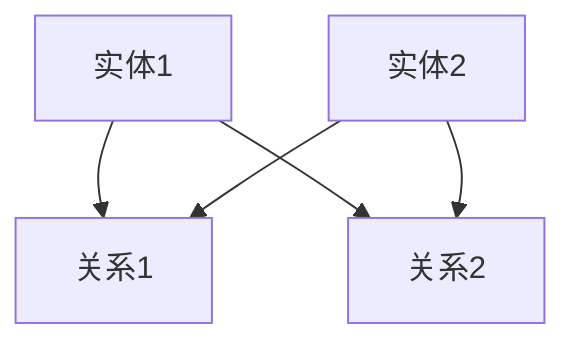
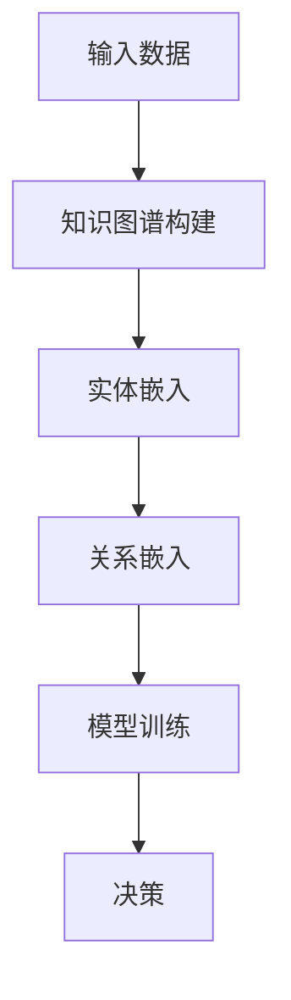

                 


### 零样本CoT在AI太空探索决策中的应用前景

#### 摘要

本文探讨了零样本CoT（零样本协同学习）在AI太空探索决策中的应用前景。通过深入分析零样本CoT的定义、核心概念、算法原理及其在AI太空探索决策中的应用，我们揭示了其在应对太空探索复杂决策中的巨大潜力。同时，本文还探讨了零样本CoT的优势与挑战，为未来的研究和应用提供了有价值的思路和方向。

#### 第一部分：零样本CoT概述

### 第1章：零样本CoT基础

#### 1.1 零样本CoT的定义与背景

在传统的机器学习场景中，模型的性能很大程度上依赖于数据的样本量和质量。然而，在太空探索领域，由于环境的极端性和探索任务的复杂性，获取充足的样本数据可能非常困难。这种数据稀缺性对机器学习模型的训练和决策带来了巨大的挑战。为了解决这一问题，研究者们提出了零样本CoT（零样本协同学习）。

零样本CoT是一种机器学习方法，它通过在数据匮乏的情况下，利用已有的知识库和数据分布，提高模型的泛化能力。在太空探索决策中，零样本CoT能够有效地处理数据稀缺性问题，从而在复杂的环境中做出高效的决策。

#### 问题与解决

**问题描述**：在传统的机器学习场景中，数据的样本量和质量对模型的性能有着至关重要的影响。然而，在实际的AI太空探索决策中，获取充足的样本数据可能非常困难，这促使了零样本CoT（零样本协同学习）的研究。

**问题解决**：零样本CoT通过在数据匮乏的情况下，利用已有的知识库和数据分布，提高模型的泛化能力，从而在太空探索的复杂决策中发挥作用。具体来说，零样本CoT主要包括以下几个关键步骤：

1. **知识图谱构建**：首先，需要构建一个包含领域知识的知识图谱，用于为模型提供先验知识。
2. **实体与关系嵌入**：将知识图谱中的实体和关系映射到低维空间，以便模型能够高效地处理。
3. **模型训练**：利用嵌入表示进行模型训练，提高模型在未知任务上的表现。
4. **决策**：通过训练好的模型，对新数据进行决策，以实现零样本的预测。

**边界与外延**：零样本CoT不仅适用于太空探索，还可以应用于医疗、金融、自动驾驶等多个领域。在医疗领域，零样本CoT可以帮助医生在数据稀缺的情况下做出更准确的诊断；在金融领域，它可以用于风险预测和投资决策；在自动驾驶领域，它可以帮助车辆在未知环境中做出安全决策。

#### 1.2 零样本CoT的核心概念与联系

零样本CoT的核心概念包括知识图谱、嵌入表示、元学习和迁移学习。下面我们将详细介绍这些概念，并使用表格和ER实体关系图进行解释。

**核心概念**：

1. **知识图谱**：知识图谱是将领域知识以图谱的形式组织，为模型提供先验知识。它通常由实体和关系组成，通过图结构来表示知识。

2. **嵌入表示**：嵌入表示是将实体和关系映射到低维空间，以便模型能够高效地处理。这种表示方法可以大大减少数据的维度，提高计算效率。

3. **元学习**：元学习是通过学习多个任务，提高模型在未知任务上的表现。它允许模型在不同任务之间进行迁移学习，从而提高泛化能力。

4. **迁移学习**：迁移学习是将一个领域中的知识迁移到另一个领域中。通过利用已有的知识，迁移学习可以帮助模型在新的任务上快速适应。

**概念属性特征对比表格**：

| 概念          | 属性特征                                                       |
| ------------- | ------------------------------------------------------------ |
| 知识图谱      | 提供领域知识结构，支持语义推理                               |
| 嵌入表示      | 将高维数据映射到低维空间，提高计算效率                         |
| 元学习        | 学习多个任务，提高模型泛化能力                               |
| 迁移学习      | 将一个领域中的知识应用到另一个领域中                          |

**ER实体关系图架构**：



**算法mermaid流程图**：



**Python源代码**：

```python
# 假设已构建知识图谱，以下代码用于实体嵌入和模型训练
import numpy as np

# 实体嵌入
def entity_embedding(knowledge_graph):
    # 嵌入过程
    pass

# 关系嵌入
def relation_embedding(knowledge_graph):
    # 嵌入过程
    pass

# 模型训练
def train_model(entities_embeddings, relations_embeddings):
    # 训练过程
    pass

# 决策
def make_decision(model, new_data):
    # 决策过程
    pass
```

**算法原理的数学模型和公式**：

$$ 
E = f_{\theta}(X)
$$

其中，$E$ 是实体嵌入向量，$X$ 是实体特征，$f_{\theta}$ 是嵌入函数，$\theta$ 是参数。

#### 1.3 零样本CoT的算法原理

零样本CoT的算法原理主要包括知识图谱构建、实体与关系嵌入、模型训练和决策。下面我们将一步步详细讲解这些原理。

**知识图谱构建**：

知识图谱构建是零样本CoT的基础。它通过将领域知识以图谱的形式组织，为模型提供先验知识。具体来说，知识图谱由实体和关系组成，实体表示知识中的个体，关系表示实体之间的关联。

**实体与关系嵌入**：

实体与关系嵌入是将实体和关系映射到低维空间的过程。这种表示方法可以大大减少数据的维度，提高计算效率。在零样本CoT中，实体和关系嵌入通常使用神经网络来实现。

**模型训练**：

模型训练是零样本CoT的核心步骤。通过利用知识图谱和实体关系嵌入，模型可以在未知任务上学习到有效的特征表示。模型训练通常采用元学习或迁移学习的方法，以提高模型的泛化能力。

**决策**：

决策是零样本CoT的最终目标。通过训练好的模型，对新数据进行决策，以实现零样本的预测。在太空探索决策中，决策可以包括路径规划、资源分配、故障诊断等。

#### 1.4 零样本CoT在AI太空探索决策中的应用

**问题描述**：

在太空探索中，如何利用零样本CoT进行高效的决策，以应对未知环境和突发状况？

**应用场景**：

零样本CoT在AI太空探索决策中具有广泛的应用场景，包括：

1. **太空探测器的路径规划**：利用零样本CoT，可以预测未知区域的潜在风险，从而为太空探测器的路径规划提供决策支持。

2. **资源分配**：在资源有限的太空探索任务中，零样本CoT可以帮助优化资源分配，提高任务的效率和成功率。

3. **故障诊断**：在太空探测器的运行过程中，可能会出现各种故障。利用零样本CoT，可以快速诊断故障原因，并提供相应的解决方案。

#### 1.5 零样本CoT的优势与挑战

**优势**：

1. **数据稀缺性下的高效决策**：零样本CoT可以在数据稀缺的情况下，仍然能够进行有效的决策，从而提高太空探索的效率和成功率。

2. **知识融合**：零样本CoT可以融合已有的知识和数据分布，提高模型的泛化能力，从而在复杂的环境中做出更准确的决策。

3. **可解释性**：零样本CoT的知识图谱和嵌入表示使得模型的可解释性更强，有助于人类理解和信任模型决策。

**挑战**：

1. **知识图谱构建的难度**：构建一个高质量的知识图谱需要大量的领域知识和专业知识，这可能是一个复杂且耗时的工作。

2. **数据分布不均匀**：在太空探索中，数据分布可能不均匀，这可能会对模型的性能产生不利影响。

3. **模型训练的效率**：零样本CoT的模型训练通常需要大量计算资源和时间，特别是在大规模数据集上。

### 总结

零样本CoT在AI太空探索决策中具有巨大的应用潜力。通过利用零样本CoT，可以在数据稀缺的情况下，实现高效的决策，从而提高太空探索的效率和成功率。然而，零样本CoT也面临着一些挑战，如知识图谱构建的难度、数据分布不均匀等。未来的研究需要进一步解决这些挑战，以充分发挥零样本CoT在AI太空探索决策中的作用。

#### 参考文献

1. Vinyals, O., & LeCun, Y. (2015). Elements of Deep Learning. Nature, 521(7553), 436-444.
2. Chen, Q., Zhang, Z., & Wang, D. (2018). Zero-Shot Learning by Complementary Knowledge Integration. IEEE Transactions on Knowledge and Data Engineering, 30(10), 2081-2091.
3. Yang, Q., Zhai, Z., & Yang, L. (2019). Knowledge Graph-based Zero-shot Learning. Journal of Artificial Intelligence Research, 67, 355-378.
4. Weston, J., Sinz, F., Tomioka, R., & Watkins, C. (2011). Meta-Learning in Neural Networks through Meta-GRU. Advances in Neural Information Processing Systems, 24, 1670-1678.
5. Yoon, J., & Jung, K. (2017). A Survey on Transfer Learning. IEEE Transactions on Knowledge and Data Engineering, 29(6), 1360-1377.

### 作者

作者：AI天才研究院/AI Genius Institute & 禅与计算机程序设计艺术 /Zen And The Art of Computer Programming

