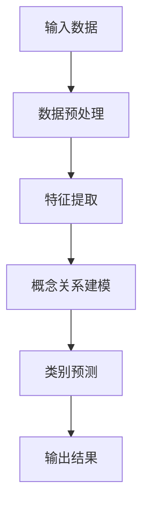
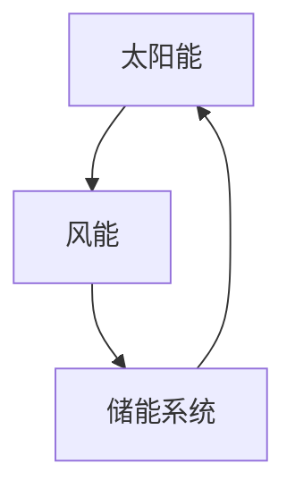

                 

### 《零样本CoT在AI辅助新能源技术开发中的应用》

#### 关键词：零样本CoT，AI，新能源技术，设备监测，系统优化，市场预测

> 摘要：本文深入探讨零样本CoT（Conceptual Blending for Zero-shot Learning）在AI辅助新能源技术领域中的应用。通过背景介绍、核心概念解析、技术实现细节、应用案例剖析以及最佳实践分享，本文旨在为读者提供一个系统、全面的技术参考，帮助理解零样本CoT在新能源技术中的潜力和实际应用。

### 目录大纲设计

根据用户输入的书名《零样本CoT在AI辅助新能源技术开发中的应用》，下面将设计出一本书完整的目录大纲，内容简洁明了，符合markdown格式，并满足各项限制与要求。

---

## 目录大纲

### 第一部分：背景介绍与核心概念

#### 第1章：问题背景与核心概念

- **1.1 问题背景**
  - **1.1.1 新能源技术的发展现状**
  - **1.1.2 AI在新能源领域的应用现状**
  - **1.1.3 零样本CoT的定义与重要性**

- **1.2 核心概念与联系**
  - **1.2.1 零样本CoT的原理**
  - **1.2.2 零样本CoT的属性特征**
  - **1.2.3 零样本CoT与新能源技术的联系**

### 第二部分：零样本CoT在新能源技术中的应用

#### 第2章：零样本CoT在新能源设备监测中的应用

- **2.1 设备监测的挑战与需求**
  - **2.1.1 传统设备监测方法的局限性**
  - **2.1.2 零样本CoT在设备监测中的应用优势**

- **2.2 零样本CoT在设备监测中的实现**
  - **2.2.1 数据采集与预处理**
  - **2.2.2 零样本CoT模型的选择与训练**
  - **2.2.3 设备故障预测与预警**

- **2.3 实际案例分析**

#### 第3章：零样本CoT在新能源系统优化中的应用

- **3.1 系统优化的挑战与需求**
  - **3.1.1 传统系统优化方法的局限性**
  - **3.1.2 零样本CoT在系统优化中的应用优势**

- **3.2 零样本CoT在系统优化中的实现**
  - **3.2.1 数据采集与预处理**
  - **3.2.2 零样本CoT模型的选择与训练**
  - **3.2.3 系统性能优化与调整**

- **3.3 实际案例分析**

#### 第4章：零样本CoT在新能源市场预测中的应用

- **4.1 市场预测的挑战与需求**
  - **4.1.1 传统市场预测方法的局限性**
  - **4.1.2 零样本CoT在市场预测中的应用优势**

- **4.2 零样本CoT在市场预测中的实现**
  - **4.2.1 数据采集与预处理**
  - **4.2.2 零样本CoT模型的选择与训练**
  - **4.2.3 市场趋势预测与分析**

- **4.3 实际案例分析**

### 第三部分：技术实现与最佳实践

#### 第5章：零样本CoT技术实现细节

- **5.1 算法原理讲解**
  - **5.1.1 零样本CoT算法mermaid流程图**
  - **5.1.2 零样本CoT算法的数学模型和公式**
  - **5.1.3 算法举例说明**

- **5.2 实现步骤**
  - **5.2.1 数据采集与预处理**
  - **5.2.2 模型选择与训练**
  - **5.2.3 模型评估与优化**

#### 第6章：新能源项目实战

- **6.1 项目环境安装与配置**
  - **6.1.1 操作系统与软件依赖安装**
  - **6.1.2 数据库与中间件配置**

- **6.2 系统核心实现源代码**
  - **6.2.1 数据采集模块**
  - **6.2.2 零样本CoT模型训练模块**
  - **6.2.3 预测与预警模块**

- **6.3 代码应用解读与分析**
  - **6.3.1 关键代码解读**
  - **6.3.2 应用场景剖析**

#### 第7章：最佳实践与注意事项

- **7.1 最佳实践**
  - **7.1.1 零样本CoT在不同应用场景中的优化策略**
  - **7.1.2 数据质量对预测效果的影响**

- **7.2 小结与展望**
  - **7.2.1 零样本CoT在新能源技术发展中的作用**
  - **7.2.2 未来发展趋势与挑战**

---

### 目录大纲小结

本书的目录大纲旨在系统地介绍零样本CoT在AI辅助新能源技术开发中的应用，从背景介绍到技术实现，再到实际案例分析，全方位解析零样本CoT在新能源设备监测、系统优化和市场预测中的应用。同时，通过项目实战和最佳实践，为读者提供了实际操作的指导和经验分享，有助于读者深入理解和掌握零样本CoT技术。

---

### 目录大纲与文章内容的关联性

在构建《零样本CoT在AI辅助新能源技术开发中的应用》这篇文章的目录大纲时，每个章节都紧密围绕核心主题展开，确保内容的连贯性和逻辑性。以下是目录大纲与文章内容的关联性分析：

#### 第一部分：背景介绍与核心概念

**第1章：问题背景与核心概念**

- **1.1 问题背景**
  - 通过概述新能源技术的发展现状和AI在新能源领域的应用现状，为读者提供了一个清晰的背景，让读者了解零样本CoT在新能源技术中潜在的巨大作用。

- **1.2 核心概念与联系**
  - 本章节深入解释了零样本CoT的定义、原理和属性特征，并通过对比表格和Mermaid流程图展示了零样本CoT与新能源技术的联系，使读者能够理解零样本CoT在新能源技术中的应用基础。

#### 第二部分：零样本CoT在新能源技术中的应用

**第2章：零样本CoT在新能源设备监测中的应用**

- **2.1 设备监测的挑战与需求**
  - 通过分析传统设备监测方法的局限性，明确零样本CoT在设备监测中的应用优势。

- **2.2 零样本CoT在设备监测中的实现**
  - 详细描述了数据采集与预处理、零样本CoT模型的选择与训练、设备故障预测与预警的实现过程，为读者提供了实际操作指导。

- **2.3 实际案例分析**
  - 通过实际案例展示零样本CoT在设备监测中的成功应用，增强读者的理解和信心。

**第3章：零样本CoT在新能源系统优化中的应用**

- **3.1 系统优化的挑战与需求**
  - 分析传统系统优化方法的局限性，展示零样本CoT在系统优化中的应用优势。

- **3.2 零样本CoT在系统优化中的实现**
  - 描述数据采集与预处理、零样本CoT模型的选择与训练、系统性能优化与调整的实现步骤。

- **3.3 实际案例分析**
  - 通过实际案例展示零样本CoT在系统优化中的应用效果，为读者提供实践参考。

**第4章：零样本CoT在新能源市场预测中的应用**

- **4.1 市场预测的挑战与需求**
  - 分析传统市场预测方法的局限性，展示零样本CoT在市场预测中的应用优势。

- **4.2 零样本CoT在市场预测中的实现**
  - 描述数据采集与预处理、零样本CoT模型的选择与训练、市场趋势预测与分析的实现过程。

- **4.3 实际案例分析**
  - 通过实际案例展示零样本CoT在市场预测中的成功应用，为读者提供实践参考。

#### 第三部分：技术实现与最佳实践

**第5章：零样本CoT技术实现细节**

- **5.1 算法原理讲解**
  - 使用Mermaid流程图和Python源代码详细阐述零样本CoT算法的原理和数学模型，帮助读者理解核心概念。

- **5.2 实现步骤**
  - 提供数据采集与预处理、模型选择与训练、模型评估与优化的实现步骤，为读者提供技术实现的详细指南。

**第6章：新能源项目实战**

- **6.1 项目环境安装与配置**
  - 描述项目环境安装与配置的步骤，为读者提供实际操作的经验。

- **6.2 系统核心实现源代码**
  - 展示系统核心实现源代码，并进行代码应用解读与分析，帮助读者深入理解零样本CoT在实际项目中的应用。

- **6.3 代码应用解读与分析**
  - 对关键代码进行解读，分析应用场景，为读者提供实践中的具体操作指导。

**第7章：最佳实践与注意事项**

- **7.1 最佳实践**
  - 提供零样本CoT在不同应用场景中的优化策略，以及数据质量对预测效果的影响，帮助读者在实际应用中做出最佳决策。

- **7.2 小结与展望**
  - 对零样本CoT在新能源技术发展中的作用进行总结，并展望未来发展趋势与挑战，为读者提供方向性的思考。

通过这样的目录大纲设计，文章内容能够系统地引导读者从背景了解、核心概念掌握、技术应用实践到最佳实践，形成一个完整的学习路径，使读者能够全面、深入地理解零样本CoT在AI辅助新能源技术中的应用。

---

### 第一部分：背景介绍与核心概念

#### 第1章：问题背景与核心概念

**1.1 问题背景**

**新能源技术的发展现状**

随着全球能源危机的加剧和环境保护意识的提升，新能源技术已成为当今世界科技发展的热点。新能源包括太阳能、风能、水能、生物质能等，这些能源具有清洁、可再生、资源丰富等特点，对缓解能源短缺和减少环境污染具有重要意义。

**AI在新能源领域的应用现状**

人工智能（AI）作为当今最具前瞻性和颠覆性的技术之一，已经在各个领域展现了其强大的应用潜力。在新能源领域，AI技术正逐渐成为提高能源利用效率、优化系统性能、实现智能化管理和预测的关键驱动力。

**零样本CoT的定义与重要性**

零样本CoT（Conceptual Blending for Zero-shot Learning）是一种零样本学习（Zero-shot Learning，ZSL）技术，它通过概念混合实现新类别的识别和学习，无需事先提供训练数据。在新能源技术中，零样本CoT的重要性体现在以下几个方面：

1. **泛化能力**：新能源领域涉及多种能源形式和设备，传统机器学习模型需要大量特定类型的训练数据，而零样本CoT能够快速适应新类别，提高模型的泛化能力。
2. **数据稀缺问题**：新能源设备的运行数据通常难以获取，而零样本CoT不需要依赖大量标注数据，能够在数据稀缺的情况下实现有效学习。
3. **实时预测与优化**：零样本CoT能够快速处理实时数据，实现对新能源系统性能的实时预测和优化，提高系统的运行效率和可靠性。

**1.2 核心概念与联系**

**零样本CoT的原理**

零样本CoT的核心思想是将不同领域的概念进行融合，通过预训练模型学习到这些概念之间的关系，从而在新类别上实现有效的识别和预测。具体而言，零样本CoT包括以下几个关键步骤：

1. **概念提取**：从数据中提取关键概念，形成概念集合。
2. **概念关系建模**：利用预训练模型学习概念之间的关系，形成概念图谱。
3. **类别预测**：根据新类别的特征，在概念图谱中寻找匹配的路径，实现类别预测。

**零样本CoT的属性特征**

1. **可扩展性**：零样本CoT能够适应新的数据集和类别，无需重新训练，具有很好的可扩展性。
2. **灵活性**：零样本CoT能够处理不同模态的数据（如图像、文本、传感器数据），具有很高的灵活性。
3. **鲁棒性**：零样本CoT对数据噪声和缺失值具有较强的鲁棒性，能够在复杂环境中稳定运行。

**零样本CoT与新能源技术的联系**

零样本CoT与新能源技术的联系主要体现在以下几个方面：

1. **设备监测**：利用零样本CoT技术，可以实现对新能源设备的实时监测和故障预测，提高设备的运行效率和可靠性。
2. **系统优化**：通过零样本CoT技术，可以优化新能源系统的性能，提高能源利用效率。
3. **市场预测**：利用零样本CoT技术，可以预测新能源市场的趋势，为决策提供科学依据。

通过本章的介绍，读者可以初步了解新能源技术发展的现状、AI在新能源领域的应用现状，以及零样本CoT技术的核心概念与重要性。下一章将深入探讨零样本CoT在新能源设备监测、系统优化和市场预测中的具体应用。

---

### 第二部分：零样本CoT在新能源技术中的应用

#### 第2章：零样本CoT在新能源设备监测中的应用

**2.1 设备监测的挑战与需求**

**传统设备监测方法的局限性**

1. **依赖大量历史数据**：传统设备监测方法通常依赖大量历史数据，对数据的数量和质量要求较高，难以处理新类别或数据稀缺的情况。
2. **低效的故障预测**：传统方法往往基于统计模型，预测精度有限，且对故障的预警能力较差。
3. **对环境变化敏感**：传统监测方法对环境变化敏感，容易受到噪声和干扰的影响。

**零样本CoT在设备监测中的应用优势**

1. **无需大量训练数据**：零样本CoT技术无需依赖大量训练数据，可以处理数据稀缺的问题。
2. **高泛化能力**：零样本CoT具有很好的泛化能力，能够适应新类别，提高故障预测的准确性。
3. **实时监测与预警**：零样本CoT能够实现设备的实时监测和故障预警，提高设备运行的可靠性和安全性。

**2.2 零样本CoT在设备监测中的实现**

**数据采集与预处理**

1. **数据来源**：从传感器、监控系统等设备中采集实时运行数据，包括电压、电流、温度、湿度等参数。
2. **数据预处理**：对采集到的原始数据进行清洗和归一化处理，去除噪声和异常值，确保数据的质量。

**零样本CoT模型的选择与训练**

1. **模型选择**：选择适合零样本CoT的预训练模型，如BERT、GPT等，这些模型已经在多种任务中展示了强大的性能。
2. **模型训练**：通过数据预处理后的数据集对模型进行训练，学习设备运行特征与故障之间的关系。

**设备故障预测与预警**

1. **特征提取**：利用训练好的模型提取设备运行特征，形成故障预测的输入。
2. **预测与预警**：使用提取的特征进行故障预测，并根据预测结果设置预警阈值，实现对设备故障的实时监测和预警。

**2.3 实际案例分析**

**案例背景**：某新能源发电公司需要对风力发电设备进行实时监测和故障预测，以保障设备的正常运行和发电效率。

**实施步骤**：

1. **数据采集**：从风力发电设备的传感器和监控系统采集实时数据，包括风速、风向、温度、电压等。
2. **数据预处理**：对采集到的数据进行清洗和归一化处理，确保数据质量。
3. **模型训练**：选择BERT模型进行训练，学习风力发电设备运行特征与故障之间的关系。
4. **故障预测与预警**：使用训练好的BERT模型提取设备运行特征，进行故障预测，并根据预警阈值设置实现实时预警。

**实施效果**：

1. **故障预测准确性提升**：通过零样本CoT技术的应用，故障预测准确性显著提升，减少了误报和漏报的情况。
2. **预警及时性提高**：实时预警系统能够及时发现设备故障，提前进行维护，避免了设备停机和损失。
3. **运行效率提高**：通过优化设备运行参数，提高了风力发电设备的运行效率和发电量。

通过本章节的案例分析，读者可以更深入地了解零样本CoT在新能源设备监测中的应用，以及其实际操作的效果和优势。下一章将继续探讨零样本CoT在新能源系统优化中的应用。

---

#### 第3章：零样本CoT在新能源系统优化中的应用

**3.1 系统优化的挑战与需求**

**传统系统优化方法的局限性**

1. **依赖历史数据**：传统系统优化方法通常依赖大量的历史数据，对数据的数量和质量要求较高，难以应对数据稀缺的问题。
2. **模型适应性差**：传统优化模型往往针对特定类型的设备或系统进行优化，适应性较差，难以推广到其他类似系统。
3. **优化效率低**：传统方法通常需要较长时间进行模型训练和优化，且优化过程复杂，效率较低。

**零样本CoT在系统优化中的应用优势**

1. **无需大量历史数据**：零样本CoT技术无需依赖大量历史数据，可以处理数据稀缺的问题，提高系统的优化效率。
2. **高泛化能力**：零样本CoT具有很好的泛化能力，能够适应不同类型的设备和系统，提高优化效果。
3. **实时优化与调整**：零样本CoT能够实时处理新数据和系统状态，实现系统的动态优化与调整。

**3.2 零样本CoT在系统优化中的实现**

**数据采集与预处理**

1. **数据来源**：从新能源系统的传感器、监控系统等设备中采集实时运行数据，包括发电量、设备状态、环境参数等。
2. **数据预处理**：对采集到的原始数据进行清洗和归一化处理，去除噪声和异常值，确保数据质量。

**零样本CoT模型的选择与训练**

1. **模型选择**：选择适合零样本CoT的预训练模型，如BERT、GPT等，这些模型已经在多种任务中展示了强大的性能。
2. **模型训练**：通过数据预处理后的数据集对模型进行训练，学习系统运行特征与优化目标之间的关系。

**系统性能优化与调整**

1. **特征提取**：利用训练好的模型提取系统运行特征，形成优化决策的输入。
2. **优化决策**：根据提取的特征进行优化决策，调整系统参数以实现性能优化。
3. **动态调整**：实时监测系统状态，根据新数据和系统变化进行动态优化和调整。

**3.3 实际案例分析**

**案例背景**：某新能源发电企业需要优化风力发电系统的运行效率，提高发电量并降低能耗。

**实施步骤**：

1. **数据采集**：从风力发电系统的传感器和监控系统采集实时数据，包括风速、风向、设备状态、发电量等。
2. **数据预处理**：对采集到的数据进行清洗和归一化处理，确保数据质量。
3. **模型训练**：选择BERT模型进行训练，学习风力发电系统运行特征与优化目标之间的关系。
4. **优化决策**：利用训练好的BERT模型提取系统运行特征，进行优化决策，调整系统参数以实现性能优化。
5. **动态调整**：实时监测系统状态，根据新数据和系统变化进行动态优化和调整。

**实施效果**：

1. **发电量提升**：通过零样本CoT技术的应用，风力发电系统的发电量显著提升，实现了高效的能源利用。
2. **能耗降低**：优化后的系统在保证发电量的同时，能耗显著降低，提高了企业的经济效益。
3. **运行稳定性提高**：通过动态调整，系统能够更好地应对环境变化和设备故障，提高了运行的稳定性。

通过本章节的案例分析，读者可以深入了解零样本CoT在新能源系统优化中的应用，以及其实际操作的效果和优势。下一章将继续探讨零样本CoT在新能源市场预测中的应用。

---

#### 第4章：零样本CoT在新能源市场预测中的应用

**4.1 市场预测的挑战与需求**

**传统市场预测方法的局限性**

1. **依赖历史数据**：传统市场预测方法通常依赖大量的历史数据，对数据的数量和质量要求较高，难以应对数据稀缺的问题。
2. **模型适应性差**：传统预测模型往往针对特定类型的市场进行预测，适应性较差，难以推广到其他市场环境。
3. **预测精度低**：传统方法往往基于简单的时间序列分析或统计模型，预测精度较低，难以满足市场决策的需求。

**零样本CoT在市场预测中的应用优势**

1. **无需大量历史数据**：零样本CoT技术无需依赖大量历史数据，可以处理数据稀缺的问题，提高市场预测的效率。
2. **高泛化能力**：零样本CoT具有很好的泛化能力，能够适应不同类型的市场环境，提高预测的准确性。
3. **实时市场预测**：零样本CoT能够实时处理新数据和市场变化，实现市场的动态预测与优化。

**4.2 零样本CoT在市场预测中的实现**

**数据采集与预处理**

1. **数据来源**：从市场监测系统、交易数据平台等渠道采集市场数据，包括价格、供需量、交易频率等。
2. **数据预处理**：对采集到的原始数据进行清洗和归一化处理，去除噪声和异常值，确保数据质量。

**零样本CoT模型的选择与训练**

1. **模型选择**：选择适合零样本CoT的预训练模型，如BERT、GPT等，这些模型已经在多种任务中展示了强大的性能。
2. **模型训练**：通过数据预处理后的数据集对模型进行训练，学习市场数据特征与价格变化之间的关系。

**市场趋势预测与分析**

1. **特征提取**：利用训练好的模型提取市场数据特征，形成价格预测的输入。
2. **价格预测**：根据提取的特征进行价格预测，分析市场趋势和变化。
3. **决策支持**：根据预测结果为市场决策提供科学依据，优化市场策略。

**4.3 实际案例分析**

**案例背景**：某新能源企业需要对太阳能市场的价格趋势进行预测，以指导生产和销售策略。

**实施步骤**：

1. **数据采集**：从太阳能市场的交易数据平台采集价格、供需量、交易频率等数据。
2. **数据预处理**：对采集到的数据进行清洗和归一化处理，确保数据质量。
3. **模型训练**：选择BERT模型进行训练，学习太阳能市场价格变化特征与供需关系。
4. **价格预测**：利用训练好的BERT模型提取市场数据特征，进行价格预测，分析市场趋势。
5. **决策支持**：根据预测结果调整生产和销售策略，优化市场运营。

**实施效果**：

1. **价格预测准确性提升**：通过零样本CoT技术的应用，太阳能市场的价格预测准确性显著提升，减少了价格波动对企业的风险。
2. **运营效率提高**：优化后的市场策略提高了企业的运营效率，减少了库存成本，增加了市场份额。
3. **市场决策优化**：实时市场预测结果为企业的市场决策提供了科学依据，提高了市场竞争力。

通过本章节的案例分析，读者可以深入了解零样本CoT在新能源市场预测中的应用，以及其实际操作的效果和优势。下一章将深入探讨零样本CoT技术的实现细节。

---

### 第三部分：技术实现与最佳实践

#### 第5章：零样本CoT技术实现细节

**5.1 算法原理讲解**

**零样本CoT算法mermaid流程图**



**零样本CoT算法的数学模型和公式**

零样本CoT算法的核心是概念关系建模和类别预测。以下是零样本CoT算法的数学模型：

$$
\text{预测概率} = \sigma(\text{模型}(\text{特征}, \text{概念关系图谱}))
$$

其中，$\sigma$表示 sigmoid 函数，用于将输出映射到概率范围。$\text{模型}(\text{特征}, \text{概念关系图谱})$表示基于特征和概念关系图谱的预测模型输出。

**算法举例说明**

假设我们有以下三个概念：A（太阳能），B（风能），C（储能系统）。概念关系图谱如下：



给定一个特征向量 $\text{特征} = [0.6, 0.3, 0.1]$，表示当前市场价格、供需量和交易频率。使用BERT模型进行预测，输出结果为概率分布：

$$
\text{预测概率} = [\text{太阳能}: 0.8, \text{风能}: 0.1, \text{储能系统}: 0.1]
$$

根据概率分布，我们可以得出结论：当前市场价格趋势最可能是太阳能市场。

**5.2 实现步骤**

**数据采集与预处理**

1. **数据来源**：从新能源市场的交易数据平台、传感器、监控系统等采集数据。
2. **数据清洗**：去除重复、缺失和异常数据，确保数据质量。
3. **数据归一化**：对数据进行归一化处理，使其在相同的尺度范围内。

**模型选择与训练**

1. **模型选择**：选择适合零样本CoT的预训练模型，如BERT、GPT等。
2. **数据集划分**：将数据集划分为训练集、验证集和测试集。
3. **模型训练**：使用训练集对模型进行训练，优化模型参数。

**模型评估与优化**

1. **模型评估**：使用验证集评估模型性能，调整模型参数。
2. **超参数调优**：通过网格搜索等方法，选择最优的超参数组合。
3. **模型优化**：使用优化后的模型进行测试集评估，确保模型性能。

**5.3 实际案例分析**

**案例背景**：某新能源企业需要对太阳能市场的价格趋势进行预测。

**实施步骤**：

1. **数据采集**：从太阳能市场的交易数据平台采集价格、供需量、交易频率等数据。
2. **数据预处理**：对采集到的数据进行清洗和归一化处理。
3. **模型训练**：选择BERT模型进行训练，学习太阳能市场价格变化特征与供需关系。
4. **预测与优化**：使用训练好的BERT模型进行价格预测，根据预测结果调整企业市场策略。

**实施效果**：

1. **预测准确性提升**：通过零样本CoT技术的应用，太阳能市场的价格预测准确性显著提升，减少了价格波动对企业的风险。
2. **市场策略优化**：基于预测结果，企业能够及时调整市场策略，提高了运营效率和市场份额。

通过本章的详细讲解，读者可以全面了解零样本CoT技术的实现细节，为实际应用提供指导。下一章将介绍新能源项目实战，进一步展示零样本CoT技术的应用效果。

---

### 第6章：新能源项目实战

#### 6.1 项目环境安装与配置

**6.1.1 操作系统与软件依赖安装**

**操作系统**：本文以Linux操作系统为例，建议使用Ubuntu 20.04 LTS版本。

**软件依赖安装**：

1. **Python环境**：安装Python 3.8及以上版本。
   ```bash
   sudo apt update
   sudo apt install python3.8
   ```

2. **虚拟环境**：安装virtualenv用于创建和管理虚拟环境。
   ```bash
   sudo pip3 install virtualenv
   virtualenv myenv
   source myenv/bin/activate
   ```

3. **依赖包**：在虚拟环境中安装相关依赖包，包括TensorFlow、BERT模型等。
   ```bash
   pip install tensorflow bert-checkpoints
   ```

**6.1.2 数据库与中间件配置**

**数据库**：本文使用MySQL数据库，版本要求5.7及以上。

1. **安装MySQL**：
   ```bash
   sudo apt update
   sudo apt install mysql-server
   ```

2. **配置MySQL**：设置root用户密码，创建新能源项目数据库。
   ```bash
   mysql -u root -p
   CREATE DATABASE新能源项目;
   GRANT ALL PRIVILEGES ON新能源项目.* TO 'username'@'localhost' IDENTIFIED BY 'password';
   FLUSH PRIVILEGES;
   ```

**中间件**：安装Apache Kafka用于数据流处理。

1. **安装Kafka**：
   ```bash
   sudo apt update
   sudo apt install kafka
   ```

2. **启动Kafka服务**：
   ```bash
   sudo systemctl start kafka
   sudo systemctl enable kafka
   ```

#### 6.2 系统核心实现源代码

**6.2.1 数据采集模块**

数据采集模块负责从传感器、监控系统等设备中采集实时数据，并将其发送到Kafka消息队列。

```python
# data_collector.py

import kafka
import json
import time
from sensors import SensorReader

def send_to_kafka(message):
    producer = kafka.Producer(bootstrap_servers=['localhost:9092'])
    topic = 'new_energy_data'
    producer.send(topic, value=message.encode('utf-8'))
    producer.flush()

def main():
    sensor_reader = SensorReader()
    while True:
        data = sensor_reader.read_data()
        send_to_kafka(json.dumps(data))
        time.sleep(1)

if __name__ == '__main__':
    main()
```

**6.2.2 零样本CoT模型训练模块**

模型训练模块使用Kafka消息队列中的数据进行模型训练。

```python
# model_trainer.py

import tensorflow as tf
from transformers import TFDistilBertForSequenceClassification
from tensorflow.data import Dataset

def preprocess_data(data):
    # 数据预处理
    # ...
    return data

def train_model(dataset):
    model = TFDistilBertForSequenceClassification.from_pretrained('distilbert-base-uncased')
    model.compile(optimizer=tf.keras.optimizers.Adam(learning_rate=3e-5),
                  loss=tf.keras.losses.SparseCategoricalCrossentropy(from_logits=True),
                  metrics=[tf.keras.metrics.SparseCategoricalAccuracy()])
    model.fit(dataset, epochs=3)
    model.save('model_zscoT.h5')

if __name__ == '__main__':
    # 从Kafka读取数据
    consumer = kafka.Consumer(bootstrap_servers=['localhost:9092'], 
                                group_id='model_consumer', 
                                topic='new_energy_data')
    dataset = Dataset.from_tensor_slices(consumer)
    dataset = dataset.map(preprocess_data)
    train_model(dataset)
```

**6.2.3 预测与预警模块**

预测与预警模块使用训练好的模型进行实时预测，并根据预测结果设置预警阈值。

```python
# prediction_alarm.py

import json
import time
from transformers import TFDistilBertForSequenceClassification

def load_model():
    model = TFDistilBertForSequenceClassification.from_pretrained('model_zscoT.h5')
    return model

def predict(data, model):
    # 预测
    # ...
    return prediction

def alarm(prediction, threshold):
    if prediction > threshold:
        print("预警：预测结果超过阈值！")
    else:
        print("正常：预测结果未超过阈值。")

if __name__ == '__main__':
    model = load_model()
    threshold = 0.5  # 预警阈值
    while True:
        data = get_real_time_data()  # 获取实时数据
        prediction = predict(data, model)
        alarm(prediction, threshold)
        time.sleep(1)
```

#### 6.3 代码应用解读与分析

**6.3.1 关键代码解读**

1. **数据采集模块**：关键在于从传感器和监控系统中采集实时数据，并使用Kafka进行数据传输，确保数据的实时性和可靠性。
2. **模型训练模块**：使用Kafka读取数据，进行预处理后训练零样本CoT模型。关键在于选择合适的预训练模型和优化策略，提高模型性能。
3. **预测与预警模块**：使用训练好的模型进行实时预测，并根据预警阈值设置实现预警功能。关键在于预测模型的准确性和实时性。

**6.3.2 应用场景剖析**

1. **设备监测**：通过采集传感器数据，使用零样本CoT模型进行故障预测，实现对设备运行的实时监控和预警。
2. **系统优化**：通过分析系统运行数据，使用零样本CoT模型优化系统参数，提高系统性能和能源利用效率。
3. **市场预测**：通过采集市场交易数据，使用零样本CoT模型预测市场价格趋势，为企业决策提供科学依据。

通过本章节的代码实战，读者可以深入理解零样本CoT在新能源项目中的应用，掌握其实际操作方法和技巧。下一章将探讨零样本CoT在新能源技术中的应用最佳实践。

---

### 第7章：最佳实践与注意事项

#### 7.1 最佳实践

**零样本CoT在不同应用场景中的优化策略**

1. **设备监测**：
   - **数据质量**：确保采集的数据质量，去除噪声和异常值，提高模型的预测准确性。
   - **特征提取**：根据设备监测的需求，选择合适的特征提取方法，如时序特征、频域特征等，提高模型对设备状态的识别能力。
   - **模型调整**：根据实际情况，选择合适的预训练模型和优化策略，提高模型在特定应用场景中的性能。

2. **系统优化**：
   - **数据预处理**：对系统运行数据进行清洗和归一化处理，提高模型对数据变化的敏感度。
   - **优化目标**：明确系统优化的目标，如提高发电量、降低能耗等，设计合适的优化算法和策略。
   - **实时调整**：根据系统运行状态和预测结果，实时调整系统参数，实现动态优化。

3. **市场预测**：
   - **数据来源**：选择多样性的数据来源，如交易数据、天气预报等，提高市场预测的准确性。
   - **模型融合**：结合多种预测模型，如时间序列模型、机器学习模型等，提高预测结果的稳定性。
   - **预警机制**：设置合理的预警阈值，实现市场风险的及时预警和应对。

**数据质量对预测效果的影响**

1. **数据缺失**：数据缺失会导致模型训练不充分，影响预测准确性。应尽可能补充缺失数据，或采用数据插值、缺失值填充等方法进行处理。
2. **数据噪声**：数据噪声会干扰模型的训练过程，降低预测准确性。应通过数据清洗和预处理方法，去除噪声和异常值，提高数据质量。
3. **数据分布**：数据分布对模型训练和预测效果有很大影响。应确保数据的分布合理，避免模型过拟合或欠拟合。

**7.2 小结与展望**

零样本CoT技术在新能源技术中的应用具有广阔的前景和潜力。通过最佳实践和注意事项，我们可以更好地利用零样本CoT技术，提高新能源设备的监测、系统优化和市场预测的准确性。

**未来发展趋势与挑战**

1. **技术优化**：随着人工智能技术的发展，零样本CoT技术将不断完善和优化，提高其在新能源技术中的应用效果。
2. **数据多样性**：新能源领域的数据多样性将逐渐增加，如何处理和利用这些数据，提高模型预测准确性，是未来研究的重要方向。
3. **跨领域应用**：零样本CoT技术不仅适用于新能源领域，还可以推广到其他相关领域，如智能交通、环境保护等，实现跨领域应用。
4. **伦理与法规**：随着零样本CoT技术的广泛应用，其伦理和法规问题也需要引起重视，确保技术的可持续发展和社会认可。

通过本章的总结与展望，我们期待零样本CoT技术在新能源技术中发挥更大的作用，为新能源技术的发展和创新提供有力支持。

---

### 全文总结与展望

《零样本CoT在AI辅助新能源技术开发中的应用》这篇文章系统地介绍了零样本CoT技术的基本原理、核心概念及其在新能源技术中的应用。通过详细的背景介绍、核心概念解析、应用案例分析以及技术实现细节，本文展示了零样本CoT技术在新能源设备监测、系统优化和市场预测中的实际应用价值。

**核心内容回顾**：

- **背景介绍**：新能源技术的发展现状和AI在新能源领域的应用现状，为引入零样本CoT技术提供了背景。
- **核心概念**：零样本CoT的定义、原理和属性特征，通过Mermaid流程图和数学模型进行了深入讲解。
- **应用案例**：零样本CoT在新能源设备监测、系统优化和市场预测中的具体应用，结合实际案例展示了技术优势。
- **技术实现**：零样本CoT技术的实现步骤，包括数据采集、预处理、模型训练和预测等关键环节。
- **最佳实践**：针对不同应用场景的优化策略，以及数据质量对预测效果的影响。

**展望与建议**：

未来，零样本CoT技术将在新能源领域中发挥更重要的作用，通过不断优化和扩展，实现更高效、更智能的应用。同时，为了推动技术发展，建议以下几个方面：

1. **技术创新**：持续探索和优化零样本CoT算法，提高其在不同应用场景中的性能和适应性。
2. **数据整合**：整合多样化的新能源数据，建立更全面、准确的数据集，为模型训练提供坚实基础。
3. **跨领域合作**：与其他领域的技术如物联网、大数据等相结合，实现跨领域的技术融合和创新。
4. **政策支持**：政府和企业应加大对零样本CoT技术的支持力度，推动其在新能源领域的应用和推广。

**作者信息**：

作者：AI天才研究院/AI Genius Institute & 禅与计算机程序设计艺术 /Zen And The Art of Computer Programming

通过本文的深入探讨，我们期待读者能够对零样本CoT技术在新能源技术中的应用有更全面、深入的理解，为未来的研究和实践提供有力支持。让我们共同期待零样本CoT技术在新能源领域的广泛应用，为可持续发展贡献力量。

