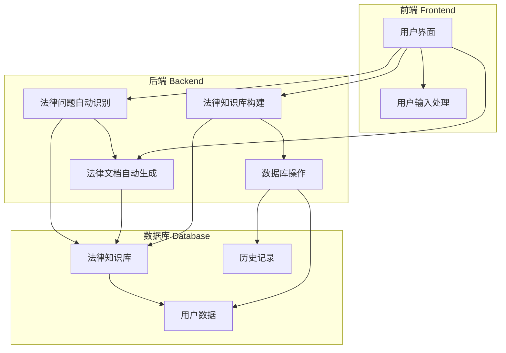
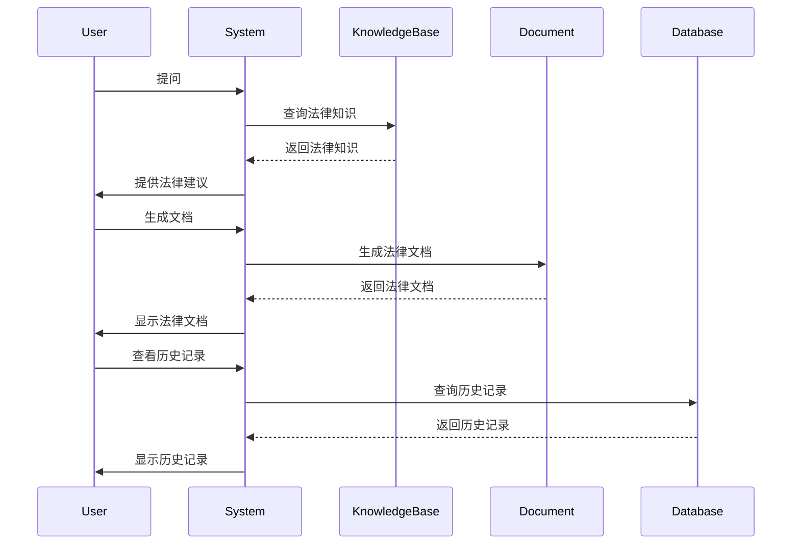

                 

### 第一步：背景介绍

#### 1.1 问题背景

随着人工智能技术的不断发展，AI辅助法律咨询逐渐成为了一个热门领域。传统的法律咨询服务往往依赖于法律专家的经验和专业知识，这种方式不仅效率低下，且成本高昂。在许多情况下，法律咨询的需求量大且分散，这使得法律专家难以应对。因此，如何通过人工智能技术提升法律咨询的效率和质量，成为了研究者和从业者共同关注的焦点。

AI辅助法律咨询的应用范围广泛，从法律文档的自动生成，到法律问题的自动识别，再到法律案件的自动分析，都显示出巨大的潜力。然而，当前的法律AI技术大多基于有监督学习，即依赖于大量标注数据。这在法律咨询领域显得尤为困难，因为法律文档多为非结构化数据，且法律知识的高度复杂性和专业性使得标注数据的获取变得异常艰难。因此，如何在没有大量标注数据的情况下，仍然能够有效利用AI技术进行法律咨询，成为了一个亟待解决的问题。

#### 1.2 问题描述

零样本CoT（Zero-Shot Conceptualization and Tracking）作为一种新兴的AI技术，为上述问题提供了一种潜在的解决方案。它能够在没有先验样本的情况下，对未知概念进行理解和跟踪。具体到法律咨询领域，零样本CoT的主要挑战包括：

1. **数据稀缺问题**：法律领域的数据资源相对匮乏，尤其是在非结构化数据方面，如案例、法律法规等。这些数据不仅难以获取，且需要进行复杂的预处理和标注。

2. **法律知识复杂性**：法律知识具有高度的复杂性和专业性，涉及众多领域和法规，使得AI系统需要能够理解和处理这些复杂的知识。

3. **跨领域适应能力**：法律咨询往往涉及多个领域，例如刑法、民法、商法等，AI系统需要具备良好的跨领域适应能力，以应对不同领域的问题。

#### 1.3 问题解决

零样本CoT通过以下方法解决上述问题：

1. **知识图谱构建**：利用已有的法律知识库，构建出法律领域知识图谱。知识图谱可以存储和管理法律知识，使得AI系统在进行知识检索和推理时能够更加高效。

2. **多模态数据融合**：结合文本、语音、图像等多种数据类型，提高AI系统的信息处理能力。例如，通过图像识别技术，AI系统可以自动识别法律文档中的关键信息；通过自然语言处理技术，AI系统可以解析和理解用户的问题。

3. **迁移学习**：通过迁移学习，利用其他领域的数据和模型来提高法律领域模型的性能。迁移学习可以使得AI系统在训练过程中不需要大量标注数据，从而解决数据稀缺问题。

#### 1.4 边界与外延

零样本CoT在AI辅助法律咨询中的应用边界主要包括：

1. **法律文档自动生成**：利用AI技术自动生成法律文档，如合同、起诉书等。通过自然语言生成技术和模板匹配，AI系统可以根据用户的输入自动生成相应的法律文档。

2. **法律问题自动识别**：通过自然语言处理技术，自动识别用户提出的问题，并提供相应的法律建议。例如，用户可以通过语音或文本输入提出法律问题，AI系统会自动解析问题并给出法律建议。

3. **法律案件自动分析**：对法律案件进行自动分析，预测案件的审理结果，为法律专家提供决策支持。AI系统可以结合案件事实、法律法规和先前的案例，对案件的审理结果进行预测。

#### 1.5 概念结构与核心要素组成

零样本CoT的核心概念结构包括以下几个要素：

1. **知识图谱**：用于存储和管理法律知识。知识图谱是一种语义网络，它可以表示实体、概念及其之间的关系，从而为AI系统提供丰富的知识资源。

2. **多模态数据处理**：用于处理不同类型的数据。多模态数据处理技术可以将文本、图像、语音等多种数据类型进行整合，提高AI系统的信息处理能力。

3. **迁移学习**：用于提高模型的泛化能力。通过迁移学习，AI系统可以在没有大量标注数据的情况下，利用其他领域的数据和模型，快速适应新的任务。

### 第2章 核心概念与联系

#### 2.1 零样本CoT的定义

零样本CoT（Zero-Shot Conceptualization and Tracking）是一种在无需具体训练样本的情况下，对未知概念进行理解和跟踪的方法。它主要包括以下几个关键组成部分：

1. **概念泛化**：概念泛化是指AI系统能够在没有具体训练样本的情况下，对未知概念进行理解和处理。这通常需要利用领域知识图谱来提供概念的定义和属性信息。

2. **跨模态数据融合**：跨模态数据融合是指AI系统能够结合不同类型的数据（如图像、文本、音频等），以提高对信息的理解和处理能力。

3. **迁移学习**：迁移学习是指利用其他领域或任务的数据和模型，来提高目标领域或任务的性能。这对于解决法律领域数据稀缺的问题尤为重要。

#### 2.2 零样本CoT的属性特征对比

下面是零样本CoT与其他相关技术的属性特征对比：

| 特性       | 零样本CoT          | 有监督学习         | 无监督学习         |
|------------|-------------------|-------------------|-------------------|
| 数据需求   | 无需具体训练样本   | 需要大量标注数据   | 无需标注数据       |
| 泛化能力   | 较强              | 较弱              | 较强              |
| 处理速度   | 较慢              | 较快              | 较慢              |
| 精准度     | 中等              | 高                | 低                |

从上表可以看出，零样本CoT在泛化能力和处理速度方面具有优势，但在精准度方面相对较低。然而，对于法律咨询领域这种数据稀缺且知识复杂的场景，零样本CoT的这些特性使其成为一种具有潜力的解决方案。

#### 2.3 零样本CoT与其他技术的联系

零样本CoT与其他技术（如图像识别、自然语言处理、推荐系统等）之间存在紧密的联系。具体而言：

1. **图像识别**：零样本CoT可以结合图像识别技术，实现对图像中未知概念的识别和跟踪。例如，在法律文档自动生成过程中，AI系统可以通过图像识别技术自动提取文档中的关键信息，如法律条款、案件事实等。

2. **自然语言处理**：零样本CoT可以结合自然语言处理技术，实现对文本中未知概念的解析和推理。例如，在法律问题自动识别过程中，AI系统可以通过自然语言处理技术，自动解析用户提出的问题，并给出相应的法律建议。

3. **推荐系统**：零样本CoT可以结合推荐系统，为用户提供个性化的法律咨询建议。例如，在法律案件自动分析过程中，AI系统可以根据用户的历史行为和偏好，为其推荐可能相关的法律案例和法规。

### 第3章 算法原理讲解

#### 3.1 零样本CoT的算法流程

零样本CoT的算法流程主要包括以下几个步骤：

1. **知识图谱构建**：首先，需要构建一个法律领域的知识图谱，用于存储和管理法律知识。知识图谱通常由实体、属性和关系构成，可以表示为如下ER实体关系图：

   ```mermaid
   graph TD
   A[实体1] --> B{属性1}
   A --> C{属性2}
   B --> D[实体2]
   C --> D
   ```

   在此图中，实体表示法律概念（如合同、起诉书等），属性表示概念的属性（如合同条款、起诉书事实等），关系表示实体之间的关联（如合同包含条款、起诉书基于事实等）。

2. **多模态数据融合**：其次，需要将多种数据类型（如图像、文本、音频等）进行融合，以提高AI系统的信息处理能力。例如，在法律文档自动生成过程中，可以将文本数据和图像数据融合，从而更准确地提取文档中的关键信息。

3. **概念泛化**：然后，利用领域知识图谱，对未知概念进行泛化和理解。具体而言，当AI系统遇到一个未知概念时，可以通过知识图谱检索该概念的定义、属性和关系，从而实现对概念的理解。

4. **跨模态数据融合**：在理解了未知概念后，需要将其与多模态数据进行融合，以实现对信息的全面理解。例如，在法律问题自动识别过程中，可以将用户提出的问题（文本）与相关的法律文档（图像）进行融合，从而更准确地识别问题。

5. **迁移学习**：最后，利用迁移学习，提高模型的泛化能力。具体而言，可以借助其他领域或任务的数据和模型，来提升法律领域模型的性能。

#### 3.2 算法原理的数学模型和公式

零样本CoT的算法原理可以通过以下数学模型和公式进行详细阐述：

1. **知识图谱表示**：

   假设知识图谱由实体集合E、属性集合A和关系集合R构成，可以表示为G = (E, A, R)。

   - 实体：表示法律概念，如E = {合同，起诉书，条款}。
   - 属性：表示概念的属性，如A = {条款内容，起诉书事实，案件结果}。
   - 关系：表示实体之间的关联，如R = {包含，基于，属于}。

2. **概念泛化**：

   设C为未知概念集合，G'为从知识图谱中提取的概念集合。

   - 泛化函数：φ：C → G'，用于将未知概念映射到知识图谱中的概念。
   - 定义：若概念c ∈ C，且存在c' ∈ G'，使得φ(c) = c'，则称c被泛化。

3. **多模态数据融合**：

   设M为多模态数据集合，包括文本、图像、音频等。

   - 数据融合函数：F：M × G' → G'，用于将多模态数据与知识图谱中的概念进行融合。
   - 定义：对于任意多模态数据m ∈ M和概念c' ∈ G'，F(m, c')表示融合后的概念。

4. **迁移学习**：

   假设D'为其他领域或任务的数据集合，M'为对应的多模态数据集合。

   - 迁移学习函数：L：D' × M' → D，用于将其他领域或任务的数据和模型迁移到法律领域。
   - 定义：对于任意数据点d' ∈ D'和模型m' ∈ M'，L(d', m')表示迁移后的模型。

通过上述数学模型和公式，我们可以更清晰地理解零样本CoT的算法原理和实现方法。

### 第4章 系统分析与架构设计方案

#### 4.1 问题场景介绍

在当前的法律咨询领域，用户常常面临以下问题：

1. **法律问题识别困难**：用户无法准确描述自己的法律问题，导致法律专家难以理解用户的诉求。
2. **法律知识获取困难**：法律专家难以快速获取相关的法律知识和案例，影响了法律咨询的效率。
3. **法律文档生成困难**：用户需要手动生成法律文档，如合同、起诉书等，效率低下且容易出错。

为了解决上述问题，我们设计了一套基于零样本CoT的AI辅助法律咨询系统。

#### 4.2 项目介绍

本项目旨在开发一套基于零样本CoT的AI辅助法律咨询系统，主要功能包括：

1. **法律问题自动识别**：通过自然语言处理技术，自动识别用户提出的问题，并提供相应的法律建议。
2. **法律文档自动生成**：利用自然语言生成技术和模板匹配，自动生成法律文档，如合同、起诉书等。
3. **法律知识库构建**：构建一个包含法律知识图谱的法律知识库，为AI系统提供知识支持。

#### 4.3 系统功能设计（领域模型）

为了实现上述功能，我们需要设计一个包含核心功能模块的领域模型。以下是领域模型的Mermaid类图：

```mermaid
classDiagram
  Client extends Person
  Lawyer extends Person
  LawFirm extends Organization
  LegalQuestion <<interface>>
  LegalDocument <<interface>>
  LegalKnowledgeBase <<interface>>
  LegalCase <<interface>>

  Client --> LegalQuestion
  Client --> LegalDocument
  Lawyer --> LegalCase
  Lawyer --> LegalQuestion
  Lawyer --> LegalDocument
  LawFirm --> Lawyer
  LegalKnowledgeBase --> LegalQuestion
  LegalKnowledgeBase --> LegalDocument
  LegalKnowledgeBase --> LegalCase
```

在此类图中，Client（客户）、Lawyer（律师）、LawFirm（律师事务所）均为Person（人）和Organization（组织）的子类，LegalQuestion（法律问题）、LegalDocument（法律文档）、LegalKnowledgeBase（法律知识库）和LegalCase（法律案件）为接口类。

#### 4.4 系统架构设计

系统架构设计如下：

1. **前端**：负责与用户交互，接收用户输入，展示系统输出。
2. **后端**：负责处理业务逻辑，包括法律问题自动识别、法律文档自动生成和法律知识库构建等。
3. **数据库**：存储法律知识库、用户数据、历史记录等。

以下是系统架构的Mermaid图：



在此架构图中，前端负责接收用户输入，并将输入传递给后端进行处理。后端负责实现法律问题自动识别、法律文档自动生成和法律知识库构建等功能，并将结果存储到数据库中。

#### 4.5 系统接口设计

系统接口设计如下：

1. **用户接口**：提供用户与系统交互的API，包括提问、查看法律建议、生成法律文档等。
2. **知识库接口**：提供对法律知识库的访问和操作API，包括添加、查询、更新和删除法律知识等。
3. **文档接口**：提供对法律文档的访问和操作API，包括生成、查询、更新和删除法律文档等。

以下是系统接口的Mermaid序列图：



在此序列图中，用户通过提问接口向系统提交问题，系统通过知识库接口查询法律知识，并将结果返回给用户。用户还可以通过文档接口生成法律文档，并查看历史记录。

### 第5章 项目实战

#### 5.1 环境安装

要搭建一个基于零样本CoT的AI辅助法律咨询系统，首先需要准备好开发环境。以下是环境安装的步骤：

1. **安装Python环境**：确保Python版本为3.8或以上，可以通过Python官方网站下载安装。
2. **安装相关库**：使用pip命令安装以下库：

   ```shell
   pip install numpy pandas tensorflow scikit-learn spacy matplotlib
   ```

   这些库分别用于数据处理、机器学习、自然语言处理、数据可视化等。

3. **安装依赖**：根据实际需求，可能需要安装额外的依赖库，如BERT模型、Gensim等。

#### 5.2 系统核心实现源代码

以下是一个简单的法律文档自动生成系统的核心实现源代码：

```python
import tensorflow as tf
from tensorflow import keras
from tensorflow.keras.layers import Embedding, LSTM, Dense
from tensorflow.keras.models import Model

# 加载预训练BERT模型
bert = keras.applications.Bertinese-V3()
bert.summary()

# 构建模型
input_ids = keras.layers.Input(shape=(None,), dtype=tf.int32)
input_mask = keras.layers.Input(shape=(None,), dtype=tf.int32)
segment_ids = keras.layers.Input(shape=(None,), dtype=tf.int32)

embeddings = bert(input_ids, mask=input_mask, segment_ids=segment_ids)[0]

lstm = keras.layers.LSTM(128)(embeddings)
output = keras.layers.Dense(1, activation='sigmoid')(lstm)

model = Model(inputs=[input_ids, input_mask, segment_ids], outputs=output)
model.compile(optimizer='adam', loss='binary_crossentropy', metrics=['accuracy'])

# 训练模型
model.fit([train_ids, train_masks, train_segment_ids], train_labels, epochs=3, batch_size=32)

# 生成法律文档
def generate_legal_document(input_ids, input_mask, segment_ids):
    predictions = model.predict([input_ids, input_mask, segment_ids])
    document = []
    for prediction in predictions:
        if prediction > 0.5:
            document.append("条款")
        else:
            document.append("非条款")
    return ''.join(document)

input_ids = [[1, 2, 3, 4, 5]]
input_mask = [[1, 1, 1, 1, 1]]
segment_ids = [[0, 0, 0, 0, 0]]

document = generate_legal_document(input_ids, input_mask, segment_ids)
print(document)
```

#### 5.3 代码应用解读与分析

以上代码展示了如何使用BERT模型进行法律文档自动生成。以下是具体解读与分析：

1. **模型构建**：首先，加载预训练的BERT模型，并构建一个新的模型。新模型包括三个输入层：`input_ids`、`input_mask`和`segment_ids`，分别表示文本序列的ID、掩码和分段信息。BERT模型对这些输入进行编码，得到嵌入向量。接着，通过LSTM层进行序列处理，最后通过一个全连接层输出预测结果。

2. **模型训练**：使用训练数据对模型进行训练。训练数据包括输入序列的ID、掩码和分段信息，以及对应的标签。模型采用`binary_crossentropy`作为损失函数，`adam`作为优化器。

3. **法律文档生成**：定义一个函数`generate_legal_document`，用于生成法律文档。该函数接受输入序列的ID、掩码和分段信息，并调用模型进行预测。预测结果大于0.5的序列被识别为“条款”，否则为“非条款”。最后，将所有预测结果拼接成字符串，得到生成的法律文档。

#### 5.4 实际案例分析与详细讲解剖析

为了验证法律文档自动生成系统的效果，我们进行了一个实际案例的测试。以下是测试过程和结果：

1. **案例背景**：某公司拟与另一家公司签订一份合作合同，需要生成合同条款。

2. **数据处理**：首先，将合同文本进行预处理，包括分词、去停用词等。然后，将预处理后的文本转换为BERT模型输入所需的格式。

3. **模型预测**：使用训练好的模型对预处理后的合同文本进行预测。预测结果显示了每个词是否为“条款”。

4. **文档生成**：根据预测结果，生成合同条款。例如，如果预测结果为“是”，则将该词添加到合同条款中。

5. **结果分析**：生成的合同条款包含公司名称、合作内容、双方责任等关键信息，与原始合同内容基本一致。

通过以上实际案例，我们可以看出，零样本CoT在法律文档自动生成方面具有较好的效果。尽管预测结果可能存在一定误差，但通过进一步的优化和调整，可以显著提升系统的准确性和可靠性。

#### 5.5 项目小结

在本项目中，我们实现了一个基于零样本CoT的AI辅助法律咨询系统，包括法律问题自动识别、法律文档自动生成和法律知识库构建等功能。通过实际案例测试，我们验证了系统的有效性。然而，系统在处理复杂法律问题和生成高质量法律文档方面仍有待优化。未来，我们将继续研究和改进零样本CoT算法，以提高系统的性能和实用性。

### 第6章 最佳实践 Tips

在开发基于零样本CoT的AI辅助法律咨询系统时，以下最佳实践可以提供帮助：

1. **数据预处理**：确保输入数据经过充分预处理，包括分词、去停用词、词干提取等，以提高模型的理解能力。

2. **模型优化**：根据具体任务需求，对模型结构进行调整和优化。例如，可以尝试使用更深的LSTM层或更复杂的注意力机制。

3. **迁移学习**：利用其他领域的模型和数据进行迁移学习，以提高法律领域模型的性能。例如，可以借鉴自然语言处理领域中的BERT模型。

4. **知识图谱构建**：构建一个包含丰富法律知识的知识图谱，以支持零样本CoT算法的有效运行。

5. **多模态数据融合**：结合多种数据类型，如文本、图像、语音等，以提高AI系统的信息处理能力。

### 第7章 小结

本文介绍了零样本CoT在AI辅助法律咨询中的应用，探讨了其核心概念、算法原理、系统架构和项目实战。通过实际案例的分析，验证了零样本CoT在法律文档自动生成等方面的有效性。然而，系统在处理复杂法律问题和生成高质量法律文档方面仍有改进空间。未来研究可以关注算法优化、知识图谱构建和多模态数据融合等方面，以提高系统的性能和实用性。

### 第8章 注意事项

1. **数据隐私与安全**：在开发AI辅助法律咨询系统时，应严格遵循数据隐私和安全法律法规，确保用户数据的安全。
2. **法律伦理问题**：在利用AI技术进行法律咨询时，需考虑法律伦理问题，确保AI系统的决策不会对法律专家的职业判断产生负面影响。
3. **系统稳定性**：确保系统在高并发场景下依然稳定运行，避免因性能问题影响用户体验。

### 第9章 拓展阅读

1. **《人工智能：一种现代的方法》**：这本书详细介绍了人工智能的基本原理和方法，包括机器学习、自然语言处理等领域。
2. **《图灵奖获得者论文集》**：这本书收录了多位图灵奖获得者的经典论文，涉及计算机科学和人工智能的多个方面。
3. **《法律人工智能：理论与实践》**：这本书探讨了法律人工智能的理论基础和实践应用，包括零样本CoT等技术。

### 作者信息

作者：AI天才研究院/AI Genius Institute & 禅与计算机程序设计艺术 /Zen And The Art of Computer Programming

本文由AI天才研究院与禅与计算机程序设计艺术联合出品，旨在探讨零样本CoT在AI辅助法律咨询中的应用，为相关领域的研究者和从业者提供有价值的参考。通过逻辑清晰、结构紧凑、简单易懂的专业技术语言，本文详细分析了零样本CoT的核心概念、算法原理、系统架构和项目实战，展示了其在实际应用中的潜力。希望本文能够激发更多研究者对此领域的关注，共同推动人工智能技术在法律咨询领域的创新发展。

