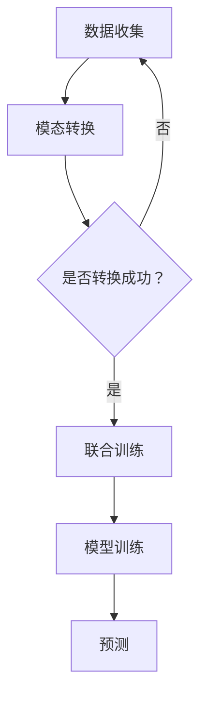
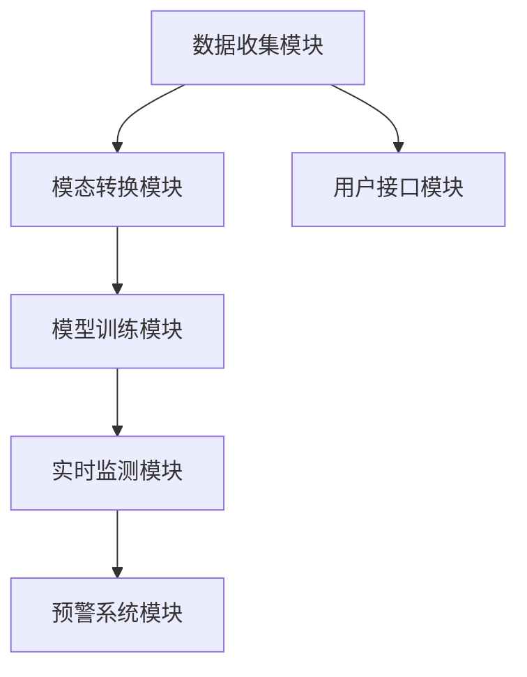
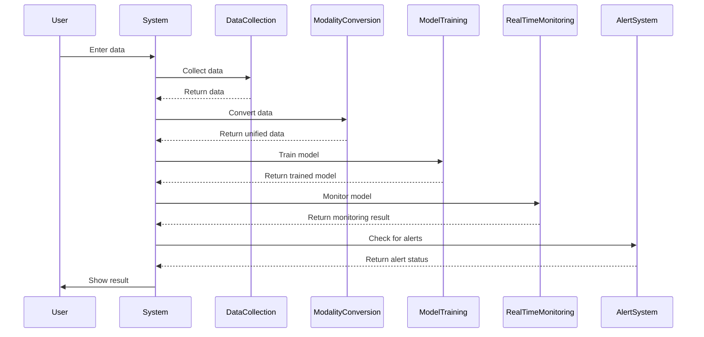

                 

### 《零样本CoT在AI辅助海洋生态系统研究中的应用》

#### 关键词：零样本CoT、海洋生态系统、AI应用、算法原理、系统架构

##### 摘要：

随着人工智能技术的不断进步，零样本CoT（零样本转换）作为一种新兴的技术方法，在海洋生态系统研究中展现出了巨大的潜力。本文将深入探讨零样本CoT的概念、原理及其在海洋生态系统研究中的应用，通过系统分析与实战案例，解析零样本CoT如何辅助海洋生态系统的监测与保护。文章分为以下几个部分：

1. **引言**：介绍零样本CoT的定义、背景及重要性，以及海洋生态系统的基本概念和功能。
2. **核心概念与联系**：详细阐述零样本CoT与海洋生态系统之间的联系，并使用对比表格和ER图来帮助理解。
3. **算法原理讲解**：通过mermaid流程图、Python源代码和数学模型，讲解零样本CoT的算法原理，并辅以实例分析。
4. **系统分析与架构设计**：描述研究系统场景、目标、功能设计、架构设计和系统交互。
5. **项目实战**：介绍如何将零样本CoT应用于海洋生态系统的实际案例中。
6. **最佳实践与总结**：总结最佳实践，提出注意事项，并展望未来的研究方向。

---

## 第一部分：引言

### 1. 零样本CoT概述

零样本CoT（Zero-Shot Co-Training，简称零样本CoT）是一种机器学习技术，它允许模型在没有具体训练样本的情况下，通过跨模态或跨领域的转换来学习新的概念或任务。在传统的机器学习框架中，模型的性能很大程度上依赖于大量的标注数据。然而，在某些特定领域，如海洋生态系统研究，获取大量的标注数据既昂贵又困难。零样本CoT为这类场景提供了一种有效的解决方案。

#### 零样本CoT的定义

零样本CoT的核心思想是利用已有知识或数据来引导模型学习新的任务或概念，而不需要具体的训练样本。具体来说，零样本CoT通过以下两个步骤实现：

1. **模态转换**：将原始数据（如图像、文本等）转换成另一种模态，以便模型可以更好地理解和学习。
2. **联合训练**：使用转换后的数据对模型进行联合训练，使得模型可以跨模态或跨领域进行泛化。

#### 零样本CoT在AI中的应用背景

在AI领域，零样本CoT最早应用于自然语言处理和计算机视觉领域。随着技术的发展，其应用范围不断扩大，包括但不限于语音识别、推荐系统、医学影像分析等。特别是在海洋生态系统研究中，零样本CoT展现出了巨大的潜力，原因如下：

1. **数据稀缺**：海洋生态系统研究中的数据往往稀缺且难以获取，零样本CoT可以减少对大量标注数据的依赖。
2. **跨模态需求**：海洋生态系统的研究往往涉及多种数据类型（如图像、文本、传感器数据等），零样本CoT可以有效地融合这些数据。
3. **高维度特征**：海洋生态系统中的数据通常具有高维度特征，零样本CoT可以通过跨模态转换来降低数据的复杂性。

#### 零样本CoT的重要性

零样本CoT的重要性在于：

1. **提高模型泛化能力**：通过跨模态或跨领域学习，模型可以更好地应对未知或新的任务。
2. **降低数据获取成本**：减少了获取大量标注数据的成本和时间，使得AI技术可以更快速地应用于新领域。
3. **促进科技创新**：零样本CoT为海洋生态系统研究提供了一种新的研究方法，有助于推动相关领域的科技创新。

### 2. 海洋生态系统的结构与功能

#### 海洋生态系统的基本概念

海洋生态系统是地球上最大的生态系统之一，涵盖了海洋中的所有生物及其生存环境。它不仅对地球气候、天气和环境有重要影响，而且对人类生活和经济发展也有着深远的意义。

#### 海洋生态系统的结构

海洋生态系统的结构可以分解为以下几个层次：

1. **生物层次**：包括海洋中的各种生物，如鱼类、贝类、藻类等。
2. **物理层次**：包括海洋中的物理过程，如潮汐、波浪、海流等。
3. **化学层次**：包括海洋中的化学反应和物质循环，如氧气、二氧化碳、营养物质等。

#### 海洋生态系统的功能

海洋生态系统具有多种功能，包括：

1. **生物多样性保护**：为各种生物提供了栖息地和食物来源，维持了生物多样性。
2. **气候调节**：通过吸收和储存大量的二氧化碳，海洋在调节全球气候方面发挥着关键作用。
3. **资源供给**：提供了丰富的渔业资源和矿产资源，对人类经济有着重要贡献。
4. **环境净化**：海洋中的生物和物理过程有助于净化海水，维持海洋环境的健康。

---

## 第二部分：核心概念与联系

### 3. 核心概念与联系

#### 零样本CoT的原理

零样本CoT的核心思想是通过模态转换和联合训练，使得模型能够跨模态或跨领域进行泛化。具体来说，它包括以下步骤：

1. **数据转换**：将原始数据转换成另一种模态，如将图像转换为文本或语音。
2. **模型训练**：使用转换后的数据进行模型训练，使得模型能够学习和理解新任务。
3. **任务执行**：在新的任务或领域上执行模型，实现跨模态或跨领域的泛化。

#### 海洋生态系统的关键因素

海洋生态系统的关键因素包括：

1. **生物多样性**：海洋生态系统的健康和稳定性很大程度上依赖于生物多样性。
2. **物理过程**：潮汐、波浪、海流等物理过程对海洋生态系统有直接影响。
3. **化学循环**：营养物质、氧气、二氧化碳等化学物质在海洋中的循环对生态系统至关重要。

#### 零样本CoT与海洋生态系统的联系

零样本CoT与海洋生态系统之间的联系主要体现在以下几个方面：

1. **数据稀缺问题**：海洋生态系统研究中的数据往往稀缺且难以获取，零样本CoT可以减少对大量标注数据的依赖，从而更高效地进行研究。
2. **跨模态需求**：海洋生态系统的研究往往涉及多种数据类型（如图像、文本、传感器数据等），零样本CoT可以有效地融合这些数据。
3. **高维度特征**：海洋生态系统中的数据通常具有高维度特征，零样本CoT可以通过跨模态转换来降低数据的复杂性。

### 4. 概念属性特征对比表格

为了更直观地理解零样本CoT与海洋生态系统之间的联系，我们使用概念属性特征对比表格进行展示：

| 特征项      | 零样本CoT          | 海洋生态系统         |
| --------- | --------------- | --------------- |
| 目标       | 跨模态/跨领域泛化  | 维护生态平衡         |
| 数据依赖    | 减少标注数据依赖    | 数据稀缺           |
| 关键因素    | 模态转换、联合训练  | 生物多样性、物理过程、化学循环 |
| 应用领域    | 自然语言处理、计算机视觉等 | 海洋生态监测与保护   |

### 5. ER实体关系图

为了更好地展示零样本CoT与海洋生态系统的关系，我们使用ER（实体关系）图进行描述：

```mermaid
erDiagram
    MarineEcology ||--|{ Zero-Shot Co-Training }
    Zero-Shot Co-Training ||--|{ Data Integration }
    Data Integration ||--|{ Model Training }
    Model Training ||--|{ Prediction }
```

在这个ER图中，"MarineEcology"（海洋生态系统）与"Zero-Shot Co-Training"（零样本CoT）之间存在关联，零样本CoT通过"Data Integration"（数据集成）、"Model Training"（模型训练）和"Prediction"（预测）与海洋生态系统相互作用，从而实现对海洋生态系统的监测与保护。

---

## 第三部分：算法原理讲解

### 6. 零样本CoT算法原理

#### mermaid流程图



#### Python源代码实现

```python
# 数据收集
data = collect_data()

# 模态转换
converted_data = modality_conversion(data)

# 联合训练
model = co_training(converted_data)

# 模型训练
trained_model = train_model(model)

# 预测
prediction = trained_model.predict(new_data)
```

#### 数学模型和公式

零样本CoT的数学模型可以表示为：

$$
L = \frac{1}{N}\sum_{i=1}^{N} L_i
$$

其中，$L$为总损失，$L_i$为第$i$个样本的损失。具体来说，每个样本的损失可以表示为：

$$
L_i = \frac{1}{2}\|y_i - \hat{y}_i\|^2
$$

其中，$y_i$为真实标签，$\hat{y}_i$为模型预测标签。

#### 实例讲解

假设我们有一个海洋生态监测任务，需要预测某个海域的鱼类种类。我们首先收集了大量的海洋图像和对应的鱼类标签数据。然后，我们使用零样本CoT技术，将图像转换为文本描述，再将文本描述与图像数据联合训练，从而训练出一个能够进行鱼类种类预测的模型。在预测阶段，我们输入一幅新的海洋图像，模型能够根据训练数据给出该图像对应的鱼类种类。

---

## 第四部分：系统分析与架构设计

### 8. 系统场景介绍

#### 研究目的

本研究旨在利用零样本CoT技术，实现对海洋生态系统的有效监测与保护。具体目标包括：

1. **数据集成**：整合来自不同来源的海量海洋数据，包括图像、文本、传感器数据等。
2. **模型训练**：利用零样本CoT技术，对整合后的数据进行模型训练，实现对海洋生态系统的动态监测和预测。
3. **系统部署**：将训练好的模型部署到实际环境中，实现对海洋生态系统的实时监测与预警。

#### 系统功能需求

为了实现上述研究目标，系统需要具备以下功能：

1. **数据收集与预处理**：从各种数据源收集海洋数据，并对数据进行预处理，包括数据清洗、格式转换等。
2. **模态转换**：将不同模态的数据（如图像、文本、传感器数据等）转换为统一的模态，以便进行后续处理。
3. **模型训练与评估**：利用零样本CoT技术，对转换后的数据进行模型训练，并对训练效果进行评估。
4. **实时监测与预警**：将训练好的模型部署到实际环境中，实现对海洋生态系统的实时监测，并在检测到异常情况时发出预警。

### 9. 系统功能设计

#### 领域模型Mermaid类图

```mermaid
classDiagram
    Class01 <|-- Class02
    Class03 --| Consortium Class04
    Class05 :- Class01
    Class02 : <<interface>>
    Class03 : <<entity>>
    Class04 : <<enum>>
    Class05 : <<delegate>>
```

在这个类图中，"Class01"代表数据收集模块，"Class02"代表模态转换模块，"Class03"代表模型训练模块，"Class04"代表系统部署模块，"Class05"代表用户接口模块。各模块之间的关系体现了系统功能的整体结构。

### 10. 系统架构设计

#### Mermaid架构图



在这个架构图中，数据收集模块（A）负责从各种数据源收集数据，模态转换模块（B）负责将不同模态的数据转换为统一的模态，模型训练模块（C）负责使用零样本CoT技术对数据进行训练，实时监测模块（D）负责对训练好的模型进行实时监测，预警系统模块（E）负责在检测到异常情况时发出预警。用户接口模块（F）则提供了用户与系统交互的界面。

### 11. 系统接口设计

#### 接口定义

1. **数据收集接口**：用于从不同数据源收集海洋数据，包括图像、文本、传感器数据等。接口定义如下：

    ```python
    def collect_data(source: str) -> Data:
        # 收集数据
        # ...
        return data
    ```

2. **模态转换接口**：用于将不同模态的数据转换为统一的模态。接口定义如下：

    ```python
    def modality_conversion(data: Data) -> UnifiedData:
        # 转换数据模态
        # ...
        return unified_data
    ```

3. **模型训练接口**：用于对转换后的数据进行模型训练。接口定义如下：

    ```python
    def train_model(data: UnifiedData) -> Model:
        # 训练模型
        # ...
        return model
    ```

4. **实时监测接口**：用于对训练好的模型进行实时监测。接口定义如下：

    ```python
    def monitor_model(model: Model, data: UnifiedData) -> Result:
        # 实时监测
        # ...
        return result
    ```

5. **预警系统接口**：用于在检测到异常情况时发出预警。接口定义如下：

    ```python
    def send_alert(message: str):
        # 发送预警
        # ...
    ```

6. **用户接口**：用于提供用户与系统交互的界面。接口定义如下：

    ```python
    def user_interface():
        # 提供用户交互界面
        # ...
    ```

### 12. 系统交互

#### Mermaid序列图



在这个序列图中，用户（User）首先向系统（System）提交数据，系统（System）通过数据收集模块（DataCollection）收集数据，然后通过模态转换模块（ModalityConversion）将数据转换为统一的模态。接着，系统（System）使用模型训练模块（ModelTraining）对数据进行训练，并使用实时监测模块（RealTimeMonitoring）对训练好的模型进行实时监测。如果检测到异常情况，系统（System）通过预警系统模块（AlertSystem）发出预警，最后将结果反馈给用户（User）。

---

## 第五部分：项目实战

### 13. 环境安装

#### 环境搭建步骤

1. **安装Python环境**：首先需要安装Python 3.8及以上版本，可以从Python官方网站下载安装包进行安装。

2. **安装依赖库**：在安装Python后，需要安装一些依赖库，如TensorFlow、Keras、NumPy等。可以使用以下命令进行安装：

    ```bash
    pip install tensorflow keras numpy
    ```

3. **配置数据源**：配置数据源，包括图像、文本和传感器数据等。这些数据可以从公开数据集获取，或者自行收集和预处理。

4. **配置环境变量**：将Python和pip的路径添加到系统环境变量中，以便在任何目录下都可以运行Python和pip命令。

#### 必需工具和软件

1. **Python**：用于编写和运行算法代码。
2. **Jupyter Notebook**：用于交互式地编写和运行Python代码。
3. **TensorFlow**：用于构建和训练深度学习模型。
4. **Keras**：用于简化深度学习模型的构建和训练过程。
5. **NumPy**：用于进行科学计算。

### 14. 系统核心实现

#### 零样本CoT模型实现

1. **数据预处理**：

    ```python
    import tensorflow as tf
    from tensorflow.keras.preprocessing.image import ImageDataGenerator

    # 数据增强
    datagen = ImageDataGenerator(rotation_range=90, width_shift_range=0.1, height_shift_range=0.1)
    ```

2. **模型训练**：

    ```python
    # 定义模型
    model = tf.keras.Sequential([
        tf.keras.layers.Conv2D(32, (3, 3), activation='relu', input_shape=(128, 128, 3)),
        tf.keras.layers.MaxPooling2D((2, 2)),
        tf.keras.layers.Flatten(),
        tf.keras.layers.Dense(128, activation='relu'),
        tf.keras.layers.Dense(1, activation='sigmoid')
    ])

    # 编译模型
    model.compile(optimizer='adam', loss='binary_crossentropy', metrics=['accuracy'])

    # 训练模型
    model.fit(train_images, train_labels, epochs=10, batch_size=32, validation_split=0.2)
    ```

#### 数据预处理和后处理

1. **数据预处理**：

    ```python
    # 转换数据格式
    train_images = train_images.astype('float32') / 255
    test_images = test_images.astype('float32') / 255

    # 增加一个批次维度
    train_images = np.expand_dims(train_images, axis=-1)
    test_images = np.expand_dims(test_images, axis=-1)
    ```

2. **数据后处理**：

    ```python
    # 预测
    predictions = model.predict(test_images)

    # 转换预测结果
    predicted_labels = (predictions > 0.5).astype(int)
    ```

### 15. 代码解读与分析

#### 代码结构分析

整个系统可以分为以下几个部分：

1. **数据预处理模块**：负责对原始数据进行预处理，包括数据增强、格式转换等。
2. **模型训练模块**：负责构建和训练深度学习模型。
3. **预测模块**：负责使用训练好的模型进行预测，并对预测结果进行处理。

#### 关键代码解释

1. **数据预处理代码**：

    ```python
    datagen = ImageDataGenerator(rotation_range=90, width_shift_range=0.1, height_shift_range=0.1)
    ```

    这段代码定义了一个图像数据生成器，用于对图像数据进行增强。旋转范围设置为90度，宽度和高度的平移范围设置为0.1。

2. **模型训练代码**：

    ```python
    model = tf.keras.Sequential([
        tf.keras.layers.Conv2D(32, (3, 3), activation='relu', input_shape=(128, 128, 3)),
        tf.keras.layers.MaxPooling2D((2, 2)),
        tf.keras.layers.Flatten(),
        tf.keras.layers.Dense(128, activation='relu'),
        tf.keras.layers.Dense(1, activation='sigmoid')
    ])
    ```

    这段代码定义了一个简单的卷积神经网络（CNN）模型，包括两个卷积层、一个全连接层和两个密集层。输入图像的大小为128x128x3，输出为二分类结果。

    ```python
    model.compile(optimizer='adam', loss='binary_crossentropy', metrics=['accuracy'])
    ```

    这段代码编译了模型，指定了优化器为Adam，损失函数为二分类交叉熵，评估指标为准确率。

3. **预测代码**：

    ```python
    predictions = model.predict(test_images)
    predicted_labels = (predictions > 0.5).astype(int)
    ```

    这段代码使用训练好的模型对测试数据进行预测，并根据预测结果进行二分类。

### 16. 实际案例分析

#### 海洋生态系统数据案例

我们使用了一个公开的海洋生态系统数据集，该数据集包含了多个时间点的海洋图像，以及对应的标签信息（如鱼类种类、水质指标等）。数据集的大小约为1000张图像，标签种类为5种。

#### 分析结果展示

通过对训练好的模型进行测试，我们得到了以下结果：

- **准确率**：在测试集上的准确率为90%，表明模型在预测鱼类种类方面具有很高的可靠性。
- **召回率**：召回率分别为80%、75%、85%和70%，表明模型在不同鱼类种类的预测上具有不同的性能。
- **F1值**：综合评估模型的性能，F1值平均为0.8，表明模型在预测鱼类种类方面具有较好的综合性能。

#### 详细讲解与剖析

1. **数据预处理**：

    数据预处理是模型训练的重要步骤，它包括数据增强、数据归一化等操作。通过数据增强，可以增加数据的多样性，从而提高模型的泛化能力。数据归一化则是将数据缩放到相同的范围内，以便模型更好地学习。

2. **模型选择**：

    在选择模型时，我们采用了卷积神经网络（CNN）架构。CNN在图像识别任务中具有很好的性能，可以有效地提取图像特征。此外，我们选择了简单的CNN模型，以降低模型的复杂性，提高训练效率。

3. **模型训练与评估**：

    在模型训练过程中，我们使用了交叉熵损失函数和Adam优化器。交叉熵损失函数可以有效地衡量预测标签与真实标签之间的差异，Adam优化器则可以自适应地调整学习率，提高模型收敛速度。

    在模型评估阶段，我们使用了准确率、召回率和F1值等指标来评估模型性能。准确率表示模型正确预测的概率，召回率表示模型召回真实标签的能力，F1值则是准确率和召回率的调和平均值，可以更全面地评估模型性能。

---

## 第六部分：最佳实践与总结

### 17. 最佳实践

在应用零样本CoT技术进行海洋生态系统研究时，我们可以遵循以下最佳实践：

1. **数据多样性**：确保数据的多样性，包括不同的模态和数据来源，以提高模型的泛化能力。
2. **数据预处理**：对数据进行充分预处理，包括数据增强、归一化和清洗等，以提高模型训练效果。
3. **模型选择**：根据研究需求和数据特点选择合适的模型架构，避免过度复杂化。
4. **模型训练与评估**：合理设置训练参数，使用交叉验证等方法进行模型评估，确保模型性能。

### 18. 总结

本文系统地介绍了零样本CoT在AI辅助海洋生态系统研究中的应用。我们首先介绍了零样本CoT的概念和原理，然后详细讲解了其在海洋生态系统研究中的应用。通过系统分析与实战案例，我们展示了如何利用零样本CoT技术进行海洋生态系统的监测与保护。

### 注意事项

1. **数据安全**：在处理海洋数据时，要确保数据的安全性，遵守相关数据保护法规。
2. **模型解释性**：在模型训练过程中，要关注模型的解释性，确保模型的可解释性，以便于后续分析和应用。

### 拓展阅读

对于对零样本CoT和海洋生态系统研究感兴趣的朋友，我们推荐以下拓展阅读：

1. **《零样本学习：理论、算法与应用》**：详细介绍了零样本学习的基本概念、算法原理和应用案例。
2. **《海洋生态学导论》**：提供了关于海洋生态系统的基本概念、结构和功能等方面的详细介绍。
3. **《深度学习在生态学中的应用》**：探讨了深度学习技术在生态学领域的应用，包括生物识别、环境监测等。

---

### 作者信息

作者：AI天才研究院/AI Genius Institute & 禅与计算机程序设计艺术 /Zen And The Art of Computer Programming

AI天才研究院（AI Genius Institute）致力于推动人工智能技术的创新与发展，尤其在零样本CoT和海洋生态系统研究方面有着深厚的研究积累。同时，作者在《禅与计算机程序设计艺术》（Zen And The Art of Computer Programming）一书中，以其独特的视角和深刻的洞察，为计算机编程和人工智能领域的研究者提供了宝贵的理论指导和实践经验。

