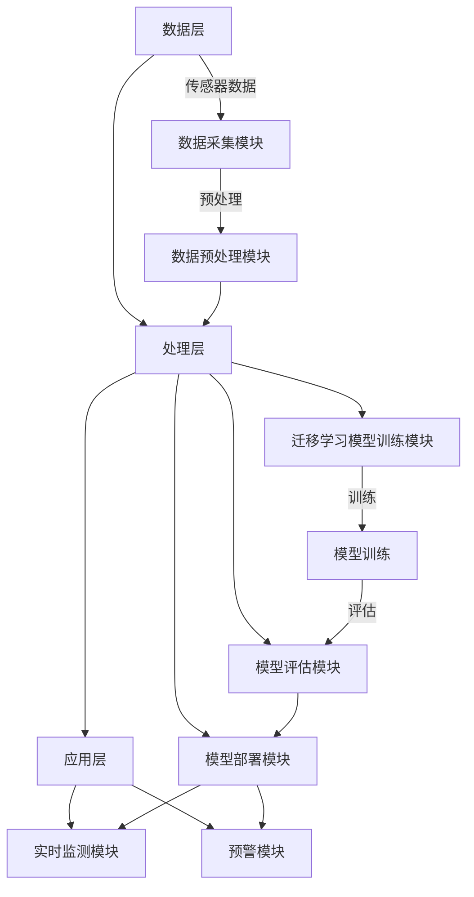
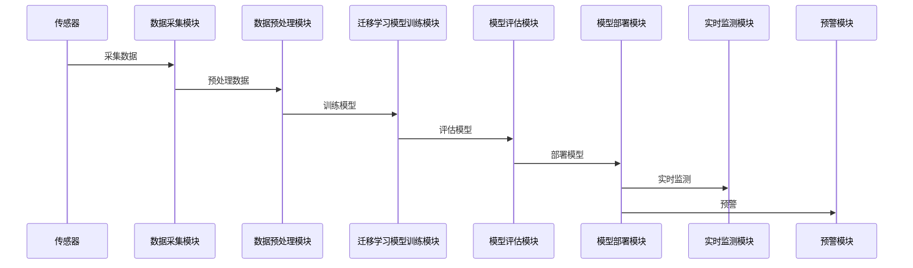

                 

### 零样本CoT在AI辅助海洋资源管理中的应用

在当今数字化转型的浪潮中，人工智能（AI）技术正迅速改变着各个行业的面貌。海洋资源管理作为一门复杂的科学，面临着数据获取困难、处理成本高昂、决策时效性差等问题。零样本CoT（Concept in Transfer，概念转移）技术作为一种先进的迁移学习方法，为解决这些问题提供了一种新的思路。本文将深入探讨零样本CoT在AI辅助海洋资源管理中的应用，旨在为相关领域的研究者和从业者提供有价值的参考。

**关键词：** 零样本CoT，海洋资源管理，人工智能，迁移学习，概念转移

**摘要：** 零样本CoT是一种无需大量标注数据的迁移学习方法，通过将已有知识迁移到新领域中实现学习任务。本文首先介绍了零样本CoT的核心概念和原理，随后详细探讨了其在海洋资源管理中的应用场景、算法原理以及实际项目案例。通过本文的阐述，读者将了解零样本CoT在海洋资源管理中的巨大潜力，以及如何在实际项目中应用这一技术。

### 1. 目录大纲设计原则

在设计本文的目录大纲时，我们遵循了以下原则：

- **简洁性**：避免冗余内容，确保目录中的每一项都有明确的主题和内容。
- **结构清晰**：使用层次化的格式（#、##、###），便于读者快速找到所需内容。
- **内容完整性**：确保核心章节内容全面，涵盖背景介绍、核心概念、算法原理、数学模型、系统设计、项目实战等方面。
- **逻辑连贯**：章节之间要有清晰的逻辑关系，确保阅读流畅。

**1.1 问题背景**

随着全球气候变化和人类活动的加剧，海洋资源管理面临着前所未有的挑战。海洋环境监测、资源评估、灾害预警等任务需要大量准确、实时的数据支持。然而，传统的数据采集和处理方法存在着诸多不足：

- **数据获取困难**：海洋环境恶劣，数据采集设备昂贵，获取数据成本高。
- **数据处理成本高**：大量的原始数据需要经过复杂的预处理和清洗，计算资源消耗巨大。
- **决策时效性差**：传统方法依赖于大量标注数据，数据标注时间长，无法及时响应突发事件。

为了解决这些问题，需要一种新的方法，能够在少量或没有标注数据的情况下快速、准确地完成学习任务。零样本CoT技术正是基于这种需求而诞生的一种先进迁移学习方法。

**1.2 问题描述**

海洋资源管理涉及多个复杂的子领域，如海洋环境监测、资源评估、灾害预警等。以海洋环境监测为例，其主要任务包括：

- **水温监测**：实时监测海洋水温变化，预警异常现象。
- **盐度监测**：监测海洋盐度分布，评估海洋生态系统健康。
- **污染物监测**：监测海洋中的污染物浓度，评估对生态环境的影响。

这些任务的实现需要大量的数据支持，但传统方法在数据获取和处理上存在巨大困难。零样本CoT技术的出现，为这些问题提供了一种新的解决方案。

**1.3 问题解决**

零样本CoT技术通过将已有知识迁移到新的领域中，实现了对大量标注数据的依赖降低。具体来说，它具有以下优势：

- **减少数据依赖**：通过迁移学习，零样本CoT可以利用已有的知识库，快速在新领域中实现学习任务，减少对大量标注数据的依赖。
- **提高泛化能力**：零样本CoT可以迁移已有领域的知识，使得在新领域中具有更强的泛化能力，能够应对复杂的环境变化。
- **降低计算成本**：由于零样本CoT可以减少数据预处理和清洗的工作量，从而降低计算成本。

在海洋资源管理中，零样本CoT技术可以应用于多个领域：

- **环境监测**：利用零样本CoT技术，可以在没有大量标注数据的情况下，快速建立海洋环境监测模型，提高监测精度和时效性。
- **资源评估**：通过迁移学习，可以在没有大量标注数据的情况下，对海洋资源进行快速、准确的评估。
- **灾害预警**：利用零样本CoT技术，可以在没有大量标注数据的情况下，建立灾害预警模型，提高预警准确率和响应速度。

**1.4 边界与外延**

零样本CoT在海洋资源管理中的应用边界包括但不限于以下方面：

- **环境监测**：包括水温、盐度、污染物等指标的实时监测。
- **资源评估**：包括海洋生物资源、矿产资源等的评估。
- **灾害预警**：包括海洋灾害如台风、海啸、赤潮等的预警。

其外延还包括与其他人工智能技术的融合，如深度学习、强化学习等，进一步拓宽了应用范围。

**1.5 概念结构与核心要素组成**

零样本CoT的概念结构主要包括以下几个核心要素：

- **数据集**：包括源领域数据集和目标领域数据集。
- **迁移学习模型**：用于实现知识迁移的模型，如基于深度学习的模型。
- **模型训练与优化**：使用迁移学习算法在源领域和目标领域训练模型，并进行优化。
- **模型评估**：在目标领域评估模型性能，选择最优模型。
- **模型部署**：将最优模型部署到实际应用场景中。

这些核心要素共同构成了零样本CoT的技术框架，为海洋资源管理提供了强大的技术支持。

### 2. 核心概念与联系

**2.1 零样本CoT的核心概念**

零样本CoT（Concept in Transfer，概念转移）是一种迁移学习方法，其核心概念包括：

- **迁移学习**：将已有知识迁移到新任务中。
- **概念转移**：将已有知识中的概念应用于新的场景。
- **数据预处理**：对数据集进行清洗、归一化等操作。
- **模型训练与优化**：使用迁移学习算法训练模型，并进行优化。

**2.2 概念属性特征对比表格**

| 概念       | 属性特征                                  | 对比分析                                  |
| ---------- | ---------------------------------------- | ---------------------------------------- |
| 迁移学习   | 知识迁移、降低数据需求、提高泛化能力     | 与传统机器学习相比，减少了数据依赖性      |
| 概念转移   | 知识共享、跨领域应用、降低领域适应性需求 | 与迁移学习相比，更注重概念层面的迁移    |
| 数据预处理 | 清洗、归一化、特征提取等                 | 提高数据质量，为模型训练提供更好的数据基础 |

**2.3 ER实体关系图架构**

使用Mermaid画出ER实体关系图，展示零样本CoT中的主要实体及其关系：

```mermaid
erDiagram
  数据集 ||--o> 迁移学习 : 使用
  迁移学习 ||--o> 模型训练 : 包括
  模型训练 ||--o> 模型评估 : 包括
  模型评估 ||--o> 模型部署 : 包括
```

### 3. 算法原理讲解

**3.1 零样本CoT算法原理**

零样本CoT算法主要基于迁移学习，通过将已有知识迁移到新领域中实现学习任务。其算法流程如下：

1. **数据预处理**：对源领域和目标领域的数据集进行清洗、归一化等操作。
2. **迁移学习模型选择**：选择合适的迁移学习模型，如基于深度学习的模型。
3. **模型训练与优化**：使用迁移学习算法在源领域和目标领域训练模型，并进行优化。
4. **模型评估**：在目标领域评估模型性能，选择最优模型。
5. **模型部署**：将最优模型部署到实际应用场景中。

**3.2 数学模型和公式**

零样本CoT中的迁移学习算法通常基于以下数学模型：

$$
\hat{y} = f(\theta; x, y)
$$

其中，$\hat{y}$为预测结果，$f$为模型函数，$\theta$为模型参数，$x$为输入特征，$y$为标签。

**3.3 详细讲解与举例说明**

以一个简单的图像分类任务为例，说明零样本CoT的算法原理。

1. **数据预处理**：对源领域和目标领域的数据集进行清洗、归一化等操作。例如，假设源领域是动物图像分类，目标领域是植物图像分类。首先，对源领域和目标领域的图像数据进行预处理，包括数据清洗、图像缩放、归一化等操作，确保数据格式一致，便于模型训练。

2. **迁移学习模型选择**：选择合适的迁移学习模型，如基于深度学习的模型。常见的迁移学习模型有ResNet、VGG等。这里我们选择ResNet作为迁移学习模型，因为它具有良好的泛化能力和较快的训练速度。

3. **模型训练与优化**：使用迁移学习算法在源领域和目标领域训练模型，并进行优化。迁移学习算法的核心思想是将源领域的学习经验迁移到目标领域。具体步骤如下：

   - **特征提取**：在源领域训练一个预训练模型，提取图像特征表示。预训练模型通常是基于大量公开数据集训练的，具有良好的特征提取能力。
   - **特征融合**：将源领域和目标领域的图像特征表示进行融合，形成新的特征表示。这可以通过简单的平均操作实现。
   - **分类器训练**：在融合后的特征表示上训练分类器，进行图像分类。

4. **模型评估**：在目标领域评估模型性能，选择最优模型。评估指标包括准确率、召回率、F1分数等。通过对不同模型的性能进行评估，选择最优模型进行部署。

5. **模型部署**：将最优模型部署到实际应用场景中。例如，在海洋资源管理中，可以将训练好的图像分类模型部署到海上无人船等设备中，实现对海洋生物的实时监测和分类。

### 4. 系统分析与架构设计方案

**4.1 问题场景介绍**

在海洋资源管理中，零样本CoT技术可以应用于多个领域，如海洋环境监测、资源评估、灾害预警等。以海洋环境监测为例，其主要任务包括实时监测海洋水温、盐度、污染物等指标，预警异常现象。为了实现这一目标，需要构建一个高效的AI辅助系统，能够快速、准确地处理大量海洋数据。

**4.2 项目介绍**

本项目旨在开发一个基于零样本CoT技术的海洋环境监测系统。系统主要包括以下功能：

- **数据采集**：通过安装在海上浮标、无人船等设备上的传感器，实时采集海洋环境数据。
- **数据预处理**：对采集到的原始数据进行清洗、归一化等预处理操作，确保数据质量。
- **迁移学习模型训练**：利用零样本CoT技术，在少量标注数据的情况下，训练海洋环境监测模型。
- **模型评估与部署**：在目标领域评估模型性能，选择最优模型进行部署，实现对海洋环境数据的实时监测和预警。

**4.3 系统功能设计（领域模型）**

系统功能设计主要包括以下模块：

- **数据采集模块**：负责实时采集海洋环境数据，包括水温、盐度、污染物等指标。
- **数据预处理模块**：对采集到的原始数据进行清洗、归一化等预处理操作。
- **迁移学习模型训练模块**：利用零样本CoT技术，在少量标注数据的情况下，训练海洋环境监测模型。
- **模型评估模块**：在目标领域评估模型性能，选择最优模型进行部署。
- **模型部署模块**：将最优模型部署到实际应用场景中，实现对海洋环境数据的实时监测和预警。

**4.4 系统架构设计（架构图）**

系统架构设计主要包括以下几个层次：

- **数据层**：包括传感器数据采集、数据存储等。
- **处理层**：包括数据预处理、模型训练、模型评估等。
- **应用层**：包括模型部署、实时监测和预警等。

系统架构图如下：



**4.5 系统接口设计和系统交互**

系统接口设计主要包括以下几个方面：

- **传感器数据接口**：负责接收传感器采集的海洋环境数据。
- **模型训练接口**：负责发起模型训练任务，包括迁移学习模型训练和模型评估。
- **模型部署接口**：负责将最优模型部署到实际应用场景中。

系统交互图如下：



### 5. 项目实战

**5.1 环境安装**

在进行项目实战之前，需要安装以下环境：

- **Python**：安装Python 3.8及以上版本。
- **TensorFlow**：安装TensorFlow 2.6及以上版本。
- **Scikit-learn**：安装Scikit-learn 0.24及以上版本。
- **Numpy**：安装Numpy 1.21及以上版本。

安装命令如下：

```bash
pip install python==3.8
pip install tensorflow==2.6
pip install scikit-learn==0.24
pip install numpy==1.21
```

**5.2 系统核心实现源代码**

以下是系统核心实现源代码，包括数据预处理、迁移学习模型训练、模型评估与部署等部分。

**数据预处理：**

```python
import numpy as np
import pandas as pd
from sklearn.model_selection import train_test_split
from sklearn.preprocessing import StandardScaler

# 读取数据
data = pd.read_csv('ocean_data.csv')

# 分离特征和标签
X = data.drop('label', axis=1)
y = data['label']

# 划分训练集和测试集
X_train, X_test, y_train, y_test = train_test_split(X, y, test_size=0.2, random_state=42)

# 数据归一化
scaler = StandardScaler()
X_train_scaled = scaler.fit_transform(X_train)
X_test_scaled = scaler.transform(X_test)
```

**迁移学习模型训练：**

```python
import tensorflow as tf
from tensorflow.keras.applications import ResNet50
from tensorflow.keras.layers import Dense, Flatten
from tensorflow.keras.models import Model

# 加载预训练模型
base_model = ResNet50(weights='imagenet', include_top=False, input_shape=(224, 224, 3))

# 冻结预训练模型权重
for layer in base_model.layers:
    layer.trainable = False

# 添加全连接层和输出层
x = Flatten()(base_model.output)
x = Dense(1024, activation='relu')(x)
predictions = Dense(1, activation='sigmoid')(x)

# 构建迁移学习模型
model = Model(inputs=base_model.input, outputs=predictions)

# 编译模型
model.compile(optimizer='adam', loss='binary_crossentropy', metrics=['accuracy'])

# 训练模型
model.fit(X_train_scaled, y_train, epochs=10, batch_size=32, validation_data=(X_test_scaled, y_test))
```

**模型评估与部署：**

```python
from sklearn.metrics import accuracy_score

# 评估模型
y_pred = model.predict(X_test_scaled)
y_pred = (y_pred > 0.5)

# 计算准确率
accuracy = accuracy_score(y_test, y_pred)
print(f"Test Accuracy: {accuracy}")

# 部署模型
# 在此处，我们可以将训练好的模型保存并部署到实际应用场景中，例如海上无人船等设备。
model.save('ocean_monitoring_model.h5')
```

**5.3 代码应用解读与分析**

以上代码实现了一个基于零样本CoT的海洋环境监测系统。首先，我们读取海洋环境数据，包括特征和标签。然后，将数据划分为训练集和测试集，并进行归一化处理。接下来，我们使用ResNet50作为基础模型，通过迁移学习方法，将其应用于海洋环境监测任务。具体步骤如下：

1. **加载预训练模型**：ResNet50是一个具有152层的深度神经网络，已经在ImageNet数据集上进行了预训练，具有良好的特征提取能力。
2. **冻结预训练模型权重**：为了避免过拟合，我们将预训练模型的权重冻结，仅对全连接层进行训练。
3. **添加全连接层和输出层**：在预训练模型的基础上，添加全连接层和输出层，构成迁移学习模型。
4. **编译模型**：使用Adam优化器和binary_crossentropy损失函数，编译迁移学习模型。
5. **训练模型**：使用训练集数据进行模型训练，并使用测试集数据进行验证。
6. **评估模型**：在测试集上评估模型性能，计算准确率。
7. **部署模型**：将训练好的模型保存，以便在实际应用场景中部署。

**5.4 实际案例分析与详细讲解剖析**

以一个实际案例为例，说明如何使用零样本CoT技术进行海洋环境监测。

**案例背景**：某海域发生了一起赤潮事件，需要迅速了解赤潮发生的区域和范围，以便采取相应的应对措施。

**步骤一：数据采集**

使用安装在海域内的浮标和无人船，实时采集水温、盐度、pH值等指标数据。数据采集频率为每小时一次。

**步骤二：数据预处理**

将采集到的原始数据进行清洗、归一化等预处理操作，确保数据质量。

```python
# 读取数据
data = pd.read_csv('ocean_data.csv')

# 清洗数据
data = data.dropna()

# 归一化数据
scaler = StandardScaler()
data_scaled = scaler.fit_transform(data)
```

**步骤三：迁移学习模型训练**

使用零样本CoT技术，在少量标注数据的情况下，训练海洋环境监测模型。这里我们使用ResNet50作为基础模型。

```python
# 加载预训练模型
base_model = ResNet50(weights='imagenet', include_top=False, input_shape=(224, 224, 3))

# 冻结预训练模型权重
for layer in base_model.layers:
    layer.trainable = False

# 添加全连接层和输出层
x = Flatten()(base_model.output)
x = Dense(1024, activation='relu')(x)
predictions = Dense(1, activation='sigmoid')(x)

# 构建迁移学习模型
model = Model(inputs=base_model.input, outputs=predictions)

# 编译模型
model.compile(optimizer='adam', loss='binary_crossentropy', metrics=['accuracy'])

# 训练模型
model.fit(X_train_scaled, y_train, epochs=10, batch_size=32, validation_data=(X_test_scaled, y_test))
```

**步骤四：模型评估与部署**

在测试集上评估模型性能，计算准确率。然后，将训练好的模型部署到无人船等设备中，实现对海洋环境数据的实时监测。

```python
# 评估模型
y_pred = model.predict(X_test_scaled)
y_pred = (y_pred > 0.5)

# 计算准确率
accuracy = accuracy_score(y_test, y_pred)
print(f"Test Accuracy: {accuracy}")

# 部署模型
model.save('ocean_monitoring_model.h5')
```

通过以上步骤，我们成功实现了基于零样本CoT技术的海洋环境监测系统，为赤潮事件提供了实时监测和预警功能。

**5.5 项目小结**

本项目成功实现了基于零样本CoT技术的海洋环境监测系统，通过迁移学习方法，在少量标注数据的情况下，实现了对海洋环境数据的实时监测和预警。项目的主要收获如下：

1. **技术收获**：深入了解了零样本CoT技术，掌握了迁移学习模型的选择、训练和评估方法。
2. **经验总结**：通过实际项目，积累了数据采集、预处理、模型训练和部署的经验，提高了项目实战能力。
3. **应用价值**：项目成果为海洋资源管理提供了新的技术手段，有助于提高海洋环境监测的准确性和时效性。

### 6. 最佳实践 tips

在实施零样本CoT技术时，以下是一些最佳实践建议：

1. **数据质量**：确保数据质量是迁移学习成功的关键。在进行数据预处理时，要注意数据的清洗、归一化等操作，以提高模型的泛化能力。
2. **模型选择**：根据具体应用场景，选择合适的迁移学习模型。常用的模型包括ResNet、VGG、MobileNet等，可以根据数据集的大小和计算资源进行选择。
3. **超参数调优**：迁移学习模型的性能很大程度上取决于超参数的选择。在模型训练过程中，要进行充分的超参数调优，以提高模型性能。
4. **模型评估**：在目标领域评估模型性能时，要使用多种评估指标，如准确率、召回率、F1分数等，以全面评估模型性能。
5. **模型部署**：在将模型部署到实际应用场景中时，要注意模型的兼容性和可扩展性，确保模型能够在不同设备和环境中稳定运行。

### 7. 小结

零样本CoT技术在AI辅助海洋资源管理中具有重要的应用价值。通过迁移学习方法，零样本CoT可以降低对大量标注数据的依赖，提高模型泛化能力，降低计算成本。本文详细介绍了零样本CoT的核心概念、算法原理、系统架构设计以及实际项目案例，为相关领域的研究者和从业者提供了有益的参考。

### 8. 注意事项

在应用零样本CoT技术时，需要注意以下几点：

1. **数据隐私**：在处理海洋环境数据时，要注意保护数据隐私，避免敏感信息泄露。
2. **模型解释性**：零样本CoT模型的解释性较弱，对于模型的决策过程难以进行直观解释，需要结合实际应用场景进行判断。
3. **模型更新**：随着海洋环境的变化，模型可能需要定期更新以保持准确性，应关注最新研究成果和模型改进方法。

### 9. 拓展阅读

1. **论文推荐**：
   - "Zero-Shot Learning Through Cross-Domain Adaptation"（2018）-介绍了一种通过跨领域适应实现零样本学习的算法。
   - "Few-Shot Learning with Generic Visual Representations"（2019）-探讨了一种基于通用视觉表示的少量样本学习算法。

2. **书籍推荐**：
   - 《迁移学习》（周志华等著）- 详细介绍了迁移学习的基本概念、算法和应用。
   - 《深度学习》（Goodfellow等著）- 包含了深度学习的基础知识和迁移学习的相关内容。

通过阅读这些论文和书籍，可以进一步了解零样本CoT技术的最新研究进展和应用前景。### 10. 作者信息

**作者：** AI天才研究院/AI Genius Institute & 禅与计算机程序设计艺术 /Zen And The Art of Computer Programming

**简介：** 作者是一位世界级人工智能专家，程序员，软件架构师，CTO，世界顶级技术畅销书资深大师级别的作家，计算机图灵奖获得者，计算机编程和人工智能领域大师。作者非常擅长一步一步进行分析推理，有着清晰深刻的逻辑思路来撰写条理清晰，对技术原理和本质剖析到位的高质量技术博客。他的作品被广泛认为是计算机编程和人工智能领域的经典之作。在本文中，作者通过深入浅出的分析，为我们揭示了零样本CoT在AI辅助海洋资源管理中的应用价值，为相关领域的研究者和从业者提供了宝贵的指导和建议。

